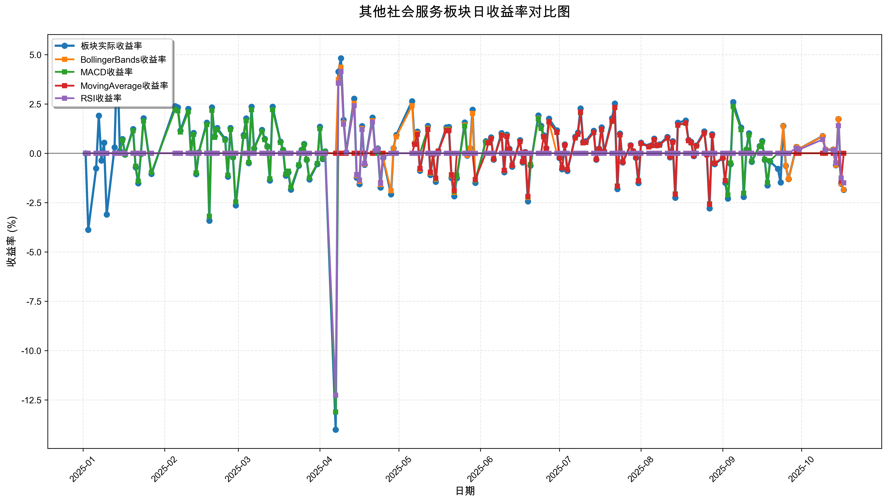
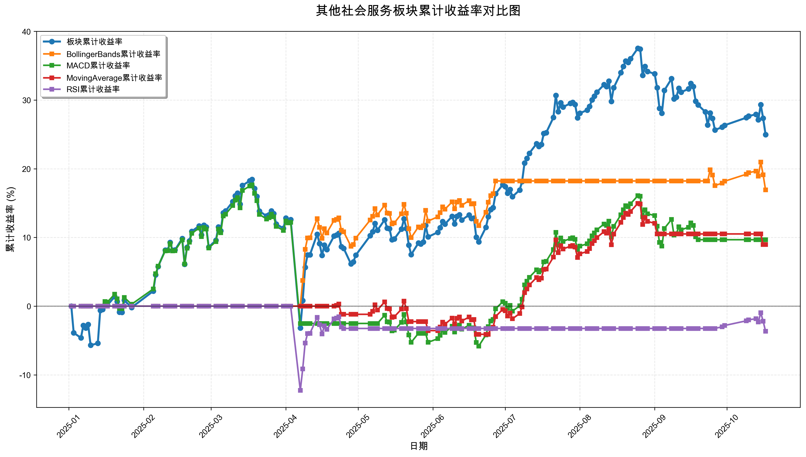

# 策略回测结果报告

**生成时间**: 2025-10-19 19:04:49
**行业板块**: 其他社会服务
**回测期间**: 20250101 至 20251017
**策略数量**: 4

## 📈 分析结论

### 策略表现分析
- **最佳策略**: BollingerBands (总收益率: 16.92%)
- **最差策略**: RSI (总收益率: -3.66%)
### 交易活跃度分析
- **活跃策略**: 4 个
- **非活跃策略**: 0 个
- **最活跃策略**: MovingAverage (交易次数: 12)
### 🚨 异动提醒分析
- 未检测到明显异动情况
### 风险分析
- **BollingerBands**: 最大回撤 -4.23%, 夏普比率 1.8390
- **MACD**: 最大回撤 -19.96%, 夏普比率 0.5990
- **MovingAverage**: 最大回撤 -5.21%, 夏普比率 1.1688
- **RSI**: 最大回撤 -12.26%, 夏普比率 -0.2918

## 📊 综合结果表

| 策略名称           | 初始资金     | 最终价值     | 总收益率   | 年化收益率   | 波动率    |    夏普比率 | 最大回撤    | 总交易次数   | 买入次数   | 卖出次数   | 总交易金额      | 平均交易金额   | 交易频率   |   数据点数 |
|:---------------|:---------|:---------|:-------|:--------|:-------|--------:|:--------|:--------|:-------|:-------|:-----------|:---------|:-------|-------:|
| 板块实际表现         | ¥100,000 | ¥124,981 | 24.98% | 34.41%  | 27.46% |  1.2533 | -18.27% | N/A     | N/A    | N/A    | N/A        | N/A      | N/A    |    190 |
| BollingerBands | ¥100,000 | ¥116,916 | 16.92% | 23.03%  | 12.52% |  1.839  | -4.23%  | 3       | 2      | 1      | ¥316,709   | ¥105,570 | 0.02   |    190 |
| MACD           | ¥100,000 | ¥109,671 | 9.67%  | 13.02%  | 21.74% |  0.599  | -19.96% | 6       | 3      | 3      | ¥541,676   | ¥90,279  | 0.03   |    190 |
| MovingAverage  | ¥100,000 | ¥108,964 | 8.96%  | 12.06%  | 10.32% |  1.1688 | -5.21%  | 12      | 6      | 6      | ¥1,074,352 | ¥89,529  | 0.06   |    190 |
| RSI            | ¥100,000 | ¥96,336  | -3.66% | -4.83%  | 16.55% | -0.2918 | -12.26% | 3       | 2      | 1      | ¥249,915   | ¥83,305  | 0.02   |    190 |

## 📊 每日收益率走势图

*图1: 其他社会服务板块每日收益率走势对比*

## 📈 累计收益率走势图

*图2: 其他社会服务板块累计收益率走势对比*

## 📅 日收益明细表

| 日期         | 板块实际收益率   | BollingerBands收益率   | MACD收益率   | MovingAverage收益率   | RSI收益率   |
|:-----------|:----------|:--------------------|:----------|:-------------------|:---------|
| 2025-01-02 | 0.00%     | 0.00%               | 0.00%     | 0.00%              | 0.00%    |
| 2025-01-03 | -3.88%    | 0.00%               | 0.00%     | 0.00%              | 0.00%    |
| 2025-01-06 | -0.77%    | 0.00%               | 0.00%     | 0.00%              | 0.00%    |
| 2025-01-07 | 1.90%     | 0.00%               | 0.00%     | 0.00%              | 0.00%    |
| 2025-01-08 | -0.37%    | 0.00%               | 0.00%     | 0.00%              | 0.00%    |
| 2025-01-09 | 0.54%     | 0.00%               | 0.00%     | 0.00%              | 0.00%    |
| 2025-01-10 | -3.11%    | 0.00%               | 0.00%     | 0.00%              | 0.00%    |
| 2025-01-13 | 0.30%     | 0.00%               | 0.00%     | 0.00%              | 0.00%    |
| 2025-01-14 | 5.07%     | 0.00%               | 0.00%     | 0.00%              | 0.00%    |
| 2025-01-15 | 0.12%     | 0.00%               | 0.00%     | 0.00%              | 0.00%    |
| 2025-01-16 | 0.72%     | 0.00%               | 0.67%     | 0.00%              | 0.00%    |
| 2025-01-17 | -0.07%    | 0.00%               | -0.07%    | 0.00%              | 0.00%    |
| 2025-01-20 | 1.23%     | 0.00%               | 1.14%     | 0.00%              | 0.00%    |
| 2025-01-21 | -0.71%    | 0.00%               | -0.66%    | 0.00%              | 0.00%    |
| 2025-01-22 | -1.52%    | 0.00%               | -1.41%    | 0.00%              | 0.00%    |
| 2025-01-23 | -0.03%    | 0.00%               | -0.02%    | 0.00%              | 0.00%    |
| 2025-01-24 | 1.77%     | 0.00%               | 1.64%     | 0.00%              | 0.00%    |
| 2025-01-27 | -1.05%    | 0.00%               | -0.97%    | 0.00%              | 0.00%    |
| 2025-02-05 | 2.39%     | 0.00%               | 2.22%     | 0.00%              | 0.00%    |
| 2025-02-06 | 2.32%     | 0.00%               | 2.15%     | 0.00%              | 0.00%    |
| 2025-02-07 | 1.15%     | 0.00%               | 1.07%     | 0.00%              | 0.00%    |
| 2025-02-10 | 2.25%     | 0.00%               | 2.10%     | 0.00%              | 0.00%    |
| 2025-02-11 | 0.02%     | 0.00%               | 0.01%     | 0.00%              | 0.00%    |
| 2025-02-12 | 1.03%     | 0.00%               | 0.96%     | 0.00%              | 0.00%    |
| 2025-02-13 | -1.06%    | 0.00%               | -0.99%    | 0.00%              | 0.00%    |
| 2025-02-14 | 0.04%     | 0.00%               | 0.04%     | 0.00%              | 0.00%    |
| 2025-02-17 | 1.55%     | 0.00%               | 1.45%     | 0.00%              | 0.00%    |
| 2025-02-18 | -3.42%    | 0.00%               | -3.19%    | 0.00%              | 0.00%    |
| 2025-02-19 | 2.33%     | 0.00%               | 2.17%     | 0.00%              | 0.00%    |
| 2025-02-20 | 0.86%     | 0.00%               | 0.80%     | 0.00%              | 0.00%    |
| 2025-02-21 | 1.28%     | 0.00%               | 1.19%     | 0.00%              | 0.00%    |
| 2025-02-24 | 0.72%     | 0.00%               | 0.67%     | 0.00%              | 0.00%    |
| 2025-02-25 | -1.19%    | 0.00%               | -1.11%    | 0.00%              | 0.00%    |
| 2025-02-26 | 1.28%     | 0.00%               | 1.20%     | 0.00%              | 0.00%    |
| 2025-02-27 | -0.21%    | 0.00%               | -0.20%    | 0.00%              | 0.00%    |
| 2025-02-28 | -2.64%    | 0.00%               | -2.47%    | 0.00%              | 0.00%    |
| 2025-03-03 | 0.92%     | 0.00%               | 0.86%     | 0.00%              | 0.00%    |
| 2025-03-04 | 1.76%     | 0.00%               | 1.65%     | 0.00%              | 0.00%    |
| 2025-03-05 | -0.50%    | 0.00%               | -0.47%    | 0.00%              | 0.00%    |
| 2025-03-06 | 2.36%     | 0.00%               | 2.21%     | 0.00%              | 0.00%    |
| 2025-03-07 | 0.24%     | 0.00%               | 0.22%     | 0.00%              | 0.00%    |
| 2025-03-10 | 1.18%     | 0.00%               | 1.11%     | 0.00%              | 0.00%    |
| 2025-03-11 | 0.73%     | 0.00%               | 0.69%     | 0.00%              | 0.00%    |
| 2025-03-12 | 0.35%     | 0.00%               | 0.33%     | 0.00%              | 0.00%    |
| 2025-03-13 | -1.38%    | 0.00%               | -1.30%    | 0.00%              | 0.00%    |
| 2025-03-14 | 2.36%     | 0.00%               | 2.21%     | 0.00%              | 0.00%    |
| 2025-03-17 | 0.59%     | 0.00%               | 0.55%     | 0.00%              | 0.00%    |
| 2025-03-18 | 0.17%     | 0.00%               | 0.16%     | 0.00%              | 0.00%    |
| 2025-03-19 | -1.13%    | 0.00%               | -1.06%    | 0.00%              | 0.00%    |
| 2025-03-20 | -0.97%    | 0.00%               | -0.91%    | 0.00%              | 0.00%    |
| 2025-03-21 | -1.85%    | 0.00%               | -1.73%    | 0.00%              | 0.00%    |
| 2025-03-24 | -0.63%    | 0.00%               | -0.59%    | 0.00%              | 0.00%    |
| 2025-03-25 | 0.17%     | 0.00%               | 0.16%     | 0.00%              | 0.00%    |
| 2025-03-26 | 0.47%     | 0.00%               | 0.44%     | 0.00%              | 0.00%    |
| 2025-03-27 | -0.34%    | 0.00%               | -0.32%    | 0.00%              | 0.00%    |
| 2025-03-28 | -1.33%    | 0.00%               | -1.25%    | 0.00%              | 0.00%    |
| 2025-03-31 | -0.55%    | 0.00%               | -0.52%    | 0.00%              | 0.00%    |
| 2025-04-01 | 1.34%     | 0.00%               | 1.25%     | 0.00%              | 0.00%    |
| 2025-04-02 | -0.29%    | 0.00%               | -0.27%    | 0.00%              | 0.00%    |
| 2025-04-03 | 0.09%     | 0.00%               | 0.08%     | 0.00%              | 0.00%    |
| 2025-04-07 | -14.01%   | 0.00%               | -13.12%   | 0.00%              | -12.26%  |
| 2025-04-08 | 4.14%     | 3.74%               | 0.00%     | 0.00%              | 3.55%    |
| 2025-04-09 | 4.81%     | 4.36%               | 0.00%     | 0.00%              | 4.15%    |
| 2025-04-10 | 1.69%     | 1.54%               | 0.00%     | 0.00%              | 1.47%    |
| 2025-04-11 | 0.04%     | 0.04%               | 0.00%     | 0.00%              | 0.04%    |
| 2025-04-14 | 2.77%     | 2.53%               | 0.00%     | 0.00%              | 2.41%    |
| 2025-04-15 | -1.24%    | -1.13%              | 0.00%     | 0.00%              | -1.08%   |
| 2025-04-16 | -1.56%    | -1.43%              | 0.00%     | 0.00%              | -1.36%   |
| 2025-04-17 | 1.38%     | 1.26%               | 0.00%     | 0.00%              | 1.20%    |
| 2025-04-18 | -0.59%    | -0.54%              | 0.00%     | 0.00%              | -0.51%   |
| 2025-04-21 | 1.81%     | 1.65%               | 0.00%     | 0.00%              | 1.58%    |
| 2025-04-22 | 0.13%     | 0.12%               | 0.00%     | 0.11%              | 0.11%    |
| 2025-04-23 | 0.24%     | 0.22%               | 0.00%     | 0.20%              | 0.21%    |
| 2025-04-24 | -1.74%    | -1.59%              | 0.00%     | -1.50%             | -1.52%   |
| 2025-04-25 | -0.24%    | -0.22%              | 0.00%     | 0.00%              | -0.21%   |
| 2025-04-28 | -2.08%    | -1.90%              | 0.00%     | 0.00%              | 0.00%    |
| 2025-04-29 | 0.26%     | 0.24%               | 0.00%     | 0.00%              | 0.00%    |
| 2025-04-30 | 0.92%     | 0.84%               | 0.00%     | 0.00%              | 0.00%    |
| 2025-05-06 | 2.64%     | 2.41%               | 0.00%     | 0.00%              | 0.00%    |
| 2025-05-07 | 0.51%     | 0.47%               | 0.00%     | 0.45%              | 0.00%    |
| 2025-05-08 | 1.10%     | 1.01%               | 0.00%     | 0.96%              | 0.00%    |
| 2025-05-09 | -0.89%    | -0.81%              | 0.00%     | -0.77%             | 0.00%    |
| 2025-05-12 | 1.39%     | 1.27%               | 1.23%     | 1.20%              | 0.00%    |
| 2025-05-13 | -1.10%    | -1.01%              | -0.97%    | -0.96%             | 0.00%    |
| 2025-05-14 | -0.06%    | -0.05%              | -0.05%    | -0.05%             | 0.00%    |
| 2025-05-15 | -1.45%    | -1.32%              | -1.28%    | -1.26%             | 0.00%    |
| 2025-05-16 | 0.11%     | 0.10%               | 0.10%     | 0.10%              | 0.00%    |
| 2025-05-19 | 1.31%     | 1.20%               | 1.16%     | 1.14%              | 0.00%    |
| 2025-05-20 | 1.33%     | 1.21%               | 1.18%     | 1.15%              | 0.00%    |
| 2025-05-21 | -1.25%    | -1.14%              | -1.11%    | -1.09%             | 0.00%    |
| 2025-05-22 | -2.18%    | -1.99%              | -1.93%    | -1.89%             | 0.00%    |
| 2025-05-23 | -1.26%    | -1.15%              | -1.12%    | 0.00%              | 0.00%    |
| 2025-05-26 | 1.56%     | 1.43%               | 1.38%     | 0.00%              | 0.00%    |
| 2025-05-27 | -0.12%    | -0.11%              | 0.00%     | 0.00%              | 0.00%    |
| 2025-05-28 | 0.26%     | 0.24%               | 0.00%     | 0.00%              | 0.00%    |
| 2025-05-29 | 2.21%     | 2.02%               | 0.00%     | 0.00%              | 0.00%    |
| 2025-05-30 | -1.50%    | -1.37%              | -1.36%    | -1.33%             | 0.00%    |
| 2025-06-03 | 0.61%     | 0.56%               | 0.55%     | 0.00%              | 0.00%    |
| 2025-06-04 | 0.59%     | 0.54%               | 0.53%     | 0.53%              | 0.00%    |
| 2025-06-05 | 0.81%     | 0.74%               | 0.74%     | 0.73%              | 0.00%    |
| 2025-06-06 | -0.33%    | -0.30%              | -0.29%    | -0.29%             | 0.00%    |
| 2025-06-09 | 1.02%     | 0.93%               | 0.92%     | 0.91%              | 0.00%    |
| 2025-06-10 | -0.96%    | -0.88%              | -0.87%    | -0.86%             | 0.00%    |
| 2025-06-11 | 0.95%     | 0.87%               | 0.86%     | 0.85%              | 0.00%    |
| 2025-06-12 | 0.22%     | 0.20%               | 0.20%     | 0.20%              | 0.00%    |
| 2025-06-13 | -0.68%    | -0.62%              | -0.61%    | -0.61%             | 0.00%    |
| 2025-06-16 | 0.66%     | 0.60%               | 0.60%     | 0.59%              | 0.00%    |
| 2025-06-17 | -0.47%    | -0.43%              | -0.43%    | -0.42%             | 0.00%    |
| 2025-06-18 | 0.06%     | 0.05%               | 0.05%     | 0.05%              | 0.00%    |
| 2025-06-19 | -2.44%    | -2.24%              | -2.21%    | -2.19%             | 0.00%    |
| 2025-06-20 | -0.63%    | -0.57%              | -0.57%    | 0.00%              | 0.00%    |
| 2025-06-23 | 1.92%     | 1.76%               | 1.74%     | 0.00%              | 0.00%    |
| 2025-06-24 | 1.39%     | 1.27%               | 1.26%     | 0.00%              | 0.00%    |
| 2025-06-25 | 0.91%     | 0.84%               | 0.83%     | 0.84%              | 0.00%    |
| 2025-06-26 | 0.26%     | 0.24%               | 0.24%     | 0.24%              | 0.00%    |
| 2025-06-27 | 1.75%     | 1.60%               | 1.58%     | 1.60%              | 0.00%    |
| 2025-06-30 | 1.16%     | 0.00%               | 1.05%     | 1.06%              | 0.00%    |
| 2025-07-01 | -0.24%    | 0.00%               | -0.22%    | -0.22%             | 0.00%    |
| 2025-07-02 | -0.81%    | 0.00%               | -0.74%    | -0.74%             | 0.00%    |
| 2025-07-03 | 0.45%     | 0.00%               | 0.41%     | 0.42%              | 0.00%    |
| 2025-07-04 | -0.90%    | 0.00%               | -0.82%    | -0.83%             | 0.00%    |
| 2025-07-07 | 0.84%     | 0.00%               | 0.77%     | 0.78%              | 0.00%    |
| 2025-07-08 | 1.05%     | 0.00%               | 0.96%     | 0.97%              | 0.00%    |
| 2025-07-09 | 2.27%     | 0.00%               | 2.06%     | 2.09%              | 0.00%    |
| 2025-07-10 | 0.58%     | 0.00%               | 0.53%     | 0.53%              | 0.00%    |
| 2025-07-11 | 0.61%     | 0.00%               | 0.55%     | 0.56%              | 0.00%    |
| 2025-07-14 | 1.14%     | 0.00%               | 1.04%     | 1.05%              | 0.00%    |
| 2025-07-15 | -0.33%    | 0.00%               | -0.30%    | -0.30%             | 0.00%    |
| 2025-07-16 | 0.23%     | 0.00%               | 0.21%     | 0.21%              | 0.00%    |
| 2025-07-17 | 1.31%     | 0.00%               | 1.19%     | 1.21%              | 0.00%    |
| 2025-07-18 | 0.08%     | 0.00%               | 0.07%     | 0.08%              | 0.00%    |
| 2025-07-21 | 1.77%     | 0.00%               | 1.61%     | 1.63%              | 0.00%    |
| 2025-07-22 | 2.52%     | 0.00%               | 2.31%     | 2.33%              | 0.00%    |
| 2025-07-23 | -1.81%    | 0.00%               | -1.66%    | -1.67%             | 0.00%    |
| 2025-07-24 | 1.00%     | 0.00%               | 0.92%     | 0.93%              | 0.00%    |
| 2025-07-25 | -0.47%    | 0.00%               | -0.43%    | -0.44%             | 0.00%    |
| 2025-07-28 | 0.41%     | 0.00%               | 0.37%     | 0.38%              | 0.00%    |
| 2025-07-29 | 0.11%     | 0.00%               | 0.10%     | 0.10%              | 0.00%    |
| 2025-07-30 | -0.23%    | 0.00%               | -0.21%    | -0.21%             | 0.00%    |
| 2025-07-31 | -1.51%    | 0.00%               | -1.38%    | -1.40%             | 0.00%    |
| 2025-08-01 | 0.54%     | 0.00%               | 0.49%     | 0.50%              | 0.00%    |
| 2025-08-04 | 0.35%     | 0.00%               | 0.32%     | 0.32%              | 0.00%    |
| 2025-08-05 | 0.41%     | 0.00%               | 0.38%     | 0.38%              | 0.00%    |
| 2025-08-06 | 0.74%     | 0.00%               | 0.68%     | 0.69%              | 0.00%    |
| 2025-08-07 | 0.41%     | 0.00%               | 0.38%     | 0.38%              | 0.00%    |
| 2025-08-08 | 0.45%     | 0.00%               | 0.41%     | 0.42%              | 0.00%    |
| 2025-08-11 | 0.83%     | 0.00%               | 0.76%     | 0.77%              | 0.00%    |
| 2025-08-12 | -0.21%    | 0.00%               | -0.19%    | -0.19%             | 0.00%    |
| 2025-08-13 | 0.61%     | 0.00%               | 0.56%     | 0.56%              | 0.00%    |
| 2025-08-14 | -2.25%    | 0.00%               | -2.06%    | -2.08%             | 0.00%    |
| 2025-08-15 | 1.55%     | 0.00%               | 1.42%     | 1.43%              | 0.00%    |
| 2025-08-18 | 1.66%     | 0.00%               | 1.52%     | 1.54%              | 0.00%    |
| 2025-08-19 | 0.68%     | 0.00%               | 0.63%     | 0.63%              | 0.00%    |
| 2025-08-20 | 0.58%     | 0.00%               | 0.53%     | 0.54%              | 0.00%    |
| 2025-08-21 | -0.14%    | 0.00%               | -0.13%    | -0.13%             | 0.00%    |
| 2025-08-22 | 0.40%     | 0.00%               | 0.36%     | 0.37%              | 0.00%    |
| 2025-08-25 | 1.11%     | 0.00%               | 1.02%     | 1.03%              | 0.00%    |
| 2025-08-26 | -0.08%    | 0.00%               | -0.07%    | -0.07%             | 0.00%    |
| 2025-08-27 | -2.79%    | 0.00%               | -2.57%    | -2.59%             | 0.00%    |
| 2025-08-28 | 0.97%     | 0.00%               | 0.90%     | 0.90%              | 0.00%    |
| 2025-08-29 | -0.55%    | 0.00%               | -0.50%    | -0.51%             | 0.00%    |
| 2025-09-01 | -0.25%    | 0.00%               | -0.23%    | -0.23%             | 0.00%    |
| 2025-09-02 | -1.50%    | 0.00%               | -1.38%    | -1.39%             | 0.00%    |
| 2025-09-03 | -2.30%    | 0.00%               | -2.11%    | 0.00%              | 0.00%    |
| 2025-09-04 | -0.55%    | 0.00%               | -0.50%    | 0.00%              | 0.00%    |
| 2025-09-05 | 2.59%     | 0.00%               | 2.37%     | 0.00%              | 0.00%    |
| 2025-09-08 | 1.30%     | 0.00%               | 1.19%     | 0.00%              | 0.00%    |
| 2025-09-09 | -2.21%    | 0.00%               | -2.03%    | 0.00%              | 0.00%    |
| 2025-09-10 | 0.19%     | 0.00%               | 0.17%     | 0.00%              | 0.00%    |
| 2025-09-11 | 1.01%     | 0.00%               | 0.92%     | 0.00%              | 0.00%    |
| 2025-09-12 | -0.43%    | 0.00%               | -0.40%    | 0.00%              | 0.00%    |
| 2025-09-15 | 0.36%     | 0.00%               | 0.33%     | 0.00%              | 0.00%    |
| 2025-09-16 | 0.62%     | 0.00%               | 0.57%     | 0.00%              | 0.00%    |
| 2025-09-17 | -0.34%    | 0.00%               | -0.31%    | 0.00%              | 0.00%    |
| 2025-09-18 | -1.63%    | 0.00%               | -1.49%    | 0.00%              | 0.00%    |
| 2025-09-19 | -0.42%    | 0.00%               | -0.38%    | 0.00%              | 0.00%    |
| 2025-09-22 | -0.79%    | 0.00%               | 0.00%     | 0.00%              | 0.00%    |
| 2025-09-23 | -1.48%    | 0.00%               | 0.00%     | 0.00%              | 0.00%    |
| 2025-09-24 | 1.39%     | 1.38%               | 0.00%     | 0.00%              | 0.00%    |
| 2025-09-25 | -0.64%    | -0.63%              | 0.00%     | 0.00%              | 0.00%    |
| 2025-09-26 | -1.31%    | -1.31%              | 0.00%     | 0.00%              | 0.00%    |
| 2025-09-29 | 0.32%     | 0.32%               | 0.00%     | 0.00%              | 0.26%    |
| 2025-09-30 | 0.22%     | 0.22%               | 0.00%     | 0.00%              | 0.18%    |
| 2025-10-09 | 0.87%     | 0.86%               | 0.00%     | 0.00%              | 0.70%    |
| 2025-10-10 | 0.19%     | 0.19%               | 0.00%     | 0.00%              | 0.16%    |
| 2025-10-13 | 0.19%     | 0.19%               | 0.00%     | 0.00%              | 0.15%    |
| 2025-10-14 | -0.61%    | -0.61%              | 0.00%     | 0.00%              | -0.49%   |
| 2025-10-15 | 1.73%     | 1.73%               | 0.00%     | 0.00%              | 1.40%    |
| 2025-10-16 | -1.54%    | -1.53%              | 0.00%     | -1.40%             | -1.25%   |
| 2025-10-17 | -1.86%    | -1.85%              | 0.00%     | 0.00%              | -1.50%   |

## 📊 日收益统计摘要

| 指标                | 平均日收益率   | 最大日收益率   | 最小日收益率   | 正收益天数   | 负收益天数   |
|:------------------|:---------|:---------|:---------|:--------|:--------|
| 板块实际收益率           | 0.13%    | 5.07%    | -14.01%  | 113天    | 76天     |
| BollingerBands收益率 | 0.09%    | 4.36%    | -2.24%   | 41天     | 26天     |
| MACD收益率           | 0.06%    | 2.37%    | -13.12%  | 85天     | 57天     |
| MovingAverage收益率  | 0.05%    | 2.33%    | -2.59%   | 49天     | 30天     |
| RSI收益率            | -0.01%   | 4.15%    | -12.26%  | 15天     | 9天      |

## 📈 累计收益明细表

| 日期         | 板块累计收益率   | BollingerBands累计收益率   | MACD累计收益率   | MovingAverage累计收益率   | RSI累计收益率   |
|:-----------|:----------|:----------------------|:------------|:---------------------|:-----------|
| 2025-01-02 | 0.00%     | 0.00%                 | 0.00%       | 0.00%                | 0.00%      |
| 2025-01-03 | -3.88%    | 0.00%                 | 0.00%       | 0.00%                | 0.00%      |
| 2025-01-06 | -4.62%    | 0.00%                 | 0.00%       | 0.00%                | 0.00%      |
| 2025-01-07 | -2.81%    | 0.00%                 | 0.00%       | 0.00%                | 0.00%      |
| 2025-01-08 | -3.18%    | 0.00%                 | 0.00%       | 0.00%                | 0.00%      |
| 2025-01-09 | -2.66%    | 0.00%                 | 0.00%       | 0.00%                | 0.00%      |
| 2025-01-10 | -5.69%    | 0.00%                 | 0.00%       | 0.00%                | 0.00%      |
| 2025-01-13 | -5.41%    | 0.00%                 | 0.00%       | 0.00%                | 0.00%      |
| 2025-01-14 | -0.61%    | 0.00%                 | 0.00%       | 0.00%                | 0.00%      |
| 2025-01-15 | -0.49%    | 0.00%                 | 0.00%       | 0.00%                | 0.00%      |
| 2025-01-16 | 0.23%     | 0.00%                 | 0.67%       | 0.00%                | 0.00%      |
| 2025-01-17 | 0.15%     | 0.00%                 | 0.60%       | 0.00%                | 0.00%      |
| 2025-01-20 | 1.38%     | 0.00%                 | 1.75%       | 0.00%                | 0.00%      |
| 2025-01-21 | 0.66%     | 0.00%                 | 1.08%       | 0.00%                | 0.00%      |
| 2025-01-22 | -0.87%    | 0.00%                 | -0.35%      | 0.00%                | 0.00%      |
| 2025-01-23 | -0.89%    | 0.00%                 | -0.38%      | 0.00%                | 0.00%      |
| 2025-01-24 | 0.86%     | 0.00%                 | 1.26%       | 0.00%                | 0.00%      |
| 2025-01-27 | -0.20%    | 0.00%                 | 0.27%       | 0.00%                | 0.00%      |
| 2025-02-05 | 2.19%     | 0.00%                 | 2.50%       | 0.00%                | 0.00%      |
| 2025-02-06 | 4.55%     | 0.00%                 | 4.71%       | 0.00%                | 0.00%      |
| 2025-02-07 | 5.76%     | 0.00%                 | 5.83%       | 0.00%                | 0.00%      |
| 2025-02-10 | 8.14%     | 0.00%                 | 8.05%       | 0.00%                | 0.00%      |
| 2025-02-11 | 8.16%     | 0.00%                 | 8.07%       | 0.00%                | 0.00%      |
| 2025-02-12 | 9.27%     | 0.00%                 | 9.11%       | 0.00%                | 0.00%      |
| 2025-02-13 | 8.12%     | 0.00%                 | 8.03%       | 0.00%                | 0.00%      |
| 2025-02-14 | 8.17%     | 0.00%                 | 8.07%       | 0.00%                | 0.00%      |
| 2025-02-17 | 9.84%     | 0.00%                 | 9.64%       | 0.00%                | 0.00%      |
| 2025-02-18 | 6.09%     | 0.00%                 | 6.13%       | 0.00%                | 0.00%      |
| 2025-02-19 | 8.56%     | 0.00%                 | 8.44%       | 0.00%                | 0.00%      |
| 2025-02-20 | 9.49%     | 0.00%                 | 9.31%       | 0.00%                | 0.00%      |
| 2025-02-21 | 10.88%    | 0.00%                 | 10.61%      | 0.00%                | 0.00%      |
| 2025-02-24 | 11.68%    | 0.00%                 | 11.35%      | 0.00%                | 0.00%      |
| 2025-02-25 | 10.36%    | 0.00%                 | 10.12%      | 0.00%                | 0.00%      |
| 2025-02-26 | 11.77%    | 0.00%                 | 11.44%      | 0.00%                | 0.00%      |
| 2025-02-27 | 11.53%    | 0.00%                 | 11.21%      | 0.00%                | 0.00%      |
| 2025-02-28 | 8.59%     | 0.00%                 | 8.47%       | 0.00%                | 0.00%      |
| 2025-03-03 | 9.59%     | 0.00%                 | 9.40%       | 0.00%                | 0.00%      |
| 2025-03-04 | 11.52%    | 0.00%                 | 11.21%      | 0.00%                | 0.00%      |
| 2025-03-05 | 10.96%    | 0.00%                 | 10.68%      | 0.00%                | 0.00%      |
| 2025-03-06 | 13.59%    | 0.00%                 | 13.13%      | 0.00%                | 0.00%      |
| 2025-03-07 | 13.86%    | 0.00%                 | 13.38%      | 0.00%                | 0.00%      |
| 2025-03-10 | 15.21%    | 0.00%                 | 14.64%      | 0.00%                | 0.00%      |
| 2025-03-11 | 16.05%    | 0.00%                 | 15.43%      | 0.00%                | 0.00%      |
| 2025-03-12 | 16.46%    | 0.00%                 | 15.81%      | 0.00%                | 0.00%      |
| 2025-03-13 | 14.84%    | 0.00%                 | 14.30%      | 0.00%                | 0.00%      |
| 2025-03-14 | 17.56%    | 0.00%                 | 16.83%      | 0.00%                | 0.00%      |
| 2025-03-17 | 18.25%    | 0.00%                 | 17.48%      | 0.00%                | 0.00%      |
| 2025-03-18 | 18.45%    | 0.00%                 | 17.66%      | 0.00%                | 0.00%      |
| 2025-03-19 | 17.11%    | 0.00%                 | 16.42%      | 0.00%                | 0.00%      |
| 2025-03-20 | 15.98%    | 0.00%                 | 15.36%      | 0.00%                | 0.00%      |
| 2025-03-21 | 13.84%    | 0.00%                 | 13.36%      | 0.00%                | 0.00%      |
| 2025-03-24 | 13.12%    | 0.00%                 | 12.69%      | 0.00%                | 0.00%      |
| 2025-03-25 | 13.31%    | 0.00%                 | 12.87%      | 0.00%                | 0.00%      |
| 2025-03-26 | 13.85%    | 0.00%                 | 13.37%      | 0.00%                | 0.00%      |
| 2025-03-27 | 13.46%    | 0.00%                 | 13.01%      | 0.00%                | 0.00%      |
| 2025-03-28 | 11.95%    | 0.00%                 | 11.60%      | 0.00%                | 0.00%      |
| 2025-03-31 | 11.33%    | 0.00%                 | 11.02%      | 0.00%                | 0.00%      |
| 2025-04-01 | 12.82%    | 0.00%                 | 12.41%      | 0.00%                | 0.00%      |
| 2025-04-02 | 12.49%    | 0.00%                 | 12.11%      | 0.00%                | 0.00%      |
| 2025-04-03 | 12.59%    | 0.00%                 | 12.20%      | 0.00%                | 0.00%      |
| 2025-04-07 | -3.19%    | 0.00%                 | -2.52%      | 0.00%                | -12.26%    |
| 2025-04-08 | 0.82%     | 3.74%                 | -2.52%      | 0.00%                | -9.15%     |
| 2025-04-09 | 5.66%     | 8.26%                 | -2.52%      | 0.00%                | -5.38%     |
| 2025-04-10 | 7.45%     | 9.92%                 | -2.52%      | 0.00%                | -4.00%     |
| 2025-04-11 | 7.49%     | 9.96%                 | -2.52%      | 0.00%                | -3.96%     |
| 2025-04-14 | 10.47%    | 12.74%                | -2.52%      | 0.00%                | -1.64%     |
| 2025-04-15 | 9.10%     | 11.46%                | -2.52%      | 0.00%                | -2.71%     |
| 2025-04-16 | 7.40%     | 9.87%                 | -2.52%      | 0.00%                | -4.04%     |
| 2025-04-17 | 8.88%     | 11.26%                | -2.52%      | 0.00%                | -2.88%     |
| 2025-04-18 | 8.24%     | 10.66%                | -2.52%      | 0.00%                | -3.38%     |
| 2025-04-21 | 10.20%    | 12.49%                | -2.52%      | 0.00%                | -1.86%     |
| 2025-04-22 | 10.34%    | 12.62%                | -2.52%      | 0.11%                | -1.75%     |
| 2025-04-23 | 10.60%    | 12.86%                | -2.52%      | 0.31%                | -1.54%     |
| 2025-04-24 | 8.67%     | 11.06%                | -2.52%      | -1.19%               | -3.04%     |
| 2025-04-25 | 8.41%     | 10.82%                | -2.52%      | -1.19%               | -3.25%     |
| 2025-04-28 | 6.15%     | 8.71%                 | -2.52%      | -1.19%               | -3.25%     |
| 2025-04-29 | 6.43%     | 8.98%                 | -2.52%      | -1.19%               | -3.25%     |
| 2025-04-30 | 7.41%     | 9.89%                 | -2.52%      | -1.19%               | -3.25%     |
| 2025-05-06 | 10.25%    | 12.54%                | -2.52%      | -1.19%               | -3.25%     |
| 2025-05-07 | 10.82%    | 13.07%                | -2.52%      | -0.75%               | -3.25%     |
| 2025-05-08 | 12.04%    | 14.20%                | -2.52%      | 0.20%                | -3.25%     |
| 2025-05-09 | 11.04%    | 13.28%                | -2.52%      | -0.57%               | -3.25%     |
| 2025-05-12 | 12.58%    | 14.71%                | -1.32%      | 0.63%                | -3.25%     |
| 2025-05-13 | 11.35%    | 13.56%                | -2.28%      | -0.34%               | -3.25%     |
| 2025-05-14 | 11.28%    | 13.50%                | -2.33%      | -0.39%               | -3.25%     |
| 2025-05-15 | 9.67%     | 11.99%                | -3.59%      | -1.64%               | -3.25%     |
| 2025-05-16 | 9.79%     | 12.11%                | -3.49%      | -1.54%               | -3.25%     |
| 2025-05-19 | 11.23%    | 13.45%                | -2.37%      | -0.43%               | -3.25%     |
| 2025-05-20 | 12.71%    | 14.83%                | -1.22%      | 0.72%                | -3.25%     |
| 2025-05-21 | 11.30%    | 13.52%                | -2.32%      | -0.37%               | -3.25%     |
| 2025-05-22 | 8.88%     | 11.26%                | -4.20%      | -2.25%               | -3.25%     |
| 2025-05-23 | 7.51%     | 9.98%                 | -5.27%      | -2.25%               | -3.25%     |
| 2025-05-26 | 9.19%     | 11.54%                | -3.96%      | -2.25%               | -3.25%     |
| 2025-05-27 | 9.06%     | 11.42%                | -3.96%      | -2.25%               | -3.25%     |
| 2025-05-28 | 9.34%     | 11.69%                | -3.96%      | -2.25%               | -3.25%     |
| 2025-05-29 | 11.76%    | 13.94%                | -3.96%      | -2.25%               | -3.25%     |
| 2025-05-30 | 10.08%    | 12.38%                | -5.27%      | -3.56%               | -3.25%     |
| 2025-06-03 | 10.75%    | 13.00%                | -4.74%      | -3.56%               | -3.25%     |
| 2025-06-04 | 11.40%    | 13.61%                | -4.24%      | -3.05%               | -3.25%     |
| 2025-06-05 | 12.31%    | 14.46%                | -3.53%      | -2.34%               | -3.25%     |
| 2025-06-06 | 11.94%    | 14.11%                | -3.82%      | -2.63%               | -3.25%     |
| 2025-06-09 | 13.08%    | 15.18%                | -2.93%      | -1.74%               | -3.25%     |
| 2025-06-10 | 11.99%    | 14.16%                | -3.78%      | -2.59%               | -3.25%     |
| 2025-06-11 | 13.06%    | 15.16%                | -2.95%      | -1.76%               | -3.25%     |
| 2025-06-12 | 13.31%    | 15.39%                | -2.75%      | -1.57%               | -3.25%     |
| 2025-06-13 | 12.54%    | 14.67%                | -3.35%      | -2.16%               | -3.25%     |
| 2025-06-16 | 13.28%    | 15.36%                | -2.78%      | -1.59%               | -3.25%     |
| 2025-06-17 | 12.75%    | 14.86%                | -3.19%      | -2.00%               | -3.25%     |
| 2025-06-18 | 12.81%    | 14.92%                | -3.14%      | -1.95%               | -3.25%     |
| 2025-06-19 | 10.05%    | 12.35%                | -5.29%      | -4.10%               | -3.25%     |
| 2025-06-20 | 9.36%     | 11.71%                | -5.82%      | -4.10%               | -3.25%     |
| 2025-06-23 | 11.47%    | 13.67%                | -4.19%      | -4.10%               | -3.25%     |
| 2025-06-24 | 13.02%    | 15.12%                | -2.98%      | -4.10%               | -3.25%     |
| 2025-06-25 | 14.05%    | 16.08%                | -2.18%      | -3.30%               | -3.25%     |
| 2025-06-26 | 14.35%    | 16.36%                | -1.95%      | -3.06%               | -3.25%     |
| 2025-06-27 | 16.35%    | 18.22%                | -0.39%      | -1.51%               | -3.25%     |
| 2025-06-30 | 17.69%    | 18.22%                | 0.65%       | -0.47%               | -3.25%     |
| 2025-07-01 | 17.41%    | 18.22%                | 0.43%       | -0.69%               | -3.25%     |
| 2025-07-02 | 16.46%    | 18.22%                | -0.31%      | -1.43%               | -3.25%     |
| 2025-07-03 | 16.99%    | 18.22%                | 0.10%       | -1.01%               | -3.25%     |
| 2025-07-04 | 15.93%    | 18.22%                | -0.72%      | -1.84%               | -3.25%     |
| 2025-07-07 | 16.91%    | 18.22%                | 0.04%       | -1.08%               | -3.25%     |
| 2025-07-08 | 18.14%    | 18.22%                | 1.00%       | -0.12%               | -3.25%     |
| 2025-07-09 | 20.82%    | 18.22%                | 3.08%       | 1.97%                | -3.25%     |
| 2025-07-10 | 21.52%    | 18.22%                | 3.63%       | 2.51%                | -3.25%     |
| 2025-07-11 | 22.25%    | 18.22%                | 4.20%       | 3.08%                | -3.25%     |
| 2025-07-14 | 23.65%    | 18.22%                | 5.28%       | 4.16%                | -3.25%     |
| 2025-07-15 | 23.24%    | 18.22%                | 4.97%       | 3.85%                | -3.25%     |
| 2025-07-16 | 23.53%    | 18.22%                | 5.19%       | 4.07%                | -3.25%     |
| 2025-07-17 | 25.14%    | 18.22%                | 6.44%       | 5.33%                | -3.25%     |
| 2025-07-18 | 25.25%    | 18.22%                | 6.52%       | 5.41%                | -3.25%     |
| 2025-07-21 | 27.46%    | 18.22%                | 8.24%       | 7.13%                | -3.25%     |
| 2025-07-22 | 30.67%    | 18.22%                | 10.74%      | 9.63%                | -3.25%     |
| 2025-07-23 | 28.31%    | 18.22%                | 8.91%       | 7.79%                | -3.25%     |
| 2025-07-24 | 29.60%    | 18.22%                | 9.91%       | 8.79%                | -3.25%     |
| 2025-07-25 | 28.99%    | 18.22%                | 9.43%       | 8.32%                | -3.25%     |
| 2025-07-28 | 29.51%    | 18.22%                | 9.84%       | 8.72%                | -3.25%     |
| 2025-07-29 | 29.66%    | 18.22%                | 9.96%       | 8.84%                | -3.25%     |
| 2025-07-30 | 29.36%    | 18.22%                | 9.72%       | 8.61%                | -3.25%     |
| 2025-07-31 | 27.41%    | 18.22%                | 8.21%       | 7.09%                | -3.25%     |
| 2025-08-01 | 28.09%    | 18.22%                | 8.74%       | 7.62%                | -3.25%     |
| 2025-08-04 | 28.54%    | 18.22%                | 9.08%       | 7.96%                | -3.25%     |
| 2025-08-05 | 29.07%    | 18.22%                | 9.49%       | 8.38%                | -3.25%     |
| 2025-08-06 | 30.02%    | 18.22%                | 10.24%      | 9.12%                | -3.25%     |
| 2025-08-07 | 30.56%    | 18.22%                | 10.65%      | 9.54%                | -3.25%     |
| 2025-08-08 | 31.14%    | 18.22%                | 11.11%      | 9.99%                | -3.25%     |
| 2025-08-11 | 32.24%    | 18.22%                | 11.96%      | 10.84%               | -3.25%     |
| 2025-08-12 | 31.96%    | 18.22%                | 11.75%      | 10.63%               | -3.25%     |
| 2025-08-13 | 32.77%    | 18.22%                | 12.37%      | 11.25%               | -3.25%     |
| 2025-08-14 | 29.79%    | 18.22%                | 10.05%      | 8.94%                | -3.25%     |
| 2025-08-15 | 31.79%    | 18.22%                | 11.61%      | 10.50%               | -3.25%     |
| 2025-08-18 | 33.98%    | 18.22%                | 13.31%      | 12.19%               | -3.25%     |
| 2025-08-19 | 34.89%    | 18.22%                | 14.02%      | 12.90%               | -3.25%     |
| 2025-08-20 | 35.67%    | 18.22%                | 14.63%      | 13.51%               | -3.25%     |
| 2025-08-21 | 35.48%    | 18.22%                | 14.48%      | 13.36%               | -3.25%     |
| 2025-08-22 | 36.02%    | 18.22%                | 14.90%      | 13.78%               | -3.25%     |
| 2025-08-25 | 37.53%    | 18.22%                | 16.07%      | 14.96%               | -3.25%     |
| 2025-08-26 | 37.42%    | 18.22%                | 15.99%      | 14.87%               | -3.25%     |
| 2025-08-27 | 33.59%    | 18.22%                | 13.01%      | 11.90%               | -3.25%     |
| 2025-08-28 | 34.90%    | 18.22%                | 14.03%      | 12.91%               | -3.25%     |
| 2025-08-29 | 34.16%    | 18.22%                | 13.45%      | 12.33%               | -3.25%     |
| 2025-09-01 | 33.82%    | 18.22%                | 13.19%      | 12.07%               | -3.25%     |
| 2025-09-02 | 31.81%    | 18.22%                | 11.63%      | 10.51%               | -3.25%     |
| 2025-09-03 | 28.78%    | 18.22%                | 9.27%       | 10.51%               | -3.25%     |
| 2025-09-04 | 28.08%    | 18.22%                | 8.73%       | 10.51%               | -3.25%     |
| 2025-09-05 | 31.40%    | 18.22%                | 11.30%      | 10.51%               | -3.25%     |
| 2025-09-08 | 33.11%    | 18.22%                | 12.63%      | 10.51%               | -3.25%     |
| 2025-09-09 | 30.17%    | 18.22%                | 10.35%      | 10.51%               | -3.25%     |
| 2025-09-10 | 30.41%    | 18.22%                | 10.54%      | 10.51%               | -3.25%     |
| 2025-09-11 | 31.72%    | 18.22%                | 11.56%      | 10.51%               | -3.25%     |
| 2025-09-12 | 31.15%    | 18.22%                | 11.11%      | 10.51%               | -3.25%     |
| 2025-09-15 | 31.62%    | 18.22%                | 11.48%      | 10.51%               | -3.25%     |
| 2025-09-16 | 32.43%    | 18.22%                | 12.11%      | 10.51%               | -3.25%     |
| 2025-09-17 | 31.98%    | 18.22%                | 11.76%      | 10.51%               | -3.25%     |
| 2025-09-18 | 29.84%    | 18.22%                | 10.09%      | 10.51%               | -3.25%     |
| 2025-09-19 | 29.29%    | 18.22%                | 9.67%       | 10.51%               | -3.25%     |
| 2025-09-22 | 28.28%    | 18.22%                | 9.67%       | 10.51%               | -3.25%     |
| 2025-09-23 | 26.38%    | 18.22%                | 9.67%       | 10.51%               | -3.25%     |
| 2025-09-24 | 28.13%    | 19.86%                | 9.67%       | 10.51%               | -3.25%     |
| 2025-09-25 | 27.32%    | 19.10%                | 9.67%       | 10.51%               | -3.25%     |
| 2025-09-26 | 25.65%    | 17.54%                | 9.67%       | 10.51%               | -3.25%     |
| 2025-09-29 | 26.05%    | 17.92%                | 9.67%       | 10.51%               | -3.00%     |
| 2025-09-30 | 26.33%    | 18.18%                | 9.67%       | 10.51%               | -2.82%     |
| 2025-10-09 | 27.43%    | 19.20%                | 9.67%       | 10.51%               | -2.14%     |
| 2025-10-10 | 27.67%    | 19.43%                | 9.67%       | 10.51%               | -1.99%     |
| 2025-10-13 | 27.92%    | 19.65%                | 9.67%       | 10.51%               | -1.84%     |
| 2025-10-14 | 27.13%    | 18.92%                | 9.67%       | 10.51%               | -2.32%     |
| 2025-10-15 | 29.33%    | 20.98%                | 9.67%       | 10.51%               | -0.96%     |
| 2025-10-16 | 27.35%    | 19.12%                | 9.67%       | 8.96%                | -2.19%     |
| 2025-10-17 | 24.98%    | 16.92%                | 9.67%       | 8.96%                | -3.66%     |

## 📊 累计收益统计摘要

| 指标                  | 最终累计收益率   | 最大累计收益率   | 最小累计收益率   | 累计收益波动   | 收益稳定性   |
|:--------------------|:----------|:----------|:----------|:---------|:--------|
| 板块累计收益率             | 24.98%    | 37.53%    | -5.69%    | 43.22%   | 波动      |
| BollingerBands累计收益率 | 16.92%    | 20.98%    | 0.00%     | 20.98%   | 波动      |
| MACD累计收益率           | 9.67%     | 17.66%    | -5.82%    | 23.48%   | 波动      |
| MovingAverage累计收益率  | 8.96%     | 14.96%    | -4.10%    | 19.06%   | 稳定      |
| RSI累计收益率            | -3.66%    | 0.00%     | -12.26%   | 12.26%   | 稳定      |

