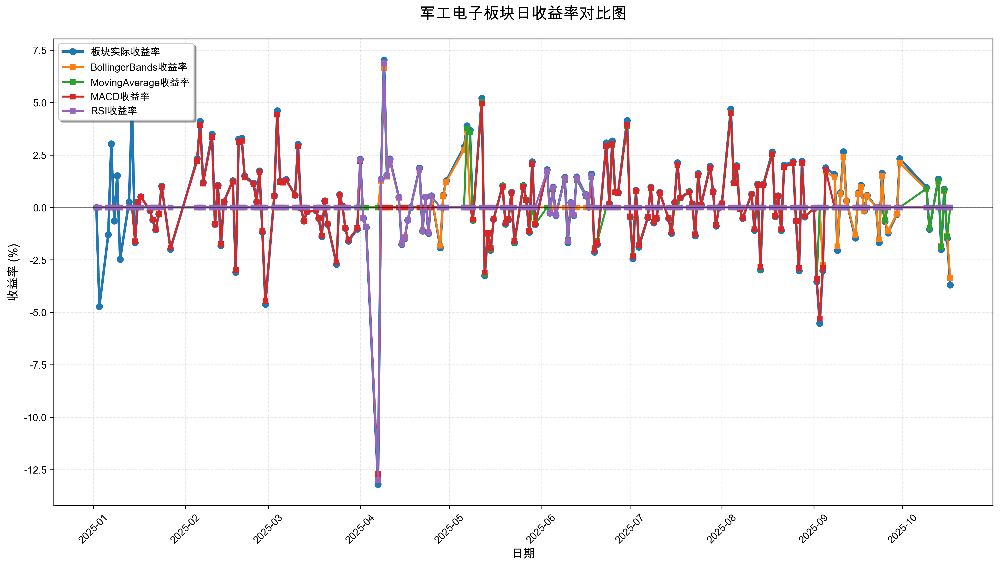
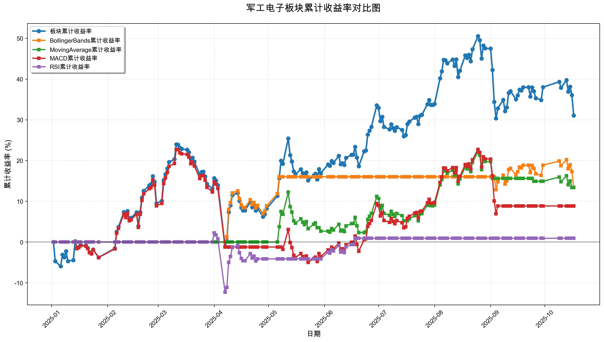

# 策略回测结果报告

**生成时间**: 2025-10-19 19:07:29
**行业板块**: 军工电子
**回测期间**: 20250101 至 20251017
**策略数量**: 4

## 📈 分析结论

### 策略表现分析
- **最佳策略**: BollingerBands (总收益率: 13.40%)
- **最差策略**: RSI (总收益率: 0.92%)
### 交易活跃度分析
- **活跃策略**: 4 个
- **非活跃策略**: 0 个
- **最活跃策略**: MovingAverage (交易次数: 14)
### 🚨 异动提醒分析
- **板块异动**: 军工电子 近两周出现大幅波动 (最大单日: 3.70%)
- **板块异动**: 军工电子 近两周波动频繁 (方向变化频率: 64.3%)
- **策略异动**: BollingerBands 近两周出现大幅波动 (最大单日: 3.36%)
### 风险分析
- **BollingerBands**: 最大回撤 -5.66%, 夏普比率 1.2943
- **MovingAverage**: 最大回撤 -8.82%, 夏普比率 1.0362
- **MACD**: 最大回撤 -22.58%, 夏普比率 0.4304
- **RSI**: 最大回撤 -14.23%, 夏普比率 0.0656

## 📊 综合结果表

| 策略名称           | 初始资金     | 最终价值     | 总收益率   | 年化收益率   | 波动率    |   夏普比率 | 最大回撤    | 总交易次数   | 买入次数   | 卖出次数   | 总交易金额      | 平均交易金额   | 交易频率   |   数据点数 |
|:---------------|:---------|:---------|:-------|:--------|:-------|-------:|:--------|:--------|:-------|:-------|:-----------|:---------|:-------|-------:|
| 板块实际表现         | ¥100,000 | ¥131,032 | 31.03% | 43.11%  | 33.81% | 1.2752 | -20.18% | N/A     | N/A    | N/A    | N/A        | N/A      | N/A    |    190 |
| BollingerBands | ¥100,000 | ¥113,397 | 13.40% | 18.15%  | 14.02% | 1.2943 | -5.66%  | 3       | 2      | 1      | ¥310,566   | ¥103,522 | 0.02   |    190 |
| MovingAverage  | ¥100,000 | ¥113,387 | 13.39% | 18.13%  | 17.50% | 1.0362 | -8.82%  | 14      | 7      | 7      | ¥1,423,949 | ¥101,711 | 0.07   |    190 |
| MACD           | ¥100,000 | ¥108,853 | 8.85%  | 11.91%  | 27.67% | 0.4304 | -22.58% | 4       | 2      | 2      | ¥388,420   | ¥97,105  | 0.02   |    190 |
| RSI            | ¥100,000 | ¥100,917 | 0.92%  | 1.22%   | 18.58% | 0.0656 | -14.23% | 4       | 2      | 2      | ¥380,685   | ¥95,171  | 0.02   |    190 |

## 📊 每日收益率走势图

*图1: 军工电子板块每日收益率走势对比*

## 📈 累计收益率走势图

*图2: 军工电子板块累计收益率走势对比*

## 📅 日收益明细表

| 日期         | 板块实际收益率   | BollingerBands收益率   | MovingAverage收益率   | MACD收益率   | RSI收益率   |
|:-----------|:----------|:--------------------|:-------------------|:----------|:---------|
| 2025-01-02 | 0.00%     | 0.00%               | 0.00%              | 0.00%     | 0.00%    |
| 2025-01-03 | -4.72%    | 0.00%               | 0.00%              | 0.00%     | 0.00%    |
| 2025-01-06 | -1.30%    | 0.00%               | 0.00%              | 0.00%     | 0.00%    |
| 2025-01-07 | 3.03%     | 0.00%               | 0.00%              | 0.00%     | 0.00%    |
| 2025-01-08 | -0.65%    | 0.00%               | 0.00%              | 0.00%     | 0.00%    |
| 2025-01-09 | 1.52%     | 0.00%               | 0.00%              | 0.00%     | 0.00%    |
| 2025-01-10 | -2.47%    | 0.00%               | 0.00%              | 0.00%     | 0.00%    |
| 2025-01-13 | 0.26%     | 0.00%               | 0.00%              | 0.00%     | 0.00%    |
| 2025-01-14 | 4.86%     | 0.00%               | 0.00%              | 0.00%     | 0.00%    |
| 2025-01-15 | -1.69%    | 0.00%               | 0.00%              | -1.62%    | 0.00%    |
| 2025-01-16 | 0.26%     | 0.00%               | 0.00%              | 0.25%     | 0.00%    |
| 2025-01-17 | 0.51%     | 0.00%               | 0.00%              | 0.49%     | 0.00%    |
| 2025-01-20 | -0.14%    | 0.00%               | 0.00%              | -0.13%    | 0.00%    |
| 2025-01-21 | -0.60%    | 0.00%               | 0.00%              | -0.58%    | 0.00%    |
| 2025-01-22 | -1.07%    | 0.00%               | 0.00%              | -1.02%    | 0.00%    |
| 2025-01-23 | -0.31%    | 0.00%               | 0.00%              | -0.30%    | 0.00%    |
| 2025-01-24 | 1.02%     | 0.00%               | 0.00%              | 0.98%     | 0.00%    |
| 2025-01-27 | -1.99%    | 0.00%               | 0.00%              | -1.91%    | 0.00%    |
| 2025-02-05 | 2.32%     | 0.00%               | 0.00%              | 2.22%     | 0.00%    |
| 2025-02-06 | 4.11%     | 0.00%               | 0.00%              | 3.94%     | 0.00%    |
| 2025-02-07 | 1.19%     | 0.00%               | 0.00%              | 1.14%     | 0.00%    |
| 2025-02-10 | 3.50%     | 0.00%               | 0.00%              | 3.36%     | 0.00%    |
| 2025-02-11 | -0.81%    | 0.00%               | 0.00%              | -0.78%    | 0.00%    |
| 2025-02-12 | 1.06%     | 0.00%               | 0.00%              | 1.02%     | 0.00%    |
| 2025-02-13 | -1.82%    | 0.00%               | 0.00%              | -1.75%    | 0.00%    |
| 2025-02-14 | 0.27%     | 0.00%               | 0.00%              | 0.26%     | 0.00%    |
| 2025-02-17 | 1.28%     | 0.00%               | 0.00%              | 1.23%     | 0.00%    |
| 2025-02-18 | -3.09%    | 0.00%               | 0.00%              | -2.97%    | 0.00%    |
| 2025-02-19 | 3.26%     | 0.00%               | 0.00%              | 3.13%     | 0.00%    |
| 2025-02-20 | 3.31%     | 0.00%               | 0.00%              | 3.18%     | 0.00%    |
| 2025-02-21 | 1.50%     | 0.00%               | 0.00%              | 1.44%     | 0.00%    |
| 2025-02-24 | 1.16%     | 0.00%               | 0.00%              | 1.11%     | 0.00%    |
| 2025-02-25 | 0.27%     | 0.00%               | 0.00%              | 0.26%     | 0.00%    |
| 2025-02-26 | 1.74%     | 0.00%               | 0.00%              | 1.68%     | 0.00%    |
| 2025-02-27 | -1.18%    | 0.00%               | 0.00%              | -1.14%    | 0.00%    |
| 2025-02-28 | -4.62%    | 0.00%               | 0.00%              | -4.45%    | 0.00%    |
| 2025-03-03 | 0.56%     | 0.00%               | 0.00%              | 0.54%     | 0.00%    |
| 2025-03-04 | 4.61%     | 0.00%               | 0.00%              | 4.43%     | 0.00%    |
| 2025-03-05 | 1.25%     | 0.00%               | 0.00%              | 1.21%     | 0.00%    |
| 2025-03-06 | 1.23%     | 0.00%               | 0.00%              | 1.18%     | 0.00%    |
| 2025-03-07 | 1.33%     | 0.00%               | 0.00%              | 1.29%     | 0.00%    |
| 2025-03-10 | 0.59%     | 0.00%               | 0.00%              | 0.57%     | 0.00%    |
| 2025-03-11 | 3.01%     | 0.00%               | 0.00%              | 2.91%     | 0.00%    |
| 2025-03-12 | -0.03%    | 0.00%               | 0.00%              | -0.03%    | 0.00%    |
| 2025-03-13 | -0.65%    | 0.00%               | 0.00%              | -0.63%    | 0.00%    |
| 2025-03-14 | -0.21%    | 0.00%               | 0.00%              | -0.20%    | 0.00%    |
| 2025-03-17 | -0.15%    | 0.00%               | 0.00%              | -0.14%    | 0.00%    |
| 2025-03-18 | -0.52%    | 0.00%               | 0.00%              | -0.50%    | 0.00%    |
| 2025-03-19 | -1.39%    | 0.00%               | 0.00%              | -1.34%    | 0.00%    |
| 2025-03-20 | 0.32%     | 0.00%               | 0.00%              | 0.31%     | 0.00%    |
| 2025-03-21 | -0.81%    | 0.00%               | 0.00%              | -0.78%    | 0.00%    |
| 2025-03-24 | -2.71%    | 0.00%               | 0.00%              | -2.62%    | 0.00%    |
| 2025-03-25 | 0.61%     | 0.00%               | 0.00%              | 0.59%     | 0.00%    |
| 2025-03-26 | 0.06%     | 0.00%               | 0.00%              | 0.06%     | 0.00%    |
| 2025-03-27 | -1.00%    | 0.00%               | 0.00%              | -0.96%    | 0.00%    |
| 2025-03-28 | -1.61%    | 0.00%               | 0.00%              | -1.55%    | 0.00%    |
| 2025-03-31 | -1.03%    | 0.00%               | 0.00%              | -0.99%    | 0.00%    |
| 2025-04-01 | 2.30%     | 0.00%               | 0.00%              | 2.22%     | 2.26%    |
| 2025-04-02 | -0.51%    | 0.00%               | 0.00%              | -0.50%    | -0.51%   |
| 2025-04-03 | -0.94%    | 0.00%               | 0.00%              | -0.91%    | -0.93%   |
| 2025-04-07 | -13.20%   | 0.00%               | 0.00%              | -12.72%   | -12.98%  |
| 2025-04-08 | 1.36%     | 1.28%               | 0.00%              | 0.00%     | 1.33%    |
| 2025-04-09 | 7.03%     | 6.66%               | 0.00%              | 0.00%     | 6.90%    |
| 2025-04-10 | 1.55%     | 1.47%               | 0.00%              | 0.00%     | 1.52%    |
| 2025-04-11 | 2.31%     | 2.20%               | 0.00%              | 0.00%     | 2.27%    |
| 2025-04-14 | 0.49%     | 0.46%               | 0.00%              | 0.00%     | 0.48%    |
| 2025-04-15 | -1.77%    | -1.68%              | 0.00%              | 0.00%     | -1.74%   |
| 2025-04-16 | -1.49%    | -1.42%              | 0.00%              | 0.00%     | -1.46%   |
| 2025-04-17 | -0.61%    | -0.58%              | 0.00%              | 0.00%     | -0.60%   |
| 2025-04-18 | -0.01%    | -0.01%              | 0.00%              | 0.00%     | -0.01%   |
| 2025-04-21 | 1.88%     | 1.79%               | 0.00%              | 0.00%     | 1.85%    |
| 2025-04-22 | -1.13%    | -1.08%              | 0.00%              | 0.00%     | -1.11%   |
| 2025-04-23 | 0.50%     | 0.47%               | 0.00%              | 0.00%     | 0.49%    |
| 2025-04-24 | -1.24%    | -1.18%              | 0.00%              | 0.00%     | -1.22%   |
| 2025-04-25 | 0.55%     | 0.52%               | 0.00%              | 0.00%     | 0.54%    |
| 2025-04-28 | -1.92%    | -1.82%              | 0.00%              | 0.00%     | 0.00%    |
| 2025-04-29 | 0.59%     | 0.56%               | 0.00%              | 0.00%     | 0.00%    |
| 2025-04-30 | 1.27%     | 1.21%               | 0.00%              | 0.00%     | 0.00%    |
| 2025-05-06 | 2.89%     | 2.75%               | 0.00%              | 0.00%     | 0.00%    |
| 2025-05-07 | 3.89%     | 3.70%               | 3.77%              | 0.00%     | 0.00%    |
| 2025-05-08 | 3.69%     | 0.00%               | 3.57%              | 0.00%     | 0.00%    |
| 2025-05-09 | -0.61%    | 0.00%               | -0.59%             | -0.58%    | 0.00%    |
| 2025-05-12 | 5.21%     | 0.00%               | 5.05%              | 4.95%     | 0.00%    |
| 2025-05-13 | -3.25%    | 0.00%               | -3.16%             | -3.10%    | 0.00%    |
| 2025-05-14 | -1.29%    | 0.00%               | -1.25%             | -1.22%    | 0.00%    |
| 2025-05-15 | -2.04%    | 0.00%               | -1.98%             | -1.94%    | 0.00%    |
| 2025-05-16 | -0.56%    | 0.00%               | -0.55%             | -0.54%    | 0.00%    |
| 2025-05-19 | 1.04%     | 0.00%               | 1.01%              | 0.99%     | 0.00%    |
| 2025-05-20 | -0.79%    | 0.00%               | -0.77%             | -0.75%    | 0.00%    |
| 2025-05-21 | -0.59%    | 0.00%               | -0.57%             | -0.56%    | 0.00%    |
| 2025-05-22 | 0.73%     | 0.00%               | 0.71%              | 0.69%     | 0.00%    |
| 2025-05-23 | -1.69%    | 0.00%               | -1.64%             | -1.61%    | 0.00%    |
| 2025-05-26 | 1.05%     | 0.00%               | 1.02%              | 0.99%     | 0.00%    |
| 2025-05-27 | 0.36%     | 0.00%               | 0.35%              | 0.34%     | 0.00%    |
| 2025-05-28 | -1.18%    | 0.00%               | -1.14%             | -1.12%    | 0.00%    |
| 2025-05-29 | 2.18%     | 0.00%               | 0.00%              | 2.07%     | 0.00%    |
| 2025-05-30 | -0.82%    | 0.00%               | -0.81%             | -0.78%    | 0.00%    |
| 2025-06-03 | 1.80%     | 0.00%               | 0.00%              | 1.71%     | 1.72%    |
| 2025-06-04 | -0.27%    | 0.00%               | -0.24%             | -0.25%    | -0.26%   |
| 2025-06-05 | 0.98%     | 0.00%               | 0.89%              | 0.93%     | 0.94%    |
| 2025-06-06 | -0.38%    | 0.00%               | -0.34%             | -0.36%    | -0.36%   |
| 2025-06-09 | 1.45%     | 0.00%               | 1.32%              | 1.38%     | 1.39%    |
| 2025-06-10 | -1.69%    | 0.00%               | -1.54%             | -1.61%    | -1.62%   |
| 2025-06-11 | 0.23%     | 0.00%               | 0.20%              | 0.21%     | 0.22%    |
| 2025-06-12 | -0.38%    | 0.00%               | -0.34%             | -0.36%    | -0.36%   |
| 2025-06-13 | 1.46%     | 0.00%               | 1.32%              | 1.39%     | 1.39%    |
| 2025-06-16 | 0.62%     | 0.00%               | 0.56%              | 0.59%     | 0.59%    |
| 2025-06-17 | 0.02%     | 0.00%               | 0.02%              | 0.02%     | 0.02%    |
| 2025-06-18 | 1.59%     | 0.00%               | 1.45%              | 1.52%     | 1.52%    |
| 2025-06-19 | -2.13%    | 0.00%               | -1.94%             | -2.03%    | 0.00%    |
| 2025-06-20 | -1.76%    | 0.00%               | -1.60%             | -1.68%    | 0.00%    |
| 2025-06-23 | 3.08%     | 0.00%               | 0.00%              | 2.93%     | 0.00%    |
| 2025-06-24 | 0.19%     | 0.00%               | 0.18%              | 0.18%     | 0.00%    |
| 2025-06-25 | 3.17%     | 0.00%               | 2.97%              | 3.02%     | 0.00%    |
| 2025-06-26 | 0.75%     | 0.00%               | 0.71%              | 0.72%     | 0.00%    |
| 2025-06-27 | 0.72%     | 0.00%               | 0.67%              | 0.68%     | 0.00%    |
| 2025-06-30 | 4.14%     | 0.00%               | 3.88%              | 3.95%     | 0.00%    |
| 2025-07-01 | -0.46%    | 0.00%               | -0.43%             | -0.44%    | 0.00%    |
| 2025-07-02 | -2.45%    | 0.00%               | -2.30%             | -2.34%    | 0.00%    |
| 2025-07-03 | 0.82%     | 0.00%               | 0.77%              | 0.78%     | 0.00%    |
| 2025-07-04 | -1.89%    | 0.00%               | -1.78%             | -1.81%    | 0.00%    |
| 2025-07-07 | -0.48%    | 0.00%               | -0.45%             | -0.46%    | 0.00%    |
| 2025-07-08 | 0.98%     | 0.00%               | 0.92%              | 0.94%     | 0.00%    |
| 2025-07-09 | -0.74%    | 0.00%               | -0.69%             | -0.70%    | 0.00%    |
| 2025-07-10 | -0.53%    | 0.00%               | -0.49%             | -0.50%    | 0.00%    |
| 2025-07-11 | 0.72%     | 0.00%               | 0.68%              | 0.69%     | 0.00%    |
| 2025-07-14 | -0.53%    | 0.00%               | -0.50%             | -0.50%    | 0.00%    |
| 2025-07-15 | -1.24%    | 0.00%               | -1.16%             | -1.18%    | 0.00%    |
| 2025-07-16 | 0.25%     | 0.00%               | 0.00%              | 0.24%     | 0.00%    |
| 2025-07-17 | 2.13%     | 0.00%               | 0.00%              | 2.03%     | 0.00%    |
| 2025-07-18 | 0.46%     | 0.00%               | 0.44%              | 0.44%     | 0.00%    |
| 2025-07-21 | 0.76%     | 0.00%               | 0.73%              | 0.72%     | 0.00%    |
| 2025-07-22 | 0.15%     | 0.00%               | 0.15%              | 0.15%     | 0.00%    |
| 2025-07-23 | -1.35%    | 0.00%               | -1.29%             | -1.28%    | 0.00%    |
| 2025-07-24 | 1.62%     | 0.00%               | 1.56%              | 1.55%     | 0.00%    |
| 2025-07-25 | 0.12%     | 0.00%               | 0.12%              | 0.12%     | 0.00%    |
| 2025-07-28 | 1.96%     | 0.00%               | 1.89%              | 1.88%     | 0.00%    |
| 2025-07-29 | 0.78%     | 0.00%               | 0.75%              | 0.74%     | 0.00%    |
| 2025-07-30 | -0.88%    | 0.00%               | -0.85%             | -0.85%    | 0.00%    |
| 2025-07-31 | -0.01%    | 0.00%               | -0.01%             | -0.01%    | 0.00%    |
| 2025-08-01 | 0.19%     | 0.00%               | 0.19%              | 0.19%     | 0.00%    |
| 2025-08-04 | 4.69%     | 0.00%               | 4.50%              | 4.48%     | 0.00%    |
| 2025-08-05 | 1.21%     | 0.00%               | 1.17%              | 1.16%     | 0.00%    |
| 2025-08-06 | 1.99%     | 0.00%               | 1.92%              | 1.91%     | 0.00%    |
| 2025-08-07 | -0.06%    | 0.00%               | -0.06%             | -0.06%    | 0.00%    |
| 2025-08-08 | -0.52%    | 0.00%               | -0.50%             | -0.50%    | 0.00%    |
| 2025-08-11 | 0.64%     | 0.00%               | 0.62%              | 0.62%     | 0.00%    |
| 2025-08-12 | -1.09%    | 0.00%               | -1.05%             | -1.04%    | 0.00%    |
| 2025-08-13 | 1.11%     | 0.00%               | 1.07%              | 1.06%     | 0.00%    |
| 2025-08-14 | -2.98%    | 0.00%               | -2.87%             | -2.85%    | 0.00%    |
| 2025-08-15 | 1.11%     | 0.00%               | 1.07%              | 1.06%     | 0.00%    |
| 2025-08-18 | 2.64%     | 0.00%               | 2.54%              | 2.53%     | 0.00%    |
| 2025-08-19 | -0.44%    | 0.00%               | -0.43%             | -0.42%    | 0.00%    |
| 2025-08-20 | 0.56%     | 0.00%               | 0.54%              | 0.53%     | 0.00%    |
| 2025-08-21 | -1.10%    | 0.00%               | -1.06%             | -1.05%    | 0.00%    |
| 2025-08-22 | 2.02%     | 0.00%               | 1.95%              | 1.94%     | 0.00%    |
| 2025-08-25 | 2.19%     | 0.00%               | 2.12%              | 2.11%     | 0.00%    |
| 2025-08-26 | -0.65%    | 0.00%               | -0.63%             | -0.63%    | 0.00%    |
| 2025-08-27 | -3.02%    | 0.00%               | -2.91%             | -2.90%    | 0.00%    |
| 2025-08-28 | 2.20%     | 0.00%               | 2.12%              | 2.11%     | 0.00%    |
| 2025-08-29 | -0.45%    | 0.00%               | -0.43%             | -0.43%    | 0.00%    |
| 2025-09-01 | -0.05%    | 0.00%               | -0.05%             | -0.05%    | 0.00%    |
| 2025-09-02 | -3.55%    | 0.00%               | -3.42%             | -3.41%    | 0.00%    |
| 2025-09-03 | -5.52%    | 0.00%               | 0.00%              | -5.29%    | 0.00%    |
| 2025-09-04 | -3.01%    | -2.73%              | 0.00%              | -2.88%    | 0.00%    |
| 2025-09-05 | 1.89%     | 1.71%               | 0.00%              | 1.80%     | 0.00%    |
| 2025-09-08 | 1.57%     | 1.43%               | 0.00%              | 0.00%     | 0.00%    |
| 2025-09-09 | -2.05%    | -1.86%              | 0.00%              | 0.00%     | 0.00%    |
| 2025-09-10 | 0.70%     | 0.64%               | 0.00%              | 0.00%     | 0.00%    |
| 2025-09-11 | 2.66%     | 2.41%               | 0.00%              | 0.00%     | 0.00%    |
| 2025-09-12 | 0.32%     | 0.29%               | 0.00%              | 0.00%     | 0.00%    |
| 2025-09-15 | -1.46%    | -1.32%              | 0.00%              | 0.00%     | 0.00%    |
| 2025-09-16 | 0.70%     | 0.63%               | 0.00%              | 0.00%     | 0.00%    |
| 2025-09-17 | 1.06%     | 0.97%               | 0.00%              | 0.00%     | 0.00%    |
| 2025-09-18 | -0.17%    | -0.15%              | 0.00%              | 0.00%     | 0.00%    |
| 2025-09-19 | 0.58%     | 0.53%               | 0.00%              | 0.00%     | 0.00%    |
| 2025-09-22 | 0.02%     | 0.02%               | 0.00%              | 0.00%     | 0.00%    |
| 2025-09-23 | -1.67%    | -1.52%              | 0.00%              | 0.00%     | 0.00%    |
| 2025-09-24 | 1.64%     | 1.49%               | 0.00%              | 0.00%     | 0.00%    |
| 2025-09-25 | -0.67%    | -0.61%              | -0.62%             | 0.00%     | 0.00%    |
| 2025-09-26 | -1.22%    | -1.11%              | 0.00%              | 0.00%     | 0.00%    |
| 2025-09-29 | -0.35%    | -0.32%              | 0.00%              | 0.00%     | 0.00%    |
| 2025-09-30 | 2.33%     | 2.12%               | 0.00%              | 0.00%     | 0.00%    |
| 2025-10-09 | 0.96%     | 0.87%               | 0.90%              | 0.00%     | 0.00%    |
| 2025-10-10 | -1.05%    | -0.95%              | -0.99%             | 0.00%     | 0.00%    |
| 2025-10-13 | 1.35%     | 1.23%               | 1.27%              | 0.00%     | 0.00%    |
| 2025-10-14 | -2.01%    | -1.83%              | -1.89%             | 0.00%     | 0.00%    |
| 2025-10-15 | 0.87%     | 0.79%               | 0.82%              | 0.00%     | 0.00%    |
| 2025-10-16 | -1.48%    | -1.35%              | -1.39%             | 0.00%     | 0.00%    |
| 2025-10-17 | -3.70%    | -3.36%              | 0.00%              | 0.00%     | 0.00%    |

## 📊 日收益统计摘要

| 指标                | 平均日收益率   | 最大日收益率   | 最小日收益率   | 正收益天数   | 负收益天数   |
|:------------------|:---------|:---------|:---------|:--------|:--------|
| 板块实际收益率           | 0.17%    | 7.03%    | -13.20%  | 102天    | 87天     |
| BollingerBands收益率 | 0.07%    | 6.66%    | -3.36%   | 26天     | 19天     |
| MovingAverage收益率  | 0.07%    | 5.05%    | -3.42%   | 44天     | 42天     |
| MACD收益率           | 0.06%    | 4.95%    | -12.72%  | 72天     | 65天     |
| RSI收益率            | 0.01%    | 6.90%    | -12.98%  | 17天     | 13天     |

## 📈 累计收益明细表

| 日期         | 板块累计收益率   | BollingerBands累计收益率   | MovingAverage累计收益率   | MACD累计收益率   | RSI累计收益率   |
|:-----------|:----------|:----------------------|:---------------------|:------------|:-----------|
| 2025-01-02 | 0.00%     | 0.00%                 | 0.00%                | 0.00%       | 0.00%      |
| 2025-01-03 | -4.72%    | 0.00%                 | 0.00%                | 0.00%       | 0.00%      |
| 2025-01-06 | -5.96%    | 0.00%                 | 0.00%                | 0.00%       | 0.00%      |
| 2025-01-07 | -3.11%    | 0.00%                 | 0.00%                | 0.00%       | 0.00%      |
| 2025-01-08 | -3.74%    | 0.00%                 | 0.00%                | 0.00%       | 0.00%      |
| 2025-01-09 | -2.27%    | 0.00%                 | 0.00%                | 0.00%       | 0.00%      |
| 2025-01-10 | -4.69%    | 0.00%                 | 0.00%                | 0.00%       | 0.00%      |
| 2025-01-13 | -4.45%    | 0.00%                 | 0.00%                | 0.00%       | 0.00%      |
| 2025-01-14 | 0.20%     | 0.00%                 | 0.00%                | 0.00%       | 0.00%      |
| 2025-01-15 | -1.50%    | 0.00%                 | 0.00%                | -1.62%      | 0.00%      |
| 2025-01-16 | -1.24%    | 0.00%                 | 0.00%                | -1.38%      | 0.00%      |
| 2025-01-17 | -0.74%    | 0.00%                 | 0.00%                | -0.90%      | 0.00%      |
| 2025-01-20 | -0.87%    | 0.00%                 | 0.00%                | -1.02%      | 0.00%      |
| 2025-01-21 | -1.47%    | 0.00%                 | 0.00%                | -1.60%      | 0.00%      |
| 2025-01-22 | -2.52%    | 0.00%                 | 0.00%                | -2.60%      | 0.00%      |
| 2025-01-23 | -2.82%    | 0.00%                 | 0.00%                | -2.89%      | 0.00%      |
| 2025-01-24 | -1.83%    | 0.00%                 | 0.00%                | -1.94%      | 0.00%      |
| 2025-01-27 | -3.78%    | 0.00%                 | 0.00%                | -3.81%      | 0.00%      |
| 2025-02-05 | -1.55%    | 0.00%                 | 0.00%                | -1.68%      | 0.00%      |
| 2025-02-06 | 2.49%     | 0.00%                 | 0.00%                | 2.19%       | 0.00%      |
| 2025-02-07 | 3.71%     | 0.00%                 | 0.00%                | 3.36%       | 0.00%      |
| 2025-02-10 | 7.34%     | 0.00%                 | 0.00%                | 6.83%       | 0.00%      |
| 2025-02-11 | 6.47%     | 0.00%                 | 0.00%                | 6.00%       | 0.00%      |
| 2025-02-12 | 7.60%     | 0.00%                 | 0.00%                | 7.08%       | 0.00%      |
| 2025-02-13 | 5.64%     | 0.00%                 | 0.00%                | 5.21%       | 0.00%      |
| 2025-02-14 | 5.92%     | 0.00%                 | 0.00%                | 5.48%       | 0.00%      |
| 2025-02-17 | 7.28%     | 0.00%                 | 0.00%                | 6.78%       | 0.00%      |
| 2025-02-18 | 3.96%     | 0.00%                 | 0.00%                | 3.60%       | 0.00%      |
| 2025-02-19 | 7.35%     | 0.00%                 | 0.00%                | 6.84%       | 0.00%      |
| 2025-02-20 | 10.90%    | 0.00%                 | 0.00%                | 10.24%      | 0.00%      |
| 2025-02-21 | 12.56%    | 0.00%                 | 0.00%                | 11.83%      | 0.00%      |
| 2025-02-24 | 13.87%    | 0.00%                 | 0.00%                | 13.08%      | 0.00%      |
| 2025-02-25 | 14.18%    | 0.00%                 | 0.00%                | 13.38%      | 0.00%      |
| 2025-02-26 | 16.16%    | 0.00%                 | 0.00%                | 15.28%      | 0.00%      |
| 2025-02-27 | 14.79%    | 0.00%                 | 0.00%                | 13.96%      | 0.00%      |
| 2025-02-28 | 9.48%     | 0.00%                 | 0.00%                | 8.88%       | 0.00%      |
| 2025-03-03 | 10.10%    | 0.00%                 | 0.00%                | 9.47%       | 0.00%      |
| 2025-03-04 | 15.17%    | 0.00%                 | 0.00%                | 14.33%      | 0.00%      |
| 2025-03-05 | 16.61%    | 0.00%                 | 0.00%                | 15.71%      | 0.00%      |
| 2025-03-06 | 18.04%    | 0.00%                 | 0.00%                | 17.08%      | 0.00%      |
| 2025-03-07 | 19.62%    | 0.00%                 | 0.00%                | 18.58%      | 0.00%      |
| 2025-03-10 | 20.32%    | 0.00%                 | 0.00%                | 19.26%      | 0.00%      |
| 2025-03-11 | 23.94%    | 0.00%                 | 0.00%                | 22.72%      | 0.00%      |
| 2025-03-12 | 23.90%    | 0.00%                 | 0.00%                | 22.68%      | 0.00%      |
| 2025-03-13 | 23.09%    | 0.00%                 | 0.00%                | 21.91%      | 0.00%      |
| 2025-03-14 | 22.84%    | 0.00%                 | 0.00%                | 21.66%      | 0.00%      |
| 2025-03-17 | 22.65%    | 0.00%                 | 0.00%                | 21.49%      | 0.00%      |
| 2025-03-18 | 22.01%    | 0.00%                 | 0.00%                | 20.88%      | 0.00%      |
| 2025-03-19 | 20.32%    | 0.00%                 | 0.00%                | 19.25%      | 0.00%      |
| 2025-03-20 | 20.70%    | 0.00%                 | 0.00%                | 19.62%      | 0.00%      |
| 2025-03-21 | 19.72%    | 0.00%                 | 0.00%                | 18.68%      | 0.00%      |
| 2025-03-24 | 16.47%    | 0.00%                 | 0.00%                | 15.57%      | 0.00%      |
| 2025-03-25 | 17.19%    | 0.00%                 | 0.00%                | 16.26%      | 0.00%      |
| 2025-03-26 | 17.26%    | 0.00%                 | 0.00%                | 16.32%      | 0.00%      |
| 2025-03-27 | 16.09%    | 0.00%                 | 0.00%                | 15.21%      | 0.00%      |
| 2025-03-28 | 14.22%    | 0.00%                 | 0.00%                | 13.42%      | 0.00%      |
| 2025-03-31 | 13.05%    | 0.00%                 | 0.00%                | 12.30%      | 0.00%      |
| 2025-04-01 | 15.65%    | 0.00%                 | 0.00%                | 14.79%      | 2.26%      |
| 2025-04-02 | 15.06%    | 0.00%                 | 0.00%                | 14.22%      | 1.74%      |
| 2025-04-03 | 13.97%    | 0.00%                 | 0.00%                | 13.18%      | 0.80%      |
| 2025-04-07 | -1.07%    | 0.00%                 | 0.00%                | -1.22%      | -12.29%    |
| 2025-04-08 | 0.27%     | 1.28%                 | 0.00%                | -1.22%      | -11.12%    |
| 2025-04-09 | 7.32%     | 8.03%                 | 0.00%                | -1.22%      | -4.99%     |
| 2025-04-10 | 8.98%     | 9.62%                 | 0.00%                | -1.22%      | -3.54%     |
| 2025-04-11 | 11.50%    | 12.03%                | 0.00%                | -1.22%      | -1.35%     |
| 2025-04-14 | 12.04%    | 12.55%                | 0.00%                | -1.22%      | -0.87%     |
| 2025-04-15 | 10.07%    | 10.66%                | 0.00%                | -1.22%      | -2.60%     |
| 2025-04-16 | 8.43%     | 9.09%                 | 0.00%                | -1.22%      | -4.02%     |
| 2025-04-17 | 7.76%     | 8.46%                 | 0.00%                | -1.22%      | -4.60%     |
| 2025-04-18 | 7.75%     | 8.44%                 | 0.00%                | -1.22%      | -4.61%     |
| 2025-04-21 | 9.78%     | 10.38%                | 0.00%                | -1.22%      | -2.85%     |
| 2025-04-22 | 8.53%     | 9.19%                 | 0.00%                | -1.22%      | -3.93%     |
| 2025-04-23 | 9.07%     | 9.71%                 | 0.00%                | -1.22%      | -3.46%     |
| 2025-04-24 | 7.72%     | 8.41%                 | 0.00%                | -1.22%      | -4.64%     |
| 2025-04-25 | 8.30%     | 8.97%                 | 0.00%                | -1.22%      | -4.13%     |
| 2025-04-28 | 6.23%     | 6.98%                 | 0.00%                | -1.22%      | -4.13%     |
| 2025-04-29 | 6.85%     | 7.58%                 | 0.00%                | -1.22%      | -4.13%     |
| 2025-04-30 | 8.20%     | 8.88%                 | 0.00%                | -1.22%      | -4.13%     |
| 2025-05-06 | 11.33%    | 11.87%                | 0.00%                | -1.22%      | -4.13%     |
| 2025-05-07 | 15.67%    | 16.02%                | 3.77%                | -1.22%      | -4.13%     |
| 2025-05-08 | 19.93%    | 16.02%                | 7.48%                | -1.22%      | -4.13%     |
| 2025-05-09 | 19.19%    | 16.02%                | 6.84%                | -1.79%      | -4.13%     |
| 2025-05-12 | 25.40%    | 16.02%                | 12.24%               | 3.07%       | -4.13%     |
| 2025-05-13 | 21.32%    | 16.02%                | 8.69%                | -0.13%      | -4.13%     |
| 2025-05-14 | 19.76%    | 16.02%                | 7.33%                | -1.35%      | -4.13%     |
| 2025-05-15 | 17.31%    | 16.02%                | 5.20%                | -3.26%      | -4.13%     |
| 2025-05-16 | 16.65%    | 16.02%                | 4.63%                | -3.78%      | -4.13%     |
| 2025-05-19 | 17.86%    | 16.02%                | 5.68%                | -2.83%      | -4.13%     |
| 2025-05-20 | 16.93%    | 16.02%                | 4.87%                | -3.56%      | -4.13%     |
| 2025-05-21 | 16.24%    | 16.02%                | 4.27%                | -4.10%      | -4.13%     |
| 2025-05-22 | 17.09%    | 16.02%                | 5.01%                | -3.44%      | -4.13%     |
| 2025-05-23 | 15.11%    | 16.02%                | 3.28%                | -4.99%      | -4.13%     |
| 2025-05-26 | 16.32%    | 16.02%                | 4.33%                | -4.05%      | -4.13%     |
| 2025-05-27 | 16.74%    | 16.02%                | 4.70%                | -3.72%      | -4.13%     |
| 2025-05-28 | 15.36%    | 16.02%                | 3.51%                | -4.79%      | -4.13%     |
| 2025-05-29 | 17.88%    | 16.02%                | 3.51%                | -2.82%      | -4.13%     |
| 2025-05-30 | 16.91%    | 16.02%                | 2.67%                | -3.58%      | -4.13%     |
| 2025-06-03 | 19.02%    | 16.02%                | 2.67%                | -1.93%      | -2.48%     |
| 2025-06-04 | 18.70%    | 16.02%                | 2.42%                | -2.18%      | -2.73%     |
| 2025-06-05 | 19.86%    | 16.02%                | 3.33%                | -1.27%      | -1.82%     |
| 2025-06-06 | 19.41%    | 16.02%                | 2.97%                | -1.62%      | -2.17%     |
| 2025-06-09 | 21.14%    | 16.02%                | 4.33%                | -0.27%      | -0.82%     |
| 2025-06-10 | 19.09%    | 16.02%                | 2.72%                | -1.87%      | -2.42%     |
| 2025-06-11 | 19.36%    | 16.02%                | 2.93%                | -1.66%      | -2.21%     |
| 2025-06-12 | 18.91%    | 16.02%                | 2.58%                | -2.01%      | -2.56%     |
| 2025-06-13 | 20.65%    | 16.02%                | 3.94%                | -0.65%      | -1.20%     |
| 2025-06-16 | 21.40%    | 16.02%                | 4.53%                | -0.07%      | -0.62%     |
| 2025-06-17 | 21.42%    | 16.02%                | 4.55%                | -0.05%      | -0.60%     |
| 2025-06-18 | 23.36%    | 16.02%                | 6.06%                | 1.47%       | 0.92%      |
| 2025-06-19 | 20.72%    | 16.02%                | 4.00%                | -0.59%      | 0.92%      |
| 2025-06-20 | 18.59%    | 16.02%                | 2.33%                | -2.26%      | 0.92%      |
| 2025-06-23 | 22.25%    | 16.02%                | 2.33%                | 0.60%       | 0.92%      |
| 2025-06-24 | 22.48%    | 16.02%                | 2.52%                | 0.78%       | 0.92%      |
| 2025-06-25 | 26.37%    | 16.02%                | 5.56%                | 3.83%       | 0.92%      |
| 2025-06-26 | 27.32%    | 16.02%                | 6.31%                | 4.57%       | 0.92%      |
| 2025-06-27 | 28.24%    | 16.02%                | 7.02%                | 5.29%       | 0.92%      |
| 2025-06-30 | 33.54%    | 16.02%                | 11.18%               | 9.44%       | 0.92%      |
| 2025-07-01 | 32.92%    | 16.02%                | 10.69%               | 8.96%       | 0.92%      |
| 2025-07-02 | 29.67%    | 16.02%                | 8.15%                | 6.41%       | 0.92%      |
| 2025-07-03 | 30.73%    | 16.02%                | 8.98%                | 7.24%       | 0.92%      |
| 2025-07-04 | 28.26%    | 16.02%                | 7.04%                | 5.30%       | 0.92%      |
| 2025-07-07 | 27.65%    | 16.02%                | 6.56%                | 4.82%       | 0.92%      |
| 2025-07-08 | 28.90%    | 16.02%                | 7.54%                | 5.81%       | 0.92%      |
| 2025-07-09 | 27.95%    | 16.02%                | 6.79%                | 5.06%       | 0.92%      |
| 2025-07-10 | 27.27%    | 16.02%                | 6.27%                | 4.53%       | 0.92%      |
| 2025-07-11 | 28.19%    | 16.02%                | 6.99%                | 5.25%       | 0.92%      |
| 2025-07-14 | 27.51%    | 16.02%                | 6.46%                | 4.72%       | 0.92%      |
| 2025-07-15 | 25.94%    | 16.02%                | 5.22%                | 3.49%       | 0.92%      |
| 2025-07-16 | 26.25%    | 16.02%                | 5.22%                | 3.73%       | 0.92%      |
| 2025-07-17 | 28.95%    | 16.02%                | 5.22%                | 5.84%       | 0.92%      |
| 2025-07-18 | 29.54%    | 16.02%                | 5.69%                | 6.31%       | 0.92%      |
| 2025-07-21 | 30.53%    | 16.02%                | 6.46%                | 7.08%       | 0.92%      |
| 2025-07-22 | 30.73%    | 16.02%                | 6.62%                | 7.24%       | 0.92%      |
| 2025-07-23 | 28.97%    | 16.02%                | 5.24%                | 5.86%       | 0.92%      |
| 2025-07-24 | 31.06%    | 16.02%                | 6.88%                | 7.50%       | 0.92%      |
| 2025-07-25 | 31.22%    | 16.02%                | 7.00%                | 7.62%       | 0.92%      |
| 2025-07-28 | 33.80%    | 16.02%                | 9.02%                | 9.64%       | 0.92%      |
| 2025-07-29 | 34.84%    | 16.02%                | 9.84%                | 10.46%      | 0.92%      |
| 2025-07-30 | 33.65%    | 16.02%                | 8.90%                | 9.52%       | 0.92%      |
| 2025-07-31 | 33.64%    | 16.02%                | 8.89%                | 9.52%       | 0.92%      |
| 2025-08-01 | 33.90%    | 16.02%                | 9.10%                | 9.72%       | 0.92%      |
| 2025-08-04 | 40.17%    | 16.02%                | 14.01%               | 14.63%      | 0.92%      |
| 2025-08-05 | 41.87%    | 16.02%                | 15.34%               | 15.96%      | 0.92%      |
| 2025-08-06 | 44.69%    | 16.02%                | 17.55%               | 18.17%      | 0.92%      |
| 2025-08-07 | 44.60%    | 16.02%                | 17.48%               | 18.10%      | 0.92%      |
| 2025-08-08 | 43.85%    | 16.02%                | 16.89%               | 17.51%      | 0.92%      |
| 2025-08-11 | 44.78%    | 16.02%                | 17.62%               | 18.24%      | 0.92%      |
| 2025-08-12 | 43.21%    | 16.02%                | 16.39%               | 17.01%      | 0.92%      |
| 2025-08-13 | 44.80%    | 16.02%                | 17.63%               | 18.25%      | 0.92%      |
| 2025-08-14 | 40.49%    | 16.02%                | 14.26%               | 14.88%      | 0.92%      |
| 2025-08-15 | 42.05%    | 16.02%                | 15.48%               | 16.10%      | 0.92%      |
| 2025-08-18 | 45.80%    | 16.02%                | 18.42%               | 19.04%      | 0.92%      |
| 2025-08-19 | 45.16%    | 16.02%                | 17.91%               | 18.53%      | 0.92%      |
| 2025-08-20 | 45.96%    | 16.02%                | 18.54%               | 19.17%      | 0.92%      |
| 2025-08-21 | 44.36%    | 16.02%                | 17.29%               | 17.91%      | 0.92%      |
| 2025-08-22 | 47.28%    | 16.02%                | 19.57%               | 20.20%      | 0.92%      |
| 2025-08-25 | 50.51%    | 16.02%                | 22.11%               | 22.73%      | 0.92%      |
| 2025-08-26 | 49.53%    | 16.02%                | 21.33%               | 21.96%      | 0.92%      |
| 2025-08-27 | 45.01%    | 16.02%                | 17.80%               | 18.42%      | 0.92%      |
| 2025-08-28 | 48.20%    | 16.02%                | 20.30%               | 20.92%      | 0.92%      |
| 2025-08-29 | 47.54%    | 16.02%                | 19.78%               | 20.40%      | 0.92%      |
| 2025-09-01 | 47.46%    | 16.02%                | 19.72%               | 20.34%      | 0.92%      |
| 2025-09-02 | 42.23%    | 16.02%                | 15.62%               | 16.24%      | 0.92%      |
| 2025-09-03 | 34.38%    | 16.02%                | 15.62%               | 10.10%      | 0.92%      |
| 2025-09-04 | 30.33%    | 12.85%                | 15.62%               | 6.92%       | 0.92%      |
| 2025-09-05 | 32.79%    | 14.77%                | 15.62%               | 8.85%       | 0.92%      |
| 2025-09-08 | 34.88%    | 16.41%                | 15.62%               | 8.85%       | 0.92%      |
| 2025-09-09 | 32.12%    | 14.24%                | 15.62%               | 8.85%       | 0.92%      |
| 2025-09-10 | 33.04%    | 14.97%                | 15.62%               | 8.85%       | 0.92%      |
| 2025-09-11 | 36.58%    | 17.74%                | 15.62%               | 8.85%       | 0.92%      |
| 2025-09-12 | 37.02%    | 18.08%                | 15.62%               | 8.85%       | 0.92%      |
| 2025-09-15 | 35.02%    | 16.52%                | 15.62%               | 8.85%       | 0.92%      |
| 2025-09-16 | 35.96%    | 17.25%                | 15.62%               | 8.85%       | 0.92%      |
| 2025-09-17 | 37.40%    | 18.39%                | 15.62%               | 8.85%       | 0.92%      |
| 2025-09-18 | 37.17%    | 18.20%                | 15.62%               | 8.85%       | 0.92%      |
| 2025-09-19 | 37.97%    | 18.83%                | 15.62%               | 8.85%       | 0.92%      |
| 2025-09-22 | 38.00%    | 18.85%                | 15.62%               | 8.85%       | 0.92%      |
| 2025-09-23 | 35.69%    | 17.04%                | 15.62%               | 8.85%       | 0.92%      |
| 2025-09-24 | 37.91%    | 18.78%                | 15.62%               | 8.85%       | 0.92%      |
| 2025-09-25 | 36.99%    | 18.06%                | 14.90%               | 8.85%       | 0.92%      |
| 2025-09-26 | 35.32%    | 16.75%                | 14.90%               | 8.85%       | 0.92%      |
| 2025-09-29 | 34.85%    | 16.38%                | 14.90%               | 8.85%       | 0.92%      |
| 2025-09-30 | 37.99%    | 18.85%                | 14.90%               | 8.85%       | 0.92%      |
| 2025-10-09 | 39.32%    | 19.88%                | 15.94%               | 8.85%       | 0.92%      |
| 2025-10-10 | 37.86%    | 18.74%                | 14.79%               | 8.85%       | 0.92%      |
| 2025-10-13 | 39.72%    | 20.20%                | 16.25%               | 8.85%       | 0.92%      |
| 2025-10-14 | 36.91%    | 18.00%                | 14.05%               | 8.85%       | 0.92%      |
| 2025-10-15 | 38.11%    | 18.94%                | 14.99%               | 8.85%       | 0.92%      |
| 2025-10-16 | 36.06%    | 17.33%                | 13.39%               | 8.85%       | 0.92%      |
| 2025-10-17 | 31.03%    | 13.40%                | 13.39%               | 8.85%       | 0.92%      |

## 📊 累计收益统计摘要

| 指标                  | 最终累计收益率   | 最大累计收益率   | 最小累计收益率   | 累计收益波动   | 收益稳定性   |
|:--------------------|:----------|:----------|:----------|:---------|:--------|
| 板块累计收益率             | 31.03%    | 50.51%    | -5.96%    | 56.47%   | 波动      |
| BollingerBands累计收益率 | 13.40%    | 20.20%    | 0.00%     | 20.20%   | 波动      |
| MovingAverage累计收益率  | 13.39%    | 22.11%    | 0.00%     | 22.11%   | 波动      |
| MACD累计收益率           | 8.85%     | 22.73%    | -4.99%    | 27.72%   | 波动      |
| RSI累计收益率            | 0.92%     | 2.26%     | -12.29%   | 14.55%   | 稳定      |

