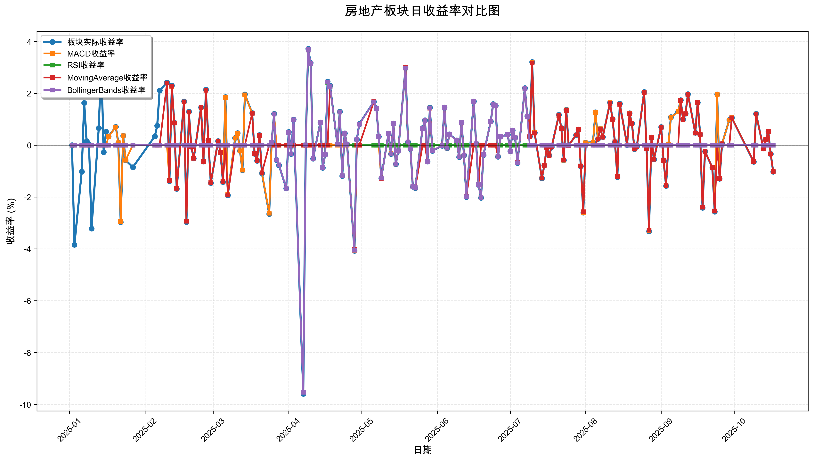
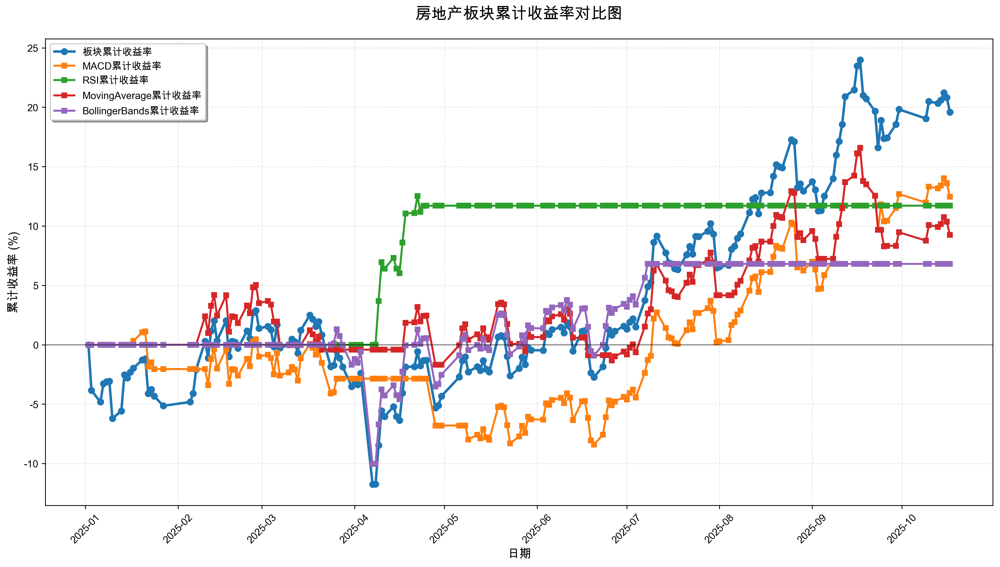

# 策略回测结果报告

**生成时间**: 2025-10-19 19:03:07
**行业板块**: 房地产
**回测期间**: 20250101 至 20251017
**策略数量**: 4

## 📈 分析结论

### 策略表现分析
- **最佳策略**: MACD (总收益率: 12.47%)
- **最差策略**: BollingerBands (总收益率: 6.81%)
### 交易活跃度分析
- **活跃策略**: 4 个
- **非活跃策略**: 0 个
- **最活跃策略**: MovingAverage (交易次数: 24)
### 🚨 异动提醒分析
- 未检测到明显异动情况
### 风险分析
- **MACD**: 最大回撤 -9.43%, 夏普比率 0.9618
- **RSI**: 最大回撤 -1.21%, 夏普比率 2.1923
- **MovingAverage**: 最大回撤 -7.12%, 夏普比率 0.7641
- **BollingerBands**: 最大回撤 -11.20%, 夏普比率 0.5448

## 📊 综合结果表

| 策略名称           | 初始资金     | 最终价值     | 总收益率   | 年化收益率   | 波动率    |   夏普比率 | 最大回撤    | 总交易次数   | 买入次数   | 卖出次数   | 总交易金额      | 平均交易金额   | 交易频率   |   数据点数 |
|:---------------|:---------|:---------|:-------|:--------|:-------|-------:|:--------|:--------|:-------|:-------|:-----------|:---------|:-------|-------:|
| 板块实际表现         | ¥100,000 | ¥119,591 | 19.59% | 26.78%  | 23.91% | 1.1202 | -14.23% | N/A     | N/A    | N/A    | N/A        | N/A      | N/A    |    190 |
| MACD           | ¥100,000 | ¥112,471 | 12.47% | 16.87%  | 17.54% | 0.9618 | -9.43%  | 7       | 4      | 3      | ¥671,033   | ¥95,862  | 0.04   |    190 |
| RSI            | ¥100,000 | ¥111,710 | 11.71% | 15.82%  | 7.22%  | 2.1923 | -1.21%  | 2       | 1      | 1      | ¥209,266   | ¥104,633 | 0.01   |    190 |
| MovingAverage  | ¥100,000 | ¥109,258 | 9.26%  | 12.46%  | 16.31% | 0.7641 | -7.12%  | 24      | 12     | 12     | ¥2,445,870 | ¥101,911 | 0.13   |    190 |
| BollingerBands | ¥100,000 | ¥106,813 | 6.81%  | 9.13%   | 16.77% | 0.5448 | -11.20% | 2       | 1      | 1      | ¥205,502   | ¥102,751 | 0.01   |    190 |

## 📊 每日收益率走势图

*图1: 房地产板块每日收益率走势对比*

## 📈 累计收益率走势图

*图2: 房地产板块累计收益率走势对比*

## 📅 日收益明细表

| 日期         | 板块实际收益率   | MACD收益率   | RSI收益率   | MovingAverage收益率   | BollingerBands收益率   |
|:-----------|:----------|:----------|:---------|:-------------------|:--------------------|
| 2025-01-02 | 0.00%     | 0.00%     | 0.00%    | 0.00%              | 0.00%               |
| 2025-01-03 | -3.84%    | 0.00%     | 0.00%    | 0.00%              | 0.00%               |
| 2025-01-06 | -1.02%    | 0.00%     | 0.00%    | 0.00%              | 0.00%               |
| 2025-01-07 | 1.63%     | 0.00%     | 0.00%    | 0.00%              | 0.00%               |
| 2025-01-08 | 0.16%     | 0.00%     | 0.00%    | 0.00%              | 0.00%               |
| 2025-01-09 | 0.04%     | 0.00%     | 0.00%    | 0.00%              | 0.00%               |
| 2025-01-10 | -3.22%    | 0.00%     | 0.00%    | 0.00%              | 0.00%               |
| 2025-01-13 | 0.66%     | 0.00%     | 0.00%    | 0.00%              | 0.00%               |
| 2025-01-14 | 3.22%     | 0.00%     | 0.00%    | 0.00%              | 0.00%               |
| 2025-01-15 | -0.27%    | 0.00%     | 0.00%    | 0.00%              | 0.00%               |
| 2025-01-16 | 0.52%     | 0.00%     | 0.00%    | 0.00%              | 0.00%               |
| 2025-01-17 | 0.34%     | 0.33%     | 0.00%    | 0.00%              | 0.00%               |
| 2025-01-20 | 0.71%     | 0.70%     | 0.00%    | 0.00%              | 0.00%               |
| 2025-01-21 | 0.10%     | 0.09%     | 0.00%    | 0.00%              | 0.00%               |
| 2025-01-22 | -2.97%    | -2.94%    | 0.00%    | 0.00%              | 0.00%               |
| 2025-01-23 | 0.36%     | 0.36%     | 0.00%    | 0.00%              | 0.00%               |
| 2025-01-24 | -0.58%    | -0.58%    | 0.00%    | 0.00%              | 0.00%               |
| 2025-01-27 | -0.85%    | 0.00%     | 0.00%    | 0.00%              | 0.00%               |
| 2025-02-05 | 0.34%     | 0.00%     | 0.00%    | 0.00%              | 0.00%               |
| 2025-02-06 | 0.75%     | 0.00%     | 0.00%    | 0.00%              | 0.00%               |
| 2025-02-07 | 2.11%     | 0.00%     | 0.00%    | 0.00%              | 0.00%               |
| 2025-02-10 | 2.42%     | 0.00%     | 0.00%    | 2.40%              | 0.00%               |
| 2025-02-11 | -1.39%    | -1.37%    | 0.00%    | -1.37%             | 0.00%               |
| 2025-02-12 | 2.30%     | 2.27%     | 0.00%    | 2.28%              | 0.00%               |
| 2025-02-13 | 0.87%     | 0.86%     | 0.00%    | 0.86%              | 0.00%               |
| 2025-02-14 | -1.68%    | -1.66%    | 0.00%    | -1.66%             | 0.00%               |
| 2025-02-17 | 1.69%     | 1.67%     | 0.00%    | 1.67%              | 0.00%               |
| 2025-02-18 | -2.96%    | -2.93%    | 0.00%    | -2.93%             | 0.00%               |
| 2025-02-19 | 1.29%     | 1.28%     | 0.00%    | 1.28%              | 0.00%               |
| 2025-02-20 | -0.06%    | -0.06%    | 0.00%    | -0.06%             | 0.00%               |
| 2025-02-21 | -0.51%    | -0.50%    | 0.00%    | -0.50%             | 0.00%               |
| 2025-02-24 | 1.46%     | 1.44%     | 0.00%    | 1.45%              | 0.00%               |
| 2025-02-25 | -0.63%    | -0.62%    | 0.00%    | -0.62%             | 0.00%               |
| 2025-02-26 | 2.14%     | 2.12%     | 0.00%    | 2.12%              | 0.00%               |
| 2025-02-27 | 0.19%     | 0.19%     | 0.00%    | 0.19%              | 0.00%               |
| 2025-02-28 | -1.46%    | -1.45%    | 0.00%    | -1.45%             | 0.00%               |
| 2025-03-03 | 0.16%     | 0.16%     | 0.00%    | 0.16%              | 0.00%               |
| 2025-03-04 | -0.28%    | -0.27%    | 0.00%    | -0.28%             | 0.00%               |
| 2025-03-05 | -1.42%    | -1.40%    | 0.00%    | -1.41%             | 0.00%               |
| 2025-03-06 | 1.86%     | 1.84%     | 0.00%    | 0.00%              | 0.00%               |
| 2025-03-07 | -1.93%    | -1.91%    | 0.00%    | -1.92%             | 0.00%               |
| 2025-03-10 | 0.28%     | 0.28%     | 0.00%    | 0.00%              | 0.00%               |
| 2025-03-11 | 0.47%     | 0.46%     | 0.00%    | 0.00%              | 0.00%               |
| 2025-03-12 | -0.22%    | -0.22%    | 0.00%    | 0.00%              | 0.00%               |
| 2025-03-13 | -0.97%    | -0.96%    | 0.00%    | 0.00%              | 0.00%               |
| 2025-03-14 | 1.96%     | 1.94%     | 0.00%    | 0.00%              | 0.00%               |
| 2025-03-17 | 1.24%     | 1.23%     | 0.00%    | 1.23%              | 0.00%               |
| 2025-03-18 | -0.33%    | -0.32%    | 0.00%    | -0.32%             | 0.00%               |
| 2025-03-19 | -0.60%    | -0.60%    | 0.00%    | -0.60%             | 0.00%               |
| 2025-03-20 | 0.39%     | 0.38%     | 0.00%    | 0.38%              | 0.00%               |
| 2025-03-21 | -1.08%    | -1.07%    | 0.00%    | -1.07%             | 0.00%               |
| 2025-03-24 | -2.65%    | -2.62%    | 0.00%    | 0.00%              | 0.00%               |
| 2025-03-25 | 0.11%     | 0.11%     | 0.00%    | 0.00%              | 0.11%               |
| 2025-03-26 | 1.21%     | 1.20%     | 0.00%    | 0.00%              | 1.20%               |
| 2025-03-27 | -0.57%    | 0.00%     | 0.00%    | 0.00%              | -0.57%              |
| 2025-03-28 | -0.77%    | 0.00%     | 0.00%    | 0.00%              | -0.76%              |
| 2025-03-31 | -1.67%    | 0.00%     | 0.00%    | 0.00%              | -1.66%              |
| 2025-04-01 | 0.51%     | 0.00%     | 0.00%    | 0.00%              | 0.50%               |
| 2025-04-02 | -0.34%    | 0.00%     | 0.00%    | 0.00%              | -0.34%              |
| 2025-04-03 | 0.99%     | 0.00%     | 0.00%    | 0.00%              | 0.98%               |
| 2025-04-07 | -9.59%    | 0.00%     | 0.00%    | 0.00%              | -9.53%              |
| 2025-04-08 | 0.01%     | 0.00%     | 0.01%    | 0.00%              | 0.01%               |
| 2025-04-09 | 3.72%     | 0.00%     | 3.67%    | 0.00%              | 3.69%               |
| 2025-04-10 | 3.18%     | 0.00%     | 3.14%    | 0.00%              | 3.16%               |
| 2025-04-11 | -0.52%    | 0.00%     | -0.51%   | 0.00%              | -0.52%              |
| 2025-04-14 | 0.88%     | 0.00%     | 0.87%    | 0.00%              | 0.87%               |
| 2025-04-15 | -0.87%    | 0.00%     | -0.86%   | 0.00%              | -0.86%              |
| 2025-04-16 | -0.36%    | 0.00%     | -0.35%   | 0.00%              | -0.36%              |
| 2025-04-17 | 2.46%     | 0.00%     | 2.43%    | 0.00%              | 2.44%               |
| 2025-04-18 | 2.29%     | 0.00%     | 2.26%    | 2.27%              | 2.27%               |
| 2025-04-21 | 0.04%     | 0.00%     | 0.04%    | 0.04%              | 0.04%               |
| 2025-04-22 | 1.29%     | 0.00%     | 1.28%    | 1.28%              | 1.28%               |
| 2025-04-23 | -1.19%    | 0.00%     | -1.18%   | -1.18%             | -1.18%              |
| 2025-04-24 | 0.46%     | 0.00%     | 0.45%    | 0.45%              | 0.45%               |
| 2025-04-25 | 0.02%     | 0.00%     | 0.02%    | 0.02%              | 0.02%               |
| 2025-04-28 | -4.07%    | -4.06%    | 0.00%    | -4.03%             | -4.05%              |
| 2025-04-29 | 0.22%     | 0.00%     | 0.00%    | 0.00%              | 0.22%               |
| 2025-04-30 | 0.82%     | 0.00%     | 0.00%    | 0.00%              | 0.81%               |
| 2025-05-06 | 1.68%     | 0.00%     | 0.00%    | 1.68%              | 1.67%               |
| 2025-05-07 | 1.43%     | 0.00%     | 0.00%    | 1.43%              | 1.42%               |
| 2025-05-08 | 0.33%     | 0.00%     | 0.00%    | 0.33%              | 0.33%               |
| 2025-05-09 | -1.28%    | -1.27%    | 0.00%    | -1.28%             | -1.27%              |
| 2025-05-12 | 0.45%     | 0.45%     | 0.00%    | 0.45%              | 0.45%               |
| 2025-05-13 | -0.34%    | -0.33%    | 0.00%    | -0.34%             | -0.34%              |
| 2025-05-14 | 0.84%     | 0.84%     | 0.00%    | 0.84%              | 0.84%               |
| 2025-05-15 | -0.73%    | -0.73%    | 0.00%    | -0.73%             | -0.73%              |
| 2025-05-16 | -0.22%    | -0.22%    | 0.00%    | -0.22%             | -0.22%              |
| 2025-05-19 | 3.00%     | 2.98%     | 0.00%    | 3.00%              | 2.98%               |
| 2025-05-20 | 0.12%     | 0.12%     | 0.00%    | 0.12%              | 0.12%               |
| 2025-05-21 | -0.14%    | -0.14%    | 0.00%    | -0.14%             | -0.14%              |
| 2025-05-22 | -1.60%    | -1.59%    | 0.00%    | -1.60%             | -1.59%              |
| 2025-05-23 | -1.65%    | -1.64%    | 0.00%    | -1.65%             | -1.64%              |
| 2025-05-26 | 0.66%     | 0.65%     | 0.00%    | 0.00%              | 0.65%               |
| 2025-05-27 | 0.96%     | 0.95%     | 0.00%    | 0.00%              | 0.95%               |
| 2025-05-28 | -0.63%    | -0.62%    | 0.00%    | -0.62%             | -0.62%              |
| 2025-05-29 | 1.45%     | 1.44%     | 0.00%    | 1.43%              | 1.44%               |
| 2025-05-30 | -0.22%    | -0.21%    | 0.00%    | -0.21%             | -0.21%              |
| 2025-06-03 | -0.02%    | -0.02%    | 0.00%    | -0.02%             | -0.02%              |
| 2025-06-04 | 1.46%     | 1.45%     | 0.00%    | 1.44%              | 1.45%               |
| 2025-06-05 | -0.11%    | -0.11%    | 0.00%    | -0.11%             | -0.11%              |
| 2025-06-06 | 0.42%     | 0.41%     | 0.00%    | 0.41%              | 0.41%               |
| 2025-06-09 | 0.19%     | 0.19%     | 0.00%    | 0.19%              | 0.19%               |
| 2025-06-10 | -0.46%    | -0.45%    | 0.00%    | -0.45%             | -0.45%              |
| 2025-06-11 | 0.87%     | 0.87%     | 0.00%    | 0.86%              | 0.87%               |
| 2025-06-12 | -0.38%    | -0.38%    | 0.00%    | -0.38%             | -0.38%              |
| 2025-06-13 | -2.00%    | -1.99%    | 0.00%    | -1.97%             | -1.99%              |
| 2025-06-16 | 1.69%     | 1.68%     | 0.00%    | 0.00%              | 1.68%               |
| 2025-06-17 | 0.05%     | 0.05%     | 0.00%    | 0.05%              | 0.05%               |
| 2025-06-18 | -1.53%    | -1.52%    | 0.00%    | -1.51%             | -1.52%              |
| 2025-06-19 | -2.03%    | -2.01%    | 0.00%    | 0.00%              | -2.01%              |
| 2025-06-20 | -0.38%    | -0.37%    | 0.00%    | 0.00%              | -0.37%              |
| 2025-06-23 | 0.92%     | 0.91%     | 0.00%    | 0.00%              | 0.91%               |
| 2025-06-24 | 1.59%     | 1.58%     | 0.00%    | 0.00%              | 1.58%               |
| 2025-06-25 | 1.53%     | 1.52%     | 0.00%    | 0.00%              | 1.52%               |
| 2025-06-26 | -0.44%    | -0.44%    | 0.00%    | -0.43%             | -0.44%              |
| 2025-06-27 | 0.33%     | 0.33%     | 0.00%    | 0.33%              | 0.33%               |
| 2025-06-30 | 0.41%     | 0.41%     | 0.00%    | 0.41%              | 0.41%               |
| 2025-07-01 | -0.23%    | -0.23%    | 0.00%    | -0.23%             | -0.23%              |
| 2025-07-02 | 0.57%     | 0.57%     | 0.00%    | 0.57%              | 0.57%               |
| 2025-07-03 | 0.29%     | 0.29%     | 0.00%    | 0.28%              | 0.29%               |
| 2025-07-04 | -0.68%    | -0.68%    | 0.00%    | -0.67%             | -0.68%              |
| 2025-07-07 | 2.20%     | 2.19%     | 0.00%    | 2.17%              | 2.19%               |
| 2025-07-08 | 1.12%     | 1.11%     | 0.00%    | 1.10%              | 1.11%               |
| 2025-07-09 | 0.34%     | 0.33%     | 0.00%    | 0.33%              | 0.00%               |
| 2025-07-10 | 3.21%     | 3.19%     | 0.00%    | 3.17%              | 0.00%               |
| 2025-07-11 | 0.48%     | 0.48%     | 0.00%    | 0.47%              | 0.00%               |
| 2025-07-14 | -1.28%    | -1.27%    | 0.00%    | -1.27%             | 0.00%               |
| 2025-07-15 | -0.78%    | -0.77%    | 0.00%    | -0.77%             | 0.00%               |
| 2025-07-16 | -0.09%    | -0.09%    | 0.00%    | -0.09%             | 0.00%               |
| 2025-07-17 | -0.39%    | -0.39%    | 0.00%    | -0.39%             | 0.00%               |
| 2025-07-18 | -0.07%    | -0.07%    | 0.00%    | -0.07%             | 0.00%               |
| 2025-07-21 | 1.17%     | 1.16%     | 0.00%    | 1.15%              | 0.00%               |
| 2025-07-22 | 0.66%     | 0.65%     | 0.00%    | 0.65%              | 0.00%               |
| 2025-07-23 | -0.58%    | -0.58%    | 0.00%    | -0.57%             | 0.00%               |
| 2025-07-24 | 1.37%     | 1.36%     | 0.00%    | 1.35%              | 0.00%               |
| 2025-07-25 | -0.01%    | -0.01%    | 0.00%    | -0.01%             | 0.00%               |
| 2025-07-28 | 0.39%     | 0.39%     | 0.00%    | 0.39%              | 0.00%               |
| 2025-07-29 | 0.61%     | 0.60%     | 0.00%    | 0.60%              | 0.00%               |
| 2025-07-30 | -0.81%    | -0.80%    | 0.00%    | -0.80%             | 0.00%               |
| 2025-07-31 | -2.60%    | -2.59%    | 0.00%    | -2.57%             | 0.00%               |
| 2025-08-01 | 0.10%     | 0.09%     | 0.00%    | 0.00%              | 0.00%               |
| 2025-08-04 | 0.11%     | 0.11%     | 0.00%    | 0.00%              | 0.00%               |
| 2025-08-05 | 1.27%     | 1.26%     | 0.00%    | 0.00%              | 0.00%               |
| 2025-08-06 | 0.24%     | 0.24%     | 0.00%    | 0.24%              | 0.00%               |
| 2025-08-07 | 0.63%     | 0.63%     | 0.00%    | 0.62%              | 0.00%               |
| 2025-08-08 | 0.32%     | 0.32%     | 0.00%    | 0.31%              | 0.00%               |
| 2025-08-11 | 1.65%     | 1.64%     | 0.00%    | 1.62%              | 0.00%               |
| 2025-08-12 | 1.01%     | 1.01%     | 0.00%    | 1.00%              | 0.00%               |
| 2025-08-13 | 0.13%     | 0.13%     | 0.00%    | 0.13%              | 0.00%               |
| 2025-08-14 | -1.23%    | -1.22%    | 0.00%    | -1.21%             | 0.00%               |
| 2025-08-15 | 1.60%     | 1.59%     | 0.00%    | 1.58%              | 0.00%               |
| 2025-08-18 | 0.01%     | 0.01%     | 0.00%    | 0.01%              | 0.00%               |
| 2025-08-19 | 1.23%     | 1.22%     | 0.00%    | 1.21%              | 0.00%               |
| 2025-08-20 | 0.84%     | 0.84%     | 0.00%    | 0.83%              | 0.00%               |
| 2025-08-21 | -0.15%    | -0.15%    | 0.00%    | -0.15%             | 0.00%               |
| 2025-08-22 | -0.06%    | -0.06%    | 0.00%    | -0.06%             | 0.00%               |
| 2025-08-25 | 2.05%     | 2.04%     | 0.00%    | 2.02%              | 0.00%               |
| 2025-08-26 | -0.12%    | -0.12%    | 0.00%    | -0.12%             | 0.00%               |
| 2025-08-27 | -3.32%    | -3.30%    | 0.00%    | -3.28%             | 0.00%               |
| 2025-08-28 | 0.30%     | 0.30%     | 0.00%    | 0.29%              | 0.00%               |
| 2025-08-29 | -0.55%    | -0.54%    | 0.00%    | -0.54%             | 0.00%               |
| 2025-09-01 | 0.70%     | 0.70%     | 0.00%    | 0.69%              | 0.00%               |
| 2025-09-02 | -0.60%    | -0.60%    | 0.00%    | -0.59%             | 0.00%               |
| 2025-09-03 | -1.57%    | -1.56%    | 0.00%    | -1.55%             | 0.00%               |
| 2025-09-04 | 0.04%     | 0.04%     | 0.00%    | 0.00%              | 0.00%               |
| 2025-09-05 | 1.08%     | 1.07%     | 0.00%    | 0.00%              | 0.00%               |
| 2025-09-08 | 1.30%     | 1.29%     | 0.00%    | 0.00%              | 0.00%               |
| 2025-09-09 | 1.74%     | 1.73%     | 0.00%    | 1.73%              | 0.00%               |
| 2025-09-10 | 1.00%     | 0.99%     | 0.00%    | 0.99%              | 0.00%               |
| 2025-09-11 | 1.22%     | 1.21%     | 0.00%    | 1.21%              | 0.00%               |
| 2025-09-12 | 1.97%     | 1.96%     | 0.00%    | 1.96%              | 0.00%               |
| 2025-09-15 | 0.48%     | 0.47%     | 0.00%    | 0.47%              | 0.00%               |
| 2025-09-16 | 1.65%     | 1.64%     | 0.00%    | 1.64%              | 0.00%               |
| 2025-09-17 | 0.41%     | 0.41%     | 0.00%    | 0.41%              | 0.00%               |
| 2025-09-18 | -2.41%    | -2.39%    | 0.00%    | -2.39%             | 0.00%               |
| 2025-09-19 | -0.24%    | -0.24%    | 0.00%    | -0.24%             | 0.00%               |
| 2025-09-22 | -0.86%    | -0.86%    | 0.00%    | -0.86%             | 0.00%               |
| 2025-09-23 | -2.56%    | -2.54%    | 0.00%    | -2.54%             | 0.00%               |
| 2025-09-24 | 1.96%     | 1.95%     | 0.00%    | 0.00%              | 0.00%               |
| 2025-09-25 | -1.29%    | -1.28%    | 0.00%    | -1.28%             | 0.00%               |
| 2025-09-26 | 0.05%     | 0.05%     | 0.00%    | 0.05%              | 0.00%               |
| 2025-09-29 | 0.98%     | 0.97%     | 0.00%    | 0.00%              | 0.00%               |
| 2025-09-30 | 1.06%     | 1.06%     | 0.00%    | 1.05%              | 0.00%               |
| 2025-10-09 | -0.64%    | -0.64%    | 0.00%    | -0.63%             | 0.00%               |
| 2025-10-10 | 1.21%     | 1.20%     | 0.00%    | 1.20%              | 0.00%               |
| 2025-10-13 | -0.13%    | -0.13%    | 0.00%    | -0.13%             | 0.00%               |
| 2025-10-14 | 0.22%     | 0.22%     | 0.00%    | 0.22%              | 0.00%               |
| 2025-10-15 | 0.53%     | 0.53%     | 0.00%    | 0.52%              | 0.00%               |
| 2025-10-16 | -0.34%    | -0.34%    | 0.00%    | -0.34%             | 0.00%               |
| 2025-10-17 | -1.02%    | -1.01%    | 0.00%    | -1.01%             | 0.00%               |

## 📊 日收益统计摘要

| 指标                | 平均日收益率   | 最大日收益率   | 最小日收益率   | 正收益天数   | 负收益天数   |
|:------------------|:---------|:---------|:---------|:--------|:--------|
| 板块实际收益率           | 0.11%    | 3.72%    | -9.59%   | 110天    | 79天     |
| MACD收益率           | 0.07%    | 3.19%    | -4.06%   | 83天     | 65天     |
| RSI收益率            | 0.06%    | 3.67%    | -1.18%   | 10天     | 4天      |
| MovingAverage收益率  | 0.05%    | 3.17%    | -4.03%   | 68天     | 59天     |
| BollingerBands收益率 | 0.04%    | 3.69%    | -9.53%   | 41天     | 30天     |

## 📈 累计收益明细表

| 日期         | 板块累计收益率   | MACD累计收益率   | RSI累计收益率   | MovingAverage累计收益率   | BollingerBands累计收益率   |
|:-----------|:----------|:------------|:-----------|:---------------------|:----------------------|
| 2025-01-02 | 0.00%     | 0.00%       | 0.00%      | 0.00%                | 0.00%                 |
| 2025-01-03 | -3.84%    | 0.00%       | 0.00%      | 0.00%                | 0.00%                 |
| 2025-01-06 | -4.82%    | 0.00%       | 0.00%      | 0.00%                | 0.00%                 |
| 2025-01-07 | -3.27%    | 0.00%       | 0.00%      | 0.00%                | 0.00%                 |
| 2025-01-08 | -3.12%    | 0.00%       | 0.00%      | 0.00%                | 0.00%                 |
| 2025-01-09 | -3.08%    | 0.00%       | 0.00%      | 0.00%                | 0.00%                 |
| 2025-01-10 | -6.20%    | 0.00%       | 0.00%      | 0.00%                | 0.00%                 |
| 2025-01-13 | -5.58%    | 0.00%       | 0.00%      | 0.00%                | 0.00%                 |
| 2025-01-14 | -2.54%    | 0.00%       | 0.00%      | 0.00%                | 0.00%                 |
| 2025-01-15 | -2.80%    | 0.00%       | 0.00%      | 0.00%                | 0.00%                 |
| 2025-01-16 | -2.30%    | 0.00%       | 0.00%      | 0.00%                | 0.00%                 |
| 2025-01-17 | -1.97%    | 0.33%       | 0.00%      | 0.00%                | 0.00%                 |
| 2025-01-20 | -1.27%    | 1.04%       | 0.00%      | 0.00%                | 0.00%                 |
| 2025-01-21 | -1.18%    | 1.13%       | 0.00%      | 0.00%                | 0.00%                 |
| 2025-01-22 | -4.11%    | -1.84%      | 0.00%      | 0.00%                | 0.00%                 |
| 2025-01-23 | -3.77%    | -1.48%      | 0.00%      | 0.00%                | 0.00%                 |
| 2025-01-24 | -4.33%    | -2.05%      | 0.00%      | 0.00%                | 0.00%                 |
| 2025-01-27 | -5.14%    | -2.05%      | 0.00%      | 0.00%                | 0.00%                 |
| 2025-02-05 | -4.82%    | -2.05%      | 0.00%      | 0.00%                | 0.00%                 |
| 2025-02-06 | -4.11%    | -2.05%      | 0.00%      | 0.00%                | 0.00%                 |
| 2025-02-07 | -2.09%    | -2.05%      | 0.00%      | 0.00%                | 0.00%                 |
| 2025-02-10 | 0.29%     | -2.05%      | 0.00%      | 2.40%                | 0.00%                 |
| 2025-02-11 | -1.11%    | -3.39%      | 0.00%      | 0.99%                | 0.00%                 |
| 2025-02-12 | 1.17%     | -1.20%      | 0.00%      | 3.29%                | 0.00%                 |
| 2025-02-13 | 2.04%     | -0.35%      | 0.00%      | 4.18%                | 0.00%                 |
| 2025-02-14 | 0.33%     | -2.00%      | 0.00%      | 2.45%                | 0.00%                 |
| 2025-02-17 | 2.03%     | -0.37%      | 0.00%      | 4.16%                | 0.00%                 |
| 2025-02-18 | -0.99%    | -3.29%      | 0.00%      | 1.11%                | 0.00%                 |
| 2025-02-19 | 0.29%     | -2.05%      | 0.00%      | 2.40%                | 0.00%                 |
| 2025-02-20 | 0.22%     | -2.11%      | 0.00%      | 2.34%                | 0.00%                 |
| 2025-02-21 | -0.29%    | -2.60%      | 0.00%      | 1.82%                | 0.00%                 |
| 2025-02-24 | 1.17%     | -1.20%      | 0.00%      | 3.30%                | 0.00%                 |
| 2025-02-25 | 0.53%     | -1.81%      | 0.00%      | 2.65%                | 0.00%                 |
| 2025-02-26 | 2.69%     | 0.27%       | 0.00%      | 4.83%                | 0.00%                 |
| 2025-02-27 | 2.88%     | 0.46%       | 0.00%      | 5.03%                | 0.00%                 |
| 2025-02-28 | 1.38%     | -0.99%      | 0.00%      | 3.51%                | 0.00%                 |
| 2025-03-03 | 1.55%     | -0.83%      | 0.00%      | 3.68%                | 0.00%                 |
| 2025-03-04 | 1.26%     | -1.11%      | 0.00%      | 3.39%                | 0.00%                 |
| 2025-03-05 | -0.17%    | -2.49%      | 0.00%      | 1.94%                | 0.00%                 |
| 2025-03-06 | 1.69%     | -0.70%      | 0.00%      | 1.94%                | 0.00%                 |
| 2025-03-07 | -0.27%    | -2.59%      | 0.00%      | -0.02%               | 0.00%                 |
| 2025-03-10 | 0.01%     | -2.32%      | 0.00%      | -0.02%               | 0.00%                 |
| 2025-03-11 | 0.48%     | -1.87%      | 0.00%      | -0.02%               | 0.00%                 |
| 2025-03-12 | 0.26%     | -2.08%      | 0.00%      | -0.02%               | 0.00%                 |
| 2025-03-13 | -0.72%    | -3.02%      | 0.00%      | -0.02%               | 0.00%                 |
| 2025-03-14 | 1.23%     | -1.13%      | 0.00%      | -0.02%               | 0.00%                 |
| 2025-03-17 | 2.49%     | 0.08%       | 0.00%      | 1.22%                | 0.00%                 |
| 2025-03-18 | 2.16%     | -0.24%      | 0.00%      | 0.89%                | 0.00%                 |
| 2025-03-19 | 1.54%     | -0.84%      | 0.00%      | 0.29%                | 0.00%                 |
| 2025-03-20 | 1.94%     | -0.46%      | 0.00%      | 0.67%                | 0.00%                 |
| 2025-03-21 | 0.84%     | -1.52%      | 0.00%      | -0.41%               | 0.00%                 |
| 2025-03-24 | -1.84%    | -4.10%      | 0.00%      | -0.41%               | 0.00%                 |
| 2025-03-25 | -1.73%    | -4.00%      | 0.00%      | -0.41%               | 0.11%                 |
| 2025-03-26 | -0.54%    | -2.85%      | 0.00%      | -0.41%               | 1.31%                 |
| 2025-03-27 | -1.11%    | -2.85%      | 0.00%      | -0.41%               | 0.74%                 |
| 2025-03-28 | -1.86%    | -2.85%      | 0.00%      | -0.41%               | -0.03%                |
| 2025-03-31 | -3.51%    | -2.85%      | 0.00%      | -0.41%               | -1.69%                |
| 2025-04-01 | -3.02%    | -2.85%      | 0.00%      | -0.41%               | -1.20%                |
| 2025-04-02 | -3.35%    | -2.85%      | 0.00%      | -0.41%               | -1.53%                |
| 2025-04-03 | -2.39%    | -2.85%      | 0.00%      | -0.41%               | -0.57%                |
| 2025-04-07 | -11.75%   | -2.85%      | 0.00%      | -0.41%               | -10.04%               |
| 2025-04-08 | -11.74%   | -2.85%      | 0.01%      | -0.41%               | -10.03%               |
| 2025-04-09 | -8.46%    | -2.85%      | 3.69%      | -0.41%               | -6.71%                |
| 2025-04-10 | -5.55%    | -2.85%      | 6.95%      | -0.41%               | -3.76%                |
| 2025-04-11 | -6.04%    | -2.85%      | 6.40%      | -0.41%               | -4.26%                |
| 2025-04-14 | -5.21%    | -2.85%      | 7.32%      | -0.41%               | -3.42%                |
| 2025-04-15 | -6.04%    | -2.85%      | 6.40%      | -0.41%               | -4.25%                |
| 2025-04-16 | -6.37%    | -2.85%      | 6.02%      | -0.41%               | -4.59%                |
| 2025-04-17 | -4.07%    | -2.85%      | 8.60%      | -0.41%               | -2.26%                |
| 2025-04-18 | -1.87%    | -2.85%      | 11.06%     | 1.85%                | -0.04%                |
| 2025-04-21 | -1.84%    | -2.85%      | 11.10%     | 1.89%                | -0.00%                |
| 2025-04-22 | -0.57%    | -2.85%      | 12.52%     | 3.19%                | 1.28%                 |
| 2025-04-23 | -1.76%    | -2.85%      | 11.19%     | 1.97%                | 0.08%                 |
| 2025-04-24 | -1.31%    | -2.85%      | 11.69%     | 2.43%                | 0.53%                 |
| 2025-04-25 | -1.29%    | -2.85%      | 11.71%     | 2.45%                | 0.55%                 |
| 2025-04-28 | -5.31%    | -6.80%      | 11.71%     | -1.68%               | -3.52%                |
| 2025-04-29 | -5.11%    | -6.80%      | 11.71%     | -1.68%               | -3.31%                |
| 2025-04-30 | -4.33%    | -6.80%      | 11.71%     | -1.68%               | -2.52%                |
| 2025-05-06 | -2.72%    | -6.80%      | 11.71%     | -0.04%               | -0.90%                |
| 2025-05-07 | -1.34%    | -6.80%      | 11.71%     | 1.39%                | 0.50%                 |
| 2025-05-08 | -1.01%    | -6.80%      | 11.71%     | 1.73%                | 0.84%                 |
| 2025-05-09 | -2.28%    | -7.98%      | 11.71%     | 0.42%                | -0.45%                |
| 2025-05-12 | -1.84%    | -7.57%      | 11.71%     | 0.88%                | -0.00%                |
| 2025-05-13 | -2.17%    | -7.88%      | 11.71%     | 0.54%                | -0.34%                |
| 2025-05-14 | -1.34%    | -7.11%      | 11.71%     | 1.38%                | 0.50%                 |
| 2025-05-15 | -2.07%    | -7.79%      | 11.71%     | 0.64%                | -0.24%                |
| 2025-05-16 | -2.28%    | -7.99%      | 11.71%     | 0.42%                | -0.45%                |
| 2025-05-19 | 0.65%     | -5.24%      | 11.71%     | 3.43%                | 2.52%                 |
| 2025-05-20 | 0.77%     | -5.13%      | 11.71%     | 3.55%                | 2.64%                 |
| 2025-05-21 | 0.63%     | -5.27%      | 11.71%     | 3.41%                | 2.49%                 |
| 2025-05-22 | -0.98%    | -6.77%      | 11.71%     | 1.75%                | 0.86%                 |
| 2025-05-23 | -2.62%    | -8.31%      | 11.71%     | 0.07%                | -0.80%                |
| 2025-05-26 | -1.98%    | -7.71%      | 11.71%     | 0.07%                | -0.15%                |
| 2025-05-27 | -1.04%    | -6.83%      | 11.71%     | 0.07%                | 0.80%                 |
| 2025-05-28 | -1.66%    | -7.41%      | 11.71%     | -0.55%               | 0.17%                 |
| 2025-05-29 | -0.24%    | -6.07%      | 11.71%     | 0.88%                | 1.62%                 |
| 2025-05-30 | -0.45%    | -6.28%      | 11.71%     | 0.66%                | 1.40%                 |
| 2025-06-03 | -0.47%    | -6.30%      | 11.71%     | 0.64%                | 1.38%                 |
| 2025-06-04 | 0.98%     | -4.94%      | 11.71%     | 2.08%                | 2.85%                 |
| 2025-06-05 | 0.86%     | -5.05%      | 11.71%     | 1.97%                | 2.73%                 |
| 2025-06-06 | 1.28%     | -4.65%      | 11.71%     | 2.39%                | 3.15%                 |
| 2025-06-09 | 1.48%     | -4.47%      | 11.71%     | 2.58%                | 3.35%                 |
| 2025-06-10 | 1.01%     | -4.91%      | 11.71%     | 2.12%                | 2.88%                 |
| 2025-06-11 | 1.89%     | -4.08%      | 11.71%     | 3.00%                | 3.77%                 |
| 2025-06-12 | 1.50%     | -4.45%      | 11.71%     | 2.61%                | 3.38%                 |
| 2025-06-13 | -0.53%    | -6.34%      | 11.71%     | 0.59%                | 1.33%                 |
| 2025-06-16 | 1.15%     | -4.77%      | 11.71%     | 0.59%                | 3.03%                 |
| 2025-06-17 | 1.21%     | -4.73%      | 11.71%     | 0.64%                | 3.08%                 |
| 2025-06-18 | -0.34%    | -6.17%      | 11.71%     | -0.88%               | 1.51%                 |
| 2025-06-19 | -2.36%    | -8.06%      | 11.71%     | -0.88%               | -0.53%                |
| 2025-06-20 | -2.73%    | -8.41%      | 11.71%     | -0.88%               | -0.91%                |
| 2025-06-23 | -1.84%    | -7.57%      | 11.71%     | -0.88%               | -0.00%                |
| 2025-06-24 | -0.27%    | -6.11%      | 11.71%     | -0.88%               | 1.58%                 |
| 2025-06-25 | 1.26%     | -4.68%      | 11.71%     | -0.88%               | 3.13%                 |
| 2025-06-26 | 0.81%     | -5.10%      | 11.71%     | -1.31%               | 2.68%                 |
| 2025-06-27 | 1.15%     | -4.78%      | 11.71%     | -0.98%               | 3.02%                 |
| 2025-06-30 | 1.56%     | -4.39%      | 11.71%     | -0.58%               | 3.44%                 |
| 2025-07-01 | 1.33%     | -4.61%      | 11.71%     | -0.81%               | 3.20%                 |
| 2025-07-02 | 1.91%     | -4.07%      | 11.71%     | -0.25%               | 3.79%                 |
| 2025-07-03 | 2.20%     | -3.79%      | 11.71%     | 0.03%                | 4.09%                 |
| 2025-07-04 | 1.51%     | -4.44%      | 11.71%     | -0.64%               | 3.38%                 |
| 2025-07-07 | 3.74%     | -2.36%      | 11.71%     | 1.52%                | 5.64%                 |
| 2025-07-08 | 4.90%     | -1.27%      | 11.71%     | 2.64%                | 6.81%                 |
| 2025-07-09 | 5.25%     | -0.94%      | 11.71%     | 2.98%                | 6.81%                 |
| 2025-07-10 | 8.63%     | 2.22%       | 11.71%     | 6.25%                | 6.81%                 |
| 2025-07-11 | 9.15%     | 2.71%       | 11.71%     | 6.75%                | 6.81%                 |
| 2025-07-14 | 7.75%     | 1.40%       | 11.71%     | 5.40%                | 6.81%                 |
| 2025-07-15 | 6.92%     | 0.62%       | 11.71%     | 4.59%                | 6.81%                 |
| 2025-07-16 | 6.82%     | 0.53%       | 11.71%     | 4.50%                | 6.81%                 |
| 2025-07-17 | 6.40%     | 0.14%       | 11.71%     | 4.09%                | 6.81%                 |
| 2025-07-18 | 6.33%     | 0.07%       | 11.71%     | 4.02%                | 6.81%                 |
| 2025-07-21 | 7.57%     | 1.23%       | 11.71%     | 5.22%                | 6.81%                 |
| 2025-07-22 | 8.28%     | 1.89%       | 11.71%     | 5.91%                | 6.81%                 |
| 2025-07-23 | 7.65%     | 1.30%       | 11.71%     | 5.30%                | 6.81%                 |
| 2025-07-24 | 9.13%     | 2.68%       | 11.71%     | 6.72%                | 6.81%                 |
| 2025-07-25 | 9.12%     | 2.67%       | 11.71%     | 6.71%                | 6.81%                 |
| 2025-07-28 | 9.55%     | 3.07%       | 11.71%     | 7.13%                | 6.81%                 |
| 2025-07-29 | 10.21%    | 3.70%       | 11.71%     | 7.77%                | 6.81%                 |
| 2025-07-30 | 9.32%     | 2.86%       | 11.71%     | 6.91%                | 6.81%                 |
| 2025-07-31 | 6.47%     | 0.20%       | 11.71%     | 4.16%                | 6.81%                 |
| 2025-08-01 | 6.57%     | 0.29%       | 11.71%     | 4.16%                | 6.81%                 |
| 2025-08-04 | 6.69%     | 0.40%       | 11.71%     | 4.16%                | 6.81%                 |
| 2025-08-05 | 8.04%     | 1.67%       | 11.71%     | 4.16%                | 6.81%                 |
| 2025-08-06 | 8.30%     | 1.91%       | 11.71%     | 4.40%                | 6.81%                 |
| 2025-08-07 | 8.98%     | 2.55%       | 11.71%     | 5.05%                | 6.81%                 |
| 2025-08-08 | 9.33%     | 2.87%       | 11.71%     | 5.38%                | 6.81%                 |
| 2025-08-11 | 11.13%    | 4.56%       | 11.71%     | 7.09%                | 6.81%                 |
| 2025-08-12 | 12.26%    | 5.61%       | 11.71%     | 8.17%                | 6.81%                 |
| 2025-08-13 | 12.40%    | 5.74%       | 11.71%     | 8.30%                | 6.81%                 |
| 2025-08-14 | 11.02%    | 4.45%       | 11.71%     | 6.99%                | 6.81%                 |
| 2025-08-15 | 12.79%    | 6.11%       | 11.71%     | 8.68%                | 6.81%                 |
| 2025-08-18 | 12.81%    | 6.13%       | 11.71%     | 8.69%                | 6.81%                 |
| 2025-08-19 | 14.19%    | 7.42%       | 11.71%     | 10.01%               | 6.81%                 |
| 2025-08-20 | 15.16%    | 8.32%       | 11.71%     | 10.92%               | 6.81%                 |
| 2025-08-21 | 14.98%    | 8.16%       | 11.71%     | 10.76%               | 6.81%                 |
| 2025-08-22 | 14.91%    | 8.09%       | 11.71%     | 10.68%               | 6.81%                 |
| 2025-08-25 | 17.26%    | 10.29%      | 11.71%     | 12.92%               | 6.81%                 |
| 2025-08-26 | 17.11%    | 10.15%      | 11.71%     | 12.78%               | 6.81%                 |
| 2025-08-27 | 13.22%    | 6.52%       | 11.71%     | 9.08%                | 6.81%                 |
| 2025-08-28 | 13.56%    | 6.83%       | 11.71%     | 9.40%                | 6.81%                 |
| 2025-08-29 | 12.94%    | 6.25%       | 11.71%     | 8.82%                | 6.81%                 |
| 2025-09-01 | 13.73%    | 6.99%       | 11.71%     | 9.57%                | 6.81%                 |
| 2025-09-02 | 13.05%    | 6.35%       | 11.71%     | 8.92%                | 6.81%                 |
| 2025-09-03 | 11.28%    | 4.69%       | 11.71%     | 7.23%                | 6.81%                 |
| 2025-09-04 | 11.32%    | 4.73%       | 11.71%     | 7.23%                | 6.81%                 |
| 2025-09-05 | 12.52%    | 5.86%       | 11.71%     | 7.23%                | 6.81%                 |
| 2025-09-08 | 13.99%    | 7.23%       | 11.71%     | 7.23%                | 6.81%                 |
| 2025-09-09 | 15.97%    | 9.09%       | 11.71%     | 9.09%                | 6.81%                 |
| 2025-09-10 | 17.13%    | 10.17%      | 11.71%     | 10.17%               | 6.81%                 |
| 2025-09-11 | 18.56%    | 11.50%      | 11.71%     | 11.51%               | 6.81%                 |
| 2025-09-12 | 20.90%    | 13.69%      | 11.71%     | 13.70%               | 6.81%                 |
| 2025-09-15 | 21.47%    | 14.23%      | 11.71%     | 14.24%               | 6.81%                 |
| 2025-09-16 | 23.48%    | 16.10%      | 11.71%     | 16.11%               | 6.81%                 |
| 2025-09-17 | 23.98%    | 16.58%      | 11.71%     | 16.58%               | 6.81%                 |
| 2025-09-18 | 21.00%    | 13.78%      | 11.71%     | 13.79%               | 6.81%                 |
| 2025-09-19 | 20.71%    | 13.52%      | 11.71%     | 13.52%               | 6.81%                 |
| 2025-09-22 | 19.66%    | 12.54%      | 11.71%     | 12.54%               | 6.81%                 |
| 2025-09-23 | 16.60%    | 9.68%       | 11.71%     | 9.68%                | 6.81%                 |
| 2025-09-24 | 18.89%    | 11.81%      | 11.71%     | 9.68%                | 6.81%                 |
| 2025-09-25 | 17.36%    | 10.38%      | 11.71%     | 8.28%                | 6.81%                 |
| 2025-09-26 | 17.42%    | 10.44%      | 11.71%     | 8.33%                | 6.81%                 |
| 2025-09-29 | 18.56%    | 11.51%      | 11.71%     | 8.33%                | 6.81%                 |
| 2025-09-30 | 19.82%    | 12.69%      | 11.71%     | 9.47%                | 6.81%                 |
| 2025-10-09 | 19.05%    | 11.97%      | 11.71%     | 8.77%                | 6.81%                 |
| 2025-10-10 | 20.49%    | 13.32%      | 11.71%     | 10.08%               | 6.81%                 |
| 2025-10-13 | 20.33%    | 13.16%      | 11.71%     | 9.93%                | 6.81%                 |
| 2025-10-14 | 20.60%    | 13.41%      | 11.71%     | 10.17%               | 6.81%                 |
| 2025-10-15 | 21.23%    | 14.01%      | 11.71%     | 10.75%               | 6.81%                 |
| 2025-10-16 | 20.82%    | 13.62%      | 11.71%     | 10.37%               | 6.81%                 |
| 2025-10-17 | 19.59%    | 12.47%      | 11.71%     | 9.26%                | 6.81%                 |

## 📊 累计收益统计摘要

| 指标                  | 最终累计收益率   | 最大累计收益率   | 最小累计收益率   | 累计收益波动   | 收益稳定性   |
|:--------------------|:----------|:----------|:----------|:---------|:--------|
| 板块累计收益率             | 19.59%    | 23.98%    | -11.75%   | 35.73%   | 波动      |
| MACD累计收益率           | 12.47%    | 16.58%    | -8.41%    | 24.99%   | 波动      |
| RSI累计收益率            | 11.71%    | 12.52%    | 0.00%     | 12.52%   | 稳定      |
| MovingAverage累计收益率  | 9.26%     | 16.58%    | -1.68%    | 18.26%   | 稳定      |
| BollingerBands累计收益率 | 6.81%     | 6.81%     | -10.04%   | 16.85%   | 稳定      |

