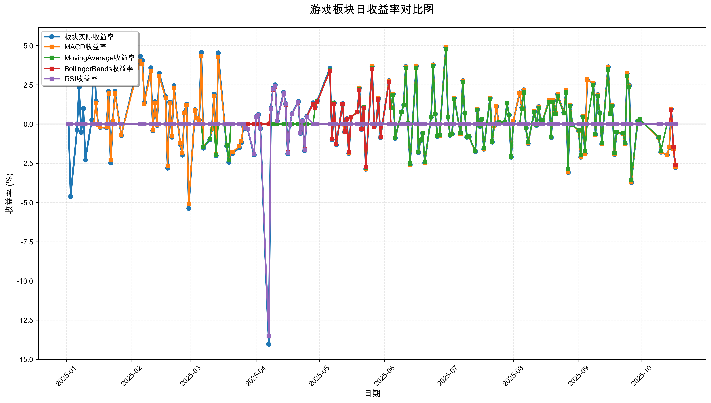
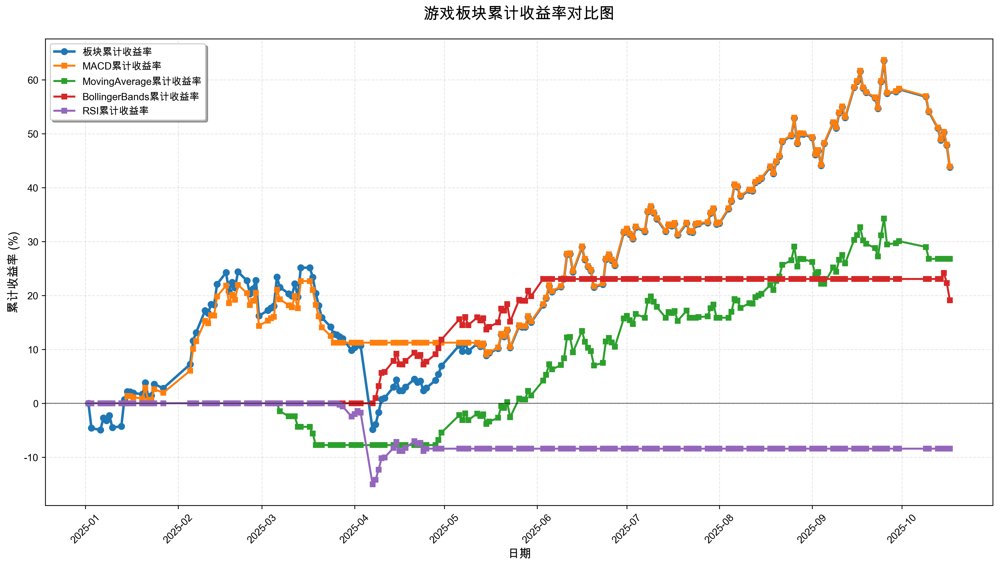

# 策略回测结果报告

**生成时间**: 2025-10-19 19:06:22
**行业板块**: 游戏
**回测期间**: 20250101 至 20251017
**策略数量**: 4

## 📈 分析结论

### 策略表现分析
- **最佳策略**: MACD (总收益率: 43.89%)
- **最差策略**: RSI (总收益率: -8.42%)
### 交易活跃度分析
- **活跃策略**: 4 个
- **非活跃策略**: 0 个
- **最活跃策略**: MovingAverage (交易次数: 14)
### 🚨 异动提醒分析
- **板块异动**: 游戏 近两周出现大幅波动 (最大单日: 3.73%)
- **策略异动**: MACD 近两周出现大幅波动 (最大单日: 3.72%)
- **策略异动**: MovingAverage 近两周出现大幅波动 (最大单日: 3.57%)
### 风险分析
- **MACD**: 最大回撤 -12.08%, 夏普比率 2.4307
- **MovingAverage**: 最大回撤 -7.76%, 夏普比率 1.8777
- **BollingerBands**: 最大回撤 -4.08%, 夏普比率 2.2982
- **RSI**: 最大回撤 -15.03%, 夏普比率 -0.6515

## 📊 综合结果表

| 策略名称           | 初始资金     | 最终价值     | 总收益率   | 年化收益率   | 波动率    |    夏普比率 | 最大回撤    | 总交易次数   | 买入次数   | 卖出次数   | 总交易金额      | 平均交易金额   | 交易频率   |   数据点数 |
|:---------------|:---------|:---------|:-------|:--------|:-------|--------:|:--------|:--------|:-------|:-------|:-----------|:---------|:-------|-------:|
| 板块实际表现         | ¥100,000 | ¥143,762 | 43.76% | 61.84%  | 33.24% |  1.8602 | -23.99% | N/A     | N/A    | N/A    | N/A        | N/A      | N/A    |    190 |
| MACD           | ¥100,000 | ¥143,894 | 43.89% | 62.04%  | 25.52% |  2.4307 | -12.08% | 4       | 2      | 2      | ¥452,652   | ¥113,163 | 0.02   |    190 |
| MovingAverage  | ¥100,000 | ¥126,786 | 26.79% | 37.00%  | 19.70% |  1.8777 | -7.76%  | 14      | 7      | 7      | ¥1,443,559 | ¥103,111 | 0.07   |    190 |
| BollingerBands | ¥100,000 | ¥119,103 | 19.10% | 26.09%  | 11.35% |  2.2982 | -4.08%  | 3       | 2      | 1      | ¥329,894   | ¥109,965 | 0.02   |    190 |
| RSI            | ¥100,000 | ¥91,576  | -8.42% | -11.02% | 16.91% | -0.6515 | -15.03% | 2       | 1      | 1      | ¥184,559   | ¥92,279  | 0.01   |    190 |

## 📊 每日收益率走势图

*图1: 游戏板块每日收益率走势对比*

## 📈 累计收益率走势图

*图2: 游戏板块累计收益率走势对比*

## 📅 日收益明细表

| 日期         | 板块实际收益率   | MACD收益率   | MovingAverage收益率   | BollingerBands收益率   | RSI收益率   |
|:-----------|:----------|:----------|:-------------------|:--------------------|:---------|
| 2025-01-02 | 0.00%     | 0.00%     | 0.00%              | 0.00%               | 0.00%    |
| 2025-01-03 | -4.61%    | 0.00%     | 0.00%              | 0.00%               | 0.00%    |
| 2025-01-06 | -0.36%    | 0.00%     | 0.00%              | 0.00%               | 0.00%    |
| 2025-01-07 | 2.35%     | 0.00%     | 0.00%              | 0.00%               | 0.00%    |
| 2025-01-08 | -0.52%    | 0.00%     | 0.00%              | 0.00%               | 0.00%    |
| 2025-01-09 | 0.99%     | 0.00%     | 0.00%              | 0.00%               | 0.00%    |
| 2025-01-10 | -2.29%    | 0.00%     | 0.00%              | 0.00%               | 0.00%    |
| 2025-01-13 | 0.26%     | 0.00%     | 0.00%              | 0.00%               | 0.00%    |
| 2025-01-14 | 5.19%     | 0.00%     | 0.00%              | 0.00%               | 0.00%    |
| 2025-01-15 | 1.45%     | 1.35%     | 0.00%              | 0.00%               | 0.00%    |
| 2025-01-16 | -0.03%    | -0.03%    | 0.00%              | 0.00%               | 0.00%    |
| 2025-01-17 | -0.22%    | -0.21%    | 0.00%              | 0.00%               | 0.00%    |
| 2025-01-20 | -0.24%    | -0.22%    | 0.00%              | 0.00%               | 0.00%    |
| 2025-01-21 | 2.09%     | 1.95%     | 0.00%              | 0.00%               | 0.00%    |
| 2025-01-22 | -2.48%    | -2.32%    | 0.00%              | 0.00%               | 0.00%    |
| 2025-01-23 | 0.20%     | 0.19%     | 0.00%              | 0.00%               | 0.00%    |
| 2025-01-24 | 2.09%     | 1.95%     | 0.00%              | 0.00%               | 0.00%    |
| 2025-01-27 | -0.73%    | -0.68%    | 0.00%              | 0.00%               | 0.00%    |
| 2025-02-05 | 4.32%     | 4.04%     | 0.00%              | 0.00%               | 0.00%    |
| 2025-02-06 | 4.05%     | 3.80%     | 0.00%              | 0.00%               | 0.00%    |
| 2025-02-07 | 1.39%     | 1.30%     | 0.00%              | 0.00%               | 0.00%    |
| 2025-02-10 | 3.59%     | 3.38%     | 0.00%              | 0.00%               | 0.00%    |
| 2025-02-11 | -0.42%    | -0.40%    | 0.00%              | 0.00%               | 0.00%    |
| 2025-02-12 | 1.42%     | 1.34%     | 0.00%              | 0.00%               | 0.00%    |
| 2025-02-13 | -0.09%    | -0.08%    | 0.00%              | 0.00%               | 0.00%    |
| 2025-02-14 | 3.25%     | 3.06%     | 0.00%              | 0.00%               | 0.00%    |
| 2025-02-17 | 1.77%     | 1.67%     | 0.00%              | 0.00%               | 0.00%    |
| 2025-02-18 | -2.81%    | -2.66%    | 0.00%              | 0.00%               | 0.00%    |
| 2025-02-19 | 1.39%     | 1.31%     | 0.00%              | 0.00%               | 0.00%    |
| 2025-02-20 | -0.83%    | -0.79%    | 0.00%              | 0.00%               | 0.00%    |
| 2025-02-21 | 2.45%     | 2.32%     | 0.00%              | 0.00%               | 0.00%    |
| 2025-02-24 | -1.31%    | -1.24%    | 0.00%              | 0.00%               | 0.00%    |
| 2025-02-25 | -1.97%    | -1.87%    | 0.00%              | 0.00%               | 0.00%    |
| 2025-02-26 | 0.75%     | 0.71%     | 0.00%              | 0.00%               | 0.00%    |
| 2025-02-27 | 1.28%     | 1.21%     | 0.00%              | 0.00%               | 0.00%    |
| 2025-02-28 | -5.37%    | -5.08%    | 0.00%              | 0.00%               | 0.00%    |
| 2025-03-03 | 0.91%     | 0.86%     | 0.00%              | 0.00%               | 0.00%    |
| 2025-03-04 | 0.38%     | 0.36%     | 0.00%              | 0.00%               | 0.00%    |
| 2025-03-05 | 0.27%     | 0.26%     | 0.00%              | 0.00%               | 0.00%    |
| 2025-03-06 | 4.57%     | 4.31%     | 0.00%              | 0.00%               | 0.00%    |
| 2025-03-07 | -1.53%    | -1.45%    | -1.48%             | 0.00%               | 0.00%    |
| 2025-03-10 | -1.00%    | -0.94%    | -0.97%             | 0.00%               | 0.00%    |
| 2025-03-11 | -0.35%    | -0.33%    | 0.00%              | 0.00%               | 0.00%    |
| 2025-03-12 | 1.91%     | 1.80%     | 0.00%              | 0.00%               | 0.00%    |
| 2025-03-13 | -2.01%    | -1.90%    | -1.97%             | 0.00%               | 0.00%    |
| 2025-03-14 | 4.54%     | 4.28%     | 0.00%              | 0.00%               | 0.00%    |
| 2025-03-17 | -0.01%    | -0.01%    | -0.01%             | 0.00%               | 0.00%    |
| 2025-03-18 | -1.40%    | -1.33%    | -1.31%             | 0.00%               | 0.00%    |
| 2025-03-19 | -2.43%    | -2.30%    | -2.27%             | 0.00%               | 0.00%    |
| 2025-03-20 | -1.89%    | -1.78%    | 0.00%              | 0.00%               | 0.00%    |
| 2025-03-21 | -1.87%    | -1.77%    | 0.00%              | 0.00%               | 0.00%    |
| 2025-03-24 | -1.50%    | -1.41%    | 0.00%              | 0.00%               | 0.00%    |
| 2025-03-25 | -1.17%    | -1.10%    | 0.00%              | 0.00%               | 0.00%    |
| 2025-03-26 | -0.13%    | 0.00%     | 0.00%              | 0.00%               | 0.00%    |
| 2025-03-27 | -0.29%    | 0.00%     | 0.00%              | 0.00%               | -0.28%   |
| 2025-03-28 | -0.32%    | 0.00%     | 0.00%              | 0.00%               | -0.31%   |
| 2025-03-31 | -1.96%    | 0.00%     | 0.00%              | 0.00%               | -1.89%   |
| 2025-04-01 | 0.48%     | 0.00%     | 0.00%              | 0.00%               | 0.46%    |
| 2025-04-02 | 0.60%     | 0.00%     | 0.00%              | 0.00%               | 0.58%    |
| 2025-04-03 | -0.29%    | 0.00%     | 0.00%              | 0.00%               | -0.28%   |
| 2025-04-07 | -14.04%   | 0.00%     | 0.00%              | 0.00%               | -13.54%  |
| 2025-04-08 | 1.01%     | 0.00%     | 0.00%              | 0.96%               | 0.97%    |
| 2025-04-09 | 2.30%     | 0.00%     | 0.00%              | 2.19%               | 2.21%    |
| 2025-04-10 | 2.50%     | 0.00%     | 0.00%              | 2.38%               | 2.40%    |
| 2025-04-11 | 0.20%     | 0.00%     | 0.00%              | 0.19%               | 0.19%    |
| 2025-04-14 | 2.03%     | 0.00%     | 0.00%              | 1.93%               | 1.95%    |
| 2025-04-15 | 1.30%     | 0.00%     | 0.00%              | 1.24%               | 1.25%    |
| 2025-04-16 | -1.90%    | 0.00%     | 0.00%              | -1.81%              | -1.83%   |
| 2025-04-17 | -0.04%    | 0.00%     | 0.00%              | -0.03%              | -0.03%   |
| 2025-04-18 | 0.67%     | 0.00%     | 0.00%              | 0.64%               | 0.65%    |
| 2025-04-21 | 1.44%     | 0.00%     | 0.00%              | 1.37%               | 1.38%    |
| 2025-04-22 | -0.59%    | 0.00%     | 0.00%              | -0.56%              | -0.57%   |
| 2025-04-23 | 0.22%     | 0.00%     | 0.00%              | 0.21%               | 0.21%    |
| 2025-04-24 | -1.69%    | 0.00%     | 0.00%              | -1.61%              | -1.63%   |
| 2025-04-25 | 0.49%     | 0.00%     | 0.00%              | 0.47%               | 0.47%    |
| 2025-04-28 | 1.35%     | 0.00%     | 0.00%              | 1.28%               | 0.00%    |
| 2025-04-29 | 1.09%     | 0.00%     | 1.06%              | 1.04%               | 0.00%    |
| 2025-04-30 | 1.48%     | 0.00%     | 1.43%              | 1.41%               | 0.00%    |
| 2025-05-06 | 3.55%     | 0.00%     | 3.44%              | 3.40%               | 0.00%    |
| 2025-05-07 | -0.99%    | 0.00%     | -0.96%             | -0.95%              | 0.00%    |
| 2025-05-08 | 1.35%     | 0.00%     | 1.31%              | 1.29%               | 0.00%    |
| 2025-05-09 | -1.32%    | 0.00%     | -1.28%             | -1.26%              | 0.00%    |
| 2025-05-12 | 1.30%     | 0.00%     | 1.26%              | 1.25%               | 0.00%    |
| 2025-05-13 | -0.50%    | -0.50%    | -0.49%             | -0.48%              | 0.00%    |
| 2025-05-14 | 0.35%     | 0.35%     | 0.34%              | 0.34%               | 0.00%    |
| 2025-05-15 | -1.87%    | -1.86%    | -1.81%             | -1.79%              | 0.00%    |
| 2025-05-16 | 0.44%     | 0.44%     | 0.43%              | 0.42%               | 0.00%    |
| 2025-05-19 | 0.78%     | 0.77%     | 0.75%              | 0.74%               | 0.00%    |
| 2025-05-20 | 2.30%     | 2.29%     | 2.23%              | 2.20%               | 0.00%    |
| 2025-05-21 | -0.33%    | -0.33%    | -0.32%             | -0.32%              | 0.00%    |
| 2025-05-22 | 1.08%     | 1.08%     | 1.05%              | 1.04%               | 0.00%    |
| 2025-05-23 | -2.87%    | -2.86%    | -2.79%             | -2.75%              | 0.00%    |
| 2025-05-26 | 3.68%     | 3.67%     | 3.57%              | 3.52%               | 0.00%    |
| 2025-05-27 | -0.17%    | -0.17%    | -0.17%             | -0.17%              | 0.00%    |
| 2025-05-28 | -0.00%    | -0.00%    | -0.00%             | -0.00%              | 0.00%    |
| 2025-05-29 | 1.64%     | 1.64%     | 1.59%              | 1.57%               | 0.00%    |
| 2025-05-30 | -0.86%    | -0.86%    | -0.83%             | -0.82%              | 0.00%    |
| 2025-06-03 | 2.77%     | 2.77%     | 2.69%              | 2.66%               | 0.00%    |
| 2025-06-04 | 1.05%     | 1.05%     | 1.02%              | 0.00%               | 0.00%    |
| 2025-06-05 | 1.91%     | 1.91%     | 1.86%              | 0.00%               | 0.00%    |
| 2025-06-06 | -0.90%    | -0.90%    | -0.88%             | 0.00%               | 0.00%    |
| 2025-06-09 | 0.77%     | 0.77%     | 0.75%              | 0.00%               | 0.00%    |
| 2025-06-10 | 1.22%     | 1.22%     | 1.19%              | 0.00%               | 0.00%    |
| 2025-06-11 | 3.67%     | 3.66%     | 3.57%              | 0.00%               | 0.00%    |
| 2025-06-12 | 0.08%     | 0.08%     | 0.07%              | 0.00%               | 0.00%    |
| 2025-06-13 | -2.59%    | -2.58%    | -2.52%             | 0.00%               | 0.00%    |
| 2025-06-16 | 3.70%     | 3.69%     | 3.60%              | 0.00%               | 0.00%    |
| 2025-06-17 | -1.81%    | -1.81%    | -1.76%             | 0.00%               | 0.00%    |
| 2025-06-18 | -1.04%    | -1.03%    | -1.01%             | 0.00%               | 0.00%    |
| 2025-06-19 | -0.58%    | -0.58%    | -0.56%             | 0.00%               | 0.00%    |
| 2025-06-20 | -2.47%    | -2.46%    | -2.40%             | 0.00%               | 0.00%    |
| 2025-06-23 | 0.44%     | 0.44%     | 0.43%              | 0.00%               | 0.00%    |
| 2025-06-24 | 3.78%     | 3.77%     | 3.68%              | 0.00%               | 0.00%    |
| 2025-06-25 | 0.64%     | 0.64%     | 0.62%              | 0.00%               | 0.00%    |
| 2025-06-26 | -0.78%    | -0.78%    | -0.76%             | 0.00%               | 0.00%    |
| 2025-06-27 | -0.75%    | -0.75%    | -0.73%             | 0.00%               | 0.00%    |
| 2025-06-30 | 4.89%     | 4.88%     | 4.76%              | 0.00%               | 0.00%    |
| 2025-07-01 | 0.44%     | 0.44%     | 0.43%              | 0.00%               | 0.00%    |
| 2025-07-02 | -0.72%    | -0.72%    | -0.70%             | 0.00%               | 0.00%    |
| 2025-07-03 | -0.63%    | -0.63%    | -0.62%             | 0.00%               | 0.00%    |
| 2025-07-04 | 1.65%     | 1.64%     | 1.61%              | 0.00%               | 0.00%    |
| 2025-07-07 | -0.61%    | -0.61%    | -0.59%             | 0.00%               | 0.00%    |
| 2025-07-08 | 2.77%     | 2.77%     | 2.70%              | 0.00%               | 0.00%    |
| 2025-07-09 | 0.70%     | 0.70%     | 0.68%              | 0.00%               | 0.00%    |
| 2025-07-10 | -0.83%    | -0.83%    | -0.81%             | 0.00%               | 0.00%    |
| 2025-07-11 | -0.81%    | -0.81%    | -0.79%             | 0.00%               | 0.00%    |
| 2025-07-14 | -1.75%    | -1.75%    | -1.71%             | 0.00%               | 0.00%    |
| 2025-07-15 | 0.93%     | 0.93%     | 0.91%              | 0.00%               | 0.00%    |
| 2025-07-16 | -0.14%    | -0.14%    | -0.14%             | 0.00%               | 0.00%    |
| 2025-07-17 | 0.32%     | 0.32%     | 0.31%              | 0.00%               | 0.00%    |
| 2025-07-18 | -1.59%    | -1.59%    | -1.55%             | 0.00%               | 0.00%    |
| 2025-07-21 | 1.66%     | 1.66%     | 1.62%              | 0.00%               | 0.00%    |
| 2025-07-22 | -1.15%    | -1.15%    | -1.12%             | 0.00%               | 0.00%    |
| 2025-07-23 | -0.11%    | -0.11%    | 0.00%              | 0.00%               | 0.00%    |
| 2025-07-24 | 1.12%     | 1.12%     | 0.00%              | 0.00%               | 0.00%    |
| 2025-07-25 | 0.10%     | 0.10%     | 0.10%              | 0.00%               | 0.00%    |
| 2025-07-28 | 0.13%     | 0.13%     | 0.13%              | 0.00%               | 0.00%    |
| 2025-07-29 | 1.33%     | 1.32%     | 1.31%              | 0.00%               | 0.00%    |
| 2025-07-30 | 0.59%     | 0.59%     | 0.58%              | 0.00%               | 0.00%    |
| 2025-07-31 | -2.11%    | -2.10%    | -2.07%             | 0.00%               | 0.00%    |
| 2025-08-01 | 0.17%     | 0.17%     | 0.00%              | 0.00%               | 0.00%    |
| 2025-08-04 | 1.99%     | 1.99%     | 0.00%              | 0.00%               | 0.00%    |
| 2025-08-05 | 1.04%     | 1.04%     | 0.96%              | 0.00%               | 0.00%    |
| 2025-08-06 | 2.18%     | 2.18%     | 2.01%              | 0.00%               | 0.00%    |
| 2025-08-07 | -0.25%    | -0.24%    | -0.23%             | 0.00%               | 0.00%    |
| 2025-08-08 | -1.25%    | -1.24%    | -1.15%             | 0.00%               | 0.00%    |
| 2025-08-11 | 0.80%     | 0.80%     | 0.74%              | 0.00%               | 0.00%    |
| 2025-08-12 | -0.08%    | -0.08%    | -0.08%             | 0.00%               | 0.00%    |
| 2025-08-13 | 1.11%     | 1.11%     | 1.03%              | 0.00%               | 0.00%    |
| 2025-08-14 | 0.27%     | 0.27%     | 0.25%              | 0.00%               | 0.00%    |
| 2025-08-15 | 0.26%     | 0.26%     | 0.24%              | 0.00%               | 0.00%    |
| 2025-08-18 | 1.51%     | 1.51%     | 1.39%              | 0.00%               | 0.00%    |
| 2025-08-19 | -0.86%    | -0.86%    | -0.80%             | 0.00%               | 0.00%    |
| 2025-08-20 | 1.52%     | 1.52%     | 1.41%              | 0.00%               | 0.00%    |
| 2025-08-21 | 0.70%     | 0.70%     | 0.65%              | 0.00%               | 0.00%    |
| 2025-08-22 | 1.90%     | 1.89%     | 1.76%              | 0.00%               | 0.00%    |
| 2025-08-25 | 0.73%     | 0.73%     | 0.68%              | 0.00%               | 0.00%    |
| 2025-08-26 | 2.17%     | 2.17%     | 2.01%              | 0.00%               | 0.00%    |
| 2025-08-27 | -3.08%    | -3.08%    | -2.87%             | 0.00%               | 0.00%    |
| 2025-08-28 | 1.22%     | 1.22%     | 1.14%              | 0.00%               | 0.00%    |
| 2025-08-29 | -0.04%    | -0.04%    | -0.04%             | 0.00%               | 0.00%    |
| 2025-09-01 | -0.43%    | -0.43%    | -0.40%             | 0.00%               | 0.00%    |
| 2025-09-02 | -2.11%    | -2.11%    | -1.96%             | 0.00%               | 0.00%    |
| 2025-09-03 | 0.51%     | 0.50%     | 0.47%              | 0.00%               | 0.00%    |
| 2025-09-04 | -1.89%    | -1.88%    | -1.75%             | 0.00%               | 0.00%    |
| 2025-09-05 | 2.84%     | 2.84%     | 0.00%              | 0.00%               | 0.00%    |
| 2025-09-08 | 2.60%     | 2.60%     | 2.48%              | 0.00%               | 0.00%    |
| 2025-09-09 | -0.67%    | -0.67%    | -0.64%             | 0.00%               | 0.00%    |
| 2025-09-10 | 1.87%     | 1.87%     | 1.79%              | 0.00%               | 0.00%    |
| 2025-09-11 | 0.72%     | 0.72%     | 0.68%              | 0.00%               | 0.00%    |
| 2025-09-12 | -1.27%    | -1.27%    | -1.21%             | 0.00%               | 0.00%    |
| 2025-09-15 | 3.65%     | 3.64%     | 3.48%              | 0.00%               | 0.00%    |
| 2025-09-16 | 0.69%     | 0.69%     | 0.66%              | 0.00%               | 0.00%    |
| 2025-09-17 | 1.18%     | 1.18%     | 1.13%              | 0.00%               | 0.00%    |
| 2025-09-18 | -1.92%    | -1.91%    | -1.83%             | 0.00%               | 0.00%    |
| 2025-09-19 | -0.52%    | -0.52%    | -0.50%             | 0.00%               | 0.00%    |
| 2025-09-22 | -0.63%    | -0.63%    | -0.60%             | 0.00%               | 0.00%    |
| 2025-09-23 | -1.27%    | -1.26%    | -1.21%             | 0.00%               | 0.00%    |
| 2025-09-24 | 3.23%     | 3.23%     | 3.08%              | 0.00%               | 0.00%    |
| 2025-09-25 | 2.46%     | 2.45%     | 2.35%              | 0.00%               | 0.00%    |
| 2025-09-26 | -3.73%    | -3.72%    | -3.57%             | 0.00%               | 0.00%    |
| 2025-09-29 | 0.19%     | 0.19%     | 0.18%              | 0.00%               | 0.00%    |
| 2025-09-30 | 0.30%     | 0.30%     | 0.29%              | 0.00%               | 0.00%    |
| 2025-10-09 | -0.87%    | -0.87%    | -0.83%             | 0.00%               | 0.00%    |
| 2025-10-10 | -1.79%    | -1.78%    | -1.71%             | 0.00%               | 0.00%    |
| 2025-10-13 | -1.96%    | -1.96%    | 0.00%              | 0.00%               | 0.00%    |
| 2025-10-14 | -1.49%    | -1.48%    | 0.00%              | 0.00%               | 0.00%    |
| 2025-10-15 | 0.96%     | 0.96%     | 0.00%              | 0.91%               | 0.00%    |
| 2025-10-16 | -1.57%    | -1.57%    | 0.00%              | -1.49%              | 0.00%    |
| 2025-10-17 | -2.77%    | -2.76%    | 0.00%              | -2.63%              | 0.00%    |

## 📊 日收益统计摘要

| 指标                | 平均日收益率   | 最大日收益率   | 最小日收益率   | 正收益天数   | 负收益天数   |
|:------------------|:---------|:---------|:---------|:--------|:--------|
| 板块实际收益率           | 0.21%    | 5.19%    | -14.04%  | 102天    | 86天     |
| MACD收益率           | 0.20%    | 4.88%    | -5.08%   | 80天     | 70天     |
| MovingAverage收益率  | 0.13%    | 4.76%    | -3.57%   | 59天     | 50天     |
| BollingerBands收益率 | 0.09%    | 3.52%    | -2.75%   | 25天     | 14天     |
| RSI收益率            | -0.04%   | 2.40%    | -13.54%  | 12天     | 9天      |

## 📈 累计收益明细表

| 日期         | 板块累计收益率   | MACD累计收益率   | MovingAverage累计收益率   | BollingerBands累计收益率   | RSI累计收益率   |
|:-----------|:----------|:------------|:---------------------|:----------------------|:-----------|
| 2025-01-02 | 0.00%     | 0.00%       | 0.00%                | 0.00%                 | 0.00%      |
| 2025-01-03 | -4.61%    | 0.00%       | 0.00%                | 0.00%                 | 0.00%      |
| 2025-01-06 | -4.96%    | 0.00%       | 0.00%                | 0.00%                 | 0.00%      |
| 2025-01-07 | -2.72%    | 0.00%       | 0.00%                | 0.00%                 | 0.00%      |
| 2025-01-08 | -3.23%    | 0.00%       | 0.00%                | 0.00%                 | 0.00%      |
| 2025-01-09 | -2.27%    | 0.00%       | 0.00%                | 0.00%                 | 0.00%      |
| 2025-01-10 | -4.51%    | 0.00%       | 0.00%                | 0.00%                 | 0.00%      |
| 2025-01-13 | -4.26%    | 0.00%       | 0.00%                | 0.00%                 | 0.00%      |
| 2025-01-14 | 0.71%     | 0.00%       | 0.00%                | 0.00%                 | 0.00%      |
| 2025-01-15 | 2.17%     | 1.35%       | 0.00%                | 0.00%                 | 0.00%      |
| 2025-01-16 | 2.14%     | 1.33%       | 0.00%                | 0.00%                 | 0.00%      |
| 2025-01-17 | 1.91%     | 1.11%       | 0.00%                | 0.00%                 | 0.00%      |
| 2025-01-20 | 1.67%     | 0.89%       | 0.00%                | 0.00%                 | 0.00%      |
| 2025-01-21 | 3.79%     | 2.86%       | 0.00%                | 0.00%                 | 0.00%      |
| 2025-01-22 | 1.22%     | 0.47%       | 0.00%                | 0.00%                 | 0.00%      |
| 2025-01-23 | 1.42%     | 0.66%       | 0.00%                | 0.00%                 | 0.00%      |
| 2025-01-24 | 3.55%     | 2.63%       | 0.00%                | 0.00%                 | 0.00%      |
| 2025-01-27 | 2.79%     | 1.93%       | 0.00%                | 0.00%                 | 0.00%      |
| 2025-02-05 | 7.23%     | 6.05%       | 0.00%                | 0.00%                 | 0.00%      |
| 2025-02-06 | 11.57%    | 10.07%      | 0.00%                | 0.00%                 | 0.00%      |
| 2025-02-07 | 13.12%    | 11.51%      | 0.00%                | 0.00%                 | 0.00%      |
| 2025-02-10 | 17.18%    | 15.27%      | 0.00%                | 0.00%                 | 0.00%      |
| 2025-02-11 | 16.69%    | 14.82%      | 0.00%                | 0.00%                 | 0.00%      |
| 2025-02-12 | 18.35%    | 16.36%      | 0.00%                | 0.00%                 | 0.00%      |
| 2025-02-13 | 18.24%    | 16.26%      | 0.00%                | 0.00%                 | 0.00%      |
| 2025-02-14 | 22.08%    | 19.82%      | 0.00%                | 0.00%                 | 0.00%      |
| 2025-02-17 | 24.24%    | 21.82%      | 0.00%                | 0.00%                 | 0.00%      |
| 2025-02-18 | 20.74%    | 18.58%      | 0.00%                | 0.00%                 | 0.00%      |
| 2025-02-19 | 22.42%    | 20.13%      | 0.00%                | 0.00%                 | 0.00%      |
| 2025-02-20 | 21.40%    | 19.19%      | 0.00%                | 0.00%                 | 0.00%      |
| 2025-02-21 | 24.37%    | 21.95%      | 0.00%                | 0.00%                 | 0.00%      |
| 2025-02-24 | 22.74%    | 20.44%      | 0.00%                | 0.00%                 | 0.00%      |
| 2025-02-25 | 20.32%    | 18.19%      | 0.00%                | 0.00%                 | 0.00%      |
| 2025-02-26 | 21.23%    | 19.03%      | 0.00%                | 0.00%                 | 0.00%      |
| 2025-02-27 | 22.78%    | 20.47%      | 0.00%                | 0.00%                 | 0.00%      |
| 2025-02-28 | 16.19%    | 14.35%      | 0.00%                | 0.00%                 | 0.00%      |
| 2025-03-03 | 17.25%    | 15.34%      | 0.00%                | 0.00%                 | 0.00%      |
| 2025-03-04 | 17.70%    | 15.76%      | 0.00%                | 0.00%                 | 0.00%      |
| 2025-03-05 | 18.02%    | 16.05%      | 0.00%                | 0.00%                 | 0.00%      |
| 2025-03-06 | 23.41%    | 21.05%      | 0.00%                | 0.00%                 | 0.00%      |
| 2025-03-07 | 21.52%    | 19.30%      | -1.48%               | 0.00%                 | 0.00%      |
| 2025-03-10 | 20.31%    | 18.18%      | -2.43%               | 0.00%                 | 0.00%      |
| 2025-03-11 | 19.89%    | 17.79%      | -2.43%               | 0.00%                 | 0.00%      |
| 2025-03-12 | 22.17%    | 19.90%      | -2.43%               | 0.00%                 | 0.00%      |
| 2025-03-13 | 19.72%    | 17.63%      | -4.36%               | 0.00%                 | 0.00%      |
| 2025-03-14 | 25.15%    | 22.67%      | -4.36%               | 0.00%                 | 0.00%      |
| 2025-03-17 | 25.14%    | 22.66%      | -4.36%               | 0.00%                 | 0.00%      |
| 2025-03-18 | 23.38%    | 21.03%      | -5.62%               | 0.00%                 | 0.00%      |
| 2025-03-19 | 20.38%    | 18.25%      | -7.76%               | 0.00%                 | 0.00%      |
| 2025-03-20 | 18.11%    | 16.14%      | -7.76%               | 0.00%                 | 0.00%      |
| 2025-03-21 | 15.90%    | 14.09%      | -7.76%               | 0.00%                 | 0.00%      |
| 2025-03-24 | 14.17%    | 12.48%      | -7.76%               | 0.00%                 | 0.00%      |
| 2025-03-25 | 12.83%    | 11.24%      | -7.76%               | 0.00%                 | 0.00%      |
| 2025-03-26 | 12.69%    | 11.24%      | -7.76%               | 0.00%                 | 0.00%      |
| 2025-03-27 | 12.36%    | 11.24%      | -7.76%               | 0.00%                 | -0.28%     |
| 2025-03-28 | 12.00%    | 11.24%      | -7.76%               | 0.00%                 | -0.59%     |
| 2025-03-31 | 9.81%     | 11.24%      | -7.76%               | 0.00%                 | -2.47%     |
| 2025-04-01 | 10.33%    | 11.24%      | -7.76%               | 0.00%                 | -2.02%     |
| 2025-04-02 | 11.00%    | 11.24%      | -7.76%               | 0.00%                 | -1.45%     |
| 2025-04-03 | 10.68%    | 11.24%      | -7.76%               | 0.00%                 | -1.73%     |
| 2025-04-07 | -4.87%    | 11.24%      | -7.76%               | 0.00%                 | -15.03%    |
| 2025-04-08 | -3.91%    | 11.24%      | -7.76%               | 0.96%                 | -14.21%    |
| 2025-04-09 | -1.69%    | 11.24%      | -7.76%               | 3.17%                 | -12.32%    |
| 2025-04-10 | 0.76%     | 11.24%      | -7.76%               | 5.62%                 | -10.21%    |
| 2025-04-11 | 0.96%     | 11.24%      | -7.76%               | 5.82%                 | -10.05%    |
| 2025-04-14 | 3.01%     | 11.24%      | -7.76%               | 7.86%                 | -8.29%     |
| 2025-04-15 | 4.35%     | 11.24%      | -7.76%               | 9.20%                 | -7.15%     |
| 2025-04-16 | 2.36%     | 11.24%      | -7.76%               | 7.22%                 | -8.84%     |
| 2025-04-17 | 2.33%     | 11.24%      | -7.76%               | 7.19%                 | -8.87%     |
| 2025-04-18 | 3.02%     | 11.24%      | -7.76%               | 7.87%                 | -8.29%     |
| 2025-04-21 | 4.50%     | 11.24%      | -7.76%               | 9.36%                 | -7.02%     |
| 2025-04-22 | 3.88%     | 11.24%      | -7.76%               | 8.74%                 | -7.54%     |
| 2025-04-23 | 4.11%     | 11.24%      | -7.76%               | 8.97%                 | -7.35%     |
| 2025-04-24 | 2.35%     | 11.24%      | -7.76%               | 7.21%                 | -8.86%     |
| 2025-04-25 | 2.85%     | 11.24%      | -7.76%               | 7.71%                 | -8.42%     |
| 2025-04-28 | 4.24%     | 11.24%      | -7.76%               | 9.10%                 | -8.42%     |
| 2025-04-29 | 5.38%     | 11.24%      | -6.79%               | 10.23%                | -8.42%     |
| 2025-04-30 | 6.93%     | 11.24%      | -5.45%               | 11.79%                | -8.42%     |
| 2025-05-06 | 10.74%    | 11.24%      | -2.20%               | 15.58%                | -8.42%     |
| 2025-05-07 | 9.63%     | 11.24%      | -3.14%               | 14.49%                | -8.42%     |
| 2025-05-08 | 11.12%    | 11.24%      | -1.87%               | 15.97%                | -8.42%     |
| 2025-05-09 | 9.65%     | 11.24%      | -3.13%               | 14.50%                | -8.42%     |
| 2025-05-12 | 11.08%    | 11.24%      | -1.90%               | 15.93%                | -8.42%     |
| 2025-05-13 | 10.52%    | 10.69%      | -2.38%               | 15.37%                | -8.42%     |
| 2025-05-14 | 10.91%    | 11.08%      | -2.05%               | 15.76%                | -8.42%     |
| 2025-05-15 | 8.84%     | 9.01%       | -3.82%               | 13.69%                | -8.42%     |
| 2025-05-16 | 9.32%     | 9.49%       | -3.41%               | 14.17%                | -8.42%     |
| 2025-05-19 | 10.17%    | 10.33%      | -2.69%               | 15.02%                | -8.42%     |
| 2025-05-20 | 12.70%    | 12.86%      | -0.52%               | 17.55%                | -8.42%     |
| 2025-05-21 | 12.33%    | 12.49%      | -0.84%               | 17.17%                | -8.42%     |
| 2025-05-22 | 13.54%    | 13.70%      | 0.20%                | 18.39%                | -8.42%     |
| 2025-05-23 | 10.28%    | 10.45%      | -2.59%               | 15.13%                | -8.42%     |
| 2025-05-26 | 14.34%    | 14.50%      | 0.89%                | 19.19%                | -8.42%     |
| 2025-05-27 | 14.14%    | 14.31%      | 0.72%                | 18.99%                | -8.42%     |
| 2025-05-28 | 14.14%    | 14.31%      | 0.72%                | 18.99%                | -8.42%     |
| 2025-05-29 | 16.01%    | 16.18%      | 2.32%                | 20.86%                | -8.42%     |
| 2025-05-30 | 15.02%    | 15.18%      | 1.47%                | 19.86%                | -8.42%     |
| 2025-06-03 | 18.21%    | 18.37%      | 4.20%                | 23.05%                | -8.42%     |
| 2025-06-04 | 19.45%    | 19.61%      | 5.26%                | 23.05%                | -8.42%     |
| 2025-06-05 | 21.74%    | 21.89%      | 7.22%                | 23.05%                | -8.42%     |
| 2025-06-06 | 20.64%    | 20.80%      | 6.28%                | 23.05%                | -8.42%     |
| 2025-06-09 | 21.57%    | 21.72%      | 7.08%                | 23.05%                | -8.42%     |
| 2025-06-10 | 23.05%    | 23.20%      | 8.34%                | 23.05%                | -8.42%     |
| 2025-06-11 | 27.57%    | 27.72%      | 12.22%               | 23.05%                | -8.42%     |
| 2025-06-12 | 27.67%    | 27.81%      | 12.30%               | 23.05%                | -8.42%     |
| 2025-06-13 | 24.36%    | 24.52%      | 9.47%                | 23.05%                | -8.42%     |
| 2025-06-16 | 28.96%    | 29.11%      | 13.41%               | 23.05%                | -8.42%     |
| 2025-06-17 | 26.63%    | 26.78%      | 11.41%               | 23.05%                | -8.42%     |
| 2025-06-18 | 25.31%    | 25.47%      | 10.28%               | 23.05%                | -8.42%     |
| 2025-06-19 | 24.59%    | 24.74%      | 9.67%                | 23.05%                | -8.42%     |
| 2025-06-20 | 21.52%    | 21.67%      | 7.03%                | 23.05%                | -8.42%     |
| 2025-06-23 | 22.05%    | 22.21%      | 7.49%                | 23.05%                | -8.42%     |
| 2025-06-24 | 26.67%    | 26.82%      | 11.45%               | 23.05%                | -8.42%     |
| 2025-06-25 | 27.48%    | 27.63%      | 12.14%               | 23.05%                | -8.42%     |
| 2025-06-26 | 26.49%    | 26.64%      | 11.29%               | 23.05%                | -8.42%     |
| 2025-06-27 | 25.54%    | 25.69%      | 10.48%               | 23.05%                | -8.42%     |
| 2025-06-30 | 31.68%    | 31.83%      | 15.74%               | 23.05%                | -8.42%     |
| 2025-07-01 | 32.26%    | 32.41%      | 16.23%               | 23.05%                | -8.42%     |
| 2025-07-02 | 31.31%    | 31.46%      | 15.42%               | 23.05%                | -8.42%     |
| 2025-07-03 | 30.48%    | 30.62%      | 14.71%               | 23.05%                | -8.42%     |
| 2025-07-04 | 32.63%    | 32.77%      | 16.55%               | 23.05%                | -8.42%     |
| 2025-07-07 | 31.82%    | 31.97%      | 15.86%               | 23.05%                | -8.42%     |
| 2025-07-08 | 35.48%    | 35.62%      | 18.99%               | 23.05%                | -8.42%     |
| 2025-07-09 | 36.42%    | 36.56%      | 19.80%               | 23.05%                | -8.42%     |
| 2025-07-10 | 35.28%    | 35.43%      | 18.82%               | 23.05%                | -8.42%     |
| 2025-07-11 | 34.19%    | 34.33%      | 17.88%               | 23.05%                | -8.42%     |
| 2025-07-14 | 31.84%    | 31.98%      | 15.87%               | 23.05%                | -8.42%     |
| 2025-07-15 | 33.06%    | 33.20%      | 16.92%               | 23.05%                | -8.42%     |
| 2025-07-16 | 32.87%    | 33.01%      | 16.75%               | 23.05%                | -8.42%     |
| 2025-07-17 | 33.29%    | 33.44%      | 17.12%               | 23.05%                | -8.42%     |
| 2025-07-18 | 31.17%    | 31.32%      | 15.30%               | 23.05%                | -8.42%     |
| 2025-07-21 | 33.35%    | 33.49%      | 17.17%               | 23.05%                | -8.42%     |
| 2025-07-22 | 31.81%    | 31.96%      | 15.85%               | 23.05%                | -8.42%     |
| 2025-07-23 | 31.67%    | 31.82%      | 15.85%               | 23.05%                | -8.42%     |
| 2025-07-24 | 33.15%    | 33.29%      | 15.85%               | 23.05%                | -8.42%     |
| 2025-07-25 | 33.29%    | 33.43%      | 15.97%               | 23.05%                | -8.42%     |
| 2025-07-28 | 33.46%    | 33.61%      | 16.12%               | 23.05%                | -8.42%     |
| 2025-07-29 | 35.23%    | 35.37%      | 17.63%               | 23.05%                | -8.42%     |
| 2025-07-30 | 36.03%    | 36.17%      | 18.32%               | 23.05%                | -8.42%     |
| 2025-07-31 | 33.17%    | 33.31%      | 15.87%               | 23.05%                | -8.42%     |
| 2025-08-01 | 33.39%    | 33.54%      | 15.87%               | 23.05%                | -8.42%     |
| 2025-08-04 | 36.05%    | 36.19%      | 15.87%               | 23.05%                | -8.42%     |
| 2025-08-05 | 37.47%    | 37.61%      | 16.98%               | 23.05%                | -8.42%     |
| 2025-08-06 | 40.47%    | 40.60%      | 19.33%               | 23.05%                | -8.42%     |
| 2025-08-07 | 40.12%    | 40.26%      | 19.06%               | 23.05%                | -8.42%     |
| 2025-08-08 | 38.38%    | 38.52%      | 17.69%               | 23.05%                | -8.42%     |
| 2025-08-11 | 39.49%    | 39.63%      | 18.57%               | 23.05%                | -8.42%     |
| 2025-08-12 | 39.37%    | 39.51%      | 18.47%               | 23.05%                | -8.42%     |
| 2025-08-13 | 40.93%    | 41.06%      | 19.69%               | 23.05%                | -8.42%     |
| 2025-08-14 | 41.30%    | 41.44%      | 19.99%               | 23.05%                | -8.42%     |
| 2025-08-15 | 41.68%    | 41.81%      | 20.28%               | 23.05%                | -8.42%     |
| 2025-08-18 | 43.81%    | 43.95%      | 21.96%               | 23.05%                | -8.42%     |
| 2025-08-19 | 42.57%    | 42.71%      | 20.99%               | 23.05%                | -8.42%     |
| 2025-08-20 | 44.75%    | 44.88%      | 22.69%               | 23.05%                | -8.42%     |
| 2025-08-21 | 45.77%    | 45.90%      | 23.49%               | 23.05%                | -8.42%     |
| 2025-08-22 | 48.53%    | 48.66%      | 25.66%               | 23.05%                | -8.42%     |
| 2025-08-25 | 49.61%    | 49.74%      | 26.51%               | 23.05%                | -8.42%     |
| 2025-08-26 | 52.86%    | 52.98%      | 29.06%               | 23.05%                | -8.42%     |
| 2025-08-27 | 48.15%    | 48.27%      | 25.36%               | 23.05%                | -8.42%     |
| 2025-08-28 | 49.96%    | 50.09%      | 26.78%               | 23.05%                | -8.42%     |
| 2025-08-29 | 49.90%    | 50.02%      | 26.73%               | 23.05%                | -8.42%     |
| 2025-09-01 | 49.25%    | 49.38%      | 26.23%               | 23.05%                | -8.42%     |
| 2025-09-02 | 46.10%    | 46.23%      | 23.75%               | 23.05%                | -8.42%     |
| 2025-09-03 | 46.84%    | 46.97%      | 24.33%               | 23.05%                | -8.42%     |
| 2025-09-04 | 44.07%    | 44.20%      | 22.16%               | 23.05%                | -8.42%     |
| 2025-09-05 | 48.17%    | 48.29%      | 22.16%               | 23.05%                | -8.42%     |
| 2025-09-08 | 52.02%    | 52.14%      | 25.19%               | 23.05%                | -8.42%     |
| 2025-09-09 | 51.00%    | 51.13%      | 24.39%               | 23.05%                | -8.42%     |
| 2025-09-10 | 53.83%    | 53.95%      | 26.61%               | 23.05%                | -8.42%     |
| 2025-09-11 | 54.94%    | 55.06%      | 27.48%               | 23.05%                | -8.42%     |
| 2025-09-12 | 52.97%    | 53.09%      | 25.93%               | 23.05%                | -8.42%     |
| 2025-09-15 | 58.56%    | 58.67%      | 30.32%               | 23.05%                | -8.42%     |
| 2025-09-16 | 59.66%    | 59.77%      | 31.18%               | 23.05%                | -8.42%     |
| 2025-09-17 | 61.54%    | 61.66%      | 32.66%               | 23.05%                | -8.42%     |
| 2025-09-18 | 58.45%    | 58.56%      | 30.23%               | 23.05%                | -8.42%     |
| 2025-09-19 | 57.62%    | 57.74%      | 29.58%               | 23.05%                | -8.42%     |
| 2025-09-22 | 56.62%    | 56.74%      | 28.80%               | 23.05%                | -8.42%     |
| 2025-09-23 | 54.64%    | 54.76%      | 27.24%               | 23.05%                | -8.42%     |
| 2025-09-24 | 59.64%    | 59.75%      | 31.16%               | 23.05%                | -8.42%     |
| 2025-09-25 | 63.56%    | 63.67%      | 34.25%               | 23.05%                | -8.42%     |
| 2025-09-26 | 57.46%    | 57.58%      | 29.46%               | 23.05%                | -8.42%     |
| 2025-09-29 | 57.77%    | 57.88%      | 29.70%               | 23.05%                | -8.42%     |
| 2025-09-30 | 58.25%    | 58.36%      | 30.07%               | 23.05%                | -8.42%     |
| 2025-10-09 | 56.86%    | 56.98%      | 28.99%               | 23.05%                | -8.42%     |
| 2025-10-10 | 54.06%    | 54.18%      | 26.79%               | 23.05%                | -8.42%     |
| 2025-10-13 | 51.03%    | 51.16%      | 26.79%               | 23.05%                | -8.42%     |
| 2025-10-14 | 48.79%    | 48.91%      | 26.79%               | 23.05%                | -8.42%     |
| 2025-10-15 | 50.22%    | 50.35%      | 26.79%               | 24.17%                | -8.42%     |
| 2025-10-16 | 47.86%    | 47.99%      | 26.79%               | 22.32%                | -8.42%     |
| 2025-10-17 | 43.76%    | 43.89%      | 26.79%               | 19.10%                | -8.42%     |

## 📊 累计收益统计摘要

| 指标                  | 最终累计收益率   | 最大累计收益率   | 最小累计收益率   | 累计收益波动   | 收益稳定性   |
|:--------------------|:----------|:----------|:----------|:---------|:--------|
| 板块累计收益率             | 43.76%    | 63.56%    | -4.96%    | 68.52%   | 波动      |
| MACD累计收益率           | 43.89%    | 63.67%    | 0.00%     | 63.67%   | 波动      |
| MovingAverage累计收益率  | 26.79%    | 34.25%    | -7.76%    | 42.01%   | 波动      |
| BollingerBands累计收益率 | 19.10%    | 24.17%    | 0.00%     | 24.17%   | 波动      |
| RSI累计收益率            | -8.42%    | 0.00%     | -15.03%   | 15.03%   | 稳定      |

