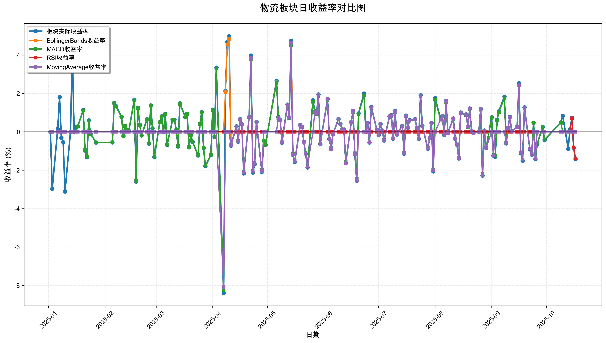
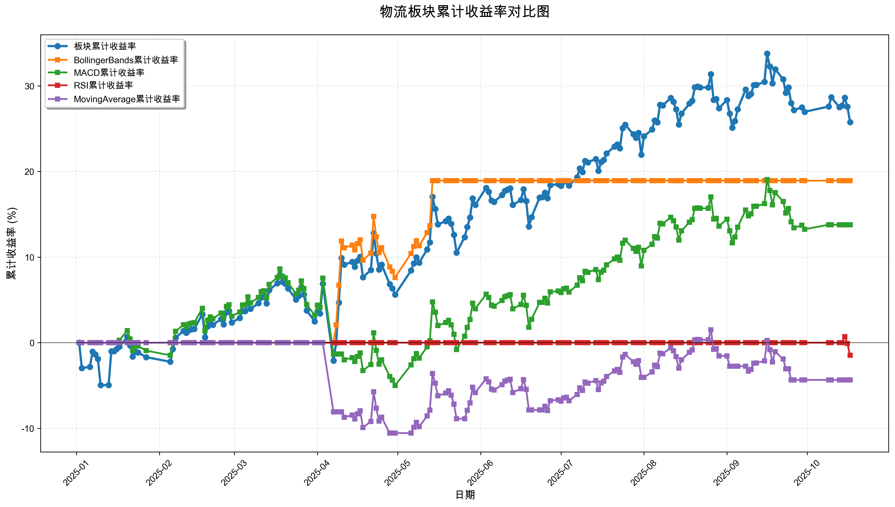

# 策略回测结果报告

**生成时间**: 2025-10-19 19:03:49
**行业板块**: 物流
**回测期间**: 20250101 至 20251017
**策略数量**: 4

## 📈 分析结论

### 策略表现分析
- **最佳策略**: BollingerBands (总收益率: 18.93%)
- **最差策略**: MovingAverage (总收益率: -4.35%)
### 交易活跃度分析
- **活跃策略**: 4 个
- **非活跃策略**: 0 个
- **最活跃策略**: MovingAverage (交易次数: 18)
### 🚨 异动提醒分析
- 未检测到明显异动情况
### 风险分析
- **BollingerBands**: 最大回撤 -6.20%, 夏普比率 2.1127
- **MACD**: 最大回撤 -12.53%, 夏普比率 0.9671
- **RSI**: 最大回撤 -2.17%, 夏普比率 -0.9705
- **MovingAverage**: 最大回撤 -10.56%, 夏普比率 -0.3453

## 📊 综合结果表

| 策略名称           | 初始资金     | 最终价值     | 总收益率   | 年化收益率   | 波动率    |    夏普比率 | 最大回撤    | 总交易次数   | 买入次数   | 卖出次数   | 总交易金额      | 平均交易金额   | 交易频率   |   数据点数 |
|:---------------|:---------|:---------|:-------|:--------|:-------|--------:|:--------|:--------|:-------|:-------|:-----------|:---------|:-------|-------:|
| 板块实际表现         | ¥100,000 | ¥125,765 | 25.76% | 35.53%  | 22.91% |  1.5513 | -9.31%  | N/A     | N/A    | N/A    | N/A        | N/A      | N/A    |    190 |
| BollingerBands | ¥100,000 | ¥118,931 | 18.93% | 25.85%  | 12.24% |  2.1127 | -6.20%  | 2       | 1      | 1      | ¥212,645   | ¥106,323 | 0.01   |    190 |
| MACD           | ¥100,000 | ¥113,781 | 13.78% | 18.68%  | 19.31% |  0.9671 | -12.53% | 4       | 2      | 2      | ¥397,959   | ¥99,490  | 0.02   |    190 |
| RSI            | ¥100,000 | ¥98,522  | -1.48% | -1.96%  | 2.02%  | -0.9705 | -2.17%  | 1       | 1      | 0      | ¥97,621    | ¥97,621  | 0.01   |    190 |
| MovingAverage  | ¥100,000 | ¥95,646  | -4.35% | -5.73%  | 16.60% | -0.3453 | -10.56% | 18      | 9      | 9      | ¥1,661,280 | ¥92,293  | 0.09   |    190 |

## 📊 每日收益率走势图

*图1: 物流板块每日收益率走势对比*

## 📈 累计收益率走势图

*图2: 物流板块累计收益率走势对比*

## 📅 日收益明细表

| 日期         | 板块实际收益率   | BollingerBands收益率   | MACD收益率   | RSI收益率   | MovingAverage收益率   |
|:-----------|:----------|:--------------------|:----------|:---------|:-------------------|
| 2025-01-02 | 0.00%     | 0.00%               | 0.00%     | 0.00%    | 0.00%              |
| 2025-01-03 | -2.97%    | 0.00%               | 0.00%     | 0.00%    | 0.00%              |
| 2025-01-06 | 0.15%     | 0.00%               | 0.00%     | 0.00%    | 0.00%              |
| 2025-01-07 | 1.81%     | 0.00%               | 0.00%     | 0.00%    | 0.00%              |
| 2025-01-08 | -0.31%    | 0.00%               | 0.00%     | 0.00%    | 0.00%              |
| 2025-01-09 | -0.54%    | 0.00%               | 0.00%     | 0.00%    | 0.00%              |
| 2025-01-10 | -3.11%    | 0.00%               | 0.00%     | 0.00%    | 0.00%              |
| 2025-01-13 | -0.01%    | 0.00%               | 0.00%     | 0.00%    | 0.00%              |
| 2025-01-14 | 4.16%     | 0.00%               | 0.00%     | 0.00%    | 0.00%              |
| 2025-01-15 | 0.01%     | 0.00%               | 0.00%     | 0.00%    | 0.00%              |
| 2025-01-16 | 0.24%     | 0.00%               | 0.00%     | 0.00%    | 0.00%              |
| 2025-01-17 | 0.28%     | 0.00%               | 0.28%     | 0.00%    | 0.00%              |
| 2025-01-20 | 1.14%     | 0.00%               | 1.12%     | 0.00%    | 0.00%              |
| 2025-01-21 | -0.97%    | 0.00%               | -0.96%    | 0.00%    | 0.00%              |
| 2025-01-22 | -1.32%    | 0.00%               | -1.29%    | 0.00%    | 0.00%              |
| 2025-01-23 | 0.60%     | 0.00%               | 0.59%     | 0.00%    | 0.00%              |
| 2025-01-24 | -0.10%    | 0.00%               | -0.10%    | 0.00%    | 0.00%              |
| 2025-01-27 | -0.56%    | 0.00%               | -0.55%    | 0.00%    | 0.00%              |
| 2025-02-05 | -0.55%    | 0.00%               | -0.54%    | 0.00%    | 0.00%              |
| 2025-02-06 | 1.52%     | 0.00%               | 1.49%     | 0.00%    | 0.00%              |
| 2025-02-07 | 1.34%     | 0.00%               | 1.31%     | 0.00%    | 0.00%              |
| 2025-02-10 | 0.79%     | 0.00%               | 0.77%     | 0.00%    | 0.00%              |
| 2025-02-11 | -0.22%    | 0.00%               | -0.21%    | 0.00%    | 0.00%              |
| 2025-02-12 | 0.30%     | 0.00%               | 0.30%     | 0.00%    | 0.00%              |
| 2025-02-13 | 0.11%     | 0.00%               | 0.11%     | 0.00%    | 0.00%              |
| 2025-02-14 | 0.04%     | 0.00%               | 0.04%     | 0.00%    | 0.00%              |
| 2025-02-17 | 1.68%     | 0.00%               | 1.65%     | 0.00%    | 0.00%              |
| 2025-02-18 | -2.59%    | 0.00%               | -2.55%    | 0.00%    | 0.00%              |
| 2025-02-19 | 1.26%     | 0.00%               | 1.24%     | 0.00%    | 0.00%              |
| 2025-02-20 | 0.36%     | 0.00%               | 0.36%     | 0.00%    | 0.00%              |
| 2025-02-21 | -0.19%    | 0.00%               | -0.19%    | 0.00%    | 0.00%              |
| 2025-02-24 | 0.66%     | 0.00%               | 0.65%     | 0.00%    | 0.00%              |
| 2025-02-25 | -0.62%    | 0.00%               | -0.61%    | 0.00%    | 0.00%              |
| 2025-02-26 | 1.38%     | 0.00%               | 1.36%     | 0.00%    | 0.00%              |
| 2025-02-27 | 0.18%     | 0.00%               | 0.18%     | 0.00%    | 0.00%              |
| 2025-02-28 | -1.32%    | 0.00%               | -1.30%    | 0.00%    | 0.00%              |
| 2025-03-03 | 0.51%     | 0.00%               | 0.50%     | 0.00%    | 0.00%              |
| 2025-03-04 | 0.81%     | 0.00%               | 0.79%     | 0.00%    | 0.00%              |
| 2025-03-05 | -0.02%    | 0.00%               | -0.02%    | 0.00%    | 0.00%              |
| 2025-03-06 | 0.94%     | 0.00%               | 0.92%     | 0.00%    | 0.00%              |
| 2025-03-07 | -0.68%    | 0.00%               | -0.67%    | 0.00%    | 0.00%              |
| 2025-03-10 | 0.63%     | 0.00%               | 0.62%     | 0.00%    | 0.00%              |
| 2025-03-11 | 0.64%     | 0.00%               | 0.63%     | 0.00%    | 0.00%              |
| 2025-03-12 | 0.11%     | 0.00%               | 0.10%     | 0.00%    | 0.00%              |
| 2025-03-13 | -0.76%    | 0.00%               | -0.74%    | 0.00%    | 0.00%              |
| 2025-03-14 | 1.48%     | 0.00%               | 1.45%     | 0.00%    | 0.00%              |
| 2025-03-17 | 0.77%     | 0.00%               | 0.76%     | 0.00%    | 0.00%              |
| 2025-03-18 | 0.95%     | 0.00%               | 0.93%     | 0.00%    | 0.00%              |
| 2025-03-19 | -0.81%    | 0.00%               | -0.80%    | 0.00%    | 0.00%              |
| 2025-03-20 | -0.17%    | 0.00%               | -0.16%    | 0.00%    | 0.00%              |
| 2025-03-21 | -0.53%    | 0.00%               | -0.52%    | 0.00%    | 0.00%              |
| 2025-03-24 | -1.23%    | 0.00%               | -1.21%    | 0.00%    | 0.00%              |
| 2025-03-25 | 0.40%     | 0.00%               | 0.40%     | 0.00%    | 0.00%              |
| 2025-03-26 | 1.03%     | 0.00%               | 1.01%     | 0.00%    | 0.00%              |
| 2025-03-27 | -0.85%    | 0.00%               | -0.83%    | 0.00%    | 0.00%              |
| 2025-03-28 | -1.79%    | 0.00%               | -1.76%    | 0.00%    | 0.00%              |
| 2025-03-31 | -1.21%    | 0.00%               | -1.19%    | 0.00%    | 0.00%              |
| 2025-04-01 | 1.16%     | 0.00%               | 1.14%     | 0.00%    | 0.00%              |
| 2025-04-02 | -0.26%    | 0.00%               | -0.26%    | 0.00%    | 0.00%              |
| 2025-04-03 | 3.35%     | 0.00%               | 3.30%     | 0.00%    | 0.00%              |
| 2025-04-07 | -8.40%    | 0.00%               | -8.26%    | 0.00%    | -8.08%             |
| 2025-04-08 | 2.13%     | 2.07%               | 0.00%     | 0.00%    | 0.00%              |
| 2025-04-09 | 4.69%     | 4.55%               | 0.00%     | 0.00%    | 0.00%              |
| 2025-04-10 | 4.98%     | 4.84%               | 0.00%     | 0.00%    | 0.00%              |
| 2025-04-11 | -0.72%    | -0.70%              | -0.68%    | 0.00%    | -0.69%             |
| 2025-04-14 | 0.29%     | 0.28%               | 0.28%     | 0.00%    | 0.28%              |
| 2025-04-15 | -0.51%    | -0.49%              | -0.48%    | 0.00%    | -0.49%             |
| 2025-04-16 | 0.67%     | 0.65%               | 0.64%     | 0.00%    | 0.65%              |
| 2025-04-17 | 0.40%     | 0.39%               | 0.38%     | 0.00%    | 0.38%              |
| 2025-04-18 | -2.17%    | -2.11%              | -2.07%    | 0.00%    | -2.10%             |
| 2025-04-21 | 0.78%     | 0.76%               | 0.74%     | 0.00%    | 0.75%              |
| 2025-04-22 | 3.98%     | 3.86%               | 3.78%     | 0.00%    | 3.85%              |
| 2025-04-23 | -2.12%    | -2.06%              | -2.02%    | 0.00%    | -2.05%             |
| 2025-04-24 | -1.69%    | -1.65%              | -1.61%    | 0.00%    | -1.64%             |
| 2025-04-25 | 0.52%     | 0.51%               | 0.50%     | 0.00%    | 0.51%              |
| 2025-04-28 | -2.09%    | -2.03%              | -1.99%    | 0.00%    | -2.02%             |
| 2025-04-29 | -0.47%    | -0.46%              | -0.45%    | 0.00%    | 0.00%              |
| 2025-04-30 | -0.68%    | -0.66%              | -0.65%    | 0.00%    | 0.00%              |
| 2025-05-06 | 2.67%     | 2.59%               | 2.54%     | 0.00%    | 0.00%              |
| 2025-05-07 | 0.77%     | 0.75%               | 0.73%     | 0.00%    | 0.75%              |
| 2025-05-08 | 0.64%     | 0.62%               | 0.61%     | 0.00%    | 0.63%              |
| 2025-05-09 | -0.57%    | -0.55%              | -0.54%    | 0.00%    | -0.56%             |
| 2025-05-12 | 1.42%     | 1.38%               | 1.35%     | 0.00%    | 1.39%              |
| 2025-05-13 | 0.76%     | 0.73%               | 0.72%     | 0.00%    | 0.74%              |
| 2025-05-14 | 4.75%     | 4.62%               | 4.52%     | 0.00%    | 4.66%              |
| 2025-05-15 | -1.20%    | 0.00%               | -1.15%    | 0.00%    | -1.18%             |
| 2025-05-16 | -1.58%    | 0.00%               | -1.51%    | 0.00%    | -1.55%             |
| 2025-05-19 | 0.36%     | 0.00%               | 0.34%     | 0.00%    | 0.35%              |
| 2025-05-20 | 0.26%     | 0.00%               | 0.25%     | 0.00%    | 0.26%              |
| 2025-05-21 | -0.53%    | 0.00%               | -0.51%    | 0.00%    | -0.52%             |
| 2025-05-22 | -1.14%    | 0.00%               | -1.09%    | 0.00%    | -1.12%             |
| 2025-05-23 | -1.86%    | 0.00%               | -1.77%    | 0.00%    | -1.82%             |
| 2025-05-26 | 1.65%     | 0.00%               | 1.57%     | 0.00%    | 0.00%              |
| 2025-05-27 | 1.07%     | 0.00%               | 1.02%     | 0.00%    | 1.06%              |
| 2025-05-28 | 0.96%     | 0.00%               | 0.92%     | 0.00%    | 0.96%              |
| 2025-05-29 | 1.95%     | 0.00%               | 1.86%     | 0.00%    | 1.95%              |
| 2025-05-30 | -0.64%    | 0.00%               | -0.61%    | 0.00%    | -0.64%             |
| 2025-06-03 | 1.71%     | 0.00%               | 1.63%     | 0.00%    | 1.70%              |
| 2025-06-04 | -0.38%    | 0.00%               | -0.37%    | 0.00%    | -0.38%             |
| 2025-06-05 | -0.89%    | 0.00%               | -0.85%    | 0.00%    | -0.89%             |
| 2025-06-06 | -0.11%    | 0.00%               | -0.10%    | 0.00%    | -0.11%             |
| 2025-06-09 | 0.67%     | 0.00%               | 0.64%     | 0.00%    | 0.67%              |
| 2025-06-10 | 0.42%     | 0.00%               | 0.40%     | 0.00%    | 0.42%              |
| 2025-06-11 | 0.12%     | 0.00%               | 0.11%     | 0.00%    | 0.12%              |
| 2025-06-12 | 0.12%     | 0.00%               | 0.12%     | 0.00%    | 0.12%              |
| 2025-06-13 | -1.63%    | 0.00%               | -1.56%    | 0.00%    | -1.63%             |
| 2025-06-16 | 0.50%     | 0.00%               | 0.48%     | 0.00%    | 0.50%              |
| 2025-06-17 | 1.09%     | 0.00%               | 1.04%     | 0.00%    | 1.08%              |
| 2025-06-18 | -1.18%    | 0.00%               | -1.12%    | 0.00%    | -1.17%             |
| 2025-06-19 | -2.55%    | 0.00%               | -2.43%    | 0.00%    | -2.54%             |
| 2025-06-20 | 0.96%     | 0.00%               | 0.92%     | 0.00%    | 0.00%              |
| 2025-06-23 | 2.00%     | 0.00%               | 1.90%     | 0.00%    | 0.00%              |
| 2025-06-24 | 0.02%     | 0.00%               | 0.02%     | 0.00%    | 0.02%              |
| 2025-06-25 | 0.47%     | 0.00%               | 0.45%     | 0.00%    | 0.45%              |
| 2025-06-26 | -0.56%    | 0.00%               | -0.54%    | 0.00%    | -0.55%             |
| 2025-06-27 | 1.31%     | 0.00%               | 1.25%     | 0.00%    | 1.27%              |
| 2025-06-30 | 0.11%     | 0.00%               | 0.10%     | 0.00%    | 0.11%              |
| 2025-07-01 | -0.17%    | 0.00%               | -0.16%    | 0.00%    | -0.16%             |
| 2025-07-02 | 0.41%     | 0.00%               | 0.39%     | 0.00%    | 0.40%              |
| 2025-07-03 | 0.07%     | 0.00%               | 0.07%     | 0.00%    | 0.07%              |
| 2025-07-04 | -0.45%    | 0.00%               | -0.43%    | 0.00%    | -0.44%             |
| 2025-07-07 | 0.81%     | 0.00%               | 0.77%     | 0.00%    | 0.79%              |
| 2025-07-08 | 0.87%     | 0.00%               | 0.83%     | 0.00%    | 0.85%              |
| 2025-07-09 | -0.35%    | 0.00%               | -0.34%    | 0.00%    | -0.34%             |
| 2025-07-10 | 1.09%     | 0.00%               | 1.04%     | 0.00%    | 1.06%              |
| 2025-07-11 | -0.14%    | 0.00%               | -0.13%    | 0.00%    | -0.13%             |
| 2025-07-14 | 0.32%     | 0.00%               | 0.31%     | 0.00%    | 0.31%              |
| 2025-07-15 | -1.14%    | 0.00%               | -1.09%    | 0.00%    | -1.11%             |
| 2025-07-16 | 0.85%     | 0.00%               | 0.81%     | 0.00%    | 0.82%              |
| 2025-07-17 | 0.22%     | 0.00%               | 0.21%     | 0.00%    | 0.21%              |
| 2025-07-18 | 0.61%     | 0.00%               | 0.58%     | 0.00%    | 0.59%              |
| 2025-07-21 | 0.67%     | 0.00%               | 0.64%     | 0.00%    | 0.65%              |
| 2025-07-22 | 0.20%     | 0.00%               | 0.19%     | 0.00%    | 0.20%              |
| 2025-07-23 | -0.36%    | 0.00%               | -0.35%    | 0.00%    | -0.35%             |
| 2025-07-24 | 1.91%     | 0.00%               | 1.83%     | 0.00%    | 1.86%              |
| 2025-07-25 | 0.32%     | 0.00%               | 0.30%     | 0.00%    | 0.31%              |
| 2025-07-28 | -0.88%    | 0.00%               | -0.84%    | 0.00%    | -0.86%             |
| 2025-07-29 | -0.33%    | 0.00%               | -0.31%    | 0.00%    | -0.32%             |
| 2025-07-30 | 0.46%     | 0.00%               | 0.44%     | 0.00%    | 0.45%              |
| 2025-07-31 | -2.06%    | 0.00%               | -1.97%    | 0.00%    | -2.00%             |
| 2025-08-01 | 1.76%     | 0.00%               | 1.69%     | 0.00%    | 0.00%              |
| 2025-08-04 | 0.66%     | 0.00%               | 0.63%     | 0.00%    | 0.65%              |
| 2025-08-05 | 0.84%     | 0.00%               | 0.80%     | 0.00%    | 0.83%              |
| 2025-08-06 | -0.17%    | 0.00%               | -0.16%    | 0.00%    | -0.16%             |
| 2025-08-07 | 1.62%     | 0.00%               | 1.55%     | 0.00%    | 1.60%              |
| 2025-08-08 | -0.06%    | 0.00%               | -0.06%    | 0.00%    | -0.06%             |
| 2025-08-11 | 0.70%     | 0.00%               | 0.67%     | 0.00%    | 0.69%              |
| 2025-08-12 | -0.36%    | 0.00%               | -0.34%    | 0.00%    | -0.35%             |
| 2025-08-13 | -0.68%    | 0.00%               | -0.65%    | 0.00%    | -0.67%             |
| 2025-08-14 | -1.39%    | 0.00%               | -1.34%    | 0.00%    | -1.38%             |
| 2025-08-15 | 1.01%     | 0.00%               | 0.97%     | 0.00%    | 1.00%              |
| 2025-08-18 | 0.91%     | 0.00%               | 0.87%     | 0.00%    | 0.90%              |
| 2025-08-19 | 0.27%     | 0.00%               | 0.26%     | 0.00%    | 0.27%              |
| 2025-08-20 | 1.22%     | 0.00%               | 1.17%     | 0.00%    | 1.21%              |
| 2025-08-21 | 0.05%     | 0.00%               | 0.05%     | 0.00%    | 0.05%              |
| 2025-08-22 | -0.07%    | 0.00%               | -0.06%    | 0.00%    | -0.07%             |
| 2025-08-25 | 0.00%     | 0.00%               | 0.00%     | 0.00%    | 0.00%              |
| 2025-08-26 | 1.20%     | 0.00%               | 1.15%     | 0.00%    | 1.19%              |
| 2025-08-27 | -2.28%    | 0.00%               | -2.19%    | 0.00%    | -2.26%             |
| 2025-08-28 | 0.07%     | 0.00%               | 0.06%     | 0.00%    | 0.07%              |
| 2025-08-29 | -0.84%    | 0.00%               | -0.81%    | 0.00%    | -0.83%             |
| 2025-09-01 | 0.76%     | 0.00%               | 0.72%     | 0.00%    | 0.00%              |
| 2025-09-02 | -1.24%    | 0.00%               | -1.19%    | 0.00%    | -1.24%             |
| 2025-09-03 | -1.30%    | 0.00%               | -1.24%    | 0.00%    | 0.00%              |
| 2025-09-04 | 0.63%     | 0.00%               | 0.61%     | 0.00%    | 0.00%              |
| 2025-09-05 | 1.08%     | 0.00%               | 1.03%     | 0.00%    | 0.00%              |
| 2025-09-08 | 1.83%     | 0.00%               | 1.75%     | 0.00%    | 0.00%              |
| 2025-09-09 | -0.60%    | 0.00%               | -0.57%    | 0.00%    | -0.57%             |
| 2025-09-10 | 0.20%     | 0.00%               | 0.19%     | 0.00%    | 0.19%              |
| 2025-09-11 | 0.79%     | 0.00%               | 0.76%     | 0.00%    | 0.76%              |
| 2025-09-12 | 0.03%     | 0.00%               | 0.03%     | 0.00%    | 0.03%              |
| 2025-09-15 | 0.26%     | 0.00%               | 0.24%     | 0.00%    | 0.25%              |
| 2025-09-16 | 2.54%     | 0.00%               | 2.43%     | 0.00%    | 2.43%              |
| 2025-09-17 | -1.12%    | 0.00%               | -1.07%    | 0.00%    | -1.07%             |
| 2025-09-18 | -1.50%    | 0.00%               | -1.44%    | 0.00%    | -1.44%             |
| 2025-09-19 | 1.28%     | 0.00%               | 1.23%     | 0.00%    | 1.23%              |
| 2025-09-22 | -0.91%    | 0.00%               | -0.87%    | 0.00%    | -0.87%             |
| 2025-09-23 | -1.19%    | 0.00%               | -1.15%    | 0.00%    | -1.15%             |
| 2025-09-24 | 0.48%     | 0.00%               | 0.46%     | 0.00%    | 0.00%              |
| 2025-09-25 | -1.41%    | 0.00%               | -1.35%    | 0.00%    | -1.36%             |
| 2025-09-26 | -0.64%    | 0.00%               | -0.61%    | 0.00%    | 0.00%              |
| 2025-09-29 | 0.27%     | 0.00%               | 0.26%     | 0.00%    | 0.00%              |
| 2025-09-30 | -0.42%    | 0.00%               | -0.40%    | 0.00%    | 0.00%              |
| 2025-10-09 | 0.49%     | 0.00%               | 0.47%     | 0.00%    | 0.00%              |
| 2025-10-10 | 0.84%     | 0.00%               | 0.00%     | 0.00%    | 0.00%              |
| 2025-10-13 | -0.88%    | 0.00%               | 0.00%     | 0.00%    | 0.00%              |
| 2025-10-14 | 0.14%     | 0.00%               | 0.00%     | 0.00%    | 0.00%              |
| 2025-10-15 | 0.72%     | 0.00%               | 0.00%     | 0.71%    | 0.00%              |
| 2025-10-16 | -0.83%    | 0.00%               | 0.00%     | -0.81%   | 0.00%              |
| 2025-10-17 | -1.41%    | 0.00%               | 0.00%     | -1.38%   | 0.00%              |

## 📊 日收益统计摘要

| 指标                | 平均日收益率   | 最大日收益率   | 最小日收益率   | 正收益天数   | 负收益天数   |
|:------------------|:---------|:---------|:---------|:--------|:--------|
| 板块实际收益率           | 0.13%    | 4.98%    | -8.40%   | 109天    | 79天     |
| BollingerBands收益率 | 0.09%    | 4.84%    | -2.11%   | 15天     | 9天      |
| MACD收益率           | 0.08%    | 4.52%    | -8.26%   | 98天     | 71天     |
| RSI收益率            | -0.01%   | 0.71%    | -1.38%   | 1天      | 2天      |
| MovingAverage收益率  | -0.02%   | 4.66%    | -8.08%   | 58天     | 45天     |

## 📈 累计收益明细表

| 日期         | 板块累计收益率   | BollingerBands累计收益率   | MACD累计收益率   | RSI累计收益率   | MovingAverage累计收益率   |
|:-----------|:----------|:----------------------|:------------|:-----------|:---------------------|
| 2025-01-02 | 0.00%     | 0.00%                 | 0.00%       | 0.00%      | 0.00%                |
| 2025-01-03 | -2.97%    | 0.00%                 | 0.00%       | 0.00%      | 0.00%                |
| 2025-01-06 | -2.82%    | 0.00%                 | 0.00%       | 0.00%      | 0.00%                |
| 2025-01-07 | -1.06%    | 0.00%                 | 0.00%       | 0.00%      | 0.00%                |
| 2025-01-08 | -1.37%    | 0.00%                 | 0.00%       | 0.00%      | 0.00%                |
| 2025-01-09 | -1.90%    | 0.00%                 | 0.00%       | 0.00%      | 0.00%                |
| 2025-01-10 | -4.95%    | 0.00%                 | 0.00%       | 0.00%      | 0.00%                |
| 2025-01-13 | -4.96%    | 0.00%                 | 0.00%       | 0.00%      | 0.00%                |
| 2025-01-14 | -1.00%    | 0.00%                 | 0.00%       | 0.00%      | 0.00%                |
| 2025-01-15 | -0.99%    | 0.00%                 | 0.00%       | 0.00%      | 0.00%                |
| 2025-01-16 | -0.75%    | 0.00%                 | 0.00%       | 0.00%      | 0.00%                |
| 2025-01-17 | -0.47%    | 0.00%                 | 0.28%       | 0.00%      | 0.00%                |
| 2025-01-20 | 0.67%     | 0.00%                 | 1.40%       | 0.00%      | 0.00%                |
| 2025-01-21 | -0.32%    | 0.00%                 | 0.43%       | 0.00%      | 0.00%                |
| 2025-01-22 | -1.63%    | 0.00%                 | -0.87%      | 0.00%      | 0.00%                |
| 2025-01-23 | -1.04%    | 0.00%                 | -0.28%      | 0.00%      | 0.00%                |
| 2025-01-24 | -1.14%    | 0.00%                 | -0.39%      | 0.00%      | 0.00%                |
| 2025-01-27 | -1.69%    | 0.00%                 | -0.93%      | 0.00%      | 0.00%                |
| 2025-02-05 | -2.23%    | 0.00%                 | -1.47%      | 0.00%      | 0.00%                |
| 2025-02-06 | -0.75%    | 0.00%                 | 0.00%       | 0.00%      | 0.00%                |
| 2025-02-07 | 0.58%     | 0.00%                 | 1.32%       | 0.00%      | 0.00%                |
| 2025-02-10 | 1.37%     | 0.00%                 | 2.10%       | 0.00%      | 0.00%                |
| 2025-02-11 | 1.15%     | 0.00%                 | 1.88%       | 0.00%      | 0.00%                |
| 2025-02-12 | 1.46%     | 0.00%                 | 2.18%       | 0.00%      | 0.00%                |
| 2025-02-13 | 1.57%     | 0.00%                 | 2.29%       | 0.00%      | 0.00%                |
| 2025-02-14 | 1.61%     | 0.00%                 | 2.33%       | 0.00%      | 0.00%                |
| 2025-02-17 | 3.32%     | 0.00%                 | 4.02%       | 0.00%      | 0.00%                |
| 2025-02-18 | 0.64%     | 0.00%                 | 1.37%       | 0.00%      | 0.00%                |
| 2025-02-19 | 1.91%     | 0.00%                 | 2.63%       | 0.00%      | 0.00%                |
| 2025-02-20 | 2.28%     | 0.00%                 | 3.00%       | 0.00%      | 0.00%                |
| 2025-02-21 | 2.09%     | 0.00%                 | 2.80%       | 0.00%      | 0.00%                |
| 2025-02-24 | 2.76%     | 0.00%                 | 3.47%       | 0.00%      | 0.00%                |
| 2025-02-25 | 2.13%     | 0.00%                 | 2.85%       | 0.00%      | 0.00%                |
| 2025-02-26 | 3.54%     | 0.00%                 | 4.24%       | 0.00%      | 0.00%                |
| 2025-02-27 | 3.73%     | 0.00%                 | 4.43%       | 0.00%      | 0.00%                |
| 2025-02-28 | 2.36%     | 0.00%                 | 3.07%       | 0.00%      | 0.00%                |
| 2025-03-03 | 2.88%     | 0.00%                 | 3.59%       | 0.00%      | 0.00%                |
| 2025-03-04 | 3.71%     | 0.00%                 | 4.41%       | 0.00%      | 0.00%                |
| 2025-03-05 | 3.69%     | 0.00%                 | 4.39%       | 0.00%      | 0.00%                |
| 2025-03-06 | 4.66%     | 0.00%                 | 5.35%       | 0.00%      | 0.00%                |
| 2025-03-07 | 3.95%     | 0.00%                 | 4.65%       | 0.00%      | 0.00%                |
| 2025-03-10 | 4.60%     | 0.00%                 | 5.29%       | 0.00%      | 0.00%                |
| 2025-03-11 | 5.27%     | 0.00%                 | 5.95%       | 0.00%      | 0.00%                |
| 2025-03-12 | 5.38%     | 0.00%                 | 6.06%       | 0.00%      | 0.00%                |
| 2025-03-13 | 4.58%     | 0.00%                 | 5.27%       | 0.00%      | 0.00%                |
| 2025-03-14 | 6.13%     | 0.00%                 | 6.81%       | 0.00%      | 0.00%                |
| 2025-03-17 | 6.95%     | 0.00%                 | 7.61%       | 0.00%      | 0.00%                |
| 2025-03-18 | 7.96%     | 0.00%                 | 8.62%       | 0.00%      | 0.00%                |
| 2025-03-19 | 7.08%     | 0.00%                 | 7.75%       | 0.00%      | 0.00%                |
| 2025-03-20 | 6.90%     | 0.00%                 | 7.57%       | 0.00%      | 0.00%                |
| 2025-03-21 | 6.34%     | 0.00%                 | 7.01%       | 0.00%      | 0.00%                |
| 2025-03-24 | 5.03%     | 0.00%                 | 5.72%       | 0.00%      | 0.00%                |
| 2025-03-25 | 5.45%     | 0.00%                 | 6.13%       | 0.00%      | 0.00%                |
| 2025-03-26 | 6.54%     | 0.00%                 | 7.21%       | 0.00%      | 0.00%                |
| 2025-03-27 | 5.63%     | 0.00%                 | 6.32%       | 0.00%      | 0.00%                |
| 2025-03-28 | 3.75%     | 0.00%                 | 4.45%       | 0.00%      | 0.00%                |
| 2025-03-31 | 2.49%     | 0.00%                 | 3.21%       | 0.00%      | 0.00%                |
| 2025-04-01 | 3.69%     | 0.00%                 | 4.39%       | 0.00%      | 0.00%                |
| 2025-04-02 | 3.42%     | 0.00%                 | 4.12%       | 0.00%      | 0.00%                |
| 2025-04-03 | 6.89%     | 0.00%                 | 7.55%       | 0.00%      | 0.00%                |
| 2025-04-07 | -2.10%    | 0.00%                 | -1.33%      | 0.00%      | -8.08%               |
| 2025-04-08 | -0.01%    | 2.07%                 | -1.33%      | 0.00%      | -8.08%               |
| 2025-04-09 | 4.68%     | 6.71%                 | -1.33%      | 0.00%      | -8.08%               |
| 2025-04-10 | 9.90%     | 11.87%                | -1.33%      | 0.00%      | -8.08%               |
| 2025-04-11 | 9.11%     | 11.09%                | -2.01%      | 0.00%      | -8.72%               |
| 2025-04-14 | 9.43%     | 11.40%                | -1.74%      | 0.00%      | -8.46%               |
| 2025-04-15 | 8.87%     | 10.85%                | -2.21%      | 0.00%      | -8.91%               |
| 2025-04-16 | 9.60%     | 11.58%                | -1.59%      | 0.00%      | -8.32%               |
| 2025-04-17 | 10.04%    | 12.01%                | -1.21%      | 0.00%      | -7.97%               |
| 2025-04-18 | 7.65%     | 9.64%                 | -3.25%      | 0.00%      | -9.90%               |
| 2025-04-21 | 8.49%     | 10.47%                | -2.54%      | 0.00%      | -9.22%               |
| 2025-04-22 | 12.80%    | 14.74%                | 1.15%       | 0.00%      | -5.73%               |
| 2025-04-23 | 10.42%    | 12.38%                | -0.89%      | 0.00%      | -7.66%               |
| 2025-04-24 | 8.55%     | 10.53%                | -2.49%      | 0.00%      | -9.17%               |
| 2025-04-25 | 9.11%     | 11.09%                | -2.00%      | 0.00%      | -8.71%               |
| 2025-04-28 | 6.84%     | 8.84%                 | -3.95%      | 0.00%      | -10.56%              |
| 2025-04-29 | 6.33%     | 8.34%                 | -4.38%      | 0.00%      | -10.56%              |
| 2025-04-30 | 5.61%     | 7.62%                 | -5.00%      | 0.00%      | -10.56%              |
| 2025-05-06 | 8.43%     | 10.42%                | -2.59%      | 0.00%      | -10.56%              |
| 2025-05-07 | 9.27%     | 11.24%                | -1.87%      | 0.00%      | -9.88%               |
| 2025-05-08 | 9.96%     | 11.93%                | -1.28%      | 0.00%      | -9.32%               |
| 2025-05-09 | 9.34%     | 11.32%                | -1.81%      | 0.00%      | -9.82%               |
| 2025-05-12 | 10.89%    | 12.85%                | -0.48%      | 0.00%      | -8.57%               |
| 2025-05-13 | 11.73%    | 13.68%                | 0.23%       | 0.00%      | -7.89%               |
| 2025-05-14 | 17.04%    | 18.93%                | 4.77%       | 0.00%      | -3.59%               |
| 2025-05-15 | 15.63%    | 18.93%                | 3.56%       | 0.00%      | -4.73%               |
| 2025-05-16 | 13.81%    | 18.93%                | 2.00%       | 0.00%      | -6.21%               |
| 2025-05-19 | 14.21%    | 18.93%                | 2.35%       | 0.00%      | -5.88%               |
| 2025-05-20 | 14.51%    | 18.93%                | 2.61%       | 0.00%      | -5.64%               |
| 2025-05-21 | 13.90%    | 18.93%                | 2.09%       | 0.00%      | -6.13%               |
| 2025-05-22 | 12.60%    | 18.93%                | 0.97%       | 0.00%      | -7.18%               |
| 2025-05-23 | 10.51%    | 18.93%                | -0.81%      | 0.00%      | -8.88%               |
| 2025-05-26 | 12.33%    | 18.93%                | 0.75%       | 0.00%      | -8.88%               |
| 2025-05-27 | 13.53%    | 18.93%                | 1.77%       | 0.00%      | -7.91%               |
| 2025-05-28 | 14.62%    | 18.93%                | 2.70%       | 0.00%      | -7.02%               |
| 2025-05-29 | 16.86%    | 18.93%                | 4.61%       | 0.00%      | -5.21%               |
| 2025-05-30 | 16.11%    | 18.93%                | 3.97%       | 0.00%      | -5.82%               |
| 2025-06-03 | 18.09%    | 18.93%                | 5.66%       | 0.00%      | -4.22%               |
| 2025-06-04 | 17.64%    | 18.93%                | 5.28%       | 0.00%      | -4.58%               |
| 2025-06-05 | 16.59%    | 18.93%                | 4.38%       | 0.00%      | -5.44%               |
| 2025-06-06 | 16.46%    | 18.93%                | 4.27%       | 0.00%      | -5.54%               |
| 2025-06-09 | 17.25%    | 18.93%                | 4.94%       | 0.00%      | -4.90%               |
| 2025-06-10 | 17.74%    | 18.93%                | 5.36%       | 0.00%      | -4.50%               |
| 2025-06-11 | 17.87%    | 18.93%                | 5.48%       | 0.00%      | -4.39%               |
| 2025-06-12 | 18.02%    | 18.93%                | 5.60%       | 0.00%      | -4.27%               |
| 2025-06-13 | 16.09%    | 18.93%                | 3.96%       | 0.00%      | -5.84%               |
| 2025-06-16 | 16.67%    | 18.93%                | 4.45%       | 0.00%      | -5.37%               |
| 2025-06-17 | 17.94%    | 18.93%                | 5.53%       | 0.00%      | -4.34%               |
| 2025-06-18 | 16.55%    | 18.93%                | 4.35%       | 0.00%      | -5.46%               |
| 2025-06-19 | 13.58%    | 18.93%                | 1.81%       | 0.00%      | -7.87%               |
| 2025-06-20 | 14.67%    | 18.93%                | 2.74%       | 0.00%      | -7.87%               |
| 2025-06-23 | 16.96%    | 18.93%                | 4.70%       | 0.00%      | -7.87%               |
| 2025-06-24 | 16.99%    | 18.93%                | 4.72%       | 0.00%      | -7.85%               |
| 2025-06-25 | 17.53%    | 18.93%                | 5.19%       | 0.00%      | -7.43%               |
| 2025-06-26 | 16.87%    | 18.93%                | 4.63%       | 0.00%      | -7.93%               |
| 2025-06-27 | 18.40%    | 18.93%                | 5.93%       | 0.00%      | -6.77%               |
| 2025-06-30 | 18.53%    | 18.93%                | 6.04%       | 0.00%      | -6.67%               |
| 2025-07-01 | 18.33%    | 18.93%                | 5.87%       | 0.00%      | -6.82%               |
| 2025-07-02 | 18.81%    | 18.93%                | 6.28%       | 0.00%      | -6.45%               |
| 2025-07-03 | 18.90%    | 18.93%                | 6.36%       | 0.00%      | -6.39%               |
| 2025-07-04 | 18.36%    | 18.93%                | 5.90%       | 0.00%      | -6.79%               |
| 2025-07-07 | 19.32%    | 18.93%                | 6.72%       | 0.00%      | -6.06%               |
| 2025-07-08 | 20.36%    | 18.93%                | 7.60%       | 0.00%      | -5.27%               |
| 2025-07-09 | 19.94%    | 18.93%                | 7.24%       | 0.00%      | -5.59%               |
| 2025-07-10 | 21.24%    | 18.93%                | 8.35%       | 0.00%      | -4.60%               |
| 2025-07-11 | 21.07%    | 18.93%                | 8.21%       | 0.00%      | -4.72%               |
| 2025-07-14 | 21.46%    | 18.93%                | 8.55%       | 0.00%      | -4.43%               |
| 2025-07-15 | 20.08%    | 18.93%                | 7.37%       | 0.00%      | -5.48%               |
| 2025-07-16 | 21.10%    | 18.93%                | 8.23%       | 0.00%      | -4.71%               |
| 2025-07-17 | 21.36%    | 18.93%                | 8.46%       | 0.00%      | -4.50%               |
| 2025-07-18 | 22.10%    | 18.93%                | 9.09%       | 0.00%      | -3.94%               |
| 2025-07-21 | 22.92%    | 18.93%                | 9.79%       | 0.00%      | -3.31%               |
| 2025-07-22 | 23.17%    | 18.93%                | 10.00%      | 0.00%      | -3.12%               |
| 2025-07-23 | 22.72%    | 18.93%                | 9.62%       | 0.00%      | -3.47%               |
| 2025-07-24 | 25.06%    | 18.93%                | 11.62%      | 0.00%      | -1.67%               |
| 2025-07-25 | 25.46%    | 18.93%                | 11.96%      | 0.00%      | -1.37%               |
| 2025-07-28 | 24.35%    | 18.93%                | 11.01%      | 0.00%      | -2.22%               |
| 2025-07-29 | 23.94%    | 18.93%                | 10.67%      | 0.00%      | -2.53%               |
| 2025-07-30 | 24.51%    | 18.93%                | 11.15%      | 0.00%      | -2.09%               |
| 2025-07-31 | 21.95%    | 18.93%                | 8.96%       | 0.00%      | -4.06%               |
| 2025-08-01 | 24.10%    | 18.93%                | 10.80%      | 0.00%      | -4.06%               |
| 2025-08-04 | 24.91%    | 18.93%                | 11.49%      | 0.00%      | -3.43%               |
| 2025-08-05 | 25.96%    | 18.93%                | 12.39%      | 0.00%      | -2.63%               |
| 2025-08-06 | 25.75%    | 18.93%                | 12.21%      | 0.00%      | -2.79%               |
| 2025-08-07 | 27.79%    | 18.93%                | 13.95%      | 0.00%      | -1.23%               |
| 2025-08-08 | 27.71%    | 18.93%                | 13.88%      | 0.00%      | -1.29%               |
| 2025-08-11 | 28.60%    | 18.93%                | 14.65%      | 0.00%      | -0.61%               |
| 2025-08-12 | 28.15%    | 18.93%                | 14.26%      | 0.00%      | -0.96%               |
| 2025-08-13 | 27.27%    | 18.93%                | 13.51%      | 0.00%      | -1.63%               |
| 2025-08-14 | 25.50%    | 18.93%                | 11.99%      | 0.00%      | -2.98%               |
| 2025-08-15 | 26.77%    | 18.93%                | 13.08%      | 0.00%      | -2.01%               |
| 2025-08-18 | 27.93%    | 18.93%                | 14.07%      | 0.00%      | -1.13%               |
| 2025-08-19 | 28.28%    | 18.93%                | 14.37%      | 0.00%      | -0.86%               |
| 2025-08-20 | 29.84%    | 18.93%                | 15.70%      | 0.00%      | 0.33%                |
| 2025-08-21 | 29.91%    | 18.93%                | 15.76%      | 0.00%      | 0.39%                |
| 2025-08-22 | 29.82%    | 18.93%                | 15.69%      | 0.00%      | 0.32%                |
| 2025-08-25 | 29.82%    | 18.93%                | 15.69%      | 0.00%      | 0.32%                |
| 2025-08-26 | 31.38%    | 18.93%                | 17.02%      | 0.00%      | 1.51%                |
| 2025-08-27 | 28.38%    | 18.93%                | 14.46%      | 0.00%      | -0.78%               |
| 2025-08-28 | 28.47%    | 18.93%                | 14.53%      | 0.00%      | -0.71%               |
| 2025-08-29 | 27.39%    | 18.93%                | 13.61%      | 0.00%      | -1.54%               |
| 2025-09-01 | 28.35%    | 18.93%                | 14.43%      | 0.00%      | -1.54%               |
| 2025-09-02 | 26.76%    | 18.93%                | 13.07%      | 0.00%      | -2.76%               |
| 2025-09-03 | 25.11%    | 18.93%                | 11.66%      | 0.00%      | -2.76%               |
| 2025-09-04 | 25.90%    | 18.93%                | 12.34%      | 0.00%      | -2.76%               |
| 2025-09-05 | 27.26%    | 18.93%                | 13.50%      | 0.00%      | -2.76%               |
| 2025-09-08 | 29.58%    | 18.93%                | 15.49%      | 0.00%      | -2.76%               |
| 2025-09-09 | 28.81%    | 18.93%                | 14.83%      | 0.00%      | -3.32%               |
| 2025-09-10 | 29.07%    | 18.93%                | 15.04%      | 0.00%      | -3.13%               |
| 2025-09-11 | 30.09%    | 18.93%                | 15.92%      | 0.00%      | -2.40%               |
| 2025-09-12 | 30.13%    | 18.93%                | 15.95%      | 0.00%      | -2.37%               |
| 2025-09-15 | 30.46%    | 18.93%                | 16.24%      | 0.00%      | -2.13%               |
| 2025-09-16 | 33.77%    | 18.93%                | 19.06%      | 0.00%      | 0.25%                |
| 2025-09-17 | 32.28%    | 18.93%                | 17.78%      | 0.00%      | -0.82%               |
| 2025-09-18 | 30.29%    | 18.93%                | 16.09%      | 0.00%      | -2.25%               |
| 2025-09-19 | 31.96%    | 18.93%                | 17.52%      | 0.00%      | -1.05%               |
| 2025-09-22 | 30.76%    | 18.93%                | 16.49%      | 0.00%      | -1.91%               |
| 2025-09-23 | 29.20%    | 18.93%                | 15.16%      | 0.00%      | -3.04%               |
| 2025-09-24 | 29.81%    | 18.93%                | 15.68%      | 0.00%      | -3.04%               |
| 2025-09-25 | 27.99%    | 18.93%                | 14.12%      | 0.00%      | -4.35%               |
| 2025-09-26 | 27.16%    | 18.93%                | 13.42%      | 0.00%      | -4.35%               |
| 2025-09-29 | 27.50%    | 18.93%                | 13.71%      | 0.00%      | -4.35%               |
| 2025-09-30 | 26.97%    | 18.93%                | 13.25%      | 0.00%      | -4.35%               |
| 2025-10-09 | 27.59%    | 18.93%                | 13.78%      | 0.00%      | -4.35%               |
| 2025-10-10 | 28.66%    | 18.93%                | 13.78%      | 0.00%      | -4.35%               |
| 2025-10-13 | 27.52%    | 18.93%                | 13.78%      | 0.00%      | -4.35%               |
| 2025-10-14 | 27.70%    | 18.93%                | 13.78%      | 0.00%      | -4.35%               |
| 2025-10-15 | 28.62%    | 18.93%                | 13.78%      | 0.71%      | -4.35%               |
| 2025-10-16 | 27.56%    | 18.93%                | 13.78%      | -0.10%     | -4.35%               |
| 2025-10-17 | 25.76%    | 18.93%                | 13.78%      | -1.48%     | -4.35%               |

## 📊 累计收益统计摘要

| 指标                  | 最终累计收益率   | 最大累计收益率   | 最小累计收益率   | 累计收益波动   | 收益稳定性   |
|:--------------------|:----------|:----------|:----------|:---------|:--------|
| 板块累计收益率             | 25.76%    | 33.77%    | -4.96%    | 38.73%   | 波动      |
| BollingerBands累计收益率 | 18.93%    | 18.93%    | 0.00%     | 18.93%   | 稳定      |
| MACD累计收益率           | 13.78%    | 19.06%    | -5.00%    | 24.06%   | 波动      |
| RSI累计收益率            | -1.48%    | 0.71%     | -1.48%    | 2.19%    | 稳定      |
| MovingAverage累计收益率  | -4.35%    | 1.51%     | -10.56%   | 12.07%   | 稳定      |

