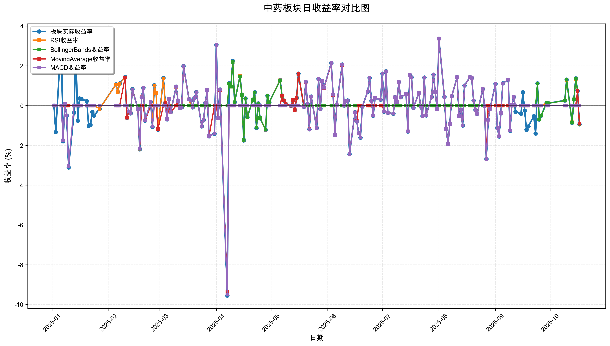
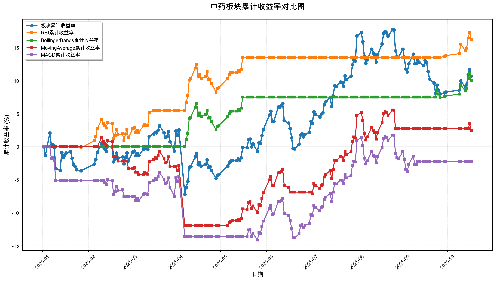

# 策略回测结果报告

**生成时间**: 2025-10-19 19:02:44
**行业板块**: 中药
**回测期间**: 20250101 至 20251017
**策略数量**: 4

## 📈 分析结论

### 策略表现分析
- **最佳策略**: RSI (总收益率: 16.28%)
- **最差策略**: MACD (总收益率: -2.21%)
### 交易活跃度分析
- **活跃策略**: 4 个
- **非活跃策略**: 0 个
- **最活跃策略**: MovingAverage (交易次数: 19)
### 🚨 异动提醒分析
- 未检测到明显异动情况
### 风险分析
- **RSI**: 最大回撤 -3.79%, 夏普比率 2.7073
- **BollingerBands**: 最大回撤 -3.77%, 夏普比率 2.1865
- **MovingAverage**: 最大回撤 -13.18%, 夏普比率 0.2106
- **MACD**: 最大回撤 -14.13%, 夏普比率 -0.1649

## 📊 综合结果表

| 策略名称           | 初始资金     | 最终价值     | 总收益率   | 年化收益率   | 波动率    |    夏普比率 | 最大回撤    | 总交易次数   | 买入次数   | 卖出次数   | 总交易金额      | 平均交易金额   | 交易频率   |   数据点数 |
|:---------------|:---------|:---------|:-------|:--------|:-------|--------:|:--------|:--------|:-------|:-------|:-----------|:---------|:-------|-------:|
| 板块实际表现         | ¥100,000 | ¥110,703 | 10.70% | 14.44%  | 20.25% |  0.7129 | -10.10% | N/A     | N/A    | N/A    | N/A        | N/A      | N/A    |    190 |
| RSI            | ¥100,000 | ¥116,279 | 16.28% | 22.14%  | 8.18%  |  2.7073 | -3.79%  | 5       | 3      | 2      | ¥529,072   | ¥105,814 | 0.03   |    190 |
| BollingerBands | ¥100,000 | ¥110,084 | 10.08% | 13.59%  | 6.21%  |  2.1865 | -3.77%  | 3       | 2      | 1      | ¥310,415   | ¥103,472 | 0.02   |    190 |
| MovingAverage  | ¥100,000 | ¥102,526 | 2.53%  | 3.36%   | 15.98% |  0.2106 | -13.18% | 19      | 10     | 9      | ¥1,805,461 | ¥95,024  | 0.10   |    190 |
| MACD           | ¥100,000 | ¥97,795  | -2.21% | -2.91%  | 17.67% | -0.1649 | -14.13% | 8       | 4      | 4      | ¥735,604   | ¥91,950  | 0.04   |    190 |

## 📊 每日收益率走势图

*图1: 中药板块每日收益率走势对比*

## 📈 累计收益率走势图

*图2: 中药板块累计收益率走势对比*

## 📅 日收益明细表

| 日期         | 板块实际收益率   | RSI收益率   | BollingerBands收益率   | MovingAverage收益率   | MACD收益率   |
|:-----------|:----------|:---------|:--------------------|:-------------------|:----------|
| 2025-01-02 | 0.00%     | 0.00%    | 0.00%               | 0.00%              | 0.00%     |
| 2025-01-03 | -1.33%    | 0.00%    | 0.00%               | 0.00%              | 0.00%     |
| 2025-01-06 | 3.47%     | 0.00%    | 0.00%               | 0.00%              | 0.00%     |
| 2025-01-07 | -1.79%    | 0.00%    | 0.00%               | 0.00%              | -1.75%    |
| 2025-01-08 | 0.09%     | 0.00%    | 0.00%               | 0.00%              | 0.09%     |
| 2025-01-09 | -0.50%    | 0.00%    | 0.00%               | 0.00%              | -0.49%    |
| 2025-01-10 | -3.11%    | 0.00%    | 0.00%               | 0.00%              | -3.04%    |
| 2025-01-13 | -0.36%    | 0.00%    | 0.00%               | 0.00%              | 0.00%     |
| 2025-01-14 | 2.84%     | 0.00%    | 0.00%               | 0.00%              | 0.00%     |
| 2025-01-15 | -0.76%    | 0.00%    | 0.00%               | 0.00%              | 0.00%     |
| 2025-01-16 | 0.36%     | 0.00%    | 0.00%               | 0.00%              | 0.00%     |
| 2025-01-17 | 0.33%     | 0.00%    | 0.00%               | 0.00%              | 0.00%     |
| 2025-01-20 | 0.23%     | 0.00%    | 0.00%               | 0.00%              | 0.00%     |
| 2025-01-21 | -1.03%    | 0.00%    | 0.00%               | 0.00%              | 0.00%     |
| 2025-01-22 | -0.97%    | 0.00%    | 0.00%               | 0.00%              | 0.00%     |
| 2025-01-23 | -0.32%    | 0.00%    | 0.00%               | 0.00%              | 0.00%     |
| 2025-01-24 | -0.50%    | 0.00%    | 0.00%               | 0.00%              | 0.00%     |
| 2025-01-27 | -0.16%    | -0.16%   | 0.00%               | 0.00%              | 0.00%     |
| 2025-02-05 | 1.07%     | 1.06%    | 0.00%               | 0.00%              | 0.00%     |
| 2025-02-06 | 0.70%     | 0.69%    | 0.00%               | 0.00%              | 0.00%     |
| 2025-02-07 | 1.12%     | 1.10%    | 0.00%               | 0.00%              | 0.00%     |
| 2025-02-10 | 1.44%     | 1.42%    | 0.00%               | 1.41%              | 0.00%     |
| 2025-02-11 | -0.62%    | -0.61%   | 0.00%               | -0.61%             | 0.00%     |
| 2025-02-12 | -0.30%    | -0.30%   | 0.00%               | -0.29%             | -0.29%    |
| 2025-02-13 | -0.39%    | -0.38%   | 0.00%               | -0.38%             | -0.38%    |
| 2025-02-14 | 0.83%     | 0.82%    | 0.00%               | 0.81%              | 0.81%     |
| 2025-02-17 | -0.17%    | -0.17%   | 0.00%               | -0.17%             | -0.17%    |
| 2025-02-18 | -2.20%    | -2.17%   | 0.00%               | -2.16%             | -2.15%    |
| 2025-02-19 | 0.43%     | 0.43%    | 0.00%               | 0.00%              | 0.42%     |
| 2025-02-20 | 0.90%     | 0.89%    | 0.00%               | 0.00%              | 0.88%     |
| 2025-02-21 | -0.76%    | -0.75%   | 0.00%               | -0.75%             | -0.74%    |
| 2025-02-24 | 0.18%     | 0.18%    | 0.00%               | 0.00%              | 0.18%     |
| 2025-02-25 | -1.07%    | -1.05%   | 0.00%               | 0.00%              | -1.04%    |
| 2025-02-26 | 1.02%     | 1.01%    | 0.00%               | 0.00%              | 0.00%     |
| 2025-02-27 | 0.65%     | 0.64%    | 0.00%               | 0.00%              | 0.00%     |
| 2025-02-28 | -1.21%    | -1.19%   | 0.00%               | -1.17%             | 0.00%     |
| 2025-03-03 | 1.39%     | 1.37%    | 0.00%               | 0.00%              | 0.00%     |
| 2025-03-04 | 0.13%     | 0.13%    | 0.00%               | 0.13%              | 0.00%     |
| 2025-03-05 | -0.69%    | -0.68%   | 0.00%               | -0.68%             | -0.68%    |
| 2025-03-06 | 0.33%     | 0.32%    | 0.00%               | 0.00%              | 0.33%     |
| 2025-03-07 | -0.33%    | -0.33%   | 0.00%               | -0.33%             | -0.33%    |
| 2025-03-10 | 0.96%     | 0.94%    | 0.00%               | 0.00%              | 0.95%     |
| 2025-03-11 | 0.23%     | 0.23%    | 0.00%               | 0.23%              | 0.23%     |
| 2025-03-12 | -0.12%    | -0.12%   | 0.00%               | -0.12%             | -0.12%    |
| 2025-03-13 | -0.09%    | -0.09%   | 0.00%               | -0.09%             | -0.09%    |
| 2025-03-14 | 1.99%     | 1.96%    | 0.00%               | 1.98%              | 1.98%     |
| 2025-03-17 | 0.33%     | 0.32%    | 0.00%               | 0.32%              | 0.32%     |
| 2025-03-18 | 0.26%     | 0.00%    | 0.00%               | 0.26%              | 0.26%     |
| 2025-03-19 | -0.09%    | 0.00%    | 0.00%               | -0.09%             | -0.09%    |
| 2025-03-20 | 0.38%     | 0.00%    | 0.00%               | 0.38%              | 0.38%     |
| 2025-03-21 | 0.68%     | 0.00%    | 0.00%               | 0.67%              | 0.67%     |
| 2025-03-24 | -1.04%    | 0.00%    | 0.00%               | -1.04%             | -1.04%    |
| 2025-03-25 | -0.71%    | 0.00%    | 0.00%               | -0.71%             | -0.71%    |
| 2025-03-26 | 0.14%     | 0.00%    | 0.00%               | 0.14%              | 0.14%     |
| 2025-03-27 | 0.80%     | 0.00%    | 0.00%               | 0.79%              | 0.79%     |
| 2025-03-28 | -1.54%    | 0.00%    | 0.00%               | -1.54%             | -1.53%    |
| 2025-03-31 | -1.41%    | 0.00%    | 0.00%               | 0.00%              | -1.41%    |
| 2025-04-01 | 3.06%     | 0.00%    | 0.00%               | 0.00%              | 3.05%     |
| 2025-04-02 | -0.63%    | 0.00%    | 0.00%               | -0.62%             | -0.63%    |
| 2025-04-03 | 0.81%     | 0.00%    | 0.00%               | 0.79%              | 0.81%     |
| 2025-04-07 | -9.55%    | 0.00%    | 0.00%               | -9.35%             | -9.51%    |
| 2025-04-08 | 1.13%     | 1.11%    | 1.11%               | 0.00%              | 0.00%     |
| 2025-04-09 | 0.97%     | 0.95%    | 0.95%               | 0.00%              | 0.00%     |
| 2025-04-10 | 2.25%     | 2.21%    | 2.20%               | 0.00%              | 0.00%     |
| 2025-04-11 | 0.17%     | 0.17%    | 0.17%               | 0.00%              | 0.00%     |
| 2025-04-14 | 1.50%     | 1.48%    | 1.47%               | 0.00%              | 0.00%     |
| 2025-04-15 | 0.55%     | 0.54%    | 0.54%               | 0.00%              | 0.00%     |
| 2025-04-16 | -1.75%    | -1.73%   | -1.72%              | 0.00%              | 0.00%     |
| 2025-04-17 | 0.36%     | 0.35%    | 0.35%               | 0.00%              | 0.00%     |
| 2025-04-18 | -0.58%    | -0.57%   | -0.57%              | 0.00%              | 0.00%     |
| 2025-04-21 | 0.30%     | 0.29%    | 0.29%               | 0.00%              | 0.00%     |
| 2025-04-22 | 0.67%     | 0.66%    | 0.66%               | 0.00%              | 0.00%     |
| 2025-04-23 | -1.13%    | -1.11%   | -1.11%              | 0.00%              | 0.00%     |
| 2025-04-24 | 0.11%     | 0.11%    | 0.11%               | 0.00%              | 0.00%     |
| 2025-04-25 | -0.64%    | -0.63%   | -0.63%              | 0.00%              | 0.00%     |
| 2025-04-28 | -1.22%    | -1.21%   | -1.20%              | 0.00%              | 0.00%     |
| 2025-04-29 | 0.50%     | 0.50%    | 0.49%               | 0.00%              | 0.00%     |
| 2025-04-30 | 0.17%     | 0.16%    | 0.16%               | 0.00%              | 0.00%     |
| 2025-05-06 | 1.29%     | 1.27%    | 1.26%               | 0.00%              | 0.00%     |
| 2025-05-07 | 0.50%     | 0.50%    | 0.49%               | 0.50%              | 0.00%     |
| 2025-05-08 | 0.26%     | 0.26%    | 0.26%               | 0.26%              | 0.00%     |
| 2025-05-09 | 0.09%     | 0.08%    | 0.08%               | 0.08%              | 0.00%     |
| 2025-05-12 | -0.01%    | -0.01%   | -0.01%              | -0.01%             | 0.00%     |
| 2025-05-13 | 0.27%     | 0.27%    | 0.27%               | 0.27%              | 0.00%     |
| 2025-05-14 | -0.23%    | -0.22%   | -0.22%              | -0.22%             | 0.00%     |
| 2025-05-15 | 0.40%     | 0.39%    | 0.39%               | 0.39%              | 0.00%     |
| 2025-05-16 | 1.61%     | 1.58%    | 1.58%               | 1.59%              | 0.00%     |
| 2025-05-19 | -0.06%    | 0.00%    | 0.00%               | -0.05%             | -0.06%    |
| 2025-05-20 | 1.20%     | 0.00%    | 0.00%               | 1.19%              | 1.20%     |
| 2025-05-21 | 0.10%     | 0.00%    | 0.00%               | 0.10%              | 0.10%     |
| 2025-05-22 | -1.19%    | 0.00%    | 0.00%               | -1.17%             | -1.19%    |
| 2025-05-23 | 0.46%     | 0.00%    | 0.00%               | 0.45%              | 0.46%     |
| 2025-05-26 | -1.13%    | 0.00%    | 0.00%               | -1.11%             | -1.13%    |
| 2025-05-27 | 1.35%     | 0.00%    | 0.00%               | 1.34%              | 1.35%     |
| 2025-05-28 | -0.16%    | 0.00%    | 0.00%               | -0.16%             | -0.16%    |
| 2025-05-29 | 1.23%     | 0.00%    | 0.00%               | 1.22%              | 1.23%     |
| 2025-05-30 | 0.90%     | 0.00%    | 0.00%               | 0.89%              | 0.90%     |
| 2025-06-03 | 2.14%     | 0.00%    | 0.00%               | 2.11%              | 2.14%     |
| 2025-06-04 | 0.55%     | 0.00%    | 0.00%               | 0.54%              | 0.55%     |
| 2025-06-05 | -1.48%    | 0.00%    | 0.00%               | -1.46%             | -1.48%    |
| 2025-06-06 | 0.04%     | 0.00%    | 0.00%               | 0.03%              | 0.04%     |
| 2025-06-09 | 2.07%     | 0.00%    | 0.00%               | 2.04%              | 2.06%     |
| 2025-06-10 | 0.01%     | 0.00%    | 0.00%               | 0.01%              | 0.01%     |
| 2025-06-11 | 0.22%     | 0.00%    | 0.00%               | 0.22%              | 0.22%     |
| 2025-06-12 | 0.26%     | 0.00%    | 0.00%               | 0.26%              | 0.26%     |
| 2025-06-13 | -2.44%    | 0.00%    | 0.00%               | -2.41%             | -2.43%    |
| 2025-06-16 | -0.34%    | 0.00%    | 0.00%               | -0.34%             | -0.34%    |
| 2025-06-17 | -0.79%    | 0.00%    | 0.00%               | -0.78%             | -0.79%    |
| 2025-06-18 | -1.39%    | 0.00%    | 0.00%               | 0.00%              | -1.39%    |
| 2025-06-19 | -1.61%    | 0.00%    | 0.00%               | 0.00%              | -1.61%    |
| 2025-06-20 | -0.05%    | 0.00%    | 0.00%               | 0.00%              | -0.05%    |
| 2025-06-23 | 0.71%     | 0.00%    | 0.00%               | 0.00%              | 0.71%     |
| 2025-06-24 | 1.40%     | 0.00%    | 0.00%               | 0.00%              | 1.39%     |
| 2025-06-25 | 0.24%     | 0.00%    | 0.00%               | 0.00%              | 0.23%     |
| 2025-06-26 | -0.51%    | 0.00%    | 0.00%               | 0.00%              | -0.51%    |
| 2025-06-27 | 0.38%     | 0.00%    | 0.00%               | 0.00%              | 0.38%     |
| 2025-06-30 | 0.30%     | 0.00%    | 0.00%               | 0.00%              | 0.30%     |
| 2025-07-01 | 1.61%     | 0.00%    | 0.00%               | 0.00%              | 1.61%     |
| 2025-07-02 | -0.30%    | 0.00%    | 0.00%               | -0.30%             | -0.30%    |
| 2025-07-03 | 1.72%     | 0.00%    | 0.00%               | 1.72%              | 1.72%     |
| 2025-07-04 | -0.36%    | 0.00%    | 0.00%               | -0.36%             | -0.36%    |
| 2025-07-07 | -0.40%    | 0.00%    | 0.00%               | -0.40%             | -0.40%    |
| 2025-07-08 | 0.42%     | 0.00%    | 0.00%               | 0.42%              | 0.42%     |
| 2025-07-09 | 0.18%     | 0.00%    | 0.00%               | 0.18%              | 0.18%     |
| 2025-07-10 | 1.19%     | 0.00%    | 0.00%               | 1.19%              | 1.19%     |
| 2025-07-11 | 0.42%     | 0.00%    | 0.00%               | 0.42%              | 0.42%     |
| 2025-07-14 | 0.58%     | 0.00%    | 0.00%               | 0.58%              | 0.58%     |
| 2025-07-15 | -1.30%    | 0.00%    | 0.00%               | -1.29%             | -1.29%    |
| 2025-07-16 | 1.55%     | 0.00%    | 0.00%               | 1.54%              | 1.54%     |
| 2025-07-17 | 1.42%     | 0.00%    | 0.00%               | 1.42%              | 1.42%     |
| 2025-07-18 | -0.11%    | 0.00%    | 0.00%               | -0.11%             | -0.11%    |
| 2025-07-21 | 0.64%     | 0.00%    | 0.00%               | 0.64%              | 0.64%     |
| 2025-07-22 | -0.05%    | 0.00%    | 0.00%               | -0.05%             | -0.05%    |
| 2025-07-23 | -0.52%    | 0.00%    | 0.00%               | -0.52%             | -0.52%    |
| 2025-07-24 | 1.41%     | 0.00%    | 0.00%               | 1.41%              | 1.41%     |
| 2025-07-25 | -0.49%    | 0.00%    | 0.00%               | -0.49%             | -0.49%    |
| 2025-07-28 | 0.44%     | 0.00%    | 0.00%               | 0.44%              | 0.44%     |
| 2025-07-29 | 1.56%     | 0.00%    | 0.00%               | 1.55%              | 1.55%     |
| 2025-07-30 | 0.68%     | 0.00%    | 0.00%               | 0.68%              | 0.68%     |
| 2025-07-31 | -0.17%    | 0.00%    | 0.00%               | -0.17%             | -0.17%    |
| 2025-08-01 | 3.37%     | 0.00%    | 0.00%               | 3.37%              | 3.37%     |
| 2025-08-04 | 0.44%     | 0.00%    | 0.00%               | 0.44%              | 0.44%     |
| 2025-08-05 | -1.17%    | 0.00%    | 0.00%               | -1.17%             | -1.17%    |
| 2025-08-06 | -1.93%    | 0.00%    | 0.00%               | -1.93%             | -1.93%    |
| 2025-08-07 | -0.92%    | 0.00%    | 0.00%               | -0.92%             | -0.92%    |
| 2025-08-08 | 0.47%     | 0.00%    | 0.00%               | 0.47%              | 0.47%     |
| 2025-08-11 | 1.43%     | 0.00%    | 0.00%               | 1.43%              | 1.43%     |
| 2025-08-12 | -0.53%    | 0.00%    | 0.00%               | -0.53%             | -0.53%    |
| 2025-08-13 | -0.20%    | 0.00%    | 0.00%               | -0.20%             | -0.20%    |
| 2025-08-14 | -1.00%    | 0.00%    | 0.00%               | -1.00%             | -1.00%    |
| 2025-08-15 | 1.01%     | 0.00%    | 0.00%               | 1.01%              | 1.01%     |
| 2025-08-18 | 1.43%     | 0.00%    | 0.00%               | 1.43%              | 1.43%     |
| 2025-08-19 | 1.38%     | 0.00%    | 0.00%               | 1.38%              | 1.38%     |
| 2025-08-20 | 0.26%     | 0.00%    | 0.00%               | 0.26%              | 0.26%     |
| 2025-08-21 | -0.21%    | 0.00%    | 0.00%               | -0.21%             | -0.21%    |
| 2025-08-22 | -0.41%    | 0.00%    | 0.00%               | -0.41%             | -0.41%    |
| 2025-08-25 | 0.83%     | 0.00%    | 0.00%               | 0.83%              | 0.83%     |
| 2025-08-26 | -0.03%    | 0.00%    | 0.00%               | -0.03%             | -0.03%    |
| 2025-08-27 | -2.68%    | 0.00%    | 0.00%               | -2.68%             | -2.68%    |
| 2025-08-28 | -0.71%    | 0.00%    | 0.00%               | 0.00%              | -0.71%    |
| 2025-08-29 | -0.16%    | 0.00%    | 0.00%               | 0.00%              | -0.16%    |
| 2025-09-01 | 1.10%     | 0.00%    | 0.00%               | 0.00%              | 1.10%     |
| 2025-09-02 | -1.12%    | 0.00%    | 0.00%               | 0.00%              | -1.12%    |
| 2025-09-03 | -1.55%    | 0.00%    | 0.00%               | 0.00%              | -1.54%    |
| 2025-09-04 | -0.37%    | 0.00%    | 0.00%               | 0.00%              | -0.37%    |
| 2025-09-05 | 1.12%     | 0.00%    | 0.00%               | 0.00%              | 1.12%     |
| 2025-09-08 | 1.30%     | 0.00%    | 0.00%               | 0.00%              | 1.30%     |
| 2025-09-09 | -1.27%    | 0.00%    | 0.00%               | 0.00%              | -1.26%    |
| 2025-09-10 | 0.02%     | 0.00%    | 0.00%               | 0.00%              | 0.02%     |
| 2025-09-11 | 0.43%     | 0.00%    | 0.00%               | 0.00%              | 0.43%     |
| 2025-09-12 | -0.31%    | 0.00%    | 0.00%               | 0.00%              | 0.00%     |
| 2025-09-15 | -0.41%    | 0.00%    | 0.00%               | 0.00%              | 0.00%     |
| 2025-09-16 | 0.68%     | 0.00%    | 0.00%               | 0.00%              | 0.00%     |
| 2025-09-17 | -0.25%    | 0.00%    | 0.00%               | 0.00%              | 0.00%     |
| 2025-09-18 | -1.21%    | 0.00%    | 0.00%               | 0.00%              | 0.00%     |
| 2025-09-19 | -1.04%    | 0.00%    | 0.00%               | 0.00%              | 0.00%     |
| 2025-09-22 | -0.53%    | 0.00%    | 0.00%               | 0.00%              | 0.00%     |
| 2025-09-23 | -1.40%    | 0.00%    | 0.00%               | 0.00%              | 0.00%     |
| 2025-09-24 | 1.12%     | 0.00%    | 1.11%               | 0.00%              | 0.00%     |
| 2025-09-25 | -0.70%    | 0.00%    | -0.69%              | 0.00%              | 0.00%     |
| 2025-09-26 | -0.51%    | 0.00%    | -0.51%              | 0.00%              | 0.00%     |
| 2025-09-29 | 0.13%     | 0.13%    | 0.13%               | 0.00%              | 0.00%     |
| 2025-09-30 | 0.12%     | 0.12%    | 0.12%               | 0.00%              | 0.00%     |
| 2025-10-09 | 0.26%     | 0.25%    | 0.25%               | 0.00%              | 0.00%     |
| 2025-10-10 | 1.31%     | 1.28%    | 1.31%               | 0.00%              | 0.00%     |
| 2025-10-13 | -0.86%    | -0.84%   | -0.86%              | 0.00%              | 0.00%     |
| 2025-10-14 | 0.32%     | 0.31%    | 0.32%               | 0.00%              | 0.00%     |
| 2025-10-15 | 1.37%     | 1.34%    | 1.37%               | 0.00%              | 0.00%     |
| 2025-10-16 | 0.75%     | 0.73%    | 0.75%               | 0.73%              | 0.00%     |
| 2025-10-17 | -0.94%    | -0.92%   | -0.94%              | -0.91%             | 0.00%     |

## 📊 日收益统计摘要

| 指标                | 平均日收益率   | 最大日收益率   | 最小日收益率   | 正收益天数   | 负收益天数   |
|:------------------|:---------|:---------|:---------|:--------|:--------|
| 板块实际收益率           | 0.06%    | 3.47%    | -9.55%   | 104天    | 85天     |
| RSI收益率            | 0.08%    | 2.21%    | -2.17%   | 43天     | 22天     |
| BollingerBands收益率 | 0.05%    | 2.20%    | -1.72%   | 27天     | 11天     |
| MovingAverage收益率  | 0.02%    | 3.37%    | -9.35%   | 54天     | 47天     |
| MACD收益率           | -0.01%   | 3.37%    | -9.51%   | 63天     | 57天     |

## 📈 累计收益明细表

| 日期         | 板块累计收益率   | RSI累计收益率   | BollingerBands累计收益率   | MovingAverage累计收益率   | MACD累计收益率   |
|:-----------|:----------|:-----------|:----------------------|:---------------------|:------------|
| 2025-01-02 | 0.00%     | 0.00%      | 0.00%                 | 0.00%                | 0.00%       |
| 2025-01-03 | -1.33%    | 0.00%      | 0.00%                 | 0.00%                | 0.00%       |
| 2025-01-06 | 2.09%     | 0.00%      | 0.00%                 | 0.00%                | 0.00%       |
| 2025-01-07 | 0.27%     | 0.00%      | 0.00%                 | 0.00%                | -1.75%      |
| 2025-01-08 | 0.36%     | 0.00%      | 0.00%                 | 0.00%                | -1.66%      |
| 2025-01-09 | -0.15%    | 0.00%      | 0.00%                 | 0.00%                | -2.14%      |
| 2025-01-10 | -3.25%    | 0.00%      | 0.00%                 | 0.00%                | -5.12%      |
| 2025-01-13 | -3.60%    | 0.00%      | 0.00%                 | 0.00%                | -5.12%      |
| 2025-01-14 | -0.85%    | 0.00%      | 0.00%                 | 0.00%                | -5.12%      |
| 2025-01-15 | -1.61%    | 0.00%      | 0.00%                 | 0.00%                | -5.12%      |
| 2025-01-16 | -1.26%    | 0.00%      | 0.00%                 | 0.00%                | -5.12%      |
| 2025-01-17 | -0.93%    | 0.00%      | 0.00%                 | 0.00%                | -5.12%      |
| 2025-01-20 | -0.70%    | 0.00%      | 0.00%                 | 0.00%                | -5.12%      |
| 2025-01-21 | -1.73%    | 0.00%      | 0.00%                 | 0.00%                | -5.12%      |
| 2025-01-22 | -2.68%    | 0.00%      | 0.00%                 | 0.00%                | -5.12%      |
| 2025-01-23 | -2.99%    | 0.00%      | 0.00%                 | 0.00%                | -5.12%      |
| 2025-01-24 | -3.48%    | 0.00%      | 0.00%                 | 0.00%                | -5.12%      |
| 2025-01-27 | -3.64%    | -0.16%     | 0.00%                 | 0.00%                | -5.12%      |
| 2025-02-05 | -2.60%    | 0.90%      | 0.00%                 | 0.00%                | -5.12%      |
| 2025-02-06 | -1.92%    | 1.60%      | 0.00%                 | 0.00%                | -5.12%      |
| 2025-02-07 | -0.82%    | 2.72%      | 0.00%                 | 0.00%                | -5.12%      |
| 2025-02-10 | 0.60%     | 4.17%      | 0.00%                 | 1.41%                | -5.12%      |
| 2025-02-11 | -0.02%    | 3.54%      | 0.00%                 | 0.80%                | -5.12%      |
| 2025-02-12 | -0.32%    | 3.23%      | 0.00%                 | 0.50%                | -5.40%      |
| 2025-02-13 | -0.70%    | 2.84%      | 0.00%                 | 0.12%                | -5.76%      |
| 2025-02-14 | 0.11%     | 3.68%      | 0.00%                 | 0.93%                | -5.00%      |
| 2025-02-17 | -0.06%    | 3.50%      | 0.00%                 | 0.76%                | -5.16%      |
| 2025-02-18 | -2.26%    | 1.25%      | 0.00%                 | -1.42%               | -7.20%      |
| 2025-02-19 | -1.83%    | 1.68%      | 0.00%                 | -1.42%               | -6.81%      |
| 2025-02-20 | -0.95%    | 2.58%      | 0.00%                 | -1.42%               | -5.99%      |
| 2025-02-21 | -1.70%    | 1.82%      | 0.00%                 | -2.16%               | -6.68%      |
| 2025-02-24 | -1.52%    | 2.00%      | 0.00%                 | -2.16%               | -6.52%      |
| 2025-02-25 | -2.57%    | 0.93%      | 0.00%                 | -2.16%               | -7.49%      |
| 2025-02-26 | -1.58%    | 1.95%      | 0.00%                 | -2.16%               | -7.49%      |
| 2025-02-27 | -0.94%    | 2.60%      | 0.00%                 | -2.16%               | -7.49%      |
| 2025-02-28 | -2.14%    | 1.37%      | 0.00%                 | -3.31%               | -7.49%      |
| 2025-03-03 | -0.78%    | 2.77%      | 0.00%                 | -3.31%               | -7.49%      |
| 2025-03-04 | -0.64%    | 2.90%      | 0.00%                 | -3.19%               | -7.49%      |
| 2025-03-05 | -1.33%    | 2.20%      | 0.00%                 | -3.84%               | -8.12%      |
| 2025-03-06 | -1.00%    | 2.53%      | 0.00%                 | -3.84%               | -7.82%      |
| 2025-03-07 | -1.33%    | 2.20%      | 0.00%                 | -4.15%               | -8.12%      |
| 2025-03-10 | -0.39%    | 3.16%      | 0.00%                 | -4.15%               | -7.25%      |
| 2025-03-11 | -0.16%    | 3.40%      | 0.00%                 | -3.93%               | -7.04%      |
| 2025-03-12 | -0.28%    | 3.28%      | 0.00%                 | -4.05%               | -7.15%      |
| 2025-03-13 | -0.37%    | 3.18%      | 0.00%                 | -4.14%               | -7.23%      |
| 2025-03-14 | 1.61%     | 5.21%      | 0.00%                 | -2.24%               | -5.40%      |
| 2025-03-17 | 1.94%     | 5.55%      | 0.00%                 | -1.92%               | -5.09%      |
| 2025-03-18 | 2.21%     | 5.55%      | 0.00%                 | -1.66%               | -4.84%      |
| 2025-03-19 | 2.12%     | 5.55%      | 0.00%                 | -1.75%               | -4.92%      |
| 2025-03-20 | 2.51%     | 5.55%      | 0.00%                 | -1.37%               | -4.56%      |
| 2025-03-21 | 3.20%     | 5.55%      | 0.00%                 | -0.71%               | -3.92%      |
| 2025-03-24 | 2.13%     | 5.55%      | 0.00%                 | -1.74%               | -4.92%      |
| 2025-03-25 | 1.40%     | 5.55%      | 0.00%                 | -2.44%               | -5.59%      |
| 2025-03-26 | 1.55%     | 5.55%      | 0.00%                 | -2.30%               | -5.46%      |
| 2025-03-27 | 2.35%     | 5.55%      | 0.00%                 | -1.52%               | -4.71%      |
| 2025-03-28 | 0.78%     | 5.55%      | 0.00%                 | -3.04%               | -6.17%      |
| 2025-03-31 | -0.65%    | 5.55%      | 0.00%                 | -3.04%               | -7.49%      |
| 2025-04-01 | 2.39%     | 5.55%      | 0.00%                 | -3.04%               | -4.67%      |
| 2025-04-02 | 1.75%     | 5.55%      | 0.00%                 | -3.64%               | -5.27%      |
| 2025-04-03 | 2.57%     | 5.55%      | 0.00%                 | -2.87%               | -4.51%      |
| 2025-04-07 | -7.22%    | 5.55%      | 0.00%                 | -11.95%              | -13.59%     |
| 2025-04-08 | -6.17%    | 6.72%      | 1.11%                 | -11.95%              | -13.59%     |
| 2025-04-09 | -5.26%    | 7.74%      | 2.07%                 | -11.95%              | -13.59%     |
| 2025-04-10 | -3.14%    | 10.12%     | 4.31%                 | -11.95%              | -13.59%     |
| 2025-04-11 | -2.97%    | 10.30%     | 4.49%                 | -11.95%              | -13.59%     |
| 2025-04-14 | -1.51%    | 11.93%     | 6.02%                 | -11.95%              | -13.59%     |
| 2025-04-15 | -0.97%    | 12.54%     | 6.59%                 | -11.95%              | -13.59%     |
| 2025-04-16 | -2.71%    | 10.60%     | 4.76%                 | -11.95%              | -13.59%     |
| 2025-04-17 | -2.36%    | 10.99%     | 5.13%                 | -11.95%              | -13.59%     |
| 2025-04-18 | -2.93%    | 10.35%     | 4.53%                 | -11.95%              | -13.59%     |
| 2025-04-21 | -2.64%    | 10.68%     | 4.84%                 | -11.95%              | -13.59%     |
| 2025-04-22 | -1.98%    | 11.41%     | 5.53%                 | -11.95%              | -13.59%     |
| 2025-04-23 | -3.09%    | 10.17%     | 4.36%                 | -11.95%              | -13.59%     |
| 2025-04-24 | -2.98%    | 10.29%     | 4.47%                 | -11.95%              | -13.59%     |
| 2025-04-25 | -3.61%    | 9.59%      | 3.81%                 | -11.95%              | -13.59%     |
| 2025-04-28 | -4.79%    | 8.27%      | 2.57%                 | -11.95%              | -13.59%     |
| 2025-04-29 | -4.31%    | 8.81%      | 3.08%                 | -11.95%              | -13.59%     |
| 2025-04-30 | -4.15%    | 8.99%      | 3.25%                 | -11.95%              | -13.59%     |
| 2025-05-06 | -2.91%    | 10.37%     | 4.55%                 | -11.95%              | -13.59%     |
| 2025-05-07 | -2.42%    | 10.92%     | 5.07%                 | -11.51%              | -13.59%     |
| 2025-05-08 | -2.16%    | 11.21%     | 5.34%                 | -11.28%              | -13.59%     |
| 2025-05-09 | -2.08%    | 11.30%     | 5.43%                 | -11.21%              | -13.59%     |
| 2025-05-12 | -2.08%    | 11.29%     | 5.42%                 | -11.21%              | -13.59%     |
| 2025-05-13 | -1.82%    | 11.59%     | 5.70%                 | -10.98%              | -13.59%     |
| 2025-05-14 | -2.04%    | 11.34%     | 5.47%                 | -11.18%              | -13.59%     |
| 2025-05-15 | -1.65%    | 11.78%     | 5.87%                 | -10.83%              | -13.59%     |
| 2025-05-16 | -0.07%    | 13.55%     | 7.54%                 | -9.41%               | -13.59%     |
| 2025-05-19 | -0.13%    | 13.55%     | 7.54%                 | -9.46%               | -13.63%     |
| 2025-05-20 | 1.08%     | 13.55%     | 7.54%                 | -8.39%               | -12.60%     |
| 2025-05-21 | 1.18%     | 13.55%     | 7.54%                 | -8.29%               | -12.51%     |
| 2025-05-22 | -0.02%    | 13.55%     | 7.54%                 | -9.37%               | -13.55%     |
| 2025-05-23 | 0.43%     | 13.55%     | 7.54%                 | -8.96%               | -13.15%     |
| 2025-05-26 | -0.70%    | 13.55%     | 7.54%                 | -9.98%               | -14.13%     |
| 2025-05-27 | 0.64%     | 13.55%     | 7.54%                 | -8.77%               | -12.97%     |
| 2025-05-28 | 0.48%     | 13.55%     | 7.54%                 | -8.92%               | -13.11%     |
| 2025-05-29 | 1.72%     | 13.55%     | 7.54%                 | -7.81%               | -12.04%     |
| 2025-05-30 | 2.64%     | 13.55%     | 7.54%                 | -6.99%               | -11.25%     |
| 2025-06-03 | 4.83%     | 13.55%     | 7.54%                 | -5.02%               | -9.35%      |
| 2025-06-04 | 5.41%     | 13.55%     | 7.54%                 | -4.51%               | -8.86%      |
| 2025-06-05 | 3.85%     | 13.55%     | 7.54%                 | -5.91%               | -10.20%     |
| 2025-06-06 | 3.88%     | 13.55%     | 7.54%                 | -5.87%               | -10.17%     |
| 2025-06-09 | 6.03%     | 13.55%     | 7.54%                 | -3.95%               | -8.32%      |
| 2025-06-10 | 6.04%     | 13.55%     | 7.54%                 | -3.94%               | -8.31%      |
| 2025-06-11 | 6.28%     | 13.55%     | 7.54%                 | -3.73%               | -8.11%      |
| 2025-06-12 | 6.56%     | 13.55%     | 7.54%                 | -3.48%               | -7.87%      |
| 2025-06-13 | 3.96%     | 13.55%     | 7.54%                 | -5.81%               | -10.11%     |
| 2025-06-16 | 3.60%     | 13.55%     | 7.54%                 | -6.13%               | -10.42%     |
| 2025-06-17 | 2.78%     | 13.55%     | 7.54%                 | -6.86%               | -11.12%     |
| 2025-06-18 | 1.35%     | 13.55%     | 7.54%                 | -6.86%               | -12.36%     |
| 2025-06-19 | -0.28%    | 13.55%     | 7.54%                 | -6.86%               | -13.76%     |
| 2025-06-20 | -0.33%    | 13.55%     | 7.54%                 | -6.86%               | -13.81%     |
| 2025-06-23 | 0.38%     | 13.55%     | 7.54%                 | -6.86%               | -13.20%     |
| 2025-06-24 | 1.78%     | 13.55%     | 7.54%                 | -6.86%               | -11.99%     |
| 2025-06-25 | 2.02%     | 13.55%     | 7.54%                 | -6.86%               | -11.78%     |
| 2025-06-26 | 1.50%     | 13.55%     | 7.54%                 | -6.86%               | -12.23%     |
| 2025-06-27 | 1.89%     | 13.55%     | 7.54%                 | -6.86%               | -11.89%     |
| 2025-06-30 | 2.20%     | 13.55%     | 7.54%                 | -6.86%               | -11.63%     |
| 2025-07-01 | 3.85%     | 13.55%     | 7.54%                 | -6.86%               | -10.20%     |
| 2025-07-02 | 3.53%     | 13.55%     | 7.54%                 | -7.14%               | -10.48%     |
| 2025-07-03 | 5.32%     | 13.55%     | 7.54%                 | -5.54%               | -8.94%      |
| 2025-07-04 | 4.94%     | 13.55%     | 7.54%                 | -5.88%               | -9.26%      |
| 2025-07-07 | 4.52%     | 13.55%     | 7.54%                 | -6.26%               | -9.62%      |
| 2025-07-08 | 4.96%     | 13.55%     | 7.54%                 | -5.86%               | -9.24%      |
| 2025-07-09 | 5.15%     | 13.55%     | 7.54%                 | -5.69%               | -9.08%      |
| 2025-07-10 | 6.40%     | 13.55%     | 7.54%                 | -4.57%               | -8.00%      |
| 2025-07-11 | 6.85%     | 13.55%     | 7.54%                 | -4.17%               | -7.62%      |
| 2025-07-14 | 7.47%     | 13.55%     | 7.54%                 | -3.62%               | -7.08%      |
| 2025-07-15 | 6.08%     | 13.55%     | 7.54%                 | -4.86%               | -8.28%      |
| 2025-07-16 | 7.72%     | 13.55%     | 7.54%                 | -3.40%               | -6.86%      |
| 2025-07-17 | 9.25%     | 13.55%     | 7.54%                 | -2.02%               | -5.54%      |
| 2025-07-18 | 9.14%     | 13.55%     | 7.54%                 | -2.13%               | -5.64%      |
| 2025-07-21 | 9.83%     | 13.55%     | 7.54%                 | -1.50%               | -5.04%      |
| 2025-07-22 | 9.78%     | 13.55%     | 7.54%                 | -1.55%               | -5.08%      |
| 2025-07-23 | 9.20%     | 13.55%     | 7.54%                 | -2.07%               | -5.58%      |
| 2025-07-24 | 10.75%    | 13.55%     | 7.54%                 | -0.68%               | -4.25%      |
| 2025-07-25 | 10.21%    | 13.55%     | 7.54%                 | -1.17%               | -4.72%      |
| 2025-07-28 | 10.69%    | 13.55%     | 7.54%                 | -0.73%               | -4.30%      |
| 2025-07-29 | 12.42%    | 13.55%     | 7.54%                 | 0.81%                | -2.81%      |
| 2025-07-30 | 13.18%    | 13.55%     | 7.54%                 | 1.50%                | -2.15%      |
| 2025-07-31 | 13.00%    | 13.55%     | 7.54%                 | 1.33%                | -2.31%      |
| 2025-08-01 | 16.81%    | 13.55%     | 7.54%                 | 4.74%                | 0.98%       |
| 2025-08-04 | 17.32%    | 13.55%     | 7.54%                 | 5.20%                | 1.42%       |
| 2025-08-05 | 15.95%    | 13.55%     | 7.54%                 | 3.97%                | 0.24%       |
| 2025-08-06 | 13.70%    | 13.55%     | 7.54%                 | 1.96%                | -1.70%      |
| 2025-08-07 | 12.66%    | 13.55%     | 7.54%                 | 1.02%                | -2.60%      |
| 2025-08-08 | 13.19%    | 13.55%     | 7.54%                 | 1.50%                | -2.14%      |
| 2025-08-11 | 14.81%    | 13.55%     | 7.54%                 | 2.95%                | -0.75%      |
| 2025-08-12 | 14.20%    | 13.55%     | 7.54%                 | 2.41%                | -1.27%      |
| 2025-08-13 | 13.97%    | 13.55%     | 7.54%                 | 2.20%                | -1.47%      |
| 2025-08-14 | 12.83%    | 13.55%     | 7.54%                 | 1.18%                | -2.45%      |
| 2025-08-15 | 13.97%    | 13.55%     | 7.54%                 | 2.20%                | -1.47%      |
| 2025-08-18 | 15.60%    | 13.55%     | 7.54%                 | 3.66%                | -0.06%      |
| 2025-08-19 | 17.20%    | 13.55%     | 7.54%                 | 5.09%                | 1.31%       |
| 2025-08-20 | 17.50%    | 13.55%     | 7.54%                 | 5.36%                | 1.58%       |
| 2025-08-21 | 17.26%    | 13.55%     | 7.54%                 | 5.15%                | 1.37%       |
| 2025-08-22 | 16.78%    | 13.55%     | 7.54%                 | 4.71%                | 0.95%       |
| 2025-08-25 | 17.75%    | 13.55%     | 7.54%                 | 5.58%                | 1.79%       |
| 2025-08-26 | 17.71%    | 13.55%     | 7.54%                 | 5.54%                | 1.76%       |
| 2025-08-27 | 14.55%    | 13.55%     | 7.54%                 | 2.72%                | -0.97%      |
| 2025-08-28 | 13.73%    | 13.55%     | 7.54%                 | 2.72%                | -1.67%      |
| 2025-08-29 | 13.55%    | 13.55%     | 7.54%                 | 2.72%                | -1.83%      |
| 2025-09-01 | 14.80%    | 13.55%     | 7.54%                 | 2.72%                | -0.75%      |
| 2025-09-02 | 13.51%    | 13.55%     | 7.54%                 | 2.72%                | -1.87%      |
| 2025-09-03 | 11.76%    | 13.55%     | 7.54%                 | 2.72%                | -3.38%      |
| 2025-09-04 | 11.34%    | 13.55%     | 7.54%                 | 2.72%                | -3.74%      |
| 2025-09-05 | 12.58%    | 13.55%     | 7.54%                 | 2.72%                | -2.66%      |
| 2025-09-08 | 14.05%    | 13.55%     | 7.54%                 | 2.72%                | -1.40%      |
| 2025-09-09 | 12.61%    | 13.55%     | 7.54%                 | 2.72%                | -2.64%      |
| 2025-09-10 | 12.63%    | 13.55%     | 7.54%                 | 2.72%                | -2.63%      |
| 2025-09-11 | 13.12%    | 13.55%     | 7.54%                 | 2.72%                | -2.21%      |
| 2025-09-12 | 12.77%    | 13.55%     | 7.54%                 | 2.72%                | -2.21%      |
| 2025-09-15 | 12.30%    | 13.55%     | 7.54%                 | 2.72%                | -2.21%      |
| 2025-09-16 | 13.06%    | 13.55%     | 7.54%                 | 2.72%                | -2.21%      |
| 2025-09-17 | 12.78%    | 13.55%     | 7.54%                 | 2.72%                | -2.21%      |
| 2025-09-18 | 11.42%    | 13.55%     | 7.54%                 | 2.72%                | -2.21%      |
| 2025-09-19 | 10.26%    | 13.55%     | 7.54%                 | 2.72%                | -2.21%      |
| 2025-09-22 | 9.68%     | 13.55%     | 7.54%                 | 2.72%                | -2.21%      |
| 2025-09-23 | 8.14%     | 13.55%     | 7.54%                 | 2.72%                | -2.21%      |
| 2025-09-24 | 9.35%     | 13.55%     | 8.74%                 | 2.72%                | -2.21%      |
| 2025-09-25 | 8.59%     | 13.55%     | 7.99%                 | 2.72%                | -2.21%      |
| 2025-09-26 | 8.03%     | 13.55%     | 7.44%                 | 2.72%                | -2.21%      |
| 2025-09-29 | 8.18%     | 13.70%     | 7.58%                 | 2.72%                | -2.21%      |
| 2025-09-30 | 8.31%     | 13.83%     | 7.71%                 | 2.72%                | -2.21%      |
| 2025-10-09 | 8.59%     | 14.12%     | 7.99%                 | 2.72%                | -2.21%      |
| 2025-10-10 | 10.01%    | 15.58%     | 9.40%                 | 2.72%                | -2.21%      |
| 2025-10-13 | 9.07%     | 14.61%     | 8.47%                 | 2.72%                | -2.21%      |
| 2025-10-14 | 9.42%     | 14.96%     | 8.81%                 | 2.72%                | -2.21%      |
| 2025-10-15 | 10.92%    | 16.50%     | 10.30%                | 2.72%                | -2.21%      |
| 2025-10-16 | 11.76%    | 17.36%     | 11.13%                | 3.47%                | -2.21%      |
| 2025-10-17 | 10.70%    | 16.28%     | 10.08%                | 2.53%                | -2.21%      |

## 📊 累计收益统计摘要

| 指标                  | 最终累计收益率   | 最大累计收益率   | 最小累计收益率   | 累计收益波动   | 收益稳定性   |
|:--------------------|:----------|:----------|:----------|:---------|:--------|
| 板块累计收益率             | 10.70%    | 17.75%    | -7.22%    | 24.97%   | 波动      |
| RSI累计收益率            | 16.28%    | 17.36%    | -0.16%    | 17.52%   | 稳定      |
| BollingerBands累计收益率 | 10.08%    | 11.13%    | 0.00%     | 11.13%   | 稳定      |
| MovingAverage累计收益率  | 2.53%     | 5.58%     | -11.95%   | 17.53%   | 稳定      |
| MACD累计收益率           | -2.21%    | 1.79%     | -14.13%   | 15.92%   | 稳定      |

