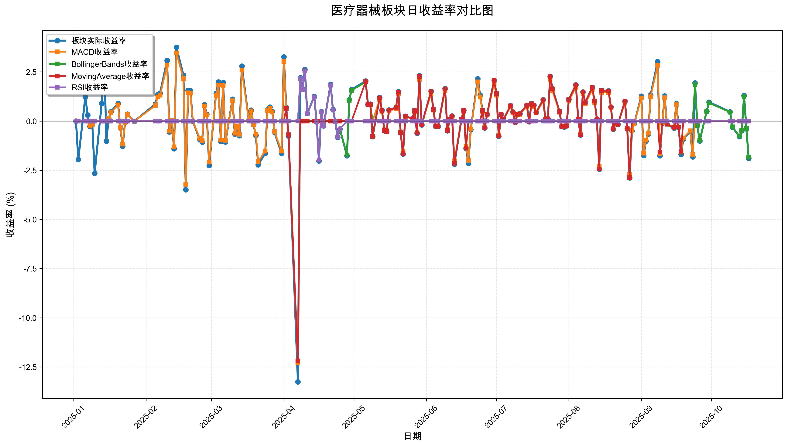
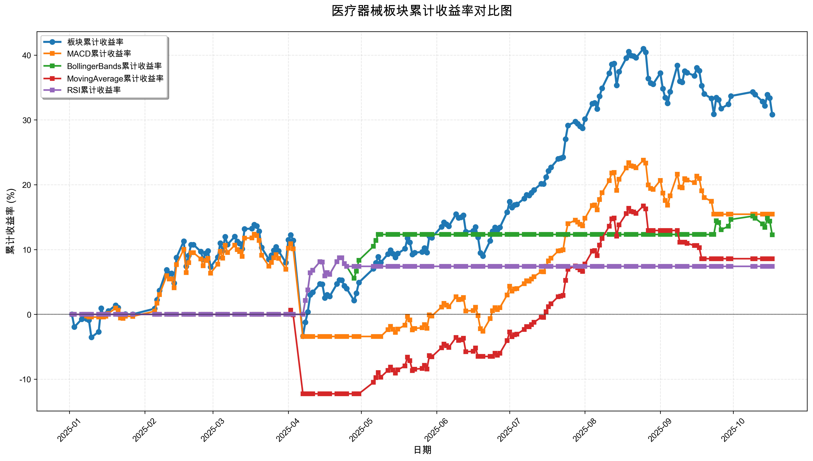

# 策略回测结果报告

**生成时间**: 2025-10-19 19:04:55
**行业板块**: 医疗器械
**回测期间**: 20250101 至 20251017
**策略数量**: 4

## 📈 分析结论

### 策略表现分析
- **最佳策略**: MACD (总收益率: 15.45%)
- **最差策略**: RSI (总收益率: 7.41%)
### 交易活跃度分析
- **活跃策略**: 4 个
- **非活跃策略**: 0 个
- **最活跃策略**: MovingAverage (交易次数: 12)
### 🚨 异动提醒分析
- 未检测到明显异动情况
### 风险分析
- **MACD**: 最大回撤 -14.04%, 夏普比率 0.9693
- **BollingerBands**: 最大回撤 -2.92%, 夏普比率 2.1002
- **MovingAverage**: 最大回撤 -12.80%, 夏普比率 0.6445
- **RSI**: 最大回撤 -2.01%, 夏普比率 1.7654

## 📊 综合结果表

| 策略名称           | 初始资金     | 最终价值     | 总收益率   | 年化收益率   | 波动率    |   夏普比率 | 最大回撤    | 总交易次数   | 买入次数   | 卖出次数   | 总交易金额      | 平均交易金额   | 交易频率   |   数据点数 |
|:---------------|:---------|:---------|:-------|:--------|:-------|-------:|:--------|:--------|:-------|:-------|:-----------|:---------|:-------|-------:|
| 板块实际表现         | ¥100,000 | ¥130,833 | 30.83% | 42.83%  | 25.43% | 1.6839 | -15.12% | N/A     | N/A    | N/A    | N/A        | N/A      | N/A    |    190 |
| MACD           | ¥100,000 | ¥115,453 | 15.45% | 21.00%  | 21.66% | 0.9693 | -14.04% | 6       | 3      | 3      | ¥559,188   | ¥93,198  | 0.03   |    190 |
| BollingerBands | ¥100,000 | ¥112,288 | 12.29% | 16.62%  | 7.91%  | 2.1002 | -2.92%  | 3       | 2      | 1      | ¥315,112   | ¥105,037 | 0.02   |    190 |
| MovingAverage  | ¥100,000 | ¥108,588 | 8.59%  | 11.55%  | 17.92% | 0.6445 | -12.80% | 12      | 6      | 6      | ¥1,158,619 | ¥96,552  | 0.06   |    190 |
| RSI            | ¥100,000 | ¥107,407 | 7.41%  | 9.94%   | 5.63%  | 1.7654 | -2.01%  | 2       | 1      | 1      | ¥202,236   | ¥101,118 | 0.01   |    190 |

## 📊 每日收益率走势图

*图1: 医疗器械板块每日收益率走势对比*

## 📈 累计收益率走势图

*图2: 医疗器械板块累计收益率走势对比*

## 📅 日收益明细表

| 日期         | 板块实际收益率   | MACD收益率   | BollingerBands收益率   | MovingAverage收益率   | RSI收益率   |
|:-----------|:----------|:----------|:--------------------|:-------------------|:---------|
| 2025-01-02 | 0.00%     | 0.00%     | 0.00%               | 0.00%              | 0.00%    |
| 2025-01-03 | -1.95%    | 0.00%     | 0.00%               | 0.00%              | 0.00%    |
| 2025-01-06 | 1.23%     | 0.00%     | 0.00%               | 0.00%              | 0.00%    |
| 2025-01-07 | 0.30%     | 0.00%     | 0.00%               | 0.00%              | 0.00%    |
| 2025-01-08 | -0.27%    | -0.25%    | 0.00%               | 0.00%              | 0.00%    |
| 2025-01-09 | -0.19%    | -0.17%    | 0.00%               | 0.00%              | 0.00%    |
| 2025-01-10 | -2.66%    | 0.00%     | 0.00%               | 0.00%              | 0.00%    |
| 2025-01-13 | 0.89%     | 0.00%     | 0.00%               | 0.00%              | 0.00%    |
| 2025-01-14 | 3.72%     | 0.00%     | 0.00%               | 0.00%              | 0.00%    |
| 2025-01-15 | -1.02%    | 0.00%     | 0.00%               | 0.00%              | 0.00%    |
| 2025-01-16 | 0.14%     | 0.13%     | 0.00%               | 0.00%              | 0.00%    |
| 2025-01-17 | 0.48%     | 0.44%     | 0.00%               | 0.00%              | 0.00%    |
| 2025-01-20 | 0.89%     | 0.82%     | 0.00%               | 0.00%              | 0.00%    |
| 2025-01-21 | -0.35%    | -0.33%    | 0.00%               | 0.00%              | 0.00%    |
| 2025-01-22 | -1.28%    | -1.18%    | 0.00%               | 0.00%              | 0.00%    |
| 2025-01-23 | -0.07%    | -0.07%    | 0.00%               | 0.00%              | 0.00%    |
| 2025-01-24 | 0.35%     | 0.33%     | 0.00%               | 0.00%              | 0.00%    |
| 2025-01-27 | -0.01%    | -0.01%    | 0.00%               | 0.00%              | 0.00%    |
| 2025-02-05 | 0.86%     | 0.79%     | 0.00%               | 0.00%              | 0.00%    |
| 2025-02-06 | 1.34%     | 1.23%     | 0.00%               | 0.00%              | 0.00%    |
| 2025-02-07 | 1.42%     | 1.31%     | 0.00%               | 0.00%              | 0.00%    |
| 2025-02-10 | 3.08%     | 2.84%     | 0.00%               | 0.00%              | 0.00%    |
| 2025-02-11 | -0.55%    | -0.51%    | 0.00%               | 0.00%              | 0.00%    |
| 2025-02-12 | 0.03%     | 0.03%     | 0.00%               | 0.00%              | 0.00%    |
| 2025-02-13 | -1.41%    | -1.31%    | 0.00%               | 0.00%              | 0.00%    |
| 2025-02-14 | 3.75%     | 3.46%     | 0.00%               | 0.00%              | 0.00%    |
| 2025-02-17 | 2.33%     | 2.16%     | 0.00%               | 0.00%              | 0.00%    |
| 2025-02-18 | -3.49%    | -3.23%    | 0.00%               | 0.00%              | 0.00%    |
| 2025-02-19 | 1.56%     | 1.44%     | 0.00%               | 0.00%              | 0.00%    |
| 2025-02-20 | 1.53%     | 1.42%     | 0.00%               | 0.00%              | 0.00%    |
| 2025-02-21 | -0.00%    | -0.00%    | 0.00%               | 0.00%              | 0.00%    |
| 2025-02-24 | -0.95%    | -0.88%    | 0.00%               | 0.00%              | 0.00%    |
| 2025-02-25 | -1.07%    | -0.99%    | 0.00%               | 0.00%              | 0.00%    |
| 2025-02-26 | 0.82%     | 0.76%     | 0.00%               | 0.00%              | 0.00%    |
| 2025-02-27 | 0.34%     | 0.31%     | 0.00%               | 0.00%              | 0.00%    |
| 2025-02-28 | -2.26%    | -2.09%    | 0.00%               | 0.00%              | 0.00%    |
| 2025-03-03 | 1.41%     | 1.30%     | 0.00%               | 0.00%              | 0.00%    |
| 2025-03-04 | 1.98%     | 1.83%     | 0.00%               | 0.00%              | 0.00%    |
| 2025-03-05 | -1.04%    | -0.96%    | 0.00%               | 0.00%              | 0.00%    |
| 2025-03-06 | 1.96%     | 1.81%     | 0.00%               | 0.00%              | 0.00%    |
| 2025-03-07 | -1.06%    | -0.98%    | 0.00%               | 0.00%              | 0.00%    |
| 2025-03-10 | 1.11%     | 1.03%     | 0.00%               | 0.00%              | 0.00%    |
| 2025-03-11 | -0.67%    | -0.62%    | 0.00%               | 0.00%              | 0.00%    |
| 2025-03-12 | -0.29%    | -0.27%    | 0.00%               | 0.00%              | 0.00%    |
| 2025-03-13 | -0.74%    | -0.68%    | 0.00%               | 0.00%              | 0.00%    |
| 2025-03-14 | 2.79%     | 2.59%     | 0.00%               | 0.00%              | 0.00%    |
| 2025-03-17 | 0.03%     | 0.03%     | 0.00%               | 0.00%              | 0.00%    |
| 2025-03-18 | 0.55%     | 0.51%     | 0.00%               | 0.00%              | 0.00%    |
| 2025-03-19 | -0.19%    | -0.18%    | 0.00%               | 0.00%              | 0.00%    |
| 2025-03-20 | -0.72%    | -0.67%    | 0.00%               | 0.00%              | 0.00%    |
| 2025-03-21 | -2.22%    | -2.06%    | 0.00%               | 0.00%              | 0.00%    |
| 2025-03-24 | -1.65%    | -1.53%    | 0.00%               | 0.00%              | 0.00%    |
| 2025-03-25 | 0.57%     | 0.53%     | 0.00%               | 0.00%              | 0.00%    |
| 2025-03-26 | 0.71%     | 0.66%     | 0.00%               | 0.00%              | 0.00%    |
| 2025-03-27 | 0.49%     | 0.46%     | 0.00%               | 0.00%              | 0.00%    |
| 2025-03-28 | -0.58%    | -0.54%    | 0.00%               | 0.00%              | 0.00%    |
| 2025-03-31 | -1.65%    | -1.53%    | 0.00%               | 0.00%              | 0.00%    |
| 2025-04-01 | 3.26%     | 3.02%     | 0.00%               | 0.00%              | 0.00%    |
| 2025-04-02 | 0.69%     | 0.64%     | 0.00%               | 0.64%              | 0.00%    |
| 2025-04-03 | -0.76%    | -0.71%    | 0.00%               | -0.70%             | 0.00%    |
| 2025-04-07 | -13.26%   | -12.29%   | 0.00%               | -12.19%            | 0.00%    |
| 2025-04-08 | 2.21%     | 0.00%     | 2.16%               | 0.00%              | 2.16%    |
| 2025-04-09 | 1.62%     | 0.00%     | 1.58%               | 0.00%              | 1.58%    |
| 2025-04-10 | 2.62%     | 0.00%     | 2.55%               | 0.00%              | 2.55%    |
| 2025-04-11 | 0.38%     | 0.00%     | 0.37%               | 0.00%              | 0.37%    |
| 2025-04-14 | 1.25%     | 0.00%     | 1.22%               | 0.00%              | 1.22%    |
| 2025-04-15 | -0.04%    | 0.00%     | -0.04%              | 0.00%              | -0.04%   |
| 2025-04-16 | -2.03%    | 0.00%     | -1.98%              | 0.00%              | -1.98%   |
| 2025-04-17 | 0.48%     | 0.00%     | 0.47%               | 0.00%              | 0.47%    |
| 2025-04-18 | -0.24%    | 0.00%     | -0.23%              | 0.00%              | -0.23%   |
| 2025-04-21 | 1.87%     | 0.00%     | 1.82%               | 0.00%              | 1.82%    |
| 2025-04-22 | 0.58%     | 0.00%     | 0.56%               | 0.00%              | 0.56%    |
| 2025-04-23 | -0.02%    | 0.00%     | -0.02%              | 0.00%              | -0.02%   |
| 2025-04-24 | -0.83%    | 0.00%     | -0.81%              | 0.00%              | -0.81%   |
| 2025-04-25 | -0.41%    | 0.00%     | -0.40%              | 0.00%              | -0.40%   |
| 2025-04-28 | -1.76%    | 0.00%     | -1.72%              | 0.00%              | 0.00%    |
| 2025-04-29 | 1.08%     | 0.00%     | 1.05%               | 0.00%              | 0.00%    |
| 2025-04-30 | 1.60%     | 0.00%     | 1.56%               | 0.00%              | 0.00%    |
| 2025-05-06 | 2.03%     | 0.00%     | 1.98%               | 2.00%              | 0.00%    |
| 2025-05-07 | 0.84%     | 0.00%     | 0.82%               | 0.83%              | 0.00%    |
| 2025-05-08 | 0.86%     | 0.00%     | 0.84%               | 0.84%              | 0.00%    |
| 2025-05-09 | -0.79%    | 0.00%     | 0.00%               | -0.78%             | 0.00%    |
| 2025-05-12 | 1.20%     | 1.10%     | 0.00%               | 1.18%              | 0.00%    |
| 2025-05-13 | 0.54%     | 0.50%     | 0.00%               | 0.53%              | 0.00%    |
| 2025-05-14 | -0.48%    | -0.45%    | 0.00%               | -0.48%             | 0.00%    |
| 2025-05-15 | -0.53%    | -0.49%    | 0.00%               | -0.53%             | 0.00%    |
| 2025-05-16 | 0.56%     | 0.52%     | 0.00%               | 0.55%              | 0.00%    |
| 2025-05-19 | 0.69%     | 0.63%     | 0.00%               | 0.68%              | 0.00%    |
| 2025-05-20 | 1.49%     | 1.37%     | 0.00%               | 1.47%              | 0.00%    |
| 2025-05-21 | -0.60%    | -0.55%    | 0.00%               | -0.59%             | 0.00%    |
| 2025-05-22 | -1.68%    | -1.55%    | 0.00%               | -1.65%             | 0.00%    |
| 2025-05-23 | 0.25%     | 0.23%     | 0.00%               | 0.25%              | 0.00%    |
| 2025-05-26 | 0.12%     | 0.11%     | 0.00%               | 0.11%              | 0.00%    |
| 2025-05-27 | 0.53%     | 0.49%     | 0.00%               | 0.52%              | 0.00%    |
| 2025-05-28 | -0.62%    | -0.57%    | 0.00%               | -0.61%             | 0.00%    |
| 2025-05-29 | 2.30%     | 2.12%     | 0.00%               | 2.27%              | 0.00%    |
| 2025-05-30 | -0.20%    | -0.18%    | 0.00%               | -0.19%             | 0.00%    |
| 2025-06-03 | 1.51%     | 1.39%     | 0.00%               | 1.49%              | 0.00%    |
| 2025-06-04 | 0.59%     | 0.55%     | 0.00%               | 0.59%              | 0.00%    |
| 2025-06-05 | -0.26%    | -0.24%    | 0.00%               | -0.26%             | 0.00%    |
| 2025-06-06 | -0.27%    | -0.25%    | 0.00%               | -0.27%             | 0.00%    |
| 2025-06-09 | 1.65%     | 1.53%     | 0.00%               | 1.63%              | 0.00%    |
| 2025-06-10 | -0.49%    | -0.45%    | 0.00%               | -0.48%             | 0.00%    |
| 2025-06-11 | 0.07%     | 0.07%     | 0.00%               | 0.07%              | 0.00%    |
| 2025-06-12 | 0.26%     | 0.24%     | 0.00%               | 0.26%              | 0.00%    |
| 2025-06-13 | -2.18%    | -2.02%    | 0.00%               | -2.15%             | 0.00%    |
| 2025-06-16 | 0.08%     | 0.07%     | 0.00%               | 0.08%              | 0.00%    |
| 2025-06-17 | 0.54%     | 0.50%     | 0.00%               | 0.54%              | 0.00%    |
| 2025-06-18 | -1.39%    | -1.29%    | 0.00%               | -1.38%             | 0.00%    |
| 2025-06-19 | -2.16%    | -2.00%    | 0.00%               | 0.00%              | 0.00%    |
| 2025-06-20 | -0.44%    | -0.40%    | 0.00%               | 0.00%              | 0.00%    |
| 2025-06-23 | 2.15%     | 1.99%     | 0.00%               | 0.00%              | 0.00%    |
| 2025-06-24 | 1.32%     | 1.22%     | 0.00%               | 0.00%              | 0.00%    |
| 2025-06-25 | 0.54%     | 0.50%     | 0.00%               | 0.54%              | 0.00%    |
| 2025-06-26 | -0.35%    | -0.32%    | 0.00%               | -0.35%             | 0.00%    |
| 2025-06-27 | 0.34%     | 0.32%     | 0.00%               | 0.34%              | 0.00%    |
| 2025-06-30 | 2.07%     | 1.92%     | 0.00%               | 2.06%              | 0.00%    |
| 2025-07-01 | 1.41%     | 1.31%     | 0.00%               | 1.40%              | 0.00%    |
| 2025-07-02 | -0.77%    | -0.71%    | 0.00%               | -0.76%             | 0.00%    |
| 2025-07-03 | 0.33%     | 0.31%     | 0.00%               | 0.33%              | 0.00%    |
| 2025-07-04 | 0.07%     | 0.07%     | 0.00%               | 0.07%              | 0.00%    |
| 2025-07-07 | 0.77%     | 0.72%     | 0.00%               | 0.77%              | 0.00%    |
| 2025-07-08 | 0.46%     | 0.43%     | 0.00%               | 0.46%              | 0.00%    |
| 2025-07-09 | -0.06%    | -0.06%    | 0.00%               | -0.06%             | 0.00%    |
| 2025-07-10 | 0.34%     | 0.32%     | 0.00%               | 0.34%              | 0.00%    |
| 2025-07-11 | 0.37%     | 0.34%     | 0.00%               | 0.37%              | 0.00%    |
| 2025-07-14 | 0.80%     | 0.74%     | 0.00%               | 0.79%              | 0.00%    |
| 2025-07-15 | -0.03%    | -0.03%    | 0.00%               | -0.03%             | 0.00%    |
| 2025-07-16 | 0.88%     | 0.82%     | 0.00%               | 0.88%              | 0.00%    |
| 2025-07-17 | 0.80%     | 0.74%     | 0.00%               | 0.80%              | 0.00%    |
| 2025-07-18 | 0.44%     | 0.41%     | 0.00%               | 0.44%              | 0.00%    |
| 2025-07-21 | 1.08%     | 1.01%     | 0.00%               | 1.07%              | 0.00%    |
| 2025-07-22 | 0.07%     | 0.07%     | 0.00%               | 0.07%              | 0.00%    |
| 2025-07-23 | 0.12%     | 0.11%     | 0.00%               | 0.11%              | 0.00%    |
| 2025-07-24 | 2.26%     | 2.11%     | 0.00%               | 2.25%              | 0.00%    |
| 2025-07-25 | 1.64%     | 1.53%     | 0.00%               | 1.63%              | 0.00%    |
| 2025-07-28 | 0.49%     | 0.45%     | 0.00%               | 0.48%              | 0.00%    |
| 2025-07-29 | -0.27%    | -0.25%    | 0.00%               | -0.27%             | 0.00%    |
| 2025-07-30 | -0.30%    | -0.28%    | 0.00%               | -0.30%             | 0.00%    |
| 2025-07-31 | -0.24%    | -0.22%    | 0.00%               | -0.24%             | 0.00%    |
| 2025-08-01 | 1.10%     | 1.02%     | 0.00%               | 1.09%              | 0.00%    |
| 2025-08-04 | 1.84%     | 1.72%     | 0.00%               | 1.83%              | 0.00%    |
| 2025-08-05 | 0.09%     | 0.08%     | 0.00%               | 0.09%              | 0.00%    |
| 2025-08-06 | -0.71%    | -0.66%    | 0.00%               | -0.71%             | 0.00%    |
| 2025-08-07 | 1.48%     | 1.39%     | 0.00%               | 1.48%              | 0.00%    |
| 2025-08-08 | 0.94%     | 0.88%     | 0.00%               | 0.93%              | 0.00%    |
| 2025-08-11 | 1.70%     | 1.59%     | 0.00%               | 1.70%              | 0.00%    |
| 2025-08-12 | 1.01%     | 0.95%     | 0.00%               | 1.01%              | 0.00%    |
| 2025-08-13 | 0.10%     | 0.09%     | 0.00%               | 0.10%              | 0.00%    |
| 2025-08-14 | -2.44%    | -2.29%    | 0.00%               | -2.43%             | 0.00%    |
| 2025-08-15 | 1.56%     | 1.46%     | 0.00%               | 1.55%              | 0.00%    |
| 2025-08-18 | 1.53%     | 1.44%     | 0.00%               | 1.52%              | 0.00%    |
| 2025-08-19 | 0.71%     | 0.67%     | 0.00%               | 0.71%              | 0.00%    |
| 2025-08-20 | -0.42%    | -0.39%    | 0.00%               | -0.41%             | 0.00%    |
| 2025-08-21 | -0.08%    | -0.08%    | 0.00%               | -0.08%             | 0.00%    |
| 2025-08-22 | -0.17%    | -0.16%    | 0.00%               | -0.17%             | 0.00%    |
| 2025-08-25 | 1.00%     | 0.94%     | 0.00%               | 1.00%              | 0.00%    |
| 2025-08-26 | -0.38%    | -0.36%    | 0.00%               | -0.38%             | 0.00%    |
| 2025-08-27 | -2.89%    | -2.72%    | 0.00%               | -2.88%             | 0.00%    |
| 2025-08-28 | -0.50%    | -0.47%    | 0.00%               | 0.00%              | 0.00%    |
| 2025-08-29 | -0.13%    | -0.13%    | 0.00%               | 0.00%              | 0.00%    |
| 2025-09-01 | 1.26%     | 1.18%     | 0.00%               | 0.00%              | 0.00%    |
| 2025-09-02 | -1.75%    | -1.64%    | 0.00%               | 0.00%              | 0.00%    |
| 2025-09-03 | -1.02%    | -0.96%    | 0.00%               | 0.00%              | 0.00%    |
| 2025-09-04 | -0.66%    | -0.62%    | 0.00%               | 0.00%              | 0.00%    |
| 2025-09-05 | 1.33%     | 1.24%     | 0.00%               | 0.00%              | 0.00%    |
| 2025-09-08 | 3.02%     | 2.83%     | 0.00%               | 0.00%              | 0.00%    |
| 2025-09-09 | -1.76%    | -1.65%    | 0.00%               | -1.58%             | 0.00%    |
| 2025-09-10 | -0.11%    | -0.10%    | 0.00%               | 0.00%              | 0.00%    |
| 2025-09-11 | 1.27%     | 1.19%     | 0.00%               | 0.00%              | 0.00%    |
| 2025-09-12 | -0.18%    | -0.17%    | 0.00%               | -0.16%             | 0.00%    |
| 2025-09-15 | -0.36%    | -0.33%    | 0.00%               | -0.32%             | 0.00%    |
| 2025-09-16 | 0.89%     | 0.84%     | 0.00%               | 0.00%              | 0.00%    |
| 2025-09-17 | -0.32%    | -0.30%    | 0.00%               | -0.30%             | 0.00%    |
| 2025-09-18 | -1.69%    | -1.58%    | 0.00%               | -1.54%             | 0.00%    |
| 2025-09-19 | -0.92%    | -0.86%    | 0.00%               | 0.00%              | 0.00%    |
| 2025-09-22 | -0.53%    | -0.49%    | 0.00%               | 0.00%              | 0.00%    |
| 2025-09-23 | -1.82%    | -1.70%    | 0.00%               | 0.00%              | 0.00%    |
| 2025-09-24 | 1.94%     | 0.00%     | 1.86%               | 0.00%              | 0.00%    |
| 2025-09-25 | -0.23%    | 0.00%     | -0.22%              | 0.00%              | 0.00%    |
| 2025-09-26 | -1.01%    | 0.00%     | -0.98%              | 0.00%              | 0.00%    |
| 2025-09-29 | 0.50%     | 0.00%     | 0.48%               | 0.00%              | 0.00%    |
| 2025-09-30 | 0.96%     | 0.00%     | 0.92%               | 0.00%              | 0.00%    |
| 2025-10-09 | 0.47%     | 0.00%     | 0.45%               | 0.00%              | 0.00%    |
| 2025-10-10 | -0.31%    | 0.00%     | -0.29%              | 0.00%              | 0.00%    |
| 2025-10-13 | -0.79%    | 0.00%     | -0.76%              | 0.00%              | 0.00%    |
| 2025-10-14 | -0.49%    | 0.00%     | -0.47%              | 0.00%              | 0.00%    |
| 2025-10-15 | 1.29%     | 0.00%     | 1.24%               | 0.00%              | 0.00%    |
| 2025-10-16 | -0.40%    | 0.00%     | -0.39%              | 0.00%              | 0.00%    |
| 2025-10-17 | -1.90%    | 0.00%     | -1.83%              | 0.00%              | 0.00%    |

## 📊 日收益统计摘要

| 指标                | 平均日收益率   | 最大日收益率   | 最小日收益率   | 正收益天数   | 负收益天数   |
|:------------------|:---------|:---------|:---------|:--------|:--------|
| 板块实际收益率           | 0.15%    | 3.75%    | -13.26%  | 104天    | 84天     |
| MACD收益率           | 0.09%    | 3.46%    | -12.29%  | 82天     | 66天     |
| BollingerBands收益率 | 0.06%    | 2.55%    | -1.98%   | 18天     | 14天     |
| MovingAverage收益率  | 0.05%    | 2.27%    | -12.19%  | 52天     | 33天     |
| RSI收益率            | 0.04%    | 2.55%    | -1.98%   | 8天      | 6天      |

## 📈 累计收益明细表

| 日期         | 板块累计收益率   | MACD累计收益率   | BollingerBands累计收益率   | MovingAverage累计收益率   | RSI累计收益率   |
|:-----------|:----------|:------------|:----------------------|:---------------------|:-----------|
| 2025-01-02 | 0.00%     | 0.00%       | 0.00%                 | 0.00%                | 0.00%      |
| 2025-01-03 | -1.95%    | 0.00%       | 0.00%                 | 0.00%                | 0.00%      |
| 2025-01-06 | -0.75%    | 0.00%       | 0.00%                 | 0.00%                | 0.00%      |
| 2025-01-07 | -0.45%    | 0.00%       | 0.00%                 | 0.00%                | 0.00%      |
| 2025-01-08 | -0.72%    | -0.25%      | 0.00%                 | 0.00%                | 0.00%      |
| 2025-01-09 | -0.90%    | -0.42%      | 0.00%                 | 0.00%                | 0.00%      |
| 2025-01-10 | -3.54%    | -0.42%      | 0.00%                 | 0.00%                | 0.00%      |
| 2025-01-13 | -2.68%    | -0.42%      | 0.00%                 | 0.00%                | 0.00%      |
| 2025-01-14 | 0.94%     | -0.42%      | 0.00%                 | 0.00%                | 0.00%      |
| 2025-01-15 | -0.10%    | -0.42%      | 0.00%                 | 0.00%                | 0.00%      |
| 2025-01-16 | 0.04%     | -0.29%      | 0.00%                 | 0.00%                | 0.00%      |
| 2025-01-17 | 0.52%     | 0.14%       | 0.00%                 | 0.00%                | 0.00%      |
| 2025-01-20 | 1.41%     | 0.96%       | 0.00%                 | 0.00%                | 0.00%      |
| 2025-01-21 | 1.05%     | 0.63%       | 0.00%                 | 0.00%                | 0.00%      |
| 2025-01-22 | -0.24%    | -0.55%      | 0.00%                 | 0.00%                | 0.00%      |
| 2025-01-23 | -0.32%    | -0.62%      | 0.00%                 | 0.00%                | 0.00%      |
| 2025-01-24 | 0.03%     | -0.30%      | 0.00%                 | 0.00%                | 0.00%      |
| 2025-01-27 | 0.02%     | -0.31%      | 0.00%                 | 0.00%                | 0.00%      |
| 2025-02-05 | 0.88%     | 0.48%       | 0.00%                 | 0.00%                | 0.00%      |
| 2025-02-06 | 2.23%     | 1.72%       | 0.00%                 | 0.00%                | 0.00%      |
| 2025-02-07 | 3.69%     | 3.05%       | 0.00%                 | 0.00%                | 0.00%      |
| 2025-02-10 | 6.88%     | 5.98%       | 0.00%                 | 0.00%                | 0.00%      |
| 2025-02-11 | 6.30%     | 5.44%       | 0.00%                 | 0.00%                | 0.00%      |
| 2025-02-12 | 6.33%     | 5.47%       | 0.00%                 | 0.00%                | 0.00%      |
| 2025-02-13 | 4.83%     | 4.09%       | 0.00%                 | 0.00%                | 0.00%      |
| 2025-02-14 | 8.75%     | 7.69%       | 0.00%                 | 0.00%                | 0.00%      |
| 2025-02-17 | 11.29%    | 10.02%      | 0.00%                 | 0.00%                | 0.00%      |
| 2025-02-18 | 7.41%     | 6.46%       | 0.00%                 | 0.00%                | 0.00%      |
| 2025-02-19 | 9.08%     | 7.99%       | 0.00%                 | 0.00%                | 0.00%      |
| 2025-02-20 | 10.75%    | 9.52%       | 0.00%                 | 0.00%                | 0.00%      |
| 2025-02-21 | 10.75%    | 9.52%       | 0.00%                 | 0.00%                | 0.00%      |
| 2025-02-24 | 9.70%     | 8.56%       | 0.00%                 | 0.00%                | 0.00%      |
| 2025-02-25 | 8.53%     | 7.49%       | 0.00%                 | 0.00%                | 0.00%      |
| 2025-02-26 | 9.42%     | 8.30%       | 0.00%                 | 0.00%                | 0.00%      |
| 2025-02-27 | 9.79%     | 8.64%       | 0.00%                 | 0.00%                | 0.00%      |
| 2025-02-28 | 7.31%     | 6.37%       | 0.00%                 | 0.00%                | 0.00%      |
| 2025-03-03 | 8.82%     | 7.75%       | 0.00%                 | 0.00%                | 0.00%      |
| 2025-03-04 | 10.98%    | 9.73%       | 0.00%                 | 0.00%                | 0.00%      |
| 2025-03-05 | 9.82%     | 8.67%       | 0.00%                 | 0.00%                | 0.00%      |
| 2025-03-06 | 11.97%    | 10.64%      | 0.00%                 | 0.00%                | 0.00%      |
| 2025-03-07 | 10.78%    | 9.55%       | 0.00%                 | 0.00%                | 0.00%      |
| 2025-03-10 | 12.01%    | 10.68%      | 0.00%                 | 0.00%                | 0.00%      |
| 2025-03-11 | 11.26%    | 9.98%       | 0.00%                 | 0.00%                | 0.00%      |
| 2025-03-12 | 10.93%    | 9.69%       | 0.00%                 | 0.00%                | 0.00%      |
| 2025-03-13 | 10.11%    | 8.94%       | 0.00%                 | 0.00%                | 0.00%      |
| 2025-03-14 | 13.19%    | 11.76%      | 0.00%                 | 0.00%                | 0.00%      |
| 2025-03-17 | 13.23%    | 11.79%      | 0.00%                 | 0.00%                | 0.00%      |
| 2025-03-18 | 13.85%    | 12.36%      | 0.00%                 | 0.00%                | 0.00%      |
| 2025-03-19 | 13.63%    | 12.16%      | 0.00%                 | 0.00%                | 0.00%      |
| 2025-03-20 | 12.82%    | 11.41%      | 0.00%                 | 0.00%                | 0.00%      |
| 2025-03-21 | 10.31%    | 9.12%       | 0.00%                 | 0.00%                | 0.00%      |
| 2025-03-24 | 8.49%     | 7.45%       | 0.00%                 | 0.00%                | 0.00%      |
| 2025-03-25 | 9.11%     | 8.01%       | 0.00%                 | 0.00%                | 0.00%      |
| 2025-03-26 | 9.88%     | 8.72%       | 0.00%                 | 0.00%                | 0.00%      |
| 2025-03-27 | 10.42%    | 9.22%       | 0.00%                 | 0.00%                | 0.00%      |
| 2025-03-28 | 9.78%     | 8.63%       | 0.00%                 | 0.00%                | 0.00%      |
| 2025-03-31 | 7.97%     | 6.97%       | 0.00%                 | 0.00%                | 0.00%      |
| 2025-04-01 | 11.49%    | 10.20%      | 0.00%                 | 0.00%                | 0.00%      |
| 2025-04-02 | 12.26%    | 10.91%      | 0.00%                 | 0.64%                | 0.00%      |
| 2025-04-03 | 11.40%    | 10.12%      | 0.00%                 | -0.07%               | 0.00%      |
| 2025-04-07 | -3.36%    | -3.41%      | 0.00%                 | -12.25%              | 0.00%      |
| 2025-04-08 | -1.22%    | -3.41%      | 2.16%                 | -12.25%              | 2.16%      |
| 2025-04-09 | 0.38%     | -3.41%      | 3.77%                 | -12.25%              | 3.77%      |
| 2025-04-10 | 3.01%     | -3.41%      | 6.42%                 | -12.25%              | 6.42%      |
| 2025-04-11 | 3.40%     | -3.41%      | 6.81%                 | -12.25%              | 6.81%      |
| 2025-04-14 | 4.69%     | -3.41%      | 8.12%                 | -12.25%              | 8.12%      |
| 2025-04-15 | 4.65%     | -3.41%      | 8.08%                 | -12.25%              | 8.08%      |
| 2025-04-16 | 2.53%     | -3.41%      | 5.94%                 | -12.25%              | 5.94%      |
| 2025-04-17 | 3.02%     | -3.41%      | 6.44%                 | -12.25%              | 6.44%      |
| 2025-04-18 | 2.78%     | -3.41%      | 6.19%                 | -12.25%              | 6.19%      |
| 2025-04-21 | 4.70%     | -3.41%      | 8.13%                 | -12.25%              | 8.13%      |
| 2025-04-22 | 5.30%     | -3.41%      | 8.74%                 | -12.25%              | 8.74%      |
| 2025-04-23 | 5.28%     | -3.41%      | 8.72%                 | -12.25%              | 8.72%      |
| 2025-04-24 | 4.41%     | -3.41%      | 7.84%                 | -12.25%              | 7.84%      |
| 2025-04-25 | 3.98%     | -3.41%      | 7.41%                 | -12.25%              | 7.41%      |
| 2025-04-28 | 2.15%     | -3.41%      | 5.56%                 | -12.25%              | 7.41%      |
| 2025-04-29 | 3.26%     | -3.41%      | 6.67%                 | -12.25%              | 7.41%      |
| 2025-04-30 | 4.91%     | -3.41%      | 8.34%                 | -12.25%              | 7.41%      |
| 2025-05-06 | 7.05%     | -3.41%      | 10.49%                | -10.49%              | 7.41%      |
| 2025-05-07 | 7.95%     | -3.41%      | 11.40%                | -9.75%               | 7.41%      |
| 2025-05-08 | 8.87%     | -3.41%      | 12.33%                | -8.98%               | 7.41%      |
| 2025-05-09 | 8.01%     | -3.41%      | 12.33%                | -9.69%               | 7.41%      |
| 2025-05-12 | 9.31%     | -2.35%      | 12.33%                | -8.63%               | 7.41%      |
| 2025-05-13 | 9.89%     | -1.86%      | 12.33%                | -8.14%               | 7.41%      |
| 2025-05-14 | 9.36%     | -2.30%      | 12.33%                | -8.58%               | 7.41%      |
| 2025-05-15 | 8.78%     | -2.78%      | 12.33%                | -9.06%               | 7.41%      |
| 2025-05-16 | 9.38%     | -2.28%      | 12.33%                | -8.56%               | 7.41%      |
| 2025-05-19 | 10.13%    | -1.66%      | 12.33%                | -7.94%               | 7.41%      |
| 2025-05-20 | 11.77%    | -0.31%      | 12.33%                | -6.59%               | 7.41%      |
| 2025-05-21 | 11.10%    | -0.86%      | 12.33%                | -7.14%               | 7.41%      |
| 2025-05-22 | 9.24%     | -2.40%      | 12.33%                | -8.68%               | 7.41%      |
| 2025-05-23 | 9.52%     | -2.17%      | 12.33%                | -8.45%               | 7.41%      |
| 2025-05-26 | 9.64%     | -2.07%      | 12.33%                | -8.35%               | 7.41%      |
| 2025-05-27 | 10.22%    | -1.59%      | 12.33%                | -7.87%               | 7.41%      |
| 2025-05-28 | 9.54%     | -2.15%      | 12.33%                | -8.43%               | 7.41%      |
| 2025-05-29 | 12.06%    | -0.07%      | 12.33%                | -6.36%               | 7.41%      |
| 2025-05-30 | 11.84%    | -0.26%      | 12.33%                | -6.54%               | 7.41%      |
| 2025-06-03 | 13.52%    | 1.13%       | 12.33%                | -5.15%               | 7.41%      |
| 2025-06-04 | 14.20%    | 1.69%       | 12.33%                | -4.59%               | 7.41%      |
| 2025-06-05 | 13.90%    | 1.44%       | 12.33%                | -4.84%               | 7.41%      |
| 2025-06-06 | 13.59%    | 1.19%       | 12.33%                | -5.09%               | 7.41%      |
| 2025-06-09 | 15.46%    | 2.73%       | 12.33%                | -3.55%               | 7.41%      |
| 2025-06-10 | 14.90%    | 2.27%       | 12.33%                | -4.02%               | 7.41%      |
| 2025-06-11 | 14.98%    | 2.34%       | 12.33%                | -3.94%               | 7.41%      |
| 2025-06-12 | 15.29%    | 2.59%       | 12.33%                | -3.69%               | 7.41%      |
| 2025-06-13 | 12.77%    | 0.51%       | 12.33%                | -5.77%               | 7.41%      |
| 2025-06-16 | 12.87%    | 0.59%       | 12.33%                | -5.69%               | 7.41%      |
| 2025-06-17 | 13.48%    | 1.10%       | 12.33%                | -5.18%               | 7.41%      |
| 2025-06-18 | 11.90%    | -0.21%      | 12.33%                | -6.49%               | 7.41%      |
| 2025-06-19 | 9.48%     | -2.21%      | 12.33%                | -6.49%               | 7.41%      |
| 2025-06-20 | 9.00%     | -2.60%      | 12.33%                | -6.49%               | 7.41%      |
| 2025-06-23 | 11.35%    | -0.66%      | 12.33%                | -6.49%               | 7.41%      |
| 2025-06-24 | 12.82%    | 0.55%       | 12.33%                | -6.49%               | 7.41%      |
| 2025-06-25 | 13.43%    | 1.05%       | 12.33%                | -5.99%               | 7.41%      |
| 2025-06-26 | 13.03%    | 0.73%       | 12.33%                | -6.31%               | 7.41%      |
| 2025-06-27 | 13.42%    | 1.05%       | 12.33%                | -6.00%               | 7.41%      |
| 2025-06-30 | 15.77%    | 2.99%       | 12.33%                | -4.06%               | 7.41%      |
| 2025-07-01 | 17.40%    | 4.33%       | 12.33%                | -2.71%               | 7.41%      |
| 2025-07-02 | 16.50%    | 3.59%       | 12.33%                | -3.45%               | 7.41%      |
| 2025-07-03 | 16.89%    | 3.91%       | 12.33%                | -3.13%               | 7.41%      |
| 2025-07-04 | 16.98%    | 3.98%       | 12.33%                | -3.06%               | 7.41%      |
| 2025-07-07 | 17.88%    | 4.73%       | 12.33%                | -2.32%               | 7.41%      |
| 2025-07-08 | 18.43%    | 5.18%       | 12.33%                | -1.87%               | 7.41%      |
| 2025-07-09 | 18.36%    | 5.12%       | 12.33%                | -1.92%               | 7.41%      |
| 2025-07-10 | 18.76%    | 5.45%       | 12.33%                | -1.59%               | 7.41%      |
| 2025-07-11 | 19.20%    | 5.81%       | 12.33%                | -1.23%               | 7.41%      |
| 2025-07-14 | 20.15%    | 6.60%       | 12.33%                | -0.44%               | 7.41%      |
| 2025-07-15 | 20.11%    | 6.57%       | 12.33%                | -0.47%               | 7.41%      |
| 2025-07-16 | 21.17%    | 7.44%       | 12.33%                | 0.40%                | 7.41%      |
| 2025-07-17 | 22.14%    | 8.24%       | 12.33%                | 1.20%                | 7.41%      |
| 2025-07-18 | 22.67%    | 8.68%       | 12.33%                | 1.64%                | 7.41%      |
| 2025-07-21 | 24.00%    | 9.77%       | 12.33%                | 2.73%                | 7.41%      |
| 2025-07-22 | 24.09%    | 9.85%       | 12.33%                | 2.80%                | 7.41%      |
| 2025-07-23 | 24.23%    | 9.96%       | 12.33%                | 2.92%                | 7.41%      |
| 2025-07-24 | 27.04%    | 12.28%      | 12.33%                | 5.24%                | 7.41%      |
| 2025-07-25 | 29.13%    | 14.00%      | 12.33%                | 6.96%                | 7.41%      |
| 2025-07-28 | 29.75%    | 14.52%      | 12.33%                | 7.48%                | 7.41%      |
| 2025-07-29 | 29.41%    | 14.23%      | 12.33%                | 7.19%                | 7.41%      |
| 2025-07-30 | 29.02%    | 13.91%      | 12.33%                | 6.87%                | 7.41%      |
| 2025-07-31 | 28.71%    | 13.66%      | 12.33%                | 6.62%                | 7.41%      |
| 2025-08-01 | 30.12%    | 14.82%      | 12.33%                | 7.78%                | 7.41%      |
| 2025-08-04 | 32.51%    | 16.80%      | 12.33%                | 9.75%                | 7.41%      |
| 2025-08-05 | 32.63%    | 16.89%      | 12.33%                | 9.85%                | 7.41%      |
| 2025-08-06 | 31.69%    | 16.12%      | 12.33%                | 9.07%                | 7.41%      |
| 2025-08-07 | 33.64%    | 17.73%      | 12.33%                | 10.68%               | 7.41%      |
| 2025-08-08 | 34.89%    | 18.76%      | 12.33%                | 11.72%               | 7.41%      |
| 2025-08-11 | 37.19%    | 20.65%      | 12.33%                | 13.61%               | 7.41%      |
| 2025-08-12 | 38.58%    | 21.80%      | 12.33%                | 14.75%               | 7.41%      |
| 2025-08-13 | 38.71%    | 21.91%      | 12.33%                | 14.87%               | 7.41%      |
| 2025-08-14 | 35.33%    | 19.12%      | 12.33%                | 12.07%               | 7.41%      |
| 2025-08-15 | 37.43%    | 20.85%      | 12.33%                | 13.81%               | 7.41%      |
| 2025-08-18 | 39.54%    | 22.59%      | 12.33%                | 15.54%               | 7.41%      |
| 2025-08-19 | 40.53%    | 23.40%      | 12.33%                | 16.36%               | 7.41%      |
| 2025-08-20 | 39.94%    | 22.92%      | 12.33%                | 15.88%               | 7.41%      |
| 2025-08-21 | 39.83%    | 22.83%      | 12.33%                | 15.79%               | 7.41%      |
| 2025-08-22 | 39.59%    | 22.63%      | 12.33%                | 15.59%               | 7.41%      |
| 2025-08-25 | 40.98%    | 23.78%      | 12.33%                | 16.74%               | 7.41%      |
| 2025-08-26 | 40.44%    | 23.33%      | 12.33%                | 16.29%               | 7.41%      |
| 2025-08-27 | 36.38%    | 19.98%      | 12.33%                | 12.94%               | 7.41%      |
| 2025-08-28 | 35.70%    | 19.42%      | 12.33%                | 12.94%               | 7.41%      |
| 2025-08-29 | 35.51%    | 19.27%      | 12.33%                | 12.94%               | 7.41%      |
| 2025-09-01 | 37.23%    | 20.68%      | 12.33%                | 12.94%               | 7.41%      |
| 2025-09-02 | 34.83%    | 18.71%      | 12.33%                | 12.94%               | 7.41%      |
| 2025-09-03 | 33.45%    | 17.57%      | 12.33%                | 12.94%               | 7.41%      |
| 2025-09-04 | 32.57%    | 16.84%      | 12.33%                | 12.94%               | 7.41%      |
| 2025-09-05 | 34.33%    | 18.29%      | 12.33%                | 12.94%               | 7.41%      |
| 2025-09-08 | 38.39%    | 21.64%      | 12.33%                | 12.94%               | 7.41%      |
| 2025-09-09 | 35.96%    | 19.63%      | 12.33%                | 11.15%               | 7.41%      |
| 2025-09-10 | 35.81%    | 19.52%      | 12.33%                | 11.15%               | 7.41%      |
| 2025-09-11 | 37.54%    | 20.94%      | 12.33%                | 11.15%               | 7.41%      |
| 2025-09-12 | 37.30%    | 20.74%      | 12.33%                | 10.97%               | 7.41%      |
| 2025-09-15 | 36.81%    | 20.34%      | 12.33%                | 10.62%               | 7.41%      |
| 2025-09-16 | 38.03%    | 21.34%      | 12.33%                | 10.62%               | 7.41%      |
| 2025-09-17 | 37.58%    | 20.98%      | 12.33%                | 10.29%               | 7.41%      |
| 2025-09-18 | 35.26%    | 19.06%      | 12.33%                | 8.59%                | 7.41%      |
| 2025-09-19 | 34.02%    | 18.03%      | 12.33%                | 8.59%                | 7.41%      |
| 2025-09-22 | 33.31%    | 17.45%      | 12.33%                | 8.59%                | 7.41%      |
| 2025-09-23 | 30.89%    | 15.45%      | 12.33%                | 8.59%                | 7.41%      |
| 2025-09-24 | 33.43%    | 15.45%      | 14.43%                | 8.59%                | 7.41%      |
| 2025-09-25 | 33.12%    | 15.45%      | 14.17%                | 8.59%                | 7.41%      |
| 2025-09-26 | 31.77%    | 15.45%      | 13.06%                | 8.59%                | 7.41%      |
| 2025-09-29 | 32.42%    | 15.45%      | 13.60%                | 8.59%                | 7.41%      |
| 2025-09-30 | 33.69%    | 15.45%      | 14.64%                | 8.59%                | 7.41%      |
| 2025-10-09 | 34.32%    | 15.45%      | 15.16%                | 8.59%                | 7.41%      |
| 2025-10-10 | 33.91%    | 15.45%      | 14.82%                | 8.59%                | 7.41%      |
| 2025-10-13 | 32.85%    | 15.45%      | 13.95%                | 8.59%                | 7.41%      |
| 2025-10-14 | 32.19%    | 15.45%      | 13.41%                | 8.59%                | 7.41%      |
| 2025-10-15 | 33.90%    | 15.45%      | 14.82%                | 8.59%                | 7.41%      |
| 2025-10-16 | 33.37%    | 15.45%      | 14.38%                | 8.59%                | 7.41%      |
| 2025-10-17 | 30.83%    | 15.45%      | 12.29%                | 8.59%                | 7.41%      |

## 📊 累计收益统计摘要

| 指标                  | 最终累计收益率   | 最大累计收益率   | 最小累计收益率   | 累计收益波动   | 收益稳定性   |
|:--------------------|:----------|:----------|:----------|:---------|:--------|
| 板块累计收益率             | 30.83%    | 40.98%    | -3.54%    | 44.52%   | 波动      |
| MACD累计收益率           | 15.45%    | 23.78%    | -3.41%    | 27.19%   | 波动      |
| BollingerBands累计收益率 | 12.29%    | 15.16%    | 0.00%     | 15.16%   | 稳定      |
| MovingAverage累计收益率  | 8.59%     | 16.74%    | -12.25%   | 28.99%   | 波动      |
| RSI累计收益率            | 7.41%     | 8.74%     | 0.00%     | 8.74%    | 稳定      |

