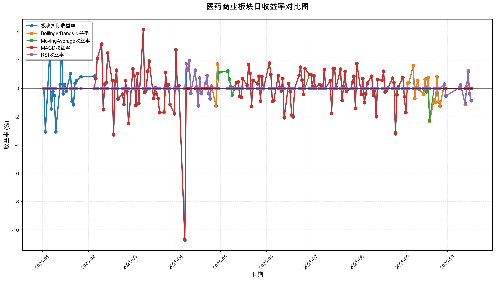
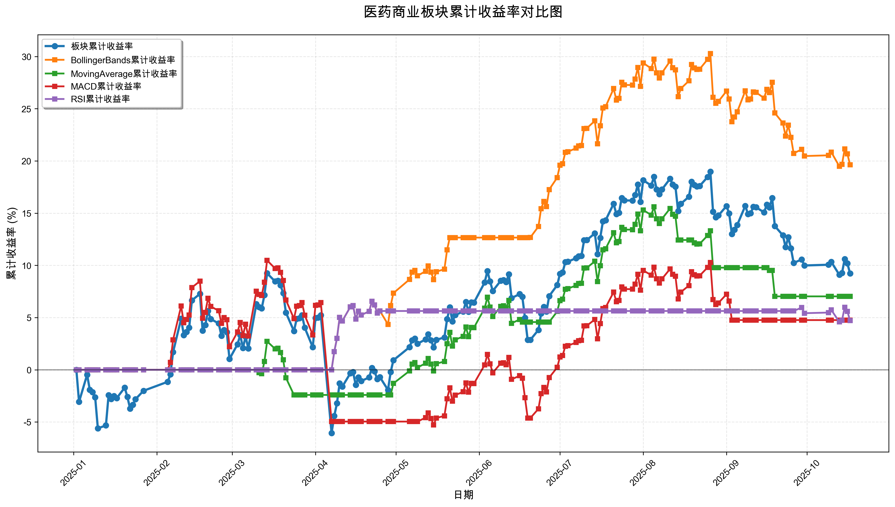

# 策略回测结果报告

**生成时间**: 2025-10-19 19:02:34
**行业板块**: 医药商业
**回测期间**: 20250101 至 20251017
**策略数量**: 4

## 📈 分析结论

### 策略表现分析
- **最佳策略**: BollingerBands (总收益率: 19.63%)
- **最差策略**: RSI (总收益率: 4.71%)
### 交易活跃度分析
- **活跃策略**: 4 个
- **非活跃策略**: 0 个
- **最活跃策略**: MovingAverage (交易次数: 12)
### 🚨 异动提醒分析
- 未检测到明显异动情况
### 风险分析
- **BollingerBands**: 最大回撤 -8.28%, 夏普比率 2.3516
- **MovingAverage**: 最大回撤 -7.43%, 夏普比率 0.9047
- **MACD**: 最大回撤 -14.27%, 夏普比率 0.3220
- **RSI**: 最大回撤 -1.85%, 夏普比率 1.2909

## 📊 综合结果表

| 策略名称           | 初始资金     | 最终价值     | 总收益率   | 年化收益率   | 波动率    |   夏普比率 | 最大回撤    | 总交易次数   | 买入次数   | 卖出次数   | 总交易金额      | 平均交易金额   | 交易频率   |   数据点数 |
|:---------------|:---------|:---------|:-------|:--------|:-------|-------:|:--------|:--------|:-------|:-------|:-----------|:---------|:-------|-------:|
| 板块实际表现         | ¥100,000 | ¥109,228 | 9.23%  | 12.42%  | 22.46% | 0.553  | -14.01% | N/A     | N/A    | N/A    | N/A        | N/A      | N/A    |    190 |
| BollingerBands | ¥100,000 | ¥119,634 | 19.63% | 26.84%  | 11.41% | 2.3516 | -8.28%  | 3       | 2      | 1      | ¥322,711   | ¥107,570 | 0.02   |    190 |
| MovingAverage  | ¥100,000 | ¥107,029 | 7.03%  | 9.43%   | 10.42% | 0.9047 | -7.43%  | 12      | 6      | 6      | ¥1,252,255 | ¥104,355 | 0.06   |    190 |
| MACD           | ¥100,000 | ¥104,756 | 4.76%  | 6.36%   | 19.74% | 0.322  | -14.27% | 4       | 2      | 2      | ¥394,043   | ¥98,511  | 0.02   |    190 |
| RSI            | ¥100,000 | ¥104,710 | 4.71%  | 6.29%   | 4.88%  | 1.2909 | -1.85%  | 3       | 2      | 1      | ¥305,196   | ¥101,732 | 0.02   |    190 |

## 📊 每日收益率走势图

*图1: 医药商业板块每日收益率走势对比*

## 📈 累计收益率走势图

*图2: 医药商业板块累计收益率走势对比*

## 📅 日收益明细表

| 日期         | 板块实际收益率   | BollingerBands收益率   | MovingAverage收益率   | MACD收益率   | RSI收益率   |
|:-----------|:----------|:--------------------|:-------------------|:----------|:---------|
| 2025-01-02 | 0.00%     | 0.00%               | 0.00%              | 0.00%     | 0.00%    |
| 2025-01-03 | -3.07%    | 0.00%               | 0.00%              | 0.00%     | 0.00%    |
| 2025-01-06 | 2.68%     | 0.00%               | 0.00%              | 0.00%     | 0.00%    |
| 2025-01-07 | -1.45%    | 0.00%               | 0.00%              | 0.00%     | 0.00%    |
| 2025-01-08 | -0.23%    | 0.00%               | 0.00%              | 0.00%     | 0.00%    |
| 2025-01-09 | -0.50%    | 0.00%               | 0.00%              | 0.00%     | 0.00%    |
| 2025-01-10 | -3.07%    | 0.00%               | 0.00%              | 0.00%     | 0.00%    |
| 2025-01-13 | 0.30%     | 0.00%               | 0.00%              | 0.00%     | 0.00%    |
| 2025-01-14 | 3.08%     | 0.00%               | 0.00%              | 0.00%     | 0.00%    |
| 2025-01-15 | -0.38%    | 0.00%               | 0.00%              | 0.00%     | 0.00%    |
| 2025-01-16 | 0.27%     | 0.00%               | 0.00%              | 0.00%     | 0.00%    |
| 2025-01-17 | -0.20%    | 0.00%               | 0.00%              | 0.00%     | 0.00%    |
| 2025-01-20 | 1.04%     | 0.00%               | 0.00%              | 0.00%     | 0.00%    |
| 2025-01-21 | -0.90%    | 0.00%               | 0.00%              | 0.00%     | 0.00%    |
| 2025-01-22 | -1.15%    | 0.00%               | 0.00%              | 0.00%     | 0.00%    |
| 2025-01-23 | 0.38%     | 0.00%               | 0.00%              | 0.00%     | 0.00%    |
| 2025-01-24 | 0.55%     | 0.00%               | 0.00%              | 0.00%     | 0.00%    |
| 2025-01-27 | 0.83%     | 0.00%               | 0.00%              | 0.00%     | 0.00%    |
| 2025-02-05 | 0.88%     | 0.00%               | 0.00%              | 0.00%     | 0.00%    |
| 2025-02-06 | 0.72%     | 0.00%               | 0.00%              | 0.72%     | 0.00%    |
| 2025-02-07 | 2.14%     | 0.00%               | 0.00%              | 2.14%     | 0.00%    |
| 2025-02-10 | 3.15%     | 0.00%               | 0.00%              | 3.14%     | 0.00%    |
| 2025-02-11 | -1.51%    | 0.00%               | 0.00%              | -1.51%    | 0.00%    |
| 2025-02-12 | 0.31%     | 0.00%               | 0.00%              | 0.31%     | 0.00%    |
| 2025-02-13 | 0.40%     | 0.00%               | 0.00%              | 0.40%     | 0.00%    |
| 2025-02-14 | 2.51%     | 0.00%               | 0.00%              | 2.51%     | 0.00%    |
| 2025-02-17 | 0.57%     | 0.00%               | 0.00%              | 0.57%     | 0.00%    |
| 2025-02-18 | -3.29%    | 0.00%               | 0.00%              | -3.28%    | 0.00%    |
| 2025-02-19 | 0.53%     | 0.00%               | 0.00%              | 0.52%     | 0.00%    |
| 2025-02-20 | 1.30%     | 0.00%               | 0.00%              | 1.29%     | 0.00%    |
| 2025-02-21 | -0.74%    | 0.00%               | 0.00%              | -0.74%    | 0.00%    |
| 2025-02-24 | -0.40%    | 0.00%               | 0.00%              | -0.40%    | 0.00%    |
| 2025-02-25 | -1.14%    | 0.00%               | 0.00%              | -1.14%    | 0.00%    |
| 2025-02-26 | 0.54%     | 0.00%               | 0.00%              | 0.54%     | 0.00%    |
| 2025-02-27 | -0.20%    | 0.00%               | 0.00%              | -0.20%    | 0.00%    |
| 2025-02-28 | -2.47%    | 0.00%               | 0.00%              | -2.47%    | 0.00%    |
| 2025-03-03 | 1.39%     | 0.00%               | 0.00%              | 1.38%     | 0.00%    |
| 2025-03-04 | 0.88%     | 0.00%               | 0.00%              | 0.88%     | 0.00%    |
| 2025-03-05 | -1.21%    | 0.00%               | 0.00%              | -1.20%    | 0.00%    |
| 2025-03-06 | 1.05%     | 0.00%               | 0.00%              | 1.05%     | 0.00%    |
| 2025-03-07 | -1.08%    | 0.00%               | 0.00%              | -1.08%    | 0.00%    |
| 2025-03-10 | 4.16%     | 0.00%               | 0.00%              | 4.15%     | 0.00%    |
| 2025-03-11 | -0.28%    | 0.00%               | -0.28%             | -0.28%    | 0.00%    |
| 2025-03-12 | -0.10%    | 0.00%               | -0.10%             | -0.10%    | 0.00%    |
| 2025-03-13 | 1.19%     | 0.00%               | 1.17%              | 1.19%     | 0.00%    |
| 2025-03-14 | 1.95%     | 0.00%               | 1.91%              | 1.94%     | 0.00%    |
| 2025-03-17 | -0.71%    | 0.00%               | -0.70%             | -0.71%    | 0.00%    |
| 2025-03-18 | 0.06%     | 0.00%               | 0.06%              | 0.06%     | 0.00%    |
| 2025-03-19 | -0.40%    | 0.00%               | -0.39%             | -0.40%    | 0.00%    |
| 2025-03-20 | -0.71%    | 0.00%               | -0.70%             | -0.71%    | 0.00%    |
| 2025-03-21 | -1.72%    | 0.00%               | -1.70%             | -1.72%    | 0.00%    |
| 2025-03-24 | -1.69%    | 0.00%               | -1.66%             | -1.69%    | 0.00%    |
| 2025-03-25 | 1.13%     | 0.00%               | 0.00%              | 1.13%     | 0.00%    |
| 2025-03-26 | 0.06%     | 0.00%               | 0.00%              | 0.06%     | 0.00%    |
| 2025-03-27 | 0.27%     | 0.00%               | 0.00%              | 0.27%     | 0.00%    |
| 2025-03-28 | -1.13%    | 0.00%               | 0.00%              | -1.12%    | 0.00%    |
| 2025-03-31 | -1.80%    | 0.00%               | 0.00%              | -1.80%    | 0.00%    |
| 2025-04-01 | 2.74%     | 0.00%               | 0.00%              | 2.73%     | 0.00%    |
| 2025-04-02 | 0.05%     | 0.00%               | 0.00%              | 0.05%     | 0.00%    |
| 2025-04-03 | 0.20%     | 0.00%               | 0.00%              | 0.20%     | 0.00%    |
| 2025-04-07 | -10.73%   | 0.00%               | 0.00%              | -10.70%   | 0.00%    |
| 2025-04-08 | 1.75%     | 1.73%               | 0.00%              | 0.00%     | 1.73%    |
| 2025-04-09 | 1.27%     | 1.25%               | 0.00%              | 0.00%     | 1.25%    |
| 2025-04-10 | 1.99%     | 1.97%               | 0.00%              | 0.00%     | 1.97%    |
| 2025-04-11 | -0.33%    | -0.33%              | 0.00%              | 0.00%     | -0.33%   |
| 2025-04-14 | 1.30%     | 1.29%               | 0.00%              | 0.00%     | 1.29%    |
| 2025-04-15 | 0.11%     | 0.11%               | 0.00%              | 0.00%     | 0.11%    |
| 2025-04-16 | -1.23%    | -1.22%              | 0.00%              | 0.00%     | -1.22%   |
| 2025-04-17 | 0.74%     | 0.74%               | 0.00%              | 0.00%     | 0.74%    |
| 2025-04-18 | -0.37%    | -0.36%              | 0.00%              | 0.00%     | -0.36%   |
| 2025-04-21 | 0.35%     | 0.35%               | 0.00%              | 0.00%     | 0.35%    |
| 2025-04-22 | 0.92%     | 0.91%               | 0.00%              | 0.00%     | 0.91%    |
| 2025-04-23 | -0.34%    | -0.33%              | 0.00%              | 0.00%     | -0.33%   |
| 2025-04-24 | -0.73%    | -0.73%              | 0.00%              | 0.00%     | -0.73%   |
| 2025-04-25 | 0.18%     | 0.18%               | 0.00%              | 0.00%     | 0.18%    |
| 2025-04-28 | -1.23%    | -1.22%              | 0.00%              | 0.00%     | 0.00%    |
| 2025-04-29 | 1.74%     | 1.72%               | 0.00%              | 0.00%     | 0.00%    |
| 2025-04-30 | 1.14%     | 1.13%               | 1.13%              | 0.00%     | 0.00%    |
| 2025-05-06 | 1.24%     | 1.22%               | 1.22%              | 0.00%     | 0.00%    |
| 2025-05-07 | 0.66%     | 0.65%               | 0.65%              | 0.00%     | 0.00%    |
| 2025-05-08 | 0.15%     | 0.14%               | 0.14%              | 0.00%     | 0.00%    |
| 2025-05-09 | -0.46%    | -0.46%              | -0.46%             | 0.00%     | 0.00%    |
| 2025-05-12 | 0.40%     | 0.40%               | 0.40%              | 0.40%     | 0.00%    |
| 2025-05-13 | 0.46%     | 0.46%               | 0.46%              | 0.46%     | 0.00%    |
| 2025-05-14 | -0.55%    | -0.54%              | -0.54%             | -0.55%    | 0.00%    |
| 2025-05-15 | -0.65%    | -0.65%              | -0.65%             | -0.65%    | 0.00%    |
| 2025-05-16 | 0.70%     | 0.69%               | 0.69%              | 0.70%     | 0.00%    |
| 2025-05-19 | 0.23%     | 0.23%               | 0.23%              | 0.23%     | 0.00%    |
| 2025-05-20 | 1.70%     | 1.68%               | 1.68%              | 1.70%     | 0.00%    |
| 2025-05-21 | 1.07%     | 1.06%               | 1.06%              | 1.07%     | 0.00%    |
| 2025-05-22 | -1.28%    | 0.00%               | -1.26%             | -1.27%    | 0.00%    |
| 2025-05-23 | 0.59%     | 0.00%               | 0.58%              | 0.59%     | 0.00%    |
| 2025-05-26 | 0.32%     | 0.00%               | 0.32%              | 0.32%     | 0.00%    |
| 2025-05-27 | 0.87%     | 0.00%               | 0.86%              | 0.87%     | 0.00%    |
| 2025-05-28 | -0.89%    | 0.00%               | -0.88%             | -0.89%    | 0.00%    |
| 2025-05-29 | 0.86%     | 0.00%               | 0.85%              | 0.86%     | 0.00%    |
| 2025-05-30 | -0.02%    | 0.00%               | -0.02%             | -0.02%    | 0.00%    |
| 2025-06-03 | 1.81%     | 0.00%               | 1.79%              | 1.81%     | 0.00%    |
| 2025-06-04 | 1.01%     | 0.00%               | 1.00%              | 1.01%     | 0.00%    |
| 2025-06-05 | -0.90%    | 0.00%               | -0.89%             | -0.90%    | 0.00%    |
| 2025-06-06 | -0.86%    | 0.00%               | -0.85%             | -0.85%    | 0.00%    |
| 2025-06-09 | 0.93%     | 0.00%               | 0.92%              | 0.93%     | 0.00%    |
| 2025-06-10 | 0.04%     | 0.00%               | 0.04%              | 0.04%     | 0.00%    |
| 2025-06-11 | -0.18%    | 0.00%               | -0.18%             | -0.18%    | 0.00%    |
| 2025-06-12 | 0.69%     | 0.00%               | 0.68%              | 0.69%     | 0.00%    |
| 2025-06-13 | -2.08%    | 0.00%               | -2.06%             | -2.08%    | 0.00%    |
| 2025-06-16 | 0.36%     | 0.00%               | 0.36%              | 0.36%     | 0.00%    |
| 2025-06-17 | -0.24%    | 0.00%               | -0.24%             | -0.24%    | 0.00%    |
| 2025-06-18 | -1.89%    | 0.00%               | 0.00%              | -1.88%    | 0.00%    |
| 2025-06-19 | -2.01%    | 0.00%               | 0.00%              | -2.01%    | 0.00%    |
| 2025-06-20 | 0.01%     | 0.01%               | 0.00%              | 0.01%     | 0.00%    |
| 2025-06-23 | 0.93%     | 0.93%               | 0.00%              | 0.93%     | 0.00%    |
| 2025-06-24 | 1.51%     | 1.51%               | 0.00%              | 1.51%     | 0.00%    |
| 2025-06-25 | 0.60%     | 0.60%               | 0.00%              | 0.60%     | 0.00%    |
| 2025-06-26 | -0.43%    | -0.43%              | 0.00%              | -0.43%    | 0.00%    |
| 2025-06-27 | 1.41%     | 1.41%               | 0.00%              | 1.41%     | 0.00%    |
| 2025-06-30 | 0.98%     | 0.98%               | 0.98%              | 0.98%     | 0.00%    |
| 2025-07-01 | 1.00%     | 1.00%               | 0.99%              | 1.00%     | 0.00%    |
| 2025-07-02 | 0.13%     | 0.13%               | 0.13%              | 0.13%     | 0.00%    |
| 2025-07-03 | 0.90%     | 0.90%               | 0.89%              | 0.90%     | 0.00%    |
| 2025-07-04 | 0.05%     | 0.05%               | 0.05%              | 0.05%     | 0.00%    |
| 2025-07-07 | 0.29%     | 0.29%               | 0.29%              | 0.29%     | 0.00%    |
| 2025-07-08 | 0.17%     | 0.17%               | 0.17%              | 0.17%     | 0.00%    |
| 2025-07-09 | 0.03%     | 0.03%               | 0.03%              | 0.03%     | 0.00%    |
| 2025-07-10 | 1.35%     | 1.35%               | 1.34%              | 1.35%     | 0.00%    |
| 2025-07-11 | 0.02%     | 0.02%               | 0.02%              | 0.02%     | 0.00%    |
| 2025-07-14 | 0.58%     | 0.58%               | 0.57%              | 0.58%     | 0.00%    |
| 2025-07-15 | -1.77%    | -1.77%              | -1.76%             | -1.77%    | 0.00%    |
| 2025-07-16 | 1.41%     | 1.41%               | 1.40%              | 1.41%     | 0.00%    |
| 2025-07-17 | 1.39%     | 1.39%               | 1.38%              | 1.39%     | 0.00%    |
| 2025-07-18 | 0.10%     | 0.10%               | 0.10%              | 0.10%     | 0.00%    |
| 2025-07-21 | 1.38%     | 1.38%               | 1.37%              | 1.38%     | 0.00%    |
| 2025-07-22 | -0.86%    | -0.85%              | -0.85%             | -0.85%    | 0.00%    |
| 2025-07-23 | 0.12%     | 0.12%               | 0.12%              | 0.12%     | 0.00%    |
| 2025-07-24 | 1.22%     | 1.22%               | 1.21%              | 1.22%     | 0.00%    |
| 2025-07-25 | -0.20%    | -0.20%              | -0.20%             | -0.20%    | 0.00%    |
| 2025-07-28 | -0.01%    | -0.01%              | -0.01%             | -0.01%    | 0.00%    |
| 2025-07-29 | 0.45%     | 0.45%               | 0.45%              | 0.45%     | 0.00%    |
| 2025-07-30 | 0.87%     | 0.87%               | 0.86%              | 0.87%     | 0.00%    |
| 2025-07-31 | -1.40%    | -1.40%              | -1.39%             | -1.40%    | 0.00%    |
| 2025-08-01 | 1.77%     | 1.77%               | 1.75%              | 1.77%     | 0.00%    |
| 2025-08-04 | -0.42%    | -0.42%              | -0.42%             | -0.42%    | 0.00%    |
| 2025-08-05 | 0.70%     | 0.70%               | 0.69%              | 0.70%     | 0.00%    |
| 2025-08-06 | -1.01%    | -1.01%              | -1.00%             | -1.01%    | 0.00%    |
| 2025-08-07 | -0.39%    | -0.39%              | -0.38%             | -0.39%    | 0.00%    |
| 2025-08-08 | 0.39%     | 0.38%               | 0.38%              | 0.38%     | 0.00%    |
| 2025-08-11 | 0.87%     | 0.87%               | 0.87%              | 0.87%     | 0.00%    |
| 2025-08-12 | -0.48%    | -0.48%              | -0.47%             | -0.48%    | 0.00%    |
| 2025-08-13 | -0.17%    | -0.17%              | -0.16%             | -0.17%    | 0.00%    |
| 2025-08-14 | -2.00%    | -2.00%              | -1.98%             | -2.00%    | 0.00%    |
| 2025-08-15 | 0.62%     | 0.62%               | 0.00%              | 0.62%     | 0.00%    |
| 2025-08-18 | 0.58%     | 0.58%               | 0.00%              | 0.58%     | 0.00%    |
| 2025-08-19 | 1.23%     | 1.23%               | 0.00%              | 1.23%     | 0.00%    |
| 2025-08-20 | -0.25%    | -0.25%              | -0.24%             | -0.25%    | 0.00%    |
| 2025-08-21 | -0.12%    | -0.12%              | -0.12%             | -0.12%    | 0.00%    |
| 2025-08-22 | 0.03%     | 0.03%               | 0.03%              | 0.03%     | 0.00%    |
| 2025-08-25 | 0.74%     | 0.73%               | 0.71%              | 0.73%     | 0.00%    |
| 2025-08-26 | 0.42%     | 0.42%               | 0.41%              | 0.42%     | 0.00%    |
| 2025-08-27 | -3.22%    | -3.21%              | -3.13%             | -3.21%    | 0.00%    |
| 2025-08-28 | -0.45%    | -0.45%              | 0.00%              | -0.45%    | 0.00%    |
| 2025-08-29 | 0.14%     | 0.14%               | 0.00%              | 0.14%     | 0.00%    |
| 2025-09-01 | 0.79%     | 0.79%               | 0.00%              | 0.78%     | 0.00%    |
| 2025-09-02 | -0.60%    | -0.60%              | 0.00%              | -0.60%    | 0.00%    |
| 2025-09-03 | -1.72%    | -1.72%              | 0.00%              | -1.72%    | 0.00%    |
| 2025-09-04 | 0.36%     | 0.36%               | 0.00%              | 0.00%     | 0.00%    |
| 2025-09-05 | 0.40%     | 0.40%               | 0.00%              | 0.00%     | 0.00%    |
| 2025-09-08 | 1.61%     | 1.61%               | 0.00%              | 0.00%     | 0.00%    |
| 2025-09-09 | -0.68%    | -0.68%              | 0.00%              | 0.00%     | 0.00%    |
| 2025-09-10 | 0.07%     | 0.07%               | 0.00%              | 0.00%     | 0.00%    |
| 2025-09-11 | 0.54%     | 0.54%               | 0.00%              | 0.00%     | 0.00%    |
| 2025-09-12 | -0.04%    | -0.04%              | 0.00%              | 0.00%     | 0.00%    |
| 2025-09-15 | -0.43%    | -0.43%              | 0.00%              | 0.00%     | 0.00%    |
| 2025-09-16 | 0.66%     | 0.66%               | 0.00%              | 0.00%     | 0.00%    |
| 2025-09-17 | -0.24%    | -0.24%              | -0.23%             | 0.00%     | 0.00%    |
| 2025-09-18 | 0.78%     | 0.78%               | 0.00%              | 0.00%     | 0.00%    |
| 2025-09-19 | -2.31%    | -2.31%              | -2.27%             | 0.00%     | 0.00%    |
| 2025-09-22 | -0.77%    | -0.77%              | 0.00%              | 0.00%     | 0.00%    |
| 2025-09-23 | -1.00%    | -1.00%              | 0.00%              | 0.00%     | 0.00%    |
| 2025-09-24 | 0.84%     | 0.84%               | 0.00%              | 0.00%     | 0.00%    |
| 2025-09-25 | -0.95%    | -0.95%              | 0.00%              | 0.00%     | 0.00%    |
| 2025-09-26 | -1.25%    | -1.25%              | 0.00%              | 0.00%     | 0.00%    |
| 2025-09-29 | 0.32%     | 0.31%               | 0.00%              | 0.00%     | 0.30%    |
| 2025-09-30 | -0.53%    | -0.52%              | 0.00%              | 0.00%     | -0.51%   |
| 2025-10-09 | 0.06%     | 0.06%               | 0.00%              | 0.00%     | 0.06%    |
| 2025-10-10 | 0.25%     | 0.25%               | 0.00%              | 0.00%     | 0.24%    |
| 2025-10-13 | -1.12%    | -1.12%              | 0.00%              | 0.00%     | -1.08%   |
| 2025-10-14 | 0.15%     | 0.15%               | 0.00%              | 0.00%     | 0.14%    |
| 2025-10-15 | 1.24%     | 1.24%               | 0.00%              | 0.00%     | 1.19%    |
| 2025-10-16 | -0.39%    | -0.39%              | 0.00%              | 0.00%     | -0.37%   |
| 2025-10-17 | -0.87%    | -0.87%              | 0.00%              | 0.00%     | -0.84%   |

## 📊 日收益统计摘要

| 指标                | 平均日收益率   | 最大日收益率   | 最小日收益率   | 正收益天数   | 负收益天数   |
|:------------------|:---------|:---------|:---------|:--------|:--------|
| 板块实际收益率           | 0.06%    | 4.16%    | -10.73%  | 111天    | 78天     |
| BollingerBands收益率 | 0.10%    | 1.97%    | -3.21%   | 69天     | 40天     |
| MovingAverage收益率  | 0.04%    | 1.91%    | -3.13%   | 49天     | 34天     |
| MACD收益率           | 0.03%    | 4.15%    | -10.70%  | 75天     | 49天     |
| RSI收益率            | 0.02%    | 1.97%    | -1.22%   | 14天     | 9天      |

## 📈 累计收益明细表

| 日期         | 板块累计收益率   | BollingerBands累计收益率   | MovingAverage累计收益率   | MACD累计收益率   | RSI累计收益率   |
|:-----------|:----------|:----------------------|:---------------------|:------------|:-----------|
| 2025-01-02 | 0.00%     | 0.00%                 | 0.00%                | 0.00%       | 0.00%      |
| 2025-01-03 | -3.07%    | 0.00%                 | 0.00%                | 0.00%       | 0.00%      |
| 2025-01-06 | -0.47%    | 0.00%                 | 0.00%                | 0.00%       | 0.00%      |
| 2025-01-07 | -1.91%    | 0.00%                 | 0.00%                | 0.00%       | 0.00%      |
| 2025-01-08 | -2.14%    | 0.00%                 | 0.00%                | 0.00%       | 0.00%      |
| 2025-01-09 | -2.63%    | 0.00%                 | 0.00%                | 0.00%       | 0.00%      |
| 2025-01-10 | -5.61%    | 0.00%                 | 0.00%                | 0.00%       | 0.00%      |
| 2025-01-13 | -5.33%    | 0.00%                 | 0.00%                | 0.00%       | 0.00%      |
| 2025-01-14 | -2.42%    | 0.00%                 | 0.00%                | 0.00%       | 0.00%      |
| 2025-01-15 | -2.79%    | 0.00%                 | 0.00%                | 0.00%       | 0.00%      |
| 2025-01-16 | -2.52%    | 0.00%                 | 0.00%                | 0.00%       | 0.00%      |
| 2025-01-17 | -2.72%    | 0.00%                 | 0.00%                | 0.00%       | 0.00%      |
| 2025-01-20 | -1.71%    | 0.00%                 | 0.00%                | 0.00%       | 0.00%      |
| 2025-01-21 | -2.60%    | 0.00%                 | 0.00%                | 0.00%       | 0.00%      |
| 2025-01-22 | -3.72%    | 0.00%                 | 0.00%                | 0.00%       | 0.00%      |
| 2025-01-23 | -3.36%    | 0.00%                 | 0.00%                | 0.00%       | 0.00%      |
| 2025-01-24 | -2.82%    | 0.00%                 | 0.00%                | 0.00%       | 0.00%      |
| 2025-01-27 | -2.01%    | 0.00%                 | 0.00%                | 0.00%       | 0.00%      |
| 2025-02-05 | -1.15%    | 0.00%                 | 0.00%                | 0.00%       | 0.00%      |
| 2025-02-06 | -0.44%    | 0.00%                 | 0.00%                | 0.72%       | 0.00%      |
| 2025-02-07 | 1.69%     | 0.00%                 | 0.00%                | 2.87%       | 0.00%      |
| 2025-02-10 | 4.89%     | 0.00%                 | 0.00%                | 6.10%       | 0.00%      |
| 2025-02-11 | 3.31%     | 0.00%                 | 0.00%                | 4.50%       | 0.00%      |
| 2025-02-12 | 3.63%     | 0.00%                 | 0.00%                | 4.82%       | 0.00%      |
| 2025-02-13 | 4.04%     | 0.00%                 | 0.00%                | 5.24%       | 0.00%      |
| 2025-02-14 | 6.65%     | 0.00%                 | 0.00%                | 7.88%       | 0.00%      |
| 2025-02-17 | 7.27%     | 0.00%                 | 0.00%                | 8.49%       | 0.00%      |
| 2025-02-18 | 3.74%     | 0.00%                 | 0.00%                | 4.94%       | 0.00%      |
| 2025-02-19 | 4.29%     | 0.00%                 | 0.00%                | 5.49%       | 0.00%      |
| 2025-02-20 | 5.64%     | 0.00%                 | 0.00%                | 6.85%       | 0.00%      |
| 2025-02-21 | 4.86%     | 0.00%                 | 0.00%                | 6.07%       | 0.00%      |
| 2025-02-24 | 4.44%     | 0.00%                 | 0.00%                | 5.65%       | 0.00%      |
| 2025-02-25 | 3.25%     | 0.00%                 | 0.00%                | 4.44%       | 0.00%      |
| 2025-02-26 | 3.81%     | 0.00%                 | 0.00%                | 5.01%       | 0.00%      |
| 2025-02-27 | 3.60%     | 0.00%                 | 0.00%                | 4.79%       | 0.00%      |
| 2025-02-28 | 1.04%     | 0.00%                 | 0.00%                | 2.21%       | 0.00%      |
| 2025-03-03 | 2.44%     | 0.00%                 | 0.00%                | 3.62%       | 0.00%      |
| 2025-03-04 | 3.34%     | 0.00%                 | 0.00%                | 4.53%       | 0.00%      |
| 2025-03-05 | 2.09%     | 0.00%                 | 0.00%                | 3.27%       | 0.00%      |
| 2025-03-06 | 3.17%     | 0.00%                 | 0.00%                | 4.36%       | 0.00%      |
| 2025-03-07 | 2.05%     | 0.00%                 | 0.00%                | 3.23%       | 0.00%      |
| 2025-03-10 | 6.30%     | 0.00%                 | 0.00%                | 7.52%       | 0.00%      |
| 2025-03-11 | 6.00%     | 0.00%                 | -0.28%               | 7.22%       | 0.00%      |
| 2025-03-12 | 5.89%     | 0.00%                 | -0.38%               | 7.11%       | 0.00%      |
| 2025-03-13 | 7.15%     | 0.00%                 | 0.79%                | 8.38%       | 0.00%      |
| 2025-03-14 | 9.24%     | 0.00%                 | 2.72%                | 10.48%      | 0.00%      |
| 2025-03-17 | 8.46%     | 0.00%                 | 2.00%                | 9.70%       | 0.00%      |
| 2025-03-18 | 8.53%     | 0.00%                 | 2.06%                | 9.77%       | 0.00%      |
| 2025-03-19 | 8.09%     | 0.00%                 | 1.66%                | 9.33%       | 0.00%      |
| 2025-03-20 | 7.33%     | 0.00%                 | 0.95%                | 8.56%       | 0.00%      |
| 2025-03-21 | 5.48%     | 0.00%                 | -0.76%               | 6.69%       | 0.00%      |
| 2025-03-24 | 3.70%     | 0.00%                 | -2.41%               | 4.89%       | 0.00%      |
| 2025-03-25 | 4.87%     | 0.00%                 | -2.41%               | 6.08%       | 0.00%      |
| 2025-03-26 | 4.93%     | 0.00%                 | -2.41%               | 6.14%       | 0.00%      |
| 2025-03-27 | 5.22%     | 0.00%                 | -2.41%               | 6.43%       | 0.00%      |
| 2025-03-28 | 4.04%     | 0.00%                 | -2.41%               | 5.23%       | 0.00%      |
| 2025-03-31 | 2.16%     | 0.00%                 | -2.41%               | 3.34%       | 0.00%      |
| 2025-04-01 | 4.96%     | 0.00%                 | -2.41%               | 6.17%       | 0.00%      |
| 2025-04-02 | 5.01%     | 0.00%                 | -2.41%               | 6.22%       | 0.00%      |
| 2025-04-03 | 5.22%     | 0.00%                 | -2.41%               | 6.43%       | 0.00%      |
| 2025-04-07 | -6.06%    | 0.00%                 | -2.41%               | -4.96%      | 0.00%      |
| 2025-04-08 | -4.42%    | 1.73%                 | -2.41%               | -4.96%      | 1.73%      |
| 2025-04-09 | -3.21%    | 3.00%                 | -2.41%               | -4.96%      | 3.00%      |
| 2025-04-10 | -1.29%    | 5.03%                 | -2.41%               | -4.96%      | 5.03%      |
| 2025-04-11 | -1.61%    | 4.68%                 | -2.41%               | -4.96%      | 4.68%      |
| 2025-04-14 | -0.33%    | 6.03%                 | -2.41%               | -4.96%      | 6.03%      |
| 2025-04-15 | -0.22%    | 6.15%                 | -2.41%               | -4.96%      | 6.15%      |
| 2025-04-16 | -1.45%    | 4.85%                 | -2.41%               | -4.96%      | 4.85%      |
| 2025-04-17 | -0.72%    | 5.62%                 | -2.41%               | -4.96%      | 5.62%      |
| 2025-04-18 | -1.08%    | 5.24%                 | -2.41%               | -4.96%      | 5.24%      |
| 2025-04-21 | -0.73%    | 5.60%                 | -2.41%               | -4.96%      | 5.60%      |
| 2025-04-22 | 0.18%     | 6.57%                 | -2.41%               | -4.96%      | 6.57%      |
| 2025-04-23 | -0.16%    | 6.21%                 | -2.41%               | -4.96%      | 6.21%      |
| 2025-04-24 | -0.89%    | 5.44%                 | -2.41%               | -4.96%      | 5.44%      |
| 2025-04-25 | -0.71%    | 5.63%                 | -2.41%               | -4.96%      | 5.63%      |
| 2025-04-28 | -1.93%    | 4.35%                 | -2.41%               | -4.96%      | 5.63%      |
| 2025-04-29 | -0.22%    | 6.14%                 | -2.41%               | -4.96%      | 5.63%      |
| 2025-04-30 | 0.91%     | 7.34%                 | -1.31%               | -4.96%      | 5.63%      |
| 2025-05-06 | 2.16%     | 8.65%                 | -0.11%               | -4.96%      | 5.63%      |
| 2025-05-07 | 2.83%     | 9.35%                 | 0.54%                | -4.96%      | 5.63%      |
| 2025-05-08 | 2.98%     | 9.51%                 | 0.69%                | -4.96%      | 5.63%      |
| 2025-05-09 | 2.50%     | 9.01%                 | 0.22%                | -4.96%      | 5.63%      |
| 2025-05-12 | 2.91%     | 9.44%                 | 0.62%                | -4.58%      | 5.63%      |
| 2025-05-13 | 3.39%     | 9.94%                 | 1.09%                | -4.14%      | 5.63%      |
| 2025-05-14 | 2.82%     | 9.35%                 | 0.54%                | -4.66%      | 5.63%      |
| 2025-05-15 | 2.15%     | 8.64%                 | -0.11%               | -5.28%      | 5.63%      |
| 2025-05-16 | 2.87%     | 9.39%                 | 0.58%                | -4.62%      | 5.63%      |
| 2025-05-19 | 3.10%     | 9.64%                 | 0.80%                | -4.41%      | 5.63%      |
| 2025-05-20 | 4.85%     | 11.48%                | 2.50%                | -2.78%      | 5.63%      |
| 2025-05-21 | 5.98%     | 12.66%                | 3.59%                | -1.74%      | 5.63%      |
| 2025-05-22 | 4.63%     | 12.66%                | 2.28%                | -3.00%      | 5.63%      |
| 2025-05-23 | 5.24%     | 12.66%                | 2.87%                | -2.43%      | 5.63%      |
| 2025-05-26 | 5.58%     | 12.66%                | 3.20%                | -2.11%      | 5.63%      |
| 2025-05-27 | 6.50%     | 12.66%                | 4.09%                | -1.26%      | 5.63%      |
| 2025-05-28 | 5.55%     | 12.66%                | 3.17%                | -2.14%      | 5.63%      |
| 2025-05-29 | 6.46%     | 12.66%                | 4.05%                | -1.30%      | 5.63%      |
| 2025-05-30 | 6.44%     | 12.66%                | 4.04%                | -1.32%      | 5.63%      |
| 2025-06-03 | 8.37%     | 12.66%                | 5.90%                | 0.47%       | 5.63%      |
| 2025-06-04 | 9.46%     | 12.66%                | 6.96%                | 1.48%       | 5.63%      |
| 2025-06-05 | 8.47%     | 12.66%                | 6.00%                | 0.57%       | 5.63%      |
| 2025-06-06 | 7.55%     | 12.66%                | 5.11%                | -0.29%      | 5.63%      |
| 2025-06-09 | 8.54%     | 12.66%                | 6.07%                | 0.63%       | 5.63%      |
| 2025-06-10 | 8.59%     | 12.66%                | 6.12%                | 0.67%       | 5.63%      |
| 2025-06-11 | 8.40%     | 12.66%                | 5.93%                | 0.49%       | 5.63%      |
| 2025-06-12 | 9.14%     | 12.66%                | 6.65%                | 1.18%       | 5.63%      |
| 2025-06-13 | 6.87%     | 12.66%                | 4.45%                | -0.92%      | 5.63%      |
| 2025-06-16 | 7.25%     | 12.66%                | 4.82%                | -0.57%      | 5.63%      |
| 2025-06-17 | 6.99%     | 12.66%                | 4.57%                | -0.81%      | 5.63%      |
| 2025-06-18 | 4.97%     | 12.66%                | 4.57%                | -2.68%      | 5.63%      |
| 2025-06-19 | 2.86%     | 12.66%                | 4.57%                | -4.63%      | 5.63%      |
| 2025-06-20 | 2.87%     | 12.68%                | 4.57%                | -4.62%      | 5.63%      |
| 2025-06-23 | 3.82%     | 13.72%                | 4.57%                | -3.74%      | 5.63%      |
| 2025-06-24 | 5.39%     | 15.43%                | 4.57%                | -2.29%      | 5.63%      |
| 2025-06-25 | 6.02%     | 16.13%                | 4.57%                | -1.70%      | 5.63%      |
| 2025-06-26 | 5.57%     | 15.63%                | 4.57%                | -2.12%      | 5.63%      |
| 2025-06-27 | 7.06%     | 17.26%                | 4.57%                | -0.75%      | 5.63%      |
| 2025-06-30 | 8.11%     | 18.41%                | 5.59%                | 0.23%       | 5.63%      |
| 2025-07-01 | 9.19%     | 19.59%                | 6.63%                | 1.23%       | 5.63%      |
| 2025-07-02 | 9.33%     | 19.74%                | 6.76%                | 1.36%       | 5.63%      |
| 2025-07-03 | 10.31%    | 20.82%                | 7.71%                | 2.26%       | 5.63%      |
| 2025-07-04 | 10.36%    | 20.88%                | 7.77%                | 2.31%       | 5.63%      |
| 2025-07-07 | 10.69%    | 21.23%                | 8.08%                | 2.61%       | 5.63%      |
| 2025-07-08 | 10.87%    | 21.43%                | 8.26%                | 2.79%       | 5.63%      |
| 2025-07-09 | 10.91%    | 21.47%                | 8.29%                | 2.82%       | 5.63%      |
| 2025-07-10 | 12.40%    | 23.11%                | 9.74%                | 4.20%       | 5.63%      |
| 2025-07-11 | 12.42%    | 23.13%                | 9.76%                | 4.22%       | 5.63%      |
| 2025-07-14 | 13.07%    | 23.84%                | 10.39%               | 4.82%       | 5.63%      |
| 2025-07-15 | 11.07%    | 21.65%                | 8.45%                | 2.97%       | 5.63%      |
| 2025-07-16 | 12.64%    | 23.36%                | 9.97%                | 4.42%       | 5.63%      |
| 2025-07-17 | 14.21%    | 25.08%                | 11.48%               | 5.87%       | 5.63%      |
| 2025-07-18 | 14.32%    | 25.20%                | 11.59%               | 5.97%       | 5.63%      |
| 2025-07-21 | 15.90%    | 26.93%                | 13.12%               | 7.44%       | 5.63%      |
| 2025-07-22 | 14.91%    | 25.84%                | 12.16%               | 6.52%       | 5.63%      |
| 2025-07-23 | 15.04%    | 25.99%                | 12.29%               | 6.65%       | 5.63%      |
| 2025-07-24 | 16.45%    | 27.53%                | 13.65%               | 7.94%       | 5.63%      |
| 2025-07-25 | 16.22%    | 27.28%                | 13.43%               | 7.73%       | 5.63%      |
| 2025-07-28 | 16.21%    | 27.27%                | 13.42%               | 7.72%       | 5.63%      |
| 2025-07-29 | 16.73%    | 27.84%                | 13.93%               | 8.21%       | 5.63%      |
| 2025-07-30 | 17.75%    | 28.95%                | 14.91%               | 9.15%       | 5.63%      |
| 2025-07-31 | 16.09%    | 27.14%                | 13.31%               | 7.62%       | 5.63%      |
| 2025-08-01 | 18.15%    | 29.39%                | 15.30%               | 9.52%       | 5.63%      |
| 2025-08-04 | 17.65%    | 28.85%                | 14.82%               | 9.06%       | 5.63%      |
| 2025-08-05 | 18.48%    | 29.75%                | 15.61%               | 9.82%       | 5.63%      |
| 2025-08-06 | 17.28%    | 28.44%                | 14.46%               | 8.72%       | 5.63%      |
| 2025-08-07 | 16.83%    | 27.95%                | 14.02%               | 8.30%       | 5.63%      |
| 2025-08-08 | 17.28%    | 28.44%                | 14.46%               | 8.71%       | 5.63%      |
| 2025-08-11 | 18.30%    | 29.56%                | 15.45%               | 9.66%       | 5.63%      |
| 2025-08-12 | 17.74%    | 28.94%                | 14.90%               | 9.14%       | 5.63%      |
| 2025-08-13 | 17.54%    | 28.73%                | 14.71%               | 8.96%       | 5.63%      |
| 2025-08-14 | 15.19%    | 26.15%                | 12.43%               | 6.78%       | 5.63%      |
| 2025-08-15 | 15.90%    | 26.93%                | 12.43%               | 7.44%       | 5.63%      |
| 2025-08-18 | 16.57%    | 27.67%                | 12.43%               | 8.06%       | 5.63%      |
| 2025-08-19 | 18.01%    | 29.24%                | 12.43%               | 9.39%       | 5.63%      |
| 2025-08-20 | 17.71%    | 28.91%                | 12.16%               | 9.11%       | 5.63%      |
| 2025-08-21 | 17.57%    | 28.76%                | 12.03%               | 8.98%       | 5.63%      |
| 2025-08-22 | 17.60%    | 28.79%                | 12.06%               | 9.01%       | 5.63%      |
| 2025-08-25 | 18.47%    | 29.74%                | 12.86%               | 9.81%       | 5.63%      |
| 2025-08-26 | 18.97%    | 30.28%                | 13.32%               | 10.27%      | 5.63%      |
| 2025-08-27 | 15.14%    | 26.10%                | 9.78%                | 6.73%       | 5.63%      |
| 2025-08-28 | 14.61%    | 25.53%                | 9.78%                | 6.25%       | 5.63%      |
| 2025-08-29 | 14.78%    | 25.70%                | 9.78%                | 6.40%       | 5.63%      |
| 2025-09-01 | 15.68%    | 26.69%                | 9.78%                | 7.23%       | 5.63%      |
| 2025-09-02 | 14.98%    | 25.93%                | 9.78%                | 6.59%       | 5.63%      |
| 2025-09-03 | 13.00%    | 23.76%                | 9.78%                | 4.76%       | 5.63%      |
| 2025-09-04 | 13.41%    | 24.21%                | 9.78%                | 4.76%       | 5.63%      |
| 2025-09-05 | 13.87%    | 24.71%                | 9.78%                | 4.76%       | 5.63%      |
| 2025-09-08 | 15.70%    | 26.71%                | 9.78%                | 4.76%       | 5.63%      |
| 2025-09-09 | 14.92%    | 25.85%                | 9.78%                | 4.76%       | 5.63%      |
| 2025-09-10 | 14.99%    | 25.94%                | 9.78%                | 4.76%       | 5.63%      |
| 2025-09-11 | 15.61%    | 26.62%                | 9.78%                | 4.76%       | 5.63%      |
| 2025-09-12 | 15.57%    | 26.57%                | 9.78%                | 4.76%       | 5.63%      |
| 2025-09-15 | 15.07%    | 26.02%                | 9.78%                | 4.76%       | 5.63%      |
| 2025-09-16 | 15.82%    | 26.85%                | 9.78%                | 4.76%       | 5.63%      |
| 2025-09-17 | 15.55%    | 26.55%                | 9.52%                | 4.76%       | 5.63%      |
| 2025-09-18 | 16.45%    | 27.53%                | 9.52%                | 4.76%       | 5.63%      |
| 2025-09-19 | 13.76%    | 24.59%                | 7.03%                | 4.76%       | 5.63%      |
| 2025-09-22 | 12.88%    | 23.63%                | 7.03%                | 4.76%       | 5.63%      |
| 2025-09-23 | 11.75%    | 22.39%                | 7.03%                | 4.76%       | 5.63%      |
| 2025-09-24 | 12.69%    | 23.42%                | 7.03%                | 4.76%       | 5.63%      |
| 2025-09-25 | 11.62%    | 22.25%                | 7.03%                | 4.76%       | 5.63%      |
| 2025-09-26 | 10.23%    | 20.73%                | 7.03%                | 4.76%       | 5.63%      |
| 2025-09-29 | 10.57%    | 21.11%                | 7.03%                | 4.76%       | 5.96%      |
| 2025-09-30 | 9.99%     | 20.47%                | 7.03%                | 4.76%       | 5.42%      |
| 2025-10-09 | 10.06%    | 20.54%                | 7.03%                | 4.76%       | 5.48%      |
| 2025-10-10 | 10.34%    | 20.85%                | 7.03%                | 4.76%       | 5.74%      |
| 2025-10-13 | 9.10%     | 19.49%                | 7.03%                | 4.76%       | 4.59%      |
| 2025-10-14 | 9.26%     | 19.67%                | 7.03%                | 4.76%       | 4.74%      |
| 2025-10-15 | 10.61%    | 21.15%                | 7.03%                | 4.76%       | 5.99%      |
| 2025-10-16 | 10.19%    | 20.68%                | 7.03%                | 4.76%       | 5.60%      |
| 2025-10-17 | 9.23%     | 19.63%                | 7.03%                | 4.76%       | 4.71%      |

## 📊 累计收益统计摘要

| 指标                  | 最终累计收益率   | 最大累计收益率   | 最小累计收益率   | 累计收益波动   | 收益稳定性   |
|:--------------------|:----------|:----------|:----------|:---------|:--------|
| 板块累计收益率             | 9.23%     | 18.97%    | -6.06%    | 25.03%   | 波动      |
| BollingerBands累计收益率 | 19.63%    | 30.28%    | 0.00%     | 30.28%   | 波动      |
| MovingAverage累计收益率  | 7.03%     | 15.61%    | -2.41%    | 18.02%   | 稳定      |
| MACD累计收益率           | 4.76%     | 10.48%    | -5.28%    | 15.76%   | 稳定      |
| RSI累计收益率            | 4.71%     | 6.57%     | 0.00%     | 6.57%    | 稳定      |

