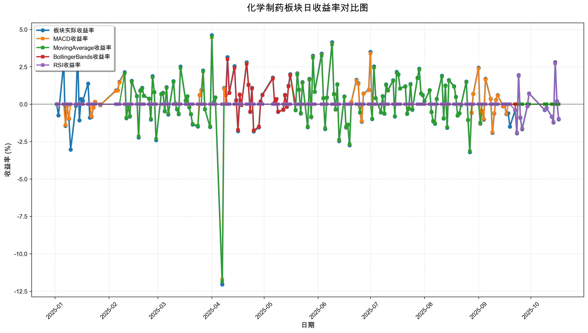
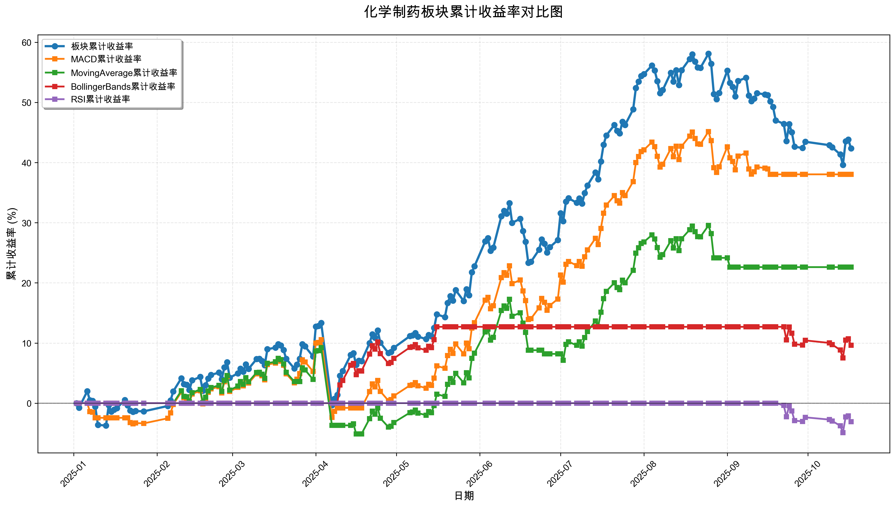

# 策略回测结果报告

**生成时间**: 2025-10-19 19:03:03
**行业板块**: 化学制药
**回测期间**: 20250101 至 20251017
**策略数量**: 4

## 📈 分析结论

### 策略表现分析
- **最佳策略**: MACD (总收益率: 38.05%)
- **最差策略**: RSI (总收益率: -3.09%)
### 交易活跃度分析
- **活跃策略**: 4 个
- **非活跃策略**: 0 个
- **最活跃策略**: MovingAverage (交易次数: 14)
### 🚨 异动提醒分析
- 未检测到明显异动情况
### 风险分析
- **MACD**: 最大回撤 -11.70%, 夏普比率 2.2754
- **MovingAverage**: 最大回撤 -13.13%, 夏普比率 1.3839
- **BollingerBands**: 最大回撤 -4.58%, 夏普比率 1.3783
- **RSI**: 最大回撤 -4.90%, 夏普比率 -0.7509

## 📊 综合结果表

| 策略名称           | 初始资金     | 最终价值     | 总收益率   | 年化收益率   | 波动率    |    夏普比率 | 最大回撤    | 总交易次数   | 买入次数   | 卖出次数   | 总交易金额      | 平均交易金额   | 交易频率   |   数据点数 |
|:---------------|:---------|:---------|:-------|:--------|:-------|--------:|:--------|:--------|:-------|:-------|:-----------|:---------|:-------|-------:|
| 板块实际表现         | ¥100,000 | ¥142,374 | 42.37% | 59.77%  | 26.23% |  2.2784 | -12.05% | N/A     | N/A    | N/A    | N/A        | N/A      | N/A    |    190 |
| MACD           | ¥100,000 | ¥138,052 | 38.05% | 53.37%  | 23.45% |  2.2754 | -11.70% | 6       | 3      | 3      | ¥612,079   | ¥102,013 | 0.03   |    190 |
| MovingAverage  | ¥100,000 | ¥122,622 | 22.62% | 31.06%  | 22.44% |  1.3839 | -13.13% | 14      | 7      | 7      | ¥1,448,882 | ¥103,492 | 0.07   |    190 |
| BollingerBands | ¥100,000 | ¥109,608 | 9.61%  | 12.94%  | 9.39%  |  1.3783 | -4.58%  | 3       | 2      | 1      | ¥315,456   | ¥105,152 | 0.02   |    190 |
| RSI            | ¥100,000 | ¥96,912  | -3.09% | -4.07%  | 5.43%  | -0.7509 | -4.90%  | 1       | 1      | 0      | ¥97,416    | ¥97,416  | 0.01   |    190 |

## 📊 每日收益率走势图

*图1: 化学制药板块每日收益率走势对比*

## 📈 累计收益率走势图

*图2: 化学制药板块累计收益率走势对比*

## 📅 日收益明细表

| 日期         | 板块实际收益率   | MACD收益率   | MovingAverage收益率   | BollingerBands收益率   | RSI收益率   |
|:-----------|:----------|:----------|:-------------------|:--------------------|:---------|
| 2025-01-02 | 0.00%     | 0.00%     | 0.00%              | 0.00%               | 0.00%    |
| 2025-01-03 | -0.75%    | 0.00%     | 0.00%              | 0.00%               | 0.00%    |
| 2025-01-06 | 2.74%     | 0.00%     | 0.00%              | 0.00%               | 0.00%    |
| 2025-01-07 | -1.45%    | -1.40%    | 0.00%              | 0.00%               | 0.00%    |
| 2025-01-08 | -0.11%    | -0.10%    | 0.00%              | 0.00%               | 0.00%    |
| 2025-01-09 | -0.98%    | -0.95%    | 0.00%              | 0.00%               | 0.00%    |
| 2025-01-10 | -3.04%    | 0.00%     | 0.00%              | 0.00%               | 0.00%    |
| 2025-01-13 | -0.10%    | 0.00%     | 0.00%              | 0.00%               | 0.00%    |
| 2025-01-14 | 3.51%     | 0.00%     | 0.00%              | 0.00%               | 0.00%    |
| 2025-01-15 | -1.08%    | 0.00%     | 0.00%              | 0.00%               | 0.00%    |
| 2025-01-16 | 0.35%     | 0.00%     | 0.00%              | 0.00%               | 0.00%    |
| 2025-01-17 | 0.23%     | 0.00%     | 0.00%              | 0.00%               | 0.00%    |
| 2025-01-20 | 1.38%     | 0.00%     | 0.00%              | 0.00%               | 0.00%    |
| 2025-01-21 | -0.90%    | 0.00%     | 0.00%              | 0.00%               | 0.00%    |
| 2025-01-22 | -0.85%    | -0.82%    | 0.00%              | 0.00%               | 0.00%    |
| 2025-01-23 | -0.23%    | -0.22%    | 0.00%              | 0.00%               | 0.00%    |
| 2025-01-24 | 0.15%     | 0.15%     | 0.00%              | 0.00%               | 0.00%    |
| 2025-01-27 | -0.06%    | -0.06%    | 0.00%              | 0.00%               | 0.00%    |
| 2025-02-05 | 0.91%     | 0.88%     | 0.00%              | 0.00%               | 0.00%    |
| 2025-02-06 | 0.93%     | 0.90%     | 0.00%              | 0.00%               | 0.00%    |
| 2025-02-07 | 1.49%     | 1.44%     | 0.00%              | 0.00%               | 0.00%    |
| 2025-02-10 | 2.14%     | 2.07%     | 2.06%              | 0.00%               | 0.00%    |
| 2025-02-11 | -0.94%    | -0.91%    | -0.91%             | 0.00%               | 0.00%    |
| 2025-02-12 | -0.09%    | -0.09%    | -0.09%             | 0.00%               | 0.00%    |
| 2025-02-13 | -0.83%    | -0.81%    | -0.80%             | 0.00%               | 0.00%    |
| 2025-02-14 | 1.56%     | 1.51%     | 1.50%              | 0.00%               | 0.00%    |
| 2025-02-17 | 0.55%     | 0.53%     | 0.53%              | 0.00%               | 0.00%    |
| 2025-02-18 | -2.23%    | -2.15%    | -2.15%             | 0.00%               | 0.00%    |
| 2025-02-19 | 0.92%     | 0.89%     | 0.89%              | 0.00%               | 0.00%    |
| 2025-02-20 | 1.09%     | 1.05%     | 1.05%              | 0.00%               | 0.00%    |
| 2025-02-21 | 0.57%     | 0.55%     | 0.55%              | 0.00%               | 0.00%    |
| 2025-02-24 | 0.37%     | 0.36%     | 0.36%              | 0.00%               | 0.00%    |
| 2025-02-25 | -1.03%    | -1.00%    | -1.00%             | 0.00%               | 0.00%    |
| 2025-02-26 | 1.87%     | 1.81%     | 1.81%              | 0.00%               | 0.00%    |
| 2025-02-27 | 0.81%     | 0.79%     | 0.79%              | 0.00%               | 0.00%    |
| 2025-02-28 | -2.41%    | -2.33%    | -2.33%             | 0.00%               | 0.00%    |
| 2025-03-03 | 0.69%     | 0.67%     | 0.67%              | 0.00%               | 0.00%    |
| 2025-03-04 | 0.76%     | 0.74%     | 0.74%              | 0.00%               | 0.00%    |
| 2025-03-05 | -0.48%    | -0.47%    | -0.46%             | 0.00%               | 0.00%    |
| 2025-03-06 | 1.14%     | 1.11%     | 1.10%              | 0.00%               | 0.00%    |
| 2025-03-07 | -0.69%    | -0.66%    | -0.66%             | 0.00%               | 0.00%    |
| 2025-03-10 | 1.54%     | 1.49%     | 1.49%              | 0.00%               | 0.00%    |
| 2025-03-11 | 0.05%     | 0.04%     | 0.04%              | 0.00%               | 0.00%    |
| 2025-03-12 | -0.35%    | -0.34%    | -0.34%             | 0.00%               | 0.00%    |
| 2025-03-13 | -0.67%    | -0.65%    | -0.65%             | 0.00%               | 0.00%    |
| 2025-03-14 | 2.51%     | 2.43%     | 2.43%              | 0.00%               | 0.00%    |
| 2025-03-17 | 0.25%     | 0.24%     | 0.24%              | 0.00%               | 0.00%    |
| 2025-03-18 | 0.53%     | 0.52%     | 0.52%              | 0.00%               | 0.00%    |
| 2025-03-19 | -0.21%    | -0.20%    | -0.20%             | 0.00%               | 0.00%    |
| 2025-03-20 | -0.68%    | -0.66%    | -0.66%             | 0.00%               | 0.00%    |
| 2025-03-21 | -1.36%    | -1.32%    | -1.32%             | 0.00%               | 0.00%    |
| 2025-03-24 | -1.49%    | -1.44%    | -1.44%             | 0.00%               | 0.00%    |
| 2025-03-25 | 0.61%     | 0.59%     | 0.00%              | 0.00%               | 0.00%    |
| 2025-03-26 | 0.93%     | 0.90%     | 0.00%              | 0.00%               | 0.00%    |
| 2025-03-27 | 2.25%     | 2.18%     | 2.20%              | 0.00%               | 0.00%    |
| 2025-03-28 | -0.35%    | -0.33%    | -0.34%             | 0.00%               | 0.00%    |
| 2025-03-31 | -1.52%    | -1.48%    | -1.49%             | 0.00%               | 0.00%    |
| 2025-04-01 | 4.61%     | 4.47%     | 4.52%              | 0.00%               | 0.00%    |
| 2025-04-02 | 0.10%     | 0.10%     | 0.10%              | 0.00%               | 0.00%    |
| 2025-04-03 | 0.45%     | 0.43%     | 0.44%              | 0.00%               | 0.00%    |
| 2025-04-07 | -12.05%   | -11.70%   | -11.84%            | 0.00%               | 0.00%    |
| 2025-04-08 | 1.08%     | 1.04%     | 0.00%              | 0.00%               | 0.00%    |
| 2025-04-09 | 0.60%     | 0.58%     | 0.00%              | 0.00%               | 0.00%    |
| 2025-04-10 | 3.14%     | 0.00%     | 0.00%              | 3.01%               | 0.00%    |
| 2025-04-11 | 0.77%     | 0.00%     | 0.00%              | 0.74%               | 0.00%    |
| 2025-04-14 | 2.54%     | 0.00%     | 0.00%              | 2.44%               | 0.00%    |
| 2025-04-15 | 0.27%     | 0.00%     | 0.26%              | 0.26%               | 0.00%    |
| 2025-04-16 | -1.80%    | 0.00%     | -1.72%             | -1.73%              | 0.00%    |
| 2025-04-17 | 0.65%     | 0.00%     | 0.00%              | 0.63%               | 0.00%    |
| 2025-04-18 | -0.05%    | 0.00%     | 0.00%              | -0.05%              | 0.00%    |
| 2025-04-21 | 2.80%     | 2.71%     | 2.69%              | 2.69%               | 0.00%    |
| 2025-04-22 | 1.32%     | 1.28%     | 1.27%              | 1.27%               | 0.00%    |
| 2025-04-23 | -0.52%    | -0.50%    | -0.50%             | -0.50%              | 0.00%    |
| 2025-04-24 | 1.09%     | 1.06%     | 1.05%              | 1.05%               | 0.00%    |
| 2025-04-25 | -1.82%    | -1.76%    | -1.75%             | -1.75%              | 0.00%    |
| 2025-04-28 | -1.55%    | -1.51%    | -1.49%             | -1.49%              | 0.00%    |
| 2025-04-29 | 0.18%     | 0.17%     | 0.17%              | 0.17%               | 0.00%    |
| 2025-04-30 | 0.63%     | 0.61%     | 0.60%              | 0.60%               | 0.00%    |
| 2025-05-06 | 1.78%     | 1.73%     | 1.71%              | 1.71%               | 0.00%    |
| 2025-05-07 | 0.10%     | 0.10%     | 0.10%              | 0.10%               | 0.00%    |
| 2025-05-08 | 0.35%     | 0.34%     | 0.33%              | 0.33%               | 0.00%    |
| 2025-05-09 | -0.52%    | -0.50%    | -0.50%             | -0.50%              | 0.00%    |
| 2025-05-12 | -0.38%    | -0.37%    | -0.36%             | -0.36%              | 0.00%    |
| 2025-05-13 | 0.62%     | 0.60%     | 0.60%              | 0.60%               | 0.00%    |
| 2025-05-14 | -0.18%    | -0.18%    | -0.18%             | -0.18%              | 0.00%    |
| 2025-05-15 | 1.24%     | 1.20%     | 1.19%              | 1.19%               | 0.00%    |
| 2025-05-16 | 2.01%     | 1.95%     | 1.93%              | 1.94%               | 0.00%    |
| 2025-05-19 | -0.40%    | -0.39%    | -0.39%             | 0.00%               | 0.00%    |
| 2025-05-20 | 2.06%     | 2.00%     | 1.98%              | 0.00%               | 0.00%    |
| 2025-05-21 | 0.98%     | 0.95%     | 0.95%              | 0.00%               | 0.00%    |
| 2025-05-22 | -0.63%    | -0.61%    | -0.60%             | 0.00%               | 0.00%    |
| 2025-05-23 | 1.48%     | 1.44%     | 1.43%              | 0.00%               | 0.00%    |
| 2025-05-26 | -1.54%    | -1.50%    | -1.49%             | 0.00%               | 0.00%    |
| 2025-05-27 | 1.70%     | 1.65%     | 1.64%              | 0.00%               | 0.00%    |
| 2025-05-28 | -0.87%    | -0.85%    | -0.84%             | 0.00%               | 0.00%    |
| 2025-05-29 | 3.24%     | 3.15%     | 3.12%              | 0.00%               | 0.00%    |
| 2025-05-30 | 0.84%     | 0.81%     | 0.81%              | 0.00%               | 0.00%    |
| 2025-06-03 | 3.38%     | 3.29%     | 3.26%              | 0.00%               | 0.00%    |
| 2025-06-04 | 0.41%     | 0.40%     | 0.40%              | 0.00%               | 0.00%    |
| 2025-06-05 | -1.66%    | -1.62%    | -1.61%             | 0.00%               | 0.00%    |
| 2025-06-06 | 0.45%     | 0.44%     | 0.43%              | 0.00%               | 0.00%    |
| 2025-06-09 | 4.14%     | 4.03%     | 4.00%              | 0.00%               | 0.00%    |
| 2025-06-10 | 0.69%     | 0.67%     | 0.66%              | 0.00%               | 0.00%    |
| 2025-06-11 | -0.36%    | -0.36%    | -0.35%             | 0.00%               | 0.00%    |
| 2025-06-12 | 1.34%     | 1.31%     | 1.30%              | 0.00%               | 0.00%    |
| 2025-06-13 | -2.47%    | -2.41%    | -2.39%             | 0.00%               | 0.00%    |
| 2025-06-16 | 0.52%     | 0.50%     | 0.50%              | 0.00%               | 0.00%    |
| 2025-06-17 | -1.56%    | -1.53%    | -1.51%             | 0.00%               | 0.00%    |
| 2025-06-18 | -1.39%    | -1.36%    | -1.35%             | 0.00%               | 0.00%    |
| 2025-06-19 | -2.75%    | -2.68%    | -2.66%             | 0.00%               | 0.00%    |
| 2025-06-20 | 0.13%     | 0.13%     | 0.00%              | 0.00%               | 0.00%    |
| 2025-06-23 | 1.63%     | 1.58%     | 0.00%              | 0.00%               | 0.00%    |
| 2025-06-24 | 1.39%     | 1.35%     | 0.00%              | 0.00%               | 0.00%    |
| 2025-06-25 | -0.56%    | -0.55%    | -0.56%             | 0.00%               | 0.00%    |
| 2025-06-26 | -1.17%    | -1.14%    | 0.00%              | 0.00%               | 0.00%    |
| 2025-06-27 | 0.71%     | 0.69%     | 0.00%              | 0.00%               | 0.00%    |
| 2025-06-30 | 0.95%     | 0.93%     | 0.00%              | 0.00%               | 0.00%    |
| 2025-07-01 | 3.49%     | 3.40%     | 0.00%              | 0.00%               | 0.00%    |
| 2025-07-02 | -1.00%    | -0.98%    | -0.98%             | 0.00%               | 0.00%    |
| 2025-07-03 | 2.52%     | 2.45%     | 2.46%              | 0.00%               | 0.00%    |
| 2025-07-04 | 0.41%     | 0.40%     | 0.40%              | 0.00%               | 0.00%    |
| 2025-07-07 | -0.55%    | -0.54%    | -0.54%             | 0.00%               | 0.00%    |
| 2025-07-08 | 0.54%     | 0.53%     | 0.53%              | 0.00%               | 0.00%    |
| 2025-07-09 | -0.64%    | -0.63%    | -0.63%             | 0.00%               | 0.00%    |
| 2025-07-10 | 1.32%     | 1.28%     | 1.29%              | 0.00%               | 0.00%    |
| 2025-07-11 | 0.93%     | 0.90%     | 0.91%              | 0.00%               | 0.00%    |
| 2025-07-14 | 1.60%     | 1.56%     | 1.56%              | 0.00%               | 0.00%    |
| 2025-07-15 | -0.83%    | -0.81%    | -0.81%             | 0.00%               | 0.00%    |
| 2025-07-16 | 2.16%     | 2.11%     | 2.11%              | 0.00%               | 0.00%    |
| 2025-07-17 | 2.00%     | 1.95%     | 1.96%              | 0.00%               | 0.00%    |
| 2025-07-18 | 1.06%     | 1.04%     | 1.04%              | 0.00%               | 0.00%    |
| 2025-07-21 | 1.20%     | 1.17%     | 1.18%              | 0.00%               | 0.00%    |
| 2025-07-22 | -0.65%    | -0.64%    | -0.64%             | 0.00%               | 0.00%    |
| 2025-07-23 | -0.30%    | -0.29%    | -0.29%             | 0.00%               | 0.00%    |
| 2025-07-24 | 1.35%     | 1.31%     | 1.32%              | 0.00%               | 0.00%    |
| 2025-07-25 | -0.37%    | -0.36%    | -0.36%             | 0.00%               | 0.00%    |
| 2025-07-28 | 1.77%     | 1.73%     | 1.74%              | 0.00%               | 0.00%    |
| 2025-07-29 | 2.37%     | 2.32%     | 2.33%              | 0.00%               | 0.00%    |
| 2025-07-30 | 0.72%     | 0.70%     | 0.70%              | 0.00%               | 0.00%    |
| 2025-07-31 | 0.60%     | 0.59%     | 0.59%              | 0.00%               | 0.00%    |
| 2025-08-01 | 0.20%     | 0.20%     | 0.20%              | 0.00%               | 0.00%    |
| 2025-08-04 | 0.93%     | 0.91%     | 0.92%              | 0.00%               | 0.00%    |
| 2025-08-05 | -0.53%    | -0.52%    | -0.52%             | 0.00%               | 0.00%    |
| 2025-08-06 | -1.15%    | -1.13%    | -1.13%             | 0.00%               | 0.00%    |
| 2025-08-07 | -1.31%    | -1.28%    | -1.29%             | 0.00%               | 0.00%    |
| 2025-08-08 | 0.35%     | 0.35%     | 0.35%              | 0.00%               | 0.00%    |
| 2025-08-11 | 1.90%     | 1.86%     | 1.86%              | 0.00%               | 0.00%    |
| 2025-08-12 | -0.96%    | -0.94%    | -0.94%             | 0.00%               | 0.00%    |
| 2025-08-13 | 1.25%     | 1.22%     | 1.22%              | 0.00%               | 0.00%    |
| 2025-08-14 | -1.58%    | -1.54%    | -1.55%             | 0.00%               | 0.00%    |
| 2025-08-15 | 1.61%     | 1.57%     | 1.58%              | 0.00%               | 0.00%    |
| 2025-08-18 | 1.20%     | 1.17%     | 1.18%              | 0.00%               | 0.00%    |
| 2025-08-19 | 0.49%     | 0.48%     | 0.48%              | 0.00%               | 0.00%    |
| 2025-08-20 | -0.76%    | -0.75%    | -0.75%             | 0.00%               | 0.00%    |
| 2025-08-21 | -0.62%    | -0.61%    | -0.61%             | 0.00%               | 0.00%    |
| 2025-08-22 | -0.05%    | -0.05%    | -0.05%             | 0.00%               | 0.00%    |
| 2025-08-25 | 1.51%     | 1.48%     | 1.48%              | 0.00%               | 0.00%    |
| 2025-08-26 | -1.06%    | -1.04%    | -1.04%             | 0.00%               | 0.00%    |
| 2025-08-27 | -3.21%    | -3.14%    | -3.15%             | 0.00%               | 0.00%    |
| 2025-08-28 | -0.58%    | -0.56%    | 0.00%              | 0.00%               | 0.00%    |
| 2025-08-29 | 0.69%     | 0.68%     | 0.00%              | 0.00%               | 0.00%    |
| 2025-09-01 | 2.44%     | 2.39%     | 0.00%              | 0.00%               | 0.00%    |
| 2025-09-02 | -1.31%    | -1.28%    | -1.24%             | 0.00%               | 0.00%    |
| 2025-09-03 | -0.44%    | -0.43%    | 0.00%              | 0.00%               | 0.00%    |
| 2025-09-04 | -1.03%    | -1.00%    | 0.00%              | 0.00%               | 0.00%    |
| 2025-09-05 | 1.70%     | 1.66%     | 0.00%              | 0.00%               | 0.00%    |
| 2025-09-08 | 0.35%     | 0.35%     | 0.00%              | 0.00%               | 0.00%    |
| 2025-09-09 | -1.92%    | -1.88%    | 0.00%              | 0.00%               | 0.00%    |
| 2025-09-10 | -0.63%    | -0.61%    | 0.00%              | 0.00%               | 0.00%    |
| 2025-09-11 | 0.29%     | 0.28%     | 0.00%              | 0.00%               | 0.00%    |
| 2025-09-12 | 0.60%     | 0.58%     | 0.00%              | 0.00%               | 0.00%    |
| 2025-09-15 | -0.14%    | -0.14%    | 0.00%              | 0.00%               | 0.00%    |
| 2025-09-16 | -0.09%    | -0.09%    | 0.00%              | 0.00%               | 0.00%    |
| 2025-09-17 | -0.67%    | -0.66%    | 0.00%              | 0.00%               | 0.00%    |
| 2025-09-18 | -0.61%    | 0.00%     | 0.00%              | 0.00%               | 0.00%    |
| 2025-09-19 | -1.50%    | 0.00%     | 0.00%              | 0.00%               | 0.00%    |
| 2025-09-22 | -0.40%    | 0.00%     | 0.00%              | 0.00%               | -0.39%   |
| 2025-09-23 | -1.95%    | 0.00%     | 0.00%              | -1.92%              | -1.90%   |
| 2025-09-24 | 1.94%     | 0.00%     | 0.00%              | 1.91%               | 1.89%    |
| 2025-09-25 | -0.91%    | 0.00%     | 0.00%              | -0.89%              | -0.88%   |
| 2025-09-26 | -1.67%    | 0.00%     | 0.00%              | -1.64%              | -1.63%   |
| 2025-09-29 | -0.14%    | 0.00%     | 0.00%              | -0.14%              | -0.13%   |
| 2025-09-30 | 0.72%     | 0.00%     | 0.00%              | 0.71%               | 0.70%    |
| 2025-10-09 | -0.39%    | 0.00%     | 0.00%              | -0.38%              | -0.38%   |
| 2025-10-10 | -0.24%    | 0.00%     | 0.00%              | -0.24%              | -0.24%   |
| 2025-10-13 | -0.84%    | 0.00%     | 0.00%              | -0.83%              | -0.82%   |
| 2025-10-14 | -1.22%    | 0.00%     | 0.00%              | -1.20%              | -1.19%   |
| 2025-10-15 | 2.81%     | 0.00%     | 0.00%              | 2.76%               | 2.73%    |
| 2025-10-16 | 0.19%     | 0.00%     | 0.00%              | 0.19%               | 0.19%    |
| 2025-10-17 | -1.01%    | 0.00%     | 0.00%              | -0.99%              | -0.98%   |

## 📊 日收益统计摘要

| 指标                | 平均日收益率   | 最大日收益率   | 最小日收益率   | 正收益天数   | 负收益天数   |
|:------------------|:---------|:---------|:---------|:--------|:--------|
| 板块实际收益率           | 0.20%    | 4.61%    | -12.05%  | 103天    | 86天     |
| MACD收益率           | 0.18%    | 4.47%    | -11.70%  | 89天     | 67天     |
| MovingAverage收益率  | 0.12%    | 4.52%    | -11.84%  | 70天     | 53天     |
| BollingerBands收益率 | 0.05%    | 3.01%    | -1.92%   | 20天     | 17天     |
| RSI收益率            | -0.02%   | 2.73%    | -1.90%   | 4天      | 10天     |

## 📈 累计收益明细表

| 日期         | 板块累计收益率   | MACD累计收益率   | MovingAverage累计收益率   | BollingerBands累计收益率   | RSI累计收益率   |
|:-----------|:----------|:------------|:---------------------|:----------------------|:-----------|
| 2025-01-02 | 0.00%     | 0.00%       | 0.00%                | 0.00%                 | 0.00%      |
| 2025-01-03 | -0.75%    | 0.00%       | 0.00%                | 0.00%                 | 0.00%      |
| 2025-01-06 | 1.97%     | 0.00%       | 0.00%                | 0.00%                 | 0.00%      |
| 2025-01-07 | 0.49%     | -1.40%      | 0.00%                | 0.00%                 | 0.00%      |
| 2025-01-08 | 0.39%     | -1.50%      | 0.00%                | 0.00%                 | 0.00%      |
| 2025-01-09 | -0.60%    | -2.44%      | 0.00%                | 0.00%                 | 0.00%      |
| 2025-01-10 | -3.63%    | -2.44%      | 0.00%                | 0.00%                 | 0.00%      |
| 2025-01-13 | -3.72%    | -2.44%      | 0.00%                | 0.00%                 | 0.00%      |
| 2025-01-14 | -0.34%    | -2.44%      | 0.00%                | 0.00%                 | 0.00%      |
| 2025-01-15 | -1.41%    | -2.44%      | 0.00%                | 0.00%                 | 0.00%      |
| 2025-01-16 | -1.07%    | -2.44%      | 0.00%                | 0.00%                 | 0.00%      |
| 2025-01-17 | -0.84%    | -2.44%      | 0.00%                | 0.00%                 | 0.00%      |
| 2025-01-20 | 0.53%     | -2.44%      | 0.00%                | 0.00%                 | 0.00%      |
| 2025-01-21 | -0.38%    | -2.44%      | 0.00%                | 0.00%                 | 0.00%      |
| 2025-01-22 | -1.23%    | -3.23%      | 0.00%                | 0.00%                 | 0.00%      |
| 2025-01-23 | -1.46%    | -3.45%      | 0.00%                | 0.00%                 | 0.00%      |
| 2025-01-24 | -1.31%    | -3.31%      | 0.00%                | 0.00%                 | 0.00%      |
| 2025-01-27 | -1.37%    | -3.37%      | 0.00%                | 0.00%                 | 0.00%      |
| 2025-02-05 | -0.47%    | -2.52%      | 0.00%                | 0.00%                 | 0.00%      |
| 2025-02-06 | 0.46%     | -1.64%      | 0.00%                | 0.00%                 | 0.00%      |
| 2025-02-07 | 1.96%     | -0.22%      | 0.00%                | 0.00%                 | 0.00%      |
| 2025-02-10 | 4.14%     | 1.84%       | 2.06%                | 0.00%                 | 0.00%      |
| 2025-02-11 | 3.16%     | 0.91%       | 1.14%                | 0.00%                 | 0.00%      |
| 2025-02-12 | 3.06%     | 0.82%       | 1.05%                | 0.00%                 | 0.00%      |
| 2025-02-13 | 2.20%     | 0.01%       | 0.23%                | 0.00%                 | 0.00%      |
| 2025-02-14 | 3.79%     | 1.52%       | 1.74%                | 0.00%                 | 0.00%      |
| 2025-02-17 | 4.36%     | 2.06%       | 2.28%                | 0.00%                 | 0.00%      |
| 2025-02-18 | 2.04%     | -0.14%      | 0.08%                | 0.00%                 | 0.00%      |
| 2025-02-19 | 2.98%     | 0.75%       | 0.97%                | 0.00%                 | 0.00%      |
| 2025-02-20 | 4.10%     | 1.80%       | 2.03%                | 0.00%                 | 0.00%      |
| 2025-02-21 | 4.69%     | 2.36%       | 2.58%                | 0.00%                 | 0.00%      |
| 2025-02-24 | 5.08%     | 2.73%       | 2.95%                | 0.00%                 | 0.00%      |
| 2025-02-25 | 3.99%     | 1.70%       | 1.93%                | 0.00%                 | 0.00%      |
| 2025-02-26 | 5.93%     | 3.54%       | 3.77%                | 0.00%                 | 0.00%      |
| 2025-02-27 | 6.80%     | 4.36%       | 4.58%                | 0.00%                 | 0.00%      |
| 2025-02-28 | 4.23%     | 1.93%       | 2.15%                | 0.00%                 | 0.00%      |
| 2025-03-03 | 4.95%     | 2.61%       | 2.83%                | 0.00%                 | 0.00%      |
| 2025-03-04 | 5.75%     | 3.37%       | 3.59%                | 0.00%                 | 0.00%      |
| 2025-03-05 | 5.24%     | 2.89%       | 3.11%                | 0.00%                 | 0.00%      |
| 2025-03-06 | 6.44%     | 4.03%       | 4.25%                | 0.00%                 | 0.00%      |
| 2025-03-07 | 5.71%     | 3.33%       | 3.56%                | 0.00%                 | 0.00%      |
| 2025-03-10 | 7.34%     | 4.87%       | 5.10%                | 0.00%                 | 0.00%      |
| 2025-03-11 | 7.39%     | 4.92%       | 5.14%                | 0.00%                 | 0.00%      |
| 2025-03-12 | 7.01%     | 4.56%       | 4.79%                | 0.00%                 | 0.00%      |
| 2025-03-13 | 6.30%     | 3.89%       | 4.11%                | 0.00%                 | 0.00%      |
| 2025-03-14 | 8.97%     | 6.41%       | 6.64%                | 0.00%                 | 0.00%      |
| 2025-03-17 | 9.23%     | 6.67%       | 6.89%                | 0.00%                 | 0.00%      |
| 2025-03-18 | 9.82%     | 7.22%       | 7.44%                | 0.00%                 | 0.00%      |
| 2025-03-19 | 9.59%     | 7.00%       | 7.22%                | 0.00%                 | 0.00%      |
| 2025-03-20 | 8.84%     | 6.29%       | 6.51%                | 0.00%                 | 0.00%      |
| 2025-03-21 | 7.36%     | 4.89%       | 5.11%                | 0.00%                 | 0.00%      |
| 2025-03-24 | 5.76%     | 3.37%       | 3.60%                | 0.00%                 | 0.00%      |
| 2025-03-25 | 6.40%     | 3.99%       | 3.60%                | 0.00%                 | 0.00%      |
| 2025-03-26 | 7.39%     | 4.92%       | 3.60%                | 0.00%                 | 0.00%      |
| 2025-03-27 | 9.81%     | 7.21%       | 5.88%                | 0.00%                 | 0.00%      |
| 2025-03-28 | 9.43%     | 6.85%       | 5.52%                | 0.00%                 | 0.00%      |
| 2025-03-31 | 7.76%     | 5.27%       | 3.94%                | 0.00%                 | 0.00%      |
| 2025-04-01 | 12.73%    | 9.97%       | 8.65%                | 0.00%                 | 0.00%      |
| 2025-04-02 | 12.84%    | 10.08%      | 8.75%                | 0.00%                 | 0.00%      |
| 2025-04-03 | 13.34%    | 10.55%      | 9.23%                | 0.00%                 | 0.00%      |
| 2025-04-07 | -0.32%    | -2.38%      | -3.70%               | 0.00%                 | 0.00%      |
| 2025-04-08 | 0.75%     | -1.36%      | -3.70%               | 0.00%                 | 0.00%      |
| 2025-04-09 | 1.36%     | -0.79%      | -3.70%               | 0.00%                 | 0.00%      |
| 2025-04-10 | 4.54%     | -0.79%      | -3.70%               | 3.01%                 | 0.00%      |
| 2025-04-11 | 5.35%     | -0.79%      | -3.70%               | 3.77%                 | 0.00%      |
| 2025-04-14 | 8.02%     | -0.79%      | -3.70%               | 6.30%                 | 0.00%      |
| 2025-04-15 | 8.31%     | -0.79%      | -3.45%               | 6.58%                 | 0.00%      |
| 2025-04-16 | 6.36%     | -0.79%      | -5.12%               | 4.73%                 | 0.00%      |
| 2025-04-17 | 7.05%     | -0.79%      | -5.12%               | 5.39%                 | 0.00%      |
| 2025-04-18 | 7.00%     | -0.79%      | -5.12%               | 5.34%                 | 0.00%      |
| 2025-04-21 | 9.99%     | 1.90%       | -2.57%               | 8.17%                 | 0.00%      |
| 2025-04-22 | 11.45%    | 3.21%       | -1.33%               | 9.55%                 | 0.00%      |
| 2025-04-23 | 10.87%    | 2.69%       | -1.82%               | 9.00%                 | 0.00%      |
| 2025-04-24 | 12.08%    | 3.78%       | -0.79%               | 10.15%                | 0.00%      |
| 2025-04-25 | 10.04%    | 1.95%       | -2.52%               | 8.22%                 | 0.00%      |
| 2025-04-28 | 8.33%     | 0.41%       | -3.98%               | 6.60%                 | 0.00%      |
| 2025-04-29 | 8.53%     | 0.59%       | -3.82%               | 6.78%                 | 0.00%      |
| 2025-04-30 | 9.21%     | 1.20%       | -3.23%               | 7.43%                 | 0.00%      |
| 2025-05-06 | 11.15%    | 2.95%       | -1.58%               | 9.27%                 | 0.00%      |
| 2025-05-07 | 11.27%    | 3.05%       | -1.48%               | 9.38%                 | 0.00%      |
| 2025-05-08 | 11.65%    | 3.40%       | -1.15%               | 9.74%                 | 0.00%      |
| 2025-05-09 | 11.07%    | 2.87%       | -1.65%               | 9.19%                 | 0.00%      |
| 2025-05-12 | 10.65%    | 2.50%       | -2.01%               | 8.79%                 | 0.00%      |
| 2025-05-13 | 11.34%    | 3.11%       | -1.42%               | 9.44%                 | 0.00%      |
| 2025-05-14 | 11.14%    | 2.93%       | -1.59%               | 9.25%                 | 0.00%      |
| 2025-05-15 | 12.51%    | 4.17%       | -0.42%               | 10.55%                | 0.00%      |
| 2025-05-16 | 14.77%    | 6.20%       | 1.50%                | 12.69%                | 0.00%      |
| 2025-05-19 | 14.31%    | 5.79%       | 1.11%                | 12.69%                | 0.00%      |
| 2025-05-20 | 16.66%    | 7.90%       | 3.12%                | 12.69%                | 0.00%      |
| 2025-05-21 | 17.81%    | 8.93%       | 4.09%                | 12.69%                | 0.00%      |
| 2025-05-22 | 17.07%    | 8.27%       | 3.46%                | 12.69%                | 0.00%      |
| 2025-05-23 | 18.80%    | 9.83%       | 4.94%                | 12.69%                | 0.00%      |
| 2025-05-26 | 16.97%    | 8.18%       | 3.38%                | 12.69%                | 0.00%      |
| 2025-05-27 | 18.96%    | 9.97%       | 5.07%                | 12.69%                | 0.00%      |
| 2025-05-28 | 17.93%    | 9.04%       | 4.19%                | 12.69%                | 0.00%      |
| 2025-05-29 | 21.75%    | 12.47%      | 7.45%                | 12.69%                | 0.00%      |
| 2025-05-30 | 22.77%    | 13.39%      | 8.31%                | 12.69%                | 0.00%      |
| 2025-06-03 | 26.91%    | 17.12%      | 11.84%               | 12.69%                | 0.00%      |
| 2025-06-04 | 27.43%    | 17.59%      | 12.29%               | 12.69%                | 0.00%      |
| 2025-06-05 | 25.32%    | 15.68%      | 10.49%               | 12.69%                | 0.00%      |
| 2025-06-06 | 25.88%    | 16.19%      | 10.96%               | 12.69%                | 0.00%      |
| 2025-06-09 | 31.09%    | 20.87%      | 15.40%               | 12.69%                | 0.00%      |
| 2025-06-10 | 31.99%    | 21.68%      | 16.17%               | 12.69%                | 0.00%      |
| 2025-06-11 | 31.51%    | 21.25%      | 15.76%               | 12.69%                | 0.00%      |
| 2025-06-12 | 33.27%    | 22.83%      | 17.26%               | 12.69%                | 0.00%      |
| 2025-06-13 | 29.98%    | 19.88%      | 14.46%               | 12.69%                | 0.00%      |
| 2025-06-16 | 30.66%    | 20.48%      | 15.03%               | 12.69%                | 0.00%      |
| 2025-06-17 | 28.61%    | 18.65%      | 13.29%               | 12.69%                | 0.00%      |
| 2025-06-18 | 26.82%    | 17.04%      | 11.77%               | 12.69%                | 0.00%      |
| 2025-06-19 | 23.34%    | 13.90%      | 8.80%                | 12.69%                | 0.00%      |
| 2025-06-20 | 23.50%    | 14.05%      | 8.80%                | 12.69%                | 0.00%      |
| 2025-06-23 | 25.51%    | 15.85%      | 8.80%                | 12.69%                | 0.00%      |
| 2025-06-24 | 27.24%    | 17.42%      | 8.80%                | 12.69%                | 0.00%      |
| 2025-06-25 | 26.53%    | 16.77%      | 8.19%                | 12.69%                | 0.00%      |
| 2025-06-26 | 25.04%    | 15.44%      | 8.19%                | 12.69%                | 0.00%      |
| 2025-06-27 | 25.93%    | 16.24%      | 8.19%                | 12.69%                | 0.00%      |
| 2025-06-30 | 27.13%    | 17.32%      | 8.19%                | 12.69%                | 0.00%      |
| 2025-07-01 | 31.57%    | 21.30%      | 8.19%                | 12.69%                | 0.00%      |
| 2025-07-02 | 30.25%    | 20.12%      | 7.13%                | 12.69%                | 0.00%      |
| 2025-07-03 | 33.53%    | 23.07%      | 9.76%                | 12.69%                | 0.00%      |
| 2025-07-04 | 34.07%    | 23.56%      | 10.20%               | 12.69%                | 0.00%      |
| 2025-07-07 | 33.33%    | 22.89%      | 9.61%                | 12.69%                | 0.00%      |
| 2025-07-08 | 34.06%    | 23.54%      | 10.19%               | 12.69%                | 0.00%      |
| 2025-07-09 | 33.19%    | 22.77%      | 9.50%                | 12.69%                | 0.00%      |
| 2025-07-10 | 34.95%    | 24.34%      | 10.91%               | 12.69%                | 0.00%      |
| 2025-07-11 | 36.20%    | 25.47%      | 11.91%               | 12.69%                | 0.00%      |
| 2025-07-14 | 38.37%    | 27.42%      | 13.66%               | 12.69%                | 0.00%      |
| 2025-07-15 | 37.23%    | 26.39%      | 12.74%               | 12.69%                | 0.00%      |
| 2025-07-16 | 40.19%    | 29.06%      | 15.13%               | 12.69%                | 0.00%      |
| 2025-07-17 | 42.99%    | 31.58%      | 17.38%               | 12.69%                | 0.00%      |
| 2025-07-18 | 44.51%    | 32.94%      | 18.60%               | 12.69%                | 0.00%      |
| 2025-07-21 | 46.25%    | 34.50%      | 20.00%               | 12.69%                | 0.00%      |
| 2025-07-22 | 45.29%    | 33.64%      | 19.23%               | 12.69%                | 0.00%      |
| 2025-07-23 | 44.86%    | 33.25%      | 18.88%               | 12.69%                | 0.00%      |
| 2025-07-24 | 46.80%    | 35.00%      | 20.45%               | 12.69%                | 0.00%      |
| 2025-07-25 | 46.27%    | 34.52%      | 20.01%               | 12.69%                | 0.00%      |
| 2025-07-28 | 48.86%    | 36.85%      | 22.10%               | 12.69%                | 0.00%      |
| 2025-07-29 | 52.39%    | 40.03%      | 24.94%               | 12.69%                | 0.00%      |
| 2025-07-30 | 53.49%    | 41.01%      | 25.82%               | 12.69%                | 0.00%      |
| 2025-07-31 | 54.41%    | 41.84%      | 26.56%               | 12.69%                | 0.00%      |
| 2025-08-01 | 54.72%    | 42.12%      | 26.81%               | 12.69%                | 0.00%      |
| 2025-08-04 | 56.16%    | 43.42%      | 27.97%               | 12.69%                | 0.00%      |
| 2025-08-05 | 55.33%    | 42.67%      | 27.31%               | 12.69%                | 0.00%      |
| 2025-08-06 | 53.54%    | 41.06%      | 25.87%               | 12.69%                | 0.00%      |
| 2025-08-07 | 51.53%    | 39.25%      | 24.25%               | 12.69%                | 0.00%      |
| 2025-08-08 | 52.07%    | 39.73%      | 24.68%               | 12.69%                | 0.00%      |
| 2025-08-11 | 54.95%    | 42.33%      | 27.00%               | 12.69%                | 0.00%      |
| 2025-08-12 | 53.46%    | 40.99%      | 25.80%               | 12.69%                | 0.00%      |
| 2025-08-13 | 55.37%    | 42.71%      | 27.34%               | 12.69%                | 0.00%      |
| 2025-08-14 | 52.92%    | 40.51%      | 25.37%               | 12.69%                | 0.00%      |
| 2025-08-15 | 55.38%    | 42.71%      | 27.34%               | 12.69%                | 0.00%      |
| 2025-08-18 | 57.24%    | 44.39%      | 28.84%               | 12.69%                | 0.00%      |
| 2025-08-19 | 58.01%    | 45.08%      | 29.46%               | 12.69%                | 0.00%      |
| 2025-08-20 | 56.81%    | 44.00%      | 28.50%               | 12.69%                | 0.00%      |
| 2025-08-21 | 55.83%    | 43.12%      | 27.71%               | 12.69%                | 0.00%      |
| 2025-08-22 | 55.76%    | 43.06%      | 27.65%               | 12.69%                | 0.00%      |
| 2025-08-25 | 58.11%    | 45.17%      | 29.54%               | 12.69%                | 0.00%      |
| 2025-08-26 | 56.43%    | 43.66%      | 28.19%               | 12.69%                | 0.00%      |
| 2025-08-27 | 51.42%    | 39.15%      | 24.16%               | 12.69%                | 0.00%      |
| 2025-08-28 | 50.55%    | 38.37%      | 24.16%               | 12.69%                | 0.00%      |
| 2025-08-29 | 51.59%    | 39.31%      | 24.16%               | 12.69%                | 0.00%      |
| 2025-09-01 | 55.29%    | 42.63%      | 24.16%               | 12.69%                | 0.00%      |
| 2025-09-02 | 53.26%    | 40.81%      | 22.62%               | 12.69%                | 0.00%      |
| 2025-09-03 | 52.58%    | 40.20%      | 22.62%               | 12.69%                | 0.00%      |
| 2025-09-04 | 51.02%    | 38.79%      | 22.62%               | 12.69%                | 0.00%      |
| 2025-09-05 | 53.58%    | 41.10%      | 22.62%               | 12.69%                | 0.00%      |
| 2025-09-08 | 54.13%    | 41.59%      | 22.62%               | 12.69%                | 0.00%      |
| 2025-09-09 | 51.17%    | 38.93%      | 22.62%               | 12.69%                | 0.00%      |
| 2025-09-10 | 50.22%    | 38.08%      | 22.62%               | 12.69%                | 0.00%      |
| 2025-09-11 | 50.66%    | 38.47%      | 22.62%               | 12.69%                | 0.00%      |
| 2025-09-12 | 51.56%    | 39.28%      | 22.62%               | 12.69%                | 0.00%      |
| 2025-09-15 | 51.34%    | 39.08%      | 22.62%               | 12.69%                | 0.00%      |
| 2025-09-16 | 51.21%    | 38.96%      | 22.62%               | 12.69%                | 0.00%      |
| 2025-09-17 | 50.19%    | 38.05%      | 22.62%               | 12.69%                | 0.00%      |
| 2025-09-18 | 49.27%    | 38.05%      | 22.62%               | 12.69%                | 0.00%      |
| 2025-09-19 | 47.03%    | 38.05%      | 22.62%               | 12.69%                | 0.00%      |
| 2025-09-22 | 46.45%    | 38.05%      | 22.62%               | 12.69%                | -0.39%     |
| 2025-09-23 | 43.60%    | 38.05%      | 22.62%               | 10.53%                | -2.28%     |
| 2025-09-24 | 46.39%    | 38.05%      | 22.62%               | 12.65%                | -0.43%     |
| 2025-09-25 | 45.06%    | 38.05%      | 22.62%               | 11.64%                | -1.31%     |
| 2025-09-26 | 42.64%    | 38.05%      | 22.62%               | 9.81%                 | -2.91%     |
| 2025-09-29 | 42.44%    | 38.05%      | 22.62%               | 9.66%                 | -3.04%     |
| 2025-09-30 | 43.47%    | 38.05%      | 22.62%               | 10.43%                | -2.36%     |
| 2025-10-09 | 42.90%    | 38.05%      | 22.62%               | 10.01%                | -2.74%     |
| 2025-10-10 | 42.55%    | 38.05%      | 22.62%               | 9.74%                 | -2.97%     |
| 2025-10-13 | 41.36%    | 38.05%      | 22.62%               | 8.84%                 | -3.76%     |
| 2025-10-14 | 39.63%    | 38.05%      | 22.62%               | 7.53%                 | -4.90%     |
| 2025-10-15 | 43.55%    | 38.05%      | 22.62%               | 10.50%                | -2.31%     |
| 2025-10-16 | 43.83%    | 38.05%      | 22.62%               | 10.71%                | -2.12%     |
| 2025-10-17 | 42.37%    | 38.05%      | 22.62%               | 9.61%                 | -3.09%     |

## 📊 累计收益统计摘要

| 指标                  | 最终累计收益率   | 最大累计收益率   | 最小累计收益率   | 累计收益波动   | 收益稳定性   |
|:--------------------|:----------|:----------|:----------|:---------|:--------|
| 板块累计收益率             | 42.37%    | 58.11%    | -3.72%    | 61.83%   | 波动      |
| MACD累计收益率           | 38.05%    | 45.17%    | -3.45%    | 48.62%   | 波动      |
| MovingAverage累计收益率  | 22.62%    | 29.54%    | -5.12%    | 34.66%   | 波动      |
| BollingerBands累计收益率 | 9.61%     | 12.69%    | 0.00%     | 12.69%   | 稳定      |
| RSI累计收益率            | -3.09%    | 0.00%     | -4.90%    | 4.90%    | 稳定      |

