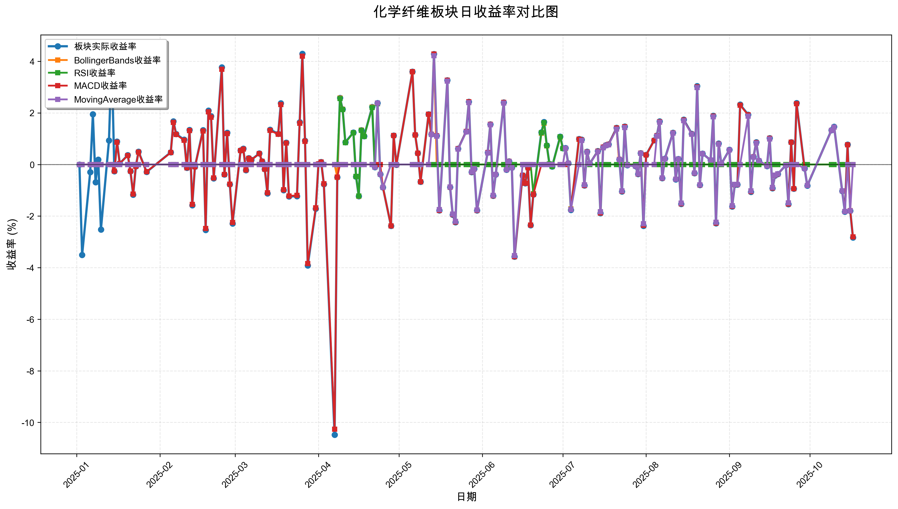
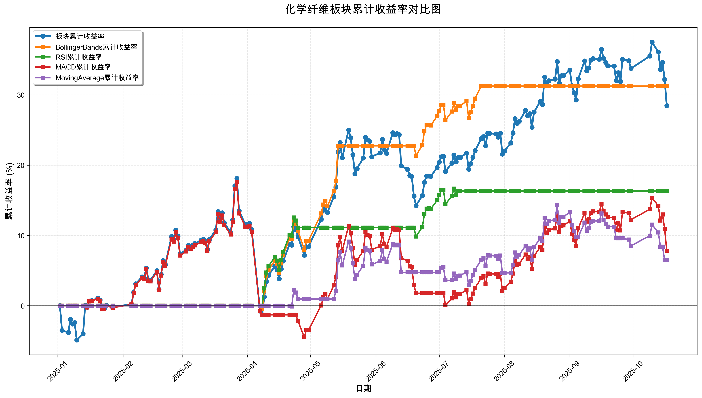

# 策略回测结果报告

**生成时间**: 2025-10-19 19:06:31
**行业板块**: 化学纤维
**回测期间**: 20250101 至 20251017
**策略数量**: 4

## 📈 分析结论

### 策略表现分析
- **最佳策略**: BollingerBands (总收益率: 31.26%)
- **最差策略**: MovingAverage (总收益率: 6.47%)
### 交易活跃度分析
- **活跃策略**: 4 个
- **非活跃策略**: 0 个
- **最活跃策略**: MovingAverage (交易次数: 16)
### 🚨 异动提醒分析
- 未检测到明显异动情况
### 风险分析
- **BollingerBands**: 最大回撤 -3.62%, 夏普比率 3.9222
- **RSI**: 最大回撤 -2.40%, 夏普比率 2.9642
- **MACD**: 最大回撤 -18.83%, 夏普比率 0.4424
- **MovingAverage**: 最大回撤 -6.88%, 夏普比率 0.5901

## 📊 综合结果表

| 策略名称           | 初始资金     | 最终价值     | 总收益率   | 年化收益率   | 波动率    |   夏普比率 | 最大回撤    | 总交易次数   | 买入次数   | 卖出次数   | 总交易金额      | 平均交易金额   | 交易频率   |   数据点数 |
|:---------------|:---------|:---------|:-------|:--------|:-------|-------:|:--------|:--------|:-------|:-------|:-----------|:---------|:-------|-------:|
| 板块实际表现         | ¥100,000 | ¥128,471 | 28.47% | 39.41%  | 26.09% | 1.5107 | -16.42% | N/A     | N/A    | N/A    | N/A        | N/A      | N/A    |    190 |
| BollingerBands | ¥100,000 | ¥131,259 | 31.26% | 43.44%  | 11.08% | 3.9222 | -3.62%  | 5       | 3      | 2      | ¥598,949   | ¥119,790 | 0.03   |    190 |
| RSI            | ¥100,000 | ¥116,316 | 16.32% | 22.20%  | 7.49%  | 2.9642 | -2.40%  | 4       | 2      | 2      | ¥433,943   | ¥108,486 | 0.02   |    190 |
| MACD           | ¥100,000 | ¥107,844 | 7.84%  | 10.53%  | 23.82% | 0.4424 | -18.83% | 5       | 3      | 2      | ¥495,439   | ¥99,088  | 0.03   |    190 |
| MovingAverage  | ¥100,000 | ¥106,466 | 6.47%  | 8.67%   | 14.68% | 0.5901 | -6.88%  | 16      | 8      | 8      | ¥1,665,074 | ¥104,067 | 0.08   |    190 |

## 📊 每日收益率走势图

*图1: 化学纤维板块每日收益率走势对比*

## 📈 累计收益率走势图

*图2: 化学纤维板块累计收益率走势对比*

## 📅 日收益明细表

| 日期         | 板块实际收益率   | BollingerBands收益率   | RSI收益率   | MACD收益率   | MovingAverage收益率   |
|:-----------|:----------|:--------------------|:---------|:----------|:-------------------|
| 2025-01-02 | 0.00%     | 0.00%               | 0.00%    | 0.00%     | 0.00%              |
| 2025-01-03 | -3.51%    | 0.00%               | 0.00%    | 0.00%     | 0.00%              |
| 2025-01-06 | -0.30%    | 0.00%               | 0.00%    | 0.00%     | 0.00%              |
| 2025-01-07 | 1.95%     | 0.00%               | 0.00%    | 0.00%     | 0.00%              |
| 2025-01-08 | -0.69%    | 0.00%               | 0.00%    | 0.00%     | 0.00%              |
| 2025-01-09 | 0.19%     | 0.00%               | 0.00%    | 0.00%     | 0.00%              |
| 2025-01-10 | -2.52%    | 0.00%               | 0.00%    | 0.00%     | 0.00%              |
| 2025-01-13 | 0.93%     | 0.00%               | 0.00%    | 0.00%     | 0.00%              |
| 2025-01-14 | 4.21%     | 0.00%               | 0.00%    | 0.00%     | 0.00%              |
| 2025-01-15 | -0.26%    | 0.00%               | 0.00%    | -0.25%    | 0.00%              |
| 2025-01-16 | 0.89%     | 0.00%               | 0.00%    | 0.86%     | 0.00%              |
| 2025-01-17 | 0.04%     | 0.00%               | 0.00%    | 0.04%     | 0.00%              |
| 2025-01-20 | 0.36%     | 0.00%               | 0.00%    | 0.35%     | 0.00%              |
| 2025-01-21 | -0.26%    | 0.00%               | 0.00%    | -0.25%    | 0.00%              |
| 2025-01-22 | -1.17%    | 0.00%               | 0.00%    | -1.15%    | 0.00%              |
| 2025-01-23 | -0.07%    | 0.00%               | 0.00%    | -0.07%    | 0.00%              |
| 2025-01-24 | 0.50%     | 0.00%               | 0.00%    | 0.48%     | 0.00%              |
| 2025-01-27 | -0.29%    | 0.00%               | 0.00%    | -0.28%    | 0.00%              |
| 2025-02-05 | 0.47%     | 0.00%               | 0.00%    | 0.46%     | 0.00%              |
| 2025-02-06 | 1.67%     | 0.00%               | 0.00%    | 1.63%     | 0.00%              |
| 2025-02-07 | 1.18%     | 0.00%               | 0.00%    | 1.16%     | 0.00%              |
| 2025-02-10 | 0.96%     | 0.00%               | 0.00%    | 0.94%     | 0.00%              |
| 2025-02-11 | -0.13%    | 0.00%               | 0.00%    | -0.13%    | 0.00%              |
| 2025-02-12 | 1.34%     | 0.00%               | 0.00%    | 1.31%     | 0.00%              |
| 2025-02-13 | -1.58%    | 0.00%               | 0.00%    | -1.55%    | 0.00%              |
| 2025-02-14 | -0.09%    | 0.00%               | 0.00%    | -0.09%    | 0.00%              |
| 2025-02-17 | 1.33%     | 0.00%               | 0.00%    | 1.30%     | 0.00%              |
| 2025-02-18 | -2.54%    | 0.00%               | 0.00%    | -2.48%    | 0.00%              |
| 2025-02-19 | 2.09%     | 0.00%               | 0.00%    | 2.04%     | 0.00%              |
| 2025-02-20 | 1.87%     | 0.00%               | 0.00%    | 1.83%     | 0.00%              |
| 2025-02-21 | -0.54%    | 0.00%               | 0.00%    | -0.52%    | 0.00%              |
| 2025-02-24 | 3.77%     | 0.00%               | 0.00%    | 3.69%     | 0.00%              |
| 2025-02-25 | -0.39%    | 0.00%               | 0.00%    | -0.39%    | 0.00%              |
| 2025-02-26 | 1.23%     | 0.00%               | 0.00%    | 1.20%     | 0.00%              |
| 2025-02-27 | -0.77%    | 0.00%               | 0.00%    | -0.76%    | 0.00%              |
| 2025-02-28 | -2.29%    | 0.00%               | 0.00%    | -2.25%    | 0.00%              |
| 2025-03-03 | 0.55%     | 0.00%               | 0.00%    | 0.54%     | 0.00%              |
| 2025-03-04 | 0.61%     | 0.00%               | 0.00%    | 0.60%     | 0.00%              |
| 2025-03-05 | -0.22%    | 0.00%               | 0.00%    | -0.21%    | 0.00%              |
| 2025-03-06 | 0.25%     | 0.00%               | 0.00%    | 0.24%     | 0.00%              |
| 2025-03-07 | 0.18%     | 0.00%               | 0.00%    | 0.18%     | 0.00%              |
| 2025-03-10 | 0.43%     | 0.00%               | 0.00%    | 0.42%     | 0.00%              |
| 2025-03-11 | 0.12%     | 0.00%               | 0.00%    | 0.12%     | 0.00%              |
| 2025-03-12 | -0.18%    | 0.00%               | 0.00%    | -0.18%    | 0.00%              |
| 2025-03-13 | -1.12%    | 0.00%               | 0.00%    | -1.10%    | 0.00%              |
| 2025-03-14 | 1.35%     | 0.00%               | 0.00%    | 1.32%     | 0.00%              |
| 2025-03-17 | 1.19%     | 0.00%               | 0.00%    | 1.17%     | 0.00%              |
| 2025-03-18 | 2.37%     | 0.00%               | 0.00%    | 2.32%     | 0.00%              |
| 2025-03-19 | -1.00%    | 0.00%               | 0.00%    | -0.98%    | 0.00%              |
| 2025-03-20 | 0.85%     | 0.00%               | 0.00%    | 0.83%     | 0.00%              |
| 2025-03-21 | -1.24%    | 0.00%               | 0.00%    | -1.22%    | 0.00%              |
| 2025-03-24 | -1.23%    | 0.00%               | 0.00%    | -1.20%    | 0.00%              |
| 2025-03-25 | 1.64%     | 0.00%               | 0.00%    | 1.60%     | 0.00%              |
| 2025-03-26 | 4.29%     | 0.00%               | 0.00%    | 4.20%     | 0.00%              |
| 2025-03-27 | 0.92%     | 0.00%               | 0.00%    | 0.90%     | 0.00%              |
| 2025-03-28 | -3.92%    | 0.00%               | 0.00%    | -3.84%    | 0.00%              |
| 2025-03-31 | -1.71%    | 0.00%               | 0.00%    | -1.68%    | 0.00%              |
| 2025-04-01 | 0.02%     | 0.00%               | 0.00%    | 0.02%     | 0.00%              |
| 2025-04-02 | 0.10%     | 0.00%               | 0.00%    | 0.10%     | 0.00%              |
| 2025-04-03 | -0.76%    | 0.00%               | 0.00%    | -0.75%    | 0.00%              |
| 2025-04-07 | -10.48%   | 0.00%               | 0.00%    | -10.26%   | 0.00%              |
| 2025-04-08 | -0.50%    | -0.50%              | 0.00%    | -0.49%    | 0.00%              |
| 2025-04-09 | 2.58%     | 2.57%               | 2.56%    | 0.00%     | 0.00%              |
| 2025-04-10 | 2.14%     | 2.14%               | 2.13%    | 0.00%     | 0.00%              |
| 2025-04-11 | 0.86%     | 0.85%               | 0.85%    | 0.00%     | 0.00%              |
| 2025-04-14 | 1.24%     | 1.23%               | 1.23%    | 0.00%     | 0.00%              |
| 2025-04-15 | -0.47%    | -0.46%              | -0.46%   | 0.00%     | 0.00%              |
| 2025-04-16 | -1.23%    | -1.23%              | -1.22%   | 0.00%     | 0.00%              |
| 2025-04-17 | 1.33%     | 1.33%               | 1.32%    | 0.00%     | 0.00%              |
| 2025-04-18 | 1.10%     | 1.09%               | 1.09%    | 0.00%     | 0.00%              |
| 2025-04-21 | 2.23%     | 2.22%               | 2.21%    | 0.00%     | 0.00%              |
| 2025-04-22 | -0.10%    | -0.10%              | -0.10%   | 0.00%     | -0.10%             |
| 2025-04-23 | 2.38%     | 2.37%               | 2.36%    | 0.00%     | 2.38%              |
| 2025-04-24 | -0.38%    | -0.38%              | -0.38%   | 0.00%     | -0.38%             |
| 2025-04-25 | -0.89%    | -0.89%              | -0.89%   | -0.89%    | -0.89%             |
| 2025-04-28 | -2.38%    | -2.38%              | 0.00%    | -2.38%    | 0.00%              |
| 2025-04-29 | 1.12%     | 1.12%               | 0.00%    | 1.12%     | 0.00%              |
| 2025-04-30 | -0.01%    | -0.01%              | 0.00%    | -0.01%    | 0.00%              |
| 2025-05-06 | 3.60%     | 3.59%               | 0.00%    | 3.60%     | 0.00%              |
| 2025-05-07 | 1.15%     | 1.14%               | 0.00%    | 1.15%     | 0.00%              |
| 2025-05-08 | 0.44%     | 0.44%               | 0.00%    | 0.44%     | 0.00%              |
| 2025-05-09 | -0.67%    | -0.67%              | 0.00%    | -0.67%    | 0.00%              |
| 2025-05-12 | 1.95%     | 1.95%               | 0.00%    | 1.95%     | 0.00%              |
| 2025-05-13 | 1.17%     | 1.17%               | 0.00%    | 1.17%     | 1.16%              |
| 2025-05-14 | 4.28%     | 4.27%               | 0.00%    | 4.28%     | 4.22%              |
| 2025-05-15 | 1.11%     | 0.00%               | 0.00%    | 1.11%     | 1.10%              |
| 2025-05-16 | -1.78%    | 0.00%               | 0.00%    | -1.78%    | -1.75%             |
| 2025-05-19 | 3.27%     | 0.00%               | 0.00%    | 3.27%     | 3.23%              |
| 2025-05-20 | -0.88%    | 0.00%               | 0.00%    | -0.88%    | -0.87%             |
| 2025-05-21 | -1.95%    | 0.00%               | 0.00%    | -1.94%    | -1.92%             |
| 2025-05-22 | -2.24%    | 0.00%               | 0.00%    | -2.23%    | -2.21%             |
| 2025-05-23 | 0.61%     | 0.00%               | 0.00%    | 0.61%     | 0.60%              |
| 2025-05-26 | 1.28%     | 0.00%               | 0.00%    | 1.28%     | 1.26%              |
| 2025-05-27 | 2.43%     | 0.00%               | 0.00%    | 2.43%     | 2.40%              |
| 2025-05-28 | -0.30%    | 0.00%               | 0.00%    | -0.30%    | -0.29%             |
| 2025-05-29 | -0.17%    | 0.00%               | 0.00%    | -0.17%    | -0.16%             |
| 2025-05-30 | -1.78%    | 0.00%               | 0.00%    | -1.78%    | -1.76%             |
| 2025-06-03 | 0.46%     | 0.00%               | 0.00%    | 0.46%     | 0.45%              |
| 2025-06-04 | 1.56%     | 0.00%               | 0.00%    | 1.56%     | 1.54%              |
| 2025-06-05 | -1.21%    | 0.00%               | 0.00%    | -1.21%    | -1.20%             |
| 2025-06-06 | -0.39%    | 0.00%               | 0.00%    | -0.39%    | -0.39%             |
| 2025-06-09 | 2.41%     | 0.00%               | 0.00%    | 2.41%     | 2.38%              |
| 2025-06-10 | -0.20%    | 0.00%               | 0.00%    | -0.20%    | -0.20%             |
| 2025-06-11 | 0.12%     | 0.00%               | 0.00%    | 0.12%     | 0.11%              |
| 2025-06-12 | -0.12%    | 0.00%               | 0.00%    | -0.12%    | -0.12%             |
| 2025-06-13 | -3.57%    | 0.00%               | 0.00%    | -3.57%    | -3.53%             |
| 2025-06-16 | -0.42%    | 0.00%               | 0.00%    | -0.42%    | 0.00%              |
| 2025-06-17 | -0.73%    | 0.00%               | 0.00%    | -0.73%    | 0.00%              |
| 2025-06-18 | -0.13%    | 0.00%               | 0.00%    | -0.13%    | 0.00%              |
| 2025-06-19 | -2.36%    | 0.00%               | 0.00%    | -2.35%    | 0.00%              |
| 2025-06-20 | -1.16%    | -1.13%              | -1.15%   | -1.16%    | 0.00%              |
| 2025-06-23 | 1.25%     | 1.21%               | 1.23%    | 0.00%     | 0.00%              |
| 2025-06-24 | 1.65%     | 1.60%               | 1.62%    | 0.00%     | 0.00%              |
| 2025-06-25 | 0.74%     | 0.72%               | 0.73%    | 0.00%     | 0.00%              |
| 2025-06-26 | 0.02%     | 0.02%               | 0.02%    | 0.00%     | 0.00%              |
| 2025-06-27 | -0.08%    | -0.08%              | -0.08%   | 0.00%     | 0.00%              |
| 2025-06-30 | 1.08%     | 1.06%               | 1.07%    | 0.00%     | 0.00%              |
| 2025-07-01 | 0.63%     | 0.62%               | 0.62%    | 0.00%     | 0.00%              |
| 2025-07-02 | 0.64%     | 0.62%               | 0.63%    | 0.00%     | 0.63%              |
| 2025-07-03 | 0.05%     | 0.05%               | 0.05%    | 0.05%     | 0.05%              |
| 2025-07-04 | -1.76%    | -1.72%              | -1.74%   | -1.75%    | -1.75%             |
| 2025-07-07 | 0.99%     | 0.97%               | 0.98%    | 0.98%     | 0.00%              |
| 2025-07-08 | 0.96%     | 0.94%               | 0.95%    | 0.95%     | 0.93%              |
| 2025-07-09 | -0.81%    | -0.79%              | -0.80%   | -0.81%    | -0.79%             |
| 2025-07-10 | 0.50%     | 0.49%               | 0.49%    | 0.49%     | 0.48%              |
| 2025-07-11 | 0.03%     | 0.03%               | 0.00%    | 0.03%     | 0.03%              |
| 2025-07-14 | 0.52%     | 0.51%               | 0.00%    | 0.51%     | 0.50%              |
| 2025-07-15 | -1.89%    | -1.84%              | 0.00%    | -1.88%    | -1.83%             |
| 2025-07-16 | 0.67%     | 0.65%               | 0.00%    | 0.67%     | 0.65%              |
| 2025-07-17 | 0.75%     | 0.73%               | 0.00%    | 0.74%     | 0.73%              |
| 2025-07-18 | 0.78%     | 0.77%               | 0.00%    | 0.78%     | 0.76%              |
| 2025-07-21 | 1.42%     | 1.38%               | 0.00%    | 1.41%     | 1.37%              |
| 2025-07-22 | 0.20%     | 0.00%               | 0.00%    | 0.20%     | 0.19%              |
| 2025-07-23 | -1.05%    | 0.00%               | 0.00%    | -1.04%    | -1.02%             |
| 2025-07-24 | 1.47%     | 0.00%               | 0.00%    | 1.46%     | 1.43%              |
| 2025-07-25 | -0.03%    | 0.00%               | 0.00%    | -0.03%    | -0.03%             |
| 2025-07-28 | -0.06%    | 0.00%               | 0.00%    | -0.06%    | -0.06%             |
| 2025-07-29 | -0.37%    | 0.00%               | 0.00%    | -0.37%    | -0.36%             |
| 2025-07-30 | 0.44%     | 0.00%               | 0.00%    | 0.44%     | 0.43%              |
| 2025-07-31 | -2.38%    | 0.00%               | 0.00%    | -2.36%    | -2.30%             |
| 2025-08-01 | 0.37%     | 0.00%               | 0.00%    | 0.37%     | 0.00%              |
| 2025-08-04 | 0.94%     | 0.00%               | 0.00%    | 0.93%     | 0.00%              |
| 2025-08-05 | 1.12%     | 0.00%               | 0.00%    | 1.11%     | 1.10%              |
| 2025-08-06 | 1.67%     | 0.00%               | 0.00%    | 1.66%     | 1.64%              |
| 2025-08-07 | -0.53%    | 0.00%               | 0.00%    | -0.53%    | -0.52%             |
| 2025-08-08 | 0.23%     | 0.00%               | 0.00%    | 0.22%     | 0.22%              |
| 2025-08-11 | 1.23%     | 0.00%               | 0.00%    | 1.22%     | 1.21%              |
| 2025-08-12 | -0.58%    | 0.00%               | 0.00%    | -0.57%    | -0.57%             |
| 2025-08-13 | 0.21%     | 0.00%               | 0.00%    | 0.21%     | 0.21%              |
| 2025-08-14 | -1.53%    | 0.00%               | 0.00%    | -1.52%    | -1.50%             |
| 2025-08-15 | 1.74%     | 0.00%               | 0.00%    | 1.72%     | 1.70%              |
| 2025-08-18 | 1.19%     | 0.00%               | 0.00%    | 1.18%     | 1.17%              |
| 2025-08-19 | -0.34%    | 0.00%               | 0.00%    | -0.34%    | -0.33%             |
| 2025-08-20 | 3.04%     | 0.00%               | 0.00%    | 3.01%     | 2.98%              |
| 2025-08-21 | -0.80%    | 0.00%               | 0.00%    | -0.80%    | -0.79%             |
| 2025-08-22 | 0.42%     | 0.00%               | 0.00%    | 0.42%     | 0.42%              |
| 2025-08-25 | 0.17%     | 0.00%               | 0.00%    | 0.17%     | 0.17%              |
| 2025-08-26 | 1.89%     | 0.00%               | 0.00%    | 1.87%     | 1.85%              |
| 2025-08-27 | -2.28%    | 0.00%               | 0.00%    | -2.27%    | -2.24%             |
| 2025-08-28 | 0.81%     | 0.00%               | 0.00%    | 0.80%     | 0.79%              |
| 2025-08-29 | 0.02%     | 0.00%               | 0.00%    | 0.02%     | 0.02%              |
| 2025-09-01 | 0.57%     | 0.00%               | 0.00%    | 0.56%     | 0.56%              |
| 2025-09-02 | -1.63%    | 0.00%               | 0.00%    | -1.62%    | -1.60%             |
| 2025-09-03 | -0.79%    | 0.00%               | 0.00%    | -0.78%    | -0.77%             |
| 2025-09-04 | -0.78%    | 0.00%               | 0.00%    | -0.78%    | -0.77%             |
| 2025-09-05 | 2.32%     | 0.00%               | 0.00%    | 2.30%     | 0.00%              |
| 2025-09-08 | 1.93%     | 0.00%               | 0.00%    | 1.92%     | 1.87%              |
| 2025-09-09 | -1.06%    | 0.00%               | 0.00%    | -1.05%    | -1.02%             |
| 2025-09-10 | 0.30%     | 0.00%               | 0.00%    | 0.30%     | 0.29%              |
| 2025-09-11 | 0.86%     | 0.00%               | 0.00%    | 0.85%     | 0.83%              |
| 2025-09-12 | 0.15%     | 0.00%               | 0.00%    | 0.15%     | 0.15%              |
| 2025-09-15 | -0.06%    | 0.00%               | 0.00%    | -0.06%    | -0.06%             |
| 2025-09-16 | 1.02%     | 0.00%               | 0.00%    | 1.01%     | 0.99%              |
| 2025-09-17 | -0.92%    | 0.00%               | 0.00%    | -0.91%    | -0.89%             |
| 2025-09-18 | -0.43%    | 0.00%               | 0.00%    | -0.42%    | -0.41%             |
| 2025-09-19 | -0.37%    | 0.00%               | 0.00%    | -0.37%    | -0.36%             |
| 2025-09-22 | -0.03%    | 0.00%               | 0.00%    | -0.03%    | -0.03%             |
| 2025-09-23 | -1.54%    | 0.00%               | 0.00%    | -1.53%    | -1.49%             |
| 2025-09-24 | 0.86%     | 0.00%               | 0.00%    | 0.86%     | 0.00%              |
| 2025-09-25 | -0.94%    | 0.00%               | 0.00%    | -0.94%    | 0.00%              |
| 2025-09-26 | 2.38%     | 0.00%               | 0.00%    | 2.36%     | 0.00%              |
| 2025-09-29 | -0.15%    | 0.00%               | 0.00%    | -0.15%    | -0.15%             |
| 2025-09-30 | -0.82%    | 0.00%               | 0.00%    | -0.81%    | -0.81%             |
| 2025-10-09 | 1.33%     | 0.00%               | 0.00%    | 1.32%     | 1.32%              |
| 2025-10-10 | 1.46%     | 0.00%               | 0.00%    | 1.45%     | 1.45%              |
| 2025-10-13 | -1.03%    | 0.00%               | 0.00%    | -1.02%    | -1.02%             |
| 2025-10-14 | -1.83%    | 0.00%               | 0.00%    | -1.82%    | -1.82%             |
| 2025-10-15 | 0.77%     | 0.00%               | 0.00%    | 0.76%     | 0.00%              |
| 2025-10-16 | -1.80%    | 0.00%               | 0.00%    | -1.79%    | -1.80%             |
| 2025-10-17 | -2.83%    | 0.00%               | 0.00%    | -2.81%    | 0.00%              |

## 📊 日收益统计摘要

| 指标                | 平均日收益率   | 最大日收益率   | 最小日收益率   | 正收益天数   | 负收益天数   |
|:------------------|:---------|:---------|:---------|:--------|:--------|
| 板块实际收益率           | 0.15%    | 4.29%    | -10.48%  | 104天    | 85天     |
| BollingerBands收益率 | 0.15%    | 4.27%    | -2.38%   | 32天     | 14天     |
| RSI收益率            | 0.08%    | 2.56%    | -1.74%   | 19天     | 9天      |
| MACD收益率           | 0.05%    | 4.28%    | -10.26%  | 85天     | 76天     |
| MovingAverage收益率  | 0.04%    | 4.22%    | -3.53%   | 46天     | 44天     |

## 📈 累计收益明细表

| 日期         | 板块累计收益率   | BollingerBands累计收益率   | RSI累计收益率   | MACD累计收益率   | MovingAverage累计收益率   |
|:-----------|:----------|:----------------------|:-----------|:------------|:---------------------|
| 2025-01-02 | 0.00%     | 0.00%                 | 0.00%      | 0.00%       | 0.00%                |
| 2025-01-03 | -3.51%    | 0.00%                 | 0.00%      | 0.00%       | 0.00%                |
| 2025-01-06 | -3.80%    | 0.00%                 | 0.00%      | 0.00%       | 0.00%                |
| 2025-01-07 | -1.92%    | 0.00%                 | 0.00%      | 0.00%       | 0.00%                |
| 2025-01-08 | -2.60%    | 0.00%                 | 0.00%      | 0.00%       | 0.00%                |
| 2025-01-09 | -2.41%    | 0.00%                 | 0.00%      | 0.00%       | 0.00%                |
| 2025-01-10 | -4.87%    | 0.00%                 | 0.00%      | 0.00%       | 0.00%                |
| 2025-01-13 | -3.98%    | 0.00%                 | 0.00%      | 0.00%       | 0.00%                |
| 2025-01-14 | 0.06%     | 0.00%                 | 0.00%      | 0.00%       | 0.00%                |
| 2025-01-15 | -0.20%    | 0.00%                 | 0.00%      | -0.25%      | 0.00%                |
| 2025-01-16 | 0.69%     | 0.00%                 | 0.00%      | 0.61%       | 0.00%                |
| 2025-01-17 | 0.72%     | 0.00%                 | 0.00%      | 0.65%       | 0.00%                |
| 2025-01-20 | 1.08%     | 0.00%                 | 0.00%      | 1.00%       | 0.00%                |
| 2025-01-21 | 0.82%     | 0.00%                 | 0.00%      | 0.74%       | 0.00%                |
| 2025-01-22 | -0.36%    | 0.00%                 | 0.00%      | -0.41%      | 0.00%                |
| 2025-01-23 | -0.43%    | 0.00%                 | 0.00%      | -0.48%      | 0.00%                |
| 2025-01-24 | 0.07%     | 0.00%                 | 0.00%      | 0.00%       | 0.00%                |
| 2025-01-27 | -0.23%    | 0.00%                 | 0.00%      | -0.28%      | 0.00%                |
| 2025-02-05 | 0.24%     | 0.00%                 | 0.00%      | 0.18%       | 0.00%                |
| 2025-02-06 | 1.91%     | 0.00%                 | 0.00%      | 1.81%       | 0.00%                |
| 2025-02-07 | 3.12%     | 0.00%                 | 0.00%      | 2.99%       | 0.00%                |
| 2025-02-10 | 4.11%     | 0.00%                 | 0.00%      | 3.96%       | 0.00%                |
| 2025-02-11 | 3.98%     | 0.00%                 | 0.00%      | 3.83%       | 0.00%                |
| 2025-02-12 | 5.38%     | 0.00%                 | 0.00%      | 5.19%       | 0.00%                |
| 2025-02-13 | 3.71%     | 0.00%                 | 0.00%      | 3.56%       | 0.00%                |
| 2025-02-14 | 3.61%     | 0.00%                 | 0.00%      | 3.47%       | 0.00%                |
| 2025-02-17 | 4.99%     | 0.00%                 | 0.00%      | 4.81%       | 0.00%                |
| 2025-02-18 | 2.33%     | 0.00%                 | 0.00%      | 2.21%       | 0.00%                |
| 2025-02-19 | 4.46%     | 0.00%                 | 0.00%      | 4.29%       | 0.00%                |
| 2025-02-20 | 6.42%     | 0.00%                 | 0.00%      | 6.21%       | 0.00%                |
| 2025-02-21 | 5.85%     | 0.00%                 | 0.00%      | 5.65%       | 0.00%                |
| 2025-02-24 | 9.84%     | 0.00%                 | 0.00%      | 9.55%       | 0.00%                |
| 2025-02-25 | 9.41%     | 0.00%                 | 0.00%      | 9.13%       | 0.00%                |
| 2025-02-26 | 10.75%    | 0.00%                 | 0.00%      | 10.44%      | 0.00%                |
| 2025-02-27 | 9.89%     | 0.00%                 | 0.00%      | 9.60%       | 0.00%                |
| 2025-02-28 | 7.37%     | 0.00%                 | 0.00%      | 7.14%       | 0.00%                |
| 2025-03-03 | 7.97%     | 0.00%                 | 0.00%      | 7.72%       | 0.00%                |
| 2025-03-04 | 8.63%     | 0.00%                 | 0.00%      | 8.37%       | 0.00%                |
| 2025-03-05 | 8.39%     | 0.00%                 | 0.00%      | 8.13%       | 0.00%                |
| 2025-03-06 | 8.66%     | 0.00%                 | 0.00%      | 8.39%       | 0.00%                |
| 2025-03-07 | 8.86%     | 0.00%                 | 0.00%      | 8.59%       | 0.00%                |
| 2025-03-10 | 9.32%     | 0.00%                 | 0.00%      | 9.04%       | 0.00%                |
| 2025-03-11 | 9.46%     | 0.00%                 | 0.00%      | 9.17%       | 0.00%                |
| 2025-03-12 | 9.26%     | 0.00%                 | 0.00%      | 8.98%       | 0.00%                |
| 2025-03-13 | 8.03%     | 0.00%                 | 0.00%      | 7.78%       | 0.00%                |
| 2025-03-14 | 9.48%     | 0.00%                 | 0.00%      | 9.20%       | 0.00%                |
| 2025-03-17 | 10.79%    | 0.00%                 | 0.00%      | 10.48%      | 0.00%                |
| 2025-03-18 | 13.41%    | 0.00%                 | 0.00%      | 13.04%      | 0.00%                |
| 2025-03-19 | 12.27%    | 0.00%                 | 0.00%      | 11.93%      | 0.00%                |
| 2025-03-20 | 13.22%    | 0.00%                 | 0.00%      | 12.85%      | 0.00%                |
| 2025-03-21 | 11.81%    | 0.00%                 | 0.00%      | 11.48%      | 0.00%                |
| 2025-03-24 | 10.44%    | 0.00%                 | 0.00%      | 10.14%      | 0.00%                |
| 2025-03-25 | 12.25%    | 0.00%                 | 0.00%      | 11.90%      | 0.00%                |
| 2025-03-26 | 17.06%    | 0.00%                 | 0.00%      | 16.60%      | 0.00%                |
| 2025-03-27 | 18.14%    | 0.00%                 | 0.00%      | 17.65%      | 0.00%                |
| 2025-03-28 | 13.51%    | 0.00%                 | 0.00%      | 13.14%      | 0.00%                |
| 2025-03-31 | 11.57%    | 0.00%                 | 0.00%      | 11.24%      | 0.00%                |
| 2025-04-01 | 11.59%    | 0.00%                 | 0.00%      | 11.26%      | 0.00%                |
| 2025-04-02 | 11.71%    | 0.00%                 | 0.00%      | 11.37%      | 0.00%                |
| 2025-04-03 | 10.86%    | 0.00%                 | 0.00%      | 10.54%      | 0.00%                |
| 2025-04-07 | -0.76%    | 0.00%                 | 0.00%      | -0.80%      | 0.00%                |
| 2025-04-08 | -1.26%    | -0.50%                | 0.00%      | -1.29%      | 0.00%                |
| 2025-04-09 | 1.29%     | 2.06%                 | 2.56%      | -1.29%      | 0.00%                |
| 2025-04-10 | 3.46%     | 4.24%                 | 4.74%      | -1.29%      | 0.00%                |
| 2025-04-11 | 4.34%     | 5.13%                 | 5.63%      | -1.29%      | 0.00%                |
| 2025-04-14 | 5.63%     | 6.43%                 | 6.93%      | -1.29%      | 0.00%                |
| 2025-04-15 | 5.14%     | 5.93%                 | 6.43%      | -1.29%      | 0.00%                |
| 2025-04-16 | 3.85%     | 4.63%                 | 5.13%      | -1.29%      | 0.00%                |
| 2025-04-17 | 5.23%     | 6.02%                 | 6.52%      | -1.29%      | 0.00%                |
| 2025-04-18 | 6.38%     | 7.18%                 | 7.68%      | -1.29%      | 0.00%                |
| 2025-04-21 | 8.75%     | 9.57%                 | 10.07%     | -1.29%      | 0.00%                |
| 2025-04-22 | 8.64%     | 9.45%                 | 9.95%      | -1.29%      | -0.10%               |
| 2025-04-23 | 11.23%    | 12.05%                | 12.55%     | -1.29%      | 2.27%                |
| 2025-04-24 | 10.80%    | 11.62%                | 12.12%     | -1.29%      | 1.88%                |
| 2025-04-25 | 9.81%     | 10.63%                | 11.13%     | -2.17%      | 0.97%                |
| 2025-04-28 | 7.19%     | 7.99%                 | 11.13%     | -4.50%      | 0.97%                |
| 2025-04-29 | 8.39%     | 9.20%                 | 11.13%     | -3.43%      | 0.97%                |
| 2025-04-30 | 8.39%     | 9.20%                 | 11.13%     | -3.44%      | 0.97%                |
| 2025-05-06 | 12.29%    | 13.12%                | 11.13%     | 0.04%       | 0.97%                |
| 2025-05-07 | 13.58%    | 14.41%                | 11.13%     | 1.18%       | 0.97%                |
| 2025-05-08 | 14.08%    | 14.92%                | 11.13%     | 1.63%       | 0.97%                |
| 2025-05-09 | 13.31%    | 14.15%                | 11.13%     | 0.95%       | 0.97%                |
| 2025-05-12 | 15.52%    | 16.37%                | 11.13%     | 2.92%       | 0.97%                |
| 2025-05-13 | 16.88%    | 17.73%                | 11.13%     | 4.12%       | 2.14%                |
| 2025-05-14 | 21.88%    | 22.76%                | 11.13%     | 8.58%       | 6.45%                |
| 2025-05-15 | 23.24%    | 22.76%                | 11.13%     | 9.79%       | 7.62%                |
| 2025-05-16 | 21.05%    | 22.76%                | 11.13%     | 7.84%       | 5.73%                |
| 2025-05-19 | 25.01%    | 22.76%                | 11.13%     | 11.36%      | 9.14%                |
| 2025-05-20 | 23.91%    | 22.76%                | 11.13%     | 10.38%      | 8.20%                |
| 2025-05-21 | 21.50%    | 22.76%                | 11.13%     | 8.24%       | 6.12%                |
| 2025-05-22 | 18.78%    | 22.76%                | 11.13%     | 5.82%       | 3.78%                |
| 2025-05-23 | 19.51%    | 22.76%                | 11.13%     | 6.47%       | 4.40%                |
| 2025-05-26 | 21.04%    | 22.76%                | 11.13%     | 7.83%       | 5.72%                |
| 2025-05-27 | 23.98%    | 22.76%                | 11.13%     | 10.45%      | 8.26%                |
| 2025-05-28 | 23.61%    | 22.76%                | 11.13%     | 10.12%      | 7.94%                |
| 2025-05-29 | 23.41%    | 22.76%                | 11.13%     | 9.94%       | 7.76%                |
| 2025-05-30 | 21.21%    | 22.76%                | 11.13%     | 7.98%       | 5.87%                |
| 2025-06-03 | 21.76%    | 22.76%                | 11.13%     | 8.47%       | 6.35%                |
| 2025-06-04 | 23.66%    | 22.76%                | 11.13%     | 10.16%      | 7.98%                |
| 2025-06-05 | 22.17%    | 22.76%                | 11.13%     | 8.83%       | 6.69%                |
| 2025-06-06 | 21.69%    | 22.76%                | 11.13%     | 8.40%       | 6.28%                |
| 2025-06-09 | 24.62%    | 22.76%                | 11.13%     | 11.02%      | 8.81%                |
| 2025-06-10 | 24.37%    | 22.76%                | 11.13%     | 10.79%      | 8.59%                |
| 2025-06-11 | 24.51%    | 22.76%                | 11.13%     | 10.92%      | 8.71%                |
| 2025-06-12 | 24.36%    | 22.76%                | 11.13%     | 10.79%      | 8.58%                |
| 2025-06-13 | 19.92%    | 22.76%                | 11.13%     | 6.83%       | 4.75%                |
| 2025-06-16 | 19.41%    | 22.76%                | 11.13%     | 6.38%       | 4.75%                |
| 2025-06-17 | 18.54%    | 22.76%                | 11.13%     | 5.60%       | 4.75%                |
| 2025-06-18 | 18.39%    | 22.76%                | 11.13%     | 5.47%       | 4.75%                |
| 2025-06-19 | 15.60%    | 22.76%                | 11.13%     | 2.98%       | 4.75%                |
| 2025-06-20 | 14.25%    | 21.37%                | 9.85%      | 1.78%       | 4.75%                |
| 2025-06-23 | 15.68%    | 22.85%                | 11.20%     | 1.78%       | 4.75%                |
| 2025-06-24 | 17.58%    | 24.81%                | 13.01%     | 1.78%       | 4.75%                |
| 2025-06-25 | 18.45%    | 25.72%                | 13.83%     | 1.78%       | 4.75%                |
| 2025-06-26 | 18.48%    | 25.75%                | 13.86%     | 1.78%       | 4.75%                |
| 2025-06-27 | 18.39%    | 25.65%                | 13.77%     | 1.78%       | 4.75%                |
| 2025-06-30 | 19.67%    | 26.98%                | 14.99%     | 1.78%       | 4.75%                |
| 2025-07-01 | 20.43%    | 27.76%                | 15.71%     | 1.78%       | 4.75%                |
| 2025-07-02 | 21.20%    | 28.55%                | 16.43%     | 1.78%       | 5.41%                |
| 2025-07-03 | 21.26%    | 28.62%                | 16.49%     | 1.84%       | 5.47%                |
| 2025-07-04 | 19.12%    | 26.40%                | 14.46%     | 0.05%       | 3.62%                |
| 2025-07-07 | 20.30%    | 27.63%                | 15.59%     | 1.04%       | 3.62%                |
| 2025-07-08 | 21.46%    | 28.82%                | 16.68%     | 2.00%       | 4.59%                |
| 2025-07-09 | 20.47%    | 27.80%                | 15.75%     | 1.18%       | 3.77%                |
| 2025-07-10 | 21.07%    | 28.42%                | 16.32%     | 1.68%       | 4.27%                |
| 2025-07-11 | 21.10%    | 28.46%                | 16.32%     | 1.71%       | 4.29%                |
| 2025-07-14 | 21.73%    | 29.11%                | 16.32%     | 2.23%       | 4.82%                |
| 2025-07-15 | 19.43%    | 26.72%                | 16.32%     | 0.31%       | 2.90%                |
| 2025-07-16 | 20.23%    | 27.55%                | 16.32%     | 0.98%       | 3.56%                |
| 2025-07-17 | 21.13%    | 28.48%                | 16.32%     | 1.73%       | 4.32%                |
| 2025-07-18 | 22.08%    | 29.47%                | 16.32%     | 2.52%       | 5.11%                |
| 2025-07-21 | 23.81%    | 31.26%                | 16.32%     | 3.97%       | 6.55%                |
| 2025-07-22 | 24.06%    | 31.26%                | 16.32%     | 4.17%       | 6.76%                |
| 2025-07-23 | 22.76%    | 31.26%                | 16.32%     | 3.08%       | 5.67%                |
| 2025-07-24 | 24.56%    | 31.26%                | 16.32%     | 4.59%       | 7.18%                |
| 2025-07-25 | 24.53%    | 31.26%                | 16.32%     | 4.56%       | 7.15%                |
| 2025-07-28 | 24.45%    | 31.26%                | 16.32%     | 4.50%       | 7.08%                |
| 2025-07-29 | 23.99%    | 31.26%                | 16.32%     | 4.11%       | 6.70%                |
| 2025-07-30 | 24.54%    | 31.26%                | 16.32%     | 4.57%       | 7.15%                |
| 2025-07-31 | 21.57%    | 31.26%                | 16.32%     | 2.10%       | 4.68%                |
| 2025-08-01 | 22.02%    | 31.26%                | 16.32%     | 2.47%       | 4.68%                |
| 2025-08-04 | 23.17%    | 31.26%                | 16.32%     | 3.43%       | 4.68%                |
| 2025-08-05 | 24.55%    | 31.26%                | 16.32%     | 4.58%       | 5.84%                |
| 2025-08-06 | 26.63%    | 31.26%                | 16.32%     | 6.31%       | 7.57%                |
| 2025-08-07 | 25.96%    | 31.26%                | 16.32%     | 5.75%       | 7.00%                |
| 2025-08-08 | 26.24%    | 31.26%                | 16.32%     | 5.99%       | 7.24%                |
| 2025-08-11 | 27.80%    | 31.26%                | 16.32%     | 7.28%       | 8.54%                |
| 2025-08-12 | 27.06%    | 31.26%                | 16.32%     | 6.67%       | 7.92%                |
| 2025-08-13 | 27.33%    | 31.26%                | 16.32%     | 6.89%       | 8.15%                |
| 2025-08-14 | 25.38%    | 31.26%                | 16.32%     | 5.27%       | 6.52%                |
| 2025-08-15 | 27.56%    | 31.26%                | 16.32%     | 7.08%       | 8.34%                |
| 2025-08-18 | 29.08%    | 31.26%                | 16.32%     | 8.35%       | 9.60%                |
| 2025-08-19 | 28.64%    | 31.26%                | 16.32%     | 7.98%       | 9.24%                |
| 2025-08-20 | 32.54%    | 31.26%                | 16.32%     | 11.24%      | 12.49%               |
| 2025-08-21 | 31.48%    | 31.26%                | 16.32%     | 10.35%      | 11.60%               |
| 2025-08-22 | 32.03%    | 31.26%                | 16.32%     | 10.81%      | 12.07%               |
| 2025-08-25 | 32.26%    | 31.26%                | 16.32%     | 11.00%      | 12.25%               |
| 2025-08-26 | 34.75%    | 31.26%                | 16.32%     | 13.08%      | 14.33%               |
| 2025-08-27 | 31.68%    | 31.26%                | 16.32%     | 10.51%      | 11.77%               |
| 2025-08-28 | 32.74%    | 31.26%                | 16.32%     | 11.40%      | 12.65%               |
| 2025-08-29 | 32.76%    | 31.26%                | 16.32%     | 11.42%      | 12.67%               |
| 2025-09-01 | 33.52%    | 31.26%                | 16.32%     | 12.05%      | 13.30%               |
| 2025-09-02 | 31.34%    | 31.26%                | 16.32%     | 10.24%      | 11.49%               |
| 2025-09-03 | 30.31%    | 31.26%                | 16.32%     | 9.38%       | 10.63%               |
| 2025-09-04 | 29.29%    | 31.26%                | 16.32%     | 8.53%       | 9.78%                |
| 2025-09-05 | 32.29%    | 31.26%                | 16.32%     | 11.03%      | 9.78%                |
| 2025-09-08 | 34.85%    | 31.26%                | 16.32%     | 13.16%      | 11.84%               |
| 2025-09-09 | 33.42%    | 31.26%                | 16.32%     | 11.97%      | 10.69%               |
| 2025-09-10 | 33.83%    | 31.26%                | 16.32%     | 12.31%      | 11.02%               |
| 2025-09-11 | 34.97%    | 31.26%                | 16.32%     | 13.26%      | 11.94%               |
| 2025-09-12 | 35.18%    | 31.26%                | 16.32%     | 13.43%      | 12.11%               |
| 2025-09-15 | 35.09%    | 31.26%                | 16.32%     | 13.36%      | 12.03%               |
| 2025-09-16 | 36.47%    | 31.26%                | 16.32%     | 14.51%      | 13.14%               |
| 2025-09-17 | 35.22%    | 31.26%                | 16.32%     | 13.46%      | 12.14%               |
| 2025-09-18 | 34.64%    | 31.26%                | 16.32%     | 12.98%      | 11.67%               |
| 2025-09-19 | 34.14%    | 31.26%                | 16.32%     | 12.57%      | 11.27%               |
| 2025-09-22 | 34.10%    | 31.26%                | 16.32%     | 12.54%      | 11.24%               |
| 2025-09-23 | 32.04%    | 31.26%                | 16.32%     | 10.82%      | 9.58%                |
| 2025-09-24 | 33.18%    | 31.26%                | 16.32%     | 11.77%      | 9.58%                |
| 2025-09-25 | 31.92%    | 31.26%                | 16.32%     | 10.72%      | 9.58%                |
| 2025-09-26 | 35.06%    | 31.26%                | 16.32%     | 13.33%      | 9.58%                |
| 2025-09-29 | 34.86%    | 31.26%                | 16.32%     | 13.17%      | 9.42%                |
| 2025-09-30 | 33.76%    | 31.26%                | 16.32%     | 12.25%      | 8.53%                |
| 2025-10-09 | 35.54%    | 31.26%                | 16.32%     | 13.73%      | 9.97%                |
| 2025-10-10 | 37.52%    | 31.26%                | 16.32%     | 15.38%      | 11.56%               |
| 2025-10-13 | 36.11%    | 31.26%                | 16.32%     | 14.21%      | 10.42%               |
| 2025-10-14 | 33.62%    | 31.26%                | 16.32%     | 12.13%      | 8.42%                |
| 2025-10-15 | 34.64%    | 31.26%                | 16.32%     | 12.98%      | 8.42%                |
| 2025-10-16 | 32.21%    | 31.26%                | 16.32%     | 10.96%      | 6.47%                |
| 2025-10-17 | 28.47%    | 31.26%                | 16.32%     | 7.84%       | 6.47%                |

## 📊 累计收益统计摘要

| 指标                  | 最终累计收益率   | 最大累计收益率   | 最小累计收益率   | 累计收益波动   | 收益稳定性   |
|:--------------------|:----------|:----------|:----------|:---------|:--------|
| 板块累计收益率             | 28.47%    | 37.52%    | -4.87%    | 42.39%   | 波动      |
| BollingerBands累计收益率 | 31.26%    | 31.26%    | -0.50%    | 31.76%   | 波动      |
| RSI累计收益率            | 16.32%    | 16.68%    | 0.00%     | 16.68%   | 稳定      |
| MACD累计收益率           | 7.84%     | 17.65%    | -4.50%    | 22.15%   | 波动      |
| MovingAverage累计收益率  | 6.47%     | 14.33%    | -0.10%    | 14.43%   | 稳定      |

