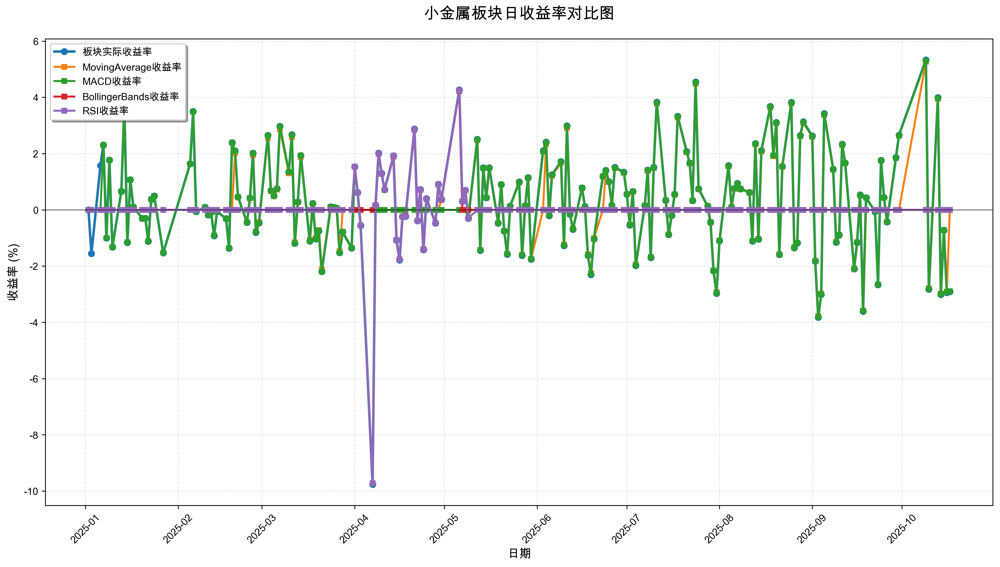
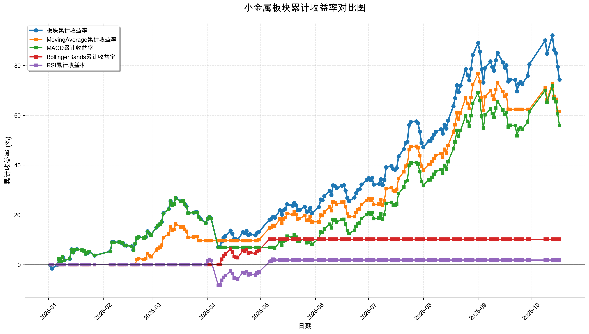

# 策略回测结果报告

**生成时间**: 2025-10-19 19:06:45
**行业板块**: 小金属
**回测期间**: 20250101 至 20251017
**策略数量**: 4

## 📈 分析结论

### 策略表现分析
- **最佳策略**: MovingAverage (总收益率: 61.57%)
- **最差策略**: RSI (总收益率: 1.85%)
### 交易活跃度分析
- **活跃策略**: 4 个
- **非活跃策略**: 0 个
- **最活跃策略**: MovingAverage (交易次数: 10)
### 🚨 异动提醒分析
- **板块异动**: 小金属 近两周出现极端波动 (最大单日: 5.33%, 最小单日: 5.33%)
- **板块异动**: 小金属 近两周出现大幅波动 (最大单日: 5.33%)
- **策略异动**: MovingAverage 近两周出现极端表现 (最大单日: 5.26%, 最小单日: 5.26%)
- **策略异动**: MovingAverage 近两周出现大幅波动 (最大单日: 5.26%)
- **策略异动**: MACD 近两周出现大幅波动 (最大单日: 5.30%)
### 风险分析
- **MovingAverage**: 最大回撤 -8.58%, 夏普比率 3.7452
- **MACD**: 最大回撤 -15.86%, 夏普比率 2.8263
- **BollingerBands**: 最大回撤 -3.26%, 夏普比率 1.8061
- **RSI**: 最大回撤 -10.23%, 夏普比率 0.1781

## 📊 综合结果表

| 策略名称           | 初始资金     | 最终价值     | 总收益率   | 年化收益率   | 波动率    |   夏普比率 | 最大回撤    | 总交易次数   | 买入次数   | 卖出次数   | 总交易金额      | 平均交易金额   | 交易频率   |   数据点数 |
|:---------------|:---------|:---------|:-------|:--------|:-------|-------:|:--------|:--------|:-------|:-------|:-----------|:---------|:-------|-------:|
| 板块实际表现         | ¥100,000 | ¥174,313 | 74.31% | 108.97% | 29.58% | 3.6842 | -15.65% | N/A     | N/A    | N/A    | N/A        | N/A      | N/A    |    190 |
| MovingAverage  | ¥100,000 | ¥161,573 | 61.57% | 88.96%  | 23.75% | 3.7452 | -8.58%  | 10      | 5      | 5      | ¥1,255,125 | ¥125,513 | 0.05   |    190 |
| MACD           | ¥100,000 | ¥155,952 | 55.95% | 80.29%  | 28.41% | 2.8263 | -15.86% | 3       | 2      | 1      | ¥312,258   | ¥104,086 | 0.02   |    190 |
| BollingerBands | ¥100,000 | ¥110,234 | 10.23% | 13.80%  | 7.64%  | 1.8061 | -3.26%  | 2       | 1      | 1      | ¥208,165   | ¥104,083 | 0.01   |    190 |
| RSI            | ¥100,000 | ¥101,853 | 1.85%  | 2.47%   | 13.84% | 0.1781 | -10.23% | 2       | 1      | 1      | ¥201,158   | ¥100,579 | 0.01   |    190 |

## 📊 每日收益率走势图

*图1: 小金属板块每日收益率走势对比*

## 📈 累计收益率走势图

*图2: 小金属板块累计收益率走势对比*

## 📅 日收益明细表

| 日期         | 板块实际收益率   | MovingAverage收益率   | MACD收益率   | BollingerBands收益率   | RSI收益率   |
|:-----------|:----------|:-------------------|:----------|:--------------------|:---------|
| 2025-01-02 | 0.00%     | 0.00%              | 0.00%     | 0.00%               | 0.00%    |
| 2025-01-03 | -1.55%    | 0.00%              | 0.00%     | 0.00%               | 0.00%    |
| 2025-01-06 | 1.57%     | 0.00%              | 0.00%     | 0.00%               | 0.00%    |
| 2025-01-07 | 2.31%     | 0.00%              | 2.30%     | 0.00%               | 0.00%    |
| 2025-01-08 | -1.00%    | 0.00%              | -1.00%    | 0.00%               | 0.00%    |
| 2025-01-09 | 1.77%     | 0.00%              | 1.77%     | 0.00%               | 0.00%    |
| 2025-01-10 | -1.32%    | 0.00%              | -1.32%    | 0.00%               | 0.00%    |
| 2025-01-13 | 0.66%     | 0.00%              | 0.65%     | 0.00%               | 0.00%    |
| 2025-01-14 | 3.70%     | 0.00%              | 3.69%     | 0.00%               | 0.00%    |
| 2025-01-15 | -1.16%    | 0.00%              | -1.15%    | 0.00%               | 0.00%    |
| 2025-01-16 | 1.07%     | 0.00%              | 1.07%     | 0.00%               | 0.00%    |
| 2025-01-17 | 0.10%     | 0.00%              | 0.10%     | 0.00%               | 0.00%    |
| 2025-01-20 | -0.30%    | 0.00%              | -0.30%    | 0.00%               | 0.00%    |
| 2025-01-21 | -0.30%    | 0.00%              | -0.30%    | 0.00%               | 0.00%    |
| 2025-01-22 | -1.12%    | 0.00%              | -1.11%    | 0.00%               | 0.00%    |
| 2025-01-23 | 0.37%     | 0.00%              | 0.37%     | 0.00%               | 0.00%    |
| 2025-01-24 | 0.49%     | 0.00%              | 0.49%     | 0.00%               | 0.00%    |
| 2025-01-27 | -1.53%    | 0.00%              | -1.52%    | 0.00%               | 0.00%    |
| 2025-02-05 | 1.64%     | 0.00%              | 1.63%     | 0.00%               | 0.00%    |
| 2025-02-06 | 3.50%     | 0.00%              | 3.49%     | 0.00%               | 0.00%    |
| 2025-02-07 | -0.06%    | 0.00%              | -0.06%    | 0.00%               | 0.00%    |
| 2025-02-10 | 0.09%     | 0.00%              | 0.09%     | 0.00%               | 0.00%    |
| 2025-02-11 | -0.18%    | 0.00%              | -0.18%    | 0.00%               | 0.00%    |
| 2025-02-12 | -0.09%    | 0.00%              | -0.09%    | 0.00%               | 0.00%    |
| 2025-02-13 | -0.92%    | 0.00%              | -0.91%    | 0.00%               | 0.00%    |
| 2025-02-14 | -0.06%    | 0.00%              | -0.06%    | 0.00%               | 0.00%    |
| 2025-02-17 | -0.31%    | 0.00%              | -0.31%    | 0.00%               | 0.00%    |
| 2025-02-18 | -1.37%    | 0.00%              | -1.36%    | 0.00%               | 0.00%    |
| 2025-02-19 | 2.39%     | 0.00%              | 2.38%     | 0.00%               | 0.00%    |
| 2025-02-20 | 2.09%     | 2.02%              | 2.09%     | 0.00%               | 0.00%    |
| 2025-02-21 | 0.46%     | 0.45%              | 0.46%     | 0.00%               | 0.00%    |
| 2025-02-24 | -0.45%    | -0.44%             | -0.45%    | 0.00%               | 0.00%    |
| 2025-02-25 | 0.42%     | 0.41%              | 0.42%     | 0.00%               | 0.00%    |
| 2025-02-26 | 2.02%     | 1.95%              | 2.01%     | 0.00%               | 0.00%    |
| 2025-02-27 | -0.80%    | -0.77%             | -0.79%    | 0.00%               | 0.00%    |
| 2025-02-28 | -0.46%    | -0.44%             | -0.46%    | 0.00%               | 0.00%    |
| 2025-03-03 | 2.65%     | 2.56%              | 2.64%     | 0.00%               | 0.00%    |
| 2025-03-04 | 0.68%     | 0.66%              | 0.68%     | 0.00%               | 0.00%    |
| 2025-03-05 | 0.50%     | 0.49%              | 0.50%     | 0.00%               | 0.00%    |
| 2025-03-06 | 0.75%     | 0.72%              | 0.75%     | 0.00%               | 0.00%    |
| 2025-03-07 | 2.97%     | 2.87%              | 2.96%     | 0.00%               | 0.00%    |
| 2025-03-10 | 1.34%     | 1.30%              | 1.34%     | 0.00%               | 0.00%    |
| 2025-03-11 | 2.67%     | 2.59%              | 2.66%     | 0.00%               | 0.00%    |
| 2025-03-12 | -1.19%    | -1.15%             | -1.19%    | 0.00%               | 0.00%    |
| 2025-03-13 | 0.28%     | 0.27%              | 0.28%     | 0.00%               | 0.00%    |
| 2025-03-14 | 1.93%     | 1.87%              | 1.93%     | 0.00%               | 0.00%    |
| 2025-03-17 | -1.11%    | -1.07%             | -1.10%    | 0.00%               | 0.00%    |
| 2025-03-18 | 0.23%     | 0.22%              | 0.23%     | 0.00%               | 0.00%    |
| 2025-03-19 | -1.03%    | -1.00%             | -1.03%    | 0.00%               | 0.00%    |
| 2025-03-20 | -0.75%    | -0.72%             | -0.74%    | 0.00%               | 0.00%    |
| 2025-03-21 | -2.19%    | -2.12%             | -2.19%    | 0.00%               | 0.00%    |
| 2025-03-24 | 0.11%     | 0.10%              | 0.11%     | 0.00%               | 0.00%    |
| 2025-03-25 | 0.09%     | 0.09%              | 0.09%     | 0.00%               | 0.00%    |
| 2025-03-26 | 0.06%     | 0.06%              | 0.06%     | 0.00%               | 0.00%    |
| 2025-03-27 | -1.52%    | -1.47%             | -1.52%    | 0.00%               | 0.00%    |
| 2025-03-28 | -0.79%    | 0.00%              | -0.78%    | 0.00%               | 0.00%    |
| 2025-03-31 | -1.36%    | 0.00%              | -1.36%    | 0.00%               | 0.00%    |
| 2025-04-01 | 1.53%     | 0.00%              | 1.53%     | 0.00%               | 1.53%    |
| 2025-04-02 | 0.62%     | 0.00%              | 0.61%     | 0.00%               | 0.61%    |
| 2025-04-03 | -0.56%    | 0.00%              | -0.56%    | 0.00%               | -0.56%   |
| 2025-04-07 | -9.76%    | 0.00%              | -9.73%    | 0.00%               | -9.72%   |
| 2025-04-08 | 0.17%     | 0.00%              | 0.00%     | 0.17%               | 0.17%    |
| 2025-04-09 | 2.02%     | 0.00%              | 0.00%     | 2.00%               | 2.01%    |
| 2025-04-10 | 1.30%     | 0.00%              | 0.00%     | 1.28%               | 1.29%    |
| 2025-04-11 | 0.72%     | 0.00%              | 0.00%     | 0.71%               | 0.72%    |
| 2025-04-14 | 1.92%     | 0.00%              | 0.00%     | 1.90%               | 1.92%    |
| 2025-04-15 | -1.08%    | 0.00%              | 0.00%     | -1.07%              | -1.08%   |
| 2025-04-16 | -1.78%    | 0.00%              | 0.00%     | -1.76%              | -1.77%   |
| 2025-04-17 | -0.24%    | 0.00%              | 0.00%     | -0.24%              | -0.24%   |
| 2025-04-18 | -0.23%    | 0.00%              | 0.00%     | -0.22%              | -0.23%   |
| 2025-04-21 | 2.88%     | 0.00%              | 0.00%     | 2.85%               | 2.87%    |
| 2025-04-22 | -0.39%    | 0.00%              | 0.00%     | -0.39%              | -0.39%   |
| 2025-04-23 | 0.72%     | 0.00%              | 0.00%     | 0.71%               | 0.72%    |
| 2025-04-24 | -1.42%    | 0.00%              | 0.00%     | -1.40%              | -1.41%   |
| 2025-04-25 | 0.40%     | 0.00%              | 0.00%     | 0.39%               | 0.39%    |
| 2025-04-28 | -0.47%    | 0.00%              | 0.00%     | -0.46%              | -0.47%   |
| 2025-04-29 | 0.91%     | 0.00%              | 0.00%     | 0.90%               | 0.91%    |
| 2025-04-30 | 0.37%     | 0.36%              | 0.00%     | 0.36%               | 0.37%    |
| 2025-05-06 | 4.27%     | 4.22%              | 0.00%     | 4.22%               | 4.25%    |
| 2025-05-07 | 0.30%     | 0.30%              | 0.00%     | 0.00%               | 0.30%    |
| 2025-05-08 | 0.70%     | 0.70%              | 0.00%     | 0.00%               | 0.70%    |
| 2025-05-09 | -0.30%    | -0.30%             | -0.30%    | 0.00%               | -0.30%   |
| 2025-05-12 | 2.51%     | 2.48%              | 2.49%     | 0.00%               | 0.00%    |
| 2025-05-13 | -1.44%    | -1.43%             | -1.43%    | 0.00%               | 0.00%    |
| 2025-05-14 | 1.50%     | 1.48%              | 1.48%     | 0.00%               | 0.00%    |
| 2025-05-15 | 0.43%     | 0.43%              | 0.43%     | 0.00%               | 0.00%    |
| 2025-05-16 | 1.50%     | 1.49%              | 1.49%     | 0.00%               | 0.00%    |
| 2025-05-19 | -0.47%    | -0.47%             | -0.47%    | 0.00%               | 0.00%    |
| 2025-05-20 | 0.90%     | 0.89%              | 0.90%     | 0.00%               | 0.00%    |
| 2025-05-21 | -0.75%    | -0.75%             | -0.75%    | 0.00%               | 0.00%    |
| 2025-05-22 | -1.58%    | -1.56%             | -1.56%    | 0.00%               | 0.00%    |
| 2025-05-23 | 0.13%     | 0.12%              | 0.12%     | 0.00%               | 0.00%    |
| 2025-05-26 | 0.99%     | 0.98%              | 0.98%     | 0.00%               | 0.00%    |
| 2025-05-27 | -1.62%    | -1.60%             | -1.61%    | 0.00%               | 0.00%    |
| 2025-05-28 | 0.14%     | 0.14%              | 0.14%     | 0.00%               | 0.00%    |
| 2025-05-29 | 1.15%     | 1.14%              | 1.14%     | 0.00%               | 0.00%    |
| 2025-05-30 | -1.76%    | -1.74%             | -1.75%    | 0.00%               | 0.00%    |
| 2025-06-03 | 2.10%     | 0.00%              | 2.08%     | 0.00%               | 0.00%    |
| 2025-06-04 | 2.41%     | 2.34%              | 2.39%     | 0.00%               | 0.00%    |
| 2025-06-05 | -0.21%    | -0.20%             | -0.20%    | 0.00%               | 0.00%    |
| 2025-06-06 | 1.25%     | 1.22%              | 1.24%     | 0.00%               | 0.00%    |
| 2025-06-09 | 1.72%     | 1.67%              | 1.71%     | 0.00%               | 0.00%    |
| 2025-06-10 | -1.27%    | -1.23%             | -1.26%    | 0.00%               | 0.00%    |
| 2025-06-11 | 2.99%     | 2.91%              | 2.97%     | 0.00%               | 0.00%    |
| 2025-06-12 | -0.16%    | -0.16%             | -0.16%    | 0.00%               | 0.00%    |
| 2025-06-13 | -0.69%    | -0.67%             | -0.68%    | 0.00%               | 0.00%    |
| 2025-06-16 | 0.78%     | 0.76%              | 0.78%     | 0.00%               | 0.00%    |
| 2025-06-17 | 0.12%     | 0.12%              | 0.12%     | 0.00%               | 0.00%    |
| 2025-06-18 | -1.62%    | -1.58%             | -1.61%    | 0.00%               | 0.00%    |
| 2025-06-19 | -2.30%    | -2.24%             | -2.28%    | 0.00%               | 0.00%    |
| 2025-06-20 | -1.03%    | -1.01%             | -1.03%    | 0.00%               | 0.00%    |
| 2025-06-23 | 1.20%     | 0.00%              | 1.19%     | 0.00%               | 0.00%    |
| 2025-06-24 | 1.40%     | 1.38%              | 1.39%     | 0.00%               | 0.00%    |
| 2025-06-25 | 1.00%     | 0.99%              | 0.99%     | 0.00%               | 0.00%    |
| 2025-06-26 | 0.16%     | 0.16%              | 0.16%     | 0.00%               | 0.00%    |
| 2025-06-27 | 1.51%     | 1.49%              | 1.50%     | 0.00%               | 0.00%    |
| 2025-06-30 | 1.34%     | 1.32%              | 1.33%     | 0.00%               | 0.00%    |
| 2025-07-01 | 0.56%     | 0.55%              | 0.55%     | 0.00%               | 0.00%    |
| 2025-07-02 | -0.54%    | -0.53%             | -0.53%    | 0.00%               | 0.00%    |
| 2025-07-03 | 0.65%     | 0.64%              | 0.65%     | 0.00%               | 0.00%    |
| 2025-07-04 | -1.98%    | -1.95%             | -1.97%    | 0.00%               | 0.00%    |
| 2025-07-07 | 0.15%     | 0.15%              | 0.15%     | 0.00%               | 0.00%    |
| 2025-07-08 | 1.41%     | 1.39%              | 1.40%     | 0.00%               | 0.00%    |
| 2025-07-09 | -1.70%    | -1.67%             | -1.68%    | 0.00%               | 0.00%    |
| 2025-07-10 | 1.51%     | 1.49%              | 1.50%     | 0.00%               | 0.00%    |
| 2025-07-11 | 3.83%     | 3.78%              | 3.80%     | 0.00%               | 0.00%    |
| 2025-07-14 | 0.34%     | 0.34%              | 0.34%     | 0.00%               | 0.00%    |
| 2025-07-15 | -0.88%    | -0.87%             | -0.88%    | 0.00%               | 0.00%    |
| 2025-07-16 | -0.20%    | -0.20%             | -0.20%    | 0.00%               | 0.00%    |
| 2025-07-17 | 0.55%     | 0.54%              | 0.55%     | 0.00%               | 0.00%    |
| 2025-07-18 | 3.33%     | 3.29%              | 3.31%     | 0.00%               | 0.00%    |
| 2025-07-21 | 2.08%     | 2.05%              | 2.06%     | 0.00%               | 0.00%    |
| 2025-07-22 | 1.67%     | 1.65%              | 1.66%     | 0.00%               | 0.00%    |
| 2025-07-23 | 0.33%     | 0.33%              | 0.33%     | 0.00%               | 0.00%    |
| 2025-07-24 | 4.55%     | 4.49%              | 4.52%     | 0.00%               | 0.00%    |
| 2025-07-25 | 0.75%     | 0.74%              | 0.75%     | 0.00%               | 0.00%    |
| 2025-07-28 | 0.13%     | 0.13%              | 0.13%     | 0.00%               | 0.00%    |
| 2025-07-29 | -0.45%    | -0.44%             | -0.44%    | 0.00%               | 0.00%    |
| 2025-07-30 | -2.17%    | -2.15%             | -2.16%    | 0.00%               | 0.00%    |
| 2025-07-31 | -2.97%    | -2.93%             | -2.95%    | 0.00%               | 0.00%    |
| 2025-08-01 | -1.10%    | -1.09%             | -1.09%    | 0.00%               | 0.00%    |
| 2025-08-04 | 1.57%     | 1.55%              | 1.56%     | 0.00%               | 0.00%    |
| 2025-08-05 | 0.10%     | 0.10%              | 0.10%     | 0.00%               | 0.00%    |
| 2025-08-06 | 0.76%     | 0.75%              | 0.76%     | 0.00%               | 0.00%    |
| 2025-08-07 | 0.94%     | 0.93%              | 0.93%     | 0.00%               | 0.00%    |
| 2025-08-08 | 0.75%     | 0.74%              | 0.74%     | 0.00%               | 0.00%    |
| 2025-08-11 | 0.62%     | 0.61%              | 0.62%     | 0.00%               | 0.00%    |
| 2025-08-12 | -1.11%    | -1.10%             | -1.10%    | 0.00%               | 0.00%    |
| 2025-08-13 | 2.36%     | 2.33%              | 2.35%     | 0.00%               | 0.00%    |
| 2025-08-14 | -1.04%    | -1.03%             | -1.04%    | 0.00%               | 0.00%    |
| 2025-08-15 | 2.11%     | 2.08%              | 2.10%     | 0.00%               | 0.00%    |
| 2025-08-18 | 3.68%     | 3.64%              | 3.66%     | 0.00%               | 0.00%    |
| 2025-08-19 | 1.94%     | 1.91%              | 1.93%     | 0.00%               | 0.00%    |
| 2025-08-20 | 3.11%     | 3.08%              | 3.09%     | 0.00%               | 0.00%    |
| 2025-08-21 | -1.59%    | -1.58%             | -1.59%    | 0.00%               | 0.00%    |
| 2025-08-22 | 1.55%     | 1.53%              | 1.54%     | 0.00%               | 0.00%    |
| 2025-08-25 | 3.82%     | 3.78%              | 3.80%     | 0.00%               | 0.00%    |
| 2025-08-26 | -1.35%    | -1.33%             | -1.34%    | 0.00%               | 0.00%    |
| 2025-08-27 | -1.18%    | -1.17%             | -1.17%    | 0.00%               | 0.00%    |
| 2025-08-28 | 2.65%     | 2.62%              | 2.63%     | 0.00%               | 0.00%    |
| 2025-08-29 | 3.13%     | 3.09%              | 3.11%     | 0.00%               | 0.00%    |
| 2025-09-01 | 2.63%     | 2.60%              | 2.61%     | 0.00%               | 0.00%    |
| 2025-09-02 | -1.83%    | -1.81%             | -1.82%    | 0.00%               | 0.00%    |
| 2025-09-03 | -3.82%    | -3.78%             | -3.80%    | 0.00%               | 0.00%    |
| 2025-09-04 | -3.01%    | -2.98%             | -3.00%    | 0.00%               | 0.00%    |
| 2025-09-05 | 3.42%     | 3.38%              | 3.40%     | 0.00%               | 0.00%    |
| 2025-09-08 | 1.45%     | 1.43%              | 1.44%     | 0.00%               | 0.00%    |
| 2025-09-09 | -1.15%    | -1.14%             | -1.15%    | 0.00%               | 0.00%    |
| 2025-09-10 | -0.90%    | -0.89%             | -0.89%    | 0.00%               | 0.00%    |
| 2025-09-11 | 2.33%     | 2.31%              | 2.32%     | 0.00%               | 0.00%    |
| 2025-09-12 | 1.67%     | 1.66%              | 1.66%     | 0.00%               | 0.00%    |
| 2025-09-15 | -2.10%    | -2.08%             | -2.09%    | 0.00%               | 0.00%    |
| 2025-09-16 | -1.16%    | -1.15%             | -1.15%    | 0.00%               | 0.00%    |
| 2025-09-17 | 0.53%     | 0.52%              | 0.52%     | 0.00%               | 0.00%    |
| 2025-09-18 | -3.61%    | -3.58%             | -3.59%    | 0.00%               | 0.00%    |
| 2025-09-19 | 0.43%     | 0.00%              | 0.43%     | 0.00%               | 0.00%    |
| 2025-09-22 | -0.06%    | 0.00%              | -0.06%    | 0.00%               | 0.00%    |
| 2025-09-23 | -2.66%    | 0.00%              | -2.65%    | 0.00%               | 0.00%    |
| 2025-09-24 | 1.76%     | 0.00%              | 1.75%     | 0.00%               | 0.00%    |
| 2025-09-25 | 0.44%     | 0.00%              | 0.43%     | 0.00%               | 0.00%    |
| 2025-09-26 | -0.43%    | 0.00%              | -0.43%    | 0.00%               | 0.00%    |
| 2025-09-29 | 1.86%     | 0.00%              | 1.85%     | 0.00%               | 0.00%    |
| 2025-09-30 | 2.66%     | 0.00%              | 2.64%     | 0.00%               | 0.00%    |
| 2025-10-09 | 5.33%     | 5.26%              | 5.30%     | 0.00%               | 0.00%    |
| 2025-10-10 | -2.82%    | -2.79%             | -2.81%    | 0.00%               | 0.00%    |
| 2025-10-13 | 3.99%     | 3.95%              | 3.97%     | 0.00%               | 0.00%    |
| 2025-10-14 | -3.01%    | -2.98%             | -2.99%    | 0.00%               | 0.00%    |
| 2025-10-15 | -0.73%    | -0.72%             | -0.72%    | 0.00%               | 0.00%    |
| 2025-10-16 | -2.94%    | -2.91%             | -2.93%    | 0.00%               | 0.00%    |
| 2025-10-17 | -2.91%    | 0.00%              | -2.89%    | 0.00%               | 0.00%    |

## 📊 日收益统计摘要

| 指标                | 平均日收益率   | 最大日收益率   | 最小日收益率   | 正收益天数   | 负收益天数   |
|:------------------|:---------|:---------|:---------|:--------|:--------|
| 板块实际收益率           | 0.31%    | 5.33%    | -9.76%   | 110天    | 79天     |
| MovingAverage收益率  | 0.26%    | 5.26%    | -3.78%   | 79天     | 49天     |
| MACD收益率           | 0.25%    | 5.30%    | -9.73%   | 96天     | 71天     |
| BollingerBands收益率 | 0.05%    | 4.22%    | -1.76%   | 11天     | 7天      |
| RSI收益率            | 0.01%    | 4.25%    | -9.72%   | 15天     | 10天     |

## 📈 累计收益明细表

| 日期         | 板块累计收益率   | MovingAverage累计收益率   | MACD累计收益率   | BollingerBands累计收益率   | RSI累计收益率   |
|:-----------|:----------|:---------------------|:------------|:----------------------|:-----------|
| 2025-01-02 | 0.00%     | 0.00%                | 0.00%       | 0.00%                 | 0.00%      |
| 2025-01-03 | -1.55%    | 0.00%                | 0.00%       | 0.00%                 | 0.00%      |
| 2025-01-06 | -0.00%    | 0.00%                | 0.00%       | 0.00%                 | 0.00%      |
| 2025-01-07 | 2.30%     | 0.00%                | 2.30%       | 0.00%                 | 0.00%      |
| 2025-01-08 | 1.28%     | 0.00%                | 1.28%       | 0.00%                 | 0.00%      |
| 2025-01-09 | 3.07%     | 0.00%                | 3.07%       | 0.00%                 | 0.00%      |
| 2025-01-10 | 1.71%     | 0.00%                | 1.71%       | 0.00%                 | 0.00%      |
| 2025-01-13 | 2.38%     | 0.00%                | 2.37%       | 0.00%                 | 0.00%      |
| 2025-01-14 | 6.16%     | 0.00%                | 6.14%       | 0.00%                 | 0.00%      |
| 2025-01-15 | 4.93%     | 0.00%                | 4.92%       | 0.00%                 | 0.00%      |
| 2025-01-16 | 6.06%     | 0.00%                | 6.04%       | 0.00%                 | 0.00%      |
| 2025-01-17 | 6.17%     | 0.00%                | 6.15%       | 0.00%                 | 0.00%      |
| 2025-01-20 | 5.85%     | 0.00%                | 5.83%       | 0.00%                 | 0.00%      |
| 2025-01-21 | 5.53%     | 0.00%                | 5.52%       | 0.00%                 | 0.00%      |
| 2025-01-22 | 4.35%     | 0.00%                | 4.34%       | 0.00%                 | 0.00%      |
| 2025-01-23 | 4.74%     | 0.00%                | 4.73%       | 0.00%                 | 0.00%      |
| 2025-01-24 | 5.26%     | 0.00%                | 5.24%       | 0.00%                 | 0.00%      |
| 2025-01-27 | 3.65%     | 0.00%                | 3.64%       | 0.00%                 | 0.00%      |
| 2025-02-05 | 5.35%     | 0.00%                | 5.33%       | 0.00%                 | 0.00%      |
| 2025-02-06 | 9.03%     | 0.00%                | 9.00%       | 0.00%                 | 0.00%      |
| 2025-02-07 | 8.97%     | 0.00%                | 8.94%       | 0.00%                 | 0.00%      |
| 2025-02-10 | 9.06%     | 0.00%                | 9.03%       | 0.00%                 | 0.00%      |
| 2025-02-11 | 8.86%     | 0.00%                | 8.83%       | 0.00%                 | 0.00%      |
| 2025-02-12 | 8.76%     | 0.00%                | 8.73%       | 0.00%                 | 0.00%      |
| 2025-02-13 | 7.77%     | 0.00%                | 7.74%       | 0.00%                 | 0.00%      |
| 2025-02-14 | 7.70%     | 0.00%                | 7.68%       | 0.00%                 | 0.00%      |
| 2025-02-17 | 7.37%     | 0.00%                | 7.34%       | 0.00%                 | 0.00%      |
| 2025-02-18 | 5.90%     | 0.00%                | 5.88%       | 0.00%                 | 0.00%      |
| 2025-02-19 | 8.43%     | 0.00%                | 8.40%       | 0.00%                 | 0.00%      |
| 2025-02-20 | 10.70%    | 2.02%                | 10.66%      | 0.00%                 | 0.00%      |
| 2025-02-21 | 11.21%    | 2.48%                | 11.17%      | 0.00%                 | 0.00%      |
| 2025-02-24 | 10.71%    | 2.03%                | 10.67%      | 0.00%                 | 0.00%      |
| 2025-02-25 | 11.17%    | 2.44%                | 11.13%      | 0.00%                 | 0.00%      |
| 2025-02-26 | 13.41%    | 4.44%                | 13.37%      | 0.00%                 | 0.00%      |
| 2025-02-27 | 12.51%    | 3.63%                | 12.47%      | 0.00%                 | 0.00%      |
| 2025-02-28 | 12.00%    | 3.18%                | 11.96%      | 0.00%                 | 0.00%      |
| 2025-03-03 | 14.97%    | 5.82%                | 14.92%      | 0.00%                 | 0.00%      |
| 2025-03-04 | 15.75%    | 6.52%                | 15.70%      | 0.00%                 | 0.00%      |
| 2025-03-05 | 16.33%    | 7.03%                | 16.28%      | 0.00%                 | 0.00%      |
| 2025-03-06 | 17.20%    | 7.81%                | 17.14%      | 0.00%                 | 0.00%      |
| 2025-03-07 | 20.69%    | 10.91%               | 20.61%      | 0.00%                 | 0.00%      |
| 2025-03-10 | 22.30%    | 12.34%               | 22.23%      | 0.00%                 | 0.00%      |
| 2025-03-11 | 25.57%    | 15.25%               | 25.48%      | 0.00%                 | 0.00%      |
| 2025-03-12 | 24.08%    | 13.92%               | 23.99%      | 0.00%                 | 0.00%      |
| 2025-03-13 | 24.42%    | 14.23%               | 24.33%      | 0.00%                 | 0.00%      |
| 2025-03-14 | 26.83%    | 16.37%               | 26.73%      | 0.00%                 | 0.00%      |
| 2025-03-17 | 25.42%    | 15.12%               | 25.33%      | 0.00%                 | 0.00%      |
| 2025-03-18 | 25.71%    | 15.37%               | 25.61%      | 0.00%                 | 0.00%      |
| 2025-03-19 | 24.41%    | 14.22%               | 24.33%      | 0.00%                 | 0.00%      |
| 2025-03-20 | 23.48%    | 13.39%               | 23.40%      | 0.00%                 | 0.00%      |
| 2025-03-21 | 20.78%    | 10.99%               | 20.70%      | 0.00%                 | 0.00%      |
| 2025-03-24 | 20.91%    | 11.10%               | 20.83%      | 0.00%                 | 0.00%      |
| 2025-03-25 | 21.01%    | 11.20%               | 20.94%      | 0.00%                 | 0.00%      |
| 2025-03-26 | 21.09%    | 11.26%               | 21.01%      | 0.00%                 | 0.00%      |
| 2025-03-27 | 19.25%    | 9.62%                | 19.18%      | 0.00%                 | 0.00%      |
| 2025-03-28 | 18.31%    | 9.62%                | 18.24%      | 0.00%                 | 0.00%      |
| 2025-03-31 | 16.70%    | 9.62%                | 16.64%      | 0.00%                 | 0.00%      |
| 2025-04-01 | 18.49%    | 9.62%                | 18.42%      | 0.00%                 | 1.53%      |
| 2025-04-02 | 19.22%    | 9.62%                | 19.15%      | 0.00%                 | 2.15%      |
| 2025-04-03 | 18.55%    | 9.62%                | 18.48%      | 0.00%                 | 1.58%      |
| 2025-04-07 | 6.98%     | 9.62%                | 6.96%       | 0.00%                 | -8.30%     |
| 2025-04-08 | 7.16%     | 9.62%                | 6.96%       | 0.17%                 | -8.14%     |
| 2025-04-09 | 9.33%     | 9.62%                | 6.96%       | 2.17%                 | -6.29%     |
| 2025-04-10 | 10.74%    | 9.62%                | 6.96%       | 3.48%                 | -5.08%     |
| 2025-04-11 | 11.54%    | 9.62%                | 6.96%       | 4.22%                 | -4.41%     |
| 2025-04-14 | 13.68%    | 9.62%                | 6.96%       | 6.20%                 | -2.57%     |
| 2025-04-15 | 12.46%    | 9.62%                | 6.96%       | 5.07%                 | -3.62%     |
| 2025-04-16 | 10.46%    | 9.62%                | 6.96%       | 3.22%                 | -5.33%     |
| 2025-04-17 | 10.19%    | 9.62%                | 6.96%       | 2.98%                 | -5.55%     |
| 2025-04-18 | 9.94%     | 9.62%                | 6.96%       | 2.74%                 | -5.77%     |
| 2025-04-21 | 13.11%    | 9.62%                | 6.96%       | 5.67%                 | -3.07%     |
| 2025-04-22 | 12.66%    | 9.62%                | 6.96%       | 5.26%                 | -3.45%     |
| 2025-04-23 | 13.47%    | 9.62%                | 6.96%       | 6.01%                 | -2.76%     |
| 2025-04-24 | 11.86%    | 9.62%                | 6.96%       | 4.52%                 | -4.13%     |
| 2025-04-25 | 12.30%    | 9.62%                | 6.96%       | 4.93%                 | -3.75%     |
| 2025-04-28 | 11.78%    | 9.62%                | 6.96%       | 4.44%                 | -4.20%     |
| 2025-04-29 | 12.80%    | 9.62%                | 6.96%       | 5.38%                 | -3.33%     |
| 2025-04-30 | 13.21%    | 10.02%               | 6.96%       | 5.77%                 | -2.98%     |
| 2025-05-06 | 18.04%    | 14.66%               | 6.96%       | 10.23%                | 1.15%      |
| 2025-05-07 | 18.40%    | 15.00%               | 6.96%       | 10.23%                | 1.45%      |
| 2025-05-08 | 19.23%    | 15.81%               | 6.96%       | 10.23%                | 2.16%      |
| 2025-05-09 | 18.87%    | 15.46%               | 6.63%       | 10.23%                | 1.85%      |
| 2025-05-12 | 21.85%    | 18.32%               | 9.28%       | 10.23%                | 1.85%      |
| 2025-05-13 | 20.09%    | 16.63%               | 7.72%       | 10.23%                | 1.85%      |
| 2025-05-14 | 21.89%    | 18.36%               | 9.32%       | 10.23%                | 1.85%      |
| 2025-05-15 | 22.41%    | 18.86%               | 9.78%       | 10.23%                | 1.85%      |
| 2025-05-16 | 24.25%    | 20.63%               | 11.42%      | 10.23%                | 1.85%      |
| 2025-05-19 | 23.67%    | 20.07%               | 10.90%      | 10.23%                | 1.85%      |
| 2025-05-20 | 24.78%    | 21.14%               | 11.89%      | 10.23%                | 1.85%      |
| 2025-05-21 | 23.84%    | 20.23%               | 11.06%      | 10.23%                | 1.85%      |
| 2025-05-22 | 21.89%    | 18.36%               | 9.32%       | 10.23%                | 1.85%      |
| 2025-05-23 | 22.04%    | 18.51%               | 9.46%       | 10.23%                | 1.85%      |
| 2025-05-26 | 23.25%    | 19.67%               | 10.53%      | 10.23%                | 1.85%      |
| 2025-05-27 | 21.26%    | 17.75%               | 8.76%       | 10.23%                | 1.85%      |
| 2025-05-28 | 21.43%    | 17.91%               | 8.91%       | 10.23%                | 1.85%      |
| 2025-05-29 | 22.82%    | 19.25%               | 10.15%      | 10.23%                | 1.85%      |
| 2025-05-30 | 20.65%    | 17.17%               | 8.22%       | 10.23%                | 1.85%      |
| 2025-06-03 | 23.18%    | 17.17%               | 10.47%      | 10.23%                | 1.85%      |
| 2025-06-04 | 26.15%    | 19.91%               | 13.11%      | 10.23%                | 1.85%      |
| 2025-06-05 | 25.89%    | 19.67%               | 12.88%      | 10.23%                | 1.85%      |
| 2025-06-06 | 27.46%    | 21.13%               | 14.28%      | 10.23%                | 1.85%      |
| 2025-06-09 | 29.65%    | 23.16%               | 16.23%      | 10.23%                | 1.85%      |
| 2025-06-10 | 28.01%    | 21.64%               | 14.77%      | 10.23%                | 1.85%      |
| 2025-06-11 | 31.84%    | 25.18%               | 18.17%      | 10.23%                | 1.85%      |
| 2025-06-12 | 31.63%    | 24.99%               | 17.98%      | 10.23%                | 1.85%      |
| 2025-06-13 | 30.72%    | 24.15%               | 17.18%      | 10.23%                | 1.85%      |
| 2025-06-16 | 31.75%    | 25.09%               | 18.09%      | 10.23%                | 1.85%      |
| 2025-06-17 | 31.91%    | 25.24%               | 18.23%      | 10.23%                | 1.85%      |
| 2025-06-18 | 29.76%    | 23.26%               | 16.33%      | 10.23%                | 1.85%      |
| 2025-06-19 | 26.78%    | 20.50%               | 13.67%      | 10.23%                | 1.85%      |
| 2025-06-20 | 25.47%    | 19.28%               | 12.50%      | 10.23%                | 1.85%      |
| 2025-06-23 | 26.97%    | 19.28%               | 13.84%      | 10.23%                | 1.85%      |
| 2025-06-24 | 28.75%    | 20.93%               | 15.42%      | 10.23%                | 1.85%      |
| 2025-06-25 | 30.04%    | 22.12%               | 16.57%      | 10.23%                | 1.85%      |
| 2025-06-26 | 30.24%    | 22.32%               | 16.75%      | 10.23%                | 1.85%      |
| 2025-06-27 | 32.21%    | 24.14%               | 18.50%      | 10.23%                | 1.85%      |
| 2025-06-30 | 33.99%    | 25.78%               | 20.08%      | 10.23%                | 1.85%      |
| 2025-07-01 | 34.73%    | 26.47%               | 20.74%      | 10.23%                | 1.85%      |
| 2025-07-02 | 34.00%    | 25.79%               | 20.10%      | 10.23%                | 1.85%      |
| 2025-07-03 | 34.88%    | 26.60%               | 20.87%      | 10.23%                | 1.85%      |
| 2025-07-04 | 32.20%    | 24.13%               | 18.49%      | 10.23%                | 1.85%      |
| 2025-07-07 | 32.40%    | 24.31%               | 18.67%      | 10.23%                | 1.85%      |
| 2025-07-08 | 34.27%    | 26.04%               | 20.33%      | 10.23%                | 1.85%      |
| 2025-07-09 | 31.99%    | 23.93%               | 18.31%      | 10.23%                | 1.85%      |
| 2025-07-10 | 33.98%    | 25.77%               | 20.08%      | 10.23%                | 1.85%      |
| 2025-07-11 | 39.12%    | 30.52%               | 24.65%      | 10.23%                | 1.85%      |
| 2025-07-14 | 39.59%    | 30.96%               | 25.07%      | 10.23%                | 1.85%      |
| 2025-07-15 | 38.36%    | 29.82%               | 23.97%      | 10.23%                | 1.85%      |
| 2025-07-16 | 38.07%    | 29.56%               | 23.72%      | 10.23%                | 1.85%      |
| 2025-07-17 | 38.84%    | 30.26%               | 24.39%      | 10.23%                | 1.85%      |
| 2025-07-18 | 43.46%    | 34.54%               | 28.51%      | 10.23%                | 1.85%      |
| 2025-07-21 | 46.44%    | 37.30%               | 31.16%      | 10.23%                | 1.85%      |
| 2025-07-22 | 48.89%    | 39.56%               | 33.34%      | 10.23%                | 1.85%      |
| 2025-07-23 | 49.38%    | 40.02%               | 33.78%      | 10.23%                | 1.85%      |
| 2025-07-24 | 56.18%    | 46.31%               | 39.83%      | 10.23%                | 1.85%      |
| 2025-07-25 | 57.35%    | 47.39%               | 40.87%      | 10.23%                | 1.85%      |
| 2025-07-28 | 57.55%    | 47.58%               | 41.05%      | 10.23%                | 1.85%      |
| 2025-07-29 | 56.85%    | 46.93%               | 40.42%      | 10.23%                | 1.85%      |
| 2025-07-30 | 53.44%    | 43.77%               | 37.39%      | 10.23%                | 1.85%      |
| 2025-07-31 | 48.89%    | 39.56%               | 33.33%      | 10.23%                | 1.85%      |
| 2025-08-01 | 47.25%    | 38.04%               | 31.88%      | 10.23%                | 1.85%      |
| 2025-08-04 | 49.56%    | 40.18%               | 33.93%      | 10.23%                | 1.85%      |
| 2025-08-05 | 49.71%    | 40.32%               | 34.07%      | 10.23%                | 1.85%      |
| 2025-08-06 | 50.85%    | 41.38%               | 35.09%      | 10.23%                | 1.85%      |
| 2025-08-07 | 52.27%    | 42.69%               | 36.34%      | 10.23%                | 1.85%      |
| 2025-08-08 | 53.41%    | 43.74%               | 37.36%      | 10.23%                | 1.85%      |
| 2025-08-11 | 54.36%    | 44.62%               | 38.20%      | 10.23%                | 1.85%      |
| 2025-08-12 | 52.64%    | 43.04%               | 36.68%      | 10.23%                | 1.85%      |
| 2025-08-13 | 56.25%    | 46.37%               | 39.88%      | 10.23%                | 1.85%      |
| 2025-08-14 | 54.62%    | 44.86%               | 38.43%      | 10.23%                | 1.85%      |
| 2025-08-15 | 57.88%    | 47.88%               | 41.34%      | 10.23%                | 1.85%      |
| 2025-08-18 | 63.69%    | 53.26%               | 46.51%      | 10.23%                | 1.85%      |
| 2025-08-19 | 66.87%    | 56.19%               | 49.33%      | 10.23%                | 1.85%      |
| 2025-08-20 | 72.06%    | 61.00%               | 53.95%      | 10.23%                | 1.85%      |
| 2025-08-21 | 69.32%    | 58.46%               | 51.51%      | 10.23%                | 1.85%      |
| 2025-08-22 | 71.95%    | 60.89%               | 53.85%      | 10.23%                | 1.85%      |
| 2025-08-25 | 78.52%    | 66.97%               | 59.69%      | 10.23%                | 1.85%      |
| 2025-08-26 | 76.11%    | 64.75%               | 57.55%      | 10.23%                | 1.85%      |
| 2025-08-27 | 74.03%    | 62.83%               | 55.70%      | 10.23%                | 1.85%      |
| 2025-08-28 | 78.65%    | 67.09%               | 59.81%      | 10.23%                | 1.85%      |
| 2025-08-29 | 84.23%    | 72.26%               | 64.78%      | 10.23%                | 1.85%      |
| 2025-09-01 | 89.07%    | 76.74%               | 69.08%      | 10.23%                | 1.85%      |
| 2025-09-02 | 85.62%    | 73.54%               | 66.01%      | 10.23%                | 1.85%      |
| 2025-09-03 | 78.53%    | 66.99%               | 59.71%      | 10.23%                | 1.85%      |
| 2025-09-04 | 73.15%    | 62.01%               | 54.92%      | 10.23%                | 1.85%      |
| 2025-09-05 | 79.08%    | 67.49%               | 60.19%      | 10.23%                | 1.85%      |
| 2025-09-08 | 81.67%    | 69.89%               | 62.50%      | 10.23%                | 1.85%      |
| 2025-09-09 | 79.57%    | 67.95%               | 60.63%      | 10.23%                | 1.85%      |
| 2025-09-10 | 77.96%    | 66.46%               | 59.20%      | 10.23%                | 1.85%      |
| 2025-09-11 | 82.11%    | 70.29%               | 62.89%      | 10.23%                | 1.85%      |
| 2025-09-12 | 85.16%    | 73.12%               | 65.60%      | 10.23%                | 1.85%      |
| 2025-09-15 | 81.27%    | 69.52%               | 62.14%      | 10.23%                | 1.85%      |
| 2025-09-16 | 79.17%    | 67.58%               | 60.27%      | 10.23%                | 1.85%      |
| 2025-09-17 | 80.11%    | 68.45%               | 61.11%      | 10.23%                | 1.85%      |
| 2025-09-18 | 73.60%    | 62.43%               | 55.32%      | 10.23%                | 1.85%      |
| 2025-09-19 | 74.35%    | 62.43%               | 55.98%      | 10.23%                | 1.85%      |
| 2025-09-22 | 74.25%    | 62.43%               | 55.90%      | 10.23%                | 1.85%      |
| 2025-09-23 | 69.61%    | 62.43%               | 51.77%      | 10.23%                | 1.85%      |
| 2025-09-24 | 72.60%    | 62.43%               | 54.43%      | 10.23%                | 1.85%      |
| 2025-09-25 | 73.35%    | 62.43%               | 55.10%      | 10.23%                | 1.85%      |
| 2025-09-26 | 72.60%    | 62.43%               | 54.43%      | 10.23%                | 1.85%      |
| 2025-09-29 | 75.82%    | 62.43%               | 57.29%      | 10.23%                | 1.85%      |
| 2025-09-30 | 80.49%    | 62.43%               | 61.45%      | 10.23%                | 1.85%      |
| 2025-10-09 | 90.10%    | 70.98%               | 70.00%      | 10.23%                | 1.85%      |
| 2025-10-10 | 84.74%    | 66.21%               | 65.23%      | 10.23%                | 1.85%      |
| 2025-10-13 | 92.12%    | 72.77%               | 71.79%      | 10.23%                | 1.85%      |
| 2025-10-14 | 86.34%    | 67.63%               | 66.65%      | 10.23%                | 1.85%      |
| 2025-10-15 | 84.98%    | 66.42%               | 65.44%      | 10.23%                | 1.85%      |
| 2025-10-16 | 79.53%    | 61.57%               | 60.59%      | 10.23%                | 1.85%      |
| 2025-10-17 | 74.31%    | 61.57%               | 55.95%      | 10.23%                | 1.85%      |

## 📊 累计收益统计摘要

| 指标                  | 最终累计收益率   | 最大累计收益率   | 最小累计收益率   | 累计收益波动   | 收益稳定性   |
|:--------------------|:----------|:----------|:----------|:---------|:--------|
| 板块累计收益率             | 74.31%    | 92.12%    | -1.55%    | 93.67%   | 波动      |
| MovingAverage累计收益率  | 61.57%    | 76.74%    | 0.00%     | 76.74%   | 波动      |
| MACD累计收益率           | 55.95%    | 71.79%    | 0.00%     | 71.79%   | 波动      |
| BollingerBands累计收益率 | 10.23%    | 10.23%    | 0.00%     | 10.23%   | 稳定      |
| RSI累计收益率            | 1.85%     | 2.16%     | -8.30%    | 10.46%   | 稳定      |

