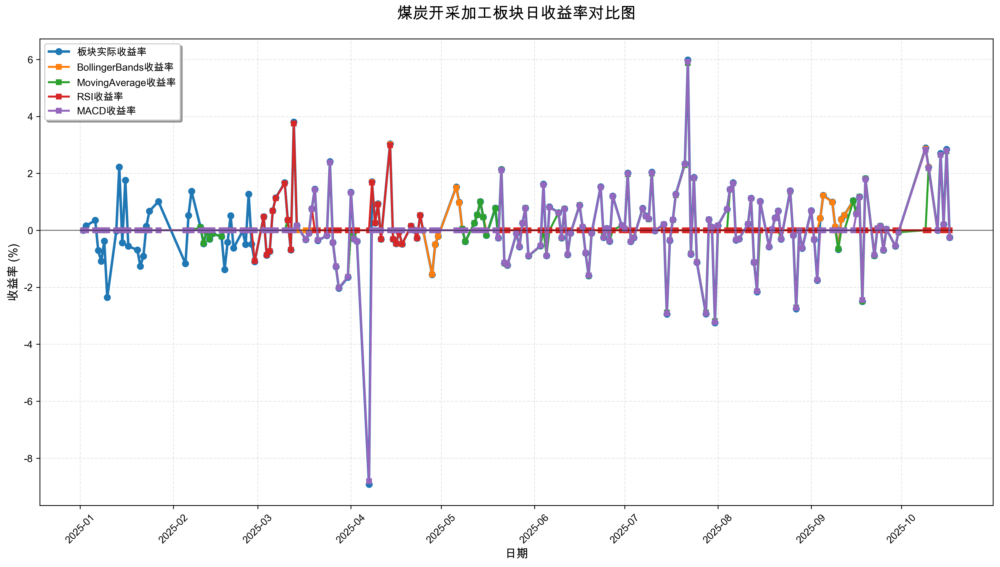
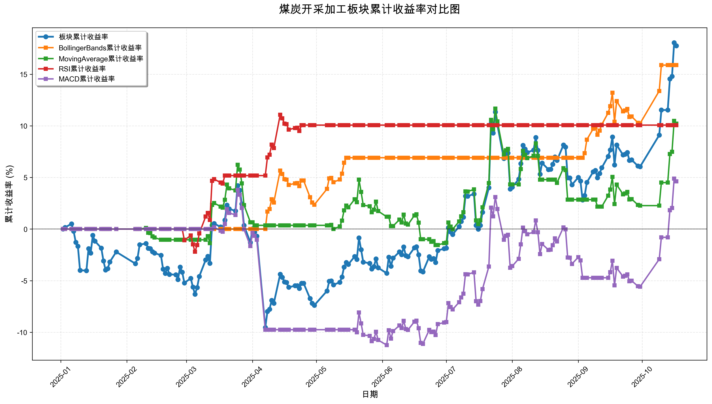

# 策略回测结果报告

**生成时间**: 2025-10-19 19:02:10
**行业板块**: 煤炭开采加工
**回测期间**: 20250101 至 20251017
**策略数量**: 4

## 📈 分析结论

### 策略表现分析
- **最佳策略**: BollingerBands (总收益率: 15.88%)
- **最差策略**: MACD (总收益率: 4.63%)
### 交易活跃度分析
- **活跃策略**: 4 个
- **非活跃策略**: 0 个
- **最活跃策略**: MovingAverage (交易次数: 25)
### 🚨 异动提醒分析
- 未检测到明显异动情况
### 风险分析
- **BollingerBands**: 最大回撤 -3.13%, 夏普比率 2.6202
- **MovingAverage**: 最大回撤 -8.50%, 夏普比率 0.8655
- **RSI**: 最大回撤 -2.20%, 夏普比率 1.9639
- **MACD**: 最大回撤 -14.48%, 夏普比率 0.3235

## 📊 综合结果表

| 策略名称           | 初始资金     | 最终价值     | 总收益率   | 年化收益率   | 波动率    |   夏普比率 | 最大回撤    | 总交易次数   | 买入次数   | 卖出次数   | 总交易金额      | 平均交易金额   | 交易频率   |   数据点数 |
|:---------------|:---------|:---------|:-------|:--------|:-------|-------:|:--------|:--------|:-------|:-------|:-----------|:---------|:-------|-------:|
| 板块实际表现         | ¥100,000 | ¥117,750 | 17.75% | 24.20%  | 21.85% | 1.1077 | -13.19% | N/A     | N/A    | N/A    | N/A        | N/A      | N/A    |    190 |
| BollingerBands | ¥100,000 | ¥115,876 | 15.88% | 21.58%  | 8.24%  | 2.6202 | -3.13%  | 4       | 2      | 2      | ¥426,024   | ¥106,506 | 0.02   |    190 |
| MovingAverage  | ¥100,000 | ¥110,208 | 10.21% | 13.76%  | 15.90% | 0.8655 | -8.50%  | 25      | 13     | 12     | ¥2,502,047 | ¥100,082 | 0.13   |    190 |
| RSI            | ¥100,000 | ¥110,074 | 10.07% | 13.58%  | 6.91%  | 1.9639 | -2.20%  | 4       | 2      | 2      | ¥413,935   | ¥103,484 | 0.02   |    190 |
| MACD           | ¥100,000 | ¥104,625 | 4.63%  | 6.18%   | 19.11% | 0.3235 | -14.48% | 5       | 3      | 2      | ¥465,045   | ¥93,009  | 0.03   |    190 |

## 📊 每日收益率走势图

*图1: 煤炭开采加工板块每日收益率走势对比*

## 📈 累计收益率走势图

*图2: 煤炭开采加工板块累计收益率走势对比*

## 📅 日收益明细表

| 日期         | 板块实际收益率   | BollingerBands收益率   | MovingAverage收益率   | RSI收益率   | MACD收益率   |
|:-----------|:----------|:--------------------|:-------------------|:---------|:----------|
| 2025-01-02 | 0.00%     | 0.00%               | 0.00%              | 0.00%    | 0.00%     |
| 2025-01-03 | 0.16%     | 0.00%               | 0.00%              | 0.00%    | 0.00%     |
| 2025-01-06 | 0.35%     | 0.00%               | 0.00%              | 0.00%    | 0.00%     |
| 2025-01-07 | -0.71%    | 0.00%               | 0.00%              | 0.00%    | 0.00%     |
| 2025-01-08 | -1.09%    | 0.00%               | 0.00%              | 0.00%    | 0.00%     |
| 2025-01-09 | -0.38%    | 0.00%               | 0.00%              | 0.00%    | 0.00%     |
| 2025-01-10 | -2.36%    | 0.00%               | 0.00%              | 0.00%    | 0.00%     |
| 2025-01-13 | -0.03%    | 0.00%               | 0.00%              | 0.00%    | 0.00%     |
| 2025-01-14 | 2.22%     | 0.00%               | 0.00%              | 0.00%    | 0.00%     |
| 2025-01-15 | -0.44%    | 0.00%               | 0.00%              | 0.00%    | 0.00%     |
| 2025-01-16 | 1.76%     | 0.00%               | 0.00%              | 0.00%    | 0.00%     |
| 2025-01-17 | -0.56%    | 0.00%               | 0.00%              | 0.00%    | 0.00%     |
| 2025-01-20 | -0.69%    | 0.00%               | 0.00%              | 0.00%    | 0.00%     |
| 2025-01-21 | -1.26%    | 0.00%               | 0.00%              | 0.00%    | 0.00%     |
| 2025-01-22 | -0.91%    | 0.00%               | 0.00%              | 0.00%    | 0.00%     |
| 2025-01-23 | 0.14%     | 0.00%               | 0.00%              | 0.00%    | 0.00%     |
| 2025-01-24 | 0.67%     | 0.00%               | 0.00%              | 0.00%    | 0.00%     |
| 2025-01-27 | 1.01%     | 0.00%               | 0.00%              | 0.00%    | 0.00%     |
| 2025-02-05 | -1.17%    | 0.00%               | 0.00%              | 0.00%    | 0.00%     |
| 2025-02-06 | 0.52%     | 0.00%               | 0.00%              | 0.00%    | 0.00%     |
| 2025-02-07 | 1.37%     | 0.00%               | 0.00%              | 0.00%    | 0.00%     |
| 2025-02-10 | 0.11%     | 0.00%               | 0.11%              | 0.00%    | 0.00%     |
| 2025-02-11 | -0.47%    | 0.00%               | -0.46%             | 0.00%    | 0.00%     |
| 2025-02-12 | -0.04%    | 0.00%               | -0.04%             | 0.00%    | 0.00%     |
| 2025-02-13 | -0.31%    | 0.00%               | -0.31%             | 0.00%    | 0.00%     |
| 2025-02-14 | -0.12%    | 0.00%               | -0.12%             | 0.00%    | 0.00%     |
| 2025-02-17 | -0.22%    | 0.00%               | -0.22%             | 0.00%    | 0.00%     |
| 2025-02-18 | -1.38%    | 0.00%               | 0.00%              | 0.00%    | 0.00%     |
| 2025-02-19 | -0.42%    | 0.00%               | 0.00%              | 0.00%    | 0.00%     |
| 2025-02-20 | 0.51%     | 0.00%               | 0.00%              | 0.00%    | 0.00%     |
| 2025-02-21 | -0.62%    | 0.00%               | 0.00%              | 0.00%    | 0.00%     |
| 2025-02-24 | -0.03%    | 0.00%               | 0.00%              | 0.00%    | 0.00%     |
| 2025-02-25 | -0.50%    | 0.00%               | 0.00%              | 0.00%    | 0.00%     |
| 2025-02-26 | 1.27%     | 0.00%               | 0.00%              | 0.00%    | 0.00%     |
| 2025-02-27 | -0.49%    | 0.00%               | 0.00%              | 0.00%    | 0.00%     |
| 2025-02-28 | -1.10%    | 0.00%               | 0.00%              | -1.08%   | 0.00%     |
| 2025-03-03 | 0.48%     | 0.00%               | 0.00%              | 0.47%    | 0.00%     |
| 2025-03-04 | -0.88%    | 0.00%               | 0.00%              | -0.87%   | 0.00%     |
| 2025-03-05 | -0.74%    | 0.00%               | 0.00%              | -0.73%   | 0.00%     |
| 2025-03-06 | 0.69%     | 0.00%               | 0.00%              | 0.68%    | 0.00%     |
| 2025-03-07 | 1.14%     | 0.00%               | 0.00%              | 1.13%    | 0.00%     |
| 2025-03-10 | 1.67%     | 0.00%               | 0.00%              | 1.65%    | 0.00%     |
| 2025-03-11 | 0.36%     | 0.00%               | 0.36%              | 0.36%    | 0.00%     |
| 2025-03-12 | -0.69%    | 0.00%               | -0.68%             | -0.68%   | 0.00%     |
| 2025-03-13 | 3.80%     | 0.00%               | 3.75%              | 3.75%    | 0.00%     |
| 2025-03-14 | 0.17%     | 0.00%               | 0.17%              | 0.17%    | 0.17%     |
| 2025-03-17 | -0.33%    | 0.00%               | -0.33%             | -0.33%   | -0.33%    |
| 2025-03-18 | -0.10%    | 0.00%               | -0.10%             | -0.10%   | -0.10%    |
| 2025-03-19 | 0.76%     | 0.00%               | 0.75%              | 0.75%    | 0.75%     |
| 2025-03-20 | 1.45%     | 0.00%               | 1.43%              | 0.00%    | 1.43%     |
| 2025-03-21 | -0.36%    | 0.00%               | -0.35%             | 0.00%    | -0.35%    |
| 2025-03-24 | -0.19%    | 0.00%               | -0.19%             | 0.00%    | -0.19%    |
| 2025-03-25 | 2.41%     | 0.00%               | 2.38%              | 0.00%    | 2.38%     |
| 2025-03-26 | -0.43%    | 0.00%               | -0.43%             | 0.00%    | -0.43%    |
| 2025-03-27 | -1.28%    | 0.00%               | -1.26%             | 0.00%    | -1.26%    |
| 2025-03-28 | -2.04%    | 0.00%               | -2.01%             | 0.00%    | -2.02%    |
| 2025-03-31 | -1.65%    | 0.00%               | -1.63%             | 0.00%    | -1.63%    |
| 2025-04-01 | 1.34%     | 0.00%               | 0.00%              | 0.00%    | 1.32%     |
| 2025-04-02 | -0.30%    | 0.00%               | -0.30%             | 0.00%    | -0.30%    |
| 2025-04-03 | -0.39%    | 0.00%               | 0.00%              | 0.00%    | -0.39%    |
| 2025-04-07 | -8.92%    | 0.00%               | 0.00%              | 0.00%    | -8.81%    |
| 2025-04-08 | 1.71%     | 1.69%               | 0.00%              | 1.67%    | 0.00%     |
| 2025-04-09 | 0.25%     | 0.25%               | 0.00%              | 0.25%    | 0.00%     |
| 2025-04-10 | 0.93%     | 0.92%               | 0.00%              | 0.91%    | 0.00%     |
| 2025-04-11 | -0.31%    | -0.31%              | 0.00%              | -0.31%   | 0.00%     |
| 2025-04-14 | 3.04%     | 3.02%               | 0.00%              | 2.99%    | 0.00%     |
| 2025-04-15 | -0.31%    | -0.31%              | 0.00%              | -0.31%   | 0.00%     |
| 2025-04-16 | -0.47%    | -0.47%              | 0.00%              | -0.46%   | 0.00%     |
| 2025-04-17 | -0.06%    | -0.06%              | 0.00%              | -0.06%   | 0.00%     |
| 2025-04-18 | -0.49%    | -0.49%              | 0.00%              | -0.48%   | 0.00%     |
| 2025-04-21 | 0.15%     | 0.15%               | 0.00%              | 0.15%    | 0.00%     |
| 2025-04-22 | 0.01%     | 0.01%               | 0.00%              | 0.01%    | 0.00%     |
| 2025-04-23 | -0.28%    | -0.28%              | 0.00%              | -0.28%   | 0.00%     |
| 2025-04-24 | 0.53%     | 0.53%               | 0.00%              | 0.52%    | 0.00%     |
| 2025-04-25 | 0.00%     | 0.00%               | 0.00%              | 0.00%    | 0.00%     |
| 2025-04-28 | -1.56%    | -1.55%              | 0.00%              | 0.00%    | 0.00%     |
| 2025-04-29 | -0.50%    | -0.50%              | 0.00%              | 0.00%    | 0.00%     |
| 2025-04-30 | -0.21%    | -0.21%              | 0.00%              | 0.00%    | 0.00%     |
| 2025-05-06 | 1.52%     | 1.50%               | 0.00%              | 0.00%    | 0.00%     |
| 2025-05-07 | 0.98%     | 0.97%               | 0.00%              | 0.00%    | 0.00%     |
| 2025-05-08 | 0.05%     | 0.05%               | 0.05%              | 0.00%    | 0.00%     |
| 2025-05-09 | -0.40%    | -0.40%              | -0.40%             | 0.00%    | 0.00%     |
| 2025-05-12 | 0.25%     | 0.25%               | 0.25%              | 0.00%    | 0.00%     |
| 2025-05-13 | 0.55%     | 0.54%               | 0.54%              | 0.00%    | 0.00%     |
| 2025-05-14 | 1.01%     | 1.00%               | 1.00%              | 0.00%    | 0.00%     |
| 2025-05-15 | 0.46%     | 0.46%               | 0.46%              | 0.00%    | 0.00%     |
| 2025-05-16 | -0.18%    | 0.00%               | -0.18%             | 0.00%    | 0.00%     |
| 2025-05-19 | 0.78%     | 0.00%               | 0.77%              | 0.00%    | 0.00%     |
| 2025-05-20 | -0.27%    | 0.00%               | -0.27%             | 0.00%    | -0.27%    |
| 2025-05-21 | 2.14%     | 0.00%               | 2.13%              | 0.00%    | 2.11%     |
| 2025-05-22 | -1.15%    | 0.00%               | -1.15%             | 0.00%    | -1.14%    |
| 2025-05-23 | -1.23%    | 0.00%               | -1.23%             | 0.00%    | -1.22%    |
| 2025-05-26 | -0.11%    | 0.00%               | -0.11%             | 0.00%    | -0.11%    |
| 2025-05-27 | -0.58%    | 0.00%               | -0.57%             | 0.00%    | -0.57%    |
| 2025-05-28 | 0.25%     | 0.00%               | 0.25%              | 0.00%    | 0.25%     |
| 2025-05-29 | 0.78%     | 0.00%               | 0.78%              | 0.00%    | 0.77%     |
| 2025-05-30 | -0.90%    | 0.00%               | -0.90%             | 0.00%    | -0.89%    |
| 2025-06-03 | -0.55%    | 0.00%               | -0.55%             | 0.00%    | -0.54%    |
| 2025-06-04 | 1.62%     | 0.00%               | 0.00%              | 0.00%    | 1.60%     |
| 2025-06-05 | -0.89%    | 0.00%               | -0.89%             | 0.00%    | -0.89%    |
| 2025-06-06 | 0.82%     | 0.00%               | 0.00%              | 0.00%    | 0.81%     |
| 2025-06-09 | 0.62%     | 0.00%               | 0.62%              | 0.00%    | 0.61%     |
| 2025-06-10 | -0.27%    | 0.00%               | -0.27%             | 0.00%    | -0.26%    |
| 2025-06-11 | 0.76%     | 0.00%               | 0.76%              | 0.00%    | 0.75%     |
| 2025-06-12 | -0.86%    | 0.00%               | -0.86%             | 0.00%    | -0.85%    |
| 2025-06-13 | -0.10%    | 0.00%               | -0.10%             | 0.00%    | -0.10%    |
| 2025-06-16 | 0.88%     | 0.00%               | 0.88%              | 0.00%    | 0.87%     |
| 2025-06-17 | 0.12%     | 0.00%               | 0.12%              | 0.00%    | 0.12%     |
| 2025-06-18 | -0.80%    | 0.00%               | -0.80%             | 0.00%    | -0.79%    |
| 2025-06-19 | -1.60%    | 0.00%               | -1.60%             | 0.00%    | -1.58%    |
| 2025-06-20 | -0.10%    | 0.00%               | 0.00%              | 0.00%    | -0.10%    |
| 2025-06-23 | 1.53%     | 0.00%               | 0.00%              | 0.00%    | 1.51%     |
| 2025-06-24 | -0.25%    | 0.00%               | -0.25%             | 0.00%    | -0.25%    |
| 2025-06-25 | 0.07%     | 0.00%               | 0.07%              | 0.00%    | 0.07%     |
| 2025-06-26 | -0.39%    | 0.00%               | -0.38%             | 0.00%    | -0.38%    |
| 2025-06-27 | 1.20%     | 0.00%               | 0.00%              | 0.00%    | 1.19%     |
| 2025-06-30 | 0.17%     | 0.00%               | 0.17%              | 0.00%    | 0.17%     |
| 2025-07-01 | 0.06%     | 0.00%               | 0.06%              | 0.00%    | 0.06%     |
| 2025-07-02 | 2.01%     | 0.00%               | 1.97%              | 0.00%    | 1.99%     |
| 2025-07-03 | -0.40%    | 0.00%               | -0.40%             | 0.00%    | -0.40%    |
| 2025-07-04 | -0.26%    | 0.00%               | -0.25%             | 0.00%    | -0.26%    |
| 2025-07-07 | 0.77%     | 0.00%               | 0.75%              | 0.00%    | 0.76%     |
| 2025-07-08 | 0.50%     | 0.00%               | 0.49%              | 0.00%    | 0.49%     |
| 2025-07-09 | 0.40%     | 0.00%               | 0.39%              | 0.00%    | 0.40%     |
| 2025-07-10 | 2.04%     | 0.00%               | 1.99%              | 0.00%    | 2.02%     |
| 2025-07-11 | -0.02%    | 0.00%               | -0.02%             | 0.00%    | -0.02%    |
| 2025-07-14 | 0.21%     | 0.00%               | 0.20%              | 0.00%    | 0.21%     |
| 2025-07-15 | -2.95%    | 0.00%               | -2.89%             | 0.00%    | -2.92%    |
| 2025-07-16 | -0.36%    | 0.00%               | -0.35%             | 0.00%    | -0.35%    |
| 2025-07-17 | 0.37%     | 0.00%               | 0.36%              | 0.00%    | 0.37%     |
| 2025-07-18 | 1.27%     | 0.00%               | 1.24%              | 0.00%    | 1.25%     |
| 2025-07-21 | 2.34%     | 0.00%               | 2.29%              | 0.00%    | 2.32%     |
| 2025-07-22 | 5.98%     | 0.00%               | 5.87%              | 0.00%    | 5.92%     |
| 2025-07-23 | -0.84%    | 0.00%               | -0.82%             | 0.00%    | -0.83%    |
| 2025-07-24 | 1.86%     | 0.00%               | 1.83%              | 0.00%    | 1.84%     |
| 2025-07-25 | -1.13%    | 0.00%               | -1.11%             | 0.00%    | -1.12%    |
| 2025-07-28 | -2.94%    | 0.00%               | -2.89%             | 0.00%    | -2.92%    |
| 2025-07-29 | 0.38%     | 0.00%               | 0.38%              | 0.00%    | 0.38%     |
| 2025-07-30 | 0.11%     | 0.00%               | 0.11%              | 0.00%    | 0.11%     |
| 2025-07-31 | -3.25%    | 0.00%               | -3.19%             | 0.00%    | -3.22%    |
| 2025-08-01 | 0.17%     | 0.00%               | 0.00%              | 0.00%    | 0.17%     |
| 2025-08-04 | 0.74%     | 0.00%               | 0.00%              | 0.00%    | 0.74%     |
| 2025-08-05 | 1.44%     | 0.00%               | 1.43%              | 0.00%    | 1.43%     |
| 2025-08-06 | 1.67%     | 0.00%               | 1.65%              | 0.00%    | 1.65%     |
| 2025-08-07 | -0.35%    | 0.00%               | -0.34%             | 0.00%    | -0.34%    |
| 2025-08-08 | -0.30%    | 0.00%               | -0.30%             | 0.00%    | -0.30%    |
| 2025-08-11 | 0.22%     | 0.00%               | 0.22%              | 0.00%    | 0.22%     |
| 2025-08-12 | 1.13%     | 0.00%               | 1.12%              | 0.00%    | 1.12%     |
| 2025-08-13 | -1.13%    | 0.00%               | -1.12%             | 0.00%    | -1.12%    |
| 2025-08-14 | -2.16%    | 0.00%               | -2.14%             | 0.00%    | -2.14%    |
| 2025-08-15 | 1.02%     | 0.00%               | 0.00%              | 0.00%    | 1.01%     |
| 2025-08-18 | -0.58%    | 0.00%               | 0.00%              | 0.00%    | -0.58%    |
| 2025-08-19 | 0.03%     | 0.00%               | 0.00%              | 0.00%    | 0.03%     |
| 2025-08-20 | 0.44%     | 0.00%               | 0.00%              | 0.00%    | 0.43%     |
| 2025-08-21 | 0.68%     | 0.00%               | 0.00%              | 0.00%    | 0.67%     |
| 2025-08-22 | -0.31%    | 0.00%               | -0.30%             | 0.00%    | -0.30%    |
| 2025-08-25 | 1.39%     | 0.00%               | 1.36%              | 0.00%    | 1.38%     |
| 2025-08-26 | -0.18%    | 0.00%               | -0.18%             | 0.00%    | -0.18%    |
| 2025-08-27 | -2.76%    | 0.00%               | -2.71%             | 0.00%    | -2.73%    |
| 2025-08-28 | -0.02%    | 0.00%               | 0.00%              | 0.00%    | -0.02%    |
| 2025-08-29 | -0.63%    | 0.00%               | 0.00%              | 0.00%    | -0.62%    |
| 2025-09-01 | 0.69%     | 0.00%               | 0.00%              | 0.00%    | 0.68%     |
| 2025-09-02 | -0.33%    | 0.00%               | 0.00%              | 0.00%    | -0.32%    |
| 2025-09-03 | -1.76%    | 0.00%               | 0.00%              | 0.00%    | -1.74%    |
| 2025-09-04 | 0.42%     | 0.42%               | 0.00%              | 0.00%    | 0.00%     |
| 2025-09-05 | 1.23%     | 1.22%               | 0.00%              | 0.00%    | 0.00%     |
| 2025-09-08 | 0.99%     | 0.98%               | 0.00%              | 0.00%    | 0.00%     |
| 2025-09-09 | 0.12%     | 0.12%               | 0.00%              | 0.00%    | 0.00%     |
| 2025-09-10 | -0.67%    | -0.66%              | -0.66%             | 0.00%    | 0.00%     |
| 2025-09-11 | 0.39%     | 0.38%               | 0.00%              | 0.00%    | 0.00%     |
| 2025-09-12 | 0.53%     | 0.53%               | 0.00%              | 0.00%    | 0.00%     |
| 2025-09-15 | 1.04%     | 1.03%               | 1.03%              | 0.00%    | 0.00%     |
| 2025-09-16 | 0.58%     | 0.58%               | 0.58%              | 0.00%    | 0.57%     |
| 2025-09-17 | 1.18%     | 1.17%               | 1.18%              | 0.00%    | 1.16%     |
| 2025-09-18 | -2.50%    | -2.48%              | -2.50%             | 0.00%    | -2.45%    |
| 2025-09-19 | 1.82%     | 1.81%               | 1.82%              | 0.00%    | 1.79%     |
| 2025-09-22 | -0.89%    | -0.88%              | -0.89%             | 0.00%    | -0.87%    |
| 2025-09-23 | 0.07%     | 0.07%               | 0.07%              | 0.00%    | 0.07%     |
| 2025-09-24 | 0.15%     | 0.14%               | 0.15%              | 0.00%    | 0.14%     |
| 2025-09-25 | -0.70%    | -0.70%              | -0.70%             | 0.00%    | -0.69%    |
| 2025-09-26 | 0.04%     | 0.04%               | 0.04%              | 0.00%    | 0.04%     |
| 2025-09-29 | -0.56%    | -0.55%              | -0.56%             | 0.00%    | -0.55%    |
| 2025-09-30 | -0.07%    | -0.07%              | -0.07%             | 0.00%    | -0.06%    |
| 2025-10-09 | 2.89%     | 2.86%               | 0.00%              | 0.00%    | 2.83%     |
| 2025-10-10 | 2.22%     | 2.20%               | 2.18%              | 0.00%    | 2.18%     |
| 2025-10-13 | 0.00%     | 0.00%               | 0.00%              | 0.00%    | 0.00%     |
| 2025-10-14 | 2.70%     | 0.00%               | 2.65%              | 0.00%    | 2.65%     |
| 2025-10-15 | 0.21%     | 0.00%               | 0.20%              | 0.00%    | 0.20%     |
| 2025-10-16 | 2.84%     | 0.00%               | 2.78%              | 0.00%    | 2.79%     |
| 2025-10-17 | -0.25%    | 0.00%               | -0.25%             | 0.00%    | -0.25%    |

## 📊 日收益统计摘要

| 指标                | 平均日收益率   | 最大日收益率   | 最小日收益率   | 正收益天数   | 负收益天数   |
|:------------------|:---------|:---------|:---------|:--------|:--------|
| 板块实际收益率           | 0.10%    | 5.98%    | -8.92%   | 95天     | 92天     |
| BollingerBands收益率 | 0.08%    | 3.02%    | -2.48%   | 29天     | 16天     |
| MovingAverage收益率  | 0.06%    | 5.87%    | -3.19%   | 52天     | 55天     |
| RSI收益率            | 0.05%    | 3.75%    | -1.08%   | 15天     | 12天     |
| MACD收益率           | 0.03%    | 5.92%    | -8.81%   | 55天     | 54天     |

## 📈 累计收益明细表

| 日期         | 板块累计收益率   | BollingerBands累计收益率   | MovingAverage累计收益率   | RSI累计收益率   | MACD累计收益率   |
|:-----------|:----------|:----------------------|:---------------------|:-----------|:------------|
| 2025-01-02 | 0.00%     | 0.00%                 | 0.00%                | 0.00%      | 0.00%       |
| 2025-01-03 | 0.16%     | 0.00%                 | 0.00%                | 0.00%      | 0.00%       |
| 2025-01-06 | 0.51%     | 0.00%                 | 0.00%                | 0.00%      | 0.00%       |
| 2025-01-07 | -0.20%    | 0.00%                 | 0.00%                | 0.00%      | 0.00%       |
| 2025-01-08 | -1.29%    | 0.00%                 | 0.00%                | 0.00%      | 0.00%       |
| 2025-01-09 | -1.67%    | 0.00%                 | 0.00%                | 0.00%      | 0.00%       |
| 2025-01-10 | -3.99%    | 0.00%                 | 0.00%                | 0.00%      | 0.00%       |
| 2025-01-13 | -4.03%    | 0.00%                 | 0.00%                | 0.00%      | 0.00%       |
| 2025-01-14 | -1.90%    | 0.00%                 | 0.00%                | 0.00%      | 0.00%       |
| 2025-01-15 | -2.33%    | 0.00%                 | 0.00%                | 0.00%      | 0.00%       |
| 2025-01-16 | -0.61%    | 0.00%                 | 0.00%                | 0.00%      | 0.00%       |
| 2025-01-17 | -1.17%    | 0.00%                 | 0.00%                | 0.00%      | 0.00%       |
| 2025-01-20 | -1.84%    | 0.00%                 | 0.00%                | 0.00%      | 0.00%       |
| 2025-01-21 | -3.08%    | 0.00%                 | 0.00%                | 0.00%      | 0.00%       |
| 2025-01-22 | -3.96%    | 0.00%                 | 0.00%                | 0.00%      | 0.00%       |
| 2025-01-23 | -3.83%    | 0.00%                 | 0.00%                | 0.00%      | 0.00%       |
| 2025-01-24 | -3.18%    | 0.00%                 | 0.00%                | 0.00%      | 0.00%       |
| 2025-01-27 | -2.21%    | 0.00%                 | 0.00%                | 0.00%      | 0.00%       |
| 2025-02-05 | -3.35%    | 0.00%                 | 0.00%                | 0.00%      | 0.00%       |
| 2025-02-06 | -2.84%    | 0.00%                 | 0.00%                | 0.00%      | 0.00%       |
| 2025-02-07 | -1.51%    | 0.00%                 | 0.00%                | 0.00%      | 0.00%       |
| 2025-02-10 | -1.40%    | 0.00%                 | 0.11%                | 0.00%      | 0.00%       |
| 2025-02-11 | -1.86%    | 0.00%                 | -0.35%               | 0.00%      | 0.00%       |
| 2025-02-12 | -1.90%    | 0.00%                 | -0.39%               | 0.00%      | 0.00%       |
| 2025-02-13 | -2.20%    | 0.00%                 | -0.70%               | 0.00%      | 0.00%       |
| 2025-02-14 | -2.32%    | 0.00%                 | -0.82%               | 0.00%      | 0.00%       |
| 2025-02-17 | -2.54%    | 0.00%                 | -1.04%               | 0.00%      | 0.00%       |
| 2025-02-18 | -3.88%    | 0.00%                 | -1.04%               | 0.00%      | 0.00%       |
| 2025-02-19 | -4.29%    | 0.00%                 | -1.04%               | 0.00%      | 0.00%       |
| 2025-02-20 | -3.80%    | 0.00%                 | -1.04%               | 0.00%      | 0.00%       |
| 2025-02-21 | -4.39%    | 0.00%                 | -1.04%               | 0.00%      | 0.00%       |
| 2025-02-24 | -4.42%    | 0.00%                 | -1.04%               | 0.00%      | 0.00%       |
| 2025-02-25 | -4.89%    | 0.00%                 | -1.04%               | 0.00%      | 0.00%       |
| 2025-02-26 | -3.69%    | 0.00%                 | -1.04%               | 0.00%      | 0.00%       |
| 2025-02-27 | -4.17%    | 0.00%                 | -1.04%               | 0.00%      | 0.00%       |
| 2025-02-28 | -5.22%    | 0.00%                 | -1.04%               | -1.08%     | 0.00%       |
| 2025-03-03 | -4.77%    | 0.00%                 | -1.04%               | -0.62%     | 0.00%       |
| 2025-03-04 | -5.61%    | 0.00%                 | -1.04%               | -1.48%     | 0.00%       |
| 2025-03-05 | -6.31%    | 0.00%                 | -1.04%               | -2.20%     | 0.00%       |
| 2025-03-06 | -5.66%    | 0.00%                 | -1.04%               | -1.54%     | 0.00%       |
| 2025-03-07 | -4.59%    | 0.00%                 | -1.04%               | -0.43%     | 0.00%       |
| 2025-03-10 | -2.99%    | 0.00%                 | -1.04%               | 1.21%      | 0.00%       |
| 2025-03-11 | -2.64%    | 0.00%                 | -0.68%               | 1.57%      | 0.00%       |
| 2025-03-12 | -3.31%    | 0.00%                 | -1.36%               | 0.88%      | 0.00%       |
| 2025-03-13 | 0.37%     | 0.00%                 | 2.34%                | 4.67%      | 0.00%       |
| 2025-03-14 | 0.54%     | 0.00%                 | 2.52%                | 4.84%      | 0.17%       |
| 2025-03-17 | 0.20%     | 0.00%                 | 2.18%                | 4.50%      | -0.16%      |
| 2025-03-18 | 0.10%     | 0.00%                 | 2.08%                | 4.40%      | -0.26%      |
| 2025-03-19 | 0.86%     | 0.00%                 | 2.84%                | 5.18%      | 0.49%       |
| 2025-03-20 | 2.32%     | 0.00%                 | 4.31%                | 5.18%      | 1.92%       |
| 2025-03-21 | 1.96%     | 0.00%                 | 3.94%                | 5.18%      | 1.56%       |
| 2025-03-24 | 1.76%     | 0.00%                 | 3.75%                | 5.18%      | 1.37%       |
| 2025-03-25 | 4.21%     | 0.00%                 | 6.22%                | 5.18%      | 3.79%       |
| 2025-03-26 | 3.76%     | 0.00%                 | 5.76%                | 5.18%      | 3.34%       |
| 2025-03-27 | 2.44%     | 0.00%                 | 4.43%                | 5.18%      | 2.04%       |
| 2025-03-28 | 0.35%     | 0.00%                 | 2.33%                | 5.18%      | -0.02%      |
| 2025-03-31 | -1.30%    | 0.00%                 | 0.66%                | 5.18%      | -1.65%      |
| 2025-04-01 | 0.02%     | 0.00%                 | 0.66%                | 5.18%      | -0.35%      |
| 2025-04-02 | -0.29%    | 0.00%                 | 0.36%                | 5.18%      | -0.65%      |
| 2025-04-03 | -0.68%    | 0.00%                 | 0.36%                | 5.18%      | -1.03%      |
| 2025-04-07 | -9.54%    | 0.00%                 | 0.36%                | 5.18%      | -9.75%      |
| 2025-04-08 | -7.99%    | 1.69%                 | 0.36%                | 6.94%      | -9.75%      |
| 2025-04-09 | -7.76%    | 1.95%                 | 0.36%                | 7.20%      | -9.75%      |
| 2025-04-10 | -6.90%    | 2.89%                 | 0.36%                | 8.18%      | -9.75%      |
| 2025-04-11 | -7.19%    | 2.57%                 | 0.36%                | 7.85%      | -9.75%      |
| 2025-04-14 | -4.37%    | 5.67%                 | 0.36%                | 11.07%     | -9.75%      |
| 2025-04-15 | -4.67%    | 5.34%                 | 0.36%                | 10.73%     | -9.75%      |
| 2025-04-16 | -5.12%    | 4.84%                 | 0.36%                | 10.22%     | -9.75%      |
| 2025-04-17 | -5.17%    | 4.79%                 | 0.36%                | 10.16%     | -9.75%      |
| 2025-04-18 | -5.64%    | 4.28%                 | 0.36%                | 9.63%      | -9.75%      |
| 2025-04-21 | -5.49%    | 4.43%                 | 0.36%                | 9.79%      | -9.75%      |
| 2025-04-22 | -5.48%    | 4.45%                 | 0.36%                | 9.81%      | -9.75%      |
| 2025-04-23 | -5.75%    | 4.16%                 | 0.36%                | 9.50%      | -9.75%      |
| 2025-04-24 | -5.25%    | 4.70%                 | 0.36%                | 10.07%     | -9.75%      |
| 2025-04-25 | -5.25%    | 4.70%                 | 0.36%                | 10.07%     | -9.75%      |
| 2025-04-28 | -6.72%    | 3.09%                 | 0.36%                | 10.07%     | -9.75%      |
| 2025-04-29 | -7.19%    | 2.57%                 | 0.36%                | 10.07%     | -9.75%      |
| 2025-04-30 | -7.39%    | 2.35%                 | 0.36%                | 10.07%     | -9.75%      |
| 2025-05-06 | -5.99%    | 3.89%                 | 0.36%                | 10.07%     | -9.75%      |
| 2025-05-07 | -5.06%    | 4.91%                 | 0.36%                | 10.07%     | -9.75%      |
| 2025-05-08 | -5.02%    | 4.96%                 | 0.41%                | 10.07%     | -9.75%      |
| 2025-05-09 | -5.40%    | 4.54%                 | 0.01%                | 10.07%     | -9.75%      |
| 2025-05-12 | -5.16%    | 4.80%                 | 0.26%                | 10.07%     | -9.75%      |
| 2025-05-13 | -4.64%    | 5.37%                 | 0.81%                | 10.07%     | -9.75%      |
| 2025-05-14 | -3.68%    | 6.42%                 | 1.81%                | 10.07%     | -9.75%      |
| 2025-05-15 | -3.24%    | 6.91%                 | 2.28%                | 10.07%     | -9.75%      |
| 2025-05-16 | -3.41%    | 6.91%                 | 2.10%                | 10.07%     | -9.75%      |
| 2025-05-19 | -2.66%    | 6.91%                 | 2.89%                | 10.07%     | -9.75%      |
| 2025-05-20 | -2.93%    | 6.91%                 | 2.61%                | 10.07%     | -10.00%     |
| 2025-05-21 | -0.85%    | 6.91%                 | 4.79%                | 10.07%     | -8.09%      |
| 2025-05-22 | -2.00%    | 6.91%                 | 3.59%                | 10.07%     | -9.14%      |
| 2025-05-23 | -3.20%    | 6.91%                 | 2.32%                | 10.07%     | -10.25%     |
| 2025-05-26 | -3.31%    | 6.91%                 | 2.21%                | 10.07%     | -10.35%     |
| 2025-05-27 | -3.87%    | 6.91%                 | 1.62%                | 10.07%     | -10.86%     |
| 2025-05-28 | -3.63%    | 6.91%                 | 1.87%                | 10.07%     | -10.64%     |
| 2025-05-29 | -2.88%    | 6.91%                 | 2.66%                | 10.07%     | -9.95%      |
| 2025-05-30 | -3.75%    | 6.91%                 | 1.74%                | 10.07%     | -10.75%     |
| 2025-06-03 | -4.28%    | 6.91%                 | 1.19%                | 10.07%     | -11.24%     |
| 2025-06-04 | -2.73%    | 6.91%                 | 1.19%                | 10.07%     | -9.81%      |
| 2025-06-05 | -3.60%    | 6.91%                 | 0.29%                | 10.07%     | -10.61%     |
| 2025-06-06 | -2.81%    | 6.91%                 | 0.29%                | 10.07%     | -9.89%      |
| 2025-06-09 | -2.21%    | 6.91%                 | 0.91%                | 10.07%     | -9.34%      |
| 2025-06-10 | -2.47%    | 6.91%                 | 0.64%                | 10.07%     | -9.58%      |
| 2025-06-11 | -1.73%    | 6.91%                 | 1.40%                | 10.07%     | -8.90%      |
| 2025-06-12 | -2.58%    | 6.91%                 | 0.53%                | 10.07%     | -9.68%      |
| 2025-06-13 | -2.68%    | 6.91%                 | 0.43%                | 10.07%     | -9.77%      |
| 2025-06-16 | -1.82%    | 6.91%                 | 1.31%                | 10.07%     | -8.98%      |
| 2025-06-17 | -1.71%    | 6.91%                 | 1.43%                | 10.07%     | -8.88%      |
| 2025-06-18 | -2.49%    | 6.91%                 | 0.62%                | 10.07%     | -9.60%      |
| 2025-06-19 | -4.05%    | 6.91%                 | -0.99%               | 10.07%     | -11.03%     |
| 2025-06-20 | -4.15%    | 6.91%                 | -0.99%               | 10.07%     | -11.12%     |
| 2025-06-23 | -2.68%    | 6.91%                 | -0.99%               | 10.07%     | -9.77%      |
| 2025-06-24 | -2.92%    | 6.91%                 | -1.23%               | 10.07%     | -9.99%      |
| 2025-06-25 | -2.85%    | 6.91%                 | -1.16%               | 10.07%     | -9.93%      |
| 2025-06-26 | -3.23%    | 6.91%                 | -1.54%               | 10.07%     | -10.27%     |
| 2025-06-27 | -2.07%    | 6.91%                 | -1.54%               | 10.07%     | -9.21%      |
| 2025-06-30 | -1.90%    | 6.91%                 | -1.37%               | 10.07%     | -9.05%      |
| 2025-07-01 | -1.84%    | 6.91%                 | -1.31%               | 10.07%     | -9.00%      |
| 2025-07-02 | 0.14%     | 6.91%                 | 0.63%                | 10.07%     | -7.18%      |
| 2025-07-03 | -0.27%    | 6.91%                 | 0.24%                | 10.07%     | -7.56%      |
| 2025-07-04 | -0.52%    | 6.91%                 | -0.02%               | 10.07%     | -7.79%      |
| 2025-07-07 | 0.24%     | 6.91%                 | 0.74%                | 10.07%     | -7.09%      |
| 2025-07-08 | 0.74%     | 6.91%                 | 1.23%                | 10.07%     | -6.63%      |
| 2025-07-09 | 1.15%     | 6.91%                 | 1.63%                | 10.07%     | -6.26%      |
| 2025-07-10 | 3.20%     | 6.91%                 | 3.65%                | 10.07%     | -4.37%      |
| 2025-07-11 | 3.18%     | 6.91%                 | 3.63%                | 10.07%     | -4.39%      |
| 2025-07-14 | 3.40%     | 6.91%                 | 3.84%                | 10.07%     | -4.19%      |
| 2025-07-15 | 0.35%     | 6.91%                 | 0.84%                | 10.07%     | -6.99%      |
| 2025-07-16 | -0.01%    | 6.91%                 | 0.49%                | 10.07%     | -7.32%      |
| 2025-07-17 | 0.36%     | 6.91%                 | 0.85%                | 10.07%     | -6.98%      |
| 2025-07-18 | 1.63%     | 6.91%                 | 2.11%                | 10.07%     | -5.81%      |
| 2025-07-21 | 4.01%     | 6.91%                 | 4.45%                | 10.07%     | -3.63%      |
| 2025-07-22 | 10.23%    | 6.91%                 | 10.57%               | 10.07%     | 2.08%       |
| 2025-07-23 | 9.31%     | 6.91%                 | 9.67%                | 10.07%     | 1.23%       |
| 2025-07-24 | 11.34%    | 6.91%                 | 11.67%               | 10.07%     | 3.10%       |
| 2025-07-25 | 10.08%    | 6.91%                 | 10.43%               | 10.07%     | 1.94%       |
| 2025-07-28 | 6.84%     | 6.91%                 | 7.24%                | 10.07%     | -1.03%      |
| 2025-07-29 | 7.25%     | 6.91%                 | 7.64%                | 10.07%     | -0.66%      |
| 2025-07-30 | 7.37%     | 6.91%                 | 7.76%                | 10.07%     | -0.55%      |
| 2025-07-31 | 3.88%     | 6.91%                 | 4.32%                | 10.07%     | -3.75%      |
| 2025-08-01 | 4.06%     | 6.91%                 | 4.32%                | 10.07%     | -3.59%      |
| 2025-08-04 | 4.83%     | 6.91%                 | 4.32%                | 10.07%     | -2.88%      |
| 2025-08-05 | 6.35%     | 6.91%                 | 5.81%                | 10.07%     | -1.49%      |
| 2025-08-06 | 8.12%     | 6.91%                 | 7.56%                | 10.07%     | 0.14%       |
| 2025-08-07 | 7.75%     | 6.91%                 | 7.19%                | 10.07%     | -0.20%      |
| 2025-08-08 | 7.42%     | 6.91%                 | 6.87%                | 10.07%     | -0.50%      |
| 2025-08-11 | 7.65%     | 6.91%                 | 7.10%                | 10.07%     | -0.29%      |
| 2025-08-12 | 8.87%     | 6.91%                 | 8.30%                | 10.07%     | 0.83%       |
| 2025-08-13 | 7.64%     | 6.91%                 | 7.09%                | 10.07%     | -0.30%      |
| 2025-08-14 | 5.32%     | 6.91%                 | 4.79%                | 10.07%     | -2.43%      |
| 2025-08-15 | 6.39%     | 6.91%                 | 4.79%                | 10.07%     | -1.45%      |
| 2025-08-18 | 5.77%     | 6.91%                 | 4.79%                | 10.07%     | -2.02%      |
| 2025-08-19 | 5.80%     | 6.91%                 | 4.79%                | 10.07%     | -1.99%      |
| 2025-08-20 | 6.27%     | 6.91%                 | 4.79%                | 10.07%     | -1.56%      |
| 2025-08-21 | 6.99%     | 6.91%                 | 4.79%                | 10.07%     | -0.90%      |
| 2025-08-22 | 6.66%     | 6.91%                 | 4.48%                | 10.07%     | -1.20%      |
| 2025-08-25 | 8.14%     | 6.91%                 | 5.90%                | 10.07%     | 0.16%       |
| 2025-08-26 | 7.95%     | 6.91%                 | 5.72%                | 10.07%     | -0.02%      |
| 2025-08-27 | 4.97%     | 6.91%                 | 2.85%                | 10.07%     | -2.75%      |
| 2025-08-28 | 4.95%     | 6.91%                 | 2.85%                | 10.07%     | -2.77%      |
| 2025-08-29 | 4.29%     | 6.91%                 | 2.85%                | 10.07%     | -3.38%      |
| 2025-09-01 | 5.01%     | 6.91%                 | 2.85%                | 10.07%     | -2.72%      |
| 2025-09-02 | 4.66%     | 6.91%                 | 2.85%                | 10.07%     | -3.03%      |
| 2025-09-03 | 2.82%     | 6.91%                 | 2.85%                | 10.07%     | -4.72%      |
| 2025-09-04 | 3.25%     | 7.35%                 | 2.85%                | 10.07%     | -4.72%      |
| 2025-09-05 | 4.52%     | 8.66%                 | 2.85%                | 10.07%     | -4.72%      |
| 2025-09-08 | 5.55%     | 9.72%                 | 2.85%                | 10.07%     | -4.72%      |
| 2025-09-09 | 5.68%     | 9.85%                 | 2.85%                | 10.07%     | -4.72%      |
| 2025-09-10 | 4.97%     | 9.13%                 | 2.17%                | 10.07%     | -4.72%      |
| 2025-09-11 | 5.38%     | 9.54%                 | 2.17%                | 10.07%     | -4.72%      |
| 2025-09-12 | 5.94%     | 10.12%                | 2.17%                | 10.07%     | -4.72%      |
| 2025-09-15 | 7.04%     | 11.25%                | 3.23%                | 10.07%     | -4.72%      |
| 2025-09-16 | 7.67%     | 11.90%                | 3.83%                | 10.07%     | -4.18%      |
| 2025-09-17 | 8.93%     | 13.20%                | 5.05%                | 10.07%     | -3.07%      |
| 2025-09-18 | 6.21%     | 10.40%                | 2.43%                | 10.07%     | -5.45%      |
| 2025-09-19 | 8.15%     | 12.39%                | 4.30%                | 10.07%     | -3.76%      |
| 2025-09-22 | 7.18%     | 11.40%                | 3.37%                | 10.07%     | -4.60%      |
| 2025-09-23 | 7.26%     | 11.48%                | 3.45%                | 10.07%     | -4.53%      |
| 2025-09-24 | 7.42%     | 11.64%                | 3.60%                | 10.07%     | -4.39%      |
| 2025-09-25 | 6.66%     | 10.86%                | 2.87%                | 10.07%     | -5.05%      |
| 2025-09-26 | 6.71%     | 10.91%                | 2.91%                | 10.07%     | -5.01%      |
| 2025-09-29 | 6.11%     | 10.30%                | 2.34%                | 10.07%     | -5.53%      |
| 2025-09-30 | 6.04%     | 10.23%                | 2.27%                | 10.07%     | -5.59%      |
| 2025-10-09 | 9.10%     | 13.38%                | 2.27%                | 10.07%     | -2.92%      |
| 2025-10-10 | 11.53%    | 15.88%                | 4.50%                | 10.07%     | -0.80%      |
| 2025-10-13 | 11.53%    | 15.88%                | 4.50%                | 10.07%     | -0.80%      |
| 2025-10-14 | 14.55%    | 15.88%                | 7.27%                | 10.07%     | 1.83%       |
| 2025-10-15 | 14.79%    | 15.88%                | 7.49%                | 10.07%     | 2.04%       |
| 2025-10-16 | 18.05%    | 15.88%                | 10.48%               | 10.07%     | 4.89%       |
| 2025-10-17 | 17.75%    | 15.88%                | 10.21%               | 10.07%     | 4.63%       |

## 📊 累计收益统计摘要

| 指标                  | 最终累计收益率   | 最大累计收益率   | 最小累计收益率   | 累计收益波动   | 收益稳定性   |
|:--------------------|:----------|:----------|:----------|:---------|:--------|
| 板块累计收益率             | 17.75%    | 18.05%    | -9.54%    | 27.59%   | 波动      |
| BollingerBands累计收益率 | 15.88%    | 15.88%    | 0.00%     | 15.88%   | 稳定      |
| MovingAverage累计收益率  | 10.21%    | 11.67%    | -1.54%    | 13.21%   | 稳定      |
| RSI累计收益率            | 10.07%    | 11.07%    | -2.20%    | 13.27%   | 稳定      |
| MACD累计收益率           | 4.63%     | 4.89%     | -11.24%   | 16.13%   | 稳定      |

