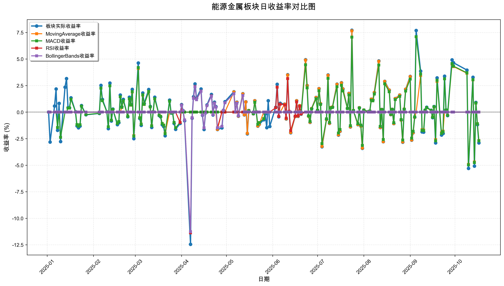
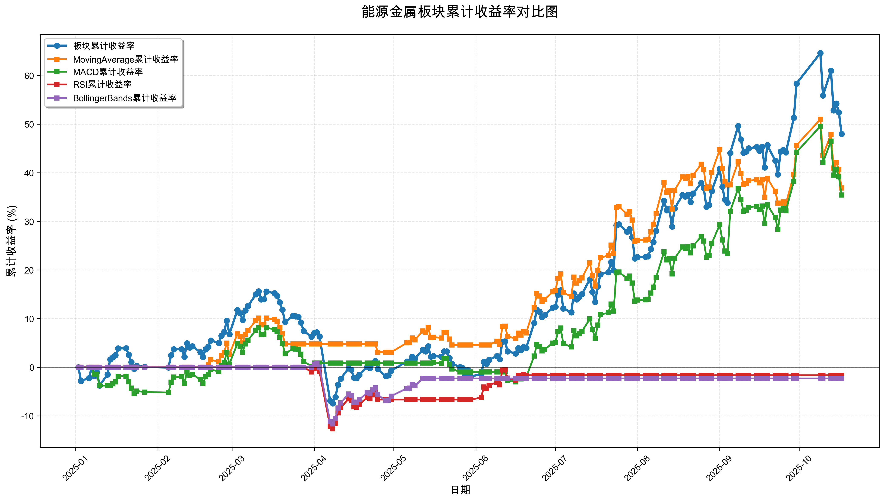

# 策略回测结果报告

**生成时间**: 2025-10-19 19:06:40
**行业板块**: 能源金属
**回测期间**: 20250101 至 20251017
**策略数量**: 4

## 📈 分析结论

### 策略表现分析
- **最佳策略**: MovingAverage (总收益率: 36.85%)
- **最差策略**: BollingerBands (总收益率: -2.33%)
### 交易活跃度分析
- **活跃策略**: 4 个
- **非活跃策略**: 0 个
- **最活跃策略**: MovingAverage (交易次数: 12)
### 🚨 异动提醒分析
- **板块异动**: 能源金属 近两周波动率异常 (近期: 3.47%, 整体: 2.17%)
- **板块异动**: 能源金属 近两周出现大幅波动 (最大单日: 5.30%)
- **策略异动**: MovingAverage 近两周出现大幅波动 (最大单日: 4.92%)
- **策略异动**: MACD 近两周出现大幅波动 (最大单日: 4.97%)
### 风险分析
- **MovingAverage**: 最大回撤 -9.37%, 夏普比率 2.0000
- **MACD**: 最大回撤 -10.32%, 夏普比率 1.8487
- **RSI**: 最大回撤 -12.68%, 夏普比率 -0.1434
- **BollingerBands**: 最大回撤 -12.37%, 夏普比率 -0.2121

## 📊 综合结果表

| 策略名称           | 初始资金     | 最终价值     | 总收益率   | 年化收益率   | 波动率    |    夏普比率 | 最大回撤    | 总交易次数   | 买入次数   | 卖出次数   | 总交易金额      | 平均交易金额   | 交易频率   |   数据点数 |
|:---------------|:---------|:---------|:-------|:--------|:-------|--------:|:--------|:--------|:-------|:-------|:-----------|:---------|:-------|-------:|
| 板块实际表现         | ¥100,000 | ¥148,012 | 48.01% | 68.22%  | 34.44% |  1.9805 | -19.95% | N/A     | N/A    | N/A    | N/A        | N/A      | N/A    |    190 |
| MovingAverage  | ¥100,000 | ¥136,855 | 36.85% | 51.61%  | 25.80% |  2      | -9.37%  | 12      | 6      | 6      | ¥1,321,503 | ¥110,125 | 0.06   |    190 |
| MACD           | ¥100,000 | ¥135,430 | 35.43% | 49.52%  | 26.79% |  1.8487 | -10.32% | 9       | 5      | 4      | ¥773,921   | ¥85,991  | 0.05   |    190 |
| RSI            | ¥100,000 | ¥98,343  | -1.66% | -2.19%  | 15.29% | -0.1434 | -12.68% | 4       | 2      | 2      | ¥348,197   | ¥87,049  | 0.02   |    190 |
| BollingerBands | ¥100,000 | ¥97,668  | -2.33% | -3.08%  | 14.53% | -0.2121 | -12.37% | 2       | 1      | 1      | ¥178,585   | ¥89,292  | 0.01   |    190 |

## 📊 每日收益率走势图

*图1: 能源金属板块每日收益率走势对比*

## 📈 累计收益率走势图

*图2: 能源金属板块累计收益率走势对比*

## 📅 日收益明细表

| 日期         | 板块实际收益率   | MovingAverage收益率   | MACD收益率   | RSI收益率   | BollingerBands收益率   |
|:-----------|:----------|:-------------------|:----------|:---------|:--------------------|
| 2025-01-02 | 0.00%     | 0.00%              | 0.00%     | 0.00%    | 0.00%               |
| 2025-01-03 | -2.82%    | 0.00%              | 0.00%     | 0.00%    | 0.00%               |
| 2025-01-06 | 0.57%     | 0.00%              | 0.00%     | 0.00%    | 0.00%               |
| 2025-01-07 | 2.18%     | 0.00%              | 0.00%     | 0.00%    | 0.00%               |
| 2025-01-08 | -1.71%    | 0.00%              | -1.45%    | 0.00%    | 0.00%               |
| 2025-01-09 | 0.83%     | 0.00%              | 0.00%     | 0.00%    | 0.00%               |
| 2025-01-10 | -2.77%    | 0.00%              | -2.37%    | 0.00%    | 0.00%               |
| 2025-01-13 | 2.35%     | 0.00%              | 0.00%     | 0.00%    | 0.00%               |
| 2025-01-14 | 3.16%     | 0.00%              | 0.00%     | 0.00%    | 0.00%               |
| 2025-01-15 | 0.43%     | 0.00%              | 0.39%     | 0.00%    | 0.00%               |
| 2025-01-16 | 0.42%     | 0.00%              | 0.38%     | 0.00%    | 0.00%               |
| 2025-01-17 | 1.35%     | 0.00%              | 1.21%     | 0.00%    | 0.00%               |
| 2025-01-20 | 0.04%     | 0.00%              | 0.03%     | 0.00%    | 0.00%               |
| 2025-01-21 | -1.31%    | 0.00%              | -1.18%    | 0.00%    | 0.00%               |
| 2025-01-22 | -1.48%    | 0.00%              | -1.33%    | 0.00%    | 0.00%               |
| 2025-01-23 | -1.32%    | 0.00%              | -1.19%    | 0.00%    | 0.00%               |
| 2025-01-24 | 0.62%     | 0.00%              | 0.56%     | 0.00%    | 0.00%               |
| 2025-01-27 | -0.25%    | 0.00%              | -0.23%    | 0.00%    | 0.00%               |
| 2025-02-05 | -0.12%    | 0.00%              | -0.11%    | 0.00%    | 0.00%               |
| 2025-02-06 | 2.52%     | 0.00%              | 2.26%     | 0.00%    | 0.00%               |
| 2025-02-07 | 1.20%     | 0.00%              | 1.08%     | 0.00%    | 0.00%               |
| 2025-02-10 | 0.03%     | 0.00%              | 0.03%     | 0.00%    | 0.00%               |
| 2025-02-11 | -1.55%    | 0.00%              | -1.39%    | 0.00%    | 0.00%               |
| 2025-02-12 | 2.74%     | 0.00%              | 2.47%     | 0.00%    | 0.00%               |
| 2025-02-13 | -0.84%    | 0.00%              | -0.76%    | 0.00%    | 0.00%               |
| 2025-02-14 | 0.29%     | 0.00%              | 0.26%     | 0.00%    | 0.00%               |
| 2025-02-17 | -1.18%    | 0.00%              | -1.06%    | 0.00%    | 0.00%               |
| 2025-02-18 | -1.00%    | 0.00%              | -0.90%    | 0.00%    | 0.00%               |
| 2025-02-19 | 1.61%     | 0.00%              | 1.45%     | 0.00%    | 0.00%               |
| 2025-02-20 | 0.50%     | 0.44%              | 0.45%     | 0.00%    | 0.00%               |
| 2025-02-21 | 1.20%     | 1.06%              | 1.08%     | 0.00%    | 0.00%               |
| 2025-02-24 | -0.44%    | -0.39%             | -0.40%    | 0.00%    | 0.00%               |
| 2025-02-25 | 1.40%     | 1.24%              | 1.26%     | 0.00%    | 0.00%               |
| 2025-02-26 | 0.73%     | 0.65%              | 0.66%     | 0.00%    | 0.00%               |
| 2025-02-27 | 2.14%     | 1.89%              | 1.93%     | 0.00%    | 0.00%               |
| 2025-02-28 | -2.50%    | -2.22%             | -2.26%    | 0.00%    | 0.00%               |
| 2025-03-03 | 4.63%     | 4.10%              | 4.19%     | 0.00%    | 0.00%               |
| 2025-03-04 | -0.60%    | -0.53%             | -0.54%    | 0.00%    | 0.00%               |
| 2025-03-05 | -1.25%    | -1.12%             | -1.14%    | 0.00%    | 0.00%               |
| 2025-03-06 | 1.80%     | 1.60%              | 1.63%     | 0.00%    | 0.00%               |
| 2025-03-07 | 0.81%     | 0.72%              | 0.73%     | 0.00%    | 0.00%               |
| 2025-03-10 | 2.13%     | 1.90%              | 1.94%     | 0.00%    | 0.00%               |
| 2025-03-11 | 0.54%     | 0.48%              | 0.49%     | 0.00%    | 0.00%               |
| 2025-03-12 | -1.44%    | -1.28%             | -1.31%    | 0.00%    | 0.00%               |
| 2025-03-13 | 0.04%     | 0.04%              | 0.04%     | 0.00%    | 0.00%               |
| 2025-03-14 | 1.40%     | 1.25%              | 1.27%     | 0.00%    | 0.00%               |
| 2025-03-17 | -0.32%    | -0.29%             | -0.29%    | 0.00%    | 0.00%               |
| 2025-03-18 | -0.44%    | -0.39%             | -0.40%    | 0.00%    | 0.00%               |
| 2025-03-19 | -1.19%    | -1.06%             | -1.08%    | 0.00%    | 0.00%               |
| 2025-03-20 | -1.36%    | -1.21%             | -1.24%    | 0.00%    | 0.00%               |
| 2025-03-21 | -2.23%    | -1.99%             | -2.03%    | 0.00%    | 0.00%               |
| 2025-03-24 | 1.13%     | 0.00%              | 1.03%     | 0.00%    | 0.00%               |
| 2025-03-25 | -0.09%    | 0.00%              | -0.08%    | 0.00%    | 0.00%               |
| 2025-03-26 | -0.05%    | 0.00%              | -0.05%    | 0.00%    | 0.00%               |
| 2025-03-27 | -1.07%    | 0.00%              | -0.97%    | 0.00%    | 0.00%               |
| 2025-03-28 | -1.62%    | 0.00%              | -1.47%    | 0.00%    | 0.00%               |
| 2025-03-31 | -1.07%    | 0.00%              | -0.97%    | -0.98%   | 0.00%               |
| 2025-04-01 | 0.71%     | 0.00%              | 0.64%     | 0.65%    | 0.64%               |
| 2025-04-02 | 0.14%     | 0.00%              | 0.00%     | 0.13%    | 0.13%               |
| 2025-04-03 | -0.81%    | 0.00%              | 0.00%     | -0.74%   | -0.73%              |
| 2025-04-07 | -12.45%   | 0.00%              | 0.00%     | -11.37%  | -11.26%             |
| 2025-04-08 | -0.58%    | 0.00%              | 0.00%     | -0.53%   | -0.52%              |
| 2025-04-09 | 1.45%     | 0.00%              | 0.00%     | 1.31%    | 1.29%               |
| 2025-04-10 | 2.66%     | 0.00%              | 0.00%     | 2.41%    | 2.38%               |
| 2025-04-11 | 1.31%     | 0.00%              | 0.00%     | 1.19%    | 1.17%               |
| 2025-04-14 | 2.18%     | 0.00%              | 0.00%     | 1.98%    | 1.96%               |
| 2025-04-15 | -0.30%    | 0.00%              | 0.00%     | -0.27%   | -0.27%              |
| 2025-04-16 | -1.64%    | 0.00%              | 0.00%     | -1.49%   | -1.47%              |
| 2025-04-17 | -0.08%    | 0.00%              | 0.00%     | -0.07%   | -0.07%              |
| 2025-04-18 | 0.68%     | 0.00%              | 0.00%     | 0.61%    | 0.61%               |
| 2025-04-21 | 1.67%     | 0.00%              | 0.00%     | 1.52%    | 1.50%               |
| 2025-04-22 | -0.27%    | 0.00%              | 0.00%     | -0.24%   | -0.24%              |
| 2025-04-23 | 0.94%     | 0.00%              | 0.00%     | 0.85%    | 0.84%               |
| 2025-04-24 | 0.52%     | 0.00%              | 0.00%     | 0.47%    | 0.47%               |
| 2025-04-25 | -1.64%    | -1.62%             | 0.00%     | -1.49%   | -1.47%              |
| 2025-04-28 | -1.49%    | 0.00%              | 0.00%     | 0.00%    | -1.34%              |
| 2025-04-29 | 0.18%     | 0.00%              | 0.00%     | 0.00%    | 0.16%               |
| 2025-04-30 | 0.98%     | 0.00%              | 0.00%     | 0.00%    | 0.88%               |
| 2025-05-06 | 1.92%     | 1.89%              | 0.00%     | 0.00%    | 1.73%               |
| 2025-05-07 | 0.03%     | 0.03%              | 0.00%     | 0.00%    | 0.03%               |
| 2025-05-08 | 0.94%     | 0.92%              | 0.00%     | 0.00%    | 0.84%               |
| 2025-05-09 | -0.38%    | -0.37%             | 0.00%     | 0.00%    | -0.34%              |
| 2025-05-12 | 1.74%     | 1.71%              | 0.00%     | 0.00%    | 1.57%               |
| 2025-05-13 | -0.26%    | -0.25%             | 0.00%     | 0.00%    | 0.00%               |
| 2025-05-14 | 0.97%     | 0.96%              | 0.00%     | 0.00%    | 0.00%               |
| 2025-05-15 | -2.04%    | -2.00%             | 0.00%     | 0.00%    | 0.00%               |
| 2025-05-16 | 0.15%     | 0.15%              | 0.13%     | 0.00%    | 0.00%               |
| 2025-05-19 | -0.16%    | -0.16%             | -0.14%    | 0.00%    | 0.00%               |
| 2025-05-20 | 1.07%     | 1.06%              | 0.93%     | 0.00%    | 0.00%               |
| 2025-05-21 | 0.03%     | 0.03%              | 0.03%     | 0.00%    | 0.00%               |
| 2025-05-22 | -1.32%    | -1.30%             | -1.14%    | 0.00%    | 0.00%               |
| 2025-05-23 | -1.15%    | -1.13%             | -0.99%    | 0.00%    | 0.00%               |
| 2025-05-26 | -0.72%    | 0.00%              | -0.62%    | 0.00%    | 0.00%               |
| 2025-05-27 | -0.18%    | 0.00%              | 0.00%     | 0.00%    | 0.00%               |
| 2025-05-28 | -1.46%    | 0.00%              | 0.00%     | 0.00%    | 0.00%               |
| 2025-05-29 | 1.07%     | 0.00%              | 0.00%     | 0.00%    | 0.00%               |
| 2025-05-30 | -1.35%    | 0.00%              | 0.00%     | 0.00%    | 0.00%               |
| 2025-06-03 | 0.46%     | 0.00%              | 0.00%     | 0.41%    | 0.00%               |
| 2025-06-04 | 2.62%     | 0.00%              | 0.00%     | 2.35%    | 0.00%               |
| 2025-06-05 | -0.44%    | 0.00%              | 0.00%     | -0.40%   | 0.00%               |
| 2025-06-06 | 0.84%     | 0.00%              | 0.00%     | 0.75%    | 0.00%               |
| 2025-06-09 | 0.76%     | 0.75%              | 0.00%     | 0.68%    | 0.00%               |
| 2025-06-10 | -0.64%    | -0.63%             | 0.00%     | -0.57%   | 0.00%               |
| 2025-06-11 | 3.52%     | 3.49%              | 0.00%     | 3.16%    | 0.00%               |
| 2025-06-12 | 0.07%     | 0.07%              | 0.07%     | 0.07%    | 0.00%               |
| 2025-06-13 | -1.94%    | -1.92%             | -1.75%    | -1.75%   | 0.00%               |
| 2025-06-16 | -0.42%    | -0.42%             | -0.38%    | -0.38%   | 0.00%               |
| 2025-06-17 | 1.07%     | 1.06%              | 0.96%     | 0.96%    | 0.00%               |
| 2025-06-18 | -0.39%    | -0.38%             | -0.35%    | -0.35%   | 0.00%               |
| 2025-06-19 | 0.61%     | 0.61%              | 0.55%     | 0.55%    | 0.00%               |
| 2025-06-20 | -0.19%    | -0.18%             | -0.17%    | -0.17%   | 0.00%               |
| 2025-06-23 | 4.94%     | 4.90%              | 4.46%     | 0.00%    | 0.00%               |
| 2025-06-24 | 2.51%     | 2.49%              | 2.28%     | 0.00%    | 0.00%               |
| 2025-06-25 | -0.38%    | -0.38%             | -0.35%    | 0.00%    | 0.00%               |
| 2025-06-26 | -0.96%    | -0.95%             | -0.87%    | 0.00%    | 0.00%               |
| 2025-06-27 | 0.33%     | 0.33%              | 0.30%     | 0.00%    | 0.00%               |
| 2025-06-30 | 1.38%     | 1.37%              | 1.26%     | 0.00%    | 0.00%               |
| 2025-07-01 | 0.18%     | 0.18%              | 0.16%     | 0.00%    | 0.00%               |
| 2025-07-02 | 2.21%     | 2.20%              | 2.01%     | 0.00%    | 0.00%               |
| 2025-07-03 | 0.79%     | 0.79%              | 0.72%     | 0.00%    | 0.00%               |
| 2025-07-04 | -3.26%    | -3.23%             | -2.97%    | 0.00%    | 0.00%               |
| 2025-07-07 | -0.69%    | -0.69%             | -0.63%    | 0.00%    | 0.00%               |
| 2025-07-08 | 3.50%     | 3.47%              | 3.18%     | 0.00%    | 0.00%               |
| 2025-07-09 | -1.05%    | -1.04%             | -0.96%    | 0.00%    | 0.00%               |
| 2025-07-10 | 0.44%     | 0.44%              | 0.40%     | 0.00%    | 0.00%               |
| 2025-07-11 | 0.48%     | 0.48%              | 0.44%     | 0.00%    | 0.00%               |
| 2025-07-14 | 2.63%     | 2.61%              | 2.40%     | 0.00%    | 0.00%               |
| 2025-07-15 | -2.16%    | -2.14%             | -1.97%    | 0.00%    | 0.00%               |
| 2025-07-16 | -1.80%    | -1.79%             | -1.64%    | 0.00%    | 0.00%               |
| 2025-07-17 | 2.77%     | 2.75%              | 2.53%     | 0.00%    | 0.00%               |
| 2025-07-18 | 2.19%     | 2.17%              | 2.00%     | 0.00%    | 0.00%               |
| 2025-07-21 | 0.36%     | 0.35%              | 0.33%     | 0.00%    | 0.00%               |
| 2025-07-22 | 1.77%     | 1.75%              | 1.62%     | 0.00%    | 0.00%               |
| 2025-07-23 | -1.40%    | -1.39%             | -1.28%    | 0.00%    | 0.00%               |
| 2025-07-24 | 7.71%     | 7.65%              | 7.06%     | 0.00%    | 0.00%               |
| 2025-07-25 | 0.15%     | 0.15%              | 0.14%     | 0.00%    | 0.00%               |
| 2025-07-28 | -1.18%    | -1.17%             | -1.09%    | 0.00%    | 0.00%               |
| 2025-07-29 | 0.42%     | 0.42%              | 0.39%     | 0.00%    | 0.00%               |
| 2025-07-30 | -1.32%    | -1.32%             | -1.22%    | 0.00%    | 0.00%               |
| 2025-07-31 | -3.41%    | -3.39%             | -3.14%    | 0.00%    | 0.00%               |
| 2025-08-01 | 0.20%     | 0.20%              | 0.19%     | 0.00%    | 0.00%               |
| 2025-08-04 | 0.05%     | 0.05%              | 0.04%     | 0.00%    | 0.00%               |
| 2025-08-05 | 0.10%     | 0.10%              | 0.10%     | 0.00%    | 0.00%               |
| 2025-08-06 | 1.22%     | 1.22%              | 1.12%     | 0.00%    | 0.00%               |
| 2025-08-07 | 1.15%     | 1.14%              | 1.06%     | 0.00%    | 0.00%               |
| 2025-08-08 | 1.85%     | 1.84%              | 1.70%     | 0.00%    | 0.00%               |
| 2025-08-11 | 4.82%     | 4.79%              | 4.43%     | 0.00%    | 0.00%               |
| 2025-08-12 | -1.45%    | -1.44%             | -1.34%    | 0.00%    | 0.00%               |
| 2025-08-13 | 0.26%     | 0.26%              | 0.24%     | 0.00%    | 0.00%               |
| 2025-08-14 | -2.79%    | -2.78%             | -2.58%    | 0.00%    | 0.00%               |
| 2025-08-15 | 2.90%     | 2.88%              | 2.67%     | 0.00%    | 0.00%               |
| 2025-08-18 | 2.08%     | 2.06%              | 1.92%     | 0.00%    | 0.00%               |
| 2025-08-19 | -0.23%    | -0.23%             | -0.21%    | 0.00%    | 0.00%               |
| 2025-08-20 | 0.27%     | 0.27%              | 0.25%     | 0.00%    | 0.00%               |
| 2025-08-21 | -1.08%    | -1.08%             | -1.00%    | 0.00%    | 0.00%               |
| 2025-08-22 | 1.28%     | 1.27%              | 1.18%     | 0.00%    | 0.00%               |
| 2025-08-25 | 1.61%     | 1.60%              | 1.49%     | 0.00%    | 0.00%               |
| 2025-08-26 | -0.75%    | -0.75%             | -0.70%    | 0.00%    | 0.00%               |
| 2025-08-27 | -2.83%    | -2.81%             | -2.62%    | 0.00%    | 0.00%               |
| 2025-08-28 | 0.29%     | 0.29%              | 0.27%     | 0.00%    | 0.00%               |
| 2025-08-29 | 2.16%     | 2.14%              | 1.99%     | 0.00%    | 0.00%               |
| 2025-09-01 | 3.36%     | 3.34%              | 3.11%     | 0.00%    | 0.00%               |
| 2025-09-02 | -2.64%    | -2.62%             | -2.45%    | 0.00%    | 0.00%               |
| 2025-09-03 | -1.94%    | -1.93%             | -1.80%    | 0.00%    | 0.00%               |
| 2025-09-04 | -0.49%    | -0.48%             | -0.45%    | 0.00%    | 0.00%               |
| 2025-09-05 | 7.69%     | 0.00%              | 7.10%     | 0.00%    | 0.00%               |
| 2025-09-08 | 3.86%     | 3.44%              | 3.58%     | 0.00%    | 0.00%               |
| 2025-09-09 | -1.86%    | -1.66%             | -1.73%    | 0.00%    | 0.00%               |
| 2025-09-10 | -1.88%    | -1.68%             | -1.75%    | 0.00%    | 0.00%               |
| 2025-09-11 | 0.20%     | 0.18%              | 0.18%     | 0.00%    | 0.00%               |
| 2025-09-12 | 0.46%     | 0.41%              | 0.43%     | 0.00%    | 0.00%               |
| 2025-09-15 | 0.17%     | 0.15%              | 0.16%     | 0.00%    | 0.00%               |
| 2025-09-16 | -0.52%    | -0.46%             | -0.48%    | 0.00%    | 0.00%               |
| 2025-09-17 | 0.53%     | 0.48%              | 0.50%     | 0.00%    | 0.00%               |
| 2025-09-18 | -2.90%    | -2.59%             | -2.70%    | 0.00%    | 0.00%               |
| 2025-09-19 | 3.23%     | 2.88%              | 3.00%     | 0.00%    | 0.00%               |
| 2025-09-22 | -2.16%    | -1.93%             | -2.01%    | 0.00%    | 0.00%               |
| 2025-09-23 | -2.01%    | -1.79%             | -1.86%    | 0.00%    | 0.00%               |
| 2025-09-24 | 3.39%     | 0.00%              | 3.14%     | 0.00%    | 0.00%               |
| 2025-09-25 | 0.21%     | 0.19%              | 0.19%     | 0.00%    | 0.00%               |
| 2025-09-26 | -0.32%    | -0.29%             | -0.30%    | 0.00%    | 0.00%               |
| 2025-09-29 | 4.92%     | 4.52%              | 4.57%     | 0.00%    | 0.00%               |
| 2025-09-30 | 4.65%     | 4.29%              | 4.33%     | 0.00%    | 0.00%               |
| 2025-10-09 | 3.96%     | 3.66%              | 3.70%     | 0.00%    | 0.00%               |
| 2025-10-10 | -5.30%    | -4.92%             | -4.97%    | 0.00%    | 0.00%               |
| 2025-10-13 | 3.28%     | 3.03%              | 3.06%     | 0.00%    | 0.00%               |
| 2025-10-14 | -5.08%    | -4.70%             | -4.75%    | 0.00%    | 0.00%               |
| 2025-10-15 | 0.92%     | 0.85%              | 0.86%     | 0.00%    | 0.00%               |
| 2025-10-16 | -1.18%    | -1.09%             | -1.10%    | 0.00%    | 0.00%               |
| 2025-10-17 | -2.90%    | -2.68%             | -2.70%    | 0.00%    | 0.00%               |

## 📊 日收益统计摘要

| 指标                | 平均日收益率   | 最大日收益率   | 最小日收益率   | 正收益天数   | 负收益天数   |
|:------------------|:---------|:---------|:---------|:--------|:--------|
| 板块实际收益率           | 0.23%    | 7.71%    | -12.45%  | 106天    | 83天     |
| MovingAverage收益率  | 0.18%    | 7.65%    | -4.92%   | 71天     | 53天     |
| MACD收益率           | 0.17%    | 7.10%    | -4.97%   | 79天     | 65天     |
| RSI收益率            | -0.00%   | 3.16%    | -11.37%  | 18天     | 15天     |
| BollingerBands收益率 | -0.01%   | 2.38%    | -11.26%  | 16天     | 10天     |

## 📈 累计收益明细表

| 日期         | 板块累计收益率   | MovingAverage累计收益率   | MACD累计收益率   | RSI累计收益率   | BollingerBands累计收益率   |
|:-----------|:----------|:---------------------|:------------|:-----------|:----------------------|
| 2025-01-02 | 0.00%     | 0.00%                | 0.00%       | 0.00%      | 0.00%                 |
| 2025-01-03 | -2.82%    | 0.00%                | 0.00%       | 0.00%      | 0.00%                 |
| 2025-01-06 | -2.26%    | 0.00%                | 0.00%       | 0.00%      | 0.00%                 |
| 2025-01-07 | -0.14%    | 0.00%                | 0.00%       | 0.00%      | 0.00%                 |
| 2025-01-08 | -1.84%    | 0.00%                | -1.45%      | 0.00%      | 0.00%                 |
| 2025-01-09 | -1.02%    | 0.00%                | -1.45%      | 0.00%      | 0.00%                 |
| 2025-01-10 | -3.77%    | 0.00%                | -3.79%      | 0.00%      | 0.00%                 |
| 2025-01-13 | -1.51%    | 0.00%                | -3.79%      | 0.00%      | 0.00%                 |
| 2025-01-14 | 1.61%     | 0.00%                | -3.79%      | 0.00%      | 0.00%                 |
| 2025-01-15 | 2.05%     | 0.00%                | -3.41%      | 0.00%      | 0.00%                 |
| 2025-01-16 | 2.48%     | 0.00%                | -3.05%      | 0.00%      | 0.00%                 |
| 2025-01-17 | 3.86%     | 0.00%                | -1.87%      | 0.00%      | 0.00%                 |
| 2025-01-20 | 3.90%     | 0.00%                | -1.84%      | 0.00%      | 0.00%                 |
| 2025-01-21 | 2.54%     | 0.00%                | -3.00%      | 0.00%      | 0.00%                 |
| 2025-01-22 | 1.02%     | 0.00%                | -4.28%      | 0.00%      | 0.00%                 |
| 2025-01-23 | -0.31%    | 0.00%                | -5.42%      | 0.00%      | 0.00%                 |
| 2025-01-24 | 0.30%     | 0.00%                | -4.90%      | 0.00%      | 0.00%                 |
| 2025-01-27 | 0.05%     | 0.00%                | -5.11%      | 0.00%      | 0.00%                 |
| 2025-02-05 | -0.07%    | 0.00%                | -5.22%      | 0.00%      | 0.00%                 |
| 2025-02-06 | 2.45%     | 0.00%                | -3.07%      | 0.00%      | 0.00%                 |
| 2025-02-07 | 3.68%     | 0.00%                | -2.02%      | 0.00%      | 0.00%                 |
| 2025-02-10 | 3.71%     | 0.00%                | -2.00%      | 0.00%      | 0.00%                 |
| 2025-02-11 | 2.10%     | 0.00%                | -3.36%      | 0.00%      | 0.00%                 |
| 2025-02-12 | 4.90%     | 0.00%                | -0.98%      | 0.00%      | 0.00%                 |
| 2025-02-13 | 4.02%     | 0.00%                | -1.73%      | 0.00%      | 0.00%                 |
| 2025-02-14 | 4.32%     | 0.00%                | -1.48%      | 0.00%      | 0.00%                 |
| 2025-02-17 | 3.10%     | 0.00%                | -2.52%      | 0.00%      | 0.00%                 |
| 2025-02-18 | 2.07%     | 0.00%                | -3.40%      | 0.00%      | 0.00%                 |
| 2025-02-19 | 3.71%     | 0.00%                | -2.00%      | 0.00%      | 0.00%                 |
| 2025-02-20 | 4.23%     | 0.44%                | -1.56%      | 0.00%      | 0.00%                 |
| 2025-02-21 | 5.48%     | 1.51%                | -0.49%      | 0.00%      | 0.00%                 |
| 2025-02-24 | 5.01%     | 1.11%                | -0.89%      | 0.00%      | 0.00%                 |
| 2025-02-25 | 6.48%     | 2.36%                | 0.36%       | 0.00%      | 0.00%                 |
| 2025-02-26 | 7.26%     | 3.02%                | 1.02%       | 0.00%      | 0.00%                 |
| 2025-02-27 | 9.55%     | 4.97%                | 2.97%       | 0.00%      | 0.00%                 |
| 2025-02-28 | 6.81%     | 2.65%                | 0.65%       | 0.00%      | 0.00%                 |
| 2025-03-03 | 11.76%    | 6.86%                | 4.86%       | 0.00%      | 0.00%                 |
| 2025-03-04 | 11.10%    | 6.29%                | 4.29%       | 0.00%      | 0.00%                 |
| 2025-03-05 | 9.70%     | 5.10%                | 3.10%       | 0.00%      | 0.00%                 |
| 2025-03-06 | 11.68%    | 6.79%                | 4.79%       | 0.00%      | 0.00%                 |
| 2025-03-07 | 12.58%    | 7.55%                | 5.55%       | 0.00%      | 0.00%                 |
| 2025-03-10 | 14.98%    | 9.60%                | 7.60%       | 0.00%      | 0.00%                 |
| 2025-03-11 | 15.60%    | 10.12%               | 8.12%       | 0.00%      | 0.00%                 |
| 2025-03-12 | 13.94%    | 8.71%                | 6.71%       | 0.00%      | 0.00%                 |
| 2025-03-13 | 13.98%    | 8.75%                | 6.75%       | 0.00%      | 0.00%                 |
| 2025-03-14 | 15.58%    | 10.10%               | 8.10%       | 0.00%      | 0.00%                 |
| 2025-03-17 | 15.21%    | 9.79%                | 7.79%       | 0.00%      | 0.00%                 |
| 2025-03-18 | 14.70%    | 9.36%                | 7.36%       | 0.00%      | 0.00%                 |
| 2025-03-19 | 13.34%    | 8.20%                | 6.20%       | 0.00%      | 0.00%                 |
| 2025-03-20 | 11.80%    | 6.89%                | 4.89%       | 0.00%      | 0.00%                 |
| 2025-03-21 | 9.30%     | 4.76%                | 2.76%       | 0.00%      | 0.00%                 |
| 2025-03-24 | 10.54%    | 4.76%                | 3.82%       | 0.00%      | 0.00%                 |
| 2025-03-25 | 10.44%    | 4.76%                | 3.73%       | 0.00%      | 0.00%                 |
| 2025-03-26 | 10.38%    | 4.76%                | 3.68%       | 0.00%      | 0.00%                 |
| 2025-03-27 | 9.20%     | 4.76%                | 2.68%       | 0.00%      | 0.00%                 |
| 2025-03-28 | 7.43%     | 4.76%                | 1.17%       | 0.00%      | 0.00%                 |
| 2025-03-31 | 6.28%     | 4.76%                | 0.19%       | -0.98%     | 0.00%                 |
| 2025-04-01 | 7.03%     | 4.76%                | 0.83%       | -0.34%     | 0.64%                 |
| 2025-04-02 | 7.18%     | 4.76%                | 0.83%       | -0.21%     | 0.77%                 |
| 2025-04-03 | 6.32%     | 4.76%                | 0.83%       | -0.95%     | 0.03%                 |
| 2025-04-07 | -6.92%    | 4.76%                | 0.83%       | -12.21%    | -11.23%               |
| 2025-04-08 | -7.46%    | 4.76%                | 0.83%       | -12.68%    | -11.69%               |
| 2025-04-09 | -6.12%    | 4.76%                | 0.83%       | -11.53%    | -10.55%               |
| 2025-04-10 | -3.62%    | 4.76%                | 0.83%       | -9.40%     | -8.42%                |
| 2025-04-11 | -2.36%    | 4.76%                | 0.83%       | -8.33%     | -7.35%                |
| 2025-04-14 | -0.23%    | 4.76%                | 0.83%       | -6.52%     | -5.54%                |
| 2025-04-15 | -0.52%    | 4.76%                | 0.83%       | -6.77%     | -5.79%                |
| 2025-04-16 | -2.15%    | 4.76%                | 0.83%       | -8.15%     | -7.17%                |
| 2025-04-17 | -2.23%    | 4.76%                | 0.83%       | -8.22%     | -7.24%                |
| 2025-04-18 | -1.57%    | 4.76%                | 0.83%       | -7.66%     | -6.68%                |
| 2025-04-21 | 0.08%     | 4.76%                | 0.83%       | -6.26%     | -5.27%                |
| 2025-04-22 | -0.19%    | 4.76%                | 0.83%       | -6.49%     | -5.50%                |
| 2025-04-23 | 0.75%     | 4.76%                | 0.83%       | -5.69%     | -4.71%                |
| 2025-04-24 | 1.27%     | 4.76%                | 0.83%       | -5.24%     | -4.26%                |
| 2025-04-25 | -0.39%    | 3.07%                | 0.83%       | -6.66%     | -5.67%                |
| 2025-04-28 | -1.87%    | 3.07%                | 0.83%       | -6.66%     | -6.94%                |
| 2025-04-29 | -1.70%    | 3.07%                | 0.83%       | -6.66%     | -6.79%                |
| 2025-04-30 | -0.74%    | 3.07%                | 0.83%       | -6.66%     | -5.97%                |
| 2025-05-06 | 1.17%     | 5.02%                | 0.83%       | -6.66%     | -4.35%                |
| 2025-05-07 | 1.20%     | 5.05%                | 0.83%       | -6.66%     | -4.32%                |
| 2025-05-08 | 2.15%     | 6.02%                | 0.83%       | -6.66%     | -3.51%                |
| 2025-05-09 | 1.77%     | 5.63%                | 0.83%       | -6.66%     | -3.84%                |
| 2025-05-12 | 3.54%     | 7.44%                | 0.83%       | -6.66%     | -2.33%                |
| 2025-05-13 | 3.27%     | 7.17%                | 0.83%       | -6.66%     | -2.33%                |
| 2025-05-14 | 4.28%     | 8.19%                | 0.83%       | -6.66%     | -2.33%                |
| 2025-05-15 | 2.15%     | 6.03%                | 0.83%       | -6.66%     | -2.33%                |
| 2025-05-16 | 2.31%     | 6.19%                | 0.97%       | -6.66%     | -2.33%                |
| 2025-05-19 | 2.15%     | 6.02%                | 0.82%       | -6.66%     | -2.33%                |
| 2025-05-20 | 3.24%     | 7.14%                | 1.76%       | -6.66%     | -2.33%                |
| 2025-05-21 | 3.27%     | 7.17%                | 1.78%       | -6.66%     | -2.33%                |
| 2025-05-22 | 1.91%     | 5.78%                | 0.63%       | -6.66%     | -2.33%                |
| 2025-05-23 | 0.74%     | 4.58%                | -0.37%      | -6.66%     | -2.33%                |
| 2025-05-26 | 0.01%     | 4.58%                | -0.99%      | -6.66%     | -2.33%                |
| 2025-05-27 | -0.17%    | 4.58%                | -0.99%      | -6.66%     | -2.33%                |
| 2025-05-28 | -1.62%    | 4.58%                | -0.99%      | -6.66%     | -2.33%                |
| 2025-05-29 | -0.57%    | 4.58%                | -0.99%      | -6.66%     | -2.33%                |
| 2025-05-30 | -1.91%    | 4.58%                | -0.99%      | -6.66%     | -2.33%                |
| 2025-06-03 | -1.46%    | 4.58%                | -0.99%      | -6.27%     | -2.33%                |
| 2025-06-04 | 1.13%     | 4.58%                | -0.99%      | -4.07%     | -2.33%                |
| 2025-06-05 | 0.68%     | 4.58%                | -0.99%      | -4.45%     | -2.33%                |
| 2025-06-06 | 1.52%     | 4.58%                | -0.99%      | -3.73%     | -2.33%                |
| 2025-06-09 | 2.30%     | 5.37%                | -0.99%      | -3.07%     | -2.33%                |
| 2025-06-10 | 1.64%     | 4.70%                | -0.99%      | -3.63%     | -2.33%                |
| 2025-06-11 | 5.22%     | 8.35%                | -0.99%      | -0.59%     | -2.33%                |
| 2025-06-12 | 5.29%     | 8.43%                | -0.93%      | -0.52%     | -2.33%                |
| 2025-06-13 | 3.25%     | 6.34%                | -2.67%      | -2.26%     | -2.33%                |
| 2025-06-16 | 2.82%     | 5.90%                | -3.04%      | -2.63%     | -2.33%                |
| 2025-06-17 | 3.92%     | 7.02%                | -2.10%      | -1.69%     | -2.33%                |
| 2025-06-18 | 3.52%     | 6.61%                | -2.44%      | -2.03%     | -2.33%                |
| 2025-06-19 | 4.15%     | 7.26%                | -1.90%      | -1.49%     | -2.33%                |
| 2025-06-20 | 3.96%     | 7.06%                | -2.07%      | -1.66%     | -2.33%                |
| 2025-06-23 | 9.10%     | 12.31%               | 2.31%       | -1.66%     | -2.33%                |
| 2025-06-24 | 11.83%    | 15.11%               | 4.64%       | -1.66%     | -2.33%                |
| 2025-06-25 | 11.40%    | 14.67%               | 4.27%       | -1.66%     | -2.33%                |
| 2025-06-26 | 10.34%    | 13.58%               | 3.36%       | -1.66%     | -2.33%                |
| 2025-06-27 | 10.70%    | 13.95%               | 3.67%       | -1.66%     | -2.33%                |
| 2025-06-30 | 12.23%    | 15.51%               | 4.97%       | -1.66%     | -2.33%                |
| 2025-07-01 | 12.43%    | 15.72%               | 5.14%       | -1.66%     | -2.33%                |
| 2025-07-02 | 14.92%    | 18.26%               | 7.26%       | -1.66%     | -2.33%                |
| 2025-07-03 | 15.83%    | 19.19%               | 8.04%       | -1.66%     | -2.33%                |
| 2025-07-04 | 12.06%    | 15.34%               | 4.83%       | -1.66%     | -2.33%                |
| 2025-07-07 | 11.29%    | 14.55%               | 4.17%       | -1.66%     | -2.33%                |
| 2025-07-08 | 15.18%    | 18.53%               | 7.48%       | -1.66%     | -2.33%                |
| 2025-07-09 | 13.97%    | 17.29%               | 6.45%       | -1.66%     | -2.33%                |
| 2025-07-10 | 14.47%    | 17.80%               | 6.88%       | -1.66%     | -2.33%                |
| 2025-07-11 | 15.02%    | 18.36%               | 7.34%       | -1.66%     | -2.33%                |
| 2025-07-14 | 18.04%    | 21.45%               | 9.92%       | -1.66%     | -2.33%                |
| 2025-07-15 | 15.49%    | 18.84%               | 7.75%       | -1.66%     | -2.33%                |
| 2025-07-16 | 13.41%    | 16.72%               | 5.98%       | -1.66%     | -2.33%                |
| 2025-07-17 | 16.56%    | 19.93%               | 8.66%       | -1.66%     | -2.33%                |
| 2025-07-18 | 19.11%    | 22.54%               | 10.83%      | -1.66%     | -2.33%                |
| 2025-07-21 | 19.54%    | 22.97%               | 11.19%      | -1.66%     | -2.33%                |
| 2025-07-22 | 21.65%    | 25.13%               | 12.99%      | -1.66%     | -2.33%                |
| 2025-07-23 | 19.95%    | 23.40%               | 11.54%      | -1.66%     | -2.33%                |
| 2025-07-24 | 29.20%    | 32.84%               | 19.42%      | -1.66%     | -2.33%                |
| 2025-07-25 | 29.39%    | 33.04%               | 19.58%      | -1.66%     | -2.33%                |
| 2025-07-28 | 27.86%    | 31.48%               | 18.28%      | -1.66%     | -2.33%                |
| 2025-07-29 | 28.40%    | 32.03%               | 18.74%      | -1.66%     | -2.33%                |
| 2025-07-30 | 26.70%    | 30.29%               | 17.29%      | -1.66%     | -2.33%                |
| 2025-07-31 | 22.37%    | 25.87%               | 13.61%      | -1.66%     | -2.33%                |
| 2025-08-01 | 22.62%    | 26.13%               | 13.82%      | -1.66%     | -2.33%                |
| 2025-08-04 | 22.68%    | 26.19%               | 13.87%      | -1.66%     | -2.33%                |
| 2025-08-05 | 22.81%    | 26.32%               | 13.98%      | -1.66%     | -2.33%                |
| 2025-08-06 | 24.31%    | 27.85%               | 15.26%      | -1.66%     | -2.33%                |
| 2025-08-07 | 25.74%    | 29.32%               | 16.48%      | -1.66%     | -2.33%                |
| 2025-08-08 | 28.07%    | 31.69%               | 18.45%      | -1.66%     | -2.33%                |
| 2025-08-11 | 34.24%    | 37.99%               | 23.71%      | -1.66%     | -2.33%                |
| 2025-08-12 | 32.29%    | 36.00%               | 22.05%      | -1.66%     | -2.33%                |
| 2025-08-13 | 32.64%    | 36.36%               | 22.35%      | -1.66%     | -2.33%                |
| 2025-08-14 | 28.93%    | 32.57%               | 19.19%      | -1.66%     | -2.33%                |
| 2025-08-15 | 32.67%    | 36.39%               | 22.37%      | -1.66%     | -2.33%                |
| 2025-08-18 | 35.42%    | 39.20%               | 24.72%      | -1.66%     | -2.33%                |
| 2025-08-19 | 35.11%    | 38.88%               | 24.45%      | -1.66%     | -2.33%                |
| 2025-08-20 | 35.48%    | 39.26%               | 24.76%      | -1.66%     | -2.33%                |
| 2025-08-21 | 34.01%    | 37.76%               | 23.52%      | -1.66%     | -2.33%                |
| 2025-08-22 | 35.72%    | 39.51%               | 24.97%      | -1.66%     | -2.33%                |
| 2025-08-25 | 37.91%    | 41.74%               | 26.83%      | -1.66%     | -2.33%                |
| 2025-08-26 | 36.87%    | 40.68%               | 25.94%      | -1.66%     | -2.33%                |
| 2025-08-27 | 32.99%    | 36.72%               | 22.65%      | -1.66%     | -2.33%                |
| 2025-08-28 | 33.38%    | 37.11%               | 22.98%      | -1.66%     | -2.33%                |
| 2025-08-29 | 36.26%    | 40.05%               | 25.42%      | -1.66%     | -2.33%                |
| 2025-09-01 | 40.83%    | 44.73%               | 29.32%      | -1.66%     | -2.33%                |
| 2025-09-02 | 37.12%    | 40.93%               | 26.16%      | -1.66%     | -2.33%                |
| 2025-09-03 | 34.45%    | 38.21%               | 23.89%      | -1.66%     | -2.33%                |
| 2025-09-04 | 33.80%    | 37.54%               | 23.33%      | -1.66%     | -2.33%                |
| 2025-09-05 | 44.09%    | 37.54%               | 32.09%      | -1.66%     | -2.33%                |
| 2025-09-08 | 49.64%    | 42.27%               | 36.82%      | -1.66%     | -2.33%                |
| 2025-09-09 | 46.86%    | 39.90%               | 34.45%      | -1.66%     | -2.33%                |
| 2025-09-10 | 44.10%    | 37.55%               | 32.10%      | -1.66%     | -2.33%                |
| 2025-09-11 | 44.38%    | 37.79%               | 32.34%      | -1.66%     | -2.33%                |
| 2025-09-12 | 45.05%    | 38.36%               | 32.91%      | -1.66%     | -2.33%                |
| 2025-09-15 | 45.30%    | 38.57%               | 33.12%      | -1.66%     | -2.33%                |
| 2025-09-16 | 44.55%    | 37.93%               | 32.48%      | -1.66%     | -2.33%                |
| 2025-09-17 | 45.32%    | 38.59%               | 33.14%      | -1.66%     | -2.33%                |
| 2025-09-18 | 41.11%    | 35.00%               | 29.55%      | -1.66%     | -2.33%                |
| 2025-09-19 | 45.67%    | 38.89%               | 33.44%      | -1.66%     | -2.33%                |
| 2025-09-22 | 42.52%    | 36.20%               | 30.75%      | -1.66%     | -2.33%                |
| 2025-09-23 | 39.66%    | 33.77%               | 28.32%      | -1.66%     | -2.33%                |
| 2025-09-24 | 44.39%    | 33.77%               | 32.34%      | -1.66%     | -2.33%                |
| 2025-09-25 | 44.68%    | 34.02%               | 32.60%      | -1.66%     | -2.33%                |
| 2025-09-26 | 44.22%    | 33.63%               | 32.20%      | -1.66%     | -2.33%                |
| 2025-09-29 | 51.32%    | 39.67%               | 38.25%      | -1.66%     | -2.33%                |
| 2025-09-30 | 58.36%    | 45.66%               | 44.24%      | -1.66%     | -2.33%                |
| 2025-10-09 | 64.63%    | 51.00%               | 49.57%      | -1.66%     | -2.33%                |
| 2025-10-10 | 55.90%    | 43.57%               | 42.15%      | -1.66%     | -2.33%                |
| 2025-10-13 | 61.02%    | 47.93%               | 46.50%      | -1.66%     | -2.33%                |
| 2025-10-14 | 52.85%    | 40.97%               | 39.55%      | -1.66%     | -2.33%                |
| 2025-10-15 | 54.26%    | 42.17%               | 40.74%      | -1.66%     | -2.33%                |
| 2025-10-16 | 52.43%    | 40.62%               | 39.19%      | -1.66%     | -2.33%                |
| 2025-10-17 | 48.01%    | 36.85%               | 35.43%      | -1.66%     | -2.33%                |

## 📊 累计收益统计摘要

| 指标                  | 最终累计收益率   | 最大累计收益率   | 最小累计收益率   | 累计收益波动   | 收益稳定性   |
|:--------------------|:----------|:----------|:----------|:---------|:--------|
| 板块累计收益率             | 48.01%    | 64.63%    | -7.46%    | 72.09%   | 波动      |
| MovingAverage累计收益率  | 36.85%    | 51.00%    | 0.00%     | 51.00%   | 波动      |
| MACD累计收益率           | 35.43%    | 49.57%    | -5.42%    | 54.99%   | 波动      |
| RSI累计收益率            | -1.66%    | 0.00%     | -12.68%   | 12.68%   | 稳定      |
| BollingerBands累计收益率 | -2.33%    | 0.77%     | -11.69%   | 12.46%   | 稳定      |

