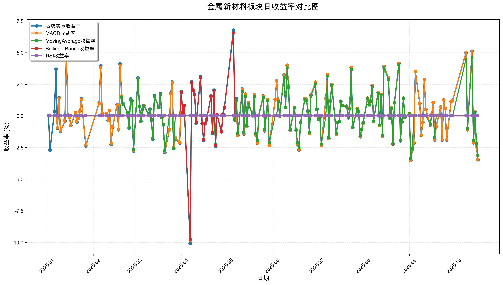
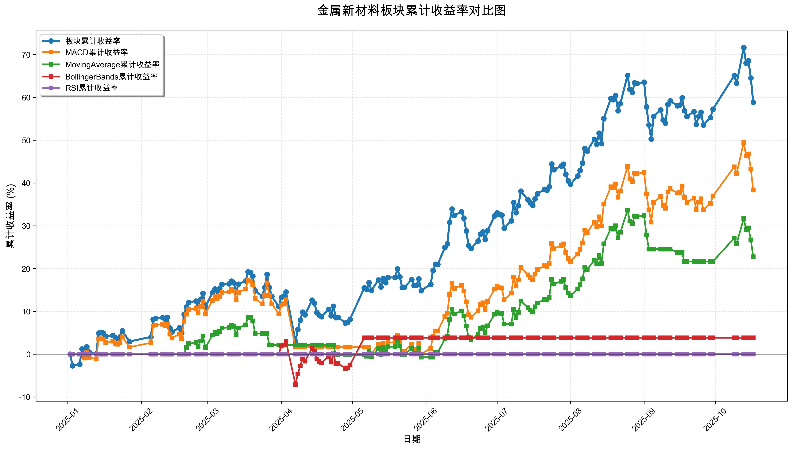

# 策略回测结果报告

**生成时间**: 2025-10-19 19:07:20
**行业板块**: 金属新材料
**回测期间**: 20250101 至 20251017
**策略数量**: 4

## 📈 分析结论

### 策略表现分析
- **最佳策略**: MACD (总收益率: 38.34%)
- **最差策略**: RSI (总收益率: 0.00%)
### 交易活跃度分析
- **活跃策略**: 3 个
- **非活跃策略**: 1 个
- **最活跃策略**: MovingAverage (交易次数: 18)
### 🚨 异动提醒分析
- **板块异动**: 金属新材料 近两周出现极端波动 (最大单日: 5.12%, 最小单日: 5.00%)
- **板块异动**: 金属新材料 近两周出现大幅波动 (最大单日: 5.12%)
- **板块异动**: 金属新材料 近两周波动频繁 (方向变化频率: 64.3%)
- **策略异动**: MACD 近两周出现极端表现 (最大单日: 5.12%, 最小单日: 4.99%)
- **策略异动**: MACD 近两周出现大幅波动 (最大单日: 5.12%)
- **策略异动**: MovingAverage 近两周出现大幅波动 (最大单日: 4.63%)
### 风险分析
- **MACD**: 最大回撤 -14.64%, 夏普比率 1.8738
- **MovingAverage**: 最大回撤 -8.98%, 夏普比率 1.4663
- **BollingerBands**: 最大回撤 -9.76%, 夏普比率 0.3242
- **RSI**: 最大回撤 0.00%, 夏普比率 0.0000

## 📊 综合结果表

| 策略名称           | 初始资金     | 最终价值     | 总收益率   | 年化收益率   | 波动率    |   夏普比率 | 最大回撤    | 总交易次数   | 买入次数   | 卖出次数   | 总交易金额      | 平均交易金额   | 交易频率   |   数据点数 |
|:---------------|:---------|:---------|:-------|:--------|:-------|-------:|:--------|:--------|:-------|:-------|:-----------|:---------|:-------|-------:|
| 板块实际表现         | ¥100,000 | ¥158,848 | 58.85% | 84.74%  | 31.44% | 2.6951 | -13.63% | N/A     | N/A    | N/A    | N/A        | N/A      | N/A    |    190 |
| MACD           | ¥100,000 | ¥138,340 | 38.34% | 53.80%  | 28.71% | 1.8738 | -14.64% | 3       | 2      | 1      | ¥297,099   | ¥99,033  | 0.02   |    190 |
| MovingAverage  | ¥100,000 | ¥122,763 | 22.76% | 31.26%  | 21.32% | 1.4663 | -8.98%  | 18      | 9      | 9      | ¥1,850,255 | ¥102,792 | 0.09   |    190 |
| BollingerBands | ¥100,000 | ¥103,823 | 3.82%  | 5.10%   | 15.74% | 0.3242 | -9.76%  | 2       | 1      | 1      | ¥197,213   | ¥98,607  | 0.01   |    190 |
| RSI            | ¥100,000 | ¥100,000 | 0.00%  | 0.00%   | 0.00%  | 0      | 0.00%   | 0       | 0      | 0      | ¥0         | ¥0       | 0.00   |    190 |

## 📊 每日收益率走势图

*图1: 金属新材料板块每日收益率走势对比*

## 📈 累计收益率走势图

*图2: 金属新材料板块累计收益率走势对比*

## 📅 日收益明细表

| 日期         | 板块实际收益率   | MACD收益率   | MovingAverage收益率   | BollingerBands收益率   | RSI收益率   |
|:-----------|:----------|:----------|:-------------------|:--------------------|:---------|
| 2025-01-02 | 0.00%     | 0.00%     | 0.00%              | 0.00%               | 0.00%    |
| 2025-01-03 | -2.70%    | 0.00%     | 0.00%              | 0.00%               | 0.00%    |
| 2025-01-06 | 0.36%     | 0.00%     | 0.00%              | 0.00%               | 0.00%    |
| 2025-01-07 | 3.70%     | 0.00%     | 0.00%              | 0.00%               | 0.00%    |
| 2025-01-08 | -0.98%    | -0.95%    | 0.00%              | 0.00%               | 0.00%    |
| 2025-01-09 | 1.46%     | 1.41%     | 0.00%              | 0.00%               | 0.00%    |
| 2025-01-10 | -1.24%    | -1.20%    | 0.00%              | 0.00%               | 0.00%    |
| 2025-01-13 | -0.40%    | -0.38%    | 0.00%              | 0.00%               | 0.00%    |
| 2025-01-14 | 4.87%     | 4.72%     | 0.00%              | 0.00%               | 0.00%    |
| 2025-01-15 | 0.07%     | 0.07%     | 0.00%              | 0.00%               | 0.00%    |
| 2025-01-16 | -0.11%    | -0.10%    | 0.00%              | 0.00%               | 0.00%    |
| 2025-01-17 | -0.76%    | -0.74%    | 0.00%              | 0.00%               | 0.00%    |
| 2025-01-20 | 0.27%     | 0.26%     | 0.00%              | 0.00%               | 0.00%    |
| 2025-01-21 | -0.49%    | -0.47%    | 0.00%              | 0.00%               | 0.00%    |
| 2025-01-22 | -0.22%    | -0.21%    | 0.00%              | 0.00%               | 0.00%    |
| 2025-01-23 | 0.37%     | 0.36%     | 0.00%              | 0.00%               | 0.00%    |
| 2025-01-24 | 1.36%     | 1.32%     | 0.00%              | 0.00%               | 0.00%    |
| 2025-01-27 | -2.37%    | -2.30%    | 0.00%              | 0.00%               | 0.00%    |
| 2025-02-05 | 1.03%     | 1.00%     | 0.00%              | 0.00%               | 0.00%    |
| 2025-02-06 | 3.95%     | 3.83%     | 0.00%              | 0.00%               | 0.00%    |
| 2025-02-07 | 0.22%     | 0.22%     | 0.00%              | 0.00%               | 0.00%    |
| 2025-02-10 | 0.18%     | 0.17%     | 0.00%              | 0.00%               | 0.00%    |
| 2025-02-11 | -0.35%    | -0.34%    | 0.00%              | 0.00%               | 0.00%    |
| 2025-02-12 | 0.41%     | 0.40%     | 0.00%              | 0.00%               | 0.00%    |
| 2025-02-13 | -2.26%    | -2.20%    | 0.00%              | 0.00%               | 0.00%    |
| 2025-02-14 | -0.89%    | -0.86%    | 0.00%              | 0.00%               | 0.00%    |
| 2025-02-17 | 0.90%     | 0.87%     | 0.00%              | 0.00%               | 0.00%    |
| 2025-02-18 | -1.09%    | -1.06%    | 0.00%              | 0.00%               | 0.00%    |
| 2025-02-19 | 4.11%     | 3.99%     | 0.00%              | 0.00%               | 0.00%    |
| 2025-02-20 | 1.57%     | 1.53%     | 1.49%              | 0.00%               | 0.00%    |
| 2025-02-21 | 0.98%     | 0.95%     | 0.93%              | 0.00%               | 0.00%    |
| 2025-02-24 | 0.27%     | 0.26%     | 0.26%              | 0.00%               | 0.00%    |
| 2025-02-25 | -0.95%    | -0.92%    | -0.90%             | 0.00%               | 0.00%    |
| 2025-02-26 | 1.35%     | 1.31%     | 1.29%              | 0.00%               | 0.00%    |
| 2025-02-27 | 1.21%     | 1.17%     | 1.15%              | 0.00%               | 0.00%    |
| 2025-02-28 | -2.78%    | -2.70%    | -2.65%             | 0.00%               | 0.00%    |
| 2025-03-03 | 3.01%     | 2.93%     | 2.87%              | 0.00%               | 0.00%    |
| 2025-03-04 | 0.78%     | 0.75%     | 0.74%              | 0.00%               | 0.00%    |
| 2025-03-05 | -0.43%    | -0.42%    | -0.41%             | 0.00%               | 0.00%    |
| 2025-03-06 | 0.52%     | 0.50%     | 0.49%              | 0.00%               | 0.00%    |
| 2025-03-07 | 0.83%     | 0.80%     | 0.79%              | 0.00%               | 0.00%    |
| 2025-03-10 | 0.10%     | 0.10%     | 0.09%              | 0.00%               | 0.00%    |
| 2025-03-11 | 0.54%     | 0.53%     | 0.52%              | 0.00%               | 0.00%    |
| 2025-03-12 | -0.33%    | -0.32%    | -0.31%             | 0.00%               | 0.00%    |
| 2025-03-13 | -1.85%    | -1.80%    | -1.76%             | 0.00%               | 0.00%    |
| 2025-03-14 | 1.60%     | 1.56%     | 1.53%              | 0.00%               | 0.00%    |
| 2025-03-17 | 0.66%     | 0.64%     | 0.63%              | 0.00%               | 0.00%    |
| 2025-03-18 | 1.78%     | 1.73%     | 1.70%              | 0.00%               | 0.00%    |
| 2025-03-19 | -0.11%    | -0.10%    | -0.10%             | 0.00%               | 0.00%    |
| 2025-03-20 | -0.71%    | -0.69%    | -0.68%             | 0.00%               | 0.00%    |
| 2025-03-21 | -2.90%    | -2.83%    | -2.77%             | 0.00%               | 0.00%    |
| 2025-03-24 | -1.12%    | -1.09%    | 0.00%              | 0.00%               | 0.00%    |
| 2025-03-25 | 1.79%     | 1.74%     | 0.00%              | 0.00%               | 0.00%    |
| 2025-03-26 | 2.69%     | 2.61%     | 0.00%              | 0.00%               | 0.00%    |
| 2025-03-27 | -2.59%    | -2.52%    | -2.55%             | 0.00%               | 0.00%    |
| 2025-03-28 | -1.79%    | -1.74%    | 0.00%              | 0.00%               | 0.00%    |
| 2025-03-31 | -2.14%    | -2.08%    | 0.00%              | 0.00%               | 0.00%    |
| 2025-04-01 | 1.94%     | 1.89%     | 0.00%              | 1.88%               | 0.00%    |
| 2025-04-02 | 0.27%     | 0.27%     | 0.00%              | 0.27%               | 0.00%    |
| 2025-04-03 | 0.84%     | 0.82%     | 0.00%              | 0.82%               | 0.00%    |
| 2025-04-07 | -10.08%   | -9.81%    | 0.00%              | -9.76%              | 0.00%    |
| 2025-04-08 | 2.71%     | 0.00%     | 0.00%              | 2.61%               | 0.00%    |
| 2025-04-09 | 2.07%     | 0.00%     | 0.00%              | 2.00%               | 0.00%    |
| 2025-04-10 | 1.72%     | 0.00%     | 0.00%              | 1.66%               | 0.00%    |
| 2025-04-11 | -0.57%    | 0.00%     | 0.00%              | -0.55%              | 0.00%    |
| 2025-04-14 | 3.13%     | 0.00%     | 0.00%              | 3.02%               | 0.00%    |
| 2025-04-15 | -0.60%    | 0.00%     | 0.00%              | -0.58%              | 0.00%    |
| 2025-04-16 | -1.94%    | 0.00%     | 0.00%              | -1.87%              | 0.00%    |
| 2025-04-17 | -0.59%    | 0.00%     | 0.00%              | -0.57%              | 0.00%    |
| 2025-04-18 | -0.32%    | 0.00%     | 0.00%              | -0.31%              | 0.00%    |
| 2025-04-21 | 1.58%     | 0.00%     | 0.00%              | 1.53%               | 0.00%    |
| 2025-04-22 | -1.37%    | 0.00%     | 0.00%              | -1.32%              | 0.00%    |
| 2025-04-23 | 2.04%     | 0.00%     | 0.00%              | 1.97%               | 0.00%    |
| 2025-04-24 | -2.39%    | 0.00%     | -2.27%             | -2.31%              | 0.00%    |
| 2025-04-25 | 0.10%     | 0.00%     | 0.00%              | 0.10%               | 0.00%    |
| 2025-04-28 | -1.25%    | 0.00%     | 0.00%              | -1.21%              | 0.00%    |
| 2025-04-29 | 0.15%     | 0.00%     | 0.00%              | 0.14%               | 0.00%    |
| 2025-04-30 | 0.67%     | 0.00%     | 0.00%              | 0.65%               | 0.00%    |
| 2025-05-06 | 6.78%     | 0.00%     | 0.00%              | 6.55%               | 0.00%    |
| 2025-05-07 | -0.33%    | 0.00%     | -0.30%             | 0.00%               | 0.00%    |
| 2025-05-08 | 1.38%     | 0.00%     | 1.25%              | 0.00%               | 0.00%    |
| 2025-05-09 | -1.53%    | -1.53%    | -1.39%             | 0.00%               | 0.00%    |
| 2025-05-12 | 2.14%     | 2.13%     | 1.94%              | 0.00%               | 0.00%    |
| 2025-05-13 | -1.43%    | -1.42%    | -1.29%             | 0.00%               | 0.00%    |
| 2025-05-14 | 1.73%     | 1.72%     | 1.56%              | 0.00%               | 0.00%    |
| 2025-05-15 | -0.84%    | -0.84%    | -0.76%             | 0.00%               | 0.00%    |
| 2025-05-16 | 1.05%     | 1.05%     | 0.95%              | 0.00%               | 0.00%    |
| 2025-05-19 | 0.01%     | 0.01%     | 0.01%              | 0.00%               | 0.00%    |
| 2025-05-20 | 1.66%     | 1.66%     | 1.51%              | 0.00%               | 0.00%    |
| 2025-05-21 | -1.50%    | -1.50%    | -1.37%             | 0.00%               | 0.00%    |
| 2025-05-22 | -2.14%    | -2.14%    | -1.94%             | 0.00%               | 0.00%    |
| 2025-05-23 | 0.05%     | 0.05%     | 0.05%              | 0.00%               | 0.00%    |
| 2025-05-26 | 1.58%     | 1.57%     | 1.43%              | 0.00%               | 0.00%    |
| 2025-05-27 | -1.18%    | -1.18%    | -1.08%             | 0.00%               | 0.00%    |
| 2025-05-28 | 0.02%     | 0.02%     | 0.02%              | 0.00%               | 0.00%    |
| 2025-05-29 | 1.30%     | 1.30%     | 1.18%              | 0.00%               | 0.00%    |
| 2025-05-30 | -2.33%    | -2.33%    | -2.12%             | 0.00%               | 0.00%    |
| 2025-06-03 | 1.29%     | 1.29%     | 0.00%              | 0.00%               | 0.00%    |
| 2025-06-04 | 2.76%     | 2.76%     | 0.00%              | 0.00%               | 0.00%    |
| 2025-06-05 | 1.22%     | 1.22%     | 1.15%              | 0.00%               | 0.00%    |
| 2025-06-06 | -0.01%    | -0.01%    | -0.01%             | 0.00%               | 0.00%    |
| 2025-06-09 | 3.24%     | 3.24%     | 3.06%              | 0.00%               | 0.00%    |
| 2025-06-10 | 0.68%     | 0.68%     | 0.65%              | 0.00%               | 0.00%    |
| 2025-06-11 | 4.01%     | 4.01%     | 3.79%              | 0.00%               | 0.00%    |
| 2025-06-12 | 2.37%     | 2.37%     | 2.25%              | 0.00%               | 0.00%    |
| 2025-06-13 | -1.12%    | -1.12%    | -1.06%             | 0.00%               | 0.00%    |
| 2025-06-16 | 0.67%     | 0.66%     | 0.63%              | 0.00%               | 0.00%    |
| 2025-06-17 | -1.14%    | -1.14%    | -1.09%             | 0.00%               | 0.00%    |
| 2025-06-18 | -2.24%    | -2.23%    | -2.12%             | 0.00%               | 0.00%    |
| 2025-06-19 | -2.68%    | -2.67%    | -2.53%             | 0.00%               | 0.00%    |
| 2025-06-20 | -0.54%    | -0.54%    | -0.51%             | 0.00%               | 0.00%    |
| 2025-06-23 | 1.39%     | 1.39%     | 1.32%              | 0.00%               | 0.00%    |
| 2025-06-24 | 1.29%     | 1.29%     | 1.22%              | 0.00%               | 0.00%    |
| 2025-06-25 | 0.39%     | 0.39%     | 0.37%              | 0.00%               | 0.00%    |
| 2025-06-26 | -1.39%    | -1.38%    | -1.31%             | 0.00%               | 0.00%    |
| 2025-06-27 | 1.65%     | 1.65%     | 1.56%              | 0.00%               | 0.00%    |
| 2025-06-30 | 2.67%     | 2.67%     | 2.53%              | 0.00%               | 0.00%    |
| 2025-07-01 | 0.54%     | 0.54%     | 0.51%              | 0.00%               | 0.00%    |
| 2025-07-02 | -0.29%    | -0.29%    | -0.27%             | 0.00%               | 0.00%    |
| 2025-07-03 | -0.10%    | -0.10%    | -0.10%             | 0.00%               | 0.00%    |
| 2025-07-04 | -2.35%    | -2.35%    | -2.23%             | 0.00%               | 0.00%    |
| 2025-07-07 | 1.37%     | 1.37%     | 0.00%              | 0.00%               | 0.00%    |
| 2025-07-08 | 3.28%     | 3.28%     | 3.15%              | 0.00%               | 0.00%    |
| 2025-07-09 | -1.77%    | -1.77%    | -1.70%             | 0.00%               | 0.00%    |
| 2025-07-10 | 1.22%     | 1.22%     | 1.17%              | 0.00%               | 0.00%    |
| 2025-07-11 | 2.50%     | 2.50%     | 2.40%              | 0.00%               | 0.00%    |
| 2025-07-14 | -1.45%    | -1.45%    | -1.40%             | 0.00%               | 0.00%    |
| 2025-07-15 | -0.52%    | -0.52%    | -0.50%             | 0.00%               | 0.00%    |
| 2025-07-16 | -0.45%    | -0.45%    | -0.43%             | 0.00%               | 0.00%    |
| 2025-07-17 | 1.16%     | 1.16%     | 1.12%              | 0.00%               | 0.00%    |
| 2025-07-18 | 0.84%     | 0.84%     | 0.81%              | 0.00%               | 0.00%    |
| 2025-07-21 | 0.77%     | 0.77%     | 0.74%              | 0.00%               | 0.00%    |
| 2025-07-22 | -0.15%    | -0.15%    | -0.14%             | 0.00%               | 0.00%    |
| 2025-07-23 | 0.58%     | 0.58%     | 0.55%              | 0.00%               | 0.00%    |
| 2025-07-24 | 3.83%     | 3.83%     | 3.69%              | 0.00%               | 0.00%    |
| 2025-07-25 | -0.91%    | -0.91%    | -0.88%             | 0.00%               | 0.00%    |
| 2025-07-28 | 0.57%     | 0.57%     | 0.55%              | 0.00%               | 0.00%    |
| 2025-07-29 | 0.33%     | 0.33%     | 0.32%              | 0.00%               | 0.00%    |
| 2025-07-30 | -1.64%    | -1.64%    | -1.58%             | 0.00%               | 0.00%    |
| 2025-07-31 | -1.09%    | -1.09%    | -1.05%             | 0.00%               | 0.00%    |
| 2025-08-01 | -0.57%    | -0.57%    | -0.55%             | 0.00%               | 0.00%    |
| 2025-08-04 | 1.41%     | 1.41%     | 1.35%              | 0.00%               | 0.00%    |
| 2025-08-05 | 0.89%     | 0.89%     | 0.86%              | 0.00%               | 0.00%    |
| 2025-08-06 | 1.21%     | 1.21%     | 1.16%              | 0.00%               | 0.00%    |
| 2025-08-07 | 2.39%     | 2.39%     | 2.30%              | 0.00%               | 0.00%    |
| 2025-08-08 | -0.42%    | -0.42%    | -0.41%             | 0.00%               | 0.00%    |
| 2025-08-11 | 1.85%     | 1.85%     | 1.79%              | 0.00%               | 0.00%    |
| 2025-08-12 | -0.75%    | -0.75%    | -0.72%             | 0.00%               | 0.00%    |
| 2025-08-13 | 1.71%     | 1.71%     | 1.65%              | 0.00%               | 0.00%    |
| 2025-08-14 | -1.60%    | -1.60%    | -1.54%             | 0.00%               | 0.00%    |
| 2025-08-15 | 3.93%     | 3.93%     | 3.79%              | 0.00%               | 0.00%    |
| 2025-08-18 | 3.01%     | 3.01%     | 2.90%              | 0.00%               | 0.00%    |
| 2025-08-19 | -0.18%    | -0.18%    | -0.18%             | 0.00%               | 0.00%    |
| 2025-08-20 | 0.63%     | 0.63%     | 0.61%              | 0.00%               | 0.00%    |
| 2025-08-21 | -2.22%    | -2.22%    | -2.15%             | 0.00%               | 0.00%    |
| 2025-08-22 | 1.05%     | 1.05%     | 1.02%              | 0.00%               | 0.00%    |
| 2025-08-25 | 4.16%     | 4.16%     | 4.03%              | 0.00%               | 0.00%    |
| 2025-08-26 | -1.97%    | -1.97%    | -1.91%             | 0.00%               | 0.00%    |
| 2025-08-27 | -0.46%    | -0.46%    | -0.45%             | 0.00%               | 0.00%    |
| 2025-08-28 | 1.41%     | 1.41%     | 1.36%              | 0.00%               | 0.00%    |
| 2025-08-29 | -0.09%    | -0.09%    | -0.09%             | 0.00%               | 0.00%    |
| 2025-09-01 | 0.17%     | 0.17%     | 0.16%              | 0.00%               | 0.00%    |
| 2025-09-02 | -3.51%    | -3.51%    | -3.40%             | 0.00%               | 0.00%    |
| 2025-09-03 | -2.69%    | -2.69%    | -2.60%             | 0.00%               | 0.00%    |
| 2025-09-04 | -2.15%    | -2.14%    | 0.00%              | 0.00%               | 0.00%    |
| 2025-09-05 | 3.52%     | 3.52%     | 0.00%              | 0.00%               | 0.00%    |
| 2025-09-08 | 0.99%     | 0.99%     | 0.00%              | 0.00%               | 0.00%    |
| 2025-09-09 | -1.51%    | -1.51%    | 0.00%              | 0.00%               | 0.00%    |
| 2025-09-10 | -0.49%    | -0.49%    | 0.00%              | 0.00%               | 0.00%    |
| 2025-09-11 | 2.87%     | 2.87%     | 0.00%              | 0.00%               | 0.00%    |
| 2025-09-12 | 0.53%     | 0.53%     | 0.00%              | 0.00%               | 0.00%    |
| 2025-09-15 | -0.72%    | -0.72%    | -0.64%             | 0.00%               | 0.00%    |
| 2025-09-16 | 0.09%     | 0.09%     | 0.00%              | 0.00%               | 0.00%    |
| 2025-09-17 | 1.08%     | 1.08%     | 0.00%              | 0.00%               | 0.00%    |
| 2025-09-18 | -1.89%    | -1.89%    | -1.70%             | 0.00%               | 0.00%    |
| 2025-09-19 | -0.84%    | -0.84%    | 0.00%              | 0.00%               | 0.00%    |
| 2025-09-22 | 0.71%     | 0.71%     | 0.00%              | 0.00%               | 0.00%    |
| 2025-09-23 | -1.90%    | -1.90%    | 0.00%              | 0.00%               | 0.00%    |
| 2025-09-24 | 1.26%     | 1.26%     | 0.00%              | 0.00%               | 0.00%    |
| 2025-09-25 | 0.59%     | 0.58%     | 0.00%              | 0.00%               | 0.00%    |
| 2025-09-26 | -1.90%    | -1.90%    | 0.00%              | 0.00%               | 0.00%    |
| 2025-09-29 | 1.15%     | 1.15%     | 0.00%              | 0.00%               | 0.00%    |
| 2025-09-30 | 1.24%     | 1.24%     | 0.00%              | 0.00%               | 0.00%    |
| 2025-10-09 | 5.00%     | 4.99%     | 4.50%              | 0.00%               | 0.00%    |
| 2025-10-10 | -1.10%    | -1.10%    | -1.00%             | 0.00%               | 0.00%    |
| 2025-10-13 | 5.12%     | 5.12%     | 4.63%              | 0.00%               | 0.00%    |
| 2025-10-14 | -2.12%    | -2.12%    | -1.93%             | 0.00%               | 0.00%    |
| 2025-10-15 | 0.34%     | 0.34%     | 0.30%              | 0.00%               | 0.00%    |
| 2025-10-16 | -2.39%    | -2.39%    | -2.16%             | 0.00%               | 0.00%    |
| 2025-10-17 | -3.46%    | -3.46%    | -3.13%             | 0.00%               | 0.00%    |

## 📊 日收益统计摘要

| 指标                | 平均日收益率   | 最大日收益率   | 最小日收益率   | 正收益天数   | 负收益天数   |
|:------------------|:---------|:---------|:---------|:--------|:--------|
| 板块实际收益率           | 0.26%    | 6.78%    | -10.08%  | 106天    | 83天     |
| MACD收益率           | 0.19%    | 5.12%    | -9.81%   | 93天     | 73天     |
| MovingAverage收益率  | 0.12%    | 4.63%    | -3.40%   | 62天     | 53天     |
| BollingerBands收益率 | 0.02%    | 6.55%    | -9.76%   | 13天     | 9天      |
| RSI收益率            | 0.00%    | 0.00%    | 0.00%    | 0天      | 0天      |

## 📈 累计收益明细表

| 日期         | 板块累计收益率   | MACD累计收益率   | MovingAverage累计收益率   | BollingerBands累计收益率   | RSI累计收益率   |
|:-----------|:----------|:------------|:---------------------|:----------------------|:-----------|
| 2025-01-02 | 0.00%     | 0.00%       | 0.00%                | 0.00%                 | 0.00%      |
| 2025-01-03 | -2.70%    | 0.00%       | 0.00%                | 0.00%                 | 0.00%      |
| 2025-01-06 | -2.36%    | 0.00%       | 0.00%                | 0.00%                 | 0.00%      |
| 2025-01-07 | 1.26%     | 0.00%       | 0.00%                | 0.00%                 | 0.00%      |
| 2025-01-08 | 0.27%     | -0.95%      | 0.00%                | 0.00%                 | 0.00%      |
| 2025-01-09 | 1.73%     | 0.45%       | 0.00%                | 0.00%                 | 0.00%      |
| 2025-01-10 | 0.47%     | -0.76%      | 0.00%                | 0.00%                 | 0.00%      |
| 2025-01-13 | 0.07%     | -1.14%      | 0.00%                | 0.00%                 | 0.00%      |
| 2025-01-14 | 4.94%     | 3.53%       | 0.00%                | 0.00%                 | 0.00%      |
| 2025-01-15 | 5.02%     | 3.60%       | 0.00%                | 0.00%                 | 0.00%      |
| 2025-01-16 | 4.91%     | 3.49%       | 0.00%                | 0.00%                 | 0.00%      |
| 2025-01-17 | 4.11%     | 2.73%       | 0.00%                | 0.00%                 | 0.00%      |
| 2025-01-20 | 4.39%     | 3.00%       | 0.00%                | 0.00%                 | 0.00%      |
| 2025-01-21 | 3.88%     | 2.51%       | 0.00%                | 0.00%                 | 0.00%      |
| 2025-01-22 | 3.65%     | 2.29%       | 0.00%                | 0.00%                 | 0.00%      |
| 2025-01-23 | 4.03%     | 2.66%       | 0.00%                | 0.00%                 | 0.00%      |
| 2025-01-24 | 5.45%     | 4.02%       | 0.00%                | 0.00%                 | 0.00%      |
| 2025-01-27 | 2.95%     | 1.63%       | 0.00%                | 0.00%                 | 0.00%      |
| 2025-02-05 | 4.01%     | 2.64%       | 0.00%                | 0.00%                 | 0.00%      |
| 2025-02-06 | 8.11%     | 6.57%       | 0.00%                | 0.00%                 | 0.00%      |
| 2025-02-07 | 8.36%     | 6.80%       | 0.00%                | 0.00%                 | 0.00%      |
| 2025-02-10 | 8.54%     | 6.98%       | 0.00%                | 0.00%                 | 0.00%      |
| 2025-02-11 | 8.16%     | 6.61%       | 0.00%                | 0.00%                 | 0.00%      |
| 2025-02-12 | 8.60%     | 7.03%       | 0.00%                | 0.00%                 | 0.00%      |
| 2025-02-13 | 6.14%     | 4.68%       | 0.00%                | 0.00%                 | 0.00%      |
| 2025-02-14 | 5.20%     | 3.78%       | 0.00%                | 0.00%                 | 0.00%      |
| 2025-02-17 | 6.15%     | 4.68%       | 0.00%                | 0.00%                 | 0.00%      |
| 2025-02-18 | 4.99%     | 3.58%       | 0.00%                | 0.00%                 | 0.00%      |
| 2025-02-19 | 9.30%     | 7.70%       | 0.00%                | 0.00%                 | 0.00%      |
| 2025-02-20 | 11.02%    | 9.35%       | 1.49%                | 0.00%                 | 0.00%      |
| 2025-02-21 | 12.10%    | 10.38%      | 2.44%                | 0.00%                 | 0.00%      |
| 2025-02-24 | 12.41%    | 10.68%      | 2.70%                | 0.00%                 | 0.00%      |
| 2025-02-25 | 11.34%    | 9.65%       | 1.77%                | 0.00%                 | 0.00%      |
| 2025-02-26 | 12.85%    | 11.10%      | 3.08%                | 0.00%                 | 0.00%      |
| 2025-02-27 | 14.21%    | 12.40%      | 4.27%                | 0.00%                 | 0.00%      |
| 2025-02-28 | 11.03%    | 9.36%       | 1.51%                | 0.00%                 | 0.00%      |
| 2025-03-03 | 14.38%    | 12.56%      | 4.42%                | 0.00%                 | 0.00%      |
| 2025-03-04 | 15.26%    | 13.41%      | 5.19%                | 0.00%                 | 0.00%      |
| 2025-03-05 | 14.77%    | 12.94%      | 4.76%                | 0.00%                 | 0.00%      |
| 2025-03-06 | 15.36%    | 13.51%      | 5.28%                | 0.00%                 | 0.00%      |
| 2025-03-07 | 16.32%    | 14.42%      | 6.11%                | 0.00%                 | 0.00%      |
| 2025-03-10 | 16.43%    | 14.53%      | 6.21%                | 0.00%                 | 0.00%      |
| 2025-03-11 | 17.07%    | 15.14%      | 6.76%                | 0.00%                 | 0.00%      |
| 2025-03-12 | 16.68%    | 14.77%      | 6.42%                | 0.00%                 | 0.00%      |
| 2025-03-13 | 14.53%    | 12.71%      | 4.55%                | 0.00%                 | 0.00%      |
| 2025-03-14 | 16.36%    | 14.46%      | 6.15%                | 0.00%                 | 0.00%      |
| 2025-03-17 | 17.13%    | 15.20%      | 6.82%                | 0.00%                 | 0.00%      |
| 2025-03-18 | 19.22%    | 17.20%      | 8.63%                | 0.00%                 | 0.00%      |
| 2025-03-19 | 19.09%    | 17.07%      | 8.52%                | 0.00%                 | 0.00%      |
| 2025-03-20 | 18.24%    | 16.26%      | 7.78%                | 0.00%                 | 0.00%      |
| 2025-03-21 | 14.81%    | 12.97%      | 4.79%                | 0.00%                 | 0.00%      |
| 2025-03-24 | 13.52%    | 11.74%      | 4.79%                | 0.00%                 | 0.00%      |
| 2025-03-25 | 15.56%    | 13.69%      | 4.79%                | 0.00%                 | 0.00%      |
| 2025-03-26 | 18.66%    | 16.66%      | 4.79%                | 0.00%                 | 0.00%      |
| 2025-03-27 | 15.59%    | 13.72%      | 2.12%                | 0.00%                 | 0.00%      |
| 2025-03-28 | 13.52%    | 11.75%      | 2.12%                | 0.00%                 | 0.00%      |
| 2025-03-31 | 11.09%    | 9.42%       | 2.12%                | 0.00%                 | 0.00%      |
| 2025-04-01 | 13.25%    | 11.48%      | 2.12%                | 1.88%                 | 0.00%      |
| 2025-04-02 | 13.56%    | 11.78%      | 2.12%                | 2.15%                 | 0.00%      |
| 2025-04-03 | 14.52%    | 12.70%      | 2.12%                | 2.98%                 | 0.00%      |
| 2025-04-07 | 2.97%     | 1.64%       | 2.12%                | -7.07%                | 0.00%      |
| 2025-04-08 | 5.76%     | 1.64%       | 2.12%                | -4.64%                | 0.00%      |
| 2025-04-09 | 7.95%     | 1.64%       | 2.12%                | -2.74%                | 0.00%      |
| 2025-04-10 | 9.80%     | 1.64%       | 2.12%                | -1.12%                | 0.00%      |
| 2025-04-11 | 9.18%     | 1.64%       | 2.12%                | -1.66%                | 0.00%      |
| 2025-04-14 | 12.60%    | 1.64%       | 2.12%                | 1.31%                 | 0.00%      |
| 2025-04-15 | 11.92%    | 1.64%       | 2.12%                | 0.72%                 | 0.00%      |
| 2025-04-16 | 9.75%     | 1.64%       | 2.12%                | -1.17%                | 0.00%      |
| 2025-04-17 | 9.11%     | 1.64%       | 2.12%                | -1.73%                | 0.00%      |
| 2025-04-18 | 8.75%     | 1.64%       | 2.12%                | -2.04%                | 0.00%      |
| 2025-04-21 | 10.47%    | 1.64%       | 2.12%                | -0.54%                | 0.00%      |
| 2025-04-22 | 8.96%     | 1.64%       | 2.12%                | -1.86%                | 0.00%      |
| 2025-04-23 | 11.18%    | 1.64%       | 2.12%                | 0.08%                 | 0.00%      |
| 2025-04-24 | 8.52%     | 1.64%       | -0.20%               | -2.24%                | 0.00%      |
| 2025-04-25 | 8.63%     | 1.64%       | -0.20%               | -2.14%                | 0.00%      |
| 2025-04-28 | 7.27%     | 1.64%       | -0.20%               | -3.33%                | 0.00%      |
| 2025-04-29 | 7.43%     | 1.64%       | -0.20%               | -3.19%                | 0.00%      |
| 2025-04-30 | 8.15%     | 1.64%       | -0.20%               | -2.56%                | 0.00%      |
| 2025-05-06 | 15.49%    | 1.64%       | -0.20%               | 3.82%                 | 0.00%      |
| 2025-05-07 | 15.10%    | 1.64%       | -0.50%               | 3.82%                 | 0.00%      |
| 2025-05-08 | 16.69%    | 1.64%       | 0.74%                | 3.82%                 | 0.00%      |
| 2025-05-09 | 14.90%    | 0.09%       | -0.66%               | 3.82%                 | 0.00%      |
| 2025-05-12 | 17.35%    | 2.22%       | 1.27%                | 3.82%                 | 0.00%      |
| 2025-05-13 | 15.68%    | 0.77%       | -0.05%               | 3.82%                 | 0.00%      |
| 2025-05-14 | 17.67%    | 2.50%       | 1.52%                | 3.82%                 | 0.00%      |
| 2025-05-15 | 16.69%    | 1.65%       | 0.75%                | 3.82%                 | 0.00%      |
| 2025-05-16 | 17.92%    | 2.72%       | 1.71%                | 3.82%                 | 0.00%      |
| 2025-05-19 | 17.93%    | 2.73%       | 1.72%                | 3.82%                 | 0.00%      |
| 2025-05-20 | 19.89%    | 4.43%       | 3.25%                | 3.82%                 | 0.00%      |
| 2025-05-21 | 18.09%    | 2.86%       | 1.84%                | 3.82%                 | 0.00%      |
| 2025-05-22 | 15.56%    | 0.67%       | -0.14%               | 3.82%                 | 0.00%      |
| 2025-05-23 | 15.62%    | 0.72%       | -0.09%               | 3.82%                 | 0.00%      |
| 2025-05-26 | 17.44%    | 2.30%       | 1.34%                | 3.82%                 | 0.00%      |
| 2025-05-27 | 16.05%    | 1.09%       | 0.25%                | 3.82%                 | 0.00%      |
| 2025-05-28 | 16.07%    | 1.11%       | 0.26%                | 3.82%                 | 0.00%      |
| 2025-05-29 | 17.58%    | 2.42%       | 1.44%                | 3.82%                 | 0.00%      |
| 2025-05-30 | 14.84%    | 0.04%       | -0.70%               | 3.82%                 | 0.00%      |
| 2025-06-03 | 16.33%    | 1.33%       | -0.70%               | 3.82%                 | 0.00%      |
| 2025-06-04 | 19.54%    | 4.13%       | -0.70%               | 3.82%                 | 0.00%      |
| 2025-06-05 | 21.00%    | 5.40%       | 0.44%                | 3.82%                 | 0.00%      |
| 2025-06-06 | 20.99%    | 5.39%       | 0.44%                | 3.82%                 | 0.00%      |
| 2025-06-09 | 24.91%    | 8.80%       | 3.51%                | 3.82%                 | 0.00%      |
| 2025-06-10 | 25.77%    | 9.55%       | 4.18%                | 3.82%                 | 0.00%      |
| 2025-06-11 | 30.81%    | 13.93%      | 8.12%                | 3.82%                 | 0.00%      |
| 2025-06-12 | 33.91%    | 16.63%      | 10.55%               | 3.82%                 | 0.00%      |
| 2025-06-13 | 32.41%    | 15.33%      | 9.38%                | 3.82%                 | 0.00%      |
| 2025-06-16 | 33.29%    | 16.10%      | 10.07%               | 3.82%                 | 0.00%      |
| 2025-06-17 | 31.77%    | 14.77%      | 8.88%                | 3.82%                 | 0.00%      |
| 2025-06-18 | 28.82%    | 12.21%      | 6.57%                | 3.82%                 | 0.00%      |
| 2025-06-19 | 25.37%    | 9.20%       | 3.87%                | 3.82%                 | 0.00%      |
| 2025-06-20 | 24.69%    | 8.61%       | 3.34%                | 3.82%                 | 0.00%      |
| 2025-06-23 | 26.43%    | 10.12%      | 4.69%                | 3.82%                 | 0.00%      |
| 2025-06-24 | 28.06%    | 11.55%      | 5.98%                | 3.82%                 | 0.00%      |
| 2025-06-25 | 28.57%    | 11.98%      | 6.37%                | 3.82%                 | 0.00%      |
| 2025-06-26 | 26.79%    | 10.43%      | 4.97%                | 3.82%                 | 0.00%      |
| 2025-06-27 | 28.88%    | 12.26%      | 6.61%                | 3.82%                 | 0.00%      |
| 2025-06-30 | 32.32%    | 15.25%      | 9.31%                | 3.82%                 | 0.00%      |
| 2025-07-01 | 33.03%    | 15.87%      | 9.86%                | 3.82%                 | 0.00%      |
| 2025-07-02 | 32.64%    | 15.53%      | 9.56%                | 3.82%                 | 0.00%      |
| 2025-07-03 | 32.51%    | 15.41%      | 9.45%                | 3.82%                 | 0.00%      |
| 2025-07-04 | 29.40%    | 12.71%      | 7.02%                | 3.82%                 | 0.00%      |
| 2025-07-07 | 31.17%    | 14.25%      | 7.02%                | 3.82%                 | 0.00%      |
| 2025-07-08 | 35.47%    | 18.00%      | 10.39%               | 3.82%                 | 0.00%      |
| 2025-07-09 | 33.08%    | 15.91%      | 8.52%                | 3.82%                 | 0.00%      |
| 2025-07-10 | 34.70%    | 17.32%      | 9.79%                | 3.82%                 | 0.00%      |
| 2025-07-11 | 38.07%    | 20.26%      | 12.43%               | 3.82%                 | 0.00%      |
| 2025-07-14 | 36.07%    | 18.51%      | 10.86%               | 3.82%                 | 0.00%      |
| 2025-07-15 | 35.37%    | 17.90%      | 10.31%               | 3.82%                 | 0.00%      |
| 2025-07-16 | 34.76%    | 17.37%      | 9.83%                | 3.82%                 | 0.00%      |
| 2025-07-17 | 36.32%    | 18.73%      | 11.06%               | 3.82%                 | 0.00%      |
| 2025-07-18 | 37.46%    | 19.73%      | 11.95%               | 3.82%                 | 0.00%      |
| 2025-07-21 | 38.52%    | 20.65%      | 12.78%               | 3.82%                 | 0.00%      |
| 2025-07-22 | 38.32%    | 20.47%      | 12.62%               | 3.82%                 | 0.00%      |
| 2025-07-23 | 39.11%    | 21.16%      | 13.24%               | 3.82%                 | 0.00%      |
| 2025-07-24 | 44.45%    | 25.80%      | 17.42%               | 3.82%                 | 0.00%      |
| 2025-07-25 | 43.12%    | 24.66%      | 16.39%               | 3.82%                 | 0.00%      |
| 2025-07-28 | 43.94%    | 25.36%      | 17.02%               | 3.82%                 | 0.00%      |
| 2025-07-29 | 44.42%    | 25.78%      | 17.40%               | 3.82%                 | 0.00%      |
| 2025-07-30 | 42.05%    | 23.72%      | 15.55%               | 3.82%                 | 0.00%      |
| 2025-07-31 | 40.50%    | 22.37%      | 14.33%               | 3.82%                 | 0.00%      |
| 2025-08-01 | 39.70%    | 21.67%      | 13.70%               | 3.82%                 | 0.00%      |
| 2025-08-04 | 41.66%    | 23.38%      | 15.24%               | 3.82%                 | 0.00%      |
| 2025-08-05 | 42.93%    | 24.48%      | 16.23%               | 3.82%                 | 0.00%      |
| 2025-08-06 | 44.65%    | 25.99%      | 17.58%               | 3.82%                 | 0.00%      |
| 2025-08-07 | 48.11%    | 28.99%      | 20.29%               | 3.82%                 | 0.00%      |
| 2025-08-08 | 47.48%    | 28.45%      | 19.80%               | 3.82%                 | 0.00%      |
| 2025-08-11 | 50.22%    | 30.83%      | 21.94%               | 3.82%                 | 0.00%      |
| 2025-08-12 | 49.09%    | 29.85%      | 21.06%               | 3.82%                 | 0.00%      |
| 2025-08-13 | 51.64%    | 32.07%      | 23.06%               | 3.82%                 | 0.00%      |
| 2025-08-14 | 49.22%    | 29.96%      | 21.16%               | 3.82%                 | 0.00%      |
| 2025-08-15 | 55.09%    | 35.07%      | 25.76%               | 3.82%                 | 0.00%      |
| 2025-08-18 | 59.75%    | 39.13%      | 29.41%               | 3.82%                 | 0.00%      |
| 2025-08-19 | 59.46%    | 38.88%      | 29.19%               | 3.82%                 | 0.00%      |
| 2025-08-20 | 60.47%    | 39.76%      | 29.98%               | 3.82%                 | 0.00%      |
| 2025-08-21 | 56.90%    | 36.65%      | 27.18%               | 3.82%                 | 0.00%      |
| 2025-08-22 | 58.56%    | 38.09%      | 28.48%               | 3.82%                 | 0.00%      |
| 2025-08-25 | 65.16%    | 43.83%      | 33.65%               | 3.82%                 | 0.00%      |
| 2025-08-26 | 61.90%    | 41.00%      | 31.09%               | 3.82%                 | 0.00%      |
| 2025-08-27 | 61.15%    | 40.35%      | 30.51%               | 3.82%                 | 0.00%      |
| 2025-08-28 | 63.42%    | 42.32%      | 32.29%               | 3.82%                 | 0.00%      |
| 2025-08-29 | 63.27%    | 42.19%      | 32.17%               | 3.82%                 | 0.00%      |
| 2025-09-01 | 63.55%    | 42.43%      | 32.39%               | 3.82%                 | 0.00%      |
| 2025-09-02 | 57.80%    | 37.43%      | 27.88%               | 3.82%                 | 0.00%      |
| 2025-09-03 | 53.55%    | 33.73%      | 24.55%               | 3.82%                 | 0.00%      |
| 2025-09-04 | 50.26%    | 30.86%      | 24.55%               | 3.82%                 | 0.00%      |
| 2025-09-05 | 55.54%    | 35.46%      | 24.55%               | 3.82%                 | 0.00%      |
| 2025-09-08 | 57.08%    | 36.80%      | 24.55%               | 3.82%                 | 0.00%      |
| 2025-09-09 | 54.71%    | 34.74%      | 24.55%               | 3.82%                 | 0.00%      |
| 2025-09-10 | 53.94%    | 34.07%      | 24.55%               | 3.82%                 | 0.00%      |
| 2025-09-11 | 58.36%    | 37.92%      | 24.55%               | 3.82%                 | 0.00%      |
| 2025-09-12 | 59.21%    | 38.65%      | 24.55%               | 3.82%                 | 0.00%      |
| 2025-09-15 | 58.06%    | 37.65%      | 23.75%               | 3.82%                 | 0.00%      |
| 2025-09-16 | 58.20%    | 37.78%      | 23.75%               | 3.82%                 | 0.00%      |
| 2025-09-17 | 59.91%    | 39.26%      | 23.75%               | 3.82%                 | 0.00%      |
| 2025-09-18 | 56.88%    | 36.63%      | 21.64%               | 3.82%                 | 0.00%      |
| 2025-09-19 | 55.56%    | 35.48%      | 21.64%               | 3.82%                 | 0.00%      |
| 2025-09-22 | 56.66%    | 36.44%      | 21.64%               | 3.82%                 | 0.00%      |
| 2025-09-23 | 53.68%    | 33.84%      | 21.64%               | 3.82%                 | 0.00%      |
| 2025-09-24 | 55.62%    | 35.53%      | 21.64%               | 3.82%                 | 0.00%      |
| 2025-09-25 | 56.53%    | 36.32%      | 21.64%               | 3.82%                 | 0.00%      |
| 2025-09-26 | 53.54%    | 33.72%      | 21.64%               | 3.82%                 | 0.00%      |
| 2025-09-29 | 55.31%    | 35.26%      | 21.64%               | 3.82%                 | 0.00%      |
| 2025-09-30 | 57.24%    | 36.94%      | 21.64%               | 3.82%                 | 0.00%      |
| 2025-10-09 | 65.10%    | 43.78%      | 27.11%               | 3.82%                 | 0.00%      |
| 2025-10-10 | 63.28%    | 42.20%      | 25.85%               | 3.82%                 | 0.00%      |
| 2025-10-13 | 71.64%    | 49.48%      | 31.67%               | 3.82%                 | 0.00%      |
| 2025-10-14 | 68.00%    | 46.31%      | 29.14%               | 3.82%                 | 0.00%      |
| 2025-10-15 | 68.57%    | 46.80%      | 29.53%               | 3.82%                 | 0.00%      |
| 2025-10-16 | 64.54%    | 43.29%      | 26.73%               | 3.82%                 | 0.00%      |
| 2025-10-17 | 58.85%    | 38.34%      | 22.76%               | 3.82%                 | 0.00%      |

## 📊 累计收益统计摘要

| 指标                  | 最终累计收益率   | 最大累计收益率   | 最小累计收益率   | 累计收益波动   | 收益稳定性   |
|:--------------------|:----------|:----------|:----------|:---------|:--------|
| 板块累计收益率             | 58.85%    | 71.64%    | -2.70%    | 74.34%   | 波动      |
| MACD累计收益率           | 38.34%    | 49.48%    | -1.14%    | 50.62%   | 波动      |
| MovingAverage累计收益率  | 22.76%    | 33.65%    | -0.70%    | 34.35%   | 波动      |
| BollingerBands累计收益率 | 3.82%     | 3.82%     | -7.07%    | 10.89%   | 稳定      |
| RSI累计收益率            | 0.00%     | 0.00%     | 0.00%     | 0.00%    | 稳定      |

