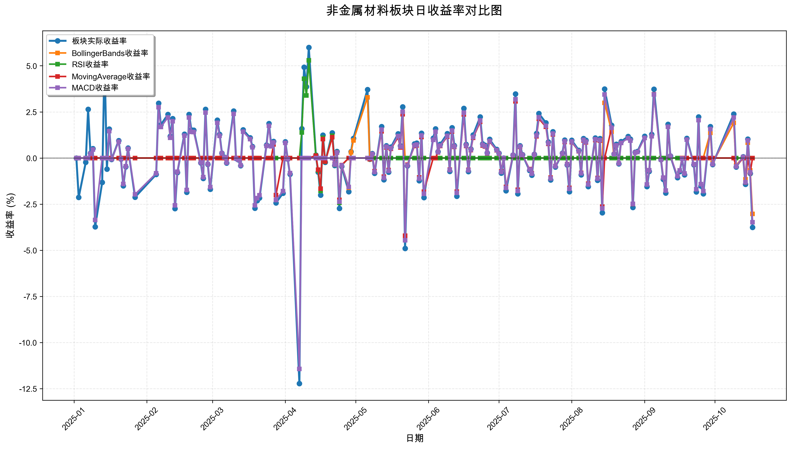
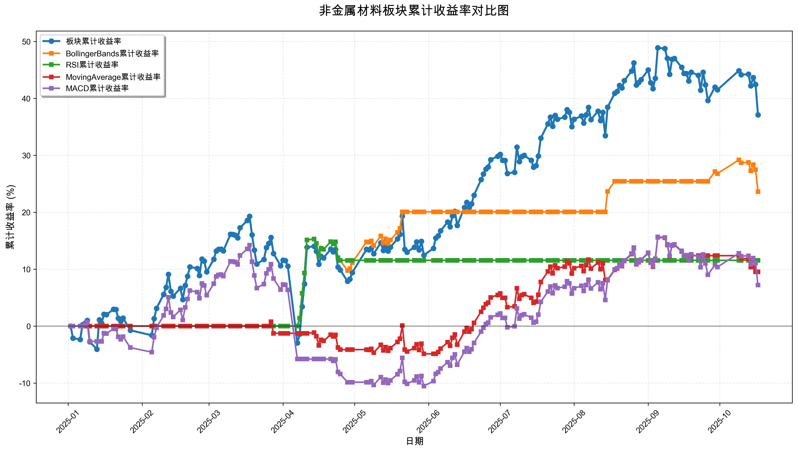

# 策略回测结果报告

**生成时间**: 2025-10-19 19:07:43
**行业板块**: 非金属材料
**回测期间**: 20250101 至 20251017
**策略数量**: 4

## 📈 分析结论

### 策略表现分析
- **最佳策略**: BollingerBands (总收益率: 23.60%)
- **最差策略**: MACD (总收益率: 7.20%)
### 交易活跃度分析
- **活跃策略**: 4 个
- **非活跃策略**: 0 个
- **最活跃策略**: MovingAverage (交易次数: 16)
### 🚨 异动提醒分析
- **板块异动**: 非金属材料 近两周出现大幅波动 (最大单日: 3.76%)
- **板块异动**: 非金属材料 近两周波动频繁 (方向变化频率: 71.4%)
- **策略异动**: BollingerBands 近两周出现大幅波动 (最大单日: 3.03%)
- **策略异动**: MovingAverage 与板块走势相关性异常 (相关系数: 0.202)
- **策略异动**: MACD 近两周出现大幅波动 (最大单日: 3.48%)
### 风险分析
- **BollingerBands**: 最大回撤 -4.80%, 夏普比率 2.4999
- **RSI**: 最大回撤 -3.25%, 夏普比率 1.5873
- **MovingAverage**: 最大回撤 -5.58%, 夏普比率 0.8710
- **MACD**: 最大回撤 -21.68%, 夏普比率 0.3890

## 📊 综合结果表

| 策略名称           | 初始资金     | 最终价值     | 总收益率   | 年化收益率   | 波动率    |   夏普比率 | 最大回撤    | 总交易次数   | 买入次数   | 卖出次数   | 总交易金额      | 平均交易金额   | 交易频率   |   数据点数 |
|:---------------|:---------|:---------|:-------|:--------|:-------|-------:|:--------|:--------|:-------|:-------|:-----------|:---------|:-------|-------:|
| 板块实际表现         | ¥100,000 | ¥137,091 | 37.09% | 51.96%  | 30.08% | 1.7275 | -18.65% | N/A     | N/A    | N/A    | N/A        | N/A      | N/A    |    190 |
| BollingerBands | ¥100,000 | ¥123,604 | 23.60% | 32.45%  | 12.98% | 2.4999 | -4.80%  | 6       | 4      | 2      | ¥517,289   | ¥86,215  | 0.03   |    190 |
| RSI            | ¥100,000 | ¥111,538 | 11.54% | 15.58%  | 9.82%  | 1.5873 | -3.25%  | 2       | 1      | 1      | ¥186,136   | ¥93,068  | 0.01   |    190 |
| MovingAverage  | ¥100,000 | ¥109,509 | 9.51%  | 12.80%  | 14.70% | 0.871  | -5.58%  | 16      | 8      | 8      | ¥1,490,035 | ¥93,127  | 0.08   |    190 |
| MACD           | ¥100,000 | ¥107,196 | 7.20%  | 9.65%   | 24.82% | 0.389  | -21.68% | 8       | 4      | 4      | ¥694,986   | ¥86,873  | 0.04   |    190 |

## 📊 每日收益率走势图

*图1: 非金属材料板块每日收益率走势对比*

## 📈 累计收益率走势图

*图2: 非金属材料板块累计收益率走势对比*

## 📅 日收益明细表

| 日期         | 板块实际收益率   | BollingerBands收益率   | RSI收益率   | MovingAverage收益率   | MACD收益率   |
|:-----------|:----------|:--------------------|:---------|:-------------------|:----------|
| 2025-01-02 | 0.00%     | 0.00%               | 0.00%    | 0.00%              | 0.00%     |
| 2025-01-03 | -2.13%    | 0.00%               | 0.00%    | 0.00%              | 0.00%     |
| 2025-01-06 | -0.23%    | 0.00%               | 0.00%    | 0.00%              | 0.00%     |
| 2025-01-07 | 2.64%     | 0.00%               | 0.00%    | 0.00%              | 0.00%     |
| 2025-01-08 | 0.26%     | 0.00%               | 0.00%    | 0.00%              | 0.23%     |
| 2025-01-09 | 0.51%     | 0.00%               | 0.00%    | 0.00%              | 0.46%     |
| 2025-01-10 | -3.73%    | 0.00%               | 0.00%    | 0.00%              | -3.36%    |
| 2025-01-13 | -1.32%    | 0.00%               | 0.00%    | 0.00%              | 0.00%     |
| 2025-01-14 | 5.36%     | 0.00%               | 0.00%    | 0.00%              | 0.00%     |
| 2025-01-15 | -0.60%    | 0.00%               | 0.00%    | 0.00%              | 0.00%     |
| 2025-01-16 | 1.57%     | 0.00%               | 0.00%    | 0.00%              | 1.46%     |
| 2025-01-17 | -0.08%    | 0.00%               | 0.00%    | 0.00%              | -0.07%    |
| 2025-01-20 | 0.94%     | 0.00%               | 0.00%    | 0.00%              | 0.88%     |
| 2025-01-21 | -0.05%    | 0.00%               | 0.00%    | 0.00%              | -0.04%    |
| 2025-01-22 | -1.50%    | 0.00%               | 0.00%    | 0.00%              | -1.40%    |
| 2025-01-23 | -0.48%    | 0.00%               | 0.00%    | 0.00%              | -0.45%    |
| 2025-01-24 | 0.54%     | 0.00%               | 0.00%    | 0.00%              | 0.50%     |
| 2025-01-27 | -2.12%    | 0.00%               | 0.00%    | 0.00%              | -1.97%    |
| 2025-02-05 | -0.89%    | 0.00%               | 0.00%    | 0.00%              | -0.83%    |
| 2025-02-06 | 2.97%     | 0.00%               | 0.00%    | 0.00%              | 2.75%     |
| 2025-02-07 | 1.81%     | 0.00%               | 0.00%    | 0.00%              | 1.68%     |
| 2025-02-10 | 2.36%     | 0.00%               | 0.00%    | 0.00%              | 2.20%     |
| 2025-02-11 | 1.18%     | 0.00%               | 0.00%    | 0.00%              | 1.10%     |
| 2025-02-12 | 2.14%     | 0.00%               | 0.00%    | 0.00%              | 1.99%     |
| 2025-02-13 | -2.74%    | 0.00%               | 0.00%    | 0.00%              | -2.56%    |
| 2025-02-14 | -0.79%    | 0.00%               | 0.00%    | 0.00%              | -0.74%    |
| 2025-02-17 | 1.29%     | 0.00%               | 0.00%    | 0.00%              | 1.21%     |
| 2025-02-18 | -1.85%    | 0.00%               | 0.00%    | 0.00%              | -1.73%    |
| 2025-02-19 | 2.36%     | 0.00%               | 0.00%    | 0.00%              | 2.20%     |
| 2025-02-20 | 1.52%     | 0.00%               | 0.00%    | 0.00%              | 1.42%     |
| 2025-02-21 | 1.51%     | 0.00%               | 0.00%    | 0.00%              | 1.41%     |
| 2025-02-24 | -0.26%    | 0.00%               | 0.00%    | 0.00%              | -0.24%    |
| 2025-02-25 | -1.10%    | 0.00%               | 0.00%    | 0.00%              | -1.03%    |
| 2025-02-26 | 2.64%     | 0.00%               | 0.00%    | 0.00%              | 2.46%     |
| 2025-02-27 | -0.34%    | 0.00%               | 0.00%    | 0.00%              | -0.32%    |
| 2025-02-28 | -1.69%    | 0.00%               | 0.00%    | 0.00%              | -1.58%    |
| 2025-03-03 | 2.05%     | 0.00%               | 0.00%    | 0.00%              | 1.91%     |
| 2025-03-04 | 1.28%     | 0.00%               | 0.00%    | 0.00%              | 1.20%     |
| 2025-03-05 | 0.26%     | 0.00%               | 0.00%    | 0.00%              | 0.25%     |
| 2025-03-06 | 0.05%     | 0.00%               | 0.00%    | 0.00%              | 0.04%     |
| 2025-03-07 | -0.27%    | 0.00%               | 0.00%    | 0.00%              | -0.25%    |
| 2025-03-10 | 2.55%     | 0.00%               | 0.00%    | 0.00%              | 2.39%     |
| 2025-03-11 | -0.02%    | 0.00%               | 0.00%    | 0.00%              | -0.02%    |
| 2025-03-12 | -0.10%    | 0.00%               | 0.00%    | 0.00%              | -0.10%    |
| 2025-03-13 | -0.41%    | 0.00%               | 0.00%    | 0.00%              | -0.39%    |
| 2025-03-14 | 1.53%     | 0.00%               | 0.00%    | 0.00%              | 1.43%     |
| 2025-03-17 | 1.10%     | 0.00%               | 0.00%    | 0.00%              | 1.03%     |
| 2025-03-18 | 0.62%     | 0.00%               | 0.00%    | 0.00%              | 0.58%     |
| 2025-03-19 | -2.72%    | 0.00%               | 0.00%    | 0.00%              | -2.56%    |
| 2025-03-20 | -2.31%    | 0.00%               | 0.00%    | 0.00%              | -2.17%    |
| 2025-03-21 | -2.16%    | 0.00%               | 0.00%    | 0.00%              | -2.02%    |
| 2025-03-24 | 0.71%     | 0.00%               | 0.00%    | 0.00%              | 0.66%     |
| 2025-03-25 | 1.87%     | 0.00%               | 0.00%    | 0.00%              | 1.75%     |
| 2025-03-26 | 0.67%     | 0.00%               | 0.00%    | 0.00%              | 0.63%     |
| 2025-03-27 | 0.90%     | 0.00%               | 0.00%    | 0.74%              | 0.84%     |
| 2025-03-28 | -2.43%    | 0.00%               | 0.00%    | -2.01%             | -2.28%    |
| 2025-03-31 | -1.91%    | 0.00%               | 0.00%    | 0.00%              | -1.79%    |
| 2025-04-01 | 0.88%     | 0.00%               | 0.00%    | 0.00%              | 0.82%     |
| 2025-04-02 | -0.05%    | 0.00%               | 0.00%    | 0.00%              | -0.05%    |
| 2025-04-03 | -0.88%    | 0.00%               | 0.00%    | 0.00%              | -0.82%    |
| 2025-04-07 | -12.22%   | 0.00%               | 0.00%    | 0.00%              | -11.43%   |
| 2025-04-08 | 1.59%     | 1.39%               | 1.39%    | 0.00%              | 0.00%     |
| 2025-04-09 | 4.92%     | 4.30%               | 4.30%    | 0.00%              | 0.00%     |
| 2025-04-10 | 3.86%     | 3.39%               | 3.39%    | 0.00%              | 0.00%     |
| 2025-04-11 | 5.99%     | 5.29%               | 5.29%    | 0.00%              | 0.00%     |
| 2025-04-14 | 0.16%     | 0.14%               | 0.14%    | 0.13%              | 0.00%     |
| 2025-04-15 | -0.76%    | -0.68%              | -0.68%   | -0.63%             | 0.00%     |
| 2025-04-16 | -2.01%    | -1.78%              | -1.78%   | -1.66%             | 0.00%     |
| 2025-04-17 | 1.24%     | 1.10%               | 1.10%    | 1.02%              | 0.00%     |
| 2025-04-18 | -0.23%    | -0.20%              | -0.20%   | -0.19%             | 0.00%     |
| 2025-04-21 | 1.36%     | 1.21%               | 1.21%    | 1.13%              | 0.00%     |
| 2025-04-22 | -0.40%    | -0.36%              | -0.36%   | -0.33%             | -0.35%    |
| 2025-04-23 | 0.36%     | 0.32%               | 0.32%    | 0.29%              | 0.31%     |
| 2025-04-24 | -2.73%    | -2.43%              | -2.43%   | -2.27%             | -2.37%    |
| 2025-04-25 | -0.46%    | -0.40%              | -0.40%   | -0.38%             | -0.39%    |
| 2025-04-28 | -1.82%    | -1.61%              | 0.00%    | 0.00%              | -1.57%    |
| 2025-04-29 | 0.35%     | 0.31%               | 0.00%    | 0.00%              | 0.00%     |
| 2025-04-30 | 1.07%     | 0.95%               | 0.00%    | 0.00%              | 0.00%     |
| 2025-05-06 | 3.71%     | 3.29%               | 0.00%    | 0.00%              | 0.00%     |
| 2025-05-07 | -0.06%    | -0.06%              | 0.00%    | -0.05%             | 0.00%     |
| 2025-05-08 | 0.24%     | 0.21%               | 0.00%    | 0.20%              | 0.22%     |
| 2025-05-09 | -0.83%    | -0.74%              | 0.00%    | -0.71%             | -0.75%    |
| 2025-05-12 | 1.70%     | 1.51%               | 0.00%    | 1.45%              | 1.54%     |
| 2025-05-13 | -1.18%    | -1.05%              | 0.00%    | -1.01%             | -1.07%    |
| 2025-05-14 | 0.67%     | 0.60%               | 0.00%    | 0.57%              | 0.61%     |
| 2025-05-15 | -0.76%    | -0.68%              | 0.00%    | -0.65%             | -0.69%    |
| 2025-05-16 | 0.59%     | 0.52%               | 0.00%    | 0.50%              | 0.53%     |
| 2025-05-19 | 1.31%     | 1.17%               | 0.00%    | 1.12%              | 1.19%     |
| 2025-05-20 | 0.67%     | 0.60%               | 0.00%    | 0.57%              | 0.61%     |
| 2025-05-21 | 2.77%     | 2.47%               | 0.00%    | 2.37%              | 2.51%     |
| 2025-05-22 | -4.90%    | 0.00%               | 0.00%    | -4.21%             | -4.46%    |
| 2025-05-23 | -0.43%    | 0.00%               | 0.00%    | -0.36%             | -0.39%    |
| 2025-05-26 | 0.77%     | 0.00%               | 0.00%    | 0.65%              | 0.69%     |
| 2025-05-27 | 0.81%     | 0.00%               | 0.00%    | 0.69%              | 0.73%     |
| 2025-05-28 | -1.23%    | 0.00%               | 0.00%    | -1.05%             | -1.11%    |
| 2025-05-29 | 1.34%     | 0.00%               | 0.00%    | 1.14%              | 1.22%     |
| 2025-05-30 | -2.14%    | 0.00%               | 0.00%    | -1.82%             | -1.94%    |
| 2025-06-03 | 1.08%     | 0.00%               | 0.00%    | 0.00%              | 0.98%     |
| 2025-06-04 | 1.58%     | 0.00%               | 0.00%    | 0.00%              | 1.43%     |
| 2025-06-05 | 0.35%     | 0.00%               | 0.00%    | 0.31%              | 0.32%     |
| 2025-06-06 | 0.75%     | 0.00%               | 0.00%    | 0.66%              | 0.68%     |
| 2025-06-09 | 1.32%     | 0.00%               | 0.00%    | 1.16%              | 1.20%     |
| 2025-06-10 | -0.72%    | 0.00%               | 0.00%    | -0.63%             | -0.65%    |
| 2025-06-11 | 1.64%     | 0.00%               | 0.00%    | 1.44%              | 1.49%     |
| 2025-06-12 | 0.68%     | 0.00%               | 0.00%    | 0.60%              | 0.62%     |
| 2025-06-13 | -2.07%    | 0.00%               | 0.00%    | -1.82%             | -1.89%    |
| 2025-06-16 | 2.69%     | 0.00%               | 0.00%    | 2.36%              | 2.45%     |
| 2025-06-17 | 0.74%     | 0.00%               | 0.00%    | 0.65%              | 0.68%     |
| 2025-06-18 | -0.73%    | 0.00%               | 0.00%    | -0.64%             | -0.66%    |
| 2025-06-19 | 0.49%     | 0.00%               | 0.00%    | 0.43%              | 0.45%     |
| 2025-06-20 | 1.25%     | 0.00%               | 0.00%    | 1.10%              | 1.14%     |
| 2025-06-23 | 2.23%     | 0.00%               | 0.00%    | 1.96%              | 2.03%     |
| 2025-06-24 | 0.77%     | 0.00%               | 0.00%    | 0.68%              | 0.71%     |
| 2025-06-25 | 0.70%     | 0.00%               | 0.00%    | 0.62%              | 0.64%     |
| 2025-06-26 | 0.28%     | 0.00%               | 0.00%    | 0.24%              | 0.25%     |
| 2025-06-27 | 1.01%     | 0.00%               | 0.00%    | 0.89%              | 0.92%     |
| 2025-06-30 | 0.47%     | 0.00%               | 0.00%    | 0.42%              | 0.43%     |
| 2025-07-01 | 0.26%     | 0.00%               | 0.00%    | 0.23%              | 0.24%     |
| 2025-07-02 | -0.82%    | 0.00%               | 0.00%    | -0.72%             | -0.75%    |
| 2025-07-03 | -0.00%    | 0.00%               | 0.00%    | -0.00%             | -0.00%    |
| 2025-07-04 | -1.77%    | 0.00%               | 0.00%    | -1.57%             | -1.62%    |
| 2025-07-07 | 0.16%     | 0.00%               | 0.00%    | 0.14%              | 0.15%     |
| 2025-07-08 | 3.47%     | 0.00%               | 0.00%    | 3.07%              | 3.18%     |
| 2025-07-09 | -1.94%    | 0.00%               | 0.00%    | -1.72%             | -1.78%    |
| 2025-07-10 | 0.67%     | 0.00%               | 0.00%    | 0.60%              | 0.62%     |
| 2025-07-11 | 0.18%     | 0.00%               | 0.00%    | 0.16%              | 0.17%     |
| 2025-07-14 | -0.67%    | 0.00%               | 0.00%    | -0.60%             | -0.62%    |
| 2025-07-15 | -0.93%    | 0.00%               | 0.00%    | -0.83%             | -0.85%    |
| 2025-07-16 | 0.20%     | 0.00%               | 0.00%    | 0.18%              | 0.18%     |
| 2025-07-17 | 1.33%     | 0.00%               | 0.00%    | 1.18%              | 1.22%     |
| 2025-07-18 | 2.41%     | 0.00%               | 0.00%    | 2.13%              | 2.21%     |
| 2025-07-21 | 1.91%     | 0.00%               | 0.00%    | 1.69%              | 1.75%     |
| 2025-07-22 | 0.87%     | 0.00%               | 0.00%    | 0.77%              | 0.80%     |
| 2025-07-23 | -1.19%    | 0.00%               | 0.00%    | -1.06%             | -1.10%    |
| 2025-07-24 | 1.43%     | 0.00%               | 0.00%    | 1.28%              | 1.32%     |
| 2025-07-25 | -0.49%    | 0.00%               | 0.00%    | -0.44%             | -0.45%    |
| 2025-07-28 | 0.26%     | 0.00%               | 0.00%    | 0.23%              | 0.24%     |
| 2025-07-29 | 0.97%     | 0.00%               | 0.00%    | 0.87%              | 0.90%     |
| 2025-07-30 | -0.37%    | 0.00%               | 0.00%    | -0.33%             | -0.34%    |
| 2025-07-31 | -1.82%    | 0.00%               | 0.00%    | -1.62%             | -1.67%    |
| 2025-08-01 | 0.96%     | 0.00%               | 0.00%    | 0.86%              | 0.89%     |
| 2025-08-04 | 0.42%     | 0.00%               | 0.00%    | 0.37%              | 0.38%     |
| 2025-08-05 | -0.91%    | 0.00%               | 0.00%    | -0.81%             | -0.83%    |
| 2025-08-06 | 1.06%     | 0.00%               | 0.00%    | 0.95%              | 0.98%     |
| 2025-08-07 | 0.96%     | 0.00%               | 0.00%    | 0.85%              | 0.88%     |
| 2025-08-08 | -1.55%    | 0.00%               | 0.00%    | -1.39%             | -1.43%    |
| 2025-08-11 | 1.09%     | 0.00%               | 0.00%    | 0.97%              | 1.01%     |
| 2025-08-12 | -1.21%    | 0.00%               | 0.00%    | -1.08%             | -1.11%    |
| 2025-08-13 | 1.06%     | 0.00%               | 0.00%    | 0.94%              | 0.97%     |
| 2025-08-14 | -2.96%    | 0.00%               | 0.00%    | -2.64%             | -2.73%    |
| 2025-08-15 | 3.74%     | 2.99%               | 0.00%    | 0.00%              | 3.44%     |
| 2025-08-18 | 1.78%     | 1.43%               | 0.00%    | 1.64%              | 1.64%     |
| 2025-08-19 | 0.22%     | 0.00%               | 0.00%    | 0.20%              | 0.20%     |
| 2025-08-20 | 0.75%     | 0.00%               | 0.00%    | 0.69%              | 0.69%     |
| 2025-08-21 | -0.31%    | 0.00%               | 0.00%    | -0.29%             | -0.29%    |
| 2025-08-22 | 0.89%     | 0.00%               | 0.00%    | 0.82%              | 0.82%     |
| 2025-08-25 | 1.17%     | 0.00%               | 0.00%    | 1.08%              | 1.08%     |
| 2025-08-26 | 1.02%     | 0.00%               | 0.00%    | 0.94%              | 0.94%     |
| 2025-08-27 | -2.68%    | 0.00%               | 0.00%    | -2.49%             | -2.48%    |
| 2025-08-28 | 0.32%     | 0.00%               | 0.00%    | 0.29%              | 0.29%     |
| 2025-08-29 | 0.36%     | 0.00%               | 0.00%    | 0.33%              | 0.33%     |
| 2025-09-01 | 1.18%     | 0.00%               | 0.00%    | 1.09%              | 1.09%     |
| 2025-09-02 | -1.55%    | 0.00%               | 0.00%    | -1.43%             | -1.43%    |
| 2025-09-03 | -0.72%    | 0.00%               | 0.00%    | -0.66%             | -0.66%    |
| 2025-09-04 | 1.28%     | 0.00%               | 0.00%    | 1.18%              | 1.18%     |
| 2025-09-05 | 3.73%     | 0.00%               | 0.00%    | 3.45%              | 3.44%     |
| 2025-09-08 | -0.09%    | 0.00%               | 0.00%    | -0.09%             | -0.09%    |
| 2025-09-09 | -1.15%    | 0.00%               | 0.00%    | -1.06%             | -1.06%    |
| 2025-09-10 | -1.90%    | 0.00%               | 0.00%    | -1.76%             | -1.76%    |
| 2025-09-11 | 1.83%     | 0.00%               | 0.00%    | 1.69%              | 1.69%     |
| 2025-09-12 | 0.11%     | 0.00%               | 0.00%    | 0.10%              | 0.10%     |
| 2025-09-15 | -1.06%    | 0.00%               | 0.00%    | -0.98%             | -0.98%    |
| 2025-09-16 | -0.73%    | 0.00%               | 0.00%    | -0.67%             | -0.67%    |
| 2025-09-17 | -0.02%    | 0.00%               | 0.00%    | 0.00%              | -0.02%    |
| 2025-09-18 | -0.91%    | 0.00%               | 0.00%    | 0.00%              | -0.84%    |
| 2025-09-19 | 1.07%     | 0.00%               | 0.00%    | 0.00%              | 0.99%     |
| 2025-09-22 | -0.36%    | 0.00%               | 0.00%    | 0.00%              | -0.33%    |
| 2025-09-23 | -1.83%    | 0.00%               | 0.00%    | 0.00%              | -1.69%    |
| 2025-09-24 | 2.23%     | 0.00%               | 0.00%    | 0.00%              | 2.05%     |
| 2025-09-25 | -1.52%    | 0.00%               | 0.00%    | 0.00%              | -1.41%    |
| 2025-09-26 | -1.94%    | 0.00%               | 0.00%    | 0.00%              | -1.79%    |
| 2025-09-29 | 1.70%     | 1.36%               | 0.00%    | 0.00%              | 1.57%     |
| 2025-09-30 | -0.35%    | -0.28%              | 0.00%    | 0.00%              | -0.33%    |
| 2025-10-09 | 2.38%     | 1.91%               | 0.00%    | 0.00%              | 2.20%     |
| 2025-10-10 | -0.49%    | -0.40%              | 0.00%    | -0.46%             | -0.46%    |
| 2025-10-13 | 0.07%     | 0.05%               | 0.00%    | 0.00%              | 0.06%     |
| 2025-10-14 | -1.42%    | -1.15%              | 0.00%    | -1.32%             | -1.31%    |
| 2025-10-15 | 1.03%     | 0.83%               | 0.00%    | 0.00%              | 0.95%     |
| 2025-10-16 | -0.84%    | -0.67%              | 0.00%    | -0.78%             | -0.77%    |
| 2025-10-17 | -3.76%    | -3.03%              | 0.00%    | 0.00%              | -3.48%    |

## 📊 日收益统计摘要

| 指标                | 平均日收益率   | 最大日收益率   | 最小日收益率   | 正收益天数   | 负收益天数   |
|:------------------|:---------|:---------|:---------|:--------|:--------|
| 板块实际收益率           | 0.18%    | 5.99%    | -12.22%  | 107天    | 81天     |
| BollingerBands收益率 | 0.11%    | 5.29%    | -3.03%   | 24天     | 16天     |
| RSI收益率            | 0.06%    | 5.29%    | -2.43%   | 8天      | 6天      |
| MovingAverage收益率  | 0.05%    | 3.45%    | -4.21%   | 62天     | 43天     |
| MACD收益率           | 0.05%    | 3.44%    | -11.43%  | 95天     | 73天     |

## 📈 累计收益明细表

| 日期         | 板块累计收益率   | BollingerBands累计收益率   | RSI累计收益率   | MovingAverage累计收益率   | MACD累计收益率   |
|:-----------|:----------|:----------------------|:-----------|:---------------------|:------------|
| 2025-01-02 | 0.00%     | 0.00%                 | 0.00%      | 0.00%                | 0.00%       |
| 2025-01-03 | -2.13%    | 0.00%                 | 0.00%      | 0.00%                | 0.00%       |
| 2025-01-06 | -2.36%    | 0.00%                 | 0.00%      | 0.00%                | 0.00%       |
| 2025-01-07 | 0.22%     | 0.00%                 | 0.00%      | 0.00%                | 0.00%       |
| 2025-01-08 | 0.48%     | 0.00%                 | 0.00%      | 0.00%                | 0.23%       |
| 2025-01-09 | 0.99%     | 0.00%                 | 0.00%      | 0.00%                | 0.70%       |
| 2025-01-10 | -2.77%    | 0.00%                 | 0.00%      | 0.00%                | -2.69%      |
| 2025-01-13 | -4.06%    | 0.00%                 | 0.00%      | 0.00%                | -2.69%      |
| 2025-01-14 | 1.09%     | 0.00%                 | 0.00%      | 0.00%                | -2.69%      |
| 2025-01-15 | 0.49%     | 0.00%                 | 0.00%      | 0.00%                | -2.69%      |
| 2025-01-16 | 2.07%     | 0.00%                 | 0.00%      | 0.00%                | -1.27%      |
| 2025-01-17 | 1.99%     | 0.00%                 | 0.00%      | 0.00%                | -1.34%      |
| 2025-01-20 | 2.95%     | 0.00%                 | 0.00%      | 0.00%                | -0.47%      |
| 2025-01-21 | 2.90%     | 0.00%                 | 0.00%      | 0.00%                | -0.51%      |
| 2025-01-22 | 1.35%     | 0.00%                 | 0.00%      | 0.00%                | -1.91%      |
| 2025-01-23 | 0.87%     | 0.00%                 | 0.00%      | 0.00%                | -2.34%      |
| 2025-01-24 | 1.41%     | 0.00%                 | 0.00%      | 0.00%                | -1.86%      |
| 2025-01-27 | -0.74%    | 0.00%                 | 0.00%      | 0.00%                | -3.79%      |
| 2025-02-05 | -1.63%    | 0.00%                 | 0.00%      | 0.00%                | -4.59%      |
| 2025-02-06 | 1.29%     | 0.00%                 | 0.00%      | 0.00%                | -1.96%      |
| 2025-02-07 | 3.12%     | 0.00%                 | 0.00%      | 0.00%                | -0.31%      |
| 2025-02-10 | 5.56%     | 0.00%                 | 0.00%      | 0.00%                | 1.88%       |
| 2025-02-11 | 6.80%     | 0.00%                 | 0.00%      | 0.00%                | 3.00%       |
| 2025-02-12 | 9.09%     | 0.00%                 | 0.00%      | 0.00%                | 5.05%       |
| 2025-02-13 | 6.10%     | 0.00%                 | 0.00%      | 0.00%                | 2.36%       |
| 2025-02-14 | 5.26%     | 0.00%                 | 0.00%      | 0.00%                | 1.61%       |
| 2025-02-17 | 6.62%     | 0.00%                 | 0.00%      | 0.00%                | 2.83%       |
| 2025-02-18 | 4.65%     | 0.00%                 | 0.00%      | 0.00%                | 1.06%       |
| 2025-02-19 | 7.12%     | 0.00%                 | 0.00%      | 0.00%                | 3.28%       |
| 2025-02-20 | 8.75%     | 0.00%                 | 0.00%      | 0.00%                | 4.75%       |
| 2025-02-21 | 10.40%    | 0.00%                 | 0.00%      | 0.00%                | 6.23%       |
| 2025-02-24 | 10.11%    | 0.00%                 | 0.00%      | 0.00%                | 5.97%       |
| 2025-02-25 | 8.89%     | 0.00%                 | 0.00%      | 0.00%                | 4.88%       |
| 2025-02-26 | 11.76%    | 0.00%                 | 0.00%      | 0.00%                | 7.46%       |
| 2025-02-27 | 11.38%    | 0.00%                 | 0.00%      | 0.00%                | 7.12%       |
| 2025-02-28 | 9.50%     | 0.00%                 | 0.00%      | 0.00%                | 5.42%       |
| 2025-03-03 | 11.74%    | 0.00%                 | 0.00%      | 0.00%                | 7.44%       |
| 2025-03-04 | 13.17%    | 0.00%                 | 0.00%      | 0.00%                | 8.72%       |
| 2025-03-05 | 13.46%    | 0.00%                 | 0.00%      | 0.00%                | 8.99%       |
| 2025-03-06 | 13.52%    | 0.00%                 | 0.00%      | 0.00%                | 9.04%       |
| 2025-03-07 | 13.22%    | 0.00%                 | 0.00%      | 0.00%                | 8.77%       |
| 2025-03-10 | 16.11%    | 0.00%                 | 0.00%      | 0.00%                | 11.37%      |
| 2025-03-11 | 16.08%    | 0.00%                 | 0.00%      | 0.00%                | 11.34%      |
| 2025-03-12 | 15.96%    | 0.00%                 | 0.00%      | 0.00%                | 11.24%      |
| 2025-03-13 | 15.48%    | 0.00%                 | 0.00%      | 0.00%                | 10.81%      |
| 2025-03-14 | 17.25%    | 0.00%                 | 0.00%      | 0.00%                | 12.39%      |
| 2025-03-17 | 18.53%    | 0.00%                 | 0.00%      | 0.00%                | 13.55%      |
| 2025-03-18 | 19.27%    | 0.00%                 | 0.00%      | 0.00%                | 14.21%      |
| 2025-03-19 | 16.02%    | 0.00%                 | 0.00%      | 0.00%                | 11.29%      |
| 2025-03-20 | 13.33%    | 0.00%                 | 0.00%      | 0.00%                | 8.87%       |
| 2025-03-21 | 10.89%    | 0.00%                 | 0.00%      | 0.00%                | 6.67%       |
| 2025-03-24 | 11.68%    | 0.00%                 | 0.00%      | 0.00%                | 7.38%       |
| 2025-03-25 | 13.77%    | 0.00%                 | 0.00%      | 0.00%                | 9.26%       |
| 2025-03-26 | 14.53%    | 0.00%                 | 0.00%      | 0.00%                | 9.95%       |
| 2025-03-27 | 15.56%    | 0.00%                 | 0.00%      | 0.74%                | 10.87%      |
| 2025-03-28 | 12.75%    | 0.00%                 | 0.00%      | -1.28%               | 8.35%       |
| 2025-03-31 | 10.60%    | 0.00%                 | 0.00%      | -1.28%               | 6.41%       |
| 2025-04-01 | 11.57%    | 0.00%                 | 0.00%      | -1.28%               | 7.29%       |
| 2025-04-02 | 11.51%    | 0.00%                 | 0.00%      | -1.28%               | 7.23%       |
| 2025-04-03 | 10.53%    | 0.00%                 | 0.00%      | -1.28%               | 6.35%       |
| 2025-04-07 | -2.97%    | 0.00%                 | 0.00%      | -1.28%               | -5.80%      |
| 2025-04-08 | -1.43%    | 1.39%                 | 1.39%      | -1.28%               | -5.80%      |
| 2025-04-09 | 3.41%     | 5.74%                 | 5.74%      | -1.28%               | -5.80%      |
| 2025-04-10 | 7.40%     | 9.33%                 | 9.33%      | -1.28%               | -5.80%      |
| 2025-04-11 | 13.83%    | 15.12%                | 15.12%     | -1.28%               | -5.80%      |
| 2025-04-14 | 14.01%    | 15.28%                | 15.28%     | -1.15%               | -5.80%      |
| 2025-04-15 | 13.14%    | 14.50%                | 14.50%     | -1.78%               | -5.80%      |
| 2025-04-16 | 10.87%    | 12.45%                | 12.45%     | -3.41%               | -5.80%      |
| 2025-04-17 | 12.24%    | 13.69%                | 13.69%     | -2.42%               | -5.80%      |
| 2025-04-18 | 11.98%    | 13.46%                | 13.46%     | -2.61%               | -5.80%      |
| 2025-04-21 | 13.51%    | 14.83%                | 14.83%     | -1.51%               | -5.80%      |
| 2025-04-22 | 13.05%    | 14.42%                | 14.42%     | -1.84%               | -6.13%      |
| 2025-04-23 | 13.46%    | 14.78%                | 14.78%     | -1.55%               | -5.84%      |
| 2025-04-24 | 10.35%    | 11.99%                | 11.99%     | -3.78%               | -8.07%      |
| 2025-04-25 | 9.85%     | 11.54%                | 11.54%     | -4.14%               | -8.43%      |
| 2025-04-28 | 7.86%     | 9.74%                 | 11.54%     | -4.14%               | -9.87%      |
| 2025-04-29 | 8.23%     | 10.08%                | 11.54%     | -4.14%               | -9.87%      |
| 2025-04-30 | 9.39%     | 11.13%                | 11.54%     | -4.14%               | -9.87%      |
| 2025-05-06 | 13.46%    | 14.78%                | 11.54%     | -4.14%               | -9.87%      |
| 2025-05-07 | 13.38%    | 14.72%                | 11.54%     | -4.20%               | -9.87%      |
| 2025-05-08 | 13.66%    | 14.96%                | 11.54%     | -4.00%               | -9.67%      |
| 2025-05-09 | 12.71%    | 14.11%                | 11.54%     | -4.68%               | -10.35%     |
| 2025-05-12 | 14.63%    | 15.84%                | 11.54%     | -3.30%               | -8.97%      |
| 2025-05-13 | 13.28%    | 14.62%                | 11.54%     | -4.27%               | -9.94%      |
| 2025-05-14 | 14.04%    | 15.31%                | 11.54%     | -3.72%               | -9.40%      |
| 2025-05-15 | 13.17%    | 14.52%                | 11.54%     | -4.35%               | -10.02%     |
| 2025-05-16 | 13.84%    | 15.12%                | 11.54%     | -3.87%               | -9.54%      |
| 2025-05-19 | 15.33%    | 16.47%                | 11.54%     | -2.80%               | -8.47%      |
| 2025-05-20 | 16.10%    | 17.16%                | 11.54%     | -2.24%               | -7.91%      |
| 2025-05-21 | 19.32%    | 20.05%                | 11.54%     | 0.07%                | -5.60%      |
| 2025-05-22 | 13.47%    | 20.05%                | 11.54%     | -4.14%               | -9.81%      |
| 2025-05-23 | 12.98%    | 20.05%                | 11.54%     | -4.48%               | -10.16%     |
| 2025-05-26 | 13.85%    | 20.05%                | 11.54%     | -3.86%               | -9.54%      |
| 2025-05-27 | 14.77%    | 20.05%                | 11.54%     | -3.20%               | -8.87%      |
| 2025-05-28 | 13.36%    | 20.05%                | 11.54%     | -4.21%               | -9.88%      |
| 2025-05-29 | 14.89%    | 20.05%                | 11.54%     | -3.11%               | -8.79%      |
| 2025-05-30 | 12.43%    | 20.05%                | 11.54%     | -4.88%               | -10.55%     |
| 2025-06-03 | 13.65%    | 20.05%                | 11.54%     | -4.88%               | -9.68%      |
| 2025-06-04 | 15.44%    | 20.05%                | 11.54%     | -4.88%               | -8.39%      |
| 2025-06-05 | 15.85%    | 20.05%                | 11.54%     | -4.59%               | -8.09%      |
| 2025-06-06 | 16.72%    | 20.05%                | 11.54%     | -3.96%               | -7.46%      |
| 2025-06-09 | 18.27%    | 20.05%                | 11.54%     | -2.85%               | -6.35%      |
| 2025-06-10 | 17.42%    | 20.05%                | 11.54%     | -3.46%               | -6.96%      |
| 2025-06-11 | 19.35%    | 20.05%                | 11.54%     | -2.07%               | -5.58%      |
| 2025-06-12 | 20.16%    | 20.05%                | 11.54%     | -1.49%               | -4.99%      |
| 2025-06-13 | 17.67%    | 20.05%                | 11.54%     | -3.28%               | -6.78%      |
| 2025-06-16 | 20.84%    | 20.05%                | 11.54%     | -1.00%               | -4.50%      |
| 2025-06-17 | 21.74%    | 20.05%                | 11.54%     | -0.35%               | -3.86%      |
| 2025-06-18 | 20.85%    | 20.05%                | 11.54%     | -0.99%               | -4.50%      |
| 2025-06-19 | 21.45%    | 20.05%                | 11.54%     | -0.56%               | -4.07%      |
| 2025-06-20 | 22.97%    | 20.05%                | 11.54%     | 0.54%                | -2.97%      |
| 2025-06-23 | 25.71%    | 20.05%                | 11.54%     | 2.51%                | -1.00%      |
| 2025-06-24 | 26.68%    | 20.05%                | 11.54%     | 3.21%                | -0.30%      |
| 2025-06-25 | 27.58%    | 20.05%                | 11.54%     | 3.85%                | 0.35%       |
| 2025-06-26 | 27.93%    | 20.05%                | 11.54%     | 4.10%                | 0.60%       |
| 2025-06-27 | 29.22%    | 20.05%                | 11.54%     | 5.03%                | 1.53%       |
| 2025-06-30 | 29.83%    | 20.05%                | 11.54%     | 5.47%                | 1.97%       |
| 2025-07-01 | 30.16%    | 20.05%                | 11.54%     | 5.71%                | 2.21%       |
| 2025-07-02 | 29.10%    | 20.05%                | 11.54%     | 4.95%                | 1.44%       |
| 2025-07-03 | 29.09%    | 20.05%                | 11.54%     | 4.94%                | 1.44%       |
| 2025-07-04 | 26.80%    | 20.05%                | 11.54%     | 3.30%                | -0.21%      |
| 2025-07-07 | 27.01%    | 20.05%                | 11.54%     | 3.45%                | -0.06%      |
| 2025-07-08 | 31.42%    | 20.05%                | 11.54%     | 6.62%                | 3.12%       |
| 2025-07-09 | 28.87%    | 20.05%                | 11.54%     | 4.79%                | 1.28%       |
| 2025-07-10 | 29.74%    | 20.05%                | 11.54%     | 5.41%                | 1.91%       |
| 2025-07-11 | 29.98%    | 20.05%                | 11.54%     | 5.58%                | 2.08%       |
| 2025-07-14 | 29.11%    | 20.05%                | 11.54%     | 4.95%                | 1.45%       |
| 2025-07-15 | 27.90%    | 20.05%                | 11.54%     | 4.09%                | 0.58%       |
| 2025-07-16 | 28.16%    | 20.05%                | 11.54%     | 4.27%                | 0.77%       |
| 2025-07-17 | 29.86%    | 20.05%                | 11.54%     | 5.50%                | 1.99%       |
| 2025-07-18 | 32.99%    | 20.05%                | 11.54%     | 7.75%                | 4.24%       |
| 2025-07-21 | 35.52%    | 20.05%                | 11.54%     | 9.57%                | 6.07%       |
| 2025-07-22 | 36.70%    | 20.05%                | 11.54%     | 10.42%               | 6.92%       |
| 2025-07-23 | 35.07%    | 20.05%                | 11.54%     | 9.25%                | 5.74%       |
| 2025-07-24 | 37.01%    | 20.05%                | 11.54%     | 10.64%               | 7.14%       |
| 2025-07-25 | 36.34%    | 20.05%                | 11.54%     | 10.16%               | 6.65%       |
| 2025-07-28 | 36.69%    | 20.05%                | 11.54%     | 10.41%               | 6.91%       |
| 2025-07-29 | 38.02%    | 20.05%                | 11.54%     | 11.37%               | 7.86%       |
| 2025-07-30 | 37.52%    | 20.05%                | 11.54%     | 11.01%               | 7.50%       |
| 2025-07-31 | 35.02%    | 20.05%                | 11.54%     | 9.21%                | 5.70%       |
| 2025-08-01 | 36.32%    | 20.05%                | 11.54%     | 10.15%               | 6.64%       |
| 2025-08-04 | 36.89%    | 20.05%                | 11.54%     | 10.56%               | 7.05%       |
| 2025-08-05 | 35.65%    | 20.05%                | 11.54%     | 9.66%                | 6.16%       |
| 2025-08-06 | 37.09%    | 20.05%                | 11.54%     | 10.70%               | 7.20%       |
| 2025-08-07 | 38.41%    | 20.05%                | 11.54%     | 11.65%               | 8.14%       |
| 2025-08-08 | 36.25%    | 20.05%                | 11.54%     | 10.10%               | 6.59%       |
| 2025-08-11 | 37.75%    | 20.05%                | 11.54%     | 11.17%               | 7.67%       |
| 2025-08-12 | 36.08%    | 20.05%                | 11.54%     | 9.98%                | 6.47%       |
| 2025-08-13 | 37.52%    | 20.05%                | 11.54%     | 11.01%               | 7.51%       |
| 2025-08-14 | 33.45%    | 20.05%                | 11.54%     | 8.08%                | 4.58%       |
| 2025-08-15 | 38.44%    | 23.65%                | 11.54%     | 8.08%                | 8.17%       |
| 2025-08-18 | 40.90%    | 25.42%                | 11.54%     | 9.85%                | 9.94%       |
| 2025-08-19 | 41.21%    | 25.42%                | 11.54%     | 10.07%               | 10.16%      |
| 2025-08-20 | 42.27%    | 25.42%                | 11.54%     | 10.84%               | 10.92%      |
| 2025-08-21 | 41.82%    | 25.42%                | 11.54%     | 10.51%               | 10.60%      |
| 2025-08-22 | 43.09%    | 25.42%                | 11.54%     | 11.42%               | 11.51%      |
| 2025-08-25 | 44.77%    | 25.42%                | 11.54%     | 12.63%               | 12.72%      |
| 2025-08-26 | 46.24%    | 25.42%                | 11.54%     | 13.69%               | 13.78%      |
| 2025-08-27 | 42.32%    | 25.42%                | 11.54%     | 10.87%               | 10.96%      |
| 2025-08-28 | 42.77%    | 25.42%                | 11.54%     | 11.19%               | 11.28%      |
| 2025-08-29 | 43.29%    | 25.42%                | 11.54%     | 11.57%               | 11.65%      |
| 2025-09-01 | 44.98%    | 25.42%                | 11.54%     | 12.79%               | 12.87%      |
| 2025-09-02 | 42.73%    | 25.42%                | 11.54%     | 11.17%               | 11.26%      |
| 2025-09-03 | 41.71%    | 25.42%                | 11.54%     | 10.43%               | 10.52%      |
| 2025-09-04 | 43.52%    | 25.42%                | 11.54%     | 11.73%               | 11.82%      |
| 2025-09-05 | 48.87%    | 25.42%                | 11.54%     | 15.58%               | 15.67%      |
| 2025-09-08 | 48.73%    | 25.42%                | 11.54%     | 15.48%               | 15.57%      |
| 2025-09-09 | 47.02%    | 25.42%                | 11.54%     | 14.25%               | 14.34%      |
| 2025-09-10 | 44.22%    | 25.42%                | 11.54%     | 12.24%               | 12.33%      |
| 2025-09-11 | 46.85%    | 25.42%                | 11.54%     | 14.14%               | 14.22%      |
| 2025-09-12 | 47.01%    | 25.42%                | 11.54%     | 14.25%               | 14.34%      |
| 2025-09-15 | 45.45%    | 25.42%                | 11.54%     | 13.12%               | 13.21%      |
| 2025-09-16 | 44.39%    | 25.42%                | 11.54%     | 12.36%               | 12.45%      |
| 2025-09-17 | 44.36%    | 25.42%                | 11.54%     | 12.36%               | 12.43%      |
| 2025-09-18 | 43.05%    | 25.42%                | 11.54%     | 12.36%               | 11.48%      |
| 2025-09-19 | 44.58%    | 25.42%                | 11.54%     | 12.36%               | 12.59%      |
| 2025-09-22 | 44.06%    | 25.42%                | 11.54%     | 12.36%               | 12.21%      |
| 2025-09-23 | 41.43%    | 25.42%                | 11.54%     | 12.36%               | 10.32%      |
| 2025-09-24 | 44.58%    | 25.42%                | 11.54%     | 12.36%               | 12.58%      |
| 2025-09-25 | 42.37%    | 25.42%                | 11.54%     | 12.36%               | 11.00%      |
| 2025-09-26 | 39.61%    | 25.42%                | 11.54%     | 12.36%               | 9.01%       |
| 2025-09-29 | 41.98%    | 27.13%                | 11.54%     | 12.36%               | 10.72%      |
| 2025-09-30 | 41.48%    | 26.77%                | 11.54%     | 12.36%               | 10.36%      |
| 2025-10-09 | 44.85%    | 29.19%                | 11.54%     | 12.36%               | 12.78%      |
| 2025-10-10 | 44.14%    | 28.68%                | 11.54%     | 11.85%               | 12.27%      |
| 2025-10-13 | 44.24%    | 28.75%                | 11.54%     | 11.85%               | 12.34%      |
| 2025-10-14 | 42.19%    | 27.27%                | 11.54%     | 10.37%               | 10.86%      |
| 2025-10-15 | 43.65%    | 28.33%                | 11.54%     | 10.37%               | 11.92%      |
| 2025-10-16 | 42.45%    | 27.46%                | 11.54%     | 9.51%                | 11.06%      |
| 2025-10-17 | 37.09%    | 23.60%                | 11.54%     | 9.51%                | 7.20%       |

## 📊 累计收益统计摘要

| 指标                  | 最终累计收益率   | 最大累计收益率   | 最小累计收益率   | 累计收益波动   | 收益稳定性   |
|:--------------------|:----------|:----------|:----------|:---------|:--------|
| 板块累计收益率             | 37.09%    | 48.87%    | -4.06%    | 52.93%   | 波动      |
| BollingerBands累计收益率 | 23.60%    | 29.19%    | 0.00%     | 29.19%   | 波动      |
| RSI累计收益率            | 11.54%    | 15.28%    | 0.00%     | 15.28%   | 稳定      |
| MovingAverage累计收益率  | 9.51%     | 15.58%    | -4.88%    | 20.46%   | 波动      |
| MACD累计收益率           | 7.20%     | 15.67%    | -10.55%   | 26.22%   | 波动      |

