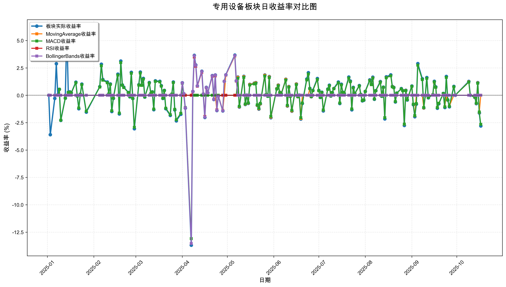
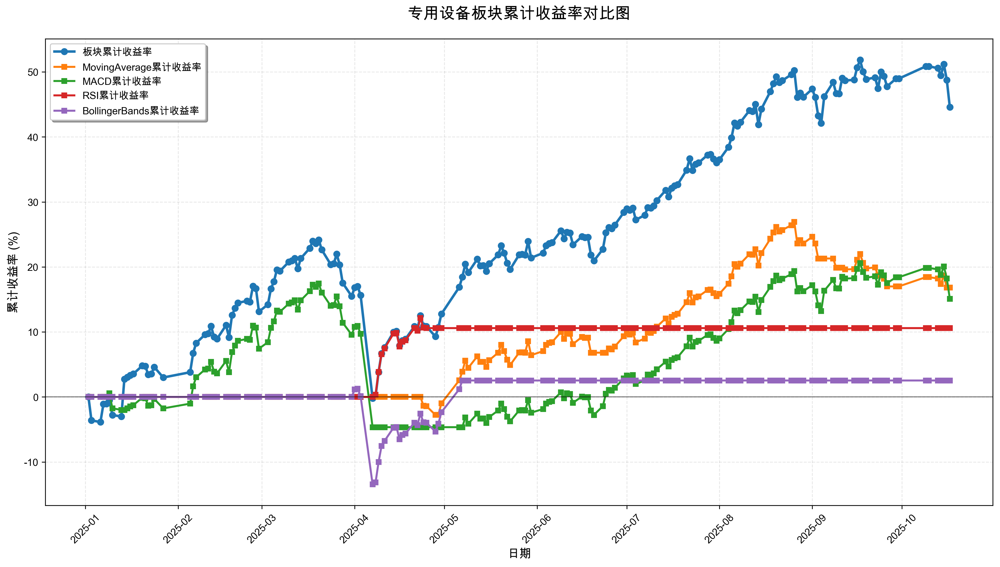

# 策略回测结果报告

**生成时间**: 2025-10-19 19:06:27
**行业板块**: 专用设备
**回测期间**: 20250101 至 20251017
**策略数量**: 4

## 📈 分析结论

### 策略表现分析
- **最佳策略**: MovingAverage (总收益率: 16.83%)
- **最差策略**: BollingerBands (总收益率: 2.53%)
### 交易活跃度分析
- **活跃策略**: 4 个
- **非活跃策略**: 0 个
- **最活跃策略**: MovingAverage (交易次数: 14)
### 🚨 异动提醒分析
- 未检测到明显异动情况
### 风险分析
- **MovingAverage**: 最大回撤 -7.96%, 夏普比率 1.8238
- **MACD**: 最大回撤 -18.82%, 夏普比率 0.9071
- **RSI**: 最大回撤 -1.93%, 夏普比率 2.0480
- **BollingerBands**: 最大回撤 -14.54%, 夏普比率 0.1848

## 📊 综合结果表

| 策略名称           | 初始资金     | 最终价值     | 总收益率   | 年化收益率   | 波动率    |   夏普比率 | 最大回撤    | 总交易次数   | 买入次数   | 卖出次数   | 总交易金额      | 平均交易金额   | 交易频率   |   数据点数 |
|:---------------|:---------|:---------|:-------|:--------|:-------|-------:|:--------|:--------|:-------|:-------|:-----------|:---------|:-------|-------:|
| 板块实际表现         | ¥100,000 | ¥144,571 | 44.57% | 63.05%  | 26.69% | 2.3624 | -19.62% | N/A     | N/A    | N/A    | N/A        | N/A      | N/A    |    190 |
| MovingAverage  | ¥100,000 | ¥116,828 | 16.83% | 22.91%  | 12.56% | 1.8238 | -7.96%  | 14      | 7      | 7      | ¥1,517,780 | ¥108,413 | 0.07   |    190 |
| MACD           | ¥100,000 | ¥115,092 | 15.09% | 20.49%  | 22.59% | 0.9071 | -18.82% | 5       | 3      | 2      | ¥470,702   | ¥94,140  | 0.03   |    190 |
| RSI            | ¥100,000 | ¥110,586 | 10.59% | 14.28%  | 6.97%  | 2.048  | -1.93%  | 2       | 1      | 1      | ¥201,697   | ¥100,849 | 0.01   |    190 |
| BollingerBands | ¥100,000 | ¥102,526 | 2.53%  | 3.36%   | 18.20% | 0.1848 | -14.54% | 3       | 2      | 1      | ¥302,399   | ¥100,800 | 0.02   |    190 |

## 📊 每日收益率走势图

*图1: 专用设备板块每日收益率走势对比*

## 📈 累计收益率走势图

*图2: 专用设备板块累计收益率走势对比*

## 📅 日收益明细表

| 日期         | 板块实际收益率   | MovingAverage收益率   | MACD收益率   | RSI收益率   | BollingerBands收益率   |
|:-----------|:----------|:-------------------|:----------|:---------|:--------------------|
| 2025-01-02 | 0.00%     | 0.00%              | 0.00%     | 0.00%    | 0.00%               |
| 2025-01-03 | -3.60%    | 0.00%              | 0.00%     | 0.00%    | 0.00%               |
| 2025-01-06 | -0.28%    | 0.00%              | 0.00%     | 0.00%    | 0.00%               |
| 2025-01-07 | 2.89%     | 0.00%              | 0.00%     | 0.00%    | 0.00%               |
| 2025-01-08 | 0.05%     | 0.00%              | 0.00%     | 0.00%    | 0.00%               |
| 2025-01-09 | 0.55%     | 0.00%              | 0.55%     | 0.00%    | 0.00%               |
| 2025-01-10 | -2.29%    | 0.00%              | -2.28%    | 0.00%    | 0.00%               |
| 2025-01-13 | -0.26%    | 0.00%              | -0.26%    | 0.00%    | 0.00%               |
| 2025-01-14 | 5.93%     | 0.00%              | 0.00%     | 0.00%    | 0.00%               |
| 2025-01-15 | 0.28%     | 0.00%              | 0.27%     | 0.00%    | 0.00%               |
| 2025-01-16 | 0.31%     | 0.00%              | 0.29%     | 0.00%    | 0.00%               |
| 2025-01-17 | 0.21%     | 0.00%              | 0.20%     | 0.00%    | 0.00%               |
| 2025-01-20 | 1.20%     | 0.00%              | 1.15%     | 0.00%    | 0.00%               |
| 2025-01-21 | -0.07%    | 0.00%              | -0.06%    | 0.00%    | 0.00%               |
| 2025-01-22 | -1.22%    | 0.00%              | -1.16%    | 0.00%    | 0.00%               |
| 2025-01-23 | 0.09%     | 0.00%              | 0.09%     | 0.00%    | 0.00%               |
| 2025-01-24 | 1.02%     | 0.00%              | 0.97%     | 0.00%    | 0.00%               |
| 2025-01-27 | -1.54%    | 0.00%              | -1.46%    | 0.00%    | 0.00%               |
| 2025-02-05 | 0.79%     | 0.00%              | 0.75%     | 0.00%    | 0.00%               |
| 2025-02-06 | 2.84%     | 0.00%              | 2.70%     | 0.00%    | 0.00%               |
| 2025-02-07 | 1.45%     | 0.00%              | 1.38%     | 0.00%    | 0.00%               |
| 2025-02-10 | 1.21%     | 0.00%              | 1.15%     | 0.00%    | 0.00%               |
| 2025-02-11 | 0.13%     | 0.00%              | 0.12%     | 0.00%    | 0.00%               |
| 2025-02-12 | 1.03%     | 0.00%              | 0.99%     | 0.00%    | 0.00%               |
| 2025-02-13 | -1.48%    | 0.00%              | -1.41%    | 0.00%    | 0.00%               |
| 2025-02-14 | -0.28%    | 0.00%              | -0.26%    | 0.00%    | 0.00%               |
| 2025-02-17 | 1.93%     | 0.00%              | 1.84%     | 0.00%    | 0.00%               |
| 2025-02-18 | -1.70%    | 0.00%              | -1.62%    | 0.00%    | 0.00%               |
| 2025-02-19 | 3.13%     | 0.00%              | 2.98%     | 0.00%    | 0.00%               |
| 2025-02-20 | 0.95%     | 0.00%              | 0.91%     | 0.00%    | 0.00%               |
| 2025-02-21 | 0.74%     | 0.00%              | 0.70%     | 0.00%    | 0.00%               |
| 2025-02-24 | 0.26%     | 0.00%              | 0.25%     | 0.00%    | 0.00%               |
| 2025-02-25 | -0.14%    | 0.00%              | -0.13%    | 0.00%    | 0.00%               |
| 2025-02-26 | 2.10%     | 0.00%              | 2.01%     | 0.00%    | 0.00%               |
| 2025-02-27 | -0.29%    | 0.00%              | -0.28%    | 0.00%    | 0.00%               |
| 2025-02-28 | -3.05%    | 0.00%              | -2.92%    | 0.00%    | 0.00%               |
| 2025-03-03 | 0.97%     | 0.00%              | 0.92%     | 0.00%    | 0.00%               |
| 2025-03-04 | 2.12%     | 0.00%              | 2.03%     | 0.00%    | 0.00%               |
| 2025-03-05 | 0.94%     | 0.00%              | 0.90%     | 0.00%    | 0.00%               |
| 2025-03-06 | 1.55%     | 0.00%              | 1.48%     | 0.00%    | 0.00%               |
| 2025-03-07 | -0.16%    | 0.00%              | -0.15%    | 0.00%    | 0.00%               |
| 2025-03-10 | 1.17%     | 0.00%              | 1.12%     | 0.00%    | 0.00%               |
| 2025-03-11 | 0.16%     | 0.00%              | 0.15%     | 0.00%    | 0.00%               |
| 2025-03-12 | 0.32%     | 0.00%              | 0.30%     | 0.00%    | 0.00%               |
| 2025-03-13 | -1.31%    | 0.00%              | -1.26%    | 0.00%    | 0.00%               |
| 2025-03-14 | 1.32%     | 0.00%              | 1.27%     | 0.00%    | 0.00%               |
| 2025-03-17 | 1.28%     | 0.00%              | 1.22%     | 0.00%    | 0.00%               |
| 2025-03-18 | 0.88%     | 0.00%              | 0.84%     | 0.00%    | 0.00%               |
| 2025-03-19 | -0.28%    | 0.00%              | -0.27%    | 0.00%    | 0.00%               |
| 2025-03-20 | 0.45%     | 0.00%              | 0.44%     | 0.00%    | 0.00%               |
| 2025-03-21 | -1.23%    | 0.00%              | -1.18%    | 0.00%    | 0.00%               |
| 2025-03-24 | -1.84%    | 0.00%              | -1.77%    | 0.00%    | 0.00%               |
| 2025-03-25 | 0.10%     | 0.00%              | 0.10%     | 0.00%    | 0.00%               |
| 2025-03-26 | 1.21%     | 0.00%              | 1.16%     | 0.00%    | 0.00%               |
| 2025-03-27 | -1.34%    | 0.00%              | -1.28%    | 0.00%    | 0.00%               |
| 2025-03-28 | -2.33%    | 0.00%              | -2.23%    | 0.00%    | 0.00%               |
| 2025-03-31 | -1.73%    | 0.00%              | -1.65%    | 0.00%    | 0.00%               |
| 2025-04-01 | 1.15%     | 0.00%              | 1.10%     | 0.00%    | 1.14%               |
| 2025-04-02 | 0.14%     | 0.00%              | 0.14%     | 0.00%    | 0.14%               |
| 2025-04-03 | -1.17%    | 0.00%              | -1.12%    | 0.00%    | -1.15%              |
| 2025-04-07 | -13.69%   | 0.00%              | -13.09%   | 0.00%    | -13.54%             |
| 2025-04-08 | 0.35%     | 0.00%              | 0.00%     | 0.34%    | 0.35%               |
| 2025-04-09 | 3.65%     | 0.00%              | 0.00%     | 3.49%    | 3.61%               |
| 2025-04-10 | 2.77%     | 0.00%              | 0.00%     | 2.65%    | 2.74%               |
| 2025-04-11 | 0.86%     | 0.00%              | 0.00%     | 0.82%    | 0.85%               |
| 2025-04-14 | 2.20%     | 0.00%              | 0.00%     | 2.11%    | 2.18%               |
| 2025-04-15 | 0.12%     | 0.00%              | 0.00%     | 0.12%    | 0.12%               |
| 2025-04-16 | -2.02%    | 0.00%              | 0.00%     | -1.93%   | -1.99%              |
| 2025-04-17 | 0.72%     | 0.00%              | 0.00%     | 0.69%    | 0.71%               |
| 2025-04-18 | 0.23%     | 0.00%              | 0.00%     | 0.22%    | 0.22%               |
| 2025-04-21 | 1.80%     | 0.00%              | 0.00%     | 1.73%    | 1.78%               |
| 2025-04-22 | -0.38%    | 0.00%              | 0.00%     | -0.36%   | -0.37%              |
| 2025-04-23 | 1.86%     | 0.00%              | 0.00%     | 1.78%    | 1.84%               |
| 2025-04-24 | -1.39%    | -1.34%             | 0.00%     | -1.34%   | -1.38%              |
| 2025-04-25 | -0.07%    | -0.07%             | 0.00%     | -0.06%   | -0.07%              |
| 2025-04-28 | -1.42%    | -1.37%             | 0.00%     | 0.00%    | -1.41%              |
| 2025-04-29 | 1.28%     | 0.00%              | 0.00%     | 0.00%    | 1.27%               |
| 2025-04-30 | 1.87%     | 1.83%              | 0.00%     | 0.00%    | 1.85%               |
| 2025-05-06 | 3.67%     | 3.58%              | 0.00%     | 0.00%    | 3.63%               |
| 2025-05-07 | 1.32%     | 1.29%              | 0.00%     | 0.00%    | 1.31%               |
| 2025-05-08 | 1.67%     | 1.63%              | 1.56%     | 0.00%    | 0.00%               |
| 2025-05-09 | -1.07%    | -1.04%             | -1.00%    | 0.00%    | 0.00%               |
| 2025-05-12 | 1.73%     | 1.69%              | 1.63%     | 0.00%    | 0.00%               |
| 2025-05-13 | -0.84%    | -0.82%             | -0.79%    | 0.00%    | 0.00%               |
| 2025-05-14 | 0.02%     | 0.02%              | 0.02%     | 0.00%    | 0.00%               |
| 2025-05-15 | -0.74%    | -0.72%             | -0.69%    | 0.00%    | 0.00%               |
| 2025-05-16 | 1.00%     | 0.98%              | 0.94%     | 0.00%    | 0.00%               |
| 2025-05-19 | 1.11%     | 1.08%              | 1.04%     | 0.00%    | 0.00%               |
| 2025-05-20 | 1.16%     | 1.13%              | 1.09%     | 0.00%    | 0.00%               |
| 2025-05-21 | -0.93%    | -0.90%             | -0.87%    | 0.00%    | 0.00%               |
| 2025-05-22 | -1.26%    | -1.23%             | -1.18%    | 0.00%    | 0.00%               |
| 2025-05-23 | -0.78%    | -0.77%             | -0.74%    | 0.00%    | 0.00%               |
| 2025-05-26 | 1.86%     | 1.82%              | 1.75%     | 0.00%    | 0.00%               |
| 2025-05-27 | 0.06%     | 0.06%              | 0.06%     | 0.00%    | 0.00%               |
| 2025-05-28 | -0.08%    | -0.08%             | -0.08%    | 0.00%    | 0.00%               |
| 2025-05-29 | 1.71%     | 1.67%              | 1.61%     | 0.00%    | 0.00%               |
| 2025-05-30 | -2.04%    | -1.99%             | -1.92%    | 0.00%    | 0.00%               |
| 2025-06-03 | 0.61%     | 0.59%              | 0.57%     | 0.00%    | 0.00%               |
| 2025-06-04 | 0.93%     | 0.91%              | 0.87%     | 0.00%    | 0.00%               |
| 2025-06-05 | 0.27%     | 0.26%              | 0.25%     | 0.00%    | 0.00%               |
| 2025-06-06 | 0.12%     | 0.12%              | 0.11%     | 0.00%    | 0.00%               |
| 2025-06-09 | 1.47%     | 1.44%              | 1.39%     | 0.00%    | 0.00%               |
| 2025-06-10 | -0.98%    | -0.96%             | -0.92%    | 0.00%    | 0.00%               |
| 2025-06-11 | 0.80%     | 0.78%              | 0.75%     | 0.00%    | 0.00%               |
| 2025-06-12 | -0.09%    | -0.09%             | -0.08%    | 0.00%    | 0.00%               |
| 2025-06-13 | -1.45%    | -1.42%             | -1.37%    | 0.00%    | 0.00%               |
| 2025-06-16 | 1.04%     | 1.01%              | 0.97%     | 0.00%    | 0.00%               |
| 2025-06-17 | -0.13%    | -0.13%             | -0.12%    | 0.00%    | 0.00%               |
| 2025-06-18 | 0.02%     | 0.02%              | 0.02%     | 0.00%    | 0.00%               |
| 2025-06-19 | -2.17%    | -2.12%             | -2.04%    | 0.00%    | 0.00%               |
| 2025-06-20 | -0.75%    | 0.00%              | -0.71%    | 0.00%    | 0.00%               |
| 2025-06-23 | 1.49%     | 0.00%              | 1.40%     | 0.00%    | 0.00%               |
| 2025-06-24 | 2.06%     | 0.00%              | 1.94%     | 0.00%    | 0.00%               |
| 2025-06-25 | 0.64%     | 0.60%              | 0.60%     | 0.00%    | 0.00%               |
| 2025-06-26 | -0.13%    | -0.13%             | -0.12%    | 0.00%    | 0.00%               |
| 2025-06-27 | 0.45%     | 0.42%              | 0.42%     | 0.00%    | 0.00%               |
| 2025-06-30 | 1.53%     | 1.45%              | 1.44%     | 0.00%    | 0.00%               |
| 2025-07-01 | 0.45%     | 0.42%              | 0.42%     | 0.00%    | 0.00%               |
| 2025-07-02 | -0.19%    | -0.18%             | -0.18%    | 0.00%    | 0.00%               |
| 2025-07-03 | 0.28%     | 0.26%              | 0.26%     | 0.00%    | 0.00%               |
| 2025-07-04 | -1.42%    | -1.35%             | -1.34%    | 0.00%    | 0.00%               |
| 2025-07-07 | 0.57%     | 0.54%              | 0.54%     | 0.00%    | 0.00%               |
| 2025-07-08 | 0.92%     | 0.87%              | 0.87%     | 0.00%    | 0.00%               |
| 2025-07-09 | -0.06%    | -0.06%             | -0.06%    | 0.00%    | 0.00%               |
| 2025-07-10 | 0.26%     | 0.25%              | 0.25%     | 0.00%    | 0.00%               |
| 2025-07-11 | 0.63%     | 0.60%              | 0.59%     | 0.00%    | 0.00%               |
| 2025-07-14 | 1.21%     | 1.14%              | 1.14%     | 0.00%    | 0.00%               |
| 2025-07-15 | -0.75%    | -0.71%             | -0.71%    | 0.00%    | 0.00%               |
| 2025-07-16 | 1.01%     | 0.95%              | 0.95%     | 0.00%    | 0.00%               |
| 2025-07-17 | 0.28%     | 0.26%              | 0.26%     | 0.00%    | 0.00%               |
| 2025-07-18 | 0.15%     | 0.15%              | 0.15%     | 0.00%    | 0.00%               |
| 2025-07-21 | 1.67%     | 1.58%              | 1.58%     | 0.00%    | 0.00%               |
| 2025-07-22 | 1.30%     | 1.23%              | 1.23%     | 0.00%    | 0.00%               |
| 2025-07-23 | -1.32%    | -1.25%             | -1.25%    | 0.00%    | 0.00%               |
| 2025-07-24 | 0.72%     | 0.68%              | 0.68%     | 0.00%    | 0.00%               |
| 2025-07-25 | 0.15%     | 0.14%              | 0.14%     | 0.00%    | 0.00%               |
| 2025-07-28 | 0.89%     | 0.85%              | 0.85%     | 0.00%    | 0.00%               |
| 2025-07-29 | 0.08%     | 0.07%              | 0.07%     | 0.00%    | 0.00%               |
| 2025-07-30 | -0.51%    | -0.48%             | -0.48%    | 0.00%    | 0.00%               |
| 2025-07-31 | -0.45%    | -0.43%             | -0.43%    | 0.00%    | 0.00%               |
| 2025-08-01 | 0.36%     | 0.35%              | 0.34%     | 0.00%    | 0.00%               |
| 2025-08-04 | 1.41%     | 1.34%              | 1.33%     | 0.00%    | 0.00%               |
| 2025-08-05 | 1.02%     | 0.97%              | 0.97%     | 0.00%    | 0.00%               |
| 2025-08-06 | 1.66%     | 1.58%              | 1.57%     | 0.00%    | 0.00%               |
| 2025-08-07 | -0.36%    | -0.34%             | -0.34%    | 0.00%    | 0.00%               |
| 2025-08-08 | 0.43%     | 0.41%              | 0.41%     | 0.00%    | 0.00%               |
| 2025-08-11 | 1.26%     | 1.20%              | 1.19%     | 0.00%    | 0.00%               |
| 2025-08-12 | -0.08%    | -0.08%             | -0.08%    | 0.00%    | 0.00%               |
| 2025-08-13 | 0.75%     | 0.72%              | 0.72%     | 0.00%    | 0.00%               |
| 2025-08-14 | -2.16%    | -2.05%             | -2.05%    | 0.00%    | 0.00%               |
| 2025-08-15 | 1.69%     | 1.61%              | 1.60%     | 0.00%    | 0.00%               |
| 2025-08-18 | 1.87%     | 1.78%              | 1.78%     | 0.00%    | 0.00%               |
| 2025-08-19 | 0.81%     | 0.78%              | 0.77%     | 0.00%    | 0.00%               |
| 2025-08-20 | 0.73%     | 0.70%              | 0.69%     | 0.00%    | 0.00%               |
| 2025-08-21 | -0.60%    | -0.57%             | -0.57%    | 0.00%    | 0.00%               |
| 2025-08-22 | 0.20%     | 0.19%              | 0.19%     | 0.00%    | 0.00%               |
| 2025-08-25 | 0.61%     | 0.58%              | 0.58%     | 0.00%    | 0.00%               |
| 2025-08-26 | 0.43%     | 0.41%              | 0.41%     | 0.00%    | 0.00%               |
| 2025-08-27 | -2.76%    | -2.64%             | -2.63%    | 0.00%    | 0.00%               |
| 2025-08-28 | 0.46%     | 0.44%              | 0.43%     | 0.00%    | 0.00%               |
| 2025-08-29 | -0.43%    | -0.41%             | -0.40%    | 0.00%    | 0.00%               |
| 2025-09-01 | 0.85%     | 0.81%              | 0.81%     | 0.00%    | 0.00%               |
| 2025-09-02 | -0.86%    | -0.82%             | -0.82%    | 0.00%    | 0.00%               |
| 2025-09-03 | -1.96%    | -1.87%             | -1.86%    | 0.00%    | 0.00%               |
| 2025-09-04 | -0.80%    | 0.00%              | -0.76%    | 0.00%    | 0.00%               |
| 2025-09-05 | 2.90%     | 0.00%              | 2.75%     | 0.00%    | 0.00%               |
| 2025-09-08 | 1.51%     | 0.00%              | 1.43%     | 0.00%    | 0.00%               |
| 2025-09-09 | -1.16%    | -1.15%             | -1.11%    | 0.00%    | 0.00%               |
| 2025-09-10 | -0.02%    | -0.02%             | -0.02%    | 0.00%    | 0.00%               |
| 2025-09-11 | 1.62%     | 0.00%              | 1.54%     | 0.00%    | 0.00%               |
| 2025-09-12 | -0.23%    | -0.22%             | -0.22%    | 0.00%    | 0.00%               |
| 2025-09-15 | 0.05%     | 0.05%              | 0.05%     | 0.00%    | 0.00%               |
| 2025-09-16 | 1.28%     | 1.20%              | 1.22%     | 0.00%    | 0.00%               |
| 2025-09-17 | 0.77%     | 0.72%              | 0.73%     | 0.00%    | 0.00%               |
| 2025-09-18 | -1.18%    | -1.11%             | -1.13%    | 0.00%    | 0.00%               |
| 2025-09-19 | -0.77%    | -0.73%             | -0.73%    | 0.00%    | 0.00%               |
| 2025-09-22 | 0.17%     | 0.16%              | 0.16%     | 0.00%    | 0.00%               |
| 2025-09-23 | -1.12%    | -1.05%             | -1.06%    | 0.00%    | 0.00%               |
| 2025-09-24 | 1.72%     | 0.00%              | 1.63%     | 0.00%    | 0.00%               |
| 2025-09-25 | -0.44%    | -0.42%             | -0.42%    | 0.00%    | 0.00%               |
| 2025-09-26 | -1.05%    | -1.00%             | -1.00%    | 0.00%    | 0.00%               |
| 2025-09-29 | 0.81%     | 0.00%              | 0.77%     | 0.00%    | 0.00%               |
| 2025-09-30 | 0.01%     | 0.01%              | 0.01%     | 0.00%    | 0.00%               |
| 2025-10-09 | 1.27%     | 1.22%              | 1.20%     | 0.00%    | 0.00%               |
| 2025-10-10 | -0.00%    | -0.00%             | -0.00%    | 0.00%    | 0.00%               |
| 2025-10-13 | -0.18%    | -0.18%             | -0.17%    | 0.00%    | 0.00%               |
| 2025-10-14 | -0.76%    | -0.73%             | -0.72%    | 0.00%    | 0.00%               |
| 2025-10-15 | 1.16%     | 1.12%              | 1.10%     | 0.00%    | 0.00%               |
| 2025-10-16 | -1.61%    | -1.55%             | -1.53%    | 0.00%    | 0.00%               |
| 2025-10-17 | -2.80%    | 0.00%              | -2.66%    | 0.00%    | 0.00%               |

## 📊 日收益统计摘要

| 指标                | 平均日收益率   | 最大日收益率   | 最小日收益率   | 正收益天数   | 负收益天数   |
|:------------------|:---------|:---------|:---------|:--------|:--------|
| 板块实际收益率           | 0.21%    | 5.93%    | -13.69%  | 117天    | 71天     |
| MovingAverage收益率  | 0.08%    | 3.58%    | -2.64%   | 62天     | 43天     |
| MACD收益率           | 0.08%    | 2.98%    | -13.09%  | 100天    | 64天     |
| RSI收益率            | 0.05%    | 3.49%    | -1.93%   | 10天     | 4天      |
| BollingerBands收益率 | 0.02%    | 3.63%    | -13.54%  | 16天     | 7天      |

## 📈 累计收益明细表

| 日期         | 板块累计收益率   | MovingAverage累计收益率   | MACD累计收益率   | RSI累计收益率   | BollingerBands累计收益率   |
|:-----------|:----------|:---------------------|:------------|:-----------|:----------------------|
| 2025-01-02 | 0.00%     | 0.00%                | 0.00%       | 0.00%      | 0.00%                 |
| 2025-01-03 | -3.60%    | 0.00%                | 0.00%       | 0.00%      | 0.00%                 |
| 2025-01-06 | -3.87%    | 0.00%                | 0.00%       | 0.00%      | 0.00%                 |
| 2025-01-07 | -1.09%    | 0.00%                | 0.00%       | 0.00%      | 0.00%                 |
| 2025-01-08 | -1.04%    | 0.00%                | 0.00%       | 0.00%      | 0.00%                 |
| 2025-01-09 | -0.49%    | 0.00%                | 0.55%       | 0.00%      | 0.00%                 |
| 2025-01-10 | -2.77%    | 0.00%                | -1.74%      | 0.00%      | 0.00%                 |
| 2025-01-13 | -3.02%    | 0.00%                | -2.00%      | 0.00%      | 0.00%                 |
| 2025-01-14 | 2.73%     | 0.00%                | -2.00%      | 0.00%      | 0.00%                 |
| 2025-01-15 | 3.02%     | 0.00%                | -1.74%      | 0.00%      | 0.00%                 |
| 2025-01-16 | 3.34%     | 0.00%                | -1.45%      | 0.00%      | 0.00%                 |
| 2025-01-17 | 3.55%     | 0.00%                | -1.26%      | 0.00%      | 0.00%                 |
| 2025-01-20 | 4.80%     | 0.00%                | -0.12%      | 0.00%      | 0.00%                 |
| 2025-01-21 | 4.73%     | 0.00%                | -0.19%      | 0.00%      | 0.00%                 |
| 2025-01-22 | 3.45%     | 0.00%                | -1.35%      | 0.00%      | 0.00%                 |
| 2025-01-23 | 3.54%     | 0.00%                | -1.26%      | 0.00%      | 0.00%                 |
| 2025-01-24 | 4.60%     | 0.00%                | -0.31%      | 0.00%      | 0.00%                 |
| 2025-01-27 | 2.99%     | 0.00%                | -1.76%      | 0.00%      | 0.00%                 |
| 2025-02-05 | 3.80%     | 0.00%                | -1.03%      | 0.00%      | 0.00%                 |
| 2025-02-06 | 6.74%     | 0.00%                | 1.64%       | 0.00%      | 0.00%                 |
| 2025-02-07 | 8.29%     | 0.00%                | 3.04%       | 0.00%      | 0.00%                 |
| 2025-02-10 | 9.60%     | 0.00%                | 4.23%       | 0.00%      | 0.00%                 |
| 2025-02-11 | 9.74%     | 0.00%                | 4.36%       | 0.00%      | 0.00%                 |
| 2025-02-12 | 10.88%    | 0.00%                | 5.39%       | 0.00%      | 0.00%                 |
| 2025-02-13 | 9.23%     | 0.00%                | 3.90%       | 0.00%      | 0.00%                 |
| 2025-02-14 | 8.93%     | 0.00%                | 3.62%       | 0.00%      | 0.00%                 |
| 2025-02-17 | 11.03%    | 0.00%                | 5.53%       | 0.00%      | 0.00%                 |
| 2025-02-18 | 9.15%     | 0.00%                | 3.82%       | 0.00%      | 0.00%                 |
| 2025-02-19 | 12.57%    | 0.00%                | 6.92%       | 0.00%      | 0.00%                 |
| 2025-02-20 | 13.64%    | 0.00%                | 7.89%       | 0.00%      | 0.00%                 |
| 2025-02-21 | 14.48%    | 0.00%                | 8.65%       | 0.00%      | 0.00%                 |
| 2025-02-24 | 14.77%    | 0.00%                | 8.92%       | 0.00%      | 0.00%                 |
| 2025-02-25 | 14.62%    | 0.00%                | 8.78%       | 0.00%      | 0.00%                 |
| 2025-02-26 | 17.03%    | 0.00%                | 10.97%      | 0.00%      | 0.00%                 |
| 2025-02-27 | 16.69%    | 0.00%                | 10.66%      | 0.00%      | 0.00%                 |
| 2025-02-28 | 13.13%    | 0.00%                | 7.43%       | 0.00%      | 0.00%                 |
| 2025-03-03 | 14.22%    | 0.00%                | 8.42%       | 0.00%      | 0.00%                 |
| 2025-03-04 | 16.64%    | 0.00%                | 10.62%      | 0.00%      | 0.00%                 |
| 2025-03-05 | 17.74%    | 0.00%                | 11.62%      | 0.00%      | 0.00%                 |
| 2025-03-06 | 19.56%    | 0.00%                | 13.27%      | 0.00%      | 0.00%                 |
| 2025-03-07 | 19.37%    | 0.00%                | 13.09%      | 0.00%      | 0.00%                 |
| 2025-03-10 | 20.77%    | 0.00%                | 14.36%      | 0.00%      | 0.00%                 |
| 2025-03-11 | 20.95%    | 0.00%                | 14.53%      | 0.00%      | 0.00%                 |
| 2025-03-12 | 21.34%    | 0.00%                | 14.88%      | 0.00%      | 0.00%                 |
| 2025-03-13 | 19.74%    | 0.00%                | 13.43%      | 0.00%      | 0.00%                 |
| 2025-03-14 | 21.33%    | 0.00%                | 14.87%      | 0.00%      | 0.00%                 |
| 2025-03-17 | 22.88%    | 0.00%                | 16.27%      | 0.00%      | 0.00%                 |
| 2025-03-18 | 23.96%    | 0.00%                | 17.25%      | 0.00%      | 0.00%                 |
| 2025-03-19 | 23.61%    | 0.00%                | 16.94%      | 0.00%      | 0.00%                 |
| 2025-03-20 | 24.17%    | 0.00%                | 17.45%      | 0.00%      | 0.00%                 |
| 2025-03-21 | 22.64%    | 0.00%                | 16.06%      | 0.00%      | 0.00%                 |
| 2025-03-24 | 20.38%    | 0.00%                | 14.01%      | 0.00%      | 0.00%                 |
| 2025-03-25 | 20.50%    | 0.00%                | 14.12%      | 0.00%      | 0.00%                 |
| 2025-03-26 | 21.97%    | 0.00%                | 15.45%      | 0.00%      | 0.00%                 |
| 2025-03-27 | 20.33%    | 0.00%                | 13.96%      | 0.00%      | 0.00%                 |
| 2025-03-28 | 17.53%    | 0.00%                | 11.42%      | 0.00%      | 0.00%                 |
| 2025-03-31 | 15.50%    | 0.00%                | 9.58%       | 0.00%      | 0.00%                 |
| 2025-04-01 | 16.83%    | 0.00%                | 10.79%      | 0.00%      | 1.14%                 |
| 2025-04-02 | 17.00%    | 0.00%                | 10.94%      | 0.00%      | 1.28%                 |
| 2025-04-03 | 15.63%    | 0.00%                | 9.70%       | 0.00%      | 0.11%                 |
| 2025-04-07 | -0.19%    | 0.00%                | -4.65%      | 0.00%      | -13.44%               |
| 2025-04-08 | 0.16%     | 0.00%                | -4.65%      | 0.34%      | -13.14%               |
| 2025-04-09 | 3.82%     | 0.00%                | -4.65%      | 3.84%      | -10.01%               |
| 2025-04-10 | 6.69%     | 0.00%                | -4.65%      | 6.59%      | -7.54%                |
| 2025-04-11 | 7.61%     | 0.00%                | -4.65%      | 7.47%      | -6.76%                |
| 2025-04-14 | 9.98%     | 0.00%                | -4.65%      | 9.74%      | -4.73%                |
| 2025-04-15 | 10.11%    | 0.00%                | -4.65%      | 9.86%      | -4.62%                |
| 2025-04-16 | 7.89%     | 0.00%                | -4.65%      | 7.74%      | -6.52%                |
| 2025-04-17 | 8.67%     | 0.00%                | -4.65%      | 8.49%      | -5.85%                |
| 2025-04-18 | 8.91%     | 0.00%                | -4.65%      | 8.72%      | -5.64%                |
| 2025-04-21 | 10.87%    | 0.00%                | -4.65%      | 10.60%     | -3.96%                |
| 2025-04-22 | 10.46%    | 0.00%                | -4.65%      | 10.20%     | -4.32%                |
| 2025-04-23 | 12.51%    | 0.00%                | -4.65%      | 12.16%     | -2.57%                |
| 2025-04-24 | 10.94%    | -1.34%               | -4.65%      | 10.66%     | -3.91%                |
| 2025-04-25 | 10.86%    | -1.41%               | -4.65%      | 10.59%     | -3.97%                |
| 2025-04-28 | 9.29%     | -2.76%               | -4.65%      | 10.59%     | -5.32%                |
| 2025-04-29 | 10.69%    | -2.76%               | -4.65%      | 10.59%     | -4.12%                |
| 2025-04-30 | 12.76%    | -0.98%               | -4.65%      | 10.59%     | -2.35%                |
| 2025-05-06 | 16.90%    | 2.57%                | -4.65%      | 10.59%     | 1.20%                 |
| 2025-05-07 | 18.45%    | 3.89%                | -4.65%      | 10.59%     | 2.53%                 |
| 2025-05-08 | 20.42%    | 5.58%                | -3.16%      | 10.59%     | 2.53%                 |
| 2025-05-09 | 19.14%    | 4.48%                | -4.13%      | 10.59%     | 2.53%                 |
| 2025-05-12 | 21.20%    | 6.24%                | -2.58%      | 10.59%     | 2.53%                 |
| 2025-05-13 | 20.18%    | 5.38%                | -3.34%      | 10.59%     | 2.53%                 |
| 2025-05-14 | 20.21%    | 5.40%                | -3.32%      | 10.59%     | 2.53%                 |
| 2025-05-15 | 19.33%    | 4.64%                | -3.99%      | 10.59%     | 2.53%                 |
| 2025-05-16 | 20.52%    | 5.66%                | -3.09%      | 10.59%     | 2.53%                 |
| 2025-05-19 | 21.86%    | 6.81%                | -2.08%      | 10.59%     | 2.53%                 |
| 2025-05-20 | 23.26%    | 8.01%                | -1.01%      | 10.59%     | 2.53%                 |
| 2025-05-21 | 22.12%    | 7.04%                | -1.88%      | 10.59%     | 2.53%                 |
| 2025-05-22 | 20.59%    | 5.72%                | -3.03%      | 10.59%     | 2.53%                 |
| 2025-05-23 | 19.64%    | 4.91%                | -3.75%      | 10.59%     | 2.53%                 |
| 2025-05-26 | 21.87%    | 6.82%                | -2.07%      | 10.59%     | 2.53%                 |
| 2025-05-27 | 21.95%    | 6.88%                | -2.01%      | 10.59%     | 2.53%                 |
| 2025-05-28 | 21.84%    | 6.80%                | -2.09%      | 10.59%     | 2.53%                 |
| 2025-05-29 | 23.93%    | 8.58%                | -0.51%      | 10.59%     | 2.53%                 |
| 2025-05-30 | 21.40%    | 6.42%                | -2.42%      | 10.59%     | 2.53%                 |
| 2025-06-03 | 22.14%    | 7.05%                | -1.86%      | 10.59%     | 2.53%                 |
| 2025-06-04 | 23.28%    | 8.02%                | -1.01%      | 10.59%     | 2.53%                 |
| 2025-06-05 | 23.60%    | 8.30%                | -0.76%      | 10.59%     | 2.53%                 |
| 2025-06-06 | 23.75%    | 8.43%                | -0.64%      | 10.59%     | 2.53%                 |
| 2025-06-09 | 25.58%    | 9.99%                | 0.73%       | 10.59%     | 2.53%                 |
| 2025-06-10 | 24.35%    | 8.94%                | -0.20%      | 10.59%     | 2.53%                 |
| 2025-06-11 | 25.34%    | 9.79%                | 0.56%       | 10.59%     | 2.53%                 |
| 2025-06-12 | 25.23%    | 9.70%                | 0.47%       | 10.59%     | 2.53%                 |
| 2025-06-13 | 23.41%    | 8.14%                | -0.90%      | 10.59%     | 2.53%                 |
| 2025-06-16 | 24.69%    | 9.23%                | 0.06%       | 10.59%     | 2.53%                 |
| 2025-06-17 | 24.53%    | 9.09%                | -0.06%      | 10.59%     | 2.53%                 |
| 2025-06-18 | 24.55%    | 9.12%                | -0.04%      | 10.59%     | 2.53%                 |
| 2025-06-19 | 21.85%    | 6.81%                | -2.08%      | 10.59%     | 2.53%                 |
| 2025-06-20 | 20.94%    | 6.81%                | -2.77%      | 10.59%     | 2.53%                 |
| 2025-06-23 | 22.74%    | 6.81%                | -1.41%      | 10.59%     | 2.53%                 |
| 2025-06-24 | 25.26%    | 6.81%                | 0.50%       | 10.59%     | 2.53%                 |
| 2025-06-25 | 26.06%    | 7.45%                | 1.10%       | 10.59%     | 2.53%                 |
| 2025-06-26 | 25.90%    | 7.32%                | 0.98%       | 10.59%     | 2.53%                 |
| 2025-06-27 | 26.46%    | 7.77%                | 1.40%       | 10.59%     | 2.53%                 |
| 2025-06-30 | 28.39%    | 9.33%                | 2.86%       | 10.59%     | 2.53%                 |
| 2025-07-01 | 28.97%    | 9.79%                | 3.30%       | 10.59%     | 2.53%                 |
| 2025-07-02 | 28.72%    | 9.59%                | 3.11%       | 10.59%     | 2.53%                 |
| 2025-07-03 | 29.08%    | 9.88%                | 3.38%       | 10.59%     | 2.53%                 |
| 2025-07-04 | 27.24%    | 8.40%                | 1.99%       | 10.59%     | 2.53%                 |
| 2025-07-07 | 27.97%    | 8.99%                | 2.54%       | 10.59%     | 2.53%                 |
| 2025-07-08 | 29.14%    | 9.93%                | 3.43%       | 10.59%     | 2.53%                 |
| 2025-07-09 | 29.07%    | 9.87%                | 3.37%       | 10.59%     | 2.53%                 |
| 2025-07-10 | 29.40%    | 10.14%               | 3.63%       | 10.59%     | 2.53%                 |
| 2025-07-11 | 30.22%    | 10.80%               | 4.24%       | 10.59%     | 2.53%                 |
| 2025-07-14 | 31.79%    | 12.07%               | 5.43%       | 10.59%     | 2.53%                 |
| 2025-07-15 | 30.80%    | 11.27%               | 4.68%       | 10.59%     | 2.53%                 |
| 2025-07-16 | 32.12%    | 12.33%               | 5.68%       | 10.59%     | 2.53%                 |
| 2025-07-17 | 32.49%    | 12.63%               | 5.96%       | 10.59%     | 2.53%                 |
| 2025-07-18 | 32.69%    | 12.79%               | 6.11%       | 10.59%     | 2.53%                 |
| 2025-07-21 | 34.90%    | 14.58%               | 7.78%       | 10.59%     | 2.53%                 |
| 2025-07-22 | 36.65%    | 15.99%               | 9.11%       | 10.59%     | 2.53%                 |
| 2025-07-23 | 34.85%    | 14.54%               | 7.74%       | 10.59%     | 2.53%                 |
| 2025-07-24 | 35.82%    | 15.31%               | 8.47%       | 10.59%     | 2.53%                 |
| 2025-07-25 | 36.02%    | 15.47%               | 8.63%       | 10.59%     | 2.53%                 |
| 2025-07-28 | 37.23%    | 16.45%               | 9.54%       | 10.59%     | 2.53%                 |
| 2025-07-29 | 37.34%    | 16.54%               | 9.62%       | 10.59%     | 2.53%                 |
| 2025-07-30 | 36.64%    | 15.98%               | 9.10%       | 10.59%     | 2.53%                 |
| 2025-07-31 | 36.02%    | 15.48%               | 8.63%       | 10.59%     | 2.53%                 |
| 2025-08-01 | 36.52%    | 15.88%               | 9.01%       | 10.59%     | 2.53%                 |
| 2025-08-04 | 38.44%    | 17.43%               | 10.46%      | 10.59%     | 2.53%                 |
| 2025-08-05 | 39.85%    | 18.57%               | 11.52%      | 10.59%     | 2.53%                 |
| 2025-08-06 | 42.17%    | 20.44%               | 13.28%      | 10.59%     | 2.53%                 |
| 2025-08-07 | 41.66%    | 20.02%               | 12.89%      | 10.59%     | 2.53%                 |
| 2025-08-08 | 42.27%    | 20.52%               | 13.35%      | 10.59%     | 2.53%                 |
| 2025-08-11 | 44.06%    | 21.96%               | 14.70%      | 10.59%     | 2.53%                 |
| 2025-08-12 | 43.94%    | 21.86%               | 14.62%      | 10.59%     | 2.53%                 |
| 2025-08-13 | 45.03%    | 22.74%               | 15.44%      | 10.59%     | 2.53%                 |
| 2025-08-14 | 41.90%    | 20.22%               | 13.07%      | 10.59%     | 2.53%                 |
| 2025-08-15 | 44.30%    | 22.15%               | 14.89%      | 10.59%     | 2.53%                 |
| 2025-08-18 | 47.00%    | 24.33%               | 16.93%      | 10.59%     | 2.53%                 |
| 2025-08-19 | 48.20%    | 25.29%               | 17.83%      | 10.59%     | 2.53%                 |
| 2025-08-20 | 49.28%    | 26.17%               | 18.65%      | 10.59%     | 2.53%                 |
| 2025-08-21 | 48.38%    | 25.44%               | 17.97%      | 10.59%     | 2.53%                 |
| 2025-08-22 | 48.68%    | 25.68%               | 18.20%      | 10.59%     | 2.53%                 |
| 2025-08-25 | 49.59%    | 26.42%               | 18.88%      | 10.59%     | 2.53%                 |
| 2025-08-26 | 50.23%    | 26.93%               | 19.37%      | 10.59%     | 2.53%                 |
| 2025-08-27 | 46.08%    | 23.59%               | 16.23%      | 10.59%     | 2.53%                 |
| 2025-08-28 | 46.75%    | 24.12%               | 16.74%      | 10.59%     | 2.53%                 |
| 2025-08-29 | 46.12%    | 23.62%               | 16.26%      | 10.59%     | 2.53%                 |
| 2025-09-01 | 47.37%    | 24.63%               | 17.20%      | 10.59%     | 2.53%                 |
| 2025-09-02 | 46.10%    | 23.61%               | 16.25%      | 10.59%     | 2.53%                 |
| 2025-09-03 | 43.24%    | 21.30%               | 14.08%      | 10.59%     | 2.53%                 |
| 2025-09-04 | 42.10%    | 21.30%               | 13.22%      | 10.59%     | 2.53%                 |
| 2025-09-05 | 46.21%    | 21.30%               | 16.33%      | 10.59%     | 2.53%                 |
| 2025-09-08 | 48.42%    | 21.30%               | 18.00%      | 10.59%     | 2.53%                 |
| 2025-09-09 | 46.69%    | 19.90%               | 16.70%      | 10.59%     | 2.53%                 |
| 2025-09-10 | 46.66%    | 19.88%               | 16.67%      | 10.59%     | 2.53%                 |
| 2025-09-11 | 49.04%    | 19.88%               | 18.47%      | 10.59%     | 2.53%                 |
| 2025-09-12 | 48.69%    | 19.61%               | 18.21%      | 10.59%     | 2.53%                 |
| 2025-09-15 | 48.77%    | 19.67%               | 18.27%      | 10.59%     | 2.53%                 |
| 2025-09-16 | 50.68%    | 21.11%               | 19.71%      | 10.59%     | 2.53%                 |
| 2025-09-17 | 51.84%    | 21.99%               | 20.58%      | 10.59%     | 2.53%                 |
| 2025-09-18 | 50.04%    | 20.63%               | 19.23%      | 10.59%     | 2.53%                 |
| 2025-09-19 | 48.88%    | 19.76%               | 18.35%      | 10.59%     | 2.53%                 |
| 2025-09-22 | 49.13%    | 19.94%               | 18.54%      | 10.59%     | 2.53%                 |
| 2025-09-23 | 47.46%    | 18.68%               | 17.28%      | 10.59%     | 2.53%                 |
| 2025-09-24 | 50.00%    | 18.68%               | 19.19%      | 10.59%     | 2.53%                 |
| 2025-09-25 | 49.33%    | 18.18%               | 18.69%      | 10.59%     | 2.53%                 |
| 2025-09-26 | 47.77%    | 17.00%               | 17.51%      | 10.59%     | 2.53%                 |
| 2025-09-29 | 48.96%    | 17.00%               | 18.41%      | 10.59%     | 2.53%                 |
| 2025-09-30 | 48.98%    | 17.01%               | 18.42%      | 10.59%     | 2.53%                 |
| 2025-10-09 | 50.86%    | 18.43%               | 19.85%      | 10.59%     | 2.53%                 |
| 2025-10-10 | 50.86%    | 18.43%               | 19.84%      | 10.59%     | 2.53%                 |
| 2025-10-13 | 50.58%    | 18.22%               | 19.63%      | 10.59%     | 2.53%                 |
| 2025-10-14 | 49.44%    | 17.36%               | 18.77%      | 10.59%     | 2.53%                 |
| 2025-10-15 | 51.17%    | 18.67%               | 20.08%      | 10.59%     | 2.53%                 |
| 2025-10-16 | 48.74%    | 16.83%               | 18.24%      | 10.59%     | 2.53%                 |
| 2025-10-17 | 44.57%    | 16.83%               | 15.09%      | 10.59%     | 2.53%                 |

## 📊 累计收益统计摘要

| 指标                  | 最终累计收益率   | 最大累计收益率   | 最小累计收益率   | 累计收益波动   | 收益稳定性   |
|:--------------------|:----------|:----------|:----------|:---------|:--------|
| 板块累计收益率             | 44.57%    | 51.84%    | -3.87%    | 55.71%   | 波动      |
| MovingAverage累计收益率  | 16.83%    | 26.93%    | -2.76%    | 29.69%   | 波动      |
| MACD累计收益率           | 15.09%    | 20.58%    | -4.65%    | 25.23%   | 波动      |
| RSI累计收益率            | 10.59%    | 12.16%    | 0.00%     | 12.16%   | 稳定      |
| BollingerBands累计收益率 | 2.53%     | 2.53%     | -13.44%   | 15.97%   | 稳定      |

