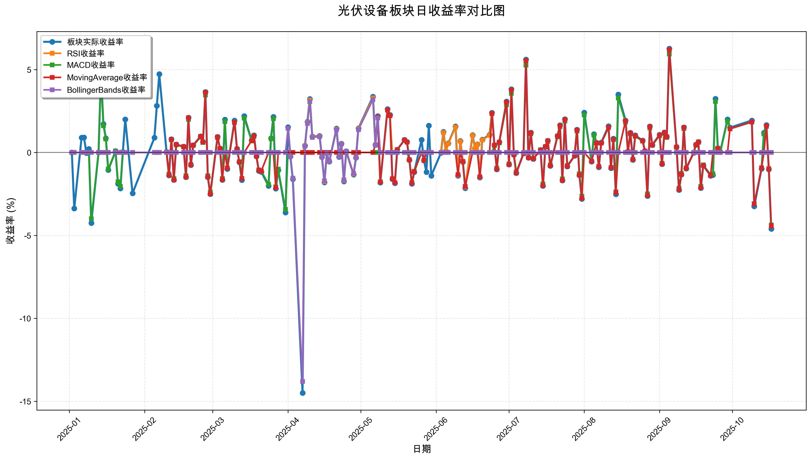
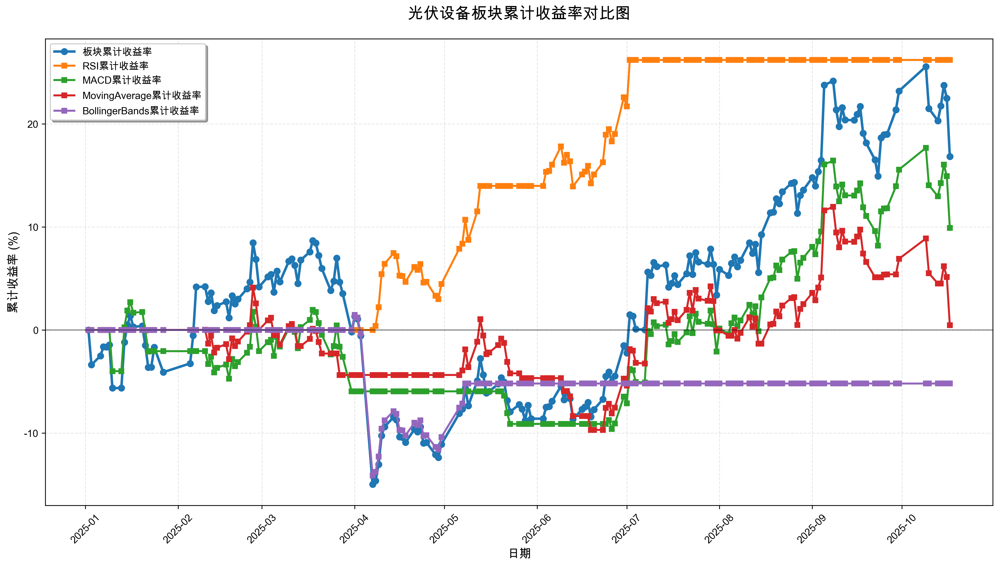

# 策略回测结果报告

**生成时间**: 2025-10-19 19:08:10
**行业板块**: 光伏设备
**回测期间**: 20250101 至 20251017
**策略数量**: 4

## 📈 分析结论

### 策略表现分析
- **最佳策略**: RSI (总收益率: 26.20%)
- **最差策略**: BollingerBands (总收益率: -5.20%)
### 交易活跃度分析
- **活跃策略**: 4 个
- **非活跃策略**: 0 个
- **最活跃策略**: MovingAverage (交易次数: 32)
### 🚨 异动提醒分析
- **板块异动**: 光伏设备 近两周出现大幅波动 (最大单日: 4.60%)
- **策略异动**: MACD 近两周出现大幅波动 (最大单日: 4.37%)
- **策略异动**: MovingAverage 近两周出现大幅波动 (最大单日: 4.44%)
### 风险分析
- **RSI**: 最大回撤 -4.15%, 夏普比率 3.1088
- **MACD**: 最大回撤 -11.98%, 夏普比率 0.6052
- **MovingAverage**: 最大回撤 -13.26%, 夏普比率 0.0304
- **BollingerBands**: 最大回撤 -15.34%, 夏普比率 -0.3845

## 📊 综合结果表

| 策略名称           | 初始资金     | 最终价值     | 总收益率   | 年化收益率   | 波动率    |    夏普比率 | 最大回撤    | 总交易次数   | 买入次数   | 卖出次数   | 总交易金额      | 平均交易金额   | 交易频率   |   数据点数 |
|:---------------|:---------|:---------|:-------|:--------|:-------|--------:|:--------|:--------|:-------|:-------|:-----------|:---------|:-------|-------:|
| 板块实际表现         | ¥100,000 | ¥116,838 | 16.84% | 22.92%  | 32.15% |  0.7131 | -21.77% | N/A     | N/A    | N/A    | N/A        | N/A      | N/A    |    190 |
| RSI            | ¥100,000 | ¥126,198 | 26.20% | 36.15%  | 11.63% |  3.1088 | -4.15%  | 4       | 2      | 2      | ¥442,084   | ¥110,521 | 0.02   |    190 |
| MACD           | ¥100,000 | ¥109,897 | 9.90%  | 13.33%  | 22.03% |  0.6052 | -11.98% | 7       | 4      | 3      | ¥632,016   | ¥90,288  | 0.04   |    190 |
| MovingAverage  | ¥100,000 | ¥100,470 | 0.47%  | 0.62%   | 20.50% |  0.0304 | -13.26% | 32      | 16     | 16     | ¥3,032,576 | ¥94,768  | 0.17   |    190 |
| BollingerBands | ¥100,000 | ¥94,799  | -5.20% | -6.84%  | 17.79% | -0.3845 | -15.34% | 2       | 1      | 1      | ¥185,387   | ¥92,694  | 0.01   |    190 |

## 📊 每日收益率走势图

*图1: 光伏设备板块每日收益率走势对比*

## 📈 累计收益率走势图

*图2: 光伏设备板块累计收益率走势对比*

## 📅 日收益明细表

| 日期         | 板块实际收益率   | RSI收益率   | MACD收益率   | MovingAverage收益率   | BollingerBands收益率   |
|:-----------|:----------|:---------|:----------|:-------------------|:--------------------|
| 2025-01-02 | 0.00%     | 0.00%    | 0.00%     | 0.00%              | 0.00%               |
| 2025-01-03 | -3.38%    | 0.00%    | 0.00%     | 0.00%              | 0.00%               |
| 2025-01-06 | 0.89%     | 0.00%    | 0.00%     | 0.00%              | 0.00%               |
| 2025-01-07 | 0.91%     | 0.00%    | 0.00%     | 0.00%              | 0.00%               |
| 2025-01-08 | -0.03%    | 0.00%    | 0.00%     | 0.00%              | 0.00%               |
| 2025-01-09 | 0.21%     | 0.00%    | 0.00%     | 0.00%              | 0.00%               |
| 2025-01-10 | -4.25%    | 0.00%    | -4.00%    | 0.00%              | 0.00%               |
| 2025-01-13 | -0.00%    | 0.00%    | -0.00%    | 0.00%              | 0.00%               |
| 2025-01-14 | 4.72%     | 0.00%    | 4.43%     | 0.00%              | 0.00%               |
| 2025-01-15 | 1.71%     | 0.00%    | 1.61%     | 0.00%              | 0.00%               |
| 2025-01-16 | 0.86%     | 0.00%    | 0.81%     | 0.00%              | 0.00%               |
| 2025-01-17 | -1.05%    | 0.00%    | -0.99%    | 0.00%              | 0.00%               |
| 2025-01-20 | 0.08%     | 0.00%    | 0.08%     | 0.00%              | 0.00%               |
| 2025-01-21 | -1.88%    | 0.00%    | -1.77%    | 0.00%              | 0.00%               |
| 2025-01-22 | -2.17%    | 0.00%    | -2.04%    | 0.00%              | 0.00%               |
| 2025-01-23 | 0.03%     | 0.00%    | 0.03%     | 0.00%              | 0.00%               |
| 2025-01-24 | 2.00%     | 0.00%    | 0.00%     | 0.00%              | 0.00%               |
| 2025-01-27 | -2.46%    | 0.00%    | 0.00%     | 0.00%              | 0.00%               |
| 2025-02-05 | 0.89%     | 0.00%    | 0.00%     | 0.00%              | 0.00%               |
| 2025-02-06 | 2.81%     | 0.00%    | 0.00%     | 0.00%              | 0.00%               |
| 2025-02-07 | 4.73%     | 0.00%    | 0.00%     | 0.00%              | 0.00%               |
| 2025-02-10 | 0.03%     | 0.00%    | 0.03%     | 0.03%              | 0.00%               |
| 2025-02-11 | -1.38%    | 0.00%    | -1.30%    | -1.37%             | 0.00%               |
| 2025-02-12 | 0.80%     | 0.00%    | 0.76%     | 0.79%              | 0.00%               |
| 2025-02-13 | -1.65%    | 0.00%    | -1.57%    | -1.65%             | 0.00%               |
| 2025-02-14 | 0.48%     | 0.00%    | 0.46%     | 0.48%              | 0.00%               |
| 2025-02-17 | 0.35%     | 0.00%    | 0.33%     | 0.35%              | 0.00%               |
| 2025-02-18 | -1.49%    | 0.00%    | -1.41%    | -1.48%             | 0.00%               |
| 2025-02-19 | 2.10%     | 0.00%    | 1.99%     | 2.09%              | 0.00%               |
| 2025-02-20 | -0.76%    | 0.00%    | -0.72%    | -0.75%             | 0.00%               |
| 2025-02-21 | 0.44%     | 0.00%    | 0.42%     | 0.44%              | 0.00%               |
| 2025-02-24 | 0.97%     | 0.00%    | 0.92%     | 0.96%              | 0.00%               |
| 2025-02-25 | 0.64%     | 0.00%    | 0.60%     | 0.63%              | 0.00%               |
| 2025-02-26 | 3.65%     | 0.00%    | 3.46%     | 3.63%              | 0.00%               |
| 2025-02-27 | -1.49%    | 0.00%    | -1.41%    | -1.48%             | 0.00%               |
| 2025-02-28 | -2.51%    | 0.00%    | -2.39%    | -2.50%             | 0.00%               |
| 2025-03-03 | 0.94%     | 0.00%    | 0.89%     | 0.93%              | 0.00%               |
| 2025-03-04 | 0.24%     | 0.00%    | 0.23%     | 0.24%              | 0.00%               |
| 2025-03-05 | -1.65%    | 0.00%    | -1.57%    | -1.64%             | 0.00%               |
| 2025-03-06 | 1.98%     | 0.00%    | 1.87%     | 0.00%              | 0.00%               |
| 2025-03-07 | -0.99%    | 0.00%    | -0.94%    | -0.94%             | 0.00%               |
| 2025-03-10 | 1.92%     | 0.00%    | 1.82%     | 1.81%              | 0.00%               |
| 2025-03-11 | 0.22%     | 0.00%    | 0.20%     | 0.20%              | 0.00%               |
| 2025-03-12 | -0.59%    | 0.00%    | -0.56%    | -0.56%             | 0.00%               |
| 2025-03-13 | -1.66%    | 0.00%    | -1.57%    | -1.57%             | 0.00%               |
| 2025-03-14 | 2.19%     | 0.00%    | 2.07%     | 0.00%              | 0.00%               |
| 2025-03-17 | 0.73%     | 0.00%    | 0.69%     | 0.71%              | 0.00%               |
| 2025-03-18 | 1.03%     | 0.00%    | 0.98%     | 1.00%              | 0.00%               |
| 2025-03-19 | -0.23%    | 0.00%    | -0.22%    | -0.23%             | 0.00%               |
| 2025-03-20 | -1.11%    | 0.00%    | -1.05%    | -1.07%             | 0.00%               |
| 2025-03-21 | -1.17%    | 0.00%    | -1.11%    | -1.13%             | 0.00%               |
| 2025-03-24 | -2.02%    | 0.00%    | -1.92%    | 0.00%              | 0.00%               |
| 2025-03-25 | 0.86%     | 0.00%    | 0.82%     | 0.00%              | 0.00%               |
| 2025-03-26 | 2.15%     | 0.00%    | 2.04%     | 0.00%              | 0.00%               |
| 2025-03-27 | -2.18%    | 0.00%    | -2.07%    | -2.12%             | 0.00%               |
| 2025-03-28 | -1.06%    | 0.00%    | -1.01%    | 0.00%              | 0.00%               |
| 2025-03-31 | -3.62%    | 0.00%    | -3.43%    | 0.00%              | 0.00%               |
| 2025-04-01 | 1.53%     | 0.00%    | 0.00%     | 0.00%              | 1.45%               |
| 2025-04-02 | -0.25%    | 0.00%    | 0.00%     | 0.00%              | -0.24%              |
| 2025-04-03 | -1.61%    | 0.00%    | 0.00%     | 0.00%              | -1.54%              |
| 2025-04-07 | -14.50%   | 0.00%    | 0.00%     | 0.00%              | -13.81%             |
| 2025-04-08 | 0.41%     | 0.40%    | 0.00%     | 0.00%              | 0.38%               |
| 2025-04-09 | 1.85%     | 1.80%    | 0.00%     | 0.00%              | 1.75%               |
| 2025-04-10 | 3.23%     | 3.15%    | 0.00%     | 0.00%              | 3.06%               |
| 2025-04-11 | 0.96%     | 0.94%    | 0.00%     | 0.00%              | 0.91%               |
| 2025-04-14 | 1.00%     | 0.98%    | 0.00%     | 0.00%              | 0.95%               |
| 2025-04-15 | -0.28%    | -0.27%   | 0.00%     | 0.00%              | -0.26%              |
| 2025-04-16 | -1.80%    | -1.76%   | 0.00%     | 0.00%              | -1.71%              |
| 2025-04-17 | -0.06%    | -0.06%   | 0.00%     | 0.00%              | -0.05%              |
| 2025-04-18 | -0.55%    | -0.54%   | 0.00%     | 0.00%              | -0.52%              |
| 2025-04-21 | 1.44%     | 1.40%    | 0.00%     | 0.00%              | 1.36%               |
| 2025-04-22 | -0.27%    | -0.26%   | 0.00%     | 0.00%              | -0.26%              |
| 2025-04-23 | 0.53%     | 0.52%    | 0.00%     | 0.00%              | 0.51%               |
| 2025-04-24 | -1.74%    | -1.69%   | 0.00%     | 0.00%              | -1.65%              |
| 2025-04-25 | 0.07%     | 0.07%    | 0.00%     | 0.00%              | 0.07%               |
| 2025-04-28 | -1.33%    | -1.30%   | 0.00%     | 0.00%              | -1.26%              |
| 2025-04-29 | -0.31%    | -0.30%   | 0.00%     | 0.00%              | -0.29%              |
| 2025-04-30 | 1.45%     | 1.42%    | 0.00%     | 0.00%              | 1.37%               |
| 2025-05-06 | 3.37%     | 3.29%    | 0.00%     | 0.00%              | 3.19%               |
| 2025-05-07 | 0.46%     | 0.44%    | 0.00%     | 0.45%              | 0.43%               |
| 2025-05-08 | 2.20%     | 2.14%    | 0.00%     | 2.15%              | 2.08%               |
| 2025-05-09 | -1.82%    | -1.77%   | 0.00%     | -1.78%             | 0.00%               |
| 2025-05-12 | 2.62%     | 2.56%    | 0.00%     | 2.56%              | 0.00%               |
| 2025-05-13 | 2.27%     | 2.22%    | 0.00%     | 2.22%              | 0.00%               |
| 2025-05-14 | -1.61%    | 0.00%    | 0.00%     | -1.58%             | 0.00%               |
| 2025-05-15 | -1.85%    | 0.00%    | 0.00%     | -1.81%             | 0.00%               |
| 2025-05-16 | 0.17%     | 0.00%    | 0.00%     | 0.17%              | 0.00%               |
| 2025-05-19 | 0.76%     | 0.00%    | 0.00%     | 0.75%              | 0.00%               |
| 2025-05-20 | 0.64%     | 0.00%    | 0.00%     | 0.62%              | 0.00%               |
| 2025-05-21 | -0.45%    | 0.00%    | -0.43%    | -0.44%             | 0.00%               |
| 2025-05-22 | -1.88%    | 0.00%    | -1.82%    | -1.84%             | 0.00%               |
| 2025-05-23 | -1.18%    | 0.00%    | -1.14%    | -1.16%             | 0.00%               |
| 2025-05-26 | 0.76%     | 0.00%    | 0.00%     | 0.00%              | 0.00%               |
| 2025-05-27 | -0.48%    | 0.00%    | 0.00%     | -0.48%             | 0.00%               |
| 2025-05-28 | -1.18%    | 0.00%    | 0.00%     | 0.00%              | 0.00%               |
| 2025-05-29 | 1.62%     | 0.00%    | 0.00%     | 0.00%              | 0.00%               |
| 2025-05-30 | -1.40%    | 0.00%    | 0.00%     | 0.00%              | 0.00%               |
| 2025-06-03 | -0.02%    | 0.00%    | 0.00%     | 0.00%              | 0.00%               |
| 2025-06-04 | 1.24%     | 1.20%    | 0.00%     | 0.00%              | 0.00%               |
| 2025-06-05 | 0.08%     | 0.07%    | 0.00%     | 0.00%              | 0.00%               |
| 2025-06-06 | 0.55%     | 0.53%    | 0.00%     | 0.00%              | 0.00%               |
| 2025-06-09 | 1.57%     | 1.53%    | 0.00%     | 0.00%              | 0.00%               |
| 2025-06-10 | -1.40%    | -1.36%   | 0.00%     | -1.33%             | 0.00%               |
| 2025-06-11 | 0.69%     | 0.67%    | 0.00%     | 0.00%              | 0.00%               |
| 2025-06-12 | -0.57%    | -0.55%   | 0.00%     | -0.54%             | 0.00%               |
| 2025-06-13 | -2.15%    | -2.09%   | 0.00%     | -2.05%             | 0.00%               |
| 2025-06-16 | 1.05%     | 1.02%    | 0.00%     | 0.00%              | 0.00%               |
| 2025-06-17 | 0.25%     | 0.24%    | 0.00%     | 0.00%              | 0.00%               |
| 2025-06-18 | 0.50%     | 0.49%    | 0.00%     | 0.00%              | 0.00%               |
| 2025-06-19 | -1.51%    | -1.47%   | 0.00%     | -1.46%             | 0.00%               |
| 2025-06-20 | 0.77%     | 0.75%    | 0.00%     | 0.00%              | 0.00%               |
| 2025-06-23 | 1.07%     | 1.03%    | 0.00%     | 0.00%              | 0.00%               |
| 2025-06-24 | 2.39%     | 2.32%    | 0.00%     | 2.36%              | 0.00%               |
| 2025-06-25 | 0.45%     | 0.43%    | 0.42%     | 0.44%              | 0.00%               |
| 2025-06-26 | -1.02%    | -0.99%   | -0.95%    | -1.00%             | 0.00%               |
| 2025-06-27 | 0.62%     | 0.61%    | 0.58%     | 0.62%              | 0.00%               |
| 2025-06-30 | 3.07%     | 2.98%    | 2.88%     | 3.03%              | 0.00%               |
| 2025-07-01 | -0.73%    | -0.71%   | -0.69%    | -0.72%             | 0.00%               |
| 2025-07-02 | 3.81%     | 3.70%    | 3.57%     | 3.76%              | 0.00%               |
| 2025-07-03 | -0.14%    | 0.00%    | -0.13%    | -0.14%             | 0.00%               |
| 2025-07-04 | -1.24%    | 0.00%    | -1.17%    | -1.23%             | 0.00%               |
| 2025-07-07 | -0.06%    | 0.00%    | -0.05%    | -0.06%             | 0.00%               |
| 2025-07-08 | 5.61%     | 0.00%    | 5.27%     | 5.54%              | 0.00%               |
| 2025-07-09 | -0.32%    | 0.00%    | -0.30%    | -0.32%             | 0.00%               |
| 2025-07-10 | 1.20%     | 0.00%    | 1.13%     | 1.18%              | 0.00%               |
| 2025-07-11 | -0.38%    | 0.00%    | -0.36%    | -0.38%             | 0.00%               |
| 2025-07-14 | 0.15%     | 0.00%    | 0.14%     | 0.15%              | 0.00%               |
| 2025-07-15 | -2.02%    | 0.00%    | -1.90%    | -1.99%             | 0.00%               |
| 2025-07-16 | 0.35%     | 0.00%    | 0.33%     | 0.35%              | 0.00%               |
| 2025-07-17 | 0.71%     | 0.00%    | 0.67%     | 0.70%              | 0.00%               |
| 2025-07-18 | -0.81%    | 0.00%    | -0.76%    | -0.80%             | 0.00%               |
| 2025-07-21 | 1.00%     | 0.00%    | 0.94%     | 0.99%              | 0.00%               |
| 2025-07-22 | 1.64%     | 0.00%    | 1.55%     | 1.62%              | 0.00%               |
| 2025-07-23 | -1.69%    | 0.00%    | -1.59%    | -1.67%             | 0.00%               |
| 2025-07-24 | 2.01%     | 0.00%    | 1.89%     | 1.98%              | 0.00%               |
| 2025-07-25 | -0.84%    | 0.00%    | -0.79%    | -0.83%             | 0.00%               |
| 2025-07-28 | -0.20%    | 0.00%    | -0.19%    | -0.20%             | 0.00%               |
| 2025-07-29 | 1.37%     | 0.00%    | 1.29%     | 1.35%              | 0.00%               |
| 2025-07-30 | -1.37%    | 0.00%    | -1.29%    | -1.36%             | 0.00%               |
| 2025-07-31 | -2.80%    | 0.00%    | -2.64%    | -2.77%             | 0.00%               |
| 2025-08-01 | 2.41%     | 0.00%    | 2.27%     | 0.00%              | 0.00%               |
| 2025-08-04 | -0.55%    | 0.00%    | -0.52%    | -0.52%             | 0.00%               |
| 2025-08-05 | 1.10%     | 0.00%    | 1.04%     | 0.00%              | 0.00%               |
| 2025-08-06 | 0.59%     | 0.00%    | 0.56%     | 0.56%              | 0.00%               |
| 2025-08-07 | -0.89%    | 0.00%    | -0.84%    | -0.85%             | 0.00%               |
| 2025-08-08 | 0.60%     | 0.00%    | 0.56%     | 0.57%              | 0.00%               |
| 2025-08-11 | 1.59%     | 0.00%    | 1.50%     | 1.52%              | 0.00%               |
| 2025-08-12 | -0.95%    | 0.00%    | -0.90%    | -0.91%             | 0.00%               |
| 2025-08-13 | 0.83%     | 0.00%    | 0.78%     | 0.79%              | 0.00%               |
| 2025-08-14 | -2.52%    | 0.00%    | -2.38%    | -2.41%             | 0.00%               |
| 2025-08-15 | 3.49%     | 0.00%    | 3.29%     | 0.00%              | 0.00%               |
| 2025-08-18 | 1.93%     | 0.00%    | 1.82%     | 1.90%              | 0.00%               |
| 2025-08-19 | 0.05%     | 0.00%    | 0.05%     | 0.05%              | 0.00%               |
| 2025-08-20 | 1.19%     | 0.00%    | 1.12%     | 1.17%              | 0.00%               |
| 2025-08-21 | -0.44%    | 0.00%    | -0.41%    | -0.43%             | 0.00%               |
| 2025-08-22 | 1.03%     | 0.00%    | 0.97%     | 1.01%              | 0.00%               |
| 2025-08-25 | 0.72%     | 0.00%    | 0.68%     | 0.71%              | 0.00%               |
| 2025-08-26 | 0.08%     | 0.00%    | 0.07%     | 0.08%              | 0.00%               |
| 2025-08-27 | -2.63%    | 0.00%    | -2.49%    | -2.59%             | 0.00%               |
| 2025-08-28 | 1.57%     | 0.00%    | 1.48%     | 1.55%              | 0.00%               |
| 2025-08-29 | 0.45%     | 0.00%    | 0.43%     | 0.45%              | 0.00%               |
| 2025-09-01 | 1.07%     | 0.00%    | 1.01%     | 1.05%              | 0.00%               |
| 2025-09-02 | -0.70%    | 0.00%    | -0.66%    | -0.69%             | 0.00%               |
| 2025-09-03 | 1.21%     | 0.00%    | 1.15%     | 1.20%              | 0.00%               |
| 2025-09-04 | 0.95%     | 0.00%    | 0.90%     | 0.94%              | 0.00%               |
| 2025-09-05 | 6.26%     | 0.00%    | 5.93%     | 6.19%              | 0.00%               |
| 2025-09-08 | 0.33%     | 0.00%    | 0.31%     | 0.33%              | 0.00%               |
| 2025-09-09 | -2.26%    | 0.00%    | -2.15%    | -2.23%             | 0.00%               |
| 2025-09-10 | -1.33%    | 0.00%    | -1.26%    | -1.32%             | 0.00%               |
| 2025-09-11 | 1.52%     | 0.00%    | 1.44%     | 1.50%              | 0.00%               |
| 2025-09-12 | -0.97%    | 0.00%    | -0.92%    | -0.96%             | 0.00%               |
| 2025-09-15 | -0.02%    | 0.00%    | -0.02%    | -0.02%             | 0.00%               |
| 2025-09-16 | 0.47%     | 0.00%    | 0.44%     | 0.46%              | 0.00%               |
| 2025-09-17 | 0.64%     | 0.00%    | 0.61%     | 0.64%              | 0.00%               |
| 2025-09-18 | -2.14%    | 0.00%    | -2.04%    | -2.12%             | 0.00%               |
| 2025-09-19 | -0.79%    | 0.00%    | -0.75%    | -0.78%             | 0.00%               |
| 2025-09-22 | -1.40%    | 0.00%    | -1.33%    | -1.38%             | 0.00%               |
| 2025-09-23 | -1.36%    | 0.00%    | -1.29%    | 0.00%              | 0.00%               |
| 2025-09-24 | 3.24%     | 0.00%    | 3.07%     | 0.00%              | 0.00%               |
| 2025-09-25 | 0.26%     | 0.00%    | 0.25%     | 0.25%              | 0.00%               |
| 2025-09-26 | 0.03%     | 0.00%    | 0.03%     | 0.03%              | 0.00%               |
| 2025-09-29 | 2.00%     | 0.00%    | 1.90%     | 0.00%              | 0.00%               |
| 2025-09-30 | 1.50%     | 0.00%    | 1.42%     | 1.43%              | 0.00%               |
| 2025-10-09 | 1.93%     | 0.00%    | 1.83%     | 1.84%              | 0.00%               |
| 2025-10-10 | -3.25%    | 0.00%    | -3.09%    | -3.10%             | 0.00%               |
| 2025-10-13 | -0.98%    | 0.00%    | -0.93%    | -0.93%             | 0.00%               |
| 2025-10-14 | 1.19%     | 0.00%    | 1.12%     | 0.00%              | 0.00%               |
| 2025-10-15 | 1.66%     | 0.00%    | 1.57%     | 1.60%              | 0.00%               |
| 2025-10-16 | -1.02%    | 0.00%    | -0.97%    | -0.99%             | 0.00%               |
| 2025-10-17 | -4.60%    | 0.00%    | -4.37%    | -4.44%             | 0.00%               |

## 📊 日收益统计摘要

| 指标                | 平均日收益率   | 最大日收益率   | 最小日收益率   | 正收益天数   | 负收益天数   |
|:------------------|:---------|:---------|:---------|:--------|:--------|
| 板块实际收益率           | 0.10%    | 6.26%    | -14.50%  | 106天    | 82天     |
| RSI收益率            | 0.13%    | 3.70%    | -2.09%   | 29天     | 15天     |
| MACD收益率           | 0.06%    | 5.93%    | -4.37%   | 68天     | 57天     |
| MovingAverage收益率  | 0.01%    | 6.19%    | -4.44%   | 61天     | 57天     |
| BollingerBands收益率 | -0.02%   | 3.19%    | -13.81%  | 13天     | 11天     |

## 📈 累计收益明细表

| 日期         | 板块累计收益率   | RSI累计收益率   | MACD累计收益率   | MovingAverage累计收益率   | BollingerBands累计收益率   |
|:-----------|:----------|:-----------|:------------|:---------------------|:----------------------|
| 2025-01-02 | 0.00%     | 0.00%      | 0.00%       | 0.00%                | 0.00%                 |
| 2025-01-03 | -3.38%    | 0.00%      | 0.00%       | 0.00%                | 0.00%                 |
| 2025-01-06 | -2.52%    | 0.00%      | 0.00%       | 0.00%                | 0.00%                 |
| 2025-01-07 | -1.63%    | 0.00%      | 0.00%       | 0.00%                | 0.00%                 |
| 2025-01-08 | -1.65%    | 0.00%      | 0.00%       | 0.00%                | 0.00%                 |
| 2025-01-09 | -1.45%    | 0.00%      | 0.00%       | 0.00%                | 0.00%                 |
| 2025-01-10 | -5.64%    | 0.00%      | -4.00%      | 0.00%                | 0.00%                 |
| 2025-01-13 | -5.64%    | 0.00%      | -4.00%      | 0.00%                | 0.00%                 |
| 2025-01-14 | -1.18%    | 0.00%      | 0.25%       | 0.00%                | 0.00%                 |
| 2025-01-15 | 0.51%     | 0.00%      | 1.87%       | 0.00%                | 0.00%                 |
| 2025-01-16 | 1.37%     | 0.00%      | 2.69%       | 0.00%                | 0.00%                 |
| 2025-01-17 | 0.30%     | 0.00%      | 1.67%       | 0.00%                | 0.00%                 |
| 2025-01-20 | 0.38%     | 0.00%      | 1.75%       | 0.00%                | 0.00%                 |
| 2025-01-21 | -1.50%    | 0.00%      | -0.05%      | 0.00%                | 0.00%                 |
| 2025-01-22 | -3.64%    | 0.00%      | -2.09%      | 0.00%                | 0.00%                 |
| 2025-01-23 | -3.61%    | 0.00%      | -2.06%      | 0.00%                | 0.00%                 |
| 2025-01-24 | -1.68%    | 0.00%      | -2.06%      | 0.00%                | 0.00%                 |
| 2025-01-27 | -4.10%    | 0.00%      | -2.06%      | 0.00%                | 0.00%                 |
| 2025-02-05 | -3.25%    | 0.00%      | -2.06%      | 0.00%                | 0.00%                 |
| 2025-02-06 | -0.54%    | 0.00%      | -2.06%      | 0.00%                | 0.00%                 |
| 2025-02-07 | 4.17%     | 0.00%      | -2.06%      | 0.00%                | 0.00%                 |
| 2025-02-10 | 4.20%     | 0.00%      | -2.04%      | 0.03%                | 0.00%                 |
| 2025-02-11 | 2.77%     | 0.00%      | -3.31%      | -1.34%               | 0.00%                 |
| 2025-02-12 | 3.59%     | 0.00%      | -2.58%      | -0.56%               | 0.00%                 |
| 2025-02-13 | 1.87%     | 0.00%      | -4.11%      | -2.20%               | 0.00%                 |
| 2025-02-14 | 2.36%     | 0.00%      | -3.67%      | -1.73%               | 0.00%                 |
| 2025-02-17 | 2.73%     | 0.00%      | -3.35%      | -1.38%               | 0.00%                 |
| 2025-02-18 | 1.19%     | 0.00%      | -4.72%      | -2.84%               | 0.00%                 |
| 2025-02-19 | 3.32%     | 0.00%      | -2.82%      | -0.82%               | 0.00%                 |
| 2025-02-20 | 2.54%     | 0.00%      | -3.52%      | -1.56%               | 0.00%                 |
| 2025-02-21 | 2.99%     | 0.00%      | -3.11%      | -1.13%               | 0.00%                 |
| 2025-02-24 | 3.99%     | 0.00%      | -2.22%      | -0.17%               | 0.00%                 |
| 2025-02-25 | 4.65%     | 0.00%      | -1.63%      | 0.46%                | 0.00%                 |
| 2025-02-26 | 8.47%     | 0.00%      | 1.77%       | 4.11%                | 0.00%                 |
| 2025-02-27 | 6.86%     | 0.00%      | 0.33%       | 2.57%                | 0.00%                 |
| 2025-02-28 | 4.17%     | 0.00%      | -2.06%      | -0.00%               | 0.00%                 |
| 2025-03-03 | 5.15%     | 0.00%      | -1.19%      | 0.93%                | 0.00%                 |
| 2025-03-04 | 5.40%     | 0.00%      | -0.96%      | 1.17%                | 0.00%                 |
| 2025-03-05 | 3.66%     | 0.00%      | -2.52%      | -0.49%               | 0.00%                 |
| 2025-03-06 | 5.71%     | 0.00%      | -0.69%      | -0.49%               | 0.00%                 |
| 2025-03-07 | 4.66%     | 0.00%      | -1.62%      | -1.42%               | 0.00%                 |
| 2025-03-10 | 6.67%     | 0.00%      | 0.16%       | 0.36%                | 0.00%                 |
| 2025-03-11 | 6.90%     | 0.00%      | 0.37%       | 0.57%                | 0.00%                 |
| 2025-03-12 | 6.27%     | 0.00%      | -0.19%      | 0.01%                | 0.00%                 |
| 2025-03-13 | 4.50%     | 0.00%      | -1.77%      | -1.56%               | 0.00%                 |
| 2025-03-14 | 6.79%     | 0.00%      | 0.27%       | -1.56%               | 0.00%                 |
| 2025-03-17 | 7.57%     | 0.00%      | 0.97%       | -0.87%               | 0.00%                 |
| 2025-03-18 | 8.68%     | 0.00%      | 1.96%       | 0.12%                | 0.00%                 |
| 2025-03-19 | 8.43%     | 0.00%      | 1.73%       | -0.10%               | 0.00%                 |
| 2025-03-20 | 7.23%     | 0.00%      | 0.66%       | -1.17%               | 0.00%                 |
| 2025-03-21 | 5.97%     | 0.00%      | -0.46%      | -2.29%               | 0.00%                 |
| 2025-03-24 | 3.83%     | 0.00%      | -2.37%      | -2.29%               | 0.00%                 |
| 2025-03-25 | 4.73%     | 0.00%      | -1.57%      | -2.29%               | 0.00%                 |
| 2025-03-26 | 6.98%     | 0.00%      | 0.44%       | -2.29%               | 0.00%                 |
| 2025-03-27 | 4.65%     | 0.00%      | -1.63%      | -4.37%               | 0.00%                 |
| 2025-03-28 | 3.54%     | 0.00%      | -2.62%      | -4.37%               | 0.00%                 |
| 2025-03-31 | -0.20%    | 0.00%      | -5.96%      | -4.37%               | 0.00%                 |
| 2025-04-01 | 1.32%     | 0.00%      | -5.96%      | -4.37%               | 1.45%                 |
| 2025-04-02 | 1.06%     | 0.00%      | -5.96%      | -4.37%               | 1.21%                 |
| 2025-04-03 | -0.57%    | 0.00%      | -5.96%      | -4.37%               | -0.35%                |
| 2025-04-07 | -14.98%   | 0.00%      | -5.96%      | -4.37%               | -14.11%               |
| 2025-04-08 | -14.64%   | 0.40%      | -5.96%      | -4.37%               | -13.78%               |
| 2025-04-09 | -13.06%   | 2.20%      | -5.96%      | -4.37%               | -12.28%               |
| 2025-04-10 | -10.25%   | 5.42%      | -5.96%      | -4.37%               | -9.59%                |
| 2025-04-11 | -9.39%    | 6.41%      | -5.96%      | -4.37%               | -8.77%                |
| 2025-04-14 | -8.48%    | 7.45%      | -5.96%      | -4.37%               | -7.90%                |
| 2025-04-15 | -8.73%    | 7.16%      | -5.96%      | -4.37%               | -8.14%                |
| 2025-04-16 | -10.38%   | 5.28%      | -5.96%      | -4.37%               | -9.71%                |
| 2025-04-17 | -10.43%   | 5.22%      | -5.96%      | -4.37%               | -9.76%                |
| 2025-04-18 | -10.92%   | 4.66%      | -5.96%      | -4.37%               | -10.23%               |
| 2025-04-21 | -9.64%    | 6.12%      | -5.96%      | -4.37%               | -9.01%                |
| 2025-04-22 | -9.88%    | 5.84%      | -5.96%      | -4.37%               | -9.24%                |
| 2025-04-23 | -9.40%    | 6.40%      | -5.96%      | -4.37%               | -8.78%                |
| 2025-04-24 | -10.97%   | 4.60%      | -5.96%      | -4.37%               | -10.28%               |
| 2025-04-25 | -10.91%   | 4.67%      | -5.96%      | -4.37%               | -10.22%               |
| 2025-04-28 | -12.09%   | 3.31%      | -5.96%      | -4.37%               | -11.35%               |
| 2025-04-29 | -12.37%   | 3.00%      | -5.96%      | -4.37%               | -11.61%               |
| 2025-04-30 | -11.09%   | 4.46%      | -5.96%      | -4.37%               | -10.40%               |
| 2025-05-06 | -8.10%    | 7.89%      | -5.96%      | -4.37%               | -7.54%                |
| 2025-05-07 | -7.68%    | 8.37%      | -5.96%      | -3.94%               | -7.14%                |
| 2025-05-08 | -5.65%    | 10.69%     | -5.96%      | -1.88%               | -5.20%                |
| 2025-05-09 | -7.36%    | 8.73%      | -5.96%      | -3.62%               | -5.20%                |
| 2025-05-12 | -4.94%    | 11.51%     | -5.96%      | -1.15%               | -5.20%                |
| 2025-05-13 | -2.78%    | 13.98%     | -5.96%      | 1.04%                | -5.20%                |
| 2025-05-14 | -4.35%    | 13.98%     | -5.96%      | -0.55%               | -5.20%                |
| 2025-05-15 | -6.12%    | 13.98%     | -5.96%      | -2.36%               | -5.20%                |
| 2025-05-16 | -5.96%    | 13.98%     | -5.96%      | -2.19%               | -5.20%                |
| 2025-05-19 | -5.24%    | 13.98%     | -5.96%      | -1.46%               | -5.20%                |
| 2025-05-20 | -4.63%    | 13.98%     | -5.96%      | -0.84%               | -5.20%                |
| 2025-05-21 | -5.06%    | 13.98%     | -6.37%      | -1.27%               | -5.20%                |
| 2025-05-22 | -6.84%    | 13.98%     | -8.07%      | -3.09%               | -5.20%                |
| 2025-05-23 | -7.94%    | 13.98%     | -9.12%      | -4.21%               | -5.20%                |
| 2025-05-26 | -7.24%    | 13.98%     | -9.12%      | -4.21%               | -5.20%                |
| 2025-05-27 | -7.69%    | 13.98%     | -9.12%      | -4.67%               | -5.20%                |
| 2025-05-28 | -8.78%    | 13.98%     | -9.12%      | -4.67%               | -5.20%                |
| 2025-05-29 | -7.30%    | 13.98%     | -9.12%      | -4.67%               | -5.20%                |
| 2025-05-30 | -8.60%    | 13.98%     | -9.12%      | -4.67%               | -5.20%                |
| 2025-06-03 | -8.62%    | 13.98%     | -9.12%      | -4.67%               | -5.20%                |
| 2025-06-04 | -7.49%    | 15.35%     | -9.12%      | -4.67%               | -5.20%                |
| 2025-06-05 | -7.42%    | 15.43%     | -9.12%      | -4.67%               | -5.20%                |
| 2025-06-06 | -6.91%    | 16.05%     | -9.12%      | -4.67%               | -5.20%                |
| 2025-06-09 | -5.45%    | 17.82%     | -9.12%      | -4.67%               | -5.20%                |
| 2025-06-10 | -6.77%    | 16.22%     | -9.12%      | -5.93%               | -5.20%                |
| 2025-06-11 | -6.12%    | 17.00%     | -9.12%      | -5.93%               | -5.20%                |
| 2025-06-12 | -6.66%    | 16.36%     | -9.12%      | -6.44%               | -5.20%                |
| 2025-06-13 | -8.66%    | 13.93%     | -9.12%      | -8.36%               | -5.20%                |
| 2025-06-16 | -7.71%    | 15.09%     | -9.12%      | -8.36%               | -5.20%                |
| 2025-06-17 | -7.48%    | 15.36%     | -9.12%      | -8.36%               | -5.20%                |
| 2025-06-18 | -7.02%    | 15.92%     | -9.12%      | -8.36%               | -5.20%                |
| 2025-06-19 | -8.42%    | 14.22%     | -9.12%      | -9.70%               | -5.20%                |
| 2025-06-20 | -7.72%    | 15.08%     | -9.12%      | -9.70%               | -5.20%                |
| 2025-06-23 | -6.73%    | 16.27%     | -9.12%      | -9.70%               | -5.20%                |
| 2025-06-24 | -4.50%    | 18.96%     | -9.12%      | -7.57%               | -5.20%                |
| 2025-06-25 | -4.08%    | 19.48%     | -8.74%      | -7.16%               | -5.20%                |
| 2025-06-26 | -5.05%    | 18.30%     | -9.61%      | -8.09%               | -5.20%                |
| 2025-06-27 | -4.46%    | 19.02%     | -9.08%      | -7.53%               | -5.20%                |
| 2025-06-30 | -1.52%    | 22.57%     | -6.47%      | -4.73%               | -5.20%                |
| 2025-07-01 | -2.24%    | 21.70%     | -7.11%      | -5.41%               | -5.20%                |
| 2025-07-02 | 1.48%     | 26.20%     | -3.79%      | -1.86%               | -5.20%                |
| 2025-07-03 | 1.34%     | 26.20%     | -3.92%      | -2.00%               | -5.20%                |
| 2025-07-04 | 0.08%     | 26.20%     | -5.04%      | -3.20%               | -5.20%                |
| 2025-07-07 | 0.02%     | 26.20%     | -5.09%      | -3.25%               | -5.20%                |
| 2025-07-08 | 5.63%     | 26.20%     | -0.09%      | 2.11%                | -5.20%                |
| 2025-07-09 | 5.30%     | 26.20%     | -0.39%      | 1.79%                | -5.20%                |
| 2025-07-10 | 6.56%     | 26.20%     | 0.73%       | 2.99%                | -5.20%                |
| 2025-07-11 | 6.15%     | 26.20%     | 0.37%       | 2.60%                | -5.20%                |
| 2025-07-14 | 6.31%     | 26.20%     | 0.51%       | 2.75%                | -5.20%                |
| 2025-07-15 | 4.16%     | 26.20%     | -1.40%      | 0.70%                | -5.20%                |
| 2025-07-16 | 4.53%     | 26.20%     | -1.07%      | 1.05%                | -5.20%                |
| 2025-07-17 | 5.27%     | 26.20%     | -0.41%      | 1.76%                | -5.20%                |
| 2025-07-18 | 4.42%     | 26.20%     | -1.17%      | 0.95%                | -5.20%                |
| 2025-07-21 | 5.46%     | 26.20%     | -0.24%      | 1.95%                | -5.20%                |
| 2025-07-22 | 7.20%     | 26.20%     | 1.31%       | 3.60%                | -5.20%                |
| 2025-07-23 | 5.39%     | 26.20%     | -0.31%      | 1.87%                | -5.20%                |
| 2025-07-24 | 7.50%     | 26.20%     | 1.58%       | 3.89%                | -5.20%                |
| 2025-07-25 | 6.61%     | 26.20%     | 0.78%       | 3.04%                | -5.20%                |
| 2025-07-28 | 6.39%     | 26.20%     | 0.59%       | 2.83%                | -5.20%                |
| 2025-07-29 | 7.85%     | 26.20%     | 1.88%       | 4.22%                | -5.20%                |
| 2025-07-30 | 6.37%     | 26.20%     | 0.56%       | 2.81%                | -5.20%                |
| 2025-07-31 | 3.39%     | 26.20%     | -2.09%      | -0.04%               | -5.20%                |
| 2025-08-01 | 5.88%     | 26.20%     | 0.13%       | -0.04%               | -5.20%                |
| 2025-08-04 | 5.30%     | 26.20%     | -0.39%      | -0.56%               | -5.20%                |
| 2025-08-05 | 6.45%     | 26.20%     | 0.64%       | -0.56%               | -5.20%                |
| 2025-08-06 | 7.08%     | 26.20%     | 1.20%       | 0.00%                | -5.20%                |
| 2025-08-07 | 6.13%     | 26.20%     | 0.36%       | -0.84%               | -5.20%                |
| 2025-08-08 | 6.76%     | 26.20%     | 0.92%       | -0.28%               | -5.20%                |
| 2025-08-11 | 8.46%     | 26.20%     | 2.43%       | 1.23%                | -5.20%                |
| 2025-08-12 | 7.43%     | 26.20%     | 1.51%       | 0.31%                | -5.20%                |
| 2025-08-13 | 8.32%     | 26.20%     | 2.30%       | 1.11%                | -5.20%                |
| 2025-08-14 | 5.58%     | 26.20%     | -0.13%      | -1.33%               | -5.20%                |
| 2025-08-15 | 9.26%     | 26.20%     | 3.15%       | -1.33%               | -5.20%                |
| 2025-08-18 | 11.37%    | 26.20%     | 5.02%       | 0.54%                | -5.20%                |
| 2025-08-19 | 11.43%    | 26.20%     | 5.08%       | 0.60%                | -5.20%                |
| 2025-08-20 | 12.75%    | 26.20%     | 6.25%       | 1.78%                | -5.20%                |
| 2025-08-21 | 12.26%    | 26.20%     | 5.81%       | 1.33%                | -5.20%                |
| 2025-08-22 | 13.41%    | 26.20%     | 6.84%       | 2.36%                | -5.20%                |
| 2025-08-25 | 14.23%    | 26.20%     | 7.57%       | 3.09%                | -5.20%                |
| 2025-08-26 | 14.32%    | 26.20%     | 7.65%       | 3.17%                | -5.20%                |
| 2025-08-27 | 11.31%    | 26.20%     | 4.97%       | 0.49%                | -5.20%                |
| 2025-08-28 | 13.06%    | 26.20%     | 6.53%       | 2.05%                | -5.20%                |
| 2025-08-29 | 13.57%    | 26.20%     | 6.99%       | 2.51%                | -5.20%                |
| 2025-09-01 | 14.78%    | 26.20%     | 8.07%       | 3.59%                | -5.20%                |
| 2025-09-02 | 13.98%    | 26.20%     | 7.35%       | 2.87%                | -5.20%                |
| 2025-09-03 | 15.37%    | 26.20%     | 8.59%       | 4.11%                | -5.20%                |
| 2025-09-04 | 16.46%    | 26.20%     | 9.56%       | 5.08%                | -5.20%                |
| 2025-09-05 | 23.76%    | 26.20%     | 16.06%      | 11.59%               | -5.20%                |
| 2025-09-08 | 24.17%    | 26.20%     | 16.43%      | 11.95%               | -5.20%                |
| 2025-09-09 | 21.36%    | 26.20%     | 13.93%      | 9.45%                | -5.20%                |
| 2025-09-10 | 19.75%    | 26.20%     | 12.49%      | 8.01%                | -5.20%                |
| 2025-09-11 | 21.57%    | 26.20%     | 14.11%      | 9.63%                | -5.20%                |
| 2025-09-12 | 20.38%    | 26.20%     | 13.06%      | 8.58%                | -5.20%                |
| 2025-09-15 | 20.36%    | 26.20%     | 13.04%      | 8.56%                | -5.20%                |
| 2025-09-16 | 20.92%    | 26.20%     | 13.54%      | 9.06%                | -5.20%                |
| 2025-09-17 | 21.70%    | 26.20%     | 14.23%      | 9.75%                | -5.20%                |
| 2025-09-18 | 19.09%    | 26.20%     | 11.90%      | 7.42%                | -5.20%                |
| 2025-09-19 | 18.15%    | 26.20%     | 11.07%      | 6.59%                | -5.20%                |
| 2025-09-22 | 16.50%    | 26.20%     | 9.59%       | 5.11%                | -5.20%                |
| 2025-09-23 | 14.92%    | 26.20%     | 8.18%       | 5.11%                | -5.20%                |
| 2025-09-24 | 18.64%    | 26.20%     | 11.51%      | 5.11%                | -5.20%                |
| 2025-09-25 | 18.96%    | 26.20%     | 11.78%      | 5.37%                | -5.20%                |
| 2025-09-26 | 18.99%    | 26.20%     | 11.81%      | 5.40%                | -5.20%                |
| 2025-09-29 | 21.37%    | 26.20%     | 13.94%      | 5.40%                | -5.20%                |
| 2025-09-30 | 23.19%    | 26.20%     | 15.56%      | 6.90%                | -5.20%                |
| 2025-10-09 | 25.56%    | 26.20%     | 17.67%      | 8.87%                | -5.20%                |
| 2025-10-10 | 21.49%    | 26.20%     | 14.04%      | 5.50%                | -5.20%                |
| 2025-10-13 | 20.30%    | 26.20%     | 12.98%      | 4.51%                | -5.20%                |
| 2025-10-14 | 21.73%    | 26.20%     | 14.25%      | 4.51%                | -5.20%                |
| 2025-10-15 | 23.74%    | 26.20%     | 16.05%      | 6.19%                | -5.20%                |
| 2025-10-16 | 22.48%    | 26.20%     | 14.92%      | 5.14%                | -5.20%                |
| 2025-10-17 | 16.84%    | 26.20%     | 9.90%       | 0.47%                | -5.20%                |

## 📊 累计收益统计摘要

| 指标                  | 最终累计收益率   | 最大累计收益率   | 最小累计收益率   | 累计收益波动   | 收益稳定性   |
|:--------------------|:----------|:----------|:----------|:---------|:--------|
| 板块累计收益率             | 16.84%    | 25.56%    | -14.98%   | 40.54%   | 波动      |
| RSI累计收益率            | 26.20%    | 26.20%    | 0.00%     | 26.20%   | 波动      |
| MACD累计收益率           | 9.90%     | 17.67%    | -9.61%    | 27.28%   | 波动      |
| MovingAverage累计收益率  | 0.47%     | 11.95%    | -9.70%    | 21.65%   | 波动      |
| BollingerBands累计收益率 | -5.20%    | 1.45%     | -14.11%   | 15.56%   | 稳定      |

