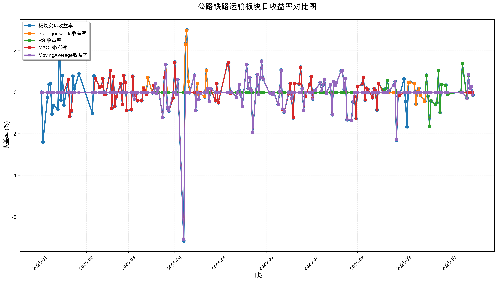
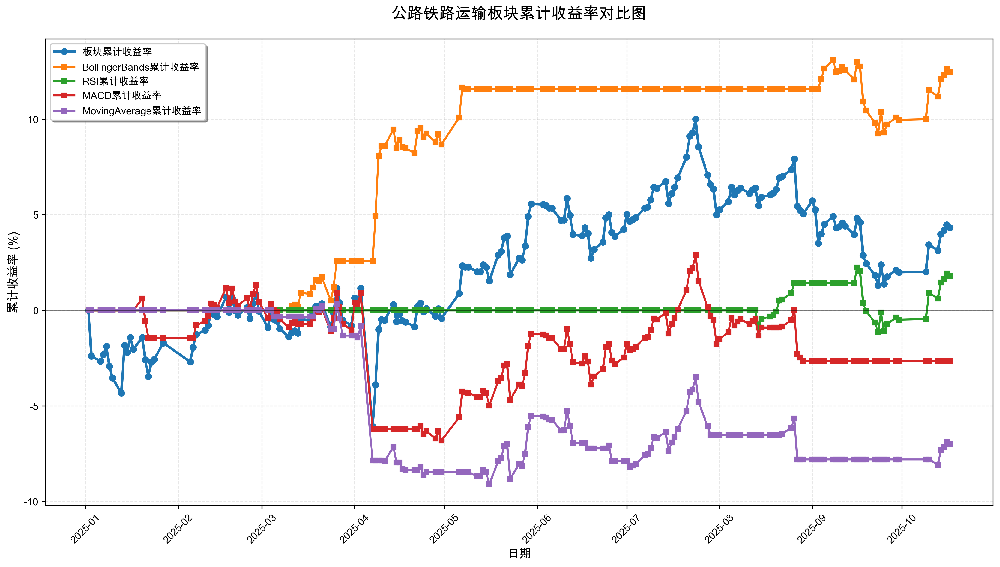

# 策略回测结果报告

**生成时间**: 2025-10-19 19:01:56
**行业板块**: 公路铁路运输
**回测期间**: 20250101 至 20251017
**策略数量**: 4

## 📈 分析结论

### 策略表现分析
- **最佳策略**: BollingerBands (总收益率: 12.46%)
- **最差策略**: MovingAverage (总收益率: -7.01%)
### 交易活跃度分析
- **活跃策略**: 4 个
- **非活跃策略**: 0 个
- **最活跃策略**: MovingAverage (交易次数: 25)
### 🚨 异动提醒分析
- 未检测到明显异动情况
### 风险分析
- **BollingerBands**: 最大回撤 -3.40%, 夏普比率 2.4218
- **RSI**: 最大回撤 -3.32%, 夏普比率 0.6187
- **MACD**: 最大回撤 -8.02%, 夏普比率 -0.2873
- **MovingAverage**: 最大回撤 -9.39%, 夏普比率 -0.8505

## 📊 综合结果表

| 策略名称           | 初始资金     | 最终价值     | 总收益率   | 年化收益率   | 波动率    |    夏普比率 | 最大回撤   | 总交易次数   | 买入次数   | 卖出次数   | 总交易金额      | 平均交易金额   | 交易频率   |   数据点数 |
|:---------------|:---------|:---------|:-------|:--------|:-------|--------:|:-------|:--------|:-------|:-------|:-----------|:---------|:-------|-------:|
| 板块实际表现         | ¥100,000 | ¥104,328 | 4.33%  | 5.78%   | 14.81% |  0.3904 | -7.90% | N/A     | N/A    | N/A    | N/A        | N/A      | N/A    |    190 |
| BollingerBands | ¥100,000 | ¥112,463 | 12.46% | 16.86%  | 6.96%  |  2.4218 | -3.40% | 5       | 3      | 2      | ¥524,738   | ¥104,948 | 0.03   |    190 |
| RSI            | ¥100,000 | ¥101,781 | 1.78%  | 2.37%   | 3.83%  |  0.6187 | -3.32% | 3       | 2      | 1      | ¥300,362   | ¥100,121 | 0.02   |    190 |
| MACD           | ¥100,000 | ¥97,365  | -2.64% | -3.48%  | 12.11% | -0.2873 | -8.02% | 10      | 5      | 5      | ¥970,131   | ¥97,013  | 0.05   |    190 |
| MovingAverage  | ¥100,000 | ¥92,986  | -7.01% | -9.19%  | 10.81% | -0.8505 | -9.39% | 25      | 13     | 12     | ¥2,340,741 | ¥93,630  | 0.13   |    190 |

## 📊 每日收益率走势图

*图1: 公路铁路运输板块每日收益率走势对比*

## 📈 累计收益率走势图

*图2: 公路铁路运输板块累计收益率走势对比*

## 📅 日收益明细表

| 日期         | 板块实际收益率   | BollingerBands收益率   | RSI收益率   | MACD收益率   | MovingAverage收益率   |
|:-----------|:----------|:--------------------|:---------|:----------|:-------------------|
| 2025-01-02 | 0.00%     | 0.00%               | 0.00%    | 0.00%     | 0.00%              |
| 2025-01-03 | -2.39%    | 0.00%               | 0.00%    | 0.00%     | 0.00%              |
| 2025-01-06 | -0.27%    | 0.00%               | 0.00%    | 0.00%     | 0.00%              |
| 2025-01-07 | 0.38%     | 0.00%               | 0.00%    | 0.00%     | 0.00%              |
| 2025-01-08 | 0.43%     | 0.00%               | 0.00%    | 0.00%     | 0.00%              |
| 2025-01-09 | -1.06%    | 0.00%               | 0.00%    | 0.00%     | 0.00%              |
| 2025-01-10 | -0.63%    | 0.00%               | 0.00%    | 0.00%     | 0.00%              |
| 2025-01-13 | -0.83%    | 0.00%               | 0.00%    | 0.00%     | 0.00%              |
| 2025-01-14 | 2.62%     | 0.00%               | 0.00%    | 0.00%     | 0.00%              |
| 2025-01-15 | -0.39%    | 0.00%               | 0.00%    | 0.00%     | 0.00%              |
| 2025-01-16 | 0.81%     | 0.00%               | 0.00%    | 0.00%     | 0.00%              |
| 2025-01-17 | -0.63%    | 0.00%               | 0.00%    | 0.00%     | 0.00%              |
| 2025-01-20 | 0.62%     | 0.00%               | 0.00%    | 0.62%     | 0.00%              |
| 2025-01-21 | -1.17%    | 0.00%               | 0.00%    | -1.16%    | 0.00%              |
| 2025-01-22 | -0.91%    | 0.00%               | 0.00%    | -0.90%    | 0.00%              |
| 2025-01-23 | 0.77%     | 0.00%               | 0.00%    | 0.00%     | 0.00%              |
| 2025-01-24 | 0.16%     | 0.00%               | 0.00%    | 0.00%     | 0.00%              |
| 2025-01-27 | 0.89%     | 0.00%               | 0.00%    | 0.00%     | 0.00%              |
| 2025-02-05 | -1.01%    | 0.00%               | 0.00%    | 0.00%     | 0.00%              |
| 2025-02-06 | 0.78%     | 0.00%               | 0.00%    | 0.00%     | 0.00%              |
| 2025-02-07 | 0.68%     | 0.00%               | 0.00%    | 0.67%     | 0.00%              |
| 2025-02-10 | 0.23%     | 0.00%               | 0.00%    | 0.23%     | 0.00%              |
| 2025-02-11 | 0.27%     | 0.00%               | 0.00%    | 0.26%     | 0.00%              |
| 2025-02-12 | 0.66%     | 0.00%               | 0.00%    | 0.66%     | 0.00%              |
| 2025-02-13 | -0.11%    | 0.00%               | 0.00%    | -0.11%    | 0.00%              |
| 2025-02-14 | -0.11%    | 0.00%               | 0.00%    | -0.11%    | 0.00%              |
| 2025-02-17 | 1.03%     | 0.00%               | 0.00%    | 1.02%     | 0.00%              |
| 2025-02-18 | -0.78%    | 0.00%               | 0.00%    | -0.78%    | 0.00%              |
| 2025-02-19 | 0.75%     | 0.00%               | 0.00%    | 0.75%     | 0.00%              |
| 2025-02-20 | -0.68%    | 0.00%               | 0.00%    | -0.67%    | 0.00%              |
| 2025-02-21 | -0.22%    | 0.00%               | 0.00%    | -0.22%    | 0.00%              |
| 2025-02-24 | 0.41%     | 0.00%               | 0.00%    | 0.40%     | 0.00%              |
| 2025-02-25 | -0.58%    | 0.00%               | 0.00%    | -0.58%    | 0.00%              |
| 2025-02-26 | 0.81%     | 0.00%               | 0.00%    | 0.80%     | 0.00%              |
| 2025-02-27 | 0.46%     | 0.00%               | 0.00%    | 0.46%     | 0.00%              |
| 2025-02-28 | -0.88%    | 0.00%               | 0.00%    | -0.87%    | 0.00%              |
| 2025-03-03 | -0.85%    | 0.00%               | 0.00%    | -0.84%    | 0.00%              |
| 2025-03-04 | 0.77%     | 0.00%               | 0.00%    | 0.77%     | 0.00%              |
| 2025-03-05 | -0.33%    | 0.00%               | 0.00%    | -0.33%    | -0.33%             |
| 2025-03-06 | -0.09%    | 0.00%               | 0.00%    | -0.09%    | 0.00%              |
| 2025-03-07 | -0.42%    | 0.00%               | 0.00%    | -0.41%    | 0.00%              |
| 2025-03-10 | -0.41%    | 0.00%               | 0.00%    | -0.41%    | 0.00%              |
| 2025-03-11 | 0.21%     | 0.21%               | 0.00%    | 0.20%     | 0.00%              |
| 2025-03-12 | 0.10%     | 0.10%               | 0.00%    | 0.10%     | 0.00%              |
| 2025-03-13 | -0.11%    | -0.11%              | 0.00%    | -0.11%    | 0.00%              |
| 2025-03-14 | 0.72%     | 0.72%               | 0.00%    | 0.00%     | 0.00%              |
| 2025-03-17 | -0.03%    | -0.03%              | 0.00%    | -0.03%    | 0.00%              |
| 2025-03-18 | 0.31%     | 0.31%               | 0.00%    | 0.31%     | 0.00%              |
| 2025-03-19 | 0.41%     | 0.41%               | 0.00%    | 0.40%     | 0.41%              |
| 2025-03-20 | -0.06%    | -0.06%              | 0.00%    | -0.06%    | -0.06%             |
| 2025-03-21 | 0.20%     | 0.20%               | 0.00%    | 0.20%     | 0.20%              |
| 2025-03-24 | -1.21%    | -1.21%              | 0.00%    | -1.20%    | -1.21%             |
| 2025-03-25 | 0.70%     | 0.70%               | 0.00%    | 0.69%     | 0.00%              |
| 2025-03-26 | 1.34%     | 1.34%               | 0.00%    | 1.32%     | 1.33%              |
| 2025-03-27 | -0.76%    | 0.00%               | 0.00%    | -0.75%    | -0.75%             |
| 2025-03-28 | -0.91%    | 0.00%               | 0.00%    | -0.90%    | -0.90%             |
| 2025-03-31 | -0.28%    | 0.00%               | 0.00%    | -0.28%    | 0.00%              |
| 2025-04-01 | 1.45%     | 0.00%               | 0.00%    | 1.44%     | 0.00%              |
| 2025-04-02 | -0.10%    | 0.00%               | 0.00%    | -0.10%    | -0.10%             |
| 2025-04-03 | 0.61%     | 0.00%               | 0.00%    | 0.60%     | 0.60%              |
| 2025-04-07 | -7.16%    | 0.00%               | 0.00%    | -7.07%    | -7.09%             |
| 2025-04-08 | 2.34%     | 2.31%               | 0.00%    | 0.00%     | 0.00%              |
| 2025-04-09 | 3.00%     | 2.97%               | 0.00%    | 0.00%     | 0.00%              |
| 2025-04-10 | 0.52%     | 0.52%               | 0.00%    | 0.00%     | 0.00%              |
| 2025-04-11 | -0.03%    | -0.03%              | 0.00%    | 0.00%     | -0.03%             |
| 2025-04-14 | 0.82%     | 0.81%               | 0.00%    | 0.00%     | 0.81%              |
| 2025-04-15 | -0.89%    | -0.88%              | 0.00%    | 0.00%     | -0.88%             |
| 2025-04-16 | 0.40%     | 0.40%               | 0.00%    | 0.00%     | 0.00%              |
| 2025-04-17 | -0.35%    | -0.34%              | 0.00%    | 0.00%     | -0.34%             |
| 2025-04-18 | -0.07%    | -0.07%              | 0.00%    | 0.00%     | -0.07%             |
| 2025-04-21 | -0.23%    | -0.23%              | 0.00%    | 0.00%     | 0.00%              |
| 2025-04-22 | 1.07%     | 1.06%               | 0.00%    | 0.00%     | 0.00%              |
| 2025-04-23 | 0.16%     | 0.16%               | 0.00%    | 0.16%     | 0.16%              |
| 2025-04-24 | -0.45%    | -0.44%              | 0.00%    | -0.44%    | -0.44%             |
| 2025-04-25 | 0.17%     | 0.17%               | 0.00%    | 0.17%     | 0.17%              |
| 2025-04-28 | -0.41%    | -0.40%              | 0.00%    | -0.41%    | 0.00%              |
| 2025-04-29 | 0.40%     | 0.40%               | 0.00%    | 0.40%     | 0.00%              |
| 2025-04-30 | -0.51%    | -0.51%              | 0.00%    | -0.51%    | 0.00%              |
| 2025-05-06 | 1.32%     | 1.31%               | 0.00%    | 1.31%     | 0.00%              |
| 2025-05-07 | 1.43%     | 1.41%               | 0.00%    | 1.42%     | 0.00%              |
| 2025-05-08 | -0.06%    | -0.06%              | 0.00%    | -0.06%    | 0.00%              |
| 2025-05-09 | -0.00%    | -0.00%              | 0.00%    | -0.00%    | -0.00%             |
| 2025-05-12 | -0.24%    | 0.00%               | 0.00%    | -0.24%    | -0.24%             |
| 2025-05-13 | 0.00%     | 0.00%               | 0.00%    | 0.00%     | 0.00%              |
| 2025-05-14 | 0.35%     | 0.00%               | 0.00%    | 0.35%     | 0.35%              |
| 2025-05-15 | -0.12%    | 0.00%               | 0.00%    | -0.12%    | -0.12%             |
| 2025-05-16 | -0.70%    | 0.00%               | 0.00%    | -0.69%    | -0.69%             |
| 2025-05-19 | 1.34%     | 0.00%               | 0.00%    | 1.33%     | 1.33%              |
| 2025-05-20 | 0.17%     | 0.00%               | 0.00%    | 0.17%     | 0.17%              |
| 2025-05-21 | 0.70%     | 0.00%               | 0.00%    | 0.70%     | 0.70%              |
| 2025-05-22 | 0.09%     | 0.00%               | 0.00%    | 0.09%     | 0.08%              |
| 2025-05-23 | -1.95%    | 0.00%               | 0.00%    | -1.94%    | -1.94%             |
| 2025-05-26 | 0.85%     | 0.00%               | 0.00%    | 0.85%     | 0.85%              |
| 2025-05-27 | -0.10%    | 0.00%               | 0.00%    | -0.10%    | -0.10%             |
| 2025-05-28 | 0.70%     | 0.00%               | 0.00%    | 0.70%     | 0.70%              |
| 2025-05-29 | 1.50%     | 0.00%               | 0.00%    | 1.50%     | 1.49%              |
| 2025-05-30 | 0.63%     | 0.00%               | 0.00%    | 0.63%     | 0.63%              |
| 2025-06-03 | -0.03%    | 0.00%               | 0.00%    | -0.03%    | -0.03%             |
| 2025-06-04 | -0.06%    | 0.00%               | 0.00%    | -0.06%    | -0.06%             |
| 2025-06-05 | -0.12%    | 0.00%               | 0.00%    | -0.12%    | -0.12%             |
| 2025-06-06 | -0.01%    | 0.00%               | 0.00%    | -0.01%    | -0.01%             |
| 2025-06-09 | -0.59%    | 0.00%               | 0.00%    | -0.59%    | -0.59%             |
| 2025-06-10 | 0.02%     | 0.00%               | 0.00%    | 0.02%     | 0.02%              |
| 2025-06-11 | 1.07%     | 0.00%               | 0.00%    | 1.06%     | 1.06%              |
| 2025-06-12 | -0.82%    | 0.00%               | 0.00%    | -0.82%    | -0.81%             |
| 2025-06-13 | -0.96%    | 0.00%               | 0.00%    | -0.96%    | -0.95%             |
| 2025-06-16 | -0.07%    | 0.00%               | 0.00%    | -0.06%    | 0.00%              |
| 2025-06-17 | 0.41%     | 0.00%               | 0.00%    | 0.41%     | 0.00%              |
| 2025-06-18 | -0.30%    | 0.00%               | 0.00%    | -0.30%    | -0.30%             |
| 2025-06-19 | -1.24%    | 0.00%               | 0.00%    | -1.23%    | 0.00%              |
| 2025-06-20 | 0.43%     | 0.00%               | 0.00%    | 0.43%     | 0.00%              |
| 2025-06-23 | 0.39%     | 0.00%               | 0.00%    | 0.39%     | 0.00%              |
| 2025-06-24 | 1.21%     | 0.00%               | 0.00%    | 1.20%     | 0.00%              |
| 2025-06-25 | 0.16%     | 0.00%               | 0.00%    | 0.16%     | 0.16%              |
| 2025-06-26 | -0.88%    | 0.00%               | 0.00%    | -0.87%    | -0.87%             |
| 2025-06-27 | -0.20%    | 0.00%               | 0.00%    | -0.20%    | 0.00%              |
| 2025-06-30 | 0.35%     | 0.00%               | 0.00%    | 0.35%     | 0.00%              |
| 2025-07-01 | 0.75%     | 0.00%               | 0.00%    | 0.74%     | 0.00%              |
| 2025-07-02 | -0.33%    | 0.00%               | 0.00%    | -0.32%    | -0.33%             |
| 2025-07-03 | 0.07%     | 0.00%               | 0.00%    | 0.07%     | 0.07%              |
| 2025-07-04 | 0.10%     | 0.00%               | 0.00%    | 0.10%     | 0.10%              |
| 2025-07-07 | 0.47%     | 0.00%               | 0.00%    | 0.47%     | 0.47%              |
| 2025-07-08 | 0.06%     | 0.00%               | 0.00%    | 0.06%     | 0.06%              |
| 2025-07-09 | 0.35%     | 0.00%               | 0.00%    | 0.35%     | 0.35%              |
| 2025-07-10 | 0.62%     | 0.00%               | 0.00%    | 0.62%     | 0.62%              |
| 2025-07-11 | -0.05%    | 0.00%               | 0.00%    | -0.05%    | -0.05%             |
| 2025-07-14 | 0.35%     | 0.00%               | 0.00%    | 0.35%     | 0.35%              |
| 2025-07-15 | -1.09%    | 0.00%               | 0.00%    | -1.08%    | -1.09%             |
| 2025-07-16 | 0.50%     | 0.00%               | 0.00%    | 0.50%     | 0.50%              |
| 2025-07-17 | 0.31%     | 0.00%               | 0.00%    | 0.31%     | 0.31%              |
| 2025-07-18 | 0.45%     | 0.00%               | 0.00%    | 0.45%     | 0.45%              |
| 2025-07-21 | 1.02%     | 0.00%               | 0.00%    | 1.01%     | 1.01%              |
| 2025-07-22 | 1.02%     | 0.00%               | 0.00%    | 1.02%     | 1.02%              |
| 2025-07-23 | 0.15%     | 0.00%               | 0.00%    | 0.15%     | 0.15%              |
| 2025-07-24 | 0.66%     | 0.00%               | 0.00%    | 0.66%     | 0.66%              |
| 2025-07-25 | -1.33%    | 0.00%               | 0.00%    | -1.32%    | -1.32%             |
| 2025-07-28 | -1.35%    | 0.00%               | 0.00%    | -1.35%    | -1.35%             |
| 2025-07-29 | -0.47%    | 0.00%               | 0.00%    | -0.47%    | -0.47%             |
| 2025-07-30 | -0.21%    | 0.00%               | 0.00%    | -0.21%    | 0.00%              |
| 2025-07-31 | -1.27%    | 0.00%               | 0.00%    | -1.26%    | 0.00%              |
| 2025-08-01 | 0.26%     | 0.00%               | 0.00%    | 0.25%     | 0.00%              |
| 2025-08-04 | 0.39%     | 0.00%               | 0.00%    | 0.39%     | 0.00%              |
| 2025-08-05 | 0.72%     | 0.00%               | 0.00%    | 0.72%     | 0.00%              |
| 2025-08-06 | -0.38%    | 0.00%               | 0.00%    | -0.38%    | 0.00%              |
| 2025-08-07 | 0.20%     | 0.00%               | 0.00%    | 0.20%     | 0.00%              |
| 2025-08-08 | 0.13%     | 0.00%               | 0.00%    | 0.13%     | 0.00%              |
| 2025-08-11 | -0.27%    | 0.00%               | 0.00%    | -0.26%    | 0.00%              |
| 2025-08-12 | 0.18%     | 0.00%               | 0.00%    | 0.18%     | 0.00%              |
| 2025-08-13 | 0.08%     | 0.00%               | 0.00%    | 0.08%     | 0.00%              |
| 2025-08-14 | -0.86%    | 0.00%               | -0.85%   | -0.86%    | 0.00%              |
| 2025-08-15 | 0.42%     | 0.00%               | 0.41%    | 0.42%     | 0.00%              |
| 2025-08-18 | 0.11%     | 0.00%               | 0.11%    | 0.00%     | 0.00%              |
| 2025-08-19 | 0.09%     | 0.00%               | 0.09%    | 0.00%     | 0.00%              |
| 2025-08-20 | 0.19%     | 0.00%               | 0.18%    | 0.00%     | 0.00%              |
| 2025-08-21 | 0.57%     | 0.00%               | 0.57%    | 0.00%     | 0.00%              |
| 2025-08-22 | 0.07%     | 0.00%               | 0.07%    | 0.07%     | 0.07%              |
| 2025-08-25 | 0.34%     | 0.00%               | 0.33%    | 0.33%     | 0.33%              |
| 2025-08-26 | 0.52%     | 0.00%               | 0.52%    | 0.52%     | 0.52%              |
| 2025-08-27 | -2.31%    | 0.00%               | 0.00%    | -2.29%    | -2.28%             |
| 2025-08-28 | -0.20%    | 0.00%               | 0.00%    | -0.19%    | 0.00%              |
| 2025-08-29 | -0.17%    | 0.00%               | 0.00%    | -0.17%    | 0.00%              |
| 2025-09-01 | 0.64%     | 0.00%               | 0.00%    | 0.00%     | 0.00%              |
| 2025-09-02 | -0.43%    | 0.00%               | 0.00%    | 0.00%     | 0.00%              |
| 2025-09-03 | -1.67%    | 0.00%               | 0.00%    | 0.00%     | 0.00%              |
| 2025-09-04 | 0.47%     | 0.47%               | 0.00%    | 0.00%     | 0.00%              |
| 2025-09-05 | 0.48%     | 0.48%               | 0.00%    | 0.00%     | 0.00%              |
| 2025-09-08 | 0.40%     | 0.40%               | 0.00%    | 0.00%     | 0.00%              |
| 2025-09-09 | -0.58%    | -0.58%              | 0.00%    | 0.00%     | 0.00%              |
| 2025-09-10 | 0.06%     | 0.06%               | 0.00%    | 0.00%     | 0.00%              |
| 2025-09-11 | 0.19%     | 0.19%               | 0.00%    | 0.00%     | 0.00%              |
| 2025-09-12 | -0.15%    | -0.15%              | 0.00%    | 0.00%     | 0.00%              |
| 2025-09-15 | -0.44%    | -0.43%              | 0.00%    | 0.00%     | 0.00%              |
| 2025-09-16 | 0.82%     | 0.81%               | 0.81%    | 0.00%     | 0.00%              |
| 2025-09-17 | -0.20%    | -0.20%              | -0.20%   | 0.00%     | 0.00%              |
| 2025-09-18 | -1.64%    | -1.63%              | -1.64%   | 0.00%     | 0.00%              |
| 2025-09-19 | -0.42%    | -0.42%              | -0.42%   | 0.00%     | 0.00%              |
| 2025-09-22 | -0.60%    | -0.60%              | -0.60%   | 0.00%     | 0.00%              |
| 2025-09-23 | -0.50%    | -0.50%              | -0.50%   | 0.00%     | 0.00%              |
| 2025-09-24 | 1.05%     | 1.04%               | 1.05%    | 0.00%     | 0.00%              |
| 2025-09-25 | -0.98%    | -0.97%              | -0.98%   | 0.00%     | 0.00%              |
| 2025-09-26 | 0.37%     | 0.37%               | 0.37%    | 0.00%     | 0.00%              |
| 2025-09-29 | 0.34%     | 0.34%               | 0.34%    | 0.00%     | 0.00%              |
| 2025-09-30 | -0.11%    | -0.11%              | -0.11%   | 0.00%     | 0.00%              |
| 2025-10-09 | 0.03%     | 0.03%               | 0.03%    | 0.00%     | 0.00%              |
| 2025-10-10 | 1.39%     | 1.37%               | 1.38%    | 0.00%     | 0.00%              |
| 2025-10-13 | -0.29%    | -0.29%              | -0.29%   | 0.00%     | -0.29%             |
| 2025-10-14 | 0.83%     | 0.82%               | 0.82%    | 0.00%     | 0.83%              |
| 2025-10-15 | 0.19%     | 0.19%               | 0.19%    | 0.00%     | 0.19%              |
| 2025-10-16 | 0.27%     | 0.27%               | 0.27%    | 0.00%     | 0.27%              |
| 2025-10-17 | -0.14%    | -0.14%              | -0.14%   | 0.00%     | -0.14%             |

## 📊 日收益统计摘要

| 指标                | 平均日收益率   | 最大日收益率   | 最小日收益率   | 正收益天数   | 负收益天数   |
|:------------------|:---------|:---------|:---------|:--------|:--------|
| 板块实际收益率           | 0.03%    | 3.00%    | -7.16%   | 102天    | 85天     |
| BollingerBands收益率 | 0.06%    | 2.97%    | -1.63%   | 33天     | 25天     |
| RSI收益率            | 0.01%    | 1.38%    | -1.64%   | 17天     | 10天     |
| MACD收益率           | -0.01%   | 1.50%    | -7.07%   | 68天     | 58天     |
| MovingAverage收益率  | -0.04%   | 1.49%    | -7.09%   | 39天     | 35天     |

## 📈 累计收益明细表

| 日期         | 板块累计收益率   | BollingerBands累计收益率   | RSI累计收益率   | MACD累计收益率   | MovingAverage累计收益率   |
|:-----------|:----------|:----------------------|:-----------|:------------|:---------------------|
| 2025-01-02 | 0.00%     | 0.00%                 | 0.00%      | 0.00%       | 0.00%                |
| 2025-01-03 | -2.39%    | 0.00%                 | 0.00%      | 0.00%       | 0.00%                |
| 2025-01-06 | -2.66%    | 0.00%                 | 0.00%      | 0.00%       | 0.00%                |
| 2025-01-07 | -2.30%    | 0.00%                 | 0.00%      | 0.00%       | 0.00%                |
| 2025-01-08 | -1.88%    | 0.00%                 | 0.00%      | 0.00%       | 0.00%                |
| 2025-01-09 | -2.92%    | 0.00%                 | 0.00%      | 0.00%       | 0.00%                |
| 2025-01-10 | -3.54%    | 0.00%                 | 0.00%      | 0.00%       | 0.00%                |
| 2025-01-13 | -4.33%    | 0.00%                 | 0.00%      | 0.00%       | 0.00%                |
| 2025-01-14 | -1.83%    | 0.00%                 | 0.00%      | 0.00%       | 0.00%                |
| 2025-01-15 | -2.21%    | 0.00%                 | 0.00%      | 0.00%       | 0.00%                |
| 2025-01-16 | -1.42%    | 0.00%                 | 0.00%      | 0.00%       | 0.00%                |
| 2025-01-17 | -2.03%    | 0.00%                 | 0.00%      | 0.00%       | 0.00%                |
| 2025-01-20 | -1.42%    | 0.00%                 | 0.00%      | 0.62%       | 0.00%                |
| 2025-01-21 | -2.58%    | 0.00%                 | 0.00%      | -0.55%      | 0.00%                |
| 2025-01-22 | -3.46%    | 0.00%                 | 0.00%      | -1.44%      | 0.00%                |
| 2025-01-23 | -2.71%    | 0.00%                 | 0.00%      | -1.44%      | 0.00%                |
| 2025-01-24 | -2.56%    | 0.00%                 | 0.00%      | -1.44%      | 0.00%                |
| 2025-01-27 | -1.70%    | 0.00%                 | 0.00%      | -1.44%      | 0.00%                |
| 2025-02-05 | -2.69%    | 0.00%                 | 0.00%      | -1.44%      | 0.00%                |
| 2025-02-06 | -1.93%    | 0.00%                 | 0.00%      | -1.44%      | 0.00%                |
| 2025-02-07 | -1.27%    | 0.00%                 | 0.00%      | -0.78%      | 0.00%                |
| 2025-02-10 | -1.04%    | 0.00%                 | 0.00%      | -0.55%      | 0.00%                |
| 2025-02-11 | -0.78%    | 0.00%                 | 0.00%      | -0.29%      | 0.00%                |
| 2025-02-12 | -0.12%    | 0.00%                 | 0.00%      | 0.37%       | 0.00%                |
| 2025-02-13 | -0.22%    | 0.00%                 | 0.00%      | 0.26%       | 0.00%                |
| 2025-02-14 | -0.34%    | 0.00%                 | 0.00%      | 0.15%       | 0.00%                |
| 2025-02-17 | 0.69%     | 0.00%                 | 0.00%      | 1.17%       | 0.00%                |
| 2025-02-18 | -0.10%    | 0.00%                 | 0.00%      | 0.39%       | 0.00%                |
| 2025-02-19 | 0.65%     | 0.00%                 | 0.00%      | 1.14%       | 0.00%                |
| 2025-02-20 | -0.03%    | 0.00%                 | 0.00%      | 0.46%       | 0.00%                |
| 2025-02-21 | -0.25%    | 0.00%                 | 0.00%      | 0.24%       | 0.00%                |
| 2025-02-24 | 0.15%     | 0.00%                 | 0.00%      | 0.64%       | 0.00%                |
| 2025-02-25 | -0.43%    | 0.00%                 | 0.00%      | 0.06%       | 0.00%                |
| 2025-02-26 | 0.37%     | 0.00%                 | 0.00%      | 0.86%       | 0.00%                |
| 2025-02-27 | 0.83%     | 0.00%                 | 0.00%      | 1.32%       | 0.00%                |
| 2025-02-28 | -0.05%    | 0.00%                 | 0.00%      | 0.44%       | 0.00%                |
| 2025-03-03 | -0.90%    | 0.00%                 | 0.00%      | -0.41%      | 0.00%                |
| 2025-03-04 | -0.13%    | 0.00%                 | 0.00%      | 0.35%       | 0.00%                |
| 2025-03-05 | -0.46%    | 0.00%                 | 0.00%      | 0.03%       | -0.33%               |
| 2025-03-06 | -0.56%    | 0.00%                 | 0.00%      | -0.07%      | -0.33%               |
| 2025-03-07 | -0.97%    | 0.00%                 | 0.00%      | -0.48%      | -0.33%               |
| 2025-03-10 | -1.38%    | 0.00%                 | 0.00%      | -0.89%      | -0.33%               |
| 2025-03-11 | -1.17%    | 0.21%                 | 0.00%      | -0.68%      | -0.33%               |
| 2025-03-12 | -1.07%    | 0.30%                 | 0.00%      | -0.59%      | -0.33%               |
| 2025-03-13 | -1.19%    | 0.19%                 | 0.00%      | -0.70%      | -0.33%               |
| 2025-03-14 | -0.48%    | 0.91%                 | 0.00%      | -0.70%      | -0.33%               |
| 2025-03-17 | -0.51%    | 0.87%                 | 0.00%      | -0.73%      | -0.33%               |
| 2025-03-18 | -0.20%    | 1.19%                 | 0.00%      | -0.43%      | -0.33%               |
| 2025-03-19 | 0.21%     | 1.60%                 | 0.00%      | -0.02%      | 0.08%                |
| 2025-03-20 | 0.14%     | 1.54%                 | 0.00%      | -0.09%      | 0.02%                |
| 2025-03-21 | 0.35%     | 1.74%                 | 0.00%      | 0.11%       | 0.22%                |
| 2025-03-24 | -0.87%    | 0.51%                 | 0.00%      | -1.08%      | -0.99%               |
| 2025-03-25 | -0.17%    | 1.22%                 | 0.00%      | -0.40%      | -0.99%               |
| 2025-03-26 | 1.17%     | 2.57%                 | 0.00%      | 0.92%       | 0.33%                |
| 2025-03-27 | 0.40%     | 2.57%                 | 0.00%      | 0.17%       | -0.43%               |
| 2025-03-28 | -0.51%    | 2.57%                 | 0.00%      | -0.73%      | -1.32%               |
| 2025-03-31 | -0.79%    | 2.57%                 | 0.00%      | -1.01%      | -1.32%               |
| 2025-04-01 | 0.65%     | 2.57%                 | 0.00%      | 0.42%       | -1.32%               |
| 2025-04-02 | 0.55%     | 2.57%                 | 0.00%      | 0.32%       | -1.42%               |
| 2025-04-03 | 1.16%     | 2.57%                 | 0.00%      | 0.92%       | -0.83%               |
| 2025-04-07 | -6.08%    | 2.57%                 | 0.00%      | -6.21%      | -7.86%               |
| 2025-04-08 | -3.88%    | 4.95%                 | 0.00%      | -6.21%      | -7.86%               |
| 2025-04-09 | -1.00%    | 8.06%                 | 0.00%      | -6.21%      | -7.86%               |
| 2025-04-10 | -0.48%    | 8.62%                 | 0.00%      | -6.21%      | -7.86%               |
| 2025-04-11 | -0.51%    | 8.59%                 | 0.00%      | -6.21%      | -7.89%               |
| 2025-04-14 | 0.30%     | 9.47%                 | 0.00%      | -6.21%      | -7.14%               |
| 2025-04-15 | -0.59%    | 8.50%                 | 0.00%      | -6.21%      | -7.96%               |
| 2025-04-16 | -0.19%    | 8.93%                 | 0.00%      | -6.21%      | -7.96%               |
| 2025-04-17 | -0.54%    | 8.56%                 | 0.00%      | -6.21%      | -8.28%               |
| 2025-04-18 | -0.61%    | 8.48%                 | 0.00%      | -6.21%      | -8.35%               |
| 2025-04-21 | -0.85%    | 8.23%                 | 0.00%      | -6.21%      | -8.35%               |
| 2025-04-22 | 0.22%     | 9.38%                 | 0.00%      | -6.21%      | -8.35%               |
| 2025-04-23 | 0.38%     | 9.55%                 | 0.00%      | -6.06%      | -8.20%               |
| 2025-04-24 | -0.07%    | 9.07%                 | 0.00%      | -6.48%      | -8.61%               |
| 2025-04-25 | 0.10%     | 9.25%                 | 0.00%      | -6.32%      | -8.45%               |
| 2025-04-28 | -0.31%    | 8.81%                 | 0.00%      | -6.70%      | -8.45%               |
| 2025-04-29 | 0.09%     | 9.24%                 | 0.00%      | -6.33%      | -8.45%               |
| 2025-04-30 | -0.42%    | 8.68%                 | 0.00%      | -6.81%      | -8.45%               |
| 2025-05-06 | 0.89%     | 10.10%                | 0.00%      | -5.59%      | -8.45%               |
| 2025-05-07 | 2.33%     | 11.66%                | 0.00%      | -4.25%      | -8.45%               |
| 2025-05-08 | 2.27%     | 11.59%                | 0.00%      | -4.30%      | -8.45%               |
| 2025-05-09 | 2.27%     | 11.59%                | 0.00%      | -4.31%      | -8.46%               |
| 2025-05-12 | 2.02%     | 11.59%                | 0.00%      | -4.54%      | -8.68%               |
| 2025-05-13 | 2.02%     | 11.59%                | 0.00%      | -4.54%      | -8.68%               |
| 2025-05-14 | 2.38%     | 11.59%                | 0.00%      | -4.20%      | -8.36%               |
| 2025-05-15 | 2.26%     | 11.59%                | 0.00%      | -4.31%      | -8.46%               |
| 2025-05-16 | 1.54%     | 11.59%                | 0.00%      | -4.98%      | -9.10%               |
| 2025-05-19 | 2.90%     | 11.59%                | 0.00%      | -3.71%      | -7.89%               |
| 2025-05-20 | 3.08%     | 11.59%                | 0.00%      | -3.55%      | -7.73%               |
| 2025-05-21 | 3.80%     | 11.59%                | 0.00%      | -2.88%      | -7.09%               |
| 2025-05-22 | 3.89%     | 11.59%                | 0.00%      | -2.79%      | -7.01%               |
| 2025-05-23 | 1.87%     | 11.59%                | 0.00%      | -4.68%      | -8.81%               |
| 2025-05-26 | 2.73%     | 11.59%                | 0.00%      | -3.87%      | -8.04%               |
| 2025-05-27 | 2.63%     | 11.59%                | 0.00%      | -3.97%      | -8.13%               |
| 2025-05-28 | 3.36%     | 11.59%                | 0.00%      | -3.29%      | -7.49%               |
| 2025-05-29 | 4.91%     | 11.59%                | 0.00%      | -1.85%      | -6.10%               |
| 2025-05-30 | 5.57%     | 11.59%                | 0.00%      | -1.23%      | -5.52%               |
| 2025-06-03 | 5.54%     | 11.59%                | 0.00%      | -1.26%      | -5.55%               |
| 2025-06-04 | 5.48%     | 11.59%                | 0.00%      | -1.32%      | -5.60%               |
| 2025-06-05 | 5.35%     | 11.59%                | 0.00%      | -1.44%      | -5.71%               |
| 2025-06-06 | 5.34%     | 11.59%                | 0.00%      | -1.45%      | -5.73%               |
| 2025-06-09 | 4.71%     | 11.59%                | 0.00%      | -2.03%      | -6.28%               |
| 2025-06-10 | 4.73%     | 11.59%                | 0.00%      | -2.01%      | -6.26%               |
| 2025-06-11 | 5.85%     | 11.59%                | 0.00%      | -0.97%      | -5.27%               |
| 2025-06-12 | 4.98%     | 11.59%                | 0.00%      | -1.78%      | -6.04%               |
| 2025-06-13 | 3.97%     | 11.59%                | 0.00%      | -2.72%      | -6.94%               |
| 2025-06-16 | 3.90%     | 11.59%                | 0.00%      | -2.78%      | -6.94%               |
| 2025-06-17 | 4.33%     | 11.59%                | 0.00%      | -2.38%      | -6.94%               |
| 2025-06-18 | 4.02%     | 11.59%                | 0.00%      | -2.67%      | -7.22%               |
| 2025-06-19 | 2.74%     | 11.59%                | 0.00%      | -3.87%      | -7.22%               |
| 2025-06-20 | 3.18%     | 11.59%                | 0.00%      | -3.46%      | -7.22%               |
| 2025-06-23 | 3.58%     | 11.59%                | 0.00%      | -3.08%      | -7.22%               |
| 2025-06-24 | 4.84%     | 11.59%                | 0.00%      | -1.92%      | -7.22%               |
| 2025-06-25 | 5.00%     | 11.59%                | 0.00%      | -1.76%      | -7.07%               |
| 2025-06-26 | 4.08%     | 11.59%                | 0.00%      | -2.62%      | -7.88%               |
| 2025-06-27 | 3.87%     | 11.59%                | 0.00%      | -2.81%      | -7.88%               |
| 2025-06-30 | 4.24%     | 11.59%                | 0.00%      | -2.47%      | -7.88%               |
| 2025-07-01 | 5.01%     | 11.59%                | 0.00%      | -1.75%      | -7.88%               |
| 2025-07-02 | 4.67%     | 11.59%                | 0.00%      | -2.07%      | -8.18%               |
| 2025-07-03 | 4.75%     | 11.59%                | 0.00%      | -2.00%      | -8.11%               |
| 2025-07-04 | 4.85%     | 11.59%                | 0.00%      | -1.90%      | -8.02%               |
| 2025-07-07 | 5.35%     | 11.59%                | 0.00%      | -1.44%      | -7.59%               |
| 2025-07-08 | 5.41%     | 11.59%                | 0.00%      | -1.38%      | -7.53%               |
| 2025-07-09 | 5.78%     | 11.59%                | 0.00%      | -1.03%      | -7.20%               |
| 2025-07-10 | 6.44%     | 11.59%                | 0.00%      | -0.42%      | -6.63%               |
| 2025-07-11 | 6.38%     | 11.59%                | 0.00%      | -0.48%      | -6.68%               |
| 2025-07-14 | 6.75%     | 11.59%                | 0.00%      | -0.13%      | -6.36%               |
| 2025-07-15 | 5.59%     | 11.59%                | 0.00%      | -1.22%      | -7.37%               |
| 2025-07-16 | 6.12%     | 11.59%                | 0.00%      | -0.72%      | -6.91%               |
| 2025-07-17 | 6.45%     | 11.59%                | 0.00%      | -0.41%      | -6.62%               |
| 2025-07-18 | 6.93%     | 11.59%                | 0.00%      | 0.04%       | -6.20%               |
| 2025-07-21 | 8.02%     | 11.59%                | 0.00%      | 1.05%       | -5.25%               |
| 2025-07-22 | 9.12%     | 11.59%                | 0.00%      | 2.07%       | -4.28%               |
| 2025-07-23 | 9.29%     | 11.59%                | 0.00%      | 2.22%       | -4.14%               |
| 2025-07-24 | 10.01%    | 11.59%                | 0.00%      | 2.90%       | -3.50%               |
| 2025-07-25 | 8.55%     | 11.59%                | 0.00%      | 1.54%       | -4.78%               |
| 2025-07-28 | 7.08%     | 11.59%                | 0.00%      | 0.17%       | -6.07%               |
| 2025-07-29 | 6.58%     | 11.59%                | 0.00%      | -0.29%      | -6.51%               |
| 2025-07-30 | 6.35%     | 11.59%                | 0.00%      | -0.51%      | -6.51%               |
| 2025-07-31 | 5.00%     | 11.59%                | 0.00%      | -1.76%      | -6.51%               |
| 2025-08-01 | 5.27%     | 11.59%                | 0.00%      | -1.51%      | -6.51%               |
| 2025-08-04 | 5.69%     | 11.59%                | 0.00%      | -1.12%      | -6.51%               |
| 2025-08-05 | 6.45%     | 11.59%                | 0.00%      | -0.41%      | -6.51%               |
| 2025-08-06 | 6.05%     | 11.59%                | 0.00%      | -0.79%      | -6.51%               |
| 2025-08-07 | 6.27%     | 11.59%                | 0.00%      | -0.59%      | -6.51%               |
| 2025-08-08 | 6.40%     | 11.59%                | 0.00%      | -0.46%      | -6.51%               |
| 2025-08-11 | 6.12%     | 11.59%                | 0.00%      | -0.72%      | -6.51%               |
| 2025-08-12 | 6.31%     | 11.59%                | 0.00%      | -0.54%      | -6.51%               |
| 2025-08-13 | 6.40%     | 11.59%                | 0.00%      | -0.46%      | -6.51%               |
| 2025-08-14 | 5.48%     | 11.59%                | -0.85%     | -1.31%      | -6.51%               |
| 2025-08-15 | 5.92%     | 11.59%                | -0.44%     | -0.90%      | -6.51%               |
| 2025-08-18 | 6.04%     | 11.59%                | -0.33%     | -0.90%      | -6.51%               |
| 2025-08-19 | 6.14%     | 11.59%                | -0.24%     | -0.90%      | -6.51%               |
| 2025-08-20 | 6.33%     | 11.59%                | -0.06%     | -0.90%      | -6.51%               |
| 2025-08-21 | 6.94%     | 11.59%                | 0.51%      | -0.90%      | -6.51%               |
| 2025-08-22 | 7.01%     | 11.59%                | 0.57%      | -0.84%      | -6.45%               |
| 2025-08-25 | 7.37%     | 11.59%                | 0.91%      | -0.51%      | -6.14%               |
| 2025-08-26 | 7.93%     | 11.59%                | 1.43%      | 0.01%       | -5.65%               |
| 2025-08-27 | 5.44%     | 11.59%                | 1.43%      | -2.28%      | -7.80%               |
| 2025-08-28 | 5.23%     | 11.59%                | 1.43%      | -2.47%      | -7.80%               |
| 2025-08-29 | 5.05%     | 11.59%                | 1.43%      | -2.64%      | -7.80%               |
| 2025-09-01 | 5.73%     | 11.59%                | 1.43%      | -2.64%      | -7.80%               |
| 2025-09-02 | 5.27%     | 11.59%                | 1.43%      | -2.64%      | -7.80%               |
| 2025-09-03 | 3.51%     | 11.59%                | 1.43%      | -2.64%      | -7.80%               |
| 2025-09-04 | 4.00%     | 12.11%                | 1.43%      | -2.64%      | -7.80%               |
| 2025-09-05 | 4.50%     | 12.65%                | 1.43%      | -2.64%      | -7.80%               |
| 2025-09-08 | 4.92%     | 13.10%                | 1.43%      | -2.64%      | -7.80%               |
| 2025-09-09 | 4.31%     | 12.45%                | 1.43%      | -2.64%      | -7.80%               |
| 2025-09-10 | 4.38%     | 12.52%                | 1.43%      | -2.64%      | -7.80%               |
| 2025-09-11 | 4.58%     | 12.73%                | 1.43%      | -2.64%      | -7.80%               |
| 2025-09-12 | 4.42%     | 12.56%                | 1.43%      | -2.64%      | -7.80%               |
| 2025-09-15 | 3.96%     | 12.07%                | 1.43%      | -2.64%      | -7.80%               |
| 2025-09-16 | 4.81%     | 12.98%                | 2.25%      | -2.64%      | -7.80%               |
| 2025-09-17 | 4.60%     | 12.76%                | 2.05%      | -2.64%      | -7.80%               |
| 2025-09-18 | 2.88%     | 10.92%                | 0.38%      | -2.64%      | -7.80%               |
| 2025-09-19 | 2.45%     | 10.46%                | -0.04%     | -2.64%      | -7.80%               |
| 2025-09-22 | 1.83%     | 9.80%                 | -0.64%     | -2.64%      | -7.80%               |
| 2025-09-23 | 1.32%     | 9.25%                 | -1.14%     | -2.64%      | -7.80%               |
| 2025-09-24 | 2.38%     | 10.39%                | -0.11%     | -2.64%      | -7.80%               |
| 2025-09-25 | 1.38%     | 9.31%                 | -1.09%     | -2.64%      | -7.80%               |
| 2025-09-26 | 1.76%     | 9.72%                 | -0.72%     | -2.64%      | -7.80%               |
| 2025-09-29 | 2.11%     | 10.09%                | -0.38%     | -2.64%      | -7.80%               |
| 2025-09-30 | 1.99%     | 9.97%                 | -0.49%     | -2.64%      | -7.80%               |
| 2025-10-09 | 2.02%     | 10.00%                | -0.46%     | -2.64%      | -7.80%               |
| 2025-10-10 | 3.44%     | 11.52%                | 0.92%      | -2.64%      | -7.80%               |
| 2025-10-13 | 3.14%     | 11.19%                | 0.62%      | -2.64%      | -8.07%               |
| 2025-10-14 | 3.99%     | 12.10%                | 1.45%      | -2.64%      | -7.31%               |
| 2025-10-15 | 4.19%     | 12.32%                | 1.65%      | -2.64%      | -7.14%               |
| 2025-10-16 | 4.48%     | 12.62%                | 1.93%      | -2.64%      | -6.88%               |
| 2025-10-17 | 4.33%     | 12.46%                | 1.78%      | -2.64%      | -7.01%               |

## 📊 累计收益统计摘要

| 指标                  | 最终累计收益率   | 最大累计收益率   | 最小累计收益率   | 累计收益波动   | 收益稳定性   |
|:--------------------|:----------|:----------|:----------|:---------|:--------|
| 板块累计收益率             | 4.33%     | 10.01%    | -6.08%    | 16.09%   | 稳定      |
| BollingerBands累计收益率 | 12.46%    | 13.10%    | 0.00%     | 13.10%   | 稳定      |
| RSI累计收益率            | 1.78%     | 2.25%     | -1.14%    | 3.39%    | 稳定      |
| MACD累计收益率           | -2.64%    | 2.90%     | -6.81%    | 9.71%    | 稳定      |
| MovingAverage累计收益率  | -7.01%    | 0.33%     | -9.10%    | 9.43%    | 稳定      |

