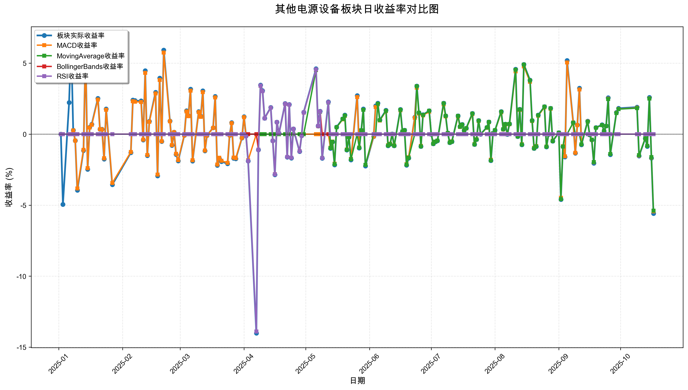
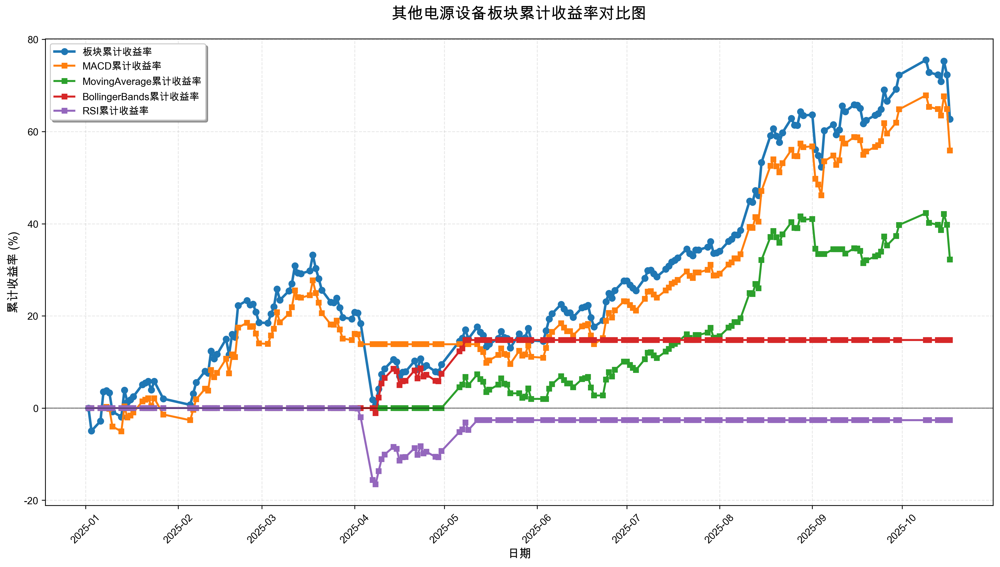

# 策略回测结果报告

**生成时间**: 2025-10-19 19:08:19
**行业板块**: 其他电源设备
**回测期间**: 20250101 至 20251017
**策略数量**: 4

## 📈 分析结论

### 策略表现分析
- **最佳策略**: MACD (总收益率: 55.90%)
- **最差策略**: RSI (总收益率: -2.62%)
### 交易活跃度分析
- **活跃策略**: 4 个
- **非活跃策略**: 0 个
- **最活跃策略**: MovingAverage (交易次数: 12)
### 🚨 异动提醒分析
- **板块异动**: 其他电源设备 近两周出现极端波动 (最大单日: -5.58%, 最小单日: -5.58%)
- **板块异动**: 其他电源设备 近两周出现大幅波动 (最大单日: 5.58%)
- **策略异动**: MACD 近两周出现大幅波动 (最大单日: 5.44%)
- **策略异动**: MovingAverage 近两周出现大幅波动 (最大单日: 5.39%)
### 风险分析
- **MACD**: 最大回撤 -14.20%, 夏普比率 3.0113
- **MovingAverage**: 最大回撤 -7.14%, 夏普比率 2.3548
- **BollingerBands**: 最大回撤 -3.28%, 夏普比率 1.9852
- **RSI**: 最大回撤 -16.54%, 夏普比率 -0.1778

## 📊 综合结果表

| 策略名称           | 初始资金     | 最终价值     | 总收益率   | 年化收益率   | 波动率    |    夏普比率 | 最大回撤    | 总交易次数   | 买入次数   | 卖出次数   | 总交易金额      | 平均交易金额   | 交易频率   |   数据点数 |
|:---------------|:---------|:---------|:-------|:--------|:-------|--------:|:--------|:--------|:-------|:-------|:-----------|:---------|:-------|-------:|
| 板块实际表现         | ¥100,000 | ¥162,701 | 62.70% | 90.71%  | 35.05% |  2.5881 | -24.43% | N/A     | N/A    | N/A    | N/A        | N/A      | N/A    |    190 |
| MACD           | ¥100,000 | ¥155,902 | 55.90% | 80.21%  | 26.64% |  3.0113 | -14.20% | 3       | 2      | 1      | ¥316,711   | ¥105,570 | 0.02   |    190 |
| MovingAverage  | ¥100,000 | ¥132,244 | 32.24% | 44.87%  | 19.06% |  2.3548 | -7.14%  | 12      | 6      | 6      | ¥1,354,701 | ¥112,892 | 0.06   |    190 |
| BollingerBands | ¥100,000 | ¥114,767 | 14.77% | 20.04%  | 10.10% |  1.9852 | -3.28%  | 2       | 1      | 1      | ¥212,271   | ¥106,135 | 0.01   |    190 |
| RSI            | ¥100,000 | ¥97,383  | -2.62% | -3.46%  | 19.44% | -0.1778 | -16.54% | 2       | 1      | 1      | ¥195,733   | ¥97,867  | 0.01   |    190 |

## 📊 每日收益率走势图

*图1: 其他电源设备板块每日收益率走势对比*

## 📈 累计收益率走势图

*图2: 其他电源设备板块累计收益率走势对比*

## 📅 日收益明细表

| 日期         | 板块实际收益率   | MACD收益率   | MovingAverage收益率   | BollingerBands收益率   | RSI收益率   |
|:-----------|:----------|:----------|:-------------------|:--------------------|:---------|
| 2025-01-02 | 0.00%     | 0.00%     | 0.00%              | 0.00%               | 0.00%    |
| 2025-01-03 | -4.95%    | 0.00%     | 0.00%              | 0.00%               | 0.00%    |
| 2025-01-06 | 2.22%     | 0.00%     | 0.00%              | 0.00%               | 0.00%    |
| 2025-01-07 | 6.54%     | 0.00%     | 0.00%              | 0.00%               | 0.00%    |
| 2025-01-08 | 0.27%     | 0.26%     | 0.00%              | 0.00%               | 0.00%    |
| 2025-01-09 | -0.46%    | -0.45%    | 0.00%              | 0.00%               | 0.00%    |
| 2025-01-10 | -3.95%    | -3.82%    | 0.00%              | 0.00%               | 0.00%    |
| 2025-01-13 | -1.15%    | -1.11%    | 0.00%              | 0.00%               | 0.00%    |
| 2025-01-14 | 5.90%     | 5.68%     | 0.00%              | 0.00%               | 0.00%    |
| 2025-01-15 | -2.47%    | -2.39%    | 0.00%              | 0.00%               | 0.00%    |
| 2025-01-16 | 0.48%     | 0.46%     | 0.00%              | 0.00%               | 0.00%    |
| 2025-01-17 | 0.69%     | 0.66%     | 0.00%              | 0.00%               | 0.00%    |
| 2025-01-20 | 2.52%     | 2.44%     | 0.00%              | 0.00%               | 0.00%    |
| 2025-01-21 | 0.35%     | 0.34%     | 0.00%              | 0.00%               | 0.00%    |
| 2025-01-22 | 0.35%     | 0.33%     | 0.00%              | 0.00%               | 0.00%    |
| 2025-01-23 | -1.76%    | -1.70%    | 0.00%              | 0.00%               | 0.00%    |
| 2025-01-24 | 1.77%     | 1.71%     | 0.00%              | 0.00%               | 0.00%    |
| 2025-01-27 | -3.56%    | -3.44%    | 0.00%              | 0.00%               | 0.00%    |
| 2025-02-05 | -1.30%    | -1.26%    | 0.00%              | 0.00%               | 0.00%    |
| 2025-02-06 | 2.40%     | 2.32%     | 0.00%              | 0.00%               | 0.00%    |
| 2025-02-07 | 2.36%     | 2.28%     | 0.00%              | 0.00%               | 0.00%    |
| 2025-02-10 | 2.34%     | 2.26%     | 0.00%              | 0.00%               | 0.00%    |
| 2025-02-11 | -0.41%    | -0.39%    | 0.00%              | 0.00%               | 0.00%    |
| 2025-02-12 | 4.46%     | 4.31%     | 0.00%              | 0.00%               | 0.00%    |
| 2025-02-13 | -1.51%    | -1.46%    | 0.00%              | 0.00%               | 0.00%    |
| 2025-02-14 | 0.90%     | 0.87%     | 0.00%              | 0.00%               | 0.00%    |
| 2025-02-17 | 2.95%     | 2.86%     | 0.00%              | 0.00%               | 0.00%    |
| 2025-02-18 | -2.94%    | -2.85%    | 0.00%              | 0.00%               | 0.00%    |
| 2025-02-19 | 3.94%     | 3.82%     | 0.00%              | 0.00%               | 0.00%    |
| 2025-02-20 | -0.51%    | -0.50%    | 0.00%              | 0.00%               | 0.00%    |
| 2025-02-21 | 5.92%     | 5.74%     | 0.00%              | 0.00%               | 0.00%    |
| 2025-02-24 | 0.93%     | 0.90%     | 0.00%              | 0.00%               | 0.00%    |
| 2025-02-25 | -0.79%    | -0.77%    | 0.00%              | 0.00%               | 0.00%    |
| 2025-02-26 | 0.14%     | 0.14%     | 0.00%              | 0.00%               | 0.00%    |
| 2025-02-27 | -1.43%    | -1.38%    | 0.00%              | 0.00%               | 0.00%    |
| 2025-02-28 | -1.88%    | -1.82%    | 0.00%              | 0.00%               | 0.00%    |
| 2025-03-03 | -0.08%    | -0.08%    | 0.00%              | 0.00%               | 0.00%    |
| 2025-03-04 | 1.65%     | 1.60%     | 0.00%              | 0.00%               | 0.00%    |
| 2025-03-05 | 1.30%     | 1.26%     | 0.00%              | 0.00%               | 0.00%    |
| 2025-03-06 | 3.16%     | 3.06%     | 0.00%              | 0.00%               | 0.00%    |
| 2025-03-07 | -1.89%    | -1.84%    | 0.00%              | 0.00%               | 0.00%    |
| 2025-03-10 | 1.59%     | 1.55%     | 0.00%              | 0.00%               | 0.00%    |
| 2025-03-11 | 1.26%     | 1.22%     | 0.00%              | 0.00%               | 0.00%    |
| 2025-03-12 | 3.05%     | 2.96%     | 0.00%              | 0.00%               | 0.00%    |
| 2025-03-13 | -1.18%    | -1.15%    | 0.00%              | 0.00%               | 0.00%    |
| 2025-03-14 | -0.10%    | -0.10%    | 0.00%              | 0.00%               | 0.00%    |
| 2025-03-17 | 0.45%     | 0.44%     | 0.00%              | 0.00%               | 0.00%    |
| 2025-03-18 | 2.65%     | 2.58%     | 0.00%              | 0.00%               | 0.00%    |
| 2025-03-19 | -2.20%    | -2.14%    | 0.00%              | 0.00%               | 0.00%    |
| 2025-03-20 | -1.71%    | -1.66%    | 0.00%              | 0.00%               | 0.00%    |
| 2025-03-21 | -1.93%    | -1.87%    | 0.00%              | 0.00%               | 0.00%    |
| 2025-03-24 | -2.08%    | -2.02%    | 0.00%              | 0.00%               | 0.00%    |
| 2025-03-25 | -0.08%    | -0.07%    | 0.00%              | 0.00%               | 0.00%    |
| 2025-03-26 | 0.81%     | 0.78%     | 0.00%              | 0.00%               | 0.00%    |
| 2025-03-27 | -1.70%    | -1.65%    | 0.00%              | 0.00%               | 0.00%    |
| 2025-03-28 | -1.73%    | -1.68%    | 0.00%              | 0.00%               | 0.00%    |
| 2025-03-31 | -0.27%    | -0.26%    | 0.00%              | 0.00%               | 0.00%    |
| 2025-04-01 | 1.23%     | 1.19%     | 0.00%              | 0.00%               | 0.00%    |
| 2025-04-02 | -0.13%    | -0.13%    | 0.00%              | 0.00%               | -0.13%   |
| 2025-04-03 | -1.89%    | -1.84%    | 0.00%              | 0.00%               | -1.88%   |
| 2025-04-07 | -14.01%   | 0.00%     | 0.00%              | 0.00%               | -13.89%  |
| 2025-04-08 | -1.10%    | 0.00%     | 0.00%              | -1.09%              | -1.09%   |
| 2025-04-09 | 3.45%     | 0.00%     | 0.00%              | 3.41%               | 3.42%    |
| 2025-04-10 | 3.06%     | 0.00%     | 0.00%              | 3.03%               | 3.03%    |
| 2025-04-11 | 1.12%     | 0.00%     | 0.00%              | 1.11%               | 1.11%    |
| 2025-04-14 | 1.88%     | 0.00%     | 0.00%              | 1.86%               | 1.86%    |
| 2025-04-15 | -0.47%    | 0.00%     | 0.00%              | -0.47%              | -0.47%   |
| 2025-04-16 | -2.86%    | 0.00%     | 0.00%              | -2.82%              | -2.83%   |
| 2025-04-17 | 0.85%     | 0.00%     | 0.00%              | 0.84%               | 0.85%    |
| 2025-04-18 | 0.06%     | 0.00%     | 0.00%              | 0.06%               | 0.06%    |
| 2025-04-21 | 2.16%     | 0.00%     | 0.00%              | 2.13%               | 2.14%    |
| 2025-04-22 | -1.62%    | 0.00%     | 0.00%              | -1.60%              | -1.60%   |
| 2025-04-23 | 2.09%     | 0.00%     | 0.00%              | 2.07%               | 2.07%    |
| 2025-04-24 | -1.68%    | 0.00%     | 0.00%              | -1.66%              | -1.66%   |
| 2025-04-25 | 0.37%     | 0.00%     | 0.00%              | 0.37%               | 0.37%    |
| 2025-04-28 | -1.22%    | 0.00%     | 0.00%              | -1.20%              | -1.21%   |
| 2025-04-29 | -0.11%    | 0.00%     | 0.00%              | -0.11%              | -0.11%   |
| 2025-04-30 | 1.54%     | 0.00%     | 0.00%              | 1.52%               | 1.53%    |
| 2025-05-06 | 4.60%     | 0.00%     | 4.51%              | 4.55%               | 4.56%    |
| 2025-05-07 | 0.58%     | 0.00%     | 0.57%              | 0.57%               | 0.58%    |
| 2025-05-08 | 1.61%     | 0.00%     | 1.58%              | 1.60%               | 1.60%    |
| 2025-05-09 | -1.70%    | 0.00%     | -1.67%             | 0.00%               | -1.69%   |
| 2025-05-12 | 2.27%     | 0.00%     | 2.22%              | 0.00%               | 2.25%    |
| 2025-05-13 | -1.00%    | -0.96%    | -0.98%             | 0.00%               | 0.00%    |
| 2025-05-14 | -0.55%    | -0.53%    | -0.54%             | 0.00%               | 0.00%    |
| 2025-05-15 | -2.16%    | -2.08%    | -2.12%             | 0.00%               | 0.00%    |
| 2025-05-16 | 0.50%     | 0.48%     | 0.49%              | 0.00%               | 0.00%    |
| 2025-05-19 | 1.08%     | 1.04%     | 1.06%              | 0.00%               | 0.00%    |
| 2025-05-20 | 1.34%     | 1.29%     | 1.31%              | 0.00%               | 0.00%    |
| 2025-05-21 | -1.12%    | -1.08%    | -1.10%             | 0.00%               | 0.00%    |
| 2025-05-22 | -0.21%    | -0.20%    | -0.20%             | 0.00%               | 0.00%    |
| 2025-05-23 | -1.81%    | -1.74%    | -1.77%             | 0.00%               | 0.00%    |
| 2025-05-26 | 2.71%     | 2.61%     | 0.00%              | 0.00%               | 0.00%    |
| 2025-05-27 | -0.98%    | -0.94%    | -0.95%             | 0.00%               | 0.00%    |
| 2025-05-28 | 0.27%     | 0.26%     | 0.26%              | 0.00%               | 0.00%    |
| 2025-05-29 | 1.77%     | 1.71%     | 1.71%              | 0.00%               | 0.00%    |
| 2025-05-30 | -2.24%    | -2.16%    | -2.16%             | 0.00%               | 0.00%    |
| 2025-06-03 | -0.17%    | -0.16%    | 0.00%              | 0.00%               | 0.00%    |
| 2025-06-04 | 1.99%     | 1.91%     | 0.00%              | 0.00%               | 0.00%    |
| 2025-06-05 | 2.18%     | 2.10%     | 2.14%              | 0.00%               | 0.00%    |
| 2025-06-06 | 0.99%     | 0.96%     | 0.98%              | 0.00%               | 0.00%    |
| 2025-06-09 | 1.68%     | 1.62%     | 1.65%              | 0.00%               | 0.00%    |
| 2025-06-10 | -0.81%    | -0.78%    | -0.80%             | 0.00%               | 0.00%    |
| 2025-06-11 | -0.71%    | -0.68%    | -0.70%             | 0.00%               | 0.00%    |
| 2025-06-12 | 0.01%     | 0.01%     | 0.01%              | 0.00%               | 0.00%    |
| 2025-06-13 | -0.82%    | -0.79%    | -0.81%             | 0.00%               | 0.00%    |
| 2025-06-16 | 1.74%     | 1.68%     | 1.71%              | 0.00%               | 0.00%    |
| 2025-06-17 | 0.18%     | 0.17%     | 0.18%              | 0.00%               | 0.00%    |
| 2025-06-18 | 0.27%     | 0.26%     | 0.27%              | 0.00%               | 0.00%    |
| 2025-06-19 | -2.18%    | -2.11%    | -2.15%             | 0.00%               | 0.00%    |
| 2025-06-20 | -1.69%    | -1.63%    | -1.66%             | 0.00%               | 0.00%    |
| 2025-06-23 | 1.19%     | 1.15%     | 0.00%              | 0.00%               | 0.00%    |
| 2025-06-24 | 3.39%     | 3.27%     | 3.37%              | 0.00%               | 0.00%    |
| 2025-06-25 | 1.51%     | 1.45%     | 1.50%              | 0.00%               | 0.00%    |
| 2025-06-26 | -0.86%    | -0.83%    | -0.86%             | 0.00%               | 0.00%    |
| 2025-06-27 | 1.37%     | 1.32%     | 1.36%              | 0.00%               | 0.00%    |
| 2025-06-30 | 1.65%     | 1.59%     | 1.64%              | 0.00%               | 0.00%    |
| 2025-07-01 | -0.01%    | -0.01%    | -0.01%             | 0.00%               | 0.00%    |
| 2025-07-02 | -0.68%    | -0.66%    | -0.68%             | 0.00%               | 0.00%    |
| 2025-07-03 | -0.54%    | -0.52%    | -0.53%             | 0.00%               | 0.00%    |
| 2025-07-04 | -0.47%    | -0.45%    | -0.46%             | 0.00%               | 0.00%    |
| 2025-07-07 | 2.18%     | 2.10%     | 2.17%              | 0.00%               | 0.00%    |
| 2025-07-08 | 1.29%     | 1.25%     | 1.29%              | 0.00%               | 0.00%    |
| 2025-07-09 | 0.08%     | 0.08%     | 0.08%              | 0.00%               | 0.00%    |
| 2025-07-10 | -0.60%    | -0.58%    | -0.60%             | 0.00%               | 0.00%    |
| 2025-07-11 | -0.53%    | -0.51%    | -0.52%             | 0.00%               | 0.00%    |
| 2025-07-14 | 1.29%     | 1.24%     | 1.28%              | 0.00%               | 0.00%    |
| 2025-07-15 | 0.53%     | 0.51%     | 0.52%              | 0.00%               | 0.00%    |
| 2025-07-16 | 0.68%     | 0.66%     | 0.67%              | 0.00%               | 0.00%    |
| 2025-07-17 | 0.26%     | 0.25%     | 0.26%              | 0.00%               | 0.00%    |
| 2025-07-18 | 0.41%     | 0.40%     | 0.41%              | 0.00%               | 0.00%    |
| 2025-07-21 | 1.46%     | 1.41%     | 1.45%              | 0.00%               | 0.00%    |
| 2025-07-22 | -0.72%    | -0.70%    | -0.72%             | 0.00%               | 0.00%    |
| 2025-07-23 | -0.38%    | -0.36%    | -0.37%             | 0.00%               | 0.00%    |
| 2025-07-24 | 0.96%     | 0.93%     | 0.95%              | 0.00%               | 0.00%    |
| 2025-07-25 | -0.00%    | -0.00%    | -0.00%             | 0.00%               | 0.00%    |
| 2025-07-28 | 0.47%     | 0.45%     | 0.46%              | 0.00%               | 0.00%    |
| 2025-07-29 | 0.86%     | 0.84%     | 0.86%              | 0.00%               | 0.00%    |
| 2025-07-30 | -1.86%    | -1.80%    | -1.85%             | 0.00%               | 0.00%    |
| 2025-07-31 | 0.06%     | 0.06%     | 0.06%              | 0.00%               | 0.00%    |
| 2025-08-01 | 0.27%     | 0.26%     | 0.27%              | 0.00%               | 0.00%    |
| 2025-08-04 | 1.59%     | 1.54%     | 1.58%              | 0.00%               | 0.00%    |
| 2025-08-05 | 0.34%     | 0.33%     | 0.34%              | 0.00%               | 0.00%    |
| 2025-08-06 | 0.70%     | 0.68%     | 0.70%              | 0.00%               | 0.00%    |
| 2025-08-07 | -0.02%    | -0.02%    | -0.02%             | 0.00%               | 0.00%    |
| 2025-08-08 | 0.72%     | 0.70%     | 0.72%              | 0.00%               | 0.00%    |
| 2025-08-11 | 4.57%     | 4.42%     | 4.54%              | 0.00%               | 0.00%    |
| 2025-08-12 | -0.16%    | -0.16%    | -0.16%             | 0.00%               | 0.00%    |
| 2025-08-13 | 1.75%     | 1.70%     | 1.74%              | 0.00%               | 0.00%    |
| 2025-08-14 | -0.74%    | -0.71%    | -0.73%             | 0.00%               | 0.00%    |
| 2025-08-15 | 4.91%     | 4.77%     | 4.89%              | 0.00%               | 0.00%    |
| 2025-08-18 | 3.80%     | 3.69%     | 3.78%              | 0.00%               | 0.00%    |
| 2025-08-19 | 0.96%     | 0.93%     | 0.95%              | 0.00%               | 0.00%    |
| 2025-08-20 | -1.00%    | -0.97%    | -1.00%             | 0.00%               | 0.00%    |
| 2025-08-21 | -0.87%    | -0.84%    | -0.86%             | 0.00%               | 0.00%    |
| 2025-08-22 | 1.34%     | 1.30%     | 1.33%              | 0.00%               | 0.00%    |
| 2025-08-25 | 1.94%     | 1.89%     | 1.93%              | 0.00%               | 0.00%    |
| 2025-08-26 | -0.90%    | -0.87%    | -0.89%             | 0.00%               | 0.00%    |
| 2025-08-27 | -0.02%    | -0.02%    | -0.02%             | 0.00%               | 0.00%    |
| 2025-08-28 | 1.82%     | 1.78%     | 1.82%              | 0.00%               | 0.00%    |
| 2025-08-29 | -0.49%    | -0.47%    | -0.49%             | 0.00%               | 0.00%    |
| 2025-09-01 | 0.10%     | 0.10%     | 0.10%              | 0.00%               | 0.00%    |
| 2025-09-02 | -4.60%    | -4.48%    | -4.58%             | 0.00%               | 0.00%    |
| 2025-09-03 | -0.87%    | -0.85%    | -0.87%             | 0.00%               | 0.00%    |
| 2025-09-04 | -1.61%    | -1.56%    | 0.00%              | 0.00%               | 0.00%    |
| 2025-09-05 | 5.19%     | 5.04%     | 0.00%              | 0.00%               | 0.00%    |
| 2025-09-08 | 0.82%     | 0.80%     | 0.81%              | 0.00%               | 0.00%    |
| 2025-09-09 | -1.34%    | -1.31%    | 0.00%              | 0.00%               | 0.00%    |
| 2025-09-10 | 0.65%     | 0.63%     | 0.00%              | 0.00%               | 0.00%    |
| 2025-09-11 | 3.23%     | 3.14%     | 0.00%              | 0.00%               | 0.00%    |
| 2025-09-12 | -0.74%    | -0.72%    | -0.72%             | 0.00%               | 0.00%    |
| 2025-09-15 | 0.91%     | 0.89%     | 0.88%              | 0.00%               | 0.00%    |
| 2025-09-16 | -0.05%    | -0.05%    | -0.05%             | 0.00%               | 0.00%    |
| 2025-09-17 | -0.41%    | -0.40%    | -0.39%             | 0.00%               | 0.00%    |
| 2025-09-18 | -2.04%    | -1.98%    | -1.96%             | 0.00%               | 0.00%    |
| 2025-09-19 | 0.46%     | 0.45%     | 0.45%              | 0.00%               | 0.00%    |
| 2025-09-22 | 0.66%     | 0.64%     | 0.64%              | 0.00%               | 0.00%    |
| 2025-09-23 | 0.22%     | 0.22%     | 0.22%              | 0.00%               | 0.00%    |
| 2025-09-24 | 0.58%     | 0.56%     | 0.56%              | 0.00%               | 0.00%    |
| 2025-09-25 | 2.56%     | 2.49%     | 2.47%              | 0.00%               | 0.00%    |
| 2025-09-26 | -1.44%    | -1.40%    | -1.39%             | 0.00%               | 0.00%    |
| 2025-09-29 | 1.53%     | 1.49%     | 1.48%              | 0.00%               | 0.00%    |
| 2025-09-30 | 1.82%     | 1.77%     | 1.76%              | 0.00%               | 0.00%    |
| 2025-10-09 | 1.90%     | 1.85%     | 1.83%              | 0.00%               | 0.00%    |
| 2025-10-10 | -1.53%    | -1.50%    | -1.48%             | 0.00%               | 0.00%    |
| 2025-10-13 | -0.30%    | -0.29%    | -0.29%             | 0.00%               | 0.00%    |
| 2025-10-14 | -0.86%    | -0.83%    | -0.83%             | 0.00%               | 0.00%    |
| 2025-10-15 | 2.59%     | 2.52%     | 2.50%              | 0.00%               | 0.00%    |
| 2025-10-16 | -1.68%    | -1.64%    | -1.62%             | 0.00%               | 0.00%    |
| 2025-10-17 | -5.58%    | -5.44%    | -5.39%             | 0.00%               | 0.00%    |

## 📊 日收益统计摘要

| 指标                | 平均日收益率   | 最大日收益率   | 最小日收益率   | 正收益天数   | 负收益天数   |
|:------------------|:---------|:---------|:---------|:--------|:--------|
| 板块实际收益率           | 0.28%    | 6.54%    | -14.01%  | 104天    | 84天     |
| MACD收益率           | 0.25%    | 5.74%    | -5.44%   | 88天     | 74天     |
| MovingAverage收益率  | 0.15%    | 4.89%    | -5.39%   | 58天     | 44天     |
| BollingerBands收益率 | 0.07%    | 4.55%    | -2.82%   | 13天     | 7天      |
| RSI收益率            | -0.01%   | 4.56%    | -13.89%  | 14天     | 11天     |

## 📈 累计收益明细表

| 日期         | 板块累计收益率   | MACD累计收益率   | MovingAverage累计收益率   | BollingerBands累计收益率   | RSI累计收益率   |
|:-----------|:----------|:------------|:---------------------|:----------------------|:-----------|
| 2025-01-02 | 0.00%     | 0.00%       | 0.00%                | 0.00%                 | 0.00%      |
| 2025-01-03 | -4.95%    | 0.00%       | 0.00%                | 0.00%                 | 0.00%      |
| 2025-01-06 | -2.83%    | 0.00%       | 0.00%                | 0.00%                 | 0.00%      |
| 2025-01-07 | 3.52%     | 0.00%       | 0.00%                | 0.00%                 | 0.00%      |
| 2025-01-08 | 3.80%     | 0.26%       | 0.00%                | 0.00%                 | 0.00%      |
| 2025-01-09 | 3.32%     | -0.19%      | 0.00%                | 0.00%                 | 0.00%      |
| 2025-01-10 | -0.77%    | -4.00%      | 0.00%                | 0.00%                 | 0.00%      |
| 2025-01-13 | -1.91%    | -5.06%      | 0.00%                | 0.00%                 | 0.00%      |
| 2025-01-14 | 3.88%     | 0.33%       | 0.00%                | 0.00%                 | 0.00%      |
| 2025-01-15 | 1.31%     | -2.06%      | 0.00%                | 0.00%                 | 0.00%      |
| 2025-01-16 | 1.79%     | -1.61%      | 0.00%                | 0.00%                 | 0.00%      |
| 2025-01-17 | 2.49%     | -0.96%      | 0.00%                | 0.00%                 | 0.00%      |
| 2025-01-20 | 5.08%     | 1.45%       | 0.00%                | 0.00%                 | 0.00%      |
| 2025-01-21 | 5.45%     | 1.80%       | 0.00%                | 0.00%                 | 0.00%      |
| 2025-01-22 | 5.81%     | 2.14%       | 0.00%                | 0.00%                 | 0.00%      |
| 2025-01-23 | 3.95%     | 0.41%       | 0.00%                | 0.00%                 | 0.00%      |
| 2025-01-24 | 5.80%     | 2.12%       | 0.00%                | 0.00%                 | 0.00%      |
| 2025-01-27 | 2.03%     | -1.39%      | 0.00%                | 0.00%                 | 0.00%      |
| 2025-02-05 | 0.70%     | -2.63%      | 0.00%                | 0.00%                 | 0.00%      |
| 2025-02-06 | 3.12%     | -0.38%      | 0.00%                | 0.00%                 | 0.00%      |
| 2025-02-07 | 5.55%     | 1.90%       | 0.00%                | 0.00%                 | 0.00%      |
| 2025-02-10 | 8.02%     | 4.20%       | 0.00%                | 0.00%                 | 0.00%      |
| 2025-02-11 | 7.59%     | 3.79%       | 0.00%                | 0.00%                 | 0.00%      |
| 2025-02-12 | 12.39%    | 8.27%       | 0.00%                | 0.00%                 | 0.00%      |
| 2025-02-13 | 10.69%    | 6.69%       | 0.00%                | 0.00%                 | 0.00%      |
| 2025-02-14 | 11.68%    | 7.61%       | 0.00%                | 0.00%                 | 0.00%      |
| 2025-02-17 | 14.98%    | 10.69%      | 0.00%                | 0.00%                 | 0.00%      |
| 2025-02-18 | 11.59%    | 7.53%       | 0.00%                | 0.00%                 | 0.00%      |
| 2025-02-19 | 15.99%    | 11.64%      | 0.00%                | 0.00%                 | 0.00%      |
| 2025-02-20 | 15.40%    | 11.08%      | 0.00%                | 0.00%                 | 0.00%      |
| 2025-02-21 | 22.23%    | 17.45%      | 0.00%                | 0.00%                 | 0.00%      |
| 2025-02-24 | 23.36%    | 18.51%      | 0.00%                | 0.00%                 | 0.00%      |
| 2025-02-25 | 22.39%    | 17.60%      | 0.00%                | 0.00%                 | 0.00%      |
| 2025-02-26 | 22.57%    | 17.77%      | 0.00%                | 0.00%                 | 0.00%      |
| 2025-02-27 | 20.82%    | 16.14%      | 0.00%                | 0.00%                 | 0.00%      |
| 2025-02-28 | 18.55%    | 14.02%      | 0.00%                | 0.00%                 | 0.00%      |
| 2025-03-03 | 18.46%    | 13.93%      | 0.00%                | 0.00%                 | 0.00%      |
| 2025-03-04 | 20.41%    | 15.76%      | 0.00%                | 0.00%                 | 0.00%      |
| 2025-03-05 | 21.98%    | 17.22%      | 0.00%                | 0.00%                 | 0.00%      |
| 2025-03-06 | 25.83%    | 20.81%      | 0.00%                | 0.00%                 | 0.00%      |
| 2025-03-07 | 23.45%    | 18.59%      | 0.00%                | 0.00%                 | 0.00%      |
| 2025-03-10 | 25.41%    | 20.43%      | 0.00%                | 0.00%                 | 0.00%      |
| 2025-03-11 | 26.99%    | 21.90%      | 0.00%                | 0.00%                 | 0.00%      |
| 2025-03-12 | 30.86%    | 25.51%      | 0.00%                | 0.00%                 | 0.00%      |
| 2025-03-13 | 29.31%    | 24.06%      | 0.00%                | 0.00%                 | 0.00%      |
| 2025-03-14 | 29.18%    | 23.94%      | 0.00%                | 0.00%                 | 0.00%      |
| 2025-03-17 | 29.76%    | 24.48%      | 0.00%                | 0.00%                 | 0.00%      |
| 2025-03-18 | 33.21%    | 27.70%      | 0.00%                | 0.00%                 | 0.00%      |
| 2025-03-19 | 30.28%    | 24.97%      | 0.00%                | 0.00%                 | 0.00%      |
| 2025-03-20 | 28.06%    | 22.89%      | 0.00%                | 0.00%                 | 0.00%      |
| 2025-03-21 | 25.59%    | 20.59%      | 0.00%                | 0.00%                 | 0.00%      |
| 2025-03-24 | 22.98%    | 18.15%      | 0.00%                | 0.00%                 | 0.00%      |
| 2025-03-25 | 22.88%    | 18.07%      | 0.00%                | 0.00%                 | 0.00%      |
| 2025-03-26 | 23.88%    | 18.99%      | 0.00%                | 0.00%                 | 0.00%      |
| 2025-03-27 | 21.78%    | 17.03%      | 0.00%                | 0.00%                 | 0.00%      |
| 2025-03-28 | 19.67%    | 15.07%      | 0.00%                | 0.00%                 | 0.00%      |
| 2025-03-31 | 19.34%    | 14.76%      | 0.00%                | 0.00%                 | 0.00%      |
| 2025-04-01 | 20.81%    | 16.13%      | 0.00%                | 0.00%                 | 0.00%      |
| 2025-04-02 | 20.65%    | 15.98%      | 0.00%                | 0.00%                 | -0.13%     |
| 2025-04-03 | 18.37%    | 13.85%      | 0.00%                | 0.00%                 | -2.01%     |
| 2025-04-07 | 1.79%     | 13.85%      | 0.00%                | 0.00%                 | -15.62%    |
| 2025-04-08 | 0.67%     | 13.85%      | 0.00%                | -1.09%                | -16.54%    |
| 2025-04-09 | 4.14%     | 13.85%      | 0.00%                | 2.28%                 | -13.69%    |
| 2025-04-10 | 7.33%     | 13.85%      | 0.00%                | 5.37%                 | -11.07%    |
| 2025-04-11 | 8.53%     | 13.85%      | 0.00%                | 6.54%                 | -10.08%    |
| 2025-04-14 | 10.57%    | 13.85%      | 0.00%                | 8.52%                 | -8.41%     |
| 2025-04-15 | 10.04%    | 13.85%      | 0.00%                | 8.01%                 | -8.84%     |
| 2025-04-16 | 6.90%     | 13.85%      | 0.00%                | 4.96%                 | -11.42%    |
| 2025-04-17 | 7.81%     | 13.85%      | 0.00%                | 5.84%                 | -10.67%    |
| 2025-04-18 | 7.88%     | 13.85%      | 0.00%                | 5.91%                 | -10.61%    |
| 2025-04-21 | 10.21%    | 13.85%      | 0.00%                | 8.17%                 | -8.70%     |
| 2025-04-22 | 8.43%     | 13.85%      | 0.00%                | 6.44%                 | -10.16%    |
| 2025-04-23 | 10.70%    | 13.85%      | 0.00%                | 8.64%                 | -8.30%     |
| 2025-04-24 | 8.84%     | 13.85%      | 0.00%                | 6.84%                 | -9.82%     |
| 2025-04-25 | 9.25%     | 13.85%      | 0.00%                | 7.24%                 | -9.49%     |
| 2025-04-28 | 7.92%     | 13.85%      | 0.00%                | 5.94%                 | -10.59%    |
| 2025-04-29 | 7.79%     | 13.85%      | 0.00%                | 5.82%                 | -10.69%    |
| 2025-04-30 | 9.45%     | 13.85%      | 0.00%                | 7.43%                 | -9.33%     |
| 2025-05-06 | 14.49%    | 13.85%      | 4.51%                | 12.32%                | -5.19%     |
| 2025-05-07 | 15.15%    | 13.85%      | 5.10%                | 12.96%                | -4.65%     |
| 2025-05-08 | 17.01%    | 13.85%      | 6.77%                | 14.77%                | -3.12%     |
| 2025-05-09 | 15.02%    | 13.85%      | 4.98%                | 14.77%                | -4.76%     |
| 2025-05-12 | 17.62%    | 13.85%      | 7.32%                | 14.77%                | -2.62%     |
| 2025-05-13 | 16.45%    | 12.76%      | 6.27%                | 14.77%                | -2.62%     |
| 2025-05-14 | 15.82%    | 12.17%      | 5.70%                | 14.77%                | -2.62%     |
| 2025-05-15 | 13.31%    | 9.83%       | 3.46%                | 14.77%                | -2.62%     |
| 2025-05-16 | 13.88%    | 10.36%      | 3.97%                | 14.77%                | -2.62%     |
| 2025-05-19 | 15.11%    | 11.51%      | 5.07%                | 14.77%                | -2.62%     |
| 2025-05-20 | 16.65%    | 12.95%      | 6.45%                | 14.77%                | -2.62%     |
| 2025-05-21 | 15.35%    | 11.73%      | 5.28%                | 14.77%                | -2.62%     |
| 2025-05-22 | 15.11%    | 11.51%      | 5.07%                | 14.77%                | -2.62%     |
| 2025-05-23 | 13.03%    | 9.57%       | 3.20%                | 14.77%                | -2.62%     |
| 2025-05-26 | 16.09%    | 12.43%      | 3.20%                | 14.77%                | -2.62%     |
| 2025-05-27 | 14.96%    | 11.36%      | 2.23%                | 14.77%                | -2.62%     |
| 2025-05-28 | 15.27%    | 11.65%      | 2.49%                | 14.77%                | -2.62%     |
| 2025-05-29 | 17.31%    | 13.56%      | 4.25%                | 14.77%                | -2.62%     |
| 2025-05-30 | 14.69%    | 11.11%      | 1.99%                | 14.77%                | -2.62%     |
| 2025-06-03 | 14.49%    | 10.93%      | 1.99%                | 14.77%                | -2.62%     |
| 2025-06-04 | 16.76%    | 13.05%      | 1.99%                | 14.77%                | -2.62%     |
| 2025-06-05 | 19.31%    | 15.42%      | 4.18%                | 14.77%                | -2.62%     |
| 2025-06-06 | 20.49%    | 16.53%      | 5.19%                | 14.77%                | -2.62%     |
| 2025-06-09 | 22.51%    | 18.41%      | 6.93%                | 14.77%                | -2.62%     |
| 2025-06-10 | 21.52%    | 17.48%      | 6.07%                | 14.77%                | -2.62%     |
| 2025-06-11 | 20.66%    | 16.68%      | 5.33%                | 14.77%                | -2.62%     |
| 2025-06-12 | 20.67%    | 16.70%      | 5.35%                | 14.77%                | -2.62%     |
| 2025-06-13 | 19.68%    | 15.77%      | 4.50%                | 14.77%                | -2.62%     |
| 2025-06-16 | 21.76%    | 17.71%      | 6.28%                | 14.77%                | -2.62%     |
| 2025-06-17 | 21.98%    | 17.92%      | 6.47%                | 14.77%                | -2.62%     |
| 2025-06-18 | 22.31%    | 18.22%      | 6.75%                | 14.77%                | -2.62%     |
| 2025-06-19 | 19.64%    | 15.73%      | 4.46%                | 14.77%                | -2.62%     |
| 2025-06-20 | 17.62%    | 13.85%      | 2.73%                | 14.77%                | -2.62%     |
| 2025-06-23 | 19.02%    | 15.16%      | 2.73%                | 14.77%                | -2.62%     |
| 2025-06-24 | 23.06%    | 18.92%      | 6.19%                | 14.77%                | -2.62%     |
| 2025-06-25 | 24.91%    | 20.65%      | 7.78%                | 14.77%                | -2.62%     |
| 2025-06-26 | 23.84%    | 19.65%      | 6.86%                | 14.77%                | -2.62%     |
| 2025-06-27 | 25.53%    | 21.23%      | 8.31%                | 14.77%                | -2.62%     |
| 2025-06-30 | 27.60%    | 23.16%      | 10.09%               | 14.77%                | -2.62%     |
| 2025-07-01 | 27.58%    | 23.14%      | 10.07%               | 14.77%                | -2.62%     |
| 2025-07-02 | 26.71%    | 22.33%      | 9.33%                | 14.77%                | -2.62%     |
| 2025-07-03 | 26.03%    | 21.70%      | 8.74%                | 14.77%                | -2.62%     |
| 2025-07-04 | 25.45%    | 21.15%      | 8.24%                | 14.77%                | -2.62%     |
| 2025-07-07 | 28.18%    | 23.70%      | 10.59%               | 14.77%                | -2.62%     |
| 2025-07-08 | 29.84%    | 25.25%      | 12.01%               | 14.77%                | -2.62%     |
| 2025-07-09 | 29.95%    | 25.35%      | 12.10%               | 14.77%                | -2.62%     |
| 2025-07-10 | 29.16%    | 24.62%      | 11.43%               | 14.77%                | -2.62%     |
| 2025-07-11 | 28.48%    | 23.98%      | 10.85%               | 14.77%                | -2.62%     |
| 2025-07-14 | 30.14%    | 25.53%      | 12.27%               | 14.77%                | -2.62%     |
| 2025-07-15 | 30.82%    | 26.16%      | 12.85%               | 14.77%                | -2.62%     |
| 2025-07-16 | 31.71%    | 26.99%      | 13.62%               | 14.77%                | -2.62%     |
| 2025-07-17 | 32.05%    | 27.31%      | 13.91%               | 14.77%                | -2.62%     |
| 2025-07-18 | 32.59%    | 27.82%      | 14.37%               | 14.77%                | -2.62%     |
| 2025-07-21 | 34.52%    | 29.62%      | 16.03%               | 14.77%                | -2.62%     |
| 2025-07-22 | 33.55%    | 28.71%      | 15.20%               | 14.77%                | -2.62%     |
| 2025-07-23 | 33.05%    | 28.24%      | 14.76%               | 14.77%                | -2.62%     |
| 2025-07-24 | 34.32%    | 29.43%      | 15.86%               | 14.77%                | -2.62%     |
| 2025-07-25 | 34.32%    | 29.43%      | 15.85%               | 14.77%                | -2.62%     |
| 2025-07-28 | 34.94%    | 30.01%      | 16.39%               | 14.77%                | -2.62%     |
| 2025-07-29 | 36.11%    | 31.10%      | 17.39%               | 14.77%                | -2.62%     |
| 2025-07-30 | 33.58%    | 28.74%      | 15.22%               | 14.77%                | -2.62%     |
| 2025-07-31 | 33.67%    | 28.82%      | 15.30%               | 14.77%                | -2.62%     |
| 2025-08-01 | 34.03%    | 29.16%      | 15.61%               | 14.77%                | -2.62%     |
| 2025-08-04 | 36.17%    | 31.15%      | 17.44%               | 14.77%                | -2.62%     |
| 2025-08-05 | 36.63%    | 31.59%      | 17.84%               | 14.77%                | -2.62%     |
| 2025-08-06 | 37.59%    | 32.48%      | 18.67%               | 14.77%                | -2.62%     |
| 2025-08-07 | 37.57%    | 32.46%      | 18.65%               | 14.77%                | -2.62%     |
| 2025-08-08 | 38.56%    | 33.39%      | 19.50%               | 14.77%                | -2.62%     |
| 2025-08-11 | 44.89%    | 39.29%      | 24.93%               | 14.77%                | -2.62%     |
| 2025-08-12 | 44.65%    | 39.07%      | 24.72%               | 14.77%                | -2.62%     |
| 2025-08-13 | 47.19%    | 41.43%      | 26.90%               | 14.77%                | -2.62%     |
| 2025-08-14 | 46.11%    | 40.42%      | 25.97%               | 14.77%                | -2.62%     |
| 2025-08-15 | 53.28%    | 47.12%      | 32.13%               | 14.77%                | -2.62%     |
| 2025-08-18 | 59.11%    | 52.55%      | 37.13%               | 14.77%                | -2.62%     |
| 2025-08-19 | 60.63%    | 53.97%      | 38.43%               | 14.77%                | -2.62%     |
| 2025-08-20 | 59.02%    | 52.47%      | 37.05%               | 14.77%                | -2.62%     |
| 2025-08-21 | 57.64%    | 51.18%      | 35.87%               | 14.77%                | -2.62%     |
| 2025-08-22 | 59.75%    | 53.15%      | 37.68%               | 14.77%                | -2.62%     |
| 2025-08-25 | 62.84%    | 56.03%      | 40.33%               | 14.77%                | -2.62%     |
| 2025-08-26 | 61.38%    | 54.67%      | 39.08%               | 14.77%                | -2.62%     |
| 2025-08-27 | 61.34%    | 54.64%      | 39.05%               | 14.77%                | -2.62%     |
| 2025-08-28 | 64.29%    | 57.38%      | 41.57%               | 14.77%                | -2.62%     |
| 2025-08-29 | 63.49%    | 56.63%      | 40.89%               | 14.77%                | -2.62%     |
| 2025-09-01 | 63.65%    | 56.79%      | 41.03%               | 14.77%                | -2.62%     |
| 2025-09-02 | 56.12%    | 49.77%      | 34.57%               | 14.77%                | -2.62%     |
| 2025-09-03 | 54.77%    | 48.50%      | 33.40%               | 14.77%                | -2.62%     |
| 2025-09-04 | 52.28%    | 46.18%      | 33.40%               | 14.77%                | -2.62%     |
| 2025-09-05 | 60.19%    | 53.56%      | 33.40%               | 14.77%                | -2.62%     |
| 2025-09-08 | 61.50%    | 54.78%      | 34.48%               | 14.77%                | -2.62%     |
| 2025-09-09 | 59.33%    | 52.76%      | 34.48%               | 14.77%                | -2.62%     |
| 2025-09-10 | 60.37%    | 53.73%      | 34.48%               | 14.77%                | -2.62%     |
| 2025-09-11 | 65.55%    | 58.56%      | 34.48%               | 14.77%                | -2.62%     |
| 2025-09-12 | 64.32%    | 57.41%      | 33.51%               | 14.77%                | -2.62%     |
| 2025-09-15 | 65.82%    | 58.81%      | 34.69%               | 14.77%                | -2.62%     |
| 2025-09-16 | 65.74%    | 58.74%      | 34.62%               | 14.77%                | -2.62%     |
| 2025-09-17 | 65.06%    | 58.11%      | 34.10%               | 14.77%                | -2.62%     |
| 2025-09-18 | 61.71%    | 54.97%      | 31.46%               | 14.77%                | -2.62%     |
| 2025-09-19 | 62.46%    | 55.67%      | 32.05%               | 14.77%                | -2.62%     |
| 2025-09-22 | 63.53%    | 56.67%      | 32.89%               | 14.77%                | -2.62%     |
| 2025-09-23 | 63.89%    | 57.02%      | 33.18%               | 14.77%                | -2.62%     |
| 2025-09-24 | 64.84%    | 57.90%      | 33.92%               | 14.77%                | -2.62%     |
| 2025-09-25 | 69.06%    | 61.83%      | 37.23%               | 14.77%                | -2.62%     |
| 2025-09-26 | 66.62%    | 59.56%      | 35.32%               | 14.77%                | -2.62%     |
| 2025-09-29 | 69.18%    | 61.94%      | 37.32%               | 14.77%                | -2.62%     |
| 2025-09-30 | 72.25%    | 64.81%      | 39.73%               | 14.77%                | -2.62%     |
| 2025-10-09 | 75.53%    | 67.87%      | 42.29%               | 14.77%                | -2.62%     |
| 2025-10-10 | 72.83%    | 65.35%      | 40.18%               | 14.77%                | -2.62%     |
| 2025-10-13 | 72.31%    | 64.87%      | 39.78%               | 14.77%                | -2.62%     |
| 2025-10-14 | 70.84%    | 63.49%      | 38.62%               | 14.77%                | -2.62%     |
| 2025-10-15 | 75.26%    | 67.62%      | 42.09%               | 14.77%                | -2.62%     |
| 2025-10-16 | 72.32%    | 64.88%      | 39.79%               | 14.77%                | -2.62%     |
| 2025-10-17 | 62.70%    | 55.90%      | 32.24%               | 14.77%                | -2.62%     |

## 📊 累计收益统计摘要

| 指标                  | 最终累计收益率   | 最大累计收益率   | 最小累计收益率   | 累计收益波动   | 收益稳定性   |
|:--------------------|:----------|:----------|:----------|:---------|:--------|
| 板块累计收益率             | 62.70%    | 75.53%    | -4.95%    | 80.48%   | 波动      |
| MACD累计收益率           | 55.90%    | 67.87%    | -5.06%    | 72.93%   | 波动      |
| MovingAverage累计收益率  | 32.24%    | 42.29%    | 0.00%     | 42.29%   | 波动      |
| BollingerBands累计收益率 | 14.77%    | 14.77%    | -1.09%    | 15.86%   | 稳定      |
| RSI累计收益率            | -2.62%    | 0.00%     | -16.54%   | 16.54%   | 稳定      |

