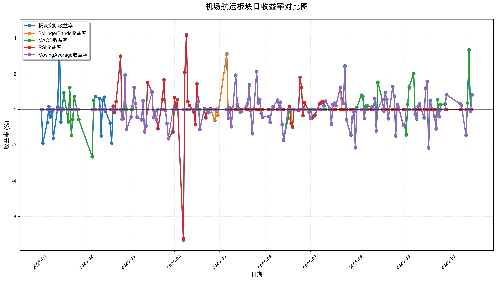
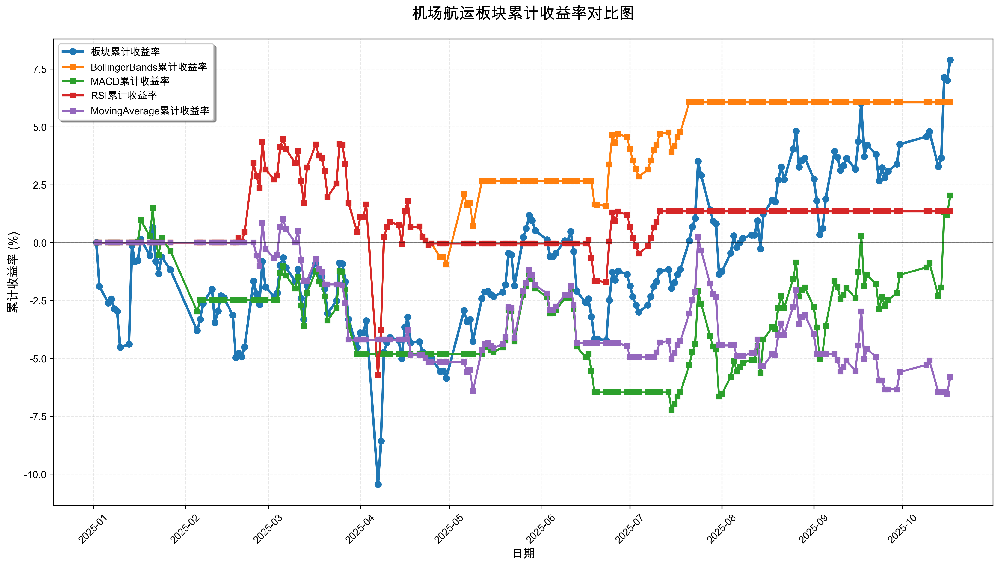

# 策略回测结果报告

**生成时间**: 2025-10-19 19:01:37
**行业板块**: 机场航运
**回测期间**: 20250101 至 20251017
**策略数量**: 4

## 📈 分析结论

### 策略表现分析
- **最佳策略**: BollingerBands (总收益率: 6.06%)
- **最差策略**: MovingAverage (总收益率: -5.80%)
### 交易活跃度分析
- **活跃策略**: 4 个
- **非活跃策略**: 0 个
- **最活跃策略**: MovingAverage (交易次数: 29)
### 🚨 异动提醒分析
- **板块异动**: 机场航运 近两周出现极端波动 (最大单日: 3.35%, 最小单日: 3.35%)
- **板块异动**: 机场航运 近两周出现大幅波动 (最大单日: 3.35%)
- **策略异动**: MACD 近两周出现极端表现 (最大单日: 3.33%, 最小单日: 3.33%)
- **策略异动**: MACD 近两周出现大幅波动 (最大单日: 3.33%)
### 风险分析
- **BollingerBands**: 最大回撤 -9.77%, 夏普比率 0.6012
- **MACD**: 最大回撤 -8.58%, 夏普比率 0.2242
- **RSI**: 最大回撤 -9.77%, 夏普比率 0.1412
- **MovingAverage**: 最大回撤 -7.49%, 夏普比率 -0.7611

## 📊 综合结果表

| 策略名称           | 初始资金     | 最终价值     | 总收益率   | 年化收益率   | 波动率    |    夏普比率 | 最大回撤    | 总交易次数   | 买入次数   | 卖出次数   | 总交易金额      | 平均交易金额   | 交易频率   |   数据点数 |
|:---------------|:---------|:---------|:-------|:--------|:-------|--------:|:--------|:--------|:-------|:-------|:-----------|:---------|:-------|-------:|
| 板块实际表现         | ¥100,000 | ¥107,893 | 7.89%  | 10.60%  | 18.80% |  0.5639 | -11.03% | N/A     | N/A    | N/A    | N/A        | N/A      | N/A    |    190 |
| BollingerBands | ¥100,000 | ¥106,059 | 6.06%  | 8.11%   | 13.50% |  0.6012 | -9.77%  | 4       | 2      | 2      | ¥406,130   | ¥101,532 | 0.02   |    190 |
| MACD           | ¥100,000 | ¥102,035 | 2.03%  | 2.71%   | 12.08% |  0.2242 | -8.58%  | 7       | 4      | 3      | ¥663,814   | ¥94,831  | 0.04   |    190 |
| RSI            | ¥100,000 | ¥101,346 | 1.35%  | 1.79%   | 12.67% |  0.1412 | -9.77%  | 4       | 2      | 2      | ¥398,637   | ¥99,659  | 0.02   |    190 |
| MovingAverage  | ¥100,000 | ¥94,199  | -5.80% | -7.62%  | 10.01% | -0.7611 | -7.49%  | 29      | 15     | 14     | ¥2,731,452 | ¥94,188  | 0.15   |    190 |

## 📊 每日收益率走势图

*图1: 机场航运板块每日收益率走势对比*

## 📈 累计收益率走势图

*图2: 机场航运板块累计收益率走势对比*

## 📅 日收益明细表

| 日期         | 板块实际收益率   | BollingerBands收益率   | MACD收益率   | RSI收益率   | MovingAverage收益率   |
|:-----------|:----------|:--------------------|:----------|:---------|:-------------------|
| 2025-01-02 | 0.00%     | 0.00%               | 0.00%     | 0.00%    | 0.00%              |
| 2025-01-03 | -1.89%    | 0.00%               | 0.00%     | 0.00%    | 0.00%              |
| 2025-01-06 | -0.72%    | 0.00%               | 0.00%     | 0.00%    | 0.00%              |
| 2025-01-07 | 0.17%     | 0.00%               | 0.00%     | 0.00%    | 0.00%              |
| 2025-01-08 | -0.42%    | 0.00%               | 0.00%     | 0.00%    | 0.00%              |
| 2025-01-09 | -0.13%    | 0.00%               | 0.00%     | 0.00%    | 0.00%              |
| 2025-01-10 | -1.61%    | 0.00%               | 0.00%     | 0.00%    | 0.00%              |
| 2025-01-13 | 0.14%     | 0.00%               | 0.00%     | 0.00%    | 0.00%              |
| 2025-01-14 | 4.47%     | 0.00%               | 0.00%     | 0.00%    | 0.00%              |
| 2025-01-15 | -0.70%    | 0.00%               | 0.00%     | 0.00%    | 0.00%              |
| 2025-01-16 | 0.05%     | 0.00%               | 0.05%     | 0.00%    | 0.00%              |
| 2025-01-17 | 0.93%     | 0.00%               | 0.92%     | 0.00%    | 0.00%              |
| 2025-01-20 | -0.70%    | 0.00%               | -0.69%    | 0.00%    | 0.00%              |
| 2025-01-21 | 1.22%     | 0.00%               | 1.21%     | 0.00%    | 0.00%              |
| 2025-01-22 | -1.45%    | 0.00%               | -1.44%    | 0.00%    | 0.00%              |
| 2025-01-23 | -0.55%    | 0.00%               | -0.55%    | 0.00%    | 0.00%              |
| 2025-01-24 | 0.73%     | 0.00%               | 0.73%     | 0.00%    | 0.00%              |
| 2025-01-27 | -0.56%    | 0.00%               | -0.56%    | 0.00%    | 0.00%              |
| 2025-02-05 | -2.65%    | 0.00%               | -2.63%    | 0.00%    | 0.00%              |
| 2025-02-06 | 0.51%     | 0.00%               | 0.50%     | 0.00%    | 0.00%              |
| 2025-02-07 | 0.72%     | 0.00%               | 0.00%     | 0.00%    | 0.00%              |
| 2025-02-10 | 0.62%     | 0.00%               | 0.00%     | 0.00%    | 0.00%              |
| 2025-02-11 | -1.48%    | 0.00%               | 0.00%     | 0.00%    | 0.00%              |
| 2025-02-12 | 0.52%     | 0.00%               | 0.00%     | 0.00%    | 0.00%              |
| 2025-02-13 | 0.69%     | 0.00%               | 0.00%     | 0.00%    | 0.00%              |
| 2025-02-14 | -0.10%    | 0.00%               | 0.00%     | 0.00%    | 0.00%              |
| 2025-02-17 | -0.76%    | 0.00%               | 0.00%     | 0.00%    | 0.00%              |
| 2025-02-18 | -1.89%    | 0.00%               | 0.00%     | 0.00%    | 0.00%              |
| 2025-02-19 | 0.19%     | 0.19%               | 0.00%     | 0.19%    | 0.00%              |
| 2025-02-20 | -0.16%    | -0.16%              | 0.00%     | -0.16%   | 0.00%              |
| 2025-02-21 | 0.44%     | 0.44%               | 0.00%     | 0.44%    | 0.00%              |
| 2025-02-24 | 2.99%     | 2.96%               | 0.00%     | 2.96%    | 0.00%              |
| 2025-02-25 | -0.55%    | -0.55%              | 0.00%     | -0.55%   | -0.55%             |
| 2025-02-26 | -0.49%    | -0.48%              | 0.00%     | -0.48%   | -0.48%             |
| 2025-02-27 | 1.93%     | 1.91%               | 0.00%     | 1.91%    | 1.90%              |
| 2025-02-28 | -1.12%    | -1.12%              | 0.00%     | -1.12%   | -1.11%             |
| 2025-03-03 | -0.42%    | -0.42%              | 0.00%     | -0.42%   | -0.42%             |
| 2025-03-04 | 0.17%     | 0.17%               | 0.00%     | 0.17%    | 0.16%              |
| 2025-03-05 | 1.22%     | 1.21%               | 1.20%     | 1.21%    | 1.20%              |
| 2025-03-06 | 0.33%     | 0.33%               | 0.33%     | 0.33%    | 0.33%              |
| 2025-03-07 | -0.43%    | -0.43%              | -0.43%    | -0.43%   | -0.43%             |
| 2025-03-10 | -0.58%    | -0.58%              | -0.57%    | -0.58%   | -0.57%             |
| 2025-03-11 | 0.50%     | 0.50%               | 0.50%     | 0.50%    | 0.50%              |
| 2025-03-12 | -1.26%    | -1.25%              | -1.24%    | -1.25%   | -1.24%             |
| 2025-03-13 | -0.94%    | -0.93%              | -0.92%    | -0.93%   | -0.92%             |
| 2025-03-14 | 1.52%     | 1.50%               | 1.49%     | 1.50%    | 0.00%              |
| 2025-03-17 | 0.98%     | 0.97%               | 0.96%     | 0.97%    | 0.98%              |
| 2025-03-18 | -0.46%    | -0.46%              | -0.46%    | -0.46%   | -0.46%             |
| 2025-03-19 | -0.11%    | -0.11%              | -0.11%    | -0.11%   | -0.11%             |
| 2025-03-20 | -0.55%    | -0.55%              | -0.54%    | -0.55%   | -0.55%             |
| 2025-03-21 | -1.08%    | -1.07%              | -1.06%    | -1.07%   | 0.00%              |
| 2025-03-24 | 0.57%     | 0.56%               | 0.56%     | 0.56%    | 0.00%              |
| 2025-03-25 | 1.67%     | 1.66%               | 1.64%     | 1.66%    | 0.00%              |
| 2025-03-26 | -0.04%    | -0.04%              | -0.04%    | -0.04%   | -0.04%             |
| 2025-03-27 | -0.78%    | -0.77%              | -0.77%    | -0.77%   | -0.77%             |
| 2025-03-28 | -1.64%    | -1.63%              | -1.62%    | -1.63%   | -1.62%             |
| 2025-03-31 | -1.26%    | -1.25%              | -1.24%    | -1.25%   | 0.00%              |
| 2025-04-01 | 0.66%     | 0.66%               | 0.00%     | 0.66%    | 0.00%              |
| 2025-04-02 | 0.01%     | 0.01%               | 0.00%     | 0.01%    | 0.00%              |
| 2025-04-03 | 0.54%     | 0.53%               | 0.00%     | 0.53%    | 0.00%              |
| 2025-04-07 | -7.32%    | -7.25%              | 0.00%     | -7.25%   | 0.00%              |
| 2025-04-08 | 2.08%     | 2.06%               | 0.00%     | 2.06%    | 0.00%              |
| 2025-04-09 | 4.19%     | 4.15%               | 0.00%     | 4.15%    | 0.00%              |
| 2025-04-10 | 0.45%     | 0.44%               | 0.00%     | 0.44%    | 0.00%              |
| 2025-04-11 | 0.23%     | 0.23%               | 0.00%     | 0.23%    | 0.00%              |
| 2025-04-14 | -0.14%    | -0.14%              | 0.00%     | -0.14%   | 0.00%              |
| 2025-04-15 | -0.83%    | -0.82%              | 0.00%     | -0.82%   | 0.00%              |
| 2025-04-16 | 1.44%     | 1.43%               | 0.00%     | 1.43%    | 0.00%              |
| 2025-04-17 | 0.45%     | 0.44%               | 0.00%     | 0.44%    | 0.44%              |
| 2025-04-18 | -1.13%    | -1.12%              | 0.00%     | -1.12%   | -1.12%             |
| 2025-04-21 | 0.04%     | 0.03%               | 0.00%     | 0.03%    | 0.00%              |
| 2025-04-22 | -0.47%    | -0.47%              | 0.00%     | -0.47%   | 0.00%              |
| 2025-04-23 | -0.15%    | -0.15%              | 0.00%     | -0.15%   | -0.14%             |
| 2025-04-24 | -0.18%    | -0.18%              | 0.00%     | -0.18%   | -0.18%             |
| 2025-04-25 | 0.05%     | 0.05%               | 0.00%     | 0.05%    | 0.00%              |
| 2025-04-28 | -0.60%    | -0.59%              | 0.00%     | 0.00%    | 0.00%              |
| 2025-04-29 | 0.02%     | 0.02%               | 0.00%     | 0.00%    | 0.00%              |
| 2025-04-30 | -0.34%    | -0.34%              | 0.00%     | 0.00%    | 0.00%              |
| 2025-05-06 | 3.11%     | 3.08%               | 0.00%     | 0.00%    | 0.00%              |
| 2025-05-07 | -0.48%    | -0.48%              | 0.00%     | 0.00%    | -0.48%             |
| 2025-05-08 | 0.09%     | 0.09%               | 0.00%     | 0.00%    | 0.09%              |
| 2025-05-09 | -0.97%    | -0.96%              | 0.00%     | 0.00%    | -0.96%             |
| 2025-05-12 | 1.93%     | 1.91%               | 0.00%     | 0.00%    | 1.89%              |
| 2025-05-13 | 0.30%     | 0.00%               | 0.29%     | 0.00%    | 0.29%              |
| 2025-05-14 | 0.03%     | 0.00%               | 0.03%     | 0.00%    | 0.03%              |
| 2025-05-15 | -0.14%    | 0.00%               | -0.14%    | 0.00%    | -0.14%             |
| 2025-05-16 | -0.10%    | 0.00%               | -0.09%    | 0.00%    | -0.09%             |
| 2025-05-19 | 0.19%     | 0.00%               | 0.19%     | 0.00%    | 0.19%              |
| 2025-05-20 | 0.33%     | 0.00%               | 0.32%     | 0.00%    | 0.32%              |
| 2025-05-21 | 1.39%     | 0.00%               | 1.36%     | 0.00%    | 1.36%              |
| 2025-05-22 | -0.05%    | 0.00%               | -0.05%    | 0.00%    | -0.05%             |
| 2025-05-23 | -1.36%    | 0.00%               | -1.33%    | 0.00%    | -1.33%             |
| 2025-05-26 | 2.14%     | 0.00%               | 2.10%     | 0.00%    | 2.10%              |
| 2025-05-27 | 0.37%     | 0.00%               | 0.37%     | 0.00%    | 0.37%              |
| 2025-05-28 | 0.57%     | 0.00%               | 0.56%     | 0.00%    | 0.56%              |
| 2025-05-29 | -0.22%    | 0.00%               | -0.22%    | 0.00%    | -0.22%             |
| 2025-05-30 | -0.43%    | 0.00%               | -0.43%    | 0.00%    | -0.43%             |
| 2025-06-03 | -0.38%    | 0.00%               | -0.38%    | 0.00%    | -0.38%             |
| 2025-06-04 | -0.73%    | 0.00%               | -0.72%    | 0.00%    | -0.72%             |
| 2025-06-05 | 0.01%     | 0.00%               | 0.01%     | 0.00%    | 0.01%              |
| 2025-06-06 | 0.15%     | 0.00%               | 0.15%     | 0.00%    | 0.15%              |
| 2025-06-09 | 0.53%     | 0.00%               | 0.52%     | 0.00%    | 0.52%              |
| 2025-06-10 | -0.01%    | 0.00%               | -0.01%    | 0.00%    | -0.01%             |
| 2025-06-11 | 0.41%     | 0.00%               | 0.40%     | 0.00%    | 0.40%              |
| 2025-06-12 | -0.86%    | 0.00%               | -0.84%    | 0.00%    | -0.84%             |
| 2025-06-13 | -1.72%    | 0.00%               | -1.69%    | 0.00%    | -1.69%             |
| 2025-06-16 | -0.50%    | 0.00%               | -0.49%    | 0.00%    | 0.00%              |
| 2025-06-17 | 0.15%     | 0.00%               | 0.15%     | 0.15%    | 0.00%              |
| 2025-06-18 | -0.78%    | 0.00%               | -0.77%    | -0.78%   | 0.00%              |
| 2025-06-19 | -0.99%    | -0.97%              | -0.97%    | -0.99%   | 0.00%              |
| 2025-06-20 | -0.00%    | -0.00%              | 0.00%     | -0.00%   | 0.00%              |
| 2025-06-23 | -0.06%    | -0.06%              | 0.00%     | -0.06%   | 0.00%              |
| 2025-06-24 | 1.80%     | 1.77%               | 0.00%     | 1.79%    | 0.00%              |
| 2025-06-25 | 1.25%     | 1.23%               | 0.00%     | 1.24%    | 0.00%              |
| 2025-06-26 | -0.35%    | -0.35%              | 0.00%     | -0.35%   | 0.00%              |
| 2025-06-27 | 0.40%     | 0.40%               | 0.00%     | 0.40%    | 0.00%              |
| 2025-06-30 | -0.14%    | -0.14%              | 0.00%     | -0.14%   | -0.14%             |
| 2025-07-01 | -0.51%    | -0.50%              | 0.00%     | -0.51%   | -0.50%             |
| 2025-07-02 | -0.48%    | -0.47%              | 0.00%     | -0.48%   | 0.00%              |
| 2025-07-03 | -0.37%    | -0.36%              | 0.00%     | -0.37%   | 0.00%              |
| 2025-07-04 | -0.31%    | -0.31%              | 0.00%     | -0.31%   | 0.00%              |
| 2025-07-07 | 0.31%     | 0.31%               | 0.00%     | 0.31%    | 0.00%              |
| 2025-07-08 | 0.37%     | 0.37%               | 0.00%     | 0.37%    | 0.00%              |
| 2025-07-09 | 0.45%     | 0.44%               | 0.00%     | 0.45%    | 0.00%              |
| 2025-07-10 | 0.21%     | 0.21%               | 0.00%     | 0.21%    | 0.21%              |
| 2025-07-11 | 0.47%     | 0.46%               | 0.00%     | 0.46%    | 0.46%              |
| 2025-07-14 | 0.06%     | 0.06%               | 0.00%     | 0.00%    | 0.06%              |
| 2025-07-15 | -0.82%    | -0.81%              | -0.81%    | 0.00%    | -0.81%             |
| 2025-07-16 | 0.26%     | 0.26%               | 0.26%     | 0.00%    | 0.26%              |
| 2025-07-17 | 0.36%     | 0.35%               | 0.35%     | 0.00%    | 0.35%              |
| 2025-07-18 | 0.21%     | 0.21%               | 0.21%     | 0.00%    | 0.21%              |
| 2025-07-21 | 1.25%     | 1.23%               | 1.24%     | 0.00%    | 1.24%              |
| 2025-07-22 | 0.61%     | 0.00%               | 0.60%     | 0.00%    | 0.60%              |
| 2025-07-23 | 0.36%     | 0.00%               | 0.35%     | 0.00%    | 0.35%              |
| 2025-07-24 | 2.44%     | 0.00%               | 2.42%     | 0.00%    | 2.41%              |
| 2025-07-25 | -0.58%    | 0.00%               | -0.58%    | 0.00%    | -0.58%             |
| 2025-07-28 | -1.44%    | 0.00%               | -1.43%    | 0.00%    | -1.43%             |
| 2025-07-29 | -0.48%    | 0.00%               | -0.47%    | 0.00%    | -0.47%             |
| 2025-07-30 | -0.13%    | 0.00%               | -0.13%    | 0.00%    | -0.13%             |
| 2025-07-31 | -2.15%    | 0.00%               | -2.14%    | 0.00%    | -2.13%             |
| 2025-08-01 | 0.12%     | 0.00%               | 0.12%     | 0.00%    | 0.00%              |
| 2025-08-04 | 0.80%     | 0.00%               | 0.79%     | 0.00%    | 0.00%              |
| 2025-08-05 | 0.75%     | 0.00%               | 0.74%     | 0.00%    | 0.00%              |
| 2025-08-06 | -0.49%    | 0.00%               | -0.48%    | 0.00%    | -0.48%             |
| 2025-08-07 | 0.19%     | 0.00%               | 0.18%     | 0.00%    | 0.00%              |
| 2025-08-08 | 0.20%     | 0.00%               | 0.20%     | 0.00%    | 0.00%              |
| 2025-08-11 | 0.14%     | 0.00%               | 0.14%     | 0.00%    | 0.14%              |
| 2025-08-12 | -0.01%    | 0.00%               | -0.01%    | 0.00%    | -0.01%             |
| 2025-08-13 | 0.63%     | 0.00%               | 0.62%     | 0.00%    | 0.62%              |
| 2025-08-14 | -1.21%    | 0.00%               | -1.20%    | 0.00%    | -1.20%             |
| 2025-08-15 | 1.53%     | 0.00%               | 1.52%     | 0.00%    | 0.00%              |
| 2025-08-18 | 0.57%     | 0.00%               | 0.57%     | 0.00%    | 0.56%              |
| 2025-08-19 | -0.08%    | 0.00%               | -0.08%    | 0.00%    | -0.08%             |
| 2025-08-20 | 0.94%     | 0.00%               | 0.93%     | 0.00%    | 0.92%              |
| 2025-08-21 | 0.54%     | 0.00%               | 0.54%     | 0.00%    | 0.53%              |
| 2025-08-22 | -0.52%    | 0.00%               | -0.51%    | 0.00%    | -0.51%             |
| 2025-08-25 | 1.28%     | 0.00%               | 1.27%     | 0.00%    | 1.26%              |
| 2025-08-26 | 0.74%     | 0.00%               | 0.74%     | 0.00%    | 0.73%              |
| 2025-08-27 | -1.49%    | 0.00%               | -1.48%    | 0.00%    | -1.46%             |
| 2025-08-28 | 0.28%     | 0.00%               | 0.28%     | 0.00%    | 0.27%              |
| 2025-08-29 | 0.11%     | 0.00%               | 0.11%     | 0.00%    | 0.11%              |
| 2025-09-01 | -0.87%    | 0.00%               | -0.86%    | 0.00%    | -0.85%             |
| 2025-09-02 | -0.92%    | 0.00%               | -0.91%    | 0.00%    | -0.90%             |
| 2025-09-03 | -1.43%    | 0.00%               | -1.42%    | 0.00%    | 0.00%              |
| 2025-09-04 | 0.27%     | 0.00%               | 0.27%     | 0.00%    | 0.00%              |
| 2025-09-05 | 1.26%     | 0.00%               | 1.25%     | 0.00%    | 0.00%              |
| 2025-09-08 | 2.02%     | 0.00%               | 2.01%     | 0.00%    | 0.00%              |
| 2025-09-09 | -0.25%    | 0.00%               | -0.25%    | 0.00%    | -0.25%             |
| 2025-09-10 | -0.54%    | 0.00%               | -0.53%    | 0.00%    | -0.53%             |
| 2025-09-11 | 0.19%     | 0.00%               | 0.19%     | 0.00%    | 0.19%              |
| 2025-09-12 | 0.31%     | 0.00%               | 0.31%     | 0.00%    | 0.31%              |
| 2025-09-15 | -0.47%    | 0.00%               | -0.46%    | 0.00%    | -0.46%             |
| 2025-09-16 | 1.17%     | 0.00%               | 1.16%     | 0.00%    | 1.15%              |
| 2025-09-17 | 1.57%     | 0.00%               | 1.56%     | 0.00%    | 1.54%              |
| 2025-09-18 | -2.16%    | 0.00%               | -2.15%    | 0.00%    | -2.12%             |
| 2025-09-19 | 0.48%     | 0.00%               | 0.48%     | 0.00%    | 0.47%              |
| 2025-09-22 | -0.39%    | 0.00%               | -0.39%    | 0.00%    | -0.38%             |
| 2025-09-23 | -1.09%    | 0.00%               | -1.08%    | 0.00%    | -1.07%             |
| 2025-09-24 | 0.54%     | 0.00%               | 0.53%     | 0.00%    | 0.00%              |
| 2025-09-25 | -0.41%    | 0.00%               | -0.41%    | 0.00%    | -0.40%             |
| 2025-09-26 | 0.26%     | 0.00%               | 0.26%     | 0.00%    | 0.00%              |
| 2025-09-29 | 0.31%     | 0.00%               | 0.31%     | 0.00%    | 0.00%              |
| 2025-09-30 | 0.82%     | 0.00%               | 0.81%     | 0.00%    | 0.81%              |
| 2025-10-09 | 0.32%     | 0.00%               | 0.32%     | 0.00%    | 0.32%              |
| 2025-10-10 | 0.21%     | 0.00%               | 0.21%     | 0.00%    | 0.21%              |
| 2025-10-13 | -1.45%    | 0.00%               | -1.44%    | 0.00%    | -1.43%             |
| 2025-10-14 | 0.36%     | 0.00%               | 0.36%     | 0.00%    | 0.00%              |
| 2025-10-15 | 3.35%     | 0.00%               | 3.33%     | 0.00%    | 0.00%              |
| 2025-10-16 | -0.12%    | 0.00%               | -0.12%    | 0.00%    | -0.11%             |
| 2025-10-17 | 0.82%     | 0.00%               | 0.82%     | 0.00%    | 0.81%              |

## 📊 日收益统计摘要

| 指标                | 平均日收益率   | 最大日收益率   | 最小日收益率   | 正收益天数   | 负收益天数   |
|:------------------|:---------|:---------|:---------|:--------|:--------|
| 板块实际收益率           | 0.05%    | 4.47%    | -7.32%   | 100天    | 88天     |
| BollingerBands收益率 | 0.03%    | 4.15%    | -7.25%   | 40天     | 37天     |
| MACD收益率           | 0.01%    | 3.33%    | -2.63%   | 64天     | 55天     |
| RSI收益率            | 0.01%    | 4.15%    | -7.25%   | 32天     | 33天     |
| MovingAverage收益率  | -0.03%   | 2.41%    | -2.13%   | 49天     | 55天     |

## 📈 累计收益明细表

| 日期         | 板块累计收益率   | BollingerBands累计收益率   | MACD累计收益率   | RSI累计收益率   | MovingAverage累计收益率   |
|:-----------|:----------|:----------------------|:------------|:-----------|:---------------------|
| 2025-01-02 | 0.00%     | 0.00%                 | 0.00%       | 0.00%      | 0.00%                |
| 2025-01-03 | -1.89%    | 0.00%                 | 0.00%       | 0.00%      | 0.00%                |
| 2025-01-06 | -2.60%    | 0.00%                 | 0.00%       | 0.00%      | 0.00%                |
| 2025-01-07 | -2.44%    | 0.00%                 | 0.00%       | 0.00%      | 0.00%                |
| 2025-01-08 | -2.85%    | 0.00%                 | 0.00%       | 0.00%      | 0.00%                |
| 2025-01-09 | -2.97%    | 0.00%                 | 0.00%       | 0.00%      | 0.00%                |
| 2025-01-10 | -4.52%    | 0.00%                 | 0.00%       | 0.00%      | 0.00%                |
| 2025-01-13 | -4.39%    | 0.00%                 | 0.00%       | 0.00%      | 0.00%                |
| 2025-01-14 | -0.12%    | 0.00%                 | 0.00%       | 0.00%      | 0.00%                |
| 2025-01-15 | -0.82%    | 0.00%                 | 0.00%       | 0.00%      | 0.00%                |
| 2025-01-16 | -0.77%    | 0.00%                 | 0.05%       | 0.00%      | 0.00%                |
| 2025-01-17 | 0.15%     | 0.00%                 | 0.97%       | 0.00%      | 0.00%                |
| 2025-01-20 | -0.55%    | 0.00%                 | 0.27%       | 0.00%      | 0.00%                |
| 2025-01-21 | 0.66%     | 0.00%                 | 1.48%       | 0.00%      | 0.00%                |
| 2025-01-22 | -0.80%    | 0.00%                 | 0.02%       | 0.00%      | 0.00%                |
| 2025-01-23 | -1.34%    | 0.00%                 | -0.53%      | 0.00%      | 0.00%                |
| 2025-01-24 | -0.62%    | 0.00%                 | 0.20%       | 0.00%      | 0.00%                |
| 2025-01-27 | -1.18%    | 0.00%                 | -0.36%      | 0.00%      | 0.00%                |
| 2025-02-05 | -3.80%    | 0.00%                 | -2.98%      | 0.00%      | 0.00%                |
| 2025-02-06 | -3.31%    | 0.00%                 | -2.49%      | 0.00%      | 0.00%                |
| 2025-02-07 | -2.62%    | 0.00%                 | -2.49%      | 0.00%      | 0.00%                |
| 2025-02-10 | -2.01%    | 0.00%                 | -2.49%      | 0.00%      | 0.00%                |
| 2025-02-11 | -3.46%    | 0.00%                 | -2.49%      | 0.00%      | 0.00%                |
| 2025-02-12 | -2.96%    | 0.00%                 | -2.49%      | 0.00%      | 0.00%                |
| 2025-02-13 | -2.29%    | 0.00%                 | -2.49%      | 0.00%      | 0.00%                |
| 2025-02-14 | -2.38%    | 0.00%                 | -2.49%      | 0.00%      | 0.00%                |
| 2025-02-17 | -3.13%    | 0.00%                 | -2.49%      | 0.00%      | 0.00%                |
| 2025-02-18 | -4.96%    | 0.00%                 | -2.49%      | 0.00%      | 0.00%                |
| 2025-02-19 | -4.78%    | 0.19%                 | -2.49%      | 0.19%      | 0.00%                |
| 2025-02-20 | -4.93%    | 0.02%                 | -2.49%      | 0.02%      | 0.00%                |
| 2025-02-21 | -4.51%    | 0.46%                 | -2.49%      | 0.46%      | 0.00%                |
| 2025-02-24 | -1.66%    | 3.44%                 | -2.49%      | 3.44%      | 0.00%                |
| 2025-02-25 | -2.21%    | 2.87%                 | -2.49%      | 2.87%      | -0.55%               |
| 2025-02-26 | -2.68%    | 2.37%                 | -2.49%      | 2.37%      | -1.02%               |
| 2025-02-27 | -0.81%    | 4.33%                 | -2.49%      | 4.33%      | 0.85%                |
| 2025-02-28 | -1.92%    | 3.16%                 | -2.49%      | 3.16%      | -0.26%               |
| 2025-03-03 | -2.34%    | 2.73%                 | -2.49%      | 2.73%      | -0.68%               |
| 2025-03-04 | -2.17%    | 2.90%                 | -2.49%      | 2.90%      | -0.52%               |
| 2025-03-05 | -0.98%    | 4.15%                 | -1.32%      | 4.15%      | 0.68%                |
| 2025-03-06 | -0.65%    | 4.49%                 | -1.00%      | 4.49%      | 1.01%                |
| 2025-03-07 | -1.08%    | 4.04%                 | -1.42%      | 4.04%      | 0.58%                |
| 2025-03-10 | -1.66%    | 3.44%                 | -1.98%      | 3.44%      | 0.00%                |
| 2025-03-11 | -1.16%    | 3.96%                 | -1.50%      | 3.96%      | 0.50%                |
| 2025-03-12 | -2.40%    | 2.66%                 | -2.72%      | 2.66%      | -0.74%               |
| 2025-03-13 | -3.32%    | 1.71%                 | -3.61%      | 1.71%      | -1.66%               |
| 2025-03-14 | -1.85%    | 3.24%                 | -2.18%      | 3.24%      | -1.66%               |
| 2025-03-17 | -0.89%    | 4.24%                 | -1.23%      | 4.24%      | -0.70%               |
| 2025-03-18 | -1.35%    | 3.76%                 | -1.68%      | 3.76%      | -1.16%               |
| 2025-03-19 | -1.46%    | 3.65%                 | -1.79%      | 3.65%      | -1.27%               |
| 2025-03-20 | -2.00%    | 3.08%                 | -2.33%      | 3.08%      | -1.81%               |
| 2025-03-21 | -3.06%    | 1.97%                 | -3.36%      | 1.97%      | -1.81%               |
| 2025-03-24 | -2.51%    | 2.55%                 | -2.82%      | 2.55%      | -1.81%               |
| 2025-03-25 | -0.88%    | 4.25%                 | -1.23%      | 4.25%      | -1.81%               |
| 2025-03-26 | -0.92%    | 4.21%                 | -1.26%      | 4.21%      | -1.85%               |
| 2025-03-27 | -1.69%    | 3.40%                 | -2.02%      | 3.40%      | -2.61%               |
| 2025-03-28 | -3.31%    | 1.72%                 | -3.60%      | 1.72%      | -4.19%               |
| 2025-03-31 | -4.53%    | 0.45%                 | -4.80%      | 0.45%      | -4.19%               |
| 2025-04-01 | -3.89%    | 1.11%                 | -4.80%      | 1.11%      | -4.19%               |
| 2025-04-02 | -3.89%    | 1.12%                 | -4.80%      | 1.12%      | -4.19%               |
| 2025-04-03 | -3.37%    | 1.65%                 | -4.80%      | 1.65%      | -4.19%               |
| 2025-04-07 | -10.44%   | -5.72%                | -4.80%      | -5.72%     | -4.19%               |
| 2025-04-08 | -8.57%    | -3.77%                | -4.80%      | -3.77%     | -4.19%               |
| 2025-04-09 | -4.74%    | 0.23%                 | -4.80%      | 0.23%      | -4.19%               |
| 2025-04-10 | -4.31%    | 0.67%                 | -4.80%      | 0.67%      | -4.19%               |
| 2025-04-11 | -4.09%    | 0.90%                 | -4.80%      | 0.90%      | -4.19%               |
| 2025-04-14 | -4.22%    | 0.76%                 | -4.80%      | 0.76%      | -4.19%               |
| 2025-04-15 | -5.02%    | -0.06%                | -4.80%      | -0.06%     | -4.19%               |
| 2025-04-16 | -3.65%    | 1.36%                 | -4.80%      | 1.36%      | -4.19%               |
| 2025-04-17 | -3.22%    | 1.81%                 | -4.80%      | 1.81%      | -3.77%               |
| 2025-04-18 | -4.32%    | 0.67%                 | -4.80%      | 0.67%      | -4.84%               |
| 2025-04-21 | -4.28%    | 0.70%                 | -4.80%      | 0.70%      | -4.84%               |
| 2025-04-22 | -4.73%    | 0.23%                 | -4.80%      | 0.23%      | -4.84%               |
| 2025-04-23 | -4.87%    | 0.09%                 | -4.80%      | 0.09%      | -4.98%               |
| 2025-04-24 | -5.04%    | -0.09%                | -4.80%      | -0.09%     | -5.15%               |
| 2025-04-25 | -4.99%    | -0.04%                | -4.80%      | -0.04%     | -5.15%               |
| 2025-04-28 | -5.56%    | -0.63%                | -4.80%      | -0.04%     | -5.15%               |
| 2025-04-29 | -5.54%    | -0.61%                | -4.80%      | -0.04%     | -5.15%               |
| 2025-04-30 | -5.86%    | -0.95%                | -4.80%      | -0.04%     | -5.15%               |
| 2025-05-06 | -2.94%    | 2.10%                 | -4.80%      | -0.04%     | -5.15%               |
| 2025-05-07 | -3.41%    | 1.61%                 | -4.80%      | -0.04%     | -5.60%               |
| 2025-05-08 | -3.32%    | 1.70%                 | -4.80%      | -0.04%     | -5.51%               |
| 2025-05-09 | -4.26%    | 0.72%                 | -4.80%      | -0.04%     | -6.42%               |
| 2025-05-12 | -2.42%    | 2.65%                 | -4.80%      | -0.04%     | -4.65%               |
| 2025-05-13 | -2.13%    | 2.65%                 | -4.52%      | -0.04%     | -4.37%               |
| 2025-05-14 | -2.10%    | 2.65%                 | -4.49%      | -0.04%     | -4.34%               |
| 2025-05-15 | -2.24%    | 2.65%                 | -4.63%      | -0.04%     | -4.47%               |
| 2025-05-16 | -2.33%    | 2.65%                 | -4.72%      | -0.04%     | -4.56%               |
| 2025-05-19 | -2.14%    | 2.65%                 | -4.53%      | -0.04%     | -4.38%               |
| 2025-05-20 | -1.82%    | 2.65%                 | -4.23%      | -0.04%     | -4.08%               |
| 2025-05-21 | -0.46%    | 2.65%                 | -2.92%      | -0.04%     | -2.77%               |
| 2025-05-22 | -0.52%    | 2.65%                 | -2.97%      | -0.04%     | -2.82%               |
| 2025-05-23 | -1.86%    | 2.65%                 | -4.27%      | -0.04%     | -4.12%               |
| 2025-05-26 | 0.23%     | 2.65%                 | -2.26%      | -0.04%     | -2.10%               |
| 2025-05-27 | 0.61%     | 2.65%                 | -1.90%      | -0.04%     | -1.75%               |
| 2025-05-28 | 1.18%     | 2.65%                 | -1.35%      | -0.04%     | -1.20%               |
| 2025-05-29 | 0.96%     | 2.65%                 | -1.56%      | -0.04%     | -1.41%               |
| 2025-05-30 | 0.52%     | 2.65%                 | -1.98%      | -0.04%     | -1.83%               |
| 2025-06-03 | 0.13%     | 2.65%                 | -2.35%      | -0.04%     | -2.20%               |
| 2025-06-04 | -0.60%    | 2.65%                 | -3.06%      | -0.04%     | -2.91%               |
| 2025-06-05 | -0.60%    | 2.65%                 | -3.05%      | -0.04%     | -2.90%               |
| 2025-06-06 | -0.45%    | 2.65%                 | -2.91%      | -0.04%     | -2.76%               |
| 2025-06-09 | 0.08%     | 2.65%                 | -2.41%      | -0.04%     | -2.26%               |
| 2025-06-10 | 0.07%     | 2.65%                 | -2.41%      | -0.04%     | -2.26%               |
| 2025-06-11 | 0.48%     | 2.65%                 | -2.02%      | -0.04%     | -1.87%               |
| 2025-06-12 | -0.38%    | 2.65%                 | -2.85%      | -0.04%     | -2.70%               |
| 2025-06-13 | -2.10%    | 2.65%                 | -4.49%      | -0.04%     | -4.34%               |
| 2025-06-16 | -2.58%    | 2.65%                 | -4.95%      | -0.04%     | -4.34%               |
| 2025-06-17 | -2.43%    | 2.65%                 | -4.81%      | 0.11%      | -4.34%               |
| 2025-06-18 | -3.20%    | 2.65%                 | -5.54%      | -0.67%     | -4.34%               |
| 2025-06-19 | -4.16%    | 1.65%                 | -6.47%      | -1.65%     | -4.34%               |
| 2025-06-20 | -4.16%    | 1.64%                 | -6.47%      | -1.65%     | -4.34%               |
| 2025-06-23 | -4.22%    | 1.58%                 | -6.47%      | -1.71%     | -4.34%               |
| 2025-06-24 | -2.49%    | 3.38%                 | -6.47%      | 0.05%      | -4.34%               |
| 2025-06-25 | -1.28%    | 4.65%                 | -6.47%      | 1.30%      | -4.34%               |
| 2025-06-26 | -1.62%    | 4.29%                 | -6.47%      | 0.94%      | -4.34%               |
| 2025-06-27 | -1.23%    | 4.70%                 | -6.47%      | 1.34%      | -4.34%               |
| 2025-06-30 | -1.37%    | 4.55%                 | -6.47%      | 1.20%      | -4.47%               |
| 2025-07-01 | -1.87%    | 4.03%                 | -6.47%      | 0.69%      | -4.95%               |
| 2025-07-02 | -2.34%    | 3.54%                 | -6.47%      | 0.21%      | -4.95%               |
| 2025-07-03 | -2.70%    | 3.17%                 | -6.47%      | -0.16%     | -4.95%               |
| 2025-07-04 | -3.00%    | 2.85%                 | -6.47%      | -0.47%     | -4.95%               |
| 2025-07-07 | -2.70%    | 3.16%                 | -6.47%      | -0.16%     | -4.95%               |
| 2025-07-08 | -2.33%    | 3.54%                 | -6.47%      | 0.21%      | -4.95%               |
| 2025-07-09 | -1.89%    | 4.00%                 | -6.47%      | 0.66%      | -4.95%               |
| 2025-07-10 | -1.68%    | 4.22%                 | -6.47%      | 0.88%      | -4.75%               |
| 2025-07-11 | -1.23%    | 4.70%                 | -6.47%      | 1.35%      | -4.31%               |
| 2025-07-14 | -1.17%    | 4.76%                 | -6.47%      | 1.35%      | -4.25%               |
| 2025-07-15 | -1.97%    | 3.92%                 | -7.22%      | 1.35%      | -5.03%               |
| 2025-07-16 | -1.72%    | 4.19%                 | -6.98%      | 1.35%      | -4.78%               |
| 2025-07-17 | -1.37%    | 4.55%                 | -6.65%      | 1.35%      | -4.44%               |
| 2025-07-18 | -1.16%    | 4.77%                 | -6.46%      | 1.35%      | -4.25%               |
| 2025-07-21 | 0.08%     | 6.06%                 | -5.30%      | 1.35%      | -3.06%               |
| 2025-07-22 | 0.69%     | 6.06%                 | -4.73%      | 1.35%      | -2.47%               |
| 2025-07-23 | 1.05%     | 6.06%                 | -4.39%      | 1.35%      | -2.13%               |
| 2025-07-24 | 3.51%     | 6.06%                 | -2.08%      | 1.35%      | 0.23%                |
| 2025-07-25 | 2.91%     | 6.06%                 | -2.64%      | 1.35%      | -0.34%               |
| 2025-07-28 | 1.42%     | 6.06%                 | -4.04%      | 1.35%      | -1.77%               |
| 2025-07-29 | 0.94%     | 6.06%                 | -4.49%      | 1.35%      | -2.23%               |
| 2025-07-30 | 0.81%     | 6.06%                 | -4.61%      | 1.35%      | -2.36%               |
| 2025-07-31 | -1.36%    | 6.06%                 | -6.65%      | 1.35%      | -4.44%               |
| 2025-08-01 | -1.24%    | 6.06%                 | -6.53%      | 1.35%      | -4.44%               |
| 2025-08-04 | -0.45%    | 6.06%                 | -5.79%      | 1.35%      | -4.44%               |
| 2025-08-05 | 0.29%     | 6.06%                 | -5.10%      | 1.35%      | -4.44%               |
| 2025-08-06 | -0.20%    | 6.06%                 | -5.56%      | 1.35%      | -4.90%               |
| 2025-08-07 | -0.01%    | 6.06%                 | -5.38%      | 1.35%      | -4.90%               |
| 2025-08-08 | 0.19%     | 6.06%                 | -5.19%      | 1.35%      | -4.90%               |
| 2025-08-11 | 0.33%     | 6.06%                 | -5.06%      | 1.35%      | -4.77%               |
| 2025-08-12 | 0.32%     | 6.06%                 | -5.07%      | 1.35%      | -4.78%               |
| 2025-08-13 | 0.95%     | 6.06%                 | -4.48%      | 1.35%      | -4.19%               |
| 2025-08-14 | -0.27%    | 6.06%                 | -5.63%      | 1.35%      | -5.33%               |
| 2025-08-15 | 1.25%     | 6.06%                 | -4.19%      | 1.35%      | -5.33%               |
| 2025-08-18 | 1.84%     | 6.06%                 | -3.65%      | 1.35%      | -4.80%               |
| 2025-08-19 | 1.76%     | 6.06%                 | -3.72%      | 1.35%      | -4.87%               |
| 2025-08-20 | 2.71%     | 6.06%                 | -2.83%      | 1.35%      | -4.00%               |
| 2025-08-21 | 3.27%     | 6.06%                 | -2.31%      | 1.35%      | -3.49%               |
| 2025-08-22 | 2.73%     | 6.06%                 | -2.81%      | 1.35%      | -3.98%               |
| 2025-08-25 | 4.04%     | 6.06%                 | -1.58%      | 1.35%      | -2.77%               |
| 2025-08-26 | 4.82%     | 6.06%                 | -0.85%      | 1.35%      | -2.06%               |
| 2025-08-27 | 3.26%     | 6.06%                 | -2.32%      | 1.35%      | -3.50%               |
| 2025-08-28 | 3.54%     | 6.06%                 | -2.05%      | 1.35%      | -3.23%               |
| 2025-08-29 | 3.66%     | 6.06%                 | -1.94%      | 1.35%      | -3.13%               |
| 2025-09-01 | 2.75%     | 6.06%                 | -2.79%      | 1.35%      | -3.96%               |
| 2025-09-02 | 1.81%     | 6.06%                 | -3.67%      | 1.35%      | -4.82%               |
| 2025-09-03 | 0.35%     | 6.06%                 | -5.04%      | 1.35%      | -4.82%               |
| 2025-09-04 | 0.62%     | 6.06%                 | -4.79%      | 1.35%      | -4.82%               |
| 2025-09-05 | 1.89%     | 6.06%                 | -3.60%      | 1.35%      | -4.82%               |
| 2025-09-08 | 3.95%     | 6.06%                 | -1.66%      | 1.35%      | -4.82%               |
| 2025-09-09 | 3.69%     | 6.06%                 | -1.91%      | 1.35%      | -5.06%               |
| 2025-09-10 | 3.13%     | 6.06%                 | -2.43%      | 1.35%      | -5.56%               |
| 2025-09-11 | 3.33%     | 6.06%                 | -2.25%      | 1.35%      | -5.38%               |
| 2025-09-12 | 3.65%     | 6.06%                 | -1.95%      | 1.35%      | -5.09%               |
| 2025-09-15 | 3.17%     | 6.06%                 | -2.40%      | 1.35%      | -5.53%               |
| 2025-09-16 | 4.37%     | 6.06%                 | -1.27%      | 1.35%      | -4.45%               |
| 2025-09-17 | 6.01%     | 6.06%                 | 0.27%       | 1.35%      | -2.98%               |
| 2025-09-18 | 3.72%     | 6.06%                 | -1.88%      | 1.35%      | -5.03%               |
| 2025-09-19 | 4.22%     | 6.06%                 | -1.41%      | 1.35%      | -4.59%               |
| 2025-09-22 | 3.81%     | 6.06%                 | -1.79%      | 1.35%      | -4.95%               |
| 2025-09-23 | 2.68%     | 6.06%                 | -2.86%      | 1.35%      | -5.96%               |
| 2025-09-24 | 3.23%     | 6.06%                 | -2.34%      | 1.35%      | -5.96%               |
| 2025-09-25 | 2.81%     | 6.06%                 | -2.73%      | 1.35%      | -6.34%               |
| 2025-09-26 | 3.08%     | 6.06%                 | -2.48%      | 1.35%      | -6.34%               |
| 2025-09-29 | 3.40%     | 6.06%                 | -2.18%      | 1.35%      | -6.34%               |
| 2025-09-30 | 4.25%     | 6.06%                 | -1.39%      | 1.35%      | -5.59%               |
| 2025-10-09 | 4.58%     | 6.06%                 | -1.07%      | 1.35%      | -5.28%               |
| 2025-10-10 | 4.80%     | 6.06%                 | -0.87%      | 1.35%      | -5.09%               |
| 2025-10-13 | 3.29%     | 6.06%                 | -2.29%      | 1.35%      | -6.45%               |
| 2025-10-14 | 3.66%     | 6.06%                 | -1.94%      | 1.35%      | -6.45%               |
| 2025-10-15 | 7.14%     | 6.06%                 | 1.33%       | 1.35%      | -6.45%               |
| 2025-10-16 | 7.01%     | 6.06%                 | 1.21%       | 1.35%      | -6.55%               |
| 2025-10-17 | 7.89%     | 6.06%                 | 2.03%       | 1.35%      | -5.80%               |

## 📊 累计收益统计摘要

| 指标                  | 最终累计收益率   | 最大累计收益率   | 最小累计收益率   | 累计收益波动   | 收益稳定性   |
|:--------------------|:----------|:----------|:----------|:---------|:--------|
| 板块累计收益率             | 7.89%     | 7.89%     | -10.44%   | 18.33%   | 稳定      |
| BollingerBands累计收益率 | 6.06%     | 6.06%     | -5.72%    | 11.78%   | 稳定      |
| MACD累计收益率           | 2.03%     | 2.03%     | -7.22%    | 9.25%    | 稳定      |
| RSI累计收益率            | 1.35%     | 4.49%     | -5.72%    | 10.21%   | 稳定      |
| MovingAverage累计收益率  | -5.80%    | 1.01%     | -6.55%    | 7.56%    | 稳定      |

