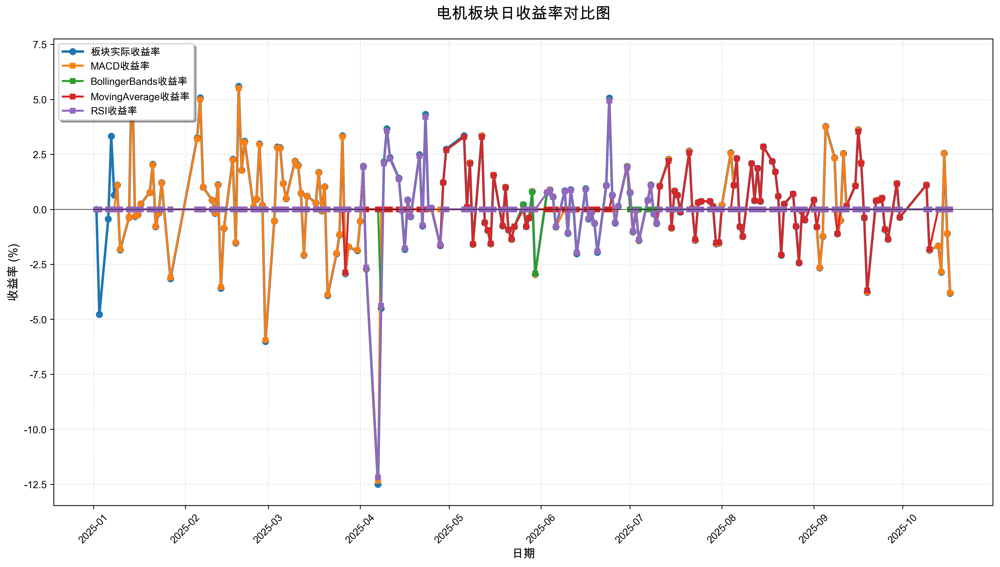
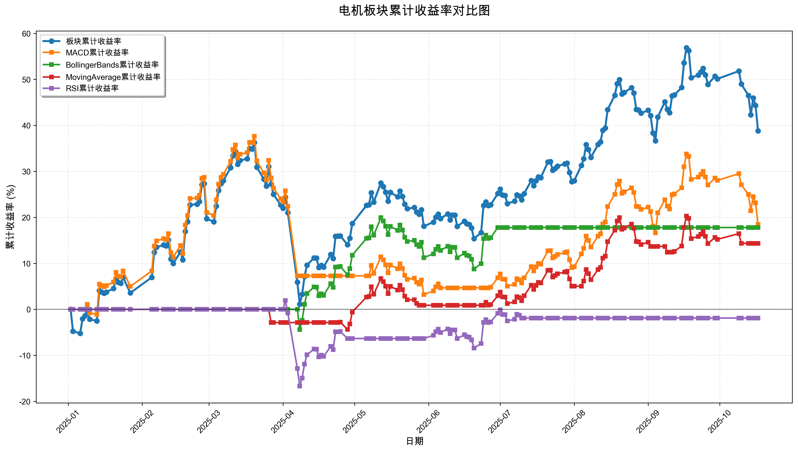

# 策略回测结果报告

**生成时间**: 2025-10-19 19:07:47
**行业板块**: 电机
**回测期间**: 20250101 至 20251017
**策略数量**: 4

## 📈 分析结论

### 策略表现分析
- **最佳策略**: MACD (总收益率: 18.47%)
- **最差策略**: RSI (总收益率: -1.89%)
### 交易活跃度分析
- **活跃策略**: 4 个
- **非活跃策略**: 0 个
- **最活跃策略**: MovingAverage (交易次数: 14)
### 🚨 异动提醒分析
- **板块异动**: 电机 近两周出现大幅波动 (最大单日: 3.82%)
- **策略异动**: MACD 近两周出现大幅波动 (最大单日: 3.80%)
### 风险分析
- **MACD**: 最大回撤 -25.00%, 夏普比率 0.8284
- **BollingerBands**: 最大回撤 -9.31%, 夏普比率 1.5839
- **MovingAverage**: 最大回撤 -6.26%, 夏普比率 1.2640
- **RSI**: 最大回撤 -18.25%, 夏普比率 -0.1289

## 📊 综合结果表

| 策略名称           | 初始资金     | 最终价值     | 总收益率   | 年化收益率   | 波动率    |    夏普比率 | 最大回撤    | 总交易次数   | 买入次数   | 卖出次数   | 总交易金额      | 平均交易金额   | 交易频率   |   数据点数 |
|:---------------|:---------|:---------|:-------|:--------|:-------|--------:|:--------|:--------|:-------|:-------|:-----------|:---------|:-------|-------:|
| 板块实际表现         | ¥100,000 | ¥138,822 | 38.82% | 54.51%  | 34.19% |  1.5943 | -25.79% | N/A     | N/A    | N/A    | N/A        | N/A      | N/A    |    190 |
| MACD           | ¥100,000 | ¥118,466 | 18.47% | 25.20%  | 30.42% |  0.8284 | -25.00% | 6       | 3      | 3      | ¥637,994   | ¥106,332 | 0.03   |    190 |
| BollingerBands | ¥100,000 | ¥117,794 | 17.79% | 24.26%  | 15.32% |  1.5839 | -9.31%  | 3       | 2      | 1      | ¥327,812   | ¥109,271 | 0.02   |    190 |
| MovingAverage  | ¥100,000 | ¥114,361 | 14.36% | 19.48%  | 15.41% |  1.264  | -6.26%  | 14      | 7      | 7      | ¥1,452,355 | ¥103,740 | 0.07   |    190 |
| RSI            | ¥100,000 | ¥98,106  | -1.89% | -2.50%  | 19.43% | -0.1289 | -18.25% | 4       | 2      | 2      | ¥375,795   | ¥93,949  | 0.02   |    190 |

## 📊 每日收益率走势图

*图1: 电机板块每日收益率走势对比*

## 📈 累计收益率走势图

*图2: 电机板块累计收益率走势对比*

## 📅 日收益明细表

| 日期         | 板块实际收益率   | MACD收益率   | BollingerBands收益率   | MovingAverage收益率   | RSI收益率   |
|:-----------|:----------|:----------|:--------------------|:-------------------|:---------|
| 2025-01-02 | 0.00%     | 0.00%     | 0.00%               | 0.00%              | 0.00%    |
| 2025-01-03 | -4.78%    | 0.00%     | 0.00%               | 0.00%              | 0.00%    |
| 2025-01-06 | -0.44%    | 0.00%     | 0.00%               | 0.00%              | 0.00%    |
| 2025-01-07 | 3.33%     | 0.00%     | 0.00%               | 0.00%              | 0.00%    |
| 2025-01-08 | 0.65%     | 0.00%     | 0.00%               | 0.00%              | 0.00%    |
| 2025-01-09 | 1.11%     | 1.09%     | 0.00%               | 0.00%              | 0.00%    |
| 2025-01-10 | -1.85%    | -1.82%    | 0.00%               | 0.00%              | 0.00%    |
| 2025-01-13 | -0.37%    | -0.36%    | 0.00%               | 0.00%              | 0.00%    |
| 2025-01-14 | 6.79%     | 6.68%     | 0.00%               | 0.00%              | 0.00%    |
| 2025-01-15 | -0.33%    | -0.32%    | 0.00%               | 0.00%              | 0.00%    |
| 2025-01-16 | -0.24%    | -0.24%    | 0.00%               | 0.00%              | 0.00%    |
| 2025-01-17 | 0.24%     | 0.24%     | 0.00%               | 0.00%              | 0.00%    |
| 2025-01-20 | 0.77%     | 0.76%     | 0.00%               | 0.00%              | 0.00%    |
| 2025-01-21 | 2.05%     | 2.02%     | 0.00%               | 0.00%              | 0.00%    |
| 2025-01-22 | -0.79%    | -0.78%    | 0.00%               | 0.00%              | 0.00%    |
| 2025-01-23 | -0.17%    | -0.17%    | 0.00%               | 0.00%              | 0.00%    |
| 2025-01-24 | 1.21%     | 1.20%     | 0.00%               | 0.00%              | 0.00%    |
| 2025-01-27 | -3.15%    | -3.10%    | 0.00%               | 0.00%              | 0.00%    |
| 2025-02-05 | 3.25%     | 3.20%     | 0.00%               | 0.00%              | 0.00%    |
| 2025-02-06 | 5.07%     | 5.00%     | 0.00%               | 0.00%              | 0.00%    |
| 2025-02-07 | 1.01%     | 1.00%     | 0.00%               | 0.00%              | 0.00%    |
| 2025-02-10 | 0.42%     | 0.42%     | 0.00%               | 0.00%              | 0.00%    |
| 2025-02-11 | -0.18%    | -0.17%    | 0.00%               | 0.00%              | 0.00%    |
| 2025-02-12 | 1.13%     | 1.11%     | 0.00%               | 0.00%              | 0.00%    |
| 2025-02-13 | -3.59%    | -3.54%    | 0.00%               | 0.00%              | 0.00%    |
| 2025-02-14 | -0.87%    | -0.86%    | 0.00%               | 0.00%              | 0.00%    |
| 2025-02-17 | 2.28%     | 2.25%     | 0.00%               | 0.00%              | 0.00%    |
| 2025-02-18 | -1.53%    | -1.51%    | 0.00%               | 0.00%              | 0.00%    |
| 2025-02-19 | 5.59%     | 5.51%     | 0.00%               | 0.00%              | 0.00%    |
| 2025-02-20 | 1.78%     | 1.76%     | 0.00%               | 0.00%              | 0.00%    |
| 2025-02-21 | 3.10%     | 3.06%     | 0.00%               | 0.00%              | 0.00%    |
| 2025-02-24 | 0.10%     | 0.10%     | 0.00%               | 0.00%              | 0.00%    |
| 2025-02-25 | 0.46%     | 0.46%     | 0.00%               | 0.00%              | 0.00%    |
| 2025-02-26 | 2.98%     | 2.95%     | 0.00%               | 0.00%              | 0.00%    |
| 2025-02-27 | 0.19%     | 0.18%     | 0.00%               | 0.00%              | 0.00%    |
| 2025-02-28 | -6.01%    | -5.94%    | 0.00%               | 0.00%              | 0.00%    |
| 2025-03-03 | -0.53%    | -0.53%    | 0.00%               | 0.00%              | 0.00%    |
| 2025-03-04 | 2.84%     | 2.80%     | 0.00%               | 0.00%              | 0.00%    |
| 2025-03-05 | 2.80%     | 2.77%     | 0.00%               | 0.00%              | 0.00%    |
| 2025-03-06 | 1.18%     | 1.17%     | 0.00%               | 0.00%              | 0.00%    |
| 2025-03-07 | 0.49%     | 0.48%     | 0.00%               | 0.00%              | 0.00%    |
| 2025-03-10 | 2.20%     | 2.18%     | 0.00%               | 0.00%              | 0.00%    |
| 2025-03-11 | 2.01%     | 1.98%     | 0.00%               | 0.00%              | 0.00%    |
| 2025-03-12 | 0.73%     | 0.72%     | 0.00%               | 0.00%              | 0.00%    |
| 2025-03-13 | -2.09%    | -2.07%    | 0.00%               | 0.00%              | 0.00%    |
| 2025-03-14 | 0.61%     | 0.60%     | 0.00%               | 0.00%              | 0.00%    |
| 2025-03-17 | 0.29%     | 0.28%     | 0.00%               | 0.00%              | 0.00%    |
| 2025-03-18 | 1.68%     | 1.67%     | 0.00%               | 0.00%              | 0.00%    |
| 2025-03-19 | -0.07%    | -0.07%    | 0.00%               | 0.00%              | 0.00%    |
| 2025-03-20 | 1.03%     | 1.02%     | 0.00%               | 0.00%              | 0.00%    |
| 2025-03-21 | -3.92%    | -3.88%    | 0.00%               | 0.00%              | 0.00%    |
| 2025-03-24 | -2.02%    | -2.00%    | 0.00%               | 0.00%              | 0.00%    |
| 2025-03-25 | -1.16%    | -1.14%    | 0.00%               | 0.00%              | 0.00%    |
| 2025-03-26 | 3.35%     | 3.31%     | 0.00%               | 0.00%              | 0.00%    |
| 2025-03-27 | -2.93%    | -2.89%    | 0.00%               | -2.87%             | 0.00%    |
| 2025-03-28 | -1.71%    | -1.69%    | 0.00%               | 0.00%              | 0.00%    |
| 2025-03-31 | -1.88%    | -1.86%    | 0.00%               | 0.00%              | 0.00%    |
| 2025-04-01 | -0.54%    | -0.54%    | 0.00%               | 0.00%              | 0.00%    |
| 2025-04-02 | 1.97%     | 1.95%     | 0.00%               | 0.00%              | 1.92%    |
| 2025-04-03 | -2.72%    | -2.69%    | 0.00%               | 0.00%              | -2.65%   |
| 2025-04-07 | -12.50%   | -12.34%   | 0.00%               | 0.00%              | -12.18%  |
| 2025-04-08 | -4.51%    | 0.00%     | -4.41%              | 0.00%              | -4.38%   |
| 2025-04-09 | 2.16%     | 0.00%     | 2.11%               | 0.00%              | 2.09%    |
| 2025-04-10 | 3.67%     | 0.00%     | 3.59%               | 0.00%              | 3.57%    |
| 2025-04-11 | 2.36%     | 0.00%     | 2.31%               | 0.00%              | 2.29%    |
| 2025-04-14 | 1.42%     | 0.00%     | 1.39%               | 0.00%              | 1.38%    |
| 2025-04-15 | -0.05%    | 0.00%     | -0.04%              | 0.00%              | -0.04%   |
| 2025-04-16 | -1.83%    | 0.00%     | -1.80%              | 0.00%              | -1.78%   |
| 2025-04-17 | 0.43%     | 0.00%     | 0.42%               | 0.00%              | 0.42%    |
| 2025-04-18 | -0.33%    | 0.00%     | -0.32%              | 0.00%              | -0.32%   |
| 2025-04-21 | 2.49%     | 0.00%     | 2.44%               | 0.00%              | 2.42%    |
| 2025-04-22 | -0.76%    | 0.00%     | -0.74%              | 0.00%              | -0.74%   |
| 2025-04-23 | 4.32%     | 0.00%     | 4.23%               | 0.00%              | 4.20%    |
| 2025-04-24 | 0.03%     | 0.00%     | 0.03%               | 0.03%              | 0.03%    |
| 2025-04-25 | 0.06%     | 0.00%     | 0.06%               | 0.06%              | 0.06%    |
| 2025-04-28 | -1.65%    | 0.00%     | -1.62%              | -1.63%             | -1.61%   |
| 2025-04-29 | 1.23%     | 0.00%     | 1.21%               | 1.21%              | 0.00%    |
| 2025-04-30 | 2.74%     | 0.00%     | 2.69%               | 2.70%              | 0.00%    |
| 2025-05-06 | 3.35%     | 0.00%     | 3.28%               | 3.29%              | 0.00%    |
| 2025-05-07 | 0.10%     | 0.00%     | 0.10%               | 0.10%              | 0.00%    |
| 2025-05-08 | 2.12%     | 2.12%     | 2.08%               | 2.09%              | 0.00%    |
| 2025-05-09 | -1.60%    | -1.60%    | -1.57%              | -1.57%             | 0.00%    |
| 2025-05-12 | 3.35%     | 3.35%     | 3.29%               | 3.30%              | 0.00%    |
| 2025-05-13 | -0.61%    | -0.61%    | -0.60%              | -0.60%             | 0.00%    |
| 2025-05-14 | -0.96%    | -0.96%    | -0.94%              | -0.94%             | 0.00%    |
| 2025-05-15 | -1.57%    | -1.57%    | -1.55%              | -1.55%             | 0.00%    |
| 2025-05-16 | 1.56%     | 1.56%     | 1.53%               | 1.54%              | 0.00%    |
| 2025-05-19 | -0.76%    | -0.76%    | -0.75%              | -0.75%             | 0.00%    |
| 2025-05-20 | 1.01%     | 1.01%     | 0.99%               | 1.00%              | 0.00%    |
| 2025-05-21 | -0.94%    | -0.94%    | -0.92%              | -0.92%             | 0.00%    |
| 2025-05-22 | -1.37%    | -1.37%    | -1.34%              | -1.35%             | 0.00%    |
| 2025-05-23 | -0.79%    | -0.79%    | -0.78%              | -0.78%             | 0.00%    |
| 2025-05-26 | 0.21%     | 0.21%     | 0.21%               | 0.00%              | 0.00%    |
| 2025-05-27 | -0.79%    | -0.79%    | -0.78%              | -0.78%             | 0.00%    |
| 2025-05-28 | -0.39%    | -0.39%    | -0.39%              | -0.39%             | 0.00%    |
| 2025-05-29 | 0.81%     | 0.81%     | 0.79%               | 0.00%              | 0.00%    |
| 2025-05-30 | -2.96%    | -2.96%    | -2.91%              | 0.00%              | 0.00%    |
| 2025-06-03 | 0.77%     | 0.77%     | 0.75%               | 0.00%              | 0.75%    |
| 2025-06-04 | 0.89%     | 0.89%     | 0.87%               | 0.00%              | 0.87%    |
| 2025-06-05 | 0.57%     | 0.57%     | 0.56%               | 0.00%              | 0.56%    |
| 2025-06-06 | -0.80%    | -0.80%    | -0.79%              | 0.00%              | -0.78%   |
| 2025-06-09 | 0.84%     | 0.00%     | 0.82%               | 0.00%              | 0.82%    |
| 2025-06-10 | -1.10%    | 0.00%     | -1.08%              | 0.00%              | -1.07%   |
| 2025-06-11 | 0.90%     | 0.00%     | 0.88%               | 0.00%              | 0.88%    |
| 2025-06-12 | -0.02%    | 0.00%     | -0.02%              | 0.00%              | -0.02%   |
| 2025-06-13 | -2.02%    | 0.00%     | -1.98%              | 0.00%              | -1.97%   |
| 2025-06-16 | 0.94%     | 0.00%     | 0.92%               | 0.00%              | 0.91%    |
| 2025-06-17 | -0.44%    | 0.00%     | -0.43%              | 0.00%              | -0.43%   |
| 2025-06-18 | -0.15%    | 0.00%     | -0.15%              | 0.00%              | -0.15%   |
| 2025-06-19 | -0.64%    | 0.00%     | -0.63%              | 0.00%              | -0.63%   |
| 2025-06-20 | -1.95%    | 0.00%     | -1.92%              | 0.00%              | -1.91%   |
| 2025-06-23 | 1.09%     | 0.00%     | 1.07%               | 0.00%              | 1.07%    |
| 2025-06-24 | 5.06%     | 0.00%     | 4.96%               | 0.00%              | 4.94%    |
| 2025-06-25 | 0.65%     | 0.00%     | 0.64%               | 0.63%              | 0.64%    |
| 2025-06-26 | -0.63%    | 0.00%     | -0.61%              | -0.61%             | -0.61%   |
| 2025-06-27 | 0.14%     | 0.14%     | 0.14%               | 0.13%              | 0.14%    |
| 2025-06-30 | 1.96%     | 1.95%     | 1.92%               | 1.90%              | 1.91%    |
| 2025-07-01 | 0.77%     | 0.77%     | 0.00%               | 0.75%              | 0.75%    |
| 2025-07-02 | -1.03%    | -1.02%    | 0.00%               | -1.00%             | -1.01%   |
| 2025-07-03 | -0.05%    | -0.05%    | 0.00%               | -0.05%             | -0.05%   |
| 2025-07-04 | -1.42%    | -1.41%    | 0.00%               | -1.38%             | -1.39%   |
| 2025-07-07 | 0.42%     | 0.41%     | 0.00%               | 0.40%              | 0.41%    |
| 2025-07-08 | 1.12%     | 1.11%     | 0.00%               | 1.08%              | 1.09%    |
| 2025-07-09 | -0.21%    | -0.21%    | 0.00%               | -0.20%             | -0.20%   |
| 2025-07-10 | -0.65%    | -0.65%    | 0.00%               | -0.63%             | -0.64%   |
| 2025-07-11 | 1.07%     | 1.06%     | 0.00%               | 1.04%              | 0.00%    |
| 2025-07-14 | 2.28%     | 2.27%     | 0.00%               | 2.21%              | 0.00%    |
| 2025-07-15 | -0.86%    | -0.85%    | 0.00%               | -0.83%             | 0.00%    |
| 2025-07-16 | 0.84%     | 0.84%     | 0.00%               | 0.82%              | 0.00%    |
| 2025-07-17 | 0.65%     | 0.65%     | 0.00%               | 0.64%              | 0.00%    |
| 2025-07-18 | -0.12%    | -0.12%    | 0.00%               | -0.12%             | 0.00%    |
| 2025-07-21 | 2.65%     | 2.63%     | 0.00%               | 2.58%              | 0.00%    |
| 2025-07-22 | 0.04%     | 0.04%     | 0.00%               | 0.03%              | 0.00%    |
| 2025-07-23 | -1.41%    | -1.40%    | 0.00%               | -1.37%             | 0.00%    |
| 2025-07-24 | 0.31%     | 0.31%     | 0.00%               | 0.31%              | 0.00%    |
| 2025-07-25 | 0.37%     | 0.37%     | 0.00%               | 0.36%              | 0.00%    |
| 2025-07-28 | 0.37%     | 0.37%     | 0.00%               | 0.36%              | 0.00%    |
| 2025-07-29 | 0.14%     | 0.14%     | 0.00%               | 0.14%              | 0.00%    |
| 2025-07-30 | -1.57%    | -1.56%    | 0.00%               | -1.52%             | 0.00%    |
| 2025-07-31 | -1.54%    | -1.53%    | 0.00%               | -1.50%             | 0.00%    |
| 2025-08-01 | 0.19%     | 0.19%     | 0.00%               | 0.00%              | 0.00%    |
| 2025-08-04 | 2.58%     | 2.56%     | 0.00%               | 0.00%              | 0.00%    |
| 2025-08-05 | 1.10%     | 1.09%     | 0.00%               | 1.09%              | 0.00%    |
| 2025-08-06 | 2.32%     | 2.31%     | 0.00%               | 2.32%              | 0.00%    |
| 2025-08-07 | -0.79%    | -0.79%    | 0.00%               | -0.79%             | 0.00%    |
| 2025-08-08 | -1.24%    | -1.24%    | 0.00%               | -1.24%             | 0.00%    |
| 2025-08-11 | 2.09%     | 2.08%     | 0.00%               | 2.09%              | 0.00%    |
| 2025-08-12 | 0.40%     | 0.40%     | 0.00%               | 0.40%              | 0.00%    |
| 2025-08-13 | 1.87%     | 1.86%     | 0.00%               | 1.87%              | 0.00%    |
| 2025-08-14 | 0.36%     | 0.36%     | 0.00%               | 0.36%              | 0.00%    |
| 2025-08-15 | 2.85%     | 2.84%     | 0.00%               | 2.85%              | 0.00%    |
| 2025-08-18 | 2.18%     | 2.17%     | 0.00%               | 2.18%              | 0.00%    |
| 2025-08-19 | 1.71%     | 1.70%     | 0.00%               | 1.71%              | 0.00%    |
| 2025-08-20 | 0.59%     | 0.59%     | 0.00%               | 0.59%              | 0.00%    |
| 2025-08-21 | -2.09%    | -2.08%    | 0.00%               | -2.08%             | 0.00%    |
| 2025-08-22 | 0.24%     | 0.24%     | 0.00%               | 0.24%              | 0.00%    |
| 2025-08-25 | 0.70%     | 0.70%     | 0.00%               | 0.70%              | 0.00%    |
| 2025-08-26 | -0.78%    | -0.77%    | 0.00%               | -0.77%             | 0.00%    |
| 2025-08-27 | -2.44%    | -2.42%    | 0.00%               | -2.43%             | 0.00%    |
| 2025-08-28 | -0.08%    | -0.08%    | 0.00%               | -0.08%             | 0.00%    |
| 2025-08-29 | -0.48%    | -0.48%    | 0.00%               | -0.48%             | 0.00%    |
| 2025-09-01 | 0.43%     | 0.43%     | 0.00%               | 0.43%              | 0.00%    |
| 2025-09-02 | -0.80%    | -0.80%    | 0.00%               | -0.80%             | 0.00%    |
| 2025-09-03 | -2.66%    | -2.65%    | 0.00%               | 0.00%              | 0.00%    |
| 2025-09-04 | -1.24%    | -1.23%    | 0.00%               | 0.00%              | 0.00%    |
| 2025-09-05 | 3.78%     | 3.76%     | 0.00%               | 0.00%              | 0.00%    |
| 2025-09-08 | 2.35%     | 2.33%     | 0.00%               | 0.00%              | 0.00%    |
| 2025-09-09 | -1.12%    | -1.12%    | 0.00%               | -1.11%             | 0.00%    |
| 2025-09-10 | -0.51%    | -0.51%    | 0.00%               | 0.00%              | 0.00%    |
| 2025-09-11 | 2.54%     | 2.53%     | 0.00%               | 0.00%              | 0.00%    |
| 2025-09-12 | 0.16%     | 0.16%     | 0.00%               | 0.16%              | 0.00%    |
| 2025-09-15 | 1.08%     | 1.07%     | 0.00%               | 1.05%              | 0.00%    |
| 2025-09-16 | 3.62%     | 3.61%     | 0.00%               | 3.54%              | 0.00%    |
| 2025-09-17 | 2.13%     | 2.12%     | 0.00%               | 2.08%              | 0.00%    |
| 2025-09-18 | -0.39%    | -0.39%    | 0.00%               | -0.38%             | 0.00%    |
| 2025-09-19 | -3.78%    | -3.76%    | 0.00%               | -3.69%             | 0.00%    |
| 2025-09-22 | 0.40%     | 0.40%     | 0.00%               | 0.39%              | 0.00%    |
| 2025-09-23 | 0.43%     | 0.43%     | 0.00%               | 0.42%              | 0.00%    |
| 2025-09-24 | 0.52%     | 0.52%     | 0.00%               | 0.51%              | 0.00%    |
| 2025-09-25 | -0.93%    | -0.92%    | 0.00%               | -0.90%             | 0.00%    |
| 2025-09-26 | -1.37%    | -1.37%    | 0.00%               | -1.34%             | 0.00%    |
| 2025-09-29 | 1.18%     | 1.18%     | 0.00%               | 1.16%              | 0.00%    |
| 2025-09-30 | -0.37%    | -0.37%    | 0.00%               | -0.36%             | 0.00%    |
| 2025-10-09 | 1.12%     | 1.12%     | 0.00%               | 1.10%              | 0.00%    |
| 2025-10-10 | -1.86%    | -1.85%    | 0.00%               | -1.81%             | 0.00%    |
| 2025-10-13 | -1.66%    | -1.66%    | 0.00%               | 0.00%              | 0.00%    |
| 2025-10-14 | -2.86%    | -2.84%    | 0.00%               | 0.00%              | 0.00%    |
| 2025-10-15 | 2.56%     | 2.55%     | 0.00%               | 0.00%              | 0.00%    |
| 2025-10-16 | -1.11%    | -1.10%    | 0.00%               | 0.00%              | 0.00%    |
| 2025-10-17 | -3.82%    | -3.80%    | 0.00%               | 0.00%              | 0.00%    |

## 📊 日收益统计摘要

| 指标                | 平均日收益率   | 最大日收益率   | 最小日收益率   | 正收益天数   | 负收益天数   |
|:------------------|:---------|:---------|:---------|:--------|:--------|
| 板块实际收益率           | 0.20%    | 6.79%    | -12.50%  | 105天    | 84天     |
| MACD收益率           | 0.11%    | 6.68%    | -12.34%  | 84天     | 68天     |
| BollingerBands收益率 | 0.09%    | 4.96%    | -4.41%   | 30天     | 26天     |
| MovingAverage收益率  | 0.08%    | 3.54%    | -3.69%   | 48天     | 38天     |
| RSI收益率            | -0.00%   | 4.94%    | -12.18%  | 24天     | 22天     |

## 📈 累计收益明细表

| 日期         | 板块累计收益率   | MACD累计收益率   | BollingerBands累计收益率   | MovingAverage累计收益率   | RSI累计收益率   |
|:-----------|:----------|:------------|:----------------------|:---------------------|:-----------|
| 2025-01-02 | 0.00%     | 0.00%       | 0.00%                 | 0.00%                | 0.00%      |
| 2025-01-03 | -4.78%    | 0.00%       | 0.00%                 | 0.00%                | 0.00%      |
| 2025-01-06 | -5.20%    | 0.00%       | 0.00%                 | 0.00%                | 0.00%      |
| 2025-01-07 | -2.05%    | 0.00%       | 0.00%                 | 0.00%                | 0.00%      |
| 2025-01-08 | -1.40%    | 0.00%       | 0.00%                 | 0.00%                | 0.00%      |
| 2025-01-09 | -0.31%    | 1.09%       | 0.00%                 | 0.00%                | 0.00%      |
| 2025-01-10 | -2.16%    | -0.76%      | 0.00%                 | 0.00%                | 0.00%      |
| 2025-01-13 | -2.52%    | -1.12%      | 0.00%                 | 0.00%                | 0.00%      |
| 2025-01-14 | 4.09%     | 5.49%       | 0.00%                 | 0.00%                | 0.00%      |
| 2025-01-15 | 3.75%     | 5.15%       | 0.00%                 | 0.00%                | 0.00%      |
| 2025-01-16 | 3.50%     | 4.90%       | 0.00%                 | 0.00%                | 0.00%      |
| 2025-01-17 | 3.75%     | 5.15%       | 0.00%                 | 0.00%                | 0.00%      |
| 2025-01-20 | 4.55%     | 5.95%       | 0.00%                 | 0.00%                | 0.00%      |
| 2025-01-21 | 6.69%     | 8.08%       | 0.00%                 | 0.00%                | 0.00%      |
| 2025-01-22 | 5.85%     | 7.24%       | 0.00%                 | 0.00%                | 0.00%      |
| 2025-01-23 | 5.67%     | 7.07%       | 0.00%                 | 0.00%                | 0.00%      |
| 2025-01-24 | 6.95%     | 8.35%       | 0.00%                 | 0.00%                | 0.00%      |
| 2025-01-27 | 3.58%     | 4.98%       | 0.00%                 | 0.00%                | 0.00%      |
| 2025-02-05 | 6.95%     | 8.35%       | 0.00%                 | 0.00%                | 0.00%      |
| 2025-02-06 | 12.38%    | 13.76%      | 0.00%                 | 0.00%                | 0.00%      |
| 2025-02-07 | 13.51%    | 14.90%      | 0.00%                 | 0.00%                | 0.00%      |
| 2025-02-10 | 14.00%    | 15.38%      | 0.00%                 | 0.00%                | 0.00%      |
| 2025-02-11 | 13.80%    | 15.18%      | 0.00%                 | 0.00%                | 0.00%      |
| 2025-02-12 | 15.08%    | 16.46%      | 0.00%                 | 0.00%                | 0.00%      |
| 2025-02-13 | 10.95%    | 12.34%      | 0.00%                 | 0.00%                | 0.00%      |
| 2025-02-14 | 9.98%     | 11.37%      | 0.00%                 | 0.00%                | 0.00%      |
| 2025-02-17 | 12.49%    | 13.88%      | 0.00%                 | 0.00%                | 0.00%      |
| 2025-02-18 | 10.77%    | 12.16%      | 0.00%                 | 0.00%                | 0.00%      |
| 2025-02-19 | 16.95%    | 18.33%      | 0.00%                 | 0.00%                | 0.00%      |
| 2025-02-20 | 19.04%    | 20.41%      | 0.00%                 | 0.00%                | 0.00%      |
| 2025-02-21 | 22.72%    | 24.10%      | 0.00%                 | 0.00%                | 0.00%      |
| 2025-02-24 | 22.85%    | 24.22%      | 0.00%                 | 0.00%                | 0.00%      |
| 2025-02-25 | 23.42%    | 24.79%      | 0.00%                 | 0.00%                | 0.00%      |
| 2025-02-26 | 27.10%    | 28.47%      | 0.00%                 | 0.00%                | 0.00%      |
| 2025-02-27 | 27.34%    | 28.70%      | 0.00%                 | 0.00%                | 0.00%      |
| 2025-02-28 | 19.68%    | 21.06%      | 0.00%                 | 0.00%                | 0.00%      |
| 2025-03-03 | 19.04%    | 20.42%      | 0.00%                 | 0.00%                | 0.00%      |
| 2025-03-04 | 22.42%    | 23.79%      | 0.00%                 | 0.00%                | 0.00%      |
| 2025-03-05 | 25.85%    | 27.22%      | 0.00%                 | 0.00%                | 0.00%      |
| 2025-03-06 | 27.33%    | 28.70%      | 0.00%                 | 0.00%                | 0.00%      |
| 2025-03-07 | 27.96%    | 29.32%      | 0.00%                 | 0.00%                | 0.00%      |
| 2025-03-10 | 30.78%    | 32.14%      | 0.00%                 | 0.00%                | 0.00%      |
| 2025-03-11 | 33.40%    | 34.76%      | 0.00%                 | 0.00%                | 0.00%      |
| 2025-03-12 | 34.37%    | 35.72%      | 0.00%                 | 0.00%                | 0.00%      |
| 2025-03-13 | 31.55%    | 32.91%      | 0.00%                 | 0.00%                | 0.00%      |
| 2025-03-14 | 32.36%    | 33.72%      | 0.00%                 | 0.00%                | 0.00%      |
| 2025-03-17 | 32.74%    | 34.09%      | 0.00%                 | 0.00%                | 0.00%      |
| 2025-03-18 | 34.97%    | 36.33%      | 0.00%                 | 0.00%                | 0.00%      |
| 2025-03-19 | 34.87%    | 36.23%      | 0.00%                 | 0.00%                | 0.00%      |
| 2025-03-20 | 36.27%    | 37.62%      | 0.00%                 | 0.00%                | 0.00%      |
| 2025-03-21 | 30.93%    | 32.29%      | 0.00%                 | 0.00%                | 0.00%      |
| 2025-03-24 | 28.28%    | 29.65%      | 0.00%                 | 0.00%                | 0.00%      |
| 2025-03-25 | 26.80%    | 28.16%      | 0.00%                 | 0.00%                | 0.00%      |
| 2025-03-26 | 31.04%    | 32.40%      | 0.00%                 | 0.00%                | 0.00%      |
| 2025-03-27 | 27.21%    | 28.57%      | 0.00%                 | -2.87%               | 0.00%      |
| 2025-03-28 | 25.02%    | 26.39%      | 0.00%                 | -2.87%               | 0.00%      |
| 2025-03-31 | 22.67%    | 24.04%      | 0.00%                 | -2.87%               | 0.00%      |
| 2025-04-01 | 22.00%    | 23.37%      | 0.00%                 | -2.87%               | 0.00%      |
| 2025-04-02 | 24.41%    | 25.78%      | 0.00%                 | -2.87%               | 1.92%      |
| 2025-04-03 | 21.02%    | 22.40%      | 0.00%                 | -2.87%               | -0.78%     |
| 2025-04-07 | 5.90%     | 7.29%       | 0.00%                 | -2.87%               | -12.87%    |
| 2025-04-08 | 1.12%     | 7.29%       | -4.41%                | -2.87%               | -16.68%    |
| 2025-04-09 | 3.30%     | 7.29%       | -2.40%                | -2.87%               | -14.94%    |
| 2025-04-10 | 7.10%     | 7.29%       | 1.11%                 | -2.87%               | -11.91%    |
| 2025-04-11 | 9.62%     | 7.29%       | 3.44%                 | -2.87%               | -9.89%     |
| 2025-04-14 | 11.18%    | 7.29%       | 4.88%                 | -2.87%               | -8.64%     |
| 2025-04-15 | 11.13%    | 7.29%       | 4.83%                 | -2.87%               | -8.68%     |
| 2025-04-16 | 9.09%     | 7.29%       | 2.95%                 | -2.87%               | -10.31%    |
| 2025-04-17 | 9.56%     | 7.29%       | 3.39%                 | -2.87%               | -9.94%     |
| 2025-04-18 | 9.20%     | 7.29%       | 3.05%                 | -2.87%               | -10.22%    |
| 2025-04-21 | 11.93%    | 7.29%       | 5.57%                 | -2.87%               | -8.05%     |
| 2025-04-22 | 11.08%    | 7.29%       | 4.78%                 | -2.87%               | -8.73%     |
| 2025-04-23 | 15.87%    | 7.29%       | 9.21%                 | -2.87%               | -4.90%     |
| 2025-04-24 | 15.91%    | 7.29%       | 9.25%                 | -2.84%               | -4.87%     |
| 2025-04-25 | 15.98%    | 7.29%       | 9.31%                 | -2.78%               | -4.81%     |
| 2025-04-28 | 14.06%    | 7.29%       | 7.54%                 | -4.36%               | -6.34%     |
| 2025-04-29 | 15.47%    | 7.29%       | 8.84%                 | -3.20%               | -6.34%     |
| 2025-04-30 | 18.64%    | 7.29%       | 11.77%                | -0.59%               | -6.34%     |
| 2025-05-06 | 22.61%    | 7.29%       | 15.44%                | 2.68%                | -6.34%     |
| 2025-05-07 | 22.73%    | 7.29%       | 15.55%                | 2.78%                | -6.34%     |
| 2025-05-08 | 25.34%    | 9.57%       | 17.96%                | 4.93%                | -6.34%     |
| 2025-05-09 | 23.33%    | 7.82%       | 16.11%                | 3.28%                | -6.34%     |
| 2025-05-12 | 27.47%    | 11.43%      | 19.93%                | 6.68%                | -6.34%     |
| 2025-05-13 | 26.69%    | 10.75%      | 19.21%                | 6.04%                | -6.34%     |
| 2025-05-14 | 25.48%    | 9.69%       | 18.09%                | 5.04%                | -6.34%     |
| 2025-05-15 | 23.50%    | 7.96%       | 16.26%                | 3.41%                | -6.34%     |
| 2025-05-16 | 25.43%    | 9.65%       | 18.04%                | 5.00%                | -6.34%     |
| 2025-05-19 | 24.47%    | 8.81%       | 17.16%                | 4.21%                | -6.34%     |
| 2025-05-20 | 25.73%    | 9.91%       | 18.32%                | 5.25%                | -6.34%     |
| 2025-05-21 | 24.56%    | 8.88%       | 17.24%                | 4.28%                | -6.34%     |
| 2025-05-22 | 22.85%    | 7.40%       | 15.66%                | 2.88%                | -6.34%     |
| 2025-05-23 | 21.88%    | 6.54%       | 14.76%                | 2.08%                | -6.34%     |
| 2025-05-26 | 22.14%    | 6.77%       | 15.00%                | 2.08%                | -6.34%     |
| 2025-05-27 | 21.17%    | 5.93%       | 14.11%                | 1.28%                | -6.34%     |
| 2025-05-28 | 20.69%    | 5.51%       | 13.67%                | 0.89%                | -6.34%     |
| 2025-05-29 | 21.67%    | 6.36%       | 14.57%                | 0.89%                | -6.34%     |
| 2025-05-30 | 18.06%    | 3.21%       | 11.24%                | 0.89%                | -6.34%     |
| 2025-06-03 | 18.97%    | 4.00%       | 12.07%                | 0.89%                | -5.64%     |
| 2025-06-04 | 20.02%    | 4.92%       | 13.05%                | 0.89%                | -4.83%     |
| 2025-06-05 | 20.71%    | 5.53%       | 13.69%                | 0.89%                | -4.29%     |
| 2025-06-06 | 19.75%    | 4.68%       | 12.79%                | 0.89%                | -5.04%     |
| 2025-06-09 | 20.75%    | 4.68%       | 13.72%                | 0.89%                | -4.26%     |
| 2025-06-10 | 19.43%    | 4.68%       | 12.50%                | 0.89%                | -5.29%     |
| 2025-06-11 | 20.50%    | 4.68%       | 13.49%                | 0.89%                | -4.46%     |
| 2025-06-12 | 20.48%    | 4.68%       | 13.47%                | 0.89%                | -4.48%     |
| 2025-06-13 | 18.05%    | 4.68%       | 11.22%                | 0.89%                | -6.36%     |
| 2025-06-16 | 19.15%    | 4.68%       | 12.24%                | 0.89%                | -5.50%     |
| 2025-06-17 | 18.62%    | 4.68%       | 11.76%                | 0.89%                | -5.91%     |
| 2025-06-18 | 18.45%    | 4.68%       | 11.59%                | 0.89%                | -6.05%     |
| 2025-06-19 | 17.69%    | 4.68%       | 10.89%                | 0.89%                | -6.64%     |
| 2025-06-20 | 15.39%    | 4.68%       | 8.77%                 | 0.89%                | -8.41%     |
| 2025-06-23 | 16.65%    | 4.68%       | 9.93%                 | 0.89%                | -7.44%     |
| 2025-06-24 | 22.56%    | 4.68%       | 15.39%                | 0.89%                | -2.86%     |
| 2025-06-25 | 23.36%    | 4.68%       | 16.13%                | 1.53%                | -2.25%     |
| 2025-06-26 | 22.58%    | 4.68%       | 15.41%                | 0.91%                | -2.84%     |
| 2025-06-27 | 22.75%    | 4.83%       | 15.57%                | 1.04%                | -2.71%     |
| 2025-06-30 | 25.16%    | 6.87%       | 17.79%                | 2.97%                | -0.85%     |
| 2025-07-01 | 26.13%    | 7.69%       | 17.79%                | 3.74%                | -0.10%     |
| 2025-07-02 | 24.83%    | 6.59%       | 17.79%                | 2.70%                | -1.11%     |
| 2025-07-03 | 24.77%    | 6.54%       | 17.79%                | 2.65%                | -1.15%     |
| 2025-07-04 | 23.00%    | 5.03%       | 17.79%                | 1.24%                | -2.53%     |
| 2025-07-07 | 23.51%    | 5.47%       | 17.79%                | 1.65%                | -2.13%     |
| 2025-07-08 | 24.89%    | 6.64%       | 17.79%                | 2.75%                | -1.06%     |
| 2025-07-09 | 24.63%    | 6.42%       | 17.79%                | 2.54%                | -1.26%     |
| 2025-07-10 | 23.81%    | 5.73%       | 17.79%                | 1.89%                | -1.89%     |
| 2025-07-11 | 25.14%    | 6.85%       | 17.79%                | 2.95%                | -1.89%     |
| 2025-07-14 | 27.99%    | 9.27%       | 17.79%                | 5.23%                | -1.89%     |
| 2025-07-15 | 26.89%    | 8.34%       | 17.79%                | 4.35%                | -1.89%     |
| 2025-07-16 | 27.96%    | 9.25%       | 17.79%                | 5.20%                | -1.89%     |
| 2025-07-17 | 28.80%    | 9.96%       | 17.79%                | 5.87%                | -1.89%     |
| 2025-07-18 | 28.64%    | 9.82%       | 17.79%                | 5.75%                | -1.89%     |
| 2025-07-21 | 32.05%    | 12.72%      | 17.79%                | 8.47%                | -1.89%     |
| 2025-07-22 | 32.10%    | 12.76%      | 17.79%                | 8.51%                | -1.89%     |
| 2025-07-23 | 30.23%    | 11.18%      | 17.79%                | 7.02%                | -1.89%     |
| 2025-07-24 | 30.64%    | 11.52%      | 17.79%                | 7.35%                | -1.89%     |
| 2025-07-25 | 31.13%    | 11.94%      | 17.79%                | 7.74%                | -1.89%     |
| 2025-07-28 | 31.61%    | 12.34%      | 17.79%                | 8.12%                | -1.89%     |
| 2025-07-29 | 31.80%    | 12.51%      | 17.79%                | 8.27%                | -1.89%     |
| 2025-07-30 | 29.74%    | 10.75%      | 17.79%                | 6.62%                | -1.89%     |
| 2025-07-31 | 27.74%    | 9.06%       | 17.79%                | 5.03%                | -1.89%     |
| 2025-08-01 | 27.98%    | 9.27%       | 17.79%                | 5.03%                | -1.89%     |
| 2025-08-04 | 31.28%    | 12.06%      | 17.79%                | 5.03%                | -1.89%     |
| 2025-08-05 | 32.72%    | 13.28%      | 17.79%                | 6.17%                | -1.89%     |
| 2025-08-06 | 35.80%    | 15.90%      | 17.79%                | 8.64%                | -1.89%     |
| 2025-08-07 | 34.73%    | 14.99%      | 17.79%                | 7.78%                | -1.89%     |
| 2025-08-08 | 33.05%    | 13.57%      | 17.79%                | 6.44%                | -1.89%     |
| 2025-08-11 | 35.84%    | 15.93%      | 17.79%                | 8.67%                | -1.89%     |
| 2025-08-12 | 36.39%    | 16.40%      | 17.79%                | 9.11%                | -1.89%     |
| 2025-08-13 | 38.94%    | 18.56%      | 17.79%                | 11.14%               | -1.89%     |
| 2025-08-14 | 39.44%    | 18.99%      | 17.79%                | 11.55%               | -1.89%     |
| 2025-08-15 | 43.42%    | 22.37%      | 17.79%                | 14.72%               | -1.89%     |
| 2025-08-18 | 46.54%    | 25.02%      | 17.79%                | 17.22%               | -1.89%     |
| 2025-08-19 | 49.05%    | 27.15%      | 17.79%                | 19.22%               | -1.89%     |
| 2025-08-20 | 49.94%    | 27.90%      | 17.79%                | 19.93%               | -1.89%     |
| 2025-08-21 | 46.81%    | 25.24%      | 17.79%                | 17.43%               | -1.89%     |
| 2025-08-22 | 47.16%    | 25.55%      | 17.79%                | 17.71%               | -1.89%     |
| 2025-08-25 | 48.19%    | 26.42%      | 17.79%                | 18.54%               | -1.89%     |
| 2025-08-26 | 47.04%    | 25.44%      | 17.79%                | 17.62%               | -1.89%     |
| 2025-08-27 | 43.46%    | 22.40%      | 17.79%                | 14.76%               | -1.89%     |
| 2025-08-28 | 43.34%    | 22.30%      | 17.79%                | 14.66%               | -1.89%     |
| 2025-08-29 | 42.65%    | 21.72%      | 17.79%                | 14.11%               | -1.89%     |
| 2025-09-01 | 43.27%    | 22.24%      | 17.79%                | 14.60%               | -1.89%     |
| 2025-09-02 | 42.12%    | 21.26%      | 17.79%                | 13.69%               | -1.89%     |
| 2025-09-03 | 38.34%    | 18.06%      | 17.79%                | 13.69%               | -1.89%     |
| 2025-09-04 | 36.63%    | 16.61%      | 17.79%                | 13.69%               | -1.89%     |
| 2025-09-05 | 41.80%    | 20.99%      | 17.79%                | 13.69%               | -1.89%     |
| 2025-09-08 | 45.12%    | 23.81%      | 17.79%                | 13.69%               | -1.89%     |
| 2025-09-09 | 43.49%    | 22.43%      | 17.79%                | 12.42%               | -1.89%     |
| 2025-09-10 | 42.76%    | 21.81%      | 17.79%                | 12.42%               | -1.89%     |
| 2025-09-11 | 46.39%    | 24.89%      | 17.79%                | 12.42%               | -1.89%     |
| 2025-09-12 | 46.63%    | 25.09%      | 17.79%                | 12.60%               | -1.89%     |
| 2025-09-15 | 48.21%    | 26.43%      | 17.79%                | 13.78%               | -1.89%     |
| 2025-09-16 | 53.58%    | 30.99%      | 17.79%                | 17.81%               | -1.89%     |
| 2025-09-17 | 56.86%    | 33.77%      | 17.79%                | 20.26%               | -1.89%     |
| 2025-09-18 | 56.25%    | 33.26%      | 17.79%                | 19.80%               | -1.89%     |
| 2025-09-19 | 50.35%    | 28.25%      | 17.79%                | 15.39%               | -1.89%     |
| 2025-09-22 | 50.95%    | 28.76%      | 17.79%                | 15.84%               | -1.89%     |
| 2025-09-23 | 51.60%    | 29.32%      | 17.79%                | 16.33%               | -1.89%     |
| 2025-09-24 | 52.39%    | 29.99%      | 17.79%                | 16.92%               | -1.89%     |
| 2025-09-25 | 50.98%    | 28.79%      | 17.79%                | 15.86%               | -1.89%     |
| 2025-09-26 | 48.91%    | 27.03%      | 17.79%                | 14.31%               | -1.89%     |
| 2025-09-29 | 50.67%    | 28.53%      | 17.79%                | 15.63%               | -1.89%     |
| 2025-09-30 | 50.11%    | 28.05%      | 17.79%                | 15.21%               | -1.89%     |
| 2025-10-09 | 51.80%    | 29.48%      | 17.79%                | 16.47%               | -1.89%     |
| 2025-10-10 | 48.98%    | 27.09%      | 17.79%                | 14.36%               | -1.89%     |
| 2025-10-13 | 46.50%    | 24.98%      | 17.79%                | 14.36%               | -1.89%     |
| 2025-10-14 | 42.31%    | 21.43%      | 17.79%                | 14.36%               | -1.89%     |
| 2025-10-15 | 45.95%    | 24.52%      | 17.79%                | 14.36%               | -1.89%     |
| 2025-10-16 | 44.34%    | 23.15%      | 17.79%                | 14.36%               | -1.89%     |
| 2025-10-17 | 38.82%    | 18.47%      | 17.79%                | 14.36%               | -1.89%     |

## 📊 累计收益统计摘要

| 指标                  | 最终累计收益率   | 最大累计收益率   | 最小累计收益率   | 累计收益波动   | 收益稳定性   |
|:--------------------|:----------|:----------|:----------|:---------|:--------|
| 板块累计收益率             | 38.82%    | 56.86%    | -5.20%    | 62.06%   | 波动      |
| MACD累计收益率           | 18.47%    | 37.62%    | -1.12%    | 38.74%   | 波动      |
| BollingerBands累计收益率 | 17.79%    | 19.93%    | -4.41%    | 24.34%   | 波动      |
| MovingAverage累计收益率  | 14.36%    | 20.26%    | -4.36%    | 24.62%   | 波动      |
| RSI累计收益率            | -1.89%    | 1.92%     | -16.68%   | 18.60%   | 稳定      |

