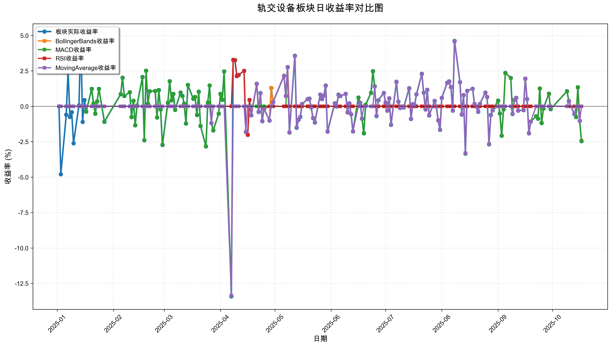
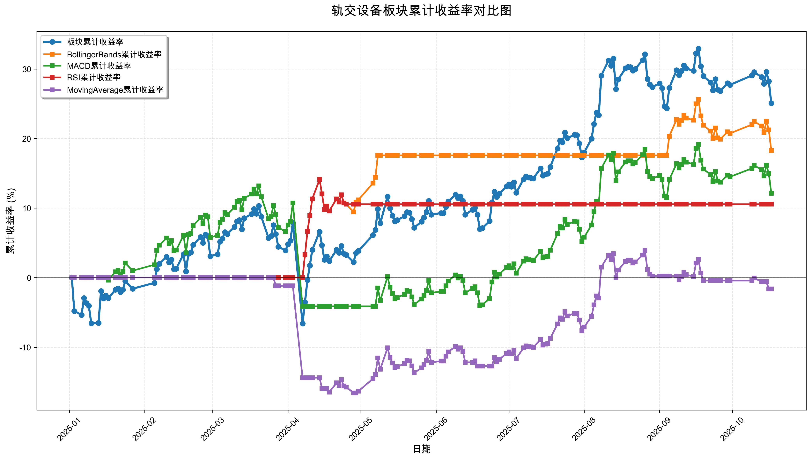

# 策略回测结果报告

**生成时间**: 2025-10-19 19:05:55
**行业板块**: 轨交设备
**回测期间**: 20250101 至 20251017
**策略数量**: 4

## 📈 分析结论

### 策略表现分析
- **最佳策略**: BollingerBands (总收益率: 18.27%)
- **最差策略**: MovingAverage (总收益率: -1.62%)
### 交易活跃度分析
- **活跃策略**: 4 个
- **非活跃策略**: 0 个
- **最活跃策略**: MovingAverage (交易次数: 20)
### 🚨 异动提醒分析
- **策略异动**: MovingAverage 与板块走势相关性异常 (相关系数: 0.280)
### 风险分析
- **BollingerBands**: 最大回撤 -5.86%, 夏普比率 2.1665
- **MACD**: 最大回撤 -15.31%, 夏普比率 0.6833
- **RSI**: 最大回撤 -3.97%, 夏普比率 1.7545
- **MovingAverage**: 最大回撤 -16.58%, 夏普比率 -0.1025

## 📊 综合结果表

| 策略名称           | 初始资金     | 最终价值     | 总收益率   | 年化收益率   | 波动率    |    夏普比率 | 最大回撤    | 总交易次数   | 买入次数   | 卖出次数   | 总交易金额      | 平均交易金额   | 交易频率   |   数据点数 |
|:---------------|:---------|:---------|:-------|:--------|:-------|--------:|:--------|:--------|:-------|:-------|:-----------|:---------|:-------|-------:|
| 板块实际表现         | ¥100,000 | ¥125,076 | 25.08% | 34.55%  | 27.15% |  1.2724 | -15.32% | N/A     | N/A    | N/A    | N/A        | N/A      | N/A    |    190 |
| BollingerBands | ¥100,000 | ¥118,266 | 18.27% | 24.92%  | 11.50% |  2.1665 | -5.86%  | 3       | 2      | 1      | ¥333,967   | ¥111,322 | 0.02   |    190 |
| MACD           | ¥100,000 | ¥112,138 | 12.14% | 16.41%  | 24.01% |  0.6833 | -15.31% | 4       | 2      | 2      | ¥403,090   | ¥100,773 | 0.02   |    190 |
| RSI            | ¥100,000 | ¥110,551 | 10.55% | 14.23%  | 8.11%  |  1.7545 | -3.97%  | 2       | 1      | 1      | ¥210,318   | ¥105,159 | 0.01   |    190 |
| MovingAverage  | ¥100,000 | ¥98,376  | -1.62% | -2.15%  | 20.95% | -0.1025 | -16.58% | 20      | 10     | 10     | ¥1,843,021 | ¥92,151  | 0.11   |    190 |

## 📊 每日收益率走势图

*图1: 轨交设备板块每日收益率走势对比*

## 📈 累计收益率走势图

*图2: 轨交设备板块累计收益率走势对比*

## 📅 日收益明细表

| 日期         | 板块实际收益率   | BollingerBands收益率   | MACD收益率   | RSI收益率   | MovingAverage收益率   |
|:-----------|:----------|:--------------------|:----------|:---------|:-------------------|
| 2025-01-02 | 0.00%     | 0.00%               | 0.00%     | 0.00%    | 0.00%              |
| 2025-01-03 | -4.80%    | 0.00%               | 0.00%     | 0.00%    | 0.00%              |
| 2025-01-06 | -0.60%    | 0.00%               | 0.00%     | 0.00%    | 0.00%              |
| 2025-01-07 | 2.57%     | 0.00%               | 0.00%     | 0.00%    | 0.00%              |
| 2025-01-08 | -0.75%    | 0.00%               | 0.00%     | 0.00%    | 0.00%              |
| 2025-01-09 | -0.42%    | 0.00%               | 0.00%     | 0.00%    | 0.00%              |
| 2025-01-10 | -2.61%    | 0.00%               | 0.00%     | 0.00%    | 0.00%              |
| 2025-01-13 | 0.07%     | 0.00%               | 0.00%     | 0.00%    | 0.00%              |
| 2025-01-14 | 4.91%     | 0.00%               | 0.00%     | 0.00%    | 0.00%              |
| 2025-01-15 | -1.10%    | 0.00%               | 0.00%     | 0.00%    | 0.00%              |
| 2025-01-16 | 0.44%     | 0.00%               | 0.00%     | 0.00%    | 0.00%              |
| 2025-01-17 | -0.38%    | 0.00%               | -0.38%    | 0.00%    | 0.00%              |
| 2025-01-20 | 1.23%     | 0.00%               | 1.23%     | 0.00%    | 0.00%              |
| 2025-01-21 | 0.19%     | 0.00%               | 0.19%     | 0.00%    | 0.00%              |
| 2025-01-22 | -0.52%    | 0.00%               | -0.52%    | 0.00%    | 0.00%              |
| 2025-01-23 | 0.35%     | 0.00%               | 0.35%     | 0.00%    | 0.00%              |
| 2025-01-24 | 1.23%     | 0.00%               | 1.23%     | 0.00%    | 0.00%              |
| 2025-01-27 | -1.09%    | 0.00%               | -1.09%    | 0.00%    | 0.00%              |
| 2025-02-05 | 0.85%     | 0.00%               | 0.85%     | 0.00%    | 0.00%              |
| 2025-02-06 | 2.01%     | 0.00%               | 2.01%     | 0.00%    | 0.00%              |
| 2025-02-07 | 0.73%     | 0.00%               | 0.72%     | 0.00%    | 0.00%              |
| 2025-02-10 | 0.99%     | 0.00%               | 0.99%     | 0.00%    | 0.00%              |
| 2025-02-11 | -0.76%    | 0.00%               | -0.76%    | 0.00%    | 0.00%              |
| 2025-02-12 | 0.39%     | 0.00%               | 0.39%     | 0.00%    | 0.00%              |
| 2025-02-13 | -1.34%    | 0.00%               | -1.34%    | 0.00%    | 0.00%              |
| 2025-02-14 | 0.06%     | 0.00%               | 0.06%     | 0.00%    | 0.00%              |
| 2025-02-17 | 2.07%     | 0.00%               | 2.07%     | 0.00%    | 0.00%              |
| 2025-02-18 | -2.40%    | 0.00%               | -2.40%    | 0.00%    | 0.00%              |
| 2025-02-19 | 2.51%     | 0.00%               | 2.51%     | 0.00%    | 0.00%              |
| 2025-02-20 | 0.18%     | 0.00%               | 0.18%     | 0.00%    | 0.00%              |
| 2025-02-21 | 1.06%     | 0.00%               | 1.06%     | 0.00%    | 0.00%              |
| 2025-02-24 | 1.08%     | 0.00%               | 1.08%     | 0.00%    | 0.00%              |
| 2025-02-25 | -0.79%    | 0.00%               | -0.79%    | 0.00%    | 0.00%              |
| 2025-02-26 | 1.14%     | 0.00%               | 1.14%     | 0.00%    | 0.00%              |
| 2025-02-27 | -0.23%    | 0.00%               | -0.22%    | 0.00%    | 0.00%              |
| 2025-02-28 | -2.73%    | 0.00%               | -2.72%    | 0.00%    | 0.00%              |
| 2025-03-03 | 0.25%     | 0.00%               | 0.25%     | 0.00%    | 0.00%              |
| 2025-03-04 | 1.77%     | 0.00%               | 1.77%     | 0.00%    | 0.00%              |
| 2025-03-05 | 0.42%     | 0.00%               | 0.42%     | 0.00%    | 0.00%              |
| 2025-03-06 | 0.88%     | 0.00%               | 0.87%     | 0.00%    | 0.00%              |
| 2025-03-07 | -0.25%    | 0.00%               | -0.25%    | 0.00%    | 0.00%              |
| 2025-03-10 | 0.97%     | 0.00%               | 0.96%     | 0.00%    | 0.00%              |
| 2025-03-11 | 0.73%     | 0.00%               | 0.73%     | 0.00%    | 0.00%              |
| 2025-03-12 | 0.18%     | 0.00%               | 0.18%     | 0.00%    | 0.00%              |
| 2025-03-13 | -1.22%    | 0.00%               | -1.22%    | 0.00%    | 0.00%              |
| 2025-03-14 | 1.51%     | 0.00%               | 1.51%     | 0.00%    | 0.00%              |
| 2025-03-17 | 0.53%     | 0.00%               | 0.53%     | 0.00%    | 0.00%              |
| 2025-03-18 | 0.66%     | 0.00%               | 0.66%     | 0.00%    | 0.00%              |
| 2025-03-19 | -0.62%    | 0.00%               | -0.62%    | 0.00%    | 0.00%              |
| 2025-03-20 | 1.03%     | 0.00%               | 1.03%     | 0.00%    | 0.00%              |
| 2025-03-21 | -1.39%    | 0.00%               | -1.39%    | 0.00%    | 0.00%              |
| 2025-03-24 | -2.83%    | 0.00%               | -2.83%    | 0.00%    | 0.00%              |
| 2025-03-25 | 0.26%     | 0.00%               | 0.26%     | 0.00%    | 0.00%              |
| 2025-03-26 | 1.47%     | 0.00%               | 1.47%     | 0.00%    | 0.00%              |
| 2025-03-27 | -1.18%    | 0.00%               | -1.18%    | 0.00%    | -1.18%             |
| 2025-03-28 | -1.70%    | 0.00%               | -1.70%    | 0.00%    | 0.00%              |
| 2025-03-31 | -0.52%    | 0.00%               | -0.52%    | 0.00%    | 0.00%              |
| 2025-04-01 | 0.88%     | 0.00%               | 0.88%     | 0.00%    | 0.00%              |
| 2025-04-02 | 0.46%     | 0.00%               | 0.46%     | 0.00%    | 0.00%              |
| 2025-04-03 | 2.46%     | 0.00%               | 2.46%     | 0.00%    | 0.00%              |
| 2025-04-07 | -13.42%   | 0.00%               | -13.41%   | 0.00%    | -13.36%            |
| 2025-04-08 | 3.28%     | 3.28%               | 0.00%     | 3.28%    | 0.00%              |
| 2025-04-09 | 3.26%     | 3.26%               | 0.00%     | 3.26%    | 0.00%              |
| 2025-04-10 | 2.13%     | 2.13%               | 0.00%     | 2.13%    | 0.00%              |
| 2025-04-11 | 2.21%     | 2.21%               | 0.00%     | 2.21%    | 0.00%              |
| 2025-04-14 | 2.50%     | 2.50%               | 0.00%     | 2.50%    | 0.00%              |
| 2025-04-15 | -1.81%    | -1.81%              | 0.00%     | -1.81%   | -1.80%             |
| 2025-04-16 | -2.01%    | -2.01%              | 0.00%     | -2.01%   | 0.00%              |
| 2025-04-17 | 0.45%     | 0.45%               | 0.00%     | 0.45%    | 0.00%              |
| 2025-04-18 | -0.64%    | -0.64%              | 0.00%     | -0.64%   | -0.64%             |
| 2025-04-21 | 1.59%     | 1.59%               | 0.00%     | 1.59%    | 1.59%              |
| 2025-04-22 | -0.40%    | -0.40%              | 0.00%     | -0.40%   | -0.40%             |
| 2025-04-23 | 0.94%     | 0.93%               | 0.00%     | 0.93%    | 0.93%              |
| 2025-04-24 | -1.05%    | -1.05%              | 0.00%     | -1.05%   | -1.05%             |
| 2025-04-25 | -0.17%    | -0.17%              | 0.00%     | -0.17%   | -0.17%             |
| 2025-04-28 | -1.01%    | -1.01%              | 0.00%     | 0.00%    | -1.01%             |
| 2025-04-29 | 1.29%     | 1.29%               | 0.00%     | 0.00%    | 0.00%              |
| 2025-04-30 | 0.30%     | 0.30%               | 0.00%     | 0.00%    | 0.30%              |
| 2025-05-06 | 2.16%     | 2.16%               | 0.00%     | 0.00%    | 2.14%              |
| 2025-05-07 | 0.73%     | 0.73%               | 0.00%     | 0.00%    | 0.73%              |
| 2025-05-08 | 2.77%     | 2.77%               | 2.76%     | 0.00%    | 2.75%              |
| 2025-05-09 | -1.85%    | 0.00%               | -1.85%    | 0.00%    | -1.84%             |
| 2025-05-12 | 3.57%     | 0.00%               | 3.56%     | 0.00%    | 3.54%              |
| 2025-05-13 | -1.52%    | 0.00%               | -1.51%    | 0.00%    | -1.50%             |
| 2025-05-14 | -0.95%    | 0.00%               | -0.95%    | 0.00%    | -0.95%             |
| 2025-05-15 | -0.75%    | 0.00%               | -0.74%    | 0.00%    | -0.74%             |
| 2025-05-16 | 0.16%     | 0.00%               | 0.16%     | 0.00%    | 0.16%              |
| 2025-05-19 | 0.50%     | 0.00%               | 0.50%     | 0.00%    | 0.50%              |
| 2025-05-20 | 0.54%     | 0.00%               | 0.54%     | 0.00%    | 0.53%              |
| 2025-05-21 | -0.08%    | 0.00%               | -0.08%    | 0.00%    | -0.08%             |
| 2025-05-22 | -0.83%    | 0.00%               | -0.83%    | 0.00%    | -0.82%             |
| 2025-05-23 | -1.14%    | 0.00%               | -1.14%    | 0.00%    | -1.13%             |
| 2025-05-26 | 0.82%     | 0.00%               | 0.82%     | 0.00%    | 0.82%              |
| 2025-05-27 | 0.51%     | 0.00%               | 0.51%     | 0.00%    | 0.51%              |
| 2025-05-28 | 0.76%     | 0.00%               | 0.76%     | 0.00%    | 0.75%              |
| 2025-05-29 | 1.46%     | 0.00%               | 1.45%     | 0.00%    | 1.44%              |
| 2025-05-30 | -1.79%    | 0.00%               | -1.78%    | 0.00%    | -1.77%             |
| 2025-06-03 | 0.21%     | 0.00%               | 0.21%     | 0.00%    | 0.20%              |
| 2025-06-04 | -0.01%    | 0.00%               | -0.01%    | 0.00%    | -0.01%             |
| 2025-06-05 | 0.82%     | 0.00%               | 0.82%     | 0.00%    | 0.81%              |
| 2025-06-06 | 0.72%     | 0.00%               | 0.71%     | 0.00%    | 0.71%              |
| 2025-06-09 | 0.87%     | 0.00%               | 0.87%     | 0.00%    | 0.87%              |
| 2025-06-10 | -0.43%    | 0.00%               | -0.43%    | 0.00%    | -0.42%             |
| 2025-06-11 | 0.21%     | 0.00%               | 0.20%     | 0.00%    | 0.20%              |
| 2025-06-12 | -0.56%    | 0.00%               | -0.56%    | 0.00%    | -0.56%             |
| 2025-06-13 | -1.78%    | 0.00%               | -1.78%    | 0.00%    | -1.77%             |
| 2025-06-16 | 0.62%     | 0.00%               | 0.62%     | 0.00%    | 0.00%              |
| 2025-06-17 | 0.25%     | 0.00%               | 0.25%     | 0.00%    | 0.25%              |
| 2025-06-18 | -0.87%    | 0.00%               | -0.87%    | 0.00%    | -0.86%             |
| 2025-06-19 | -1.91%    | 0.00%               | -1.90%    | 0.00%    | 0.00%              |
| 2025-06-20 | 0.11%     | 0.00%               | 0.11%     | 0.00%    | 0.00%              |
| 2025-06-23 | 0.95%     | 0.00%               | 0.94%     | 0.00%    | 0.00%              |
| 2025-06-24 | 2.48%     | 0.00%               | 2.47%     | 0.00%    | 0.00%              |
| 2025-06-25 | 1.41%     | 0.00%               | 1.40%     | 0.00%    | 1.39%              |
| 2025-06-26 | -0.69%    | 0.00%               | -0.68%    | 0.00%    | -0.68%             |
| 2025-06-27 | 0.43%     | 0.00%               | 0.42%     | 0.00%    | 0.42%              |
| 2025-06-30 | 0.94%     | 0.00%               | 0.93%     | 0.00%    | 0.93%              |
| 2025-07-01 | 0.26%     | 0.00%               | 0.26%     | 0.00%    | 0.25%              |
| 2025-07-02 | -0.30%    | 0.00%               | -0.30%    | 0.00%    | -0.29%             |
| 2025-07-03 | 0.56%     | 0.00%               | 0.56%     | 0.00%    | 0.55%              |
| 2025-07-04 | -1.31%    | 0.00%               | -1.31%    | 0.00%    | -1.30%             |
| 2025-07-07 | 1.73%     | 0.00%               | 1.72%     | 0.00%    | 1.71%              |
| 2025-07-08 | 0.33%     | 0.00%               | 0.33%     | 0.00%    | 0.33%              |
| 2025-07-09 | -0.12%    | 0.00%               | -0.12%    | 0.00%    | -0.12%             |
| 2025-07-10 | -0.02%    | 0.00%               | -0.02%    | 0.00%    | -0.02%             |
| 2025-07-11 | -0.09%    | 0.00%               | -0.09%    | 0.00%    | -0.09%             |
| 2025-07-14 | 1.28%     | 0.00%               | 1.27%     | 0.00%    | 1.26%              |
| 2025-07-15 | -0.89%    | 0.00%               | -0.88%    | 0.00%    | -0.88%             |
| 2025-07-16 | 0.15%     | 0.00%               | 0.15%     | 0.00%    | 0.15%              |
| 2025-07-17 | 0.08%     | 0.00%               | 0.08%     | 0.00%    | 0.08%              |
| 2025-07-18 | 0.84%     | 0.00%               | 0.84%     | 0.00%    | 0.84%              |
| 2025-07-21 | 2.29%     | 0.00%               | 2.29%     | 0.00%    | 2.27%              |
| 2025-07-22 | 0.96%     | 0.00%               | 0.96%     | 0.00%    | 0.95%              |
| 2025-07-23 | -0.22%    | 0.00%               | -0.21%    | 0.00%    | -0.21%             |
| 2025-07-24 | 1.17%     | 0.00%               | 1.17%     | 0.00%    | 1.16%              |
| 2025-07-25 | -0.65%    | 0.00%               | -0.64%    | 0.00%    | -0.64%             |
| 2025-07-28 | 0.38%     | 0.00%               | 0.38%     | 0.00%    | 0.38%              |
| 2025-07-29 | -0.03%    | 0.00%               | -0.03%    | 0.00%    | -0.03%             |
| 2025-07-30 | -1.00%    | 0.00%               | -0.99%    | 0.00%    | -0.99%             |
| 2025-07-31 | -1.66%    | 0.00%               | -1.66%    | 0.00%    | -1.65%             |
| 2025-08-01 | 0.60%     | 0.00%               | 0.60%     | 0.00%    | 0.60%              |
| 2025-08-04 | 1.66%     | 0.00%               | 1.65%     | 0.00%    | 1.64%              |
| 2025-08-05 | 1.76%     | 0.00%               | 1.75%     | 0.00%    | 1.74%              |
| 2025-08-06 | 1.36%     | 0.00%               | 1.36%     | 0.00%    | 1.35%              |
| 2025-08-07 | -0.31%    | 0.00%               | -0.31%    | 0.00%    | -0.31%             |
| 2025-08-08 | 4.61%     | 0.00%               | 4.60%     | 0.00%    | 4.57%              |
| 2025-08-11 | 1.70%     | 0.00%               | 1.69%     | 0.00%    | 1.68%              |
| 2025-08-12 | -0.58%    | 0.00%               | -0.58%    | 0.00%    | -0.57%             |
| 2025-08-13 | 0.79%     | 0.00%               | 0.78%     | 0.00%    | 0.78%              |
| 2025-08-14 | -3.34%    | 0.00%               | -3.33%    | 0.00%    | -3.31%             |
| 2025-08-15 | 1.09%     | 0.00%               | 1.09%     | 0.00%    | 1.08%              |
| 2025-08-18 | 1.24%     | 0.00%               | 1.23%     | 0.00%    | 1.23%              |
| 2025-08-19 | 0.16%     | 0.00%               | 0.16%     | 0.00%    | 0.16%              |
| 2025-08-20 | -0.01%    | 0.00%               | -0.01%    | 0.00%    | -0.01%             |
| 2025-08-21 | -0.39%    | 0.00%               | -0.39%    | 0.00%    | -0.38%             |
| 2025-08-22 | 0.17%     | 0.00%               | 0.17%     | 0.00%    | 0.17%              |
| 2025-08-25 | 0.97%     | 0.00%               | 0.97%     | 0.00%    | 0.96%              |
| 2025-08-26 | 0.66%     | 0.00%               | 0.66%     | 0.00%    | 0.65%              |
| 2025-08-27 | -2.69%    | 0.00%               | -2.69%    | 0.00%    | -2.67%             |
| 2025-08-28 | -0.62%    | 0.00%               | -0.62%    | 0.00%    | -0.62%             |
| 2025-08-29 | -0.28%    | 0.00%               | -0.28%    | 0.00%    | -0.28%             |
| 2025-09-01 | 0.40%     | 0.00%               | 0.40%     | 0.00%    | 0.00%              |
| 2025-09-02 | -0.51%    | 0.00%               | -0.50%    | 0.00%    | 0.00%              |
| 2025-09-03 | -2.08%    | 0.00%               | -2.07%    | 0.00%    | 0.00%              |
| 2025-09-04 | -0.22%    | 0.00%               | -0.22%    | 0.00%    | 0.00%              |
| 2025-09-05 | 2.36%     | 2.34%               | 2.35%     | 0.00%    | 0.00%              |
| 2025-09-08 | 2.00%     | 1.99%               | 2.00%     | 0.00%    | 0.00%              |
| 2025-09-09 | -0.54%    | -0.54%              | -0.54%    | 0.00%    | -0.54%             |
| 2025-09-10 | 0.45%     | 0.45%               | 0.45%     | 0.00%    | 0.45%              |
| 2025-09-11 | 0.60%     | 0.60%               | 0.60%     | 0.00%    | 0.60%              |
| 2025-09-12 | -0.31%    | -0.31%              | -0.31%    | 0.00%    | -0.31%             |
| 2025-09-15 | -0.27%    | -0.26%              | -0.27%    | 0.00%    | -0.27%             |
| 2025-09-16 | 1.95%     | 1.93%               | 1.94%     | 0.00%    | 1.95%              |
| 2025-09-17 | 0.50%     | 0.50%               | 0.50%     | 0.00%    | 0.50%              |
| 2025-09-18 | -1.91%    | -1.89%              | -1.90%    | 0.00%    | -1.91%             |
| 2025-09-19 | -1.08%    | -1.07%              | -1.08%    | 0.00%    | -1.08%             |
| 2025-09-22 | -0.70%    | -0.70%              | -0.70%    | 0.00%    | 0.00%              |
| 2025-09-23 | -0.87%    | -0.87%              | -0.87%    | 0.00%    | 0.00%              |
| 2025-09-24 | 1.26%     | 1.25%               | 1.25%     | 0.00%    | 0.00%              |
| 2025-09-25 | -1.18%    | -1.17%              | -1.17%    | 0.00%    | 0.00%              |
| 2025-09-26 | -0.16%    | -0.16%              | -0.16%    | 0.00%    | 0.00%              |
| 2025-09-29 | 0.89%     | 0.88%               | 0.89%     | 0.00%    | 0.00%              |
| 2025-09-30 | -0.20%    | -0.19%              | -0.19%    | 0.00%    | 0.00%              |
| 2025-10-09 | 1.06%     | 1.05%               | 1.05%     | 0.00%    | 0.00%              |
| 2025-10-10 | 0.37%     | 0.37%               | 0.37%     | 0.00%    | 0.37%              |
| 2025-10-13 | -0.54%    | -0.54%              | -0.54%    | 0.00%    | -0.54%             |
| 2025-10-14 | -0.76%    | -0.75%              | -0.76%    | 0.00%    | 0.00%              |
| 2025-10-15 | 1.34%     | 1.33%               | 1.34%     | 0.00%    | 0.00%              |
| 2025-10-16 | -1.03%    | -1.03%              | -1.03%    | 0.00%    | -1.03%             |
| 2025-10-17 | -2.46%    | -2.44%              | -2.45%    | 0.00%    | 0.00%              |

## 📊 日收益统计摘要

| 指标                | 平均日收益率   | 最大日收益率   | 最小日收益率   | 正收益天数   | 负收益天数   |
|:------------------|:---------|:---------|:---------|:--------|:--------|
| 板块实际收益率           | 0.13%    | 4.91%    | -13.42%  | 107天    | 82天     |
| BollingerBands收益率 | 0.09%    | 3.28%    | -2.44%   | 24天     | 21天     |
| MACD收益率           | 0.07%    | 4.60%    | -13.41%  | 91天     | 69天     |
| RSI收益率            | 0.05%    | 3.28%    | -2.01%   | 8天      | 6天      |
| MovingAverage收益率  | 0.00%    | 4.57%    | -13.36%  | 53天     | 48天     |

## 📈 累计收益明细表

| 日期         | 板块累计收益率   | BollingerBands累计收益率   | MACD累计收益率   | RSI累计收益率   | MovingAverage累计收益率   |
|:-----------|:----------|:----------------------|:------------|:-----------|:---------------------|
| 2025-01-02 | 0.00%     | 0.00%                 | 0.00%       | 0.00%      | 0.00%                |
| 2025-01-03 | -4.80%    | 0.00%                 | 0.00%       | 0.00%      | 0.00%                |
| 2025-01-06 | -5.37%    | 0.00%                 | 0.00%       | 0.00%      | 0.00%                |
| 2025-01-07 | -2.94%    | 0.00%                 | 0.00%       | 0.00%      | 0.00%                |
| 2025-01-08 | -3.67%    | 0.00%                 | 0.00%       | 0.00%      | 0.00%                |
| 2025-01-09 | -4.07%    | 0.00%                 | 0.00%       | 0.00%      | 0.00%                |
| 2025-01-10 | -6.57%    | 0.00%                 | 0.00%       | 0.00%      | 0.00%                |
| 2025-01-13 | -6.51%    | 0.00%                 | 0.00%       | 0.00%      | 0.00%                |
| 2025-01-14 | -1.92%    | 0.00%                 | 0.00%       | 0.00%      | 0.00%                |
| 2025-01-15 | -3.00%    | 0.00%                 | 0.00%       | 0.00%      | 0.00%                |
| 2025-01-16 | -2.57%    | 0.00%                 | 0.00%       | 0.00%      | 0.00%                |
| 2025-01-17 | -2.94%    | 0.00%                 | -0.38%      | 0.00%      | 0.00%                |
| 2025-01-20 | -1.75%    | 0.00%                 | 0.84%       | 0.00%      | 0.00%                |
| 2025-01-21 | -1.56%    | 0.00%                 | 1.03%       | 0.00%      | 0.00%                |
| 2025-01-22 | -2.07%    | 0.00%                 | 0.51%       | 0.00%      | 0.00%                |
| 2025-01-23 | -1.73%    | 0.00%                 | 0.86%       | 0.00%      | 0.00%                |
| 2025-01-24 | -0.52%    | 0.00%                 | 2.10%       | 0.00%      | 0.00%                |
| 2025-01-27 | -1.60%    | 0.00%                 | 0.99%       | 0.00%      | 0.00%                |
| 2025-02-05 | -0.76%    | 0.00%                 | 1.85%       | 0.00%      | 0.00%                |
| 2025-02-06 | 1.23%     | 0.00%                 | 3.90%       | 0.00%      | 0.00%                |
| 2025-02-07 | 1.97%     | 0.00%                 | 4.65%       | 0.00%      | 0.00%                |
| 2025-02-10 | 2.98%     | 0.00%                 | 5.69%       | 0.00%      | 0.00%                |
| 2025-02-11 | 2.20%     | 0.00%                 | 4.89%       | 0.00%      | 0.00%                |
| 2025-02-12 | 2.60%     | 0.00%                 | 5.30%       | 0.00%      | 0.00%                |
| 2025-02-13 | 1.23%     | 0.00%                 | 3.89%       | 0.00%      | 0.00%                |
| 2025-02-14 | 1.29%     | 0.00%                 | 3.96%       | 0.00%      | 0.00%                |
| 2025-02-17 | 3.38%     | 0.00%                 | 6.10%       | 0.00%      | 0.00%                |
| 2025-02-18 | 0.90%     | 0.00%                 | 3.56%       | 0.00%      | 0.00%                |
| 2025-02-19 | 3.43%     | 0.00%                 | 6.16%       | 0.00%      | 0.00%                |
| 2025-02-20 | 3.62%     | 0.00%                 | 6.34%       | 0.00%      | 0.00%                |
| 2025-02-21 | 4.71%     | 0.00%                 | 7.47%       | 0.00%      | 0.00%                |
| 2025-02-24 | 5.84%     | 0.00%                 | 8.62%       | 0.00%      | 0.00%                |
| 2025-02-25 | 5.01%     | 0.00%                 | 7.77%       | 0.00%      | 0.00%                |
| 2025-02-26 | 6.21%     | 0.00%                 | 9.00%       | 0.00%      | 0.00%                |
| 2025-02-27 | 5.97%     | 0.00%                 | 8.75%       | 0.00%      | 0.00%                |
| 2025-02-28 | 3.08%     | 0.00%                 | 5.79%       | 0.00%      | 0.00%                |
| 2025-03-03 | 3.34%     | 0.00%                 | 6.06%       | 0.00%      | 0.00%                |
| 2025-03-04 | 5.17%     | 0.00%                 | 7.93%       | 0.00%      | 0.00%                |
| 2025-03-05 | 5.61%     | 0.00%                 | 8.38%       | 0.00%      | 0.00%                |
| 2025-03-06 | 6.53%     | 0.00%                 | 9.33%       | 0.00%      | 0.00%                |
| 2025-03-07 | 6.27%     | 0.00%                 | 9.06%       | 0.00%      | 0.00%                |
| 2025-03-10 | 7.29%     | 0.00%                 | 10.11%      | 0.00%      | 0.00%                |
| 2025-03-11 | 8.08%     | 0.00%                 | 10.92%      | 0.00%      | 0.00%                |
| 2025-03-12 | 8.27%     | 0.00%                 | 11.11%      | 0.00%      | 0.00%                |
| 2025-03-13 | 6.95%     | 0.00%                 | 9.76%       | 0.00%      | 0.00%                |
| 2025-03-14 | 8.56%     | 0.00%                 | 11.41%      | 0.00%      | 0.00%                |
| 2025-03-17 | 9.14%     | 0.00%                 | 12.01%      | 0.00%      | 0.00%                |
| 2025-03-18 | 9.86%     | 0.00%                 | 12.75%      | 0.00%      | 0.00%                |
| 2025-03-19 | 9.18%     | 0.00%                 | 12.05%      | 0.00%      | 0.00%                |
| 2025-03-20 | 10.31%    | 0.00%                 | 13.20%      | 0.00%      | 0.00%                |
| 2025-03-21 | 8.77%     | 0.00%                 | 11.63%      | 0.00%      | 0.00%                |
| 2025-03-24 | 5.69%     | 0.00%                 | 8.47%       | 0.00%      | 0.00%                |
| 2025-03-25 | 5.97%     | 0.00%                 | 8.76%       | 0.00%      | 0.00%                |
| 2025-03-26 | 7.53%     | 0.00%                 | 10.35%      | 0.00%      | 0.00%                |
| 2025-03-27 | 6.25%     | 0.00%                 | 9.05%       | 0.00%      | -1.18%               |
| 2025-03-28 | 4.44%     | 0.00%                 | 7.19%       | 0.00%      | -1.18%               |
| 2025-03-31 | 3.90%     | 0.00%                 | 6.63%       | 0.00%      | -1.18%               |
| 2025-04-01 | 4.81%     | 0.00%                 | 7.57%       | 0.00%      | -1.18%               |
| 2025-04-02 | 5.30%     | 0.00%                 | 8.07%       | 0.00%      | -1.18%               |
| 2025-04-03 | 7.89%     | 0.00%                 | 10.73%      | 0.00%      | -1.18%               |
| 2025-04-07 | -6.59%    | 0.00%                 | -4.13%      | 0.00%      | -14.39%              |
| 2025-04-08 | -3.53%    | 3.28%                 | -4.13%      | 3.28%      | -14.39%              |
| 2025-04-09 | -0.38%    | 6.64%                 | -4.13%      | 6.64%      | -14.39%              |
| 2025-04-10 | 1.74%     | 8.91%                 | -4.13%      | 8.91%      | -14.39%              |
| 2025-04-11 | 3.99%     | 11.32%                | -4.13%      | 11.32%     | -14.39%              |
| 2025-04-14 | 6.59%     | 14.10%                | -4.13%      | 14.10%     | -14.39%              |
| 2025-04-15 | 4.66%     | 12.04%                | -4.13%      | 12.04%     | -15.93%              |
| 2025-04-16 | 2.56%     | 9.79%                 | -4.13%      | 9.79%      | -15.93%              |
| 2025-04-17 | 3.03%     | 10.29%                | -4.13%      | 10.29%     | -15.93%              |
| 2025-04-18 | 2.36%     | 9.58%                 | -4.13%      | 9.58%      | -16.47%              |
| 2025-04-21 | 3.99%     | 11.32%                | -4.13%      | 11.32%     | -15.14%              |
| 2025-04-22 | 3.57%     | 10.87%                | -4.13%      | 10.87%     | -15.48%              |
| 2025-04-23 | 4.54%     | 11.91%                | -4.13%      | 11.91%     | -14.69%              |
| 2025-04-24 | 3.44%     | 10.73%                | -4.13%      | 10.73%     | -15.58%              |
| 2025-04-25 | 3.27%     | 10.55%                | -4.13%      | 10.55%     | -15.73%              |
| 2025-04-28 | 2.23%     | 9.44%                 | -4.13%      | 10.55%     | -16.58%              |
| 2025-04-29 | 3.55%     | 10.85%                | -4.13%      | 10.55%     | -16.58%              |
| 2025-04-30 | 3.86%     | 11.18%                | -4.13%      | 10.55%     | -16.33%              |
| 2025-05-06 | 6.11%     | 13.58%                | -4.13%      | 10.55%     | -14.54%              |
| 2025-05-07 | 6.88%     | 14.41%                | -4.13%      | 10.55%     | -13.92%              |
| 2025-05-08 | 9.85%     | 17.58%                | -1.48%      | 10.55%     | -11.55%              |
| 2025-05-09 | 7.81%     | 17.58%                | -3.30%      | 10.55%     | -13.18%              |
| 2025-05-12 | 11.66%    | 17.58%                | 0.14%       | 10.55%     | -10.10%              |
| 2025-05-13 | 9.97%     | 17.58%                | -1.37%      | 10.55%     | -11.46%              |
| 2025-05-14 | 8.92%     | 17.58%                | -2.31%      | 10.55%     | -12.29%              |
| 2025-05-15 | 8.11%     | 17.58%                | -3.04%      | 10.55%     | -12.94%              |
| 2025-05-16 | 8.28%     | 17.58%                | -2.88%      | 10.55%     | -12.80%              |
| 2025-05-19 | 8.82%     | 17.58%                | -2.40%      | 10.55%     | -12.37%              |
| 2025-05-20 | 9.41%     | 17.58%                | -1.87%      | 10.55%     | -11.90%              |
| 2025-05-21 | 9.32%     | 17.58%                | -1.95%      | 10.55%     | -11.97%              |
| 2025-05-22 | 8.41%     | 17.58%                | -2.76%      | 10.55%     | -12.70%              |
| 2025-05-23 | 7.18%     | 17.58%                | -3.86%      | 10.55%     | -13.68%              |
| 2025-05-26 | 8.06%     | 17.58%                | -3.07%      | 10.55%     | -12.98%              |
| 2025-05-27 | 8.62%     | 17.58%                | -2.58%      | 10.55%     | -12.53%              |
| 2025-05-28 | 9.44%     | 17.58%                | -1.84%      | 10.55%     | -11.88%              |
| 2025-05-29 | 11.03%    | 17.58%                | -0.42%      | 10.55%     | -10.61%              |
| 2025-05-30 | 9.05%     | 17.58%                | -2.19%      | 10.55%     | -12.19%              |
| 2025-06-03 | 9.28%     | 17.58%                | -1.99%      | 10.55%     | -12.01%              |
| 2025-06-04 | 9.27%     | 17.58%                | -2.00%      | 10.55%     | -12.01%              |
| 2025-06-05 | 10.16%    | 17.58%                | -1.19%      | 10.55%     | -11.30%              |
| 2025-06-06 | 10.95%    | 17.58%                | -0.49%      | 10.55%     | -10.67%              |
| 2025-06-09 | 11.92%    | 17.58%                | 0.38%       | 10.55%     | -9.90%               |
| 2025-06-10 | 11.44%    | 17.58%                | -0.05%      | 10.55%     | -10.28%              |
| 2025-06-11 | 11.67%    | 17.58%                | 0.15%       | 10.55%     | -10.10%              |
| 2025-06-12 | 11.05%    | 17.58%                | -0.41%      | 10.55%     | -10.60%              |
| 2025-06-13 | 9.06%     | 17.58%                | -2.18%      | 10.55%     | -12.18%              |
| 2025-06-16 | 9.75%     | 17.58%                | -1.57%      | 10.55%     | -12.18%              |
| 2025-06-17 | 10.02%    | 17.58%                | -1.33%      | 10.55%     | -11.96%              |
| 2025-06-18 | 9.06%     | 17.58%                | -2.18%      | 10.55%     | -12.72%              |
| 2025-06-19 | 6.98%     | 17.58%                | -4.04%      | 10.55%     | -12.72%              |
| 2025-06-20 | 7.11%     | 17.58%                | -3.93%      | 10.55%     | -12.72%              |
| 2025-06-23 | 8.12%     | 17.58%                | -3.02%      | 10.55%     | -12.72%              |
| 2025-06-24 | 10.80%    | 17.58%                | -0.62%      | 10.55%     | -12.72%              |
| 2025-06-25 | 12.36%    | 17.58%                | 0.77%       | 10.55%     | -11.51%              |
| 2025-06-26 | 11.59%    | 17.58%                | 0.08%       | 10.55%     | -12.11%              |
| 2025-06-27 | 12.07%    | 17.58%                | 0.51%       | 10.55%     | -11.74%              |
| 2025-06-30 | 13.11%    | 17.58%                | 1.44%       | 10.55%     | -10.92%              |
| 2025-07-01 | 13.41%    | 17.58%                | 1.70%       | 10.55%     | -10.69%              |
| 2025-07-02 | 13.07%    | 17.58%                | 1.40%       | 10.55%     | -10.95%              |
| 2025-07-03 | 13.70%    | 17.58%                | 1.97%       | 10.55%     | -10.46%              |
| 2025-07-04 | 12.21%    | 17.58%                | 0.63%       | 10.55%     | -11.63%              |
| 2025-07-07 | 14.15%    | 17.58%                | 2.37%       | 10.55%     | -10.11%              |
| 2025-07-08 | 14.52%    | 17.58%                | 2.70%       | 10.55%     | -9.82%               |
| 2025-07-09 | 14.38%    | 17.58%                | 2.57%       | 10.55%     | -9.93%               |
| 2025-07-10 | 14.35%    | 17.58%                | 2.55%       | 10.55%     | -9.95%               |
| 2025-07-11 | 14.25%    | 17.58%                | 2.46%       | 10.55%     | -10.03%              |
| 2025-07-14 | 15.71%    | 17.58%                | 3.76%       | 10.55%     | -8.90%               |
| 2025-07-15 | 14.68%    | 17.58%                | 2.84%       | 10.55%     | -9.70%               |
| 2025-07-16 | 14.85%    | 17.58%                | 3.00%       | 10.55%     | -9.56%               |
| 2025-07-17 | 14.94%    | 17.58%                | 3.08%       | 10.55%     | -9.49%               |
| 2025-07-18 | 15.91%    | 17.58%                | 3.94%       | 10.55%     | -8.74%               |
| 2025-07-21 | 18.57%    | 17.58%                | 6.32%       | 10.55%     | -6.66%               |
| 2025-07-22 | 19.71%    | 17.58%                | 7.34%       | 10.55%     | -5.78%               |
| 2025-07-23 | 19.45%    | 17.58%                | 7.11%       | 10.55%     | -5.98%               |
| 2025-07-24 | 20.84%    | 17.58%                | 8.35%       | 10.55%     | -4.89%               |
| 2025-07-25 | 20.06%    | 17.58%                | 7.66%       | 10.55%     | -5.50%               |
| 2025-07-28 | 20.53%    | 17.58%                | 8.07%       | 10.55%     | -5.14%               |
| 2025-07-29 | 20.49%    | 17.58%                | 8.03%       | 10.55%     | -5.17%               |
| 2025-07-30 | 19.29%    | 17.58%                | 6.96%       | 10.55%     | -6.10%               |
| 2025-07-31 | 17.30%    | 17.58%                | 5.19%       | 10.55%     | -7.65%               |
| 2025-08-01 | 18.01%    | 17.58%                | 5.82%       | 10.55%     | -7.10%               |
| 2025-08-04 | 19.97%    | 17.58%                | 7.57%       | 10.55%     | -5.57%               |
| 2025-08-05 | 22.08%    | 17.58%                | 9.46%       | 10.55%     | -3.93%               |
| 2025-08-06 | 23.74%    | 17.58%                | 10.94%      | 10.55%     | -2.63%               |
| 2025-08-07 | 23.36%    | 17.58%                | 10.60%      | 10.55%     | -2.93%               |
| 2025-08-08 | 29.04%    | 17.58%                | 15.68%      | 10.55%     | 1.51%                |
| 2025-08-11 | 31.23%    | 17.58%                | 17.64%      | 10.55%     | 3.22%                |
| 2025-08-12 | 30.47%    | 17.58%                | 16.96%      | 10.55%     | 2.62%                |
| 2025-08-13 | 31.50%    | 17.58%                | 17.88%      | 10.55%     | 3.42%                |
| 2025-08-14 | 27.11%    | 17.58%                | 13.95%      | 10.55%     | -0.00%               |
| 2025-08-15 | 28.50%    | 17.58%                | 15.20%      | 10.55%     | 1.08%                |
| 2025-08-18 | 30.09%    | 17.58%                | 16.62%      | 10.55%     | 2.32%                |
| 2025-08-19 | 30.30%    | 17.58%                | 16.81%      | 10.55%     | 2.49%                |
| 2025-08-20 | 30.28%    | 17.58%                | 16.79%      | 10.55%     | 2.48%                |
| 2025-08-21 | 29.78%    | 17.58%                | 16.34%      | 10.55%     | 2.08%                |
| 2025-08-22 | 30.00%    | 17.58%                | 16.54%      | 10.55%     | 2.25%                |
| 2025-08-25 | 31.26%    | 17.58%                | 17.66%      | 10.55%     | 3.23%                |
| 2025-08-26 | 32.12%    | 17.58%                | 18.44%      | 10.55%     | 3.91%                |
| 2025-08-27 | 28.56%    | 17.58%                | 15.25%      | 10.55%     | 1.13%                |
| 2025-08-28 | 27.76%    | 17.58%                | 14.54%      | 10.55%     | 0.51%                |
| 2025-08-29 | 27.40%    | 17.58%                | 14.22%      | 10.55%     | 0.23%                |
| 2025-09-01 | 27.91%    | 17.58%                | 14.67%      | 10.55%     | 0.23%                |
| 2025-09-02 | 27.26%    | 17.58%                | 14.09%      | 10.55%     | 0.23%                |
| 2025-09-03 | 24.62%    | 17.58%                | 11.73%      | 10.55%     | 0.23%                |
| 2025-09-04 | 24.34%    | 17.58%                | 11.48%      | 10.55%     | 0.23%                |
| 2025-09-05 | 27.28%    | 20.33%                | 14.10%      | 10.55%     | 0.23%                |
| 2025-09-08 | 29.83%    | 22.72%                | 16.38%      | 10.55%     | 0.23%                |
| 2025-09-09 | 29.12%    | 22.06%                | 15.75%      | 10.55%     | -0.32%               |
| 2025-09-10 | 29.70%    | 22.60%                | 16.27%      | 10.55%     | 0.13%                |
| 2025-09-11 | 30.49%    | 23.34%                | 16.97%      | 10.55%     | 0.74%                |
| 2025-09-12 | 30.08%    | 22.96%                | 16.61%      | 10.55%     | 0.42%                |
| 2025-09-15 | 29.73%    | 22.63%                | 16.30%      | 10.55%     | 0.15%                |
| 2025-09-16 | 32.26%    | 25.00%                | 18.56%      | 10.55%     | 2.10%                |
| 2025-09-17 | 32.92%    | 25.63%                | 19.15%      | 10.55%     | 2.62%                |
| 2025-09-18 | 30.39%    | 23.25%                | 16.89%      | 10.55%     | 0.66%                |
| 2025-09-19 | 28.98%    | 21.92%                | 15.62%      | 10.55%     | -0.43%               |
| 2025-09-22 | 28.07%    | 21.07%                | 14.81%      | 10.55%     | -0.43%               |
| 2025-09-23 | 26.95%    | 20.02%                | 13.81%      | 10.55%     | -0.43%               |
| 2025-09-24 | 28.55%    | 21.52%                | 15.24%      | 10.55%     | -0.43%               |
| 2025-09-25 | 27.03%    | 20.10%                | 13.89%      | 10.55%     | -0.43%               |
| 2025-09-26 | 26.83%    | 19.91%                | 13.71%      | 10.55%     | -0.43%               |
| 2025-09-29 | 27.96%    | 20.97%                | 14.72%      | 10.55%     | -0.43%               |
| 2025-09-30 | 27.71%    | 20.74%                | 14.49%      | 10.55%     | -0.43%               |
| 2025-10-09 | 29.06%    | 22.00%                | 15.70%      | 10.55%     | -0.43%               |
| 2025-10-10 | 29.54%    | 22.45%                | 16.13%      | 10.55%     | -0.06%               |
| 2025-10-13 | 28.84%    | 21.79%                | 15.50%      | 10.55%     | -0.60%               |
| 2025-10-14 | 27.86%    | 20.88%                | 14.62%      | 10.55%     | -0.60%               |
| 2025-10-15 | 29.57%    | 22.48%                | 16.16%      | 10.55%     | -0.60%               |
| 2025-10-16 | 28.23%    | 21.23%                | 14.96%      | 10.55%     | -1.62%               |
| 2025-10-17 | 25.08%    | 18.27%                | 12.14%      | 10.55%     | -1.62%               |

## 📊 累计收益统计摘要

| 指标                  | 最终累计收益率   | 最大累计收益率   | 最小累计收益率   | 累计收益波动   | 收益稳定性   |
|:--------------------|:----------|:----------|:----------|:---------|:--------|
| 板块累计收益率             | 25.08%    | 32.92%    | -6.59%    | 39.51%   | 波动      |
| BollingerBands累计收益率 | 18.27%    | 25.63%    | 0.00%     | 25.63%   | 波动      |
| MACD累计收益率           | 12.14%    | 19.15%    | -4.13%    | 23.28%   | 波动      |
| RSI累计收益率            | 10.55%    | 14.10%    | 0.00%     | 14.10%   | 稳定      |
| MovingAverage累计收益率  | -1.62%    | 3.91%     | -16.58%   | 20.49%   | 波动      |

