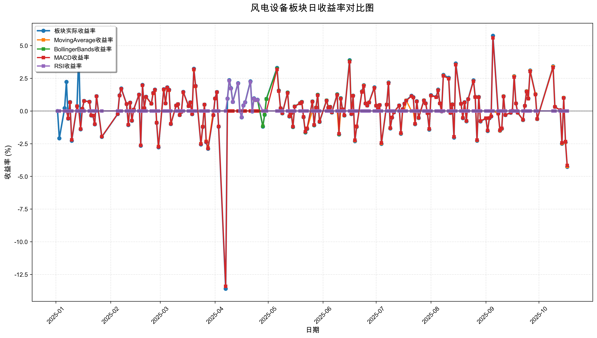
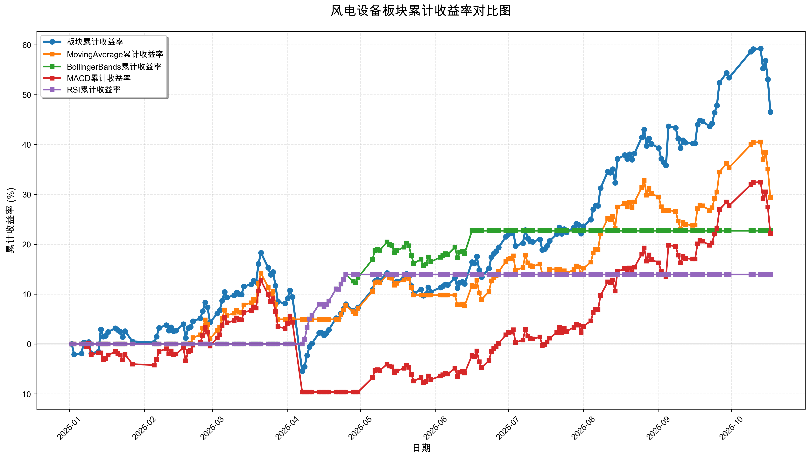

# 策略回测结果报告

**生成时间**: 2025-10-19 19:07:57
**行业板块**: 风电设备
**回测期间**: 20250101 至 20251017
**策略数量**: 4

## 📈 分析结论

### 策略表现分析
- **最佳策略**: MovingAverage (总收益率: 29.35%)
- **最差策略**: RSI (总收益率: 13.94%)
### 交易活跃度分析
- **活跃策略**: 4 个
- **非活跃策略**: 0 个
- **最活跃策略**: MovingAverage (交易次数: 14)
### 🚨 异动提醒分析
- **板块异动**: 风电设备 近两周出现大幅波动 (最大单日: 4.27%)
- **策略异动**: MovingAverage 近两周出现大幅波动 (最大单日: 4.24%)
- **策略异动**: MACD 近两周出现大幅波动 (最大单日: 4.16%)
### 风险分析
- **MovingAverage**: 最大回撤 -8.10%, 夏普比率 2.1568
- **BollingerBands**: 最大回撤 -3.93%, 夏普比率 3.2315
- **MACD**: 最大回撤 -19.83%, 夏普比率 1.1536
- **RSI**: 最大回撤 -0.48%, 夏普比率 3.5429

## 📊 综合结果表

| 策略名称           | 初始资金     | 最终价值     | 总收益率   | 年化收益率   | 波动率    |   夏普比率 | 最大回撤    | 总交易次数   | 买入次数   | 卖出次数   | 总交易金额      | 平均交易金额   | 交易频率   |   数据点数 |
|:---------------|:---------|:---------|:-------|:--------|:-------|-------:|:--------|:--------|:-------|:-------|:-----------|:---------|:-------|-------:|
| 板块实际表现         | ¥100,000 | ¥146,526 | 46.53% | 65.98%  | 28.09% | 2.3488 | -20.07% | N/A     | N/A    | N/A    | N/A        | N/A      | N/A    |    190 |
| MovingAverage  | ¥100,000 | ¥129,352 | 29.35% | 40.68%  | 18.86% | 2.1568 | -8.10%  | 14      | 7      | 7      | ¥1,554,952 | ¥111,068 | 0.07   |    190 |
| BollingerBands | ¥100,000 | ¥122,713 | 22.71% | 31.19%  | 9.65%  | 3.2315 | -3.93%  | 2       | 1      | 1      | ¥219,222   | ¥109,611 | 0.01   |    190 |
| MACD           | ¥100,000 | ¥122,153 | 22.15% | 30.39%  | 26.35% | 1.1536 | -19.83% | 5       | 3      | 2      | ¥466,738   | ¥93,348  | 0.03   |    190 |
| RSI            | ¥100,000 | ¥113,939 | 13.94% | 18.90%  | 5.33%  | 3.5429 | -0.48%  | 2       | 1      | 1      | ¥210,448   | ¥105,224 | 0.01   |    190 |

## 📊 每日收益率走势图

*图1: 风电设备板块每日收益率走势对比*

## 📈 累计收益率走势图

*图2: 风电设备板块累计收益率走势对比*

## 📅 日收益明细表

| 日期         | 板块实际收益率   | MovingAverage收益率   | BollingerBands收益率   | MACD收益率   | RSI收益率   |
|:-----------|:----------|:-------------------|:--------------------|:----------|:---------|
| 2025-01-02 | 0.00%     | 0.00%              | 0.00%               | 0.00%     | 0.00%    |
| 2025-01-03 | -2.09%    | 0.00%              | 0.00%               | 0.00%     | 0.00%    |
| 2025-01-06 | 0.21%     | 0.00%              | 0.00%               | 0.00%     | 0.00%    |
| 2025-01-07 | 2.23%     | 0.00%              | 0.00%               | 0.00%     | 0.00%    |
| 2025-01-08 | -0.58%    | 0.00%              | 0.00%               | -0.57%    | 0.00%    |
| 2025-01-09 | 0.68%     | 0.00%              | 0.00%               | 0.66%     | 0.00%    |
| 2025-01-10 | -2.27%    | 0.00%              | 0.00%               | -2.21%    | 0.00%    |
| 2025-01-13 | 0.37%     | 0.00%              | 0.00%               | 0.37%     | 0.00%    |
| 2025-01-14 | 4.49%     | 0.00%              | 0.00%               | 0.00%     | 0.00%    |
| 2025-01-15 | -1.40%    | 0.00%              | 0.00%               | -1.38%    | 0.00%    |
| 2025-01-16 | 0.17%     | 0.00%              | 0.00%               | 0.17%     | 0.00%    |
| 2025-01-17 | 0.77%     | 0.00%              | 0.00%               | 0.76%     | 0.00%    |
| 2025-01-20 | 0.71%     | 0.00%              | 0.00%               | 0.70%     | 0.00%    |
| 2025-01-21 | -0.34%    | 0.00%              | 0.00%               | -0.33%    | 0.00%    |
| 2025-01-22 | -0.35%    | 0.00%              | 0.00%               | -0.35%    | 0.00%    |
| 2025-01-23 | -1.02%    | 0.00%              | 0.00%               | -1.01%    | 0.00%    |
| 2025-01-24 | 1.13%     | 0.00%              | 0.00%               | 1.12%     | 0.00%    |
| 2025-01-27 | -1.98%    | 0.00%              | 0.00%               | -1.96%    | 0.00%    |
| 2025-02-05 | -0.23%    | 0.00%              | 0.00%               | -0.22%    | 0.00%    |
| 2025-02-06 | 1.20%     | 0.00%              | 0.00%               | 1.18%     | 0.00%    |
| 2025-02-07 | 1.72%     | 0.00%              | 0.00%               | 1.69%     | 0.00%    |
| 2025-02-10 | 0.53%     | 0.00%              | 0.00%               | 0.53%     | 0.00%    |
| 2025-02-11 | -1.07%    | 0.00%              | 0.00%               | -1.05%    | 0.00%    |
| 2025-02-12 | 0.64%     | 0.00%              | 0.00%               | 0.63%     | 0.00%    |
| 2025-02-13 | -0.75%    | 0.00%              | 0.00%               | -0.74%    | 0.00%    |
| 2025-02-14 | 0.11%     | 0.00%              | 0.00%               | 0.11%     | 0.00%    |
| 2025-02-17 | 1.25%     | 0.00%              | 0.00%               | 1.24%     | 0.00%    |
| 2025-02-18 | -2.66%    | 0.00%              | 0.00%               | -2.63%    | 0.00%    |
| 2025-02-19 | 1.99%     | 0.00%              | 0.00%               | 1.96%     | 0.00%    |
| 2025-02-20 | 0.21%     | 0.21%              | 0.00%               | 0.21%     | 0.00%    |
| 2025-02-21 | 1.09%     | 1.06%              | 0.00%               | 1.08%     | 0.00%    |
| 2025-02-24 | 0.56%     | 0.55%              | 0.00%               | 0.56%     | 0.00%    |
| 2025-02-25 | 1.38%     | 1.34%              | 0.00%               | 1.36%     | 0.00%    |
| 2025-02-26 | 1.63%     | 1.58%              | 0.00%               | 1.61%     | 0.00%    |
| 2025-02-27 | -0.91%    | -0.89%             | 0.00%               | -0.90%    | 0.00%    |
| 2025-02-28 | -2.78%    | -2.71%             | 0.00%               | -2.74%    | 0.00%    |
| 2025-03-03 | 1.67%     | 1.62%              | 0.00%               | 1.65%     | 0.00%    |
| 2025-03-04 | 0.59%     | 0.58%              | 0.00%               | 0.58%     | 0.00%    |
| 2025-03-05 | 1.81%     | 1.76%              | 0.00%               | 1.79%     | 0.00%    |
| 2025-03-06 | 1.62%     | 1.58%              | 0.00%               | 1.60%     | 0.00%    |
| 2025-03-07 | -1.00%    | -0.98%             | 0.00%               | -0.99%    | 0.00%    |
| 2025-03-10 | 0.42%     | 0.41%              | 0.00%               | 0.41%     | 0.00%    |
| 2025-03-11 | 0.52%     | 0.51%              | 0.00%               | 0.52%     | 0.00%    |
| 2025-03-12 | -0.31%    | -0.31%             | 0.00%               | -0.31%    | 0.00%    |
| 2025-03-13 | -0.06%    | -0.06%             | 0.00%               | -0.06%    | 0.00%    |
| 2025-03-14 | 1.46%     | 1.42%              | 0.00%               | 1.44%     | 0.00%    |
| 2025-03-17 | 0.38%     | 0.37%              | 0.00%               | 0.37%     | 0.00%    |
| 2025-03-18 | 0.66%     | 0.64%              | 0.00%               | 0.65%     | 0.00%    |
| 2025-03-19 | -0.24%    | -0.23%             | 0.00%               | -0.23%    | 0.00%    |
| 2025-03-20 | 3.23%     | 3.15%              | 0.00%               | 3.19%     | 0.00%    |
| 2025-03-21 | 1.92%     | 1.87%              | 0.00%               | 1.90%     | 0.00%    |
| 2025-03-24 | -2.56%    | -2.50%             | 0.00%               | -2.53%    | 0.00%    |
| 2025-03-25 | -1.22%    | -1.19%             | 0.00%               | -1.21%    | 0.00%    |
| 2025-03-26 | 0.49%     | 0.48%              | 0.00%               | 0.49%     | 0.00%    |
| 2025-03-27 | -2.38%    | -2.32%             | 0.00%               | -2.35%    | 0.00%    |
| 2025-03-28 | -2.89%    | -2.82%             | 0.00%               | -2.86%    | 0.00%    |
| 2025-03-31 | -0.32%    | 0.00%              | 0.00%               | -0.32%    | 0.00%    |
| 2025-04-01 | 0.96%     | 0.00%              | 0.00%               | 0.95%     | 0.00%    |
| 2025-04-02 | 1.45%     | 0.00%              | 0.00%               | 1.44%     | 0.00%    |
| 2025-04-03 | -1.20%    | 0.00%              | 0.00%               | -1.18%    | 0.00%    |
| 2025-04-07 | -13.59%   | 0.00%              | 0.00%               | -13.41%   | 0.00%    |
| 2025-04-08 | 0.95%     | 0.00%              | 0.94%               | 0.00%     | 0.94%    |
| 2025-04-09 | 2.36%     | 0.00%              | 2.32%               | 0.00%     | 2.32%    |
| 2025-04-10 | 1.74%     | 0.00%              | 1.71%               | 0.00%     | 1.71%    |
| 2025-04-11 | 0.69%     | 0.00%              | 0.68%               | 0.00%     | 0.68%    |
| 2025-04-14 | 2.13%     | 0.00%              | 2.10%               | 0.00%     | 2.10%    |
| 2025-04-15 | 0.01%     | 0.00%              | 0.01%               | 0.00%     | 0.01%    |
| 2025-04-16 | -0.48%    | 0.00%              | -0.48%              | 0.00%     | -0.48%   |
| 2025-04-17 | 0.42%     | 0.00%              | 0.41%               | 0.00%     | 0.41%    |
| 2025-04-18 | 0.66%     | 0.00%              | 0.65%               | 0.00%     | 0.65%    |
| 2025-04-21 | 2.27%     | 0.00%              | 2.23%               | 0.00%     | 2.23%    |
| 2025-04-22 | -0.04%    | 0.00%              | -0.04%              | 0.00%     | -0.04%   |
| 2025-04-23 | 0.97%     | 0.94%              | 0.95%               | 0.00%     | 0.95%    |
| 2025-04-24 | 0.84%     | 0.82%              | 0.83%               | 0.00%     | 0.83%    |
| 2025-04-25 | 0.86%     | 0.84%              | 0.85%               | 0.00%     | 0.85%    |
| 2025-04-28 | -1.19%    | -1.16%             | -1.17%              | 0.00%     | 0.00%    |
| 2025-04-29 | -0.29%    | -0.28%             | -0.29%              | 0.00%     | 0.00%    |
| 2025-04-30 | 0.92%     | 0.90%              | 0.91%               | 0.00%     | 0.00%    |
| 2025-05-06 | 3.29%     | 3.21%              | 3.24%               | 3.17%     | 0.00%    |
| 2025-05-07 | 1.57%     | 1.53%              | 1.54%               | 1.51%     | 0.00%    |
| 2025-05-08 | 0.20%     | 0.20%              | 0.20%               | 0.20%     | 0.00%    |
| 2025-05-09 | -0.18%    | -0.17%             | -0.18%              | -0.17%    | 0.00%    |
| 2025-05-12 | 1.42%     | 1.38%              | 1.40%               | 1.37%     | 0.00%    |
| 2025-05-13 | -0.42%    | -0.41%             | -0.41%              | -0.40%    | 0.00%    |
| 2025-05-14 | -0.17%    | -0.16%             | -0.17%              | -0.16%    | 0.00%    |
| 2025-05-15 | -1.23%    | -1.21%             | -1.22%              | -1.19%    | 0.00%    |
| 2025-05-16 | 0.35%     | 0.35%              | 0.35%               | 0.34%     | 0.00%    |
| 2025-05-19 | 0.60%     | 0.59%              | 0.59%               | 0.58%     | 0.00%    |
| 2025-05-20 | 0.69%     | 0.68%              | 0.68%               | 0.67%     | 0.00%    |
| 2025-05-21 | -0.47%    | -0.46%             | -0.46%              | -0.45%    | 0.00%    |
| 2025-05-22 | -1.64%    | -1.60%             | -1.62%              | -1.59%    | 0.00%    |
| 2025-05-23 | -1.37%    | -1.34%             | -1.35%              | -1.33%    | 0.00%    |
| 2025-05-26 | 0.73%     | 0.00%              | 0.72%               | 0.71%     | 0.00%    |
| 2025-05-27 | -1.10%    | 0.00%              | -1.08%              | -1.06%    | 0.00%    |
| 2025-05-28 | 0.26%     | 0.00%              | 0.26%               | 0.25%     | 0.00%    |
| 2025-05-29 | 1.24%     | 0.00%              | 1.23%               | 1.20%     | 0.00%    |
| 2025-05-30 | -0.83%    | 0.00%              | -0.82%              | -0.81%    | 0.00%    |
| 2025-06-03 | 0.81%     | 0.00%              | 0.80%               | 0.78%     | 0.00%    |
| 2025-06-04 | 0.26%     | 0.00%              | 0.25%               | 0.25%     | 0.00%    |
| 2025-06-05 | 0.31%     | 0.00%              | 0.31%               | 0.30%     | 0.00%    |
| 2025-06-06 | -0.11%    | 0.00%              | -0.11%              | -0.10%    | 0.00%    |
| 2025-06-09 | 1.27%     | 0.00%              | 1.25%               | 1.22%     | 0.00%    |
| 2025-06-10 | -1.80%    | -1.75%             | -1.78%              | -1.74%    | 0.00%    |
| 2025-06-11 | 0.98%     | 0.00%              | 0.96%               | 0.94%     | 0.00%    |
| 2025-06-12 | 0.13%     | 0.13%              | 0.13%               | 0.13%     | 0.00%    |
| 2025-06-13 | -0.34%    | -0.34%             | -0.34%              | -0.33%    | 0.00%    |
| 2025-06-16 | 3.89%     | 3.81%              | 3.83%               | 3.76%     | 0.00%    |
| 2025-06-17 | -0.23%    | -0.22%             | 0.00%               | -0.22%    | 0.00%    |
| 2025-06-18 | 1.18%     | 1.16%              | 0.00%               | 1.15%     | 0.00%    |
| 2025-06-19 | -2.31%    | -2.26%             | 0.00%               | -2.23%    | 0.00%    |
| 2025-06-20 | -1.22%    | -1.19%             | 0.00%               | -1.17%    | 0.00%    |
| 2025-06-23 | 1.50%     | 1.47%              | 0.00%               | 1.45%     | 0.00%    |
| 2025-06-24 | 1.97%     | 1.94%              | 0.00%               | 1.91%     | 0.00%    |
| 2025-06-25 | 0.58%     | 0.57%              | 0.00%               | 0.57%     | 0.00%    |
| 2025-06-26 | 0.42%     | 0.42%              | 0.00%               | 0.41%     | 0.00%    |
| 2025-06-27 | 0.66%     | 0.65%              | 0.00%               | 0.64%     | 0.00%    |
| 2025-06-30 | 1.81%     | 1.77%              | 0.00%               | 1.75%     | 0.00%    |
| 2025-07-01 | 0.41%     | 0.40%              | 0.00%               | 0.40%     | 0.00%    |
| 2025-07-02 | 0.12%     | 0.12%              | 0.00%               | 0.12%     | 0.00%    |
| 2025-07-03 | 0.46%     | 0.45%              | 0.00%               | 0.45%     | 0.00%    |
| 2025-07-04 | -2.52%    | -2.48%             | 0.00%               | -2.44%    | 0.00%    |
| 2025-07-07 | 0.50%     | 0.49%              | 0.00%               | 0.48%     | 0.00%    |
| 2025-07-08 | 2.18%     | 2.14%              | 0.00%               | 2.11%     | 0.00%    |
| 2025-07-09 | -1.34%    | -1.31%             | 0.00%               | -1.30%    | 0.00%    |
| 2025-07-10 | -0.51%    | -0.50%             | 0.00%               | -0.49%    | 0.00%    |
| 2025-07-11 | -0.10%    | -0.10%             | 0.00%               | -0.10%    | 0.00%    |
| 2025-07-14 | 0.42%     | 0.41%              | 0.00%               | 0.41%     | 0.00%    |
| 2025-07-15 | -1.74%    | -1.71%             | 0.00%               | -1.69%    | 0.00%    |
| 2025-07-16 | 0.14%     | 0.00%              | 0.00%               | 0.13%     | 0.00%    |
| 2025-07-17 | 0.56%     | 0.00%              | 0.00%               | 0.54%     | 0.00%    |
| 2025-07-18 | 0.81%     | 0.80%              | 0.00%               | 0.78%     | 0.00%    |
| 2025-07-21 | 1.16%     | 0.00%              | 0.00%               | 1.13%     | 0.00%    |
| 2025-07-22 | 1.06%     | 0.00%              | 0.00%               | 1.02%     | 0.00%    |
| 2025-07-23 | -1.01%    | -0.99%             | 0.00%               | -0.98%    | 0.00%    |
| 2025-07-24 | 0.75%     | 0.73%              | 0.00%               | 0.73%     | 0.00%    |
| 2025-07-25 | -0.54%    | -0.53%             | 0.00%               | -0.52%    | 0.00%    |
| 2025-07-28 | 0.82%     | 0.80%              | 0.00%               | 0.79%     | 0.00%    |
| 2025-07-29 | 0.59%     | 0.58%              | 0.00%               | 0.58%     | 0.00%    |
| 2025-07-30 | -0.17%    | -0.17%             | 0.00%               | -0.17%    | 0.00%    |
| 2025-07-31 | -1.42%    | -1.38%             | 0.00%               | -1.37%    | 0.00%    |
| 2025-08-01 | 1.21%     | 1.18%              | 0.00%               | 1.18%     | 0.00%    |
| 2025-08-04 | 1.08%     | 1.05%              | 0.00%               | 1.04%     | 0.00%    |
| 2025-08-05 | 1.63%     | 1.59%              | 0.00%               | 1.58%     | 0.00%    |
| 2025-08-06 | 0.59%     | 0.57%              | 0.00%               | 0.57%     | 0.00%    |
| 2025-08-07 | -0.03%    | -0.03%             | 0.00%               | -0.03%    | 0.00%    |
| 2025-08-08 | 2.76%     | 2.70%              | 0.00%               | 2.68%     | 0.00%    |
| 2025-08-11 | 2.54%     | 2.48%              | 0.00%               | 2.47%     | 0.00%    |
| 2025-08-12 | -0.15%    | -0.15%             | 0.00%               | -0.15%    | 0.00%    |
| 2025-08-13 | 0.51%     | 0.50%              | 0.00%               | 0.49%     | 0.00%    |
| 2025-08-14 | -2.03%    | -1.98%             | 0.00%               | -1.97%    | 0.00%    |
| 2025-08-15 | 3.63%     | 3.55%              | 0.00%               | 3.53%     | 0.00%    |
| 2025-08-18 | 0.55%     | 0.54%              | 0.00%               | 0.54%     | 0.00%    |
| 2025-08-19 | -0.55%    | -0.53%             | 0.00%               | -0.53%    | 0.00%    |
| 2025-08-20 | 0.67%     | 0.65%              | 0.00%               | 0.65%     | 0.00%    |
| 2025-08-21 | -0.79%    | -0.77%             | 0.00%               | -0.76%    | 0.00%    |
| 2025-08-22 | 0.91%     | 0.89%              | 0.00%               | 0.89%     | 0.00%    |
| 2025-08-25 | 2.34%     | 2.28%              | 0.00%               | 2.27%     | 0.00%    |
| 2025-08-26 | 1.09%     | 1.07%              | 0.00%               | 1.06%     | 0.00%    |
| 2025-08-27 | -2.28%    | -2.24%             | 0.00%               | -2.22%    | 0.00%    |
| 2025-08-28 | 1.08%     | 1.06%              | 0.00%               | 1.05%     | 0.00%    |
| 2025-08-29 | -0.80%    | -0.78%             | 0.00%               | -0.77%    | 0.00%    |
| 2025-09-01 | -0.57%    | -0.56%             | 0.00%               | -0.55%    | 0.00%    |
| 2025-09-02 | -1.53%    | -1.50%             | 0.00%               | -1.49%    | 0.00%    |
| 2025-09-03 | -0.55%    | -0.54%             | 0.00%               | -0.54%    | 0.00%    |
| 2025-09-04 | -0.42%    | 0.00%              | 0.00%               | -0.41%    | 0.00%    |
| 2025-09-05 | 5.75%     | 0.00%              | 0.00%               | 5.59%     | 0.00%    |
| 2025-09-08 | -0.20%    | -0.20%             | 0.00%               | -0.20%    | 0.00%    |
| 2025-09-09 | -1.51%    | -1.50%             | 0.00%               | -1.47%    | 0.00%    |
| 2025-09-10 | -1.36%    | -1.35%             | 0.00%               | -1.33%    | 0.00%    |
| 2025-09-11 | 1.13%     | 1.12%              | 0.00%               | 1.10%     | 0.00%    |
| 2025-09-12 | -0.31%    | -0.31%             | 0.00%               | -0.31%    | 0.00%    |
| 2025-09-15 | -0.13%    | -0.13%             | 0.00%               | -0.13%    | 0.00%    |
| 2025-09-16 | 0.02%     | 0.02%              | 0.00%               | 0.02%     | 0.00%    |
| 2025-09-17 | 2.66%     | 2.64%              | 0.00%               | 2.59%     | 0.00%    |
| 2025-09-18 | 0.58%     | 0.58%              | 0.00%               | 0.57%     | 0.00%    |
| 2025-09-19 | -0.13%    | -0.13%             | 0.00%               | -0.12%    | 0.00%    |
| 2025-09-22 | -0.69%    | -0.68%             | 0.00%               | -0.67%    | 0.00%    |
| 2025-09-23 | 0.40%     | 0.39%              | 0.00%               | 0.39%     | 0.00%    |
| 2025-09-24 | 1.51%     | 1.50%              | 0.00%               | 1.47%     | 0.00%    |
| 2025-09-25 | 0.96%     | 0.96%              | 0.00%               | 0.94%     | 0.00%    |
| 2025-09-26 | 3.10%     | 3.07%              | 0.00%               | 3.02%     | 0.00%    |
| 2025-09-29 | 1.29%     | 1.28%              | 0.00%               | 1.25%     | 0.00%    |
| 2025-09-30 | -0.61%    | -0.61%             | 0.00%               | -0.60%    | 0.00%    |
| 2025-10-09 | 3.41%     | 3.38%              | 0.00%               | 3.32%     | 0.00%    |
| 2025-10-10 | 0.32%     | 0.32%              | 0.00%               | 0.31%     | 0.00%    |
| 2025-10-13 | 0.06%     | 0.06%              | 0.00%               | 0.06%     | 0.00%    |
| 2025-10-14 | -2.50%    | -2.48%             | 0.00%               | -2.44%    | 0.00%    |
| 2025-10-15 | 1.01%     | 1.01%              | 0.00%               | 0.99%     | 0.00%    |
| 2025-10-16 | -2.40%    | -2.39%             | 0.00%               | -2.34%    | 0.00%    |
| 2025-10-17 | -4.27%    | -4.24%             | 0.00%               | -4.16%    | 0.00%    |

## 📊 日收益统计摘要

| 指标                | 平均日收益率   | 最大日收益率   | 最小日收益率   | 正收益天数   | 负收益天数   |
|:------------------|:---------|:---------|:---------|:--------|:--------|
| 板块实际收益率           | 0.22%    | 5.75%    | -13.59%  | 114天    | 75天     |
| MovingAverage收益率  | 0.14%    | 3.81%    | -4.24%   | 74天     | 54天     |
| BollingerBands收益率 | 0.11%    | 3.83%    | -1.78%   | 30天     | 16天     |
| MACD收益率           | 0.12%    | 5.59%    | -13.41%  | 98天     | 70天     |
| RSI收益率            | 0.07%    | 2.32%    | -0.48%   | 12天     | 2天      |

## 📈 累计收益明细表

| 日期         | 板块累计收益率   | MovingAverage累计收益率   | BollingerBands累计收益率   | MACD累计收益率   | RSI累计收益率   |
|:-----------|:----------|:---------------------|:----------------------|:------------|:-----------|
| 2025-01-02 | 0.00%     | 0.00%                | 0.00%                 | 0.00%       | 0.00%      |
| 2025-01-03 | -2.09%    | 0.00%                | 0.00%                 | 0.00%       | 0.00%      |
| 2025-01-06 | -1.88%    | 0.00%                | 0.00%                 | 0.00%       | 0.00%      |
| 2025-01-07 | 0.31%     | 0.00%                | 0.00%                 | 0.00%       | 0.00%      |
| 2025-01-08 | -0.28%    | 0.00%                | 0.00%                 | -0.57%      | 0.00%      |
| 2025-01-09 | 0.40%     | 0.00%                | 0.00%                 | 0.09%       | 0.00%      |
| 2025-01-10 | -1.88%    | 0.00%                | 0.00%                 | -2.13%      | 0.00%      |
| 2025-01-13 | -1.51%    | 0.00%                | 0.00%                 | -1.77%      | 0.00%      |
| 2025-01-14 | 2.92%     | 0.00%                | 0.00%                 | -1.77%      | 0.00%      |
| 2025-01-15 | 1.48%     | 0.00%                | 0.00%                 | -3.12%      | 0.00%      |
| 2025-01-16 | 1.66%     | 0.00%                | 0.00%                 | -2.96%      | 0.00%      |
| 2025-01-17 | 2.44%     | 0.00%                | 0.00%                 | -2.22%      | 0.00%      |
| 2025-01-20 | 3.17%     | 0.00%                | 0.00%                 | -1.53%      | 0.00%      |
| 2025-01-21 | 2.82%     | 0.00%                | 0.00%                 | -1.86%      | 0.00%      |
| 2025-01-22 | 2.46%     | 0.00%                | 0.00%                 | -2.20%      | 0.00%      |
| 2025-01-23 | 1.42%     | 0.00%                | 0.00%                 | -3.18%      | 0.00%      |
| 2025-01-24 | 2.57%     | 0.00%                | 0.00%                 | -2.10%      | 0.00%      |
| 2025-01-27 | 0.53%     | 0.00%                | 0.00%                 | -4.02%      | 0.00%      |
| 2025-02-05 | 0.30%     | 0.00%                | 0.00%                 | -4.23%      | 0.00%      |
| 2025-02-06 | 1.50%     | 0.00%                | 0.00%                 | -3.10%      | 0.00%      |
| 2025-02-07 | 3.25%     | 0.00%                | 0.00%                 | -1.46%      | 0.00%      |
| 2025-02-10 | 3.80%     | 0.00%                | 0.00%                 | -0.94%      | 0.00%      |
| 2025-02-11 | 2.69%     | 0.00%                | 0.00%                 | -1.99%      | 0.00%      |
| 2025-02-12 | 3.35%     | 0.00%                | 0.00%                 | -1.37%      | 0.00%      |
| 2025-02-13 | 2.57%     | 0.00%                | 0.00%                 | -2.10%      | 0.00%      |
| 2025-02-14 | 2.68%     | 0.00%                | 0.00%                 | -2.00%      | 0.00%      |
| 2025-02-17 | 3.97%     | 0.00%                | 0.00%                 | -0.78%      | 0.00%      |
| 2025-02-18 | 1.20%     | 0.00%                | 0.00%                 | -3.39%      | 0.00%      |
| 2025-02-19 | 3.21%     | 0.00%                | 0.00%                 | -1.49%      | 0.00%      |
| 2025-02-20 | 3.43%     | 0.21%                | 0.00%                 | -1.28%      | 0.00%      |
| 2025-02-21 | 4.56%     | 1.27%                | 0.00%                 | -0.22%      | 0.00%      |
| 2025-02-24 | 5.15%     | 1.83%                | 0.00%                 | 0.33%       | 0.00%      |
| 2025-02-25 | 6.60%     | 3.19%                | 0.00%                 | 1.70%       | 0.00%      |
| 2025-02-26 | 8.34%     | 4.83%                | 0.00%                 | 3.33%       | 0.00%      |
| 2025-02-27 | 7.35%     | 3.90%                | 0.00%                 | 2.40%       | 0.00%      |
| 2025-02-28 | 4.36%     | 1.08%                | 0.00%                 | -0.41%      | 0.00%      |
| 2025-03-03 | 6.11%     | 2.73%                | 0.00%                 | 1.23%       | 0.00%      |
| 2025-03-04 | 6.74%     | 3.32%                | 0.00%                 | 1.83%       | 0.00%      |
| 2025-03-05 | 8.67%     | 5.14%                | 0.00%                 | 3.65%       | 0.00%      |
| 2025-03-06 | 10.44%    | 6.80%                | 0.00%                 | 5.31%       | 0.00%      |
| 2025-03-07 | 9.33%     | 5.76%                | 0.00%                 | 4.27%       | 0.00%      |
| 2025-03-10 | 9.79%     | 6.19%                | 0.00%                 | 4.70%       | 0.00%      |
| 2025-03-11 | 10.36%    | 6.73%                | 0.00%                 | 5.24%       | 0.00%      |
| 2025-03-12 | 10.01%    | 6.40%                | 0.00%                 | 4.91%       | 0.00%      |
| 2025-03-13 | 9.95%     | 6.34%                | 0.00%                 | 4.85%       | 0.00%      |
| 2025-03-14 | 11.55%    | 7.85%                | 0.00%                 | 6.36%       | 0.00%      |
| 2025-03-17 | 11.97%    | 8.25%                | 0.00%                 | 6.75%       | 0.00%      |
| 2025-03-18 | 12.71%    | 8.94%                | 0.00%                 | 7.45%       | 0.00%      |
| 2025-03-19 | 12.44%    | 8.69%                | 0.00%                 | 7.20%       | 0.00%      |
| 2025-03-20 | 16.08%    | 12.12%               | 0.00%                 | 10.62%      | 0.00%      |
| 2025-03-21 | 18.31%    | 14.22%               | 0.00%                 | 12.73%      | 0.00%      |
| 2025-03-24 | 15.29%    | 11.37%               | 0.00%                 | 9.88%       | 0.00%      |
| 2025-03-25 | 13.88%    | 10.04%               | 0.00%                 | 8.55%       | 0.00%      |
| 2025-03-26 | 14.44%    | 10.57%               | 0.00%                 | 9.08%       | 0.00%      |
| 2025-03-27 | 11.71%    | 8.00%                | 0.00%                 | 6.51%       | 0.00%      |
| 2025-03-28 | 8.48%     | 4.96%                | 0.00%                 | 3.47%       | 0.00%      |
| 2025-03-31 | 8.13%     | 4.96%                | 0.00%                 | 3.14%       | 0.00%      |
| 2025-04-01 | 9.17%     | 4.96%                | 0.00%                 | 4.12%       | 0.00%      |
| 2025-04-02 | 10.76%    | 4.96%                | 0.00%                 | 5.62%       | 0.00%      |
| 2025-04-03 | 9.44%     | 4.96%                | 0.00%                 | 4.37%       | 0.00%      |
| 2025-04-07 | -5.43%    | 4.96%                | 0.00%                 | -9.63%      | 0.00%      |
| 2025-04-08 | -4.53%    | 4.96%                | 0.94%                 | -9.63%      | 0.94%      |
| 2025-04-09 | -2.28%    | 4.96%                | 3.27%                 | -9.63%      | 3.27%      |
| 2025-04-10 | -0.58%    | 4.96%                | 5.04%                 | -9.63%      | 5.04%      |
| 2025-04-11 | 0.11%     | 4.96%                | 5.75%                 | -9.63%      | 5.75%      |
| 2025-04-14 | 2.24%     | 4.96%                | 7.97%                 | -9.63%      | 7.97%      |
| 2025-04-15 | 2.26%     | 4.96%                | 7.99%                 | -9.63%      | 7.99%      |
| 2025-04-16 | 1.76%     | 4.96%                | 7.47%                 | -9.63%      | 7.47%      |
| 2025-04-17 | 2.19%     | 4.96%                | 7.92%                 | -9.63%      | 7.92%      |
| 2025-04-18 | 2.87%     | 4.96%                | 8.62%                 | -9.63%      | 8.62%      |
| 2025-04-21 | 5.20%     | 4.96%                | 11.05%                | -9.63%      | 11.05%     |
| 2025-04-22 | 5.15%     | 4.96%                | 11.00%                | -9.63%      | 11.00%     |
| 2025-04-23 | 6.17%     | 5.95%                | 12.05%                | -9.63%      | 12.05%     |
| 2025-04-24 | 7.07%     | 6.82%                | 12.98%                | -9.63%      | 12.98%     |
| 2025-04-25 | 7.98%     | 7.72%                | 13.94%                | -9.63%      | 13.94%     |
| 2025-04-28 | 6.70%     | 6.46%                | 12.60%                | -9.63%      | 13.94%     |
| 2025-04-29 | 6.39%     | 6.16%                | 12.28%                | -9.63%      | 13.94%     |
| 2025-04-30 | 7.37%     | 7.12%                | 13.30%                | -9.63%      | 13.94%     |
| 2025-05-06 | 10.90%    | 10.56%               | 16.97%                | -6.76%      | 13.94%     |
| 2025-05-07 | 12.64%    | 12.25%               | 18.77%                | -5.35%      | 13.94%     |
| 2025-05-08 | 12.87%    | 12.47%               | 19.01%                | -5.17%      | 13.94%     |
| 2025-05-09 | 12.67%    | 12.28%               | 18.80%                | -5.33%      | 13.94%     |
| 2025-05-12 | 14.26%    | 13.83%               | 20.46%                | -4.04%      | 13.94%     |
| 2025-05-13 | 13.78%    | 13.37%               | 19.96%                | -4.42%      | 13.94%     |
| 2025-05-14 | 13.59%    | 13.18%               | 19.77%                | -4.58%      | 13.94%     |
| 2025-05-15 | 12.19%    | 11.81%               | 18.31%                | -5.72%      | 13.94%     |
| 2025-05-16 | 12.59%    | 12.20%               | 18.72%                | -5.40%      | 13.94%     |
| 2025-05-19 | 13.27%    | 12.86%               | 19.43%                | -4.84%      | 13.94%     |
| 2025-05-20 | 14.05%    | 13.62%               | 20.24%                | -4.21%      | 13.94%     |
| 2025-05-21 | 13.52%    | 13.10%               | 19.68%                | -4.64%      | 13.94%     |
| 2025-05-22 | 11.65%    | 11.29%               | 17.75%                | -6.15%      | 13.94%     |
| 2025-05-23 | 10.12%    | 9.80%                | 16.16%                | -7.40%      | 13.94%     |
| 2025-05-26 | 10.93%    | 9.80%                | 17.00%                | -6.74%      | 13.94%     |
| 2025-05-27 | 9.71%     | 9.80%                | 15.73%                | -7.73%      | 13.94%     |
| 2025-05-28 | 10.00%    | 9.80%                | 16.03%                | -7.50%      | 13.94%     |
| 2025-05-29 | 11.36%    | 9.80%                | 17.45%                | -6.39%      | 13.94%     |
| 2025-05-30 | 10.44%    | 9.80%                | 16.49%                | -7.14%      | 13.94%     |
| 2025-06-03 | 11.33%    | 9.80%                | 17.41%                | -6.42%      | 13.94%     |
| 2025-06-04 | 11.62%    | 9.80%                | 17.71%                | -6.18%      | 13.94%     |
| 2025-06-05 | 11.97%    | 9.80%                | 18.08%                | -5.90%      | 13.94%     |
| 2025-06-06 | 11.85%    | 9.80%                | 17.95%                | -6.00%      | 13.94%     |
| 2025-06-09 | 13.26%    | 9.80%                | 19.42%                | -4.85%      | 13.94%     |
| 2025-06-10 | 11.22%    | 7.87%                | 17.30%                | -6.51%      | 13.94%     |
| 2025-06-11 | 12.30%    | 7.87%                | 18.43%                | -5.62%      | 13.94%     |
| 2025-06-12 | 12.46%    | 8.02%                | 18.58%                | -5.50%      | 13.94%     |
| 2025-06-13 | 12.07%    | 7.65%                | 18.18%                | -5.81%      | 13.94%     |
| 2025-06-16 | 16.43%    | 11.76%               | 22.71%                | -2.28%      | 13.94%     |
| 2025-06-17 | 16.16%    | 11.51%               | 22.71%                | -2.49%      | 13.94%     |
| 2025-06-18 | 17.54%    | 12.80%               | 22.71%                | -1.38%      | 13.94%     |
| 2025-06-19 | 14.83%    | 10.25%               | 22.71%                | -3.58%      | 13.94%     |
| 2025-06-20 | 13.43%    | 8.93%                | 22.71%                | -4.71%      | 13.94%     |
| 2025-06-23 | 15.13%    | 10.53%               | 22.71%                | -3.33%      | 13.94%     |
| 2025-06-24 | 17.40%    | 12.67%               | 22.71%                | -1.49%      | 13.94%     |
| 2025-06-25 | 18.09%    | 13.32%               | 22.71%                | -0.93%      | 13.94%     |
| 2025-06-26 | 18.59%    | 13.79%               | 22.71%                | -0.52%      | 13.94%     |
| 2025-06-27 | 19.37%    | 14.52%               | 22.71%                | 0.11%       | 13.94%     |
| 2025-06-30 | 21.53%    | 16.55%               | 22.71%                | 1.86%       | 13.94%     |
| 2025-07-01 | 22.02%    | 17.03%               | 22.71%                | 2.26%       | 13.94%     |
| 2025-07-02 | 22.17%    | 17.16%               | 22.71%                | 2.38%       | 13.94%     |
| 2025-07-03 | 22.73%    | 17.69%               | 22.71%                | 2.84%       | 13.94%     |
| 2025-07-04 | 19.64%    | 14.78%               | 22.71%                | 0.33%       | 13.94%     |
| 2025-07-07 | 20.24%    | 15.34%               | 22.71%                | 0.81%       | 13.94%     |
| 2025-07-08 | 22.86%    | 17.81%               | 22.71%                | 2.94%       | 13.94%     |
| 2025-07-09 | 21.22%    | 16.26%               | 22.71%                | 1.61%       | 13.94%     |
| 2025-07-10 | 20.60%    | 15.69%               | 22.71%                | 1.11%       | 13.94%     |
| 2025-07-11 | 20.48%    | 15.57%               | 22.71%                | 1.01%       | 13.94%     |
| 2025-07-14 | 20.99%    | 16.05%               | 22.71%                | 1.43%       | 13.94%     |
| 2025-07-15 | 18.88%    | 14.07%               | 22.71%                | -0.28%      | 13.94%     |
| 2025-07-16 | 19.05%    | 14.07%               | 22.71%                | -0.15%      | 13.94%     |
| 2025-07-17 | 19.71%    | 14.07%               | 22.71%                | 0.39%       | 13.94%     |
| 2025-07-18 | 20.68%    | 14.98%               | 22.71%                | 1.17%       | 13.94%     |
| 2025-07-21 | 22.08%    | 14.98%               | 22.71%                | 2.31%       | 13.94%     |
| 2025-07-22 | 23.37%    | 14.98%               | 22.71%                | 3.36%       | 13.94%     |
| 2025-07-23 | 22.12%    | 13.84%               | 22.71%                | 2.35%       | 13.94%     |
| 2025-07-24 | 23.04%    | 14.68%               | 22.71%                | 3.09%       | 13.94%     |
| 2025-07-25 | 22.38%    | 14.08%               | 22.71%                | 2.55%       | 13.94%     |
| 2025-07-28 | 23.38%    | 14.98%               | 22.71%                | 3.36%       | 13.94%     |
| 2025-07-29 | 24.11%    | 15.65%               | 22.71%                | 3.96%       | 13.94%     |
| 2025-07-30 | 23.89%    | 15.45%               | 22.71%                | 3.78%       | 13.94%     |
| 2025-07-31 | 22.14%    | 13.86%               | 22.71%                | 2.36%       | 13.94%     |
| 2025-08-01 | 23.62%    | 15.21%               | 22.71%                | 3.56%       | 13.94%     |
| 2025-08-04 | 24.95%    | 16.42%               | 22.71%                | 4.64%       | 13.94%     |
| 2025-08-05 | 26.99%    | 18.27%               | 22.71%                | 6.30%       | 13.94%     |
| 2025-08-06 | 27.74%    | 18.95%               | 22.71%                | 6.91%       | 13.94%     |
| 2025-08-07 | 27.71%    | 18.92%               | 22.71%                | 6.88%       | 13.94%     |
| 2025-08-08 | 31.24%    | 22.13%               | 22.71%                | 9.74%       | 13.94%     |
| 2025-08-11 | 34.57%    | 25.16%               | 22.71%                | 12.45%      | 13.94%     |
| 2025-08-12 | 34.37%    | 24.98%               | 22.71%                | 12.28%      | 13.94%     |
| 2025-08-13 | 35.05%    | 25.60%               | 22.71%                | 12.84%      | 13.94%     |
| 2025-08-14 | 32.32%    | 23.11%               | 22.71%                | 10.62%      | 13.94%     |
| 2025-08-15 | 37.12%    | 27.48%               | 22.71%                | 14.52%      | 13.94%     |
| 2025-08-18 | 37.88%    | 28.17%               | 22.71%                | 15.13%      | 13.94%     |
| 2025-08-19 | 37.13%    | 27.49%               | 22.71%                | 14.52%      | 13.94%     |
| 2025-08-20 | 38.04%    | 28.32%               | 22.71%                | 15.27%      | 13.94%     |
| 2025-08-21 | 36.96%    | 27.33%               | 22.71%                | 14.39%      | 13.94%     |
| 2025-08-22 | 38.21%    | 28.47%               | 22.71%                | 15.40%      | 13.94%     |
| 2025-08-25 | 41.43%    | 31.40%               | 22.71%                | 18.02%      | 13.94%     |
| 2025-08-26 | 42.98%    | 32.80%               | 22.71%                | 19.27%      | 13.94%     |
| 2025-08-27 | 39.71%    | 29.83%               | 22.71%                | 16.62%      | 13.94%     |
| 2025-08-28 | 41.22%    | 31.21%               | 22.71%                | 17.85%      | 13.94%     |
| 2025-08-29 | 40.10%    | 30.18%               | 22.71%                | 16.93%      | 13.94%     |
| 2025-09-01 | 39.30%    | 29.46%               | 22.71%                | 16.29%      | 13.94%     |
| 2025-09-02 | 37.17%    | 27.52%               | 22.71%                | 14.56%      | 13.94%     |
| 2025-09-03 | 36.41%    | 26.83%               | 22.71%                | 13.94%      | 13.94%     |
| 2025-09-04 | 35.84%    | 26.83%               | 22.71%                | 13.48%      | 13.94%     |
| 2025-09-05 | 43.65%    | 26.83%               | 22.71%                | 19.82%      | 13.94%     |
| 2025-09-08 | 43.36%    | 26.58%               | 22.71%                | 19.59%      | 13.94%     |
| 2025-09-09 | 41.20%    | 24.68%               | 22.71%                | 17.83%      | 13.94%     |
| 2025-09-10 | 39.27%    | 22.99%               | 22.71%                | 16.27%      | 13.94%     |
| 2025-09-11 | 40.85%    | 24.37%               | 22.71%                | 17.54%      | 13.94%     |
| 2025-09-12 | 40.40%    | 23.99%               | 22.71%                | 17.18%      | 13.94%     |
| 2025-09-15 | 40.22%    | 23.83%               | 22.71%                | 17.04%      | 13.94%     |
| 2025-09-16 | 40.26%    | 23.86%               | 22.71%                | 17.06%      | 13.94%     |
| 2025-09-17 | 43.99%    | 27.13%               | 22.71%                | 20.09%      | 13.94%     |
| 2025-09-18 | 44.83%    | 27.87%               | 22.71%                | 20.78%      | 13.94%     |
| 2025-09-19 | 44.65%    | 27.70%               | 22.71%                | 20.63%      | 13.94%     |
| 2025-09-22 | 43.65%    | 26.83%               | 22.71%                | 19.82%      | 13.94%     |
| 2025-09-23 | 44.23%    | 27.33%               | 22.71%                | 20.28%      | 13.94%     |
| 2025-09-24 | 46.40%    | 29.24%               | 22.71%                | 22.05%      | 13.94%     |
| 2025-09-25 | 47.81%    | 30.48%               | 22.71%                | 23.19%      | 13.94%     |
| 2025-09-26 | 52.39%    | 34.49%               | 22.71%                | 26.91%      | 13.94%     |
| 2025-09-29 | 54.35%    | 36.21%               | 22.71%                | 28.50%      | 13.94%     |
| 2025-09-30 | 53.40%    | 35.38%               | 22.71%                | 27.73%      | 13.94%     |
| 2025-10-09 | 58.63%    | 39.96%               | 22.71%                | 31.98%      | 13.94%     |
| 2025-10-10 | 59.13%    | 40.40%               | 22.71%                | 32.39%      | 13.94%     |
| 2025-10-13 | 59.24%    | 40.49%               | 22.71%                | 32.47%      | 13.94%     |
| 2025-10-14 | 55.26%    | 37.01%               | 22.71%                | 29.24%      | 13.94%     |
| 2025-10-15 | 56.83%    | 38.39%               | 22.71%                | 30.52%      | 13.94%     |
| 2025-10-16 | 53.06%    | 35.08%               | 22.71%                | 27.46%      | 13.94%     |
| 2025-10-17 | 46.53%    | 29.35%               | 22.71%                | 22.15%      | 13.94%     |

## 📊 累计收益统计摘要

| 指标                  | 最终累计收益率   | 最大累计收益率   | 最小累计收益率   | 累计收益波动   | 收益稳定性   |
|:--------------------|:----------|:----------|:----------|:---------|:--------|
| 板块累计收益率             | 46.53%    | 59.24%    | -5.43%    | 64.67%   | 波动      |
| MovingAverage累计收益率  | 29.35%    | 40.49%    | 0.00%     | 40.49%   | 波动      |
| BollingerBands累计收益率 | 22.71%    | 22.71%    | 0.00%     | 22.71%   | 波动      |
| MACD累计收益率           | 22.15%    | 32.47%    | -9.63%    | 42.10%   | 波动      |
| RSI累计收益率            | 13.94%    | 13.94%    | 0.00%     | 13.94%   | 稳定      |

