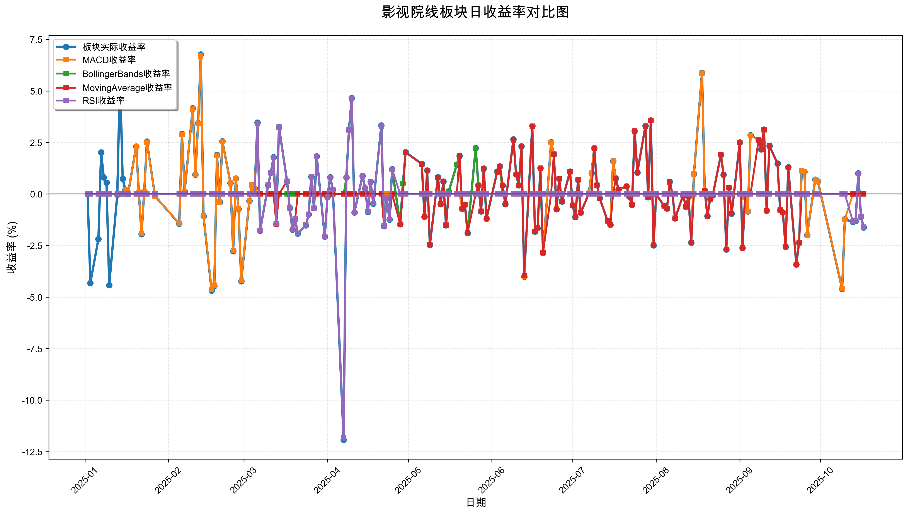
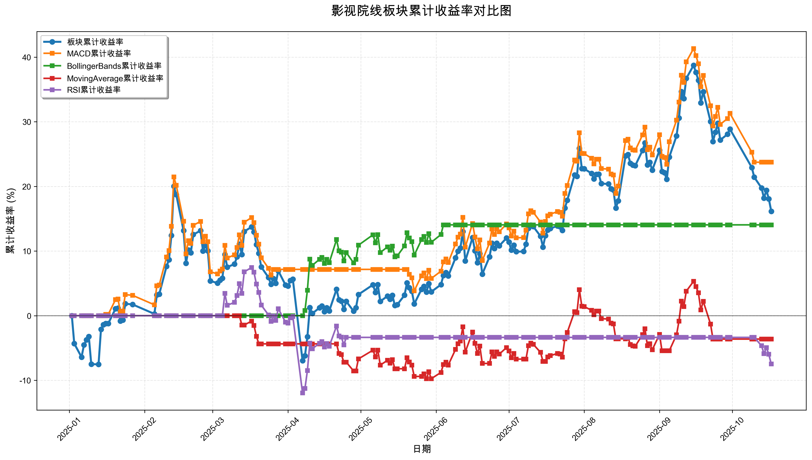

# 策略回测结果报告

**生成时间**: 2025-10-19 19:04:08
**行业板块**: 影视院线
**回测期间**: 20250101 至 20251017
**策略数量**: 4

## 📈 分析结论

### 策略表现分析
- **最佳策略**: MACD (总收益率: 23.74%)
- **最差策略**: RSI (总收益率: -7.48%)
### 交易活跃度分析
- **活跃策略**: 4 个
- **非活跃策略**: 0 个
- **最活跃策略**: MovingAverage (交易次数: 24)
### 🚨 异动提醒分析
- **板块异动**: 影视院线 近两周出现大幅波动 (最大单日: 4.61%)
- **策略异动**: MACD 近两周出现大幅波动 (最大单日: 4.59%)
- **策略异动**: MovingAverage 与板块走势相关性异常 (相关系数: 0.268)
### 风险分析
- **MACD**: 最大回撤 -14.50%, 夏普比率 1.2281
- **BollingerBands**: 最大回撤 -3.23%, 夏普比率 1.7153
- **MovingAverage**: 最大回撤 -9.77%, 夏普比率 -0.2592
- **RSI**: 最大回撤 -18.05%, 夏普比率 -0.5329

## 📊 综合结果表

| 策略名称           | 初始资金     | 最终价值     | 总收益率   | 年化收益率   | 波动率    |    夏普比率 | 最大回撤    | 总交易次数   | 买入次数   | 卖出次数   | 总交易金额      | 平均交易金额   | 交易频率   |   数据点数 |
|:---------------|:---------|:---------|:-------|:--------|:-------|--------:|:--------|:--------|:-------|:-------|:-----------|:---------|:-------|-------:|
| 板块实际表现         | ¥100,000 | ¥116,152 | 16.15% | 21.97%  | 33.88% |  0.6485 | -22.46% | N/A     | N/A    | N/A    | N/A        | N/A      | N/A    |    190 |
| MACD           | ¥100,000 | ¥123,744 | 23.74% | 32.65%  | 26.59% |  1.2281 | -14.50% | 4       | 2      | 2      | ¥434,720   | ¥108,680 | 0.02   |    190 |
| BollingerBands | ¥100,000 | ¥114,047 | 14.05% | 19.04%  | 11.10% |  1.7153 | -3.23%  | 2       | 1      | 1      | ¥212,525   | ¥106,263 | 0.01   |    190 |
| MovingAverage  | ¥100,000 | ¥96,380  | -3.62% | -4.77%  | 18.41% | -0.2592 | -9.77%  | 24      | 12     | 12     | ¥2,245,376 | ¥93,557  | 0.13   |    190 |
| RSI            | ¥100,000 | ¥92,516  | -7.48% | -9.80%  | 18.39% | -0.5329 | -18.05% | 3       | 2      | 1      | ¥290,277   | ¥96,759  | 0.02   |    190 |

## 📊 每日收益率走势图

*图1: 影视院线板块每日收益率走势对比*

## 📈 累计收益率走势图

*图2: 影视院线板块累计收益率走势对比*

## 📅 日收益明细表

| 日期         | 板块实际收益率   | MACD收益率   | BollingerBands收益率   | MovingAverage收益率   | RSI收益率   |
|:-----------|:----------|:----------|:--------------------|:-------------------|:---------|
| 2025-01-02 | 0.00%     | 0.00%     | 0.00%               | 0.00%              | 0.00%    |
| 2025-01-03 | -4.32%    | 0.00%     | 0.00%               | 0.00%              | 0.00%    |
| 2025-01-06 | -2.18%    | 0.00%     | 0.00%               | 0.00%              | 0.00%    |
| 2025-01-07 | 2.02%     | 0.00%     | 0.00%               | 0.00%              | 0.00%    |
| 2025-01-08 | 0.81%     | 0.00%     | 0.00%               | 0.00%              | 0.00%    |
| 2025-01-09 | 0.55%     | 0.00%     | 0.00%               | 0.00%              | 0.00%    |
| 2025-01-10 | -4.42%    | 0.00%     | 0.00%               | 0.00%              | 0.00%    |
| 2025-01-13 | -0.04%    | 0.00%     | 0.00%               | 0.00%              | 0.00%    |
| 2025-01-14 | 5.85%     | 0.00%     | 0.00%               | 0.00%              | 0.00%    |
| 2025-01-15 | 0.74%     | 0.00%     | 0.00%               | 0.00%              | 0.00%    |
| 2025-01-16 | 0.20%     | 0.20%     | 0.00%               | 0.00%              | 0.00%    |
| 2025-01-17 | 0.00%     | 0.00%     | 0.00%               | 0.00%              | 0.00%    |
| 2025-01-20 | 2.31%     | 2.29%     | 0.00%               | 0.00%              | 0.00%    |
| 2025-01-21 | 0.09%     | 0.09%     | 0.00%               | 0.00%              | 0.00%    |
| 2025-01-22 | -1.95%    | -1.93%    | 0.00%               | 0.00%              | 0.00%    |
| 2025-01-23 | 0.13%     | 0.12%     | 0.00%               | 0.00%              | 0.00%    |
| 2025-01-24 | 2.55%     | 2.52%     | 0.00%               | 0.00%              | 0.00%    |
| 2025-01-27 | -0.10%    | -0.10%    | 0.00%               | 0.00%              | 0.00%    |
| 2025-02-05 | -1.44%    | -1.43%    | 0.00%               | 0.00%              | 0.00%    |
| 2025-02-06 | 2.92%     | 2.89%     | 0.00%               | 0.00%              | 0.00%    |
| 2025-02-07 | 0.13%     | 0.12%     | 0.00%               | 0.00%              | 0.00%    |
| 2025-02-10 | 4.16%     | 4.12%     | 0.00%               | 0.00%              | 0.00%    |
| 2025-02-11 | 0.94%     | 0.93%     | 0.00%               | 0.00%              | 0.00%    |
| 2025-02-12 | 3.45%     | 3.41%     | 0.00%               | 0.00%              | 0.00%    |
| 2025-02-13 | 6.77%     | 6.70%     | 0.00%               | 0.00%              | 0.00%    |
| 2025-02-14 | -1.07%    | -1.06%    | 0.00%               | 0.00%              | 0.00%    |
| 2025-02-17 | -4.69%    | -4.64%    | 0.00%               | 0.00%              | 0.00%    |
| 2025-02-18 | -4.46%    | -4.42%    | 0.00%               | 0.00%              | 0.00%    |
| 2025-02-19 | 1.90%     | 1.88%     | 0.00%               | 0.00%              | 0.00%    |
| 2025-02-20 | -0.39%    | -0.39%    | 0.00%               | 0.00%              | 0.00%    |
| 2025-02-21 | 2.56%     | 2.54%     | 0.00%               | 0.00%              | 0.00%    |
| 2025-02-24 | 0.53%     | 0.53%     | 0.00%               | 0.00%              | 0.00%    |
| 2025-02-25 | -2.77%    | -2.74%    | 0.00%               | 0.00%              | 0.00%    |
| 2025-02-26 | 0.75%     | 0.74%     | 0.00%               | 0.00%              | 0.00%    |
| 2025-02-27 | -0.73%    | -0.72%    | 0.00%               | 0.00%              | 0.00%    |
| 2025-02-28 | -4.23%    | -4.18%    | 0.00%               | 0.00%              | 0.00%    |
| 2025-03-03 | -0.33%    | -0.32%    | 0.00%               | 0.00%              | 0.00%    |
| 2025-03-04 | 0.44%     | 0.44%     | 0.00%               | 0.00%              | 0.00%    |
| 2025-03-05 | 0.27%     | 0.27%     | 0.00%               | 0.00%              | 0.00%    |
| 2025-03-06 | 3.47%     | 3.43%     | 0.00%               | 0.00%              | 3.44%    |
| 2025-03-07 | -1.78%    | -1.76%    | 0.00%               | 0.00%              | -1.77%   |
| 2025-03-10 | 0.44%     | 0.44%     | 0.00%               | 0.00%              | 0.44%    |
| 2025-03-11 | 1.04%     | 1.03%     | 0.00%               | 0.00%              | 1.03%    |
| 2025-03-12 | 1.79%     | 1.77%     | 0.00%               | 0.00%              | 1.78%    |
| 2025-03-13 | -1.45%    | -1.43%    | 0.00%               | -1.45%             | -1.44%   |
| 2025-03-14 | 3.26%     | 3.22%     | 0.00%               | 0.00%              | 3.24%    |
| 2025-03-17 | 0.62%     | 0.62%     | 0.00%               | 0.62%              | 0.62%    |
| 2025-03-18 | -0.68%    | -0.67%    | 0.00%               | -0.67%             | -0.67%   |
| 2025-03-19 | -1.73%    | -1.72%    | 0.00%               | -1.71%             | -1.72%   |
| 2025-03-20 | -1.22%    | -1.21%    | 0.00%               | -1.21%             | -1.21%   |
| 2025-03-21 | -1.92%    | -1.90%    | 0.00%               | 0.00%              | -1.91%   |
| 2025-03-24 | -1.52%    | -1.50%    | 0.00%               | 0.00%              | -1.51%   |
| 2025-03-25 | -0.99%    | -0.98%    | 0.00%               | 0.00%              | -0.98%   |
| 2025-03-26 | 0.84%     | 0.83%     | 0.00%               | 0.00%              | 0.84%    |
| 2025-03-27 | -0.68%    | 0.00%     | 0.00%               | 0.00%              | -0.68%   |
| 2025-03-28 | 1.83%     | 0.00%     | 0.00%               | 0.00%              | 1.82%    |
| 2025-03-31 | -2.07%    | 0.00%     | 0.00%               | 0.00%              | -2.06%   |
| 2025-04-01 | -0.14%    | 0.00%     | 0.00%               | 0.00%              | -0.14%   |
| 2025-04-02 | 0.82%     | 0.00%     | 0.00%               | 0.00%              | 0.81%    |
| 2025-04-03 | 0.21%     | 0.00%     | 0.00%               | 0.00%              | 0.21%    |
| 2025-04-07 | -11.93%   | 0.00%     | 0.00%               | 0.00%              | -11.84%  |
| 2025-04-08 | 0.81%     | 0.00%     | 0.80%               | 0.00%              | 0.80%    |
| 2025-04-09 | 3.14%     | 0.00%     | 3.11%               | 0.00%              | 3.11%    |
| 2025-04-10 | 4.66%     | 0.00%     | 4.62%               | 0.00%              | 4.62%    |
| 2025-04-11 | -0.89%    | 0.00%     | -0.89%              | 0.00%              | -0.89%   |
| 2025-04-14 | 0.88%     | 0.00%     | 0.87%               | 0.00%              | 0.87%    |
| 2025-04-15 | 0.28%     | 0.00%     | 0.27%               | 0.00%              | 0.27%    |
| 2025-04-16 | -0.87%    | 0.00%     | -0.86%              | 0.00%              | -0.86%   |
| 2025-04-17 | 0.59%     | 0.00%     | 0.58%               | 0.00%              | 0.58%    |
| 2025-04-18 | -0.47%    | 0.00%     | -0.47%              | 0.00%              | -0.46%   |
| 2025-04-21 | 3.33%     | 0.00%     | 3.31%               | 0.00%              | 3.30%    |
| 2025-04-22 | -1.56%    | 0.00%     | -1.55%              | -1.55%             | -1.55%   |
| 2025-04-23 | -0.20%    | 0.00%     | -0.20%              | -0.20%             | -0.20%   |
| 2025-04-24 | -1.24%    | 0.00%     | -1.23%              | -1.23%             | -1.23%   |
| 2025-04-25 | 1.21%     | 0.00%     | 1.20%               | 0.00%              | 1.20%    |
| 2025-04-28 | -1.47%    | 0.00%     | -1.46%              | -1.46%             | 0.00%    |
| 2025-04-29 | 0.51%     | 0.00%     | 0.50%               | 0.00%              | 0.00%    |
| 2025-04-30 | 2.03%     | 0.00%     | 2.02%               | 2.02%              | 0.00%    |
| 2025-05-06 | 1.46%     | 0.00%     | 1.45%               | 1.45%              | 0.00%    |
| 2025-05-07 | -1.11%    | 0.00%     | -1.10%              | -1.11%             | 0.00%    |
| 2025-05-08 | 1.14%     | 0.00%     | 1.13%               | 1.13%              | 0.00%    |
| 2025-05-09 | -2.47%    | 0.00%     | -2.45%              | -2.46%             | 0.00%    |
| 2025-05-12 | 0.82%     | 0.00%     | 0.81%               | 0.81%              | 0.00%    |
| 2025-05-13 | -0.49%    | 0.00%     | -0.48%              | -0.48%             | 0.00%    |
| 2025-05-14 | 0.60%     | 0.00%     | 0.59%               | 0.59%              | 0.00%    |
| 2025-05-15 | -1.52%    | 0.00%     | -1.51%              | -1.51%             | 0.00%    |
| 2025-05-16 | 0.13%     | 0.00%     | 0.12%               | 0.00%              | 0.00%    |
| 2025-05-19 | 1.43%     | 0.00%     | 1.42%               | 0.00%              | 0.00%    |
| 2025-05-20 | 1.85%     | 0.00%     | 1.84%               | 1.85%              | 0.00%    |
| 2025-05-21 | -0.72%    | -0.72%    | -0.72%              | -0.72%             | 0.00%    |
| 2025-05-22 | -0.51%    | -0.51%    | -0.51%              | -0.51%             | 0.00%    |
| 2025-05-23 | -1.90%    | -1.89%    | -1.89%              | -1.89%             | 0.00%    |
| 2025-05-26 | 2.23%     | 2.22%     | 2.21%               | 0.00%              | 0.00%    |
| 2025-05-27 | 0.43%     | 0.43%     | 0.43%               | 0.43%              | 0.00%    |
| 2025-05-28 | -0.84%    | -0.84%    | -0.84%              | -0.83%             | 0.00%    |
| 2025-05-29 | 1.24%     | 1.23%     | 1.23%               | 1.22%              | 0.00%    |
| 2025-05-30 | -1.20%    | -1.19%    | -1.19%              | -1.18%             | 0.00%    |
| 2025-06-03 | 1.09%     | 1.08%     | 1.08%               | 1.07%              | 0.00%    |
| 2025-06-04 | 1.34%     | 1.34%     | 1.33%               | 1.33%              | 0.00%    |
| 2025-06-05 | 0.42%     | 0.41%     | 0.00%               | 0.41%              | 0.00%    |
| 2025-06-06 | -0.49%    | -0.48%    | 0.00%               | -0.48%             | 0.00%    |
| 2025-06-09 | 2.65%     | 2.63%     | 0.00%               | 2.62%              | 0.00%    |
| 2025-06-10 | 0.95%     | 0.94%     | 0.00%               | 0.94%              | 0.00%    |
| 2025-06-11 | 0.43%     | 0.42%     | 0.00%               | 0.42%              | 0.00%    |
| 2025-06-12 | 2.32%     | 2.31%     | 0.00%               | 2.29%              | 0.00%    |
| 2025-06-13 | -4.01%    | -4.00%    | 0.00%               | -3.97%             | 0.00%    |
| 2025-06-16 | 3.31%     | 3.30%     | 0.00%               | 3.28%              | 0.00%    |
| 2025-06-17 | -1.82%    | -1.82%    | 0.00%               | -1.81%             | 0.00%    |
| 2025-06-18 | -1.66%    | -1.65%    | 0.00%               | -1.64%             | 0.00%    |
| 2025-06-19 | 1.26%     | 1.26%     | 0.00%               | 1.25%              | 0.00%    |
| 2025-06-20 | -2.86%    | -2.85%    | 0.00%               | -2.84%             | 0.00%    |
| 2025-06-23 | 2.52%     | 2.51%     | 0.00%               | 0.00%              | 0.00%    |
| 2025-06-24 | 1.94%     | 1.93%     | 0.00%               | 1.94%              | 0.00%    |
| 2025-06-25 | -0.74%    | -0.73%    | 0.00%               | -0.74%             | 0.00%    |
| 2025-06-26 | 0.74%     | 0.73%     | 0.00%               | 0.74%              | 0.00%    |
| 2025-06-27 | -0.37%    | -0.37%    | 0.00%               | -0.37%             | 0.00%    |
| 2025-06-30 | 1.09%     | 1.08%     | 0.00%               | 1.09%              | 0.00%    |
| 2025-07-01 | -0.55%    | -0.55%    | 0.00%               | -0.55%             | 0.00%    |
| 2025-07-02 | -1.12%    | -1.11%    | 0.00%               | -1.12%             | 0.00%    |
| 2025-07-03 | 0.69%     | 0.69%     | 0.00%               | 0.69%              | 0.00%    |
| 2025-07-04 | -0.91%    | -0.91%    | 0.00%               | -0.91%             | 0.00%    |
| 2025-07-07 | 0.03%     | 0.03%     | 0.00%               | 0.00%              | 0.00%    |
| 2025-07-08 | 1.02%     | 1.02%     | 0.00%               | 0.00%              | 0.00%    |
| 2025-07-09 | 2.23%     | 2.22%     | 0.00%               | 2.22%              | 0.00%    |
| 2025-07-10 | 0.44%     | 0.43%     | 0.00%               | 0.43%              | 0.00%    |
| 2025-07-11 | -0.20%    | -0.20%    | 0.00%               | -0.20%             | 0.00%    |
| 2025-07-14 | -1.32%    | -1.31%    | 0.00%               | -1.31%             | 0.00%    |
| 2025-07-15 | -1.50%    | -1.49%    | 0.00%               | -1.49%             | 0.00%    |
| 2025-07-16 | 1.60%     | 1.60%     | 0.00%               | 0.00%              | 0.00%    |
| 2025-07-17 | 0.76%     | 0.75%     | 0.00%               | 0.75%              | 0.00%    |
| 2025-07-18 | 0.21%     | 0.21%     | 0.00%               | 0.21%              | 0.00%    |
| 2025-07-21 | 0.37%     | 0.37%     | 0.00%               | 0.37%              | 0.00%    |
| 2025-07-22 | -0.12%    | -0.12%    | 0.00%               | -0.12%             | 0.00%    |
| 2025-07-23 | -0.52%    | -0.51%    | 0.00%               | -0.51%             | 0.00%    |
| 2025-07-24 | 3.06%     | 3.05%     | 0.00%               | 3.05%              | 0.00%    |
| 2025-07-25 | 1.04%     | 1.04%     | 0.00%               | 1.04%              | 0.00%    |
| 2025-07-28 | 3.31%     | 3.29%     | 0.00%               | 3.29%              | 0.00%    |
| 2025-07-29 | -0.16%    | -0.16%    | 0.00%               | -0.16%             | 0.00%    |
| 2025-07-30 | 3.57%     | 3.56%     | 0.00%               | 3.56%              | 0.00%    |
| 2025-07-31 | -2.49%    | -2.49%    | 0.00%               | -2.48%             | 0.00%    |
| 2025-08-01 | -0.03%    | -0.03%    | 0.00%               | -0.03%             | 0.00%    |
| 2025-08-04 | -0.58%    | -0.58%    | 0.00%               | -0.58%             | 0.00%    |
| 2025-08-05 | -0.70%    | -0.70%    | 0.00%               | -0.70%             | 0.00%    |
| 2025-08-06 | 0.59%     | 0.58%     | 0.00%               | 0.58%              | 0.00%    |
| 2025-08-07 | 0.01%     | 0.01%     | 0.00%               | 0.01%              | 0.00%    |
| 2025-08-08 | -1.18%    | -1.17%    | 0.00%               | -1.17%             | 0.00%    |
| 2025-08-11 | -0.06%    | -0.06%    | 0.00%               | -0.06%             | 0.00%    |
| 2025-08-12 | -0.62%    | -0.62%    | 0.00%               | -0.62%             | 0.00%    |
| 2025-08-13 | -0.13%    | -0.13%    | 0.00%               | -0.13%             | 0.00%    |
| 2025-08-14 | -2.36%    | -2.35%    | 0.00%               | -2.35%             | 0.00%    |
| 2025-08-15 | 0.97%     | 0.97%     | 0.00%               | 0.00%              | 0.00%    |
| 2025-08-18 | 5.88%     | 5.86%     | 0.00%               | 0.00%              | 0.00%    |
| 2025-08-19 | 0.17%     | 0.17%     | 0.00%               | 0.17%              | 0.00%    |
| 2025-08-20 | -1.07%    | -1.07%    | 0.00%               | -1.07%             | 0.00%    |
| 2025-08-21 | -0.24%    | -0.24%    | 0.00%               | -0.24%             | 0.00%    |
| 2025-08-22 | -0.05%    | -0.05%    | 0.00%               | -0.05%             | 0.00%    |
| 2025-08-25 | 1.90%     | 1.90%     | 0.00%               | 1.90%              | 0.00%    |
| 2025-08-26 | 0.93%     | 0.93%     | 0.00%               | 0.93%              | 0.00%    |
| 2025-08-27 | -2.69%    | -2.68%    | 0.00%               | -2.69%             | 0.00%    |
| 2025-08-28 | 0.31%     | 0.31%     | 0.00%               | 0.31%              | 0.00%    |
| 2025-08-29 | -0.96%    | -0.96%    | 0.00%               | -0.96%             | 0.00%    |
| 2025-09-01 | 2.51%     | 2.50%     | 0.00%               | 2.50%              | 0.00%    |
| 2025-09-02 | -2.62%    | -2.61%    | 0.00%               | -2.62%             | 0.00%    |
| 2025-09-03 | -0.15%    | -0.14%    | 0.00%               | 0.00%              | 0.00%    |
| 2025-09-04 | -0.84%    | -0.84%    | 0.00%               | 0.00%              | 0.00%    |
| 2025-09-05 | 2.85%     | 2.84%     | 0.00%               | 0.00%              | 0.00%    |
| 2025-09-08 | 2.63%     | 2.62%     | 0.00%               | 2.62%              | 0.00%    |
| 2025-09-09 | 2.17%     | 2.16%     | 0.00%               | 2.17%              | 0.00%    |
| 2025-09-10 | 3.13%     | 3.11%     | 0.00%               | 3.12%              | 0.00%    |
| 2025-09-11 | -0.81%    | -0.81%    | 0.00%               | -0.81%             | 0.00%    |
| 2025-09-12 | 2.34%     | 2.33%     | 0.00%               | 2.34%              | 0.00%    |
| 2025-09-15 | 1.48%     | 1.47%     | 0.00%               | 1.47%              | 0.00%    |
| 2025-09-16 | -0.78%    | -0.77%    | 0.00%               | -0.78%             | 0.00%    |
| 2025-09-17 | -0.90%    | -0.90%    | 0.00%               | -0.90%             | 0.00%    |
| 2025-09-18 | -2.56%    | -2.55%    | 0.00%               | -2.56%             | 0.00%    |
| 2025-09-19 | 1.30%     | 1.29%     | 0.00%               | 1.29%              | 0.00%    |
| 2025-09-22 | -3.42%    | -3.41%    | 0.00%               | -3.42%             | 0.00%    |
| 2025-09-23 | -2.37%    | -2.36%    | 0.00%               | -2.36%             | 0.00%    |
| 2025-09-24 | 1.13%     | 1.12%     | 0.00%               | 0.00%              | 0.00%    |
| 2025-09-25 | 1.08%     | 1.08%     | 0.00%               | 0.00%              | 0.00%    |
| 2025-09-26 | -1.99%    | -1.99%    | 0.00%               | 0.00%              | 0.00%    |
| 2025-09-29 | 0.70%     | 0.69%     | 0.00%               | 0.00%              | 0.00%    |
| 2025-09-30 | 0.62%     | 0.62%     | 0.00%               | 0.00%              | 0.00%    |
| 2025-10-09 | -4.61%    | -4.59%    | 0.00%               | 0.00%              | 0.00%    |
| 2025-10-10 | -1.22%    | -1.22%    | 0.00%               | 0.00%              | 0.00%    |
| 2025-10-13 | -1.36%    | 0.00%     | 0.00%               | 0.00%              | -1.34%   |
| 2025-10-14 | -1.31%    | 0.00%     | 0.00%               | 0.00%              | -1.29%   |
| 2025-10-15 | 1.01%     | 0.00%     | 0.00%               | 0.00%              | 0.99%    |
| 2025-10-16 | -1.11%    | 0.00%     | 0.00%               | 0.00%              | -1.09%   |
| 2025-10-17 | -1.62%    | 0.00%     | 0.00%               | 0.00%              | -1.60%   |

## 📊 日收益统计摘要

| 指标                | 平均日收益率   | 最大日收益率   | 最小日收益率   | 正收益天数   | 负收益天数   |
|:------------------|:---------|:---------|:---------|:--------|:--------|
| 板块实际收益率           | 0.10%    | 6.77%    | -11.93%  | 99天     | 89天     |
| MACD收益率           | 0.13%    | 6.70%    | -4.64%   | 73天     | 66天     |
| BollingerBands收益率 | 0.07%    | 4.62%    | -2.45%   | 22天     | 16天     |
| MovingAverage收益率  | -0.01%   | 3.56%    | -3.97%   | 44天     | 54天     |
| RSI收益率            | -0.03%   | 4.62%    | -11.84%  | 19天     | 22天     |

## 📈 累计收益明细表

| 日期         | 板块累计收益率   | MACD累计收益率   | BollingerBands累计收益率   | MovingAverage累计收益率   | RSI累计收益率   |
|:-----------|:----------|:------------|:----------------------|:---------------------|:-----------|
| 2025-01-02 | 0.00%     | 0.00%       | 0.00%                 | 0.00%                | 0.00%      |
| 2025-01-03 | -4.32%    | 0.00%       | 0.00%                 | 0.00%                | 0.00%      |
| 2025-01-06 | -6.41%    | 0.00%       | 0.00%                 | 0.00%                | 0.00%      |
| 2025-01-07 | -4.52%    | 0.00%       | 0.00%                 | 0.00%                | 0.00%      |
| 2025-01-08 | -3.75%    | 0.00%       | 0.00%                 | 0.00%                | 0.00%      |
| 2025-01-09 | -3.22%    | 0.00%       | 0.00%                 | 0.00%                | 0.00%      |
| 2025-01-10 | -7.50%    | 0.00%       | 0.00%                 | 0.00%                | 0.00%      |
| 2025-01-13 | -7.53%    | 0.00%       | 0.00%                 | 0.00%                | 0.00%      |
| 2025-01-14 | -2.13%    | 0.00%       | 0.00%                 | 0.00%                | 0.00%      |
| 2025-01-15 | -1.40%    | 0.00%       | 0.00%                 | 0.00%                | 0.00%      |
| 2025-01-16 | -1.21%    | 0.20%       | 0.00%                 | 0.00%                | 0.00%      |
| 2025-01-17 | -1.21%    | 0.20%       | 0.00%                 | 0.00%                | 0.00%      |
| 2025-01-20 | 1.08%     | 2.49%       | 0.00%                 | 0.00%                | 0.00%      |
| 2025-01-21 | 1.17%     | 2.58%       | 0.00%                 | 0.00%                | 0.00%      |
| 2025-01-22 | -0.81%    | 0.60%       | 0.00%                 | 0.00%                | 0.00%      |
| 2025-01-23 | -0.68%    | 0.72%       | 0.00%                 | 0.00%                | 0.00%      |
| 2025-01-24 | 1.85%     | 3.26%       | 0.00%                 | 0.00%                | 0.00%      |
| 2025-01-27 | 1.74%     | 3.15%       | 0.00%                 | 0.00%                | 0.00%      |
| 2025-02-05 | 0.27%     | 1.68%       | 0.00%                 | 0.00%                | 0.00%      |
| 2025-02-06 | 3.21%     | 4.62%       | 0.00%                 | 0.00%                | 0.00%      |
| 2025-02-07 | 3.34%     | 4.75%       | 0.00%                 | 0.00%                | 0.00%      |
| 2025-02-10 | 7.64%     | 9.06%       | 0.00%                 | 0.00%                | 0.00%      |
| 2025-02-11 | 8.65%     | 10.08%      | 0.00%                 | 0.00%                | 0.00%      |
| 2025-02-12 | 12.40%    | 13.84%      | 0.00%                 | 0.00%                | 0.00%      |
| 2025-02-13 | 20.01%    | 21.46%      | 0.00%                 | 0.00%                | 0.00%      |
| 2025-02-14 | 18.73%    | 20.18%      | 0.00%                 | 0.00%                | 0.00%      |
| 2025-02-17 | 13.16%    | 14.60%      | 0.00%                 | 0.00%                | 0.00%      |
| 2025-02-18 | 8.11%     | 9.54%       | 0.00%                 | 0.00%                | 0.00%      |
| 2025-02-19 | 10.17%    | 11.60%      | 0.00%                 | 0.00%                | 0.00%      |
| 2025-02-20 | 9.74%     | 11.17%      | 0.00%                 | 0.00%                | 0.00%      |
| 2025-02-21 | 12.55%    | 13.98%      | 0.00%                 | 0.00%                | 0.00%      |
| 2025-02-24 | 13.15%    | 14.58%      | 0.00%                 | 0.00%                | 0.00%      |
| 2025-02-25 | 10.02%    | 11.45%      | 0.00%                 | 0.00%                | 0.00%      |
| 2025-02-26 | 10.84%    | 12.28%      | 0.00%                 | 0.00%                | 0.00%      |
| 2025-02-27 | 10.03%    | 11.46%      | 0.00%                 | 0.00%                | 0.00%      |
| 2025-02-28 | 5.38%     | 6.80%       | 0.00%                 | 0.00%                | 0.00%      |
| 2025-03-03 | 5.04%     | 6.46%       | 0.00%                 | 0.00%                | 0.00%      |
| 2025-03-04 | 5.50%     | 6.92%       | 0.00%                 | 0.00%                | 0.00%      |
| 2025-03-05 | 5.79%     | 7.21%       | 0.00%                 | 0.00%                | 0.00%      |
| 2025-03-06 | 9.46%     | 10.89%      | 0.00%                 | 0.00%                | 3.44%      |
| 2025-03-07 | 7.51%     | 8.93%       | 0.00%                 | 0.00%                | 1.61%      |
| 2025-03-10 | 7.99%     | 9.41%       | 0.00%                 | 0.00%                | 2.06%      |
| 2025-03-11 | 9.11%     | 10.54%      | 0.00%                 | 0.00%                | 3.11%      |
| 2025-03-12 | 11.06%    | 12.50%      | 0.00%                 | 0.00%                | 4.95%      |
| 2025-03-13 | 9.46%     | 10.89%      | 0.00%                 | -1.45%               | 3.44%      |
| 2025-03-14 | 13.02%    | 14.46%      | 0.00%                 | -1.45%               | 6.78%      |
| 2025-03-17 | 13.73%    | 15.17%      | 0.00%                 | -0.84%               | 7.45%      |
| 2025-03-18 | 12.96%    | 14.39%      | 0.00%                 | -1.50%               | 6.72%      |
| 2025-03-19 | 11.00%    | 12.43%      | 0.00%                 | -3.19%               | 4.88%      |
| 2025-03-20 | 9.64%     | 11.07%      | 0.00%                 | -4.36%               | 3.61%      |
| 2025-03-21 | 7.53%     | 8.96%       | 0.00%                 | -4.36%               | 1.64%      |
| 2025-03-24 | 5.90%     | 7.32%       | 0.00%                 | -4.36%               | 0.10%      |
| 2025-03-25 | 4.86%     | 6.28%       | 0.00%                 | -4.36%               | -0.88%     |
| 2025-03-26 | 5.74%     | 7.16%       | 0.00%                 | -4.36%               | -0.05%     |
| 2025-03-27 | 5.02%     | 7.16%       | 0.00%                 | -4.36%               | -0.72%     |
| 2025-03-28 | 6.95%     | 7.16%       | 0.00%                 | -4.36%               | 1.08%      |
| 2025-03-31 | 4.73%     | 7.16%       | 0.00%                 | -4.36%               | -1.00%     |
| 2025-04-01 | 4.58%     | 7.16%       | 0.00%                 | -4.36%               | -1.14%     |
| 2025-04-02 | 5.43%     | 7.16%       | 0.00%                 | -4.36%               | -0.34%     |
| 2025-04-03 | 5.65%     | 7.16%       | 0.00%                 | -4.36%               | -0.13%     |
| 2025-04-07 | -6.95%    | 7.16%       | 0.00%                 | -4.36%               | -11.95%    |
| 2025-04-08 | -6.20%    | 7.16%       | 0.80%                 | -4.36%               | -11.25%    |
| 2025-04-09 | -3.26%    | 7.16%       | 3.94%                 | -4.36%               | -8.49%     |
| 2025-04-10 | 1.25%     | 7.16%       | 8.74%                 | -4.36%               | -4.26%     |
| 2025-04-11 | 0.34%     | 7.16%       | 7.78%                 | -4.36%               | -5.11%     |
| 2025-04-14 | 1.22%     | 7.16%       | 8.72%                 | -4.36%               | -4.28%     |
| 2025-04-15 | 1.50%     | 7.16%       | 9.01%                 | -4.36%               | -4.02%     |
| 2025-04-16 | 0.62%     | 7.16%       | 8.07%                 | -4.36%               | -4.85%     |
| 2025-04-17 | 1.21%     | 7.16%       | 8.70%                 | -4.36%               | -4.30%     |
| 2025-04-18 | 0.74%     | 7.16%       | 8.20%                 | -4.36%               | -4.74%     |
| 2025-04-21 | 4.09%     | 7.16%       | 11.77%                | -4.36%               | -1.60%     |
| 2025-04-22 | 2.46%     | 7.16%       | 10.03%                | -5.84%               | -3.13%     |
| 2025-04-23 | 2.25%     | 7.16%       | 9.81%                 | -6.03%               | -3.32%     |
| 2025-04-24 | 0.99%     | 7.16%       | 8.46%                 | -7.19%               | -4.51%     |
| 2025-04-25 | 2.21%     | 7.16%       | 9.77%                 | -7.19%               | -3.36%     |
| 2025-04-28 | 0.71%     | 7.16%       | 8.17%                 | -8.54%               | -3.36%     |
| 2025-04-29 | 1.22%     | 7.16%       | 8.71%                 | -8.54%               | -3.36%     |
| 2025-04-30 | 3.27%     | 7.16%       | 10.90%                | -6.69%               | -3.36%     |
| 2025-05-06 | 4.78%     | 7.16%       | 12.51%                | -5.34%               | -3.36%     |
| 2025-05-07 | 3.61%     | 7.16%       | 11.27%                | -6.38%               | -3.36%     |
| 2025-05-08 | 4.79%     | 7.16%       | 12.52%                | -5.32%               | -3.36%     |
| 2025-05-09 | 2.21%     | 7.16%       | 9.76%                 | -7.65%               | -3.36%     |
| 2025-05-12 | 3.04%     | 7.16%       | 10.65%                | -6.90%               | -3.36%     |
| 2025-05-13 | 2.54%     | 7.16%       | 10.12%                | -7.35%               | -3.36%     |
| 2025-05-14 | 3.15%     | 7.16%       | 10.77%                | -6.80%               | -3.36%     |
| 2025-05-15 | 1.58%     | 7.16%       | 9.10%                 | -8.21%               | -3.36%     |
| 2025-05-16 | 1.71%     | 7.16%       | 9.24%                 | -8.21%               | -3.36%     |
| 2025-05-19 | 3.17%     | 7.16%       | 10.79%                | -8.21%               | -3.36%     |
| 2025-05-20 | 5.08%     | 7.16%       | 12.83%                | -6.51%               | -3.36%     |
| 2025-05-21 | 4.32%     | 6.40%       | 12.02%                | -7.18%               | -3.36%     |
| 2025-05-22 | 3.79%     | 5.86%       | 11.46%                | -7.66%               | -3.36%     |
| 2025-05-23 | 1.82%     | 3.85%       | 9.36%                 | -9.40%               | -3.36%     |
| 2025-05-26 | 4.09%     | 6.16%       | 11.77%                | -9.40%               | -3.36%     |
| 2025-05-27 | 4.54%     | 6.62%       | 12.26%                | -9.01%               | -3.36%     |
| 2025-05-28 | 3.66%     | 5.72%       | 11.32%                | -9.77%               | -3.36%     |
| 2025-05-29 | 4.94%     | 7.02%       | 12.68%                | -8.67%               | -3.36%     |
| 2025-05-30 | 3.69%     | 5.75%       | 11.35%                | -9.75%               | -3.36%     |
| 2025-06-03 | 4.81%     | 6.89%       | 12.55%                | -8.78%               | -3.36%     |
| 2025-06-04 | 6.22%     | 8.32%       | 14.05%                | -7.57%               | -3.36%     |
| 2025-06-05 | 6.66%     | 8.77%       | 14.05%                | -7.19%               | -3.36%     |
| 2025-06-06 | 6.14%     | 8.24%       | 14.05%                | -7.64%               | -3.36%     |
| 2025-06-09 | 8.95%     | 11.09%      | 14.05%                | -5.22%               | -3.36%     |
| 2025-06-10 | 9.98%     | 12.14%      | 14.05%                | -4.33%               | -3.36%     |
| 2025-06-11 | 10.45%    | 12.61%      | 14.05%                | -3.93%               | -3.36%     |
| 2025-06-12 | 13.01%    | 15.21%      | 14.05%                | -1.72%               | -3.36%     |
| 2025-06-13 | 8.47%     | 10.61%      | 14.05%                | -5.63%               | -3.36%     |
| 2025-06-16 | 12.07%    | 14.26%      | 14.05%                | -2.53%               | -3.36%     |
| 2025-06-17 | 10.03%    | 12.18%      | 14.05%                | -4.29%               | -3.36%     |
| 2025-06-18 | 8.20%     | 10.33%      | 14.05%                | -5.86%               | -3.36%     |
| 2025-06-19 | 9.57%     | 11.72%      | 14.05%                | -4.69%               | -3.36%     |
| 2025-06-20 | 6.43%     | 8.53%       | 14.05%                | -7.39%               | -3.36%     |
| 2025-06-23 | 9.11%     | 11.25%      | 14.05%                | -7.39%               | -3.36%     |
| 2025-06-24 | 11.22%    | 13.40%      | 14.05%                | -5.60%               | -3.36%     |
| 2025-06-25 | 10.40%    | 12.57%      | 14.05%                | -6.29%               | -3.36%     |
| 2025-06-26 | 11.22%    | 13.39%      | 14.05%                | -5.60%               | -3.36%     |
| 2025-06-27 | 10.81%    | 12.98%      | 14.05%                | -5.95%               | -3.36%     |
| 2025-06-30 | 12.01%    | 14.20%      | 14.05%                | -4.93%               | -3.36%     |
| 2025-07-01 | 11.39%    | 13.57%      | 14.05%                | -5.45%               | -3.36%     |
| 2025-07-02 | 10.15%    | 12.31%      | 14.05%                | -6.51%               | -3.36%     |
| 2025-07-03 | 10.91%    | 13.08%      | 14.05%                | -5.86%               | -3.36%     |
| 2025-07-04 | 9.90%     | 12.05%      | 14.05%                | -6.72%               | -3.36%     |
| 2025-07-07 | 9.93%     | 12.08%      | 14.05%                | -6.72%               | -3.36%     |
| 2025-07-08 | 11.05%    | 13.22%      | 14.05%                | -6.72%               | -3.36%     |
| 2025-07-09 | 13.53%    | 15.74%      | 14.05%                | -4.65%               | -3.36%     |
| 2025-07-10 | 14.02%    | 16.24%      | 14.05%                | -4.24%               | -3.36%     |
| 2025-07-11 | 13.79%    | 16.00%      | 14.05%                | -4.43%               | -3.36%     |
| 2025-07-14 | 12.29%    | 14.48%      | 14.05%                | -5.68%               | -3.36%     |
| 2025-07-15 | 10.61%    | 12.78%      | 14.05%                | -7.08%               | -3.36%     |
| 2025-07-16 | 12.39%    | 14.58%      | 14.05%                | -7.08%               | -3.36%     |
| 2025-07-17 | 13.24%    | 15.44%      | 14.05%                | -6.39%               | -3.36%     |
| 2025-07-18 | 13.48%    | 15.69%      | 14.05%                | -6.19%               | -3.36%     |
| 2025-07-21 | 13.90%    | 16.11%      | 14.05%                | -5.84%               | -3.36%     |
| 2025-07-22 | 13.76%    | 15.98%      | 14.05%                | -5.95%               | -3.36%     |
| 2025-07-23 | 13.18%    | 15.38%      | 14.05%                | -6.43%               | -3.36%     |
| 2025-07-24 | 16.64%    | 18.90%      | 14.05%                | -3.58%               | -3.36%     |
| 2025-07-25 | 17.86%    | 20.13%      | 14.05%                | -2.59%               | -3.36%     |
| 2025-07-28 | 21.76%    | 24.09%      | 14.05%                | 0.62%                | -3.36%     |
| 2025-07-29 | 21.56%    | 23.89%      | 14.05%                | 0.46%                | -3.36%     |
| 2025-07-30 | 25.90%    | 28.30%      | 14.05%                | 4.03%                | -3.36%     |
| 2025-07-31 | 22.76%    | 25.11%      | 14.05%                | 1.45%                | -3.36%     |
| 2025-08-01 | 22.72%    | 25.07%      | 14.05%                | 1.41%                | -3.36%     |
| 2025-08-04 | 22.01%    | 24.35%      | 14.05%                | 0.83%                | -3.36%     |
| 2025-08-05 | 21.16%    | 23.48%      | 14.05%                | 0.13%                | -3.36%     |
| 2025-08-06 | 21.87%    | 24.20%      | 14.05%                | 0.71%                | -3.36%     |
| 2025-08-07 | 21.88%    | 24.21%      | 14.05%                | 0.72%                | -3.36%     |
| 2025-08-08 | 20.44%    | 22.75%      | 14.05%                | -0.46%               | -3.36%     |
| 2025-08-11 | 20.37%    | 22.68%      | 14.05%                | -0.52%               | -3.36%     |
| 2025-08-12 | 19.62%    | 21.92%      | 14.05%                | -1.14%               | -3.36%     |
| 2025-08-13 | 19.46%    | 21.76%      | 14.05%                | -1.27%               | -3.36%     |
| 2025-08-14 | 16.65%    | 18.90%      | 14.05%                | -3.58%               | -3.36%     |
| 2025-08-15 | 17.78%    | 20.05%      | 14.05%                | -3.58%               | -3.36%     |
| 2025-08-18 | 24.71%    | 27.09%      | 14.05%                | -3.58%               | -3.36%     |
| 2025-08-19 | 24.92%    | 27.30%      | 14.05%                | -3.42%               | -3.36%     |
| 2025-08-20 | 23.58%    | 25.94%      | 14.05%                | -4.45%               | -3.36%     |
| 2025-08-21 | 23.29%    | 25.64%      | 14.05%                | -4.68%               | -3.36%     |
| 2025-08-22 | 23.22%    | 25.58%      | 14.05%                | -4.73%               | -3.36%     |
| 2025-08-25 | 25.57%    | 27.96%      | 14.05%                | -2.92%               | -3.36%     |
| 2025-08-26 | 26.74%    | 29.15%      | 14.05%                | -2.02%               | -3.36%     |
| 2025-08-27 | 23.32%    | 25.68%      | 14.05%                | -4.65%               | -3.36%     |
| 2025-08-28 | 23.71%    | 26.07%      | 14.05%                | -4.35%               | -3.36%     |
| 2025-08-29 | 22.52%    | 24.86%      | 14.05%                | -5.27%               | -3.36%     |
| 2025-09-01 | 25.59%    | 27.98%      | 14.05%                | -2.90%               | -3.36%     |
| 2025-09-02 | 22.30%    | 24.64%      | 14.05%                | -5.44%               | -3.36%     |
| 2025-09-03 | 22.12%    | 24.46%      | 14.05%                | -5.44%               | -3.36%     |
| 2025-09-04 | 21.09%    | 23.41%      | 14.05%                | -5.44%               | -3.36%     |
| 2025-09-05 | 24.54%    | 26.92%      | 14.05%                | -5.44%               | -3.36%     |
| 2025-09-08 | 27.81%    | 30.24%      | 14.05%                | -2.96%               | -3.36%     |
| 2025-09-09 | 30.59%    | 33.06%      | 14.05%                | -0.86%               | -3.36%     |
| 2025-09-10 | 34.67%    | 37.20%      | 14.05%                | 2.24%                | -3.36%     |
| 2025-09-11 | 33.58%    | 36.09%      | 14.05%                | 1.41%                | -3.36%     |
| 2025-09-12 | 36.70%    | 39.26%      | 14.05%                | 3.78%                | -3.36%     |
| 2025-09-15 | 38.72%    | 41.31%      | 14.05%                | 5.31%                | -3.36%     |
| 2025-09-16 | 37.65%    | 40.22%      | 14.05%                | 4.49%                | -3.36%     |
| 2025-09-17 | 36.41%    | 38.96%      | 14.05%                | 3.55%                | -3.36%     |
| 2025-09-18 | 32.91%    | 35.41%      | 14.05%                | 0.90%                | -3.36%     |
| 2025-09-19 | 34.63%    | 37.16%      | 14.05%                | 2.21%                | -3.36%     |
| 2025-09-22 | 30.03%    | 32.48%      | 14.05%                | -1.29%               | -3.36%     |
| 2025-09-23 | 26.95%    | 29.36%      | 14.05%                | -3.62%               | -3.36%     |
| 2025-09-24 | 28.38%    | 30.81%      | 14.05%                | -3.62%               | -3.36%     |
| 2025-09-25 | 29.77%    | 32.23%      | 14.05%                | -3.62%               | -3.36%     |
| 2025-09-26 | 27.18%    | 29.60%      | 14.05%                | -3.62%               | -3.36%     |
| 2025-09-29 | 28.07%    | 30.50%      | 14.05%                | -3.62%               | -3.36%     |
| 2025-09-30 | 28.86%    | 31.30%      | 14.05%                | -3.62%               | -3.36%     |
| 2025-10-09 | 22.92%    | 25.27%      | 14.05%                | -3.62%               | -3.36%     |
| 2025-10-10 | 21.42%    | 23.74%      | 14.05%                | -3.62%               | -3.36%     |
| 2025-10-13 | 19.76%    | 23.74%      | 14.05%                | -3.62%               | -4.65%     |
| 2025-10-14 | 18.20%    | 23.74%      | 14.05%                | -3.62%               | -5.88%     |
| 2025-10-15 | 19.39%    | 23.74%      | 14.05%                | -3.62%               | -4.94%     |
| 2025-10-16 | 18.07%    | 23.74%      | 14.05%                | -3.62%               | -5.98%     |
| 2025-10-17 | 16.15%    | 23.74%      | 14.05%                | -3.62%               | -7.48%     |

## 📊 累计收益统计摘要

| 指标                  | 最终累计收益率   | 最大累计收益率   | 最小累计收益率   | 累计收益波动   | 收益稳定性   |
|:--------------------|:----------|:----------|:----------|:---------|:--------|
| 板块累计收益率             | 16.15%    | 38.72%    | -7.53%    | 46.25%   | 波动      |
| MACD累计收益率           | 23.74%    | 41.31%    | 0.00%     | 41.31%   | 波动      |
| BollingerBands累计收益率 | 14.05%    | 14.05%    | 0.00%     | 14.05%   | 稳定      |
| MovingAverage累计收益率  | -3.62%    | 5.31%     | -9.77%    | 15.08%   | 稳定      |
| RSI累计收益率            | -7.48%    | 7.45%     | -11.95%   | 19.40%   | 稳定      |

