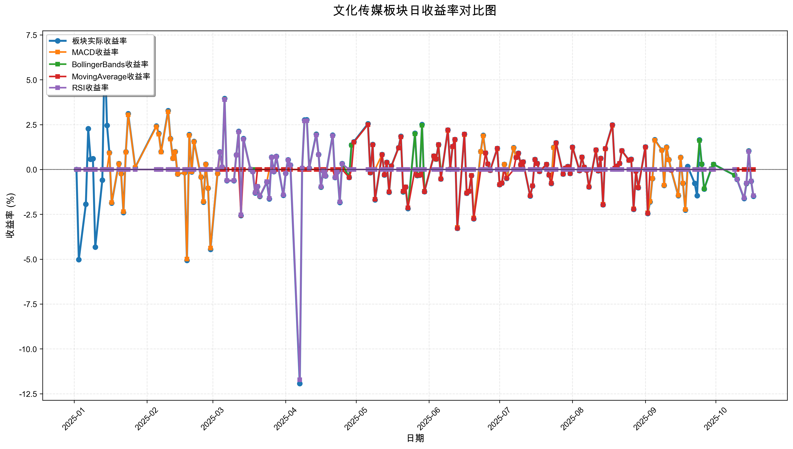
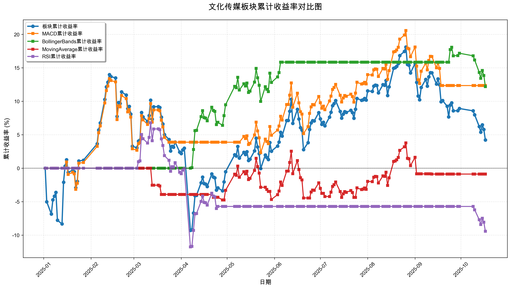

# 策略回测结果报告

**生成时间**: 2025-10-19 19:03:54
**行业板块**: 文化传媒
**回测期间**: 20250101 至 20251017
**策略数量**: 4

## 📈 分析结论

### 策略表现分析
- **最佳策略**: MACD (总收益率: 12.35%)
- **最差策略**: RSI (总收益率: -9.42%)
### 交易活跃度分析
- **活跃策略**: 4 个
- **非活跃策略**: 0 个
- **最活跃策略**: MovingAverage (交易次数: 24)
### 🚨 异动提醒分析
- 未检测到明显异动情况
### 风险分析
- **MACD**: 最大回撤 -9.77%, 夏普比率 0.8849
- **BollingerBands**: 最大回撤 -4.98%, 夏普比率 1.5737
- **MovingAverage**: 最大回撤 -6.82%, 夏普比率 -0.0925
- **RSI**: 最大回撤 -17.38%, 夏普比率 -0.7271

## 📊 综合结果表

| 策略名称           | 初始资金     | 最终价值     | 总收益率   | 年化收益率   | 波动率    |    夏普比率 | 最大回撤    | 总交易次数   | 买入次数   | 卖出次数   | 总交易金额      | 平均交易金额   | 交易频率   |   数据点数 |
|:---------------|:---------|:---------|:-------|:--------|:-------|--------:|:--------|:--------|:-------|:-------|:-----------|:---------|:-------|-------:|
| 板块实际表现         | ¥100,000 | ¥104,208 | 4.21%  | 5.62%   | 28.08% |  0.2001 | -20.41% | N/A     | N/A    | N/A    | N/A        | N/A      | N/A    |    190 |
| MACD           | ¥100,000 | ¥112,348 | 12.35% | 16.70%  | 18.87% |  0.8849 | -9.77%  | 4       | 2      | 2      | ¥412,932   | ¥103,233 | 0.02   |    190 |
| BollingerBands | ¥100,000 | ¥112,196 | 12.20% | 16.49%  | 10.48% |  1.5737 | -4.98%  | 3       | 2      | 1      | ¥326,036   | ¥108,679 | 0.02   |    190 |
| MovingAverage  | ¥100,000 | ¥99,119  | -0.88% | -1.17%  | 12.62% | -0.0925 | -6.82%  | 24      | 12     | 12     | ¥2,289,175 | ¥95,382  | 0.13   |    190 |
| RSI            | ¥100,000 | ¥90,576  | -9.42% | -12.30% | 16.92% | -0.7271 | -17.38% | 3       | 2      | 1      | ¥283,173   | ¥94,391  | 0.02   |    190 |

## 📊 每日收益率走势图

*图1: 文化传媒板块每日收益率走势对比*

## 📈 累计收益率走势图

*图2: 文化传媒板块累计收益率走势对比*

## 📅 日收益明细表

| 日期         | 板块实际收益率   | MACD收益率   | BollingerBands收益率   | MovingAverage收益率   | RSI收益率   |
|:-----------|:----------|:----------|:--------------------|:-------------------|:---------|
| 2025-01-02 | 0.00%     | 0.00%     | 0.00%               | 0.00%              | 0.00%    |
| 2025-01-03 | -5.02%    | 0.00%     | 0.00%               | 0.00%              | 0.00%    |
| 2025-01-06 | -1.93%    | 0.00%     | 0.00%               | 0.00%              | 0.00%    |
| 2025-01-07 | 2.27%     | 0.00%     | 0.00%               | 0.00%              | 0.00%    |
| 2025-01-08 | 0.57%     | 0.00%     | 0.00%               | 0.00%              | 0.00%    |
| 2025-01-09 | 0.60%     | 0.00%     | 0.00%               | 0.00%              | 0.00%    |
| 2025-01-10 | -4.33%    | 0.00%     | 0.00%               | 0.00%              | 0.00%    |
| 2025-01-13 | -0.59%    | 0.00%     | 0.00%               | 0.00%              | 0.00%    |
| 2025-01-14 | 6.80%     | 0.00%     | 0.00%               | 0.00%              | 0.00%    |
| 2025-01-15 | 2.46%     | 0.00%     | 0.00%               | 0.00%              | 0.00%    |
| 2025-01-16 | 0.94%     | 0.92%     | 0.00%               | 0.00%              | 0.00%    |
| 2025-01-17 | -1.87%    | -1.84%    | 0.00%               | 0.00%              | 0.00%    |
| 2025-01-20 | 0.33%     | 0.32%     | 0.00%               | 0.00%              | 0.00%    |
| 2025-01-21 | -0.23%    | -0.23%    | 0.00%               | 0.00%              | 0.00%    |
| 2025-01-22 | -2.40%    | -2.35%    | 0.00%               | 0.00%              | 0.00%    |
| 2025-01-23 | 0.98%     | 0.96%     | 0.00%               | 0.00%              | 0.00%    |
| 2025-01-24 | 3.11%     | 3.05%     | 0.00%               | 0.00%              | 0.00%    |
| 2025-01-27 | 0.12%     | 0.12%     | 0.00%               | 0.00%              | 0.00%    |
| 2025-02-05 | 2.42%     | 2.38%     | 0.00%               | 0.00%              | 0.00%    |
| 2025-02-06 | 2.01%     | 1.97%     | 0.00%               | 0.00%              | 0.00%    |
| 2025-02-07 | 0.99%     | 0.97%     | 0.00%               | 0.00%              | 0.00%    |
| 2025-02-10 | 3.28%     | 3.22%     | 0.00%               | 0.00%              | 0.00%    |
| 2025-02-11 | 1.72%     | 1.69%     | 0.00%               | 0.00%              | 0.00%    |
| 2025-02-12 | 0.62%     | 0.61%     | 0.00%               | 0.00%              | 0.00%    |
| 2025-02-13 | 0.99%     | 0.98%     | 0.00%               | 0.00%              | 0.00%    |
| 2025-02-14 | -0.25%    | -0.25%    | 0.00%               | 0.00%              | 0.00%    |
| 2025-02-17 | -0.18%    | -0.17%    | 0.00%               | 0.00%              | 0.00%    |
| 2025-02-18 | -5.07%    | -4.99%    | 0.00%               | 0.00%              | 0.00%    |
| 2025-02-19 | 1.95%     | 1.91%     | 0.00%               | 0.00%              | 0.00%    |
| 2025-02-20 | -0.14%    | -0.13%    | 0.00%               | 0.00%              | 0.00%    |
| 2025-02-21 | 1.57%     | 1.55%     | 0.00%               | 0.00%              | 0.00%    |
| 2025-02-24 | -0.42%    | -0.41%    | 0.00%               | 0.00%              | 0.00%    |
| 2025-02-25 | -1.82%    | -1.79%    | 0.00%               | 0.00%              | 0.00%    |
| 2025-02-26 | 0.30%     | 0.29%     | 0.00%               | 0.00%              | 0.00%    |
| 2025-02-27 | -1.05%    | -1.04%    | 0.00%               | 0.00%              | 0.00%    |
| 2025-02-28 | -4.45%    | -4.38%    | 0.00%               | 0.00%              | 0.00%    |
| 2025-03-03 | -0.22%    | -0.22%    | 0.00%               | 0.00%              | 0.00%    |
| 2025-03-04 | 0.98%     | 0.96%     | 0.00%               | 0.00%              | 0.96%    |
| 2025-03-05 | 0.14%     | 0.14%     | 0.00%               | 0.00%              | 0.14%    |
| 2025-03-06 | 3.96%     | 3.90%     | 0.00%               | 0.00%              | 3.89%    |
| 2025-03-07 | -0.62%    | -0.61%    | 0.00%               | 0.00%              | -0.61%   |
| 2025-03-10 | -0.62%    | -0.61%    | 0.00%               | 0.00%              | -0.61%   |
| 2025-03-11 | 0.82%     | 0.81%     | 0.00%               | 0.00%              | 0.81%    |
| 2025-03-12 | 2.13%     | 2.09%     | 0.00%               | 0.00%              | 2.09%    |
| 2025-03-13 | -2.57%    | -2.53%    | 0.00%               | -2.55%             | -2.53%   |
| 2025-03-14 | 1.72%     | 1.69%     | 0.00%               | 0.00%              | 1.69%    |
| 2025-03-17 | 0.01%     | 0.01%     | 0.00%               | 0.01%              | 0.01%    |
| 2025-03-18 | -0.12%    | -0.12%    | 0.00%               | -0.12%             | -0.12%   |
| 2025-03-19 | -1.31%    | -1.29%    | 0.00%               | -1.29%             | -1.29%   |
| 2025-03-20 | -0.95%    | -0.94%    | 0.00%               | 0.00%              | -0.94%   |
| 2025-03-21 | -1.50%    | -1.48%    | 0.00%               | 0.00%              | -1.47%   |
| 2025-03-24 | -0.70%    | -0.68%    | 0.00%               | 0.00%              | -0.68%   |
| 2025-03-25 | -1.64%    | 0.00%     | 0.00%               | 0.00%              | -1.61%   |
| 2025-03-26 | 0.69%     | 0.00%     | 0.00%               | 0.00%              | 0.68%    |
| 2025-03-27 | -0.12%    | 0.00%     | 0.00%               | 0.00%              | -0.12%   |
| 2025-03-28 | 0.73%     | 0.00%     | 0.00%               | 0.00%              | 0.72%    |
| 2025-03-31 | -1.44%    | 0.00%     | 0.00%               | 0.00%              | -1.42%   |
| 2025-04-01 | -0.21%    | 0.00%     | 0.00%               | 0.00%              | -0.21%   |
| 2025-04-02 | 0.54%     | 0.00%     | 0.00%               | 0.00%              | 0.53%    |
| 2025-04-03 | 0.24%     | 0.00%     | 0.00%               | 0.00%              | 0.24%    |
| 2025-04-07 | -11.93%   | 0.00%     | 0.00%               | 0.00%              | -11.72%  |
| 2025-04-08 | 0.08%     | 0.00%     | 0.08%               | 0.00%              | 0.08%    |
| 2025-04-09 | 2.76%     | 0.00%     | 2.71%               | 0.00%              | 2.71%    |
| 2025-04-10 | 2.77%     | 0.00%     | 2.72%               | 0.00%              | 2.72%    |
| 2025-04-11 | 0.07%     | 0.00%     | 0.06%               | 0.00%              | 0.06%    |
| 2025-04-14 | 1.97%     | 0.00%     | 1.94%               | 0.00%              | 1.93%    |
| 2025-04-15 | 0.84%     | 0.00%     | 0.83%               | 0.00%              | 0.83%    |
| 2025-04-16 | -0.98%    | 0.00%     | -0.97%              | 0.00%              | -0.96%   |
| 2025-04-17 | -0.07%    | 0.00%     | -0.07%              | 0.00%              | -0.07%   |
| 2025-04-18 | -0.36%    | 0.00%     | -0.36%              | 0.00%              | -0.36%   |
| 2025-04-21 | 1.92%     | 0.00%     | 1.88%               | 0.00%              | 1.88%    |
| 2025-04-22 | -0.44%    | 0.00%     | -0.44%              | -0.44%             | -0.44%   |
| 2025-04-23 | -0.14%    | 0.00%     | -0.14%              | 0.00%              | -0.14%   |
| 2025-04-24 | -1.84%    | 0.00%     | -1.81%              | 0.00%              | -1.81%   |
| 2025-04-25 | 0.33%     | 0.00%     | 0.32%               | 0.00%              | 0.32%    |
| 2025-04-28 | -0.44%    | 0.00%     | -0.43%              | -0.44%             | 0.00%    |
| 2025-04-29 | 1.37%     | 0.00%     | 1.35%               | 0.00%              | 0.00%    |
| 2025-04-30 | 1.55%     | 0.00%     | 1.52%               | 1.52%              | 0.00%    |
| 2025-05-06 | 2.55%     | 0.00%     | 2.51%               | 2.50%              | 0.00%    |
| 2025-05-07 | -0.18%    | 0.00%     | -0.18%              | -0.18%             | 0.00%    |
| 2025-05-08 | 1.40%     | 0.00%     | 1.38%               | 1.38%              | 0.00%    |
| 2025-05-09 | -1.69%    | 0.00%     | -1.66%              | -1.66%             | 0.00%    |
| 2025-05-12 | 0.84%     | 0.83%     | 0.83%               | 0.83%              | 0.00%    |
| 2025-05-13 | -0.31%    | -0.30%    | -0.30%              | -0.30%             | 0.00%    |
| 2025-05-14 | 0.40%     | 0.39%     | 0.39%               | 0.39%              | 0.00%    |
| 2025-05-15 | -1.27%    | -1.25%    | -1.25%              | -1.25%             | 0.00%    |
| 2025-05-16 | 0.20%     | 0.19%     | 0.19%               | 0.19%              | 0.00%    |
| 2025-05-19 | 1.22%     | 1.20%     | 1.20%               | 1.20%              | 0.00%    |
| 2025-05-20 | 1.85%     | 1.82%     | 1.82%               | 1.82%              | 0.00%    |
| 2025-05-21 | -1.25%    | -1.23%    | -1.23%              | -1.22%             | 0.00%    |
| 2025-05-22 | -0.98%    | -0.97%    | -0.97%              | -0.97%             | 0.00%    |
| 2025-05-23 | -2.18%    | -2.14%    | -2.14%              | -2.14%             | 0.00%    |
| 2025-05-26 | 2.02%     | 1.99%     | 1.99%               | 0.00%              | 0.00%    |
| 2025-05-27 | -0.34%    | -0.34%    | -0.34%              | -0.33%             | 0.00%    |
| 2025-05-28 | -0.32%    | -0.31%    | -0.31%              | -0.31%             | 0.00%    |
| 2025-05-29 | 2.51%     | 2.47%     | 2.47%               | 0.00%              | 0.00%    |
| 2025-05-30 | -1.24%    | -1.22%    | -1.22%              | -1.24%             | 0.00%    |
| 2025-06-03 | 0.75%     | 0.74%     | 0.74%               | 0.75%              | 0.00%    |
| 2025-06-04 | 0.58%     | 0.57%     | 0.57%               | 0.58%              | 0.00%    |
| 2025-06-05 | 1.39%     | 1.37%     | 1.37%               | 1.39%              | 0.00%    |
| 2025-06-06 | -0.53%    | -0.52%    | 0.00%               | -0.53%             | 0.00%    |
| 2025-06-09 | 2.20%     | 2.17%     | 0.00%               | 2.20%              | 0.00%    |
| 2025-06-10 | 0.02%     | 0.02%     | 0.00%               | 0.02%              | 0.00%    |
| 2025-06-11 | 1.28%     | 1.26%     | 0.00%               | 1.28%              | 0.00%    |
| 2025-06-12 | 1.67%     | 1.65%     | 0.00%               | 1.67%              | 0.00%    |
| 2025-06-13 | -3.28%    | -3.23%    | 0.00%               | -3.28%             | 0.00%    |
| 2025-06-16 | 1.97%     | 1.94%     | 0.00%               | 1.97%              | 0.00%    |
| 2025-06-17 | -1.32%    | -1.30%    | 0.00%               | -1.32%             | 0.00%    |
| 2025-06-18 | -1.22%    | -1.20%    | 0.00%               | -1.22%             | 0.00%    |
| 2025-06-19 | -0.34%    | -0.33%    | 0.00%               | -0.34%             | 0.00%    |
| 2025-06-20 | -2.75%    | -2.70%    | 0.00%               | -2.74%             | 0.00%    |
| 2025-06-23 | 1.01%     | 0.99%     | 0.00%               | 0.00%              | 0.00%    |
| 2025-06-24 | 1.90%     | 1.87%     | 0.00%               | 0.00%              | 0.00%    |
| 2025-06-25 | 0.92%     | 0.91%     | 0.00%               | 0.92%              | 0.00%    |
| 2025-06-26 | 0.31%     | 0.31%     | 0.00%               | 0.31%              | 0.00%    |
| 2025-06-27 | -0.04%    | -0.04%    | 0.00%               | -0.04%             | 0.00%    |
| 2025-06-30 | 1.17%     | 1.15%     | 0.00%               | 1.17%              | 0.00%    |
| 2025-07-01 | -0.85%    | -0.84%    | 0.00%               | -0.85%             | 0.00%    |
| 2025-07-02 | -0.76%    | -0.75%    | 0.00%               | -0.76%             | 0.00%    |
| 2025-07-03 | 0.29%     | 0.29%     | 0.00%               | 0.00%              | 0.00%    |
| 2025-07-04 | -0.50%    | -0.49%    | 0.00%               | -0.49%             | 0.00%    |
| 2025-07-07 | 1.22%     | 1.20%     | 0.00%               | 0.00%              | 0.00%    |
| 2025-07-08 | 0.68%     | 0.67%     | 0.00%               | 0.67%              | 0.00%    |
| 2025-07-09 | 0.91%     | 0.90%     | 0.00%               | 0.90%              | 0.00%    |
| 2025-07-10 | 0.27%     | 0.27%     | 0.00%               | 0.27%              | 0.00%    |
| 2025-07-11 | 0.42%     | 0.41%     | 0.00%               | 0.42%              | 0.00%    |
| 2025-07-14 | -1.48%    | -1.46%    | 0.00%               | -1.46%             | 0.00%    |
| 2025-07-15 | -0.92%    | -0.91%    | 0.00%               | -0.91%             | 0.00%    |
| 2025-07-16 | 0.56%     | 0.55%     | 0.00%               | 0.55%              | 0.00%    |
| 2025-07-17 | 0.34%     | 0.33%     | 0.00%               | 0.33%              | 0.00%    |
| 2025-07-18 | -0.11%    | -0.10%    | 0.00%               | -0.10%             | 0.00%    |
| 2025-07-21 | 0.29%     | 0.29%     | 0.00%               | 0.29%              | 0.00%    |
| 2025-07-22 | -0.31%    | -0.31%    | 0.00%               | -0.31%             | 0.00%    |
| 2025-07-23 | -0.78%    | -0.76%    | 0.00%               | -0.77%             | 0.00%    |
| 2025-07-24 | 1.24%     | 1.22%     | 0.00%               | 0.00%              | 0.00%    |
| 2025-07-25 | 1.49%     | 1.46%     | 0.00%               | 1.48%              | 0.00%    |
| 2025-07-28 | -0.25%    | -0.25%    | 0.00%               | -0.25%             | 0.00%    |
| 2025-07-29 | 0.08%     | 0.08%     | 0.00%               | 0.08%              | 0.00%    |
| 2025-07-30 | 0.17%     | 0.16%     | 0.00%               | 0.16%              | 0.00%    |
| 2025-07-31 | -0.22%    | -0.21%    | 0.00%               | -0.22%             | 0.00%    |
| 2025-08-01 | 1.25%     | 1.23%     | 0.00%               | 1.24%              | 0.00%    |
| 2025-08-04 | -0.06%    | -0.06%    | 0.00%               | -0.06%             | 0.00%    |
| 2025-08-05 | 0.69%     | 0.68%     | 0.00%               | 0.69%              | 0.00%    |
| 2025-08-06 | 0.13%     | 0.13%     | 0.00%               | 0.13%              | 0.00%    |
| 2025-08-07 | -0.04%    | -0.04%    | 0.00%               | -0.04%             | 0.00%    |
| 2025-08-08 | -0.97%    | -0.96%    | 0.00%               | -0.97%             | 0.00%    |
| 2025-08-11 | 1.09%     | 1.07%     | 0.00%               | 1.09%              | 0.00%    |
| 2025-08-12 | -0.07%    | -0.07%    | 0.00%               | -0.07%             | 0.00%    |
| 2025-08-13 | 0.62%     | 0.61%     | 0.00%               | 0.61%              | 0.00%    |
| 2025-08-14 | -1.97%    | -1.94%    | 0.00%               | -1.97%             | 0.00%    |
| 2025-08-15 | 1.16%     | 1.14%     | 0.00%               | 1.16%              | 0.00%    |
| 2025-08-18 | 2.49%     | 2.45%     | 0.00%               | 2.48%              | 0.00%    |
| 2025-08-19 | 0.07%     | 0.07%     | 0.00%               | 0.07%              | 0.00%    |
| 2025-08-20 | 0.19%     | 0.18%     | 0.00%               | 0.19%              | 0.00%    |
| 2025-08-21 | 0.34%     | 0.33%     | 0.00%               | 0.34%              | 0.00%    |
| 2025-08-22 | 1.05%     | 1.04%     | 0.00%               | 1.05%              | 0.00%    |
| 2025-08-25 | 0.52%     | 0.51%     | 0.00%               | 0.52%              | 0.00%    |
| 2025-08-26 | 0.57%     | 0.56%     | 0.00%               | 0.56%              | 0.00%    |
| 2025-08-27 | -2.22%    | -2.19%    | 0.00%               | -2.21%             | 0.00%    |
| 2025-08-28 | -0.09%    | -0.08%    | 0.00%               | -0.09%             | 0.00%    |
| 2025-08-29 | -1.01%    | -0.99%    | 0.00%               | -1.01%             | 0.00%    |
| 2025-09-01 | 1.26%     | 1.24%     | 0.00%               | 1.25%              | 0.00%    |
| 2025-09-02 | -2.45%    | -2.41%    | 0.00%               | -2.44%             | 0.00%    |
| 2025-09-03 | -1.81%    | -1.78%    | 0.00%               | 0.00%              | 0.00%    |
| 2025-09-04 | -0.51%    | -0.50%    | 0.00%               | 0.00%              | 0.00%    |
| 2025-09-05 | 1.66%     | 1.63%     | 0.00%               | 0.00%              | 0.00%    |
| 2025-09-08 | 1.08%     | 1.07%     | 0.00%               | 0.00%              | 0.00%    |
| 2025-09-09 | -0.89%    | -0.88%    | 0.00%               | 0.00%              | 0.00%    |
| 2025-09-10 | 1.25%     | 1.23%     | 0.00%               | 0.00%              | 0.00%    |
| 2025-09-11 | 0.55%     | 0.54%     | 0.00%               | 0.00%              | 0.00%    |
| 2025-09-12 | -0.03%    | -0.03%    | 0.00%               | -0.03%             | 0.00%    |
| 2025-09-15 | -1.46%    | -1.44%    | 0.00%               | 0.00%              | 0.00%    |
| 2025-09-16 | 0.68%     | 0.67%     | 0.00%               | 0.00%              | 0.00%    |
| 2025-09-17 | -0.77%    | -0.76%    | 0.00%               | 0.00%              | 0.00%    |
| 2025-09-18 | -2.26%    | -2.23%    | 0.00%               | 0.00%              | 0.00%    |
| 2025-09-19 | 0.17%     | 0.00%     | 0.00%               | 0.00%              | 0.00%    |
| 2025-09-22 | -0.77%    | 0.00%     | 0.00%               | 0.00%              | 0.00%    |
| 2025-09-23 | -1.46%    | 0.00%     | 0.00%               | 0.00%              | 0.00%    |
| 2025-09-24 | 1.65%     | 0.00%     | 1.62%               | 0.00%              | 0.00%    |
| 2025-09-25 | 0.30%     | 0.00%     | 0.30%               | 0.00%              | 0.00%    |
| 2025-09-26 | -1.09%    | 0.00%     | -1.08%              | 0.00%              | 0.00%    |
| 2025-09-29 | 0.03%     | 0.00%     | 0.03%               | 0.00%              | 0.00%    |
| 2025-09-30 | 0.29%     | 0.00%     | 0.29%               | 0.00%              | 0.00%    |
| 2025-10-09 | -0.32%    | 0.00%     | -0.32%              | 0.00%              | 0.00%    |
| 2025-10-10 | -0.55%    | 0.00%     | -0.54%              | 0.00%              | -0.54%   |
| 2025-10-13 | -1.62%    | 0.00%     | -1.59%              | 0.00%              | -1.59%   |
| 2025-10-14 | -0.78%    | 0.00%     | -0.77%              | 0.00%              | -0.76%   |
| 2025-10-15 | 1.04%     | 0.00%     | 1.02%               | 0.00%              | 1.01%    |
| 2025-10-16 | -0.65%    | 0.00%     | -0.64%              | 0.00%              | -0.64%   |
| 2025-10-17 | -1.49%    | 0.00%     | -1.46%              | 0.00%              | -1.46%   |

## 📊 日收益统计摘要

| 指标                | 平均日收益率   | 最大日收益率   | 最小日收益率   | 正收益天数   | 负收益天数   |
|:------------------|:---------|:---------|:---------|:--------|:--------|
| 板块实际收益率           | 0.04%    | 6.80%    | -11.93%  | 101天    | 88天     |
| MACD收益率           | 0.07%    | 3.90%    | -4.99%   | 74天     | 61天     |
| BollingerBands收益率 | 0.06%    | 2.72%    | -2.14%   | 27天     | 24天     |
| MovingAverage收益率  | -0.00%   | 2.50%    | -3.28%   | 44天     | 42天     |
| RSI收益率            | -0.05%   | 3.89%    | -11.72%  | 20天     | 24天     |

## 📈 累计收益明细表

| 日期         | 板块累计收益率   | MACD累计收益率   | BollingerBands累计收益率   | MovingAverage累计收益率   | RSI累计收益率   |
|:-----------|:----------|:------------|:----------------------|:---------------------|:-----------|
| 2025-01-02 | 0.00%     | 0.00%       | 0.00%                 | 0.00%                | 0.00%      |
| 2025-01-03 | -5.02%    | 0.00%       | 0.00%                 | 0.00%                | 0.00%      |
| 2025-01-06 | -6.85%    | 0.00%       | 0.00%                 | 0.00%                | 0.00%      |
| 2025-01-07 | -4.74%    | 0.00%       | 0.00%                 | 0.00%                | 0.00%      |
| 2025-01-08 | -4.19%    | 0.00%       | 0.00%                 | 0.00%                | 0.00%      |
| 2025-01-09 | -3.62%    | 0.00%       | 0.00%                 | 0.00%                | 0.00%      |
| 2025-01-10 | -7.79%    | 0.00%       | 0.00%                 | 0.00%                | 0.00%      |
| 2025-01-13 | -8.33%    | 0.00%       | 0.00%                 | 0.00%                | 0.00%      |
| 2025-01-14 | -2.10%    | 0.00%       | 0.00%                 | 0.00%                | 0.00%      |
| 2025-01-15 | 0.31%     | 0.00%       | 0.00%                 | 0.00%                | 0.00%      |
| 2025-01-16 | 1.25%     | 0.92%       | 0.00%                 | 0.00%                | 0.00%      |
| 2025-01-17 | -0.64%    | -0.93%      | 0.00%                 | 0.00%                | 0.00%      |
| 2025-01-20 | -0.31%    | -0.61%      | 0.00%                 | 0.00%                | 0.00%      |
| 2025-01-21 | -0.54%    | -0.84%      | 0.00%                 | 0.00%                | 0.00%      |
| 2025-01-22 | -2.92%    | -3.17%      | 0.00%                 | 0.00%                | 0.00%      |
| 2025-01-23 | -1.98%    | -2.24%      | 0.00%                 | 0.00%                | 0.00%      |
| 2025-01-24 | 1.07%     | 0.74%       | 0.00%                 | 0.00%                | 0.00%      |
| 2025-01-27 | 1.19%     | 0.86%       | 0.00%                 | 0.00%                | 0.00%      |
| 2025-02-05 | 3.64%     | 3.26%       | 0.00%                 | 0.00%                | 0.00%      |
| 2025-02-06 | 5.72%     | 5.30%       | 0.00%                 | 0.00%                | 0.00%      |
| 2025-02-07 | 6.77%     | 6.32%       | 0.00%                 | 0.00%                | 0.00%      |
| 2025-02-10 | 10.27%    | 9.75%       | 0.00%                 | 0.00%                | 0.00%      |
| 2025-02-11 | 12.16%    | 11.60%      | 0.00%                 | 0.00%                | 0.00%      |
| 2025-02-12 | 12.85%    | 12.28%      | 0.00%                 | 0.00%                | 0.00%      |
| 2025-02-13 | 13.98%    | 13.38%      | 0.00%                 | 0.00%                | 0.00%      |
| 2025-02-14 | 13.69%    | 13.10%      | 0.00%                 | 0.00%                | 0.00%      |
| 2025-02-17 | 13.49%    | 12.90%      | 0.00%                 | 0.00%                | 0.00%      |
| 2025-02-18 | 7.73%     | 7.26%       | 0.00%                 | 0.00%                | 0.00%      |
| 2025-02-19 | 9.82%     | 9.32%       | 0.00%                 | 0.00%                | 0.00%      |
| 2025-02-20 | 9.67%     | 9.17%       | 0.00%                 | 0.00%                | 0.00%      |
| 2025-02-21 | 11.40%    | 10.86%      | 0.00%                 | 0.00%                | 0.00%      |
| 2025-02-24 | 10.93%    | 10.40%      | 0.00%                 | 0.00%                | 0.00%      |
| 2025-02-25 | 8.91%     | 8.42%       | 0.00%                 | 0.00%                | 0.00%      |
| 2025-02-26 | 9.24%     | 8.74%       | 0.00%                 | 0.00%                | 0.00%      |
| 2025-02-27 | 8.09%     | 7.62%       | 0.00%                 | 0.00%                | 0.00%      |
| 2025-02-28 | 3.28%     | 2.90%       | 0.00%                 | 0.00%                | 0.00%      |
| 2025-03-03 | 3.05%     | 2.68%       | 0.00%                 | 0.00%                | 0.00%      |
| 2025-03-04 | 4.05%     | 3.66%       | 0.00%                 | 0.00%                | 0.96%      |
| 2025-03-05 | 4.20%     | 3.81%       | 0.00%                 | 0.00%                | 1.10%      |
| 2025-03-06 | 8.33%     | 7.85%       | 0.00%                 | 0.00%                | 5.04%      |
| 2025-03-07 | 7.66%     | 7.20%       | 0.00%                 | 0.00%                | 4.40%      |
| 2025-03-10 | 6.99%     | 6.54%       | 0.00%                 | 0.00%                | 3.76%      |
| 2025-03-11 | 7.87%     | 7.40%       | 0.00%                 | 0.00%                | 4.60%      |
| 2025-03-12 | 10.17%    | 9.65%       | 0.00%                 | 0.00%                | 6.79%      |
| 2025-03-13 | 7.34%     | 6.88%       | 0.00%                 | -2.55%               | 4.10%      |
| 2025-03-14 | 9.19%     | 8.70%       | 0.00%                 | -2.55%               | 5.86%      |
| 2025-03-17 | 9.20%     | 8.70%       | 0.00%                 | -2.54%               | 5.87%      |
| 2025-03-18 | 9.07%     | 8.57%       | 0.00%                 | -2.66%               | 5.74%      |
| 2025-03-19 | 7.63%     | 7.17%       | 0.00%                 | -3.92%               | 4.37%      |
| 2025-03-20 | 6.61%     | 6.17%       | 0.00%                 | -3.92%               | 3.40%      |
| 2025-03-21 | 5.01%     | 4.60%       | 0.00%                 | -3.92%               | 1.87%      |
| 2025-03-24 | 4.28%     | 3.88%       | 0.00%                 | -3.92%               | 1.18%      |
| 2025-03-25 | 2.57%     | 3.88%       | 0.00%                 | -3.92%               | -0.46%     |
| 2025-03-26 | 3.27%     | 3.88%       | 0.00%                 | -3.92%               | 0.22%      |
| 2025-03-27 | 3.14%     | 3.88%       | 0.00%                 | -3.92%               | 0.09%      |
| 2025-03-28 | 3.90%     | 3.88%       | 0.00%                 | -3.92%               | 0.82%      |
| 2025-03-31 | 2.40%     | 3.88%       | 0.00%                 | -3.92%               | -0.61%     |
| 2025-04-01 | 2.19%     | 3.88%       | 0.00%                 | -3.92%               | -0.82%     |
| 2025-04-02 | 2.74%     | 3.88%       | 0.00%                 | -3.92%               | -0.29%     |
| 2025-04-03 | 2.99%     | 3.88%       | 0.00%                 | -3.92%               | -0.05%     |
| 2025-04-07 | -9.29%    | 3.88%       | 0.00%                 | -3.92%               | -11.76%    |
| 2025-04-08 | -9.21%    | 3.88%       | 0.08%                 | -3.92%               | -11.69%    |
| 2025-04-09 | -6.71%    | 3.88%       | 2.79%                 | -3.92%               | -9.30%     |
| 2025-04-10 | -4.12%    | 3.88%       | 5.60%                 | -3.92%               | -6.84%     |
| 2025-04-11 | -4.06%    | 3.88%       | 5.66%                 | -3.92%               | -6.78%     |
| 2025-04-14 | -2.17%    | 3.88%       | 7.71%                 | -3.92%               | -4.97%     |
| 2025-04-15 | -1.34%    | 3.88%       | 8.60%                 | -3.92%               | -4.19%     |
| 2025-04-16 | -2.31%    | 3.88%       | 7.55%                 | -3.92%               | -5.11%     |
| 2025-04-17 | -2.38%    | 3.88%       | 7.48%                 | -3.92%               | -5.17%     |
| 2025-04-18 | -2.74%    | 3.88%       | 7.09%                 | -3.92%               | -5.51%     |
| 2025-04-21 | -0.87%    | 3.88%       | 9.11%                 | -3.92%               | -3.74%     |
| 2025-04-22 | -1.31%    | 3.88%       | 8.64%                 | -4.34%               | -4.16%     |
| 2025-04-23 | -1.45%    | 3.88%       | 8.49%                 | -4.34%               | -4.29%     |
| 2025-04-24 | -3.27%    | 3.88%       | 6.52%                 | -4.34%               | -6.02%     |
| 2025-04-25 | -2.95%    | 3.88%       | 6.86%                 | -4.34%               | -5.72%     |
| 2025-04-28 | -3.38%    | 3.88%       | 6.40%                 | -4.75%               | -5.72%     |
| 2025-04-29 | -2.05%    | 3.88%       | 7.84%                 | -4.75%               | -5.72%     |
| 2025-04-30 | -0.53%    | 3.88%       | 9.48%                 | -3.31%               | -5.72%     |
| 2025-05-06 | 2.01%     | 3.88%       | 12.23%                | -0.89%               | -5.72%     |
| 2025-05-07 | 1.82%     | 3.88%       | 12.03%                | -1.06%               | -5.72%     |
| 2025-05-08 | 3.25%     | 3.88%       | 13.58%                | 0.30%                | -5.72%     |
| 2025-05-09 | 1.51%     | 3.88%       | 11.69%                | -1.36%               | -5.72%     |
| 2025-05-12 | 2.37%     | 4.74%       | 12.62%                | -0.54%               | -5.72%     |
| 2025-05-13 | 2.05%     | 4.43%       | 12.28%                | -0.84%               | -5.72%     |
| 2025-05-14 | 2.46%     | 4.84%       | 12.72%                | -0.46%               | -5.72%     |
| 2025-05-15 | 1.15%     | 3.53%       | 11.31%                | -1.70%               | -5.72%     |
| 2025-05-16 | 1.35%     | 3.73%       | 11.52%                | -1.51%               | -5.72%     |
| 2025-05-19 | 2.59%     | 4.97%       | 12.86%                | -0.33%               | -5.72%     |
| 2025-05-20 | 4.49%     | 6.88%       | 14.91%                | 1.48%                | -5.72%     |
| 2025-05-21 | 3.18%     | 5.57%       | 13.50%                | 0.24%                | -5.72%     |
| 2025-05-22 | 2.17%     | 4.55%       | 12.40%                | -0.73%               | -5.72%     |
| 2025-05-23 | -0.06%    | 2.31%       | 9.99%                 | -2.86%               | -5.72%     |
| 2025-05-26 | 1.96%     | 4.34%       | 12.18%                | -2.86%               | -5.72%     |
| 2025-05-27 | 1.61%     | 3.99%       | 11.80%                | -3.18%               | -5.72%     |
| 2025-05-28 | 1.29%     | 3.66%       | 11.45%                | -3.48%               | -5.72%     |
| 2025-05-29 | 3.83%     | 6.22%       | 14.20%                | -3.48%               | -5.72%     |
| 2025-05-30 | 2.54%     | 4.92%       | 12.81%                | -4.68%               | -5.72%     |
| 2025-06-03 | 3.31%     | 5.69%       | 13.64%                | -3.96%               | -5.72%     |
| 2025-06-04 | 3.91%     | 6.30%       | 14.29%                | -3.41%               | -5.72%     |
| 2025-06-05 | 5.36%     | 7.75%       | 15.85%                | -2.07%               | -5.72%     |
| 2025-06-06 | 4.80%     | 7.19%       | 15.85%                | -2.58%               | -5.72%     |
| 2025-06-09 | 7.11%     | 9.51%       | 15.85%                | -0.44%               | -5.72%     |
| 2025-06-10 | 7.13%     | 9.53%       | 15.85%                | -0.42%               | -5.72%     |
| 2025-06-11 | 8.50%     | 10.91%      | 15.85%                | 0.85%                | -5.72%     |
| 2025-06-12 | 10.32%    | 12.74%      | 15.85%                | 2.54%                | -5.72%     |
| 2025-06-13 | 6.70%     | 9.10%       | 15.85%                | -0.82%               | -5.72%     |
| 2025-06-16 | 8.80%     | 11.21%      | 15.85%                | 1.13%                | -5.72%     |
| 2025-06-17 | 7.36%     | 9.76%       | 15.85%                | -0.21%               | -5.72%     |
| 2025-06-18 | 6.05%     | 8.44%       | 15.85%                | -1.42%               | -5.72%     |
| 2025-06-19 | 5.69%     | 8.09%       | 15.85%                | -1.76%               | -5.72%     |
| 2025-06-20 | 2.78%     | 5.17%       | 15.85%                | -4.45%               | -5.72%     |
| 2025-06-23 | 3.82%     | 6.21%       | 15.85%                | -4.45%               | -5.72%     |
| 2025-06-24 | 5.79%     | 8.19%       | 15.85%                | -4.45%               | -5.72%     |
| 2025-06-25 | 6.77%     | 9.17%       | 15.85%                | -3.57%               | -5.72%     |
| 2025-06-26 | 7.10%     | 9.51%       | 15.85%                | -3.27%               | -5.72%     |
| 2025-06-27 | 7.06%     | 9.46%       | 15.85%                | -3.31%               | -5.72%     |
| 2025-06-30 | 8.31%     | 10.72%      | 15.85%                | -2.19%               | -5.72%     |
| 2025-07-01 | 7.38%     | 9.79%       | 15.85%                | -3.02%               | -5.72%     |
| 2025-07-02 | 6.56%     | 8.96%       | 15.85%                | -3.76%               | -5.72%     |
| 2025-07-03 | 6.87%     | 9.28%       | 15.85%                | -3.76%               | -5.72%     |
| 2025-07-04 | 6.34%     | 8.74%       | 15.85%                | -4.23%               | -5.72%     |
| 2025-07-07 | 7.63%     | 10.04%      | 15.85%                | -4.23%               | -5.72%     |
| 2025-07-08 | 8.36%     | 10.77%      | 15.85%                | -3.59%               | -5.72%     |
| 2025-07-09 | 9.35%     | 11.77%      | 15.85%                | -2.72%               | -5.72%     |
| 2025-07-10 | 9.65%     | 12.07%      | 15.85%                | -2.46%               | -5.72%     |
| 2025-07-11 | 10.11%    | 12.53%      | 15.85%                | -2.06%               | -5.72%     |
| 2025-07-14 | 8.48%     | 10.89%      | 15.85%                | -3.49%               | -5.72%     |
| 2025-07-15 | 7.48%     | 9.89%       | 15.85%                | -4.36%               | -5.72%     |
| 2025-07-16 | 8.08%     | 10.49%      | 15.85%                | -3.83%               | -5.72%     |
| 2025-07-17 | 8.45%     | 10.86%      | 15.85%                | -3.51%               | -5.72%     |
| 2025-07-18 | 8.34%     | 10.75%      | 15.85%                | -3.61%               | -5.72%     |
| 2025-07-21 | 8.65%     | 11.06%      | 15.85%                | -3.34%               | -5.72%     |
| 2025-07-22 | 8.31%     | 10.72%      | 15.85%                | -3.63%               | -5.72%     |
| 2025-07-23 | 7.47%     | 9.88%       | 15.85%                | -4.37%               | -5.72%     |
| 2025-07-24 | 8.81%     | 11.22%      | 15.85%                | -4.37%               | -5.72%     |
| 2025-07-25 | 10.43%    | 12.85%      | 15.85%                | -2.95%               | -5.72%     |
| 2025-07-28 | 10.15%    | 12.57%      | 15.85%                | -3.20%               | -5.72%     |
| 2025-07-29 | 10.23%    | 12.65%      | 15.85%                | -3.12%               | -5.72%     |
| 2025-07-30 | 10.42%    | 12.84%      | 15.85%                | -2.96%               | -5.72%     |
| 2025-07-31 | 10.18%    | 12.60%      | 15.85%                | -3.17%               | -5.72%     |
| 2025-08-01 | 11.55%    | 13.98%      | 15.85%                | -1.97%               | -5.72%     |
| 2025-08-04 | 11.49%    | 13.92%      | 15.85%                | -2.02%               | -5.72%     |
| 2025-08-05 | 12.26%    | 14.69%      | 15.85%                | -1.35%               | -5.72%     |
| 2025-08-06 | 12.41%    | 14.84%      | 15.85%                | -1.22%               | -5.72%     |
| 2025-08-07 | 12.36%    | 14.79%      | 15.85%                | -1.26%               | -5.72%     |
| 2025-08-08 | 11.27%    | 13.70%      | 15.85%                | -2.21%               | -5.72%     |
| 2025-08-11 | 12.48%    | 14.91%      | 15.85%                | -1.15%               | -5.72%     |
| 2025-08-12 | 12.40%    | 14.83%      | 15.85%                | -1.22%               | -5.72%     |
| 2025-08-13 | 13.10%    | 15.53%      | 15.85%                | -0.61%               | -5.72%     |
| 2025-08-14 | 10.86%    | 13.29%      | 15.85%                | -2.57%               | -5.72%     |
| 2025-08-15 | 12.15%    | 14.58%      | 15.85%                | -1.44%               | -5.72%     |
| 2025-08-18 | 14.94%    | 17.38%      | 15.85%                | 1.00%                | -5.72%     |
| 2025-08-19 | 15.02%    | 17.46%      | 15.85%                | 1.07%                | -5.72%     |
| 2025-08-20 | 15.23%    | 17.68%      | 15.85%                | 1.26%                | -5.72%     |
| 2025-08-21 | 15.62%    | 18.07%      | 15.85%                | 1.60%                | -5.72%     |
| 2025-08-22 | 16.84%    | 19.29%      | 15.85%                | 2.66%                | -5.72%     |
| 2025-08-25 | 17.45%    | 19.90%      | 15.85%                | 3.20%                | -5.72%     |
| 2025-08-26 | 18.11%    | 20.57%      | 15.85%                | 3.78%                | -5.72%     |
| 2025-08-27 | 15.49%    | 17.94%      | 15.85%                | 1.48%                | -5.72%     |
| 2025-08-28 | 15.39%    | 17.84%      | 15.85%                | 1.40%                | -5.72%     |
| 2025-08-29 | 14.23%    | 16.67%      | 15.85%                | 0.38%                | -5.72%     |
| 2025-09-01 | 15.66%    | 18.11%      | 15.85%                | 1.63%                | -5.72%     |
| 2025-09-02 | 12.83%    | 15.26%      | 15.85%                | -0.85%               | -5.72%     |
| 2025-09-03 | 10.79%    | 13.21%      | 15.85%                | -0.85%               | -5.72%     |
| 2025-09-04 | 10.23%    | 12.65%      | 15.85%                | -0.85%               | -5.72%     |
| 2025-09-05 | 12.06%    | 14.49%      | 15.85%                | -0.85%               | -5.72%     |
| 2025-09-08 | 13.27%    | 15.71%      | 15.85%                | -0.85%               | -5.72%     |
| 2025-09-09 | 12.26%    | 14.69%      | 15.85%                | -0.85%               | -5.72%     |
| 2025-09-10 | 13.66%    | 16.10%      | 15.85%                | -0.85%               | -5.72%     |
| 2025-09-11 | 14.28%    | 16.73%      | 15.85%                | -0.85%               | -5.72%     |
| 2025-09-12 | 14.25%    | 16.69%      | 15.85%                | -0.88%               | -5.72%     |
| 2025-09-15 | 12.58%    | 15.01%      | 15.85%                | -0.88%               | -5.72%     |
| 2025-09-16 | 13.35%    | 15.78%      | 15.85%                | -0.88%               | -5.72%     |
| 2025-09-17 | 12.47%    | 14.91%      | 15.85%                | -0.88%               | -5.72%     |
| 2025-09-18 | 9.93%     | 12.35%      | 15.85%                | -0.88%               | -5.72%     |
| 2025-09-19 | 10.11%    | 12.35%      | 15.85%                | -0.88%               | -5.72%     |
| 2025-09-22 | 9.26%     | 12.35%      | 15.85%                | -0.88%               | -5.72%     |
| 2025-09-23 | 7.67%     | 12.35%      | 15.85%                | -0.88%               | -5.72%     |
| 2025-09-24 | 9.44%     | 12.35%      | 17.73%                | -0.88%               | -5.72%     |
| 2025-09-25 | 9.77%     | 12.35%      | 18.07%                | -0.88%               | -5.72%     |
| 2025-09-26 | 8.57%     | 12.35%      | 16.80%                | -0.88%               | -5.72%     |
| 2025-09-29 | 8.60%     | 12.35%      | 16.84%                | -0.88%               | -5.72%     |
| 2025-09-30 | 8.92%     | 12.35%      | 17.18%                | -0.88%               | -5.72%     |
| 2025-10-09 | 8.57%     | 12.35%      | 16.80%                | -0.88%               | -5.72%     |
| 2025-10-10 | 7.97%     | 12.35%      | 16.17%                | -0.88%               | -6.22%     |
| 2025-10-13 | 6.22%     | 12.35%      | 14.32%                | -0.88%               | -7.71%     |
| 2025-10-14 | 5.39%     | 12.35%      | 13.44%                | -0.88%               | -8.42%     |
| 2025-10-15 | 6.48%     | 12.35%      | 14.60%                | -0.88%               | -7.49%     |
| 2025-10-16 | 5.78%     | 12.35%      | 13.86%                | -0.88%               | -8.08%     |
| 2025-10-17 | 4.21%     | 12.35%      | 12.20%                | -0.88%               | -9.42%     |

## 📊 累计收益统计摘要

| 指标                  | 最终累计收益率   | 最大累计收益率   | 最小累计收益率   | 累计收益波动   | 收益稳定性   |
|:--------------------|:----------|:----------|:----------|:---------|:--------|
| 板块累计收益率             | 4.21%     | 18.11%    | -9.29%    | 27.40%   | 波动      |
| MACD累计收益率           | 12.35%    | 20.57%    | -3.17%    | 23.74%   | 波动      |
| BollingerBands累计收益率 | 12.20%    | 18.07%    | 0.00%     | 18.07%   | 稳定      |
| MovingAverage累计收益率  | -0.88%    | 3.78%     | -4.75%    | 8.53%    | 稳定      |
| RSI累计收益率            | -9.42%    | 6.79%     | -11.76%   | 18.55%   | 稳定      |

