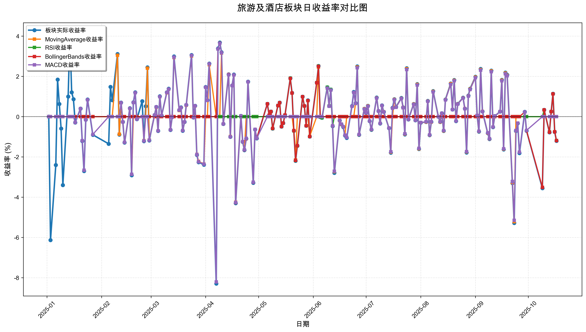
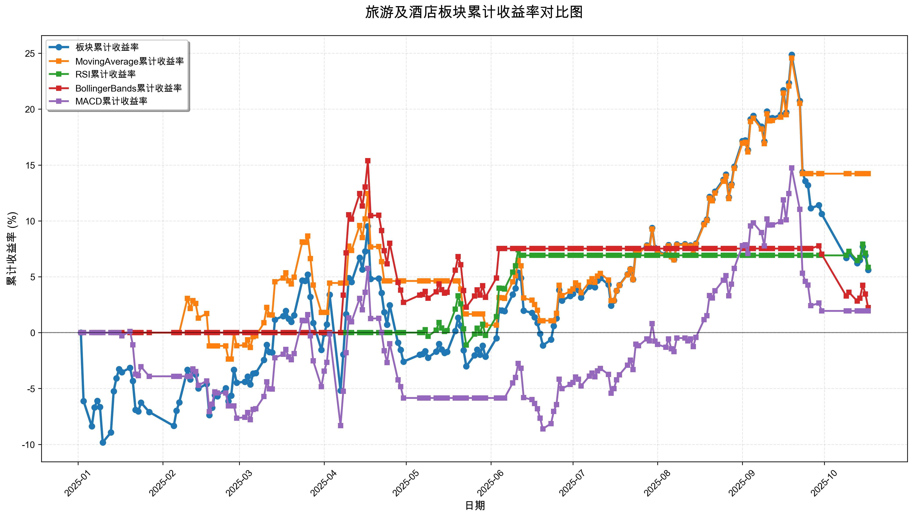

# 策略回测结果报告

**生成时间**: 2025-10-19 19:03:31
**行业板块**: 旅游及酒店
**回测期间**: 20250101 至 20251017
**策略数量**: 4

## 📈 分析结论

### 策略表现分析
- **最佳策略**: MovingAverage (总收益率: 14.22%)
- **最差策略**: MACD (总收益率: 1.94%)
### 交易活跃度分析
- **活跃策略**: 4 个
- **非活跃策略**: 0 个
- **最活跃策略**: MovingAverage (交易次数: 20)
### 🚨 异动提醒分析
- **板块异动**: 旅游及酒店 近两周出现极端波动 (最大单日: -5.28%, 最小单日: -5.28%)
- **板块异动**: 旅游及酒店 近两周出现大幅波动 (最大单日: 5.28%)
- **策略异动**: MovingAverage 近两周出现极端表现 (最大单日: -5.22%, 最小单日: -5.22%)
- **策略异动**: MovingAverage 近两周出现大幅波动 (最大单日: 5.22%)
- **策略异动**: RSI 与板块走势相关性异常 (相关系数: 0.259)
- **策略异动**: BollingerBands 近两周出现大幅波动 (最大单日: 3.51%)
- **策略异动**: MACD 近两周出现极端表现 (最大单日: -5.15%, 最小单日: -5.15%)
- **策略异动**: MACD 近两周出现大幅波动 (最大单日: 5.15%)
### 风险分析
- **MovingAverage**: 最大回撤 -10.48%, 夏普比率 1.0379
- **RSI**: 最大回撤 -4.27%, 夏普比率 1.1514
- **BollingerBands**: 最大回撤 -11.40%, 夏普比率 0.2256
- **MACD**: 最大回撤 -13.58%, 夏普比率 0.1180

## 📊 综合结果表

| 策略名称           | 初始资金     | 最终价值     | 总收益率   | 年化收益率   | 波动率    |   夏普比率 | 最大回撤    | 总交易次数   | 买入次数   | 卖出次数   | 总交易金额      | 平均交易金额   | 交易频率   |   数据点数 |
|:---------------|:---------|:---------|:-------|:--------|:-------|-------:|:--------|:--------|:-------|:-------|:-----------|:---------|:-------|-------:|
| 板块实际表现         | ¥100,000 | ¥105,606 | 5.61%  | 7.50%   | 26.25% | 0.2858 | -15.42% | N/A     | N/A    | N/A    | N/A        | N/A      | N/A    |    190 |
| MovingAverage  | ¥100,000 | ¥114,219 | 14.22% | 19.28%  | 18.58% | 1.0379 | -10.48% | 20      | 10     | 10     | ¥2,006,197 | ¥100,310 | 0.11   |    190 |
| RSI            | ¥100,000 | ¥105,843 | 5.84%  | 7.82%   | 6.79%  | 1.1514 | -4.27%  | 3       | 2      | 1      | ¥311,689   | ¥103,896 | 0.02   |    190 |
| BollingerBands | ¥100,000 | ¥102,229 | 2.23%  | 2.97%   | 13.15% | 0.2256 | -11.40% | 3       | 2      | 1      | ¥312,379   | ¥104,126 | 0.02   |    190 |
| MACD           | ¥100,000 | ¥101,944 | 1.94%  | 2.59%   | 21.92% | 0.118  | -13.58% | 10      | 5      | 5      | ¥943,303   | ¥94,330  | 0.05   |    190 |

## 📊 每日收益率走势图

*图1: 旅游及酒店板块每日收益率走势对比*

## 📈 累计收益率走势图

*图2: 旅游及酒店板块累计收益率走势对比*

## 📅 日收益明细表

| 日期         | 板块实际收益率   | MovingAverage收益率   | RSI收益率   | BollingerBands收益率   | MACD收益率   |
|:-----------|:----------|:-------------------|:---------|:--------------------|:----------|
| 2025-01-02 | 0.00%     | 0.00%              | 0.00%    | 0.00%               | 0.00%     |
| 2025-01-03 | -6.13%    | 0.00%              | 0.00%    | 0.00%               | 0.00%     |
| 2025-01-06 | -2.40%    | 0.00%              | 0.00%    | 0.00%               | 0.00%     |
| 2025-01-07 | 1.84%     | 0.00%              | 0.00%    | 0.00%               | 0.00%     |
| 2025-01-08 | 0.63%     | 0.00%              | 0.00%    | 0.00%               | 0.00%     |
| 2025-01-09 | -0.59%    | 0.00%              | 0.00%    | 0.00%               | 0.00%     |
| 2025-01-10 | -3.40%    | 0.00%              | 0.00%    | 0.00%               | 0.00%     |
| 2025-01-13 | 1.00%     | 0.00%              | 0.00%    | 0.00%               | 0.00%     |
| 2025-01-14 | 4.05%     | 0.00%              | 0.00%    | 0.00%               | 0.00%     |
| 2025-01-15 | 1.21%     | 0.00%              | 0.00%    | 0.00%               | 0.00%     |
| 2025-01-16 | 0.87%     | 0.00%              | 0.00%    | 0.00%               | 0.00%     |
| 2025-01-17 | -0.29%    | 0.00%              | 0.00%    | 0.00%               | -0.29%    |
| 2025-01-20 | 0.40%     | 0.00%              | 0.00%    | 0.00%               | 0.40%     |
| 2025-01-21 | -1.21%    | 0.00%              | 0.00%    | 0.00%               | -1.19%    |
| 2025-01-22 | -2.70%    | 0.00%              | 0.00%    | 0.00%               | -2.66%    |
| 2025-01-23 | -0.15%    | 0.00%              | 0.00%    | 0.00%               | -0.15%    |
| 2025-01-24 | 0.85%     | 0.00%              | 0.00%    | 0.00%               | 0.84%     |
| 2025-01-27 | -0.90%    | 0.00%              | 0.00%    | 0.00%               | -0.88%    |
| 2025-02-05 | -1.35%    | 0.00%              | 0.00%    | 0.00%               | 0.00%     |
| 2025-02-06 | 1.48%     | 0.00%              | 0.00%    | 0.00%               | 0.00%     |
| 2025-02-07 | 0.82%     | 0.00%              | 0.00%    | 0.00%               | 0.00%     |
| 2025-02-10 | 3.11%     | 3.05%              | 0.00%    | 0.00%               | 0.00%     |
| 2025-02-11 | -0.89%    | -0.87%             | 0.00%    | 0.00%               | 0.00%     |
| 2025-02-12 | 0.70%     | 0.69%              | 0.00%    | 0.00%               | 0.69%     |
| 2025-02-13 | -0.26%    | -0.26%             | 0.00%    | 0.00%               | -0.26%    |
| 2025-02-14 | -1.29%    | -1.27%             | 0.00%    | 0.00%               | -1.27%    |
| 2025-02-17 | 0.42%     | 0.41%              | 0.00%    | 0.00%               | 0.41%     |
| 2025-02-18 | -2.91%    | -2.86%             | 0.00%    | 0.00%               | -2.86%    |
| 2025-02-19 | 0.71%     | 0.00%              | 0.00%    | 0.00%               | 0.70%     |
| 2025-02-20 | 1.21%     | 0.00%              | 0.00%    | 0.00%               | 1.19%     |
| 2025-02-21 | -0.12%    | 0.00%              | 0.00%    | 0.00%               | -0.12%    |
| 2025-02-24 | 0.77%     | 0.00%              | 0.00%    | 0.00%               | 0.00%     |
| 2025-02-25 | -1.22%    | -1.19%             | 0.00%    | 0.00%               | -1.20%    |
| 2025-02-26 | 0.52%     | 0.00%              | 0.00%    | 0.00%               | 0.00%     |
| 2025-02-27 | 2.45%     | 2.41%              | 0.00%    | 0.00%               | 0.00%     |
| 2025-02-28 | -1.18%    | -1.16%             | 0.00%    | 0.00%               | -1.17%    |
| 2025-03-03 | 0.08%     | 0.07%              | 0.00%    | 0.00%               | 0.07%     |
| 2025-03-04 | 0.48%     | 0.47%              | 0.00%    | 0.00%               | 0.48%     |
| 2025-03-05 | -0.71%    | -0.70%             | 0.00%    | 0.00%               | -0.70%    |
| 2025-03-06 | 1.01%     | 0.99%              | 0.00%    | 0.00%               | 0.99%     |
| 2025-03-07 | 0.05%     | 0.05%              | 0.00%    | 0.00%               | 0.05%     |
| 2025-03-10 | 1.21%     | 1.19%              | 0.00%    | 0.00%               | 1.20%     |
| 2025-03-11 | 1.39%     | 1.36%              | 0.00%    | 0.00%               | 1.37%     |
| 2025-03-12 | -0.66%    | -0.65%             | 0.00%    | 0.00%               | -0.65%    |
| 2025-03-13 | -0.02%    | -0.02%             | 0.00%    | 0.00%               | -0.02%    |
| 2025-03-14 | 2.99%     | 2.94%              | 0.00%    | 0.00%               | 2.96%     |
| 2025-03-17 | 0.32%     | 0.31%              | 0.00%    | 0.00%               | 0.32%     |
| 2025-03-18 | 0.46%     | 0.45%              | 0.00%    | 0.00%               | 0.45%     |
| 2025-03-19 | -0.70%    | -0.69%             | 0.00%    | 0.00%               | -0.69%    |
| 2025-03-20 | -0.26%    | -0.26%             | 0.00%    | 0.00%               | -0.26%    |
| 2025-03-21 | 0.58%     | 0.57%              | 0.00%    | 0.00%               | 0.58%     |
| 2025-03-24 | 3.06%     | 3.01%              | 0.00%    | 0.00%               | 3.04%     |
| 2025-03-25 | -0.04%    | -0.04%             | 0.00%    | 0.00%               | -0.04%    |
| 2025-03-26 | 0.54%     | 0.53%              | 0.00%    | 0.00%               | 0.54%     |
| 2025-03-27 | -1.90%    | -1.87%             | 0.00%    | 0.00%               | -1.88%    |
| 2025-03-28 | -2.26%    | -2.22%             | 0.00%    | 0.00%               | -2.24%    |
| 2025-03-31 | -2.39%    | -2.35%             | 0.00%    | 0.00%               | -2.36%    |
| 2025-04-01 | 1.47%     | 0.00%              | 0.00%    | 0.00%               | 1.46%     |
| 2025-04-02 | 0.82%     | 0.00%              | 0.00%    | 0.00%               | 0.81%     |
| 2025-04-03 | 2.64%     | 2.58%              | 0.00%    | 0.00%               | 2.62%     |
| 2025-04-07 | -8.29%    | 0.00%              | 0.00%    | 0.00%               | -8.21%    |
| 2025-04-08 | 3.39%     | 0.00%              | 0.00%    | 3.36%               | 3.36%     |
| 2025-04-09 | 3.68%     | 0.00%              | 0.00%    | 3.65%               | 3.64%     |
| 2025-04-10 | 3.20%     | 3.16%              | 0.00%    | 3.17%               | 3.17%     |
| 2025-04-11 | -0.36%    | -0.36%             | 0.00%    | -0.36%              | -0.36%    |
| 2025-04-14 | 2.10%     | 2.08%              | 0.00%    | 2.09%               | 2.08%     |
| 2025-04-15 | -1.00%    | -0.99%             | 0.00%    | -1.00%              | -1.00%    |
| 2025-04-16 | 1.55%     | 1.54%              | 0.00%    | 1.54%               | 1.54%     |
| 2025-04-17 | 2.09%     | 2.07%              | 0.00%    | 2.07%               | 2.07%     |
| 2025-04-18 | -4.30%    | -4.25%             | 0.00%    | -4.27%              | -4.26%    |
| 2025-04-21 | 0.04%     | 0.04%              | 0.00%    | 0.04%               | 0.04%     |
| 2025-04-22 | -1.25%    | -1.24%             | 0.00%    | -1.24%              | -1.24%    |
| 2025-04-23 | -1.66%    | -1.64%             | 0.00%    | -1.65%              | -1.64%    |
| 2025-04-24 | -1.09%    | 0.00%              | 0.00%    | -1.09%              | -1.08%    |
| 2025-04-25 | 1.74%     | 0.00%              | 0.00%    | 1.73%               | 1.73%     |
| 2025-04-28 | -3.29%    | 0.00%              | 0.00%    | -3.26%              | -3.25%    |
| 2025-04-29 | -0.64%    | 0.00%              | 0.00%    | -0.63%              | -0.63%    |
| 2025-04-30 | -1.08%    | 0.00%              | 0.00%    | -1.07%              | -1.07%    |
| 2025-05-06 | 0.64%     | 0.00%              | 0.00%    | 0.64%               | 0.00%     |
| 2025-05-07 | 0.07%     | 0.00%              | 0.00%    | 0.07%               | 0.00%     |
| 2025-05-08 | 0.25%     | 0.00%              | 0.25%    | 0.25%               | 0.00%     |
| 2025-05-09 | -0.59%    | 0.00%              | -0.59%   | -0.58%              | 0.00%     |
| 2025-05-12 | 0.55%     | 0.00%              | 0.55%    | 0.55%               | 0.00%     |
| 2025-05-13 | 0.70%     | 0.00%              | 0.69%    | 0.69%               | 0.00%     |
| 2025-05-14 | -0.49%    | 0.00%              | -0.49%   | -0.49%              | 0.00%     |
| 2025-05-15 | -0.32%    | 0.00%              | -0.32%   | -0.32%              | 0.00%     |
| 2025-05-16 | 0.08%     | 0.00%              | 0.08%    | 0.08%               | 0.00%     |
| 2025-05-19 | 1.91%     | 0.00%              | 1.91%    | 1.90%               | 0.00%     |
| 2025-05-20 | 1.18%     | 0.00%              | 1.17%    | 1.17%               | 0.00%     |
| 2025-05-21 | -0.70%    | -0.69%             | -0.70%   | -0.69%              | 0.00%     |
| 2025-05-22 | -2.19%    | -2.15%             | -2.18%   | -2.17%              | 0.00%     |
| 2025-05-23 | -1.45%    | 0.00%              | -1.45%   | -1.44%              | 0.00%     |
| 2025-05-26 | 0.99%     | 0.00%              | 0.99%    | 0.99%               | 0.00%     |
| 2025-05-27 | 0.53%     | 0.00%              | 0.53%    | 0.53%               | 0.00%     |
| 2025-05-28 | -0.45%    | 0.00%              | -0.45%   | -0.45%              | 0.00%     |
| 2025-05-29 | 0.81%     | 0.00%              | 0.80%    | 0.80%               | 0.00%     |
| 2025-05-30 | -0.99%    | -0.98%             | -0.99%   | -0.99%              | 0.00%     |
| 2025-06-03 | 1.69%     | 0.00%              | 1.69%    | 1.68%               | 0.00%     |
| 2025-06-04 | 2.52%     | 2.46%              | 2.51%    | 2.50%               | 0.00%     |
| 2025-06-05 | -0.02%    | -0.02%             | -0.02%   | 0.00%               | 0.00%     |
| 2025-06-06 | -0.05%    | -0.05%             | -0.05%   | 0.00%               | 0.00%     |
| 2025-06-09 | 1.46%     | 1.43%              | 1.46%    | 0.00%               | 1.42%     |
| 2025-06-10 | 0.53%     | 0.52%              | 0.53%    | 0.00%               | 0.52%     |
| 2025-06-11 | 1.35%     | 1.32%              | 1.35%    | 0.00%               | 1.32%     |
| 2025-06-12 | -0.47%    | -0.45%             | -0.46%   | 0.00%               | -0.45%    |
| 2025-06-13 | -2.79%    | -2.73%             | 0.00%    | 0.00%               | -2.71%    |
| 2025-06-16 | -0.19%    | -0.19%             | 0.00%    | 0.00%               | -0.18%    |
| 2025-06-17 | -0.38%    | -0.38%             | 0.00%    | 0.00%               | -0.37%    |
| 2025-06-18 | -0.51%    | -0.49%             | 0.00%    | 0.00%               | -0.49%    |
| 2025-06-19 | -0.94%    | -0.92%             | 0.00%    | 0.00%               | -0.92%    |
| 2025-06-20 | -1.06%    | 0.00%              | 0.00%    | 0.00%               | -1.03%    |
| 2025-06-23 | 0.53%     | 0.00%              | 0.00%    | 0.00%               | 0.51%     |
| 2025-06-24 | 1.23%     | 0.00%              | 0.00%    | 0.00%               | 1.20%     |
| 2025-06-25 | 0.67%     | 0.65%              | 0.00%    | 0.00%               | 0.65%     |
| 2025-06-26 | 2.50%     | 2.46%              | 0.00%    | 0.00%               | 2.43%     |
| 2025-06-27 | -0.90%    | -0.89%             | 0.00%    | 0.00%               | -0.88%    |
| 2025-06-30 | 0.39%     | 0.39%              | 0.00%    | 0.00%               | 0.38%     |
| 2025-07-01 | 0.19%     | 0.19%              | 0.00%    | 0.00%               | 0.19%     |
| 2025-07-02 | 0.54%     | 0.53%              | 0.00%    | 0.00%               | 0.52%     |
| 2025-07-03 | -0.22%    | -0.21%             | 0.00%    | 0.00%               | -0.21%    |
| 2025-07-04 | -0.65%    | -0.64%             | 0.00%    | 0.00%               | -0.63%    |
| 2025-07-07 | 0.95%     | 0.93%              | 0.00%    | 0.00%               | 0.92%     |
| 2025-07-08 | 0.28%     | 0.28%              | 0.00%    | 0.00%               | 0.28%     |
| 2025-07-09 | -0.34%    | -0.33%             | 0.00%    | 0.00%               | -0.33%    |
| 2025-07-10 | 0.56%     | 0.55%              | 0.00%    | 0.00%               | 0.55%     |
| 2025-07-11 | 0.24%     | 0.24%              | 0.00%    | 0.00%               | 0.23%     |
| 2025-07-14 | -0.57%    | -0.56%             | 0.00%    | 0.00%               | -0.56%    |
| 2025-07-15 | -1.79%    | -1.76%             | 0.00%    | 0.00%               | -1.74%    |
| 2025-07-16 | 0.44%     | 0.00%              | 0.00%    | 0.00%               | 0.42%     |
| 2025-07-17 | 0.87%     | 0.85%              | 0.00%    | 0.00%               | 0.84%     |
| 2025-07-18 | 0.48%     | 0.47%              | 0.00%    | 0.00%               | 0.46%     |
| 2025-07-21 | 0.93%     | 0.91%              | 0.00%    | 0.00%               | 0.90%     |
| 2025-07-22 | 0.46%     | 0.45%              | 0.00%    | 0.00%               | 0.44%     |
| 2025-07-23 | -0.88%    | -0.86%             | 0.00%    | 0.00%               | -0.85%    |
| 2025-07-24 | 2.41%     | 2.38%              | 0.00%    | 0.00%               | 2.34%     |
| 2025-07-25 | -0.14%    | -0.14%             | 0.00%    | 0.00%               | -0.14%    |
| 2025-07-28 | 0.63%     | 0.62%              | 0.00%    | 0.00%               | 0.61%     |
| 2025-07-29 | -0.18%    | -0.18%             | 0.00%    | 0.00%               | -0.18%    |
| 2025-07-30 | 1.62%     | 1.60%              | 0.00%    | 0.00%               | 1.57%     |
| 2025-07-31 | -1.61%    | -1.59%             | 0.00%    | 0.00%               | -1.57%    |
| 2025-08-01 | -0.30%    | -0.29%             | 0.00%    | 0.00%               | -0.29%    |
| 2025-08-04 | -0.26%    | -0.26%             | 0.00%    | 0.00%               | -0.25%    |
| 2025-08-05 | 0.78%     | 0.77%              | 0.00%    | 0.00%               | 0.76%     |
| 2025-08-06 | -0.92%    | -0.91%             | 0.00%    | 0.00%               | -0.90%    |
| 2025-08-07 | -0.26%    | -0.26%             | 0.00%    | 0.00%               | -0.25%    |
| 2025-08-08 | 1.27%     | 1.25%              | 0.00%    | 0.00%               | 1.23%     |
| 2025-08-11 | 0.00%     | 0.00%              | 0.00%    | 0.00%               | 0.00%     |
| 2025-08-12 | -0.26%    | -0.26%             | 0.00%    | 0.00%               | -0.25%    |
| 2025-08-13 | 0.17%     | 0.17%              | 0.00%    | 0.00%               | 0.17%     |
| 2025-08-14 | -0.71%    | -0.70%             | 0.00%    | 0.00%               | -0.69%    |
| 2025-08-15 | 0.85%     | 0.84%              | 0.00%    | 0.00%               | 0.83%     |
| 2025-08-18 | 1.65%     | 1.63%              | 0.00%    | 0.00%               | 1.60%     |
| 2025-08-19 | 0.36%     | 0.35%              | 0.00%    | 0.00%               | 0.35%     |
| 2025-08-20 | 1.82%     | 1.80%              | 0.00%    | 0.00%               | 1.78%     |
| 2025-08-21 | -0.22%    | -0.21%             | 0.00%    | 0.00%               | -0.21%    |
| 2025-08-22 | 0.64%     | 0.63%              | 0.00%    | 0.00%               | 0.62%     |
| 2025-08-25 | 0.94%     | 0.93%              | 0.00%    | 0.00%               | 0.92%     |
| 2025-08-26 | 0.40%     | 0.40%              | 0.00%    | 0.00%               | 0.39%     |
| 2025-08-27 | -1.78%    | -1.75%             | 0.00%    | 0.00%               | -1.73%    |
| 2025-08-28 | 1.05%     | 1.03%              | 0.00%    | 0.00%               | 1.02%     |
| 2025-08-29 | 1.39%     | 1.37%              | 0.00%    | 0.00%               | 1.35%     |
| 2025-09-01 | 1.98%     | 1.96%              | 0.00%    | 0.00%               | 1.93%     |
| 2025-09-02 | 0.06%     | 0.06%              | 0.00%    | 0.00%               | 0.06%     |
| 2025-09-03 | -0.74%    | -0.73%             | 0.00%    | 0.00%               | -0.72%    |
| 2025-09-04 | 2.37%     | 2.34%              | 0.00%    | 0.00%               | 2.31%     |
| 2025-09-05 | 0.26%     | 0.26%              | 0.00%    | 0.00%               | 0.25%     |
| 2025-09-08 | -0.82%    | -0.81%             | 0.00%    | 0.00%               | -0.80%    |
| 2025-09-09 | -1.11%    | -1.10%             | 0.00%    | 0.00%               | -1.09%    |
| 2025-09-10 | 2.29%     | 2.27%              | 0.00%    | 0.00%               | 2.23%     |
| 2025-09-11 | -0.52%    | -0.51%             | 0.00%    | 0.00%               | -0.51%    |
| 2025-09-12 | 0.03%     | 0.03%              | 0.00%    | 0.00%               | 0.03%     |
| 2025-09-15 | 0.25%     | 0.25%              | 0.00%    | 0.00%               | 0.25%     |
| 2025-09-16 | 1.83%     | 1.81%              | 0.00%    | 0.00%               | 1.78%     |
| 2025-09-17 | -1.63%    | -1.61%             | 0.00%    | 0.00%               | -1.59%    |
| 2025-09-18 | 2.19%     | 2.16%              | 0.00%    | 0.00%               | 2.13%     |
| 2025-09-19 | 2.08%     | 2.05%              | 0.00%    | 0.00%               | 2.03%     |
| 2025-09-22 | -3.30%    | -3.27%             | 0.00%    | 0.00%               | -3.22%    |
| 2025-09-23 | -5.28%    | -5.22%             | 0.00%    | 0.00%               | -5.15%    |
| 2025-09-24 | -0.71%    | 0.00%              | 0.00%    | 0.00%               | -0.69%    |
| 2025-09-25 | -0.33%    | 0.00%              | 0.00%    | 0.00%               | -0.32%    |
| 2025-09-26 | -1.81%    | 0.00%              | 0.00%    | 0.00%               | -1.76%    |
| 2025-09-29 | 0.24%     | 0.00%              | 0.00%    | 0.23%               | 0.23%     |
| 2025-09-30 | -0.70%    | 0.00%              | 0.00%    | -0.69%              | -0.68%    |
| 2025-10-09 | -3.55%    | 0.00%              | 0.00%    | -3.51%              | 0.00%     |
| 2025-10-10 | 0.34%     | 0.00%              | 0.34%    | 0.34%               | 0.00%     |
| 2025-10-13 | -0.78%    | 0.00%              | -0.76%   | -0.77%              | 0.00%     |
| 2025-10-14 | 0.25%     | 0.00%              | 0.25%    | 0.25%               | 0.00%     |
| 2025-10-15 | 1.14%     | 0.00%              | 1.13%    | 1.13%               | 0.00%     |
| 2025-10-16 | -0.76%    | 0.00%              | -0.75%   | -0.75%              | 0.00%     |
| 2025-10-17 | -1.20%    | 0.00%              | -1.18%   | -1.19%              | 0.00%     |

## 📊 日收益统计摘要

| 指标                | 平均日收益率   | 最大日收益率   | 最小日收益率   | 正收益天数   | 负收益天数   |
|:------------------|:---------|:---------|:---------|:--------|:--------|
| 板块实际收益率           | 0.04%    | 4.05%    | -8.29%   | 102天    | 86天     |
| MovingAverage收益率  | 0.08%    | 3.16%    | -5.22%   | 64天     | 56天     |
| RSI收益率            | 0.03%    | 2.51%    | -2.18%   | 17天     | 14天     |
| BollingerBands收益率 | 0.01%    | 3.65%    | -4.27%   | 25天     | 22天     |
| MACD收益率           | 0.02%    | 3.64%    | -8.21%   | 74天     | 66天     |

## 📈 累计收益明细表

| 日期         | 板块累计收益率   | MovingAverage累计收益率   | RSI累计收益率   | BollingerBands累计收益率   | MACD累计收益率   |
|:-----------|:----------|:---------------------|:-----------|:----------------------|:------------|
| 2025-01-02 | 0.00%     | 0.00%                | 0.00%      | 0.00%                 | 0.00%       |
| 2025-01-03 | -6.13%    | 0.00%                | 0.00%      | 0.00%                 | 0.00%       |
| 2025-01-06 | -8.38%    | 0.00%                | 0.00%      | 0.00%                 | 0.00%       |
| 2025-01-07 | -6.69%    | 0.00%                | 0.00%      | 0.00%                 | 0.00%       |
| 2025-01-08 | -6.10%    | 0.00%                | 0.00%      | 0.00%                 | 0.00%       |
| 2025-01-09 | -6.66%    | 0.00%                | 0.00%      | 0.00%                 | 0.00%       |
| 2025-01-10 | -9.83%    | 0.00%                | 0.00%      | 0.00%                 | 0.00%       |
| 2025-01-13 | -8.93%    | 0.00%                | 0.00%      | 0.00%                 | 0.00%       |
| 2025-01-14 | -5.24%    | 0.00%                | 0.00%      | 0.00%                 | 0.00%       |
| 2025-01-15 | -4.09%    | 0.00%                | 0.00%      | 0.00%                 | 0.00%       |
| 2025-01-16 | -3.26%    | 0.00%                | 0.00%      | 0.00%                 | 0.00%       |
| 2025-01-17 | -3.54%    | 0.00%                | 0.00%      | 0.00%                 | -0.29%      |
| 2025-01-20 | -3.15%    | 0.00%                | 0.00%      | 0.00%                 | 0.11%       |
| 2025-01-21 | -4.33%    | 0.00%                | 0.00%      | 0.00%                 | -1.09%      |
| 2025-01-22 | -6.91%    | 0.00%                | 0.00%      | 0.00%                 | -3.71%      |
| 2025-01-23 | -7.05%    | 0.00%                | 0.00%      | 0.00%                 | -3.86%      |
| 2025-01-24 | -6.26%    | 0.00%                | 0.00%      | 0.00%                 | -3.05%      |
| 2025-01-27 | -7.10%    | 0.00%                | 0.00%      | 0.00%                 | -3.91%      |
| 2025-02-05 | -8.35%    | 0.00%                | 0.00%      | 0.00%                 | -3.91%      |
| 2025-02-06 | -7.00%    | 0.00%                | 0.00%      | 0.00%                 | -3.91%      |
| 2025-02-07 | -6.24%    | 0.00%                | 0.00%      | 0.00%                 | -3.91%      |
| 2025-02-10 | -3.32%    | 3.05%                | 0.00%      | 0.00%                 | -3.91%      |
| 2025-02-11 | -4.18%    | 2.16%                | 0.00%      | 0.00%                 | -3.91%      |
| 2025-02-12 | -3.50%    | 2.86%                | 0.00%      | 0.00%                 | -3.24%      |
| 2025-02-13 | -3.75%    | 2.60%                | 0.00%      | 0.00%                 | -3.49%      |
| 2025-02-14 | -5.00%    | 1.30%                | 0.00%      | 0.00%                 | -4.72%      |
| 2025-02-17 | -4.60%    | 1.71%                | 0.00%      | 0.00%                 | -4.32%      |
| 2025-02-18 | -7.38%    | -1.19%               | 0.00%      | 0.00%                 | -7.06%      |
| 2025-02-19 | -6.72%    | -1.19%               | 0.00%      | 0.00%                 | -6.41%      |
| 2025-02-20 | -5.59%    | -1.19%               | 0.00%      | 0.00%                 | -5.30%      |
| 2025-02-21 | -5.70%    | -1.19%               | 0.00%      | 0.00%                 | -5.41%      |
| 2025-02-24 | -4.98%    | -1.19%               | 0.00%      | 0.00%                 | -5.41%      |
| 2025-02-25 | -6.13%    | -2.37%               | 0.00%      | 0.00%                 | -6.55%      |
| 2025-02-26 | -5.64%    | -2.37%               | 0.00%      | 0.00%                 | -6.55%      |
| 2025-02-27 | -3.33%    | -0.02%               | 0.00%      | 0.00%                 | -6.55%      |
| 2025-02-28 | -4.48%    | -1.18%               | 0.00%      | 0.00%                 | -7.65%      |
| 2025-03-03 | -4.40%    | -1.11%               | 0.00%      | 0.00%                 | -7.58%      |
| 2025-03-04 | -3.94%    | -0.64%               | 0.00%      | 0.00%                 | -7.14%      |
| 2025-03-05 | -4.63%    | -1.33%               | 0.00%      | 0.00%                 | -7.79%      |
| 2025-03-06 | -3.67%    | -0.36%               | 0.00%      | 0.00%                 | -6.87%      |
| 2025-03-07 | -3.62%    | -0.30%               | 0.00%      | 0.00%                 | -6.82%      |
| 2025-03-10 | -2.45%    | 0.88%                | 0.00%      | 0.00%                 | -5.71%      |
| 2025-03-11 | -1.10%    | 2.25%                | 0.00%      | 0.00%                 | -4.41%      |
| 2025-03-12 | -1.75%    | 1.59%                | 0.00%      | 0.00%                 | -5.04%      |
| 2025-03-13 | -1.77%    | 1.57%                | 0.00%      | 0.00%                 | -5.06%      |
| 2025-03-14 | 1.16%     | 4.55%                | 0.00%      | 0.00%                 | -2.25%      |
| 2025-03-17 | 1.48%     | 4.88%                | 0.00%      | 0.00%                 | -1.94%      |
| 2025-03-18 | 1.94%     | 5.35%                | 0.00%      | 0.00%                 | -1.50%      |
| 2025-03-19 | 1.23%     | 4.63%                | 0.00%      | 0.00%                 | -2.18%      |
| 2025-03-20 | 0.97%     | 4.36%                | 0.00%      | 0.00%                 | -2.43%      |
| 2025-03-21 | 1.56%     | 4.96%                | 0.00%      | 0.00%                 | -1.87%      |
| 2025-03-24 | 4.67%     | 8.12%                | 0.00%      | 0.00%                 | 1.11%       |
| 2025-03-25 | 4.62%     | 8.07%                | 0.00%      | 0.00%                 | 1.06%       |
| 2025-03-26 | 5.19%     | 8.65%                | 0.00%      | 0.00%                 | 1.61%       |
| 2025-03-27 | 3.20%     | 6.62%                | 0.00%      | 0.00%                 | -0.30%      |
| 2025-03-28 | 0.87%     | 4.25%                | 0.00%      | 0.00%                 | -2.53%      |
| 2025-03-31 | -1.54%    | 1.81%                | 0.00%      | 0.00%                 | -4.83%      |
| 2025-04-01 | -0.09%    | 1.81%                | 0.00%      | 0.00%                 | -3.45%      |
| 2025-04-02 | 0.73%     | 1.81%                | 0.00%      | 0.00%                 | -2.66%      |
| 2025-04-03 | 3.39%     | 4.44%                | 0.00%      | 0.00%                 | -0.12%      |
| 2025-04-07 | -5.18%    | 4.44%                | 0.00%      | 0.00%                 | -8.32%      |
| 2025-04-08 | -1.96%    | 4.44%                | 0.00%      | 3.36%                 | -5.24%      |
| 2025-04-09 | 1.64%     | 4.44%                | 0.00%      | 7.14%                 | -1.79%      |
| 2025-04-10 | 4.89%     | 7.74%                | 0.00%      | 10.54%                | 1.32%       |
| 2025-04-11 | 4.52%     | 7.35%                | 0.00%      | 10.15%                | 0.96%       |
| 2025-04-14 | 6.71%     | 9.59%                | 0.00%      | 12.44%                | 3.06%       |
| 2025-04-15 | 5.64%     | 8.50%                | 0.00%      | 11.32%                | 2.04%       |
| 2025-04-16 | 7.28%     | 10.17%               | 0.00%      | 13.04%                | 3.61%       |
| 2025-04-17 | 9.52%     | 12.44%               | 0.00%      | 15.38%                | 5.75%       |
| 2025-04-18 | 4.81%     | 7.66%                | 0.00%      | 10.46%                | 1.25%       |
| 2025-04-21 | 4.85%     | 7.70%                | 0.00%      | 10.50%                | 1.28%       |
| 2025-04-22 | 3.54%     | 6.36%                | 0.00%      | 9.13%                 | 0.03%       |
| 2025-04-23 | 1.82%     | 4.62%                | 0.00%      | 7.33%                 | -1.62%      |
| 2025-04-24 | 0.71%     | 4.62%                | 0.00%      | 6.16%                 | -2.68%      |
| 2025-04-25 | 2.46%     | 4.62%                | 0.00%      | 8.00%                 | -1.00%      |
| 2025-04-28 | -0.90%    | 4.62%                | 0.00%      | 4.48%                 | -4.22%      |
| 2025-04-29 | -1.54%    | 4.62%                | 0.00%      | 3.81%                 | -4.83%      |
| 2025-04-30 | -2.60%    | 4.62%                | 0.00%      | 2.70%                 | -5.85%      |
| 2025-05-06 | -1.98%    | 4.62%                | 0.00%      | 3.35%                 | -5.85%      |
| 2025-05-07 | -1.91%    | 4.62%                | 0.00%      | 3.42%                 | -5.85%      |
| 2025-05-08 | -1.66%    | 4.62%                | 0.25%      | 3.68%                 | -5.85%      |
| 2025-05-09 | -2.24%    | 4.62%                | -0.33%     | 3.08%                 | -5.85%      |
| 2025-05-12 | -1.70%    | 4.62%                | 0.21%      | 3.64%                 | -5.85%      |
| 2025-05-13 | -1.02%    | 4.62%                | 0.91%      | 4.36%                 | -5.85%      |
| 2025-05-14 | -1.50%    | 4.62%                | 0.42%      | 3.85%                 | -5.85%      |
| 2025-05-15 | -1.81%    | 4.62%                | 0.10%      | 3.52%                 | -5.85%      |
| 2025-05-16 | -1.73%    | 4.62%                | 0.18%      | 3.61%                 | -5.85%      |
| 2025-05-19 | 0.15%     | 4.62%                | 2.10%      | 5.58%                 | -5.85%      |
| 2025-05-20 | 1.33%     | 4.62%                | 3.29%      | 6.81%                 | -5.85%      |
| 2025-05-21 | 0.62%     | 3.90%                | 2.57%      | 6.07%                 | -5.85%      |
| 2025-05-22 | -1.58%    | 1.66%                | 0.34%      | 3.77%                 | -5.85%      |
| 2025-05-23 | -3.01%    | 1.66%                | -1.12%     | 2.27%                 | -5.85%      |
| 2025-05-26 | -2.04%    | 1.66%                | -0.14%     | 3.28%                 | -5.85%      |
| 2025-05-27 | -1.52%    | 1.66%                | 0.39%      | 3.82%                 | -5.85%      |
| 2025-05-28 | -1.97%    | 1.66%                | -0.06%     | 3.36%                 | -5.85%      |
| 2025-05-29 | -1.18%    | 1.66%                | 0.74%      | 4.19%                 | -5.85%      |
| 2025-05-30 | -2.16%    | 0.66%                | -0.25%     | 3.16%                 | -5.85%      |
| 2025-06-03 | -0.50%    | 0.66%                | 1.43%      | 4.89%                 | -5.85%      |
| 2025-06-04 | 2.00%     | 3.14%                | 3.98%      | 7.52%                 | -5.85%      |
| 2025-06-05 | 1.98%     | 3.12%                | 3.96%      | 7.52%                 | -5.85%      |
| 2025-06-06 | 1.93%     | 3.06%                | 3.90%      | 7.52%                 | -5.85%      |
| 2025-06-09 | 3.42%     | 4.54%                | 5.42%      | 7.52%                 | -4.51%      |
| 2025-06-10 | 3.97%     | 5.08%                | 5.98%      | 7.52%                 | -4.02%      |
| 2025-06-11 | 5.38%     | 6.47%                | 7.41%      | 7.52%                 | -2.75%      |
| 2025-06-12 | 4.89%     | 5.98%                | 6.91%      | 7.52%                 | -3.19%      |
| 2025-06-13 | 1.96%     | 3.09%                | 6.91%      | 7.52%                 | -5.82%      |
| 2025-06-16 | 1.77%     | 2.90%                | 6.91%      | 7.52%                 | -6.00%      |
| 2025-06-17 | 1.37%     | 2.52%                | 6.91%      | 7.52%                 | -6.35%      |
| 2025-06-18 | 0.86%     | 2.01%                | 6.91%      | 7.52%                 | -6.81%      |
| 2025-06-19 | -0.09%    | 1.07%                | 6.91%      | 7.52%                 | -7.66%      |
| 2025-06-20 | -1.15%    | 1.07%                | 6.91%      | 7.52%                 | -8.61%      |
| 2025-06-23 | -0.63%    | 1.07%                | 6.91%      | 7.52%                 | -8.14%      |
| 2025-06-24 | 0.60%     | 1.07%                | 6.91%      | 7.52%                 | -7.04%      |
| 2025-06-25 | 1.27%     | 1.73%                | 6.91%      | 7.52%                 | -6.44%      |
| 2025-06-26 | 3.81%     | 4.23%                | 6.91%      | 7.52%                 | -4.17%      |
| 2025-06-27 | 2.87%     | 3.31%                | 6.91%      | 7.52%                 | -5.01%      |
| 2025-06-30 | 3.27%     | 3.71%                | 6.91%      | 7.52%                 | -4.64%      |
| 2025-07-01 | 3.47%     | 3.90%                | 6.91%      | 7.52%                 | -4.47%      |
| 2025-07-02 | 4.03%     | 4.45%                | 6.91%      | 7.52%                 | -3.97%      |
| 2025-07-03 | 3.80%     | 4.23%                | 6.91%      | 7.52%                 | -4.17%      |
| 2025-07-04 | 3.13%     | 3.56%                | 6.91%      | 7.52%                 | -4.77%      |
| 2025-07-07 | 4.11%     | 4.53%                | 6.91%      | 7.52%                 | -3.90%      |
| 2025-07-08 | 4.40%     | 4.82%                | 6.91%      | 7.52%                 | -3.63%      |
| 2025-07-09 | 4.05%     | 4.48%                | 6.91%      | 7.52%                 | -3.95%      |
| 2025-07-10 | 4.64%     | 5.05%                | 6.91%      | 7.52%                 | -3.42%      |
| 2025-07-11 | 4.89%     | 5.30%                | 6.91%      | 7.52%                 | -3.20%      |
| 2025-07-14 | 4.29%     | 4.71%                | 6.91%      | 7.52%                 | -3.74%      |
| 2025-07-15 | 2.41%     | 2.86%                | 6.91%      | 7.52%                 | -5.42%      |
| 2025-07-16 | 2.86%     | 2.86%                | 6.91%      | 7.52%                 | -5.02%      |
| 2025-07-17 | 3.75%     | 3.74%                | 6.91%      | 7.52%                 | -4.22%      |
| 2025-07-18 | 4.25%     | 4.23%                | 6.91%      | 7.52%                 | -3.77%      |
| 2025-07-21 | 5.21%     | 5.18%                | 6.91%      | 7.52%                 | -2.91%      |
| 2025-07-22 | 5.69%     | 5.66%                | 6.91%      | 7.52%                 | -2.47%      |
| 2025-07-23 | 4.77%     | 4.74%                | 6.91%      | 7.52%                 | -3.30%      |
| 2025-07-24 | 7.29%     | 7.23%                | 6.91%      | 7.52%                 | -1.04%      |
| 2025-07-25 | 7.14%     | 7.08%                | 6.91%      | 7.52%                 | -1.18%      |
| 2025-07-28 | 7.81%     | 7.75%                | 6.91%      | 7.52%                 | -0.57%      |
| 2025-07-29 | 7.61%     | 7.55%                | 6.91%      | 7.52%                 | -0.75%      |
| 2025-07-30 | 9.36%     | 9.27%                | 6.91%      | 7.52%                 | 0.81%       |
| 2025-07-31 | 7.59%     | 7.53%                | 6.91%      | 7.52%                 | -0.77%      |
| 2025-08-01 | 7.27%     | 7.21%                | 6.91%      | 7.52%                 | -1.06%      |
| 2025-08-04 | 6.99%     | 6.94%                | 6.91%      | 7.52%                 | -1.31%      |
| 2025-08-05 | 7.83%     | 7.76%                | 6.91%      | 7.52%                 | -0.56%      |
| 2025-08-06 | 6.83%     | 6.78%                | 6.91%      | 7.52%                 | -1.45%      |
| 2025-08-07 | 6.55%     | 6.51%                | 6.91%      | 7.52%                 | -1.70%      |
| 2025-08-08 | 7.90%     | 7.84%                | 6.91%      | 7.52%                 | -0.49%      |
| 2025-08-11 | 7.91%     | 7.84%                | 6.91%      | 7.52%                 | -0.49%      |
| 2025-08-12 | 7.63%     | 7.56%                | 6.91%      | 7.52%                 | -0.74%      |
| 2025-08-13 | 7.81%     | 7.75%                | 6.91%      | 7.52%                 | -0.57%      |
| 2025-08-14 | 7.05%     | 7.00%                | 6.91%      | 7.52%                 | -1.25%      |
| 2025-08-15 | 7.97%     | 7.90%                | 6.91%      | 7.52%                 | -0.43%      |
| 2025-08-18 | 9.75%     | 9.66%                | 6.91%      | 7.52%                 | 1.16%       |
| 2025-08-19 | 10.14%    | 10.04%               | 6.91%      | 7.52%                 | 1.51%       |
| 2025-08-20 | 12.15%    | 12.03%               | 6.91%      | 7.52%                 | 3.32%       |
| 2025-08-21 | 11.91%    | 11.79%               | 6.91%      | 7.52%                 | 3.10%       |
| 2025-08-22 | 12.62%    | 12.49%               | 6.91%      | 7.52%                 | 3.74%       |
| 2025-08-25 | 13.68%    | 13.54%               | 6.91%      | 7.52%                 | 4.69%       |
| 2025-08-26 | 14.14%    | 13.99%               | 6.91%      | 7.52%                 | 5.10%       |
| 2025-08-27 | 12.11%    | 11.99%               | 6.91%      | 7.52%                 | 3.29%       |
| 2025-08-28 | 13.28%    | 13.15%               | 6.91%      | 7.52%                 | 4.34%       |
| 2025-08-29 | 14.86%    | 14.70%               | 6.91%      | 7.52%                 | 5.75%       |
| 2025-09-01 | 17.14%    | 16.95%               | 6.91%      | 7.52%                 | 7.79%       |
| 2025-09-02 | 17.20%    | 17.02%               | 6.91%      | 7.52%                 | 7.85%       |
| 2025-09-03 | 16.34%    | 16.16%               | 6.91%      | 7.52%                 | 7.07%       |
| 2025-09-04 | 19.09%    | 18.88%               | 6.91%      | 7.52%                 | 9.55%       |
| 2025-09-05 | 19.40%    | 19.18%               | 6.91%      | 7.52%                 | 9.82%       |
| 2025-09-08 | 18.43%    | 18.22%               | 6.91%      | 7.52%                 | 8.95%       |
| 2025-09-09 | 17.11%    | 16.92%               | 6.91%      | 7.52%                 | 7.77%       |
| 2025-09-10 | 19.79%    | 19.57%               | 6.91%      | 7.52%                 | 10.17%      |
| 2025-09-11 | 19.17%    | 18.95%               | 6.91%      | 7.52%                 | 9.62%       |
| 2025-09-12 | 19.20%    | 18.99%               | 6.91%      | 7.52%                 | 9.65%       |
| 2025-09-15 | 19.50%    | 19.28%               | 6.91%      | 7.52%                 | 9.92%       |
| 2025-09-16 | 21.69%    | 21.44%               | 6.91%      | 7.52%                 | 11.88%      |
| 2025-09-17 | 19.71%    | 19.49%               | 6.91%      | 7.52%                 | 10.10%      |
| 2025-09-18 | 22.33%    | 22.07%               | 6.91%      | 7.52%                 | 12.45%      |
| 2025-09-19 | 24.86%    | 24.58%               | 6.91%      | 7.52%                 | 14.73%      |
| 2025-09-22 | 20.74%    | 20.51%               | 6.91%      | 7.52%                 | 11.03%      |
| 2025-09-23 | 14.37%    | 14.22%               | 6.91%      | 7.52%                 | 5.31%       |
| 2025-09-24 | 13.56%    | 14.22%               | 6.91%      | 7.52%                 | 4.58%       |
| 2025-09-25 | 13.18%    | 14.22%               | 6.91%      | 7.52%                 | 4.25%       |
| 2025-09-26 | 11.13%    | 14.22%               | 6.91%      | 7.52%                 | 2.41%       |
| 2025-09-29 | 11.40%    | 14.22%               | 6.91%      | 7.77%                 | 2.64%       |
| 2025-09-30 | 10.62%    | 14.22%               | 6.91%      | 7.02%                 | 1.94%       |
| 2025-10-09 | 6.69%     | 14.22%               | 6.91%      | 3.27%                 | 1.94%       |
| 2025-10-10 | 7.05%     | 14.22%               | 7.27%      | 3.61%                 | 1.94%       |
| 2025-10-13 | 6.22%     | 14.22%               | 6.45%      | 2.82%                 | 1.94%       |
| 2025-10-14 | 6.49%     | 14.22%               | 6.72%      | 3.08%                 | 1.94%       |
| 2025-10-15 | 7.71%     | 14.22%               | 7.92%      | 4.24%                 | 1.94%       |
| 2025-10-16 | 6.89%     | 14.22%               | 7.11%      | 3.46%                 | 1.94%       |
| 2025-10-17 | 5.61%     | 14.22%               | 5.84%      | 2.23%                 | 1.94%       |

## 📊 累计收益统计摘要

| 指标                  | 最终累计收益率   | 最大累计收益率   | 最小累计收益率   | 累计收益波动   | 收益稳定性   |
|:--------------------|:----------|:----------|:----------|:---------|:--------|
| 板块累计收益率             | 5.61%     | 24.86%    | -9.83%    | 34.69%   | 波动      |
| MovingAverage累计收益率  | 14.22%    | 24.58%    | -2.37%    | 26.95%   | 波动      |
| RSI累计收益率            | 5.84%     | 7.92%     | -1.12%    | 9.04%    | 稳定      |
| BollingerBands累计收益率 | 2.23%     | 15.38%    | 0.00%     | 15.38%   | 稳定      |
| MACD累计收益率           | 1.94%     | 14.73%    | -8.61%    | 23.34%   | 波动      |

