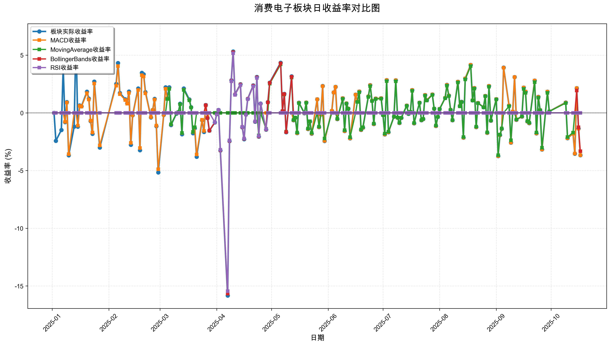
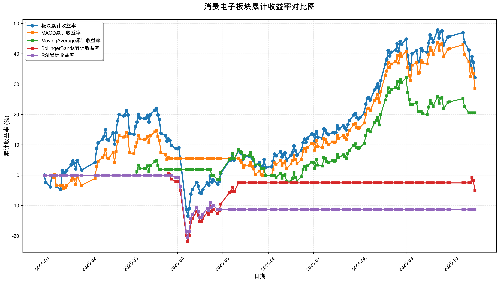

# 策略回测结果报告

**生成时间**: 2025-10-19 19:07:25
**行业板块**: 消费电子
**回测期间**: 20250101 至 20251017
**策略数量**: 4

## 📈 分析结论

### 策略表现分析
- **最佳策略**: MACD (总收益率: 28.53%)
- **最差策略**: RSI (总收益率: -11.28%)
### 交易活跃度分析
- **活跃策略**: 4 个
- **非活跃策略**: 0 个
- **最活跃策略**: MovingAverage (交易次数: 20)
### 🚨 异动提醒分析
- **板块异动**: 消费电子 近两周出现大幅波动 (最大单日: 3.67%)
- **策略异动**: MACD 近两周出现大幅波动 (最大单日: 3.67%)
- **策略异动**: MovingAverage 近两周出现大幅波动 (最大单日: 3.02%)
- **策略异动**: BollingerBands 近两周出现大幅波动 (最大单日: 3.32%)
### 风险分析
- **MACD**: 最大回撤 -13.03%, 夏普比率 1.5590
- **MovingAverage**: 最大回撤 -9.67%, 夏普比率 1.4578
- **BollingerBands**: 最大回撤 -22.45%, 夏普比率 -0.2942
- **RSI**: 最大回撤 -20.62%, 夏普比率 -0.7014

## 📊 综合结果表

| 策略名称           | 初始资金     | 最终价值     | 总收益率    | 年化收益率   | 波动率    |    夏普比率 | 最大回撤    | 总交易次数   | 买入次数   | 卖出次数   | 总交易金额      | 平均交易金额   | 交易频率   |   数据点数 |
|:---------------|:---------|:---------|:--------|:--------|:-------|--------:|:--------|:--------|:-------|:-------|:-----------|:---------|:-------|-------:|
| 板块实际表现         | ¥100,000 | ¥132,160 | 32.16%  | 44.75%  | 35.81% |  1.2495 | -29.04% | N/A     | N/A    | N/A    | N/A        | N/A      | N/A    |    190 |
| MACD           | ¥100,000 | ¥128,526 | 28.53%  | 39.49%  | 25.33% |  1.559  | -13.03% | 6       | 3      | 3      | ¥614,110   | ¥102,352 | 0.03   |    190 |
| MovingAverage  | ¥100,000 | ¥120,482 | 20.48%  | 28.03%  | 19.23% |  1.4578 | -9.67%  | 20      | 10     | 10     | ¥2,010,319 | ¥100,516 | 0.11   |    190 |
| BollingerBands | ¥100,000 | ¥94,837  | -5.16%  | -6.79%  | 23.08% | -0.2942 | -22.45% | 3       | 2      | 1      | ¥283,691   | ¥94,564  | 0.02   |    190 |
| RSI            | ¥100,000 | ¥88,720  | -11.28% | -14.68% | 20.93% | -0.7014 | -20.62% | 2       | 1      | 1      | ¥184,156   | ¥92,078  | 0.01   |    190 |

## 📊 每日收益率走势图

*图1: 消费电子板块每日收益率走势对比*

## 📈 累计收益率走势图

*图2: 消费电子板块累计收益率走势对比*

## 📅 日收益明细表

| 日期         | 板块实际收益率   | MACD收益率   | MovingAverage收益率   | BollingerBands收益率   | RSI收益率   |
|:-----------|:----------|:----------|:-------------------|:--------------------|:---------|
| 2025-01-02 | 0.00%     | 0.00%     | 0.00%              | 0.00%               | 0.00%    |
| 2025-01-03 | -2.42%    | 0.00%     | 0.00%              | 0.00%               | 0.00%    |
| 2025-01-06 | -1.48%    | 0.00%     | 0.00%              | 0.00%               | 0.00%    |
| 2025-01-07 | 3.99%     | 0.00%     | 0.00%              | 0.00%               | 0.00%    |
| 2025-01-08 | -0.80%    | -0.77%    | 0.00%              | 0.00%               | 0.00%    |
| 2025-01-09 | 0.93%     | 0.90%     | 0.00%              | 0.00%               | 0.00%    |
| 2025-01-10 | -3.68%    | -3.58%    | 0.00%              | 0.00%               | 0.00%    |
| 2025-01-13 | -1.20%    | 0.00%     | 0.00%              | 0.00%               | 0.00%    |
| 2025-01-14 | 6.61%     | 0.00%     | 0.00%              | 0.00%               | 0.00%    |
| 2025-01-15 | -1.19%    | -1.11%    | 0.00%              | 0.00%               | 0.00%    |
| 2025-01-16 | 0.64%     | 0.60%     | 0.00%              | 0.00%               | 0.00%    |
| 2025-01-17 | 0.57%     | 0.54%     | 0.00%              | 0.00%               | 0.00%    |
| 2025-01-20 | 1.83%     | 1.71%     | 0.00%              | 0.00%               | 0.00%    |
| 2025-01-21 | 1.24%     | 1.16%     | 0.00%              | 0.00%               | 0.00%    |
| 2025-01-22 | -0.71%    | -0.67%    | 0.00%              | 0.00%               | 0.00%    |
| 2025-01-23 | -1.81%    | -1.70%    | 0.00%              | 0.00%               | 0.00%    |
| 2025-01-24 | 2.71%     | 2.54%     | 0.00%              | 0.00%               | 0.00%    |
| 2025-01-27 | -3.01%    | -2.82%    | 0.00%              | 0.00%               | 0.00%    |
| 2025-02-05 | 2.51%     | 2.35%     | 0.00%              | 0.00%               | 0.00%    |
| 2025-02-06 | 4.32%     | 4.05%     | 0.00%              | 0.00%               | 0.00%    |
| 2025-02-07 | 1.72%     | 1.62%     | 0.00%              | 0.00%               | 0.00%    |
| 2025-02-10 | 1.18%     | 1.11%     | 0.00%              | 0.00%               | 0.00%    |
| 2025-02-11 | 0.83%     | 0.79%     | 0.00%              | 0.00%               | 0.00%    |
| 2025-02-12 | 1.85%     | 1.74%     | 0.00%              | 0.00%               | 0.00%    |
| 2025-02-13 | -2.76%    | -2.60%    | 0.00%              | 0.00%               | 0.00%    |
| 2025-02-14 | -0.21%    | -0.19%    | 0.00%              | 0.00%               | 0.00%    |
| 2025-02-17 | 2.12%     | 1.99%     | 0.00%              | 0.00%               | 0.00%    |
| 2025-02-18 | -3.23%    | -3.04%    | 0.00%              | 0.00%               | 0.00%    |
| 2025-02-19 | 3.47%     | 3.27%     | 0.00%              | 0.00%               | 0.00%    |
| 2025-02-20 | 3.34%     | 3.15%     | 0.00%              | 0.00%               | 0.00%    |
| 2025-02-21 | 1.80%     | 1.70%     | 0.00%              | 0.00%               | 0.00%    |
| 2025-02-24 | -0.39%    | -0.37%    | 0.00%              | 0.00%               | 0.00%    |
| 2025-02-25 | 0.25%     | 0.24%     | 0.00%              | 0.00%               | 0.00%    |
| 2025-02-26 | 1.21%     | 1.15%     | 0.00%              | 0.00%               | 0.00%    |
| 2025-02-27 | -1.16%    | -1.10%    | 0.00%              | 0.00%               | 0.00%    |
| 2025-02-28 | -5.16%    | -4.88%    | 0.00%              | 0.00%               | 0.00%    |
| 2025-03-03 | -0.18%    | -0.17%    | 0.00%              | 0.00%               | 0.00%    |
| 2025-03-04 | 2.21%     | 2.09%     | 0.00%              | 0.00%               | 0.00%    |
| 2025-03-05 | 1.28%     | 1.21%     | 1.20%              | 0.00%               | 0.00%    |
| 2025-03-06 | 2.21%     | 2.09%     | 2.08%              | 0.00%               | 0.00%    |
| 2025-03-07 | -1.06%    | -1.00%    | -0.99%             | 0.00%               | 0.00%    |
| 2025-03-10 | -0.06%    | -0.05%    | -0.05%             | 0.00%               | 0.00%    |
| 2025-03-11 | 0.06%     | 0.06%     | 0.06%              | 0.00%               | 0.00%    |
| 2025-03-12 | 0.79%     | 0.74%     | 0.74%              | 0.00%               | 0.00%    |
| 2025-03-13 | -1.85%    | -1.75%    | -1.74%             | 0.00%               | 0.00%    |
| 2025-03-14 | 2.12%     | 2.00%     | 1.99%              | 0.00%               | 0.00%    |
| 2025-03-17 | 1.16%     | 1.10%     | 1.09%              | 0.00%               | 0.00%    |
| 2025-03-18 | 0.49%     | 0.47%     | 0.47%              | 0.00%               | 0.00%    |
| 2025-03-19 | -1.76%    | -1.66%    | -1.65%             | 0.00%               | 0.00%    |
| 2025-03-20 | -1.32%    | -1.24%    | -1.24%             | 0.00%               | 0.00%    |
| 2025-03-21 | -3.80%    | -3.60%    | 0.00%              | 0.00%               | 0.00%    |
| 2025-03-24 | -0.64%    | -0.60%    | 0.00%              | 0.00%               | 0.00%    |
| 2025-03-25 | -1.65%    | -1.56%    | 0.00%              | 0.00%               | 0.00%    |
| 2025-03-26 | 0.68%     | 0.64%     | 0.00%              | 0.67%               | 0.00%    |
| 2025-03-27 | -0.45%    | -0.43%    | 0.00%              | -0.45%              | 0.00%    |
| 2025-03-28 | -1.54%    | 0.00%     | 0.00%              | -1.53%              | 0.00%    |
| 2025-03-31 | -0.83%    | 0.00%     | 0.00%              | -0.82%              | -0.81%   |
| 2025-04-01 | -0.10%    | 0.00%     | 0.00%              | -0.10%              | -0.09%   |
| 2025-04-02 | 0.25%     | 0.00%     | 0.00%              | 0.25%               | 0.25%    |
| 2025-04-03 | -3.26%    | 0.00%     | 0.00%              | -3.23%              | -3.19%   |
| 2025-04-07 | -15.83%   | 0.00%     | 0.00%              | -15.66%             | -15.45%  |
| 2025-04-08 | -2.45%    | 0.00%     | 0.00%              | -2.42%              | -2.38%   |
| 2025-04-09 | 2.82%     | 0.00%     | 0.00%              | 2.78%               | 2.74%    |
| 2025-04-10 | 5.32%     | 0.00%     | 0.00%              | 5.26%               | 5.17%    |
| 2025-04-11 | 1.60%     | 0.00%     | 0.00%              | 1.58%               | 1.56%    |
| 2025-04-14 | 2.48%     | 0.00%     | 0.00%              | 2.45%               | 2.41%    |
| 2025-04-15 | -1.24%    | 0.00%     | 0.00%              | -1.23%              | -1.21%   |
| 2025-04-16 | -2.28%    | 0.00%     | 0.00%              | -2.25%              | -2.22%   |
| 2025-04-17 | -0.14%    | 0.00%     | 0.00%              | -0.14%              | -0.13%   |
| 2025-04-18 | 1.22%     | 0.00%     | 0.00%              | 1.21%               | 1.19%    |
| 2025-04-21 | 2.38%     | 0.00%     | 0.00%              | 2.35%               | 2.31%    |
| 2025-04-22 | -0.76%    | 0.00%     | 0.00%              | -0.75%              | -0.74%   |
| 2025-04-23 | 3.11%     | 0.00%     | 0.00%              | 3.08%               | 3.03%    |
| 2025-04-24 | -2.06%    | 0.00%     | -1.96%             | -2.04%              | -2.01%   |
| 2025-04-25 | 0.81%     | 0.00%     | 0.00%              | 0.80%               | 0.79%    |
| 2025-04-28 | -1.45%    | 0.00%     | -1.39%             | -1.43%              | -1.41%   |
| 2025-04-29 | 0.93%     | 0.00%     | 0.00%              | 0.91%               | 0.00%    |
| 2025-04-30 | 2.62%     | 0.00%     | 2.53%              | 2.59%               | 0.00%    |
| 2025-05-06 | 4.35%     | 0.00%     | 4.21%              | 4.30%               | 0.00%    |
| 2025-05-07 | 0.16%     | 0.00%     | 0.15%              | 0.15%               | 0.00%    |
| 2025-05-08 | 1.65%     | 0.00%     | 1.59%              | 1.63%               | 0.00%    |
| 2025-05-09 | -1.67%    | 0.00%     | -1.62%             | -1.66%              | 0.00%    |
| 2025-05-12 | 3.16%     | 0.00%     | 3.06%              | 3.13%               | 0.00%    |
| 2025-05-13 | -0.63%    | -0.63%    | -0.61%             | 0.00%               | 0.00%    |
| 2025-05-14 | -0.42%    | -0.42%    | -0.41%             | 0.00%               | 0.00%    |
| 2025-05-15 | -1.75%    | -1.75%    | -1.70%             | 0.00%               | 0.00%    |
| 2025-05-16 | 0.88%     | 0.87%     | 0.85%              | 0.00%               | 0.00%    |
| 2025-05-19 | -0.03%    | -0.03%    | -0.02%             | 0.00%               | 0.00%    |
| 2025-05-20 | 0.90%     | 0.90%     | 0.87%              | 0.00%               | 0.00%    |
| 2025-05-21 | -1.40%    | -1.40%    | -1.36%             | 0.00%               | 0.00%    |
| 2025-05-22 | -0.75%    | -0.74%    | -0.72%             | 0.00%               | 0.00%    |
| 2025-05-23 | -1.80%    | -1.79%    | -1.74%             | 0.00%               | 0.00%    |
| 2025-05-26 | 1.18%     | 1.18%     | 0.00%              | 0.00%               | 0.00%    |
| 2025-05-27 | -1.23%    | -1.23%    | -1.20%             | 0.00%               | 0.00%    |
| 2025-05-28 | -0.14%    | -0.14%    | 0.00%              | 0.00%               | 0.00%    |
| 2025-05-29 | 2.33%     | 2.32%     | 0.00%              | 0.00%               | 0.00%    |
| 2025-05-30 | -2.43%    | -2.42%    | -2.22%             | 0.00%               | 0.00%    |
| 2025-06-03 | 0.17%     | 0.17%     | 0.00%              | 0.00%               | 0.00%    |
| 2025-06-04 | 1.77%     | 1.77%     | 0.00%              | 0.00%               | 0.00%    |
| 2025-06-05 | 2.25%     | 2.25%     | 0.00%              | 0.00%               | 0.00%    |
| 2025-06-06 | -0.54%    | -0.54%    | -0.51%             | 0.00%               | 0.00%    |
| 2025-06-09 | 1.27%     | 1.27%     | 1.21%              | 0.00%               | 0.00%    |
| 2025-06-10 | -1.57%    | -1.57%    | -1.50%             | 0.00%               | 0.00%    |
| 2025-06-11 | 0.82%     | 0.82%     | 0.79%              | 0.00%               | 0.00%    |
| 2025-06-12 | 0.37%     | 0.37%     | 0.35%              | 0.00%               | 0.00%    |
| 2025-06-13 | -2.21%    | -2.21%    | -2.11%             | 0.00%               | 0.00%    |
| 2025-06-16 | 1.58%     | 1.58%     | 0.00%              | 0.00%               | 0.00%    |
| 2025-06-17 | 0.98%     | 0.98%     | 0.95%              | 0.00%               | 0.00%    |
| 2025-06-18 | 1.85%     | 1.85%     | 1.79%              | 0.00%               | 0.00%    |
| 2025-06-19 | -1.47%    | -1.47%    | -1.43%             | 0.00%               | 0.00%    |
| 2025-06-20 | -1.28%    | -1.28%    | -1.24%             | 0.00%               | 0.00%    |
| 2025-06-23 | 1.43%     | 1.42%     | 1.38%              | 0.00%               | 0.00%    |
| 2025-06-24 | 2.40%     | 2.39%     | 2.32%              | 0.00%               | 0.00%    |
| 2025-06-25 | 1.05%     | 1.05%     | 1.02%              | 0.00%               | 0.00%    |
| 2025-06-26 | -0.96%    | -0.96%    | -0.93%             | 0.00%               | 0.00%    |
| 2025-06-27 | 1.24%     | 1.24%     | 1.20%              | 0.00%               | 0.00%    |
| 2025-06-30 | 1.27%     | 1.27%     | 1.23%              | 0.00%               | 0.00%    |
| 2025-07-01 | -0.19%    | -0.19%    | -0.19%             | 0.00%               | 0.00%    |
| 2025-07-02 | -1.86%    | -1.86%    | -1.80%             | 0.00%               | 0.00%    |
| 2025-07-03 | 2.83%     | 2.83%     | 2.75%              | 0.00%               | 0.00%    |
| 2025-07-04 | -1.68%    | -1.68%    | -1.63%             | 0.00%               | 0.00%    |
| 2025-07-07 | -0.33%    | -0.33%    | -0.32%             | 0.00%               | 0.00%    |
| 2025-07-08 | 2.82%     | 2.82%     | 2.74%              | 0.00%               | 0.00%    |
| 2025-07-09 | -0.42%    | -0.42%    | -0.41%             | 0.00%               | 0.00%    |
| 2025-07-10 | -0.88%    | -0.88%    | -0.85%             | 0.00%               | 0.00%    |
| 2025-07-11 | -0.43%    | -0.43%    | -0.42%             | 0.00%               | 0.00%    |
| 2025-07-14 | 0.63%     | 0.63%     | 0.61%              | 0.00%               | 0.00%    |
| 2025-07-15 | -0.08%    | -0.08%    | -0.08%             | 0.00%               | 0.00%    |
| 2025-07-16 | 0.09%     | 0.09%     | 0.09%              | 0.00%               | 0.00%    |
| 2025-07-17 | 1.97%     | 1.97%     | 1.91%              | 0.00%               | 0.00%    |
| 2025-07-18 | -0.90%    | -0.90%    | -0.88%             | 0.00%               | 0.00%    |
| 2025-07-21 | 0.89%     | 0.89%     | 0.87%              | 0.00%               | 0.00%    |
| 2025-07-22 | -0.64%    | -0.64%    | -0.62%             | 0.00%               | 0.00%    |
| 2025-07-23 | -0.54%    | -0.54%    | -0.52%             | 0.00%               | 0.00%    |
| 2025-07-24 | 1.54%     | 1.54%     | 1.49%              | 0.00%               | 0.00%    |
| 2025-07-25 | 1.10%     | 1.10%     | 1.07%              | 0.00%               | 0.00%    |
| 2025-07-28 | 1.60%     | 1.60%     | 1.55%              | 0.00%               | 0.00%    |
| 2025-07-29 | 0.37%     | 0.37%     | 0.36%              | 0.00%               | 0.00%    |
| 2025-07-30 | -1.13%    | -1.13%    | -1.09%             | 0.00%               | 0.00%    |
| 2025-07-31 | -0.35%    | -0.35%    | -0.34%             | 0.00%               | 0.00%    |
| 2025-08-01 | 0.34%     | 0.34%     | 0.33%              | 0.00%               | 0.00%    |
| 2025-08-04 | 1.29%     | 1.29%     | 1.26%              | 0.00%               | 0.00%    |
| 2025-08-05 | 2.43%     | 2.42%     | 2.36%              | 0.00%               | 0.00%    |
| 2025-08-06 | 1.50%     | 1.49%     | 1.45%              | 0.00%               | 0.00%    |
| 2025-08-07 | 0.26%     | 0.26%     | 0.25%              | 0.00%               | 0.00%    |
| 2025-08-08 | -0.64%    | -0.64%    | -0.62%             | 0.00%               | 0.00%    |
| 2025-08-11 | 2.70%     | 2.70%     | 2.63%              | 0.00%               | 0.00%    |
| 2025-08-12 | 0.59%     | 0.59%     | 0.57%              | 0.00%               | 0.00%    |
| 2025-08-13 | 0.96%     | 0.95%     | 0.93%              | 0.00%               | 0.00%    |
| 2025-08-14 | -2.15%    | -2.15%    | -2.09%             | 0.00%               | 0.00%    |
| 2025-08-15 | 2.98%     | 2.98%     | 2.90%              | 0.00%               | 0.00%    |
| 2025-08-18 | 4.16%     | 4.15%     | 4.05%              | 0.00%               | 0.00%    |
| 2025-08-19 | 1.09%     | 1.09%     | 1.07%              | 0.00%               | 0.00%    |
| 2025-08-20 | 2.15%     | 2.15%     | 2.10%              | 0.00%               | 0.00%    |
| 2025-08-21 | -1.23%    | -1.23%    | -1.20%             | 0.00%               | 0.00%    |
| 2025-08-22 | 0.86%     | 0.86%     | 0.84%              | 0.00%               | 0.00%    |
| 2025-08-25 | 0.49%     | 0.49%     | 0.48%              | 0.00%               | 0.00%    |
| 2025-08-26 | 1.47%     | 1.47%     | 1.44%              | 0.00%               | 0.00%    |
| 2025-08-27 | -1.73%    | -1.73%    | -1.69%             | 0.00%               | 0.00%    |
| 2025-08-28 | 2.33%     | 2.33%     | 2.27%              | 0.00%               | 0.00%    |
| 2025-08-29 | -0.67%    | -0.67%    | -0.66%             | 0.00%               | 0.00%    |
| 2025-09-01 | 1.19%     | 1.19%     | 1.16%              | 0.00%               | 0.00%    |
| 2025-09-02 | -3.74%    | -3.74%    | -3.66%             | 0.00%               | 0.00%    |
| 2025-09-03 | -1.93%    | -1.92%    | -1.88%             | 0.00%               | 0.00%    |
| 2025-09-04 | -1.38%    | -1.37%    | -1.34%             | 0.00%               | 0.00%    |
| 2025-09-05 | 3.92%     | 3.91%     | 0.00%              | 0.00%               | 0.00%    |
| 2025-09-08 | 0.63%     | 0.63%     | 0.58%              | 0.00%               | 0.00%    |
| 2025-09-09 | -2.57%    | -2.57%    | -2.37%             | 0.00%               | 0.00%    |
| 2025-09-10 | 0.11%     | 0.11%     | 0.00%              | 0.00%               | 0.00%    |
| 2025-09-11 | 3.10%     | 3.10%     | 0.00%              | 0.00%               | 0.00%    |
| 2025-09-12 | -0.60%    | -0.60%    | -0.57%             | 0.00%               | 0.00%    |
| 2025-09-15 | -0.32%    | -0.32%    | -0.30%             | 0.00%               | 0.00%    |
| 2025-09-16 | 2.19%     | 2.19%     | 2.08%              | 0.00%               | 0.00%    |
| 2025-09-17 | 1.84%     | 1.83%     | 1.74%              | 0.00%               | 0.00%    |
| 2025-09-18 | -0.74%    | -0.74%    | -0.71%             | 0.00%               | 0.00%    |
| 2025-09-19 | -0.89%    | -0.89%    | -0.85%             | 0.00%               | 0.00%    |
| 2025-09-22 | 2.80%     | 2.80%     | 2.66%              | 0.00%               | 0.00%    |
| 2025-09-23 | -1.78%    | -1.78%    | -1.70%             | 0.00%               | 0.00%    |
| 2025-09-24 | 1.39%     | 1.38%     | 1.32%              | 0.00%               | 0.00%    |
| 2025-09-25 | 0.24%     | 0.24%     | 0.23%              | 0.00%               | 0.00%    |
| 2025-09-26 | -3.17%    | -3.17%    | -3.02%             | 0.00%               | 0.00%    |
| 2025-09-29 | 1.83%     | 1.83%     | 1.74%              | 0.00%               | 0.00%    |
| 2025-09-30 | 0.13%     | 0.13%     | 0.12%              | 0.00%               | 0.00%    |
| 2025-10-09 | 0.90%     | 0.89%     | 0.85%              | 0.00%               | 0.00%    |
| 2025-10-10 | -2.19%    | -2.19%    | -2.09%             | 0.00%               | 0.00%    |
| 2025-10-13 | -1.80%    | -1.80%    | -1.71%             | 0.00%               | 0.00%    |
| 2025-10-14 | -3.54%    | -3.53%    | 0.00%              | 0.00%               | 0.00%    |
| 2025-10-15 | 2.14%     | 2.14%     | 0.00%              | 1.94%               | 0.00%    |
| 2025-10-16 | -1.36%    | -1.36%    | 0.00%              | -1.24%              | 0.00%    |
| 2025-10-17 | -3.67%    | -3.67%    | 0.00%              | -3.32%              | 0.00%    |

## 📊 日收益统计摘要

| 指标                | 平均日收益率   | 最大日收益率   | 最小日收益率   | 正收益天数   | 负收益天数   |
|:------------------|:---------|:---------|:---------|:--------|:--------|
| 板块实际收益率           | 0.17%    | 6.61%    | -15.83%  | 102天    | 87天     |
| MACD收益率           | 0.14%    | 4.15%    | -4.88%   | 85天     | 71天     |
| MovingAverage收益率  | 0.11%    | 4.21%    | -3.66%   | 60天     | 53天     |
| BollingerBands收益率 | -0.02%   | 5.26%    | -15.66%  | 17天     | 16天     |
| RSI收益率            | -0.05%   | 5.17%    | -15.45%  | 9天      | 11天     |

## 📈 累计收益明细表

| 日期         | 板块累计收益率   | MACD累计收益率   | MovingAverage累计收益率   | BollingerBands累计收益率   | RSI累计收益率   |
|:-----------|:----------|:------------|:---------------------|:----------------------|:-----------|
| 2025-01-02 | 0.00%     | 0.00%       | 0.00%                | 0.00%                 | 0.00%      |
| 2025-01-03 | -2.42%    | 0.00%       | 0.00%                | 0.00%                 | 0.00%      |
| 2025-01-06 | -3.87%    | 0.00%       | 0.00%                | 0.00%                 | 0.00%      |
| 2025-01-07 | -0.03%    | 0.00%       | 0.00%                | 0.00%                 | 0.00%      |
| 2025-01-08 | -0.83%    | -0.77%      | 0.00%                | 0.00%                 | 0.00%      |
| 2025-01-09 | 0.09%     | 0.12%       | 0.00%                | 0.00%                 | 0.00%      |
| 2025-01-10 | -3.59%    | -3.46%      | 0.00%                | 0.00%                 | 0.00%      |
| 2025-01-13 | -4.75%    | -3.46%      | 0.00%                | 0.00%                 | 0.00%      |
| 2025-01-14 | 1.54%     | -3.46%      | 0.00%                | 0.00%                 | 0.00%      |
| 2025-01-15 | 0.34%     | -4.53%      | 0.00%                | 0.00%                 | 0.00%      |
| 2025-01-16 | 0.98%     | -3.96%      | 0.00%                | 0.00%                 | 0.00%      |
| 2025-01-17 | 1.56%     | -3.44%      | 0.00%                | 0.00%                 | 0.00%      |
| 2025-01-20 | 3.41%     | -1.79%      | 0.00%                | 0.00%                 | 0.00%      |
| 2025-01-21 | 4.70%     | -0.65%      | 0.00%                | 0.00%                 | 0.00%      |
| 2025-01-22 | 3.95%     | -1.31%      | 0.00%                | 0.00%                 | 0.00%      |
| 2025-01-23 | 2.07%     | -2.99%      | 0.00%                | 0.00%                 | 0.00%      |
| 2025-01-24 | 4.84%     | -0.53%      | 0.00%                | 0.00%                 | 0.00%      |
| 2025-01-27 | 1.68%     | -3.33%      | 0.00%                | 0.00%                 | 0.00%      |
| 2025-02-05 | 4.24%     | -1.06%      | 0.00%                | 0.00%                 | 0.00%      |
| 2025-02-06 | 8.74%     | 2.95%       | 0.00%                | 0.00%                 | 0.00%      |
| 2025-02-07 | 10.61%    | 4.62%       | 0.00%                | 0.00%                 | 0.00%      |
| 2025-02-10 | 11.92%    | 5.78%       | 0.00%                | 0.00%                 | 0.00%      |
| 2025-02-11 | 12.86%    | 6.62%       | 0.00%                | 0.00%                 | 0.00%      |
| 2025-02-12 | 14.94%    | 8.48%       | 0.00%                | 0.00%                 | 0.00%      |
| 2025-02-13 | 11.77%    | 5.65%       | 0.00%                | 0.00%                 | 0.00%      |
| 2025-02-14 | 11.54%    | 5.44%       | 0.00%                | 0.00%                 | 0.00%      |
| 2025-02-17 | 13.90%    | 7.55%       | 0.00%                | 0.00%                 | 0.00%      |
| 2025-02-18 | 10.23%    | 4.27%       | 0.00%                | 0.00%                 | 0.00%      |
| 2025-02-19 | 14.05%    | 7.68%       | 0.00%                | 0.00%                 | 0.00%      |
| 2025-02-20 | 17.87%    | 11.08%      | 0.00%                | 0.00%                 | 0.00%      |
| 2025-02-21 | 19.99%    | 12.97%      | 0.00%                | 0.00%                 | 0.00%      |
| 2025-02-24 | 19.51%    | 12.55%      | 0.00%                | 0.00%                 | 0.00%      |
| 2025-02-25 | 19.82%    | 12.81%      | 0.00%                | 0.00%                 | 0.00%      |
| 2025-02-26 | 21.27%    | 14.11%      | 0.00%                | 0.00%                 | 0.00%      |
| 2025-02-27 | 19.86%    | 12.85%      | 0.00%                | 0.00%                 | 0.00%      |
| 2025-02-28 | 13.67%    | 7.34%       | 0.00%                | 0.00%                 | 0.00%      |
| 2025-03-03 | 13.46%    | 7.16%       | 0.00%                | 0.00%                 | 0.00%      |
| 2025-03-04 | 15.98%    | 9.40%       | 0.00%                | 0.00%                 | 0.00%      |
| 2025-03-05 | 17.46%    | 10.72%      | 1.20%                | 0.00%                 | 0.00%      |
| 2025-03-06 | 20.06%    | 13.03%      | 3.31%                | 0.00%                 | 0.00%      |
| 2025-03-07 | 18.79%    | 11.90%      | 2.28%                | 0.00%                 | 0.00%      |
| 2025-03-10 | 18.73%    | 11.84%      | 2.23%                | 0.00%                 | 0.00%      |
| 2025-03-11 | 18.80%    | 11.91%      | 2.29%                | 0.00%                 | 0.00%      |
| 2025-03-12 | 19.73%    | 12.74%      | 3.04%                | 0.00%                 | 0.00%      |
| 2025-03-13 | 17.52%    | 10.77%      | 1.25%                | 0.00%                 | 0.00%      |
| 2025-03-14 | 20.02%    | 12.99%      | 3.27%                | 0.00%                 | 0.00%      |
| 2025-03-17 | 21.41%    | 14.23%      | 4.40%                | 0.00%                 | 0.00%      |
| 2025-03-18 | 22.01%    | 14.76%      | 4.88%                | 0.00%                 | 0.00%      |
| 2025-03-19 | 19.86%    | 12.86%      | 3.15%                | 0.00%                 | 0.00%      |
| 2025-03-20 | 18.29%    | 11.45%      | 1.87%                | 0.00%                 | 0.00%      |
| 2025-03-21 | 13.79%    | 7.44%       | 1.87%                | 0.00%                 | 0.00%      |
| 2025-03-24 | 13.06%    | 6.80%       | 1.87%                | 0.00%                 | 0.00%      |
| 2025-03-25 | 11.19%    | 5.13%       | 1.87%                | 0.00%                 | 0.00%      |
| 2025-03-26 | 11.95%    | 5.81%       | 1.87%                | 0.67%                 | 0.00%      |
| 2025-03-27 | 11.44%    | 5.36%       | 1.87%                | 0.22%                 | 0.00%      |
| 2025-03-28 | 9.72%     | 5.36%       | 1.87%                | -1.31%                | 0.00%      |
| 2025-03-31 | 8.81%     | 5.36%       | 1.87%                | -2.12%                | -0.81%     |
| 2025-04-01 | 8.71%     | 5.36%       | 1.87%                | -2.21%                | -0.90%     |
| 2025-04-02 | 8.98%     | 5.36%       | 1.87%                | -1.97%                | -0.66%     |
| 2025-04-03 | 5.43%     | 5.36%       | 1.87%                | -5.13%                | -3.82%     |
| 2025-04-07 | -11.26%   | 5.36%       | 1.87%                | -19.99%               | -18.68%    |
| 2025-04-08 | -13.43%   | 5.36%       | 1.87%                | -21.93%               | -20.62%    |
| 2025-04-09 | -10.99%   | 5.36%       | 1.87%                | -19.76%               | -18.45%    |
| 2025-04-10 | -6.26%    | 5.36%       | 1.87%                | -15.54%               | -14.23%    |
| 2025-04-11 | -4.76%    | 5.36%       | 1.87%                | -14.20%               | -12.89%    |
| 2025-04-14 | -2.39%    | 5.36%       | 1.87%                | -12.10%               | -10.79%    |
| 2025-04-15 | -3.61%    | 5.36%       | 1.87%                | -13.18%               | -11.87%    |
| 2025-04-16 | -5.80%    | 5.36%       | 1.87%                | -15.14%               | -13.83%    |
| 2025-04-17 | -5.93%    | 5.36%       | 1.87%                | -15.25%               | -13.94%    |
| 2025-04-18 | -4.79%    | 5.36%       | 1.87%                | -14.23%               | -12.92%    |
| 2025-04-21 | -2.52%    | 5.36%       | 1.87%                | -12.22%               | -10.90%    |
| 2025-04-22 | -3.26%    | 5.36%       | 1.87%                | -12.88%               | -11.56%    |
| 2025-04-23 | -0.25%    | 5.36%       | 1.87%                | -10.19%               | -8.88%     |
| 2025-04-24 | -2.31%    | 5.36%       | -0.13%               | -12.02%               | -10.71%    |
| 2025-04-25 | -1.52%    | 5.36%       | -0.13%               | -11.32%               | -10.01%    |
| 2025-04-28 | -2.94%    | 5.36%       | -1.51%               | -12.59%               | -11.28%    |
| 2025-04-29 | -2.05%    | 5.36%       | -1.51%               | -11.79%               | -11.28%    |
| 2025-04-30 | 0.51%     | 5.36%       | 0.98%                | -9.51%                | -11.28%    |
| 2025-05-06 | 4.89%     | 5.36%       | 5.23%                | -5.62%                | -11.28%    |
| 2025-05-07 | 5.05%     | 5.36%       | 5.39%                | -5.47%                | -11.28%    |
| 2025-05-08 | 6.78%     | 5.36%       | 7.07%                | -3.93%                | -11.28%    |
| 2025-05-09 | 4.99%     | 5.36%       | 5.33%                | -5.52%                | -11.28%    |
| 2025-05-12 | 8.31%     | 5.36%       | 8.55%                | -2.57%                | -11.28%    |
| 2025-05-13 | 7.63%     | 4.69%       | 7.89%                | -2.57%                | -11.28%    |
| 2025-05-14 | 7.17%     | 4.25%       | 7.45%                | -2.57%                | -11.28%    |
| 2025-05-15 | 5.29%     | 2.42%       | 5.62%                | -2.57%                | -11.28%    |
| 2025-05-16 | 6.21%     | 3.32%       | 6.52%                | -2.57%                | -11.28%    |
| 2025-05-19 | 6.19%     | 3.29%       | 6.49%                | -2.57%                | -11.28%    |
| 2025-05-20 | 7.15%     | 4.22%       | 7.42%                | -2.57%                | -11.28%    |
| 2025-05-21 | 5.65%     | 2.77%       | 5.97%                | -2.57%                | -11.28%    |
| 2025-05-22 | 4.86%     | 2.00%       | 5.20%                | -2.57%                | -11.28%    |
| 2025-05-23 | 2.98%     | 0.17%       | 3.37%                | -2.57%                | -11.28%    |
| 2025-05-26 | 4.19%     | 1.35%       | 3.37%                | -2.57%                | -11.28%    |
| 2025-05-27 | 2.91%     | 0.11%       | 2.13%                | -2.57%                | -11.28%    |
| 2025-05-28 | 2.76%     | -0.03%      | 2.13%                | -2.57%                | -11.28%    |
| 2025-05-29 | 5.15%     | 2.29%       | 2.13%                | -2.57%                | -11.28%    |
| 2025-05-30 | 2.60%     | -0.19%      | -0.14%               | -2.57%                | -11.28%    |
| 2025-06-03 | 2.78%     | -0.02%      | -0.14%               | -2.57%                | -11.28%    |
| 2025-06-04 | 4.60%     | 1.75%       | -0.14%               | -2.57%                | -11.28%    |
| 2025-06-05 | 6.95%     | 4.04%       | -0.14%               | -2.57%                | -11.28%    |
| 2025-06-06 | 6.38%     | 3.48%       | -0.66%               | -2.57%                | -11.28%    |
| 2025-06-09 | 7.72%     | 4.79%       | 0.54%                | -2.57%                | -11.28%    |
| 2025-06-10 | 6.03%     | 3.14%       | -0.97%               | -2.57%                | -11.28%    |
| 2025-06-11 | 6.90%     | 3.99%       | -0.19%               | -2.57%                | -11.28%    |
| 2025-06-12 | 7.30%     | 4.37%       | 0.16%                | -2.57%                | -11.28%    |
| 2025-06-13 | 4.93%     | 2.07%       | -1.95%               | -2.57%                | -11.28%    |
| 2025-06-16 | 6.58%     | 3.68%       | -1.95%               | -2.57%                | -11.28%    |
| 2025-06-17 | 7.63%     | 4.69%       | -1.02%               | -2.57%                | -11.28%    |
| 2025-06-18 | 9.62%     | 6.63%       | 0.75%                | -2.57%                | -11.28%    |
| 2025-06-19 | 8.00%     | 5.06%       | -0.68%               | -2.57%                | -11.28%    |
| 2025-06-20 | 6.62%     | 3.71%       | -1.92%               | -2.57%                | -11.28%    |
| 2025-06-23 | 8.14%     | 5.19%       | -0.57%               | -2.57%                | -11.28%    |
| 2025-06-24 | 10.73%    | 7.70%       | 1.74%                | -2.57%                | -11.28%    |
| 2025-06-25 | 11.89%    | 8.83%       | 2.78%                | -2.57%                | -11.28%    |
| 2025-06-26 | 10.82%    | 7.79%       | 1.82%                | -2.57%                | -11.28%    |
| 2025-06-27 | 12.19%    | 9.13%       | 3.05%                | -2.57%                | -11.28%    |
| 2025-06-30 | 13.61%    | 10.51%      | 4.31%                | -2.57%                | -11.28%    |
| 2025-07-01 | 13.39%    | 10.29%      | 4.12%                | -2.57%                | -11.28%    |
| 2025-07-02 | 11.29%    | 8.25%       | 2.24%                | -2.57%                | -11.28%    |
| 2025-07-03 | 14.44%    | 11.31%      | 5.05%                | -2.57%                | -11.28%    |
| 2025-07-04 | 12.51%    | 9.44%       | 3.33%                | -2.57%                | -11.28%    |
| 2025-07-07 | 12.14%    | 9.08%       | 3.00%                | -2.57%                | -11.28%    |
| 2025-07-08 | 15.31%    | 12.15%      | 5.82%                | -2.57%                | -11.28%    |
| 2025-07-09 | 14.82%    | 11.68%      | 5.39%                | -2.57%                | -11.28%    |
| 2025-07-10 | 13.81%    | 10.70%      | 4.49%                | -2.57%                | -11.28%    |
| 2025-07-11 | 13.32%    | 10.22%      | 4.05%                | -2.57%                | -11.28%    |
| 2025-07-14 | 14.04%    | 10.92%      | 4.69%                | -2.57%                | -11.28%    |
| 2025-07-15 | 13.94%    | 10.83%      | 4.61%                | -2.57%                | -11.28%    |
| 2025-07-16 | 14.05%    | 10.93%      | 4.70%                | -2.57%                | -11.28%    |
| 2025-07-17 | 16.29%    | 13.11%      | 6.70%                | -2.57%                | -11.28%    |
| 2025-07-18 | 15.24%    | 12.09%      | 5.76%                | -2.57%                | -11.28%    |
| 2025-07-21 | 16.27%    | 13.09%      | 6.68%                | -2.57%                | -11.28%    |
| 2025-07-22 | 15.53%    | 12.37%      | 6.02%                | -2.57%                | -11.28%    |
| 2025-07-23 | 14.91%    | 11.77%      | 5.47%                | -2.57%                | -11.28%    |
| 2025-07-24 | 16.68%    | 13.49%      | 7.04%                | -2.57%                | -11.28%    |
| 2025-07-25 | 17.97%    | 14.74%      | 8.19%                | -2.57%                | -11.28%    |
| 2025-07-28 | 19.85%    | 16.57%      | 9.87%                | -2.57%                | -11.28%    |
| 2025-07-29 | 20.30%    | 17.00%      | 10.27%               | -2.57%                | -11.28%    |
| 2025-07-30 | 18.94%    | 15.68%      | 9.06%                | -2.57%                | -11.28%    |
| 2025-07-31 | 18.53%    | 15.28%      | 8.69%                | -2.57%                | -11.28%    |
| 2025-08-01 | 18.94%    | 15.68%      | 9.05%                | -2.57%                | -11.28%    |
| 2025-08-04 | 20.48%    | 17.17%      | 10.42%               | -2.57%                | -11.28%    |
| 2025-08-05 | 23.40%    | 20.01%      | 13.03%               | -2.57%                | -11.28%    |
| 2025-08-06 | 25.24%    | 21.81%      | 14.67%               | -2.57%                | -11.28%    |
| 2025-08-07 | 25.56%    | 22.12%      | 14.96%               | -2.57%                | -11.28%    |
| 2025-08-08 | 24.76%    | 21.34%      | 14.24%               | -2.57%                | -11.28%    |
| 2025-08-11 | 28.13%    | 24.61%      | 17.24%               | -2.57%                | -11.28%    |
| 2025-08-12 | 28.89%    | 25.35%      | 17.92%               | -2.57%                | -11.28%    |
| 2025-08-13 | 30.12%    | 26.55%      | 19.01%               | -2.57%                | -11.28%    |
| 2025-08-14 | 27.33%    | 23.83%      | 16.53%               | -2.57%                | -11.28%    |
| 2025-08-15 | 31.12%    | 27.52%      | 19.91%               | -2.57%                | -11.28%    |
| 2025-08-18 | 36.57%    | 32.81%      | 24.76%               | -2.57%                | -11.28%    |
| 2025-08-19 | 38.07%    | 34.26%      | 26.09%               | -2.57%                | -11.28%    |
| 2025-08-20 | 41.04%    | 37.15%      | 28.74%               | -2.57%                | -11.28%    |
| 2025-08-21 | 39.30%    | 35.46%      | 27.19%               | -2.57%                | -11.28%    |
| 2025-08-22 | 40.50%    | 36.62%      | 28.25%               | -2.57%                | -11.28%    |
| 2025-08-25 | 41.19%    | 37.30%      | 28.87%               | -2.57%                | -11.28%    |
| 2025-08-26 | 43.27%    | 39.32%      | 30.72%               | -2.57%                | -11.28%    |
| 2025-08-27 | 40.79%    | 36.91%      | 28.51%               | -2.57%                | -11.28%    |
| 2025-08-28 | 44.07%    | 40.10%      | 31.44%               | -2.57%                | -11.28%    |
| 2025-08-29 | 43.10%    | 39.15%      | 30.57%               | -2.57%                | -11.28%    |
| 2025-09-01 | 44.80%    | 40.81%      | 32.09%               | -2.57%                | -11.28%    |
| 2025-09-02 | 39.38%    | 35.54%      | 27.26%               | -2.57%                | -11.28%    |
| 2025-09-03 | 36.69%    | 32.93%      | 24.87%               | -2.57%                | -11.28%    |
| 2025-09-04 | 34.81%    | 31.10%      | 23.19%               | -2.57%                | -11.28%    |
| 2025-09-05 | 40.09%    | 36.23%      | 23.19%               | -2.57%                | -11.28%    |
| 2025-09-08 | 40.97%    | 37.09%      | 23.91%               | -2.57%                | -11.28%    |
| 2025-09-09 | 37.35%    | 33.57%      | 20.97%               | -2.57%                | -11.28%    |
| 2025-09-10 | 37.50%    | 33.71%      | 20.97%               | -2.57%                | -11.28%    |
| 2025-09-11 | 41.76%    | 37.86%      | 20.97%               | -2.57%                | -11.28%    |
| 2025-09-12 | 40.92%    | 37.03%      | 20.28%               | -2.57%                | -11.28%    |
| 2025-09-15 | 40.46%    | 36.59%      | 19.92%               | -2.57%                | -11.28%    |
| 2025-09-16 | 43.54%    | 39.58%      | 22.41%               | -2.57%                | -11.28%    |
| 2025-09-17 | 46.17%    | 42.14%      | 24.54%               | -2.57%                | -11.28%    |
| 2025-09-18 | 45.09%    | 41.08%      | 23.66%               | -2.57%                | -11.28%    |
| 2025-09-19 | 43.79%    | 39.83%      | 22.61%               | -2.57%                | -11.28%    |
| 2025-09-22 | 47.82%    | 43.74%      | 25.87%               | -2.57%                | -11.28%    |
| 2025-09-23 | 45.18%    | 41.18%      | 23.74%               | -2.57%                | -11.28%    |
| 2025-09-24 | 47.20%    | 43.14%      | 25.37%               | -2.57%                | -11.28%    |
| 2025-09-25 | 47.55%    | 43.48%      | 25.65%               | -2.57%                | -11.28%    |
| 2025-09-26 | 42.86%    | 38.93%      | 21.86%               | -2.57%                | -11.28%    |
| 2025-09-29 | 45.48%    | 41.46%      | 23.98%               | -2.57%                | -11.28%    |
| 2025-09-30 | 45.67%    | 41.65%      | 24.13%               | -2.57%                | -11.28%    |
| 2025-10-09 | 46.97%    | 42.92%      | 25.19%               | -2.57%                | -11.28%    |
| 2025-10-10 | 43.74%    | 39.78%      | 22.57%               | -2.57%                | -11.28%    |
| 2025-10-13 | 41.16%    | 37.27%      | 20.48%               | -2.57%                | -11.28%    |
| 2025-10-14 | 36.17%    | 32.42%      | 20.48%               | -2.57%                | -11.28%    |
| 2025-10-15 | 39.09%    | 35.26%      | 20.48%               | -0.67%                | -11.28%    |
| 2025-10-16 | 37.19%    | 33.42%      | 20.48%               | -1.90%                | -11.28%    |
| 2025-10-17 | 32.16%    | 28.53%      | 20.48%               | -5.16%                | -11.28%    |

## 📊 累计收益统计摘要

| 指标                  | 最终累计收益率   | 最大累计收益率   | 最小累计收益率   | 累计收益波动   | 收益稳定性   |
|:--------------------|:----------|:----------|:----------|:---------|:--------|
| 板块累计收益率             | 32.16%    | 47.82%    | -13.43%   | 61.25%   | 波动      |
| MACD累计收益率           | 28.53%    | 43.74%    | -4.53%    | 48.27%   | 波动      |
| MovingAverage累计收益率  | 20.48%    | 32.09%    | -1.95%    | 34.04%   | 波动      |
| BollingerBands累计收益率 | -5.16%    | 0.67%     | -21.93%   | 22.60%   | 波动      |
| RSI累计收益率            | -11.28%   | 0.00%     | -20.62%   | 20.62%   | 波动      |

