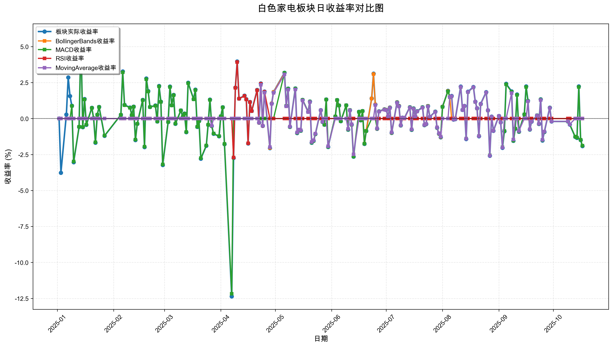
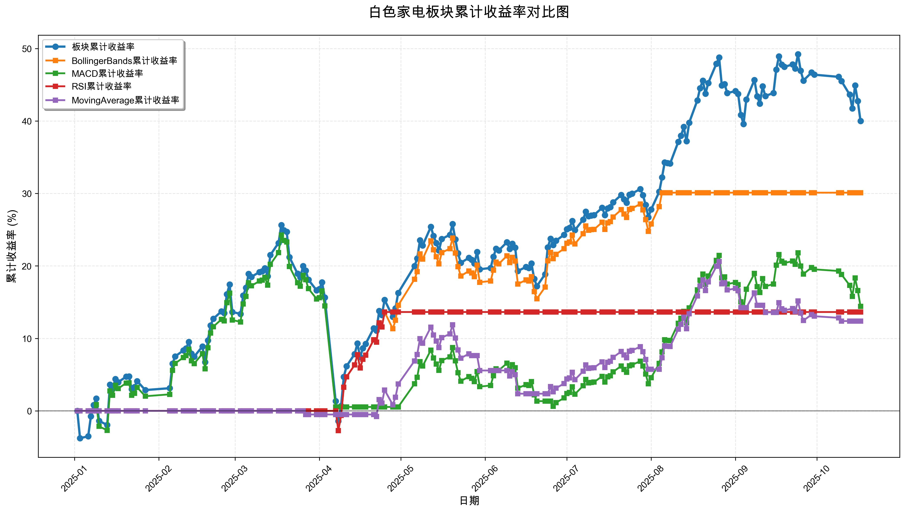

# 策略回测结果报告

**生成时间**: 2025-10-19 19:05:00
**行业板块**: 白色家电
**回测期间**: 20250101 至 20251017
**策略数量**: 4

## 📈 分析结论

### 策略表现分析
- **最佳策略**: BollingerBands (总收益率: 30.11%)
- **最差策略**: MovingAverage (总收益率: 12.39%)
### 交易活跃度分析
- **活跃策略**: 4 个
- **非活跃策略**: 0 个
- **最活跃策略**: MovingAverage (交易次数: 18)
### 🚨 异动提醒分析
- 未检测到明显异动情况
### 风险分析
- **BollingerBands**: 最大回撤 -6.75%, 夏普比率 3.0435
- **MACD**: 最大回撤 -19.08%, 夏普比率 0.8052
- **RSI**: 最大回撤 -2.71%, 夏普比率 2.2449
- **MovingAverage**: 最大回撤 -8.50%, 夏普比率 1.2986

## 📊 综合结果表

| 策略名称           | 初始资金     | 最终价值     | 总收益率   | 年化收益率   | 波动率    |   夏普比率 | 最大回撤    | 总交易次数   | 买入次数   | 卖出次数   | 总交易金额      | 平均交易金额   | 交易频率   |   数据点数 |
|:---------------|:---------|:---------|:-------|:--------|:-------|-------:|:--------|:--------|:-------|:-------|:-----------|:---------|:-------|-------:|
| 板块实际表现         | ¥100,000 | ¥140,010 | 40.01% | 56.26%  | 27.03% | 2.0813 | -21.54% | N/A     | N/A    | N/A    | N/A        | N/A      | N/A    |    190 |
| BollingerBands | ¥100,000 | ¥130,112 | 30.11% | 41.78%  | 13.73% | 3.0435 | -6.75%  | 3       | 2      | 1      | ¥356,527   | ¥118,842 | 0.02   |    190 |
| MACD           | ¥100,000 | ¥114,407 | 14.41% | 19.54%  | 24.27% | 0.8052 | -19.08% | 6       | 3      | 3      | ¥610,304   | ¥101,717 | 0.03   |    190 |
| RSI            | ¥100,000 | ¥113,638 | 13.64% | 18.48%  | 8.23%  | 2.2449 | -2.71%  | 2       | 1      | 1      | ¥211,458   | ¥105,729 | 0.01   |    190 |
| MovingAverage  | ¥100,000 | ¥112,393 | 12.39% | 16.76%  | 12.91% | 1.2986 | -8.50%  | 18      | 9      | 9      | ¥1,860,542 | ¥103,363 | 0.09   |    190 |

## 📊 每日收益率走势图

*图1: 白色家电板块每日收益率走势对比*

## 📈 累计收益率走势图

*图2: 白色家电板块累计收益率走势对比*

## 📅 日收益明细表

| 日期         | 板块实际收益率   | BollingerBands收益率   | MACD收益率   | RSI收益率   | MovingAverage收益率   |
|:-----------|:----------|:--------------------|:----------|:---------|:-------------------|
| 2025-01-02 | 0.00%     | 0.00%               | 0.00%     | 0.00%    | 0.00%              |
| 2025-01-03 | -3.77%    | 0.00%               | 0.00%     | 0.00%    | 0.00%              |
| 2025-01-06 | 0.28%     | 0.00%               | 0.00%     | 0.00%    | 0.00%              |
| 2025-01-07 | 2.86%     | 0.00%               | 0.00%     | 0.00%    | 0.00%              |
| 2025-01-08 | 1.56%     | 0.00%               | 0.00%     | 0.00%    | 0.00%              |
| 2025-01-09 | 0.89%     | 0.00%               | 0.88%     | 0.00%    | 0.00%              |
| 2025-01-10 | -3.03%    | 0.00%               | -2.98%    | 0.00%    | 0.00%              |
| 2025-01-13 | -0.58%    | 0.00%               | -0.57%    | 0.00%    | 0.00%              |
| 2025-01-14 | 5.69%     | 0.00%               | 5.60%     | 0.00%    | 0.00%              |
| 2025-01-15 | -0.60%    | 0.00%               | -0.59%    | 0.00%    | 0.00%              |
| 2025-01-16 | 1.36%     | 0.00%               | 1.33%     | 0.00%    | 0.00%              |
| 2025-01-17 | -0.43%    | 0.00%               | -0.42%    | 0.00%    | 0.00%              |
| 2025-01-20 | 0.75%     | 0.00%               | 0.74%     | 0.00%    | 0.00%              |
| 2025-01-21 | 0.02%     | 0.00%               | 0.02%     | 0.00%    | 0.00%              |
| 2025-01-22 | -1.68%    | 0.00%               | -1.65%    | 0.00%    | 0.00%              |
| 2025-01-23 | 0.27%     | 0.00%               | 0.27%     | 0.00%    | 0.00%              |
| 2025-01-24 | 0.81%     | 0.00%               | 0.80%     | 0.00%    | 0.00%              |
| 2025-01-27 | -1.20%    | 0.00%               | -1.18%    | 0.00%    | 0.00%              |
| 2025-02-05 | 0.26%     | 0.00%               | 0.26%     | 0.00%    | 0.00%              |
| 2025-02-06 | 3.28%     | 0.00%               | 3.22%     | 0.00%    | 0.00%              |
| 2025-02-07 | 0.95%     | 0.00%               | 0.93%     | 0.00%    | 0.00%              |
| 2025-02-10 | 0.77%     | 0.00%               | 0.75%     | 0.00%    | 0.00%              |
| 2025-02-11 | 0.24%     | 0.00%               | 0.24%     | 0.00%    | 0.00%              |
| 2025-02-12 | 0.83%     | 0.00%               | 0.82%     | 0.00%    | 0.00%              |
| 2025-02-13 | -1.49%    | 0.00%               | -1.46%    | 0.00%    | 0.00%              |
| 2025-02-14 | -0.36%    | 0.00%               | -0.36%    | 0.00%    | 0.00%              |
| 2025-02-17 | 1.30%     | 0.00%               | 1.28%     | 0.00%    | 0.00%              |
| 2025-02-18 | -1.98%    | 0.00%               | -1.95%    | 0.00%    | 0.00%              |
| 2025-02-19 | 2.79%     | 0.00%               | 2.74%     | 0.00%    | 0.00%              |
| 2025-02-20 | 1.91%     | 0.00%               | 1.88%     | 0.00%    | 0.00%              |
| 2025-02-21 | 0.81%     | 0.00%               | 0.80%     | 0.00%    | 0.00%              |
| 2025-02-24 | 0.91%     | 0.00%               | 0.89%     | 0.00%    | 0.00%              |
| 2025-02-25 | -0.20%    | 0.00%               | -0.20%    | 0.00%    | 0.00%              |
| 2025-02-26 | 2.27%     | 0.00%               | 2.24%     | 0.00%    | 0.00%              |
| 2025-02-27 | 1.18%     | 0.00%               | 1.16%     | 0.00%    | 0.00%              |
| 2025-02-28 | -3.23%    | 0.00%               | -3.19%    | 0.00%    | 0.00%              |
| 2025-03-03 | -0.24%    | 0.00%               | -0.23%    | 0.00%    | 0.00%              |
| 2025-03-04 | 2.23%     | 0.00%               | 2.20%     | 0.00%    | 0.00%              |
| 2025-03-05 | 0.93%     | 0.00%               | 0.91%     | 0.00%    | 0.00%              |
| 2025-03-06 | 1.65%     | 0.00%               | 1.62%     | 0.00%    | 0.00%              |
| 2025-03-07 | -0.36%    | 0.00%               | -0.35%    | 0.00%    | 0.00%              |
| 2025-03-10 | 0.56%     | 0.00%               | 0.56%     | 0.00%    | 0.00%              |
| 2025-03-11 | 0.11%     | 0.00%               | 0.11%     | 0.00%    | 0.00%              |
| 2025-03-12 | 0.35%     | 0.00%               | 0.34%     | 0.00%    | 0.00%              |
| 2025-03-13 | -0.94%    | 0.00%               | -0.93%    | 0.00%    | 0.00%              |
| 2025-03-14 | 2.49%     | 0.00%               | 2.46%     | 0.00%    | 0.00%              |
| 2025-03-17 | 1.36%     | 0.00%               | 1.34%     | 0.00%    | 0.00%              |
| 2025-03-18 | 2.01%     | 0.00%               | 1.98%     | 0.00%    | 0.00%              |
| 2025-03-19 | -0.58%    | 0.00%               | -0.57%    | 0.00%    | 0.00%              |
| 2025-03-20 | -0.17%    | 0.00%               | -0.17%    | 0.00%    | 0.00%              |
| 2025-03-21 | -2.79%    | 0.00%               | -2.75%    | 0.00%    | 0.00%              |
| 2025-03-24 | -1.89%    | 0.00%               | -1.87%    | 0.00%    | 0.00%              |
| 2025-03-25 | -0.43%    | 0.00%               | -0.42%    | 0.00%    | 0.00%              |
| 2025-03-26 | 1.32%     | 0.00%               | 1.30%     | 0.00%    | 0.00%              |
| 2025-03-27 | -0.52%    | 0.00%               | -0.52%    | 0.00%    | -0.50%             |
| 2025-03-28 | -1.06%    | 0.00%               | -1.04%    | 0.00%    | 0.00%              |
| 2025-03-31 | -1.23%    | 0.00%               | -1.22%    | 0.00%    | 0.00%              |
| 2025-04-01 | 0.16%     | 0.00%               | 0.16%     | 0.00%    | 0.00%              |
| 2025-04-02 | 0.79%     | 0.00%               | 0.78%     | 0.00%    | 0.00%              |
| 2025-04-03 | -1.78%    | 0.00%               | -1.76%    | 0.00%    | 0.00%              |
| 2025-04-07 | -12.36%   | 0.00%               | -12.18%   | 0.00%    | 0.00%              |
| 2025-04-08 | -2.74%    | -2.71%              | 0.00%     | -2.71%   | 0.00%              |
| 2025-04-09 | 2.15%     | 2.13%               | 0.00%     | 2.13%    | 0.00%              |
| 2025-04-10 | 3.97%     | 3.93%               | 0.00%     | 3.93%    | 0.00%              |
| 2025-04-11 | 1.39%     | 1.38%               | 0.00%     | 1.38%    | 0.00%              |
| 2025-04-14 | 1.59%     | 1.57%               | 0.00%     | 1.57%    | 0.00%              |
| 2025-04-15 | 1.35%     | 1.33%               | 0.00%     | 1.33%    | 0.00%              |
| 2025-04-16 | -1.73%    | -1.72%              | 0.00%     | -1.72%   | 0.00%              |
| 2025-04-17 | 1.16%     | 1.15%               | 0.00%     | 1.15%    | 0.00%              |
| 2025-04-18 | 0.53%     | 0.52%               | 0.00%     | 0.52%    | 0.00%              |
| 2025-04-21 | 1.99%     | 1.97%               | 0.00%     | 1.97%    | 0.00%              |
| 2025-04-22 | -0.28%    | -0.28%              | 0.00%     | -0.28%   | -0.27%             |
| 2025-04-23 | 2.44%     | 2.42%               | 0.00%     | 2.42%    | 2.35%              |
| 2025-04-24 | -0.51%    | -0.51%              | 0.00%     | -0.51%   | -0.50%             |
| 2025-04-25 | 1.88%     | 1.86%               | 0.00%     | 1.86%    | 1.81%              |
| 2025-04-28 | -2.05%    | -2.03%              | 0.00%     | 0.00%    | -1.98%             |
| 2025-04-29 | 1.05%     | 1.04%               | 0.00%     | 0.00%    | 1.02%              |
| 2025-04-30 | 1.85%     | 1.84%               | 0.00%     | 0.00%    | 1.79%              |
| 2025-05-06 | 3.18%     | 3.15%               | 3.17%     | 0.00%    | 3.07%              |
| 2025-05-07 | 0.88%     | 0.87%               | 0.88%     | 0.00%    | 0.85%              |
| 2025-05-08 | 2.08%     | 2.06%               | 2.07%     | 0.00%    | 2.01%              |
| 2025-05-09 | -0.58%    | -0.58%              | -0.58%    | 0.00%    | -0.56%             |
| 2025-05-12 | 2.09%     | 2.07%               | 2.08%     | 0.00%    | 2.02%              |
| 2025-05-13 | -1.00%    | -0.99%              | -0.99%    | 0.00%    | -0.96%             |
| 2025-05-14 | -0.78%    | -0.78%              | -0.78%    | 0.00%    | -0.76%             |
| 2025-05-15 | -0.84%    | -0.83%              | -0.84%    | 0.00%    | -0.81%             |
| 2025-05-16 | 1.30%     | 1.29%               | 1.30%     | 0.00%    | 1.26%              |
| 2025-05-19 | 0.47%     | 0.47%               | 0.47%     | 0.00%    | 0.45%              |
| 2025-05-20 | 1.19%     | 1.18%               | 1.18%     | 0.00%    | 1.15%              |
| 2025-05-21 | -1.68%    | -1.66%              | -1.67%    | 0.00%    | -1.63%             |
| 2025-05-22 | -1.55%    | -1.54%              | -1.55%    | 0.00%    | -1.50%             |
| 2025-05-23 | -1.08%    | -1.07%              | -1.08%    | 0.00%    | -1.05%             |
| 2025-05-26 | 0.59%     | 0.58%               | 0.58%     | 0.00%    | 0.57%              |
| 2025-05-27 | -0.23%    | -0.23%              | -0.23%    | 0.00%    | -0.22%             |
| 2025-05-28 | -0.42%    | -0.42%              | -0.42%    | 0.00%    | 0.00%              |
| 2025-05-29 | 1.33%     | 1.32%               | 1.32%     | 0.00%    | 0.00%              |
| 2025-05-30 | -1.97%    | -1.95%              | -1.96%    | 0.00%    | -1.92%             |
| 2025-06-03 | 0.15%     | 0.15%               | 0.15%     | 0.00%    | 0.00%              |
| 2025-06-04 | 1.29%     | 1.28%               | 1.29%     | 0.00%    | 0.00%              |
| 2025-06-05 | 0.91%     | 0.91%               | 0.91%     | 0.00%    | 0.00%              |
| 2025-06-06 | -0.18%    | -0.18%              | -0.18%    | 0.00%    | 0.00%              |
| 2025-06-09 | 0.92%     | 0.92%               | 0.92%     | 0.00%    | 0.00%              |
| 2025-06-10 | -0.77%    | -0.76%              | -0.76%    | 0.00%    | -0.72%             |
| 2025-06-11 | 0.59%     | 0.59%               | 0.59%     | 0.00%    | 0.56%              |
| 2025-06-12 | -0.42%    | -0.42%              | -0.42%    | 0.00%    | -0.39%             |
| 2025-06-13 | -2.65%    | -2.62%              | -2.64%    | 0.00%    | -2.48%             |
| 2025-06-16 | 0.47%     | 0.46%               | 0.46%     | 0.00%    | 0.00%              |
| 2025-06-17 | -0.12%    | -0.12%              | -0.12%    | 0.00%    | 0.00%              |
| 2025-06-18 | 0.52%     | 0.52%               | 0.52%     | 0.00%    | 0.00%              |
| 2025-06-19 | -1.76%    | -1.74%              | -1.75%    | 0.00%    | 0.00%              |
| 2025-06-20 | -0.86%    | -0.85%              | -0.86%    | 0.00%    | 0.00%              |
| 2025-06-23 | 1.40%     | 1.39%               | 0.00%     | 0.00%    | 0.00%              |
| 2025-06-24 | 3.12%     | 3.09%               | 0.00%     | 0.00%    | 0.00%              |
| 2025-06-25 | 0.98%     | 0.97%               | 0.00%     | 0.00%    | 0.94%              |
| 2025-06-26 | -0.71%    | -0.70%              | -0.69%    | 0.00%    | -0.68%             |
| 2025-06-27 | 0.50%     | 0.49%               | 0.49%     | 0.00%    | 0.48%              |
| 2025-06-30 | 0.65%     | 0.64%               | 0.63%     | 0.00%    | 0.62%              |
| 2025-07-01 | 0.61%     | 0.61%               | 0.60%     | 0.00%    | 0.59%              |
| 2025-07-02 | 0.15%     | 0.15%               | 0.15%     | 0.00%    | 0.15%              |
| 2025-07-03 | 0.77%     | 0.76%               | 0.75%     | 0.00%    | 0.74%              |
| 2025-07-04 | -0.99%    | -0.98%              | -0.97%    | 0.00%    | -0.95%             |
| 2025-07-07 | 1.14%     | 1.13%               | 1.12%     | 0.00%    | 1.10%              |
| 2025-07-08 | 0.88%     | 0.87%               | 0.86%     | 0.00%    | 0.84%              |
| 2025-07-09 | -0.48%    | -0.48%              | -0.47%    | 0.00%    | -0.46%             |
| 2025-07-10 | 0.07%     | 0.07%               | 0.07%     | 0.00%    | 0.07%              |
| 2025-07-11 | 0.03%     | 0.03%               | 0.03%     | 0.00%    | 0.03%              |
| 2025-07-14 | 0.79%     | 0.78%               | 0.78%     | 0.00%    | 0.76%              |
| 2025-07-15 | -0.78%    | -0.77%              | -0.77%    | 0.00%    | -0.75%             |
| 2025-07-16 | 0.71%     | 0.70%               | 0.70%     | 0.00%    | 0.68%              |
| 2025-07-17 | 0.15%     | 0.15%               | 0.15%     | 0.00%    | 0.15%              |
| 2025-07-18 | 0.51%     | 0.50%               | 0.50%     | 0.00%    | 0.49%              |
| 2025-07-21 | 0.79%     | 0.78%               | 0.78%     | 0.00%    | 0.76%              |
| 2025-07-22 | -0.45%    | -0.45%              | -0.45%    | 0.00%    | -0.44%             |
| 2025-07-23 | -0.38%    | -0.38%              | -0.38%    | 0.00%    | -0.37%             |
| 2025-07-24 | 0.87%     | 0.87%               | 0.86%     | 0.00%    | 0.84%              |
| 2025-07-25 | 0.12%     | 0.12%               | 0.12%     | 0.00%    | 0.12%              |
| 2025-07-28 | 0.48%     | 0.47%               | 0.47%     | 0.00%    | 0.46%              |
| 2025-07-29 | -0.64%    | -0.63%              | -0.63%    | 0.00%    | -0.61%             |
| 2025-07-30 | -1.06%    | -1.05%              | -1.04%    | 0.00%    | -1.02%             |
| 2025-07-31 | -1.30%    | -1.29%              | -1.28%    | 0.00%    | -1.26%             |
| 2025-08-01 | 0.83%     | 0.82%               | 0.81%     | 0.00%    | 0.00%              |
| 2025-08-04 | 1.93%     | 1.91%               | 1.89%     | 0.00%    | 0.00%              |
| 2025-08-05 | 1.51%     | 1.50%               | 1.48%     | 0.00%    | 1.50%              |
| 2025-08-06 | 1.57%     | 0.00%               | 1.54%     | 0.00%    | 1.55%              |
| 2025-08-07 | -0.07%    | 0.00%               | -0.07%    | 0.00%    | -0.07%             |
| 2025-08-08 | -0.04%    | 0.00%               | -0.04%    | 0.00%    | -0.04%             |
| 2025-08-11 | 2.23%     | 0.00%               | 2.19%     | 0.00%    | 2.20%              |
| 2025-08-12 | 0.61%     | 0.00%               | 0.60%     | 0.00%    | 0.60%              |
| 2025-08-13 | 0.88%     | 0.00%               | 0.87%     | 0.00%    | 0.88%              |
| 2025-08-14 | -1.42%    | 0.00%               | -1.39%    | 0.00%    | -1.40%             |
| 2025-08-15 | 1.87%     | 0.00%               | 1.84%     | 0.00%    | 1.85%              |
| 2025-08-18 | 2.20%     | 0.00%               | 2.17%     | 0.00%    | 2.18%              |
| 2025-08-19 | 1.18%     | 0.00%               | 1.16%     | 0.00%    | 1.17%              |
| 2025-08-20 | 0.72%     | 0.00%               | 0.71%     | 0.00%    | 0.72%              |
| 2025-08-21 | -1.23%    | 0.00%               | -1.21%    | 0.00%    | -1.22%             |
| 2025-08-22 | 1.02%     | 0.00%               | 1.00%     | 0.00%    | 1.01%              |
| 2025-08-25 | 1.84%     | 0.00%               | 1.81%     | 0.00%    | 1.82%              |
| 2025-08-26 | 0.57%     | 0.00%               | 0.56%     | 0.00%    | 0.57%              |
| 2025-08-27 | -2.59%    | 0.00%               | -2.55%    | 0.00%    | -2.57%             |
| 2025-08-28 | 0.14%     | 0.00%               | 0.13%     | 0.00%    | 0.13%              |
| 2025-08-29 | -0.85%    | 0.00%               | -0.84%    | 0.00%    | -0.85%             |
| 2025-09-01 | 0.18%     | 0.00%               | 0.18%     | 0.00%    | 0.18%              |
| 2025-09-02 | -0.26%    | 0.00%               | -0.26%    | 0.00%    | -0.26%             |
| 2025-09-03 | -2.03%    | 0.00%               | -1.99%    | 0.00%    | -2.01%             |
| 2025-09-04 | -0.88%    | 0.00%               | -0.86%    | 0.00%    | 0.00%              |
| 2025-09-05 | 2.42%     | 0.00%               | 2.38%     | 0.00%    | 0.00%              |
| 2025-09-08 | 1.89%     | 0.00%               | 1.86%     | 0.00%    | 1.77%              |
| 2025-09-09 | -1.55%    | 0.00%               | -1.53%    | 0.00%    | -1.45%             |
| 2025-09-10 | -0.71%    | 0.00%               | -0.70%    | 0.00%    | 0.00%              |
| 2025-09-11 | 1.68%     | 0.00%               | 1.65%     | 0.00%    | 0.00%              |
| 2025-09-12 | -0.91%    | 0.00%               | -0.90%    | 0.00%    | -0.86%             |
| 2025-09-15 | 0.29%     | 0.00%               | 0.29%     | 0.00%    | 0.00%              |
| 2025-09-16 | 2.24%     | 0.00%               | 2.20%     | 0.00%    | 0.00%              |
| 2025-09-17 | 1.24%     | 0.00%               | 1.22%     | 0.00%    | 1.20%              |
| 2025-09-18 | -0.76%    | 0.00%               | -0.75%    | 0.00%    | -0.74%             |
| 2025-09-19 | -0.21%    | 0.00%               | -0.20%    | 0.00%    | -0.20%             |
| 2025-09-22 | 0.22%     | 0.00%               | 0.22%     | 0.00%    | 0.21%              |
| 2025-09-23 | -0.37%    | 0.00%               | -0.37%    | 0.00%    | -0.36%             |
| 2025-09-24 | 1.34%     | 0.00%               | 1.32%     | 0.00%    | 1.29%              |
| 2025-09-25 | -1.52%    | 0.00%               | -1.49%    | 0.00%    | -1.47%             |
| 2025-09-26 | -0.93%    | 0.00%               | -0.92%    | 0.00%    | -0.90%             |
| 2025-09-29 | 0.76%     | 0.00%               | 0.75%     | 0.00%    | 0.74%              |
| 2025-09-30 | -0.20%    | 0.00%               | -0.20%    | 0.00%    | -0.20%             |
| 2025-10-09 | -0.20%    | 0.00%               | -0.20%    | 0.00%    | -0.19%             |
| 2025-10-10 | -0.41%    | 0.00%               | -0.40%    | 0.00%    | -0.40%             |
| 2025-10-13 | -1.27%    | 0.00%               | -1.25%    | 0.00%    | 0.00%              |
| 2025-10-14 | -1.34%    | 0.00%               | -1.32%    | 0.00%    | 0.00%              |
| 2025-10-15 | 2.24%     | 0.00%               | 2.20%     | 0.00%    | 0.00%              |
| 2025-10-16 | -1.49%    | 0.00%               | -1.47%    | 0.00%    | 0.00%              |
| 2025-10-17 | -1.91%    | 0.00%               | -1.88%    | 0.00%    | 0.00%              |

## 📊 日收益统计摘要

| 指标                | 平均日收益率   | 最大日收益率   | 最小日收益率   | 正收益天数   | 负收益天数   |
|:------------------|:---------|:---------|:---------|:--------|:--------|
| 板块实际收益率           | 0.19%    | 5.69%    | -12.36%  | 109天    | 80天     |
| BollingerBands收益率 | 0.14%    | 3.93%    | -2.71%   | 51天     | 31天     |
| MACD收益率           | 0.08%    | 5.60%    | -12.18%  | 91天     | 74天     |
| RSI收益率            | 0.07%    | 3.93%    | -2.71%   | 10天     | 4天      |
| MovingAverage收益率  | 0.06%    | 3.07%    | -2.57%   | 50天     | 43天     |

## 📈 累计收益明细表

| 日期         | 板块累计收益率   | BollingerBands累计收益率   | MACD累计收益率   | RSI累计收益率   | MovingAverage累计收益率   |
|:-----------|:----------|:----------------------|:------------|:-----------|:---------------------|
| 2025-01-02 | 0.00%     | 0.00%                 | 0.00%       | 0.00%      | 0.00%                |
| 2025-01-03 | -3.77%    | 0.00%                 | 0.00%       | 0.00%      | 0.00%                |
| 2025-01-06 | -3.51%    | 0.00%                 | 0.00%       | 0.00%      | 0.00%                |
| 2025-01-07 | -0.75%    | 0.00%                 | 0.00%       | 0.00%      | 0.00%                |
| 2025-01-08 | 0.80%     | 0.00%                 | 0.00%       | 0.00%      | 0.00%                |
| 2025-01-09 | 1.70%     | 0.00%                 | 0.88%       | 0.00%      | 0.00%                |
| 2025-01-10 | -1.38%    | 0.00%                 | -2.13%      | 0.00%      | 0.00%                |
| 2025-01-13 | -1.95%    | 0.00%                 | -2.69%      | 0.00%      | 0.00%                |
| 2025-01-14 | 3.63%     | 0.00%                 | 2.76%       | 0.00%      | 0.00%                |
| 2025-01-15 | 3.01%     | 0.00%                 | 2.15%       | 0.00%      | 0.00%                |
| 2025-01-16 | 4.40%     | 0.00%                 | 3.52%       | 0.00%      | 0.00%                |
| 2025-01-17 | 3.95%     | 0.00%                 | 3.08%       | 0.00%      | 0.00%                |
| 2025-01-20 | 4.73%     | 0.00%                 | 3.84%       | 0.00%      | 0.00%                |
| 2025-01-21 | 4.75%     | 0.00%                 | 3.86%       | 0.00%      | 0.00%                |
| 2025-01-22 | 3.00%     | 0.00%                 | 2.15%       | 0.00%      | 0.00%                |
| 2025-01-23 | 3.28%     | 0.00%                 | 2.42%       | 0.00%      | 0.00%                |
| 2025-01-24 | 4.11%     | 0.00%                 | 3.24%       | 0.00%      | 0.00%                |
| 2025-01-27 | 2.87%     | 0.00%                 | 2.02%       | 0.00%      | 0.00%                |
| 2025-02-05 | 3.13%     | 0.00%                 | 2.28%       | 0.00%      | 0.00%                |
| 2025-02-06 | 6.51%     | 0.00%                 | 5.58%       | 0.00%      | 0.00%                |
| 2025-02-07 | 7.52%     | 0.00%                 | 6.56%       | 0.00%      | 0.00%                |
| 2025-02-10 | 8.34%     | 0.00%                 | 7.36%       | 0.00%      | 0.00%                |
| 2025-02-11 | 8.61%     | 0.00%                 | 7.62%       | 0.00%      | 0.00%                |
| 2025-02-12 | 9.51%     | 0.00%                 | 8.50%       | 0.00%      | 0.00%                |
| 2025-02-13 | 7.89%     | 0.00%                 | 6.92%       | 0.00%      | 0.00%                |
| 2025-02-14 | 7.49%     | 0.00%                 | 6.53%       | 0.00%      | 0.00%                |
| 2025-02-17 | 8.89%     | 0.00%                 | 7.89%       | 0.00%      | 0.00%                |
| 2025-02-18 | 6.73%     | 0.00%                 | 5.79%       | 0.00%      | 0.00%                |
| 2025-02-19 | 9.71%     | 0.00%                 | 8.69%       | 0.00%      | 0.00%                |
| 2025-02-20 | 11.80%    | 0.00%                 | 10.74%      | 0.00%      | 0.00%                |
| 2025-02-21 | 12.71%    | 0.00%                 | 11.62%      | 0.00%      | 0.00%                |
| 2025-02-24 | 13.73%    | 0.00%                 | 12.62%      | 0.00%      | 0.00%                |
| 2025-02-25 | 13.50%    | 0.00%                 | 12.40%      | 0.00%      | 0.00%                |
| 2025-02-26 | 16.08%    | 0.00%                 | 14.92%      | 0.00%      | 0.00%                |
| 2025-02-27 | 17.45%    | 0.00%                 | 16.25%      | 0.00%      | 0.00%                |
| 2025-02-28 | 13.65%    | 0.00%                 | 12.54%      | 0.00%      | 0.00%                |
| 2025-03-03 | 13.38%    | 0.00%                 | 12.28%      | 0.00%      | 0.00%                |
| 2025-03-04 | 15.91%    | 0.00%                 | 14.75%      | 0.00%      | 0.00%                |
| 2025-03-05 | 16.98%    | 0.00%                 | 15.79%      | 0.00%      | 0.00%                |
| 2025-03-06 | 18.91%    | 0.00%                 | 17.67%      | 0.00%      | 0.00%                |
| 2025-03-07 | 18.49%    | 0.00%                 | 17.26%      | 0.00%      | 0.00%                |
| 2025-03-10 | 19.16%    | 0.00%                 | 17.91%      | 0.00%      | 0.00%                |
| 2025-03-11 | 19.28%    | 0.00%                 | 18.04%      | 0.00%      | 0.00%                |
| 2025-03-12 | 19.70%    | 0.00%                 | 18.44%      | 0.00%      | 0.00%                |
| 2025-03-13 | 18.57%    | 0.00%                 | 17.34%      | 0.00%      | 0.00%                |
| 2025-03-14 | 21.52%    | 0.00%                 | 20.22%      | 0.00%      | 0.00%                |
| 2025-03-17 | 23.17%    | 0.00%                 | 21.83%      | 0.00%      | 0.00%                |
| 2025-03-18 | 25.65%    | 0.00%                 | 24.25%      | 0.00%      | 0.00%                |
| 2025-03-19 | 24.92%    | 0.00%                 | 23.53%      | 0.00%      | 0.00%                |
| 2025-03-20 | 24.70%    | 0.00%                 | 23.32%      | 0.00%      | 0.00%                |
| 2025-03-21 | 21.22%    | 0.00%                 | 19.93%      | 0.00%      | 0.00%                |
| 2025-03-24 | 18.93%    | 0.00%                 | 17.69%      | 0.00%      | 0.00%                |
| 2025-03-25 | 18.42%    | 0.00%                 | 17.19%      | 0.00%      | 0.00%                |
| 2025-03-26 | 19.97%    | 0.00%                 | 18.71%      | 0.00%      | 0.00%                |
| 2025-03-27 | 19.35%    | 0.00%                 | 18.10%      | 0.00%      | -0.50%               |
| 2025-03-28 | 18.09%    | 0.00%                 | 16.87%      | 0.00%      | -0.50%               |
| 2025-03-31 | 16.63%    | 0.00%                 | 15.45%      | 0.00%      | -0.50%               |
| 2025-04-01 | 16.82%    | 0.00%                 | 15.63%      | 0.00%      | -0.50%               |
| 2025-04-02 | 17.74%    | 0.00%                 | 16.54%      | 0.00%      | -0.50%               |
| 2025-04-03 | 15.65%    | 0.00%                 | 14.49%      | 0.00%      | -0.50%               |
| 2025-04-07 | 1.35%     | 0.00%                 | 0.54%       | 0.00%      | -0.50%               |
| 2025-04-08 | -1.42%    | -2.71%                | 0.54%       | -2.71%     | -0.50%               |
| 2025-04-09 | 0.70%     | -0.64%                | 0.54%       | -0.64%     | -0.50%               |
| 2025-04-10 | 4.70%     | 3.27%                 | 0.54%       | 3.27%      | -0.50%               |
| 2025-04-11 | 6.16%     | 4.69%                 | 0.54%       | 4.69%      | -0.50%               |
| 2025-04-14 | 7.85%     | 6.34%                 | 0.54%       | 6.34%      | -0.50%               |
| 2025-04-15 | 9.30%     | 7.75%                 | 0.54%       | 7.75%      | -0.50%               |
| 2025-04-16 | 7.41%     | 5.91%                 | 0.54%       | 5.91%      | -0.50%               |
| 2025-04-17 | 8.65%     | 7.12%                 | 0.54%       | 7.12%      | -0.50%               |
| 2025-04-18 | 9.23%     | 7.68%                 | 0.54%       | 7.68%      | -0.50%               |
| 2025-04-21 | 11.40%    | 9.80%                 | 0.54%       | 9.80%      | -0.50%               |
| 2025-04-22 | 11.08%    | 9.49%                 | 0.54%       | 9.49%      | -0.77%               |
| 2025-04-23 | 13.79%    | 12.14%                | 0.54%       | 12.14%     | 1.56%                |
| 2025-04-24 | 13.21%    | 11.57%                | 0.54%       | 11.57%     | 1.06%                |
| 2025-04-25 | 15.33%    | 13.64%                | 0.54%       | 13.64%     | 2.88%                |
| 2025-04-28 | 12.97%    | 11.33%                | 0.54%       | 13.64%     | 0.85%                |
| 2025-04-29 | 14.16%    | 12.50%                | 0.54%       | 13.64%     | 1.88%                |
| 2025-04-30 | 16.28%    | 14.56%                | 0.54%       | 13.64%     | 3.70%                |
| 2025-05-06 | 19.98%    | 18.17%                | 3.73%       | 13.64%     | 6.89%                |
| 2025-05-07 | 21.03%    | 19.20%                | 4.64%       | 13.64%     | 7.79%                |
| 2025-05-08 | 23.54%    | 21.65%                | 6.80%       | 13.64%     | 9.96%                |
| 2025-05-09 | 22.83%    | 20.95%                | 6.18%       | 13.64%     | 9.34%                |
| 2025-05-12 | 25.39%    | 23.45%                | 8.39%       | 13.64%     | 11.55%               |
| 2025-05-13 | 24.14%    | 22.23%                | 7.31%       | 13.64%     | 10.47%               |
| 2025-05-14 | 23.17%    | 21.28%                | 6.47%       | 13.64%     | 9.63%                |
| 2025-05-15 | 22.13%    | 20.27%                | 5.58%       | 13.64%     | 8.74%                |
| 2025-05-16 | 23.72%    | 21.83%                | 6.95%       | 13.64%     | 10.11%               |
| 2025-05-19 | 24.30%    | 22.39%                | 7.45%       | 13.64%     | 10.61%               |
| 2025-05-20 | 25.78%    | 23.83%                | 8.72%       | 13.64%     | 11.88%               |
| 2025-05-21 | 23.66%    | 21.77%                | 6.90%       | 13.64%     | 10.06%               |
| 2025-05-22 | 21.74%    | 19.90%                | 5.25%       | 13.64%     | 8.41%                |
| 2025-05-23 | 20.42%    | 18.61%                | 4.11%       | 13.64%     | 7.27%                |
| 2025-05-26 | 21.13%    | 19.30%                | 4.72%       | 13.64%     | 7.88%                |
| 2025-05-27 | 20.85%    | 19.03%                | 4.48%       | 13.64%     | 7.64%                |
| 2025-05-28 | 20.34%    | 18.53%                | 4.04%       | 13.64%     | 7.64%                |
| 2025-05-29 | 21.94%    | 20.09%                | 5.42%       | 13.64%     | 7.64%                |
| 2025-05-30 | 19.54%    | 17.75%                | 3.35%       | 13.64%     | 5.57%                |
| 2025-06-03 | 19.72%    | 17.92%                | 3.50%       | 13.64%     | 5.57%                |
| 2025-06-04 | 21.27%    | 19.43%                | 4.84%       | 13.64%     | 5.57%                |
| 2025-06-05 | 22.37%    | 20.51%                | 5.79%       | 13.64%     | 5.57%                |
| 2025-06-06 | 22.15%    | 20.29%                | 5.60%       | 13.64%     | 5.57%                |
| 2025-06-09 | 23.28%    | 21.40%                | 6.57%       | 13.64%     | 5.57%                |
| 2025-06-10 | 22.34%    | 20.47%                | 5.76%       | 13.64%     | 4.82%                |
| 2025-06-11 | 23.06%    | 21.18%                | 6.38%       | 13.64%     | 5.40%                |
| 2025-06-12 | 22.54%    | 20.68%                | 5.94%       | 13.64%     | 4.98%                |
| 2025-06-13 | 19.30%    | 17.51%                | 3.14%       | 13.64%     | 2.37%                |
| 2025-06-16 | 19.86%    | 18.06%                | 3.62%       | 13.64%     | 2.37%                |
| 2025-06-17 | 19.71%    | 17.92%                | 3.50%       | 13.64%     | 2.37%                |
| 2025-06-18 | 20.34%    | 18.53%                | 4.04%       | 13.64%     | 2.37%                |
| 2025-06-19 | 18.23%    | 16.46%                | 2.22%       | 13.64%     | 2.37%                |
| 2025-06-20 | 17.21%    | 15.47%                | 1.34%       | 13.64%     | 2.37%                |
| 2025-06-23 | 18.85%    | 17.07%                | 1.34%       | 13.64%     | 2.37%                |
| 2025-06-24 | 22.55%    | 20.69%                | 1.34%       | 13.64%     | 2.37%                |
| 2025-06-25 | 23.75%    | 21.86%                | 1.34%       | 13.64%     | 3.34%                |
| 2025-06-26 | 22.88%    | 21.01%                | 0.64%       | 13.64%     | 2.64%                |
| 2025-06-27 | 23.49%    | 21.61%                | 1.13%       | 13.64%     | 3.13%                |
| 2025-06-30 | 24.29%    | 22.38%                | 1.78%       | 13.64%     | 3.77%                |
| 2025-07-01 | 25.06%    | 23.13%                | 2.39%       | 13.64%     | 4.39%                |
| 2025-07-02 | 25.25%    | 23.32%                | 2.54%       | 13.64%     | 4.54%                |
| 2025-07-03 | 26.21%    | 24.25%                | 3.32%       | 13.64%     | 5.31%                |
| 2025-07-04 | 24.96%    | 23.04%                | 2.31%       | 13.64%     | 4.31%                |
| 2025-07-07 | 26.39%    | 24.43%                | 3.46%       | 13.64%     | 5.46%                |
| 2025-07-08 | 27.49%    | 25.51%                | 4.35%       | 13.64%     | 6.35%                |
| 2025-07-09 | 26.88%    | 24.91%                | 3.85%       | 13.64%     | 5.85%                |
| 2025-07-10 | 26.97%    | 25.00%                | 3.93%       | 13.64%     | 5.93%                |
| 2025-07-11 | 27.02%    | 25.04%                | 3.97%       | 13.64%     | 5.96%                |
| 2025-07-14 | 28.02%    | 26.02%                | 4.77%       | 13.64%     | 6.77%                |
| 2025-07-15 | 27.02%    | 25.05%                | 3.97%       | 13.64%     | 5.97%                |
| 2025-07-16 | 27.93%    | 25.93%                | 4.70%       | 13.64%     | 6.69%                |
| 2025-07-17 | 28.12%    | 26.12%                | 4.85%       | 13.64%     | 6.85%                |
| 2025-07-18 | 28.77%    | 26.76%                | 5.38%       | 13.64%     | 7.38%                |
| 2025-07-21 | 29.79%    | 27.75%                | 6.19%       | 13.64%     | 8.19%                |
| 2025-07-22 | 29.20%    | 27.18%                | 5.72%       | 13.64%     | 7.72%                |
| 2025-07-23 | 28.71%    | 26.69%                | 5.32%       | 13.64%     | 7.32%                |
| 2025-07-24 | 29.83%    | 27.79%                | 6.23%       | 13.64%     | 8.22%                |
| 2025-07-25 | 29.99%    | 27.94%                | 6.35%       | 13.64%     | 8.35%                |
| 2025-07-28 | 30.61%    | 28.55%                | 6.85%       | 13.64%     | 8.85%                |
| 2025-07-29 | 29.78%    | 27.74%                | 6.18%       | 13.64%     | 8.18%                |
| 2025-07-30 | 28.41%    | 26.40%                | 5.08%       | 13.64%     | 7.08%                |
| 2025-07-31 | 26.73%    | 24.77%                | 3.74%       | 13.64%     | 5.73%                |
| 2025-08-01 | 27.78%    | 25.79%                | 4.58%       | 13.64%     | 5.73%                |
| 2025-08-04 | 30.24%    | 28.19%                | 6.56%       | 13.64%     | 5.73%                |
| 2025-08-05 | 32.21%    | 30.11%                | 8.14%       | 13.64%     | 7.32%                |
| 2025-08-06 | 34.29%    | 30.11%                | 9.81%       | 13.64%     | 8.98%                |
| 2025-08-07 | 34.19%    | 30.11%                | 9.73%       | 13.64%     | 8.91%                |
| 2025-08-08 | 34.14%    | 30.11%                | 9.69%       | 13.64%     | 8.87%                |
| 2025-08-11 | 37.13%    | 30.11%                | 12.09%      | 13.64%     | 11.27%               |
| 2025-08-12 | 37.96%    | 30.11%                | 12.76%      | 13.64%     | 11.94%               |
| 2025-08-13 | 39.18%    | 30.11%                | 13.74%      | 13.64%     | 12.92%               |
| 2025-08-14 | 37.21%    | 30.11%                | 12.15%      | 13.64%     | 11.33%               |
| 2025-08-15 | 39.77%    | 30.11%                | 14.21%      | 13.64%     | 13.39%               |
| 2025-08-18 | 42.85%    | 30.11%                | 16.69%      | 13.64%     | 15.87%               |
| 2025-08-19 | 44.53%    | 30.11%                | 18.04%      | 13.64%     | 17.22%               |
| 2025-08-20 | 45.57%    | 30.11%                | 18.88%      | 13.64%     | 18.06%               |
| 2025-08-21 | 43.78%    | 30.11%                | 17.44%      | 13.64%     | 16.61%               |
| 2025-08-22 | 45.24%    | 30.11%                | 18.61%      | 13.64%     | 17.79%               |
| 2025-08-25 | 47.91%    | 30.11%                | 20.76%      | 13.64%     | 19.94%               |
| 2025-08-26 | 48.76%    | 30.11%                | 21.44%      | 13.64%     | 20.62%               |
| 2025-08-27 | 44.91%    | 30.11%                | 18.34%      | 13.64%     | 17.52%               |
| 2025-08-28 | 45.10%    | 30.11%                | 18.50%      | 13.64%     | 17.68%               |
| 2025-08-29 | 43.86%    | 30.11%                | 17.50%      | 13.64%     | 16.68%               |
| 2025-09-01 | 44.12%    | 30.11%                | 17.71%      | 13.64%     | 16.89%               |
| 2025-09-02 | 43.74%    | 30.11%                | 17.40%      | 13.64%     | 16.58%               |
| 2025-09-03 | 40.83%    | 30.11%                | 15.06%      | 13.64%     | 14.24%               |
| 2025-09-04 | 39.59%    | 30.11%                | 14.07%      | 13.64%     | 14.24%               |
| 2025-09-05 | 42.97%    | 30.11%                | 16.78%      | 13.64%     | 14.24%               |
| 2025-09-08 | 45.67%    | 30.11%                | 18.96%      | 13.64%     | 16.26%               |
| 2025-09-09 | 43.41%    | 30.11%                | 17.14%      | 13.64%     | 14.57%               |
| 2025-09-10 | 42.39%    | 30.11%                | 16.32%      | 13.64%     | 14.57%               |
| 2025-09-11 | 44.78%    | 30.11%                | 18.24%      | 13.64%     | 14.57%               |
| 2025-09-12 | 43.45%    | 30.11%                | 17.17%      | 13.64%     | 13.58%               |
| 2025-09-15 | 43.87%    | 30.11%                | 17.51%      | 13.64%     | 13.58%               |
| 2025-09-16 | 47.09%    | 30.11%                | 20.10%      | 13.64%     | 13.58%               |
| 2025-09-17 | 48.92%    | 30.11%                | 21.56%      | 13.64%     | 14.94%               |
| 2025-09-18 | 47.78%    | 30.11%                | 20.65%      | 13.64%     | 14.10%               |
| 2025-09-19 | 47.47%    | 30.11%                | 20.40%      | 13.64%     | 13.87%               |
| 2025-09-22 | 47.80%    | 30.11%                | 20.66%      | 13.64%     | 14.11%               |
| 2025-09-23 | 47.25%    | 30.11%                | 20.22%      | 13.64%     | 13.70%               |
| 2025-09-24 | 49.21%    | 30.11%                | 21.80%      | 13.64%     | 15.17%               |
| 2025-09-25 | 46.95%    | 30.11%                | 19.98%      | 13.64%     | 13.48%               |
| 2025-09-26 | 45.58%    | 30.11%                | 18.88%      | 13.64%     | 12.46%               |
| 2025-09-29 | 46.69%    | 30.11%                | 19.78%      | 13.64%     | 13.28%               |
| 2025-09-30 | 46.39%    | 30.11%                | 19.53%      | 13.64%     | 13.06%               |
| 2025-10-09 | 46.09%    | 30.11%                | 19.30%      | 13.64%     | 12.84%               |
| 2025-10-10 | 45.50%    | 30.11%                | 18.82%      | 13.64%     | 12.39%               |
| 2025-10-13 | 43.65%    | 30.11%                | 17.33%      | 13.64%     | 12.39%               |
| 2025-10-14 | 41.73%    | 30.11%                | 15.79%      | 13.64%     | 12.39%               |
| 2025-10-15 | 44.90%    | 30.11%                | 18.34%      | 13.64%     | 12.39%               |
| 2025-10-16 | 42.74%    | 30.11%                | 16.60%      | 13.64%     | 12.39%               |
| 2025-10-17 | 40.01%    | 30.11%                | 14.41%      | 13.64%     | 12.39%               |

## 📊 累计收益统计摘要

| 指标                  | 最终累计收益率   | 最大累计收益率   | 最小累计收益率   | 累计收益波动   | 收益稳定性   |
|:--------------------|:----------|:----------|:----------|:---------|:--------|
| 板块累计收益率             | 40.01%    | 49.21%    | -3.77%    | 52.98%   | 波动      |
| BollingerBands累计收益率 | 30.11%    | 30.11%    | -2.71%    | 32.82%   | 波动      |
| MACD累计收益率           | 14.41%    | 24.25%    | -2.69%    | 26.94%   | 波动      |
| RSI累计收益率            | 13.64%    | 13.64%    | -2.71%    | 16.35%   | 稳定      |
| MovingAverage累计收益率  | 12.39%    | 20.62%    | -0.77%    | 21.39%   | 波动      |

