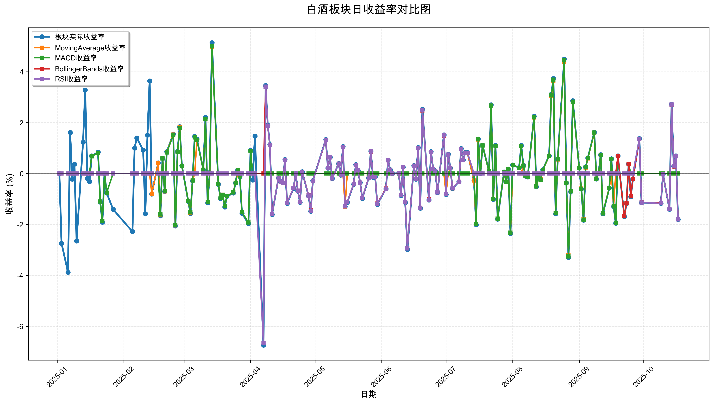
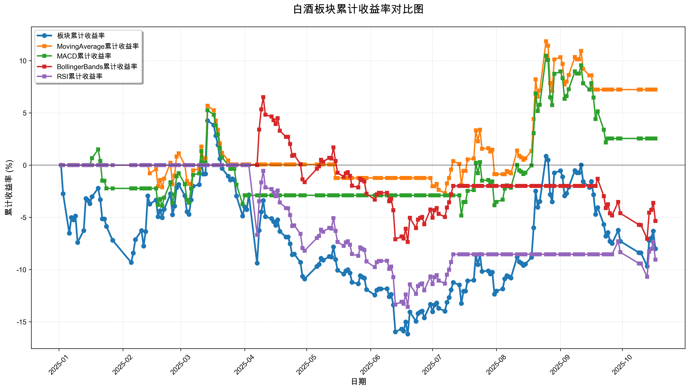

# 策略回测结果报告

**生成时间**: 2025-10-19 19:04:31
**行业板块**: 白酒
**回测期间**: 20250101 至 20251017
**策略数量**: 4

## 📈 分析结论

### 策略表现分析
- **最佳策略**: MovingAverage (总收益率: 7.23%)
- **最差策略**: RSI (总收益率: -9.05%)
### 交易活跃度分析
- **活跃策略**: 4 个
- **非活跃策略**: 0 个
- **最活跃策略**: MovingAverage (交易次数: 14)
### 🚨 异动提醒分析
- **策略异动**: MACD 与板块走势相关性异常 (相关系数: 0.257)
### 风险分析
- **MovingAverage**: 最大回撤 -7.93%, 夏普比率 0.6484
- **MACD**: 最大回撤 -9.58%, 夏普比率 0.2136
- **BollingerBands**: 最大回撤 -13.01%, 夏普比率 -0.6490
- **RSI**: 最大回撤 -13.57%, 夏普比率 -0.9058

## 📊 综合结果表

| 策略名称           | 初始资金     | 最终价值     | 总收益率   | 年化收益率   | 波动率    |    夏普比率 | 最大回撤    | 总交易次数   | 买入次数   | 卖出次数   | 总交易金额      | 平均交易金额   | 交易频率   |   数据点数 |
|:---------------|:---------|:---------|:-------|:--------|:-------|--------:|:--------|:--------|:-------|:-------|:-----------|:---------|:-------|-------:|
| 板块实际表现         | ¥100,000 | ¥91,986  | -8.01% | -10.49% | 23.23% | -0.4515 | -19.60% | N/A     | N/A    | N/A    | N/A        | N/A      | N/A    |    190 |
| MovingAverage  | ¥100,000 | ¥107,230 | 7.23%  | 9.70%   | 14.96% |  0.6484 | -7.93%  | 14      | 7      | 7      | ¥1,388,681 | ¥99,192  | 0.07   |    190 |
| MACD           | ¥100,000 | ¥102,548 | 2.55%  | 3.39%   | 15.89% |  0.2136 | -9.58%  | 6       | 3      | 3      | ¥581,061   | ¥96,843  | 0.03   |    190 |
| BollingerBands | ¥100,000 | ¥94,657  | -5.34% | -7.02%  | 10.82% | -0.649  | -13.01% | 3       | 2      | 1      | ¥291,412   | ¥97,137  | 0.02   |    190 |
| RSI            | ¥100,000 | ¥90,951  | -9.05% | -11.82% | 13.05% | -0.9058 | -13.57% | 3       | 2      | 1      | ¥280,435   | ¥93,478  | 0.02   |    190 |

## 📊 每日收益率走势图

*图1: 白酒板块每日收益率走势对比*

## 📈 累计收益率走势图

*图2: 白酒板块累计收益率走势对比*

## 📅 日收益明细表

| 日期         | 板块实际收益率   | MovingAverage收益率   | MACD收益率   | BollingerBands收益率   | RSI收益率   |
|:-----------|:----------|:-------------------|:----------|:--------------------|:---------|
| 2025-01-02 | 0.00%     | 0.00%              | 0.00%     | 0.00%               | 0.00%    |
| 2025-01-03 | -2.74%    | 0.00%              | 0.00%     | 0.00%               | 0.00%    |
| 2025-01-06 | -3.88%    | 0.00%              | 0.00%     | 0.00%               | 0.00%    |
| 2025-01-07 | 1.61%     | 0.00%              | 0.00%     | 0.00%               | 0.00%    |
| 2025-01-08 | -0.22%    | 0.00%              | 0.00%     | 0.00%               | 0.00%    |
| 2025-01-09 | 0.37%     | 0.00%              | 0.00%     | 0.00%               | 0.00%    |
| 2025-01-10 | -2.65%    | 0.00%              | 0.00%     | 0.00%               | 0.00%    |
| 2025-01-13 | 1.23%     | 0.00%              | 0.00%     | 0.00%               | 0.00%    |
| 2025-01-14 | 3.28%     | 0.00%              | 0.00%     | 0.00%               | 0.00%    |
| 2025-01-15 | -0.19%    | 0.00%              | 0.00%     | 0.00%               | 0.00%    |
| 2025-01-16 | -0.32%    | 0.00%              | 0.00%     | 0.00%               | 0.00%    |
| 2025-01-17 | 0.69%     | 0.00%              | 0.67%     | 0.00%               | 0.00%    |
| 2025-01-20 | 0.84%     | 0.00%              | 0.82%     | 0.00%               | 0.00%    |
| 2025-01-21 | -1.12%    | 0.00%              | -1.10%    | 0.00%               | 0.00%    |
| 2025-01-22 | -1.91%    | 0.00%              | -1.87%    | 0.00%               | 0.00%    |
| 2025-01-23 | -0.00%    | 0.00%              | -0.00%    | 0.00%               | 0.00%    |
| 2025-01-24 | -0.76%    | 0.00%              | -0.75%    | 0.00%               | 0.00%    |
| 2025-01-27 | -1.41%    | 0.00%              | 0.00%     | 0.00%               | 0.00%    |
| 2025-02-05 | -2.28%    | 0.00%              | 0.00%     | 0.00%               | 0.00%    |
| 2025-02-06 | 1.00%     | 0.00%              | 0.00%     | 0.00%               | 0.00%    |
| 2025-02-07 | 1.40%     | 0.00%              | 0.00%     | 0.00%               | 0.00%    |
| 2025-02-10 | 0.92%     | 0.00%              | 0.00%     | 0.00%               | 0.00%    |
| 2025-02-11 | -1.58%    | 0.00%              | 0.00%     | 0.00%               | 0.00%    |
| 2025-02-12 | 1.51%     | 0.00%              | 0.00%     | 0.00%               | 0.00%    |
| 2025-02-13 | 3.64%     | 0.00%              | 0.00%     | 0.00%               | 0.00%    |
| 2025-02-14 | -0.80%    | -0.79%             | 0.00%     | 0.00%               | 0.00%    |
| 2025-02-17 | 0.42%     | 0.41%              | 0.00%     | 0.00%               | 0.00%    |
| 2025-02-18 | -1.66%    | -1.64%             | -1.61%    | 0.00%               | 0.00%    |
| 2025-02-19 | 0.60%     | 0.59%              | 0.59%     | 0.00%               | 0.00%    |
| 2025-02-20 | -0.70%    | -0.70%             | -0.69%    | 0.00%               | 0.00%    |
| 2025-02-21 | 0.86%     | 0.85%              | 0.83%     | 0.00%               | 0.00%    |
| 2025-02-24 | 1.55%     | 1.53%              | 1.51%     | 0.00%               | 0.00%    |
| 2025-02-25 | -2.06%    | -2.04%             | -2.01%    | 0.00%               | 0.00%    |
| 2025-02-26 | 0.87%     | 0.85%              | 0.84%     | 0.00%               | 0.00%    |
| 2025-02-27 | 1.84%     | 1.82%              | 1.80%     | 0.00%               | 0.00%    |
| 2025-02-28 | 0.31%     | 0.30%              | 0.30%     | 0.00%               | 0.00%    |
| 2025-03-03 | -1.10%    | -1.08%             | -1.07%    | 0.00%               | 0.00%    |
| 2025-03-04 | -1.57%    | -1.55%             | -1.53%    | 0.00%               | 0.00%    |
| 2025-03-05 | -0.28%    | -0.27%             | -0.27%    | 0.00%               | 0.00%    |
| 2025-03-06 | 1.46%     | 0.00%              | 1.42%     | 0.00%               | 0.00%    |
| 2025-03-07 | 1.36%     | 1.32%              | 1.32%     | 0.00%               | 0.00%    |
| 2025-03-10 | 0.15%     | 0.15%              | 0.15%     | 0.00%               | 0.00%    |
| 2025-03-11 | 2.20%     | 2.13%              | 2.14%     | 0.00%               | 0.00%    |
| 2025-03-12 | -1.15%    | -1.12%             | -1.12%    | 0.00%               | 0.00%    |
| 2025-03-13 | 0.04%     | 0.03%              | 0.03%     | 0.00%               | 0.00%    |
| 2025-03-14 | 5.14%     | 4.99%              | 5.01%     | 0.00%               | 0.00%    |
| 2025-03-17 | -0.42%    | -0.41%             | -0.41%    | 0.00%               | 0.00%    |
| 2025-03-18 | -0.98%    | -0.95%             | -0.96%    | 0.00%               | 0.00%    |
| 2025-03-19 | -0.85%    | -0.83%             | -0.83%    | 0.00%               | 0.00%    |
| 2025-03-20 | -1.31%    | -1.27%             | -1.27%    | 0.00%               | 0.00%    |
| 2025-03-21 | -0.90%    | -0.88%             | -0.88%    | 0.00%               | 0.00%    |
| 2025-03-24 | -0.76%    | -0.73%             | -0.74%    | 0.00%               | 0.00%    |
| 2025-03-25 | -0.37%    | -0.36%             | -0.36%    | 0.00%               | 0.00%    |
| 2025-03-26 | 0.13%     | 0.00%              | 0.12%     | 0.00%               | 0.00%    |
| 2025-03-27 | -0.12%    | 0.00%              | -0.11%    | 0.00%               | 0.00%    |
| 2025-03-28 | -1.56%    | 0.00%              | -1.52%    | 0.00%               | 0.00%    |
| 2025-03-31 | -1.97%    | 0.00%              | -1.92%    | 0.00%               | 0.00%    |
| 2025-04-01 | 0.91%     | 0.00%              | 0.89%     | 0.00%               | 0.00%    |
| 2025-04-02 | -0.25%    | 0.00%              | 0.00%     | 0.00%               | 0.00%    |
| 2025-04-03 | 1.47%     | 0.00%              | 0.00%     | 0.00%               | 0.00%    |
| 2025-04-07 | -6.74%    | 0.00%              | 0.00%     | 0.00%               | -6.67%   |
| 2025-04-08 | 3.46%     | 0.00%              | 0.00%     | 3.40%               | 3.42%    |
| 2025-04-09 | 1.90%     | 0.00%              | 0.00%     | 1.87%               | 1.88%    |
| 2025-04-10 | 1.14%     | 0.00%              | 0.00%     | 1.12%               | 1.13%    |
| 2025-04-11 | -1.61%    | 0.00%              | 0.00%     | -1.58%              | -1.59%   |
| 2025-04-14 | -0.17%    | 0.00%              | 0.00%     | -0.17%              | -0.17%   |
| 2025-04-15 | -0.32%    | 0.00%              | 0.00%     | -0.32%              | -0.32%   |
| 2025-04-16 | -0.36%    | 0.00%              | 0.00%     | -0.36%              | -0.36%   |
| 2025-04-17 | 0.55%     | 0.00%              | 0.00%     | 0.54%               | 0.54%    |
| 2025-04-18 | -1.17%    | 0.00%              | 0.00%     | -1.15%              | -1.16%   |
| 2025-04-21 | -0.58%    | 0.00%              | 0.00%     | -0.57%              | -0.57%   |
| 2025-04-22 | -0.00%    | 0.00%              | 0.00%     | -0.00%              | -0.00%   |
| 2025-04-23 | -0.68%    | 0.00%              | 0.00%     | -0.67%              | -0.67%   |
| 2025-04-24 | -1.13%    | 0.00%              | 0.00%     | -1.11%              | -1.12%   |
| 2025-04-25 | 0.07%     | 0.00%              | 0.00%     | 0.07%               | 0.07%    |
| 2025-04-28 | -0.87%    | 0.00%              | 0.00%     | -0.85%              | -0.86%   |
| 2025-04-29 | -1.48%    | 0.00%              | 0.00%     | -1.45%              | -1.46%   |
| 2025-04-30 | -0.28%    | 0.00%              | 0.00%     | -0.28%              | -0.28%   |
| 2025-05-06 | 1.34%     | 0.00%              | 0.00%     | 1.32%               | 1.33%    |
| 2025-05-07 | 0.22%     | 0.00%              | 0.00%     | 0.22%               | 0.22%    |
| 2025-05-08 | 0.64%     | 0.00%              | 0.00%     | 0.63%               | 0.63%    |
| 2025-05-09 | -0.19%    | 0.00%              | 0.00%     | -0.19%              | -0.19%   |
| 2025-05-12 | 0.39%     | 0.00%              | 0.00%     | 0.39%               | 0.39%    |
| 2025-05-13 | -0.06%    | 0.00%              | 0.00%     | -0.06%              | -0.06%   |
| 2025-05-14 | 1.06%     | 0.00%              | 0.00%     | 1.04%               | 1.05%    |
| 2025-05-15 | -1.30%    | -1.30%             | 0.00%     | -1.28%              | -1.29%   |
| 2025-05-16 | -1.13%    | 0.00%              | 0.00%     | -1.11%              | -1.11%   |
| 2025-05-19 | -0.42%    | 0.00%              | 0.00%     | -0.41%              | -0.41%   |
| 2025-05-20 | 0.35%     | 0.00%              | 0.00%     | 0.34%               | 0.34%    |
| 2025-05-21 | 0.12%     | 0.00%              | 0.00%     | 0.12%               | 0.12%    |
| 2025-05-22 | -0.35%    | 0.00%              | 0.00%     | -0.35%              | -0.35%   |
| 2025-05-23 | -0.98%    | 0.00%              | 0.00%     | -0.97%              | -0.97%   |
| 2025-05-26 | -0.17%    | 0.00%              | 0.00%     | -0.16%              | -0.16%   |
| 2025-05-27 | 0.88%     | 0.00%              | 0.00%     | 0.86%               | 0.87%    |
| 2025-05-28 | -0.15%    | 0.00%              | 0.00%     | -0.14%              | -0.14%   |
| 2025-05-29 | -0.13%    | 0.00%              | 0.00%     | -0.13%              | -0.13%   |
| 2025-05-30 | -1.21%    | 0.00%              | 0.00%     | -1.18%              | -1.19%   |
| 2025-06-03 | -0.60%    | 0.00%              | 0.00%     | -0.59%              | -0.60%   |
| 2025-06-04 | 0.53%     | 0.00%              | 0.00%     | 0.52%               | 0.52%    |
| 2025-06-05 | 0.15%     | 0.00%              | 0.00%     | 0.15%               | 0.15%    |
| 2025-06-06 | -0.00%    | 0.00%              | 0.00%     | -0.00%              | -0.00%   |
| 2025-06-09 | 0.01%     | 0.00%              | 0.00%     | 0.01%               | 0.01%    |
| 2025-06-10 | -0.86%    | 0.00%              | 0.00%     | -0.85%              | -0.85%   |
| 2025-06-11 | 0.25%     | 0.00%              | 0.00%     | 0.25%               | 0.25%    |
| 2025-06-12 | -1.14%    | 0.00%              | 0.00%     | -1.12%              | -1.13%   |
| 2025-06-13 | -2.98%    | 0.00%              | 0.00%     | -2.92%              | -2.94%   |
| 2025-06-16 | 0.31%     | 0.00%              | 0.00%     | 0.31%               | 0.31%    |
| 2025-06-17 | -0.22%    | 0.00%              | 0.00%     | -0.21%              | -0.21%   |
| 2025-06-18 | 1.02%     | 0.00%              | 0.00%     | 1.00%               | 1.01%    |
| 2025-06-19 | -1.36%    | 0.00%              | 0.00%     | -1.34%              | -1.35%   |
| 2025-06-20 | 2.53%     | 0.00%              | 0.00%     | 2.48%               | 2.49%    |
| 2025-06-23 | -1.04%    | 0.00%              | 0.00%     | -1.02%              | -1.03%   |
| 2025-06-24 | 0.86%     | 0.00%              | 0.00%     | 0.85%               | 0.85%    |
| 2025-06-25 | 0.18%     | 0.00%              | 0.00%     | 0.18%               | 0.18%    |
| 2025-06-26 | 0.10%     | 0.00%              | 0.00%     | 0.10%               | 0.10%    |
| 2025-06-27 | -0.75%    | 0.00%              | 0.00%     | -0.73%              | -0.74%   |
| 2025-06-30 | 1.52%     | 0.00%              | 0.00%     | 1.49%               | 1.50%    |
| 2025-07-01 | -0.82%    | -0.80%             | 0.00%     | -0.81%              | -0.81%   |
| 2025-07-02 | 0.76%     | 0.00%              | 0.00%     | 0.74%               | 0.75%    |
| 2025-07-03 | 0.22%     | 0.22%              | 0.00%     | 0.21%               | 0.22%    |
| 2025-07-04 | -0.59%    | -0.58%             | 0.00%     | -0.58%              | -0.58%   |
| 2025-07-07 | -0.32%    | -0.32%             | 0.00%     | -0.32%              | -0.32%   |
| 2025-07-08 | 0.98%     | 0.96%              | 0.00%     | 0.96%               | 0.96%    |
| 2025-07-09 | 0.54%     | 0.53%              | 0.00%     | 0.53%               | 0.53%    |
| 2025-07-10 | 0.83%     | 0.82%              | 0.00%     | 0.81%               | 0.82%    |
| 2025-07-11 | 0.82%     | 0.81%              | 0.00%     | 0.81%               | 0.81%    |
| 2025-07-14 | -0.27%    | -0.27%             | 0.00%     | 0.00%               | 0.00%    |
| 2025-07-15 | -2.01%    | -1.99%             | -1.99%    | 0.00%               | 0.00%    |
| 2025-07-16 | 1.36%     | 1.34%              | 1.35%     | 0.00%               | 0.00%    |
| 2025-07-17 | 0.01%     | 0.01%              | 0.01%     | 0.00%               | 0.00%    |
| 2025-07-18 | 1.11%     | 1.10%              | 1.10%     | 0.00%               | 0.00%    |
| 2025-07-21 | 0.08%     | 0.08%              | 0.08%     | 0.00%               | 0.00%    |
| 2025-07-22 | 2.70%     | 2.67%              | 2.67%     | 0.00%               | 0.00%    |
| 2025-07-23 | -1.01%    | -1.00%             | -1.00%    | 0.00%               | 0.00%    |
| 2025-07-24 | 1.10%     | 1.08%              | 1.08%     | 0.00%               | 0.00%    |
| 2025-07-25 | -1.79%    | -1.77%             | -1.77%    | 0.00%               | 0.00%    |
| 2025-07-28 | 0.06%     | 0.06%              | 0.06%     | 0.00%               | 0.00%    |
| 2025-07-29 | -0.32%    | -0.32%             | -0.32%    | 0.00%               | 0.00%    |
| 2025-07-30 | 0.18%     | 0.18%              | 0.18%     | 0.00%               | 0.00%    |
| 2025-07-31 | -2.35%    | -2.32%             | -2.32%    | 0.00%               | 0.00%    |
| 2025-08-01 | 0.34%     | 0.00%              | 0.34%     | 0.00%               | 0.00%    |
| 2025-08-04 | 0.23%     | 0.00%              | 0.23%     | 0.00%               | 0.00%    |
| 2025-08-05 | 1.10%     | 0.00%              | 1.09%     | 0.00%               | 0.00%    |
| 2025-08-06 | 0.32%     | 0.31%              | 0.31%     | 0.00%               | 0.00%    |
| 2025-08-07 | -0.10%    | -0.10%             | -0.10%    | 0.00%               | 0.00%    |
| 2025-08-08 | -0.13%    | -0.12%             | -0.13%    | 0.00%               | 0.00%    |
| 2025-08-11 | 2.25%     | 2.20%              | 2.23%     | 0.00%               | 0.00%    |
| 2025-08-12 | -0.52%    | -0.51%             | -0.51%    | 0.00%               | 0.00%    |
| 2025-08-13 | -0.13%    | -0.13%             | -0.13%    | 0.00%               | 0.00%    |
| 2025-08-14 | -0.24%    | -0.23%             | -0.24%    | 0.00%               | 0.00%    |
| 2025-08-15 | 0.15%     | 0.14%              | 0.14%     | 0.00%               | 0.00%    |
| 2025-08-18 | 0.70%     | 0.68%              | 0.69%     | 0.00%               | 0.00%    |
| 2025-08-19 | 3.12%     | 3.04%              | 3.08%     | 0.00%               | 0.00%    |
| 2025-08-20 | 3.73%     | 3.64%              | 3.69%     | 0.00%               | 0.00%    |
| 2025-08-21 | -1.58%    | -1.54%             | -1.56%    | 0.00%               | 0.00%    |
| 2025-08-22 | 0.57%     | 0.55%              | 0.56%     | 0.00%               | 0.00%    |
| 2025-08-25 | 4.50%     | 4.39%              | 4.45%     | 0.00%               | 0.00%    |
| 2025-08-26 | -0.37%    | -0.36%             | -0.37%    | 0.00%               | 0.00%    |
| 2025-08-27 | -3.29%    | -3.21%             | -3.26%    | 0.00%               | 0.00%    |
| 2025-08-28 | -0.71%    | -0.69%             | -0.70%    | 0.00%               | 0.00%    |
| 2025-08-29 | 2.86%     | 2.80%              | 2.83%     | 0.00%               | 0.00%    |
| 2025-09-01 | 0.22%     | 0.22%              | 0.22%     | 0.00%               | 0.00%    |
| 2025-09-02 | -0.61%    | -0.59%             | -0.60%    | 0.00%               | 0.00%    |
| 2025-09-03 | -1.83%    | -1.79%             | -1.81%    | 0.00%               | 0.00%    |
| 2025-09-04 | 0.25%     | 0.24%              | 0.25%     | 0.00%               | 0.00%    |
| 2025-09-05 | 0.61%     | 0.59%              | 0.60%     | 0.00%               | 0.00%    |
| 2025-09-08 | 1.62%     | 1.59%              | 1.61%     | 0.00%               | 0.00%    |
| 2025-09-09 | -0.21%    | -0.20%             | -0.20%    | 0.00%               | 0.00%    |
| 2025-09-10 | 0.00%     | 0.00%              | 0.00%     | 0.00%               | 0.00%    |
| 2025-09-11 | 0.74%     | 0.72%              | 0.73%     | 0.00%               | 0.00%    |
| 2025-09-12 | -1.58%    | -1.55%             | -1.57%    | 0.00%               | 0.00%    |
| 2025-09-15 | -0.57%    | -0.56%             | -0.57%    | 0.00%               | 0.00%    |
| 2025-09-16 | 0.58%     | 0.00%              | 0.58%     | 0.00%               | 0.00%    |
| 2025-09-17 | -1.29%    | -1.27%             | -1.27%    | 0.00%               | 0.00%    |
| 2025-09-18 | -1.95%    | 0.00%              | -1.93%    | 0.00%               | 0.00%    |
| 2025-09-19 | 0.69%     | 0.00%              | 0.69%     | 0.69%               | 0.00%    |
| 2025-09-22 | -1.69%    | 0.00%              | -1.68%    | -1.68%              | 0.00%    |
| 2025-09-23 | -1.18%    | 0.00%              | -1.17%    | -1.17%              | 0.00%    |
| 2025-09-24 | 0.37%     | 0.00%              | 0.37%     | 0.37%               | 0.00%    |
| 2025-09-25 | -0.91%    | 0.00%              | 0.00%     | -0.90%              | 0.00%    |
| 2025-09-26 | -0.21%    | 0.00%              | 0.00%     | -0.21%              | 0.00%    |
| 2025-09-29 | 1.37%     | 0.00%              | 0.00%     | 1.36%               | 1.37%    |
| 2025-09-30 | -1.14%    | 0.00%              | 0.00%     | -1.13%              | -1.14%   |
| 2025-10-09 | -1.17%    | 0.00%              | 0.00%     | -1.16%              | -1.17%   |
| 2025-10-10 | -0.03%    | 0.00%              | 0.00%     | -0.03%              | -0.03%   |
| 2025-10-13 | -1.40%    | 0.00%              | 0.00%     | -1.39%              | -1.40%   |
| 2025-10-14 | 2.72%     | 0.00%              | 0.00%     | 2.69%               | 2.71%    |
| 2025-10-15 | 0.29%     | 0.00%              | 0.00%     | 0.28%               | 0.29%    |
| 2025-10-16 | 0.69%     | 0.00%              | 0.00%     | 0.68%               | 0.69%    |
| 2025-10-17 | -1.80%    | 0.00%              | 0.00%     | -1.78%              | -1.80%   |

## 📊 日收益统计摘要

| 指标                | 平均日收益率   | 最大日收益率   | 最小日收益率   | 正收益天数   | 负收益天数   |
|:------------------|:---------|:---------|:---------|:--------|:--------|
| 板块实际收益率           | -0.03%   | 5.14%    | -6.74%   | 89天     | 96天     |
| MovingAverage收益率  | 0.04%    | 4.99%    | -3.21%   | 39天     | 40天     |
| MACD收益率           | 0.02%    | 5.01%    | -3.26%   | 44天     | 43天     |
| BollingerBands收益率 | -0.03%   | 3.40%    | -2.92%   | 36天     | 42天     |
| RSI收益率            | -0.05%   | 3.42%    | -6.67%   | 34天     | 39天     |

## 📈 累计收益明细表

| 日期         | 板块累计收益率   | MovingAverage累计收益率   | MACD累计收益率   | BollingerBands累计收益率   | RSI累计收益率   |
|:-----------|:----------|:---------------------|:------------|:----------------------|:-----------|
| 2025-01-02 | 0.00%     | 0.00%                | 0.00%       | 0.00%                 | 0.00%      |
| 2025-01-03 | -2.74%    | 0.00%                | 0.00%       | 0.00%                 | 0.00%      |
| 2025-01-06 | -6.52%    | 0.00%                | 0.00%       | 0.00%                 | 0.00%      |
| 2025-01-07 | -5.02%    | 0.00%                | 0.00%       | 0.00%                 | 0.00%      |
| 2025-01-08 | -5.23%    | 0.00%                | 0.00%       | 0.00%                 | 0.00%      |
| 2025-01-09 | -4.88%    | 0.00%                | 0.00%       | 0.00%                 | 0.00%      |
| 2025-01-10 | -7.40%    | 0.00%                | 0.00%       | 0.00%                 | 0.00%      |
| 2025-01-13 | -6.26%    | 0.00%                | 0.00%       | 0.00%                 | 0.00%      |
| 2025-01-14 | -3.19%    | 0.00%                | 0.00%       | 0.00%                 | 0.00%      |
| 2025-01-15 | -3.37%    | 0.00%                | 0.00%       | 0.00%                 | 0.00%      |
| 2025-01-16 | -3.68%    | 0.00%                | 0.00%       | 0.00%                 | 0.00%      |
| 2025-01-17 | -3.02%    | 0.00%                | 0.67%       | 0.00%                 | 0.00%      |
| 2025-01-20 | -2.21%    | 0.00%                | 1.50%       | 0.00%                 | 0.00%      |
| 2025-01-21 | -3.30%    | 0.00%                | 0.39%       | 0.00%                 | 0.00%      |
| 2025-01-22 | -5.14%    | 0.00%                | -1.49%      | 0.00%                 | 0.00%      |
| 2025-01-23 | -5.15%    | 0.00%                | -1.50%      | 0.00%                 | 0.00%      |
| 2025-01-24 | -5.87%    | 0.00%                | -2.23%      | 0.00%                 | 0.00%      |
| 2025-01-27 | -7.20%    | 0.00%                | -2.23%      | 0.00%                 | 0.00%      |
| 2025-02-05 | -9.32%    | 0.00%                | -2.23%      | 0.00%                 | 0.00%      |
| 2025-02-06 | -8.41%    | 0.00%                | -2.23%      | 0.00%                 | 0.00%      |
| 2025-02-07 | -7.13%    | 0.00%                | -2.23%      | 0.00%                 | 0.00%      |
| 2025-02-10 | -6.27%    | 0.00%                | -2.23%      | 0.00%                 | 0.00%      |
| 2025-02-11 | -7.75%    | 0.00%                | -2.23%      | 0.00%                 | 0.00%      |
| 2025-02-12 | -6.36%    | 0.00%                | -2.23%      | 0.00%                 | 0.00%      |
| 2025-02-13 | -2.95%    | 0.00%                | -2.23%      | 0.00%                 | 0.00%      |
| 2025-02-14 | -3.73%    | -0.79%               | -2.23%      | 0.00%                 | 0.00%      |
| 2025-02-17 | -3.33%    | -0.39%               | -2.23%      | 0.00%                 | 0.00%      |
| 2025-02-18 | -4.93%    | -2.02%               | -3.81%      | 0.00%                 | 0.00%      |
| 2025-02-19 | -4.36%    | -1.43%               | -3.24%      | 0.00%                 | 0.00%      |
| 2025-02-20 | -5.03%    | -2.12%               | -3.91%      | 0.00%                 | 0.00%      |
| 2025-02-21 | -4.22%    | -1.29%               | -3.11%      | 0.00%                 | 0.00%      |
| 2025-02-24 | -2.74%    | 0.22%                | -1.65%      | 0.00%                 | 0.00%      |
| 2025-02-25 | -4.75%    | -1.83%               | -3.63%      | 0.00%                 | 0.00%      |
| 2025-02-26 | -3.92%    | -0.99%               | -2.81%      | 0.00%                 | 0.00%      |
| 2025-02-27 | -2.15%    | 0.82%                | -1.07%      | 0.00%                 | 0.00%      |
| 2025-02-28 | -1.85%    | 1.12%                | -0.77%      | 0.00%                 | 0.00%      |
| 2025-03-03 | -2.93%    | 0.02%                | -1.83%      | 0.00%                 | 0.00%      |
| 2025-03-04 | -4.46%    | -1.53%               | -3.34%      | 0.00%                 | 0.00%      |
| 2025-03-05 | -4.72%    | -1.80%               | -3.60%      | 0.00%                 | 0.00%      |
| 2025-03-06 | -3.33%    | -1.80%               | -2.23%      | 0.00%                 | 0.00%      |
| 2025-03-07 | -2.01%    | -0.50%               | -0.93%      | 0.00%                 | 0.00%      |
| 2025-03-10 | -1.87%    | -0.36%               | -0.79%      | 0.00%                 | 0.00%      |
| 2025-03-11 | 0.29%     | 1.77%                | 1.34%       | 0.00%                 | 0.00%      |
| 2025-03-12 | -0.86%    | 0.63%                | 0.20%       | 0.00%                 | 0.00%      |
| 2025-03-13 | -0.83%    | 0.66%                | 0.24%       | 0.00%                 | 0.00%      |
| 2025-03-14 | 4.26%     | 5.68%                | 5.25%       | 0.00%                 | 0.00%      |
| 2025-03-17 | 3.83%     | 5.25%                | 4.83%       | 0.00%                 | 0.00%      |
| 2025-03-18 | 2.81%     | 4.25%                | 3.82%       | 0.00%                 | 0.00%      |
| 2025-03-19 | 1.93%     | 3.38%                | 2.96%       | 0.00%                 | 0.00%      |
| 2025-03-20 | 0.60%     | 2.07%                | 1.64%       | 0.00%                 | 0.00%      |
| 2025-03-21 | -0.31%    | 1.18%                | 0.75%       | 0.00%                 | 0.00%      |
| 2025-03-24 | -1.06%    | 0.44%                | 0.01%       | 0.00%                 | 0.00%      |
| 2025-03-25 | -1.43%    | 0.07%                | -0.36%      | 0.00%                 | 0.00%      |
| 2025-03-26 | -1.31%    | 0.07%                | -0.23%      | 0.00%                 | 0.00%      |
| 2025-03-27 | -1.42%    | 0.07%                | -0.35%      | 0.00%                 | 0.00%      |
| 2025-03-28 | -2.96%    | 0.07%                | -1.86%      | 0.00%                 | 0.00%      |
| 2025-03-31 | -4.87%    | 0.07%                | -3.75%      | 0.00%                 | 0.00%      |
| 2025-04-01 | -4.00%    | 0.07%                | -2.89%      | 0.00%                 | 0.00%      |
| 2025-04-02 | -4.25%    | 0.07%                | -2.89%      | 0.00%                 | 0.00%      |
| 2025-04-03 | -2.84%    | 0.07%                | -2.89%      | 0.00%                 | 0.00%      |
| 2025-04-07 | -9.39%    | 0.07%                | -2.89%      | 0.00%                 | -6.67%     |
| 2025-04-08 | -6.25%    | 0.07%                | -2.89%      | 3.40%                 | -3.47%     |
| 2025-04-09 | -4.47%    | 0.07%                | -2.89%      | 5.33%                 | -1.66%     |
| 2025-04-10 | -3.39%    | 0.07%                | -2.89%      | 6.51%                 | -0.55%     |
| 2025-04-11 | -4.94%    | 0.07%                | -2.89%      | 4.82%                 | -2.14%     |
| 2025-04-14 | -5.11%    | 0.07%                | -2.89%      | 4.65%                 | -2.30%     |
| 2025-04-15 | -5.41%    | 0.07%                | -2.89%      | 4.31%                 | -2.62%     |
| 2025-04-16 | -5.76%    | 0.07%                | -2.89%      | 3.94%                 | -2.97%     |
| 2025-04-17 | -5.24%    | 0.07%                | -2.89%      | 4.50%                 | -2.44%     |
| 2025-04-18 | -6.35%    | 0.07%                | -2.89%      | 3.30%                 | -3.57%     |
| 2025-04-21 | -6.89%    | 0.07%                | -2.89%      | 2.71%                 | -4.12%     |
| 2025-04-22 | -6.89%    | 0.07%                | -2.89%      | 2.71%                 | -4.13%     |
| 2025-04-23 | -7.53%    | 0.07%                | -2.89%      | 2.02%                 | -4.77%     |
| 2025-04-24 | -8.58%    | 0.07%                | -2.89%      | 0.89%                 | -5.84%     |
| 2025-04-25 | -8.51%    | 0.07%                | -2.89%      | 0.96%                 | -5.77%     |
| 2025-04-28 | -9.31%    | 0.07%                | -2.89%      | 0.10%                 | -6.58%     |
| 2025-04-29 | -10.65%   | 0.07%                | -2.89%      | -1.36%                | -7.95%     |
| 2025-04-30 | -10.90%   | 0.07%                | -2.89%      | -1.63%                | -8.20%     |
| 2025-05-06 | -9.70%    | 0.07%                | -2.89%      | -0.34%                | -6.98%     |
| 2025-05-07 | -9.51%    | 0.07%                | -2.89%      | -0.12%                | -6.78%     |
| 2025-05-08 | -8.93%    | 0.07%                | -2.89%      | 0.51%                 | -6.19%     |
| 2025-05-09 | -9.10%    | 0.07%                | -2.89%      | 0.32%                 | -6.37%     |
| 2025-05-12 | -8.75%    | 0.07%                | -2.89%      | 0.70%                 | -6.01%     |
| 2025-05-13 | -8.80%    | 0.07%                | -2.89%      | 0.64%                 | -6.07%     |
| 2025-05-14 | -7.83%    | 0.07%                | -2.89%      | 1.69%                 | -5.08%     |
| 2025-05-15 | -9.03%    | -1.23%               | -2.89%      | 0.39%                 | -6.30%     |
| 2025-05-16 | -10.06%   | -1.23%               | -2.89%      | -0.72%                | -7.35%     |
| 2025-05-19 | -10.43%   | -1.23%               | -2.89%      | -1.13%                | -7.73%     |
| 2025-05-20 | -10.12%   | -1.23%               | -2.89%      | -0.79%                | -7.41%     |
| 2025-05-21 | -10.02%   | -1.23%               | -2.89%      | -0.68%                | -7.30%     |
| 2025-05-22 | -10.33%   | -1.23%               | -2.89%      | -1.02%                | -7.63%     |
| 2025-05-23 | -11.22%   | -1.23%               | -2.89%      | -1.98%                | -8.52%     |
| 2025-05-26 | -11.36%   | -1.23%               | -2.89%      | -2.14%                | -8.68%     |
| 2025-05-27 | -10.59%   | -1.23%               | -2.89%      | -1.29%                | -7.88%     |
| 2025-05-28 | -10.72%   | -1.23%               | -2.89%      | -1.44%                | -8.02%     |
| 2025-05-29 | -10.83%   | -1.23%               | -2.89%      | -1.56%                | -8.13%     |
| 2025-05-30 | -11.91%   | -1.23%               | -2.89%      | -2.73%                | -9.23%     |
| 2025-06-03 | -12.44%   | -1.23%               | -2.89%      | -3.30%                | -9.77%     |
| 2025-06-04 | -11.98%   | -1.23%               | -2.89%      | -2.80%                | -9.30%     |
| 2025-06-05 | -11.85%   | -1.23%               | -2.89%      | -2.66%                | -9.17%     |
| 2025-06-06 | -11.85%   | -1.23%               | -2.89%      | -2.66%                | -9.17%     |
| 2025-06-09 | -11.84%   | -1.23%               | -2.89%      | -2.65%                | -9.16%     |
| 2025-06-10 | -12.60%   | -1.23%               | -2.89%      | -3.47%                | -9.93%     |
| 2025-06-11 | -12.38%   | -1.23%               | -2.89%      | -3.23%                | -9.71%     |
| 2025-06-12 | -13.38%   | -1.23%               | -2.89%      | -4.32%                | -10.72%    |
| 2025-06-13 | -15.96%   | -1.23%               | -2.89%      | -7.11%                | -13.35%    |
| 2025-06-16 | -15.69%   | -1.23%               | -2.89%      | -6.83%                | -13.08%    |
| 2025-06-17 | -15.88%   | -1.23%               | -2.89%      | -7.03%                | -13.27%    |
| 2025-06-18 | -15.01%   | -1.23%               | -2.89%      | -6.09%                | -12.39%    |
| 2025-06-19 | -16.17%   | -1.23%               | -2.89%      | -7.35%                | -13.57%    |
| 2025-06-20 | -14.06%   | -1.23%               | -2.89%      | -5.05%                | -11.42%    |
| 2025-06-23 | -14.95%   | -1.23%               | -2.89%      | -6.02%                | -12.32%    |
| 2025-06-24 | -14.21%   | -1.23%               | -2.89%      | -5.22%                | -11.58%    |
| 2025-06-25 | -14.06%   | -1.23%               | -2.89%      | -5.06%                | -11.42%    |
| 2025-06-26 | -13.97%   | -1.23%               | -2.89%      | -4.96%                | -11.33%    |
| 2025-06-27 | -14.62%   | -1.23%               | -2.89%      | -5.66%                | -11.99%    |
| 2025-06-30 | -13.32%   | -1.23%               | -2.89%      | -4.26%                | -10.67%    |
| 2025-07-01 | -14.03%   | -2.02%               | -2.89%      | -5.03%                | -11.39%    |
| 2025-07-02 | -13.38%   | -2.02%               | -2.89%      | -4.32%                | -10.73%    |
| 2025-07-03 | -13.19%   | -1.81%               | -2.89%      | -4.12%                | -10.54%    |
| 2025-07-04 | -13.71%   | -2.38%               | -2.89%      | -4.67%                | -11.06%    |
| 2025-07-07 | -13.98%   | -2.69%               | -2.89%      | -4.97%                | -11.34%    |
| 2025-07-08 | -13.14%   | -1.76%               | -2.89%      | -4.07%                | -10.49%    |
| 2025-07-09 | -12.68%   | -1.24%               | -2.89%      | -3.56%                | -10.01%    |
| 2025-07-10 | -11.95%   | -0.43%               | -2.89%      | -2.78%                | -9.28%     |
| 2025-07-11 | -11.23%   | 0.38%                | -2.89%      | -1.99%                | -8.54%     |
| 2025-07-14 | -11.47%   | 0.11%                | -2.89%      | -1.99%                | -8.54%     |
| 2025-07-15 | -13.25%   | -1.88%               | -4.82%      | -1.99%                | -8.54%     |
| 2025-07-16 | -12.07%   | -0.56%               | -3.54%      | -1.99%                | -8.54%     |
| 2025-07-17 | -12.06%   | -0.55%               | -3.53%      | -1.99%                | -8.54%     |
| 2025-07-18 | -11.08%   | 0.54%                | -2.47%      | -1.99%                | -8.54%     |
| 2025-07-21 | -11.01%   | 0.63%                | -2.39%      | -1.99%                | -8.54%     |
| 2025-07-22 | -8.60%    | 3.32%                | 0.22%       | -1.99%                | -8.54%     |
| 2025-07-23 | -9.53%    | 2.28%                | -0.78%      | -1.99%                | -8.54%     |
| 2025-07-24 | -8.54%    | 3.39%                | 0.29%       | -1.99%                | -8.54%     |
| 2025-07-25 | -10.17%   | 1.56%                | -1.48%      | -1.99%                | -8.54%     |
| 2025-07-28 | -10.12%   | 1.62%                | -1.43%      | -1.99%                | -8.54%     |
| 2025-07-29 | -10.41%   | 1.30%                | -1.74%      | -1.99%                | -8.54%     |
| 2025-07-30 | -10.25%   | 1.48%                | -1.57%      | -1.99%                | -8.54%     |
| 2025-07-31 | -12.35%   | -0.87%               | -3.85%      | -1.99%                | -8.54%     |
| 2025-08-01 | -12.05%   | -0.87%               | -3.52%      | -1.99%                | -8.54%     |
| 2025-08-04 | -11.85%   | -0.87%               | -3.30%      | -1.99%                | -8.54%     |
| 2025-08-05 | -10.88%   | -0.87%               | -2.25%      | -1.99%                | -8.54%     |
| 2025-08-06 | -10.59%   | -0.57%               | -1.94%      | -1.99%                | -8.54%     |
| 2025-08-07 | -10.68%   | -0.66%               | -2.04%      | -1.99%                | -8.54%     |
| 2025-08-08 | -10.80%   | -0.79%               | -2.16%      | -1.99%                | -8.54%     |
| 2025-08-11 | -8.79%    | 1.39%                | 0.02%       | -1.99%                | -8.54%     |
| 2025-08-12 | -9.26%    | 0.88%                | -0.50%      | -1.99%                | -8.54%     |
| 2025-08-13 | -9.38%    | 0.74%                | -0.63%      | -1.99%                | -8.54%     |
| 2025-08-14 | -9.60%    | 0.51%                | -0.86%      | -1.99%                | -8.54%     |
| 2025-08-15 | -9.47%    | 0.65%                | -0.72%      | -1.99%                | -8.54%     |
| 2025-08-18 | -8.83%    | 1.34%                | -0.03%      | -1.99%                | -8.54%     |
| 2025-08-19 | -5.99%    | 4.42%                | 3.05%       | -1.99%                | -8.54%     |
| 2025-08-20 | -2.49%    | 8.22%                | 6.85%       | -1.99%                | -8.54%     |
| 2025-08-21 | -4.03%    | 6.55%                | 5.18%       | -1.99%                | -8.54%     |
| 2025-08-22 | -3.48%    | 7.14%                | 5.77%       | -1.99%                | -8.54%     |
| 2025-08-25 | 0.86%     | 11.85%               | 10.47%      | -1.99%                | -8.54%     |
| 2025-08-26 | 0.49%     | 11.44%               | 10.07%      | -1.99%                | -8.54%     |
| 2025-08-27 | -2.82%    | 7.86%                | 6.49%       | -1.99%                | -8.54%     |
| 2025-08-28 | -3.51%    | 7.11%                | 5.74%       | -1.99%                | -8.54%     |
| 2025-08-29 | -0.74%    | 10.11%               | 8.73%       | -1.99%                | -8.54%     |
| 2025-09-01 | -0.53%    | 10.34%               | 8.97%       | -1.99%                | -8.54%     |
| 2025-09-02 | -1.13%    | 9.69%                | 8.32%       | -1.99%                | -8.54%     |
| 2025-09-03 | -2.94%    | 7.73%                | 6.35%       | -1.99%                | -8.54%     |
| 2025-09-04 | -2.70%    | 7.99%                | 6.62%       | -1.99%                | -8.54%     |
| 2025-09-05 | -2.11%    | 8.63%                | 7.26%       | -1.99%                | -8.54%     |
| 2025-09-08 | -0.52%    | 10.35%               | 8.98%       | -1.99%                | -8.54%     |
| 2025-09-09 | -0.72%    | 10.13%               | 8.76%       | -1.99%                | -8.54%     |
| 2025-09-10 | -0.72%    | 10.13%               | 8.76%       | -1.99%                | -8.54%     |
| 2025-09-11 | 0.02%     | 10.93%               | 9.56%       | -1.99%                | -8.54%     |
| 2025-09-12 | -1.57%    | 9.21%                | 7.84%       | -1.99%                | -8.54%     |
| 2025-09-15 | -2.13%    | 8.60%                | 7.23%       | -1.99%                | -8.54%     |
| 2025-09-16 | -1.56%    | 8.60%                | 7.85%       | -1.99%                | -8.54%     |
| 2025-09-17 | -2.83%    | 7.23%                | 6.48%       | -1.99%                | -8.54%     |
| 2025-09-18 | -4.72%    | 7.23%                | 4.42%       | -1.99%                | -8.54%     |
| 2025-09-19 | -4.06%    | 7.23%                | 5.14%       | -1.32%                | -8.54%     |
| 2025-09-22 | -5.68%    | 7.23%                | 3.38%       | -2.97%                | -8.54%     |
| 2025-09-23 | -6.80%    | 7.23%                | 2.17%       | -4.11%                | -8.54%     |
| 2025-09-24 | -6.45%    | 7.23%                | 2.55%       | -3.75%                | -8.54%     |
| 2025-09-25 | -7.30%    | 7.23%                | 2.55%       | -4.62%                | -8.54%     |
| 2025-09-26 | -7.50%    | 7.23%                | 2.55%       | -4.82%                | -8.54%     |
| 2025-09-29 | -6.23%    | 7.23%                | 2.55%       | -3.52%                | -7.29%     |
| 2025-09-30 | -7.29%    | 7.23%                | 2.55%       | -4.61%                | -8.34%     |
| 2025-10-09 | -8.38%    | 7.23%                | 2.55%       | -5.71%                | -9.41%     |
| 2025-10-10 | -8.40%    | 7.23%                | 2.55%       | -5.74%                | -9.43%     |
| 2025-10-13 | -9.69%    | 7.23%                | 2.55%       | -7.05%                | -10.70%    |
| 2025-10-14 | -7.23%    | 7.23%                | 2.55%       | -4.55%                | -8.28%     |
| 2025-10-15 | -6.97%    | 7.23%                | 2.55%       | -4.28%                | -8.02%     |
| 2025-10-16 | -6.32%    | 7.23%                | 2.55%       | -3.62%                | -7.38%     |
| 2025-10-17 | -8.01%    | 7.23%                | 2.55%       | -5.34%                | -9.05%     |

## 📊 累计收益统计摘要

| 指标                  | 最终累计收益率   | 最大累计收益率   | 最小累计收益率   | 累计收益波动   | 收益稳定性   |
|:--------------------|:----------|:----------|:----------|:---------|:--------|
| 板块累计收益率             | -8.01%    | 4.26%     | -16.17%   | 20.43%   | 波动      |
| MovingAverage累计收益率  | 7.23%     | 11.85%    | -2.69%    | 14.54%   | 稳定      |
| MACD累计收益率           | 2.55%     | 10.47%    | -4.82%    | 15.29%   | 稳定      |
| BollingerBands累计收益率 | -5.34%    | 6.51%     | -7.35%    | 13.86%   | 稳定      |
| RSI累计收益率            | -9.05%    | 0.00%     | -13.57%   | 13.57%   | 稳定      |

