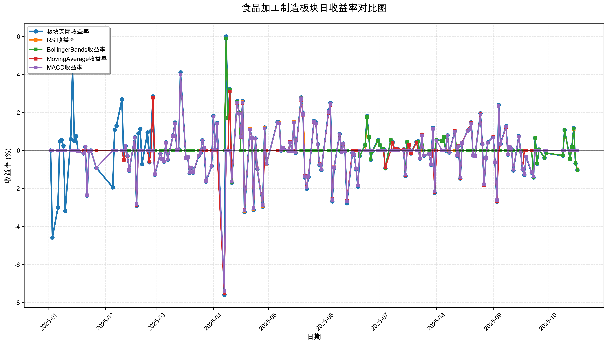
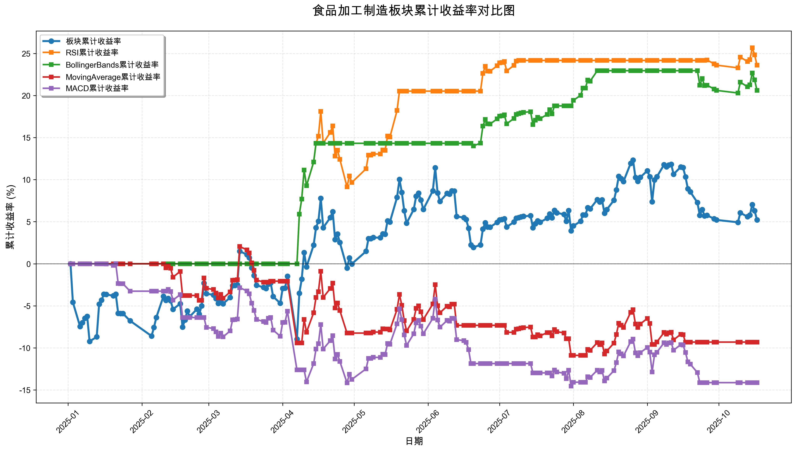

# 策略回测结果报告

**生成时间**: 2025-10-19 19:03:12
**行业板块**: 食品加工制造
**回测期间**: 20250101 至 20251017
**策略数量**: 4

## 📈 分析结论

### 策略表现分析
- **最佳策略**: RSI (总收益率: 23.60%)
- **最差策略**: MACD (总收益率: -14.13%)
### 交易活跃度分析
- **活跃策略**: 4 个
- **非活跃策略**: 0 个
- **最活跃策略**: MovingAverage (交易次数: 30)
### 🚨 异动提醒分析
- 未检测到明显异动情况
### 风险分析
- **RSI**: 最大回撤 -7.59%, 夏普比率 2.4886
- **BollingerBands**: 最大回撤 -2.16%, 夏普比率 2.7547
- **MovingAverage**: 最大回撤 -12.69%, 夏普比率 -0.6715
- **MACD**: 最大回撤 -14.54%, 夏普比率 -0.9728

## 📊 综合结果表

| 策略名称           | 初始资金     | 最终价值     | 总收益率    | 年化收益率   | 波动率    |    夏普比率 | 最大回撤    | 总交易次数   | 买入次数   | 卖出次数   | 总交易金额      | 平均交易金额   | 交易频率   |   数据点数 |
|:---------------|:---------|:---------|:--------|:--------|:-------|--------:|:--------|:--------|:-------|:-------|:-----------|:---------|:-------|-------:|
| 板块实际表现         | ¥100,000 | ¥105,205 | 5.21%   | 6.96%   | 24.01% |  0.29   | -10.31% | N/A     | N/A    | N/A    | N/A        | N/A      | N/A    |    190 |
| RSI            | ¥100,000 | ¥123,603 | 23.60%  | 32.45%  | 13.04% |  2.4886 | -7.59%  | 5       | 3      | 2      | ¥571,478   | ¥114,296 | 0.03   |    190 |
| BollingerBands | ¥100,000 | ¥120,608 | 20.61%  | 28.21%  | 10.24% |  2.7547 | -2.16%  | 7       | 4      | 3      | ¥796,824   | ¥113,832 | 0.04   |    190 |
| MovingAverage  | ¥100,000 | ¥90,688  | -9.31%  | -12.16% | 18.11% | -0.6715 | -12.69% | 30      | 15     | 15     | ¥2,708,740 | ¥90,291  | 0.16   |    190 |
| MACD           | ¥100,000 | ¥85,874  | -14.13% | -18.29% | 18.80% | -0.9728 | -14.54% | 14      | 7      | 7      | ¥1,223,451 | ¥87,389  | 0.07   |    190 |

## 📊 每日收益率走势图

*图1: 食品加工制造板块每日收益率走势对比*

## 📈 累计收益率走势图

*图2: 食品加工制造板块累计收益率走势对比*

## 📅 日收益明细表

| 日期         | 板块实际收益率   | RSI收益率   | BollingerBands收益率   | MovingAverage收益率   | MACD收益率   |
|:-----------|:----------|:---------|:--------------------|:-------------------|:----------|
| 2025-01-02 | 0.00%     | 0.00%    | 0.00%               | 0.00%              | 0.00%     |
| 2025-01-03 | -4.58%    | 0.00%    | 0.00%               | 0.00%              | 0.00%     |
| 2025-01-06 | -3.01%    | 0.00%    | 0.00%               | 0.00%              | 0.00%     |
| 2025-01-07 | 0.48%     | 0.00%    | 0.00%               | 0.00%              | 0.00%     |
| 2025-01-08 | 0.56%     | 0.00%    | 0.00%               | 0.00%              | 0.00%     |
| 2025-01-09 | 0.25%     | 0.00%    | 0.00%               | 0.00%              | 0.00%     |
| 2025-01-10 | -3.18%    | 0.00%    | 0.00%               | 0.00%              | 0.00%     |
| 2025-01-13 | 0.60%     | 0.00%    | 0.00%               | 0.00%              | 0.00%     |
| 2025-01-14 | 4.25%     | 0.00%    | 0.00%               | 0.00%              | 0.00%     |
| 2025-01-15 | 0.50%     | 0.00%    | 0.00%               | 0.00%              | 0.00%     |
| 2025-01-16 | 0.75%     | 0.00%    | 0.00%               | 0.00%              | 0.00%     |
| 2025-01-17 | -0.03%    | 0.00%    | 0.00%               | 0.00%              | -0.03%    |
| 2025-01-20 | -0.15%    | 0.00%    | 0.00%               | 0.00%              | -0.15%    |
| 2025-01-21 | 0.20%     | 0.00%    | 0.00%               | 0.00%              | 0.20%     |
| 2025-01-22 | -2.37%    | 0.00%    | 0.00%               | 0.00%              | -2.36%    |
| 2025-01-23 | -0.03%    | 0.00%    | 0.00%               | 0.00%              | -0.03%    |
| 2025-01-24 | -0.00%    | 0.00%    | 0.00%               | 0.00%              | -0.00%    |
| 2025-01-27 | -0.91%    | 0.00%    | 0.00%               | 0.00%              | -0.91%    |
| 2025-02-05 | -1.94%    | 0.00%    | 0.00%               | 0.00%              | 0.00%     |
| 2025-02-06 | 1.10%     | 0.00%    | 0.00%               | 0.00%              | 0.00%     |
| 2025-02-07 | 1.30%     | 0.00%    | 0.00%               | 0.00%              | 0.00%     |
| 2025-02-10 | 2.69%     | 0.00%    | 0.00%               | 0.00%              | 0.00%     |
| 2025-02-11 | -0.49%    | 0.00%    | 0.00%               | -0.49%             | 0.00%     |
| 2025-02-12 | 0.24%     | 0.00%    | 0.00%               | 0.24%              | 0.23%     |
| 2025-02-13 | -0.29%    | 0.00%    | 0.00%               | -0.29%             | -0.28%    |
| 2025-02-14 | -1.07%    | 0.00%    | 0.00%               | -1.06%             | -1.04%    |
| 2025-02-17 | 0.70%     | 0.00%    | 0.00%               | 0.69%              | 0.68%     |
| 2025-02-18 | -2.91%    | 0.00%    | 0.00%               | -2.88%             | -2.82%    |
| 2025-02-19 | 0.90%     | 0.00%    | 0.00%               | 0.00%              | 0.00%     |
| 2025-02-20 | 1.14%     | 0.00%    | 0.00%               | 0.00%              | 0.00%     |
| 2025-02-21 | -0.71%    | 0.00%    | 0.00%               | 0.00%              | 0.00%     |
| 2025-02-24 | 0.95%     | 0.00%    | 0.00%               | 0.00%              | 0.00%     |
| 2025-02-25 | -0.62%    | 0.00%    | 0.00%               | -0.59%             | 0.00%     |
| 2025-02-26 | 1.04%     | 0.00%    | 0.00%               | 0.00%              | 0.00%     |
| 2025-02-27 | 2.85%     | 0.00%    | 0.00%               | 2.78%              | 0.00%     |
| 2025-02-28 | -1.28%    | 0.00%    | 0.00%               | -1.25%             | -1.25%    |
| 2025-03-03 | -0.16%    | 0.00%    | 0.00%               | -0.15%             | -0.15%    |
| 2025-03-04 | -0.45%    | 0.00%    | 0.00%               | -0.44%             | -0.44%    |
| 2025-03-05 | -0.59%    | 0.00%    | 0.00%               | -0.58%             | -0.58%    |
| 2025-03-06 | 0.43%     | 0.00%    | 0.00%               | 0.42%              | 0.41%     |
| 2025-03-07 | -0.48%    | 0.00%    | 0.00%               | -0.47%             | -0.47%    |
| 2025-03-10 | 0.80%     | 0.00%    | 0.00%               | 0.78%              | 0.77%     |
| 2025-03-11 | 1.47%     | 0.00%    | 0.00%               | 1.43%              | 1.43%     |
| 2025-03-12 | 0.03%     | 0.00%    | 0.00%               | 0.03%              | 0.03%     |
| 2025-03-13 | 0.06%     | 0.00%    | 0.00%               | 0.06%              | 0.06%     |
| 2025-03-14 | 4.11%     | 0.00%    | 0.00%               | 4.01%              | 4.01%     |
| 2025-03-17 | -0.41%    | 0.00%    | 0.00%               | -0.40%             | -0.40%    |
| 2025-03-18 | -0.36%    | 0.00%    | 0.00%               | -0.35%             | -0.35%    |
| 2025-03-19 | -1.20%    | 0.00%    | 0.00%               | -1.17%             | -1.17%    |
| 2025-03-20 | -0.91%    | 0.00%    | 0.00%               | -0.89%             | -0.89%    |
| 2025-03-21 | -1.17%    | 0.00%    | 0.00%               | -1.15%             | -1.14%    |
| 2025-03-24 | -0.27%    | 0.00%    | 0.00%               | -0.26%             | -0.26%    |
| 2025-03-25 | -0.12%    | 0.00%    | 0.00%               | 0.00%              | -0.12%    |
| 2025-03-26 | 0.54%     | 0.00%    | 0.00%               | 0.00%              | 0.53%     |
| 2025-03-27 | 0.12%     | 0.00%    | 0.00%               | 0.12%              | 0.12%     |
| 2025-03-28 | -1.64%    | 0.00%    | 0.00%               | 0.00%              | -1.60%    |
| 2025-03-31 | -0.83%    | 0.00%    | 0.00%               | 0.00%              | -0.81%    |
| 2025-04-01 | 1.83%     | 0.00%    | 0.00%               | 0.00%              | 1.79%     |
| 2025-04-02 | 0.04%     | 0.00%    | 0.00%               | 0.00%              | 0.04%     |
| 2025-04-03 | 1.46%     | 0.00%    | 0.00%               | 0.00%              | 1.42%     |
| 2025-04-07 | -7.59%    | 0.00%    | 0.00%               | -7.50%             | -7.40%    |
| 2025-04-08 | 6.00%     | 5.90%    | 5.90%               | 0.00%              | 0.00%     |
| 2025-04-09 | 1.73%     | 1.70%    | 1.70%               | 0.00%              | 0.00%     |
| 2025-04-10 | 3.24%     | 3.19%    | 3.19%               | 3.10%              | 0.00%     |
| 2025-04-11 | -1.70%    | -1.67%   | -1.67%              | -1.63%             | -1.64%    |
| 2025-04-14 | 2.61%     | 2.57%    | 2.57%               | 2.50%              | 2.53%     |
| 2025-04-15 | 2.02%     | 1.99%    | 1.99%               | 1.94%              | 1.96%     |
| 2025-04-16 | 0.74%     | 0.73%    | 0.00%               | 0.71%              | 0.72%     |
| 2025-04-17 | 2.60%     | 2.56%    | 0.00%               | 2.50%              | 2.52%     |
| 2025-04-18 | -3.25%    | -3.20%   | 0.00%               | -3.12%             | -3.15%    |
| 2025-04-21 | 1.15%     | 1.13%    | 0.00%               | 1.10%              | 1.11%     |
| 2025-04-22 | 0.68%     | 0.67%    | 0.00%               | 0.65%              | 0.66%     |
| 2025-04-23 | -3.13%    | -3.09%   | 0.00%               | -3.01%             | -3.03%    |
| 2025-04-24 | 0.64%     | 0.63%    | 0.00%               | 0.62%              | 0.62%     |
| 2025-04-25 | -0.98%    | -0.96%   | 0.00%               | -0.94%             | -0.95%    |
| 2025-04-28 | -2.96%    | -2.92%   | 0.00%               | -2.84%             | -2.87%    |
| 2025-04-29 | 1.21%     | 1.19%    | 0.00%               | 0.00%              | 1.17%     |
| 2025-04-30 | -0.72%    | -0.71%   | 0.00%               | 0.00%              | -0.70%    |
| 2025-05-06 | 1.50%     | 1.48%    | 0.00%               | 0.00%              | 1.46%     |
| 2025-05-07 | 1.48%     | 1.45%    | 0.00%               | 0.00%              | 1.43%     |
| 2025-05-08 | -0.00%    | -0.00%   | 0.00%               | -0.00%             | -0.00%    |
| 2025-05-09 | 0.14%     | 0.14%    | 0.00%               | 0.14%              | 0.14%     |
| 2025-05-12 | -0.02%    | -0.02%   | 0.00%               | -0.02%             | -0.02%    |
| 2025-05-13 | 0.45%     | 0.44%    | 0.00%               | 0.44%              | 0.43%     |
| 2025-05-14 | -0.04%    | -0.04%   | 0.00%               | -0.04%             | -0.04%    |
| 2025-05-15 | 1.52%     | 1.50%    | 0.00%               | 0.00%              | 1.48%     |
| 2025-05-16 | -0.12%    | -0.11%   | 0.00%               | -0.11%             | -0.11%    |
| 2025-05-19 | 2.79%     | 2.75%    | 0.00%               | 2.65%              | 2.70%     |
| 2025-05-20 | 1.97%     | 1.94%    | 0.00%               | 1.88%              | 1.91%     |
| 2025-05-21 | -1.40%    | 0.00%    | 0.00%               | -1.34%             | -1.36%    |
| 2025-05-22 | -2.01%    | 0.00%    | 0.00%               | -1.91%             | -1.95%    |
| 2025-05-23 | -1.39%    | 0.00%    | 0.00%               | -1.32%             | -1.35%    |
| 2025-05-26 | 1.56%     | 0.00%    | 0.00%               | 1.48%              | 1.51%     |
| 2025-05-27 | 1.48%     | 0.00%    | 0.00%               | 1.41%              | 1.43%     |
| 2025-05-28 | 0.33%     | 0.00%    | 0.00%               | 0.32%              | 0.32%     |
| 2025-05-29 | -0.76%    | 0.00%    | 0.00%               | -0.72%             | -0.73%    |
| 2025-05-30 | -1.03%    | 0.00%    | 0.00%               | -0.99%             | -1.00%    |
| 2025-06-03 | 2.08%     | 0.00%    | 0.00%               | 1.98%              | 2.02%     |
| 2025-06-04 | 2.52%     | 0.00%    | 0.00%               | 2.40%              | 2.45%     |
| 2025-06-05 | -2.68%    | 0.00%    | 0.00%               | -2.56%             | -2.61%    |
| 2025-06-06 | -0.92%    | 0.00%    | 0.00%               | -0.88%             | -0.90%    |
| 2025-06-09 | 0.88%     | 0.00%    | 0.00%               | 0.83%              | 0.85%     |
| 2025-06-10 | -0.09%    | 0.00%    | 0.00%               | -0.08%             | -0.09%    |
| 2025-06-11 | 0.37%     | 0.00%    | 0.00%               | 0.35%              | 0.36%     |
| 2025-06-12 | -0.02%    | 0.00%    | 0.00%               | -0.02%             | -0.02%    |
| 2025-06-13 | -2.78%    | 0.00%    | 0.00%               | -2.65%             | -2.69%    |
| 2025-06-16 | -0.12%    | 0.00%    | 0.00%               | 0.00%              | -0.12%    |
| 2025-06-17 | -0.23%    | 0.00%    | 0.00%               | 0.00%              | -0.22%    |
| 2025-06-18 | -0.98%    | 0.00%    | 0.00%               | 0.00%              | -0.95%    |
| 2025-06-19 | -1.91%    | 0.00%    | 0.00%               | 0.00%              | -1.85%    |
| 2025-06-20 | -0.29%    | 0.00%    | -0.28%              | 0.00%              | 0.00%     |
| 2025-06-23 | 0.30%     | 0.00%    | 0.29%               | 0.00%              | 0.00%     |
| 2025-06-24 | 1.82%     | 1.75%    | 1.76%               | 0.00%              | 0.00%     |
| 2025-06-25 | 0.72%     | 0.69%    | 0.70%               | 0.00%              | 0.00%     |
| 2025-06-26 | -0.48%    | -0.46%   | -0.46%              | 0.00%              | 0.00%     |
| 2025-06-27 | -0.02%    | -0.02%   | -0.02%              | 0.00%              | 0.00%     |
| 2025-06-30 | 0.55%     | 0.52%    | 0.53%               | 0.00%              | 0.00%     |
| 2025-07-01 | 0.29%     | 0.28%    | 0.28%               | 0.00%              | 0.00%     |
| 2025-07-02 | 0.04%     | 0.04%    | 0.04%               | 0.00%              | 0.00%     |
| 2025-07-03 | 0.09%     | 0.09%    | 0.09%               | 0.00%              | 0.00%     |
| 2025-07-04 | -0.94%    | -0.90%   | -0.91%              | -0.89%             | 0.00%     |
| 2025-07-07 | 0.57%     | 0.54%    | 0.55%               | 0.00%              | 0.00%     |
| 2025-07-08 | 0.43%     | 0.41%    | 0.41%               | 0.41%              | 0.00%     |
| 2025-07-09 | 0.06%     | 0.06%    | 0.06%               | 0.06%              | 0.00%     |
| 2025-07-10 | 0.09%     | 0.00%    | 0.09%               | 0.09%              | 0.00%     |
| 2025-07-11 | 0.06%     | 0.00%    | 0.06%               | 0.06%              | 0.00%     |
| 2025-07-14 | 0.06%     | 0.00%    | 0.06%               | 0.06%              | 0.00%     |
| 2025-07-15 | -1.34%    | 0.00%    | -1.29%              | -1.28%             | -1.26%    |
| 2025-07-16 | 0.46%     | 0.00%    | 0.45%               | 0.00%              | 0.00%     |
| 2025-07-17 | 0.31%     | 0.00%    | 0.30%               | 0.30%              | 0.00%     |
| 2025-07-18 | -0.15%    | 0.00%    | -0.15%              | -0.14%             | 0.00%     |
| 2025-07-21 | 0.45%     | 0.00%    | 0.43%               | 0.43%              | 0.00%     |
| 2025-07-22 | 0.49%     | 0.00%    | 0.47%               | 0.00%              | 0.00%     |
| 2025-07-23 | -0.43%    | 0.00%    | -0.42%              | -0.42%             | -0.42%    |
| 2025-07-24 | 0.84%     | 0.00%    | 0.81%               | 0.81%              | 0.80%     |
| 2025-07-25 | -0.27%    | 0.00%    | 0.00%               | -0.26%             | -0.26%    |
| 2025-07-28 | -0.18%    | 0.00%    | 0.00%               | -0.18%             | -0.18%    |
| 2025-07-29 | -0.76%    | 0.00%    | 0.00%               | -0.73%             | -0.73%    |
| 2025-07-30 | 1.20%     | 0.00%    | 0.00%               | 0.00%              | 1.14%     |
| 2025-07-31 | -2.24%    | 0.00%    | 0.00%               | -2.19%             | -2.15%    |
| 2025-08-01 | 0.56%     | 0.00%    | 0.55%               | 0.00%              | 0.53%     |
| 2025-08-04 | 0.52%     | 0.00%    | 0.51%               | 0.00%              | 0.00%     |
| 2025-08-05 | 0.72%     | 0.00%    | 0.71%               | 0.00%              | 0.00%     |
| 2025-08-06 | -0.00%    | 0.00%    | -0.00%              | -0.00%             | -0.00%    |
| 2025-08-07 | 0.80%     | 0.00%    | 0.79%               | 0.79%              | 0.78%     |
| 2025-08-08 | -0.11%    | 0.00%    | -0.11%              | -0.11%             | -0.11%    |
| 2025-08-11 | 1.03%     | 0.00%    | 1.02%               | 1.02%              | 1.00%     |
| 2025-08-12 | -0.27%    | 0.00%    | 0.00%               | -0.26%             | -0.26%    |
| 2025-08-13 | 0.23%     | 0.00%    | 0.00%               | 0.23%              | 0.22%     |
| 2025-08-14 | -1.47%    | 0.00%    | 0.00%               | -1.46%             | -1.43%    |
| 2025-08-15 | 0.41%     | 0.00%    | 0.00%               | 0.41%              | 0.40%     |
| 2025-08-18 | 1.05%     | 0.00%    | 0.00%               | 1.04%              | 1.01%     |
| 2025-08-19 | 1.14%     | 0.00%    | 0.00%               | 1.14%              | 1.11%     |
| 2025-08-20 | 1.48%     | 0.00%    | 0.00%               | 1.47%              | 1.43%     |
| 2025-08-21 | -0.26%    | 0.00%    | 0.00%               | -0.26%             | -0.25%    |
| 2025-08-22 | -0.30%    | 0.00%    | 0.00%               | -0.29%             | -0.29%    |
| 2025-08-25 | 1.96%     | 0.00%    | 0.00%               | 1.94%              | 1.90%     |
| 2025-08-26 | 0.34%     | 0.00%    | 0.00%               | 0.34%              | 0.33%     |
| 2025-08-27 | -1.83%    | 0.00%    | 0.00%               | -1.82%             | -1.78%    |
| 2025-08-28 | -0.41%    | 0.00%    | 0.00%               | -0.41%             | -0.40%    |
| 2025-08-29 | 0.43%     | 0.00%    | 0.00%               | 0.42%              | 0.41%     |
| 2025-09-01 | 0.72%     | 0.00%    | 0.00%               | 0.71%              | 0.69%     |
| 2025-09-02 | -0.64%    | 0.00%    | 0.00%               | -0.64%             | -0.62%    |
| 2025-09-03 | -2.70%    | 0.00%    | 0.00%               | -2.68%             | -2.62%    |
| 2025-09-04 | 2.41%     | 0.00%    | 0.00%               | 0.00%              | 2.34%     |
| 2025-09-05 | 0.35%     | 0.00%    | 0.00%               | 0.33%              | 0.34%     |
| 2025-09-08 | 1.29%     | 0.00%    | 0.00%               | 1.24%              | 1.26%     |
| 2025-09-09 | -0.22%    | 0.00%    | 0.00%               | -0.21%             | -0.21%    |
| 2025-09-10 | 0.18%     | 0.00%    | 0.00%               | 0.18%              | 0.18%     |
| 2025-09-11 | 0.08%     | 0.00%    | 0.00%               | 0.07%              | 0.07%     |
| 2025-09-12 | -1.05%    | 0.00%    | 0.00%               | -1.00%             | -1.01%    |
| 2025-09-15 | 0.77%     | 0.00%    | 0.00%               | 0.73%              | 0.74%     |
| 2025-09-16 | -0.06%    | 0.00%    | 0.00%               | -0.06%             | -0.06%    |
| 2025-09-17 | -1.00%    | 0.00%    | 0.00%               | -0.95%             | -0.97%    |
| 2025-09-18 | -1.28%    | 0.00%    | 0.00%               | 0.00%              | -1.24%    |
| 2025-09-19 | -0.33%    | 0.00%    | 0.00%               | 0.00%              | -0.32%    |
| 2025-09-22 | -1.17%    | 0.00%    | 0.00%               | 0.00%              | -1.14%    |
| 2025-09-23 | -1.42%    | 0.00%    | -1.40%              | 0.00%              | -1.37%    |
| 2025-09-24 | 0.66%     | 0.00%    | 0.65%               | 0.00%              | 0.00%     |
| 2025-09-25 | -0.70%    | 0.00%    | -0.69%              | 0.00%              | 0.00%     |
| 2025-09-26 | 0.05%     | 0.05%    | 0.05%               | 0.00%              | 0.00%     |
| 2025-09-29 | -0.38%    | -0.37%   | -0.38%              | 0.00%              | 0.00%     |
| 2025-09-30 | -0.14%    | -0.13%   | -0.13%              | 0.00%              | 0.00%     |
| 2025-10-09 | -0.27%    | -0.26%   | -0.26%              | 0.00%              | 0.00%     |
| 2025-10-10 | 1.08%     | 1.04%    | 1.07%               | 0.00%              | 0.00%     |
| 2025-10-13 | -0.45%    | -0.43%   | -0.44%              | 0.00%              | 0.00%     |
| 2025-10-14 | 0.19%     | 0.18%    | 0.18%               | 0.00%              | 0.00%     |
| 2025-10-15 | 1.18%     | 1.13%    | 1.16%               | 0.00%              | 0.00%     |
| 2025-10-16 | -0.68%    | -0.66%   | -0.67%              | 0.00%              | 0.00%     |
| 2025-10-17 | -1.03%    | -0.99%   | -1.02%              | 0.00%              | 0.00%     |

## 📊 日收益统计摘要

| 指标                | 平均日收益率   | 最大日收益率   | 最小日收益率   | 正收益天数   | 负收益天数   |
|:------------------|:---------|:---------|:---------|:--------|:--------|
| 板块实际收益率           | 0.04%    | 6.00%    | -7.59%   | 98天     | 88天     |
| RSI收益率            | 0.11%    | 5.90%    | -3.20%   | 31天     | 18天     |
| BollingerBands收益率 | 0.10%    | 5.90%    | -1.67%   | 33天     | 17天     |
| MovingAverage收益率  | -0.04%   | 4.01%    | -7.50%   | 53天     | 56天     |
| MACD收益率           | -0.07%   | 4.01%    | -7.40%   | 56天     | 69天     |

## 📈 累计收益明细表

| 日期         | 板块累计收益率   | RSI累计收益率   | BollingerBands累计收益率   | MovingAverage累计收益率   | MACD累计收益率   |
|:-----------|:----------|:-----------|:----------------------|:---------------------|:------------|
| 2025-01-02 | 0.00%     | 0.00%      | 0.00%                 | 0.00%                | 0.00%       |
| 2025-01-03 | -4.58%    | 0.00%      | 0.00%                 | 0.00%                | 0.00%       |
| 2025-01-06 | -7.45%    | 0.00%      | 0.00%                 | 0.00%                | 0.00%       |
| 2025-01-07 | -7.00%    | 0.00%      | 0.00%                 | 0.00%                | 0.00%       |
| 2025-01-08 | -6.48%    | 0.00%      | 0.00%                 | 0.00%                | 0.00%       |
| 2025-01-09 | -6.25%    | 0.00%      | 0.00%                 | 0.00%                | 0.00%       |
| 2025-01-10 | -9.23%    | 0.00%      | 0.00%                 | 0.00%                | 0.00%       |
| 2025-01-13 | -8.69%    | 0.00%      | 0.00%                 | 0.00%                | 0.00%       |
| 2025-01-14 | -4.81%    | 0.00%      | 0.00%                 | 0.00%                | 0.00%       |
| 2025-01-15 | -4.33%    | 0.00%      | 0.00%                 | 0.00%                | 0.00%       |
| 2025-01-16 | -3.62%    | 0.00%      | 0.00%                 | 0.00%                | 0.00%       |
| 2025-01-17 | -3.65%    | 0.00%      | 0.00%                 | 0.00%                | -0.03%      |
| 2025-01-20 | -3.80%    | 0.00%      | 0.00%                 | 0.00%                | -0.19%      |
| 2025-01-21 | -3.61%    | 0.00%      | 0.00%                 | 0.00%                | 0.01%       |
| 2025-01-22 | -5.89%    | 0.00%      | 0.00%                 | 0.00%                | -2.35%      |
| 2025-01-23 | -5.92%    | 0.00%      | 0.00%                 | 0.00%                | -2.38%      |
| 2025-01-24 | -5.92%    | 0.00%      | 0.00%                 | 0.00%                | -2.38%      |
| 2025-01-27 | -6.78%    | 0.00%      | 0.00%                 | 0.00%                | -3.26%      |
| 2025-02-05 | -8.59%    | 0.00%      | 0.00%                 | 0.00%                | -3.26%      |
| 2025-02-06 | -7.58%    | 0.00%      | 0.00%                 | 0.00%                | -3.26%      |
| 2025-02-07 | -6.38%    | 0.00%      | 0.00%                 | 0.00%                | -3.26%      |
| 2025-02-10 | -3.86%    | 0.00%      | 0.00%                 | 0.00%                | -3.26%      |
| 2025-02-11 | -4.34%    | 0.00%      | 0.00%                 | -0.49%               | -3.26%      |
| 2025-02-12 | -4.11%    | 0.00%      | 0.00%                 | -0.25%               | -3.04%      |
| 2025-02-13 | -4.39%    | 0.00%      | 0.00%                 | -0.54%               | -3.31%      |
| 2025-02-14 | -5.41%    | 0.00%      | 0.00%                 | -1.59%               | -4.32%      |
| 2025-02-17 | -4.75%    | 0.00%      | 0.00%                 | -0.91%               | -3.67%      |
| 2025-02-18 | -7.52%    | 0.00%      | 0.00%                 | -3.77%               | -6.39%      |
| 2025-02-19 | -6.68%    | 0.00%      | 0.00%                 | -3.77%               | -6.39%      |
| 2025-02-20 | -5.62%    | 0.00%      | 0.00%                 | -3.77%               | -6.39%      |
| 2025-02-21 | -6.29%    | 0.00%      | 0.00%                 | -3.77%               | -6.39%      |
| 2025-02-24 | -5.40%    | 0.00%      | 0.00%                 | -3.77%               | -6.39%      |
| 2025-02-25 | -5.99%    | 0.00%      | 0.00%                 | -4.34%               | -6.39%      |
| 2025-02-26 | -5.01%    | 0.00%      | 0.00%                 | -4.34%               | -6.39%      |
| 2025-02-27 | -2.30%    | 0.00%      | 0.00%                 | -1.68%               | -6.39%      |
| 2025-02-28 | -3.55%    | 0.00%      | 0.00%                 | -2.91%               | -7.56%      |
| 2025-03-03 | -3.70%    | 0.00%      | 0.00%                 | -3.06%               | -7.70%      |
| 2025-03-04 | -4.14%    | 0.00%      | 0.00%                 | -3.49%               | -8.10%      |
| 2025-03-05 | -4.70%    | 0.00%      | 0.00%                 | -4.04%               | -8.63%      |
| 2025-03-06 | -4.30%    | 0.00%      | 0.00%                 | -3.64%               | -8.25%      |
| 2025-03-07 | -4.76%    | 0.00%      | 0.00%                 | -4.10%               | -8.69%      |
| 2025-03-10 | -4.00%    | 0.00%      | 0.00%                 | -3.35%               | -7.98%      |
| 2025-03-11 | -2.60%    | 0.00%      | 0.00%                 | -1.97%               | -6.66%      |
| 2025-03-12 | -2.57%    | 0.00%      | 0.00%                 | -1.94%               | -6.64%      |
| 2025-03-13 | -2.51%    | 0.00%      | 0.00%                 | -1.89%               | -6.58%      |
| 2025-03-14 | 1.50%     | 0.00%      | 0.00%                 | 2.05%                | -2.84%      |
| 2025-03-17 | 1.08%     | 0.00%      | 0.00%                 | 1.65%                | -3.23%      |
| 2025-03-18 | 0.72%     | 0.00%      | 0.00%                 | 1.29%                | -3.57%      |
| 2025-03-19 | -0.48%    | 0.00%      | 0.00%                 | 0.11%                | -4.69%      |
| 2025-03-20 | -1.39%    | 0.00%      | 0.00%                 | -0.79%               | -5.54%      |
| 2025-03-21 | -2.55%    | 0.00%      | 0.00%                 | -1.93%               | -6.62%      |
| 2025-03-24 | -2.81%    | 0.00%      | 0.00%                 | -2.18%               | -6.87%      |
| 2025-03-25 | -2.93%    | 0.00%      | 0.00%                 | -2.18%               | -6.98%      |
| 2025-03-26 | -2.41%    | 0.00%      | 0.00%                 | -2.18%               | -6.49%      |
| 2025-03-27 | -2.29%    | 0.00%      | 0.00%                 | -2.07%               | -6.38%      |
| 2025-03-28 | -3.90%    | 0.00%      | 0.00%                 | -2.07%               | -7.88%      |
| 2025-03-31 | -4.69%    | 0.00%      | 0.00%                 | -2.07%               | -8.62%      |
| 2025-04-01 | -2.94%    | 0.00%      | 0.00%                 | -2.07%               | -6.99%      |
| 2025-04-02 | -2.90%    | 0.00%      | 0.00%                 | -2.07%               | -6.95%      |
| 2025-04-03 | -1.48%    | 0.00%      | 0.00%                 | -2.07%               | -5.63%      |
| 2025-04-07 | -8.96%    | 0.00%      | 0.00%                 | -9.42%               | -12.61%     |
| 2025-04-08 | -3.50%    | 5.90%      | 5.90%                 | -9.42%               | -12.61%     |
| 2025-04-09 | -1.83%    | 7.70%      | 7.70%                 | -9.42%               | -12.61%     |
| 2025-04-10 | 1.34%     | 11.14%     | 11.14%                | -6.61%               | -12.61%     |
| 2025-04-11 | -0.38%    | 9.28%      | 9.28%                 | -8.13%               | -14.04%     |
| 2025-04-14 | 2.22%     | 12.09%     | 12.09%                | -5.83%               | -11.87%     |
| 2025-04-15 | 4.29%     | 14.32%     | 14.32%                | -4.00%               | -10.14%     |
| 2025-04-16 | 5.06%     | 15.16%     | 14.32%                | -3.32%               | -9.50%      |
| 2025-04-17 | 7.79%     | 18.11%     | 14.32%                | -0.90%               | -7.22%      |
| 2025-04-18 | 4.29%     | 14.33%     | 14.32%                | -4.00%               | -10.14%     |
| 2025-04-21 | 5.49%     | 15.62%     | 14.32%                | -2.94%               | -9.14%      |
| 2025-04-22 | 6.20%     | 16.39%     | 14.32%                | -2.31%               | -8.55%      |
| 2025-04-23 | 2.88%     | 12.80%     | 14.32%                | -5.25%               | -11.32%     |
| 2025-04-24 | 3.54%     | 13.51%     | 14.32%                | -4.66%               | -10.77%     |
| 2025-04-25 | 2.53%     | 12.42%     | 14.32%                | -5.56%               | -11.61%     |
| 2025-04-28 | -0.50%    | 9.14%      | 14.32%                | -8.24%               | -14.15%     |
| 2025-04-29 | 0.70%     | 10.44%     | 14.32%                | -8.24%               | -13.14%     |
| 2025-04-30 | -0.02%    | 9.66%      | 14.32%                | -8.24%               | -13.75%     |
| 2025-05-06 | 1.48%     | 11.29%     | 14.32%                | -8.24%               | -12.49%     |
| 2025-05-07 | 2.98%     | 12.91%     | 14.32%                | -8.24%               | -11.24%     |
| 2025-05-08 | 2.98%     | 12.91%     | 14.32%                | -8.24%               | -11.24%     |
| 2025-05-09 | 3.12%     | 13.06%     | 14.32%                | -8.11%               | -11.12%     |
| 2025-05-12 | 3.10%     | 13.04%     | 14.32%                | -8.13%               | -11.14%     |
| 2025-05-13 | 3.56%     | 13.53%     | 14.32%                | -7.73%               | -10.75%     |
| 2025-05-14 | 3.52%     | 13.49%     | 14.32%                | -7.76%               | -10.79%     |
| 2025-05-15 | 5.10%     | 15.19%     | 14.32%                | -7.76%               | -9.47%      |
| 2025-05-16 | 4.97%     | 15.06%     | 14.32%                | -7.87%               | -9.57%      |
| 2025-05-19 | 7.90%     | 18.22%     | 14.32%                | -5.42%               | -7.13%      |
| 2025-05-20 | 10.03%    | 20.52%     | 14.32%                | -3.65%               | -5.35%      |
| 2025-05-21 | 8.48%     | 20.52%     | 14.32%                | -4.94%               | -6.64%      |
| 2025-05-22 | 6.30%     | 20.52%     | 14.32%                | -6.76%               | -8.46%      |
| 2025-05-23 | 4.83%     | 20.52%     | 14.32%                | -7.99%               | -9.70%      |
| 2025-05-26 | 6.46%     | 20.52%     | 14.32%                | -6.62%               | -8.33%      |
| 2025-05-27 | 8.03%     | 20.52%     | 14.32%                | -5.31%               | -7.02%      |
| 2025-05-28 | 8.39%     | 20.52%     | 14.32%                | -5.01%               | -6.72%      |
| 2025-05-29 | 7.57%     | 20.52%     | 14.32%                | -5.70%               | -7.40%      |
| 2025-05-30 | 6.46%     | 20.52%     | 14.32%                | -6.63%               | -8.33%      |
| 2025-06-03 | 8.67%     | 20.52%     | 14.32%                | -4.78%               | -6.49%      |
| 2025-06-04 | 11.41%    | 20.52%     | 14.32%                | -2.49%               | -4.20%      |
| 2025-06-05 | 8.42%     | 20.52%     | 14.32%                | -4.99%               | -6.69%      |
| 2025-06-06 | 7.42%     | 20.52%     | 14.32%                | -5.82%               | -7.53%      |
| 2025-06-09 | 8.36%     | 20.52%     | 14.32%                | -5.04%               | -6.74%      |
| 2025-06-10 | 8.27%     | 20.52%     | 14.32%                | -5.12%               | -6.82%      |
| 2025-06-11 | 8.66%     | 20.52%     | 14.32%                | -4.79%               | -6.49%      |
| 2025-06-12 | 8.64%     | 20.52%     | 14.32%                | -4.80%               | -6.51%      |
| 2025-06-13 | 5.62%     | 20.52%     | 14.32%                | -7.32%               | -9.03%      |
| 2025-06-16 | 5.49%     | 20.52%     | 14.32%                | -7.32%               | -9.14%      |
| 2025-06-17 | 5.25%     | 20.52%     | 14.32%                | -7.32%               | -9.34%      |
| 2025-06-18 | 4.22%     | 20.52%     | 14.32%                | -7.32%               | -10.20%     |
| 2025-06-19 | 2.23%     | 20.52%     | 14.32%                | -7.32%               | -11.86%     |
| 2025-06-20 | 1.94%     | 20.52%     | 14.01%                | -7.32%               | -11.86%     |
| 2025-06-23 | 2.25%     | 20.52%     | 14.34%                | -7.32%               | -11.86%     |
| 2025-06-24 | 4.12%     | 22.63%     | 16.36%                | -7.32%               | -11.86%     |
| 2025-06-25 | 4.87%     | 23.48%     | 17.17%                | -7.32%               | -11.86%     |
| 2025-06-26 | 4.37%     | 22.91%     | 16.63%                | -7.32%               | -11.86%     |
| 2025-06-27 | 4.35%     | 22.89%     | 16.61%                | -7.32%               | -11.86%     |
| 2025-06-30 | 4.92%     | 23.53%     | 17.22%                | -7.32%               | -11.86%     |
| 2025-07-01 | 5.22%     | 23.88%     | 17.55%                | -7.32%               | -11.86%     |
| 2025-07-02 | 5.27%     | 23.93%     | 17.60%                | -7.32%               | -11.86%     |
| 2025-07-03 | 5.36%     | 24.04%     | 17.71%                | -7.32%               | -11.86%     |
| 2025-07-04 | 4.37%     | 22.92%     | 16.64%                | -8.15%               | -11.86%     |
| 2025-07-07 | 4.96%     | 23.58%     | 17.27%                | -8.15%               | -11.86%     |
| 2025-07-08 | 5.41%     | 24.09%     | 17.76%                | -7.78%               | -11.86%     |
| 2025-07-09 | 5.48%     | 24.17%     | 17.83%                | -7.72%               | -11.86%     |
| 2025-07-10 | 5.58%     | 24.17%     | 17.93%                | -7.64%               | -11.86%     |
| 2025-07-11 | 5.64%     | 24.17%     | 18.00%                | -7.59%               | -11.86%     |
| 2025-07-14 | 5.71%     | 24.17%     | 18.07%                | -7.53%               | -11.86%     |
| 2025-07-15 | 4.29%     | 24.17%     | 16.55%                | -8.71%               | -12.97%     |
| 2025-07-16 | 4.77%     | 24.17%     | 17.07%                | -8.71%               | -12.97%     |
| 2025-07-17 | 5.10%     | 24.17%     | 17.42%                | -8.44%               | -12.97%     |
| 2025-07-18 | 4.94%     | 24.17%     | 17.25%                | -8.57%               | -12.97%     |
| 2025-07-21 | 5.41%     | 24.17%     | 17.75%                | -8.18%               | -12.97%     |
| 2025-07-22 | 5.92%     | 24.17%     | 18.31%                | -8.18%               | -12.97%     |
| 2025-07-23 | 5.46%     | 24.17%     | 17.81%                | -8.56%               | -13.33%     |
| 2025-07-24 | 6.35%     | 24.17%     | 18.77%                | -7.83%               | -12.64%     |
| 2025-07-25 | 6.06%     | 24.17%     | 18.77%                | -8.06%               | -12.86%     |
| 2025-07-28 | 5.87%     | 24.17%     | 18.77%                | -8.23%               | -13.02%     |
| 2025-07-29 | 5.06%     | 24.17%     | 18.77%                | -8.90%               | -13.65%     |
| 2025-07-30 | 6.32%     | 24.17%     | 18.77%                | -8.90%               | -12.66%     |
| 2025-07-31 | 3.93%     | 24.17%     | 18.77%                | -10.89%              | -14.54%     |
| 2025-08-01 | 4.51%     | 24.17%     | 19.42%                | -10.89%              | -14.08%     |
| 2025-08-04 | 5.05%     | 24.17%     | 20.03%                | -10.89%              | -14.08%     |
| 2025-08-05 | 5.81%     | 24.17%     | 20.89%                | -10.89%              | -14.08%     |
| 2025-08-06 | 5.81%     | 24.17%     | 20.89%                | -10.89%              | -14.08%     |
| 2025-08-07 | 6.66%     | 24.17%     | 21.84%                | -10.19%              | -13.42%     |
| 2025-08-08 | 6.53%     | 24.17%     | 21.71%                | -10.29%              | -13.51%     |
| 2025-08-11 | 7.63%     | 24.17%     | 22.95%                | -9.37%               | -12.65%     |
| 2025-08-12 | 7.35%     | 24.17%     | 22.95%                | -9.61%               | -12.87%     |
| 2025-08-13 | 7.59%     | 24.17%     | 22.95%                | -9.40%               | -12.68%     |
| 2025-08-14 | 6.01%     | 24.17%     | 22.95%                | -10.73%              | -13.93%     |
| 2025-08-15 | 6.45%     | 24.17%     | 22.95%                | -10.36%              | -13.58%     |
| 2025-08-18 | 7.56%     | 24.17%     | 22.95%                | -9.43%               | -12.71%     |
| 2025-08-19 | 8.79%     | 24.17%     | 22.95%                | -8.40%               | -11.74%     |
| 2025-08-20 | 10.40%    | 24.17%     | 22.95%                | -7.06%               | -10.47%     |
| 2025-08-21 | 10.12%    | 24.17%     | 22.95%                | -7.30%               | -10.70%     |
| 2025-08-22 | 9.79%     | 24.17%     | 22.95%                | -7.57%               | -10.95%     |
| 2025-08-25 | 11.94%    | 24.17%     | 22.95%                | -5.77%               | -9.26%      |
| 2025-08-26 | 12.32%    | 24.17%     | 22.95%                | -5.45%               | -8.96%      |
| 2025-08-27 | 10.26%    | 24.17%     | 22.95%                | -7.17%               | -10.58%     |
| 2025-08-28 | 9.81%     | 24.17%     | 22.95%                | -7.56%               | -10.94%     |
| 2025-08-29 | 10.27%    | 24.17%     | 22.95%                | -7.16%               | -10.57%     |
| 2025-09-01 | 11.06%    | 24.17%     | 22.95%                | -6.50%               | -9.95%      |
| 2025-09-02 | 10.35%    | 24.17%     | 22.95%                | -7.10%               | -10.51%     |
| 2025-09-03 | 7.37%     | 24.17%     | 22.95%                | -9.59%               | -12.85%     |
| 2025-09-04 | 9.96%     | 24.17%     | 22.95%                | -9.59%               | -10.82%     |
| 2025-09-05 | 10.34%    | 24.17%     | 22.95%                | -9.29%               | -10.52%     |
| 2025-09-08 | 11.77%    | 24.17%     | 22.95%                | -8.17%               | -9.39%      |
| 2025-09-09 | 11.53%    | 24.17%     | 22.95%                | -8.36%               | -9.58%      |
| 2025-09-10 | 11.74%    | 24.17%     | 22.95%                | -8.20%               | -9.42%      |
| 2025-09-11 | 11.82%    | 24.17%     | 22.95%                | -8.13%               | -9.36%      |
| 2025-09-12 | 10.65%    | 24.17%     | 22.95%                | -9.05%               | -10.28%     |
| 2025-09-15 | 11.50%    | 24.17%     | 22.95%                | -8.38%               | -9.61%      |
| 2025-09-16 | 11.43%    | 24.17%     | 22.95%                | -8.44%               | -9.67%      |
| 2025-09-17 | 10.32%    | 24.17%     | 22.95%                | -9.31%               | -10.54%     |
| 2025-09-18 | 8.91%     | 24.17%     | 22.95%                | -9.31%               | -11.65%     |
| 2025-09-19 | 8.55%     | 24.17%     | 22.95%                | -9.31%               | -11.93%     |
| 2025-09-22 | 7.28%     | 24.17%     | 22.95%                | -9.31%               | -12.93%     |
| 2025-09-23 | 5.75%     | 24.17%     | 21.23%                | -9.31%               | -14.13%     |
| 2025-09-24 | 6.45%     | 24.17%     | 22.02%                | -9.31%               | -14.13%     |
| 2025-09-25 | 5.70%     | 24.17%     | 21.17%                | -9.31%               | -14.13%     |
| 2025-09-26 | 5.76%     | 24.22%     | 21.23%                | -9.31%               | -14.13%     |
| 2025-09-29 | 5.35%     | 23.77%     | 20.77%                | -9.31%               | -14.13%     |
| 2025-09-30 | 5.21%     | 23.61%     | 20.61%                | -9.31%               | -14.13%     |
| 2025-10-09 | 4.93%     | 23.29%     | 20.30%                | -9.31%               | -14.13%     |
| 2025-10-10 | 6.06%     | 24.57%     | 21.58%                | -9.31%               | -14.13%     |
| 2025-10-13 | 5.59%     | 24.03%     | 21.04%                | -9.31%               | -14.13%     |
| 2025-10-14 | 5.78%     | 24.26%     | 21.26%                | -9.31%               | -14.13%     |
| 2025-10-15 | 7.03%     | 25.67%     | 22.67%                | -9.31%               | -14.13%     |
| 2025-10-16 | 6.30%     | 24.84%     | 21.85%                | -9.31%               | -14.13%     |
| 2025-10-17 | 5.21%     | 23.60%     | 20.61%                | -9.31%               | -14.13%     |

## 📊 累计收益统计摘要

| 指标                  | 最终累计收益率   | 最大累计收益率   | 最小累计收益率   | 累计收益波动   | 收益稳定性   |
|:--------------------|:----------|:----------|:----------|:---------|:--------|
| 板块累计收益率             | 5.21%     | 12.32%    | -9.23%    | 21.55%   | 波动      |
| RSI累计收益率            | 23.60%    | 25.67%    | 0.00%     | 25.67%   | 波动      |
| BollingerBands累计收益率 | 20.61%    | 22.95%    | 0.00%     | 22.95%   | 波动      |
| MovingAverage累计收益率  | -9.31%    | 2.05%     | -10.89%   | 12.94%   | 稳定      |
| MACD累计收益率           | -14.13%   | 0.01%     | -14.54%   | 14.55%   | 稳定      |

