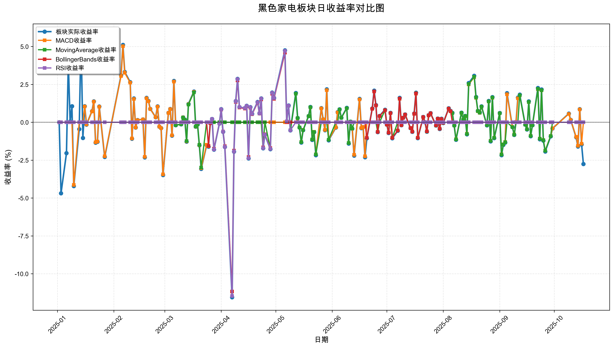
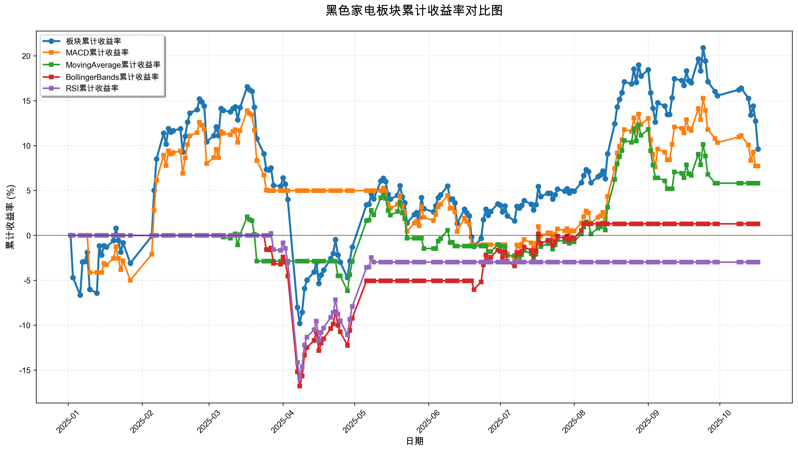

# 策略回测结果报告

**生成时间**: 2025-10-19 19:06:13
**行业板块**: 黑色家电
**回测期间**: 20250101 至 20251017
**策略数量**: 4

## 📈 分析结论

### 策略表现分析
- **最佳策略**: MACD (总收益率: 7.72%)
- **最差策略**: RSI (总收益率: -2.98%)
### 交易活跃度分析
- **活跃策略**: 4 个
- **非活跃策略**: 0 个
- **最活跃策略**: MovingAverage (交易次数: 20)
### 🚨 异动提醒分析
- 未检测到明显异动情况
### 风险分析
- **MACD**: 最大回撤 -14.46%, 夏普比率 0.5560
- **MovingAverage**: 最大回撤 -8.06%, 夏普比率 0.5599
- **BollingerBands**: 最大回撤 -16.78%, 夏普比率 0.1006
- **RSI**: 最大回撤 -15.98%, 夏普比率 -0.2382

## 📊 综合结果表

| 策略名称           | 初始资金     | 最终价值     | 总收益率   | 年化收益率   | 波动率    |    夏普比率 | 最大回撤    | 总交易次数   | 买入次数   | 卖出次数   | 总交易金额      | 平均交易金额   | 交易频率   |   数据点数 |
|:---------------|:---------|:---------|:-------|:--------|:-------|--------:|:--------|:--------|:-------|:-------|:-----------|:---------|:-------|-------:|
| 板块实际表现         | ¥100,000 | ¥109,610 | 9.61%  | 12.94%  | 27.76% |  0.4661 | -22.61% | N/A     | N/A    | N/A    | N/A        | N/A      | N/A    |    190 |
| MACD           | ¥100,000 | ¥107,720 | 7.72%  | 10.37%  | 18.64% |  0.556  | -14.46% | 8       | 4      | 4      | ¥787,280   | ¥98,410  | 0.04   |    190 |
| MovingAverage  | ¥100,000 | ¥105,824 | 5.82%  | 7.80%   | 13.93% |  0.5599 | -8.06%  | 20      | 10     | 10     | ¥1,951,106 | ¥97,555  | 0.11   |    190 |
| BollingerBands | ¥100,000 | ¥101,287 | 1.29%  | 1.71%   | 17.00% |  0.1006 | -16.78% | 5       | 3      | 2      | ¥477,159   | ¥95,432  | 0.03   |    190 |
| RSI            | ¥100,000 | ¥97,021  | -2.98% | -3.93%  | 16.50% | -0.2382 | -15.98% | 2       | 1      | 1      | ¥195,536   | ¥97,768  | 0.01   |    190 |

## 📊 每日收益率走势图

*图1: 黑色家电板块每日收益率走势对比*

## 📈 累计收益率走势图

*图2: 黑色家电板块累计收益率走势对比*

## 📅 日收益明细表

| 日期         | 板块实际收益率   | MACD收益率   | MovingAverage收益率   | BollingerBands收益率   | RSI收益率   |
|:-----------|:----------|:----------|:-------------------|:--------------------|:---------|
| 2025-01-02 | 0.00%     | 0.00%     | 0.00%              | 0.00%               | 0.00%    |
| 2025-01-03 | -4.69%    | 0.00%     | 0.00%              | 0.00%               | 0.00%    |
| 2025-01-06 | -2.04%    | 0.00%     | 0.00%              | 0.00%               | 0.00%    |
| 2025-01-07 | 3.94%     | 0.00%     | 0.00%              | 0.00%               | 0.00%    |
| 2025-01-08 | 0.05%     | 0.00%     | 0.00%              | 0.00%               | 0.00%    |
| 2025-01-09 | 1.06%     | 0.00%     | 0.00%              | 0.00%               | 0.00%    |
| 2025-01-10 | -4.21%    | -4.13%    | 0.00%              | 0.00%               | 0.00%    |
| 2025-01-13 | -0.45%    | 0.00%     | 0.00%              | 0.00%               | 0.00%    |
| 2025-01-14 | 5.64%     | 0.00%     | 0.00%              | 0.00%               | 0.00%    |
| 2025-01-15 | -1.04%    | 0.00%     | 0.00%              | 0.00%               | 0.00%    |
| 2025-01-16 | 1.06%     | 1.04%     | 0.00%              | 0.00%               | 0.00%    |
| 2025-01-17 | -0.15%    | -0.14%    | 0.00%              | 0.00%               | 0.00%    |
| 2025-01-20 | 0.73%     | 0.71%     | 0.00%              | 0.00%               | 0.00%    |
| 2025-01-21 | 1.38%     | 1.36%     | 0.00%              | 0.00%               | 0.00%    |
| 2025-01-22 | -1.35%    | -1.32%    | 0.00%              | 0.00%               | 0.00%    |
| 2025-01-23 | -1.29%    | -1.27%    | 0.00%              | 0.00%               | 0.00%    |
| 2025-01-24 | 1.04%     | 1.02%     | 0.00%              | 0.00%               | 0.00%    |
| 2025-01-27 | -2.29%    | -2.24%    | 0.00%              | 0.00%               | 0.00%    |
| 2025-02-05 | 3.10%     | 3.05%     | 0.00%              | 0.00%               | 0.00%    |
| 2025-02-06 | 5.11%     | 5.02%     | 0.00%              | 0.00%               | 0.00%    |
| 2025-02-07 | 3.32%     | 3.26%     | 0.00%              | 0.00%               | 0.00%    |
| 2025-02-10 | 2.65%     | 2.61%     | 0.00%              | 0.00%               | 0.00%    |
| 2025-02-11 | -1.09%    | -1.07%    | 0.00%              | 0.00%               | 0.00%    |
| 2025-02-12 | 1.57%     | 1.54%     | 0.00%              | 0.00%               | 0.00%    |
| 2025-02-13 | -0.35%    | -0.35%    | 0.00%              | 0.00%               | 0.00%    |
| 2025-02-14 | 0.15%     | 0.14%     | 0.00%              | 0.00%               | 0.00%    |
| 2025-02-17 | 0.19%     | 0.19%     | 0.00%              | 0.00%               | 0.00%    |
| 2025-02-18 | -2.32%    | -2.28%    | 0.00%              | 0.00%               | 0.00%    |
| 2025-02-19 | 1.61%     | 1.58%     | 0.00%              | 0.00%               | 0.00%    |
| 2025-02-20 | 1.41%     | 1.39%     | 0.00%              | 0.00%               | 0.00%    |
| 2025-02-21 | 0.89%     | 0.88%     | 0.00%              | 0.00%               | 0.00%    |
| 2025-02-24 | 0.33%     | 0.33%     | 0.00%              | 0.00%               | 0.00%    |
| 2025-02-25 | 1.05%     | 1.03%     | 0.00%              | 0.00%               | 0.00%    |
| 2025-02-26 | -0.29%    | -0.29%    | 0.00%              | 0.00%               | 0.00%    |
| 2025-02-27 | -0.39%    | -0.39%    | 0.00%              | 0.00%               | 0.00%    |
| 2025-02-28 | -3.48%    | -3.43%    | 0.00%              | 0.00%               | 0.00%    |
| 2025-03-03 | 0.62%     | 0.61%     | 0.00%              | 0.00%               | 0.00%    |
| 2025-03-04 | 0.88%     | 0.87%     | 0.00%              | 0.00%               | 0.00%    |
| 2025-03-05 | -0.88%    | -0.86%    | 0.00%              | 0.00%               | 0.00%    |
| 2025-03-06 | 2.73%     | 2.68%     | 0.00%              | 0.00%               | 0.00%    |
| 2025-03-07 | -0.19%    | -0.19%    | -0.19%             | 0.00%               | 0.00%    |
| 2025-03-10 | -0.13%    | -0.13%    | -0.13%             | 0.00%               | 0.00%    |
| 2025-03-11 | 0.32%     | 0.32%     | 0.31%              | 0.00%               | 0.00%    |
| 2025-03-12 | 0.18%     | 0.17%     | 0.17%              | 0.00%               | 0.00%    |
| 2025-03-13 | -1.28%    | -1.26%    | -1.24%             | 0.00%               | 0.00%    |
| 2025-03-14 | 1.21%     | 1.19%     | 1.17%              | 0.00%               | 0.00%    |
| 2025-03-17 | 2.03%     | 2.00%     | 1.97%              | 0.00%               | 0.00%    |
| 2025-03-18 | -0.29%    | -0.29%    | -0.28%             | 0.00%               | 0.00%    |
| 2025-03-19 | -0.14%    | -0.13%    | -0.13%             | 0.00%               | 0.00%    |
| 2025-03-20 | -1.52%    | -1.50%    | -1.48%             | 0.00%               | 0.00%    |
| 2025-03-21 | -3.08%    | -3.03%    | -2.99%             | 0.00%               | 0.00%    |
| 2025-03-24 | -1.51%    | -1.48%    | 0.00%              | 0.00%               | 0.00%    |
| 2025-03-25 | -1.61%    | -1.58%    | 0.00%              | -1.56%              | 0.00%    |
| 2025-03-26 | -0.06%    | -0.06%    | 0.00%              | -0.06%              | 0.00%    |
| 2025-03-27 | 0.22%     | 0.00%     | 0.00%              | 0.21%               | 0.22%    |
| 2025-03-28 | -1.80%    | 0.00%     | 0.00%              | -1.75%              | -1.79%   |
| 2025-03-31 | -0.09%    | 0.00%     | 0.00%              | -0.09%              | -0.09%   |
| 2025-04-01 | 0.87%     | 0.00%     | 0.00%              | 0.84%               | 0.86%    |
| 2025-04-02 | -0.63%    | 0.00%     | 0.00%              | -0.61%              | -0.62%   |
| 2025-04-03 | -1.63%    | 0.00%     | 0.00%              | -1.58%              | -1.62%   |
| 2025-04-07 | -11.55%   | 0.00%     | 0.00%              | -11.17%             | -11.46%  |
| 2025-04-08 | -1.94%    | 0.00%     | 0.00%              | -1.87%              | -1.92%   |
| 2025-04-09 | 1.40%     | 0.00%     | 0.00%              | 1.34%               | 1.38%    |
| 2025-04-10 | 2.87%     | 0.00%     | 0.00%              | 2.76%               | 2.85%    |
| 2025-04-11 | 1.00%     | 0.00%     | 0.00%              | 0.97%               | 1.00%    |
| 2025-04-14 | 0.93%     | 0.00%     | 0.00%              | 0.90%               | 0.93%    |
| 2025-04-15 | 1.09%     | 0.00%     | 0.00%              | 1.05%               | 1.08%    |
| 2025-04-16 | -2.39%    | 0.00%     | 0.00%              | -2.30%              | -2.37%   |
| 2025-04-17 | 1.00%     | 0.00%     | 0.00%              | 0.96%               | 0.99%    |
| 2025-04-18 | 0.56%     | 0.00%     | 0.00%              | 0.54%               | 0.56%    |
| 2025-04-21 | 1.34%     | 0.00%     | 0.00%              | 1.29%               | 1.32%    |
| 2025-04-22 | 0.59%     | 0.00%     | 0.00%              | 0.57%               | 0.58%    |
| 2025-04-23 | 1.57%     | 0.00%     | 0.00%              | 1.51%               | 1.56%    |
| 2025-04-24 | -1.72%    | 0.00%     | -1.69%             | -1.66%              | -1.71%   |
| 2025-04-25 | -0.82%    | 0.00%     | 0.00%              | -0.79%              | -0.81%   |
| 2025-04-28 | -1.77%    | 0.00%     | -1.73%             | -1.71%              | -1.76%   |
| 2025-04-29 | 1.96%     | 0.00%     | 1.91%              | 1.89%               | 1.94%    |
| 2025-04-30 | 1.60%     | 0.00%     | 1.57%              | 1.55%               | 1.59%    |
| 2025-05-06 | 4.75%     | 0.00%     | 4.65%              | 4.59%               | 4.71%    |
| 2025-05-07 | 0.06%     | 0.00%     | 0.06%              | 0.00%               | 0.06%    |
| 2025-05-08 | 1.11%     | 0.00%     | 1.09%              | 0.00%               | 1.10%    |
| 2025-05-09 | -0.53%    | 0.00%     | -0.52%             | 0.00%               | -0.53%   |
| 2025-05-12 | 1.93%     | 0.00%     | 1.89%              | 0.00%               | 0.00%    |
| 2025-05-13 | 0.28%     | 0.27%     | 0.27%              | 0.00%               | 0.00%    |
| 2025-05-14 | -0.35%    | -0.34%    | -0.34%             | 0.00%               | 0.00%    |
| 2025-05-15 | -1.34%    | -1.30%    | -1.31%             | 0.00%               | 0.00%    |
| 2025-05-16 | -0.52%    | -0.50%    | -0.51%             | 0.00%               | 0.00%    |
| 2025-05-19 | 0.41%     | 0.40%     | 0.40%              | 0.00%               | 0.00%    |
| 2025-05-20 | 1.01%     | 0.98%     | 0.99%              | 0.00%               | 0.00%    |
| 2025-05-21 | -1.16%    | -1.13%    | -1.13%             | 0.00%               | 0.00%    |
| 2025-05-22 | -0.65%    | -0.63%    | -0.64%             | 0.00%               | 0.00%    |
| 2025-05-23 | -2.17%    | -2.11%    | -2.12%             | 0.00%               | 0.00%    |
| 2025-05-26 | 0.93%     | 0.91%     | 0.00%              | 0.00%               | 0.00%    |
| 2025-05-27 | 0.20%     | 0.19%     | 0.00%              | 0.00%               | 0.00%    |
| 2025-05-28 | -0.52%    | -0.50%    | 0.00%              | 0.00%               | 0.00%    |
| 2025-05-29 | 2.18%     | 2.12%     | 0.00%              | 0.00%               | 0.00%    |
| 2025-05-30 | -1.19%    | -1.15%    | -1.15%             | 0.00%               | 0.00%    |
| 2025-06-03 | -0.35%    | -0.34%    | 0.00%              | 0.00%               | 0.00%    |
| 2025-06-04 | 0.67%     | 0.65%     | 0.00%              | 0.00%               | 0.00%    |
| 2025-06-05 | 0.86%     | 0.84%     | 0.84%              | 0.00%               | 0.00%    |
| 2025-06-06 | 0.30%     | 0.29%     | 0.29%              | 0.00%               | 0.00%    |
| 2025-06-09 | 0.95%     | 0.92%     | 0.92%              | 0.00%               | 0.00%    |
| 2025-06-10 | -1.41%    | -1.37%    | -1.37%             | 0.00%               | 0.00%    |
| 2025-06-11 | 0.04%     | 0.04%     | 0.04%              | 0.00%               | 0.00%    |
| 2025-06-12 | -0.43%    | -0.42%    | -0.42%             | 0.00%               | 0.00%    |
| 2025-06-13 | -2.20%    | -2.14%    | 0.00%              | 0.00%               | 0.00%    |
| 2025-06-16 | 1.55%     | 1.51%     | 0.00%              | 0.00%               | 0.00%    |
| 2025-06-17 | -0.39%    | -0.38%    | 0.00%              | 0.00%               | 0.00%    |
| 2025-06-18 | -0.32%    | -0.31%    | 0.00%              | 0.00%               | 0.00%    |
| 2025-06-19 | -2.31%    | -2.24%    | 0.00%              | 0.00%               | 0.00%    |
| 2025-06-20 | -1.06%    | 0.00%     | 0.00%              | -1.03%              | 0.00%    |
| 2025-06-23 | 0.91%     | 0.00%     | 0.00%              | 0.89%               | 0.00%    |
| 2025-06-24 | 2.09%     | 0.00%     | 0.00%              | 2.03%               | 0.00%    |
| 2025-06-25 | 1.14%     | 0.00%     | 0.00%              | 1.11%               | 0.00%    |
| 2025-06-26 | -0.65%    | 0.00%     | -0.63%             | -0.64%              | 0.00%    |
| 2025-06-27 | 0.42%     | 0.00%     | 0.00%              | 0.41%               | 0.00%    |
| 2025-06-30 | 0.83%     | 0.00%     | 0.80%              | 0.80%               | 0.00%    |
| 2025-07-01 | -0.15%    | 0.00%     | -0.15%             | -0.15%              | 0.00%    |
| 2025-07-02 | -0.71%    | 0.00%     | -0.68%             | -0.69%              | 0.00%    |
| 2025-07-03 | 0.62%     | 0.00%     | 0.60%              | 0.60%               | 0.00%    |
| 2025-07-04 | -1.06%    | -1.02%    | -1.02%             | -1.03%              | 0.00%    |
| 2025-07-07 | -0.56%    | -0.54%    | 0.00%              | -0.54%              | 0.00%    |
| 2025-07-08 | 1.61%     | 1.55%     | 0.00%              | 1.56%               | 0.00%    |
| 2025-07-09 | -0.19%    | -0.19%    | -0.19%             | -0.19%              | 0.00%    |
| 2025-07-10 | 0.30%     | 0.29%     | 0.29%              | 0.29%               | 0.00%    |
| 2025-07-11 | 0.52%     | 0.50%     | 0.51%              | 0.51%               | 0.00%    |
| 2025-07-14 | -0.39%    | -0.38%    | -0.38%             | -0.38%              | 0.00%    |
| 2025-07-15 | -0.63%    | -0.61%    | -0.62%             | -0.62%              | 0.00%    |
| 2025-07-16 | 0.58%     | 0.56%     | 0.56%              | 0.56%               | 0.00%    |
| 2025-07-17 | 1.95%     | 1.89%     | 1.91%              | 1.90%               | 0.00%    |
| 2025-07-18 | -1.05%    | -1.02%    | -1.03%             | -1.03%              | 0.00%    |
| 2025-07-21 | 0.35%     | 0.34%     | 0.34%              | 0.34%               | 0.00%    |
| 2025-07-22 | 0.00%     | 0.00%     | 0.00%              | 0.00%               | 0.00%    |
| 2025-07-23 | -0.62%    | -0.60%    | -0.61%             | -0.60%              | 0.00%    |
| 2025-07-24 | 0.47%     | 0.45%     | 0.46%              | 0.46%               | 0.00%    |
| 2025-07-25 | 0.60%     | 0.58%     | 0.59%              | 0.59%               | 0.00%    |
| 2025-07-28 | -0.21%    | -0.20%    | -0.21%             | -0.20%              | 0.00%    |
| 2025-07-29 | 0.24%     | 0.23%     | 0.23%              | 0.23%               | 0.00%    |
| 2025-07-30 | -0.44%    | -0.43%    | -0.43%             | -0.43%              | 0.00%    |
| 2025-07-31 | 0.23%     | 0.22%     | 0.22%              | 0.22%               | 0.00%    |
| 2025-08-01 | -0.05%    | -0.04%    | -0.05%             | -0.04%              | 0.00%    |
| 2025-08-04 | 0.92%     | 0.89%     | 0.90%              | 0.90%               | 0.00%    |
| 2025-08-05 | 0.75%     | 0.72%     | 0.73%              | 0.73%               | 0.00%    |
| 2025-08-06 | 0.62%     | 0.60%     | 0.60%              | 0.00%               | 0.00%    |
| 2025-08-07 | -0.21%    | -0.21%    | -0.21%             | 0.00%               | 0.00%    |
| 2025-08-08 | -1.15%    | -1.11%    | -1.13%             | 0.00%               | 0.00%    |
| 2025-08-11 | 0.63%     | 0.61%     | 0.62%              | 0.00%               | 0.00%    |
| 2025-08-12 | 0.17%     | 0.17%     | 0.17%              | 0.00%               | 0.00%    |
| 2025-08-13 | 0.42%     | 0.40%     | 0.41%              | 0.00%               | 0.00%    |
| 2025-08-14 | -0.79%    | -0.76%    | -0.77%             | 0.00%               | 0.00%    |
| 2025-08-15 | 2.59%     | 2.50%     | 2.53%              | 0.00%               | 0.00%    |
| 2025-08-18 | 3.07%     | 2.97%     | 3.00%              | 0.00%               | 0.00%    |
| 2025-08-19 | 1.67%     | 1.61%     | 1.63%              | 0.00%               | 0.00%    |
| 2025-08-20 | 0.75%     | 0.73%     | 0.74%              | 0.00%               | 0.00%    |
| 2025-08-21 | 0.64%     | 0.62%     | 0.63%              | 0.00%               | 0.00%    |
| 2025-08-22 | 1.05%     | 1.02%     | 1.03%              | 0.00%               | 0.00%    |
| 2025-08-25 | -0.20%    | -0.19%    | -0.19%             | 0.00%               | 0.00%    |
| 2025-08-26 | 1.41%     | 1.37%     | 1.38%              | 0.00%               | 0.00%    |
| 2025-08-27 | -1.26%    | -1.22%    | -1.23%             | 0.00%               | 0.00%    |
| 2025-08-28 | 1.66%     | 1.61%     | 1.63%              | 0.00%               | 0.00%    |
| 2025-08-29 | -1.05%    | -1.02%    | -1.03%             | 0.00%               | 0.00%    |
| 2025-09-01 | 0.61%     | 0.59%     | 0.59%              | 0.00%               | 0.00%    |
| 2025-09-02 | -2.17%    | -2.11%    | -2.13%             | 0.00%               | 0.00%    |
| 2025-09-03 | -1.49%    | -1.45%    | -1.46%             | 0.00%               | 0.00%    |
| 2025-09-04 | -1.34%    | -1.30%    | -1.32%             | 0.00%               | 0.00%    |
| 2025-09-05 | 1.92%     | 1.85%     | 0.00%              | 0.00%               | 0.00%    |
| 2025-09-08 | -0.32%    | -0.31%    | -0.32%             | 0.00%               | 0.00%    |
| 2025-09-09 | -0.83%    | -0.80%    | -0.82%             | 0.00%               | 0.00%    |
| 2025-09-10 | 0.02%     | 0.02%     | 0.00%              | 0.00%               | 0.00%    |
| 2025-09-11 | 1.63%     | 1.58%     | 0.00%              | 0.00%               | 0.00%    |
| 2025-09-12 | 1.83%     | 1.77%     | 1.78%              | 0.00%               | 0.00%    |
| 2025-09-15 | -0.15%    | -0.15%    | -0.15%             | 0.00%               | 0.00%    |
| 2025-09-16 | -0.47%    | -0.46%    | -0.46%             | 0.00%               | 0.00%    |
| 2025-09-17 | 1.38%     | 1.33%     | 1.34%              | 0.00%               | 0.00%    |
| 2025-09-18 | -0.92%    | -0.89%    | -0.90%             | 0.00%               | 0.00%    |
| 2025-09-19 | -0.19%    | -0.18%    | -0.19%             | 0.00%               | 0.00%    |
| 2025-09-22 | 2.26%     | 2.19%     | 2.21%              | 0.00%               | 0.00%    |
| 2025-09-23 | -1.12%    | -1.08%    | -1.09%             | 0.00%               | 0.00%    |
| 2025-09-24 | 2.17%     | 2.11%     | 2.12%              | 0.00%               | 0.00%    |
| 2025-09-25 | -1.21%    | -1.17%    | -1.18%             | 0.00%               | 0.00%    |
| 2025-09-26 | -1.93%    | -1.87%    | -1.88%             | 0.00%               | 0.00%    |
| 2025-09-29 | -0.93%    | -0.90%    | -0.91%             | 0.00%               | 0.00%    |
| 2025-09-30 | -0.41%    | -0.40%    | 0.00%              | 0.00%               | 0.00%    |
| 2025-10-09 | 0.57%     | 0.55%     | 0.00%              | 0.00%               | 0.00%    |
| 2025-10-10 | 0.16%     | 0.15%     | 0.00%              | 0.00%               | 0.00%    |
| 2025-10-13 | -0.99%    | -0.96%    | 0.00%              | 0.00%               | 0.00%    |
| 2025-10-14 | -1.60%    | -1.55%    | 0.00%              | 0.00%               | 0.00%    |
| 2025-10-15 | 0.87%     | 0.85%     | 0.00%              | 0.00%               | 0.00%    |
| 2025-10-16 | -1.46%    | -1.42%    | 0.00%              | 0.00%               | 0.00%    |
| 2025-10-17 | -2.76%    | 0.00%     | 0.00%              | 0.00%               | 0.00%    |

## 📊 日收益统计摘要

| 指标                | 平均日收益率   | 最大日收益率   | 最小日收益率   | 正收益天数   | 负收益天数   |
|:------------------|:---------|:---------|:---------|:--------|:--------|
| 板块实际收益率           | 0.06%    | 5.64%    | -11.55%  | 98天     | 90天     |
| MACD收益率           | 0.05%    | 5.02%    | -4.13%   | 70天     | 70天     |
| MovingAverage收益率  | 0.03%    | 4.65%    | -2.99%   | 47天     | 50天     |
| BollingerBands收益率 | 0.01%    | 4.59%    | -11.17%  | 33天     | 26天     |
| RSI收益率            | -0.01%   | 4.71%    | -11.46%  | 17天     | 11天     |

## 📈 累计收益明细表

| 日期         | 板块累计收益率   | MACD累计收益率   | MovingAverage累计收益率   | BollingerBands累计收益率   | RSI累计收益率   |
|:-----------|:----------|:------------|:---------------------|:----------------------|:-----------|
| 2025-01-02 | 0.00%     | 0.00%       | 0.00%                | 0.00%                 | 0.00%      |
| 2025-01-03 | -4.69%    | 0.00%       | 0.00%                | 0.00%                 | 0.00%      |
| 2025-01-06 | -6.64%    | 0.00%       | 0.00%                | 0.00%                 | 0.00%      |
| 2025-01-07 | -2.96%    | 0.00%       | 0.00%                | 0.00%                 | 0.00%      |
| 2025-01-08 | -2.91%    | 0.00%       | 0.00%                | 0.00%                 | 0.00%      |
| 2025-01-09 | -1.88%    | 0.00%       | 0.00%                | 0.00%                 | 0.00%      |
| 2025-01-10 | -6.01%    | -4.13%      | 0.00%                | 0.00%                 | 0.00%      |
| 2025-01-13 | -6.43%    | -4.13%      | 0.00%                | 0.00%                 | 0.00%      |
| 2025-01-14 | -1.16%    | -4.13%      | 0.00%                | 0.00%                 | 0.00%      |
| 2025-01-15 | -2.19%    | -4.13%      | 0.00%                | 0.00%                 | 0.00%      |
| 2025-01-16 | -1.15%    | -3.13%      | 0.00%                | 0.00%                 | 0.00%      |
| 2025-01-17 | -1.30%    | -3.27%      | 0.00%                | 0.00%                 | 0.00%      |
| 2025-01-20 | -0.58%    | -2.58%      | 0.00%                | 0.00%                 | 0.00%      |
| 2025-01-21 | 0.80%     | -1.26%      | 0.00%                | 0.00%                 | 0.00%      |
| 2025-01-22 | -0.56%    | -2.56%      | 0.00%                | 0.00%                 | 0.00%      |
| 2025-01-23 | -1.85%    | -3.80%      | 0.00%                | 0.00%                 | 0.00%      |
| 2025-01-24 | -0.83%    | -2.82%      | 0.00%                | 0.00%                 | 0.00%      |
| 2025-01-27 | -3.10%    | -5.00%      | 0.00%                | 0.00%                 | 0.00%      |
| 2025-02-05 | -0.09%    | -2.11%      | 0.00%                | 0.00%                 | 0.00%      |
| 2025-02-06 | 5.02%     | 2.81%       | 0.00%                | 0.00%                 | 0.00%      |
| 2025-02-07 | 8.51%     | 6.16%       | 0.00%                | 0.00%                 | 0.00%      |
| 2025-02-10 | 11.38%    | 8.93%       | 0.00%                | 0.00%                 | 0.00%      |
| 2025-02-11 | 10.17%    | 7.76%       | 0.00%                | 0.00%                 | 0.00%      |
| 2025-02-12 | 11.90%    | 9.43%       | 0.00%                | 0.00%                 | 0.00%      |
| 2025-02-13 | 11.51%    | 9.05%       | 0.00%                | 0.00%                 | 0.00%      |
| 2025-02-14 | 11.67%    | 9.21%       | 0.00%                | 0.00%                 | 0.00%      |
| 2025-02-17 | 11.88%    | 9.41%       | 0.00%                | 0.00%                 | 0.00%      |
| 2025-02-18 | 9.29%     | 6.92%       | 0.00%                | 0.00%                 | 0.00%      |
| 2025-02-19 | 11.05%    | 8.61%       | 0.00%                | 0.00%                 | 0.00%      |
| 2025-02-20 | 12.61%    | 10.11%      | 0.00%                | 0.00%                 | 0.00%      |
| 2025-02-21 | 13.62%    | 11.08%      | 0.00%                | 0.00%                 | 0.00%      |
| 2025-02-24 | 14.00%    | 11.44%      | 0.00%                | 0.00%                 | 0.00%      |
| 2025-02-25 | 15.19%    | 12.59%      | 0.00%                | 0.00%                 | 0.00%      |
| 2025-02-26 | 14.85%    | 12.27%      | 0.00%                | 0.00%                 | 0.00%      |
| 2025-02-27 | 14.40%    | 11.84%      | 0.00%                | 0.00%                 | 0.00%      |
| 2025-02-28 | 10.42%    | 8.00%       | 0.00%                | 0.00%                 | 0.00%      |
| 2025-03-03 | 11.10%    | 8.66%       | 0.00%                | 0.00%                 | 0.00%      |
| 2025-03-04 | 12.08%    | 9.60%       | 0.00%                | 0.00%                 | 0.00%      |
| 2025-03-05 | 11.10%    | 8.66%       | 0.00%                | 0.00%                 | 0.00%      |
| 2025-03-06 | 14.13%    | 11.57%      | 0.00%                | 0.00%                 | 0.00%      |
| 2025-03-07 | 13.91%    | 11.36%      | -0.19%               | 0.00%                 | 0.00%      |
| 2025-03-10 | 13.76%    | 11.22%      | -0.31%               | 0.00%                 | 0.00%      |
| 2025-03-11 | 14.13%    | 11.57%      | 0.00%                | 0.00%                 | 0.00%      |
| 2025-03-12 | 14.33%    | 11.77%      | 0.17%                | 0.00%                 | 0.00%      |
| 2025-03-13 | 12.87%    | 10.36%      | -1.07%               | 0.00%                 | 0.00%      |
| 2025-03-14 | 14.23%    | 11.67%      | 0.09%                | 0.00%                 | 0.00%      |
| 2025-03-17 | 16.55%    | 13.90%      | 2.06%                | 0.00%                 | 0.00%      |
| 2025-03-18 | 16.21%    | 13.57%      | 1.77%                | 0.00%                 | 0.00%      |
| 2025-03-19 | 16.05%    | 13.42%      | 1.64%                | 0.00%                 | 0.00%      |
| 2025-03-20 | 14.28%    | 11.72%      | 0.13%                | 0.00%                 | 0.00%      |
| 2025-03-21 | 10.76%    | 8.33%       | -2.87%               | 0.00%                 | 0.00%      |
| 2025-03-24 | 9.09%     | 6.73%       | -2.87%               | 0.00%                 | 0.00%      |
| 2025-03-25 | 7.34%     | 5.04%       | -2.87%               | -1.56%                | 0.00%      |
| 2025-03-26 | 7.28%     | 4.98%       | -2.87%               | -1.61%                | 0.00%      |
| 2025-03-27 | 7.51%     | 4.98%       | -2.87%               | -1.40%                | 0.22%      |
| 2025-03-28 | 5.57%     | 4.98%       | -2.87%               | -3.13%                | -1.58%     |
| 2025-03-31 | 5.48%     | 4.98%       | -2.87%               | -3.21%                | -1.67%     |
| 2025-04-01 | 6.40%     | 4.98%       | -2.87%               | -2.39%                | -0.82%     |
| 2025-04-02 | 5.73%     | 4.98%       | -2.87%               | -2.99%                | -1.44%     |
| 2025-04-03 | 4.00%     | 4.98%       | -2.87%               | -4.52%                | -3.03%     |
| 2025-04-07 | -8.01%    | 4.98%       | -2.87%               | -15.19%               | -14.15%    |
| 2025-04-08 | -9.80%    | 4.98%       | -2.87%               | -16.78%               | -15.80%    |
| 2025-04-09 | -8.54%    | 4.98%       | -2.87%               | -15.66%               | -14.64%    |
| 2025-04-10 | -5.91%    | 4.98%       | -2.87%               | -13.33%               | -12.21%    |
| 2025-04-11 | -4.97%    | 4.98%       | -2.87%               | -12.49%               | -11.33%    |
| 2025-04-14 | -4.08%    | 4.98%       | -2.87%               | -11.70%               | -10.51%    |
| 2025-04-15 | -3.04%    | 4.98%       | -2.87%               | -10.77%               | -9.54%     |
| 2025-04-16 | -5.35%    | 4.98%       | -2.87%               | -12.83%               | -11.68%    |
| 2025-04-17 | -4.40%    | 4.98%       | -2.87%               | -11.99%               | -10.81%    |
| 2025-04-18 | -3.87%    | 4.98%       | -2.87%               | -11.51%               | -10.31%    |
| 2025-04-21 | -2.58%    | 4.98%       | -2.87%               | -10.37%               | -9.12%     |
| 2025-04-22 | -2.01%    | 4.98%       | -2.87%               | -9.86%                | -8.59%     |
| 2025-04-23 | -0.47%    | 4.98%       | -2.87%               | -8.50%                | -7.17%     |
| 2025-04-24 | -2.18%    | 4.98%       | -4.51%               | -10.02%               | -8.75%     |
| 2025-04-25 | -2.98%    | 4.98%       | -4.51%               | -10.73%               | -9.50%     |
| 2025-04-28 | -4.70%    | 4.98%       | -6.17%               | -12.26%               | -11.09%    |
| 2025-04-29 | -2.84%    | 4.98%       | -4.37%               | -10.60%               | -9.36%     |
| 2025-04-30 | -1.29%    | 4.98%       | -2.88%               | -9.22%                | -7.92%     |
| 2025-05-06 | 3.41%     | 4.98%       | 1.64%                | -5.05%                | -3.58%     |
| 2025-05-07 | 3.47%     | 4.98%       | 1.70%                | -5.05%                | -3.53%     |
| 2025-05-08 | 4.62%     | 4.98%       | 2.80%                | -5.05%                | -2.46%     |
| 2025-05-09 | 4.06%     | 4.98%       | 2.27%                | -5.05%                | -2.98%     |
| 2025-05-12 | 6.07%     | 4.98%       | 4.20%                | -5.05%                | -2.98%     |
| 2025-05-13 | 6.37%     | 5.27%       | 4.49%                | -5.05%                | -2.98%     |
| 2025-05-14 | 6.00%     | 4.91%       | 4.13%                | -5.05%                | -2.98%     |
| 2025-05-15 | 4.58%     | 3.55%       | 2.77%                | -5.05%                | -2.98%     |
| 2025-05-16 | 4.04%     | 3.03%       | 2.25%                | -5.05%                | -2.98%     |
| 2025-05-19 | 4.47%     | 3.44%       | 2.66%                | -5.05%                | -2.98%     |
| 2025-05-20 | 5.53%     | 4.46%       | 3.68%                | -5.05%                | -2.98%     |
| 2025-05-21 | 4.30%     | 3.28%       | 2.50%                | -5.05%                | -2.98%     |
| 2025-05-22 | 3.62%     | 2.63%       | 1.85%                | -5.05%                | -2.98%     |
| 2025-05-23 | 1.38%     | 0.46%       | -0.32%               | -5.05%                | -2.98%     |
| 2025-05-26 | 2.32%     | 1.37%       | -0.32%               | -5.05%                | -2.98%     |
| 2025-05-27 | 2.53%     | 1.57%       | -0.32%               | -5.05%                | -2.98%     |
| 2025-05-28 | 2.00%     | 1.06%       | -0.32%               | -5.05%                | -2.98%     |
| 2025-05-29 | 4.22%     | 3.20%       | -0.32%               | -5.05%                | -2.98%     |
| 2025-05-30 | 2.98%     | 2.01%       | -1.46%               | -5.05%                | -2.98%     |
| 2025-06-03 | 2.62%     | 1.66%       | -1.46%               | -5.05%                | -2.98%     |
| 2025-06-04 | 3.31%     | 2.33%       | -1.46%               | -5.05%                | -2.98%     |
| 2025-06-05 | 4.20%     | 3.18%       | -0.64%               | -5.05%                | -2.98%     |
| 2025-06-06 | 4.51%     | 3.48%       | -0.35%               | -5.05%                | -2.98%     |
| 2025-06-09 | 5.50%     | 4.44%       | 0.57%                | -5.05%                | -2.98%     |
| 2025-06-10 | 4.01%     | 3.00%       | -0.81%               | -5.05%                | -2.98%     |
| 2025-06-11 | 4.06%     | 3.05%       | -0.77%               | -5.05%                | -2.98%     |
| 2025-06-12 | 3.61%     | 2.62%       | -1.18%               | -5.05%                | -2.98%     |
| 2025-06-13 | 1.33%     | 0.42%       | -1.18%               | -5.05%                | -2.98%     |
| 2025-06-16 | 2.91%     | 1.94%       | -1.18%               | -5.05%                | -2.98%     |
| 2025-06-17 | 2.51%     | 1.55%       | -1.18%               | -5.05%                | -2.98%     |
| 2025-06-18 | 2.18%     | 1.24%       | -1.18%               | -5.05%                | -2.98%     |
| 2025-06-19 | -0.18%    | -1.03%      | -1.18%               | -5.05%                | -2.98%     |
| 2025-06-20 | -1.23%    | -1.03%      | -1.18%               | -6.03%                | -2.98%     |
| 2025-06-23 | -0.33%    | -1.03%      | -1.18%               | -5.19%                | -2.98%     |
| 2025-06-24 | 1.75%     | -1.03%      | -1.18%               | -3.27%                | -2.98%     |
| 2025-06-25 | 2.91%     | -1.03%      | -1.18%               | -2.19%                | -2.98%     |
| 2025-06-26 | 2.24%     | -1.03%      | -1.81%               | -2.82%                | -2.98%     |
| 2025-06-27 | 2.67%     | -1.03%      | -1.81%               | -2.42%                | -2.98%     |
| 2025-06-30 | 3.52%     | -1.03%      | -1.02%               | -1.63%                | -2.98%     |
| 2025-07-01 | 3.36%     | -1.03%      | -1.17%               | -1.78%                | -2.98%     |
| 2025-07-02 | 2.63%     | -1.03%      | -1.84%               | -2.45%                | -2.98%     |
| 2025-07-03 | 3.27%     | -1.03%      | -1.25%               | -1.86%                | -2.98%     |
| 2025-07-04 | 2.17%     | -2.04%      | -2.26%               | -2.88%                | -2.98%     |
| 2025-07-07 | 1.61%     | -2.57%      | -2.26%               | -3.40%                | -2.98%     |
| 2025-07-08 | 3.24%     | -1.06%      | -2.26%               | -1.89%                | -2.98%     |
| 2025-07-09 | 3.04%     | -1.24%      | -2.45%               | -2.07%                | -2.98%     |
| 2025-07-10 | 3.35%     | -0.96%      | -2.16%               | -1.79%                | -2.98%     |
| 2025-07-11 | 3.88%     | -0.46%      | -1.67%               | -1.29%                | -2.98%     |
| 2025-07-14 | 3.48%     | -0.83%      | -2.04%               | -1.67%                | -2.98%     |
| 2025-07-15 | 2.83%     | -1.44%      | -2.65%               | -2.27%                | -2.98%     |
| 2025-07-16 | 3.42%     | -0.89%      | -2.10%               | -1.72%                | -2.98%     |
| 2025-07-17 | 5.44%     | 0.98%       | -0.23%               | 0.15%                 | -2.98%     |
| 2025-07-18 | 4.33%     | -0.05%      | -1.26%               | -0.88%                | -2.98%     |
| 2025-07-21 | 4.69%     | 0.29%       | -0.92%               | -0.55%                | -2.98%     |
| 2025-07-22 | 4.69%     | 0.29%       | -0.92%               | -0.55%                | -2.98%     |
| 2025-07-23 | 4.04%     | -0.31%      | -1.52%               | -1.15%                | -2.98%     |
| 2025-07-24 | 4.53%     | 0.14%       | -1.07%               | -0.69%                | -2.98%     |
| 2025-07-25 | 5.16%     | 0.72%       | -0.48%               | -0.11%                | -2.98%     |
| 2025-07-28 | 4.94%     | 0.52%       | -0.69%               | -0.32%                | -2.98%     |
| 2025-07-29 | 5.19%     | 0.75%       | -0.46%               | -0.09%                | -2.98%     |
| 2025-07-30 | 4.73%     | 0.32%       | -0.89%               | -0.52%                | -2.98%     |
| 2025-07-31 | 4.96%     | 0.54%       | -0.67%               | -0.30%                | -2.98%     |
| 2025-08-01 | 4.92%     | 0.49%       | -0.71%               | -0.34%                | -2.98%     |
| 2025-08-04 | 5.88%     | 1.39%       | 0.18%                | 0.56%                 | -2.98%     |
| 2025-08-05 | 6.67%     | 2.12%       | 0.91%                | 1.29%                 | -2.98%     |
| 2025-08-06 | 7.33%     | 2.73%       | 1.52%                | 1.29%                 | -2.98%     |
| 2025-08-07 | 7.11%     | 2.52%       | 1.31%                | 1.29%                 | -2.98%     |
| 2025-08-08 | 5.87%     | 1.38%       | 0.17%                | 1.29%                 | -2.98%     |
| 2025-08-11 | 6.54%     | 2.00%       | 0.79%                | 1.29%                 | -2.98%     |
| 2025-08-12 | 6.72%     | 2.17%       | 0.96%                | 1.29%                 | -2.98%     |
| 2025-08-13 | 7.17%     | 2.58%       | 1.37%                | 1.29%                 | -2.98%     |
| 2025-08-14 | 6.32%     | 1.79%       | 0.59%                | 1.29%                 | -2.98%     |
| 2025-08-15 | 9.08%     | 4.34%       | 3.14%                | 1.29%                 | -2.98%     |
| 2025-08-18 | 12.42%    | 7.44%       | 6.23%                | 1.29%                 | -2.98%     |
| 2025-08-19 | 14.30%    | 9.17%       | 7.97%                | 1.29%                 | -2.98%     |
| 2025-08-20 | 15.16%    | 9.97%       | 8.76%                | 1.29%                 | -2.98%     |
| 2025-08-21 | 15.89%    | 10.65%      | 9.44%                | 1.29%                 | -2.98%     |
| 2025-08-22 | 17.11%    | 11.78%      | 10.57%               | 1.29%                 | -2.98%     |
| 2025-08-25 | 16.88%    | 11.57%      | 10.36%               | 1.29%                 | -2.98%     |
| 2025-08-26 | 18.53%    | 13.09%      | 11.89%               | 1.29%                 | -2.98%     |
| 2025-08-27 | 17.04%    | 11.71%      | 10.51%               | 1.29%                 | -2.98%     |
| 2025-08-28 | 18.99%    | 13.52%      | 12.31%               | 1.29%                 | -2.98%     |
| 2025-08-29 | 17.74%    | 12.36%      | 11.15%               | 1.29%                 | -2.98%     |
| 2025-09-01 | 18.45%    | 13.02%      | 11.81%               | 1.29%                 | -2.98%     |
| 2025-09-02 | 15.88%    | 10.64%      | 9.43%                | 1.29%                 | -2.98%     |
| 2025-09-03 | 14.15%    | 9.04%       | 7.83%                | 1.29%                 | -2.98%     |
| 2025-09-04 | 12.61%    | 7.62%       | 6.41%                | 1.29%                 | -2.98%     |
| 2025-09-05 | 14.77%    | 9.61%       | 6.41%                | 1.29%                 | -2.98%     |
| 2025-09-08 | 14.41%    | 9.27%       | 6.07%                | 1.29%                 | -2.98%     |
| 2025-09-09 | 13.46%    | 8.40%       | 5.20%                | 1.29%                 | -2.98%     |
| 2025-09-10 | 13.48%    | 8.42%       | 5.20%                | 1.29%                 | -2.98%     |
| 2025-09-11 | 15.33%    | 10.13%      | 5.20%                | 1.29%                 | -2.98%     |
| 2025-09-12 | 17.44%    | 12.08%      | 7.07%                | 1.29%                 | -2.98%     |
| 2025-09-15 | 17.26%    | 11.92%      | 6.91%                | 1.29%                 | -2.98%     |
| 2025-09-16 | 16.71%    | 11.41%      | 6.42%                | 1.29%                 | -2.98%     |
| 2025-09-17 | 18.31%    | 12.89%      | 7.85%                | 1.29%                 | -2.98%     |
| 2025-09-18 | 17.23%    | 11.89%      | 6.88%                | 1.29%                 | -2.98%     |
| 2025-09-19 | 17.00%    | 11.68%      | 6.69%                | 1.29%                 | -2.98%     |
| 2025-09-22 | 19.65%    | 14.13%      | 9.04%                | 1.29%                 | -2.98%     |
| 2025-09-23 | 18.32%    | 12.89%      | 7.85%                | 1.29%                 | -2.98%     |
| 2025-09-24 | 20.89%    | 15.27%      | 10.14%               | 1.29%                 | -2.98%     |
| 2025-09-25 | 19.43%    | 13.92%      | 8.84%                | 1.29%                 | -2.98%     |
| 2025-09-26 | 17.12%    | 11.79%      | 6.79%                | 1.29%                 | -2.98%     |
| 2025-09-29 | 16.03%    | 10.78%      | 5.82%                | 1.29%                 | -2.98%     |
| 2025-09-30 | 15.56%    | 10.34%      | 5.82%                | 1.29%                 | -2.98%     |
| 2025-10-09 | 16.22%    | 10.95%      | 5.82%                | 1.29%                 | -2.98%     |
| 2025-10-10 | 16.40%    | 11.12%      | 5.82%                | 1.29%                 | -2.98%     |
| 2025-10-13 | 15.25%    | 10.06%      | 5.82%                | 1.29%                 | -2.98%     |
| 2025-10-14 | 13.41%    | 8.35%       | 5.82%                | 1.29%                 | -2.98%     |
| 2025-10-15 | 14.40%    | 9.27%       | 5.82%                | 1.29%                 | -2.98%     |
| 2025-10-16 | 12.73%    | 7.72%       | 5.82%                | 1.29%                 | -2.98%     |
| 2025-10-17 | 9.61%     | 7.72%       | 5.82%                | 1.29%                 | -2.98%     |

## 📊 累计收益统计摘要

| 指标                  | 最终累计收益率   | 最大累计收益率   | 最小累计收益率   | 累计收益波动   | 收益稳定性   |
|:--------------------|:----------|:----------|:----------|:---------|:--------|
| 板块累计收益率             | 9.61%     | 20.89%    | -9.80%    | 30.69%   | 波动      |
| MACD累计收益率           | 7.72%     | 15.27%    | -5.00%    | 20.27%   | 波动      |
| MovingAverage累计收益率  | 5.82%     | 12.31%    | -6.17%    | 18.48%   | 稳定      |
| BollingerBands累计收益率 | 1.29%     | 1.29%     | -16.78%   | 18.07%   | 稳定      |
| RSI累计收益率            | -2.98%    | 0.22%     | -15.80%   | 16.02%   | 稳定      |

