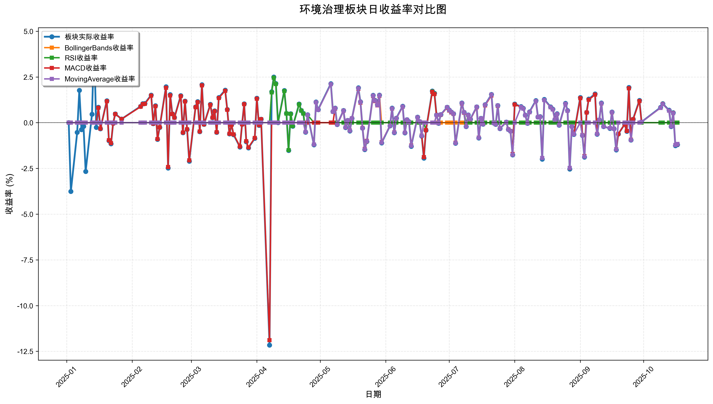
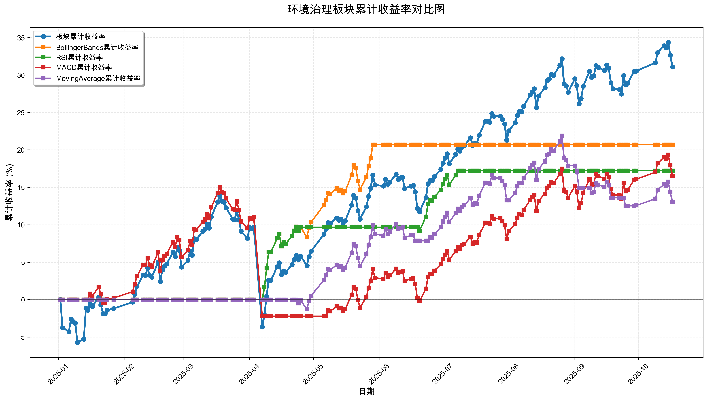

# 策略回测结果报告

**生成时间**: 2025-10-19 19:03:27
**行业板块**: 环境治理
**回测期间**: 20250101 至 20251017
**策略数量**: 4

## 📈 分析结论

### 策略表现分析
- **最佳策略**: BollingerBands (总收益率: 20.70%)
- **最差策略**: MovingAverage (总收益率: 13.02%)
### 交易活跃度分析
- **活跃策略**: 4 个
- **非活跃策略**: 0 个
- **最活跃策略**: MovingAverage (交易次数: 13)
### 🚨 异动提醒分析
- 未检测到明显异动情况
### 风险分析
- **BollingerBands**: 最大回撤 -2.74%, 夏普比率 3.7175
- **RSI**: 最大回撤 -1.50%, 夏普比率 3.7024
- **MACD**: 最大回撤 -15.03%, 夏普比率 1.1579
- **MovingAverage**: 最大回撤 -7.70%, 夏普比率 1.7485

## 📊 综合结果表

| 策略名称           | 初始资金     | 最终价值     | 总收益率   | 年化收益率   | 波动率    |   夏普比率 | 最大回撤    | 总交易次数   | 买入次数   | 卖出次数   | 总交易金额      | 平均交易金额   | 交易频率   |   数据点数 |
|:---------------|:---------|:---------|:-------|:--------|:-------|-------:|:--------|:--------|:-------|:-------|:-----------|:---------|:-------|-------:|
| 板块实际表现         | ¥100,000 | ¥131,075 | 31.08% | 43.18%  | 22.20% | 1.9453 | -15.36% | N/A     | N/A    | N/A    | N/A        | N/A      | N/A    |    190 |
| BollingerBands | ¥100,000 | ¥120,698 | 20.70% | 28.34%  | 7.62%  | 3.7175 | -2.74%  | 2       | 1      | 1      | ¥217,311   | ¥108,656 | 0.01   |    190 |
| RSI            | ¥100,000 | ¥117,233 | 17.23% | 23.48%  | 6.34%  | 3.7024 | -1.50%  | 4       | 2      | 2      | ¥428,895   | ¥107,224 | 0.02   |    190 |
| MACD           | ¥100,000 | ¥116,542 | 16.54% | 22.51%  | 19.44% | 1.1579 | -15.03% | 3       | 2      | 1      | ¥287,587   | ¥95,862  | 0.02   |    190 |
| MovingAverage  | ¥100,000 | ¥113,021 | 13.02% | 17.63%  | 10.08% | 1.7485 | -7.70%  | 13      | 7      | 6      | ¥1,434,987 | ¥110,384 | 0.07   |    190 |

## 📊 每日收益率走势图

*图1: 环境治理板块每日收益率走势对比*

## 📈 累计收益率走势图

*图2: 环境治理板块累计收益率走势对比*

## 📅 日收益明细表

| 日期         | 板块实际收益率   | BollingerBands收益率   | RSI收益率   | MACD收益率   | MovingAverage收益率   |
|:-----------|:----------|:--------------------|:---------|:----------|:-------------------|
| 2025-01-02 | 0.00%     | 0.00%               | 0.00%    | 0.00%     | 0.00%              |
| 2025-01-03 | -3.76%    | 0.00%               | 0.00%    | 0.00%     | 0.00%              |
| 2025-01-06 | -0.53%    | 0.00%               | 0.00%    | 0.00%     | 0.00%              |
| 2025-01-07 | 1.77%     | 0.00%               | 0.00%    | 0.00%     | 0.00%              |
| 2025-01-08 | -0.38%    | 0.00%               | 0.00%    | 0.00%     | 0.00%              |
| 2025-01-09 | -0.20%    | 0.00%               | 0.00%    | 0.00%     | 0.00%              |
| 2025-01-10 | -2.67%    | 0.00%               | 0.00%    | 0.00%     | 0.00%              |
| 2025-01-13 | 0.46%     | 0.00%               | 0.00%    | 0.00%     | 0.00%              |
| 2025-01-14 | 4.37%     | 0.00%               | 0.00%    | 0.00%     | 0.00%              |
| 2025-01-15 | -0.26%    | 0.00%               | 0.00%    | 0.00%     | 0.00%              |
| 2025-01-16 | 0.84%     | 0.00%               | 0.00%    | 0.82%     | 0.00%              |
| 2025-01-17 | -0.33%    | 0.00%               | 0.00%    | -0.32%    | 0.00%              |
| 2025-01-20 | 1.20%     | 0.00%               | 0.00%    | 1.17%     | 0.00%              |
| 2025-01-21 | -0.99%    | 0.00%               | 0.00%    | -0.96%    | 0.00%              |
| 2025-01-22 | -1.15%    | 0.00%               | 0.00%    | -1.12%    | 0.00%              |
| 2025-01-23 | -0.03%    | 0.00%               | 0.00%    | -0.03%    | 0.00%              |
| 2025-01-24 | 0.48%     | 0.00%               | 0.00%    | 0.47%     | 0.00%              |
| 2025-01-27 | 0.20%     | 0.00%               | 0.00%    | 0.20%     | 0.00%              |
| 2025-02-05 | 0.89%     | 0.00%               | 0.00%    | 0.87%     | 0.00%              |
| 2025-02-06 | 1.04%     | 0.00%               | 0.00%    | 1.01%     | 0.00%              |
| 2025-02-07 | 1.05%     | 0.00%               | 0.00%    | 1.03%     | 0.00%              |
| 2025-02-10 | 1.51%     | 0.00%               | 0.00%    | 1.48%     | 0.00%              |
| 2025-02-11 | -0.05%    | 0.00%               | 0.00%    | -0.05%    | 0.00%              |
| 2025-02-12 | 0.93%     | 0.00%               | 0.00%    | 0.90%     | 0.00%              |
| 2025-02-13 | -0.91%    | 0.00%               | 0.00%    | -0.89%    | 0.00%              |
| 2025-02-14 | -0.26%    | 0.00%               | 0.00%    | -0.25%    | 0.00%              |
| 2025-02-17 | 1.96%     | 0.00%               | 0.00%    | 1.91%     | 0.00%              |
| 2025-02-18 | -2.48%    | 0.00%               | 0.00%    | -2.42%    | 0.00%              |
| 2025-02-19 | 1.53%     | 0.00%               | 0.00%    | 1.49%     | 0.00%              |
| 2025-02-20 | 0.48%     | 0.00%               | 0.00%    | 0.47%     | 0.00%              |
| 2025-02-21 | 0.28%     | 0.00%               | 0.00%    | 0.27%     | 0.00%              |
| 2025-02-24 | 1.48%     | 0.00%               | 0.00%    | 1.45%     | 0.00%              |
| 2025-02-25 | -0.55%    | 0.00%               | 0.00%    | -0.54%    | 0.00%              |
| 2025-02-26 | 1.18%     | 0.00%               | 0.00%    | 1.16%     | 0.00%              |
| 2025-02-27 | -0.37%    | 0.00%               | 0.00%    | -0.36%    | 0.00%              |
| 2025-02-28 | -2.11%    | 0.00%               | 0.00%    | -2.06%    | 0.00%              |
| 2025-03-03 | 0.86%     | 0.00%               | 0.00%    | 0.84%     | 0.00%              |
| 2025-03-04 | 1.15%     | 0.00%               | 0.00%    | 1.12%     | 0.00%              |
| 2025-03-05 | -0.49%    | 0.00%               | 0.00%    | -0.48%    | 0.00%              |
| 2025-03-06 | 2.08%     | 0.00%               | 0.00%    | 2.04%     | 0.00%              |
| 2025-03-07 | -0.09%    | 0.00%               | 0.00%    | -0.09%    | 0.00%              |
| 2025-03-10 | 1.00%     | 0.00%               | 0.00%    | 0.97%     | 0.00%              |
| 2025-03-11 | 0.27%     | 0.00%               | 0.00%    | 0.27%     | 0.00%              |
| 2025-03-12 | 0.65%     | 0.00%               | 0.00%    | 0.63%     | 0.00%              |
| 2025-03-13 | -0.53%    | 0.00%               | 0.00%    | -0.52%    | 0.00%              |
| 2025-03-14 | 1.38%     | 0.00%               | 0.00%    | 1.35%     | 0.00%              |
| 2025-03-17 | 1.78%     | 0.00%               | 0.00%    | 1.74%     | 0.00%              |
| 2025-03-18 | 0.72%     | 0.00%               | 0.00%    | 0.70%     | 0.00%              |
| 2025-03-19 | -0.61%    | 0.00%               | 0.00%    | -0.60%    | 0.00%              |
| 2025-03-20 | -0.12%    | 0.00%               | 0.00%    | -0.12%    | 0.00%              |
| 2025-03-21 | -0.66%    | 0.00%               | 0.00%    | -0.64%    | 0.00%              |
| 2025-03-24 | -1.33%    | 0.00%               | 0.00%    | -1.30%    | 0.00%              |
| 2025-03-25 | -0.09%    | 0.00%               | 0.00%    | -0.09%    | 0.00%              |
| 2025-03-26 | 1.03%     | 0.00%               | 0.00%    | 1.01%     | 0.00%              |
| 2025-03-27 | -1.04%    | 0.00%               | 0.00%    | -1.01%    | 0.00%              |
| 2025-03-28 | -1.38%    | 0.00%               | 0.00%    | -1.35%    | 0.00%              |
| 2025-03-31 | -0.86%    | 0.00%               | 0.00%    | -0.84%    | 0.00%              |
| 2025-04-01 | 1.34%     | 0.00%               | 0.00%    | 1.31%     | 0.00%              |
| 2025-04-02 | -0.15%    | 0.00%               | 0.00%    | -0.14%    | 0.00%              |
| 2025-04-03 | 0.19%     | 0.00%               | 0.00%    | 0.19%     | 0.00%              |
| 2025-04-07 | -12.16%   | 0.00%               | 0.00%    | -11.89%   | 0.00%              |
| 2025-04-08 | 1.69%     | 1.66%               | 1.66%    | 0.00%     | 0.00%              |
| 2025-04-09 | 2.50%     | 2.46%               | 2.46%    | 0.00%     | 0.00%              |
| 2025-04-10 | 2.14%     | 2.11%               | 2.11%    | 0.00%     | 0.00%              |
| 2025-04-11 | -0.00%    | -0.00%              | -0.00%   | 0.00%     | 0.00%              |
| 2025-04-14 | 1.76%     | 1.73%               | 1.73%    | 0.00%     | 0.00%              |
| 2025-04-15 | 0.51%     | 0.50%               | 0.50%    | 0.00%     | 0.00%              |
| 2025-04-16 | -1.52%    | -1.50%              | -1.50%   | 0.00%     | 0.00%              |
| 2025-04-17 | 0.49%     | 0.48%               | 0.48%    | 0.00%     | 0.00%              |
| 2025-04-18 | -0.19%    | -0.18%              | -0.18%   | 0.00%     | 0.00%              |
| 2025-04-21 | 1.02%     | 1.00%               | 1.00%    | 0.00%     | 0.00%              |
| 2025-04-22 | 0.67%     | 0.66%               | 0.66%    | 0.00%     | 0.00%              |
| 2025-04-23 | 0.51%     | 0.50%               | 0.50%    | 0.00%     | 0.00%              |
| 2025-04-24 | -0.52%    | -0.51%              | -0.51%   | 0.00%     | -0.51%             |
| 2025-04-25 | 0.43%     | 0.42%               | 0.42%    | 0.00%     | 0.42%              |
| 2025-04-28 | -1.21%    | -1.19%              | 0.00%    | 0.00%     | -1.19%             |
| 2025-04-29 | 1.13%     | 1.11%               | 0.00%    | 0.00%     | 1.11%              |
| 2025-04-30 | 0.71%     | 0.70%               | 0.00%    | 0.00%     | 0.70%              |
| 2025-05-06 | 2.13%     | 2.10%               | 0.00%    | 0.00%     | 2.10%              |
| 2025-05-07 | 0.61%     | 0.60%               | 0.00%    | 0.00%     | 0.60%              |
| 2025-05-08 | 0.80%     | 0.79%               | 0.00%    | 0.77%     | 0.79%              |
| 2025-05-09 | -0.10%    | -0.10%              | 0.00%    | -0.10%    | -0.10%             |
| 2025-05-12 | 0.67%     | 0.66%               | 0.00%    | 0.65%     | 0.66%              |
| 2025-05-13 | -0.27%    | -0.26%              | 0.00%    | -0.26%    | -0.26%             |
| 2025-05-14 | 0.12%     | 0.12%               | 0.00%    | 0.12%     | 0.12%              |
| 2025-05-15 | -0.45%    | -0.44%              | 0.00%    | -0.43%    | -0.44%             |
| 2025-05-16 | 0.24%     | 0.24%               | 0.00%    | 0.24%     | 0.24%              |
| 2025-05-19 | 1.91%     | 1.88%               | 0.00%    | 1.85%     | 1.88%              |
| 2025-05-20 | 1.14%     | 1.12%               | 0.00%    | 1.10%     | 1.12%              |
| 2025-05-21 | -0.30%    | -0.30%              | 0.00%    | -0.29%    | -0.30%             |
| 2025-05-22 | -1.47%    | -1.45%              | 0.00%    | -1.43%    | -1.45%             |
| 2025-05-23 | -1.03%    | -1.02%              | 0.00%    | -1.00%    | -1.01%             |
| 2025-05-26 | 1.50%     | 1.48%               | 0.00%    | 1.46%     | 1.48%              |
| 2025-05-27 | 1.22%     | 1.20%               | 0.00%    | 1.18%     | 1.20%              |
| 2025-05-28 | 0.98%     | 0.97%               | 0.00%    | 0.95%     | 0.96%              |
| 2025-05-29 | 1.51%     | 1.49%               | 0.00%    | 1.47%     | 1.49%              |
| 2025-05-30 | -1.11%    | 0.00%               | 0.00%    | -1.07%    | -1.09%             |
| 2025-06-03 | -0.17%    | 0.00%               | 0.00%    | -0.17%    | -0.17%             |
| 2025-06-04 | 0.80%     | 0.00%               | 0.00%    | 0.77%     | 0.78%              |
| 2025-06-05 | -0.55%    | 0.00%               | 0.00%    | -0.53%    | -0.54%             |
| 2025-06-06 | 0.25%     | 0.00%               | 0.00%    | 0.24%     | 0.24%              |
| 2025-06-09 | 0.90%     | 0.00%               | 0.00%    | 0.87%     | 0.88%              |
| 2025-06-10 | -0.56%    | 0.00%               | 0.00%    | -0.55%    | -0.55%             |
| 2025-06-11 | 0.16%     | 0.00%               | 0.00%    | 0.15%     | 0.16%              |
| 2025-06-12 | 0.05%     | 0.00%               | 0.00%    | 0.04%     | 0.04%              |
| 2025-06-13 | -1.29%    | 0.00%               | 0.00%    | -1.25%    | -1.27%             |
| 2025-06-16 | 0.30%     | 0.00%               | 0.00%    | 0.29%     | 0.29%              |
| 2025-06-17 | 0.06%     | 0.00%               | 0.00%    | 0.06%     | 0.06%              |
| 2025-06-18 | -0.73%    | 0.00%               | 0.00%    | -0.71%    | -0.72%             |
| 2025-06-19 | -1.94%    | 0.00%               | 0.00%    | -1.88%    | 0.00%              |
| 2025-06-20 | -0.42%    | 0.00%               | -0.41%   | -0.41%    | 0.00%              |
| 2025-06-23 | 1.73%     | 0.00%               | 1.70%    | 1.68%     | 0.00%              |
| 2025-06-24 | 1.61%     | 0.00%               | 1.58%    | 1.56%     | 0.00%              |
| 2025-06-25 | 0.42%     | 0.00%               | 0.41%    | 0.41%     | 0.41%              |
| 2025-06-26 | -0.03%    | 0.00%               | -0.03%   | -0.03%    | -0.03%             |
| 2025-06-27 | 0.44%     | 0.00%               | 0.43%    | 0.43%     | 0.44%              |
| 2025-06-30 | 0.84%     | 0.00%               | 0.83%    | 0.82%     | 0.84%              |
| 2025-07-01 | 0.69%     | 0.00%               | 0.67%    | 0.67%     | 0.68%              |
| 2025-07-02 | 0.58%     | 0.00%               | 0.57%    | 0.56%     | 0.58%              |
| 2025-07-03 | 0.49%     | 0.00%               | 0.48%    | 0.48%     | 0.49%              |
| 2025-07-04 | -1.13%    | 0.00%               | -1.11%   | -1.10%    | -1.12%             |
| 2025-07-07 | 1.08%     | 0.00%               | 1.06%    | 1.05%     | 1.07%              |
| 2025-07-08 | 0.56%     | 0.00%               | 0.55%    | 0.54%     | 0.56%              |
| 2025-07-09 | -0.21%    | 0.00%               | 0.00%    | -0.20%    | -0.21%             |
| 2025-07-10 | 0.42%     | 0.00%               | 0.00%    | 0.41%     | 0.42%              |
| 2025-07-11 | 0.19%     | 0.00%               | 0.00%    | 0.18%     | 0.19%              |
| 2025-07-14 | 0.86%     | 0.00%               | 0.00%    | 0.84%     | 0.86%              |
| 2025-07-15 | -0.84%    | 0.00%               | 0.00%    | -0.82%    | -0.83%             |
| 2025-07-16 | 0.24%     | 0.00%               | 0.00%    | 0.23%     | 0.24%              |
| 2025-07-17 | -0.08%    | 0.00%               | 0.00%    | -0.08%    | -0.08%             |
| 2025-07-18 | 0.98%     | 0.00%               | 0.00%    | 0.95%     | 0.97%              |
| 2025-07-21 | 1.54%     | 0.00%               | 0.00%    | 1.49%     | 1.53%              |
| 2025-07-22 | -0.02%    | 0.00%               | 0.00%    | -0.02%    | -0.02%             |
| 2025-07-23 | -0.09%    | 0.00%               | 0.00%    | -0.09%    | -0.09%             |
| 2025-07-24 | 0.94%     | 0.00%               | 0.00%    | 0.92%     | 0.94%              |
| 2025-07-25 | -0.32%    | 0.00%               | 0.00%    | -0.31%    | -0.32%             |
| 2025-07-28 | 0.03%     | 0.00%               | 0.00%    | 0.03%     | 0.03%              |
| 2025-07-29 | -0.37%    | 0.00%               | 0.00%    | -0.36%    | -0.37%             |
| 2025-07-30 | -0.46%    | 0.00%               | 0.00%    | -0.45%    | -0.46%             |
| 2025-07-31 | -1.76%    | 0.00%               | 0.00%    | -1.71%    | -1.75%             |
| 2025-08-01 | 1.02%     | 0.00%               | 0.00%    | 0.99%     | 0.00%              |
| 2025-08-04 | 0.88%     | 0.00%               | 0.00%    | 0.86%     | 0.86%              |
| 2025-08-05 | 0.79%     | 0.00%               | 0.00%    | 0.77%     | 0.77%              |
| 2025-08-06 | 0.41%     | 0.00%               | 0.00%    | 0.40%     | 0.40%              |
| 2025-08-07 | -0.03%    | 0.00%               | 0.00%    | -0.03%    | -0.03%             |
| 2025-08-08 | 0.59%     | 0.00%               | 0.00%    | 0.57%     | 0.57%              |
| 2025-08-11 | 1.21%     | 0.00%               | 0.00%    | 1.18%     | 1.18%              |
| 2025-08-12 | 0.31%     | 0.00%               | 0.00%    | 0.30%     | 0.30%              |
| 2025-08-13 | 0.33%     | 0.00%               | 0.00%    | 0.32%     | 0.32%              |
| 2025-08-14 | -1.99%    | 0.00%               | 0.00%    | -1.93%    | -1.93%             |
| 2025-08-15 | 1.27%     | 0.00%               | 0.00%    | 1.24%     | 1.24%              |
| 2025-08-18 | 0.86%     | 0.00%               | 0.00%    | 0.84%     | 0.84%              |
| 2025-08-19 | 0.74%     | 0.00%               | 0.00%    | 0.72%     | 0.72%              |
| 2025-08-20 | 0.17%     | 0.00%               | 0.00%    | 0.16%     | 0.16%              |
| 2025-08-21 | 0.49%     | 0.00%               | 0.00%    | 0.47%     | 0.47%              |
| 2025-08-22 | -0.14%    | 0.00%               | 0.00%    | -0.14%    | -0.14%             |
| 2025-08-25 | 1.06%     | 0.00%               | 0.00%    | 1.03%     | 1.03%              |
| 2025-08-26 | 0.67%     | 0.00%               | 0.00%    | 0.65%     | 0.65%              |
| 2025-08-27 | -2.54%    | 0.00%               | 0.00%    | -2.48%    | -2.47%             |
| 2025-08-28 | -0.21%    | 0.00%               | 0.00%    | -0.20%    | -0.20%             |
| 2025-08-29 | -0.64%    | 0.00%               | 0.00%    | -0.63%    | -0.63%             |
| 2025-09-01 | 1.38%     | 0.00%               | 0.00%    | 1.34%     | 0.00%              |
| 2025-09-02 | -0.70%    | 0.00%               | 0.00%    | -0.68%    | -0.69%             |
| 2025-09-03 | -1.88%    | 0.00%               | 0.00%    | -1.83%    | -1.85%             |
| 2025-09-04 | 0.56%     | 0.00%               | 0.00%    | 0.55%     | 0.00%              |
| 2025-09-05 | 1.29%     | 0.00%               | 0.00%    | 1.25%     | 0.00%              |
| 2025-09-08 | 1.57%     | 0.00%               | 0.00%    | 1.53%     | 0.00%              |
| 2025-09-09 | -0.63%    | 0.00%               | 0.00%    | -0.61%    | -0.62%             |
| 2025-09-10 | 0.15%     | 0.00%               | 0.00%    | 0.14%     | 0.15%              |
| 2025-09-11 | 1.08%     | 0.00%               | 0.00%    | 1.05%     | 1.06%              |
| 2025-09-12 | -0.21%    | 0.00%               | 0.00%    | -0.21%    | -0.21%             |
| 2025-09-15 | -0.31%    | 0.00%               | 0.00%    | -0.30%    | -0.30%             |
| 2025-09-16 | 0.58%     | 0.00%               | 0.00%    | 0.56%     | 0.57%              |
| 2025-09-17 | -0.33%    | 0.00%               | 0.00%    | -0.33%    | -0.33%             |
| 2025-09-18 | -1.49%    | 0.00%               | 0.00%    | -1.45%    | -1.46%             |
| 2025-09-19 | -0.62%    | 0.00%               | 0.00%    | -0.61%    | 0.00%              |
| 2025-09-22 | -0.09%    | 0.00%               | 0.00%    | -0.09%    | 0.00%              |
| 2025-09-23 | -0.47%    | 0.00%               | 0.00%    | -0.45%    | 0.00%              |
| 2025-09-24 | 1.93%     | 0.00%               | 0.00%    | 1.88%     | 0.00%              |
| 2025-09-25 | -0.95%    | 0.00%               | 0.00%    | -0.93%    | -0.95%             |
| 2025-09-26 | 0.19%     | 0.00%               | 0.00%    | 0.18%     | 0.00%              |
| 2025-09-29 | 1.22%     | 0.00%               | 0.00%    | 1.18%     | 0.00%              |
| 2025-09-30 | 0.04%     | 0.00%               | 0.00%    | 0.04%     | 0.04%              |
| 2025-10-09 | 0.83%     | 0.00%               | 0.00%    | 0.81%     | 0.81%              |
| 2025-10-10 | 1.04%     | 0.00%               | 0.00%    | 1.02%     | 1.01%              |
| 2025-10-13 | 0.68%     | 0.00%               | 0.00%    | 0.66%     | 0.66%              |
| 2025-10-14 | -0.21%    | 0.00%               | 0.00%    | -0.20%    | -0.20%             |
| 2025-10-15 | 0.54%     | 0.00%               | 0.00%    | 0.53%     | 0.52%              |
| 2025-10-16 | -1.26%    | 0.00%               | 0.00%    | -1.22%    | -1.22%             |
| 2025-10-17 | -1.20%    | 0.00%               | 0.00%    | -1.17%    | -1.16%             |

## 📊 日收益统计摘要

| 指标                | 平均日收益率   | 最大日收益率   | 最小日收益率   | 正收益天数   | 负收益天数   |
|:------------------|:---------|:---------|:---------|:--------|:--------|
| 板块实际收益率           | 0.15%    | 4.37%    | -12.16%  | 109天    | 79天     |
| BollingerBands收益率 | 0.10%    | 2.46%    | -1.50%   | 24天     | 10天     |
| RSI收益率            | 0.08%    | 2.46%    | -1.50%   | 20天     | 6天      |
| MACD收益率           | 0.09%    | 2.04%    | -11.89%  | 92天     | 69天     |
| MovingAverage收益率  | 0.07%    | 2.10%    | -2.47%   | 60天     | 42天     |

## 📈 累计收益明细表

| 日期         | 板块累计收益率   | BollingerBands累计收益率   | RSI累计收益率   | MACD累计收益率   | MovingAverage累计收益率   |
|:-----------|:----------|:----------------------|:-----------|:------------|:---------------------|
| 2025-01-02 | 0.00%     | 0.00%                 | 0.00%      | 0.00%       | 0.00%                |
| 2025-01-03 | -3.76%    | 0.00%                 | 0.00%      | 0.00%       | 0.00%                |
| 2025-01-06 | -4.27%    | 0.00%                 | 0.00%      | 0.00%       | 0.00%                |
| 2025-01-07 | -2.58%    | 0.00%                 | 0.00%      | 0.00%       | 0.00%                |
| 2025-01-08 | -2.95%    | 0.00%                 | 0.00%      | 0.00%       | 0.00%                |
| 2025-01-09 | -3.14%    | 0.00%                 | 0.00%      | 0.00%       | 0.00%                |
| 2025-01-10 | -5.73%    | 0.00%                 | 0.00%      | 0.00%       | 0.00%                |
| 2025-01-13 | -5.29%    | 0.00%                 | 0.00%      | 0.00%       | 0.00%                |
| 2025-01-14 | -1.15%    | 0.00%                 | 0.00%      | 0.00%       | 0.00%                |
| 2025-01-15 | -1.41%    | 0.00%                 | 0.00%      | 0.00%       | 0.00%                |
| 2025-01-16 | -0.58%    | 0.00%                 | 0.00%      | 0.82%       | 0.00%                |
| 2025-01-17 | -0.91%    | 0.00%                 | 0.00%      | 0.50%       | 0.00%                |
| 2025-01-20 | 0.28%     | 0.00%                 | 0.00%      | 1.67%       | 0.00%                |
| 2025-01-21 | -0.71%    | 0.00%                 | 0.00%      | 0.69%       | 0.00%                |
| 2025-01-22 | -1.85%    | 0.00%                 | 0.00%      | -0.43%      | 0.00%                |
| 2025-01-23 | -1.88%    | 0.00%                 | 0.00%      | -0.46%      | 0.00%                |
| 2025-01-24 | -1.40%    | 0.00%                 | 0.00%      | 0.01%       | 0.00%                |
| 2025-01-27 | -1.20%    | 0.00%                 | 0.00%      | 0.20%       | 0.00%                |
| 2025-02-05 | -0.33%    | 0.00%                 | 0.00%      | 1.07%       | 0.00%                |
| 2025-02-06 | 0.71%     | 0.00%                 | 0.00%      | 2.09%       | 0.00%                |
| 2025-02-07 | 1.76%     | 0.00%                 | 0.00%      | 3.14%       | 0.00%                |
| 2025-02-10 | 3.31%     | 0.00%                 | 0.00%      | 4.66%       | 0.00%                |
| 2025-02-11 | 3.25%     | 0.00%                 | 0.00%      | 4.61%       | 0.00%                |
| 2025-02-12 | 4.21%     | 0.00%                 | 0.00%      | 5.55%       | 0.00%                |
| 2025-02-13 | 3.26%     | 0.00%                 | 0.00%      | 4.61%       | 0.00%                |
| 2025-02-14 | 2.99%     | 0.00%                 | 0.00%      | 4.35%       | 0.00%                |
| 2025-02-17 | 5.01%     | 0.00%                 | 0.00%      | 6.35%       | 0.00%                |
| 2025-02-18 | 2.41%     | 0.00%                 | 0.00%      | 3.78%       | 0.00%                |
| 2025-02-19 | 3.97%     | 0.00%                 | 0.00%      | 5.33%       | 0.00%                |
| 2025-02-20 | 4.48%     | 0.00%                 | 0.00%      | 5.82%       | 0.00%                |
| 2025-02-21 | 4.77%     | 0.00%                 | 0.00%      | 6.11%       | 0.00%                |
| 2025-02-24 | 6.32%     | 0.00%                 | 0.00%      | 7.65%       | 0.00%                |
| 2025-02-25 | 5.74%     | 0.00%                 | 0.00%      | 7.07%       | 0.00%                |
| 2025-02-26 | 6.99%     | 0.00%                 | 0.00%      | 8.31%       | 0.00%                |
| 2025-02-27 | 6.59%     | 0.00%                 | 0.00%      | 7.92%       | 0.00%                |
| 2025-02-28 | 4.35%     | 0.00%                 | 0.00%      | 5.70%       | 0.00%                |
| 2025-03-03 | 5.24%     | 0.00%                 | 0.00%      | 6.58%       | 0.00%                |
| 2025-03-04 | 6.46%     | 0.00%                 | 0.00%      | 7.78%       | 0.00%                |
| 2025-03-05 | 5.93%     | 0.00%                 | 0.00%      | 7.26%       | 0.00%                |
| 2025-03-06 | 8.14%     | 0.00%                 | 0.00%      | 9.45%       | 0.00%                |
| 2025-03-07 | 8.04%     | 0.00%                 | 0.00%      | 9.35%       | 0.00%                |
| 2025-03-10 | 9.12%     | 0.00%                 | 0.00%      | 10.41%      | 0.00%                |
| 2025-03-11 | 9.42%     | 0.00%                 | 0.00%      | 10.71%      | 0.00%                |
| 2025-03-12 | 10.12%    | 0.00%                 | 0.00%      | 11.41%      | 0.00%                |
| 2025-03-13 | 9.54%     | 0.00%                 | 0.00%      | 10.83%      | 0.00%                |
| 2025-03-14 | 11.06%    | 0.00%                 | 0.00%      | 12.33%      | 0.00%                |
| 2025-03-17 | 13.03%    | 0.00%                 | 0.00%      | 14.28%      | 0.00%                |
| 2025-03-18 | 13.84%    | 0.00%                 | 0.00%      | 15.08%      | 0.00%                |
| 2025-03-19 | 13.14%    | 0.00%                 | 0.00%      | 14.40%      | 0.00%                |
| 2025-03-20 | 13.01%    | 0.00%                 | 0.00%      | 14.26%      | 0.00%                |
| 2025-03-21 | 12.27%    | 0.00%                 | 0.00%      | 13.53%      | 0.00%                |
| 2025-03-24 | 10.78%    | 0.00%                 | 0.00%      | 12.06%      | 0.00%                |
| 2025-03-25 | 10.67%    | 0.00%                 | 0.00%      | 11.95%      | 0.00%                |
| 2025-03-26 | 11.82%    | 0.00%                 | 0.00%      | 13.09%      | 0.00%                |
| 2025-03-27 | 10.66%    | 0.00%                 | 0.00%      | 11.94%      | 0.00%                |
| 2025-03-28 | 9.13%     | 0.00%                 | 0.00%      | 10.43%      | 0.00%                |
| 2025-03-31 | 8.19%     | 0.00%                 | 0.00%      | 9.50%       | 0.00%                |
| 2025-04-01 | 9.64%     | 0.00%                 | 0.00%      | 10.93%      | 0.00%                |
| 2025-04-02 | 9.48%     | 0.00%                 | 0.00%      | 10.77%      | 0.00%                |
| 2025-04-03 | 9.69%     | 0.00%                 | 0.00%      | 10.98%      | 0.00%                |
| 2025-04-07 | -3.65%    | 0.00%                 | 0.00%      | -2.22%      | 0.00%                |
| 2025-04-08 | -2.02%    | 1.66%                 | 1.66%      | -2.22%      | 0.00%                |
| 2025-04-09 | 0.43%     | 4.16%                 | 4.16%      | -2.22%      | 0.00%                |
| 2025-04-10 | 2.58%     | 6.36%                 | 6.36%      | -2.22%      | 0.00%                |
| 2025-04-11 | 2.58%     | 6.35%                 | 6.35%      | -2.22%      | 0.00%                |
| 2025-04-14 | 4.38%     | 8.19%                 | 8.19%      | -2.22%      | 0.00%                |
| 2025-04-15 | 4.91%     | 8.74%                 | 8.74%      | -2.22%      | 0.00%                |
| 2025-04-16 | 3.32%     | 7.11%                 | 7.11%      | -2.22%      | 0.00%                |
| 2025-04-17 | 3.82%     | 7.62%                 | 7.62%      | -2.22%      | 0.00%                |
| 2025-04-18 | 3.63%     | 7.42%                 | 7.42%      | -2.22%      | 0.00%                |
| 2025-04-21 | 4.68%     | 8.50%                 | 8.50%      | -2.22%      | 0.00%                |
| 2025-04-22 | 5.38%     | 9.21%                 | 9.21%      | -2.22%      | 0.00%                |
| 2025-04-23 | 5.91%     | 9.76%                 | 9.76%      | -2.22%      | 0.00%                |
| 2025-04-24 | 5.37%     | 9.20%                 | 9.20%      | -2.22%      | -0.51%               |
| 2025-04-25 | 5.82%     | 9.66%                 | 9.66%      | -2.22%      | -0.09%               |
| 2025-04-28 | 4.54%     | 8.35%                 | 9.66%      | -2.22%      | -1.28%               |
| 2025-04-29 | 5.72%     | 9.56%                 | 9.66%      | -2.22%      | -0.18%               |
| 2025-04-30 | 6.47%     | 10.33%                | 9.66%      | -2.22%      | 0.52%                |
| 2025-05-06 | 8.74%     | 12.65%                | 9.66%      | -2.22%      | 2.63%                |
| 2025-05-07 | 9.40%     | 13.32%                | 9.66%      | -2.22%      | 3.24%                |
| 2025-05-08 | 10.28%    | 14.21%                | 9.66%      | -1.46%      | 4.05%                |
| 2025-05-09 | 10.17%    | 14.10%                | 9.66%      | -1.56%      | 3.95%                |
| 2025-05-12 | 10.91%    | 14.85%                | 9.66%      | -0.92%      | 4.63%                |
| 2025-05-13 | 10.61%    | 14.55%                | 9.66%      | -1.18%      | 4.36%                |
| 2025-05-14 | 10.75%    | 14.69%                | 9.66%      | -1.06%      | 4.48%                |
| 2025-05-15 | 10.25%    | 14.18%                | 9.66%      | -1.49%      | 4.02%                |
| 2025-05-16 | 10.52%    | 14.46%                | 9.66%      | -1.25%      | 4.27%                |
| 2025-05-19 | 12.63%    | 16.61%                | 9.66%      | 0.58%       | 6.23%                |
| 2025-05-20 | 13.92%    | 17.92%                | 9.66%      | 1.69%       | 7.42%                |
| 2025-05-21 | 13.57%    | 17.57%                | 9.66%      | 1.39%       | 7.10%                |
| 2025-05-22 | 11.90%    | 15.86%                | 9.66%      | -0.06%      | 5.55%                |
| 2025-05-23 | 10.75%    | 14.69%                | 9.66%      | -1.06%      | 4.48%                |
| 2025-05-26 | 12.41%    | 16.39%                | 9.66%      | 0.38%       | 6.03%                |
| 2025-05-27 | 13.78%    | 17.79%                | 9.66%      | 1.57%       | 7.30%                |
| 2025-05-28 | 14.90%    | 18.93%                | 9.66%      | 2.54%       | 8.33%                |
| 2025-05-29 | 16.64%    | 20.70%                | 9.66%      | 4.04%       | 9.95%                |
| 2025-05-30 | 15.35%    | 20.70%                | 9.66%      | 2.92%       | 8.75%                |
| 2025-06-03 | 15.15%    | 20.70%                | 9.66%      | 2.75%       | 8.56%                |
| 2025-06-04 | 16.06%    | 20.70%                | 9.66%      | 3.55%       | 9.41%                |
| 2025-06-05 | 15.42%    | 20.70%                | 9.66%      | 2.99%       | 8.82%                |
| 2025-06-06 | 15.71%    | 20.70%                | 9.66%      | 3.24%       | 9.09%                |
| 2025-06-09 | 16.75%    | 20.70%                | 9.66%      | 4.14%       | 10.05%               |
| 2025-06-10 | 16.09%    | 20.70%                | 9.66%      | 3.57%       | 9.44%                |
| 2025-06-11 | 16.27%    | 20.70%                | 9.66%      | 3.73%       | 9.61%                |
| 2025-06-12 | 16.33%    | 20.70%                | 9.66%      | 3.77%       | 9.66%                |
| 2025-06-13 | 14.83%    | 20.70%                | 9.66%      | 2.48%       | 8.27%                |
| 2025-06-16 | 15.17%    | 20.70%                | 9.66%      | 2.77%       | 8.59%                |
| 2025-06-17 | 15.24%    | 20.70%                | 9.66%      | 2.83%       | 8.65%                |
| 2025-06-18 | 14.40%    | 20.70%                | 9.66%      | 2.10%       | 7.87%                |
| 2025-06-19 | 12.18%    | 20.70%                | 9.66%      | 0.19%       | 7.87%                |
| 2025-06-20 | 11.71%    | 20.70%                | 9.21%      | -0.22%      | 7.87%                |
| 2025-06-23 | 13.65%    | 20.70%                | 11.06%     | 1.46%       | 7.87%                |
| 2025-06-24 | 15.47%    | 20.70%                | 12.81%     | 3.04%       | 7.87%                |
| 2025-06-25 | 15.96%    | 20.70%                | 13.28%     | 3.45%       | 8.32%                |
| 2025-06-26 | 15.92%    | 20.70%                | 13.24%     | 3.42%       | 8.28%                |
| 2025-06-27 | 16.43%    | 20.70%                | 13.73%     | 3.87%       | 8.76%                |
| 2025-06-30 | 17.41%    | 20.70%                | 14.67%     | 4.72%       | 9.67%                |
| 2025-07-01 | 18.22%    | 20.70%                | 15.45%     | 5.41%       | 10.42%               |
| 2025-07-02 | 18.91%    | 20.70%                | 16.10%     | 6.01%       | 11.05%               |
| 2025-07-03 | 19.49%    | 20.70%                | 16.66%     | 6.51%       | 11.60%               |
| 2025-07-04 | 18.14%    | 20.70%                | 15.37%     | 5.34%       | 10.34%               |
| 2025-07-07 | 19.42%    | 20.70%                | 16.59%     | 6.45%       | 11.53%               |
| 2025-07-08 | 20.09%    | 20.70%                | 17.23%     | 7.03%       | 12.15%               |
| 2025-07-09 | 19.84%    | 20.70%                | 17.23%     | 6.81%       | 11.91%               |
| 2025-07-10 | 20.34%    | 20.70%                | 17.23%     | 7.25%       | 12.38%               |
| 2025-07-11 | 20.57%    | 20.70%                | 17.23%     | 7.44%       | 12.59%               |
| 2025-07-14 | 21.61%    | 20.70%                | 17.23%     | 8.34%       | 13.56%               |
| 2025-07-15 | 20.59%    | 20.70%                | 17.23%     | 7.46%       | 12.61%               |
| 2025-07-16 | 20.88%    | 20.70%                | 17.23%     | 7.71%       | 12.88%               |
| 2025-07-17 | 20.78%    | 20.70%                | 17.23%     | 7.63%       | 12.79%               |
| 2025-07-18 | 21.96%    | 20.70%                | 17.23%     | 8.65%       | 13.89%               |
| 2025-07-21 | 23.84%    | 20.70%                | 17.23%     | 10.28%      | 15.63%               |
| 2025-07-22 | 23.82%    | 20.70%                | 17.23%     | 10.26%      | 15.61%               |
| 2025-07-23 | 23.70%    | 20.70%                | 17.23%     | 10.16%      | 15.50%               |
| 2025-07-24 | 24.87%    | 20.70%                | 17.23%     | 11.17%      | 16.59%               |
| 2025-07-25 | 24.47%    | 20.70%                | 17.23%     | 10.82%      | 16.21%               |
| 2025-07-28 | 24.51%    | 20.70%                | 17.23%     | 10.85%      | 16.25%               |
| 2025-07-29 | 24.04%    | 20.70%                | 17.23%     | 10.45%      | 15.82%               |
| 2025-07-30 | 23.47%    | 20.70%                | 17.23%     | 9.96%       | 15.29%               |
| 2025-07-31 | 21.30%    | 20.70%                | 17.23%     | 8.08%       | 13.27%               |
| 2025-08-01 | 22.54%    | 20.70%                | 17.23%     | 9.15%       | 13.27%               |
| 2025-08-04 | 23.62%    | 20.70%                | 17.23%     | 10.09%      | 14.24%               |
| 2025-08-05 | 24.60%    | 20.70%                | 17.23%     | 10.94%      | 15.12%               |
| 2025-08-06 | 25.12%    | 20.70%                | 17.23%     | 11.38%      | 15.58%               |
| 2025-08-07 | 25.08%    | 20.70%                | 17.23%     | 11.35%      | 15.55%               |
| 2025-08-08 | 25.81%    | 20.70%                | 17.23%     | 11.98%      | 16.21%               |
| 2025-08-11 | 27.34%    | 20.70%                | 17.23%     | 13.30%      | 17.57%               |
| 2025-08-12 | 27.73%    | 20.70%                | 17.23%     | 13.65%      | 17.93%               |
| 2025-08-13 | 28.15%    | 20.70%                | 17.23%     | 14.01%      | 18.31%               |
| 2025-08-14 | 25.61%    | 20.70%                | 17.23%     | 11.81%      | 16.02%               |
| 2025-08-15 | 27.21%    | 20.70%                | 17.23%     | 13.19%      | 17.46%               |
| 2025-08-18 | 28.30%    | 20.70%                | 17.23%     | 14.14%      | 18.44%               |
| 2025-08-19 | 29.25%    | 20.70%                | 17.23%     | 14.96%      | 19.29%               |
| 2025-08-20 | 29.47%    | 20.70%                | 17.23%     | 15.15%      | 19.49%               |
| 2025-08-21 | 30.10%    | 20.70%                | 17.23%     | 15.70%      | 20.05%               |
| 2025-08-22 | 29.92%    | 20.70%                | 17.23%     | 15.54%      | 19.89%               |
| 2025-08-25 | 31.29%    | 20.70%                | 17.23%     | 16.73%      | 21.12%               |
| 2025-08-26 | 32.17%    | 20.70%                | 17.23%     | 17.49%      | 21.91%               |
| 2025-08-27 | 28.81%    | 20.70%                | 17.23%     | 14.58%      | 18.90%               |
| 2025-08-28 | 28.54%    | 20.70%                | 17.23%     | 14.35%      | 18.66%               |
| 2025-08-29 | 27.71%    | 20.70%                | 17.23%     | 13.63%      | 17.91%               |
| 2025-09-01 | 29.48%    | 20.70%                | 17.23%     | 15.16%      | 17.91%               |
| 2025-09-02 | 28.58%    | 20.70%                | 17.23%     | 14.38%      | 17.11%               |
| 2025-09-03 | 26.16%    | 20.70%                | 17.23%     | 12.28%      | 14.94%               |
| 2025-09-04 | 26.86%    | 20.70%                | 17.23%     | 12.89%      | 14.94%               |
| 2025-09-05 | 28.49%    | 20.70%                | 17.23%     | 14.31%      | 14.94%               |
| 2025-09-08 | 30.51%    | 20.70%                | 17.23%     | 16.05%      | 14.94%               |
| 2025-09-09 | 29.68%    | 20.70%                | 17.23%     | 15.34%      | 14.22%               |
| 2025-09-10 | 29.88%    | 20.70%                | 17.23%     | 15.50%      | 14.39%               |
| 2025-09-11 | 31.28%    | 20.70%                | 17.23%     | 16.72%      | 15.60%               |
| 2025-09-12 | 31.00%    | 20.70%                | 17.23%     | 16.48%      | 15.36%               |
| 2025-09-15 | 30.60%    | 20.70%                | 17.23%     | 16.13%      | 15.01%               |
| 2025-09-16 | 31.35%    | 20.70%                | 17.23%     | 16.78%      | 15.67%               |
| 2025-09-17 | 30.91%    | 20.70%                | 17.23%     | 16.40%      | 15.29%               |
| 2025-09-18 | 28.97%    | 20.70%                | 17.23%     | 14.72%      | 13.60%               |
| 2025-09-19 | 28.16%    | 20.70%                | 17.23%     | 14.02%      | 13.60%               |
| 2025-09-22 | 28.05%    | 20.70%                | 17.23%     | 13.92%      | 13.60%               |
| 2025-09-23 | 27.45%    | 20.70%                | 17.23%     | 13.41%      | 13.60%               |
| 2025-09-24 | 29.92%    | 20.70%                | 17.23%     | 15.54%      | 13.60%               |
| 2025-09-25 | 28.68%    | 20.70%                | 17.23%     | 14.46%      | 12.53%               |
| 2025-09-26 | 28.92%    | 20.70%                | 17.23%     | 14.67%      | 12.53%               |
| 2025-09-29 | 30.48%    | 20.70%                | 17.23%     | 16.03%      | 12.53%               |
| 2025-09-30 | 30.54%    | 20.70%                | 17.23%     | 16.08%      | 12.57%               |
| 2025-10-09 | 31.63%    | 20.70%                | 17.23%     | 17.02%      | 13.48%               |
| 2025-10-10 | 33.00%    | 20.70%                | 17.23%     | 18.21%      | 14.63%               |
| 2025-10-13 | 33.90%    | 20.70%                | 17.23%     | 18.99%      | 15.38%               |
| 2025-10-14 | 33.63%    | 20.70%                | 17.23%     | 18.75%      | 15.15%               |
| 2025-10-15 | 34.35%    | 20.70%                | 17.23%     | 19.38%      | 15.75%               |
| 2025-10-16 | 32.66%    | 20.70%                | 17.23%     | 17.92%      | 14.35%               |
| 2025-10-17 | 31.08%    | 20.70%                | 17.23%     | 16.54%      | 13.02%               |

## 📊 累计收益统计摘要

| 指标                  | 最终累计收益率   | 最大累计收益率   | 最小累计收益率   | 累计收益波动   | 收益稳定性   |
|:--------------------|:----------|:----------|:----------|:---------|:--------|
| 板块累计收益率             | 31.08%    | 34.35%    | -5.73%    | 40.08%   | 波动      |
| BollingerBands累计收益率 | 20.70%    | 20.70%    | 0.00%     | 20.70%   | 波动      |
| RSI累计收益率            | 17.23%    | 17.23%    | 0.00%     | 17.23%   | 稳定      |
| MACD累计收益率           | 16.54%    | 19.38%    | -2.22%    | 21.60%   | 波动      |
| MovingAverage累计收益率  | 13.02%    | 21.91%    | -1.28%    | 23.19%   | 波动      |

