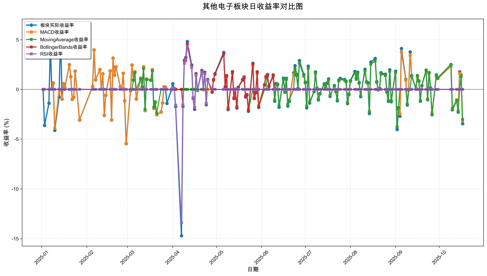
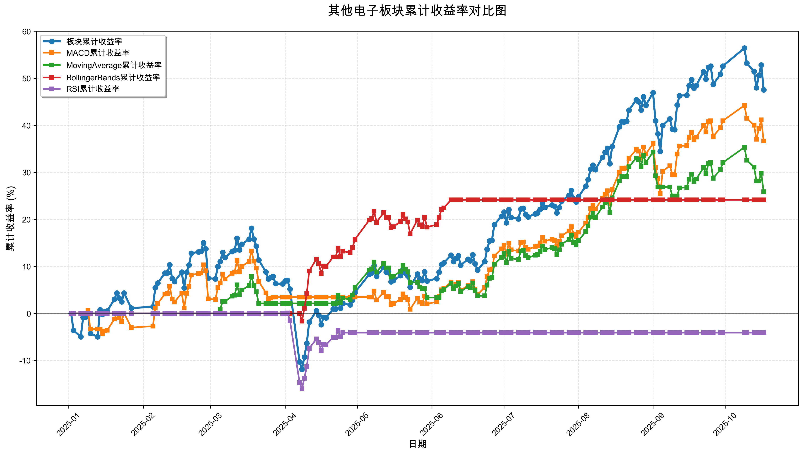

# 策略回测结果报告

**生成时间**: 2025-10-19 19:07:16
**行业板块**: 其他电子
**回测期间**: 20250101 至 20251017
**策略数量**: 4

## 📈 分析结论

### 策略表现分析
- **最佳策略**: MACD (总收益率: 36.67%)
- **最差策略**: RSI (总收益率: -4.10%)
### 交易活跃度分析
- **活跃策略**: 4 个
- **非活跃策略**: 0 个
- **最活跃策略**: MovingAverage (交易次数: 20)
### 🚨 异动提醒分析
- **板块异动**: 其他电子 近两周出现大幅波动 (最大单日: 3.45%)
- **策略异动**: MACD 近两周出现大幅波动 (最大单日: 3.18%)
- **策略异动**: MovingAverage 近两周出现大幅波动 (最大单日: 3.03%)
### 风险分析
- **MACD**: 最大回撤 -10.92%, 夏普比率 2.2097
- **MovingAverage**: 最大回撤 -6.99%, 夏普比率 1.9982
- **BollingerBands**: 最大回撤 -3.97%, 夏普比率 2.6675
- **RSI**: 最大回撤 -16.09%, 夏普比率 -0.3026

## 📊 综合结果表

| 策略名称           | 初始资金     | 最终价值     | 总收益率   | 年化收益率   | 波动率    |    夏普比率 | 最大回撤    | 总交易次数   | 买入次数   | 卖出次数   | 总交易金额      | 平均交易金额   | 交易频率   |   数据点数 |
|:---------------|:---------|:---------|:-------|:--------|:-------|--------:|:--------|:--------|:-------|:-------|:-----------|:---------|:-------|-------:|
| 板块实际表现         | ¥100,000 | ¥147,551 | 47.55% | 67.52%  | 33.29% |  2.0284 | -25.37% | N/A     | N/A    | N/A    | N/A        | N/A      | N/A    |    190 |
| MACD           | ¥100,000 | ¥136,666 | 36.67% | 51.33%  | 23.23% |  2.2097 | -10.92% | 5       | 3      | 2      | ¥479,531   | ¥95,906  | 0.03   |    190 |
| MovingAverage  | ¥100,000 | ¥125,868 | 25.87% | 35.68%  | 17.86% |  1.9982 | -6.99%  | 20      | 10     | 10     | ¥2,100,253 | ¥105,013 | 0.11   |    190 |
| BollingerBands | ¥100,000 | ¥124,159 | 24.16% | 33.24%  | 12.46% |  2.6675 | -3.97%  | 2       | 1      | 1      | ¥215,231   | ¥107,616 | 0.01   |    190 |
| RSI            | ¥100,000 | ¥95,902  | -4.10% | -5.40%  | 17.84% | -0.3026 | -16.09% | 2       | 1      | 1      | ¥178,112   | ¥89,056  | 0.01   |    190 |

## 📊 每日收益率走势图

*图1: 其他电子板块每日收益率走势对比*

## 📈 累计收益率走势图

*图2: 其他电子板块累计收益率走势对比*

## 📅 日收益明细表

| 日期         | 板块实际收益率   | MACD收益率   | MovingAverage收益率   | BollingerBands收益率   | RSI收益率   |
|:-----------|:----------|:----------|:-------------------|:--------------------|:---------|
| 2025-01-02 | 0.00%     | 0.00%     | 0.00%              | 0.00%               | 0.00%    |
| 2025-01-03 | -3.62%    | 0.00%     | 0.00%              | 0.00%               | 0.00%    |
| 2025-01-06 | -1.40%    | 0.00%     | 0.00%              | 0.00%               | 0.00%    |
| 2025-01-07 | 4.33%     | 0.00%     | 0.00%              | 0.00%               | 0.00%    |
| 2025-01-08 | 0.07%     | 0.00%     | 0.00%              | 0.00%               | 0.00%    |
| 2025-01-09 | 0.63%     | 0.60%     | 0.00%              | 0.00%               | 0.00%    |
| 2025-01-10 | -4.12%    | -3.92%    | 0.00%              | 0.00%               | 0.00%    |
| 2025-01-13 | -0.75%    | 0.00%     | 0.00%              | 0.00%               | 0.00%    |
| 2025-01-14 | 6.05%     | 0.00%     | 0.00%              | 0.00%               | 0.00%    |
| 2025-01-15 | -0.97%    | -0.97%    | 0.00%              | 0.00%               | 0.00%    |
| 2025-01-16 | 0.57%     | 0.57%     | 0.00%              | 0.00%               | 0.00%    |
| 2025-01-17 | 0.15%     | 0.15%     | 0.00%              | 0.00%               | 0.00%    |
| 2025-01-20 | 2.47%     | 2.47%     | 0.00%              | 0.00%               | 0.00%    |
| 2025-01-21 | 1.27%     | 1.27%     | 0.00%              | 0.00%               | 0.00%    |
| 2025-01-22 | -1.00%    | -1.00%    | 0.00%              | 0.00%               | 0.00%    |
| 2025-01-23 | -0.78%    | -0.78%    | 0.00%              | 0.00%               | 0.00%    |
| 2025-01-24 | 1.83%     | 1.83%     | 0.00%              | 0.00%               | 0.00%    |
| 2025-01-27 | -3.08%    | -3.08%    | 0.00%              | 0.00%               | 0.00%    |
| 2025-02-05 | 0.30%     | 0.30%     | 0.00%              | 0.00%               | 0.00%    |
| 2025-02-06 | 3.97%     | 3.97%     | 0.00%              | 0.00%               | 0.00%    |
| 2025-02-07 | 0.95%     | 0.95%     | 0.00%              | 0.00%               | 0.00%    |
| 2025-02-10 | 1.98%     | 1.98%     | 0.00%              | 0.00%               | 0.00%    |
| 2025-02-11 | 0.05%     | 0.05%     | 0.00%              | 0.00%               | 0.00%    |
| 2025-02-12 | 1.57%     | 1.57%     | 0.00%              | 0.00%               | 0.00%    |
| 2025-02-13 | -2.62%    | -2.62%    | 0.00%              | 0.00%               | 0.00%    |
| 2025-02-14 | -0.61%    | -0.61%    | 0.00%              | 0.00%               | 0.00%    |
| 2025-02-17 | 1.86%     | 1.86%     | 0.00%              | 0.00%               | 0.00%    |
| 2025-02-18 | -3.07%    | -3.07%    | 0.00%              | 0.00%               | 0.00%    |
| 2025-02-19 | 3.14%     | 3.13%     | 0.00%              | 0.00%               | 0.00%    |
| 2025-02-20 | 1.42%     | 1.42%     | 0.00%              | 0.00%               | 0.00%    |
| 2025-02-21 | 2.28%     | 2.28%     | 0.00%              | 0.00%               | 0.00%    |
| 2025-02-24 | 0.27%     | 0.27%     | 0.00%              | 0.00%               | 0.00%    |
| 2025-02-25 | 0.09%     | 0.09%     | 0.00%              | 0.00%               | 0.00%    |
| 2025-02-26 | 1.62%     | 1.62%     | 0.00%              | 0.00%               | 0.00%    |
| 2025-02-27 | -1.15%    | -1.15%    | 0.00%              | 0.00%               | 0.00%    |
| 2025-02-28 | -5.46%    | -5.46%    | 0.00%              | 0.00%               | 0.00%    |
| 2025-03-03 | -0.15%    | -0.15%    | 0.00%              | 0.00%               | 0.00%    |
| 2025-03-04 | 2.45%     | 2.45%     | 0.00%              | 0.00%               | 0.00%    |
| 2025-03-05 | 0.96%     | 0.96%     | 0.90%              | 0.00%               | 0.00%    |
| 2025-03-06 | 1.77%     | 1.77%     | 1.66%              | 0.00%               | 0.00%    |
| 2025-03-07 | -0.97%    | -0.97%    | 0.00%              | 0.00%               | 0.00%    |
| 2025-03-10 | 1.14%     | 1.14%     | 1.06%              | 0.00%               | 0.00%    |
| 2025-03-11 | 0.24%     | 0.24%     | 0.23%              | 0.00%               | 0.00%    |
| 2025-03-12 | 2.26%     | 2.26%     | 2.10%              | 0.00%               | 0.00%    |
| 2025-03-13 | -2.14%    | -2.14%    | -1.99%             | 0.00%               | 0.00%    |
| 2025-03-14 | 1.05%     | 1.05%     | 0.98%              | 0.00%               | 0.00%    |
| 2025-03-17 | 0.95%     | 0.95%     | 0.89%              | 0.00%               | 0.00%    |
| 2025-03-18 | 1.98%     | 1.98%     | 1.85%              | 0.00%               | 0.00%    |
| 2025-03-19 | -1.91%    | -1.91%    | -1.78%             | 0.00%               | 0.00%    |
| 2025-03-20 | -1.33%    | -1.33%    | -1.24%             | 0.00%               | 0.00%    |
| 2025-03-21 | -2.56%    | -2.56%    | -2.38%             | 0.00%               | 0.00%    |
| 2025-03-24 | -2.28%    | -2.28%    | 0.00%              | 0.00%               | 0.00%    |
| 2025-03-25 | -1.36%    | -1.36%    | 0.00%              | 0.00%               | 0.00%    |
| 2025-03-26 | 0.27%     | 0.27%     | 0.00%              | 0.00%               | 0.00%    |
| 2025-03-27 | 0.23%     | 0.23%     | 0.00%              | 0.00%               | 0.00%    |
| 2025-03-28 | -1.41%    | 0.00%     | 0.00%              | 0.00%               | 0.00%    |
| 2025-03-31 | -0.06%    | 0.00%     | 0.00%              | 0.00%               | 0.00%    |
| 2025-04-01 | 0.57%     | 0.00%     | 0.00%              | 0.00%               | 0.00%    |
| 2025-04-02 | 0.12%     | 0.00%     | 0.00%              | 0.00%               | 0.10%    |
| 2025-04-03 | -1.74%    | 0.00%     | 0.00%              | 0.00%               | -1.58%   |
| 2025-04-07 | -14.72%   | 0.00%     | 0.00%              | 0.00%               | -13.39%  |
| 2025-04-08 | -1.73%    | 0.00%     | 0.00%              | -1.65%              | -1.55%   |
| 2025-04-09 | 2.94%     | 0.00%     | 0.00%              | 2.80%               | 2.63%    |
| 2025-04-10 | 3.22%     | 0.00%     | 0.00%              | 3.08%               | 2.89%    |
| 2025-04-11 | 4.81%     | 0.00%     | 0.00%              | 4.60%               | 4.32%    |
| 2025-04-14 | 2.45%     | 0.00%     | 0.00%              | 2.35%               | 2.21%    |
| 2025-04-15 | -0.92%    | 0.00%     | 0.00%              | -0.89%              | -0.84%   |
| 2025-04-16 | -2.00%    | 0.00%     | 0.00%              | -1.92%              | -1.81%   |
| 2025-04-17 | 1.58%     | 0.00%     | 0.00%              | 1.52%               | 1.43%    |
| 2025-04-18 | -0.11%    | 0.00%     | 0.00%              | -0.10%              | -0.10%   |
| 2025-04-21 | 1.91%     | 0.00%     | 0.00%              | 1.83%               | 1.73%    |
| 2025-04-22 | -0.02%    | 0.00%     | 0.00%              | -0.02%              | -0.02%   |
| 2025-04-23 | 1.73%     | 0.00%     | 1.64%              | 1.66%               | 1.57%    |
| 2025-04-24 | -1.55%    | 0.00%     | -1.47%             | -1.49%              | -1.41%   |
| 2025-04-25 | 1.00%     | 0.00%     | 0.95%              | 0.96%               | 0.91%    |
| 2025-04-28 | -0.28%    | 0.00%     | -0.26%             | -0.27%              | 0.00%    |
| 2025-04-29 | 0.98%     | 0.00%     | 0.93%              | 0.94%               | 0.00%    |
| 2025-04-30 | 1.59%     | 0.00%     | 1.51%              | 1.53%               | 0.00%    |
| 2025-05-06 | 3.72%     | 0.00%     | 3.53%              | 3.58%               | 0.00%    |
| 2025-05-07 | 0.26%     | 0.00%     | 0.24%              | 0.25%               | 0.00%    |
| 2025-05-08 | 1.39%     | 1.24%     | 1.32%              | 1.34%               | 0.00%    |
| 2025-05-09 | -2.03%    | -1.82%    | -1.93%             | -1.96%              | 0.00%    |
| 2025-05-12 | 1.78%     | 1.59%     | 1.69%              | 1.71%               | 0.00%    |
| 2025-05-13 | -0.93%    | -0.83%    | -0.88%             | -0.89%              | 0.00%    |
| 2025-05-14 | 0.02%     | 0.02%     | 0.02%              | 0.02%               | 0.00%    |
| 2025-05-15 | -1.88%    | -1.69%    | -1.79%             | -1.81%              | 0.00%    |
| 2025-05-16 | 0.20%     | 0.18%     | 0.19%              | 0.20%               | 0.00%    |
| 2025-05-19 | 1.00%     | 0.89%     | 0.95%              | 0.96%               | 0.00%    |
| 2025-05-20 | 1.25%     | 1.12%     | 1.19%              | 1.20%               | 0.00%    |
| 2025-05-21 | -0.76%    | -0.68%    | -0.72%             | -0.73%              | 0.00%    |
| 2025-05-22 | -0.56%    | -0.50%    | -0.53%             | -0.54%              | 0.00%    |
| 2025-05-23 | -2.21%    | -1.97%    | -2.10%             | -2.12%              | 0.00%    |
| 2025-05-26 | 2.63%     | 2.34%     | 0.00%              | 2.53%               | 0.00%    |
| 2025-05-27 | -0.92%    | -0.82%    | -0.90%             | -0.89%              | 0.00%    |
| 2025-05-28 | -0.34%    | -0.30%    | -0.33%             | -0.32%              | 0.00%    |
| 2025-05-29 | 1.77%     | 1.58%     | 0.00%              | 1.70%               | 0.00%    |
| 2025-05-30 | -1.82%    | -1.63%    | -1.80%             | -1.75%              | 0.00%    |
| 2025-06-03 | 0.47%     | 0.42%     | 0.00%              | 0.45%               | 0.00%    |
| 2025-06-04 | 1.29%     | 1.15%     | 0.00%              | 1.24%               | 0.00%    |
| 2025-06-05 | 1.50%     | 1.34%     | 1.35%              | 1.45%               | 0.00%    |
| 2025-06-06 | 0.31%     | 0.27%     | 0.28%              | 0.30%               | 0.00%    |
| 2025-06-09 | 1.45%     | 1.30%     | 1.30%              | 1.40%               | 0.00%    |
| 2025-06-10 | -1.19%    | -1.07%    | -1.07%             | 0.00%               | 0.00%    |
| 2025-06-11 | 0.60%     | 0.54%     | 0.54%              | 0.00%               | 0.00%    |
| 2025-06-12 | 0.53%     | 0.47%     | 0.47%              | 0.00%               | 0.00%    |
| 2025-06-13 | -1.80%    | -1.61%    | -1.62%             | 0.00%               | 0.00%    |
| 2025-06-16 | 1.14%     | 1.02%     | 1.02%              | 0.00%               | 0.00%    |
| 2025-06-17 | -0.28%    | -0.25%    | -0.25%             | 0.00%               | 0.00%    |
| 2025-06-18 | 1.11%     | 1.00%     | 1.00%              | 0.00%               | 0.00%    |
| 2025-06-19 | -1.68%    | -1.51%    | -1.51%             | 0.00%               | 0.00%    |
| 2025-06-20 | -1.21%    | -1.08%    | -1.08%             | 0.00%               | 0.00%    |
| 2025-06-23 | 1.66%     | 1.49%     | 0.00%              | 0.00%               | 0.00%    |
| 2025-06-24 | 2.38%     | 2.13%     | 2.17%              | 0.00%               | 0.00%    |
| 2025-06-25 | 1.54%     | 1.39%     | 1.41%              | 0.00%               | 0.00%    |
| 2025-06-26 | 0.10%     | 0.09%     | 0.09%              | 0.00%               | 0.00%    |
| 2025-06-27 | 2.90%     | 2.61%     | 2.65%              | 0.00%               | 0.00%    |
| 2025-06-30 | 1.49%     | 1.34%     | 1.36%              | 0.00%               | 0.00%    |
| 2025-07-01 | 0.73%     | 0.66%     | 0.67%              | 0.00%               | 0.00%    |
| 2025-07-02 | -1.85%    | -1.67%    | -1.70%             | 0.00%               | 0.00%    |
| 2025-07-03 | 2.33%     | 2.10%     | 2.13%              | 0.00%               | 0.00%    |
| 2025-07-04 | -1.37%    | -1.24%    | -1.26%             | 0.00%               | 0.00%    |
| 2025-07-07 | -0.24%    | -0.22%    | -0.22%             | 0.00%               | 0.00%    |
| 2025-07-08 | 1.75%     | 1.58%     | 1.60%              | 0.00%               | 0.00%    |
| 2025-07-09 | 0.13%     | 0.12%     | 0.12%              | 0.00%               | 0.00%    |
| 2025-07-10 | -1.06%    | -0.96%    | -0.97%             | 0.00%               | 0.00%    |
| 2025-07-11 | -0.44%    | -0.40%    | -0.41%             | 0.00%               | 0.00%    |
| 2025-07-14 | 0.55%     | 0.49%     | 0.50%              | 0.00%               | 0.00%    |
| 2025-07-15 | 0.15%     | 0.14%     | 0.14%              | 0.00%               | 0.00%    |
| 2025-07-16 | 0.64%     | 0.58%     | 0.59%              | 0.00%               | 0.00%    |
| 2025-07-17 | 1.06%     | 0.96%     | 0.98%              | 0.00%               | 0.00%    |
| 2025-07-18 | -0.70%    | -0.63%    | -0.64%             | 0.00%               | 0.00%    |
| 2025-07-21 | 0.39%     | 0.35%     | 0.36%              | 0.00%               | 0.00%    |
| 2025-07-22 | -0.23%    | -0.21%    | -0.21%             | 0.00%               | 0.00%    |
| 2025-07-23 | -1.15%    | -1.04%    | -1.05%             | 0.00%               | 0.00%    |
| 2025-07-24 | 0.94%     | 0.85%     | 0.87%              | 0.00%               | 0.00%    |
| 2025-07-25 | 1.12%     | 1.02%     | 1.03%              | 0.00%               | 0.00%    |
| 2025-07-28 | 1.00%     | 0.91%     | 0.92%              | 0.00%               | 0.00%    |
| 2025-07-29 | 0.82%     | 0.75%     | 0.76%              | 0.00%               | 0.00%    |
| 2025-07-30 | -1.43%    | -1.30%    | -1.32%             | 0.00%               | 0.00%    |
| 2025-07-31 | -0.52%    | -0.47%    | -0.48%             | 0.00%               | 0.00%    |
| 2025-08-01 | 0.88%     | 0.80%     | 0.81%              | 0.00%               | 0.00%    |
| 2025-08-04 | 1.81%     | 1.64%     | 1.67%              | 0.00%               | 0.00%    |
| 2025-08-05 | 1.11%     | 1.00%     | 1.02%              | 0.00%               | 0.00%    |
| 2025-08-06 | 1.72%     | 1.56%     | 1.59%              | 0.00%               | 0.00%    |
| 2025-08-07 | 0.67%     | 0.61%     | 0.62%              | 0.00%               | 0.00%    |
| 2025-08-08 | -0.73%    | -0.67%    | -0.68%             | 0.00%               | 0.00%    |
| 2025-08-11 | 2.02%     | 1.84%     | 1.87%              | 0.00%               | 0.00%    |
| 2025-08-12 | 0.77%     | 0.71%     | 0.72%              | 0.00%               | 0.00%    |
| 2025-08-13 | 0.67%     | 0.61%     | 0.62%              | 0.00%               | 0.00%    |
| 2025-08-14 | -2.43%    | -2.22%    | -2.25%             | 0.00%               | 0.00%    |
| 2025-08-15 | 2.75%     | 2.51%     | 2.55%              | 0.00%               | 0.00%    |
| 2025-08-18 | 3.11%     | 2.84%     | 2.88%              | 0.00%               | 0.00%    |
| 2025-08-19 | 0.77%     | 0.71%     | 0.72%              | 0.00%               | 0.00%    |
| 2025-08-20 | -0.05%    | -0.05%    | -0.05%             | 0.00%               | 0.00%    |
| 2025-08-21 | 0.11%     | 0.10%     | 0.10%              | 0.00%               | 0.00%    |
| 2025-08-22 | 1.68%     | 1.54%     | 1.57%              | 0.00%               | 0.00%    |
| 2025-08-25 | 1.52%     | 1.39%     | 1.41%              | 0.00%               | 0.00%    |
| 2025-08-26 | -0.27%    | -0.24%    | -0.25%             | 0.00%               | 0.00%    |
| 2025-08-27 | -1.20%    | -1.11%    | -1.12%             | 0.00%               | 0.00%    |
| 2025-08-28 | 1.97%     | 1.81%     | 1.83%              | 0.00%               | 0.00%    |
| 2025-08-29 | -1.24%    | -1.14%    | -1.15%             | 0.00%               | 0.00%    |
| 2025-09-01 | 1.83%     | 1.68%     | 1.71%              | 0.00%               | 0.00%    |
| 2025-09-02 | -4.04%    | -3.72%    | -3.77%             | 0.00%               | 0.00%    |
| 2025-09-03 | -1.99%    | -1.82%    | -1.85%             | 0.00%               | 0.00%    |
| 2025-09-04 | -2.70%    | -2.47%    | 0.00%              | 0.00%               | 0.00%    |
| 2025-09-05 | 4.10%     | 3.74%     | 0.00%              | 0.00%               | 0.00%    |
| 2025-09-08 | 1.01%     | 0.93%     | 0.00%              | 0.00%               | 0.00%    |
| 2025-09-09 | -1.57%    | -1.44%    | -1.49%             | 0.00%               | 0.00%    |
| 2025-09-10 | -0.07%    | -0.07%    | 0.00%              | 0.00%               | 0.00%    |
| 2025-09-11 | 3.76%     | 3.44%     | 0.00%              | 0.00%               | 0.00%    |
| 2025-09-12 | 1.38%     | 1.27%     | 1.36%              | 0.00%               | 0.00%    |
| 2025-09-15 | 0.08%     | 0.08%     | 0.08%              | 0.00%               | 0.00%    |
| 2025-09-16 | 1.39%     | 1.28%     | 1.37%              | 0.00%               | 0.00%    |
| 2025-09-17 | 0.86%     | 0.79%     | 0.84%              | 0.00%               | 0.00%    |
| 2025-09-18 | -1.19%    | -1.10%    | -1.17%             | 0.00%               | 0.00%    |
| 2025-09-19 | 0.38%     | 0.35%     | 0.38%              | 0.00%               | 0.00%    |
| 2025-09-22 | 1.93%     | 1.78%     | 1.90%              | 0.00%               | 0.00%    |
| 2025-09-23 | -1.03%    | -0.95%    | -1.01%             | 0.00%               | 0.00%    |
| 2025-09-24 | 1.69%     | 1.55%     | 1.66%              | 0.00%               | 0.00%    |
| 2025-09-25 | 0.15%     | 0.14%     | 0.15%              | 0.00%               | 0.00%    |
| 2025-09-26 | -2.55%    | -2.35%    | -2.51%             | 0.00%               | 0.00%    |
| 2025-09-29 | 1.45%     | 1.33%     | 1.43%              | 0.00%               | 0.00%    |
| 2025-09-30 | 1.16%     | 1.07%     | 1.14%              | 0.00%               | 0.00%    |
| 2025-10-09 | 2.50%     | 2.31%     | 2.47%              | 0.00%               | 0.00%    |
| 2025-10-10 | -2.05%    | -1.89%    | -2.02%             | 0.00%               | 0.00%    |
| 2025-10-13 | -1.13%    | -1.04%    | -1.11%             | 0.00%               | 0.00%    |
| 2025-10-14 | -2.29%    | -2.11%    | -2.25%             | 0.00%               | 0.00%    |
| 2025-10-15 | 1.77%     | 1.62%     | 0.00%              | 0.00%               | 0.00%    |
| 2025-10-16 | 1.46%     | 1.35%     | 1.28%              | 0.00%               | 0.00%    |
| 2025-10-17 | -3.45%    | -3.18%    | -3.03%             | 0.00%               | 0.00%    |

## 📊 日收益统计摘要

| 指标                | 平均日收益率   | 最大日收益率   | 最小日收益率   | 正收益天数   | 负收益天数   |
|:------------------|:---------|:---------|:---------|:--------|:--------|
| 板块实际收益率           | 0.23%    | 6.05%    | -14.72%  | 115天    | 74天     |
| MACD收益率           | 0.18%    | 3.97%    | -5.46%   | 98天     | 60天     |
| MovingAverage收益率  | 0.13%    | 3.53%    | -3.77%   | 73天     | 46天     |
| BollingerBands收益率 | 0.12%    | 4.60%    | -2.12%   | 25天     | 16天     |
| RSI收益率            | -0.02%   | 4.32%    | -13.39%  | 9天      | 8天      |

## 📈 累计收益明细表

| 日期         | 板块累计收益率   | MACD累计收益率   | MovingAverage累计收益率   | BollingerBands累计收益率   | RSI累计收益率   |
|:-----------|:----------|:------------|:---------------------|:----------------------|:-----------|
| 2025-01-02 | 0.00%     | 0.00%       | 0.00%                | 0.00%                 | 0.00%      |
| 2025-01-03 | -3.62%    | 0.00%       | 0.00%                | 0.00%                 | 0.00%      |
| 2025-01-06 | -4.96%    | 0.00%       | 0.00%                | 0.00%                 | 0.00%      |
| 2025-01-07 | -0.84%    | 0.00%       | 0.00%                | 0.00%                 | 0.00%      |
| 2025-01-08 | -0.77%    | 0.00%       | 0.00%                | 0.00%                 | 0.00%      |
| 2025-01-09 | -0.14%    | 0.60%       | 0.00%                | 0.00%                 | 0.00%      |
| 2025-01-10 | -4.26%    | -3.34%      | 0.00%                | 0.00%                 | 0.00%      |
| 2025-01-13 | -4.97%    | -3.34%      | 0.00%                | 0.00%                 | 0.00%      |
| 2025-01-14 | 0.77%     | -3.34%      | 0.00%                | 0.00%                 | 0.00%      |
| 2025-01-15 | -0.20%    | -4.28%      | 0.00%                | 0.00%                 | 0.00%      |
| 2025-01-16 | 0.37%     | -3.73%      | 0.00%                | 0.00%                 | 0.00%      |
| 2025-01-17 | 0.52%     | -3.59%      | 0.00%                | 0.00%                 | 0.00%      |
| 2025-01-20 | 3.00%     | -1.21%      | 0.00%                | 0.00%                 | 0.00%      |
| 2025-01-21 | 4.31%     | 0.05%       | 0.00%                | 0.00%                 | 0.00%      |
| 2025-01-22 | 3.27%     | -0.95%      | 0.00%                | 0.00%                 | 0.00%      |
| 2025-01-23 | 2.47%     | -1.72%      | 0.00%                | 0.00%                 | 0.00%      |
| 2025-01-24 | 4.34%     | 0.08%       | 0.00%                | 0.00%                 | 0.00%      |
| 2025-01-27 | 1.12%     | -3.01%      | 0.00%                | 0.00%                 | 0.00%      |
| 2025-02-05 | 1.42%     | -2.72%      | 0.00%                | 0.00%                 | 0.00%      |
| 2025-02-06 | 5.45%     | 1.14%       | 0.00%                | 0.00%                 | 0.00%      |
| 2025-02-07 | 6.45%     | 2.10%       | 0.00%                | 0.00%                 | 0.00%      |
| 2025-02-10 | 8.56%     | 4.12%       | 0.00%                | 0.00%                 | 0.00%      |
| 2025-02-11 | 8.62%     | 4.18%       | 0.00%                | 0.00%                 | 0.00%      |
| 2025-02-12 | 10.32%    | 5.81%       | 0.00%                | 0.00%                 | 0.00%      |
| 2025-02-13 | 7.44%     | 3.04%       | 0.00%                | 0.00%                 | 0.00%      |
| 2025-02-14 | 6.78%     | 2.41%       | 0.00%                | 0.00%                 | 0.00%      |
| 2025-02-17 | 8.77%     | 4.32%       | 0.00%                | 0.00%                 | 0.00%      |
| 2025-02-18 | 5.43%     | 1.12%       | 0.00%                | 0.00%                 | 0.00%      |
| 2025-02-19 | 8.73%     | 4.29%       | 0.00%                | 0.00%                 | 0.00%      |
| 2025-02-20 | 10.28%    | 5.77%       | 0.00%                | 0.00%                 | 0.00%      |
| 2025-02-21 | 12.79%    | 8.18%       | 0.00%                | 0.00%                 | 0.00%      |
| 2025-02-24 | 13.09%    | 8.47%       | 0.00%                | 0.00%                 | 0.00%      |
| 2025-02-25 | 13.19%    | 8.56%       | 0.00%                | 0.00%                 | 0.00%      |
| 2025-02-26 | 15.03%    | 10.33%      | 0.00%                | 0.00%                 | 0.00%      |
| 2025-02-27 | 13.71%    | 9.06%       | 0.00%                | 0.00%                 | 0.00%      |
| 2025-02-28 | 7.50%     | 3.10%       | 0.00%                | 0.00%                 | 0.00%      |
| 2025-03-03 | 7.34%     | 2.95%       | 0.00%                | 0.00%                 | 0.00%      |
| 2025-03-04 | 9.97%     | 5.47%       | 0.00%                | 0.00%                 | 0.00%      |
| 2025-03-05 | 11.02%    | 6.48%       | 0.90%                | 0.00%                 | 0.00%      |
| 2025-03-06 | 12.98%    | 8.36%       | 2.57%                | 0.00%                 | 0.00%      |
| 2025-03-07 | 11.89%    | 7.31%       | 2.57%                | 0.00%                 | 0.00%      |
| 2025-03-10 | 13.16%    | 8.53%       | 3.65%                | 0.00%                 | 0.00%      |
| 2025-03-11 | 13.43%    | 8.79%       | 3.89%                | 0.00%                 | 0.00%      |
| 2025-03-12 | 15.99%    | 11.25%      | 6.07%                | 0.00%                 | 0.00%      |
| 2025-03-13 | 13.51%    | 8.87%       | 3.95%                | 0.00%                 | 0.00%      |
| 2025-03-14 | 14.70%    | 10.01%      | 4.97%                | 0.00%                 | 0.00%      |
| 2025-03-17 | 15.79%    | 11.05%      | 5.90%                | 0.00%                 | 0.00%      |
| 2025-03-18 | 18.09%    | 13.26%      | 7.85%                | 0.00%                 | 0.00%      |
| 2025-03-19 | 15.83%    | 11.10%      | 5.93%                | 0.00%                 | 0.00%      |
| 2025-03-20 | 14.30%    | 9.62%       | 4.62%                | 0.00%                 | 0.00%      |
| 2025-03-21 | 11.37%    | 6.82%       | 2.13%                | 0.00%                 | 0.00%      |
| 2025-03-24 | 8.83%     | 4.38%       | 2.13%                | 0.00%                 | 0.00%      |
| 2025-03-25 | 7.34%     | 2.96%       | 2.13%                | 0.00%                 | 0.00%      |
| 2025-03-26 | 7.64%     | 3.24%       | 2.13%                | 0.00%                 | 0.00%      |
| 2025-03-27 | 7.88%     | 3.47%       | 2.13%                | 0.00%                 | 0.00%      |
| 2025-03-28 | 6.36%     | 3.47%       | 2.13%                | 0.00%                 | 0.00%      |
| 2025-03-31 | 6.30%     | 3.47%       | 2.13%                | 0.00%                 | 0.00%      |
| 2025-04-01 | 6.90%     | 3.47%       | 2.13%                | 0.00%                 | 0.00%      |
| 2025-04-02 | 7.03%     | 3.47%       | 2.13%                | 0.00%                 | 0.10%      |
| 2025-04-03 | 5.17%     | 3.47%       | 2.13%                | 0.00%                 | -1.48%     |
| 2025-04-07 | -10.32%   | 3.47%       | 2.13%                | 0.00%                 | -14.68%    |
| 2025-04-08 | -11.87%   | 3.47%       | 2.13%                | -1.65%                | -16.00%    |
| 2025-04-09 | -9.28%    | 3.47%       | 2.13%                | 1.10%                 | -13.79%    |
| 2025-04-10 | -6.36%    | 3.47%       | 2.13%                | 4.22%                 | -11.30%    |
| 2025-04-11 | -1.86%    | 3.47%       | 2.13%                | 9.01%                 | -7.47%     |
| 2025-04-14 | 0.55%     | 3.47%       | 2.13%                | 11.57%                | -5.42%     |
| 2025-04-15 | -0.38%    | 3.47%       | 2.13%                | 10.58%                | -6.21%     |
| 2025-04-16 | -2.38%    | 3.47%       | 2.13%                | 8.46%                 | -7.91%     |
| 2025-04-17 | -0.83%    | 3.47%       | 2.13%                | 10.10%                | -6.59%     |
| 2025-04-18 | -0.94%    | 3.47%       | 2.13%                | 9.99%                 | -6.69%     |
| 2025-04-21 | 0.95%     | 3.47%       | 2.13%                | 12.01%                | -5.07%     |
| 2025-04-22 | 0.93%     | 3.47%       | 2.13%                | 11.99%                | -5.09%     |
| 2025-04-23 | 2.68%     | 3.47%       | 3.81%                | 13.85%                | -3.60%     |
| 2025-04-24 | 1.09%     | 3.47%       | 2.27%                | 12.15%                | -4.96%     |
| 2025-04-25 | 2.10%     | 3.47%       | 3.24%                | 13.22%                | -4.10%     |
| 2025-04-28 | 1.81%     | 3.47%       | 2.97%                | 12.92%                | -4.10%     |
| 2025-04-29 | 2.81%     | 3.47%       | 3.92%                | 13.98%                | -4.10%     |
| 2025-04-30 | 4.44%     | 3.47%       | 5.49%                | 15.72%                | -4.10%     |
| 2025-05-06 | 8.33%     | 3.47%       | 9.22%                | 19.86%                | -4.10%     |
| 2025-05-07 | 8.60%     | 3.47%       | 9.48%                | 20.15%                | -4.10%     |
| 2025-05-08 | 10.11%    | 4.76%       | 10.93%               | 21.76%                | -4.10%     |
| 2025-05-09 | 7.88%     | 2.85%       | 8.78%                | 19.38%                | -4.10%     |
| 2025-05-12 | 9.79%     | 4.49%       | 10.62%               | 21.42%                | -4.10%     |
| 2025-05-13 | 8.78%     | 3.62%       | 9.65%                | 20.34%                | -4.10%     |
| 2025-05-14 | 8.80%     | 3.64%       | 9.67%                | 20.36%                | -4.10%     |
| 2025-05-15 | 6.75%     | 1.89%       | 7.70%                | 18.18%                | -4.10%     |
| 2025-05-16 | 6.96%     | 2.08%       | 7.91%                | 18.41%                | -4.10%     |
| 2025-05-19 | 8.03%     | 2.99%       | 8.94%                | 19.55%                | -4.10%     |
| 2025-05-20 | 9.38%     | 4.14%       | 10.23%               | 20.99%                | -4.10%     |
| 2025-05-21 | 8.56%     | 3.44%       | 9.44%                | 20.11%                | -4.10%     |
| 2025-05-22 | 7.95%     | 2.92%       | 8.86%                | 19.46%                | -4.10%     |
| 2025-05-23 | 5.57%     | 0.89%       | 6.58%                | 16.93%                | -4.10%     |
| 2025-05-26 | 8.35%     | 3.26%       | 6.58%                | 19.88%                | -4.10%     |
| 2025-05-27 | 7.35%     | 2.40%       | 5.62%                | 18.82%                | -4.10%     |
| 2025-05-28 | 6.99%     | 2.10%       | 5.27%                | 18.43%                | -4.10%     |
| 2025-05-29 | 8.88%     | 3.71%       | 5.27%                | 20.45%                | -4.10%     |
| 2025-05-30 | 6.90%     | 2.02%       | 3.37%                | 18.34%                | -4.10%     |
| 2025-06-03 | 7.40%     | 2.45%       | 3.37%                | 18.88%                | -4.10%     |
| 2025-06-04 | 8.78%     | 3.63%       | 3.37%                | 20.35%                | -4.10%     |
| 2025-06-05 | 10.42%    | 5.02%       | 4.77%                | 22.09%                | -4.10%     |
| 2025-06-06 | 10.76%    | 5.31%       | 5.05%                | 22.45%                | -4.10%     |
| 2025-06-09 | 12.36%    | 6.68%       | 6.42%                | 24.16%                | -4.10%     |
| 2025-06-10 | 11.02%    | 5.53%       | 5.28%                | 24.16%                | -4.10%     |
| 2025-06-11 | 11.68%    | 6.10%       | 5.85%                | 24.16%                | -4.10%     |
| 2025-06-12 | 12.27%    | 6.60%       | 6.35%                | 24.16%                | -4.10%     |
| 2025-06-13 | 10.25%    | 4.88%       | 4.63%                | 24.16%                | -4.10%     |
| 2025-06-16 | 11.51%    | 5.95%       | 5.70%                | 24.16%                | -4.10%     |
| 2025-06-17 | 11.20%    | 5.69%       | 5.43%                | 24.16%                | -4.10%     |
| 2025-06-18 | 12.44%    | 6.74%       | 6.49%                | 24.16%                | -4.10%     |
| 2025-06-19 | 10.55%    | 5.13%       | 4.88%                | 24.16%                | -4.10%     |
| 2025-06-20 | 9.21%     | 3.99%       | 3.74%                | 24.16%                | -4.10%     |
| 2025-06-23 | 11.03%    | 5.54%       | 3.74%                | 24.16%                | -4.10%     |
| 2025-06-24 | 13.66%    | 7.79%       | 5.99%                | 24.16%                | -4.10%     |
| 2025-06-25 | 15.42%    | 9.28%       | 7.48%                | 24.16%                | -4.10%     |
| 2025-06-26 | 15.53%    | 9.38%       | 7.58%                | 24.16%                | -4.10%     |
| 2025-06-27 | 18.88%    | 12.23%      | 10.44%               | 24.16%                | -4.10%     |
| 2025-06-30 | 20.65%    | 13.74%      | 11.94%               | 24.16%                | -4.10%     |
| 2025-07-01 | 21.52%    | 14.49%      | 12.69%               | 24.16%                | -4.10%     |
| 2025-07-02 | 19.28%    | 12.57%      | 10.78%               | 24.16%                | -4.10%     |
| 2025-07-03 | 22.06%    | 14.94%      | 13.14%               | 24.16%                | -4.10%     |
| 2025-07-04 | 20.38%    | 13.51%      | 11.71%               | 24.16%                | -4.10%     |
| 2025-07-07 | 20.09%    | 13.27%      | 11.47%               | 24.16%                | -4.10%     |
| 2025-07-08 | 22.19%    | 15.05%      | 13.26%               | 24.16%                | -4.10%     |
| 2025-07-09 | 22.35%    | 15.19%      | 13.39%               | 24.16%                | -4.10%     |
| 2025-07-10 | 21.05%    | 14.08%      | 12.29%               | 24.16%                | -4.10%     |
| 2025-07-11 | 20.52%    | 13.63%      | 11.83%               | 24.16%                | -4.10%     |
| 2025-07-14 | 21.17%    | 14.19%      | 12.39%               | 24.16%                | -4.10%     |
| 2025-07-15 | 21.36%    | 14.34%      | 12.54%               | 24.16%                | -4.10%     |
| 2025-07-16 | 22.13%    | 15.00%      | 13.21%               | 24.16%                | -4.10%     |
| 2025-07-17 | 23.43%    | 16.11%      | 14.31%               | 24.16%                | -4.10%     |
| 2025-07-18 | 22.57%    | 15.38%      | 13.58%               | 24.16%                | -4.10%     |
| 2025-07-21 | 23.05%    | 15.78%      | 13.98%               | 24.16%                | -4.10%     |
| 2025-07-22 | 22.77%    | 15.54%      | 13.75%               | 24.16%                | -4.10%     |
| 2025-07-23 | 21.36%    | 14.35%      | 12.55%               | 24.16%                | -4.10%     |
| 2025-07-24 | 22.50%    | 15.32%      | 13.52%               | 24.16%                | -4.10%     |
| 2025-07-25 | 23.88%    | 16.49%      | 14.69%               | 24.16%                | -4.10%     |
| 2025-07-28 | 25.11%    | 17.54%      | 15.75%               | 24.16%                | -4.10%     |
| 2025-07-29 | 26.14%    | 18.42%      | 16.62%               | 24.16%                | -4.10%     |
| 2025-07-30 | 24.34%    | 16.89%      | 15.09%               | 24.16%                | -4.10%     |
| 2025-07-31 | 23.70%    | 16.34%      | 14.54%               | 24.16%                | -4.10%     |
| 2025-08-01 | 24.79%    | 17.27%      | 15.47%               | 24.16%                | -4.10%     |
| 2025-08-04 | 27.05%    | 19.19%      | 17.39%               | 24.16%                | -4.10%     |
| 2025-08-05 | 28.45%    | 20.39%      | 18.59%               | 24.16%                | -4.10%     |
| 2025-08-06 | 30.66%    | 22.27%      | 20.47%               | 24.16%                | -4.10%     |
| 2025-08-07 | 31.53%    | 23.02%      | 21.22%               | 24.16%                | -4.10%     |
| 2025-08-08 | 30.57%    | 22.19%      | 20.39%               | 24.16%                | -4.10%     |
| 2025-08-11 | 33.21%    | 24.44%      | 22.64%               | 24.16%                | -4.10%     |
| 2025-08-12 | 34.24%    | 25.32%      | 23.52%               | 24.16%                | -4.10%     |
| 2025-08-13 | 35.13%    | 26.08%      | 24.28%               | 24.16%                | -4.10%     |
| 2025-08-14 | 31.85%    | 23.28%      | 21.48%               | 24.16%                | -4.10%     |
| 2025-08-15 | 35.48%    | 26.38%      | 24.58%               | 24.16%                | -4.10%     |
| 2025-08-18 | 39.69%    | 29.97%      | 28.17%               | 24.16%                | -4.10%     |
| 2025-08-19 | 40.77%    | 30.88%      | 29.09%               | 24.16%                | -4.10%     |
| 2025-08-20 | 40.70%    | 30.82%      | 29.03%               | 24.16%                | -4.10%     |
| 2025-08-21 | 40.85%    | 30.95%      | 29.15%               | 24.16%                | -4.10%     |
| 2025-08-22 | 43.22%    | 32.98%      | 31.18%               | 24.16%                | -4.10%     |
| 2025-08-25 | 45.40%    | 34.83%      | 33.03%               | 24.16%                | -4.10%     |
| 2025-08-26 | 45.01%    | 34.50%      | 32.70%               | 24.16%                | -4.10%     |
| 2025-08-27 | 43.26%    | 33.01%      | 31.21%               | 24.16%                | -4.10%     |
| 2025-08-28 | 46.09%    | 35.42%      | 33.62%               | 24.16%                | -4.10%     |
| 2025-08-29 | 44.28%    | 33.88%      | 32.08%               | 24.16%                | -4.10%     |
| 2025-09-01 | 46.92%    | 36.13%      | 34.33%               | 24.16%                | -4.10%     |
| 2025-09-02 | 40.98%    | 31.06%      | 29.27%               | 24.16%                | -4.10%     |
| 2025-09-03 | 38.18%    | 28.68%      | 26.88%               | 24.16%                | -4.10%     |
| 2025-09-04 | 34.45%    | 25.50%      | 26.88%               | 24.16%                | -4.10%     |
| 2025-09-05 | 39.96%    | 30.20%      | 26.88%               | 24.16%                | -4.10%     |
| 2025-09-08 | 41.38%    | 31.41%      | 26.88%               | 24.16%                | -4.10%     |
| 2025-09-09 | 39.16%    | 29.52%      | 24.99%               | 24.16%                | -4.10%     |
| 2025-09-10 | 39.06%    | 29.43%      | 24.99%               | 24.16%                | -4.10%     |
| 2025-09-11 | 44.30%    | 33.89%      | 24.99%               | 24.16%                | -4.10%     |
| 2025-09-12 | 46.29%    | 35.59%      | 26.69%               | 24.16%                | -4.10%     |
| 2025-09-15 | 46.41%    | 35.69%      | 26.80%               | 24.16%                | -4.10%     |
| 2025-09-16 | 48.45%    | 37.43%      | 28.53%               | 24.16%                | -4.10%     |
| 2025-09-17 | 49.72%    | 38.51%      | 29.61%               | 24.16%                | -4.10%     |
| 2025-09-18 | 47.93%    | 36.99%      | 28.09%               | 24.16%                | -4.10%     |
| 2025-09-19 | 48.50%    | 37.47%      | 28.57%               | 24.16%                | -4.10%     |
| 2025-09-22 | 51.37%    | 39.92%      | 31.02%               | 24.16%                | -4.10%     |
| 2025-09-23 | 49.82%    | 38.60%      | 29.70%               | 24.16%                | -4.10%     |
| 2025-09-24 | 52.34%    | 40.75%      | 31.85%               | 24.16%                | -4.10%     |
| 2025-09-25 | 52.58%    | 40.95%      | 32.05%               | 24.16%                | -4.10%     |
| 2025-09-26 | 48.68%    | 37.63%      | 28.73%               | 24.16%                | -4.10%     |
| 2025-09-29 | 50.84%    | 39.47%      | 30.57%               | 24.16%                | -4.10%     |
| 2025-09-30 | 52.59%    | 40.96%      | 32.06%               | 24.16%                | -4.10%     |
| 2025-10-09 | 56.41%    | 44.22%      | 35.32%               | 24.16%                | -4.10%     |
| 2025-10-10 | 53.21%    | 41.49%      | 32.59%               | 24.16%                | -4.10%     |
| 2025-10-13 | 51.48%    | 40.01%      | 31.11%               | 24.16%                | -4.10%     |
| 2025-10-14 | 48.01%    | 37.05%      | 28.16%               | 24.16%                | -4.10%     |
| 2025-10-15 | 50.62%    | 39.28%      | 28.16%               | 24.16%                | -4.10%     |
| 2025-10-16 | 52.82%    | 41.15%      | 29.80%               | 24.16%                | -4.10%     |
| 2025-10-17 | 47.55%    | 36.67%      | 25.87%               | 24.16%                | -4.10%     |

## 📊 累计收益统计摘要

| 指标                  | 最终累计收益率   | 最大累计收益率   | 最小累计收益率   | 累计收益波动   | 收益稳定性   |
|:--------------------|:----------|:----------|:----------|:---------|:--------|
| 板块累计收益率             | 47.55%    | 56.41%    | -11.87%   | 68.28%   | 波动      |
| MACD累计收益率           | 36.67%    | 44.22%    | -4.28%    | 48.50%   | 波动      |
| MovingAverage累计收益率  | 25.87%    | 35.32%    | 0.00%     | 35.32%   | 波动      |
| BollingerBands累计收益率 | 24.16%    | 24.16%    | -1.65%    | 25.81%   | 波动      |
| RSI累计收益率            | -4.10%    | 0.10%     | -16.00%   | 16.10%   | 稳定      |

