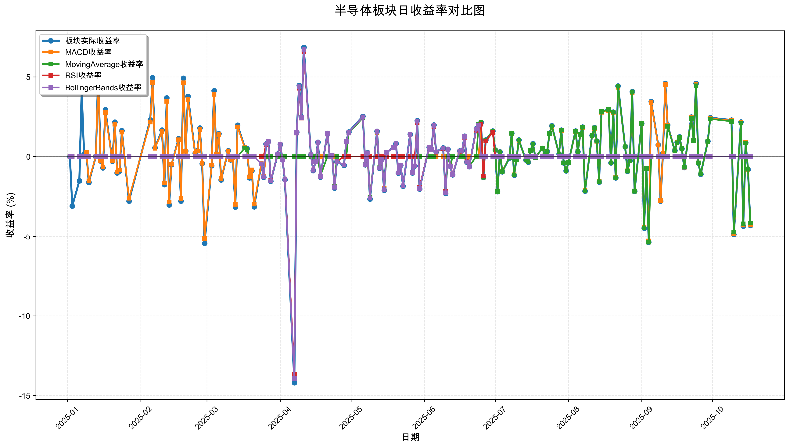
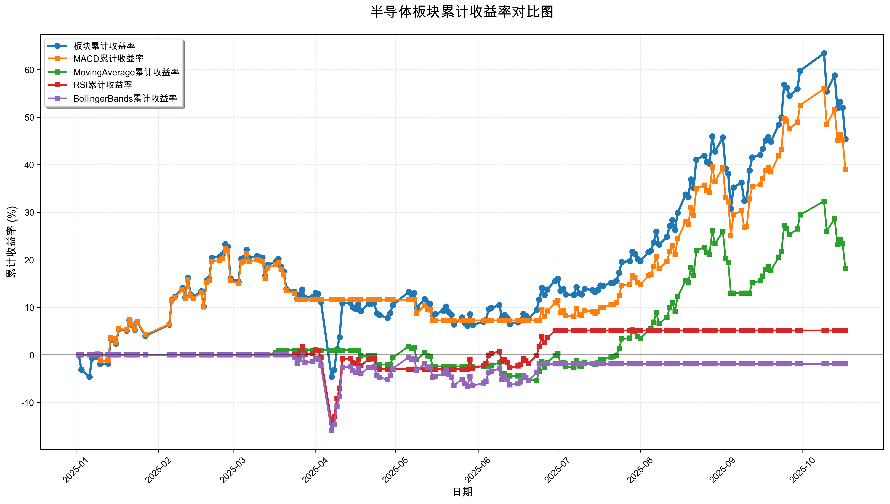

# 策略回测结果报告

**生成时间**: 2025-10-19 19:08:01
**行业板块**: 半导体
**回测期间**: 20250101 至 20251017
**策略数量**: 4

## 📈 分析结论

### 策略表现分析
- **最佳策略**: MACD (总收益率: 38.99%)
- **最差策略**: BollingerBands (总收益率: -1.88%)
### 交易活跃度分析
- **活跃策略**: 4 个
- **非活跃策略**: 0 个
- **最活跃策略**: MovingAverage (交易次数: 18)
### 🚨 异动提醒分析
- **板块异动**: 半导体 近两周出现大幅波动 (最大单日: 4.89%)
- **策略异动**: MACD 近两周出现大幅波动 (最大单日: 4.83%)
- **策略异动**: MovingAverage 近两周出现大幅波动 (最大单日: 4.74%)
### 风险分析
- **MACD**: 最大回撤 -12.37%, 夏普比率 2.0178
- **MovingAverage**: 最大回撤 -10.69%, 夏普比率 1.1974
- **RSI**: 最大回撤 -15.59%, 夏普比率 0.3378
- **BollingerBands**: 最大回撤 -15.90%, 夏普比率 -0.1152

## 📊 综合结果表

| 策略名称           | 初始资金     | 最终价值     | 总收益率   | 年化收益率   | 波动率    |    夏普比率 | 最大回撤    | 总交易次数   | 买入次数   | 卖出次数   | 总交易金额      | 平均交易金额   | 交易频率   |   数据点数 |
|:---------------|:---------|:---------|:-------|:--------|:-------|--------:|:--------|:--------|:-------|:-------|:-----------|:---------|:-------|-------:|
| 板块实际表现         | ¥100,000 | ¥145,390 | 45.39% | 64.28%  | 35.86% |  1.7925 | -22.63% | N/A     | N/A    | N/A    | N/A        | N/A      | N/A    |    190 |
| MACD           | ¥100,000 | ¥138,991 | 38.99% | 54.75%  | 27.14% |  2.0178 | -12.37% | 5       | 3      | 2      | ¥512,051   | ¥102,410 | 0.03   |    190 |
| MovingAverage  | ¥100,000 | ¥118,173 | 18.17% | 24.79%  | 20.70% |  1.1974 | -10.69% | 18      | 9      | 9      | ¥1,743,945 | ¥96,886  | 0.09   |    190 |
| RSI            | ¥100,000 | ¥105,135 | 5.13%  | 6.87%   | 20.33% |  0.3378 | -15.59% | 4       | 2      | 2      | ¥381,081   | ¥95,270  | 0.02   |    190 |
| BollingerBands | ¥100,000 | ¥98,123  | -1.88% | -2.48%  | 21.55% | -0.1152 | -15.90% | 2       | 1      | 1      | ¥194,455   | ¥97,228  | 0.01   |    190 |

## 📊 每日收益率走势图

*图1: 半导体板块每日收益率走势对比*

## 📈 累计收益率走势图

*图2: 半导体板块累计收益率走势对比*

## 📅 日收益明细表

| 日期         | 板块实际收益率   | MACD收益率   | MovingAverage收益率   | RSI收益率   | BollingerBands收益率   |
|:-----------|:----------|:----------|:-------------------|:---------|:--------------------|
| 2025-01-02 | 0.00%     | 0.00%     | 0.00%              | 0.00%    | 0.00%               |
| 2025-01-03 | -3.11%    | 0.00%     | 0.00%              | 0.00%    | 0.00%               |
| 2025-01-06 | -1.53%    | 0.00%     | 0.00%              | 0.00%    | 0.00%               |
| 2025-01-07 | 4.10%     | 0.00%     | 0.00%              | 0.00%    | 0.00%               |
| 2025-01-08 | 0.18%     | 0.00%     | 0.00%              | 0.00%    | 0.00%               |
| 2025-01-09 | 0.26%     | 0.25%     | 0.00%              | 0.00%    | 0.00%               |
| 2025-01-10 | -1.62%    | -1.52%    | 0.00%              | 0.00%    | 0.00%               |
| 2025-01-13 | 0.01%     | 0.01%     | 0.00%              | 0.00%    | 0.00%               |
| 2025-01-14 | 5.32%     | 4.97%     | 0.00%              | 0.00%    | 0.00%               |
| 2025-01-15 | -0.28%    | -0.26%    | 0.00%              | 0.00%    | 0.00%               |
| 2025-01-16 | -0.70%    | -0.66%    | 0.00%              | 0.00%    | 0.00%               |
| 2025-01-17 | 2.94%     | 2.75%     | 0.00%              | 0.00%    | 0.00%               |
| 2025-01-20 | -0.30%    | -0.28%    | 0.00%              | 0.00%    | 0.00%               |
| 2025-01-21 | 2.16%     | 2.03%     | 0.00%              | 0.00%    | 0.00%               |
| 2025-01-22 | -1.03%    | -0.97%    | 0.00%              | 0.00%    | 0.00%               |
| 2025-01-23 | -0.91%    | -0.85%    | 0.00%              | 0.00%    | 0.00%               |
| 2025-01-24 | 1.63%     | 1.53%     | 0.00%              | 0.00%    | 0.00%               |
| 2025-01-27 | -2.79%    | -2.62%    | 0.00%              | 0.00%    | 0.00%               |
| 2025-02-05 | 2.30%     | 2.16%     | 0.00%              | 0.00%    | 0.00%               |
| 2025-02-06 | 4.95%     | 4.66%     | 0.00%              | 0.00%    | 0.00%               |
| 2025-02-07 | 0.55%     | 0.52%     | 0.00%              | 0.00%    | 0.00%               |
| 2025-02-10 | 1.66%     | 1.56%     | 0.00%              | 0.00%    | 0.00%               |
| 2025-02-11 | -1.76%    | -1.66%    | 0.00%              | 0.00%    | 0.00%               |
| 2025-02-12 | 3.68%     | 3.47%     | 0.00%              | 0.00%    | 0.00%               |
| 2025-02-13 | -3.03%    | -2.86%    | 0.00%              | 0.00%    | 0.00%               |
| 2025-02-14 | -0.51%    | -0.48%    | 0.00%              | 0.00%    | 0.00%               |
| 2025-02-17 | 1.12%     | 1.05%     | 0.00%              | 0.00%    | 0.00%               |
| 2025-02-18 | -2.79%    | -2.63%    | 0.00%              | 0.00%    | 0.00%               |
| 2025-02-19 | 4.92%     | 4.63%     | 0.00%              | 0.00%    | 0.00%               |
| 2025-02-20 | 0.35%     | 0.33%     | 0.00%              | 0.00%    | 0.00%               |
| 2025-02-21 | 3.78%     | 3.57%     | 0.00%              | 0.00%    | 0.00%               |
| 2025-02-24 | 0.21%     | 0.20%     | 0.00%              | 0.00%    | 0.00%               |
| 2025-02-25 | 0.36%     | 0.34%     | 0.00%              | 0.00%    | 0.00%               |
| 2025-02-26 | 1.79%     | 1.70%     | 0.00%              | 0.00%    | 0.00%               |
| 2025-02-27 | -0.44%    | -0.42%    | 0.00%              | 0.00%    | 0.00%               |
| 2025-02-28 | -5.44%    | -5.15%    | 0.00%              | 0.00%    | 0.00%               |
| 2025-03-03 | -0.57%    | -0.54%    | 0.00%              | 0.00%    | 0.00%               |
| 2025-03-04 | 4.13%     | 3.90%     | 0.00%              | 0.00%    | 0.00%               |
| 2025-03-05 | 0.17%     | 0.16%     | 0.00%              | 0.00%    | 0.00%               |
| 2025-03-06 | 1.44%     | 1.37%     | 0.00%              | 0.00%    | 0.00%               |
| 2025-03-07 | -1.46%    | -1.38%    | 0.00%              | 0.00%    | 0.00%               |
| 2025-03-10 | 0.37%     | 0.35%     | 0.00%              | 0.00%    | 0.00%               |
| 2025-03-11 | -0.21%    | -0.20%    | 0.00%              | 0.00%    | 0.00%               |
| 2025-03-12 | -0.07%    | -0.06%    | 0.00%              | 0.00%    | 0.00%               |
| 2025-03-13 | -3.17%    | -3.00%    | 0.00%              | 0.00%    | 0.00%               |
| 2025-03-14 | 1.97%     | 1.86%     | 0.00%              | 0.00%    | 0.00%               |
| 2025-03-17 | 0.58%     | 0.55%     | 0.54%              | 0.00%    | 0.00%               |
| 2025-03-18 | 0.49%     | 0.46%     | 0.45%              | 0.00%    | 0.00%               |
| 2025-03-19 | -1.34%    | -1.27%    | 0.00%              | 0.00%    | 0.00%               |
| 2025-03-20 | -0.89%    | -0.84%    | 0.00%              | 0.00%    | 0.00%               |
| 2025-03-21 | -3.15%    | -2.98%    | 0.00%              | 0.00%    | 0.00%               |
| 2025-03-24 | -0.47%    | -0.44%    | 0.00%              | 0.00%    | -0.46%              |
| 2025-03-25 | -1.30%    | -1.23%    | 0.00%              | 0.00%    | -1.28%              |
| 2025-03-26 | 0.79%     | 0.00%     | 0.00%              | 0.76%    | 0.78%               |
| 2025-03-27 | 0.94%     | 0.00%     | 0.00%              | 0.91%    | 0.93%               |
| 2025-03-28 | -1.55%    | 0.00%     | 0.00%              | -1.50%   | -1.52%              |
| 2025-03-31 | 0.16%     | 0.00%     | 0.00%              | 0.15%    | 0.15%               |
| 2025-04-01 | 0.77%     | 0.00%     | 0.00%              | 0.74%    | 0.75%               |
| 2025-04-02 | -0.21%    | 0.00%     | 0.00%              | -0.20%   | -0.21%              |
| 2025-04-03 | -1.45%    | 0.00%     | 0.00%              | -1.40%   | -1.43%              |
| 2025-04-07 | -14.19%   | 0.00%     | 0.00%              | -13.68%  | -13.92%             |
| 2025-04-08 | 1.53%     | 0.00%     | 0.00%              | 1.47%    | 1.50%               |
| 2025-04-09 | 4.47%     | 0.00%     | 0.00%              | 4.29%    | 4.38%               |
| 2025-04-10 | 2.50%     | 0.00%     | 0.00%              | 2.41%    | 2.45%               |
| 2025-04-11 | 6.85%     | 0.00%     | 0.00%              | 6.59%    | 6.72%               |
| 2025-04-14 | 0.11%     | 0.00%     | 0.00%              | 0.11%    | 0.11%               |
| 2025-04-15 | -0.88%    | 0.00%     | 0.00%              | -0.84%   | -0.86%              |
| 2025-04-16 | -0.30%    | 0.00%     | 0.00%              | -0.29%   | -0.30%              |
| 2025-04-17 | 0.90%     | 0.00%     | 0.00%              | 0.86%    | 0.88%               |
| 2025-04-18 | -1.29%    | 0.00%     | -1.22%             | -1.24%   | -1.26%              |
| 2025-04-21 | 1.46%     | 0.00%     | 0.00%              | 1.41%    | 1.43%               |
| 2025-04-22 | 0.01%     | 0.00%     | 0.01%              | 0.01%    | 0.01%               |
| 2025-04-23 | 0.08%     | 0.00%     | 0.08%              | 0.08%    | 0.08%               |
| 2025-04-24 | -1.97%    | 0.00%     | -1.89%             | -1.90%   | -1.93%              |
| 2025-04-25 | -0.32%    | 0.00%     | 0.00%              | -0.31%   | -0.32%              |
| 2025-04-28 | -0.55%    | 0.00%     | 0.00%              | 0.00%    | -0.53%              |
| 2025-04-29 | 0.95%     | 0.00%     | 0.00%              | 0.00%    | 0.94%               |
| 2025-04-30 | 1.54%     | 0.00%     | 1.47%              | 0.00%    | 1.51%               |
| 2025-05-06 | 2.53%     | 0.00%     | 2.43%              | 0.00%    | 2.49%               |
| 2025-05-07 | -0.52%    | 0.00%     | -0.50%             | 0.00%    | -0.51%              |
| 2025-05-08 | 0.24%     | 0.00%     | 0.23%              | 0.00%    | 0.24%               |
| 2025-05-09 | -2.66%    | -2.53%    | -2.55%             | 0.00%    | -2.61%              |
| 2025-05-12 | 1.59%     | 1.52%     | 1.53%              | 0.00%    | 1.56%               |
| 2025-05-13 | -0.74%    | -0.71%    | -0.71%             | 0.00%    | -0.73%              |
| 2025-05-14 | -0.18%    | -0.17%    | -0.17%             | 0.00%    | -0.18%              |
| 2025-05-15 | -2.12%    | -2.01%    | -2.03%             | 0.00%    | -2.08%              |
| 2025-05-16 | 0.25%     | 0.00%     | 0.00%              | 0.00%    | 0.25%               |
| 2025-05-19 | 0.59%     | 0.00%     | 0.00%              | 0.00%    | 0.58%               |
| 2025-05-20 | 0.82%     | 0.00%     | 0.00%              | 0.00%    | 0.80%               |
| 2025-05-21 | -1.04%    | 0.00%     | 0.00%              | 0.00%    | -1.02%              |
| 2025-05-22 | -0.55%    | 0.00%     | 0.00%              | 0.00%    | -0.54%              |
| 2025-05-23 | -1.86%    | 0.00%     | 0.00%              | 0.00%    | -1.83%              |
| 2025-05-26 | 1.40%     | 0.00%     | 0.00%              | 0.00%    | 1.37%               |
| 2025-05-27 | -1.02%    | 0.00%     | 0.00%              | 0.00%    | -1.00%              |
| 2025-05-28 | -0.59%    | 0.00%     | 0.00%              | 0.00%    | -0.58%              |
| 2025-05-29 | 2.26%     | 0.00%     | 0.00%              | 2.13%    | 2.22%               |
| 2025-05-30 | -2.04%    | 0.00%     | 0.00%              | -1.93%   | -2.00%              |
| 2025-06-03 | 0.58%     | 0.00%     | 0.00%              | 0.55%    | 0.57%               |
| 2025-06-04 | 0.46%     | 0.00%     | 0.00%              | 0.44%    | 0.45%               |
| 2025-06-05 | 1.98%     | 0.00%     | 0.00%              | 1.87%    | 1.94%               |
| 2025-06-06 | 0.29%     | 0.00%     | 0.28%              | 0.27%    | 0.28%               |
| 2025-06-09 | 0.54%     | 0.00%     | 0.53%              | 0.51%    | 0.53%               |
| 2025-06-10 | -2.32%    | 0.00%     | -2.24%             | -2.19%   | -2.27%              |
| 2025-06-11 | 0.46%     | 0.00%     | 0.00%              | 0.43%    | 0.45%               |
| 2025-06-12 | -0.62%    | 0.00%     | -0.60%             | -0.59%   | -0.61%              |
| 2025-06-13 | -1.15%    | 0.00%     | 0.00%              | -1.09%   | -1.13%              |
| 2025-06-16 | 0.35%     | 0.00%     | 0.00%              | 0.33%    | 0.35%               |
| 2025-06-17 | 0.36%     | 0.00%     | 0.00%              | 0.34%    | 0.36%               |
| 2025-06-18 | 1.28%     | 0.00%     | 0.00%              | 1.21%    | 1.26%               |
| 2025-06-19 | -0.35%    | 0.00%     | -0.35%             | -0.33%   | -0.35%              |
| 2025-06-20 | -0.63%    | 0.00%     | -0.62%             | -0.60%   | -0.62%              |
| 2025-06-23 | 1.75%     | 0.00%     | 0.00%              | 1.65%    | 1.72%               |
| 2025-06-24 | 2.01%     | 0.00%     | 2.01%              | 1.90%    | 1.97%               |
| 2025-06-25 | 2.15%     | 2.10%     | 2.14%              | 2.03%    | 0.00%               |
| 2025-06-26 | -1.30%    | -1.27%    | -1.30%             | -1.23%   | 0.00%               |
| 2025-06-27 | 1.04%     | 1.01%     | 1.03%              | 0.98%    | 0.00%               |
| 2025-06-30 | 1.60%     | 1.57%     | 1.60%              | 1.52%    | 0.00%               |
| 2025-07-01 | 0.41%     | 0.40%     | 0.41%              | 0.00%    | 0.00%               |
| 2025-07-02 | -2.20%    | -2.15%    | -2.19%             | 0.00%    | 0.00%               |
| 2025-07-03 | 0.29%     | 0.29%     | 0.29%              | 0.00%    | 0.00%               |
| 2025-07-04 | -0.95%    | -0.93%    | -0.95%             | 0.00%    | 0.00%               |
| 2025-07-07 | -0.09%    | -0.09%    | -0.09%             | 0.00%    | 0.00%               |
| 2025-07-08 | 1.46%     | 1.43%     | 1.46%              | 0.00%    | 0.00%               |
| 2025-07-09 | -1.17%    | -1.14%    | -1.16%             | 0.00%    | 0.00%               |
| 2025-07-10 | -0.19%    | -0.19%    | -0.19%             | 0.00%    | 0.00%               |
| 2025-07-11 | 1.04%     | 1.02%     | 1.03%              | 0.00%    | 0.00%               |
| 2025-07-14 | -0.22%    | -0.22%    | -0.22%             | 0.00%    | 0.00%               |
| 2025-07-15 | -0.35%    | -0.34%    | -0.35%             | 0.00%    | 0.00%               |
| 2025-07-16 | 0.39%     | 0.39%     | 0.39%              | 0.00%    | 0.00%               |
| 2025-07-17 | 0.80%     | 0.78%     | 0.79%              | 0.00%    | 0.00%               |
| 2025-07-18 | -0.05%    | -0.05%    | -0.05%             | 0.00%    | 0.00%               |
| 2025-07-21 | 0.52%     | 0.51%     | 0.52%              | 0.00%    | 0.00%               |
| 2025-07-22 | 0.10%     | 0.10%     | 0.10%              | 0.00%    | 0.00%               |
| 2025-07-23 | 0.32%     | 0.31%     | 0.32%              | 0.00%    | 0.00%               |
| 2025-07-24 | 1.45%     | 1.42%     | 1.44%              | 0.00%    | 0.00%               |
| 2025-07-25 | 1.93%     | 1.89%     | 1.92%              | 0.00%    | 0.00%               |
| 2025-07-28 | 0.16%     | 0.16%     | 0.16%              | 0.00%    | 0.00%               |
| 2025-07-29 | 1.66%     | 1.63%     | 1.66%              | 0.00%    | 0.00%               |
| 2025-07-30 | -0.39%    | -0.39%    | -0.39%             | 0.00%    | 0.00%               |
| 2025-07-31 | -0.90%    | -0.89%    | -0.90%             | 0.00%    | 0.00%               |
| 2025-08-01 | -0.38%    | -0.37%    | -0.38%             | 0.00%    | 0.00%               |
| 2025-08-04 | 1.60%     | 1.56%     | 1.59%              | 0.00%    | 0.00%               |
| 2025-08-05 | 0.31%     | 0.30%     | 0.31%              | 0.00%    | 0.00%               |
| 2025-08-06 | 1.39%     | 1.36%     | 1.38%              | 0.00%    | 0.00%               |
| 2025-08-07 | 1.85%     | 1.82%     | 1.85%              | 0.00%    | 0.00%               |
| 2025-08-08 | -2.17%    | -2.13%    | -2.17%             | 0.00%    | 0.00%               |
| 2025-08-11 | 1.33%     | 1.30%     | 1.32%              | 0.00%    | 0.00%               |
| 2025-08-12 | 1.80%     | 1.77%     | 1.80%              | 0.00%    | 0.00%               |
| 2025-08-13 | 0.97%     | 0.96%     | 0.97%              | 0.00%    | 0.00%               |
| 2025-08-14 | -1.59%    | -1.56%    | -1.58%             | 0.00%    | 0.00%               |
| 2025-08-15 | 2.83%     | 2.78%     | 2.82%              | 0.00%    | 0.00%               |
| 2025-08-18 | 2.95%     | 2.90%     | 2.94%              | 0.00%    | 0.00%               |
| 2025-08-19 | -0.39%    | -0.39%    | -0.39%             | 0.00%    | 0.00%               |
| 2025-08-20 | 2.79%     | 2.75%     | 2.79%              | 0.00%    | 0.00%               |
| 2025-08-21 | -1.34%    | -1.32%    | -1.34%             | 0.00%    | 0.00%               |
| 2025-08-22 | 4.43%     | 4.35%     | 4.42%              | 0.00%    | 0.00%               |
| 2025-08-25 | 0.61%     | 0.60%     | 0.61%              | 0.00%    | 0.00%               |
| 2025-08-26 | -0.92%    | -0.90%    | -0.92%             | 0.00%    | 0.00%               |
| 2025-08-27 | -0.25%    | -0.25%    | -0.25%             | 0.00%    | 0.00%               |
| 2025-08-28 | 4.07%     | 4.00%     | 4.06%              | 0.00%    | 0.00%               |
| 2025-08-29 | -2.18%    | -2.15%    | -2.18%             | 0.00%    | 0.00%               |
| 2025-09-01 | 2.08%     | 2.05%     | 2.08%              | 0.00%    | 0.00%               |
| 2025-09-02 | -4.49%    | -4.42%    | -4.48%             | 0.00%    | 0.00%               |
| 2025-09-03 | -0.75%    | -0.74%    | -0.75%             | 0.00%    | 0.00%               |
| 2025-09-04 | -5.38%    | -5.29%    | -5.37%             | 0.00%    | 0.00%               |
| 2025-09-05 | 3.46%     | 3.40%     | 0.00%              | 0.00%    | 0.00%               |
| 2025-09-08 | 0.73%     | 0.72%     | 0.00%              | 0.00%    | 0.00%               |
| 2025-09-09 | -2.80%    | -2.75%    | 0.00%              | 0.00%    | 0.00%               |
| 2025-09-10 | 0.22%     | 0.21%     | 0.00%              | 0.00%    | 0.00%               |
| 2025-09-11 | 4.59%     | 4.51%     | 0.00%              | 0.00%    | 0.00%               |
| 2025-09-12 | 1.98%     | 1.95%     | 1.90%              | 0.00%    | 0.00%               |
| 2025-09-15 | 0.38%     | 0.38%     | 0.37%              | 0.00%    | 0.00%               |
| 2025-09-16 | 0.90%     | 0.88%     | 0.86%              | 0.00%    | 0.00%               |
| 2025-09-17 | 1.23%     | 1.21%     | 1.19%              | 0.00%    | 0.00%               |
| 2025-09-18 | 0.50%     | 0.50%     | 0.49%              | 0.00%    | 0.00%               |
| 2025-09-19 | -0.69%    | -0.67%    | -0.66%             | 0.00%    | 0.00%               |
| 2025-09-22 | 2.48%     | 2.44%     | 2.39%              | 0.00%    | 0.00%               |
| 2025-09-23 | 1.04%     | 1.02%     | 1.00%              | 0.00%    | 0.00%               |
| 2025-09-24 | 4.60%     | 4.53%     | 4.44%              | 0.00%    | 0.00%               |
| 2025-09-25 | -0.41%    | -0.40%    | -0.40%             | 0.00%    | 0.00%               |
| 2025-09-26 | -1.11%    | -1.10%    | -1.08%             | 0.00%    | 0.00%               |
| 2025-09-29 | 0.96%     | 0.94%     | 0.93%              | 0.00%    | 0.00%               |
| 2025-09-30 | 2.44%     | 2.40%     | 2.36%              | 0.00%    | 0.00%               |
| 2025-10-09 | 2.29%     | 2.25%     | 2.21%              | 0.00%    | 0.00%               |
| 2025-10-10 | -4.89%    | -4.83%    | -4.74%             | 0.00%    | 0.00%               |
| 2025-10-13 | 2.17%     | 2.13%     | 2.10%              | 0.00%    | 0.00%               |
| 2025-10-14 | -4.36%    | -4.30%    | -4.22%             | 0.00%    | 0.00%               |
| 2025-10-15 | 0.88%     | 0.87%     | 0.85%              | 0.00%    | 0.00%               |
| 2025-10-16 | -0.81%    | -0.80%    | -0.78%             | 0.00%    | 0.00%               |
| 2025-10-17 | -4.33%    | -4.26%    | -4.18%             | 0.00%    | 0.00%               |

## 📊 日收益统计摘要

| 指标                | 平均日收益率   | 最大日收益率   | 最小日收益率   | 正收益天数   | 负收益天数   |
|:------------------|:---------|:---------|:---------|:--------|:--------|
| 板块实际收益率           | 0.22%    | 6.85%    | -14.19%  | 108天    | 81天     |
| MACD收益率           | 0.19%    | 4.97%    | -5.29%   | 73天     | 57天     |
| MovingAverage收益率  | 0.10%    | 4.44%    | -5.37%   | 54天     | 40天     |
| RSI收益率            | 0.03%    | 6.59%    | -13.68%  | 28天     | 16天     |
| BollingerBands收益率 | -0.00%   | 6.72%    | -13.92%  | 34天     | 28天     |

## 📈 累计收益明细表

| 日期         | 板块累计收益率   | MACD累计收益率   | MovingAverage累计收益率   | RSI累计收益率   | BollingerBands累计收益率   |
|:-----------|:----------|:------------|:---------------------|:-----------|:----------------------|
| 2025-01-02 | 0.00%     | 0.00%       | 0.00%                | 0.00%      | 0.00%                 |
| 2025-01-03 | -3.11%    | 0.00%       | 0.00%                | 0.00%      | 0.00%                 |
| 2025-01-06 | -4.60%    | 0.00%       | 0.00%                | 0.00%      | 0.00%                 |
| 2025-01-07 | -0.69%    | 0.00%       | 0.00%                | 0.00%      | 0.00%                 |
| 2025-01-08 | -0.51%    | 0.00%       | 0.00%                | 0.00%      | 0.00%                 |
| 2025-01-09 | -0.25%    | 0.25%       | 0.00%                | 0.00%      | 0.00%                 |
| 2025-01-10 | -1.86%    | -1.27%      | 0.00%                | 0.00%      | 0.00%                 |
| 2025-01-13 | -1.85%    | -1.27%      | 0.00%                | 0.00%      | 0.00%                 |
| 2025-01-14 | 3.36%     | 3.64%       | 0.00%                | 0.00%      | 0.00%                 |
| 2025-01-15 | 3.08%     | 3.38%       | 0.00%                | 0.00%      | 0.00%                 |
| 2025-01-16 | 2.36%     | 2.70%       | 0.00%                | 0.00%      | 0.00%                 |
| 2025-01-17 | 5.36%     | 5.53%       | 0.00%                | 0.00%      | 0.00%                 |
| 2025-01-20 | 5.05%     | 5.23%       | 0.00%                | 0.00%      | 0.00%                 |
| 2025-01-21 | 7.32%     | 7.36%       | 0.00%                | 0.00%      | 0.00%                 |
| 2025-01-22 | 6.21%     | 6.32%       | 0.00%                | 0.00%      | 0.00%                 |
| 2025-01-23 | 5.25%     | 5.41%       | 0.00%                | 0.00%      | 0.00%                 |
| 2025-01-24 | 6.96%     | 7.03%       | 0.00%                | 0.00%      | 0.00%                 |
| 2025-01-27 | 3.97%     | 4.22%       | 0.00%                | 0.00%      | 0.00%                 |
| 2025-02-05 | 6.36%     | 6.47%       | 0.00%                | 0.00%      | 0.00%                 |
| 2025-02-06 | 11.63%    | 11.42%      | 0.00%                | 0.00%      | 0.00%                 |
| 2025-02-07 | 12.25%    | 12.00%      | 0.00%                | 0.00%      | 0.00%                 |
| 2025-02-10 | 14.11%    | 13.75%      | 0.00%                | 0.00%      | 0.00%                 |
| 2025-02-11 | 12.10%    | 11.86%      | 0.00%                | 0.00%      | 0.00%                 |
| 2025-02-12 | 16.23%    | 15.75%      | 0.00%                | 0.00%      | 0.00%                 |
| 2025-02-13 | 12.71%    | 12.43%      | 0.00%                | 0.00%      | 0.00%                 |
| 2025-02-14 | 12.13%    | 11.89%      | 0.00%                | 0.00%      | 0.00%                 |
| 2025-02-17 | 13.39%    | 13.07%      | 0.00%                | 0.00%      | 0.00%                 |
| 2025-02-18 | 10.22%    | 10.09%      | 0.00%                | 0.00%      | 0.00%                 |
| 2025-02-19 | 15.64%    | 15.19%      | 0.00%                | 0.00%      | 0.00%                 |
| 2025-02-20 | 16.05%    | 15.58%      | 0.00%                | 0.00%      | 0.00%                 |
| 2025-02-21 | 20.43%    | 19.70%      | 0.00%                | 0.00%      | 0.00%                 |
| 2025-02-24 | 20.69%    | 19.94%      | 0.00%                | 0.00%      | 0.00%                 |
| 2025-02-25 | 21.12%    | 20.35%      | 0.00%                | 0.00%      | 0.00%                 |
| 2025-02-26 | 23.29%    | 22.39%      | 0.00%                | 0.00%      | 0.00%                 |
| 2025-02-27 | 22.75%    | 21.88%      | 0.00%                | 0.00%      | 0.00%                 |
| 2025-02-28 | 16.08%    | 15.60%      | 0.00%                | 0.00%      | 0.00%                 |
| 2025-03-03 | 15.41%    | 14.98%      | 0.00%                | 0.00%      | 0.00%                 |
| 2025-03-04 | 20.18%    | 19.47%      | 0.00%                | 0.00%      | 0.00%                 |
| 2025-03-05 | 20.39%    | 19.66%      | 0.00%                | 0.00%      | 0.00%                 |
| 2025-03-06 | 22.13%    | 21.30%      | 0.00%                | 0.00%      | 0.00%                 |
| 2025-03-07 | 20.35%    | 19.62%      | 0.00%                | 0.00%      | 0.00%                 |
| 2025-03-10 | 20.79%    | 20.04%      | 0.00%                | 0.00%      | 0.00%                 |
| 2025-03-11 | 20.53%    | 19.79%      | 0.00%                | 0.00%      | 0.00%                 |
| 2025-03-12 | 20.45%    | 19.72%      | 0.00%                | 0.00%      | 0.00%                 |
| 2025-03-13 | 16.64%    | 16.13%      | 0.00%                | 0.00%      | 0.00%                 |
| 2025-03-14 | 18.93%    | 18.29%      | 0.00%                | 0.00%      | 0.00%                 |
| 2025-03-17 | 19.62%    | 18.94%      | 0.54%                | 0.00%      | 0.00%                 |
| 2025-03-18 | 20.21%    | 19.49%      | 1.00%                | 0.00%      | 0.00%                 |
| 2025-03-19 | 18.59%    | 17.97%      | 1.00%                | 0.00%      | 0.00%                 |
| 2025-03-20 | 17.54%    | 16.98%      | 1.00%                | 0.00%      | 0.00%                 |
| 2025-03-21 | 13.83%    | 13.49%      | 1.00%                | 0.00%      | 0.00%                 |
| 2025-03-24 | 13.30%    | 12.99%      | 1.00%                | 0.00%      | -0.46%                |
| 2025-03-25 | 11.82%    | 11.60%      | 1.00%                | 0.00%      | -1.73%                |
| 2025-03-26 | 12.71%    | 11.60%      | 1.00%                | 0.76%      | -0.97%                |
| 2025-03-27 | 13.77%    | 11.60%      | 1.00%                | 1.68%      | -0.05%                |
| 2025-03-28 | 12.01%    | 11.60%      | 1.00%                | 0.16%      | -1.57%                |
| 2025-03-31 | 12.18%    | 11.60%      | 1.00%                | 0.31%      | -1.42%                |
| 2025-04-01 | 13.04%    | 11.60%      | 1.00%                | 1.05%      | -0.68%                |
| 2025-04-02 | 12.80%    | 11.60%      | 1.00%                | 0.85%      | -0.89%                |
| 2025-04-03 | 11.17%    | 11.60%      | 1.00%                | -0.57%     | -2.30%                |
| 2025-04-07 | -4.61%    | 11.60%      | 1.00%                | -14.17%    | -15.90%               |
| 2025-04-08 | -3.14%    | 11.60%      | 1.00%                | -12.91%    | -14.64%               |
| 2025-04-09 | 1.19%     | 11.60%      | 1.00%                | -9.17%     | -10.90%               |
| 2025-04-10 | 3.72%     | 11.60%      | 1.00%                | -6.99%     | -8.72%                |
| 2025-04-11 | 10.83%    | 11.60%      | 1.00%                | -0.86%     | -2.59%                |
| 2025-04-14 | 10.95%    | 11.60%      | 1.00%                | -0.75%     | -2.48%                |
| 2025-04-15 | 9.98%     | 11.60%      | 1.00%                | -1.59%     | -3.32%                |
| 2025-04-16 | 9.65%     | 11.60%      | 1.00%                | -1.88%     | -3.61%                |
| 2025-04-17 | 10.63%    | 11.60%      | 1.00%                | -1.03%     | -2.76%                |
| 2025-04-18 | 9.21%     | 11.60%      | -0.23%               | -2.26%     | -3.99%                |
| 2025-04-21 | 10.80%    | 11.60%      | -0.23%               | -0.88%     | -2.61%                |
| 2025-04-22 | 10.81%    | 11.60%      | -0.22%               | -0.87%     | -2.60%                |
| 2025-04-23 | 10.90%    | 11.60%      | -0.14%               | -0.79%     | -2.52%                |
| 2025-04-24 | 8.72%     | 11.60%      | -2.02%               | -2.68%     | -4.41%                |
| 2025-04-25 | 8.37%     | 11.60%      | -2.02%               | -2.98%     | -4.71%                |
| 2025-04-28 | 7.78%     | 11.60%      | -2.02%               | -2.98%     | -5.22%                |
| 2025-04-29 | 8.80%     | 11.60%      | -2.02%               | -2.98%     | -4.33%                |
| 2025-04-30 | 10.48%    | 11.60%      | -0.58%               | -2.98%     | -2.89%                |
| 2025-05-06 | 13.28%    | 11.60%      | 1.83%                | -2.98%     | -0.48%                |
| 2025-05-07 | 12.69%    | 11.60%      | 1.33%                | -2.98%     | -0.98%                |
| 2025-05-08 | 12.97%    | 11.60%      | 1.57%                | -2.98%     | -0.74%                |
| 2025-05-09 | 9.96%     | 8.78%       | -1.02%               | -2.98%     | -3.33%                |
| 2025-05-12 | 11.72%    | 10.43%      | 0.49%                | -2.98%     | -1.82%                |
| 2025-05-13 | 10.88%    | 9.64%       | -0.23%               | -2.98%     | -2.54%                |
| 2025-05-14 | 10.69%    | 9.45%       | -0.40%               | -2.98%     | -2.71%                |
| 2025-05-15 | 8.34%     | 7.25%       | -2.42%               | -2.98%     | -4.73%                |
| 2025-05-16 | 8.62%     | 7.25%       | -2.42%               | -2.98%     | -4.50%                |
| 2025-05-19 | 9.26%     | 7.25%       | -2.42%               | -2.98%     | -3.95%                |
| 2025-05-20 | 10.15%    | 7.25%       | -2.42%               | -2.98%     | -3.17%                |
| 2025-05-21 | 9.01%     | 7.25%       | -2.42%               | -2.98%     | -4.16%                |
| 2025-05-22 | 8.41%     | 7.25%       | -2.42%               | -2.98%     | -4.67%                |
| 2025-05-23 | 6.39%     | 7.25%       | -2.42%               | -2.98%     | -6.42%                |
| 2025-05-26 | 7.88%     | 7.25%       | -2.42%               | -2.98%     | -5.13%                |
| 2025-05-27 | 6.78%     | 7.25%       | -2.42%               | -2.98%     | -6.08%                |
| 2025-05-28 | 6.14%     | 7.25%       | -2.42%               | -2.98%     | -6.63%                |
| 2025-05-29 | 8.55%     | 7.25%       | -2.42%               | -0.91%     | -4.56%                |
| 2025-05-30 | 6.33%     | 7.25%       | -2.42%               | -2.82%     | -6.47%                |
| 2025-06-03 | 6.95%     | 7.25%       | -2.42%               | -2.29%     | -5.93%                |
| 2025-06-04 | 7.44%     | 7.25%       | -2.42%               | -1.86%     | -5.51%                |
| 2025-06-05 | 9.57%     | 7.25%       | -2.42%               | -0.03%     | -3.68%                |
| 2025-06-06 | 9.88%     | 7.25%       | -2.15%               | 0.24%      | -3.41%                |
| 2025-06-09 | 10.48%    | 7.25%       | -1.64%               | 0.76%      | -2.89%                |
| 2025-06-10 | 7.92%     | 7.25%       | -3.84%               | -1.45%     | -5.10%                |
| 2025-06-11 | 8.41%     | 7.25%       | -3.84%               | -1.03%     | -4.67%                |
| 2025-06-12 | 7.74%     | 7.25%       | -4.42%               | -1.61%     | -5.25%                |
| 2025-06-13 | 6.49%     | 7.25%       | -4.42%               | -2.68%     | -6.33%                |
| 2025-06-16 | 6.87%     | 7.25%       | -4.42%               | -2.35%     | -6.00%                |
| 2025-06-17 | 7.26%     | 7.25%       | -4.42%               | -2.02%     | -5.67%                |
| 2025-06-18 | 8.63%     | 7.25%       | -4.42%               | -0.84%     | -4.48%                |
| 2025-06-19 | 8.25%     | 7.25%       | -4.75%               | -1.17%     | -4.81%                |
| 2025-06-20 | 7.57%     | 7.25%       | -5.34%               | -1.75%     | -5.40%                |
| 2025-06-23 | 9.45%     | 7.25%       | -5.34%               | -0.13%     | -3.78%                |
| 2025-06-24 | 11.65%    | 7.25%       | -3.44%               | 1.77%      | -1.88%                |
| 2025-06-25 | 14.05%    | 9.51%       | -1.37%               | 3.84%      | -1.88%                |
| 2025-06-26 | 12.57%    | 8.11%       | -2.65%               | 2.56%      | -1.88%                |
| 2025-06-27 | 13.74%    | 9.21%       | -1.65%               | 3.57%      | -1.88%                |
| 2025-06-30 | 15.56%    | 10.92%      | -0.08%               | 5.13%      | -1.88%                |
| 2025-07-01 | 16.03%    | 11.37%      | 0.33%                | 5.13%      | -1.88%                |
| 2025-07-02 | 13.48%    | 8.97%       | -1.87%               | 5.13%      | -1.88%                |
| 2025-07-03 | 13.82%    | 9.29%       | -1.58%               | 5.13%      | -1.88%                |
| 2025-07-04 | 12.73%    | 8.26%       | -2.51%               | 5.13%      | -1.88%                |
| 2025-07-07 | 12.62%    | 8.16%       | -2.61%               | 5.13%      | -1.88%                |
| 2025-07-08 | 14.27%    | 9.71%       | -1.19%               | 5.13%      | -1.88%                |
| 2025-07-09 | 12.93%    | 8.46%       | -2.34%               | 5.13%      | -1.88%                |
| 2025-07-10 | 12.72%    | 8.25%       | -2.53%               | 5.13%      | -1.88%                |
| 2025-07-11 | 13.88%    | 9.35%       | -1.52%               | 5.13%      | -1.88%                |
| 2025-07-14 | 13.63%    | 9.12%       | -1.73%               | 5.13%      | -1.88%                |
| 2025-07-15 | 13.23%    | 8.74%       | -2.08%               | 5.13%      | -1.88%                |
| 2025-07-16 | 13.68%    | 9.16%       | -1.70%               | 5.13%      | -1.88%                |
| 2025-07-17 | 14.59%    | 10.01%      | -0.91%               | 5.13%      | -1.88%                |
| 2025-07-18 | 14.53%    | 9.95%       | -0.97%               | 5.13%      | -1.88%                |
| 2025-07-21 | 15.12%    | 10.51%      | -0.46%               | 5.13%      | -1.88%                |
| 2025-07-22 | 15.23%    | 10.62%      | -0.36%               | 5.13%      | -1.88%                |
| 2025-07-23 | 15.60%    | 10.96%      | -0.04%               | 5.13%      | -1.88%                |
| 2025-07-24 | 17.27%    | 12.54%      | 1.40%                | 5.13%      | -1.88%                |
| 2025-07-25 | 19.53%    | 14.66%      | 3.35%                | 5.13%      | -1.88%                |
| 2025-07-28 | 19.73%    | 14.85%      | 3.52%                | 5.13%      | -1.88%                |
| 2025-07-29 | 21.72%    | 16.72%      | 5.24%                | 5.13%      | -1.88%                |
| 2025-07-30 | 21.24%    | 16.27%      | 4.83%                | 5.13%      | -1.88%                |
| 2025-07-31 | 20.14%    | 15.24%      | 3.88%                | 5.13%      | -1.88%                |
| 2025-08-01 | 19.69%    | 14.81%      | 3.49%                | 5.13%      | -1.88%                |
| 2025-08-04 | 21.60%    | 16.61%      | 5.13%                | 5.13%      | -1.88%                |
| 2025-08-05 | 21.97%    | 16.96%      | 5.46%                | 5.13%      | -1.88%                |
| 2025-08-06 | 23.66%    | 18.55%      | 6.91%                | 5.13%      | -1.88%                |
| 2025-08-07 | 25.95%    | 20.71%      | 8.89%                | 5.13%      | -1.88%                |
| 2025-08-08 | 23.22%    | 18.13%      | 6.53%                | 5.13%      | -1.88%                |
| 2025-08-11 | 24.85%    | 19.67%      | 7.94%                | 5.13%      | -1.88%                |
| 2025-08-12 | 27.10%    | 21.79%      | 9.88%                | 5.13%      | -1.88%                |
| 2025-08-13 | 28.34%    | 22.95%      | 10.95%               | 5.13%      | -1.88%                |
| 2025-08-14 | 26.31%    | 21.04%      | 9.19%                | 5.13%      | -1.88%                |
| 2025-08-15 | 29.88%    | 24.40%      | 12.27%               | 5.13%      | -1.88%                |
| 2025-08-18 | 33.71%    | 28.00%      | 15.58%               | 5.13%      | -1.88%                |
| 2025-08-19 | 33.18%    | 27.51%      | 15.12%               | 5.13%      | -1.88%                |
| 2025-08-20 | 36.91%    | 31.01%      | 18.33%               | 5.13%      | -1.88%                |
| 2025-08-21 | 35.07%    | 29.28%      | 16.75%               | 5.13%      | -1.88%                |
| 2025-08-22 | 41.05%    | 34.90%      | 21.90%               | 5.13%      | -1.88%                |
| 2025-08-25 | 41.90%    | 35.71%      | 22.64%               | 5.13%      | -1.88%                |
| 2025-08-26 | 40.60%    | 34.48%      | 21.52%               | 5.13%      | -1.88%                |
| 2025-08-27 | 40.24%    | 34.15%      | 21.21%               | 5.13%      | -1.88%                |
| 2025-08-28 | 45.94%    | 39.51%      | 26.13%               | 5.13%      | -1.88%                |
| 2025-08-29 | 42.76%    | 36.51%      | 23.38%               | 5.13%      | -1.88%                |
| 2025-09-01 | 45.73%    | 39.31%      | 25.95%               | 5.13%      | -1.88%                |
| 2025-09-02 | 39.19%    | 33.15%      | 20.30%               | 5.13%      | -1.88%                |
| 2025-09-03 | 38.14%    | 32.17%      | 19.40%               | 5.13%      | -1.88%                |
| 2025-09-04 | 30.71%    | 25.18%      | 12.99%               | 5.13%      | -1.88%                |
| 2025-09-05 | 35.23%    | 29.44%      | 12.99%               | 5.13%      | -1.88%                |
| 2025-09-08 | 36.22%    | 30.36%      | 12.99%               | 5.13%      | -1.88%                |
| 2025-09-09 | 32.40%    | 26.77%      | 12.99%               | 5.13%      | -1.88%                |
| 2025-09-10 | 32.69%    | 27.04%      | 12.99%               | 5.13%      | -1.88%                |
| 2025-09-11 | 38.78%    | 32.77%      | 12.99%               | 5.13%      | -1.88%                |
| 2025-09-12 | 41.52%    | 35.35%      | 15.14%               | 5.13%      | -1.88%                |
| 2025-09-15 | 42.06%    | 35.86%      | 15.57%               | 5.13%      | -1.88%                |
| 2025-09-16 | 43.34%    | 37.06%      | 16.56%               | 5.13%      | -1.88%                |
| 2025-09-17 | 45.10%    | 38.72%      | 17.95%               | 5.13%      | -1.88%                |
| 2025-09-18 | 45.83%    | 39.41%      | 18.52%               | 5.13%      | -1.88%                |
| 2025-09-19 | 44.83%    | 38.47%      | 17.74%               | 5.13%      | -1.88%                |
| 2025-09-22 | 48.43%    | 41.85%      | 20.55%               | 5.13%      | -1.88%                |
| 2025-09-23 | 49.96%    | 43.29%      | 21.76%               | 5.13%      | -1.88%                |
| 2025-09-24 | 56.86%    | 49.78%      | 27.17%               | 5.13%      | -1.88%                |
| 2025-09-25 | 56.22%    | 49.18%      | 26.67%               | 5.13%      | -1.88%                |
| 2025-09-26 | 54.48%    | 47.54%      | 25.30%               | 5.13%      | -1.88%                |
| 2025-09-29 | 55.96%    | 48.94%      | 26.46%               | 5.13%      | -1.88%                |
| 2025-09-30 | 59.77%    | 52.52%      | 29.45%               | 5.13%      | -1.88%                |
| 2025-10-09 | 63.42%    | 55.96%      | 32.31%               | 5.13%      | -1.88%                |
| 2025-10-10 | 55.42%    | 48.43%      | 26.04%               | 5.13%      | -1.88%                |
| 2025-10-13 | 58.79%    | 51.60%      | 28.68%               | 5.13%      | -1.88%                |
| 2025-10-14 | 51.86%    | 45.08%      | 23.25%               | 5.13%      | -1.88%                |
| 2025-10-15 | 53.21%    | 46.34%      | 24.30%               | 5.13%      | -1.88%                |
| 2025-10-16 | 51.97%    | 45.18%      | 23.33%               | 5.13%      | -1.88%                |
| 2025-10-17 | 45.39%    | 38.99%      | 18.17%               | 5.13%      | -1.88%                |

## 📊 累计收益统计摘要

| 指标                  | 最终累计收益率   | 最大累计收益率   | 最小累计收益率   | 累计收益波动   | 收益稳定性   |
|:--------------------|:----------|:----------|:----------|:---------|:--------|
| 板块累计收益率             | 45.39%    | 63.42%    | -4.61%    | 68.03%   | 波动      |
| MACD累计收益率           | 38.99%    | 55.96%    | -1.27%    | 57.23%   | 波动      |
| MovingAverage累计收益率  | 18.17%    | 32.31%    | -5.34%    | 37.65%   | 波动      |
| RSI累计收益率            | 5.13%     | 5.13%     | -14.17%   | 19.30%   | 稳定      |
| BollingerBands累计收益率 | -1.88%    | 0.00%     | -15.90%   | 15.90%   | 稳定      |

