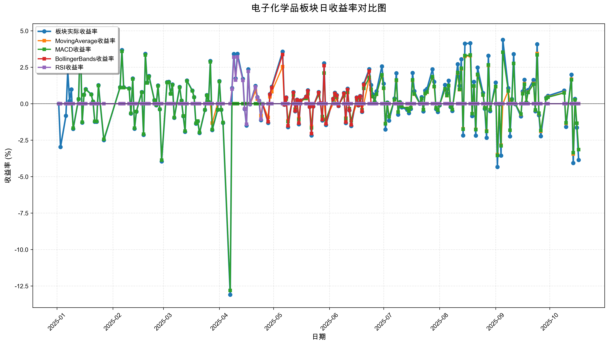
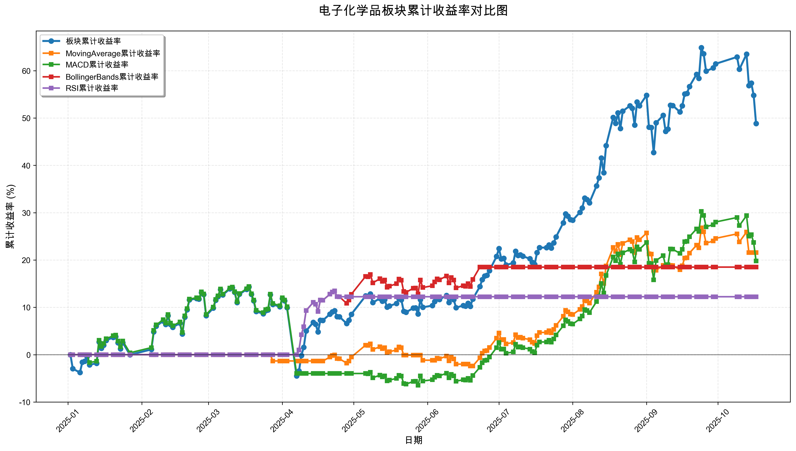

# 策略回测结果报告

**生成时间**: 2025-10-19 19:07:52
**行业板块**: 电子化学品
**回测期间**: 20250101 至 20251017
**策略数量**: 4

## 📈 分析结论

### 策略表现分析
- **最佳策略**: MovingAverage (总收益率: 21.57%)
- **最差策略**: RSI (总收益率: 12.24%)
### 交易活跃度分析
- **活跃策略**: 4 个
- **非活跃策略**: 0 个
- **最活跃策略**: MovingAverage (交易次数: 16)
### 🚨 异动提醒分析
- **板块异动**: 电子化学品 近两周出现大幅波动 (最大单日: 4.08%)
- **板块异动**: 电子化学品 近两周波动频繁 (方向变化频率: 64.3%)
- **策略异动**: MovingAverage 近两周出现大幅波动 (最大单日: 3.45%)
- **策略异动**: MACD 近两周出现大幅波动 (最大单日: 3.36%)
### 风险分析
- **MovingAverage**: 最大回撤 -6.27%, 夏普比率 1.9910
- **MACD**: 最大回撤 -18.25%, 夏普比率 1.0454
- **BollingerBands**: 最大回撤 -3.52%, 夏普比率 2.3819
- **RSI**: 最大回撤 -1.76%, 夏普比率 2.3939

## 📊 综合结果表

| 策略名称           | 初始资金     | 最终价值     | 总收益率   | 年化收益率   | 波动率    |   夏普比率 | 最大回撤    | 总交易次数   | 买入次数   | 卖出次数   | 总交易金额      | 平均交易金额   | 交易频率   |   数据点数 |
|:---------------|:---------|:---------|:-------|:--------|:-------|-------:|:--------|:--------|:-------|:-------|:-----------|:---------|:-------|-------:|
| 板块实际表现         | ¥100,000 | ¥148,818 | 48.82% | 69.43%  | 30.45% | 2.2804 | -16.44% | N/A     | N/A    | N/A    | N/A        | N/A      | N/A    |    190 |
| MovingAverage  | ¥100,000 | ¥121,568 | 21.57% | 29.57%  | 14.85% | 1.991  | -6.27%  | 16      | 8      | 8      | ¥1,284,200 | ¥80,262  | 0.08   |    190 |
| MACD           | ¥100,000 | ¥119,786 | 19.79% | 27.06%  | 25.88% | 1.0454 | -18.25% | 3       | 2      | 1      | ¥264,431   | ¥88,144  | 0.02   |    190 |
| BollingerBands | ¥100,000 | ¥118,498 | 18.50% | 25.25%  | 10.60% | 2.3819 | -3.52%  | 3       | 2      | 1      | ¥302,715   | ¥100,905 | 0.02   |    190 |
| RSI            | ¥100,000 | ¥112,241 | 12.24% | 16.55%  | 6.91%  | 2.3939 | -1.76%  | 2       | 1      | 1      | ¥199,304   | ¥99,652  | 0.01   |    190 |

## 📊 每日收益率走势图

*图1: 电子化学品板块每日收益率走势对比*

## 📈 累计收益率走势图

*图2: 电子化学品板块累计收益率走势对比*

## 📅 日收益明细表

| 日期         | 板块实际收益率   | MovingAverage收益率   | MACD收益率   | BollingerBands收益率   | RSI收益率   |
|:-----------|:----------|:-------------------|:----------|:--------------------|:---------|
| 2025-01-02 | 0.00%     | 0.00%              | 0.00%     | 0.00%               | 0.00%    |
| 2025-01-03 | -2.97%    | 0.00%              | 0.00%     | 0.00%               | 0.00%    |
| 2025-01-06 | -0.83%    | 0.00%              | 0.00%     | 0.00%               | 0.00%    |
| 2025-01-07 | 2.29%     | 0.00%              | 0.00%     | 0.00%               | 0.00%    |
| 2025-01-08 | 0.18%     | 0.00%              | 0.00%     | 0.00%               | 0.00%    |
| 2025-01-09 | 0.98%     | 0.00%              | 0.00%     | 0.00%               | 0.00%    |
| 2025-01-10 | -1.73%    | 0.00%              | -1.68%    | 0.00%               | 0.00%    |
| 2025-01-13 | 0.32%     | 0.00%              | 0.31%     | 0.00%               | 0.00%    |
| 2025-01-14 | 4.61%     | 0.00%              | 4.50%     | 0.00%               | 0.00%    |
| 2025-01-15 | -1.30%    | 0.00%              | -1.27%    | 0.00%               | 0.00%    |
| 2025-01-16 | 0.62%     | 0.00%              | 0.60%     | 0.00%               | 0.00%    |
| 2025-01-17 | 1.00%     | 0.00%              | 0.97%     | 0.00%               | 0.00%    |
| 2025-01-20 | 0.64%     | 0.00%              | 0.63%     | 0.00%               | 0.00%    |
| 2025-01-21 | 0.14%     | 0.00%              | 0.14%     | 0.00%               | 0.00%    |
| 2025-01-22 | -1.24%    | 0.00%              | -1.21%    | 0.00%               | 0.00%    |
| 2025-01-23 | -1.24%    | 0.00%              | -1.21%    | 0.00%               | 0.00%    |
| 2025-01-24 | 1.27%     | 0.00%              | 1.24%     | 0.00%               | 0.00%    |
| 2025-01-27 | -2.50%    | 0.00%              | -2.44%    | 0.00%               | 0.00%    |
| 2025-02-05 | 1.13%     | 0.00%              | 1.10%     | 0.00%               | 0.00%    |
| 2025-02-06 | 3.68%     | 0.00%              | 3.59%     | 0.00%               | 0.00%    |
| 2025-02-07 | 1.13%     | 0.00%              | 1.10%     | 0.00%               | 0.00%    |
| 2025-02-10 | 1.05%     | 0.00%              | 1.03%     | 0.00%               | 0.00%    |
| 2025-02-11 | -0.68%    | 0.00%              | -0.66%    | 0.00%               | 0.00%    |
| 2025-02-12 | 1.73%     | 0.00%              | 1.69%     | 0.00%               | 0.00%    |
| 2025-02-13 | -1.72%    | 0.00%              | -1.68%    | 0.00%               | 0.00%    |
| 2025-02-14 | -0.55%    | 0.00%              | -0.54%    | 0.00%               | 0.00%    |
| 2025-02-17 | 0.80%     | 0.00%              | 0.78%     | 0.00%               | 0.00%    |
| 2025-02-18 | -2.14%    | 0.00%              | -2.09%    | 0.00%               | 0.00%    |
| 2025-02-19 | 3.42%     | 0.00%              | 3.34%     | 0.00%               | 0.00%    |
| 2025-02-20 | 1.46%     | 0.00%              | 1.42%     | 0.00%               | 0.00%    |
| 2025-02-21 | 1.90%     | 0.00%              | 1.86%     | 0.00%               | 0.00%    |
| 2025-02-24 | 0.24%     | 0.00%              | 0.23%     | 0.00%               | 0.00%    |
| 2025-02-25 | -0.11%    | 0.00%              | -0.10%    | 0.00%               | 0.00%    |
| 2025-02-26 | 1.25%     | 0.00%              | 1.22%     | 0.00%               | 0.00%    |
| 2025-02-27 | -0.39%    | 0.00%              | -0.38%    | 0.00%               | 0.00%    |
| 2025-02-28 | -3.96%    | 0.00%              | -3.87%    | 0.00%               | 0.00%    |
| 2025-03-03 | 1.48%     | 0.00%              | 1.45%     | 0.00%               | 0.00%    |
| 2025-03-04 | 1.50%     | 0.00%              | 1.47%     | 0.00%               | 0.00%    |
| 2025-03-05 | 0.69%     | 0.00%              | 0.67%     | 0.00%               | 0.00%    |
| 2025-03-06 | 1.32%     | 0.00%              | 1.29%     | 0.00%               | 0.00%    |
| 2025-03-07 | -0.97%    | 0.00%              | -0.95%    | 0.00%               | 0.00%    |
| 2025-03-10 | 1.15%     | 0.00%              | 1.12%     | 0.00%               | 0.00%    |
| 2025-03-11 | 0.21%     | 0.00%              | 0.20%     | 0.00%               | 0.00%    |
| 2025-03-12 | -0.86%    | 0.00%              | -0.84%    | 0.00%               | 0.00%    |
| 2025-03-13 | -1.93%    | 0.00%              | -1.88%    | 0.00%               | 0.00%    |
| 2025-03-14 | 1.59%     | 0.00%              | 1.56%     | 0.00%               | 0.00%    |
| 2025-03-17 | 0.90%     | 0.00%              | 0.88%     | 0.00%               | 0.00%    |
| 2025-03-18 | 0.45%     | 0.00%              | 0.44%     | 0.00%               | 0.00%    |
| 2025-03-19 | -1.37%    | 0.00%              | -1.34%    | 0.00%               | 0.00%    |
| 2025-03-20 | -1.21%    | 0.00%              | -1.19%    | 0.00%               | 0.00%    |
| 2025-03-21 | -2.01%    | 0.00%              | -1.97%    | 0.00%               | 0.00%    |
| 2025-03-24 | -0.43%    | 0.00%              | -0.42%    | 0.00%               | 0.00%    |
| 2025-03-25 | 0.59%     | 0.00%              | 0.57%     | 0.00%               | 0.00%    |
| 2025-03-26 | 0.12%     | 0.00%              | 0.12%     | 0.00%               | 0.00%    |
| 2025-03-27 | 2.93%     | 0.00%              | 2.87%     | 0.00%               | 0.00%    |
| 2025-03-28 | -1.81%    | -1.33%             | -1.77%    | 0.00%               | 0.00%    |
| 2025-03-31 | -0.42%    | 0.00%              | -0.41%    | 0.00%               | 0.00%    |
| 2025-04-01 | 1.55%     | 0.00%              | 1.52%     | 0.00%               | 0.00%    |
| 2025-04-02 | -0.42%    | 0.00%              | -0.41%    | 0.00%               | 0.00%    |
| 2025-04-03 | -1.32%    | 0.00%              | -1.29%    | 0.00%               | 0.00%    |
| 2025-04-07 | -13.10%   | 0.00%              | -12.81%   | 0.00%               | 0.00%    |
| 2025-04-08 | 1.07%     | 0.00%              | 0.00%     | 1.00%               | 1.00%    |
| 2025-04-09 | 3.41%     | 0.00%              | 0.00%     | 3.19%               | 3.19%    |
| 2025-04-10 | 1.73%     | 0.00%              | 0.00%     | 1.62%               | 1.62%    |
| 2025-04-11 | 3.42%     | 0.00%              | 0.00%     | 3.21%               | 3.21%    |
| 2025-04-14 | 1.70%     | 0.00%              | 0.00%     | 1.60%               | 1.60%    |
| 2025-04-15 | -0.37%    | 0.00%              | 0.00%     | -0.35%              | -0.35%   |
| 2025-04-16 | -1.50%    | 0.00%              | 0.00%     | -1.41%              | -1.41%   |
| 2025-04-17 | 2.36%     | 0.00%              | 0.00%     | 2.22%               | 2.22%    |
| 2025-04-18 | -0.04%    | -0.03%             | 0.00%     | -0.04%              | -0.04%   |
| 2025-04-21 | 1.22%     | 0.87%              | 0.00%     | 1.15%               | 1.15%    |
| 2025-04-22 | 0.45%     | 0.32%              | 0.00%     | 0.42%               | 0.42%    |
| 2025-04-23 | 0.21%     | 0.15%              | 0.00%     | 0.20%               | 0.20%    |
| 2025-04-24 | -1.13%    | -0.81%             | 0.00%     | -1.06%              | -1.06%   |
| 2025-04-25 | -0.02%    | -0.02%             | 0.00%     | -0.02%              | -0.02%   |
| 2025-04-28 | -1.32%    | -0.94%             | 0.00%     | -1.24%              | 0.00%    |
| 2025-04-29 | 0.66%     | 0.47%              | 0.00%     | 0.62%               | 0.00%    |
| 2025-04-30 | 1.16%     | 0.82%              | 0.00%     | 1.09%               | 0.00%    |
| 2025-05-06 | 3.57%     | 2.54%              | 0.00%     | 3.37%               | 0.00%    |
| 2025-05-07 | -0.07%    | -0.05%             | -0.05%    | -0.07%              | 0.00%    |
| 2025-05-08 | 0.43%     | 0.31%              | 0.33%     | 0.41%               | 0.00%    |
| 2025-05-09 | -1.61%    | -1.16%             | -1.23%    | -1.52%              | 0.00%    |
| 2025-05-12 | 0.80%     | 0.58%              | 0.61%     | 0.76%               | 0.00%    |
| 2025-05-13 | -0.52%    | -0.37%             | -0.40%    | -0.49%              | 0.00%    |
| 2025-05-14 | 0.28%     | 0.20%              | 0.21%     | 0.26%               | 0.00%    |
| 2025-05-15 | -1.41%    | -1.01%             | -1.08%    | -1.33%              | 0.00%    |
| 2025-05-16 | 0.22%     | 0.16%              | 0.17%     | 0.21%               | 0.00%    |
| 2025-05-19 | 0.49%     | 0.35%              | 0.37%     | 0.46%               | 0.00%    |
| 2025-05-20 | 0.92%     | 0.66%              | 0.70%     | 0.87%               | 0.00%    |
| 2025-05-21 | -0.22%    | -0.16%             | -0.17%    | -0.21%              | 0.00%    |
| 2025-05-22 | -2.18%    | -1.56%             | -1.66%    | -2.05%              | 0.00%    |
| 2025-05-23 | -0.19%    | 0.00%              | -0.14%    | -0.18%              | 0.00%    |
| 2025-05-26 | 0.80%     | 0.00%              | 0.61%     | 0.76%               | 0.00%    |
| 2025-05-27 | 0.04%     | 0.00%              | 0.03%     | 0.04%               | 0.00%    |
| 2025-05-28 | -1.15%    | 0.00%              | -0.88%    | -1.09%              | 0.00%    |
| 2025-05-29 | 2.77%     | 0.00%              | 2.10%     | 2.61%               | 0.00%    |
| 2025-05-30 | -1.46%    | -1.06%             | -1.11%    | -1.38%              | 0.00%    |
| 2025-06-03 | 0.34%     | 0.00%              | 0.26%     | 0.32%               | 0.00%    |
| 2025-06-04 | 0.75%     | 0.00%              | 0.57%     | 0.70%               | 0.00%    |
| 2025-06-05 | 0.59%     | 0.43%              | 0.45%     | 0.55%               | 0.00%    |
| 2025-06-06 | -0.16%    | -0.12%             | -0.12%    | -0.15%              | 0.00%    |
| 2025-06-09 | 0.74%     | 0.54%              | 0.57%     | 0.70%               | 0.00%    |
| 2025-06-10 | -1.33%    | -0.98%             | -1.02%    | -1.26%              | 0.00%    |
| 2025-06-11 | 1.03%     | 0.76%              | 0.79%     | 0.97%               | 0.00%    |
| 2025-06-12 | -0.46%    | -0.34%             | -0.35%    | -0.43%              | 0.00%    |
| 2025-06-13 | -1.53%    | -1.13%             | -1.17%    | -1.45%              | 0.00%    |
| 2025-06-16 | 0.43%     | 0.00%              | 0.33%     | 0.41%               | 0.00%    |
| 2025-06-17 | -0.12%    | 0.00%              | -0.09%    | -0.11%              | 0.00%    |
| 2025-06-18 | 0.53%     | 0.00%              | 0.40%     | 0.50%               | 0.00%    |
| 2025-06-19 | -0.56%    | -0.41%             | -0.42%    | -0.52%              | 0.00%    |
| 2025-06-20 | 1.37%     | 0.00%              | 1.05%     | 1.30%               | 0.00%    |
| 2025-06-23 | 2.37%     | 1.77%              | 1.81%     | 2.24%               | 0.00%    |
| 2025-06-24 | 1.28%     | 0.97%              | 0.99%     | 0.00%               | 0.00%    |
| 2025-06-25 | 0.64%     | 0.48%              | 0.49%     | 0.00%               | 0.00%    |
| 2025-06-26 | 0.13%     | 0.10%              | 0.10%     | 0.00%               | 0.00%    |
| 2025-06-27 | 0.85%     | 0.64%              | 0.65%     | 0.00%               | 0.00%    |
| 2025-06-30 | 2.56%     | 1.94%              | 1.98%     | 0.00%               | 0.00%    |
| 2025-07-01 | 1.37%     | 1.05%              | 1.07%     | 0.00%               | 0.00%    |
| 2025-07-02 | -1.77%    | -1.36%             | -1.38%    | 0.00%               | 0.00%    |
| 2025-07-03 | 0.08%     | 0.06%              | 0.06%     | 0.00%               | 0.00%    |
| 2025-07-04 | -1.16%    | -0.88%             | -0.90%    | 0.00%               | 0.00%    |
| 2025-07-07 | 0.36%     | 0.27%              | 0.28%     | 0.00%               | 0.00%    |
| 2025-07-08 | 2.09%     | 1.59%              | 1.62%     | 0.00%               | 0.00%    |
| 2025-07-09 | -0.75%    | -0.57%             | -0.58%    | 0.00%               | 0.00%    |
| 2025-07-10 | 0.11%     | 0.09%              | 0.09%     | 0.00%               | 0.00%    |
| 2025-07-11 | -0.25%    | -0.19%             | -0.19%    | 0.00%               | 0.00%    |
| 2025-07-14 | -0.42%    | -0.32%             | -0.33%    | 0.00%               | 0.00%    |
| 2025-07-15 | -0.65%    | -0.50%             | -0.51%    | 0.00%               | 0.00%    |
| 2025-07-16 | -0.36%    | -0.27%             | -0.28%    | 0.00%               | 0.00%    |
| 2025-07-17 | 2.11%     | 1.60%              | 1.63%     | 0.00%               | 0.00%    |
| 2025-07-18 | 0.86%     | 0.65%              | 0.67%     | 0.00%               | 0.00%    |
| 2025-07-21 | -0.00%    | -0.00%             | -0.00%    | 0.00%               | 0.00%    |
| 2025-07-22 | 0.45%     | 0.35%              | 0.35%     | 0.00%               | 0.00%    |
| 2025-07-23 | -0.53%    | -0.40%             | -0.41%    | 0.00%               | 0.00%    |
| 2025-07-24 | 0.90%     | 0.69%              | 0.70%     | 0.00%               | 0.00%    |
| 2025-07-25 | 1.02%     | 0.78%              | 0.80%     | 0.00%               | 0.00%    |
| 2025-07-28 | 2.36%     | 1.81%              | 1.85%     | 0.00%               | 0.00%    |
| 2025-07-29 | 1.50%     | 1.16%              | 1.18%     | 0.00%               | 0.00%    |
| 2025-07-30 | -0.37%    | -0.29%             | -0.29%    | 0.00%               | 0.00%    |
| 2025-07-31 | -0.57%    | -0.44%             | -0.45%    | 0.00%               | 0.00%    |
| 2025-08-01 | -0.11%    | -0.08%             | -0.08%    | 0.00%               | 0.00%    |
| 2025-08-04 | 1.29%     | 1.00%              | 1.02%     | 0.00%               | 0.00%    |
| 2025-08-05 | 0.71%     | 0.55%              | 0.56%     | 0.00%               | 0.00%    |
| 2025-08-06 | 1.58%     | 1.23%              | 1.25%     | 0.00%               | 0.00%    |
| 2025-08-07 | -0.23%    | -0.18%             | -0.18%    | 0.00%               | 0.00%    |
| 2025-08-08 | -0.50%    | -0.39%             | -0.40%    | 0.00%               | 0.00%    |
| 2025-08-11 | 2.71%     | 2.10%              | 2.14%     | 0.00%               | 0.00%    |
| 2025-08-12 | 1.23%     | 0.96%              | 0.98%     | 0.00%               | 0.00%    |
| 2025-08-13 | 3.05%     | 2.39%              | 2.43%     | 0.00%               | 0.00%    |
| 2025-08-14 | -2.18%    | -1.72%             | -1.75%    | 0.00%               | 0.00%    |
| 2025-08-15 | 4.12%     | 3.24%              | 3.30%     | 0.00%               | 0.00%    |
| 2025-08-18 | 4.15%     | 3.29%              | 3.34%     | 0.00%               | 0.00%    |
| 2025-08-19 | -0.85%    | -0.68%             | -0.69%    | 0.00%               | 0.00%    |
| 2025-08-20 | 1.50%     | 1.20%              | 1.22%     | 0.00%               | 0.00%    |
| 2025-08-21 | -2.19%    | -1.76%             | -1.78%    | 0.00%               | 0.00%    |
| 2025-08-22 | 2.48%     | 1.98%              | 2.01%     | 0.00%               | 0.00%    |
| 2025-08-25 | 0.74%     | 0.59%              | 0.60%     | 0.00%               | 0.00%    |
| 2025-08-26 | -0.35%    | -0.28%             | -0.29%    | 0.00%               | 0.00%    |
| 2025-08-27 | -2.34%    | -1.87%             | -1.90%    | 0.00%               | 0.00%    |
| 2025-08-28 | 3.29%     | 2.62%              | 2.66%     | 0.00%               | 0.00%    |
| 2025-08-29 | -0.51%    | -0.41%             | -0.42%    | 0.00%               | 0.00%    |
| 2025-09-01 | 1.45%     | 1.16%              | 1.18%     | 0.00%               | 0.00%    |
| 2025-09-02 | -4.34%    | -3.49%             | -3.55%    | 0.00%               | 0.00%    |
| 2025-09-03 | -0.05%    | -0.04%             | -0.04%    | 0.00%               | 0.00%    |
| 2025-09-04 | -3.56%    | -2.84%             | -2.89%    | 0.00%               | 0.00%    |
| 2025-09-05 | 4.38%     | 0.00%              | 3.53%     | 0.00%               | 0.00%    |
| 2025-09-08 | 1.07%     | 0.88%              | 0.87%     | 0.00%               | 0.00%    |
| 2025-09-09 | -2.24%    | 0.00%              | -1.82%    | 0.00%               | 0.00%    |
| 2025-09-10 | 0.32%     | 0.00%              | 0.26%     | 0.00%               | 0.00%    |
| 2025-09-11 | 3.40%     | 0.00%              | 2.76%     | 0.00%               | 0.00%    |
| 2025-09-12 | -0.04%    | -0.03%             | -0.03%    | 0.00%               | 0.00%    |
| 2025-09-15 | -0.87%    | -0.73%             | -0.71%    | 0.00%               | 0.00%    |
| 2025-09-16 | 0.84%     | 0.70%              | 0.68%     | 0.00%               | 0.00%    |
| 2025-09-17 | 1.64%     | 1.37%              | 1.33%     | 0.00%               | 0.00%    |
| 2025-09-18 | 0.09%     | 0.08%              | 0.08%     | 0.00%               | 0.00%    |
| 2025-09-19 | 0.94%     | 0.79%              | 0.77%     | 0.00%               | 0.00%    |
| 2025-09-22 | 1.63%     | 1.38%              | 1.34%     | 0.00%               | 0.00%    |
| 2025-09-23 | -0.52%    | -0.44%             | -0.43%    | 0.00%               | 0.00%    |
| 2025-09-24 | 4.08%     | 3.44%              | 3.35%     | 0.00%               | 0.00%    |
| 2025-09-25 | -0.79%    | -0.67%             | -0.65%    | 0.00%               | 0.00%    |
| 2025-09-26 | -2.23%    | -1.89%             | -1.84%    | 0.00%               | 0.00%    |
| 2025-09-29 | 0.42%     | 0.36%              | 0.35%     | 0.00%               | 0.00%    |
| 2025-09-30 | 0.54%     | 0.46%              | 0.44%     | 0.00%               | 0.00%    |
| 2025-10-09 | 0.90%     | 0.76%              | 0.74%     | 0.00%               | 0.00%    |
| 2025-10-10 | -1.59%    | -1.35%             | -1.31%    | 0.00%               | 0.00%    |
| 2025-10-13 | 1.99%     | 1.68%              | 1.64%     | 0.00%               | 0.00%    |
| 2025-10-14 | -4.07%    | -3.45%             | -3.36%    | 0.00%               | 0.00%    |
| 2025-10-15 | 0.33%     | 0.00%              | 0.27%     | 0.00%               | 0.00%    |
| 2025-10-16 | -1.64%    | 0.00%              | -1.34%    | 0.00%               | 0.00%    |
| 2025-10-17 | -3.86%    | 0.00%              | -3.15%    | 0.00%               | 0.00%    |

## 📊 日收益统计摘要

| 指标                | 平均日收益率   | 最大日收益率   | 最小日收益率   | 正收益天数   | 负收益天数   |
|:------------------|:---------|:---------|:---------|:--------|:--------|
| 板块实际收益率           | 0.23%    | 4.61%    | -13.10%  | 109天    | 79天     |
| MovingAverage收益率  | 0.11%    | 3.44%    | -3.49%   | 57天     | 46天     |
| MACD收益率           | 0.11%    | 4.50%    | -12.81%  | 94天     | 71天     |
| BollingerBands收益率 | 0.09%    | 3.37%    | -2.05%   | 30天     | 21天     |
| RSI收益率            | 0.06%    | 3.21%    | -1.41%   | 9天      | 5天      |

## 📈 累计收益明细表

| 日期         | 板块累计收益率   | MovingAverage累计收益率   | MACD累计收益率   | BollingerBands累计收益率   | RSI累计收益率   |
|:-----------|:----------|:---------------------|:------------|:----------------------|:-----------|
| 2025-01-02 | 0.00%     | 0.00%                | 0.00%       | 0.00%                 | 0.00%      |
| 2025-01-03 | -2.97%    | 0.00%                | 0.00%       | 0.00%                 | 0.00%      |
| 2025-01-06 | -3.78%    | 0.00%                | 0.00%       | 0.00%                 | 0.00%      |
| 2025-01-07 | -1.58%    | 0.00%                | 0.00%       | 0.00%                 | 0.00%      |
| 2025-01-08 | -1.40%    | 0.00%                | 0.00%       | 0.00%                 | 0.00%      |
| 2025-01-09 | -0.42%    | 0.00%                | 0.00%       | 0.00%                 | 0.00%      |
| 2025-01-10 | -2.14%    | 0.00%                | -1.68%      | 0.00%                 | 0.00%      |
| 2025-01-13 | -1.83%    | 0.00%                | -1.38%      | 0.00%                 | 0.00%      |
| 2025-01-14 | 2.70%     | 0.00%                | 3.06%       | 0.00%                 | 0.00%      |
| 2025-01-15 | 1.36%     | 0.00%                | 1.75%       | 0.00%                 | 0.00%      |
| 2025-01-16 | 1.99%     | 0.00%                | 2.36%       | 0.00%                 | 0.00%      |
| 2025-01-17 | 3.00%     | 0.00%                | 3.35%       | 0.00%                 | 0.00%      |
| 2025-01-20 | 3.66%     | 0.00%                | 4.00%       | 0.00%                 | 0.00%      |
| 2025-01-21 | 3.81%     | 0.00%                | 4.14%       | 0.00%                 | 0.00%      |
| 2025-01-22 | 2.52%     | 0.00%                | 2.88%       | 0.00%                 | 0.00%      |
| 2025-01-23 | 1.25%     | 0.00%                | 1.64%       | 0.00%                 | 0.00%      |
| 2025-01-24 | 2.53%     | 0.00%                | 2.89%       | 0.00%                 | 0.00%      |
| 2025-01-27 | -0.03%    | 0.00%                | 0.39%       | 0.00%                 | 0.00%      |
| 2025-02-05 | 1.10%     | 0.00%                | 1.49%       | 0.00%                 | 0.00%      |
| 2025-02-06 | 4.82%     | 0.00%                | 5.14%       | 0.00%                 | 0.00%      |
| 2025-02-07 | 6.01%     | 0.00%                | 6.30%       | 0.00%                 | 0.00%      |
| 2025-02-10 | 7.13%     | 0.00%                | 7.39%       | 0.00%                 | 0.00%      |
| 2025-02-11 | 6.40%     | 0.00%                | 6.68%       | 0.00%                 | 0.00%      |
| 2025-02-12 | 8.24%     | 0.00%                | 8.48%       | 0.00%                 | 0.00%      |
| 2025-02-13 | 6.38%     | 0.00%                | 6.67%       | 0.00%                 | 0.00%      |
| 2025-02-14 | 5.80%     | 0.00%                | 6.09%       | 0.00%                 | 0.00%      |
| 2025-02-17 | 6.65%     | 0.00%                | 6.92%       | 0.00%                 | 0.00%      |
| 2025-02-18 | 4.36%     | 0.00%                | 4.69%       | 0.00%                 | 0.00%      |
| 2025-02-19 | 7.93%     | 0.00%                | 8.18%       | 0.00%                 | 0.00%      |
| 2025-02-20 | 9.50%     | 0.00%                | 9.72%       | 0.00%                 | 0.00%      |
| 2025-02-21 | 11.59%    | 0.00%                | 11.76%      | 0.00%                 | 0.00%      |
| 2025-02-24 | 11.85%    | 0.00%                | 12.02%      | 0.00%                 | 0.00%      |
| 2025-02-25 | 11.74%    | 0.00%                | 11.91%      | 0.00%                 | 0.00%      |
| 2025-02-26 | 13.13%    | 0.00%                | 13.27%      | 0.00%                 | 0.00%      |
| 2025-02-27 | 12.69%    | 0.00%                | 12.84%      | 0.00%                 | 0.00%      |
| 2025-02-28 | 8.23%     | 0.00%                | 8.48%       | 0.00%                 | 0.00%      |
| 2025-03-03 | 9.84%     | 0.00%                | 10.05%      | 0.00%                 | 0.00%      |
| 2025-03-04 | 11.49%    | 0.00%                | 11.67%      | 0.00%                 | 0.00%      |
| 2025-03-05 | 12.26%    | 0.00%                | 12.42%      | 0.00%                 | 0.00%      |
| 2025-03-06 | 13.74%    | 0.00%                | 13.87%      | 0.00%                 | 0.00%      |
| 2025-03-07 | 12.63%    | 0.00%                | 12.79%      | 0.00%                 | 0.00%      |
| 2025-03-10 | 13.93%    | 0.00%                | 14.06%      | 0.00%                 | 0.00%      |
| 2025-03-11 | 14.17%    | 0.00%                | 14.29%      | 0.00%                 | 0.00%      |
| 2025-03-12 | 13.19%    | 0.00%                | 13.33%      | 0.00%                 | 0.00%      |
| 2025-03-13 | 11.01%    | 0.00%                | 11.19%      | 0.00%                 | 0.00%      |
| 2025-03-14 | 12.77%    | 0.00%                | 12.92%      | 0.00%                 | 0.00%      |
| 2025-03-17 | 13.79%    | 0.00%                | 13.92%      | 0.00%                 | 0.00%      |
| 2025-03-18 | 14.31%    | 0.00%                | 14.42%      | 0.00%                 | 0.00%      |
| 2025-03-19 | 12.74%    | 0.00%                | 12.89%      | 0.00%                 | 0.00%      |
| 2025-03-20 | 11.37%    | 0.00%                | 11.55%      | 0.00%                 | 0.00%      |
| 2025-03-21 | 9.13%     | 0.00%                | 9.36%       | 0.00%                 | 0.00%      |
| 2025-03-24 | 8.66%     | 0.00%                | 8.90%       | 0.00%                 | 0.00%      |
| 2025-03-25 | 9.30%     | 0.00%                | 9.52%       | 0.00%                 | 0.00%      |
| 2025-03-26 | 9.44%     | 0.00%                | 9.66%       | 0.00%                 | 0.00%      |
| 2025-03-27 | 12.65%    | 0.00%                | 12.80%      | 0.00%                 | 0.00%      |
| 2025-03-28 | 10.60%    | -1.33%               | 10.80%      | 0.00%                 | 0.00%      |
| 2025-03-31 | 10.14%    | -1.33%               | 10.35%      | 0.00%                 | 0.00%      |
| 2025-04-01 | 11.85%    | -1.33%               | 12.02%      | 0.00%                 | 0.00%      |
| 2025-04-02 | 11.38%    | -1.33%               | 11.56%      | 0.00%                 | 0.00%      |
| 2025-04-03 | 9.91%     | -1.33%               | 10.12%      | 0.00%                 | 0.00%      |
| 2025-04-07 | -4.49%    | -1.33%               | -3.98%      | 0.00%                 | 0.00%      |
| 2025-04-08 | -3.46%    | -1.33%               | -3.98%      | 1.00%                 | 1.00%      |
| 2025-04-09 | -0.17%    | -1.33%               | -3.98%      | 4.23%                 | 4.23%      |
| 2025-04-10 | 1.55%     | -1.33%               | -3.98%      | 5.92%                 | 5.92%      |
| 2025-04-11 | 5.02%     | -1.33%               | -3.98%      | 9.31%                 | 9.31%      |
| 2025-04-14 | 6.81%     | -1.33%               | -3.98%      | 11.06%                | 11.06%     |
| 2025-04-15 | 6.41%     | -1.33%               | -3.98%      | 10.67%                | 10.67%     |
| 2025-04-16 | 4.81%     | -1.33%               | -3.98%      | 9.11%                 | 9.11%      |
| 2025-04-17 | 7.29%     | -1.33%               | -3.98%      | 11.53%                | 11.53%     |
| 2025-04-18 | 7.24%     | -1.36%               | -3.98%      | 11.49%                | 11.49%     |
| 2025-04-21 | 8.55%     | -0.51%               | -3.98%      | 12.77%                | 12.77%     |
| 2025-04-22 | 9.04%     | -0.19%               | -3.98%      | 13.24%                | 13.24%     |
| 2025-04-23 | 9.27%     | -0.04%               | -3.98%      | 13.47%                | 13.47%     |
| 2025-04-24 | 8.04%     | -0.84%               | -3.98%      | 12.27%                | 12.27%     |
| 2025-04-25 | 8.01%     | -0.86%               | -3.98%      | 12.24%                | 12.24%     |
| 2025-04-28 | 6.59%     | -1.79%               | -3.98%      | 10.84%                | 12.24%     |
| 2025-04-29 | 7.29%     | -1.33%               | -3.98%      | 11.54%                | 12.24%     |
| 2025-04-30 | 8.54%     | -0.52%               | -3.98%      | 12.76%                | 12.24%     |
| 2025-05-06 | 12.41%    | 2.01%                | -3.98%      | 16.55%                | 12.24%     |
| 2025-05-07 | 12.33%    | 1.96%                | -4.03%      | 16.47%                | 12.24%     |
| 2025-05-08 | 12.82%    | 2.28%                | -3.72%      | 16.95%                | 12.24%     |
| 2025-05-09 | 11.00%    | 1.09%                | -4.90%      | 15.17%                | 12.24%     |
| 2025-05-12 | 11.89%    | 1.67%                | -4.32%      | 16.04%                | 12.24%     |
| 2025-05-13 | 11.31%    | 1.29%                | -4.70%      | 15.47%                | 12.24%     |
| 2025-05-14 | 11.62%    | 1.49%                | -4.50%      | 15.77%                | 12.24%     |
| 2025-05-15 | 10.04%    | 0.47%                | -5.53%      | 14.23%                | 12.24%     |
| 2025-05-16 | 10.29%    | 0.63%                | -5.37%      | 14.47%                | 12.24%     |
| 2025-05-19 | 10.82%    | 0.98%                | -5.02%      | 14.99%                | 12.24%     |
| 2025-05-20 | 11.84%    | 1.64%                | -4.35%      | 15.99%                | 12.24%     |
| 2025-05-21 | 11.59%    | 1.48%                | -4.52%      | 15.75%                | 12.24%     |
| 2025-05-22 | 9.17%     | -0.11%               | -6.10%      | 13.37%                | 12.24%     |
| 2025-05-23 | 8.96%     | -0.11%               | -6.23%      | 13.17%                | 12.24%     |
| 2025-05-26 | 9.84%     | -0.11%               | -5.66%      | 14.03%                | 12.24%     |
| 2025-05-27 | 9.89%     | -0.11%               | -5.63%      | 14.08%                | 12.24%     |
| 2025-05-28 | 8.62%     | -0.11%               | -6.46%      | 12.83%                | 12.24%     |
| 2025-05-29 | 11.63%    | -0.11%               | -4.49%      | 15.78%                | 12.24%     |
| 2025-05-30 | 10.00%    | -1.17%               | -5.56%      | 14.18%                | 12.24%     |
| 2025-06-03 | 10.37%    | -1.17%               | -5.31%      | 14.55%                | 12.24%     |
| 2025-06-04 | 11.20%    | -1.17%               | -4.77%      | 15.36%                | 12.24%     |
| 2025-06-05 | 11.85%    | -0.74%               | -4.35%      | 16.00%                | 12.24%     |
| 2025-06-06 | 11.67%    | -0.86%               | -4.47%      | 15.82%                | 12.24%     |
| 2025-06-09 | 12.50%    | -0.32%               | -3.93%      | 16.63%                | 12.24%     |
| 2025-06-10 | 11.00%    | -1.30%               | -4.90%      | 15.16%                | 12.24%     |
| 2025-06-11 | 12.14%    | -0.55%               | -4.16%      | 16.28%                | 12.24%     |
| 2025-06-12 | 11.63%    | -0.89%               | -4.49%      | 15.78%                | 12.24%     |
| 2025-06-13 | 9.92%     | -2.00%               | -5.61%      | 14.11%                | 12.24%     |
| 2025-06-16 | 10.39%    | -2.00%               | -5.30%      | 14.57%                | 12.24%     |
| 2025-06-17 | 10.26%    | -2.00%               | -5.38%      | 14.45%                | 12.24%     |
| 2025-06-18 | 10.85%    | -2.00%               | -5.00%      | 15.02%                | 12.24%     |
| 2025-06-19 | 10.23%    | -2.41%               | -5.40%      | 14.42%                | 12.24%     |
| 2025-06-20 | 11.75%    | -2.41%               | -4.41%      | 15.90%                | 12.24%     |
| 2025-06-23 | 14.40%    | -0.67%               | -2.68%      | 18.50%                | 12.24%     |
| 2025-06-24 | 15.87%    | 0.29%                | -1.72%      | 18.50%                | 12.24%     |
| 2025-06-25 | 16.61%    | 0.77%                | -1.24%      | 18.50%                | 12.24%     |
| 2025-06-26 | 16.76%    | 0.87%                | -1.14%      | 18.50%                | 12.24%     |
| 2025-06-27 | 17.75%    | 1.51%                | -0.50%      | 18.50%                | 12.24%     |
| 2025-06-30 | 20.76%    | 3.48%                | 1.47%       | 18.50%                | 12.24%     |
| 2025-07-01 | 22.42%    | 4.56%                | 2.55%       | 18.50%                | 12.24%     |
| 2025-07-02 | 20.25%    | 3.14%                | 1.13%       | 18.50%                | 12.24%     |
| 2025-07-03 | 20.35%    | 3.21%                | 1.20%       | 18.50%                | 12.24%     |
| 2025-07-04 | 18.95%    | 2.29%                | 0.29%       | 18.50%                | 12.24%     |
| 2025-07-07 | 19.38%    | 2.57%                | 0.57%       | 18.50%                | 12.24%     |
| 2025-07-08 | 21.87%    | 4.20%                | 2.20%       | 18.50%                | 12.24%     |
| 2025-07-09 | 20.96%    | 3.61%                | 1.60%       | 18.50%                | 12.24%     |
| 2025-07-10 | 21.10%    | 3.70%                | 1.69%       | 18.50%                | 12.24%     |
| 2025-07-11 | 20.79%    | 3.50%                | 1.49%       | 18.50%                | 12.24%     |
| 2025-07-14 | 20.28%    | 3.17%                | 1.16%       | 18.50%                | 12.24%     |
| 2025-07-15 | 19.50%    | 2.65%                | 0.65%       | 18.50%                | 12.24%     |
| 2025-07-16 | 19.07%    | 2.37%                | 0.37%       | 18.50%                | 12.24%     |
| 2025-07-17 | 21.58%    | 4.01%                | 2.00%       | 18.50%                | 12.24%     |
| 2025-07-18 | 22.62%    | 4.69%                | 2.68%       | 18.50%                | 12.24%     |
| 2025-07-21 | 22.62%    | 4.69%                | 2.68%       | 18.50%                | 12.24%     |
| 2025-07-22 | 23.17%    | 5.05%                | 3.04%       | 18.50%                | 12.24%     |
| 2025-07-23 | 22.52%    | 4.63%                | 2.62%       | 18.50%                | 12.24%     |
| 2025-07-24 | 23.63%    | 5.35%                | 3.34%       | 18.50%                | 12.24%     |
| 2025-07-25 | 24.89%    | 6.17%                | 4.17%       | 18.50%                | 12.24%     |
| 2025-07-28 | 27.84%    | 8.10%                | 6.09%       | 18.50%                | 12.24%     |
| 2025-07-29 | 29.76%    | 9.35%                | 7.34%       | 18.50%                | 12.24%     |
| 2025-07-30 | 29.28%    | 9.04%                | 7.03%       | 18.50%                | 12.24%     |
| 2025-07-31 | 28.55%    | 8.56%                | 6.55%       | 18.50%                | 12.24%     |
| 2025-08-01 | 28.41%    | 8.47%                | 6.46%       | 18.50%                | 12.24%     |
| 2025-08-04 | 30.07%    | 9.56%                | 7.55%       | 18.50%                | 12.24%     |
| 2025-08-05 | 31.00%    | 10.16%               | 8.15%       | 18.50%                | 12.24%     |
| 2025-08-06 | 33.07%    | 11.51%               | 9.51%       | 18.50%                | 12.24%     |
| 2025-08-07 | 32.77%    | 11.32%               | 9.31%       | 18.50%                | 12.24%     |
| 2025-08-08 | 32.10%    | 10.88%               | 8.87%       | 18.50%                | 12.24%     |
| 2025-08-11 | 35.68%    | 13.21%               | 11.21%      | 18.50%                | 12.24%     |
| 2025-08-12 | 37.35%    | 14.31%               | 12.30%      | 18.50%                | 12.24%     |
| 2025-08-13 | 41.53%    | 17.04%               | 15.03%      | 18.50%                | 12.24%     |
| 2025-08-14 | 38.45%    | 15.03%               | 13.02%      | 18.50%                | 12.24%     |
| 2025-08-15 | 44.16%    | 18.75%               | 16.75%      | 18.50%                | 12.24%     |
| 2025-08-18 | 50.14%    | 22.66%               | 20.65%      | 18.50%                | 12.24%     |
| 2025-08-19 | 48.87%    | 21.83%               | 19.82%      | 18.50%                | 12.24%     |
| 2025-08-20 | 51.11%    | 23.29%               | 21.28%      | 18.50%                | 12.24%     |
| 2025-08-21 | 47.79%    | 21.13%               | 19.12%      | 18.50%                | 12.24%     |
| 2025-08-22 | 51.46%    | 23.52%               | 21.51%      | 18.50%                | 12.24%     |
| 2025-08-25 | 52.58%    | 24.25%               | 22.24%      | 18.50%                | 12.24%     |
| 2025-08-26 | 52.05%    | 23.90%               | 21.89%      | 18.50%                | 12.24%     |
| 2025-08-27 | 48.50%    | 21.58%               | 19.58%      | 18.50%                | 12.24%     |
| 2025-08-28 | 53.38%    | 24.77%               | 22.76%      | 18.50%                | 12.24%     |
| 2025-08-29 | 52.59%    | 24.26%               | 22.25%      | 18.50%                | 12.24%     |
| 2025-09-01 | 54.80%    | 25.70%               | 23.69%      | 18.50%                | 12.24%     |
| 2025-09-02 | 48.08%    | 21.31%               | 19.30%      | 18.50%                | 12.24%     |
| 2025-09-03 | 48.00%    | 21.26%               | 19.25%      | 18.50%                | 12.24%     |
| 2025-09-04 | 42.73%    | 17.82%               | 15.81%      | 18.50%                | 12.24%     |
| 2025-09-05 | 48.98%    | 17.82%               | 19.89%      | 18.50%                | 12.24%     |
| 2025-09-08 | 50.57%    | 18.86%               | 20.93%      | 18.50%                | 12.24%     |
| 2025-09-09 | 47.20%    | 18.86%               | 18.73%      | 18.50%                | 12.24%     |
| 2025-09-10 | 47.67%    | 18.86%               | 19.04%      | 18.50%                | 12.24%     |
| 2025-09-11 | 52.69%    | 18.86%               | 22.32%      | 18.50%                | 12.24%     |
| 2025-09-12 | 52.64%    | 18.82%               | 22.28%      | 18.50%                | 12.24%     |
| 2025-09-15 | 51.30%    | 17.95%               | 21.41%      | 18.50%                | 12.24%     |
| 2025-09-16 | 52.57%    | 18.78%               | 22.24%      | 18.50%                | 12.24%     |
| 2025-09-17 | 55.07%    | 20.41%               | 23.87%      | 18.50%                | 12.24%     |
| 2025-09-18 | 55.22%    | 20.50%               | 23.96%      | 18.50%                | 12.24%     |
| 2025-09-19 | 56.67%    | 21.46%               | 24.91%      | 18.50%                | 12.24%     |
| 2025-09-22 | 59.23%    | 23.13%               | 26.58%      | 18.50%                | 12.24%     |
| 2025-09-23 | 58.40%    | 22.58%               | 26.04%      | 18.50%                | 12.24%     |
| 2025-09-24 | 64.86%    | 26.80%               | 30.26%      | 18.50%                | 12.24%     |
| 2025-09-25 | 63.56%    | 25.95%               | 29.41%      | 18.50%                | 12.24%     |
| 2025-09-26 | 59.90%    | 23.57%               | 27.02%      | 18.50%                | 12.24%     |
| 2025-09-29 | 60.58%    | 24.01%               | 27.46%      | 18.50%                | 12.24%     |
| 2025-09-30 | 61.45%    | 24.57%               | 28.03%      | 18.50%                | 12.24%     |
| 2025-10-09 | 62.90%    | 25.52%               | 28.98%      | 18.50%                | 12.24%     |
| 2025-10-10 | 60.30%    | 23.83%               | 27.28%      | 18.50%                | 12.24%     |
| 2025-10-13 | 63.50%    | 25.91%               | 29.37%      | 18.50%                | 12.24%     |
| 2025-10-14 | 56.85%    | 21.57%               | 25.03%      | 18.50%                | 12.24%     |
| 2025-10-15 | 57.37%    | 21.57%               | 25.37%      | 18.50%                | 12.24%     |
| 2025-10-16 | 54.79%    | 21.57%               | 23.69%      | 18.50%                | 12.24%     |
| 2025-10-17 | 48.82%    | 21.57%               | 19.79%      | 18.50%                | 12.24%     |

## 📊 累计收益统计摘要

| 指标                  | 最终累计收益率   | 最大累计收益率   | 最小累计收益率   | 累计收益波动   | 收益稳定性   |
|:--------------------|:----------|:----------|:----------|:---------|:--------|
| 板块累计收益率             | 48.82%    | 64.86%    | -4.49%    | 69.35%   | 波动      |
| MovingAverage累计收益率  | 21.57%    | 26.80%    | -2.41%    | 29.21%   | 波动      |
| MACD累计收益率           | 19.79%    | 30.26%    | -6.46%    | 36.72%   | 波动      |
| BollingerBands累计收益率 | 18.50%    | 18.50%    | 0.00%     | 18.50%   | 稳定      |
| RSI累计收益率            | 12.24%    | 13.47%    | 0.00%     | 13.47%   | 稳定      |

