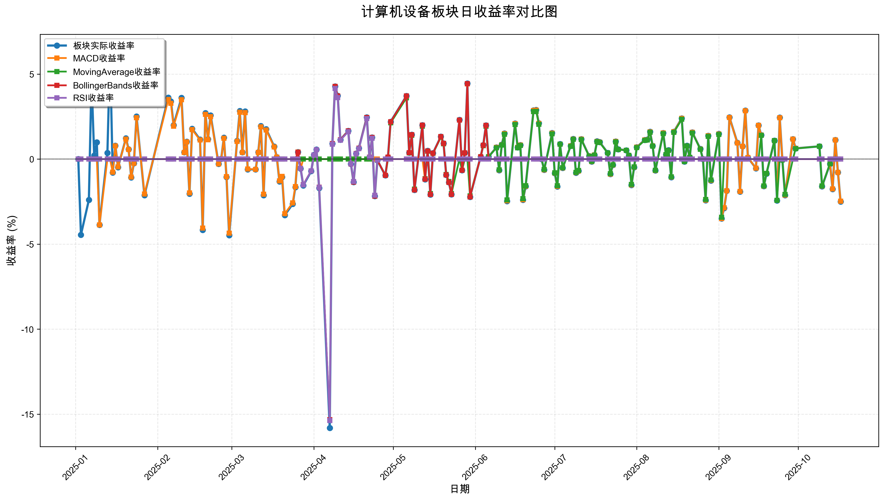
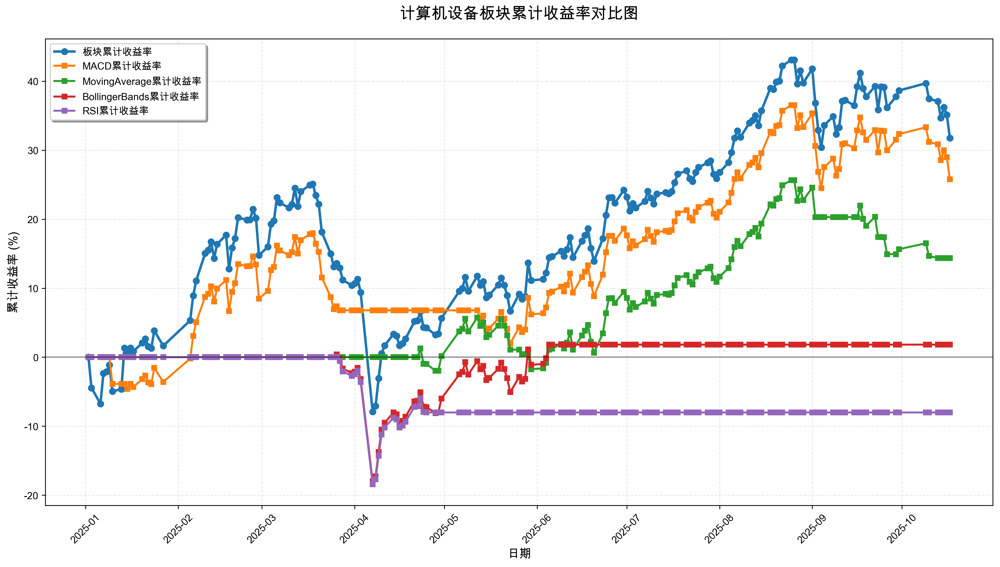

# 策略回测结果报告

**生成时间**: 2025-10-19 19:05:59
**行业板块**: 计算机设备
**回测期间**: 20250101 至 20251017
**策略数量**: 4

## 📈 分析结论

### 策略表现分析
- **最佳策略**: MACD (总收益率: 25.79%)
- **最差策略**: RSI (总收益率: -8.01%)
### 交易活跃度分析
- **活跃策略**: 4 个
- **非活跃策略**: 0 个
- **最活跃策略**: MovingAverage (交易次数: 14)
### 🚨 异动提醒分析
- 未检测到明显异动情况
### 风险分析
- **MACD**: 最大回撤 -13.55%, 夏普比率 1.5151
- **MovingAverage**: 最大回撤 -8.98%, 夏普比率 1.2482
- **BollingerBands**: 最大回撤 -18.34%, 夏普比率 0.1081
- **RSI**: 最大回撤 -18.42%, 夏普比率 -0.5301

## 📊 综合结果表

| 策略名称           | 初始资金     | 最终价值     | 总收益率   | 年化收益率   | 波动率    |    夏普比率 | 最大回撤    | 总交易次数   | 买入次数   | 卖出次数   | 总交易金额      | 平均交易金额   | 交易频率   |   数据点数 |
|:---------------|:---------|:---------|:-------|:--------|:-------|--------:|:--------|:--------|:-------|:-------|:-----------|:---------|:-------|-------:|
| 板块实际表现         | ¥100,000 | ¥131,754 | 31.75% | 44.16%  | 33.69% |  1.3107 | -26.38% | N/A     | N/A    | N/A    | N/A        | N/A      | N/A    |    190 |
| MACD           | ¥100,000 | ¥125,787 | 25.79% | 35.56%  | 23.47% |  1.5151 | -13.55% | 6       | 3      | 3      | ¥623,971   | ¥103,995 | 0.03   |    190 |
| MovingAverage  | ¥100,000 | ¥114,357 | 14.36% | 19.47%  | 15.60% |  1.2482 | -8.98%  | 14      | 7      | 7      | ¥1,496,396 | ¥106,885 | 0.07   |    190 |
| BollingerBands | ¥100,000 | ¥101,816 | 1.82%  | 2.42%   | 22.34% |  0.1081 | -18.34% | 4       | 3      | 1      | ¥302,293   | ¥75,573  | 0.02   |    190 |
| RSI            | ¥100,000 | ¥91,994  | -8.01% | -10.48% | 19.77% | -0.5301 | -18.42% | 2       | 1      | 1      | ¥186,770   | ¥93,385  | 0.01   |    190 |

## 📊 每日收益率走势图

*图1: 计算机设备板块每日收益率走势对比*

## 📈 累计收益率走势图

*图2: 计算机设备板块累计收益率走势对比*

## 📅 日收益明细表

| 日期         | 板块实际收益率   | MACD收益率   | MovingAverage收益率   | BollingerBands收益率   | RSI收益率   |
|:-----------|:----------|:----------|:-------------------|:--------------------|:---------|
| 2025-01-02 | 0.00%     | 0.00%     | 0.00%              | 0.00%               | 0.00%    |
| 2025-01-03 | -4.45%    | 0.00%     | 0.00%              | 0.00%               | 0.00%    |
| 2025-01-06 | -2.40%    | 0.00%     | 0.00%              | 0.00%               | 0.00%    |
| 2025-01-07 | 4.73%     | 0.00%     | 0.00%              | 0.00%               | 0.00%    |
| 2025-01-08 | 0.22%     | 0.00%     | 0.00%              | 0.00%               | 0.00%    |
| 2025-01-09 | 0.99%     | 0.00%     | 0.00%              | 0.00%               | 0.00%    |
| 2025-01-10 | -3.87%    | -3.87%    | 0.00%              | 0.00%               | 0.00%    |
| 2025-01-13 | 0.36%     | 0.00%     | 0.00%              | 0.00%               | 0.00%    |
| 2025-01-14 | 6.24%     | 0.00%     | 0.00%              | 0.00%               | 0.00%    |
| 2025-01-15 | -0.79%    | -0.77%    | 0.00%              | 0.00%               | 0.00%    |
| 2025-01-16 | 0.79%     | 0.77%     | 0.00%              | 0.00%               | 0.00%    |
| 2025-01-17 | -0.48%    | -0.46%    | 0.00%              | 0.00%               | 0.00%    |
| 2025-01-20 | 1.22%     | 1.18%     | 0.00%              | 0.00%               | 0.00%    |
| 2025-01-21 | 0.58%     | 0.56%     | 0.00%              | 0.00%               | 0.00%    |
| 2025-01-22 | -1.08%    | -1.05%    | 0.00%              | 0.00%               | 0.00%    |
| 2025-01-23 | -0.25%    | -0.24%    | 0.00%              | 0.00%               | 0.00%    |
| 2025-01-24 | 2.51%     | 2.43%     | 0.00%              | 0.00%               | 0.00%    |
| 2025-01-27 | -2.12%    | -2.05%    | 0.00%              | 0.00%               | 0.00%    |
| 2025-02-05 | 3.62%     | 3.50%     | 0.00%              | 0.00%               | 0.00%    |
| 2025-02-06 | 3.39%     | 3.28%     | 0.00%              | 0.00%               | 0.00%    |
| 2025-02-07 | 2.00%     | 1.94%     | 0.00%              | 0.00%               | 0.00%    |
| 2025-02-10 | 3.60%     | 3.49%     | 0.00%              | 0.00%               | 0.00%    |
| 2025-02-11 | 0.40%     | 0.39%     | 0.00%              | 0.00%               | 0.00%    |
| 2025-02-12 | 1.03%     | 1.01%     | 0.00%              | 0.00%               | 0.00%    |
| 2025-02-13 | -2.04%    | -1.99%    | 0.00%              | 0.00%               | 0.00%    |
| 2025-02-14 | 1.79%     | 1.74%     | 0.00%              | 0.00%               | 0.00%    |
| 2025-02-17 | 1.15%     | 1.12%     | 0.00%              | 0.00%               | 0.00%    |
| 2025-02-18 | -4.17%    | -4.05%    | 0.00%              | 0.00%               | 0.00%    |
| 2025-02-19 | 2.70%     | 2.63%     | 0.00%              | 0.00%               | 0.00%    |
| 2025-02-20 | 1.18%     | 1.14%     | 0.00%              | 0.00%               | 0.00%    |
| 2025-02-21 | 2.57%     | 2.50%     | 0.00%              | 0.00%               | 0.00%    |
| 2025-02-24 | -0.28%    | -0.28%    | 0.00%              | 0.00%               | 0.00%    |
| 2025-02-25 | 0.02%     | 0.02%     | 0.00%              | 0.00%               | 0.00%    |
| 2025-02-26 | 1.26%     | 1.23%     | 0.00%              | 0.00%               | 0.00%    |
| 2025-02-27 | -1.05%    | -1.03%    | 0.00%              | 0.00%               | 0.00%    |
| 2025-02-28 | -4.48%    | -4.36%    | 0.00%              | 0.00%               | 0.00%    |
| 2025-03-03 | 1.07%     | 1.04%     | 0.00%              | 0.00%               | 0.00%    |
| 2025-03-04 | 2.83%     | 2.75%     | 0.00%              | 0.00%               | 0.00%    |
| 2025-03-05 | 0.40%     | 0.39%     | 0.00%              | 0.00%               | 0.00%    |
| 2025-03-06 | 2.81%     | 2.73%     | 0.00%              | 0.00%               | 0.00%    |
| 2025-03-07 | -0.60%    | -0.58%    | 0.00%              | 0.00%               | 0.00%    |
| 2025-03-10 | -0.61%    | -0.60%    | 0.00%              | 0.00%               | 0.00%    |
| 2025-03-11 | 0.40%     | 0.39%     | 0.00%              | 0.00%               | 0.00%    |
| 2025-03-12 | 1.95%     | 1.90%     | 0.00%              | 0.00%               | 0.00%    |
| 2025-03-13 | -2.12%    | -2.06%    | 0.00%              | 0.00%               | 0.00%    |
| 2025-03-14 | 1.76%     | 1.71%     | 0.00%              | 0.00%               | 0.00%    |
| 2025-03-17 | 0.74%     | 0.72%     | 0.00%              | 0.00%               | 0.00%    |
| 2025-03-18 | 0.12%     | 0.12%     | 0.00%              | 0.00%               | 0.00%    |
| 2025-03-19 | -1.31%    | -1.28%    | 0.00%              | 0.00%               | 0.00%    |
| 2025-03-20 | -1.05%    | -1.02%    | 0.00%              | 0.00%               | 0.00%    |
| 2025-03-21 | -3.30%    | -3.21%    | 0.00%              | 0.00%               | 0.00%    |
| 2025-03-24 | -2.64%    | -2.57%    | 0.00%              | 0.00%               | 0.00%    |
| 2025-03-25 | -1.65%    | -1.61%    | 0.00%              | 0.00%               | 0.00%    |
| 2025-03-26 | 0.42%     | 0.41%     | 0.00%              | 0.40%               | 0.00%    |
| 2025-03-27 | -0.56%    | -0.55%    | 0.00%              | -0.55%              | -0.55%   |
| 2025-03-28 | -1.55%    | 0.00%     | 0.00%              | -1.50%              | -1.51%   |
| 2025-03-31 | -0.71%    | 0.00%     | 0.00%              | -0.69%              | -0.69%   |
| 2025-04-01 | 0.25%     | 0.00%     | 0.00%              | 0.24%               | 0.24%    |
| 2025-04-02 | 0.56%     | 0.00%     | 0.00%              | 0.55%               | 0.55%    |
| 2025-04-03 | -1.70%    | 0.00%     | 0.00%              | -1.65%              | -1.66%   |
| 2025-04-07 | -15.81%   | 0.00%     | 0.00%              | -15.32%             | -15.38%  |
| 2025-04-08 | 0.91%     | 0.00%     | 0.00%              | 0.91%               | 0.88%    |
| 2025-04-09 | 4.28%     | 0.00%     | 0.00%              | 4.27%               | 4.15%    |
| 2025-04-10 | 3.73%     | 0.00%     | 0.00%              | 3.72%               | 3.62%    |
| 2025-04-11 | 1.14%     | 0.00%     | 0.00%              | 1.14%               | 1.11%    |
| 2025-04-14 | 1.66%     | 0.00%     | 0.00%              | 1.66%               | 1.61%    |
| 2025-04-15 | -0.28%    | 0.00%     | 0.00%              | -0.28%              | -0.27%   |
| 2025-04-16 | -1.35%    | 0.00%     | 0.00%              | -1.35%              | -1.31%   |
| 2025-04-17 | 0.33%     | 0.00%     | 0.00%              | 0.33%               | 0.32%    |
| 2025-04-18 | 0.64%     | 0.00%     | 0.00%              | 0.64%               | 0.62%    |
| 2025-04-21 | 2.46%     | 0.00%     | 0.00%              | 2.45%               | 2.38%    |
| 2025-04-22 | 0.11%     | 0.00%     | 0.00%              | 0.11%               | 0.10%    |
| 2025-04-23 | 1.27%     | 0.00%     | 1.27%              | 1.27%               | 1.23%    |
| 2025-04-24 | -2.18%    | 0.00%     | -2.18%             | -2.18%              | -2.12%   |
| 2025-04-25 | -0.07%    | 0.00%     | -0.07%             | -0.06%              | -0.06%   |
| 2025-04-28 | -0.96%    | 0.00%     | -0.95%             | -0.95%              | 0.00%    |
| 2025-04-29 | 0.12%     | 0.00%     | 0.00%              | 0.12%               | 0.00%    |
| 2025-04-30 | 2.20%     | 0.00%     | 2.13%              | 2.19%               | 0.00%    |
| 2025-05-06 | 3.72%     | 0.00%     | 3.60%              | 3.71%               | 0.00%    |
| 2025-05-07 | 0.38%     | 0.00%     | 0.37%              | 0.38%               | 0.00%    |
| 2025-05-08 | 1.44%     | 0.00%     | 1.40%              | 1.44%               | 0.00%    |
| 2025-05-09 | -1.81%    | 0.00%     | -1.76%             | -1.81%              | 0.00%    |
| 2025-05-12 | 2.00%     | 0.00%     | 1.94%              | 2.00%               | 0.00%    |
| 2025-05-13 | -1.19%    | -1.18%    | -1.15%             | -1.18%              | 0.00%    |
| 2025-05-14 | 0.49%     | 0.48%     | 0.47%              | 0.48%               | 0.00%    |
| 2025-05-15 | -2.09%    | -2.07%    | -2.03%             | -2.08%              | 0.00%    |
| 2025-05-16 | 0.35%     | 0.34%     | 0.34%              | 0.35%               | 0.00%    |
| 2025-05-19 | 1.33%     | 1.32%     | 1.29%              | 1.33%               | 0.00%    |
| 2025-05-20 | 0.93%     | 0.92%     | 0.90%              | 0.92%               | 0.00%    |
| 2025-05-21 | -0.93%    | -0.92%    | -0.90%             | -0.93%              | 0.00%    |
| 2025-05-22 | -1.36%    | -1.35%    | -1.32%             | -1.36%              | 0.00%    |
| 2025-05-23 | -2.08%    | -2.07%    | -2.02%             | -2.08%              | 0.00%    |
| 2025-05-26 | 2.31%     | 2.29%     | 0.00%              | 2.30%               | 0.00%    |
| 2025-05-27 | -0.66%    | -0.66%    | -0.66%             | -0.66%              | 0.00%    |
| 2025-05-28 | 0.37%     | 0.37%     | 0.00%              | 0.37%               | 0.00%    |
| 2025-05-29 | 4.45%     | 4.42%     | 0.00%              | 4.44%               | 0.00%    |
| 2025-05-30 | -2.22%    | -2.21%    | -2.16%             | -2.22%              | 0.00%    |
| 2025-06-03 | 0.14%     | 0.14%     | 0.14%              | 0.14%               | 0.00%    |
| 2025-06-04 | 0.82%     | 0.81%     | 0.79%              | 0.81%               | 0.00%    |
| 2025-06-05 | 1.99%     | 1.97%     | 1.93%              | 1.98%               | 0.00%    |
| 2025-06-06 | 0.14%     | 0.14%     | 0.14%              | 0.00%               | 0.00%    |
| 2025-06-09 | 0.69%     | 0.69%     | 0.67%              | 0.00%               | 0.00%    |
| 2025-06-10 | -0.65%    | -0.64%    | -0.63%             | 0.00%               | 0.00%    |
| 2025-06-11 | 0.85%     | 0.84%     | 0.82%              | 0.00%               | 0.00%    |
| 2025-06-12 | 1.51%     | 1.50%     | 1.46%              | 0.00%               | 0.00%    |
| 2025-06-13 | -2.47%    | -2.45%    | -2.40%             | 0.00%               | 0.00%    |
| 2025-06-16 | 2.09%     | 2.08%     | 2.03%              | 0.00%               | 0.00%    |
| 2025-06-17 | 0.69%     | 0.69%     | 0.67%              | 0.00%               | 0.00%    |
| 2025-06-18 | 0.83%     | 0.82%     | 0.80%              | 0.00%               | 0.00%    |
| 2025-06-19 | -2.40%    | -2.39%    | -2.33%             | 0.00%               | 0.00%    |
| 2025-06-20 | -1.60%    | -1.59%    | -1.56%             | 0.00%               | 0.00%    |
| 2025-06-23 | 2.87%     | 2.85%     | 2.79%              | 0.00%               | 0.00%    |
| 2025-06-24 | 2.89%     | 2.88%     | 2.81%              | 0.00%               | 0.00%    |
| 2025-06-25 | 2.11%     | 2.09%     | 2.05%              | 0.00%               | 0.00%    |
| 2025-06-26 | 0.01%     | 0.01%     | 0.01%              | 0.00%               | 0.00%    |
| 2025-06-27 | -0.63%    | -0.63%    | -0.61%             | 0.00%               | 0.00%    |
| 2025-06-30 | 1.53%     | 1.52%     | 1.49%              | 0.00%               | 0.00%    |
| 2025-07-01 | -0.83%    | -0.82%    | -0.80%             | 0.00%               | 0.00%    |
| 2025-07-02 | -1.61%    | -1.60%    | -1.57%             | 0.00%               | 0.00%    |
| 2025-07-03 | 0.89%     | 0.88%     | 0.87%              | 0.00%               | 0.00%    |
| 2025-07-04 | -0.52%    | -0.52%    | -0.51%             | 0.00%               | 0.00%    |
| 2025-07-07 | 0.77%     | 0.77%     | 0.75%              | 0.00%               | 0.00%    |
| 2025-07-08 | 1.19%     | 1.18%     | 1.16%              | 0.00%               | 0.00%    |
| 2025-07-09 | -0.80%    | -0.79%    | -0.78%             | 0.00%               | 0.00%    |
| 2025-07-10 | -0.69%    | -0.69%    | -0.67%             | 0.00%               | 0.00%    |
| 2025-07-11 | 1.18%     | 1.17%     | 1.15%              | 0.00%               | 0.00%    |
| 2025-07-14 | 0.18%     | 0.18%     | 0.17%              | 0.00%               | 0.00%    |
| 2025-07-15 | -0.14%    | -0.14%    | -0.13%             | 0.00%               | 0.00%    |
| 2025-07-16 | 0.24%     | 0.24%     | 0.23%              | 0.00%               | 0.00%    |
| 2025-07-17 | 1.05%     | 1.04%     | 1.02%              | 0.00%               | 0.00%    |
| 2025-07-18 | 1.00%     | 0.99%     | 0.97%              | 0.00%               | 0.00%    |
| 2025-07-21 | 0.37%     | 0.36%     | 0.36%              | 0.00%               | 0.00%    |
| 2025-07-22 | -0.88%    | -0.88%    | -0.86%             | 0.00%               | 0.00%    |
| 2025-07-23 | -0.34%    | -0.34%    | -0.33%             | 0.00%               | 0.00%    |
| 2025-07-24 | 1.04%     | 1.04%     | 1.01%              | 0.00%               | 0.00%    |
| 2025-07-25 | 0.58%     | 0.57%     | 0.56%              | 0.00%               | 0.00%    |
| 2025-07-28 | 0.52%     | 0.52%     | 0.51%              | 0.00%               | 0.00%    |
| 2025-07-29 | 0.22%     | 0.22%     | 0.22%              | 0.00%               | 0.00%    |
| 2025-07-30 | -1.53%    | -1.52%    | -1.49%             | 0.00%               | 0.00%    |
| 2025-07-31 | -0.48%    | -0.47%    | -0.46%             | 0.00%               | 0.00%    |
| 2025-08-01 | 0.70%     | 0.70%     | 0.68%              | 0.00%               | 0.00%    |
| 2025-08-04 | 1.13%     | 1.12%     | 1.10%              | 0.00%               | 0.00%    |
| 2025-08-05 | 1.15%     | 1.14%     | 1.12%              | 0.00%               | 0.00%    |
| 2025-08-06 | 1.61%     | 1.60%     | 1.57%              | 0.00%               | 0.00%    |
| 2025-08-07 | 0.78%     | 0.78%     | 0.76%              | 0.00%               | 0.00%    |
| 2025-08-08 | -0.67%    | -0.67%    | -0.66%             | 0.00%               | 0.00%    |
| 2025-08-11 | 1.54%     | 1.53%     | 1.50%              | 0.00%               | 0.00%    |
| 2025-08-12 | 0.27%     | 0.27%     | 0.27%              | 0.00%               | 0.00%    |
| 2025-08-13 | 0.53%     | 0.52%     | 0.51%              | 0.00%               | 0.00%    |
| 2025-08-14 | -1.07%    | -1.06%    | -1.04%             | 0.00%               | 0.00%    |
| 2025-08-15 | 1.61%     | 1.61%     | 1.57%              | 0.00%               | 0.00%    |
| 2025-08-18 | 2.40%     | 2.39%     | 2.34%              | 0.00%               | 0.00%    |
| 2025-08-19 | -0.14%    | -0.14%    | -0.14%             | 0.00%               | 0.00%    |
| 2025-08-20 | 0.79%     | 0.78%     | 0.77%              | 0.00%               | 0.00%    |
| 2025-08-21 | 0.10%     | 0.10%     | 0.10%              | 0.00%               | 0.00%    |
| 2025-08-22 | 1.57%     | 1.57%     | 1.54%              | 0.00%               | 0.00%    |
| 2025-08-25 | 0.60%     | 0.59%     | 0.58%              | 0.00%               | 0.00%    |
| 2025-08-26 | -0.00%    | -0.00%    | -0.00%             | 0.00%               | 0.00%    |
| 2025-08-27 | -2.43%    | -2.41%    | -2.37%             | 0.00%               | 0.00%    |
| 2025-08-28 | 1.37%     | 1.37%     | 1.34%              | 0.00%               | 0.00%    |
| 2025-08-29 | -1.26%    | -1.25%    | -1.23%             | 0.00%               | 0.00%    |
| 2025-09-01 | 1.48%     | 1.47%     | 1.45%              | 0.00%               | 0.00%    |
| 2025-09-02 | -3.50%    | -3.49%    | -3.42%             | 0.00%               | 0.00%    |
| 2025-09-03 | -2.88%    | -2.86%    | 0.00%              | 0.00%               | 0.00%    |
| 2025-09-04 | -1.87%    | -1.86%    | 0.00%              | 0.00%               | 0.00%    |
| 2025-09-05 | 2.46%     | 2.45%     | 0.00%              | 0.00%               | 0.00%    |
| 2025-09-08 | 0.96%     | 0.95%     | 0.00%              | 0.00%               | 0.00%    |
| 2025-09-09 | -1.91%    | -1.90%    | 0.00%              | 0.00%               | 0.00%    |
| 2025-09-10 | 0.75%     | 0.75%     | 0.00%              | 0.00%               | 0.00%    |
| 2025-09-11 | 2.85%     | 2.84%     | 0.00%              | 0.00%               | 0.00%    |
| 2025-09-12 | 0.09%     | 0.09%     | 0.00%              | 0.00%               | 0.00%    |
| 2025-09-15 | -0.54%    | -0.53%    | 0.00%              | 0.00%               | 0.00%    |
| 2025-09-16 | 1.99%     | 1.98%     | 0.00%              | 0.00%               | 0.00%    |
| 2025-09-17 | 1.41%     | 1.41%     | 1.40%              | 0.00%               | 0.00%    |
| 2025-09-18 | -1.59%    | -1.59%    | -1.58%             | 0.00%               | 0.00%    |
| 2025-09-19 | -0.85%    | -0.84%    | -0.84%             | 0.00%               | 0.00%    |
| 2025-09-22 | 1.09%     | 1.09%     | 1.09%              | 0.00%               | 0.00%    |
| 2025-09-23 | -2.44%    | -2.42%    | -2.42%             | 0.00%               | 0.00%    |
| 2025-09-24 | 2.44%     | 2.43%     | 0.00%              | 0.00%               | 0.00%    |
| 2025-09-25 | -0.04%    | -0.04%    | -0.04%             | 0.00%               | 0.00%    |
| 2025-09-26 | -2.12%    | -2.11%    | -2.08%             | 0.00%               | 0.00%    |
| 2025-09-29 | 1.18%     | 1.17%     | 0.00%              | 0.00%               | 0.00%    |
| 2025-09-30 | 0.63%     | 0.63%     | 0.62%              | 0.00%               | 0.00%    |
| 2025-10-09 | 0.75%     | 0.75%     | 0.75%              | 0.00%               | 0.00%    |
| 2025-10-10 | -1.60%    | -1.59%    | -1.58%             | 0.00%               | 0.00%    |
| 2025-10-13 | -0.28%    | -0.27%    | -0.27%             | 0.00%               | 0.00%    |
| 2025-10-14 | -1.76%    | -1.75%    | 0.00%              | 0.00%               | 0.00%    |
| 2025-10-15 | 1.13%     | 1.13%     | 0.00%              | 0.00%               | 0.00%    |
| 2025-10-16 | -0.78%    | -0.78%    | 0.00%              | 0.00%               | 0.00%    |
| 2025-10-17 | -2.50%    | -2.48%    | 0.00%              | 0.00%               | 0.00%    |

## 📊 日收益统计摘要

| 指标                | 平均日收益率   | 最大日收益率   | 最小日收益率   | 正收益天数   | 负收益天数   |
|:------------------|:---------|:---------|:---------|:--------|:--------|
| 板块实际收益率           | 0.17%    | 6.24%    | -15.81%  | 114天    | 74天     |
| MACD收益率           | 0.13%    | 4.42%    | -4.36%   | 91天     | 62天     |
| MovingAverage收益率  | 0.08%    | 3.60%    | -3.42%   | 58天     | 39天     |
| BollingerBands收益率 | 0.02%    | 4.44%    | -15.32%  | 29天     | 18天     |
| RSI收益率            | -0.04%   | 4.15%    | -15.38%  | 12天     | 9天      |

## 📈 累计收益明细表

| 日期         | 板块累计收益率   | MACD累计收益率   | MovingAverage累计收益率   | BollingerBands累计收益率   | RSI累计收益率   |
|:-----------|:----------|:------------|:---------------------|:----------------------|:-----------|
| 2025-01-02 | 0.00%     | 0.00%       | 0.00%                | 0.00%                 | 0.00%      |
| 2025-01-03 | -4.45%    | 0.00%       | 0.00%                | 0.00%                 | 0.00%      |
| 2025-01-06 | -6.74%    | 0.00%       | 0.00%                | 0.00%                 | 0.00%      |
| 2025-01-07 | -2.33%    | 0.00%       | 0.00%                | 0.00%                 | 0.00%      |
| 2025-01-08 | -2.11%    | 0.00%       | 0.00%                | 0.00%                 | 0.00%      |
| 2025-01-09 | -1.14%    | 0.00%       | 0.00%                | 0.00%                 | 0.00%      |
| 2025-01-10 | -4.96%    | -3.87%      | 0.00%                | 0.00%                 | 0.00%      |
| 2025-01-13 | -4.62%    | -3.87%      | 0.00%                | 0.00%                 | 0.00%      |
| 2025-01-14 | 1.33%     | -3.87%      | 0.00%                | 0.00%                 | 0.00%      |
| 2025-01-15 | 0.53%     | -4.60%      | 0.00%                | 0.00%                 | 0.00%      |
| 2025-01-16 | 1.32%     | -3.87%      | 0.00%                | 0.00%                 | 0.00%      |
| 2025-01-17 | 0.84%     | -4.32%      | 0.00%                | 0.00%                 | 0.00%      |
| 2025-01-20 | 2.07%     | -3.18%      | 0.00%                | 0.00%                 | 0.00%      |
| 2025-01-21 | 2.67%     | -2.64%      | 0.00%                | 0.00%                 | 0.00%      |
| 2025-01-22 | 1.56%     | -3.66%      | 0.00%                | 0.00%                 | 0.00%      |
| 2025-01-23 | 1.30%     | -3.90%      | 0.00%                | 0.00%                 | 0.00%      |
| 2025-01-24 | 3.84%     | -1.56%      | 0.00%                | 0.00%                 | 0.00%      |
| 2025-01-27 | 1.64%     | -3.58%      | 0.00%                | 0.00%                 | 0.00%      |
| 2025-02-05 | 5.32%     | -0.20%      | 0.00%                | 0.00%                 | 0.00%      |
| 2025-02-06 | 8.89%     | 3.07%       | 0.00%                | 0.00%                 | 0.00%      |
| 2025-02-07 | 11.07%    | 5.08%       | 0.00%                | 0.00%                 | 0.00%      |
| 2025-02-10 | 15.06%    | 8.75%       | 0.00%                | 0.00%                 | 0.00%      |
| 2025-02-11 | 15.52%    | 9.17%       | 0.00%                | 0.00%                 | 0.00%      |
| 2025-02-12 | 16.72%    | 10.27%      | 0.00%                | 0.00%                 | 0.00%      |
| 2025-02-13 | 14.33%    | 8.08%       | 0.00%                | 0.00%                 | 0.00%      |
| 2025-02-14 | 16.38%    | 9.96%       | 0.00%                | 0.00%                 | 0.00%      |
| 2025-02-17 | 17.71%    | 11.18%      | 0.00%                | 0.00%                 | 0.00%      |
| 2025-02-18 | 12.81%    | 6.68%       | 0.00%                | 0.00%                 | 0.00%      |
| 2025-02-19 | 15.86%    | 9.48%       | 0.00%                | 0.00%                 | 0.00%      |
| 2025-02-20 | 17.22%    | 10.73%      | 0.00%                | 0.00%                 | 0.00%      |
| 2025-02-21 | 20.23%    | 13.50%      | 0.00%                | 0.00%                 | 0.00%      |
| 2025-02-24 | 19.89%    | 13.19%      | 0.00%                | 0.00%                 | 0.00%      |
| 2025-02-25 | 19.92%    | 13.21%      | 0.00%                | 0.00%                 | 0.00%      |
| 2025-02-26 | 21.43%    | 14.60%      | 0.00%                | 0.00%                 | 0.00%      |
| 2025-02-27 | 20.15%    | 13.42%      | 0.00%                | 0.00%                 | 0.00%      |
| 2025-02-28 | 14.77%    | 8.48%       | 0.00%                | 0.00%                 | 0.00%      |
| 2025-03-03 | 16.00%    | 9.61%       | 0.00%                | 0.00%                 | 0.00%      |
| 2025-03-04 | 19.29%    | 12.63%      | 0.00%                | 0.00%                 | 0.00%      |
| 2025-03-05 | 19.76%    | 13.07%      | 0.00%                | 0.00%                 | 0.00%      |
| 2025-03-06 | 23.13%    | 16.16%      | 0.00%                | 0.00%                 | 0.00%      |
| 2025-03-07 | 22.39%    | 15.48%      | 0.00%                | 0.00%                 | 0.00%      |
| 2025-03-10 | 21.64%    | 14.79%      | 0.00%                | 0.00%                 | 0.00%      |
| 2025-03-11 | 22.13%    | 15.24%      | 0.00%                | 0.00%                 | 0.00%      |
| 2025-03-12 | 24.51%    | 17.43%      | 0.00%                | 0.00%                 | 0.00%      |
| 2025-03-13 | 21.87%    | 15.01%      | 0.00%                | 0.00%                 | 0.00%      |
| 2025-03-14 | 24.02%    | 16.98%      | 0.00%                | 0.00%                 | 0.00%      |
| 2025-03-17 | 24.94%    | 17.82%      | 0.00%                | 0.00%                 | 0.00%      |
| 2025-03-18 | 25.09%    | 17.96%      | 0.00%                | 0.00%                 | 0.00%      |
| 2025-03-19 | 23.45%    | 16.46%      | 0.00%                | 0.00%                 | 0.00%      |
| 2025-03-20 | 22.16%    | 15.27%      | 0.00%                | 0.00%                 | 0.00%      |
| 2025-03-21 | 18.13%    | 11.56%      | 0.00%                | 0.00%                 | 0.00%      |
| 2025-03-24 | 15.00%    | 8.69%       | 0.00%                | 0.00%                 | 0.00%      |
| 2025-03-25 | 13.10%    | 6.95%       | 0.00%                | 0.00%                 | 0.00%      |
| 2025-03-26 | 13.58%    | 7.38%       | 0.00%                | 0.40%                 | 0.00%      |
| 2025-03-27 | 12.94%    | 6.79%       | 0.00%                | -0.14%                | -0.55%     |
| 2025-03-28 | 11.19%    | 6.79%       | 0.00%                | -1.64%                | -2.05%     |
| 2025-03-31 | 10.40%    | 6.79%       | 0.00%                | -2.32%                | -2.72%     |
| 2025-04-01 | 10.67%    | 6.79%       | 0.00%                | -2.09%                | -2.49%     |
| 2025-04-02 | 11.29%    | 6.79%       | 0.00%                | -1.55%                | -1.96%     |
| 2025-04-03 | 9.40%     | 6.79%       | 0.00%                | -3.18%                | -3.58%     |
| 2025-04-07 | -7.90%    | 6.79%       | 0.00%                | -18.01%               | -18.42%    |
| 2025-04-08 | -7.07%    | 6.79%       | 0.00%                | -17.27%               | -17.70%    |
| 2025-04-09 | -3.09%    | 6.79%       | 0.00%                | -13.74%               | -14.29%    |
| 2025-04-10 | 0.53%     | 6.79%       | 0.00%                | -10.52%               | -11.19%    |
| 2025-04-11 | 1.68%     | 6.79%       | 0.00%                | -9.51%                | -10.20%    |
| 2025-04-14 | 3.36%     | 6.79%       | 0.00%                | -8.01%                | -8.76%     |
| 2025-04-15 | 3.07%     | 6.79%       | 0.00%                | -8.27%                | -9.01%     |
| 2025-04-16 | 1.68%     | 6.79%       | 0.00%                | -9.50%                | -10.20%    |
| 2025-04-17 | 2.01%     | 6.79%       | 0.00%                | -9.21%                | -9.91%     |
| 2025-04-18 | 2.66%     | 6.79%       | 0.00%                | -8.63%                | -9.36%     |
| 2025-04-21 | 5.18%     | 6.79%       | 0.00%                | -6.39%                | -7.20%     |
| 2025-04-22 | 5.30%     | 6.79%       | 0.00%                | -6.29%                | -7.10%     |
| 2025-04-23 | 6.63%     | 6.79%       | 1.27%                | -5.10%                | -5.95%     |
| 2025-04-24 | 4.31%     | 6.79%       | -0.94%               | -7.17%                | -7.95%     |
| 2025-04-25 | 4.24%     | 6.79%       | -1.00%               | -7.23%                | -8.01%     |
| 2025-04-28 | 3.24%     | 6.79%       | -1.95%               | -8.11%                | -8.01%     |
| 2025-04-29 | 3.37%     | 6.79%       | -1.95%               | -8.00%                | -8.01%     |
| 2025-04-30 | 5.64%     | 6.79%       | 0.14%                | -5.99%                | -8.01%     |
| 2025-05-06 | 9.57%     | 6.79%       | 3.75%                | -2.50%                | -8.01%     |
| 2025-05-07 | 9.99%     | 6.79%       | 4.13%                | -2.13%                | -8.01%     |
| 2025-05-08 | 11.57%    | 6.79%       | 5.59%                | -0.72%                | -8.01%     |
| 2025-05-09 | 9.55%     | 6.79%       | 3.73%                | -2.51%                | -8.01%     |
| 2025-05-12 | 11.75%    | 6.79%       | 5.75%                | -0.56%                | -8.01%     |
| 2025-05-13 | 10.42%    | 5.54%       | 4.53%                | -1.74%                | -8.01%     |
| 2025-05-14 | 10.96%    | 6.04%       | 5.02%                | -1.26%                | -8.01%     |
| 2025-05-15 | 8.64%     | 3.84%       | 2.89%                | -3.32%                | -8.01%     |
| 2025-05-16 | 9.02%     | 4.20%       | 3.24%                | -2.99%                | -8.01%     |
| 2025-05-19 | 10.46%    | 5.57%       | 4.57%                | -1.70%                | -8.01%     |
| 2025-05-20 | 11.49%    | 6.55%       | 5.51%                | -0.79%                | -8.01%     |
| 2025-05-21 | 10.45%    | 5.56%       | 4.56%                | -1.72%                | -8.01%     |
| 2025-05-22 | 8.94%     | 4.13%       | 3.17%                | -3.05%                | -8.01%     |
| 2025-05-23 | 6.67%     | 1.98%       | 1.09%                | -5.07%                | -8.01%     |
| 2025-05-26 | 9.14%     | 4.31%       | 1.09%                | -2.88%                | -8.01%     |
| 2025-05-27 | 8.41%     | 3.63%       | 0.42%                | -3.52%                | -8.01%     |
| 2025-05-28 | 8.82%     | 4.01%       | 0.42%                | -3.16%                | -8.01%     |
| 2025-05-29 | 13.66%    | 8.61%       | 0.42%                | 1.13%                 | -8.01%     |
| 2025-05-30 | 11.13%    | 6.21%       | -1.74%               | -1.11%                | -8.01%     |
| 2025-06-03 | 11.29%    | 6.36%       | -1.61%               | -0.97%                | -8.01%     |
| 2025-06-04 | 12.20%    | 7.22%       | -0.83%               | -0.16%                | -8.01%     |
| 2025-06-05 | 14.42%    | 9.34%       | 1.08%                | 1.82%                 | -8.01%     |
| 2025-06-06 | 14.59%    | 9.49%       | 1.22%                | 1.82%                 | -8.01%     |
| 2025-06-09 | 15.38%    | 10.24%      | 1.90%                | 1.82%                 | -8.01%     |
| 2025-06-10 | 14.63%    | 9.53%       | 1.26%                | 1.82%                 | -8.01%     |
| 2025-06-11 | 15.61%    | 10.46%      | 2.09%                | 1.82%                 | -8.01%     |
| 2025-06-12 | 17.35%    | 12.11%      | 3.59%                | 1.82%                 | -8.01%     |
| 2025-06-13 | 14.45%    | 9.36%       | 1.10%                | 1.82%                 | -8.01%     |
| 2025-06-16 | 16.84%    | 11.63%      | 3.15%                | 1.82%                 | -8.01%     |
| 2025-06-17 | 17.65%    | 12.39%      | 3.84%                | 1.82%                 | -8.01%     |
| 2025-06-18 | 18.62%    | 13.32%      | 4.68%                | 1.82%                 | -8.01%     |
| 2025-06-19 | 15.77%    | 10.61%      | 2.24%                | 1.82%                 | -8.01%     |
| 2025-06-20 | 13.92%    | 8.85%       | 0.65%                | 1.82%                 | -8.01%     |
| 2025-06-23 | 17.19%    | 11.96%      | 3.45%                | 1.82%                 | -8.01%     |
| 2025-06-24 | 20.58%    | 15.18%      | 6.36%                | 1.82%                 | -8.01%     |
| 2025-06-25 | 23.12%    | 17.59%      | 8.54%                | 1.82%                 | -8.01%     |
| 2025-06-26 | 23.13%    | 17.60%      | 8.55%                | 1.82%                 | -8.01%     |
| 2025-06-27 | 22.35%    | 16.86%      | 7.88%                | 1.82%                 | -8.01%     |
| 2025-06-30 | 24.22%    | 18.64%      | 9.48%                | 1.82%                 | -8.01%     |
| 2025-07-01 | 23.20%    | 17.66%      | 8.60%                | 1.82%                 | -8.01%     |
| 2025-07-02 | 21.21%    | 15.78%      | 6.90%                | 1.82%                 | -8.01%     |
| 2025-07-03 | 22.29%    | 16.80%      | 7.83%                | 1.82%                 | -8.01%     |
| 2025-07-04 | 21.65%    | 16.20%      | 7.28%                | 1.82%                 | -8.01%     |
| 2025-07-07 | 22.59%    | 17.09%      | 8.09%                | 1.82%                 | -8.01%     |
| 2025-07-08 | 24.05%    | 18.47%      | 9.34%                | 1.82%                 | -8.01%     |
| 2025-07-09 | 23.06%    | 17.54%      | 8.49%                | 1.82%                 | -8.01%     |
| 2025-07-10 | 22.21%    | 16.73%      | 7.76%                | 1.82%                 | -8.01%     |
| 2025-07-11 | 23.66%    | 18.10%      | 9.00%                | 1.82%                 | -8.01%     |
| 2025-07-14 | 23.87%    | 18.31%      | 9.18%                | 1.82%                 | -8.01%     |
| 2025-07-15 | 23.70%    | 18.15%      | 9.04%                | 1.82%                 | -8.01%     |
| 2025-07-16 | 24.00%    | 18.43%      | 9.29%                | 1.82%                 | -8.01%     |
| 2025-07-17 | 25.31%    | 19.67%      | 10.41%               | 1.82%                 | -8.01%     |
| 2025-07-18 | 26.56%    | 20.86%      | 11.49%               | 1.82%                 | -8.01%     |
| 2025-07-21 | 27.02%    | 21.29%      | 11.88%               | 1.82%                 | -8.01%     |
| 2025-07-22 | 25.90%    | 20.23%      | 10.92%               | 1.82%                 | -8.01%     |
| 2025-07-23 | 25.47%    | 19.82%      | 10.55%               | 1.82%                 | -8.01%     |
| 2025-07-24 | 26.78%    | 21.06%      | 11.67%               | 1.82%                 | -8.01%     |
| 2025-07-25 | 27.51%    | 21.76%      | 12.30%               | 1.82%                 | -8.01%     |
| 2025-07-28 | 28.17%    | 22.39%      | 12.87%               | 1.82%                 | -8.01%     |
| 2025-07-29 | 28.46%    | 22.66%      | 13.12%               | 1.82%                 | -8.01%     |
| 2025-07-30 | 26.50%    | 20.80%      | 11.43%               | 1.82%                 | -8.01%     |
| 2025-07-31 | 25.89%    | 20.22%      | 10.92%               | 1.82%                 | -8.01%     |
| 2025-08-01 | 26.78%    | 21.06%      | 11.68%               | 1.82%                 | -8.01%     |
| 2025-08-04 | 28.21%    | 22.42%      | 12.90%               | 1.82%                 | -8.01%     |
| 2025-08-05 | 29.68%    | 23.82%      | 14.17%               | 1.82%                 | -8.01%     |
| 2025-08-06 | 31.77%    | 25.81%      | 15.96%               | 1.82%                 | -8.01%     |
| 2025-08-07 | 32.81%    | 26.79%      | 16.85%               | 1.82%                 | -8.01%     |
| 2025-08-08 | 31.91%    | 25.94%      | 16.08%               | 1.82%                 | -8.01%     |
| 2025-08-11 | 33.94%    | 27.86%      | 17.82%               | 1.82%                 | -8.01%     |
| 2025-08-12 | 34.31%    | 28.21%      | 18.13%               | 1.82%                 | -8.01%     |
| 2025-08-13 | 35.01%    | 28.88%      | 18.74%               | 1.82%                 | -8.01%     |
| 2025-08-14 | 33.57%    | 27.51%      | 17.50%               | 1.82%                 | -8.01%     |
| 2025-08-15 | 35.73%    | 29.56%      | 19.35%               | 1.82%                 | -8.01%     |
| 2025-08-18 | 38.99%    | 32.65%      | 22.14%               | 1.82%                 | -8.01%     |
| 2025-08-19 | 38.79%    | 32.46%      | 21.97%               | 1.82%                 | -8.01%     |
| 2025-08-20 | 39.88%    | 33.50%      | 22.91%               | 1.82%                 | -8.01%     |
| 2025-08-21 | 40.02%    | 33.63%      | 23.03%               | 1.82%                 | -8.01%     |
| 2025-08-22 | 42.22%    | 35.73%      | 24.92%               | 1.82%                 | -8.01%     |
| 2025-08-25 | 43.07%    | 36.53%      | 25.65%               | 1.82%                 | -8.01%     |
| 2025-08-26 | 43.07%    | 36.53%      | 25.64%               | 1.82%                 | -8.01%     |
| 2025-08-27 | 39.60%    | 33.23%      | 22.67%               | 1.82%                 | -8.01%     |
| 2025-08-28 | 41.51%    | 35.05%      | 24.31%               | 1.82%                 | -8.01%     |
| 2025-08-29 | 39.73%    | 33.36%      | 22.78%               | 1.82%                 | -8.01%     |
| 2025-09-01 | 41.80%    | 35.32%      | 24.56%               | 1.82%                 | -8.01%     |
| 2025-09-02 | 36.83%    | 30.61%      | 20.30%               | 1.82%                 | -8.01%     |
| 2025-09-03 | 32.90%    | 26.87%      | 20.30%               | 1.82%                 | -8.01%     |
| 2025-09-04 | 30.40%    | 24.51%      | 20.30%               | 1.82%                 | -8.01%     |
| 2025-09-05 | 33.61%    | 27.55%      | 20.30%               | 1.82%                 | -8.01%     |
| 2025-09-08 | 34.89%    | 28.76%      | 20.30%               | 1.82%                 | -8.01%     |
| 2025-09-09 | 32.31%    | 26.32%      | 20.30%               | 1.82%                 | -8.01%     |
| 2025-09-10 | 33.30%    | 27.26%      | 20.30%               | 1.82%                 | -8.01%     |
| 2025-09-11 | 37.11%    | 30.87%      | 20.30%               | 1.82%                 | -8.01%     |
| 2025-09-12 | 37.23%    | 30.98%      | 20.30%               | 1.82%                 | -8.01%     |
| 2025-09-15 | 36.49%    | 30.28%      | 20.30%               | 1.82%                 | -8.01%     |
| 2025-09-16 | 39.21%    | 32.86%      | 20.30%               | 1.82%                 | -8.01%     |
| 2025-09-17 | 41.18%    | 34.73%      | 21.98%               | 1.82%                 | -8.01%     |
| 2025-09-18 | 38.93%    | 32.60%      | 20.05%               | 1.82%                 | -8.01%     |
| 2025-09-19 | 37.75%    | 31.48%      | 19.05%               | 1.82%                 | -8.01%     |
| 2025-09-22 | 39.26%    | 32.91%      | 20.34%               | 1.82%                 | -8.01%     |
| 2025-09-23 | 35.86%    | 29.69%      | 17.43%               | 1.82%                 | -8.01%     |
| 2025-09-24 | 39.18%    | 32.84%      | 17.43%               | 1.82%                 | -8.01%     |
| 2025-09-25 | 39.13%    | 32.78%      | 17.38%               | 1.82%                 | -8.01%     |
| 2025-09-26 | 36.17%    | 29.98%      | 14.93%               | 1.82%                 | -8.01%     |
| 2025-09-29 | 37.78%    | 31.50%      | 14.93%               | 1.82%                 | -8.01%     |
| 2025-09-30 | 38.64%    | 32.33%      | 15.65%               | 1.82%                 | -8.01%     |
| 2025-10-09 | 39.69%    | 33.32%      | 16.51%               | 1.82%                 | -8.01%     |
| 2025-10-10 | 37.46%    | 31.20%      | 14.67%               | 1.82%                 | -8.01%     |
| 2025-10-13 | 37.08%    | 30.84%      | 14.36%               | 1.82%                 | -8.01%     |
| 2025-10-14 | 34.67%    | 28.55%      | 14.36%               | 1.82%                 | -8.01%     |
| 2025-10-15 | 36.19%    | 30.00%      | 14.36%               | 1.82%                 | -8.01%     |
| 2025-10-16 | 35.13%    | 28.99%      | 14.36%               | 1.82%                 | -8.01%     |
| 2025-10-17 | 31.75%    | 25.79%      | 14.36%               | 1.82%                 | -8.01%     |

## 📊 累计收益统计摘要

| 指标                  | 最终累计收益率   | 最大累计收益率   | 最小累计收益率   | 累计收益波动   | 收益稳定性   |
|:--------------------|:----------|:----------|:----------|:---------|:--------|
| 板块累计收益率             | 31.75%    | 43.07%    | -7.90%    | 50.97%   | 波动      |
| MACD累计收益率           | 25.79%    | 36.53%    | -4.60%    | 41.13%   | 波动      |
| MovingAverage累计收益率  | 14.36%    | 25.65%    | -1.95%    | 27.60%   | 波动      |
| BollingerBands累计收益率 | 1.82%     | 1.82%     | -18.01%   | 19.83%   | 稳定      |
| RSI累计收益率            | -8.01%    | 0.00%     | -18.42%   | 18.42%   | 稳定      |

