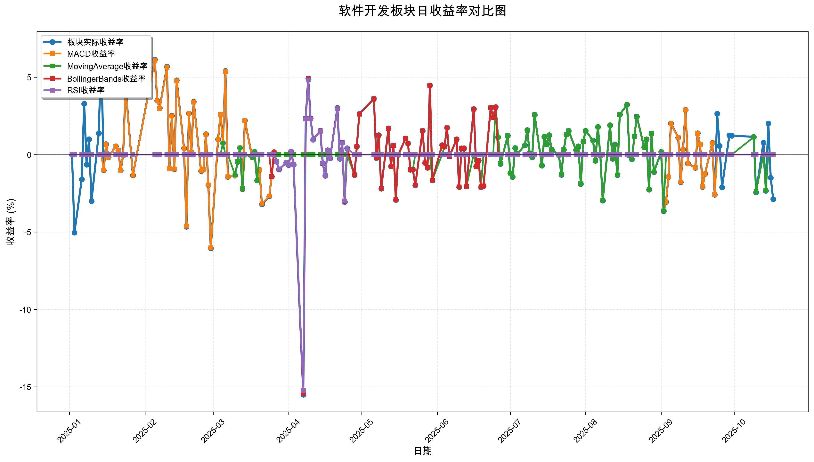
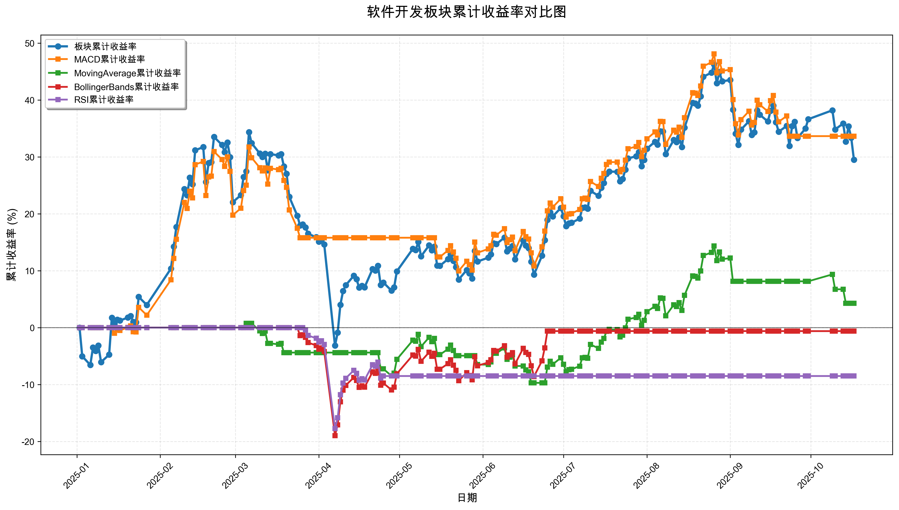

# 策略回测结果报告

**生成时间**: 2025-10-19 19:06:36
**行业板块**: 软件开发
**回测期间**: 20250101 至 20251017
**策略数量**: 4

## 📈 分析结论

### 策略表现分析
- **最佳策略**: MACD (总收益率: 33.64%)
- **最差策略**: RSI (总收益率: -8.51%)
### 交易活跃度分析
- **活跃策略**: 4 个
- **非活跃策略**: 0 个
- **最活跃策略**: MovingAverage (交易次数: 22)
### 🚨 异动提醒分析
- **板块异动**: 软件开发 近两周波动频繁 (方向变化频率: 64.3%)
### 风险分析
- **MACD**: 最大回撤 -16.52%, 夏普比率 1.7484
- **MovingAverage**: 最大回撤 -10.38%, 夏普比率 0.3442
- **BollingerBands**: 最大回撤 -18.98%, 夏普比率 -0.0342
- **RSI**: 最大回撤 -17.73%, 夏普比率 -0.5629

## 📊 综合结果表

| 策略名称           | 初始资金     | 最终价值     | 总收益率   | 年化收益率   | 波动率    |    夏普比率 | 最大回撤    | 总交易次数   | 买入次数   | 卖出次数   | 总交易金额      | 平均交易金额   | 交易频率   |   数据点数 |
|:---------------|:---------|:---------|:-------|:--------|:-------|--------:|:--------|:--------|:-------|:-------|:-----------|:---------|:-------|-------:|
| 板块实际表现         | ¥100,000 | ¥129,512 | 29.51% | 40.91%  | 36.97% |  1.1068 | -27.91% | N/A     | N/A    | N/A    | N/A        | N/A      | N/A    |    190 |
| MACD           | ¥100,000 | ¥133,637 | 33.64% | 46.90%  | 26.82% |  1.7484 | -16.52% | 4       | 2      | 2      | ¥462,191   | ¥115,548 | 0.02   |    190 |
| MovingAverage  | ¥100,000 | ¥104,261 | 4.26%  | 5.69%   | 16.54% |  0.3442 | -10.38% | 22      | 11     | 11     | ¥2,127,139 | ¥96,688  | 0.12   |    190 |
| BollingerBands | ¥100,000 | ¥99,380  | -0.62% | -0.82%  | 24.03% | -0.0342 | -18.98% | 3       | 2      | 1      | ¥297,018   | ¥99,006  | 0.02   |    190 |
| RSI            | ¥100,000 | ¥91,491  | -8.51% | -11.13% | 19.77% | -0.5629 | -17.73% | 2       | 1      | 1      | ¥188,056   | ¥94,028  | 0.01   |    190 |

## 📊 每日收益率走势图

*图1: 软件开发板块每日收益率走势对比*

## 📈 累计收益率走势图

*图2: 软件开发板块累计收益率走势对比*

## 📅 日收益明细表

| 日期         | 板块实际收益率   | MACD收益率   | MovingAverage收益率   | BollingerBands收益率   | RSI收益率   |
|:-----------|:----------|:----------|:-------------------|:--------------------|:---------|
| 2025-01-02 | 0.00%     | 0.00%     | 0.00%              | 0.00%               | 0.00%    |
| 2025-01-03 | -5.04%    | 0.00%     | 0.00%              | 0.00%               | 0.00%    |
| 2025-01-06 | -1.59%    | 0.00%     | 0.00%              | 0.00%               | 0.00%    |
| 2025-01-07 | 3.29%     | 0.00%     | 0.00%              | 0.00%               | 0.00%    |
| 2025-01-08 | -0.65%    | 0.00%     | 0.00%              | 0.00%               | 0.00%    |
| 2025-01-09 | 0.99%     | 0.00%     | 0.00%              | 0.00%               | 0.00%    |
| 2025-01-10 | -3.00%    | 0.00%     | 0.00%              | 0.00%               | 0.00%    |
| 2025-01-13 | 1.38%     | 0.00%     | 0.00%              | 0.00%               | 0.00%    |
| 2025-01-14 | 6.83%     | 0.00%     | 0.00%              | 0.00%               | 0.00%    |
| 2025-01-15 | -1.01%    | -1.00%    | 0.00%              | 0.00%               | 0.00%    |
| 2025-01-16 | 0.68%     | 0.67%     | 0.00%              | 0.00%               | 0.00%    |
| 2025-01-17 | -0.16%    | -0.16%    | 0.00%              | 0.00%               | 0.00%    |
| 2025-01-20 | 0.54%     | 0.53%     | 0.00%              | 0.00%               | 0.00%    |
| 2025-01-21 | 0.26%     | 0.26%     | 0.00%              | 0.00%               | 0.00%    |
| 2025-01-22 | -1.02%    | -1.01%    | 0.00%              | 0.00%               | 0.00%    |
| 2025-01-23 | -0.04%    | -0.04%    | 0.00%              | 0.00%               | 0.00%    |
| 2025-01-24 | 4.40%     | 4.35%     | 0.00%              | 0.00%               | 0.00%    |
| 2025-01-27 | -1.34%    | -1.33%    | 0.00%              | 0.00%               | 0.00%    |
| 2025-02-05 | 6.14%     | 6.09%     | 0.00%              | 0.00%               | 0.00%    |
| 2025-02-06 | 3.49%     | 3.46%     | 0.00%              | 0.00%               | 0.00%    |
| 2025-02-07 | 3.01%     | 2.98%     | 0.00%              | 0.00%               | 0.00%    |
| 2025-02-10 | 5.68%     | 5.63%     | 0.00%              | 0.00%               | 0.00%    |
| 2025-02-11 | -0.88%    | -0.88%    | 0.00%              | 0.00%               | 0.00%    |
| 2025-02-12 | 2.52%     | 2.50%     | 0.00%              | 0.00%               | 0.00%    |
| 2025-02-13 | -0.94%    | -0.93%    | 0.00%              | 0.00%               | 0.00%    |
| 2025-02-14 | 4.80%     | 4.76%     | 0.00%              | 0.00%               | 0.00%    |
| 2025-02-17 | 0.42%     | 0.41%     | 0.00%              | 0.00%               | 0.00%    |
| 2025-02-18 | -4.66%    | -4.62%    | 0.00%              | 0.00%               | 0.00%    |
| 2025-02-19 | 2.66%     | 2.64%     | 0.00%              | 0.00%               | 0.00%    |
| 2025-02-20 | 0.13%     | 0.13%     | 0.00%              | 0.00%               | 0.00%    |
| 2025-02-21 | 3.42%     | 3.39%     | 0.00%              | 0.00%               | 0.00%    |
| 2025-02-24 | -1.06%    | -1.05%    | 0.00%              | 0.00%               | 0.00%    |
| 2025-02-25 | -0.96%    | -0.95%    | 0.00%              | 0.00%               | 0.00%    |
| 2025-02-26 | 1.32%     | 1.31%     | 0.00%              | 0.00%               | 0.00%    |
| 2025-02-27 | -1.97%    | -1.96%    | 0.00%              | 0.00%               | 0.00%    |
| 2025-02-28 | -6.06%    | -6.02%    | 0.00%              | 0.00%               | 0.00%    |
| 2025-03-03 | 1.00%     | 1.00%     | 0.00%              | 0.00%               | 0.00%    |
| 2025-03-04 | 2.60%     | 2.58%     | 0.00%              | 0.00%               | 0.00%    |
| 2025-03-05 | 0.76%     | 0.75%     | 0.75%              | 0.00%               | 0.00%    |
| 2025-03-06 | 5.41%     | 5.37%     | 0.00%              | 0.00%               | 0.00%    |
| 2025-03-07 | -1.44%    | -1.43%    | 0.00%              | 0.00%               | 0.00%    |
| 2025-03-10 | -1.35%    | -1.34%    | -1.32%             | 0.00%               | 0.00%    |
| 2025-03-11 | -0.47%    | -0.47%    | -0.46%             | 0.00%               | 0.00%    |
| 2025-03-12 | 0.44%     | 0.44%     | 0.43%              | 0.00%               | 0.00%    |
| 2025-03-13 | -2.24%    | -2.22%    | -2.18%             | 0.00%               | 0.00%    |
| 2025-03-14 | 2.21%     | 2.19%     | 0.00%              | 0.00%               | 0.00%    |
| 2025-03-17 | -0.17%    | -0.16%    | -0.17%             | 0.00%               | 0.00%    |
| 2025-03-18 | 0.18%     | 0.18%     | 0.18%              | 0.00%               | 0.00%    |
| 2025-03-19 | -1.67%    | -1.66%    | -1.67%             | 0.00%               | 0.00%    |
| 2025-03-20 | -0.99%    | -0.99%    | 0.00%              | 0.00%               | 0.00%    |
| 2025-03-21 | -3.20%    | -3.17%    | 0.00%              | 0.00%               | 0.00%    |
| 2025-03-24 | -2.70%    | -2.68%    | 0.00%              | 0.00%               | 0.00%    |
| 2025-03-25 | -1.42%    | -1.40%    | 0.00%              | -1.41%              | 0.00%    |
| 2025-03-26 | 0.16%     | 0.00%     | 0.00%              | 0.16%               | 0.00%    |
| 2025-03-27 | -0.45%    | 0.00%     | 0.00%              | -0.45%              | -0.44%   |
| 2025-03-28 | -0.95%    | 0.00%     | 0.00%              | -0.95%              | -0.94%   |
| 2025-03-31 | -0.52%    | 0.00%     | 0.00%              | -0.52%              | -0.52%   |
| 2025-04-01 | -0.67%    | 0.00%     | 0.00%              | -0.66%              | -0.66%   |
| 2025-04-02 | 0.21%     | 0.00%     | 0.00%              | 0.21%               | 0.21%    |
| 2025-04-03 | -0.65%    | 0.00%     | 0.00%              | -0.65%              | -0.64%   |
| 2025-04-07 | -15.50%   | 0.00%     | 0.00%              | -15.42%             | -15.22%  |
| 2025-04-08 | 2.35%     | 0.00%     | 0.00%              | 2.33%               | 2.30%    |
| 2025-04-09 | 4.92%     | 0.00%     | 0.00%              | 4.90%               | 4.82%    |
| 2025-04-10 | 2.34%     | 0.00%     | 0.00%              | 2.33%               | 2.30%    |
| 2025-04-11 | 0.97%     | 0.00%     | 0.00%              | 0.96%               | 0.95%    |
| 2025-04-14 | 1.54%     | 0.00%     | 0.00%              | 1.54%               | 1.51%    |
| 2025-04-15 | -0.56%    | 0.00%     | 0.00%              | -0.56%              | -0.55%   |
| 2025-04-16 | -1.36%    | 0.00%     | 0.00%              | -1.36%              | -1.34%   |
| 2025-04-17 | 0.29%     | 0.00%     | 0.00%              | 0.29%               | 0.29%    |
| 2025-04-18 | -0.23%    | 0.00%     | 0.00%              | -0.23%              | -0.23%   |
| 2025-04-21 | 3.02%     | 0.00%     | 0.00%              | 3.00%               | 2.96%    |
| 2025-04-22 | -0.27%    | 0.00%     | 0.00%              | -0.27%              | -0.27%   |
| 2025-04-23 | 0.77%     | 0.00%     | 0.00%              | 0.77%               | 0.75%    |
| 2025-04-24 | -3.05%    | 0.00%     | -3.00%             | -3.03%              | -2.99%   |
| 2025-04-25 | 0.41%     | 0.00%     | 0.00%              | 0.40%               | 0.40%    |
| 2025-04-28 | -1.32%    | 0.00%     | -1.30%             | -1.31%              | 0.00%    |
| 2025-04-29 | 0.53%     | 0.00%     | 0.53%              | 0.53%               | 0.00%    |
| 2025-04-30 | 2.64%     | 0.00%     | 2.61%              | 2.62%               | 0.00%    |
| 2025-05-06 | 3.62%     | 0.00%     | 3.58%              | 3.60%               | 0.00%    |
| 2025-05-07 | -0.22%    | 0.00%     | -0.21%             | -0.21%              | 0.00%    |
| 2025-05-08 | 1.26%     | 0.00%     | 1.25%              | 1.26%               | 0.00%    |
| 2025-05-09 | -2.20%    | 0.00%     | -2.17%             | -2.19%              | 0.00%    |
| 2025-05-12 | 1.70%     | 0.00%     | 1.68%              | 1.69%               | 0.00%    |
| 2025-05-13 | -0.76%    | 0.00%     | -0.75%             | -0.76%              | 0.00%    |
| 2025-05-14 | 0.58%     | 0.00%     | 0.57%              | 0.58%               | 0.00%    |
| 2025-05-15 | -2.93%    | -2.91%    | -2.90%             | -2.91%              | 0.00%    |
| 2025-05-16 | -0.02%    | -0.02%    | -0.02%             | -0.02%              | 0.00%    |
| 2025-05-19 | 1.04%     | 1.04%     | 1.03%              | 1.04%               | 0.00%    |
| 2025-05-20 | 0.73%     | 0.72%     | 0.72%              | 0.72%               | 0.00%    |
| 2025-05-21 | -0.97%    | -0.97%    | -0.96%             | -0.97%              | 0.00%    |
| 2025-05-22 | -0.97%    | -0.97%    | -0.96%             | -0.97%              | 0.00%    |
| 2025-05-23 | -1.98%    | -1.97%    | 0.00%              | -1.97%              | 0.00%    |
| 2025-05-26 | 1.54%     | 1.53%     | 0.00%              | 1.53%               | 0.00%    |
| 2025-05-27 | -0.53%    | -0.53%    | 0.00%              | -0.53%              | 0.00%    |
| 2025-05-28 | -0.85%    | -0.85%    | 0.00%              | -0.85%              | 0.00%    |
| 2025-05-29 | 4.48%     | 4.46%     | 0.00%              | 4.46%               | 0.00%    |
| 2025-05-30 | -1.65%    | -1.65%    | -1.64%             | -1.65%              | 0.00%    |
| 2025-06-03 | 0.61%     | 0.61%     | 0.00%              | 0.61%               | 0.00%    |
| 2025-06-04 | 0.51%     | 0.50%     | 0.51%              | 0.50%               | 0.00%    |
| 2025-06-05 | 1.74%     | 1.73%     | 1.74%              | 1.73%               | 0.00%    |
| 2025-06-06 | -0.12%    | -0.12%    | -0.12%             | -0.12%              | 0.00%    |
| 2025-06-09 | 0.99%     | 0.98%     | 0.99%              | 0.98%               | 0.00%    |
| 2025-06-10 | -2.09%    | -2.08%    | -2.09%             | -2.08%              | 0.00%    |
| 2025-06-11 | 0.42%     | 0.42%     | 0.42%              | 0.42%               | 0.00%    |
| 2025-06-12 | 0.42%     | 0.41%     | 0.42%              | 0.41%               | 0.00%    |
| 2025-06-13 | -2.06%    | -2.05%    | -2.06%             | -2.05%              | 0.00%    |
| 2025-06-16 | 2.95%     | 2.94%     | 0.00%              | 2.94%               | 0.00%    |
| 2025-06-17 | -0.76%    | -0.76%    | -0.75%             | -0.76%              | 0.00%    |
| 2025-06-18 | -0.38%    | -0.38%    | -0.38%             | -0.38%              | 0.00%    |
| 2025-06-19 | -2.11%    | -2.10%    | -2.07%             | -2.10%              | 0.00%    |
| 2025-06-20 | -2.03%    | -2.02%    | 0.00%              | -2.02%              | 0.00%    |
| 2025-06-23 | 3.03%     | 3.02%     | 0.00%              | 3.02%               | 0.00%    |
| 2025-06-24 | 2.43%     | 2.41%     | 0.00%              | 2.41%               | 0.00%    |
| 2025-06-25 | 3.07%     | 3.06%     | 3.06%              | 3.06%               | 0.00%    |
| 2025-06-26 | 1.13%     | 1.13%     | 1.13%              | 0.00%               | 0.00%    |
| 2025-06-27 | -0.59%    | -0.58%    | -0.58%             | 0.00%               | 0.00%    |
| 2025-06-30 | 1.23%     | 1.22%     | 1.22%              | 0.00%               | 0.00%    |
| 2025-07-01 | -1.20%    | -1.20%    | -1.19%             | 0.00%               | 0.00%    |
| 2025-07-02 | -1.44%    | -1.44%    | -1.44%             | 0.00%               | 0.00%    |
| 2025-07-03 | 0.43%     | 0.43%     | 0.43%              | 0.00%               | 0.00%    |
| 2025-07-04 | 0.07%     | 0.07%     | 0.07%              | 0.00%               | 0.00%    |
| 2025-07-07 | 0.60%     | 0.60%     | 0.60%              | 0.00%               | 0.00%    |
| 2025-07-08 | 1.59%     | 1.58%     | 1.58%              | 0.00%               | 0.00%    |
| 2025-07-09 | 0.08%     | 0.08%     | 0.08%              | 0.00%               | 0.00%    |
| 2025-07-10 | -0.17%    | -0.17%    | -0.17%             | 0.00%               | 0.00%    |
| 2025-07-11 | 2.58%     | 2.57%     | 2.57%              | 0.00%               | 0.00%    |
| 2025-07-14 | -0.71%    | -0.71%    | -0.71%             | 0.00%               | 0.00%    |
| 2025-07-15 | 1.16%     | 1.15%     | 1.15%              | 0.00%               | 0.00%    |
| 2025-07-16 | 0.66%     | 0.65%     | 0.65%              | 0.00%               | 0.00%    |
| 2025-07-17 | 1.26%     | 1.26%     | 1.26%              | 0.00%               | 0.00%    |
| 2025-07-18 | 0.34%     | 0.34%     | 0.34%              | 0.00%               | 0.00%    |
| 2025-07-21 | -0.03%    | -0.03%    | -0.03%             | 0.00%               | 0.00%    |
| 2025-07-22 | -1.30%    | -1.29%    | -1.29%             | 0.00%               | 0.00%    |
| 2025-07-23 | 0.31%     | 0.31%     | 0.31%              | 0.00%               | 0.00%    |
| 2025-07-24 | 1.30%     | 1.29%     | 1.29%              | 0.00%               | 0.00%    |
| 2025-07-25 | 1.54%     | 1.54%     | 1.54%              | 0.00%               | 0.00%    |
| 2025-07-28 | 0.30%     | 0.30%     | 0.30%              | 0.00%               | 0.00%    |
| 2025-07-29 | 0.54%     | 0.54%     | 0.54%              | 0.00%               | 0.00%    |
| 2025-07-30 | -1.89%    | -1.88%    | -1.88%             | 0.00%               | 0.00%    |
| 2025-07-31 | 0.86%     | 0.86%     | 0.86%              | 0.00%               | 0.00%    |
| 2025-08-01 | 1.53%     | 1.52%     | 1.52%              | 0.00%               | 0.00%    |
| 2025-08-04 | 0.92%     | 0.92%     | 0.92%              | 0.00%               | 0.00%    |
| 2025-08-05 | -0.39%    | -0.39%    | -0.39%             | 0.00%               | 0.00%    |
| 2025-08-06 | 1.79%     | 1.79%     | 1.79%              | 0.00%               | 0.00%    |
| 2025-08-07 | -0.04%    | -0.04%    | -0.04%             | 0.00%               | 0.00%    |
| 2025-08-08 | -2.96%    | -2.94%    | -2.94%             | 0.00%               | 0.00%    |
| 2025-08-11 | 1.90%     | 1.90%     | 1.90%              | 0.00%               | 0.00%    |
| 2025-08-12 | -0.27%    | -0.27%    | -0.27%             | 0.00%               | 0.00%    |
| 2025-08-13 | 0.66%     | 0.65%     | 0.65%              | 0.00%               | 0.00%    |
| 2025-08-14 | -1.32%    | -1.32%    | -1.32%             | 0.00%               | 0.00%    |
| 2025-08-15 | 2.59%     | 2.58%     | 2.58%              | 0.00%               | 0.00%    |
| 2025-08-18 | 3.23%     | 3.22%     | 3.22%              | 0.00%               | 0.00%    |
| 2025-08-19 | -0.07%    | -0.07%    | -0.07%             | 0.00%               | 0.00%    |
| 2025-08-20 | -0.29%    | -0.29%    | -0.29%             | 0.00%               | 0.00%    |
| 2025-08-21 | 1.18%     | 1.18%     | 1.18%              | 0.00%               | 0.00%    |
| 2025-08-22 | 2.46%     | 2.45%     | 2.45%              | 0.00%               | 0.00%    |
| 2025-08-25 | 0.48%     | 0.48%     | 0.48%              | 0.00%               | 0.00%    |
| 2025-08-26 | 1.00%     | 1.00%     | 1.00%              | 0.00%               | 0.00%    |
| 2025-08-27 | -2.26%    | -2.25%    | -2.25%             | 0.00%               | 0.00%    |
| 2025-08-28 | 1.37%     | 1.36%     | 1.36%              | 0.00%               | 0.00%    |
| 2025-08-29 | -1.12%    | -1.11%    | -1.11%             | 0.00%               | 0.00%    |
| 2025-09-01 | 0.17%     | 0.17%     | 0.17%              | 0.00%               | 0.00%    |
| 2025-09-02 | -3.65%    | -3.63%    | -3.63%             | 0.00%               | 0.00%    |
| 2025-09-03 | -3.05%    | -3.04%    | 0.00%              | 0.00%               | 0.00%    |
| 2025-09-04 | -1.44%    | -1.44%    | 0.00%              | 0.00%               | 0.00%    |
| 2025-09-05 | 2.01%     | 2.00%     | 0.00%              | 0.00%               | 0.00%    |
| 2025-09-08 | 1.11%     | 1.10%     | 0.00%              | 0.00%               | 0.00%    |
| 2025-09-09 | -1.78%    | -1.77%    | 0.00%              | 0.00%               | 0.00%    |
| 2025-09-10 | 0.33%     | 0.33%     | 0.00%              | 0.00%               | 0.00%    |
| 2025-09-11 | 2.89%     | 2.88%     | 0.00%              | 0.00%               | 0.00%    |
| 2025-09-12 | -0.57%    | -0.57%    | 0.00%              | 0.00%               | 0.00%    |
| 2025-09-15 | -0.85%    | -0.85%    | 0.00%              | 0.00%               | 0.00%    |
| 2025-09-16 | 1.38%     | 1.37%     | 0.00%              | 0.00%               | 0.00%    |
| 2025-09-17 | 0.65%     | 0.65%     | 0.00%              | 0.00%               | 0.00%    |
| 2025-09-18 | -2.08%    | -2.07%    | 0.00%              | 0.00%               | 0.00%    |
| 2025-09-19 | -1.24%    | -1.24%    | 0.00%              | 0.00%               | 0.00%    |
| 2025-09-22 | 0.76%     | 0.75%     | 0.00%              | 0.00%               | 0.00%    |
| 2025-09-23 | -2.59%    | -2.58%    | 0.00%              | 0.00%               | 0.00%    |
| 2025-09-24 | 2.64%     | 0.00%     | 0.00%              | 0.00%               | 0.00%    |
| 2025-09-25 | 0.57%     | 0.00%     | 0.00%              | 0.00%               | 0.00%    |
| 2025-09-26 | -2.11%    | 0.00%     | 0.00%              | 0.00%               | 0.00%    |
| 2025-09-29 | 1.25%     | 0.00%     | 0.00%              | 0.00%               | 0.00%    |
| 2025-09-30 | 1.22%     | 0.00%     | 0.00%              | 0.00%               | 0.00%    |
| 2025-10-09 | 1.15%     | 0.00%     | 1.13%              | 0.00%               | 0.00%    |
| 2025-10-10 | -2.44%    | 0.00%     | -2.40%             | 0.00%               | 0.00%    |
| 2025-10-13 | 0.78%     | 0.00%     | 0.00%              | 0.00%               | 0.00%    |
| 2025-10-14 | -2.33%    | 0.00%     | -2.31%             | 0.00%               | 0.00%    |
| 2025-10-15 | 2.02%     | 0.00%     | 0.00%              | 0.00%               | 0.00%    |
| 2025-10-16 | -1.49%    | 0.00%     | 0.00%              | 0.00%               | 0.00%    |
| 2025-10-17 | -2.88%    | 0.00%     | 0.00%              | 0.00%               | 0.00%    |

## 📊 日收益统计摘要

| 指标                | 平均日收益率   | 最大日收益率   | 最小日收益率   | 正收益天数   | 负收益天数   |
|:------------------|:---------|:---------|:---------|:--------|:--------|
| 板块实际收益率           | 0.16%    | 6.83%    | -15.50%  | 102天    | 87天     |
| MACD收益率           | 0.17%    | 6.09%    | -6.02%   | 74天     | 63天     |
| MovingAverage收益率  | 0.03%    | 3.58%    | -3.63%   | 49天     | 41天     |
| BollingerBands收益率 | 0.01%    | 4.90%    | -15.42%  | 31天     | 31天     |
| RSI收益率            | -0.04%   | 4.82%    | -15.22%  | 10天     | 11天     |

## 📈 累计收益明细表

| 日期         | 板块累计收益率   | MACD累计收益率   | MovingAverage累计收益率   | BollingerBands累计收益率   | RSI累计收益率   |
|:-----------|:----------|:------------|:---------------------|:----------------------|:-----------|
| 2025-01-02 | 0.00%     | 0.00%       | 0.00%                | 0.00%                 | 0.00%      |
| 2025-01-03 | -5.04%    | 0.00%       | 0.00%                | 0.00%                 | 0.00%      |
| 2025-01-06 | -6.56%    | 0.00%       | 0.00%                | 0.00%                 | 0.00%      |
| 2025-01-07 | -3.48%    | 0.00%       | 0.00%                | 0.00%                 | 0.00%      |
| 2025-01-08 | -4.11%    | 0.00%       | 0.00%                | 0.00%                 | 0.00%      |
| 2025-01-09 | -3.16%    | 0.00%       | 0.00%                | 0.00%                 | 0.00%      |
| 2025-01-10 | -6.06%    | 0.00%       | 0.00%                | 0.00%                 | 0.00%      |
| 2025-01-13 | -4.76%    | 0.00%       | 0.00%                | 0.00%                 | 0.00%      |
| 2025-01-14 | 1.74%     | 0.00%       | 0.00%                | 0.00%                 | 0.00%      |
| 2025-01-15 | 0.71%     | -1.00%      | 0.00%                | 0.00%                 | 0.00%      |
| 2025-01-16 | 1.39%     | -0.34%      | 0.00%                | 0.00%                 | 0.00%      |
| 2025-01-17 | 1.23%     | -0.50%      | 0.00%                | 0.00%                 | 0.00%      |
| 2025-01-20 | 1.77%     | 0.03%       | 0.00%                | 0.00%                 | 0.00%      |
| 2025-01-21 | 2.04%     | 0.29%       | 0.00%                | 0.00%                 | 0.00%      |
| 2025-01-22 | 1.00%     | -0.72%      | 0.00%                | 0.00%                 | 0.00%      |
| 2025-01-23 | 0.95%     | -0.76%      | 0.00%                | 0.00%                 | 0.00%      |
| 2025-01-24 | 5.39%     | 3.56%       | 0.00%                | 0.00%                 | 0.00%      |
| 2025-01-27 | 3.98%     | 2.18%       | 0.00%                | 0.00%                 | 0.00%      |
| 2025-02-05 | 10.37%    | 8.40%       | 0.00%                | 0.00%                 | 0.00%      |
| 2025-02-06 | 14.23%    | 12.16%      | 0.00%                | 0.00%                 | 0.00%      |
| 2025-02-07 | 17.66%    | 15.50%      | 0.00%                | 0.00%                 | 0.00%      |
| 2025-02-10 | 24.34%    | 22.00%      | 0.00%                | 0.00%                 | 0.00%      |
| 2025-02-11 | 23.25%    | 20.94%      | 0.00%                | 0.00%                 | 0.00%      |
| 2025-02-12 | 26.35%    | 23.95%      | 0.00%                | 0.00%                 | 0.00%      |
| 2025-02-13 | 25.16%    | 22.80%      | 0.00%                | 0.00%                 | 0.00%      |
| 2025-02-14 | 31.16%    | 28.64%      | 0.00%                | 0.00%                 | 0.00%      |
| 2025-02-17 | 31.71%    | 29.18%      | 0.00%                | 0.00%                 | 0.00%      |
| 2025-02-18 | 25.58%    | 23.20%      | 0.00%                | 0.00%                 | 0.00%      |
| 2025-02-19 | 28.92%    | 26.46%      | 0.00%                | 0.00%                 | 0.00%      |
| 2025-02-20 | 29.08%    | 26.62%      | 0.00%                | 0.00%                 | 0.00%      |
| 2025-02-21 | 33.50%    | 30.92%      | 0.00%                | 0.00%                 | 0.00%      |
| 2025-02-24 | 32.09%    | 29.54%      | 0.00%                | 0.00%                 | 0.00%      |
| 2025-02-25 | 30.82%    | 28.31%      | 0.00%                | 0.00%                 | 0.00%      |
| 2025-02-26 | 32.54%    | 29.99%      | 0.00%                | 0.00%                 | 0.00%      |
| 2025-02-27 | 29.93%    | 27.44%      | 0.00%                | 0.00%                 | 0.00%      |
| 2025-02-28 | 22.05%    | 19.77%      | 0.00%                | 0.00%                 | 0.00%      |
| 2025-03-03 | 23.27%    | 20.96%      | 0.00%                | 0.00%                 | 0.00%      |
| 2025-03-04 | 26.47%    | 24.08%      | 0.00%                | 0.00%                 | 0.00%      |
| 2025-03-05 | 27.43%    | 25.01%      | 0.75%                | 0.00%                 | 0.00%      |
| 2025-03-06 | 34.33%    | 31.72%      | 0.75%                | 0.00%                 | 0.00%      |
| 2025-03-07 | 32.40%    | 29.85%      | 0.75%                | 0.00%                 | 0.00%      |
| 2025-03-10 | 30.61%    | 28.11%      | -0.58%               | 0.00%                 | 0.00%      |
| 2025-03-11 | 30.00%    | 27.51%      | -1.04%               | 0.00%                 | 0.00%      |
| 2025-03-12 | 30.57%    | 28.07%      | -0.61%               | 0.00%                 | 0.00%      |
| 2025-03-13 | 27.65%    | 25.23%      | -2.78%               | 0.00%                 | 0.00%      |
| 2025-03-14 | 30.48%    | 27.98%      | -2.78%               | 0.00%                 | 0.00%      |
| 2025-03-17 | 30.26%    | 27.76%      | -2.94%               | 0.00%                 | 0.00%      |
| 2025-03-18 | 30.49%    | 27.99%      | -2.77%               | 0.00%                 | 0.00%      |
| 2025-03-19 | 28.31%    | 25.87%      | -4.39%               | 0.00%                 | 0.00%      |
| 2025-03-20 | 27.04%    | 24.63%      | -4.39%               | 0.00%                 | 0.00%      |
| 2025-03-21 | 22.97%    | 20.67%      | -4.39%               | 0.00%                 | 0.00%      |
| 2025-03-24 | 19.65%    | 17.44%      | -4.39%               | 0.00%                 | 0.00%      |
| 2025-03-25 | 17.96%    | 15.79%      | -4.39%               | -1.41%                | 0.00%      |
| 2025-03-26 | 18.15%    | 15.79%      | -4.39%               | -1.25%                | 0.00%      |
| 2025-03-27 | 17.61%    | 15.79%      | -4.39%               | -1.70%                | -0.44%     |
| 2025-03-28 | 16.49%    | 15.79%      | -4.39%               | -2.63%                | -1.38%     |
| 2025-03-31 | 15.88%    | 15.79%      | -4.39%               | -3.14%                | -1.88%     |
| 2025-04-01 | 15.11%    | 15.79%      | -4.39%               | -3.78%                | -2.53%     |
| 2025-04-02 | 15.35%    | 15.79%      | -4.39%               | -3.58%                | -2.33%     |
| 2025-04-03 | 14.60%    | 15.79%      | -4.39%               | -4.20%                | -2.95%     |
| 2025-04-07 | -3.16%    | 15.79%      | -4.39%               | -18.98%               | -17.73%    |
| 2025-04-08 | -0.89%    | 15.79%      | -4.39%               | -17.09%               | -15.84%    |
| 2025-04-09 | 3.99%     | 15.79%      | -4.39%               | -13.03%               | -11.78%    |
| 2025-04-10 | 6.43%     | 15.79%      | -4.39%               | -11.00%               | -9.75%     |
| 2025-04-11 | 7.45%     | 15.79%      | -4.39%               | -10.15%               | -8.89%     |
| 2025-04-14 | 9.11%     | 15.79%      | -4.39%               | -8.77%                | -7.52%     |
| 2025-04-15 | 8.50%     | 15.79%      | -4.39%               | -9.28%                | -8.03%     |
| 2025-04-16 | 7.02%     | 15.79%      | -4.39%               | -10.51%               | -9.26%     |
| 2025-04-17 | 7.33%     | 15.79%      | -4.39%               | -10.25%               | -9.00%     |
| 2025-04-18 | 7.08%     | 15.79%      | -4.39%               | -10.46%               | -9.21%     |
| 2025-04-21 | 10.31%    | 15.79%      | -4.39%               | -7.77%                | -6.52%     |
| 2025-04-22 | 10.01%    | 15.79%      | -4.39%               | -8.02%                | -6.77%     |
| 2025-04-23 | 10.86%    | 15.79%      | -4.39%               | -7.32%                | -6.06%     |
| 2025-04-24 | 7.48%     | 15.79%      | -7.26%               | -10.12%               | -8.87%     |
| 2025-04-25 | 7.92%     | 15.79%      | -7.26%               | -9.76%                | -8.51%     |
| 2025-04-28 | 6.50%     | 15.79%      | -8.47%               | -10.94%               | -8.51%     |
| 2025-04-29 | 7.06%     | 15.79%      | -7.99%               | -10.47%               | -8.51%     |
| 2025-04-30 | 9.89%     | 15.79%      | -5.59%               | -8.12%                | -8.51%     |
| 2025-05-06 | 13.87%    | 15.79%      | -2.21%               | -4.81%                | -8.51%     |
| 2025-05-07 | 13.62%    | 15.79%      | -2.41%               | -5.02%                | -8.51%     |
| 2025-05-08 | 15.06%    | 15.79%      | -1.20%               | -3.82%                | -8.51%     |
| 2025-05-09 | 12.53%    | 15.79%      | -3.34%               | -5.93%                | -8.51%     |
| 2025-05-12 | 14.44%    | 15.79%      | -1.72%               | -4.34%                | -8.51%     |
| 2025-05-13 | 13.57%    | 15.79%      | -2.46%               | -5.06%                | -8.51%     |
| 2025-05-14 | 14.23%    | 15.79%      | -1.90%               | -4.51%                | -8.51%     |
| 2025-05-15 | 10.88%    | 12.42%      | -4.74%               | -7.30%                | -8.51%     |
| 2025-05-16 | 10.86%    | 12.40%      | -4.76%               | -7.31%                | -8.51%     |
| 2025-05-19 | 12.02%    | 13.56%      | -3.78%               | -6.35%                | -8.51%     |
| 2025-05-20 | 12.83%    | 14.38%      | -3.09%               | -5.67%                | -8.51%     |
| 2025-05-21 | 11.73%    | 13.27%      | -4.02%               | -6.59%                | -8.51%     |
| 2025-05-22 | 10.65%    | 12.18%      | -4.94%               | -7.49%                | -8.51%     |
| 2025-05-23 | 8.45%     | 9.97%       | -4.94%               | -9.32%                | -8.51%     |
| 2025-05-26 | 10.12%    | 11.65%      | -4.94%               | -7.93%                | -8.51%     |
| 2025-05-27 | 9.54%     | 11.06%      | -4.94%               | -8.41%                | -8.51%     |
| 2025-05-28 | 8.61%     | 10.12%      | -4.94%               | -9.19%                | -8.51%     |
| 2025-05-29 | 13.48%    | 15.03%      | -4.94%               | -5.14%                | -8.51%     |
| 2025-05-30 | 11.60%    | 13.14%      | -6.50%               | -6.70%                | -8.51%     |
| 2025-06-03 | 12.29%    | 13.83%      | -6.50%               | -6.13%                | -8.51%     |
| 2025-06-04 | 12.85%    | 14.40%      | -6.03%               | -5.66%                | -8.51%     |
| 2025-06-05 | 14.81%    | 16.38%      | -4.40%               | -4.03%                | -8.51%     |
| 2025-06-06 | 14.67%    | 16.24%      | -4.52%               | -4.14%                | -8.51%     |
| 2025-06-09 | 15.81%    | 17.39%      | -3.57%               | -3.20%                | -8.51%     |
| 2025-06-10 | 13.39%    | 14.95%      | -5.58%               | -5.21%                | -8.51%     |
| 2025-06-11 | 13.87%    | 15.43%      | -5.19%               | -4.81%                | -8.51%     |
| 2025-06-12 | 14.34%    | 15.91%      | -4.79%               | -4.42%                | -8.51%     |
| 2025-06-13 | 11.99%    | 13.53%      | -6.75%               | -6.37%                | -8.51%     |
| 2025-06-16 | 15.29%    | 16.87%      | -6.75%               | -3.63%                | -8.51%     |
| 2025-06-17 | 14.42%    | 15.98%      | -7.45%               | -4.35%                | -8.51%     |
| 2025-06-18 | 13.98%    | 15.54%      | -7.79%               | -4.72%                | -8.51%     |
| 2025-06-19 | 11.58%    | 13.12%      | -9.71%               | -6.72%                | -8.51%     |
| 2025-06-20 | 9.32%     | 10.84%      | -9.71%               | -8.60%                | -8.51%     |
| 2025-06-23 | 12.63%    | 14.18%      | -9.71%               | -5.84%                | -8.51%     |
| 2025-06-24 | 15.37%    | 16.94%      | -9.71%               | -3.57%                | -8.51%     |
| 2025-06-25 | 18.91%    | 20.51%      | -6.95%               | -0.62%                | -8.51%     |
| 2025-06-26 | 20.25%    | 21.87%      | -5.90%               | -0.62%                | -8.51%     |
| 2025-06-27 | 19.55%    | 21.16%      | -6.45%               | -0.62%                | -8.51%     |
| 2025-06-30 | 21.02%    | 22.64%      | -5.31%               | -0.62%                | -8.51%     |
| 2025-07-01 | 19.56%    | 21.18%      | -6.44%               | -0.62%                | -8.51%     |
| 2025-07-02 | 17.84%    | 19.43%      | -7.78%               | -0.62%                | -8.51%     |
| 2025-07-03 | 18.34%    | 19.94%      | -7.39%               | -0.62%                | -8.51%     |
| 2025-07-04 | 18.43%    | 20.03%      | -7.32%               | -0.62%                | -8.51%     |
| 2025-07-07 | 19.14%    | 20.75%      | -6.77%               | -0.62%                | -8.51%     |
| 2025-07-08 | 21.03%    | 22.65%      | -5.30%               | -0.62%                | -8.51%     |
| 2025-07-09 | 21.12%    | 22.75%      | -5.22%               | -0.62%                | -8.51%     |
| 2025-07-10 | 20.91%    | 22.54%      | -5.39%               | -0.62%                | -8.51%     |
| 2025-07-11 | 24.03%    | 25.68%      | -2.96%               | -0.62%                | -8.51%     |
| 2025-07-14 | 23.15%    | 24.79%      | -3.64%               | -0.62%                | -8.51%     |
| 2025-07-15 | 24.58%    | 26.23%      | -2.53%               | -0.62%                | -8.51%     |
| 2025-07-16 | 25.40%    | 27.06%      | -1.90%               | -0.62%                | -8.51%     |
| 2025-07-17 | 26.98%    | 28.66%      | -0.66%               | -0.62%                | -8.51%     |
| 2025-07-18 | 27.41%    | 29.09%      | -0.32%               | -0.62%                | -8.51%     |
| 2025-07-21 | 27.38%    | 29.06%      | -0.35%               | -0.62%                | -8.51%     |
| 2025-07-22 | 25.72%    | 27.39%      | -1.64%               | -0.62%                | -8.51%     |
| 2025-07-23 | 26.12%    | 27.78%      | -1.34%               | -0.62%                | -8.51%     |
| 2025-07-24 | 27.75%    | 29.43%      | -0.06%               | -0.62%                | -8.51%     |
| 2025-07-25 | 29.72%    | 31.42%      | 1.47%                | -0.62%                | -8.51%     |
| 2025-07-28 | 30.11%    | 31.82%      | 1.78%                | -0.62%                | -8.51%     |
| 2025-07-29 | 30.82%    | 32.53%      | 2.33%                | -0.62%                | -8.51%     |
| 2025-07-30 | 28.35%    | 30.04%      | 0.40%                | -0.62%                | -8.51%     |
| 2025-07-31 | 29.45%    | 31.15%      | 1.26%                | -0.62%                | -8.51%     |
| 2025-08-01 | 31.43%    | 33.15%      | 2.80%                | -0.62%                | -8.51%     |
| 2025-08-04 | 32.65%    | 34.37%      | 3.75%                | -0.62%                | -8.51%     |
| 2025-08-05 | 32.13%    | 33.86%      | 3.35%                | -0.62%                | -8.51%     |
| 2025-08-06 | 34.50%    | 36.25%      | 5.20%                | -0.62%                | -8.51%     |
| 2025-08-07 | 34.45%    | 36.19%      | 5.16%                | -0.62%                | -8.51%     |
| 2025-08-08 | 30.48%    | 32.18%      | 2.06%                | -0.62%                | -8.51%     |
| 2025-08-11 | 32.96%    | 34.69%      | 4.00%                | -0.62%                | -8.51%     |
| 2025-08-12 | 32.60%    | 34.33%      | 3.72%                | -0.62%                | -8.51%     |
| 2025-08-13 | 33.47%    | 35.21%      | 4.39%                | -0.62%                | -8.51%     |
| 2025-08-14 | 31.71%    | 33.42%      | 3.02%                | -0.62%                | -8.51%     |
| 2025-08-15 | 35.12%    | 36.87%      | 5.68%                | -0.62%                | -8.51%     |
| 2025-08-18 | 39.49%    | 41.28%      | 9.08%                | -0.62%                | -8.51%     |
| 2025-08-19 | 39.39%    | 41.18%      | 9.00%                | -0.62%                | -8.51%     |
| 2025-08-20 | 38.99%    | 40.78%      | 8.69%                | -0.62%                | -8.51%     |
| 2025-08-21 | 40.63%    | 42.43%      | 9.97%                | -0.62%                | -8.51%     |
| 2025-08-22 | 44.09%    | 45.92%      | 12.66%               | -0.62%                | -8.51%     |
| 2025-08-25 | 44.78%    | 46.61%      | 13.20%               | -0.62%                | -8.51%     |
| 2025-08-26 | 46.23%    | 48.08%      | 14.33%               | -0.62%                | -8.51%     |
| 2025-08-27 | 42.93%    | 44.75%      | 11.76%               | -0.62%                | -8.51%     |
| 2025-08-28 | 44.89%    | 46.72%      | 13.28%               | -0.62%                | -8.51%     |
| 2025-08-29 | 43.26%    | 45.09%      | 12.02%               | -0.62%                | -8.51%     |
| 2025-09-01 | 43.51%    | 45.33%      | 12.21%               | -0.62%                | -8.51%     |
| 2025-09-02 | 38.27%    | 40.05%      | 8.13%                | -0.62%                | -8.51%     |
| 2025-09-03 | 34.06%    | 35.80%      | 8.13%                | -0.62%                | -8.51%     |
| 2025-09-04 | 32.12%    | 33.85%      | 8.13%                | -0.62%                | -8.51%     |
| 2025-09-05 | 34.78%    | 36.53%      | 8.13%                | -0.62%                | -8.51%     |
| 2025-09-08 | 36.27%    | 38.03%      | 8.13%                | -0.62%                | -8.51%     |
| 2025-09-09 | 33.85%    | 35.59%      | 8.13%                | -0.62%                | -8.51%     |
| 2025-09-10 | 34.29%    | 36.03%      | 8.13%                | -0.62%                | -8.51%     |
| 2025-09-11 | 38.17%    | 39.95%      | 8.13%                | -0.62%                | -8.51%     |
| 2025-09-12 | 37.39%    | 39.16%      | 8.13%                | -0.62%                | -8.51%     |
| 2025-09-15 | 36.22%    | 37.98%      | 8.13%                | -0.62%                | -8.51%     |
| 2025-09-16 | 38.09%    | 39.87%      | 8.13%                | -0.62%                | -8.51%     |
| 2025-09-17 | 38.99%    | 40.77%      | 8.13%                | -0.62%                | -8.51%     |
| 2025-09-18 | 36.10%    | 37.86%      | 8.13%                | -0.62%                | -8.51%     |
| 2025-09-19 | 34.41%    | 36.15%      | 8.13%                | -0.62%                | -8.51%     |
| 2025-09-22 | 35.43%    | 37.18%      | 8.13%                | -0.62%                | -8.51%     |
| 2025-09-23 | 31.92%    | 33.64%      | 8.13%                | -0.62%                | -8.51%     |
| 2025-09-24 | 35.40%    | 33.64%      | 8.13%                | -0.62%                | -8.51%     |
| 2025-09-25 | 36.17%    | 33.64%      | 8.13%                | -0.62%                | -8.51%     |
| 2025-09-26 | 33.30%    | 33.64%      | 8.13%                | -0.62%                | -8.51%     |
| 2025-09-29 | 34.97%    | 33.64%      | 8.13%                | -0.62%                | -8.51%     |
| 2025-09-30 | 36.61%    | 33.64%      | 8.13%                | -0.62%                | -8.51%     |
| 2025-10-09 | 38.18%    | 33.64%      | 9.35%                | -0.62%                | -8.51%     |
| 2025-10-10 | 34.81%    | 33.64%      | 6.73%                | -0.62%                | -8.51%     |
| 2025-10-13 | 35.86%    | 33.64%      | 6.73%                | -0.62%                | -8.51%     |
| 2025-10-14 | 32.69%    | 33.64%      | 4.26%                | -0.62%                | -8.51%     |
| 2025-10-15 | 35.38%    | 33.64%      | 4.26%                | -0.62%                | -8.51%     |
| 2025-10-16 | 33.36%    | 33.64%      | 4.26%                | -0.62%                | -8.51%     |
| 2025-10-17 | 29.51%    | 33.64%      | 4.26%                | -0.62%                | -8.51%     |

## 📊 累计收益统计摘要

| 指标                  | 最终累计收益率   | 最大累计收益率   | 最小累计收益率   | 累计收益波动   | 收益稳定性   |
|:--------------------|:----------|:----------|:----------|:---------|:--------|
| 板块累计收益率             | 29.51%    | 46.23%    | -6.56%    | 52.79%   | 波动      |
| MACD累计收益率           | 33.64%    | 48.08%    | -1.00%    | 49.08%   | 波动      |
| MovingAverage累计收益率  | 4.26%     | 14.33%    | -9.71%    | 24.04%   | 波动      |
| BollingerBands累计收益率 | -0.62%    | 0.00%     | -18.98%   | 18.98%   | 稳定      |
| RSI累计收益率            | -8.51%    | 0.00%     | -17.73%   | 17.73%   | 稳定      |

