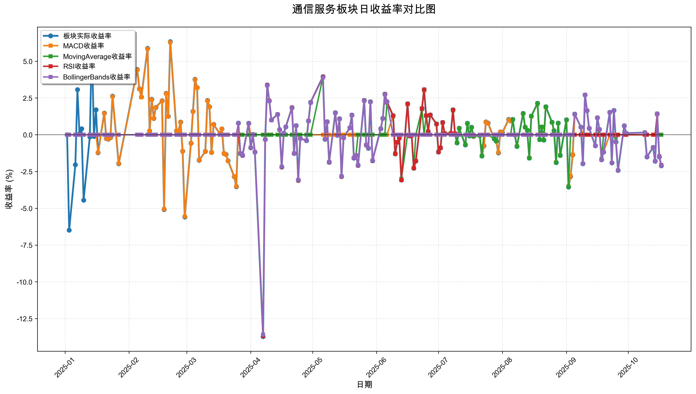
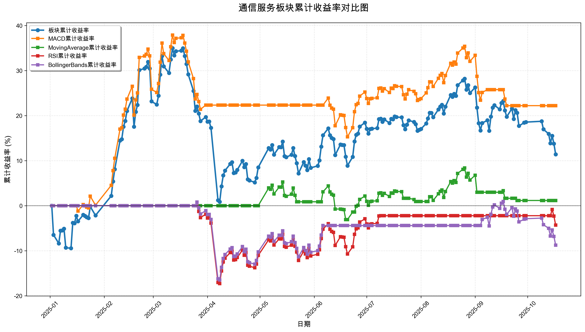

# 策略回测结果报告

**生成时间**: 2025-10-19 19:05:33
**行业板块**: 通信服务
**回测期间**: 20250101 至 20251017
**策略数量**: 4

## 📈 分析结论

### 策略表现分析
- **最佳策略**: MACD (总收益率: 22.20%)
- **最差策略**: BollingerBands (总收益率: -8.77%)
### 交易活跃度分析
- **活跃策略**: 4 个
- **非活跃策略**: 0 个
- **最活跃策略**: MovingAverage (交易次数: 18)
### 🚨 异动提醒分析
- **策略异动**: MovingAverage 与板块走势相关性异常 (相关系数: -0.039)
### 风险分析
- **MACD**: 最大回撤 -16.38%, 夏普比率 1.3354
- **MovingAverage**: 最大回撤 -7.93%, 夏普比率 0.1219
- **RSI**: 最大回撤 -17.30%, 夏普比率 -0.2565
- **BollingerBands**: 最大回撤 -17.16%, 夏普比率 -0.5229

## 📊 综合结果表

| 策略名称           | 初始资金     | 最终价值     | 总收益率   | 年化收益率   | 波动率    |    夏普比率 | 最大回撤    | 总交易次数   | 买入次数   | 卖出次数   | 总交易金额      | 平均交易金额   | 交易频率   |   数据点数 |
|:---------------|:---------|:---------|:-------|:--------|:-------|--------:|:--------|:--------|:-------|:-------|:-----------|:---------|:-------|-------:|
| 板块实际表现         | ¥100,000 | ¥111,376 | 11.38% | 15.36%  | 34.11% |  0.4504 | -25.27% | N/A     | N/A    | N/A    | N/A        | N/A      | N/A    |    190 |
| MACD           | ¥100,000 | ¥122,200 | 22.20% | 30.46%  | 22.81% |  1.3354 | -16.38% | 6       | 3      | 3      | ¥712,192   | ¥118,699 | 0.03   |    190 |
| MovingAverage  | ¥100,000 | ¥101,149 | 1.15%  | 1.53%   | 12.53% |  0.1219 | -7.93%  | 18      | 9      | 9      | ¥1,775,987 | ¥98,666  | 0.09   |    190 |
| RSI            | ¥100,000 | ¥95,677  | -4.32% | -5.69%  | 22.20% | -0.2565 | -17.30% | 3       | 2      | 1      | ¥293,377   | ¥97,792  | 0.02   |    190 |
| BollingerBands | ¥100,000 | ¥91,227  | -8.77% | -11.47% | 21.93% | -0.5229 | -17.16% | 3       | 2      | 1      | ¥289,095   | ¥96,365  | 0.02   |    190 |

## 📊 每日收益率走势图

*图1: 通信服务板块每日收益率走势对比*

## 📈 累计收益率走势图

*图2: 通信服务板块累计收益率走势对比*

## 📅 日收益明细表

| 日期         | 板块实际收益率   | MACD收益率   | MovingAverage收益率   | RSI收益率   | BollingerBands收益率   |
|:-----------|:----------|:----------|:-------------------|:---------|:--------------------|
| 2025-01-02 | 0.00%     | 0.00%     | 0.00%              | 0.00%    | 0.00%               |
| 2025-01-03 | -6.49%    | 0.00%     | 0.00%              | 0.00%    | 0.00%               |
| 2025-01-06 | -2.03%    | 0.00%     | 0.00%              | 0.00%    | 0.00%               |
| 2025-01-07 | 3.07%     | 0.00%     | 0.00%              | 0.00%    | 0.00%               |
| 2025-01-08 | 0.07%     | 0.00%     | 0.00%              | 0.00%    | 0.00%               |
| 2025-01-09 | 0.41%     | 0.00%     | 0.00%              | 0.00%    | 0.00%               |
| 2025-01-10 | -4.45%    | 0.00%     | 0.00%              | 0.00%    | 0.00%               |
| 2025-01-13 | -0.14%    | 0.00%     | 0.00%              | 0.00%    | 0.00%               |
| 2025-01-14 | 6.25%     | 0.00%     | 0.00%              | 0.00%    | 0.00%               |
| 2025-01-15 | -0.11%    | 0.00%     | 0.00%              | 0.00%    | 0.00%               |
| 2025-01-16 | 1.70%     | 0.00%     | 0.00%              | 0.00%    | 0.00%               |
| 2025-01-17 | -1.22%    | -1.21%    | 0.00%              | 0.00%    | 0.00%               |
| 2025-01-20 | 1.47%     | 1.46%     | 0.00%              | 0.00%    | 0.00%               |
| 2025-01-21 | -0.26%    | -0.26%    | 0.00%              | 0.00%    | 0.00%               |
| 2025-01-22 | -0.29%    | -0.29%    | 0.00%              | 0.00%    | 0.00%               |
| 2025-01-23 | -0.19%    | -0.19%    | 0.00%              | 0.00%    | 0.00%               |
| 2025-01-24 | 2.63%     | 2.61%     | 0.00%              | 0.00%    | 0.00%               |
| 2025-01-27 | -1.97%    | -1.96%    | 0.00%              | 0.00%    | 0.00%               |
| 2025-02-05 | 4.44%     | 4.41%     | 0.00%              | 0.00%    | 0.00%               |
| 2025-02-06 | 3.13%     | 3.11%     | 0.00%              | 0.00%    | 0.00%               |
| 2025-02-07 | 2.57%     | 2.55%     | 0.00%              | 0.00%    | 0.00%               |
| 2025-02-10 | 5.88%     | 5.85%     | 0.00%              | 0.00%    | 0.00%               |
| 2025-02-11 | 0.26%     | 0.26%     | 0.00%              | 0.00%    | 0.00%               |
| 2025-02-12 | 2.41%     | 2.39%     | 0.00%              | 0.00%    | 0.00%               |
| 2025-02-13 | 1.11%     | 1.11%     | 0.00%              | 0.00%    | 0.00%               |
| 2025-02-14 | 1.86%     | 1.85%     | 0.00%              | 0.00%    | 0.00%               |
| 2025-02-17 | 2.31%     | 2.30%     | 0.00%              | 0.00%    | 0.00%               |
| 2025-02-18 | -5.08%    | -5.06%    | 0.00%              | 0.00%    | 0.00%               |
| 2025-02-19 | 2.82%     | 2.81%     | 0.00%              | 0.00%    | 0.00%               |
| 2025-02-20 | 1.26%     | 1.25%     | 0.00%              | 0.00%    | 0.00%               |
| 2025-02-21 | 6.33%     | 6.29%     | 0.00%              | 0.00%    | 0.00%               |
| 2025-02-24 | 0.26%     | 0.26%     | 0.00%              | 0.00%    | 0.00%               |
| 2025-02-25 | 0.28%     | 0.28%     | 0.00%              | 0.00%    | 0.00%               |
| 2025-02-26 | 0.86%     | 0.85%     | 0.00%              | 0.00%    | 0.00%               |
| 2025-02-27 | -1.12%    | -1.11%    | 0.00%              | 0.00%    | 0.00%               |
| 2025-02-28 | -5.59%    | -5.56%    | 0.00%              | 0.00%    | 0.00%               |
| 2025-03-03 | -0.57%    | -0.56%    | 0.00%              | 0.00%    | 0.00%               |
| 2025-03-04 | 1.59%     | 1.58%     | 0.00%              | 0.00%    | 0.00%               |
| 2025-03-05 | 3.77%     | 3.75%     | 0.00%              | 0.00%    | 0.00%               |
| 2025-03-06 | 3.21%     | 3.20%     | 0.00%              | 0.00%    | 0.00%               |
| 2025-03-07 | -1.73%    | -1.72%    | 0.00%              | 0.00%    | 0.00%               |
| 2025-03-10 | -1.13%    | -1.13%    | 0.00%              | 0.00%    | 0.00%               |
| 2025-03-11 | 2.33%     | 2.31%     | 0.00%              | 0.00%    | 0.00%               |
| 2025-03-12 | 1.90%     | 1.89%     | 0.00%              | 0.00%    | 0.00%               |
| 2025-03-13 | -1.20%    | -1.20%    | 0.00%              | 0.00%    | 0.00%               |
| 2025-03-14 | 0.70%     | 0.70%     | 0.00%              | 0.00%    | 0.00%               |
| 2025-03-17 | 0.08%     | 0.08%     | 0.00%              | 0.00%    | 0.00%               |
| 2025-03-18 | 0.40%     | 0.40%     | 0.00%              | 0.00%    | 0.00%               |
| 2025-03-19 | -1.26%    | -1.26%    | 0.00%              | 0.00%    | 0.00%               |
| 2025-03-20 | -1.33%    | -1.33%    | 0.00%              | 0.00%    | 0.00%               |
| 2025-03-21 | -1.76%    | -1.76%    | 0.00%              | 0.00%    | 0.00%               |
| 2025-03-24 | -2.84%    | -2.82%    | 0.00%              | 0.00%    | 0.00%               |
| 2025-03-25 | -3.53%    | -3.51%    | 0.00%              | 0.00%    | 0.00%               |
| 2025-03-26 | 0.80%     | 0.80%     | 0.00%              | 0.00%    | 0.79%               |
| 2025-03-27 | -1.28%    | -1.27%    | 0.00%              | -1.28%   | -1.27%              |
| 2025-03-28 | -1.40%    | -1.39%    | 0.00%              | -1.40%   | -1.38%              |
| 2025-03-31 | 0.78%     | 0.77%     | 0.00%              | 0.77%    | 0.77%               |
| 2025-04-01 | -0.88%    | 0.00%     | 0.00%              | -0.88%   | -0.87%              |
| 2025-04-02 | 0.03%     | 0.00%     | 0.00%              | 0.03%    | 0.03%               |
| 2025-04-03 | -1.18%    | 0.00%     | 0.00%              | -1.18%   | -1.17%              |
| 2025-04-07 | -13.72%   | 0.00%     | 0.00%              | -13.69%  | -13.58%             |
| 2025-04-08 | -0.31%    | 0.00%     | 0.00%              | -0.31%   | -0.31%              |
| 2025-04-09 | 3.39%     | 0.00%     | 0.00%              | 3.38%    | 3.35%               |
| 2025-04-10 | 2.31%     | 0.00%     | 0.00%              | 2.31%    | 2.29%               |
| 2025-04-11 | 1.01%     | 0.00%     | 0.00%              | 1.00%    | 0.99%               |
| 2025-04-14 | 1.38%     | 0.00%     | 0.00%              | 1.38%    | 1.37%               |
| 2025-04-15 | 0.35%     | 0.00%     | 0.00%              | 0.34%    | 0.34%               |
| 2025-04-16 | -2.19%    | 0.00%     | 0.00%              | -2.19%   | -2.17%              |
| 2025-04-17 | 0.11%     | 0.00%     | 0.00%              | 0.11%    | 0.11%               |
| 2025-04-18 | 0.54%     | 0.00%     | 0.00%              | 0.54%    | 0.53%               |
| 2025-04-21 | 1.85%     | 0.00%     | 0.00%              | 1.85%    | 1.83%               |
| 2025-04-22 | -1.27%    | 0.00%     | 0.00%              | -1.27%   | -1.26%              |
| 2025-04-23 | 0.63%     | 0.00%     | 0.00%              | 0.63%    | 0.62%               |
| 2025-04-24 | -3.10%    | 0.00%     | 0.00%              | -3.10%   | -3.07%              |
| 2025-04-25 | -0.25%    | 0.00%     | 0.00%              | -0.25%   | -0.24%              |
| 2025-04-28 | -0.39%    | 0.00%     | 0.00%              | -0.38%   | -0.38%              |
| 2025-04-29 | 0.94%     | 0.00%     | 0.00%              | 0.94%    | 0.93%               |
| 2025-04-30 | 2.20%     | 0.00%     | 0.00%              | 2.20%    | 2.18%               |
| 2025-05-06 | 3.95%     | 0.00%     | 3.93%              | 3.94%    | 3.90%               |
| 2025-05-07 | -0.30%    | 0.00%     | -0.30%             | -0.30%   | -0.30%              |
| 2025-05-08 | 0.89%     | 0.00%     | 0.89%              | 0.89%    | 0.88%               |
| 2025-05-09 | -1.86%    | 0.00%     | -1.85%             | -1.86%   | -1.84%              |
| 2025-05-12 | 1.50%     | 0.00%     | 1.50%              | 1.50%    | 1.49%               |
| 2025-05-13 | -0.03%    | 0.00%     | -0.03%             | -0.03%   | -0.03%              |
| 2025-05-14 | 1.09%     | 0.00%     | 1.09%              | 1.09%    | 1.08%               |
| 2025-05-15 | -2.84%    | 0.00%     | -2.83%             | -2.84%   | -2.82%              |
| 2025-05-16 | -0.20%    | 0.00%     | -0.20%             | -0.20%   | -0.19%              |
| 2025-05-19 | 0.48%     | 0.00%     | 0.48%              | 0.48%    | 0.48%               |
| 2025-05-20 | 1.34%     | 0.00%     | 1.33%              | 1.34%    | 1.33%               |
| 2025-05-21 | -1.58%    | 0.00%     | -1.57%             | -1.57%   | -1.56%              |
| 2025-05-22 | -1.40%    | 0.00%     | -1.40%             | -1.40%   | -1.39%              |
| 2025-05-23 | -2.08%    | 0.00%     | 0.00%              | -2.08%   | -2.06%              |
| 2025-05-26 | 2.34%     | 0.00%     | 0.00%              | 2.33%    | 2.31%               |
| 2025-05-27 | -0.70%    | 0.00%     | 0.00%              | -0.70%   | -0.69%              |
| 2025-05-28 | -0.91%    | 0.00%     | 0.00%              | -0.91%   | -0.90%              |
| 2025-05-29 | 2.25%     | 0.00%     | 0.00%              | 2.25%    | 2.23%               |
| 2025-05-30 | -1.76%    | 0.00%     | 0.00%              | -1.76%   | -1.74%              |
| 2025-06-03 | 0.41%     | 0.00%     | 0.00%              | 0.41%    | 0.40%               |
| 2025-06-04 | 1.11%     | 0.00%     | 0.00%              | 1.11%    | 1.10%               |
| 2025-06-05 | 2.77%     | 0.00%     | 0.00%              | 2.77%    | 2.74%               |
| 2025-06-06 | 2.25%     | 0.00%     | 2.19%              | 2.25%    | 2.23%               |
| 2025-06-09 | 1.30%     | 1.28%     | 1.26%              | 1.29%    | 0.00%               |
| 2025-06-10 | -1.30%    | -1.28%    | -1.27%             | -1.30%   | 0.00%               |
| 2025-06-11 | -0.51%    | -0.50%    | -0.49%             | -0.51%   | 0.00%               |
| 2025-06-12 | -0.22%    | -0.21%    | -0.21%             | -0.22%   | 0.00%               |
| 2025-06-13 | -3.08%    | -3.03%    | -3.00%             | -3.08%   | 0.00%               |
| 2025-06-16 | 2.11%     | 2.07%     | 0.00%              | 2.10%    | 0.00%               |
| 2025-06-17 | -0.08%    | -0.08%    | -0.08%             | -0.08%   | 0.00%               |
| 2025-06-18 | -0.04%    | -0.04%    | -0.04%             | -0.04%   | 0.00%               |
| 2025-06-19 | -2.27%    | -2.24%    | -2.26%             | -2.27%   | 0.00%               |
| 2025-06-20 | -1.79%    | -1.76%    | 0.00%              | -1.79%   | 0.00%               |
| 2025-06-23 | 1.79%     | 1.76%     | 1.75%              | 1.79%    | 0.00%               |
| 2025-06-24 | 3.07%     | 3.02%     | 0.00%              | 3.07%    | 0.00%               |
| 2025-06-25 | 1.31%     | 1.29%     | 1.28%              | 1.30%    | 0.00%               |
| 2025-06-26 | 0.23%     | 0.23%     | 0.23%              | 0.23%    | 0.00%               |
| 2025-06-27 | 1.35%     | 1.33%     | 1.32%              | 1.35%    | 0.00%               |
| 2025-06-30 | 0.74%     | 0.73%     | 0.73%              | 0.74%    | 0.00%               |
| 2025-07-01 | -1.17%    | -1.16%    | -1.15%             | -1.17%   | 0.00%               |
| 2025-07-02 | -0.90%    | -0.88%    | -0.87%             | -0.89%   | 0.00%               |
| 2025-07-03 | 0.84%     | 0.83%     | 0.82%              | 0.84%    | 0.00%               |
| 2025-07-04 | 0.09%     | 0.09%     | 0.09%              | 0.09%    | 0.00%               |
| 2025-07-07 | 0.11%     | 0.10%     | 0.10%              | 0.10%    | 0.00%               |
| 2025-07-08 | 1.70%     | 1.67%     | 1.66%              | 1.69%    | 0.00%               |
| 2025-07-09 | 0.08%     | 0.08%     | 0.07%              | 0.08%    | 0.00%               |
| 2025-07-10 | -0.55%    | -0.55%    | -0.54%             | 0.00%    | 0.00%               |
| 2025-07-11 | 0.45%     | 0.44%     | 0.44%              | 0.00%    | 0.00%               |
| 2025-07-14 | -0.69%    | -0.67%    | -0.67%             | 0.00%    | 0.00%               |
| 2025-07-15 | 0.78%     | 0.77%     | 0.76%              | 0.00%    | 0.00%               |
| 2025-07-16 | -0.08%    | -0.07%    | -0.07%             | 0.00%    | 0.00%               |
| 2025-07-17 | 0.51%     | 0.50%     | 0.50%              | 0.00%    | 0.00%               |
| 2025-07-18 | -0.11%    | -0.11%    | -0.10%             | 0.00%    | 0.00%               |
| 2025-07-21 | -0.05%    | -0.05%    | -0.04%             | 0.00%    | 0.00%               |
| 2025-07-22 | -1.45%    | -1.43%    | -1.42%             | 0.00%    | 0.00%               |
| 2025-07-23 | -0.76%    | -0.75%    | 0.00%              | 0.00%    | 0.00%               |
| 2025-07-24 | 0.87%     | 0.86%     | 0.00%              | 0.00%    | 0.00%               |
| 2025-07-25 | 0.80%     | 0.78%     | 0.00%              | 0.00%    | 0.00%               |
| 2025-07-28 | -0.28%    | -0.27%    | -0.27%             | 0.00%    | 0.00%               |
| 2025-07-29 | -0.44%    | -0.43%    | -0.43%             | 0.00%    | 0.00%               |
| 2025-07-30 | -1.23%    | -1.21%    | 0.00%              | 0.00%    | 0.00%               |
| 2025-07-31 | 0.19%     | 0.19%     | 0.00%              | 0.00%    | 0.00%               |
| 2025-08-01 | 0.15%     | 0.15%     | 0.00%              | 0.00%    | 0.00%               |
| 2025-08-04 | 1.04%     | 1.02%     | 0.00%              | 0.00%    | 0.00%               |
| 2025-08-05 | 0.94%     | 0.93%     | 0.00%              | 0.00%    | 0.00%               |
| 2025-08-06 | 1.04%     | 1.03%     | 1.04%              | 0.00%    | 0.00%               |
| 2025-08-07 | -0.01%    | -0.01%    | -0.01%             | 0.00%    | 0.00%               |
| 2025-08-08 | -0.79%    | -0.78%    | -0.79%             | 0.00%    | 0.00%               |
| 2025-08-11 | 1.45%     | 1.43%     | 1.45%              | 0.00%    | 0.00%               |
| 2025-08-12 | 0.52%     | 0.51%     | 0.51%              | 0.00%    | 0.00%               |
| 2025-08-13 | 0.31%     | 0.31%     | 0.31%              | 0.00%    | 0.00%               |
| 2025-08-14 | -1.58%    | -1.56%    | -1.58%             | 0.00%    | 0.00%               |
| 2025-08-15 | 1.27%     | 1.25%     | 1.27%              | 0.00%    | 0.00%               |
| 2025-08-18 | 2.14%     | 2.10%     | 2.13%              | 0.00%    | 0.00%               |
| 2025-08-19 | -0.32%    | -0.32%    | -0.32%             | 0.00%    | 0.00%               |
| 2025-08-20 | 0.53%     | 0.52%     | 0.53%              | 0.00%    | 0.00%               |
| 2025-08-21 | -0.36%    | -0.36%    | -0.36%             | 0.00%    | 0.00%               |
| 2025-08-22 | 1.91%     | 1.88%     | 1.90%              | 0.00%    | 0.00%               |
| 2025-08-25 | 0.85%     | 0.84%     | 0.85%              | 0.00%    | 0.00%               |
| 2025-08-26 | 0.28%     | 0.28%     | 0.28%              | 0.00%    | 0.00%               |
| 2025-08-27 | -1.89%    | -1.86%    | -1.89%             | 0.00%    | 0.00%               |
| 2025-08-28 | 0.80%     | 0.79%     | 0.80%              | 0.00%    | 0.00%               |
| 2025-08-29 | -1.40%    | -1.38%    | -1.40%             | 0.00%    | 0.00%               |
| 2025-09-01 | 1.02%     | 1.00%     | 1.01%              | 0.00%    | 0.00%               |
| 2025-09-02 | -3.55%    | -3.50%    | -3.54%             | 0.00%    | 0.00%               |
| 2025-09-03 | -2.84%    | -2.80%    | 0.00%              | 0.00%    | 0.00%               |
| 2025-09-04 | -1.37%    | -1.35%    | 0.00%              | 0.00%    | 0.00%               |
| 2025-09-05 | 1.41%     | 1.39%     | 0.00%              | 0.00%    | 1.41%               |
| 2025-09-08 | 0.52%     | 0.51%     | 0.00%              | 0.00%    | 0.52%               |
| 2025-09-09 | -1.97%    | 0.00%     | 0.00%              | 0.00%    | -1.97%              |
| 2025-09-10 | 2.71%     | 0.00%     | 0.00%              | 0.00%    | 2.71%               |
| 2025-09-11 | 1.65%     | 0.00%     | 0.00%              | 0.00%    | 1.65%               |
| 2025-09-12 | 0.45%     | 0.00%     | 0.00%              | 0.00%    | 0.45%               |
| 2025-09-15 | -0.75%    | 0.00%     | 0.00%              | 0.00%    | -0.75%              |
| 2025-09-16 | 1.16%     | 0.00%     | 0.00%              | 0.00%    | 1.16%               |
| 2025-09-17 | 0.36%     | 0.00%     | 0.35%              | 0.00%    | 0.36%               |
| 2025-09-18 | -1.69%    | -1.68%    | -1.65%             | 0.00%    | -1.69%              |
| 2025-09-19 | -1.17%    | -1.17%    | 0.00%              | 0.00%    | -1.17%              |
| 2025-09-22 | 1.53%     | 0.00%     | 0.00%              | 0.00%    | 1.52%               |
| 2025-09-23 | -1.91%    | 0.00%     | 0.00%              | 0.00%    | -1.91%              |
| 2025-09-24 | 1.66%     | 0.00%     | 0.00%              | 0.00%    | 1.66%               |
| 2025-09-25 | -0.48%    | 0.00%     | -0.47%             | 0.00%    | -0.48%              |
| 2025-09-26 | -2.42%    | 0.00%     | 0.00%              | 0.00%    | -2.42%              |
| 2025-09-29 | 0.61%     | 0.00%     | 0.00%              | 0.00%    | 0.61%               |
| 2025-09-30 | 0.11%     | 0.00%     | 0.00%              | 0.00%    | 0.11%               |
| 2025-10-09 | 0.15%     | 0.00%     | 0.00%              | 0.00%    | 0.15%               |
| 2025-10-10 | -1.50%    | 0.00%     | 0.00%              | 0.00%    | -1.50%              |
| 2025-10-13 | -0.86%    | 0.00%     | 0.00%              | 0.00%    | -0.86%              |
| 2025-10-14 | -1.80%    | 0.00%     | 0.00%              | 0.00%    | -1.80%              |
| 2025-10-15 | 1.43%     | 0.00%     | 0.00%              | 1.41%    | 1.43%               |
| 2025-10-16 | -1.50%    | 0.00%     | 0.00%              | -1.47%   | -1.50%              |
| 2025-10-17 | -2.10%    | 0.00%     | 0.00%              | -2.06%   | -2.09%              |

## 📊 日收益统计摘要

| 指标                | 平均日收益率   | 最大日收益率   | 最小日收益率   | 正收益天数   | 负收益天数   |
|:------------------|:---------|:---------|:---------|:--------|:--------|
| 板块实际收益率           | 0.08%    | 6.33%    | -13.72%  | 103天    | 86天     |
| MACD收益率           | 0.12%    | 6.29%    | -5.56%   | 63天     | 51天     |
| MovingAverage收益率  | 0.01%    | 3.93%    | -3.54%   | 34天     | 34天     |
| RSI收益率            | -0.01%   | 3.94%    | -13.69%  | 39天     | 34天     |
| BollingerBands收益率 | -0.04%   | 3.90%    | -13.58%  | 39天     | 34天     |

## 📈 累计收益明细表

| 日期         | 板块累计收益率   | MACD累计收益率   | MovingAverage累计收益率   | RSI累计收益率   | BollingerBands累计收益率   |
|:-----------|:----------|:------------|:---------------------|:-----------|:----------------------|
| 2025-01-02 | 0.00%     | 0.00%       | 0.00%                | 0.00%      | 0.00%                 |
| 2025-01-03 | -6.49%    | 0.00%       | 0.00%                | 0.00%      | 0.00%                 |
| 2025-01-06 | -8.38%    | 0.00%       | 0.00%                | 0.00%      | 0.00%                 |
| 2025-01-07 | -5.57%    | 0.00%       | 0.00%                | 0.00%      | 0.00%                 |
| 2025-01-08 | -5.50%    | 0.00%       | 0.00%                | 0.00%      | 0.00%                 |
| 2025-01-09 | -5.11%    | 0.00%       | 0.00%                | 0.00%      | 0.00%                 |
| 2025-01-10 | -9.33%    | 0.00%       | 0.00%                | 0.00%      | 0.00%                 |
| 2025-01-13 | -9.46%    | 0.00%       | 0.00%                | 0.00%      | 0.00%                 |
| 2025-01-14 | -3.80%    | 0.00%       | 0.00%                | 0.00%      | 0.00%                 |
| 2025-01-15 | -3.90%    | 0.00%       | 0.00%                | 0.00%      | 0.00%                 |
| 2025-01-16 | -2.27%    | 0.00%       | 0.00%                | 0.00%      | 0.00%                 |
| 2025-01-17 | -3.46%    | -1.21%      | 0.00%                | 0.00%      | 0.00%                 |
| 2025-01-20 | -2.04%    | 0.23%       | 0.00%                | 0.00%      | 0.00%                 |
| 2025-01-21 | -2.30%    | -0.03%      | 0.00%                | 0.00%      | 0.00%                 |
| 2025-01-22 | -2.58%    | -0.32%      | 0.00%                | 0.00%      | 0.00%                 |
| 2025-01-23 | -2.77%    | -0.51%      | 0.00%                | 0.00%      | 0.00%                 |
| 2025-01-24 | -0.21%    | 2.09%       | 0.00%                | 0.00%      | 0.00%                 |
| 2025-01-27 | -2.17%    | 0.10%       | 0.00%                | 0.00%      | 0.00%                 |
| 2025-02-05 | 2.17%     | 4.51%       | 0.00%                | 0.00%      | 0.00%                 |
| 2025-02-06 | 5.37%     | 7.77%       | 0.00%                | 0.00%      | 0.00%                 |
| 2025-02-07 | 8.08%     | 10.52%      | 0.00%                | 0.00%      | 0.00%                 |
| 2025-02-10 | 14.44%    | 16.98%      | 0.00%                | 0.00%      | 0.00%                 |
| 2025-02-11 | 14.75%    | 17.29%      | 0.00%                | 0.00%      | 0.00%                 |
| 2025-02-12 | 17.51%    | 20.10%      | 0.00%                | 0.00%      | 0.00%                 |
| 2025-02-13 | 18.81%    | 21.42%      | 0.00%                | 0.00%      | 0.00%                 |
| 2025-02-14 | 21.02%    | 23.67%      | 0.00%                | 0.00%      | 0.00%                 |
| 2025-02-17 | 23.82%    | 26.51%      | 0.00%                | 0.00%      | 0.00%                 |
| 2025-02-18 | 17.52%    | 20.12%      | 0.00%                | 0.00%      | 0.00%                 |
| 2025-02-19 | 20.84%    | 23.49%      | 0.00%                | 0.00%      | 0.00%                 |
| 2025-02-20 | 22.36%    | 25.03%      | 0.00%                | 0.00%      | 0.00%                 |
| 2025-02-21 | 30.10%    | 32.90%      | 0.00%                | 0.00%      | 0.00%                 |
| 2025-02-24 | 30.44%    | 33.24%      | 0.00%                | 0.00%      | 0.00%                 |
| 2025-02-25 | 30.80%    | 33.61%      | 0.00%                | 0.00%      | 0.00%                 |
| 2025-02-26 | 31.92%    | 34.75%      | 0.00%                | 0.00%      | 0.00%                 |
| 2025-02-27 | 30.45%    | 33.25%      | 0.00%                | 0.00%      | 0.00%                 |
| 2025-02-28 | 23.15%    | 25.84%      | 0.00%                | 0.00%      | 0.00%                 |
| 2025-03-03 | 22.45%    | 25.13%      | 0.00%                | 0.00%      | 0.00%                 |
| 2025-03-04 | 24.40%    | 27.11%      | 0.00%                | 0.00%      | 0.00%                 |
| 2025-03-05 | 29.09%    | 31.87%      | 0.00%                | 0.00%      | 0.00%                 |
| 2025-03-06 | 33.24%    | 36.09%      | 0.00%                | 0.00%      | 0.00%                 |
| 2025-03-07 | 30.93%    | 33.74%      | 0.00%                | 0.00%      | 0.00%                 |
| 2025-03-10 | 29.45%    | 32.23%      | 0.00%                | 0.00%      | 0.00%                 |
| 2025-03-11 | 32.46%    | 35.29%      | 0.00%                | 0.00%      | 0.00%                 |
| 2025-03-12 | 34.98%    | 37.86%      | 0.00%                | 0.00%      | 0.00%                 |
| 2025-03-13 | 33.35%    | 36.21%      | 0.00%                | 0.00%      | 0.00%                 |
| 2025-03-14 | 34.29%    | 37.16%      | 0.00%                | 0.00%      | 0.00%                 |
| 2025-03-17 | 34.40%    | 37.27%      | 0.00%                | 0.00%      | 0.00%                 |
| 2025-03-18 | 34.94%    | 37.82%      | 0.00%                | 0.00%      | 0.00%                 |
| 2025-03-19 | 33.24%    | 36.09%      | 0.00%                | 0.00%      | 0.00%                 |
| 2025-03-20 | 31.46%    | 34.28%      | 0.00%                | 0.00%      | 0.00%                 |
| 2025-03-21 | 29.14%    | 31.92%      | 0.00%                | 0.00%      | 0.00%                 |
| 2025-03-24 | 25.48%    | 28.20%      | 0.00%                | 0.00%      | 0.00%                 |
| 2025-03-25 | 21.04%    | 23.69%      | 0.00%                | 0.00%      | 0.00%                 |
| 2025-03-26 | 22.01%    | 24.68%      | 0.00%                | 0.00%      | 0.79%                 |
| 2025-03-27 | 20.45%    | 23.09%      | 0.00%                | -1.28%     | -0.48%                |
| 2025-03-28 | 18.77%    | 21.38%      | 0.00%                | -2.66%     | -1.86%                |
| 2025-03-31 | 19.69%    | 22.32%      | 0.00%                | -1.90%     | -1.11%                |
| 2025-04-01 | 18.64%    | 22.32%      | 0.00%                | -2.76%     | -1.97%                |
| 2025-04-02 | 18.67%    | 22.32%      | 0.00%                | -2.73%     | -1.94%                |
| 2025-04-03 | 17.27%    | 22.32%      | 0.00%                | -3.88%     | -3.08%                |
| 2025-04-07 | 1.19%     | 22.32%      | 0.00%                | -17.04%    | -16.24%               |
| 2025-04-08 | 0.87%     | 22.32%      | 0.00%                | -17.30%    | -16.50%               |
| 2025-04-09 | 4.29%     | 22.32%      | 0.00%                | -14.50%    | -13.70%               |
| 2025-04-10 | 6.71%     | 22.32%      | 0.00%                | -12.52%    | -11.73%               |
| 2025-04-11 | 7.78%     | 22.32%      | 0.00%                | -11.65%    | -10.85%               |
| 2025-04-14 | 9.27%     | 22.32%      | 0.00%                | -10.43%    | -9.64%                |
| 2025-04-15 | 9.64%     | 22.32%      | 0.00%                | -10.12%    | -9.33%                |
| 2025-04-16 | 7.24%     | 22.32%      | 0.00%                | -12.08%    | -11.29%               |
| 2025-04-17 | 7.36%     | 22.32%      | 0.00%                | -11.99%    | -11.19%               |
| 2025-04-18 | 7.94%     | 22.32%      | 0.00%                | -11.51%    | -10.72%               |
| 2025-04-21 | 9.94%     | 22.32%      | 0.00%                | -9.87%     | -9.08%                |
| 2025-04-22 | 8.55%     | 22.32%      | 0.00%                | -11.02%    | -10.22%               |
| 2025-04-23 | 9.23%     | 22.32%      | 0.00%                | -10.46%    | -9.66%                |
| 2025-04-24 | 5.84%     | 22.32%      | 0.00%                | -13.23%    | -12.44%               |
| 2025-04-25 | 5.58%     | 22.32%      | 0.00%                | -13.44%    | -12.65%               |
| 2025-04-28 | 5.17%     | 22.32%      | 0.00%                | -13.78%    | -12.98%               |
| 2025-04-29 | 6.16%     | 22.32%      | 0.00%                | -12.97%    | -12.17%               |
| 2025-04-30 | 8.50%     | 22.32%      | 0.00%                | -11.05%    | -10.26%               |
| 2025-05-06 | 12.79%    | 22.32%      | 3.93%                | -7.55%     | -6.76%                |
| 2025-05-07 | 12.45%    | 22.32%      | 3.62%                | -7.83%     | -7.03%                |
| 2025-05-08 | 13.45%    | 22.32%      | 4.54%                | -7.00%     | -6.21%                |
| 2025-05-09 | 11.34%    | 22.32%      | 2.60%                | -8.73%     | -7.94%                |
| 2025-05-12 | 13.01%    | 22.32%      | 4.14%                | -7.36%     | -6.57%                |
| 2025-05-13 | 12.98%    | 22.32%      | 4.11%                | -7.39%     | -6.59%                |
| 2025-05-14 | 14.22%    | 22.32%      | 5.24%                | -6.38%     | -5.59%                |
| 2025-05-15 | 10.97%    | 22.32%      | 2.26%                | -9.04%     | -8.24%                |
| 2025-05-16 | 10.75%    | 22.32%      | 2.06%                | -9.22%     | -8.42%                |
| 2025-05-19 | 11.29%    | 22.32%      | 2.55%                | -8.78%     | -7.98%                |
| 2025-05-20 | 12.78%    | 22.32%      | 3.92%                | -7.56%     | -6.76%                |
| 2025-05-21 | 11.00%    | 22.32%      | 2.29%                | -9.01%     | -8.22%                |
| 2025-05-22 | 9.44%     | 22.32%      | 0.86%                | -10.29%    | -9.49%                |
| 2025-05-23 | 7.16%     | 22.32%      | 0.86%                | -12.15%    | -11.36%               |
| 2025-05-26 | 9.66%     | 22.32%      | 0.86%                | -10.10%    | -9.31%                |
| 2025-05-27 | 8.89%     | 22.32%      | 0.86%                | -10.73%    | -9.94%                |
| 2025-05-28 | 7.90%     | 22.32%      | 0.86%                | -11.55%    | -10.75%               |
| 2025-05-29 | 10.33%    | 22.32%      | 0.86%                | -9.56%     | -8.76%                |
| 2025-05-30 | 8.39%     | 22.32%      | 0.86%                | -11.15%    | -10.35%               |
| 2025-06-03 | 8.83%     | 22.32%      | 0.86%                | -10.78%    | -9.99%                |
| 2025-06-04 | 10.04%    | 22.32%      | 0.86%                | -9.80%     | -9.00%                |
| 2025-06-05 | 13.09%    | 22.32%      | 0.86%                | -7.30%     | -6.51%                |
| 2025-06-06 | 15.64%    | 22.32%      | 3.07%                | -5.22%     | -4.42%                |
| 2025-06-09 | 17.14%    | 23.88%      | 4.37%                | -3.99%     | -4.42%                |
| 2025-06-10 | 15.61%    | 22.29%      | 3.05%                | -5.24%     | -4.42%                |
| 2025-06-11 | 15.03%    | 21.68%      | 2.54%                | -5.72%     | -4.42%                |
| 2025-06-12 | 14.78%    | 21.42%      | 2.32%                | -5.92%     | -4.42%                |
| 2025-06-13 | 11.24%    | 17.73%      | -0.75%               | -8.82%     | -4.42%                |
| 2025-06-16 | 13.58%    | 20.17%      | -0.75%               | -6.90%     | -4.42%                |
| 2025-06-17 | 13.49%    | 20.08%      | -0.83%               | -6.97%     | -4.42%                |
| 2025-06-18 | 13.45%    | 20.03%      | -0.87%               | -7.01%     | -4.42%                |
| 2025-06-19 | 10.87%    | 17.35%      | -3.11%               | -9.12%     | -4.42%                |
| 2025-06-20 | 8.88%     | 15.28%      | -3.11%               | -10.74%    | -4.42%                |
| 2025-06-23 | 10.83%    | 17.31%      | -1.41%               | -9.15%     | -4.42%                |
| 2025-06-24 | 14.24%    | 20.86%      | -1.41%               | -6.36%     | -4.42%                |
| 2025-06-25 | 15.73%    | 22.41%      | -0.15%               | -5.14%     | -4.42%                |
| 2025-06-26 | 16.00%    | 22.69%      | 0.07%                | -4.92%     | -4.42%                |
| 2025-06-27 | 17.57%    | 24.32%      | 1.40%                | -3.64%     | -4.42%                |
| 2025-06-30 | 18.44%    | 25.23%      | 2.13%                | -2.92%     | -4.42%                |
| 2025-07-01 | 17.05%    | 23.79%      | 0.96%                | -4.06%     | -4.42%                |
| 2025-07-02 | 16.00%    | 22.69%      | 0.08%                | -4.92%     | -4.42%                |
| 2025-07-03 | 16.98%    | 23.71%      | 0.90%                | -4.12%     | -4.42%                |
| 2025-07-04 | 17.09%    | 23.82%      | 0.99%                | -4.03%     | -4.42%                |
| 2025-07-07 | 17.21%    | 23.95%      | 1.09%                | -3.93%     | -4.42%                |
| 2025-07-08 | 19.20%    | 26.02%      | 2.77%                | -2.30%     | -4.42%                |
| 2025-07-09 | 19.29%    | 26.11%      | 2.85%                | -2.23%     | -4.42%                |
| 2025-07-10 | 18.63%    | 25.43%      | 2.29%                | -2.23%     | -4.42%                |
| 2025-07-11 | 19.16%    | 25.98%      | 2.74%                | -2.23%     | -4.42%                |
| 2025-07-14 | 18.34%    | 25.13%      | 2.05%                | -2.23%     | -4.42%                |
| 2025-07-15 | 19.27%    | 26.09%      | 2.83%                | -2.23%     | -4.42%                |
| 2025-07-16 | 19.18%    | 26.00%      | 2.75%                | -2.23%     | -4.42%                |
| 2025-07-17 | 19.79%    | 26.63%      | 3.26%                | -2.23%     | -4.42%                |
| 2025-07-18 | 19.66%    | 26.50%      | 3.16%                | -2.23%     | -4.42%                |
| 2025-07-21 | 19.60%    | 26.44%      | 3.11%                | -2.23%     | -4.42%                |
| 2025-07-22 | 17.87%    | 24.64%      | 1.65%                | -2.23%     | -4.42%                |
| 2025-07-23 | 16.97%    | 23.70%      | 1.65%                | -2.23%     | -4.42%                |
| 2025-07-24 | 17.99%    | 24.76%      | 1.65%                | -2.23%     | -4.42%                |
| 2025-07-25 | 18.93%    | 25.74%      | 1.65%                | -2.23%     | -4.42%                |
| 2025-07-28 | 18.59%    | 25.39%      | 1.37%                | -2.23%     | -4.42%                |
| 2025-07-29 | 18.08%    | 24.85%      | 0.93%                | -2.23%     | -4.42%                |
| 2025-07-30 | 16.62%    | 23.34%      | 0.93%                | -2.23%     | -4.42%                |
| 2025-07-31 | 16.85%    | 23.57%      | 0.93%                | -2.23%     | -4.42%                |
| 2025-08-01 | 17.02%    | 23.76%      | 0.93%                | -2.23%     | -4.42%                |
| 2025-08-04 | 18.24%    | 25.02%      | 0.93%                | -2.23%     | -4.42%                |
| 2025-08-05 | 19.35%    | 26.18%      | 0.93%                | -2.23%     | -4.42%                |
| 2025-08-06 | 20.60%    | 27.48%      | 1.98%                | -2.23%     | -4.42%                |
| 2025-08-07 | 20.58%    | 27.46%      | 1.97%                | -2.23%     | -4.42%                |
| 2025-08-08 | 19.63%    | 26.47%      | 1.16%                | -2.23%     | -4.42%                |
| 2025-08-11 | 21.37%    | 28.28%      | 2.63%                | -2.23%     | -4.42%                |
| 2025-08-12 | 21.99%    | 28.93%      | 3.16%                | -2.23%     | -4.42%                |
| 2025-08-13 | 22.38%    | 29.33%      | 3.48%                | -2.23%     | -4.42%                |
| 2025-08-14 | 20.44%    | 27.31%      | 1.84%                | -2.23%     | -4.42%                |
| 2025-08-15 | 21.97%    | 28.91%      | 3.14%                | -2.23%     | -4.42%                |
| 2025-08-18 | 24.57%    | 31.62%      | 5.33%                | -2.23%     | -4.42%                |
| 2025-08-19 | 24.17%    | 31.20%      | 5.00%                | -2.23%     | -4.42%                |
| 2025-08-20 | 24.83%    | 31.88%      | 5.55%                | -2.23%     | -4.42%                |
| 2025-08-21 | 24.37%    | 31.41%      | 5.16%                | -2.23%     | -4.42%                |
| 2025-08-22 | 26.75%    | 33.88%      | 7.16%                | -2.23%     | -4.42%                |
| 2025-08-25 | 27.82%    | 35.00%      | 8.07%                | -2.23%     | -4.42%                |
| 2025-08-26 | 28.18%    | 35.37%      | 8.37%                | -2.23%     | -4.42%                |
| 2025-08-27 | 25.76%    | 32.85%      | 6.33%                | -2.23%     | -4.42%                |
| 2025-08-28 | 26.76%    | 33.90%      | 7.18%                | -2.23%     | -4.42%                |
| 2025-08-29 | 24.99%    | 32.05%      | 5.68%                | -2.23%     | -4.42%                |
| 2025-09-01 | 26.26%    | 33.37%      | 6.75%                | -2.23%     | -4.42%                |
| 2025-09-02 | 21.77%    | 28.70%      | 2.97%                | -2.23%     | -4.42%                |
| 2025-09-03 | 18.31%    | 25.10%      | 2.97%                | -2.23%     | -4.42%                |
| 2025-09-04 | 16.69%    | 23.41%      | 2.97%                | -2.23%     | -4.42%                |
| 2025-09-05 | 18.34%    | 25.13%      | 2.97%                | -2.23%     | -3.08%                |
| 2025-09-08 | 18.95%    | 25.76%      | 2.97%                | -2.23%     | -2.58%                |
| 2025-09-09 | 16.61%    | 25.76%      | 2.97%                | -2.23%     | -4.49%                |
| 2025-09-10 | 19.77%    | 25.76%      | 2.97%                | -2.23%     | -1.91%                |
| 2025-09-11 | 21.75%    | 25.76%      | 2.97%                | -2.23%     | -0.29%                |
| 2025-09-12 | 22.30%    | 25.76%      | 2.97%                | -2.23%     | 0.16%                 |
| 2025-09-15 | 21.38%    | 25.76%      | 2.97%                | -2.23%     | -0.59%                |
| 2025-09-16 | 22.79%    | 25.76%      | 2.97%                | -2.23%     | 0.56%                 |
| 2025-09-17 | 23.23%    | 25.76%      | 3.33%                | -2.23%     | 0.93%                 |
| 2025-09-18 | 21.15%    | 23.65%      | 1.63%                | -2.23%     | -0.78%                |
| 2025-09-19 | 19.73%    | 22.20%      | 1.63%                | -2.23%     | -1.94%                |
| 2025-09-22 | 21.55%    | 22.20%      | 1.63%                | -2.23%     | -0.45%                |
| 2025-09-23 | 19.23%    | 22.20%      | 1.63%                | -2.23%     | -2.35%                |
| 2025-09-24 | 21.21%    | 22.20%      | 1.63%                | -2.23%     | -0.73%                |
| 2025-09-25 | 20.62%    | 22.20%      | 1.15%                | -2.23%     | -1.21%                |
| 2025-09-26 | 17.70%    | 22.20%      | 1.15%                | -2.23%     | -3.60%                |
| 2025-09-29 | 18.42%    | 22.20%      | 1.15%                | -2.23%     | -3.01%                |
| 2025-09-30 | 18.55%    | 22.20%      | 1.15%                | -2.23%     | -2.90%                |
| 2025-10-09 | 18.73%    | 22.20%      | 1.15%                | -2.23%     | -2.76%                |
| 2025-10-10 | 16.95%    | 22.20%      | 1.15%                | -2.23%     | -4.22%                |
| 2025-10-13 | 15.94%    | 22.20%      | 1.15%                | -2.23%     | -5.04%                |
| 2025-10-14 | 13.86%    | 22.20%      | 1.15%                | -2.23%     | -6.74%                |
| 2025-10-15 | 15.49%    | 22.20%      | 1.15%                | -0.85%     | -5.41%                |
| 2025-10-16 | 13.76%    | 22.20%      | 1.15%                | -2.31%     | -6.82%                |
| 2025-10-17 | 11.38%    | 22.20%      | 1.15%                | -4.32%     | -8.77%                |

## 📊 累计收益统计摘要

| 指标                  | 最终累计收益率   | 最大累计收益率   | 最小累计收益率   | 累计收益波动   | 收益稳定性   |
|:--------------------|:----------|:----------|:----------|:---------|:--------|
| 板块累计收益率             | 11.38%    | 34.98%    | -9.46%    | 44.44%   | 波动      |
| MACD累计收益率           | 22.20%    | 37.86%    | -1.21%    | 39.07%   | 波动      |
| MovingAverage累计收益率  | 1.15%     | 8.37%     | -3.11%    | 11.48%   | 稳定      |
| RSI累计收益率            | -4.32%    | 0.00%     | -17.30%   | 17.30%   | 稳定      |
| BollingerBands累计收益率 | -8.77%    | 0.93%     | -16.50%   | 17.43%   | 稳定      |

