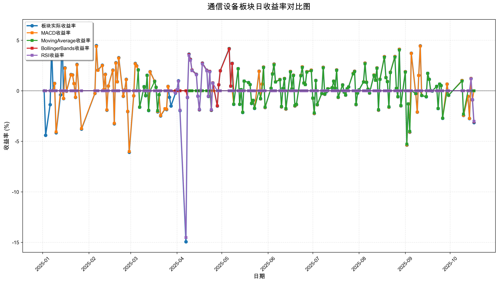
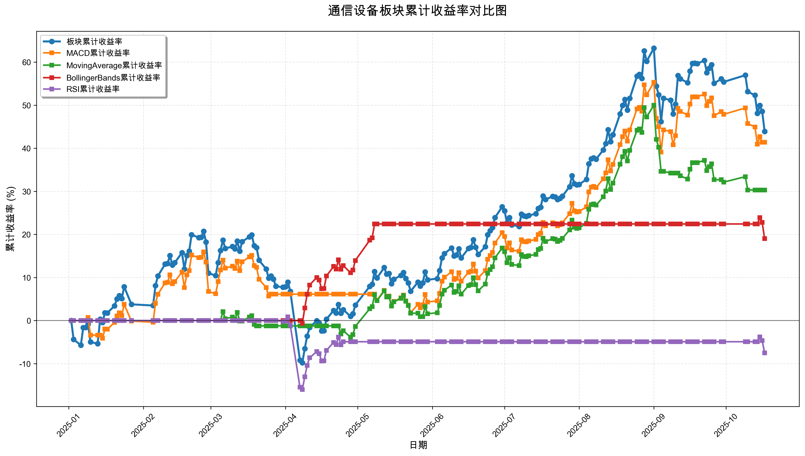

# 策略回测结果报告

**生成时间**: 2025-10-19 19:06:58
**行业板块**: 通信设备
**回测期间**: 20250101 至 20251017
**策略数量**: 4

## 📈 分析结论

### 策略表现分析
- **最佳策略**: MACD (总收益率: 41.39%)
- **最差策略**: RSI (总收益率: -7.52%)
### 交易活跃度分析
- **活跃策略**: 4 个
- **非活跃策略**: 0 个
- **最活跃策略**: MovingAverage (交易次数: 16)
### 🚨 异动提醒分析
- **板块异动**: 通信设备 近两周出现大幅波动 (最大单日: 3.15%)
- **板块异动**: 通信设备 近两周波动频繁 (方向变化频率: 64.3%)
- **策略异动**: BollingerBands 近两周出现大幅波动 (最大单日: 3.07%)
- **策略异动**: RSI 近两周出现大幅波动 (最大单日: 3.02%)
### 风险分析
- **MACD**: 最大回撤 -12.19%, 夏普比率 2.2359
- **MovingAverage**: 最大回撤 -13.12%, 夏普比率 2.1243
- **BollingerBands**: 最大回撤 -3.93%, 夏普比率 2.3134
- **RSI**: 最大回撤 -16.71%, 夏普比率 -0.5108

## 📊 综合结果表

| 策略名称           | 初始资金     | 最终价值     | 总收益率   | 年化收益率   | 波动率    |    夏普比率 | 最大回撤    | 总交易次数   | 买入次数   | 卖出次数   | 总交易金额      | 平均交易金额   | 交易频率   |   数据点数 |
|:---------------|:---------|:---------|:-------|:--------|:-------|--------:|:--------|:--------|:-------|:-------|:-----------|:---------|:-------|-------:|
| 板块实际表现         | ¥100,000 | ¥143,885 | 43.89% | 62.02%  | 35.06% |  1.7692 | -25.26% | N/A     | N/A    | N/A    | N/A        | N/A      | N/A    |    190 |
| MACD           | ¥100,000 | ¥141,387 | 41.39% | 58.30%  | 26.08% |  2.2359 | -12.19% | 6       | 3      | 3      | ¥638,831   | ¥106,472 | 0.03   |    190 |
| MovingAverage  | ¥100,000 | ¥130,313 | 30.31% | 42.07%  | 19.81% |  2.1243 | -13.12% | 16      | 8      | 8      | ¥1,786,375 | ¥111,648 | 0.08   |    190 |
| BollingerBands | ¥100,000 | ¥119,016 | 19.02% | 25.97%  | 11.23% |  2.3134 | -3.93%  | 3       | 2      | 1      | ¥339,853   | ¥113,284 | 0.02   |    190 |
| RSI            | ¥100,000 | ¥92,478  | -7.52% | -9.85%  | 19.29% | -0.5108 | -16.71% | 3       | 2      | 1      | ¥280,911   | ¥93,637  | 0.02   |    190 |

## 📊 每日收益率走势图

*图1: 通信设备板块每日收益率走势对比*

## 📈 累计收益率走势图

*图2: 通信设备板块累计收益率走势对比*

## 📅 日收益明细表

| 日期         | 板块实际收益率   | MACD收益率   | MovingAverage收益率   | BollingerBands收益率   | RSI收益率   |
|:-----------|:----------|:----------|:-------------------|:--------------------|:---------|
| 2025-01-02 | 0.00%     | 0.00%     | 0.00%              | 0.00%               | 0.00%    |
| 2025-01-03 | -4.40%    | 0.00%     | 0.00%              | 0.00%               | 0.00%    |
| 2025-01-06 | -1.38%    | 0.00%     | 0.00%              | 0.00%               | 0.00%    |
| 2025-01-07 | 4.32%     | 0.00%     | 0.00%              | 0.00%               | 0.00%    |
| 2025-01-08 | 0.07%     | 0.00%     | 0.00%              | 0.00%               | 0.00%    |
| 2025-01-09 | 0.73%     | 0.72%     | 0.00%              | 0.00%               | 0.00%    |
| 2025-01-10 | -4.16%    | -4.07%    | 0.00%              | 0.00%               | 0.00%    |
| 2025-01-13 | -0.41%    | 0.00%     | 0.00%              | 0.00%               | 0.00%    |
| 2025-01-14 | 6.02%     | 0.00%     | 0.00%              | 0.00%               | 0.00%    |
| 2025-01-15 | -0.77%    | -0.76%    | 0.00%              | 0.00%               | 0.00%    |
| 2025-01-16 | 2.27%     | 2.23%     | 0.00%              | 0.00%               | 0.00%    |
| 2025-01-17 | -0.04%    | -0.04%    | 0.00%              | 0.00%               | 0.00%    |
| 2025-01-20 | 1.61%     | 1.58%     | 0.00%              | 0.00%               | 0.00%    |
| 2025-01-21 | 1.57%     | 1.55%     | 0.00%              | 0.00%               | 0.00%    |
| 2025-01-22 | 0.72%     | 0.71%     | 0.00%              | 0.00%               | 0.00%    |
| 2025-01-23 | -0.65%    | -0.64%    | 0.00%              | 0.00%               | 0.00%    |
| 2025-01-24 | 2.61%     | 2.57%     | 0.00%              | 0.00%               | 0.00%    |
| 2025-01-27 | -3.79%    | -3.74%    | 0.00%              | 0.00%               | 0.00%    |
| 2025-02-05 | -0.26%    | -0.25%    | 0.00%              | 0.00%               | 0.00%    |
| 2025-02-06 | 4.47%     | 4.40%     | 0.00%              | 0.00%               | 0.00%    |
| 2025-02-07 | 2.05%     | 2.02%     | 0.00%              | 0.00%               | 0.00%    |
| 2025-02-10 | 2.53%     | 2.49%     | 0.00%              | 0.00%               | 0.00%    |
| 2025-02-11 | 0.12%     | 0.12%     | 0.00%              | 0.00%               | 0.00%    |
| 2025-02-12 | 1.63%     | 1.61%     | 0.00%              | 0.00%               | 0.00%    |
| 2025-02-13 | -1.92%    | -1.90%    | 0.00%              | 0.00%               | 0.00%    |
| 2025-02-14 | 0.47%     | 0.47%     | 0.00%              | 0.00%               | 0.00%    |
| 2025-02-17 | 2.05%     | 2.02%     | 0.00%              | 0.00%               | 0.00%    |
| 2025-02-18 | -3.27%    | -3.22%    | 0.00%              | 0.00%               | 0.00%    |
| 2025-02-19 | 2.78%     | 2.74%     | 0.00%              | 0.00%               | 0.00%    |
| 2025-02-20 | 0.90%     | 0.89%     | 0.00%              | 0.00%               | 0.00%    |
| 2025-02-21 | 3.28%     | 3.24%     | 0.00%              | 0.00%               | 0.00%    |
| 2025-02-24 | -0.55%    | -0.54%    | 0.00%              | 0.00%               | 0.00%    |
| 2025-02-25 | 0.08%     | 0.07%     | 0.00%              | 0.00%               | 0.00%    |
| 2025-02-26 | 1.13%     | 1.11%     | 0.00%              | 0.00%               | 0.00%    |
| 2025-02-27 | -2.06%    | -2.04%    | 0.00%              | 0.00%               | 0.00%    |
| 2025-02-28 | -6.09%    | -6.01%    | 0.00%              | 0.00%               | 0.00%    |
| 2025-03-03 | -0.50%    | -0.50%    | 0.00%              | 0.00%               | 0.00%    |
| 2025-03-04 | 2.71%     | 2.67%     | 0.00%              | 0.00%               | 0.00%    |
| 2025-03-05 | 2.47%     | 2.44%     | 0.00%              | 0.00%               | 0.00%    |
| 2025-03-06 | 2.08%     | 2.05%     | 2.06%              | 0.00%               | 0.00%    |
| 2025-03-07 | -1.63%    | -1.61%    | -1.62%             | 0.00%               | 0.00%    |
| 2025-03-10 | 0.41%     | 0.40%     | 0.40%              | 0.00%               | 0.00%    |
| 2025-03-11 | -0.49%    | -0.48%    | -0.48%             | 0.00%               | 0.00%    |
| 2025-03-12 | 1.54%     | 1.52%     | 1.53%              | 0.00%               | 0.00%    |
| 2025-03-13 | -1.96%    | -1.93%    | -1.94%             | 0.00%               | 0.00%    |
| 2025-03-14 | 1.89%     | 1.87%     | 0.00%              | 0.00%               | 0.00%    |
| 2025-03-17 | 0.96%     | 0.95%     | 0.92%              | 0.00%               | 0.00%    |
| 2025-03-18 | 0.35%     | 0.34%     | 0.33%              | 0.00%               | 0.00%    |
| 2025-03-19 | -2.08%    | -2.05%    | -1.98%             | 0.00%               | 0.00%    |
| 2025-03-20 | -0.40%    | -0.39%    | -0.38%             | 0.00%               | 0.00%    |
| 2025-03-21 | -2.49%    | -2.45%    | 0.00%              | 0.00%               | 0.00%    |
| 2025-03-24 | -1.79%    | -1.77%    | 0.00%              | 0.00%               | 0.00%    |
| 2025-03-25 | -1.86%    | -1.83%    | 0.00%              | 0.00%               | 0.00%    |
| 2025-03-26 | 0.43%     | 0.42%     | 0.00%              | 0.00%               | 0.00%    |
| 2025-03-27 | -0.64%    | 0.00%     | 0.00%              | 0.00%               | 0.00%    |
| 2025-03-28 | -1.51%    | 0.00%     | 0.00%              | 0.00%               | 0.00%    |
| 2025-03-31 | -0.24%    | 0.00%     | 0.00%              | 0.00%               | -0.23%   |
| 2025-04-01 | 0.11%     | 0.00%     | 0.00%              | 0.00%               | 0.10%    |
| 2025-04-02 | 0.99%     | 0.00%     | 0.00%              | 0.00%               | 0.96%    |
| 2025-04-03 | -1.97%    | 0.00%     | 0.00%              | 0.00%               | -1.92%   |
| 2025-04-07 | -14.94%   | 0.00%     | 0.00%              | 0.00%               | -14.53%  |
| 2025-04-08 | -0.66%    | 0.00%     | 0.00%              | -0.66%              | -0.64%   |
| 2025-04-09 | 3.63%     | 0.00%     | 0.00%              | 3.59%               | 3.51%    |
| 2025-04-10 | 3.12%     | 0.00%     | 0.00%              | 3.09%               | 3.02%    |
| 2025-04-11 | 2.06%     | 0.00%     | 0.00%              | 2.04%               | 1.99%    |
| 2025-04-14 | 1.63%     | 0.00%     | 0.00%              | 1.61%               | 1.58%    |
| 2025-04-15 | -0.54%    | 0.00%     | 0.00%              | -0.54%              | -0.53%   |
| 2025-04-16 | -1.88%    | 0.00%     | 0.00%              | -1.86%              | -1.82%   |
| 2025-04-17 | 0.05%     | 0.00%     | 0.00%              | 0.05%               | 0.05%    |
| 2025-04-18 | 2.74%     | 0.00%     | 0.00%              | 2.72%               | 2.66%    |
| 2025-04-21 | 2.03%     | 0.00%     | 0.00%              | 2.01%               | 1.97%    |
| 2025-04-22 | -0.56%    | 0.00%     | 0.00%              | -0.55%              | -0.54%   |
| 2025-04-23 | 1.92%     | 0.00%     | 0.00%              | 1.91%               | 1.87%    |
| 2025-04-24 | -1.93%    | 0.00%     | -1.92%             | -1.91%              | -1.87%   |
| 2025-04-25 | 0.78%     | 0.00%     | 0.78%              | 0.78%               | 0.76%    |
| 2025-04-28 | -1.50%    | 0.00%     | -1.49%             | -1.49%              | 0.00%    |
| 2025-04-29 | 0.59%     | 0.00%     | 0.59%              | 0.59%               | 0.00%    |
| 2025-04-30 | 1.99%     | 0.00%     | 1.98%              | 1.97%               | 0.00%    |
| 2025-05-06 | 4.18%     | 0.00%     | 4.16%              | 4.14%               | 0.00%    |
| 2025-05-07 | 0.46%     | 0.00%     | 0.46%              | 0.46%               | 0.00%    |
| 2025-05-08 | 2.72%     | 0.00%     | 2.71%              | 2.70%               | 0.00%    |
| 2025-05-09 | -1.34%    | -1.33%    | -1.33%             | 0.00%               | 0.00%    |
| 2025-05-12 | 2.19%     | 2.18%     | 2.19%              | 0.00%               | 0.00%    |
| 2025-05-13 | -1.34%    | -1.34%    | -1.34%             | 0.00%               | 0.00%    |
| 2025-05-14 | 0.12%     | 0.12%     | 0.12%              | 0.00%               | 0.00%    |
| 2025-05-15 | -2.14%    | -2.12%    | -2.13%             | 0.00%               | 0.00%    |
| 2025-05-16 | 0.96%     | 0.96%     | 0.96%              | 0.00%               | 0.00%    |
| 2025-05-19 | 0.81%     | 0.80%     | 0.80%              | 0.00%               | 0.00%    |
| 2025-05-20 | 0.61%     | 0.61%     | 0.61%              | 0.00%               | 0.00%    |
| 2025-05-21 | -1.26%    | -1.25%    | -1.25%             | 0.00%               | 0.00%    |
| 2025-05-22 | -0.95%    | -0.94%    | -0.94%             | 0.00%               | 0.00%    |
| 2025-05-23 | -1.74%    | -1.73%    | -1.73%             | 0.00%               | 0.00%    |
| 2025-05-26 | 1.94%     | 1.93%     | 0.00%              | 0.00%               | 0.00%    |
| 2025-05-27 | -0.80%    | -0.79%    | -0.77%             | 0.00%               | 0.00%    |
| 2025-05-28 | 0.66%     | 0.66%     | 0.00%              | 0.00%               | 0.00%    |
| 2025-05-29 | 2.35%     | 2.34%     | 2.29%              | 0.00%               | 0.00%    |
| 2025-05-30 | -1.66%    | -1.65%    | -1.61%             | 0.00%               | 0.00%    |
| 2025-06-03 | 0.25%     | 0.25%     | 0.24%              | 0.00%               | 0.00%    |
| 2025-06-04 | 1.69%     | 1.68%     | 1.64%              | 0.00%               | 0.00%    |
| 2025-06-05 | 2.65%     | 2.63%     | 2.57%              | 0.00%               | 0.00%    |
| 2025-06-06 | 0.89%     | 0.88%     | 0.86%              | 0.00%               | 0.00%    |
| 2025-06-09 | 1.12%     | 1.12%     | 1.09%              | 0.00%               | 0.00%    |
| 2025-06-10 | -1.60%    | -1.59%    | -1.55%             | 0.00%               | 0.00%    |
| 2025-06-11 | 0.22%     | 0.22%     | 0.22%              | 0.00%               | 0.00%    |
| 2025-06-12 | 1.22%     | 1.22%     | 1.19%              | 0.00%               | 0.00%    |
| 2025-06-13 | -1.81%    | -1.80%    | -1.76%             | 0.00%               | 0.00%    |
| 2025-06-16 | 1.92%     | 1.91%     | 1.87%              | 0.00%               | 0.00%    |
| 2025-06-17 | 0.19%     | 0.19%     | 0.18%              | 0.00%               | 0.00%    |
| 2025-06-18 | 1.55%     | 1.54%     | 1.50%              | 0.00%               | 0.00%    |
| 2025-06-19 | -1.50%    | -1.49%    | -1.46%             | 0.00%               | 0.00%    |
| 2025-06-20 | -1.38%    | -1.37%    | -1.34%             | 0.00%               | 0.00%    |
| 2025-06-23 | 1.53%     | 1.52%     | 1.48%              | 0.00%               | 0.00%    |
| 2025-06-24 | 2.37%     | 2.36%     | 2.31%              | 0.00%               | 0.00%    |
| 2025-06-25 | 0.78%     | 0.77%     | 0.76%              | 0.00%               | 0.00%    |
| 2025-06-26 | 0.62%     | 0.62%     | 0.60%              | 0.00%               | 0.00%    |
| 2025-06-27 | 1.89%     | 1.88%     | 1.84%              | 0.00%               | 0.00%    |
| 2025-06-30 | 2.05%     | 2.04%     | 1.99%              | 0.00%               | 0.00%    |
| 2025-07-01 | -0.74%    | -0.74%    | -0.73%             | 0.00%               | 0.00%    |
| 2025-07-02 | -2.25%    | -2.24%    | -2.19%             | 0.00%               | 0.00%    |
| 2025-07-03 | 1.03%     | 1.02%     | 1.00%              | 0.00%               | 0.00%    |
| 2025-07-04 | -1.39%    | -1.39%    | -1.36%             | 0.00%               | 0.00%    |
| 2025-07-07 | -0.27%    | -0.27%    | -0.26%             | 0.00%               | 0.00%    |
| 2025-07-08 | 2.33%     | 2.32%     | 2.27%              | 0.00%               | 0.00%    |
| 2025-07-09 | -0.34%    | -0.34%    | -0.33%             | 0.00%               | 0.00%    |
| 2025-07-10 | -0.10%    | -0.10%    | -0.10%             | 0.00%               | 0.00%    |
| 2025-07-11 | 0.20%     | 0.20%     | 0.19%              | 0.00%               | 0.00%    |
| 2025-07-14 | 0.31%     | 0.31%     | 0.30%              | 0.00%               | 0.00%    |
| 2025-07-15 | 0.96%     | 0.96%     | 0.94%              | 0.00%               | 0.00%    |
| 2025-07-16 | 0.26%     | 0.26%     | 0.25%              | 0.00%               | 0.00%    |
| 2025-07-17 | 2.07%     | 2.06%     | 2.02%              | 0.00%               | 0.00%    |
| 2025-07-18 | -0.65%    | -0.65%    | -0.63%             | 0.00%               | 0.00%    |
| 2025-07-21 | 0.59%     | 0.58%     | 0.57%              | 0.00%               | 0.00%    |
| 2025-07-22 | -0.13%    | -0.13%    | -0.13%             | 0.00%               | 0.00%    |
| 2025-07-23 | -0.43%    | -0.43%    | -0.42%             | 0.00%               | 0.00%    |
| 2025-07-24 | 0.20%     | 0.20%     | 0.20%              | 0.00%               | 0.00%    |
| 2025-07-25 | 0.39%     | 0.38%     | 0.38%              | 0.00%               | 0.00%    |
| 2025-07-28 | 1.72%     | 1.71%     | 1.67%              | 0.00%               | 0.00%    |
| 2025-07-29 | 1.94%     | 1.93%     | 1.89%              | 0.00%               | 0.00%    |
| 2025-07-30 | -1.37%    | -1.36%    | -1.34%             | 0.00%               | 0.00%    |
| 2025-07-31 | -0.23%    | -0.23%    | -0.23%             | 0.00%               | 0.00%    |
| 2025-08-01 | 0.09%     | 0.09%     | 0.09%              | 0.00%               | 0.00%    |
| 2025-08-04 | 0.88%     | 0.87%     | 0.86%              | 0.00%               | 0.00%    |
| 2025-08-05 | 2.74%     | 2.73%     | 2.67%              | 0.00%               | 0.00%    |
| 2025-08-06 | 0.85%     | 0.85%     | 0.83%              | 0.00%               | 0.00%    |
| 2025-08-07 | 0.16%     | 0.16%     | 0.15%              | 0.00%               | 0.00%    |
| 2025-08-08 | -0.23%    | -0.23%    | -0.22%             | 0.00%               | 0.00%    |
| 2025-08-11 | 1.56%     | 1.56%     | 1.53%              | 0.00%               | 0.00%    |
| 2025-08-12 | 1.06%     | 1.05%     | 1.03%              | 0.00%               | 0.00%    |
| 2025-08-13 | 2.27%     | 2.26%     | 2.22%              | 0.00%               | 0.00%    |
| 2025-08-14 | -1.92%    | -1.91%    | -1.87%             | 0.00%               | 0.00%    |
| 2025-08-15 | 1.15%     | 1.15%     | 1.12%              | 0.00%               | 0.00%    |
| 2025-08-18 | 3.38%     | 3.37%     | 3.31%              | 0.00%               | 0.00%    |
| 2025-08-19 | 1.32%     | 1.31%     | 1.29%              | 0.00%               | 0.00%    |
| 2025-08-20 | 0.92%     | 0.92%     | 0.90%              | 0.00%               | 0.00%    |
| 2025-08-21 | -1.62%    | -1.62%    | -1.59%             | 0.00%               | 0.00%    |
| 2025-08-22 | 1.84%     | 1.83%     | 1.80%              | 0.00%               | 0.00%    |
| 2025-08-25 | 3.39%     | 3.38%     | 3.32%              | 0.00%               | 0.00%    |
| 2025-08-26 | 0.24%     | 0.24%     | 0.24%              | 0.00%               | 0.00%    |
| 2025-08-27 | -0.60%    | -0.59%    | -0.58%             | 0.00%               | 0.00%    |
| 2025-08-28 | 4.11%     | 4.10%     | 4.03%              | 0.00%               | 0.00%    |
| 2025-08-29 | -1.49%    | -1.48%    | -1.46%             | 0.00%               | 0.00%    |
| 2025-09-01 | 1.89%     | 1.88%     | 1.85%              | 0.00%               | 0.00%    |
| 2025-09-02 | -5.38%    | -5.37%    | -5.28%             | 0.00%               | 0.00%    |
| 2025-09-03 | -1.31%    | -1.31%    | -1.29%             | 0.00%               | 0.00%    |
| 2025-09-04 | -4.10%    | -4.08%    | -4.01%             | 0.00%               | 0.00%    |
| 2025-09-05 | 3.72%     | 3.70%     | 0.00%              | 0.00%               | 0.00%    |
| 2025-09-08 | -0.29%    | -0.29%    | -0.28%             | 0.00%               | 0.00%    |
| 2025-09-09 | -2.11%    | -2.11%    | 0.00%              | 0.00%               | 0.00%    |
| 2025-09-10 | 1.52%     | 1.51%     | 0.00%              | 0.00%               | 0.00%    |
| 2025-09-11 | 4.45%     | 4.43%     | 0.00%              | 0.00%               | 0.00%    |
| 2025-09-12 | -0.47%    | -0.47%    | -0.47%             | 0.00%               | 0.00%    |
| 2025-09-15 | -0.59%    | -0.58%    | -0.58%             | 0.00%               | 0.00%    |
| 2025-09-16 | 1.73%     | 1.72%     | 1.72%              | 0.00%               | 0.00%    |
| 2025-09-17 | 1.13%     | 1.13%     | 1.13%              | 0.00%               | 0.00%    |
| 2025-09-18 | 0.02%     | 0.02%     | 0.02%              | 0.00%               | 0.00%    |
| 2025-09-19 | -0.03%    | -0.03%    | -0.03%             | 0.00%               | 0.00%    |
| 2025-09-22 | 0.43%     | 0.43%     | 0.43%              | 0.00%               | 0.00%    |
| 2025-09-23 | -1.75%    | -1.75%    | -1.75%             | 0.00%               | 0.00%    |
| 2025-09-24 | 0.66%     | 0.66%     | 0.66%              | 0.00%               | 0.00%    |
| 2025-09-25 | 0.52%     | 0.51%     | 0.52%              | 0.00%               | 0.00%    |
| 2025-09-26 | -2.72%    | -2.71%    | -2.71%             | 0.00%               | 0.00%    |
| 2025-09-29 | 0.66%     | 0.66%     | 0.00%              | 0.00%               | 0.00%    |
| 2025-09-30 | -0.45%    | -0.45%    | -0.43%             | 0.00%               | 0.00%    |
| 2025-10-09 | 1.01%     | 1.01%     | 0.96%              | 0.00%               | 0.00%    |
| 2025-10-10 | -2.44%    | -2.43%    | -2.31%             | 0.00%               | 0.00%    |
| 2025-10-13 | -0.55%    | -0.55%    | 0.00%              | 0.00%               | 0.00%    |
| 2025-10-14 | -2.75%    | -2.74%    | 0.00%              | 0.00%               | 0.00%    |
| 2025-10-15 | 1.22%     | 1.22%     | 0.00%              | 1.19%               | 1.18%    |
| 2025-10-16 | -0.90%    | -0.90%    | 0.00%              | -0.88%              | -0.87%   |
| 2025-10-17 | -3.15%    | 0.00%     | 0.00%              | -3.07%              | -3.02%   |

## 📊 日收益统计摘要

| 指标                | 平均日收益率   | 最大日收益率   | 最小日收益率   | 正收益天数   | 负收益天数   |
|:------------------|:---------|:---------|:---------|:--------|:--------|
| 板块实际收益率           | 0.22%    | 6.02%    | -14.94%  | 111天    | 78天     |
| MACD收益率           | 0.20%    | 4.43%    | -6.01%   | 92天     | 63天     |
| MovingAverage收益率  | 0.15%    | 4.16%    | -5.28%   | 69天     | 46天     |
| BollingerBands收益率 | 0.09%    | 4.14%    | -3.07%   | 15天     | 8天      |
| RSI收益率            | -0.03%   | 3.51%    | -14.53%  | 12天     | 10天     |

## 📈 累计收益明细表

| 日期         | 板块累计收益率   | MACD累计收益率   | MovingAverage累计收益率   | BollingerBands累计收益率   | RSI累计收益率   |
|:-----------|:----------|:------------|:---------------------|:----------------------|:-----------|
| 2025-01-02 | 0.00%     | 0.00%       | 0.00%                | 0.00%                 | 0.00%      |
| 2025-01-03 | -4.40%    | 0.00%       | 0.00%                | 0.00%                 | 0.00%      |
| 2025-01-06 | -5.72%    | 0.00%       | 0.00%                | 0.00%                 | 0.00%      |
| 2025-01-07 | -1.65%    | 0.00%       | 0.00%                | 0.00%                 | 0.00%      |
| 2025-01-08 | -1.59%    | 0.00%       | 0.00%                | 0.00%                 | 0.00%      |
| 2025-01-09 | -0.86%    | 0.72%       | 0.00%                | 0.00%                 | 0.00%      |
| 2025-01-10 | -4.98%    | -3.38%      | 0.00%                | 0.00%                 | 0.00%      |
| 2025-01-13 | -5.38%    | -3.38%      | 0.00%                | 0.00%                 | 0.00%      |
| 2025-01-14 | 0.32%     | -3.38%      | 0.00%                | 0.00%                 | 0.00%      |
| 2025-01-15 | -0.45%    | -4.12%      | 0.00%                | 0.00%                 | 0.00%      |
| 2025-01-16 | 1.81%     | -1.97%      | 0.00%                | 0.00%                 | 0.00%      |
| 2025-01-17 | 1.77%     | -2.01%      | 0.00%                | 0.00%                 | 0.00%      |
| 2025-01-20 | 3.41%     | -0.46%      | 0.00%                | 0.00%                 | 0.00%      |
| 2025-01-21 | 5.03%     | 1.08%       | 0.00%                | 0.00%                 | 0.00%      |
| 2025-01-22 | 5.79%     | 1.80%       | 0.00%                | 0.00%                 | 0.00%      |
| 2025-01-23 | 5.10%     | 1.15%       | 0.00%                | 0.00%                 | 0.00%      |
| 2025-01-24 | 7.85%     | 3.75%       | 0.00%                | 0.00%                 | 0.00%      |
| 2025-01-27 | 3.76%     | -0.13%      | 0.00%                | 0.00%                 | 0.00%      |
| 2025-02-05 | 3.49%     | -0.38%      | 0.00%                | 0.00%                 | 0.00%      |
| 2025-02-06 | 8.12%     | 4.01%       | 0.00%                | 0.00%                 | 0.00%      |
| 2025-02-07 | 10.33%    | 6.11%       | 0.00%                | 0.00%                 | 0.00%      |
| 2025-02-10 | 13.12%    | 8.75%       | 0.00%                | 0.00%                 | 0.00%      |
| 2025-02-11 | 13.25%    | 8.88%       | 0.00%                | 0.00%                 | 0.00%      |
| 2025-02-12 | 15.10%    | 10.63%      | 0.00%                | 0.00%                 | 0.00%      |
| 2025-02-13 | 12.89%    | 8.53%       | 0.00%                | 0.00%                 | 0.00%      |
| 2025-02-14 | 13.42%    | 9.04%       | 0.00%                | 0.00%                 | 0.00%      |
| 2025-02-17 | 15.75%    | 11.24%      | 0.00%                | 0.00%                 | 0.00%      |
| 2025-02-18 | 11.97%    | 7.66%       | 0.00%                | 0.00%                 | 0.00%      |
| 2025-02-19 | 15.07%    | 10.61%      | 0.00%                | 0.00%                 | 0.00%      |
| 2025-02-20 | 16.11%    | 11.59%      | 0.00%                | 0.00%                 | 0.00%      |
| 2025-02-21 | 19.92%    | 15.20%      | 0.00%                | 0.00%                 | 0.00%      |
| 2025-02-24 | 19.26%    | 14.57%      | 0.00%                | 0.00%                 | 0.00%      |
| 2025-02-25 | 19.35%    | 14.66%      | 0.00%                | 0.00%                 | 0.00%      |
| 2025-02-26 | 20.70%    | 15.94%      | 0.00%                | 0.00%                 | 0.00%      |
| 2025-02-27 | 18.20%    | 13.57%      | 0.00%                | 0.00%                 | 0.00%      |
| 2025-02-28 | 11.00%    | 6.75%       | 0.00%                | 0.00%                 | 0.00%      |
| 2025-03-03 | 10.44%    | 6.21%       | 0.00%                | 0.00%                 | 0.00%      |
| 2025-03-04 | 13.44%    | 9.05%       | 0.00%                | 0.00%                 | 0.00%      |
| 2025-03-05 | 16.24%    | 11.71%      | 0.00%                | 0.00%                 | 0.00%      |
| 2025-03-06 | 18.66%    | 14.00%      | 2.06%                | 0.00%                 | 0.00%      |
| 2025-03-07 | 16.72%    | 12.17%      | 0.41%                | 0.00%                 | 0.00%      |
| 2025-03-10 | 17.20%    | 12.62%      | 0.82%                | 0.00%                 | 0.00%      |
| 2025-03-11 | 16.63%    | 12.08%      | 0.33%                | 0.00%                 | 0.00%      |
| 2025-03-12 | 18.43%    | 13.79%      | 1.87%                | 0.00%                 | 0.00%      |
| 2025-03-13 | 16.11%    | 11.59%      | -0.11%               | 0.00%                 | 0.00%      |
| 2025-03-14 | 18.31%    | 13.67%      | -0.11%               | 0.00%                 | 0.00%      |
| 2025-03-17 | 19.44%    | 14.75%      | 0.80%                | 0.00%                 | 0.00%      |
| 2025-03-18 | 19.86%    | 15.15%      | 1.14%                | 0.00%                 | 0.00%      |
| 2025-03-19 | 17.37%    | 12.78%      | -0.87%               | 0.00%                 | 0.00%      |
| 2025-03-20 | 16.90%    | 12.34%      | -1.24%               | 0.00%                 | 0.00%      |
| 2025-03-21 | 14.00%    | 9.59%       | -1.24%               | 0.00%                 | 0.00%      |
| 2025-03-24 | 11.95%    | 7.65%       | -1.24%               | 0.00%                 | 0.00%      |
| 2025-03-25 | 9.87%     | 5.67%       | -1.24%               | 0.00%                 | 0.00%      |
| 2025-03-26 | 10.34%    | 6.12%       | -1.24%               | 0.00%                 | 0.00%      |
| 2025-03-27 | 9.64%     | 6.12%       | -1.24%               | 0.00%                 | 0.00%      |
| 2025-03-28 | 7.98%     | 6.12%       | -1.24%               | 0.00%                 | 0.00%      |
| 2025-03-31 | 7.73%     | 6.12%       | -1.24%               | 0.00%                 | -0.23%     |
| 2025-04-01 | 7.84%     | 6.12%       | -1.24%               | 0.00%                 | -0.13%     |
| 2025-04-02 | 8.91%     | 6.12%       | -1.24%               | 0.00%                 | 0.84%      |
| 2025-04-03 | 6.77%     | 6.12%       | -1.24%               | 0.00%                 | -1.10%     |
| 2025-04-07 | -9.19%    | 6.12%       | -1.24%               | 0.00%                 | -15.47%    |
| 2025-04-08 | -9.79%    | 6.12%       | -1.24%               | -0.66%                | -16.01%    |
| 2025-04-09 | -6.52%    | 6.12%       | -1.24%               | 2.91%                 | -13.06%    |
| 2025-04-10 | -3.60%    | 6.12%       | -1.24%               | 6.09%                 | -10.43%    |
| 2025-04-11 | -1.62%    | 6.12%       | -1.24%               | 8.25%                 | -8.65%     |
| 2025-04-14 | -0.02%    | 6.12%       | -1.24%               | 10.00%                | -7.21%     |
| 2025-04-15 | -0.56%    | 6.12%       | -1.24%               | 9.41%                 | -7.69%     |
| 2025-04-16 | -2.43%    | 6.12%       | -1.24%               | 7.37%                 | -9.38%     |
| 2025-04-17 | -2.38%    | 6.12%       | -1.24%               | 7.42%                 | -9.33%     |
| 2025-04-18 | 0.30%     | 6.12%       | -1.24%               | 10.34%                | -6.92%     |
| 2025-04-21 | 2.33%     | 6.12%       | -1.24%               | 12.56%                | -5.09%     |
| 2025-04-22 | 1.76%     | 6.12%       | -1.24%               | 11.94%                | -5.60%     |
| 2025-04-23 | 3.72%     | 6.12%       | -1.24%               | 14.08%                | -3.84%     |
| 2025-04-24 | 1.72%     | 6.12%       | -3.14%               | 11.89%                | -5.64%     |
| 2025-04-25 | 2.52%     | 6.12%       | -2.38%               | 12.76%                | -4.92%     |
| 2025-04-28 | 0.98%     | 6.12%       | -3.84%               | 11.09%                | -4.92%     |
| 2025-04-29 | 1.58%     | 6.12%       | -3.27%               | 11.74%                | -4.92%     |
| 2025-04-30 | 3.59%     | 6.12%       | -1.36%               | 13.94%                | -4.92%     |
| 2025-05-06 | 7.92%     | 6.12%       | 2.74%                | 18.65%                | -4.92%     |
| 2025-05-07 | 8.42%     | 6.12%       | 3.22%                | 19.20%                | -4.92%     |
| 2025-05-08 | 11.37%    | 6.12%       | 6.01%                | 22.42%                | -4.92%     |
| 2025-05-09 | 9.88%     | 4.71%       | 4.60%                | 22.42%                | -4.92%     |
| 2025-05-12 | 12.29%    | 6.99%       | 6.88%                | 22.42%                | -4.92%     |
| 2025-05-13 | 10.78%    | 5.56%       | 5.45%                | 22.42%                | -4.92%     |
| 2025-05-14 | 10.92%    | 5.69%       | 5.58%                | 22.42%                | -4.92%     |
| 2025-05-15 | 8.55%     | 3.44%       | 3.34%                | 22.42%                | -4.92%     |
| 2025-05-16 | 9.59%     | 4.43%       | 4.33%                | 22.42%                | -4.92%     |
| 2025-05-19 | 10.48%    | 5.27%       | 5.16%                | 22.42%                | -4.92%     |
| 2025-05-20 | 11.15%    | 5.91%       | 5.80%                | 22.42%                | -4.92%     |
| 2025-05-21 | 9.75%     | 4.58%       | 4.48%                | 22.42%                | -4.92%     |
| 2025-05-22 | 8.71%     | 3.60%       | 3.49%                | 22.42%                | -4.92%     |
| 2025-05-23 | 6.82%     | 1.81%       | 1.70%                | 22.42%                | -4.92%     |
| 2025-05-26 | 8.89%     | 3.77%       | 1.70%                | 22.42%                | -4.92%     |
| 2025-05-27 | 8.03%     | 2.95%       | 0.92%                | 22.42%                | -4.92%     |
| 2025-05-28 | 8.74%     | 3.63%       | 0.92%                | 22.42%                | -4.92%     |
| 2025-05-29 | 11.30%    | 6.05%       | 3.22%                | 22.42%                | -4.92%     |
| 2025-05-30 | 9.46%     | 4.30%       | 1.56%                | 22.42%                | -4.92%     |
| 2025-06-03 | 9.73%     | 4.56%       | 1.81%                | 22.42%                | -4.92%     |
| 2025-06-04 | 11.59%    | 6.32%       | 3.48%                | 22.42%                | -4.92%     |
| 2025-06-05 | 14.54%    | 9.12%       | 6.14%                | 22.42%                | -4.92%     |
| 2025-06-06 | 15.55%    | 10.08%      | 7.05%                | 22.42%                | -4.92%     |
| 2025-06-09 | 16.85%    | 11.31%      | 8.22%                | 22.42%                | -4.92%     |
| 2025-06-10 | 14.98%    | 9.54%       | 6.54%                | 22.42%                | -4.92%     |
| 2025-06-11 | 15.24%    | 9.78%       | 6.77%                | 22.42%                | -4.92%     |
| 2025-06-12 | 16.65%    | 11.12%      | 8.04%                | 22.42%                | -4.92%     |
| 2025-06-13 | 14.54%    | 9.12%       | 6.14%                | 22.42%                | -4.92%     |
| 2025-06-16 | 16.74%    | 11.21%      | 8.12%                | 22.42%                | -4.92%     |
| 2025-06-17 | 16.96%    | 11.42%      | 8.32%                | 22.42%                | -4.92%     |
| 2025-06-18 | 18.77%    | 13.13%      | 9.95%                | 22.42%                | -4.92%     |
| 2025-06-19 | 16.99%    | 11.44%      | 8.34%                | 22.42%                | -4.92%     |
| 2025-06-20 | 15.37%    | 9.91%       | 6.89%                | 22.42%                | -4.92%     |
| 2025-06-23 | 17.13%    | 11.58%      | 8.48%                | 22.42%                | -4.92%     |
| 2025-06-24 | 19.91%    | 14.22%      | 10.98%               | 22.42%                | -4.92%     |
| 2025-06-25 | 20.84%    | 15.10%      | 11.82%               | 22.42%                | -4.92%     |
| 2025-06-26 | 21.59%    | 15.81%      | 12.49%               | 22.42%                | -4.92%     |
| 2025-06-27 | 23.89%    | 17.99%      | 14.56%               | 22.42%                | -4.92%     |
| 2025-06-30 | 26.42%    | 20.39%      | 16.84%               | 22.42%                | -4.92%     |
| 2025-07-01 | 25.48%    | 19.50%      | 16.00%               | 22.42%                | -4.92%     |
| 2025-07-02 | 22.66%    | 16.82%      | 13.45%               | 22.42%                | -4.92%     |
| 2025-07-03 | 23.92%    | 18.02%      | 14.59%               | 22.42%                | -4.92%     |
| 2025-07-04 | 22.19%    | 16.38%      | 13.03%               | 22.42%                | -4.92%     |
| 2025-07-07 | 21.86%    | 16.07%      | 12.74%               | 22.42%                | -4.92%     |
| 2025-07-08 | 24.70%    | 18.76%      | 15.29%               | 22.42%                | -4.92%     |
| 2025-07-09 | 24.28%    | 18.36%      | 14.91%               | 22.42%                | -4.92%     |
| 2025-07-10 | 24.15%    | 18.24%      | 14.80%               | 22.42%                | -4.92%     |
| 2025-07-11 | 24.40%    | 18.47%      | 15.02%               | 22.42%                | -4.92%     |
| 2025-07-14 | 24.78%    | 18.84%      | 15.37%               | 22.42%                | -4.92%     |
| 2025-07-15 | 25.98%    | 19.98%      | 16.45%               | 22.42%                | -4.92%     |
| 2025-07-16 | 26.31%    | 20.29%      | 16.75%               | 22.42%                | -4.92%     |
| 2025-07-17 | 28.92%    | 22.76%      | 19.10%               | 22.42%                | -4.92%     |
| 2025-07-18 | 28.09%    | 21.97%      | 18.34%               | 22.42%                | -4.92%     |
| 2025-07-21 | 28.84%    | 22.68%      | 19.02%               | 22.42%                | -4.92%     |
| 2025-07-22 | 28.67%    | 22.52%      | 18.87%               | 22.42%                | -4.92%     |
| 2025-07-23 | 28.11%    | 21.99%      | 18.37%               | 22.42%                | -4.92%     |
| 2025-07-24 | 28.37%    | 22.24%      | 18.60%               | 22.42%                | -4.92%     |
| 2025-07-25 | 28.87%    | 22.71%      | 19.05%               | 22.42%                | -4.92%     |
| 2025-07-28 | 31.08%    | 24.81%      | 21.04%               | 22.42%                | -4.92%     |
| 2025-07-29 | 33.62%    | 27.22%      | 23.33%               | 22.42%                | -4.92%     |
| 2025-07-30 | 31.79%    | 25.48%      | 21.68%               | 22.42%                | -4.92%     |
| 2025-07-31 | 31.49%    | 25.19%      | 21.41%               | 22.42%                | -4.92%     |
| 2025-08-01 | 31.61%    | 25.31%      | 21.51%               | 22.42%                | -4.92%     |
| 2025-08-04 | 32.76%    | 26.40%      | 22.56%               | 22.42%                | -4.92%     |
| 2025-08-05 | 36.40%    | 29.85%      | 25.83%               | 22.42%                | -4.92%     |
| 2025-08-06 | 37.56%    | 30.95%      | 26.88%               | 22.42%                | -4.92%     |
| 2025-08-07 | 37.78%    | 31.16%      | 27.07%               | 22.42%                | -4.92%     |
| 2025-08-08 | 37.46%    | 30.86%      | 26.79%               | 22.42%                | -4.92%     |
| 2025-08-11 | 39.61%    | 32.90%      | 28.72%               | 22.42%                | -4.92%     |
| 2025-08-12 | 41.09%    | 34.30%      | 30.06%               | 22.42%                | -4.92%     |
| 2025-08-13 | 44.29%    | 37.33%      | 32.94%               | 22.42%                | -4.92%     |
| 2025-08-14 | 41.52%    | 34.71%      | 30.45%               | 22.42%                | -4.92%     |
| 2025-08-15 | 43.15%    | 36.25%      | 31.91%               | 22.42%                | -4.92%     |
| 2025-08-18 | 47.99%    | 40.85%      | 36.28%               | 22.42%                | -4.92%     |
| 2025-08-19 | 49.94%    | 42.70%      | 38.03%               | 22.42%                | -4.92%     |
| 2025-08-20 | 51.32%    | 44.00%      | 39.28%               | 22.42%                | -4.92%     |
| 2025-08-21 | 48.87%    | 41.68%      | 37.07%               | 22.42%                | -4.92%     |
| 2025-08-22 | 51.61%    | 44.27%      | 39.53%               | 22.42%                | -4.92%     |
| 2025-08-25 | 56.75%    | 49.15%      | 44.16%               | 22.42%                | -4.92%     |
| 2025-08-26 | 57.13%    | 49.51%      | 44.50%               | 22.42%                | -4.92%     |
| 2025-08-27 | 56.19%    | 48.62%      | 43.66%               | 22.42%                | -4.92%     |
| 2025-08-28 | 62.61%    | 54.71%      | 49.44%               | 22.42%                | -4.92%     |
| 2025-08-29 | 60.19%    | 52.41%      | 47.27%               | 22.42%                | -4.92%     |
| 2025-09-01 | 63.22%    | 55.29%      | 49.99%               | 22.42%                | -4.92%     |
| 2025-09-02 | 54.43%    | 46.95%      | 42.08%               | 22.42%                | -4.92%     |
| 2025-09-03 | 52.40%    | 45.03%      | 40.25%               | 22.42%                | -4.92%     |
| 2025-09-04 | 46.16%    | 39.11%      | 34.63%               | 22.42%                | -4.92%     |
| 2025-09-05 | 51.59%    | 44.26%      | 34.63%               | 22.42%                | -4.92%     |
| 2025-09-08 | 51.15%    | 43.84%      | 34.24%               | 22.42%                | -4.92%     |
| 2025-09-09 | 47.95%    | 40.81%      | 34.24%               | 22.42%                | -4.92%     |
| 2025-09-10 | 50.19%    | 42.93%      | 34.24%               | 22.42%                | -4.92%     |
| 2025-09-11 | 56.88%    | 49.27%      | 34.24%               | 22.42%                | -4.92%     |
| 2025-09-12 | 56.13%    | 48.56%      | 33.61%               | 22.42%                | -4.92%     |
| 2025-09-15 | 55.22%    | 47.70%      | 32.83%               | 22.42%                | -4.92%     |
| 2025-09-16 | 57.90%    | 50.24%      | 35.12%               | 22.42%                | -4.92%     |
| 2025-09-17 | 59.68%    | 51.93%      | 36.64%               | 22.42%                | -4.92%     |
| 2025-09-18 | 59.72%    | 51.96%      | 36.67%               | 22.42%                | -4.92%     |
| 2025-09-19 | 59.67%    | 51.92%      | 36.63%               | 22.42%                | -4.92%     |
| 2025-09-22 | 60.36%    | 52.57%      | 37.21%               | 22.42%                | -4.92%     |
| 2025-09-23 | 57.55%    | 49.91%      | 34.82%               | 22.42%                | -4.92%     |
| 2025-09-24 | 58.59%    | 50.89%      | 35.70%               | 22.42%                | -4.92%     |
| 2025-09-25 | 59.40%    | 51.67%      | 36.40%               | 22.42%                | -4.92%     |
| 2025-09-26 | 55.07%    | 47.55%      | 32.70%               | 22.42%                | -4.92%     |
| 2025-09-29 | 56.10%    | 48.53%      | 32.70%               | 22.42%                | -4.92%     |
| 2025-09-30 | 55.40%    | 47.87%      | 32.13%               | 22.42%                | -4.92%     |
| 2025-10-09 | 56.96%    | 49.35%      | 33.40%               | 22.42%                | -4.92%     |
| 2025-10-10 | 53.14%    | 45.72%      | 30.31%               | 22.42%                | -4.92%     |
| 2025-10-13 | 52.29%    | 44.92%      | 30.31%               | 22.42%                | -4.92%     |
| 2025-10-14 | 48.10%    | 40.95%      | 30.31%               | 22.42%                | -4.92%     |
| 2025-10-15 | 49.92%    | 42.67%      | 30.31%               | 23.88%                | -3.80%     |
| 2025-10-16 | 48.56%    | 41.39%      | 30.31%               | 22.79%                | -4.64%     |
| 2025-10-17 | 43.89%    | 41.39%      | 30.31%               | 19.02%                | -7.52%     |

## 📊 累计收益统计摘要

| 指标                  | 最终累计收益率   | 最大累计收益率   | 最小累计收益率   | 累计收益波动   | 收益稳定性   |
|:--------------------|:----------|:----------|:----------|:---------|:--------|
| 板块累计收益率             | 43.89%    | 63.22%    | -9.79%    | 73.01%   | 波动      |
| MACD累计收益率           | 41.39%    | 55.29%    | -4.12%    | 59.41%   | 波动      |
| MovingAverage累计收益率  | 30.31%    | 49.99%    | -3.84%    | 53.83%   | 波动      |
| BollingerBands累计收益率 | 19.02%    | 23.88%    | -0.66%    | 24.54%   | 波动      |
| RSI累计收益率            | -7.52%    | 0.84%     | -16.01%   | 16.85%   | 稳定      |

