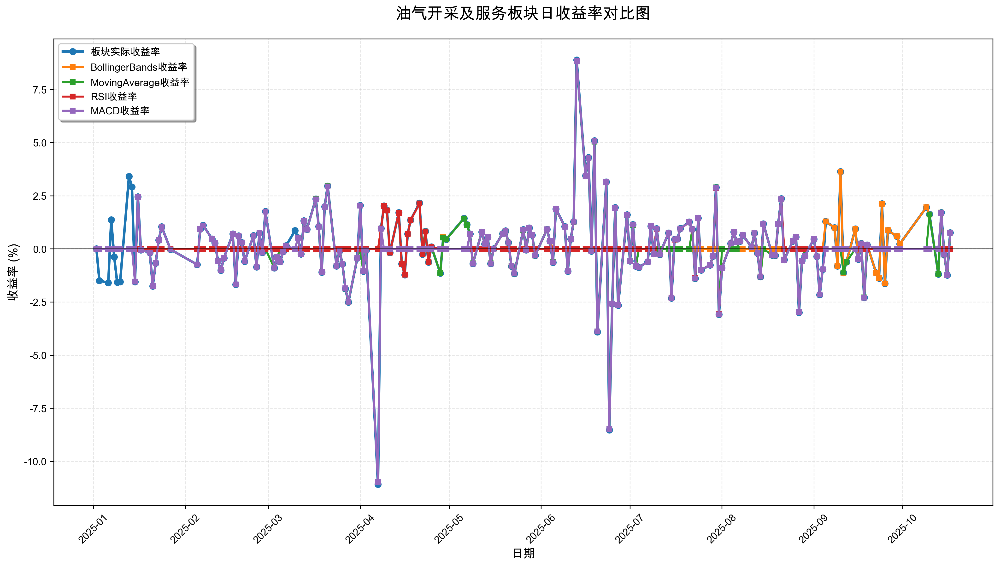
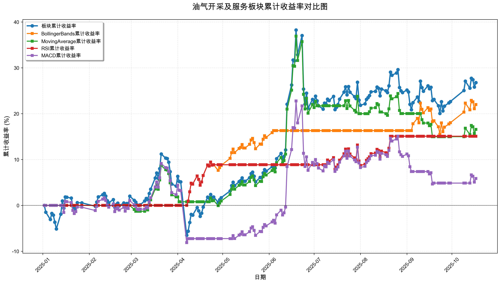

# 策略回测结果报告

**生成时间**: 2025-10-19 19:01:42
**行业板块**: 油气开采及服务
**回测期间**: 20250101 至 20251017
**策略数量**: 4

## 📈 分析结论

### 策略表现分析
- **最佳策略**: BollingerBands (总收益率: 21.99%)
- **最差策略**: MACD (总收益率: 5.86%)
### 交易活跃度分析
- **活跃策略**: 4 个
- **非活跃策略**: 0 个
- **最活跃策略**: MovingAverage (交易次数: 19)
### 🚨 异动提醒分析
- 未检测到明显异动情况
### 风险分析
- **BollingerBands**: 最大回撤 -5.55%, 夏普比率 2.8735
- **MovingAverage**: 最大回撤 -16.01%, 夏普比率 1.0118
- **RSI**: 最大回撤 -3.93%, 夏普比率 2.1677
- **MACD**: 最大回撤 -15.79%, 夏普比率 0.2933

## 📊 综合结果表

| 策略名称           | 初始资金     | 最终价值     | 总收益率   | 年化收益率   | 波动率    |   夏普比率 | 最大回撤    | 总交易次数   | 买入次数   | 卖出次数   | 总交易金额      | 平均交易金额   | 交易频率   |   数据点数 |
|:---------------|:---------|:---------|:-------|:--------|:-------|-------:|:--------|:--------|:-------|:-------|:-----------|:---------|:-------|-------:|
| 板块实际表现         | ¥100,000 | ¥126,769 | 26.77% | 36.97%  | 29.14% | 1.2687 | -15.93% | N/A     | N/A    | N/A    | N/A        | N/A      | N/A    |    190 |
| BollingerBands | ¥100,000 | ¥121,988 | 21.99% | 30.16%  | 10.50% | 2.8735 | -5.55%  | 3       | 2      | 1      | ¥331,058   | ¥110,353 | 0.02   |    190 |
| MovingAverage  | ¥100,000 | ¥116,560 | 16.56% | 22.54%  | 22.27% | 1.0118 | -16.01% | 19      | 10     | 9      | ¥2,118,827 | ¥111,517 | 0.10   |    190 |
| RSI            | ¥100,000 | ¥115,081 | 15.08% | 20.48%  | 9.45%  | 2.1677 | -3.93%  | 4       | 2      | 2      | ¥429,434   | ¥107,358 | 0.02   |    190 |
| MACD           | ¥100,000 | ¥105,861 | 5.86%  | 7.85%   | 26.76% | 0.2933 | -15.79% | 9       | 5      | 4      | ¥903,488   | ¥100,388 | 0.05   |    190 |

## 📊 每日收益率走势图

*图1: 油气开采及服务板块每日收益率走势对比*

## 📈 累计收益率走势图

*图2: 油气开采及服务板块累计收益率走势对比*

## 📅 日收益明细表

| 日期         | 板块实际收益率   | BollingerBands收益率   | MovingAverage收益率   | RSI收益率   | MACD收益率   |
|:-----------|:----------|:--------------------|:-------------------|:---------|:----------|
| 2025-01-02 | 0.00%     | 0.00%               | 0.00%              | 0.00%    | 0.00%     |
| 2025-01-03 | -1.49%    | 0.00%               | 0.00%              | 0.00%    | 0.00%     |
| 2025-01-06 | -1.60%    | 0.00%               | 0.00%              | 0.00%    | 0.00%     |
| 2025-01-07 | 1.37%     | 0.00%               | 0.00%              | 0.00%    | 0.00%     |
| 2025-01-08 | -0.38%    | 0.00%               | 0.00%              | 0.00%    | 0.00%     |
| 2025-01-09 | -1.57%    | 0.00%               | 0.00%              | 0.00%    | 0.00%     |
| 2025-01-10 | -1.55%    | 0.00%               | 0.00%              | 0.00%    | 0.00%     |
| 2025-01-13 | 3.41%     | 0.00%               | 0.00%              | 0.00%    | 0.00%     |
| 2025-01-14 | 2.91%     | 0.00%               | 0.00%              | 0.00%    | 0.00%     |
| 2025-01-15 | -1.55%    | 0.00%               | 0.00%              | 0.00%    | -1.54%    |
| 2025-01-16 | 2.45%     | 0.00%               | 0.00%              | 0.00%    | 2.44%     |
| 2025-01-17 | -0.05%    | 0.00%               | 0.00%              | 0.00%    | -0.05%    |
| 2025-01-20 | -0.17%    | 0.00%               | 0.00%              | 0.00%    | -0.17%    |
| 2025-01-21 | -1.75%    | 0.00%               | 0.00%              | 0.00%    | -1.74%    |
| 2025-01-22 | -0.67%    | 0.00%               | 0.00%              | 0.00%    | -0.67%    |
| 2025-01-23 | 0.41%     | 0.00%               | 0.00%              | 0.00%    | 0.41%     |
| 2025-01-24 | 1.04%     | 0.00%               | 0.00%              | 0.00%    | 1.03%     |
| 2025-01-27 | -0.03%    | 0.00%               | 0.00%              | 0.00%    | -0.03%    |
| 2025-02-05 | -0.74%    | 0.00%               | 0.00%              | 0.00%    | -0.74%    |
| 2025-02-06 | 0.93%     | 0.00%               | 0.00%              | 0.00%    | 0.93%     |
| 2025-02-07 | 1.11%     | 0.00%               | 0.00%              | 0.00%    | 1.10%     |
| 2025-02-10 | 0.47%     | 0.00%               | 0.00%              | 0.00%    | 0.47%     |
| 2025-02-11 | 0.27%     | 0.00%               | 0.00%              | 0.00%    | 0.27%     |
| 2025-02-12 | -0.56%    | 0.00%               | 0.00%              | 0.00%    | -0.56%    |
| 2025-02-13 | -1.01%    | 0.00%               | 0.00%              | 0.00%    | -1.00%    |
| 2025-02-14 | -0.43%    | 0.00%               | 0.00%              | 0.00%    | -0.43%    |
| 2025-02-17 | 0.70%     | 0.00%               | 0.00%              | 0.00%    | 0.69%     |
| 2025-02-18 | -1.68%    | 0.00%               | 0.00%              | 0.00%    | -1.67%    |
| 2025-02-19 | 0.62%     | 0.00%               | 0.00%              | 0.00%    | 0.62%     |
| 2025-02-20 | 0.30%     | 0.00%               | 0.00%              | 0.00%    | 0.30%     |
| 2025-02-21 | -0.59%    | 0.00%               | 0.00%              | 0.00%    | -0.58%    |
| 2025-02-24 | 0.63%     | 0.00%               | 0.00%              | 0.00%    | 0.63%     |
| 2025-02-25 | -0.85%    | 0.00%               | 0.00%              | 0.00%    | -0.84%    |
| 2025-02-26 | 0.74%     | 0.00%               | 0.00%              | 0.00%    | 0.74%     |
| 2025-02-27 | -0.17%    | 0.00%               | 0.00%              | 0.00%    | -0.17%    |
| 2025-02-28 | 1.76%     | 0.00%               | 0.00%              | 0.00%    | 1.75%     |
| 2025-03-03 | -0.90%    | 0.00%               | -0.89%             | 0.00%    | -0.89%    |
| 2025-03-04 | -0.39%    | 0.00%               | -0.39%             | 0.00%    | -0.39%    |
| 2025-03-05 | -0.60%    | 0.00%               | 0.00%              | 0.00%    | -0.60%    |
| 2025-03-06 | -0.13%    | 0.00%               | 0.00%              | 0.00%    | -0.13%    |
| 2025-03-07 | 0.15%     | 0.00%               | 0.00%              | 0.00%    | 0.15%     |
| 2025-03-10 | 0.86%     | 0.00%               | 0.00%              | 0.00%    | 0.00%     |
| 2025-03-11 | 0.52%     | 0.00%               | 0.52%              | 0.00%    | 0.52%     |
| 2025-03-12 | -0.24%    | 0.00%               | -0.24%             | 0.00%    | -0.24%    |
| 2025-03-13 | 1.32%     | 0.00%               | 1.31%              | 0.00%    | 1.30%     |
| 2025-03-14 | 0.92%     | 0.00%               | 0.91%              | 0.00%    | 0.91%     |
| 2025-03-17 | 2.35%     | 0.00%               | 2.34%              | 0.00%    | 2.33%     |
| 2025-03-18 | 1.05%     | 0.00%               | 1.04%              | 0.00%    | 1.04%     |
| 2025-03-19 | -1.10%    | 0.00%               | -1.09%             | 0.00%    | -1.09%    |
| 2025-03-20 | 1.99%     | 0.00%               | 1.98%              | 0.00%    | 1.97%     |
| 2025-03-21 | 2.96%     | 0.00%               | 2.95%              | 0.00%    | 2.94%     |
| 2025-03-24 | -0.81%    | 0.00%               | -0.81%             | 0.00%    | -0.81%    |
| 2025-03-25 | -0.08%    | 0.00%               | -0.08%             | 0.00%    | -0.08%    |
| 2025-03-26 | -0.72%    | 0.00%               | -0.72%             | 0.00%    | -0.71%    |
| 2025-03-27 | -1.88%    | 0.00%               | -1.87%             | 0.00%    | -1.86%    |
| 2025-03-28 | -2.51%    | 0.00%               | -2.50%             | 0.00%    | -2.49%    |
| 2025-03-31 | -0.44%    | 0.00%               | -0.43%             | 0.00%    | -0.43%    |
| 2025-04-01 | 2.05%     | 0.00%               | 0.00%              | 0.00%    | 2.03%     |
| 2025-04-02 | -1.06%    | 0.00%               | -1.06%             | 0.00%    | -1.05%    |
| 2025-04-03 | -0.07%    | 0.00%               | 0.00%              | 0.00%    | -0.07%    |
| 2025-04-07 | -11.08%   | 0.00%               | 0.00%              | 0.00%    | -10.98%   |
| 2025-04-08 | 0.96%     | 0.95%               | 0.00%              | 0.95%    | 0.95%     |
| 2025-04-09 | 2.02%     | 2.01%               | 0.00%              | 2.01%    | 0.00%     |
| 2025-04-10 | 1.82%     | 1.81%               | 0.00%              | 1.81%    | 0.00%     |
| 2025-04-11 | -0.18%    | -0.18%              | 0.00%              | -0.18%   | 0.00%     |
| 2025-04-14 | 1.71%     | 1.70%               | 0.00%              | 1.70%    | 0.00%     |
| 2025-04-15 | -0.71%    | -0.71%              | 0.00%              | -0.71%   | 0.00%     |
| 2025-04-16 | -1.22%    | -1.21%              | 0.00%              | -1.21%   | 0.00%     |
| 2025-04-17 | 0.70%     | 0.69%               | 0.00%              | 0.69%    | 0.00%     |
| 2025-04-18 | 1.36%     | 1.35%               | 0.00%              | 1.35%    | 0.00%     |
| 2025-04-21 | 2.16%     | 2.14%               | 0.00%              | 2.14%    | 0.00%     |
| 2025-04-22 | -0.25%    | -0.25%              | 0.00%              | -0.25%   | 0.00%     |
| 2025-04-23 | 0.83%     | 0.82%               | 0.82%              | 0.82%    | 0.00%     |
| 2025-04-24 | -0.63%    | -0.62%              | -0.62%             | -0.62%   | 0.00%     |
| 2025-04-25 | 0.10%     | 0.10%               | 0.10%              | 0.10%    | 0.00%     |
| 2025-04-28 | -1.14%    | -1.13%              | -1.13%             | 0.00%    | 0.00%     |
| 2025-04-29 | 0.55%     | 0.55%               | 0.54%              | 0.00%    | 0.00%     |
| 2025-04-30 | 0.45%     | 0.44%               | 0.44%              | 0.00%    | 0.00%     |
| 2025-05-06 | 1.44%     | 1.43%               | 1.43%              | 0.00%    | 0.00%     |
| 2025-05-07 | 1.14%     | 1.13%               | 1.13%              | 0.00%    | 0.00%     |
| 2025-05-08 | 0.70%     | 0.69%               | 0.69%              | 0.00%    | 0.70%     |
| 2025-05-09 | -0.69%    | -0.68%              | -0.68%             | 0.00%    | -0.69%    |
| 2025-05-12 | 0.80%     | 0.80%               | 0.80%              | 0.00%    | 0.80%     |
| 2025-05-13 | 0.23%     | 0.23%               | 0.23%              | 0.00%    | 0.23%     |
| 2025-05-14 | 0.55%     | 0.55%               | 0.55%              | 0.00%    | 0.55%     |
| 2025-05-15 | -0.69%    | -0.68%              | -0.68%             | 0.00%    | -0.69%    |
| 2025-05-16 | 0.01%     | 0.01%               | 0.01%              | 0.00%    | 0.01%     |
| 2025-05-19 | 0.72%     | 0.71%               | 0.71%              | 0.00%    | 0.71%     |
| 2025-05-20 | 0.85%     | 0.84%               | 0.84%              | 0.00%    | 0.85%     |
| 2025-05-21 | 0.30%     | 0.30%               | 0.30%              | 0.00%    | 0.30%     |
| 2025-05-22 | -0.82%    | -0.81%              | -0.81%             | 0.00%    | -0.81%    |
| 2025-05-23 | -1.17%    | -1.16%              | -1.16%             | 0.00%    | -1.16%    |
| 2025-05-26 | 0.91%     | 0.90%               | 0.90%              | 0.00%    | 0.91%     |
| 2025-05-27 | -0.05%    | -0.05%              | -0.05%             | 0.00%    | -0.05%    |
| 2025-05-28 | 0.99%     | 0.98%               | 0.98%              | 0.00%    | 0.98%     |
| 2025-05-29 | 0.65%     | 0.65%               | 0.65%              | 0.00%    | 0.65%     |
| 2025-05-30 | -0.31%    | -0.31%              | -0.31%             | 0.00%    | -0.31%    |
| 2025-06-03 | 0.92%     | 0.92%               | 0.92%              | 0.00%    | 0.92%     |
| 2025-06-04 | 0.37%     | 0.37%               | 0.37%              | 0.00%    | 0.37%     |
| 2025-06-05 | -0.64%    | 0.00%               | -0.63%             | 0.00%    | -0.64%    |
| 2025-06-06 | 1.88%     | 0.00%               | 1.86%              | 0.00%    | 1.87%     |
| 2025-06-09 | 1.05%     | 0.00%               | 1.04%              | 0.00%    | 1.04%     |
| 2025-06-10 | -1.06%    | 0.00%               | -1.05%             | 0.00%    | -1.05%    |
| 2025-06-11 | 0.46%     | 0.00%               | 0.46%              | 0.00%    | 0.46%     |
| 2025-06-12 | 1.28%     | 0.00%               | 1.27%              | 0.00%    | 1.28%     |
| 2025-06-13 | 8.89%     | 0.00%               | 8.82%              | 0.00%    | 8.85%     |
| 2025-06-16 | 3.44%     | 0.00%               | 3.42%              | 0.00%    | 3.43%     |
| 2025-06-17 | 4.30%     | 0.00%               | 4.27%              | 0.00%    | 4.28%     |
| 2025-06-18 | -0.11%    | 0.00%               | -0.11%             | 0.00%    | -0.11%    |
| 2025-06-19 | 5.09%     | 0.00%               | 5.05%              | 0.00%    | 5.07%     |
| 2025-06-20 | -3.91%    | 0.00%               | -3.88%             | 0.00%    | -3.89%    |
| 2025-06-23 | 3.15%     | 0.00%               | 3.13%              | 0.00%    | 3.14%     |
| 2025-06-24 | -8.52%    | 0.00%               | -8.47%             | 0.00%    | -8.49%    |
| 2025-06-25 | -2.59%    | 0.00%               | -2.58%             | 0.00%    | -2.58%    |
| 2025-06-26 | 1.94%     | 0.00%               | 1.92%              | 0.00%    | 1.93%     |
| 2025-06-27 | -2.66%    | 0.00%               | -2.64%             | 0.00%    | -2.65%    |
| 2025-06-30 | 1.61%     | 0.00%               | 1.60%              | 0.00%    | 1.61%     |
| 2025-07-01 | -0.57%    | 0.00%               | -0.57%             | 0.00%    | -0.57%    |
| 2025-07-02 | 1.14%     | 0.00%               | 1.13%              | 0.00%    | 1.14%     |
| 2025-07-03 | -0.82%    | 0.00%               | -0.81%             | 0.00%    | -0.81%    |
| 2025-07-04 | -0.87%    | 0.00%               | 0.00%              | 0.00%    | -0.87%    |
| 2025-07-07 | -0.60%    | 0.00%               | 0.00%              | 0.00%    | -0.60%    |
| 2025-07-08 | 1.07%     | 0.00%               | 0.00%              | 0.00%    | 1.07%     |
| 2025-07-09 | -0.23%    | 0.00%               | 0.00%              | 0.00%    | -0.23%    |
| 2025-07-10 | 0.95%     | 0.00%               | 0.00%              | 0.94%    | 0.95%     |
| 2025-07-11 | -0.26%    | 0.00%               | 0.00%              | -0.26%   | -0.26%    |
| 2025-07-14 | 0.75%     | 0.00%               | 0.00%              | 0.75%    | 0.75%     |
| 2025-07-15 | -2.32%    | 0.00%               | 0.00%              | -2.30%   | -2.31%    |
| 2025-07-16 | 0.44%     | 0.00%               | 0.00%              | 0.43%    | 0.44%     |
| 2025-07-17 | 0.47%     | 0.00%               | 0.00%              | 0.46%    | 0.46%     |
| 2025-07-18 | 0.96%     | 0.00%               | 0.00%              | 0.95%    | 0.95%     |
| 2025-07-21 | 1.27%     | 0.00%               | 0.00%              | 1.25%    | 1.26%     |
| 2025-07-22 | 0.92%     | 0.00%               | 0.92%              | 0.92%    | 0.92%     |
| 2025-07-23 | -1.39%    | 0.00%               | -1.39%             | -1.38%   | -1.39%    |
| 2025-07-24 | 1.45%     | 0.00%               | 1.45%              | 1.44%    | 1.45%     |
| 2025-07-25 | -1.00%    | 0.00%               | -0.99%             | -0.99%   | -0.99%    |
| 2025-07-28 | -0.76%    | 0.00%               | -0.76%             | -0.76%   | -0.76%    |
| 2025-07-29 | -0.34%    | 0.00%               | -0.34%             | -0.34%   | -0.34%    |
| 2025-07-30 | 2.89%     | 0.00%               | 2.89%              | 2.87%    | 2.88%     |
| 2025-07-31 | -3.09%    | 0.00%               | -3.08%             | -3.06%   | -3.08%    |
| 2025-08-01 | -0.90%    | 0.00%               | 0.00%              | -0.89%   | -0.90%    |
| 2025-08-04 | 0.25%     | 0.00%               | 0.00%              | 0.25%    | 0.25%     |
| 2025-08-05 | 0.79%     | 0.00%               | 0.00%              | 0.78%    | 0.79%     |
| 2025-08-06 | 0.33%     | 0.00%               | 0.00%              | 0.33%    | 0.33%     |
| 2025-08-07 | 0.35%     | 0.00%               | 0.35%              | 0.35%    | 0.35%     |
| 2025-08-08 | 0.65%     | 0.00%               | 0.65%              | 0.65%    | 0.65%     |
| 2025-08-11 | 0.09%     | 0.00%               | 0.09%              | 0.09%    | 0.09%     |
| 2025-08-12 | 0.74%     | 0.00%               | 0.73%              | 0.74%    | 0.74%     |
| 2025-08-13 | -0.21%    | 0.00%               | -0.20%             | -0.20%   | -0.20%    |
| 2025-08-14 | -1.31%    | 0.00%               | -1.30%             | -1.30%   | -1.30%    |
| 2025-08-15 | 1.18%     | 0.00%               | 0.00%              | 1.17%    | 1.17%     |
| 2025-08-18 | -0.30%    | 0.00%               | -0.30%             | -0.30%   | -0.30%    |
| 2025-08-19 | -0.31%    | 0.00%               | -0.31%             | -0.31%   | -0.31%    |
| 2025-08-20 | 1.18%     | 0.00%               | 1.17%              | 1.17%    | 1.17%     |
| 2025-08-21 | 2.36%     | 0.00%               | 2.33%              | 2.34%    | 2.35%     |
| 2025-08-22 | -0.51%    | 0.00%               | -0.50%             | 0.00%    | -0.51%    |
| 2025-08-25 | 0.37%     | 0.00%               | 0.37%              | 0.00%    | 0.37%     |
| 2025-08-26 | 0.56%     | 0.00%               | 0.55%              | 0.00%    | 0.56%     |
| 2025-08-27 | -2.99%    | 0.00%               | -2.96%             | 0.00%    | -2.98%    |
| 2025-08-28 | -0.56%    | 0.00%               | -0.56%             | 0.00%    | -0.56%    |
| 2025-08-29 | -0.33%    | 0.00%               | 0.00%              | 0.00%    | -0.33%    |
| 2025-09-01 | 0.46%     | 0.00%               | 0.00%              | 0.00%    | 0.46%     |
| 2025-09-02 | -0.35%    | 0.00%               | 0.00%              | 0.00%    | -0.35%    |
| 2025-09-03 | -2.16%    | 0.00%               | 0.00%              | 0.00%    | -2.15%    |
| 2025-09-04 | -0.97%    | 0.00%               | 0.00%              | 0.00%    | -0.96%    |
| 2025-09-05 | 1.29%     | 1.29%               | 0.00%              | 0.00%    | 0.00%     |
| 2025-09-08 | 1.00%     | 1.00%               | 0.00%              | 0.00%    | 0.00%     |
| 2025-09-09 | -0.81%    | -0.81%              | 0.00%              | 0.00%    | 0.00%     |
| 2025-09-10 | 3.64%     | 3.64%               | 0.00%              | 0.00%    | 0.00%     |
| 2025-09-11 | -1.12%    | -1.12%              | -1.11%             | 0.00%    | 0.00%     |
| 2025-09-12 | -0.62%    | -0.62%              | -0.62%             | 0.00%    | 0.00%     |
| 2025-09-15 | 0.94%     | 0.94%               | 0.00%              | 0.00%    | 0.00%     |
| 2025-09-16 | -0.49%    | -0.49%              | -0.49%             | 0.00%    | -0.49%    |
| 2025-09-17 | 0.25%     | 0.25%               | 0.24%              | 0.00%    | 0.25%     |
| 2025-09-18 | -2.30%    | -2.30%              | -2.28%             | 0.00%    | -2.30%    |
| 2025-09-19 | 0.19%     | 0.19%               | 0.00%              | 0.00%    | 0.19%     |
| 2025-09-22 | -1.12%    | -1.12%              | 0.00%              | 0.00%    | 0.00%     |
| 2025-09-23 | -1.38%    | -1.38%              | 0.00%              | 0.00%    | 0.00%     |
| 2025-09-24 | 2.13%     | 2.13%               | 0.00%              | 0.00%    | 0.00%     |
| 2025-09-25 | -1.63%    | -1.63%              | 0.00%              | 0.00%    | 0.00%     |
| 2025-09-26 | 0.87%     | 0.87%               | 0.00%              | 0.00%    | 0.00%     |
| 2025-09-29 | 0.59%     | 0.59%               | 0.00%              | 0.00%    | 0.00%     |
| 2025-09-30 | 0.23%     | 0.23%               | 0.00%              | 0.00%    | 0.00%     |
| 2025-10-09 | 1.96%     | 1.96%               | 0.00%              | 0.00%    | 0.00%     |
| 2025-10-10 | 1.63%     | 1.62%               | 1.62%              | 0.00%    | 0.00%     |
| 2025-10-13 | -1.19%    | -1.19%              | -1.19%             | 0.00%    | 0.00%     |
| 2025-10-14 | 1.71%     | 1.71%               | 1.71%              | 0.00%    | 1.70%     |
| 2025-10-15 | -0.26%    | -0.26%              | -0.26%             | 0.00%    | -0.26%    |
| 2025-10-16 | -1.24%    | -1.24%              | -1.23%             | 0.00%    | -1.23%    |
| 2025-10-17 | 0.76%     | 0.76%               | 0.76%              | 0.00%    | 0.76%     |

## 📊 日收益统计摘要

| 指标                | 平均日收益率   | 最大日收益率   | 最小日收益率   | 正收益天数   | 负收益天数   |
|:------------------|:---------|:---------|:---------|:--------|:--------|
| 板块实际收益率           | 0.14%    | 8.89%    | -11.08%  | 101天    | 88天     |
| BollingerBands收益率 | 0.11%    | 3.64%    | -2.30%   | 40天     | 23天     |
| MovingAverage收益率  | 0.09%    | 8.82%    | -8.47%   | 53天     | 47天     |
| RSI收益率            | 0.08%    | 2.87%    | -3.06%   | 28天     | 17天     |
| MACD收益率           | 0.04%    | 8.85%    | -10.98%  | 75天     | 70天     |

## 📈 累计收益明细表

| 日期         | 板块累计收益率   | BollingerBands累计收益率   | MovingAverage累计收益率   | RSI累计收益率   | MACD累计收益率   |
|:-----------|:----------|:----------------------|:---------------------|:-----------|:------------|
| 2025-01-02 | 0.00%     | 0.00%                 | 0.00%                | 0.00%      | 0.00%       |
| 2025-01-03 | -1.49%    | 0.00%                 | 0.00%                | 0.00%      | 0.00%       |
| 2025-01-06 | -3.07%    | 0.00%                 | 0.00%                | 0.00%      | 0.00%       |
| 2025-01-07 | -1.74%    | 0.00%                 | 0.00%                | 0.00%      | 0.00%       |
| 2025-01-08 | -2.11%    | 0.00%                 | 0.00%                | 0.00%      | 0.00%       |
| 2025-01-09 | -3.65%    | 0.00%                 | 0.00%                | 0.00%      | 0.00%       |
| 2025-01-10 | -5.14%    | 0.00%                 | 0.00%                | 0.00%      | 0.00%       |
| 2025-01-13 | -1.90%    | 0.00%                 | 0.00%                | 0.00%      | 0.00%       |
| 2025-01-14 | 0.96%     | 0.00%                 | 0.00%                | 0.00%      | 0.00%       |
| 2025-01-15 | -0.61%    | 0.00%                 | 0.00%                | 0.00%      | -1.54%      |
| 2025-01-16 | 1.83%     | 0.00%                 | 0.00%                | 0.00%      | 0.86%       |
| 2025-01-17 | 1.77%     | 0.00%                 | 0.00%                | 0.00%      | 0.80%       |
| 2025-01-20 | 1.60%     | 0.00%                 | 0.00%                | 0.00%      | 0.63%       |
| 2025-01-21 | -0.18%    | 0.00%                 | 0.00%                | 0.00%      | -1.11%      |
| 2025-01-22 | -0.85%    | 0.00%                 | 0.00%                | 0.00%      | -1.77%      |
| 2025-01-23 | -0.44%    | 0.00%                 | 0.00%                | 0.00%      | -1.37%      |
| 2025-01-24 | 0.59%     | 0.00%                 | 0.00%                | 0.00%      | -0.36%      |
| 2025-01-27 | 0.56%     | 0.00%                 | 0.00%                | 0.00%      | -0.39%      |
| 2025-02-05 | -0.19%    | 0.00%                 | 0.00%                | 0.00%      | -1.12%      |
| 2025-02-06 | 0.74%     | 0.00%                 | 0.00%                | 0.00%      | -0.21%      |
| 2025-02-07 | 1.86%     | 0.00%                 | 0.00%                | 0.00%      | 0.89%       |
| 2025-02-10 | 2.34%     | 0.00%                 | 0.00%                | 0.00%      | 1.36%       |
| 2025-02-11 | 2.62%     | 0.00%                 | 0.00%                | 0.00%      | 1.63%       |
| 2025-02-12 | 2.04%     | 0.00%                 | 0.00%                | 0.00%      | 1.07%       |
| 2025-02-13 | 1.01%     | 0.00%                 | 0.00%                | 0.00%      | 0.06%       |
| 2025-02-14 | 0.57%     | 0.00%                 | 0.00%                | 0.00%      | -0.38%      |
| 2025-02-17 | 1.27%     | 0.00%                 | 0.00%                | 0.00%      | 0.31%       |
| 2025-02-18 | -0.43%    | 0.00%                 | 0.00%                | 0.00%      | -1.36%      |
| 2025-02-19 | 0.19%     | 0.00%                 | 0.00%                | 0.00%      | -0.75%      |
| 2025-02-20 | 0.49%     | 0.00%                 | 0.00%                | 0.00%      | -0.45%      |
| 2025-02-21 | -0.10%    | 0.00%                 | 0.00%                | 0.00%      | -1.03%      |
| 2025-02-24 | 0.53%     | 0.00%                 | 0.00%                | 0.00%      | -0.41%      |
| 2025-02-25 | -0.32%    | 0.00%                 | 0.00%                | 0.00%      | -1.25%      |
| 2025-02-26 | 0.42%     | 0.00%                 | 0.00%                | 0.00%      | -0.53%      |
| 2025-02-27 | 0.25%     | 0.00%                 | 0.00%                | 0.00%      | -0.69%      |
| 2025-02-28 | 2.02%     | 0.00%                 | 0.00%                | 0.00%      | 1.05%       |
| 2025-03-03 | 1.10%     | 0.00%                 | -0.89%               | 0.00%      | 0.15%       |
| 2025-03-04 | 0.71%     | 0.00%                 | -1.27%               | 0.00%      | -0.24%      |
| 2025-03-05 | 0.10%     | 0.00%                 | -1.27%               | 0.00%      | -0.84%      |
| 2025-03-06 | -0.03%    | 0.00%                 | -1.27%               | 0.00%      | -0.96%      |
| 2025-03-07 | 0.12%     | 0.00%                 | -1.27%               | 0.00%      | -0.82%      |
| 2025-03-10 | 0.98%     | 0.00%                 | -1.27%               | 0.00%      | -0.82%      |
| 2025-03-11 | 1.51%     | 0.00%                 | -0.76%               | 0.00%      | -0.31%      |
| 2025-03-12 | 1.26%     | 0.00%                 | -1.00%               | 0.00%      | -0.55%      |
| 2025-03-13 | 2.59%     | 0.00%                 | 0.30%                | 0.00%      | 0.75%       |
| 2025-03-14 | 3.54%     | 0.00%                 | 1.21%                | 0.00%      | 1.67%       |
| 2025-03-17 | 5.97%     | 0.00%                 | 3.58%                | 0.00%      | 4.03%       |
| 2025-03-18 | 7.08%     | 0.00%                 | 4.66%                | 0.00%      | 5.11%       |
| 2025-03-19 | 5.90%     | 0.00%                 | 3.51%                | 0.00%      | 3.96%       |
| 2025-03-20 | 8.00%     | 0.00%                 | 5.56%                | 0.00%      | 6.01%       |
| 2025-03-21 | 11.20%    | 0.00%                 | 8.67%                | 0.00%      | 9.13%       |
| 2025-03-24 | 10.30%    | 0.00%                 | 7.79%                | 0.00%      | 8.24%       |
| 2025-03-25 | 10.20%    | 0.00%                 | 7.70%                | 0.00%      | 8.15%       |
| 2025-03-26 | 9.41%     | 0.00%                 | 6.93%                | 0.00%      | 7.38%       |
| 2025-03-27 | 7.36%     | 0.00%                 | 4.93%                | 0.00%      | 5.39%       |
| 2025-03-28 | 4.67%     | 0.00%                 | 2.31%                | 0.00%      | 2.77%       |
| 2025-03-31 | 4.21%     | 0.00%                 | 1.87%                | 0.00%      | 2.32%       |
| 2025-04-01 | 6.34%     | 0.00%                 | 1.87%                | 0.00%      | 4.39%       |
| 2025-04-02 | 5.21%     | 0.00%                 | 0.79%                | 0.00%      | 3.29%       |
| 2025-04-03 | 5.14%     | 0.00%                 | 0.79%                | 0.00%      | 3.22%       |
| 2025-04-07 | -6.51%    | 0.00%                 | 0.79%                | 0.00%      | -8.11%      |
| 2025-04-08 | -5.62%    | 0.95%                 | 0.79%                | 0.95%      | -7.24%      |
| 2025-04-09 | -3.71%    | 2.97%                 | 0.79%                | 2.97%      | -7.24%      |
| 2025-04-10 | -1.95%    | 4.84%                 | 0.79%                | 4.84%      | -7.24%      |
| 2025-04-11 | -2.13%    | 4.64%                 | 0.79%                | 4.64%      | -7.24%      |
| 2025-04-14 | -0.46%    | 6.42%                 | 0.79%                | 6.42%      | -7.24%      |
| 2025-04-15 | -1.17%    | 5.67%                 | 0.79%                | 5.67%      | -7.24%      |
| 2025-04-16 | -2.38%    | 4.39%                 | 0.79%                | 4.39%      | -7.24%      |
| 2025-04-17 | -1.70%    | 5.11%                 | 0.79%                | 5.11%      | -7.24%      |
| 2025-04-18 | -0.36%    | 6.53%                 | 0.79%                | 6.53%      | -7.24%      |
| 2025-04-21 | 1.80%     | 8.82%                 | 0.79%                | 8.82%      | -7.24%      |
| 2025-04-22 | 1.54%     | 8.55%                 | 0.79%                | 8.55%      | -7.24%      |
| 2025-04-23 | 2.38%     | 9.44%                 | 1.62%                | 9.44%      | -7.24%      |
| 2025-04-24 | 1.74%     | 8.76%                 | 0.99%                | 8.76%      | -7.24%      |
| 2025-04-25 | 1.84%     | 8.86%                 | 1.08%                | 8.86%      | -7.24%      |
| 2025-04-28 | 0.68%     | 7.63%                 | -0.06%               | 8.86%      | -7.24%      |
| 2025-04-29 | 1.23%     | 8.22%                 | 0.49%                | 8.86%      | -7.24%      |
| 2025-04-30 | 1.68%     | 8.70%                 | 0.93%                | 8.86%      | -7.24%      |
| 2025-05-06 | 3.15%     | 10.26%                | 2.38%                | 8.86%      | -7.24%      |
| 2025-05-07 | 4.33%     | 11.50%                | 3.53%                | 8.86%      | -7.24%      |
| 2025-05-08 | 5.06%     | 12.28%                | 4.25%                | 8.86%      | -6.59%      |
| 2025-05-09 | 4.33%     | 11.51%                | 3.54%                | 8.86%      | -7.23%      |
| 2025-05-12 | 5.17%     | 12.40%                | 4.36%                | 8.86%      | -6.49%      |
| 2025-05-13 | 5.41%     | 12.65%                | 4.60%                | 8.86%      | -6.28%      |
| 2025-05-14 | 5.99%     | 13.27%                | 5.17%                | 8.86%      | -5.76%      |
| 2025-05-15 | 5.26%     | 12.50%                | 4.45%                | 8.86%      | -6.41%      |
| 2025-05-16 | 5.27%     | 12.51%                | 4.46%                | 8.86%      | -6.40%      |
| 2025-05-19 | 6.03%     | 13.31%                | 5.21%                | 8.86%      | -5.74%      |
| 2025-05-20 | 6.93%     | 14.26%                | 6.09%                | 8.86%      | -4.94%      |
| 2025-05-21 | 7.25%     | 14.61%                | 6.41%                | 8.86%      | -4.65%      |
| 2025-05-22 | 6.37%     | 13.68%                | 5.55%                | 8.86%      | -5.43%      |
| 2025-05-23 | 5.13%     | 12.36%                | 4.33%                | 8.86%      | -6.53%      |
| 2025-05-26 | 6.09%     | 13.37%                | 5.27%                | 8.86%      | -5.68%      |
| 2025-05-27 | 6.04%     | 13.32%                | 5.22%                | 8.86%      | -5.73%      |
| 2025-05-28 | 7.09%     | 14.43%                | 6.25%                | 8.86%      | -4.80%      |
| 2025-05-29 | 7.79%     | 15.18%                | 6.94%                | 8.86%      | -4.18%      |
| 2025-05-30 | 7.45%     | 14.82%                | 6.61%                | 8.86%      | -4.48%      |
| 2025-06-03 | 8.44%     | 15.87%                | 7.58%                | 8.86%      | -3.60%      |
| 2025-06-04 | 8.85%     | 16.30%                | 7.98%                | 8.86%      | -3.24%      |
| 2025-06-05 | 8.15%     | 16.30%                | 7.30%                | 8.86%      | -3.86%      |
| 2025-06-06 | 10.18%    | 16.30%                | 9.29%                | 8.86%      | -2.06%      |
| 2025-06-09 | 11.34%    | 16.30%                | 10.43%               | 8.86%      | -1.04%      |
| 2025-06-10 | 10.16%    | 16.30%                | 9.27%                | 8.86%      | -2.08%      |
| 2025-06-11 | 10.67%    | 16.30%                | 9.77%                | 8.86%      | -1.63%      |
| 2025-06-12 | 12.09%    | 16.30%                | 11.17%               | 8.86%      | -0.37%      |
| 2025-06-13 | 22.06%    | 16.30%                | 20.98%               | 8.86%      | 8.45%       |
| 2025-06-16 | 26.26%    | 16.30%                | 25.12%               | 8.86%      | 12.16%      |
| 2025-06-17 | 31.69%    | 16.30%                | 30.46%               | 8.86%      | 16.96%      |
| 2025-06-18 | 31.54%    | 16.30%                | 30.32%               | 8.86%      | 16.84%      |
| 2025-06-19 | 38.23%    | 16.30%                | 36.90%               | 8.86%      | 22.76%      |
| 2025-06-20 | 32.84%    | 16.30%                | 31.59%               | 8.86%      | 17.98%      |
| 2025-06-23 | 37.03%    | 16.30%                | 35.71%               | 8.86%      | 21.69%      |
| 2025-06-24 | 25.35%    | 16.30%                | 24.22%               | 8.86%      | 11.36%      |
| 2025-06-25 | 22.10%    | 16.30%                | 21.02%               | 8.86%      | 8.48%       |
| 2025-06-26 | 24.47%    | 16.30%                | 23.35%               | 8.86%      | 10.58%      |
| 2025-06-27 | 21.16%    | 16.30%                | 20.10%               | 8.86%      | 7.65%       |
| 2025-06-30 | 23.12%    | 16.30%                | 22.02%               | 8.86%      | 9.38%       |
| 2025-07-01 | 22.41%    | 16.30%                | 21.33%               | 8.86%      | 8.76%       |
| 2025-07-02 | 23.81%    | 16.30%                | 22.70%               | 8.86%      | 9.99%       |
| 2025-07-03 | 22.80%    | 16.30%                | 21.71%               | 8.86%      | 9.10%       |
| 2025-07-04 | 21.72%    | 16.30%                | 21.71%               | 8.86%      | 8.15%       |
| 2025-07-07 | 20.99%    | 16.30%                | 21.71%               | 8.86%      | 7.50%       |
| 2025-07-08 | 22.29%    | 16.30%                | 21.71%               | 8.86%      | 8.65%       |
| 2025-07-09 | 22.01%    | 16.30%                | 21.71%               | 8.86%      | 8.40%       |
| 2025-07-10 | 23.17%    | 16.30%                | 21.71%               | 9.89%      | 9.43%       |
| 2025-07-11 | 22.84%    | 16.30%                | 21.71%               | 9.60%      | 9.14%       |
| 2025-07-14 | 23.77%    | 16.30%                | 21.71%               | 10.42%     | 9.96%       |
| 2025-07-15 | 20.89%    | 16.30%                | 21.71%               | 7.88%      | 7.42%       |
| 2025-07-16 | 21.42%    | 16.30%                | 21.71%               | 8.34%      | 7.88%       |
| 2025-07-17 | 21.99%    | 16.30%                | 21.71%               | 8.84%      | 8.38%       |
| 2025-07-18 | 23.15%    | 16.30%                | 21.71%               | 9.87%      | 9.42%       |
| 2025-07-21 | 24.71%    | 16.30%                | 21.71%               | 11.25%     | 10.79%      |
| 2025-07-22 | 25.87%    | 16.30%                | 22.83%               | 12.27%     | 11.81%      |
| 2025-07-23 | 24.11%    | 16.30%                | 21.13%               | 10.72%     | 10.26%      |
| 2025-07-24 | 25.92%    | 16.30%                | 22.88%               | 12.32%     | 11.86%      |
| 2025-07-25 | 24.67%    | 16.30%                | 21.66%               | 11.21%     | 10.75%      |
| 2025-07-28 | 23.72%    | 16.30%                | 20.74%               | 10.37%     | 9.91%       |
| 2025-07-29 | 23.30%    | 16.30%                | 20.33%               | 10.00%     | 9.54%       |
| 2025-07-30 | 26.86%    | 16.30%                | 23.80%               | 13.16%     | 12.70%      |
| 2025-07-31 | 22.94%    | 16.30%                | 19.99%               | 9.69%      | 9.23%       |
| 2025-08-01 | 21.84%    | 16.30%                | 19.99%               | 8.71%      | 8.25%       |
| 2025-08-04 | 22.14%    | 16.30%                | 19.99%               | 8.98%      | 8.52%       |
| 2025-08-05 | 23.11%    | 16.30%                | 19.99%               | 9.83%      | 9.37%       |
| 2025-08-06 | 23.51%    | 16.30%                | 19.99%               | 10.19%     | 9.73%       |
| 2025-08-07 | 23.95%    | 16.30%                | 20.41%               | 10.58%     | 10.12%      |
| 2025-08-08 | 24.76%    | 16.30%                | 21.19%               | 11.29%     | 10.84%      |
| 2025-08-11 | 24.87%    | 16.30%                | 21.30%               | 11.40%     | 10.94%      |
| 2025-08-12 | 25.80%    | 16.30%                | 22.19%               | 12.21%     | 11.76%      |
| 2025-08-13 | 25.54%    | 16.30%                | 21.94%               | 11.99%     | 11.53%      |
| 2025-08-14 | 23.90%    | 16.30%                | 20.36%               | 10.53%     | 10.07%      |
| 2025-08-15 | 25.36%    | 16.30%                | 20.36%               | 11.82%     | 11.37%      |
| 2025-08-18 | 24.99%    | 16.30%                | 20.00%               | 11.49%     | 11.04%      |
| 2025-08-19 | 24.60%    | 16.30%                | 19.63%               | 11.15%     | 10.69%      |
| 2025-08-20 | 26.07%    | 16.30%                | 21.03%               | 12.45%     | 11.99%      |
| 2025-08-21 | 29.04%    | 16.30%                | 23.86%               | 15.08%     | 14.62%      |
| 2025-08-22 | 28.38%    | 16.30%                | 23.23%               | 15.08%     | 14.04%      |
| 2025-08-25 | 28.86%    | 16.30%                | 23.69%               | 15.08%     | 14.47%      |
| 2025-08-26 | 29.59%    | 16.30%                | 24.38%               | 15.08%     | 15.10%      |
| 2025-08-27 | 25.71%    | 16.30%                | 20.69%               | 15.08%     | 11.68%      |
| 2025-08-28 | 25.00%    | 16.30%                | 20.02%               | 15.08%     | 11.05%      |
| 2025-08-29 | 24.59%    | 16.30%                | 20.02%               | 15.08%     | 10.69%      |
| 2025-09-01 | 25.16%    | 16.30%                | 20.02%               | 15.08%     | 11.19%      |
| 2025-09-02 | 24.72%    | 16.30%                | 20.02%               | 15.08%     | 10.80%      |
| 2025-09-03 | 22.04%    | 16.30%                | 20.02%               | 15.08%     | 8.43%       |
| 2025-09-04 | 20.86%    | 16.30%                | 20.02%               | 15.08%     | 7.38%       |
| 2025-09-05 | 22.41%    | 17.79%                | 20.02%               | 15.08%     | 7.38%       |
| 2025-09-08 | 23.63%    | 18.97%                | 20.02%               | 15.08%     | 7.38%       |
| 2025-09-09 | 22.63%    | 18.01%                | 20.02%               | 15.08%     | 7.38%       |
| 2025-09-10 | 27.09%    | 22.30%                | 20.02%               | 15.08%     | 7.38%       |
| 2025-09-11 | 25.68%    | 20.94%                | 18.69%               | 15.08%     | 7.38%       |
| 2025-09-12 | 24.89%    | 20.18%                | 17.95%               | 15.08%     | 7.38%       |
| 2025-09-15 | 26.06%    | 21.31%                | 17.95%               | 15.08%     | 7.38%       |
| 2025-09-16 | 25.44%    | 20.71%                | 17.38%               | 15.08%     | 6.86%       |
| 2025-09-17 | 25.75%    | 21.01%                | 17.66%               | 15.08%     | 7.12%       |
| 2025-09-18 | 22.86%    | 18.23%                | 14.98%               | 15.08%     | 4.66%       |
| 2025-09-19 | 23.10%    | 18.46%                | 14.98%               | 15.08%     | 4.86%       |
| 2025-09-22 | 21.73%    | 17.14%                | 14.98%               | 15.08%     | 4.86%       |
| 2025-09-23 | 20.04%    | 15.52%                | 14.98%               | 15.08%     | 4.86%       |
| 2025-09-24 | 22.60%    | 17.98%                | 14.98%               | 15.08%     | 4.86%       |
| 2025-09-25 | 20.60%    | 16.06%                | 14.98%               | 15.08%     | 4.86%       |
| 2025-09-26 | 21.65%    | 17.06%                | 14.98%               | 15.08%     | 4.86%       |
| 2025-09-29 | 22.36%    | 17.75%                | 14.98%               | 15.08%     | 4.86%       |
| 2025-09-30 | 22.65%    | 18.02%                | 14.98%               | 15.08%     | 4.86%       |
| 2025-10-09 | 25.05%    | 20.33%                | 14.98%               | 15.08%     | 4.86%       |
| 2025-10-10 | 27.08%    | 22.29%                | 16.84%               | 15.08%     | 4.86%       |
| 2025-10-13 | 25.56%    | 20.83%                | 15.45%               | 15.08%     | 4.86%       |
| 2025-10-14 | 27.72%    | 22.90%                | 17.43%               | 15.08%     | 6.65%       |
| 2025-10-15 | 27.39%    | 22.58%                | 17.13%               | 15.08%     | 6.37%       |
| 2025-10-16 | 25.81%    | 21.07%                | 15.68%               | 15.08%     | 5.07%       |
| 2025-10-17 | 26.77%    | 21.99%                | 16.56%               | 15.08%     | 5.86%       |

## 📊 累计收益统计摘要

| 指标                  | 最终累计收益率   | 最大累计收益率   | 最小累计收益率   | 累计收益波动   | 收益稳定性   |
|:--------------------|:----------|:----------|:----------|:---------|:--------|
| 板块累计收益率             | 26.77%    | 38.23%    | -6.51%    | 44.74%   | 波动      |
| BollingerBands累计收益率 | 21.99%    | 22.90%    | 0.00%     | 22.90%   | 波动      |
| MovingAverage累计收益率  | 16.56%    | 36.90%    | -1.27%    | 38.17%   | 波动      |
| RSI累计收益率            | 15.08%    | 15.08%    | 0.00%     | 15.08%   | 稳定      |
| MACD累计收益率           | 5.86%     | 22.76%    | -8.11%    | 30.87%   | 波动      |

