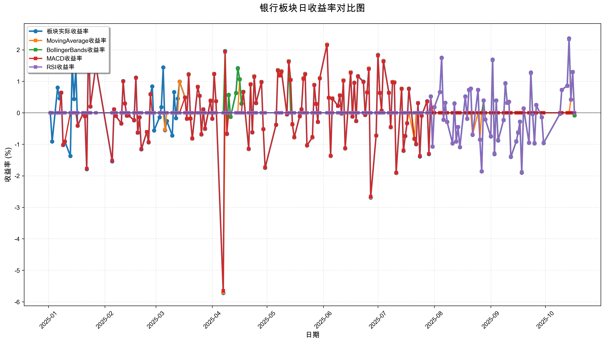
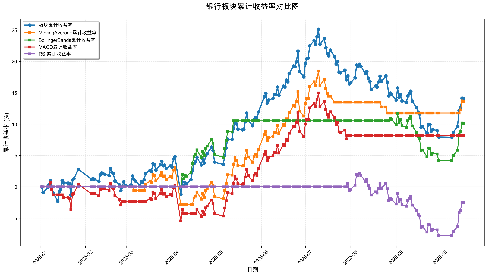

# 策略回测结果报告

**生成时间**: 2025-10-19 19:01:51
**行业板块**: 银行
**回测期间**: 20250101 至 20251017
**策略数量**: 4

## 📈 分析结论

### 策略表现分析
- **最佳策略**: MovingAverage (总收益率: 13.61%)
- **最差策略**: RSI (总收益率: -2.48%)
### 交易活跃度分析
- **活跃策略**: 4 个
- **非活跃策略**: 0 个
- **最活跃策略**: MovingAverage (交易次数: 13)
### 🚨 异动提醒分析
- **策略异动**: BollingerBands 近两周出现极端表现 (最大单日: 2.34%, 最小单日: 2.34%)
- **策略异动**: RSI 近两周出现极端表现 (最大单日: 2.35%, 最小单日: 2.35%)
### 风险分析
- **MovingAverage**: 最大回撤 -5.70%, 夏普比率 1.5269
- **BollingerBands**: 最大回撤 -6.74%, 夏普比率 1.6479
- **MACD**: 最大回撤 -6.39%, 夏普比率 0.8230
- **RSI**: 最大回撤 -9.72%, 夏普比率 -0.4349

## 📊 综合结果表

| 策略名称           | 初始资金     | 最终价值     | 总收益率   | 年化收益率   | 波动率    |    夏普比率 | 最大回撤    | 总交易次数   | 买入次数   | 卖出次数   | 总交易金额      | 平均交易金额   | 交易频率   |   数据点数 |
|:---------------|:---------|:---------|:-------|:--------|:-------|--------:|:--------|:--------|:-------|:-------|:-----------|:---------|:-------|-------:|
| 板块实际表现         | ¥100,000 | ¥114,068 | 14.07% | 19.07%  | 16.21% |  1.1765 | -13.77% | N/A     | N/A    | N/A    | N/A        | N/A      | N/A    |    190 |
| MovingAverage  | ¥100,000 | ¥113,614 | 13.61% | 18.45%  | 12.08% |  1.5269 | -5.70%  | 13      | 7      | 6      | ¥1,392,017 | ¥107,078 | 0.07   |    190 |
| BollingerBands | ¥100,000 | ¥110,100 | 10.10% | 13.61%  | 8.26%  |  1.6479 | -6.74%  | 3       | 2      | 1      | ¥318,332   | ¥106,111 | 0.02   |    190 |
| MACD           | ¥100,000 | ¥108,198 | 8.20%  | 11.02%  | 13.39% |  0.823  | -6.39%  | 8       | 4      | 4      | ¥785,056   | ¥98,132  | 0.04   |    190 |
| RSI            | ¥100,000 | ¥97,522  | -2.48% | -3.27%  | 7.53%  | -0.4349 | -9.72%  | 2       | 1      | 1      | ¥196,884   | ¥98,442  | 0.01   |    190 |

## 📊 每日收益率走势图

*图1: 银行板块每日收益率走势对比*

## 📈 累计收益率走势图

*图2: 银行板块累计收益率走势对比*

## 📅 日收益明细表

| 日期         | 板块实际收益率   | MovingAverage收益率   | BollingerBands收益率   | MACD收益率   | RSI收益率   |
|:-----------|:----------|:-------------------|:--------------------|:----------|:---------|
| 2025-01-02 | 0.00%     | 0.00%              | 0.00%               | 0.00%     | 0.00%    |
| 2025-01-03 | -0.91%    | 0.00%              | 0.00%               | 0.00%     | 0.00%    |
| 2025-01-06 | 0.80%     | 0.00%              | 0.00%               | 0.00%     | 0.00%    |
| 2025-01-07 | 0.46%     | 0.00%              | 0.00%               | 0.00%     | 0.00%    |
| 2025-01-08 | 0.64%     | 0.00%              | 0.00%               | 0.64%     | 0.00%    |
| 2025-01-09 | -1.02%    | 0.00%              | 0.00%               | -1.02%    | 0.00%    |
| 2025-01-10 | -0.91%    | 0.00%              | 0.00%               | -0.91%    | 0.00%    |
| 2025-01-13 | -1.37%    | 0.00%              | 0.00%               | 0.00%     | 0.00%    |
| 2025-01-14 | 1.58%     | 0.00%              | 0.00%               | 0.00%     | 0.00%    |
| 2025-01-15 | 0.44%     | 0.00%              | 0.00%               | 0.00%     | 0.00%    |
| 2025-01-16 | 1.39%     | 0.00%              | 0.00%               | 0.00%     | 0.00%    |
| 2025-01-17 | -0.41%    | 0.00%              | 0.00%               | -0.41%    | 0.00%    |
| 2025-01-20 | -0.02%    | 0.00%              | 0.00%               | -0.02%    | 0.00%    |
| 2025-01-21 | -0.11%    | 0.00%              | 0.00%               | -0.11%    | 0.00%    |
| 2025-01-22 | -1.79%    | 0.00%              | 0.00%               | -1.77%    | 0.00%    |
| 2025-01-23 | 2.43%     | 0.00%              | 0.00%               | 2.40%     | 0.00%    |
| 2025-01-24 | 0.20%     | 0.00%              | 0.00%               | 0.20%     | 0.00%    |
| 2025-01-27 | 1.49%     | 0.00%              | 0.00%               | 1.48%     | 0.00%    |
| 2025-02-05 | -1.54%    | 0.00%              | 0.00%               | -1.52%    | 0.00%    |
| 2025-02-06 | 0.11%     | 0.00%              | 0.00%               | 0.11%     | 0.00%    |
| 2025-02-07 | -0.10%    | 0.00%              | 0.00%               | -0.10%    | 0.00%    |
| 2025-02-10 | -0.34%    | 0.00%              | 0.00%               | -0.34%    | 0.00%    |
| 2025-02-11 | 1.01%     | 0.00%              | 0.00%               | 1.00%     | 0.00%    |
| 2025-02-12 | 0.30%     | 0.00%              | 0.00%               | 0.29%     | 0.00%    |
| 2025-02-13 | -0.09%    | 0.00%              | 0.00%               | -0.09%    | 0.00%    |
| 2025-02-14 | -0.08%    | 0.00%              | 0.00%               | -0.08%    | 0.00%    |
| 2025-02-17 | -0.24%    | 0.00%              | 0.00%               | -0.23%    | 0.00%    |
| 2025-02-18 | 1.12%     | 0.00%              | 0.00%               | 1.11%     | 0.00%    |
| 2025-02-19 | -0.63%    | 0.00%              | 0.00%               | -0.63%    | 0.00%    |
| 2025-02-20 | -0.14%    | 0.00%              | 0.00%               | -0.14%    | 0.00%    |
| 2025-02-21 | -1.16%    | 0.00%              | 0.00%               | -1.15%    | 0.00%    |
| 2025-02-24 | -0.61%    | 0.00%              | 0.00%               | -0.60%    | 0.00%    |
| 2025-02-25 | -0.94%    | 0.00%              | 0.00%               | -0.93%    | 0.00%    |
| 2025-02-26 | 0.59%     | 0.00%              | 0.00%               | 0.59%     | 0.00%    |
| 2025-02-27 | 0.84%     | 0.00%              | 0.00%               | 0.00%     | 0.00%    |
| 2025-02-28 | -0.56%    | 0.00%              | 0.00%               | 0.00%     | 0.00%    |
| 2025-03-03 | -0.14%    | 0.00%              | 0.00%               | 0.00%     | 0.00%    |
| 2025-03-04 | 0.18%     | 0.00%              | 0.00%               | 0.00%     | 0.00%    |
| 2025-03-05 | 1.44%     | 0.00%              | 0.00%               | 0.00%     | 0.00%    |
| 2025-03-06 | -0.55%    | -0.54%             | 0.00%               | 0.00%     | 0.00%    |
| 2025-03-07 | -0.26%    | 0.00%              | 0.00%               | 0.00%     | 0.00%    |
| 2025-03-10 | -0.72%    | 0.00%              | 0.00%               | 0.00%     | 0.00%    |
| 2025-03-11 | 0.66%     | 0.00%              | 0.00%               | 0.00%     | 0.00%    |
| 2025-03-12 | -0.17%    | 0.00%              | 0.00%               | 0.00%     | 0.00%    |
| 2025-03-13 | 0.45%     | 0.00%              | 0.00%               | 0.00%     | 0.00%    |
| 2025-03-14 | 0.99%     | 0.99%              | 0.00%               | 0.00%     | 0.00%    |
| 2025-03-17 | 0.49%     | 0.49%              | 0.00%               | 0.49%     | 0.00%    |
| 2025-03-18 | -0.19%    | -0.19%             | 0.00%               | -0.19%    | 0.00%    |
| 2025-03-19 | 1.23%     | 1.22%              | 0.00%               | 1.21%     | 0.00%    |
| 2025-03-20 | -0.19%    | -0.19%             | 0.00%               | -0.18%    | 0.00%    |
| 2025-03-21 | -0.82%    | -0.82%             | 0.00%               | -0.81%    | 0.00%    |
| 2025-03-24 | 0.83%     | 0.83%              | 0.00%               | 0.82%     | 0.00%    |
| 2025-03-25 | 0.54%     | 0.54%              | 0.00%               | 0.54%     | 0.00%    |
| 2025-03-26 | -0.69%    | -0.69%             | 0.00%               | -0.68%    | 0.00%    |
| 2025-03-27 | 0.11%     | 0.11%              | 0.00%               | 0.11%     | 0.00%    |
| 2025-03-28 | -0.51%    | -0.51%             | 0.00%               | -0.50%    | 0.00%    |
| 2025-03-31 | 0.39%     | 0.39%              | 0.00%               | 0.38%     | 0.00%    |
| 2025-04-01 | -0.19%    | -0.19%             | 0.00%               | -0.19%    | 0.00%    |
| 2025-04-02 | 1.24%     | 1.24%              | 0.00%               | 1.23%     | 0.00%    |
| 2025-04-03 | 0.37%     | 0.37%              | 0.00%               | 0.37%     | 0.00%    |
| 2025-04-07 | -5.72%    | -5.70%             | 0.00%               | -5.65%    | 0.00%    |
| 2025-04-08 | 1.96%     | 0.00%              | 1.95%               | 1.94%     | 0.00%    |
| 2025-04-09 | -0.67%    | 0.00%              | -0.66%              | -0.66%    | 0.00%    |
| 2025-04-10 | 0.57%     | 0.00%              | 0.56%               | 0.00%     | 0.00%    |
| 2025-04-11 | -0.13%    | 0.00%              | -0.13%              | 0.00%     | 0.00%    |
| 2025-04-14 | 0.63%     | 0.00%              | 0.62%               | 0.00%     | 0.00%    |
| 2025-04-15 | 1.42%     | 0.00%              | 1.40%               | 0.00%     | 0.00%    |
| 2025-04-16 | 1.07%     | 1.07%              | 1.06%               | 0.00%     | 0.00%    |
| 2025-04-17 | 0.29%     | 0.29%              | 0.29%               | 0.00%     | 0.00%    |
| 2025-04-18 | 0.67%     | 0.67%              | 0.67%               | 0.66%     | 0.00%    |
| 2025-04-21 | -1.15%    | -1.15%             | -1.14%              | -1.14%    | 0.00%    |
| 2025-04-22 | 0.91%     | 0.91%              | 0.90%               | 0.90%     | 0.00%    |
| 2025-04-23 | -0.62%    | -0.62%             | -0.62%              | -0.62%    | 0.00%    |
| 2025-04-24 | 1.16%     | 1.16%              | 1.15%               | 1.14%     | 0.00%    |
| 2025-04-25 | 0.31%     | 0.31%              | 0.31%               | 0.31%     | 0.00%    |
| 2025-04-28 | 0.98%     | 0.98%              | 0.98%               | 0.97%     | 0.00%    |
| 2025-04-29 | -0.52%    | -0.52%             | -0.52%              | -0.52%    | 0.00%    |
| 2025-04-30 | -1.75%    | -1.74%             | -1.73%              | -1.73%    | 0.00%    |
| 2025-05-06 | -0.38%    | -0.38%             | -0.38%              | -0.38%    | 0.00%    |
| 2025-05-07 | 1.36%     | 1.36%              | 1.35%               | 1.34%     | 0.00%    |
| 2025-05-08 | 1.19%     | 1.19%              | 1.18%               | 1.18%     | 0.00%    |
| 2025-05-09 | 1.32%     | 1.32%              | 1.31%               | 1.30%     | 0.00%    |
| 2025-05-12 | -0.05%    | -0.05%             | -0.05%              | -0.05%    | 0.00%    |
| 2025-05-13 | 1.64%     | 1.64%              | 1.63%               | 1.62%     | 0.00%    |
| 2025-05-14 | 1.05%     | 1.05%              | 0.00%               | 1.04%     | 0.00%    |
| 2025-05-15 | -0.37%    | -0.37%             | 0.00%               | -0.36%    | 0.00%    |
| 2025-05-16 | -0.78%    | -0.78%             | 0.00%               | -0.77%    | 0.00%    |
| 2025-05-19 | -0.11%    | -0.11%             | 0.00%               | -0.11%    | 0.00%    |
| 2025-05-20 | 0.11%     | 0.11%              | 0.00%               | 0.11%     | 0.00%    |
| 2025-05-21 | 1.10%     | 1.09%              | 0.00%               | 1.08%     | 0.00%    |
| 2025-05-22 | 1.24%     | 1.23%              | 0.00%               | 1.22%     | 0.00%    |
| 2025-05-23 | -1.04%    | -1.04%             | 0.00%               | -1.03%    | 0.00%    |
| 2025-05-26 | -0.78%    | -0.78%             | 0.00%               | -0.77%    | 0.00%    |
| 2025-05-27 | 0.89%     | 0.89%              | 0.00%               | 0.88%     | 0.00%    |
| 2025-05-28 | 0.28%     | 0.28%              | 0.00%               | 0.28%     | 0.00%    |
| 2025-05-29 | -0.29%    | -0.29%             | 0.00%               | -0.29%    | 0.00%    |
| 2025-05-30 | 1.10%     | 1.10%              | 0.00%               | 1.09%     | 0.00%    |
| 2025-06-03 | 2.17%     | 2.17%              | 0.00%               | 2.15%     | 0.00%    |
| 2025-06-04 | 0.48%     | 0.48%              | 0.00%               | 0.48%     | 0.00%    |
| 2025-06-05 | -1.37%    | -1.37%             | 0.00%               | -1.36%    | 0.00%    |
| 2025-06-06 | 0.46%     | 0.46%              | 0.00%               | 0.45%     | 0.00%    |
| 2025-06-09 | 0.22%     | 0.22%              | 0.00%               | 0.22%     | 0.00%    |
| 2025-06-10 | 0.56%     | 0.56%              | 0.00%               | 0.55%     | 0.00%    |
| 2025-06-11 | -0.02%    | -0.02%             | 0.00%               | -0.02%    | 0.00%    |
| 2025-06-12 | 1.03%     | 1.03%              | 0.00%               | 1.02%     | 0.00%    |
| 2025-06-13 | -1.13%    | -1.13%             | 0.00%               | -1.12%    | 0.00%    |
| 2025-06-16 | 1.29%     | 1.29%              | 0.00%               | 1.27%     | 0.00%    |
| 2025-06-17 | -0.12%    | -0.12%             | 0.00%               | -0.12%    | 0.00%    |
| 2025-06-18 | 0.96%     | 0.95%              | 0.00%               | 0.95%     | 0.00%    |
| 2025-06-19 | -0.26%    | -0.26%             | 0.00%               | -0.26%    | 0.00%    |
| 2025-06-20 | 1.17%     | 1.16%              | 0.00%               | 1.15%     | 0.00%    |
| 2025-06-23 | 0.99%     | 0.98%              | 0.00%               | 0.98%     | 0.00%    |
| 2025-06-24 | -0.07%    | -0.07%             | 0.00%               | -0.07%    | 0.00%    |
| 2025-06-25 | 0.65%     | 0.65%              | 0.00%               | 0.65%     | 0.00%    |
| 2025-06-26 | 1.41%     | 1.41%              | 0.00%               | 1.39%     | 0.00%    |
| 2025-06-27 | -2.69%    | -2.68%             | 0.00%               | -2.66%    | 0.00%    |
| 2025-06-30 | -0.72%    | -0.72%             | 0.00%               | -0.72%    | 0.00%    |
| 2025-07-01 | 1.84%     | 1.83%              | 0.00%               | 1.82%     | 0.00%    |
| 2025-07-02 | 0.63%     | 0.63%              | 0.00%               | 0.63%     | 0.00%    |
| 2025-07-03 | 0.07%     | 0.07%              | 0.00%               | 0.07%     | 0.00%    |
| 2025-07-04 | 1.65%     | 1.64%              | 0.00%               | 1.63%     | 0.00%    |
| 2025-07-07 | 0.64%     | 0.64%              | 0.00%               | 0.63%     | 0.00%    |
| 2025-07-08 | -0.46%    | -0.46%             | 0.00%               | -0.45%    | 0.00%    |
| 2025-07-09 | 0.98%     | 0.98%              | 0.00%               | 0.97%     | 0.00%    |
| 2025-07-10 | 0.97%     | 0.97%              | 0.00%               | 0.96%     | 0.00%    |
| 2025-07-11 | -1.91%    | -1.91%             | 0.00%               | -1.90%    | 0.00%    |
| 2025-07-14 | 0.77%     | 0.77%              | 0.00%               | 0.76%     | 0.00%    |
| 2025-07-15 | -1.21%    | -1.20%             | 0.00%               | -1.19%    | 0.00%    |
| 2025-07-16 | -0.74%    | -0.73%             | 0.00%               | -0.73%    | 0.00%    |
| 2025-07-17 | -0.33%    | -0.33%             | 0.00%               | -0.33%    | 0.00%    |
| 2025-07-18 | 0.77%     | 0.00%              | 0.00%               | 0.76%     | 0.00%    |
| 2025-07-21 | -0.83%    | -0.83%             | 0.00%               | -0.82%    | 0.00%    |
| 2025-07-22 | -1.00%    | 0.00%              | 0.00%               | -0.99%    | 0.00%    |
| 2025-07-23 | 0.31%     | 0.00%              | 0.00%               | 0.31%     | 0.00%    |
| 2025-07-24 | -1.39%    | 0.00%              | 0.00%               | -1.37%    | 0.00%    |
| 2025-07-25 | -0.09%    | 0.00%              | 0.00%               | -0.09%    | 0.00%    |
| 2025-07-28 | 0.37%     | 0.00%              | 0.00%               | 0.36%     | 0.00%    |
| 2025-07-29 | -1.31%    | 0.00%              | 0.00%               | -1.30%    | 0.00%    |
| 2025-07-30 | 0.52%     | 0.00%              | 0.00%               | 0.52%     | 0.52%    |
| 2025-07-31 | -1.07%    | 0.00%              | 0.00%               | 0.00%     | -1.07%   |
| 2025-08-01 | 0.18%     | 0.00%              | 0.00%               | 0.00%     | 0.18%    |
| 2025-08-04 | 0.66%     | 0.00%              | 0.00%               | 0.00%     | 0.65%    |
| 2025-08-05 | 1.75%     | 0.00%              | 0.00%               | 0.00%     | 1.74%    |
| 2025-08-06 | -0.22%    | 0.00%              | 0.00%               | 0.00%     | -0.22%   |
| 2025-08-07 | 0.32%     | 0.00%              | 0.00%               | 0.00%     | 0.32%    |
| 2025-08-08 | -0.29%    | 0.00%              | 0.00%               | 0.00%     | -0.29%   |
| 2025-08-11 | -0.97%    | 0.00%              | 0.00%               | 0.00%     | -0.97%   |
| 2025-08-12 | 0.30%     | 0.00%              | 0.00%               | 0.00%     | 0.29%    |
| 2025-08-13 | -0.91%    | 0.00%              | 0.00%               | 0.00%     | -0.91%   |
| 2025-08-14 | -0.45%    | 0.00%              | 0.00%               | 0.00%     | -0.45%   |
| 2025-08-15 | -1.09%    | 0.00%              | 0.00%               | 0.00%     | -1.09%   |
| 2025-08-18 | 0.52%     | 0.00%              | 0.00%               | 0.00%     | 0.51%    |
| 2025-08-19 | -0.19%    | 0.00%              | 0.00%               | 0.00%     | -0.19%   |
| 2025-08-20 | 0.73%     | 0.00%              | 0.00%               | 0.00%     | 0.73%    |
| 2025-08-21 | 0.77%     | 0.00%              | 0.00%               | 0.00%     | 0.77%    |
| 2025-08-22 | -0.70%    | -0.69%             | 0.00%               | 0.00%     | -0.69%   |
| 2025-08-25 | 0.73%     | 0.00%              | 0.00%               | 0.00%     | 0.73%    |
| 2025-08-26 | -0.85%    | -0.85%             | 0.00%               | 0.00%     | -0.85%   |
| 2025-08-27 | -1.86%    | 0.00%              | 0.00%               | 0.00%     | -1.86%   |
| 2025-08-28 | 0.39%     | 0.00%              | 0.39%               | 0.00%     | 0.39%    |
| 2025-08-29 | -0.21%    | 0.00%              | -0.21%              | 0.00%     | -0.21%   |
| 2025-09-01 | -0.75%    | 0.00%              | -0.74%              | 0.00%     | -0.74%   |
| 2025-09-02 | 1.69%     | 0.00%              | 1.67%               | 0.00%     | 1.68%    |
| 2025-09-03 | -1.31%    | 0.00%              | -1.29%              | 0.00%     | -1.30%   |
| 2025-09-04 | 0.39%     | 0.00%              | 0.39%               | 0.00%     | 0.39%    |
| 2025-09-05 | -0.88%    | 0.00%              | -0.87%              | 0.00%     | -0.87%   |
| 2025-09-08 | -0.23%    | 0.00%              | -0.23%              | 0.00%     | -0.23%   |
| 2025-09-09 | 0.94%     | 0.00%              | 0.93%               | 0.00%     | 0.93%    |
| 2025-09-10 | 0.32%     | 0.00%              | 0.31%               | 0.00%     | 0.31%    |
| 2025-09-11 | 0.35%     | 0.00%              | 0.35%               | 0.00%     | 0.35%    |
| 2025-09-12 | -1.40%    | 0.00%              | -1.39%              | 0.00%     | -1.39%   |
| 2025-09-15 | -0.91%    | 0.00%              | -0.90%              | 0.00%     | -0.90%   |
| 2025-09-16 | -0.63%    | 0.00%              | -0.62%              | 0.00%     | -0.63%   |
| 2025-09-17 | -0.28%    | 0.00%              | -0.28%              | 0.00%     | -0.28%   |
| 2025-09-18 | -1.90%    | 0.00%              | -1.88%              | 0.00%     | -1.89%   |
| 2025-09-19 | 0.14%     | 0.00%              | 0.14%               | 0.00%     | 0.14%    |
| 2025-09-22 | -0.95%    | 0.00%              | -0.95%              | 0.00%     | -0.95%   |
| 2025-09-23 | 1.28%     | 0.00%              | 1.26%               | 0.00%     | 1.27%    |
| 2025-09-24 | -0.04%    | 0.00%              | -0.04%              | 0.00%     | -0.04%   |
| 2025-09-25 | -0.97%    | 0.00%              | -0.96%              | 0.00%     | -0.97%   |
| 2025-09-26 | 0.25%     | 0.00%              | 0.25%               | 0.00%     | 0.25%    |
| 2025-09-29 | -0.14%    | 0.00%              | -0.14%              | 0.00%     | -0.14%   |
| 2025-09-30 | -0.96%    | 0.00%              | -0.95%              | 0.00%     | -0.96%   |
| 2025-10-09 | -0.03%    | 0.00%              | -0.03%              | 0.00%     | -0.03%   |
| 2025-10-10 | 0.73%     | 0.00%              | 0.73%               | 0.00%     | 0.73%    |
| 2025-10-13 | 0.86%     | 0.00%              | 0.85%               | 0.00%     | 0.85%    |
| 2025-10-14 | 2.36%     | 0.00%              | 2.34%               | 0.00%     | 2.35%    |
| 2025-10-15 | 0.42%     | 0.42%              | 0.42%               | 0.00%     | 0.42%    |
| 2025-10-16 | 1.30%     | 1.30%              | 1.29%               | 0.00%     | 1.30%    |
| 2025-10-17 | -0.08%    | -0.08%             | -0.08%              | 0.00%     | 0.00%    |

## 📊 日收益统计摘要

| 指标                | 平均日收益率   | 最大日收益率   | 最小日收益率   | 正收益天数   | 负收益天数   |
|:------------------|:---------|:---------|:---------|:--------|:--------|
| 板块实际收益率           | 0.07%    | 2.43%    | -5.72%   | 97天     | 92天     |
| MovingAverage收益率  | 0.07%    | 2.17%    | -5.70%   | 49天     | 37天     |
| BollingerBands收益率 | 0.05%    | 2.34%    | -1.88%   | 29天     | 25天     |
| MACD收益率           | 0.04%    | 2.40%    | -5.65%   | 58天     | 55天     |
| RSI收益率            | -0.01%   | 2.35%    | -1.89%   | 24天     | 27天     |

## 📈 累计收益明细表

| 日期         | 板块累计收益率   | MovingAverage累计收益率   | BollingerBands累计收益率   | MACD累计收益率   | RSI累计收益率   |
|:-----------|:----------|:---------------------|:----------------------|:------------|:-----------|
| 2025-01-02 | 0.00%     | 0.00%                | 0.00%                 | 0.00%       | 0.00%      |
| 2025-01-03 | -0.91%    | 0.00%                | 0.00%                 | 0.00%       | 0.00%      |
| 2025-01-06 | -0.12%    | 0.00%                | 0.00%                 | 0.00%       | 0.00%      |
| 2025-01-07 | 0.34%     | 0.00%                | 0.00%                 | 0.00%       | 0.00%      |
| 2025-01-08 | 0.98%     | 0.00%                | 0.00%                 | 0.64%       | 0.00%      |
| 2025-01-09 | -0.05%    | 0.00%                | 0.00%                 | -0.39%      | 0.00%      |
| 2025-01-10 | -0.97%    | 0.00%                | 0.00%                 | -1.29%      | 0.00%      |
| 2025-01-13 | -2.32%    | 0.00%                | 0.00%                 | -1.29%      | 0.00%      |
| 2025-01-14 | -0.78%    | 0.00%                | 0.00%                 | -1.29%      | 0.00%      |
| 2025-01-15 | -0.35%    | 0.00%                | 0.00%                 | -1.29%      | 0.00%      |
| 2025-01-16 | 1.04%     | 0.00%                | 0.00%                 | -1.29%      | 0.00%      |
| 2025-01-17 | 0.63%     | 0.00%                | 0.00%                 | -1.69%      | 0.00%      |
| 2025-01-20 | 0.61%     | 0.00%                | 0.00%                 | -1.71%      | 0.00%      |
| 2025-01-21 | 0.49%     | 0.00%                | 0.00%                 | -1.82%      | 0.00%      |
| 2025-01-22 | -1.30%    | 0.00%                | 0.00%                 | -3.56%      | 0.00%      |
| 2025-01-23 | 1.09%     | 0.00%                | 0.00%                 | -1.24%      | 0.00%      |
| 2025-01-24 | 1.29%     | 0.00%                | 0.00%                 | -1.04%      | 0.00%      |
| 2025-01-27 | 2.81%     | 0.00%                | 0.00%                 | 0.42%       | 0.00%      |
| 2025-02-05 | 1.23%     | 0.00%                | 0.00%                 | -1.11%      | 0.00%      |
| 2025-02-06 | 1.34%     | 0.00%                | 0.00%                 | -1.00%      | 0.00%      |
| 2025-02-07 | 1.23%     | 0.00%                | 0.00%                 | -1.10%      | 0.00%      |
| 2025-02-10 | 0.89%     | 0.00%                | 0.00%                 | -1.44%      | 0.00%      |
| 2025-02-11 | 1.91%     | 0.00%                | 0.00%                 | -0.45%      | 0.00%      |
| 2025-02-12 | 2.21%     | 0.00%                | 0.00%                 | -0.16%      | 0.00%      |
| 2025-02-13 | 2.11%     | 0.00%                | 0.00%                 | -0.25%      | 0.00%      |
| 2025-02-14 | 2.03%     | 0.00%                | 0.00%                 | -0.33%      | 0.00%      |
| 2025-02-17 | 1.79%     | 0.00%                | 0.00%                 | -0.56%      | 0.00%      |
| 2025-02-18 | 2.93%     | 0.00%                | 0.00%                 | 0.54%       | 0.00%      |
| 2025-02-19 | 2.28%     | 0.00%                | 0.00%                 | -0.09%      | 0.00%      |
| 2025-02-20 | 2.14%     | 0.00%                | 0.00%                 | -0.23%      | 0.00%      |
| 2025-02-21 | 0.95%     | 0.00%                | 0.00%                 | -1.38%      | 0.00%      |
| 2025-02-24 | 0.34%     | 0.00%                | 0.00%                 | -1.97%      | 0.00%      |
| 2025-02-25 | -0.60%    | 0.00%                | 0.00%                 | -2.88%      | 0.00%      |
| 2025-02-26 | -0.01%    | 0.00%                | 0.00%                 | -2.31%      | 0.00%      |
| 2025-02-27 | 0.83%     | 0.00%                | 0.00%                 | -2.31%      | 0.00%      |
| 2025-02-28 | 0.26%     | 0.00%                | 0.00%                 | -2.31%      | 0.00%      |
| 2025-03-03 | 0.12%     | 0.00%                | 0.00%                 | -2.31%      | 0.00%      |
| 2025-03-04 | 0.30%     | 0.00%                | 0.00%                 | -2.31%      | 0.00%      |
| 2025-03-05 | 1.75%     | 0.00%                | 0.00%                 | -2.31%      | 0.00%      |
| 2025-03-06 | 1.19%     | -0.54%               | 0.00%                 | -2.31%      | 0.00%      |
| 2025-03-07 | 0.93%     | -0.54%               | 0.00%                 | -2.31%      | 0.00%      |
| 2025-03-10 | 0.20%     | -0.54%               | 0.00%                 | -2.31%      | 0.00%      |
| 2025-03-11 | 0.87%     | -0.54%               | 0.00%                 | -2.31%      | 0.00%      |
| 2025-03-12 | 0.70%     | -0.54%               | 0.00%                 | -2.31%      | 0.00%      |
| 2025-03-13 | 1.15%     | -0.54%               | 0.00%                 | -2.31%      | 0.00%      |
| 2025-03-14 | 2.16%     | 0.44%                | 0.00%                 | -2.31%      | 0.00%      |
| 2025-03-17 | 2.66%     | 0.93%                | 0.00%                 | -1.83%      | 0.00%      |
| 2025-03-18 | 2.46%     | 0.74%                | 0.00%                 | -2.02%      | 0.00%      |
| 2025-03-19 | 3.72%     | 1.97%                | 0.00%                 | -0.83%      | 0.00%      |
| 2025-03-20 | 3.53%     | 1.78%                | 0.00%                 | -1.01%      | 0.00%      |
| 2025-03-21 | 2.67%     | 0.94%                | 0.00%                 | -1.82%      | 0.00%      |
| 2025-03-24 | 3.53%     | 1.78%                | 0.00%                 | -1.01%      | 0.00%      |
| 2025-03-25 | 4.09%     | 2.33%                | 0.00%                 | -0.47%      | 0.00%      |
| 2025-03-26 | 3.37%     | 1.63%                | 0.00%                 | -1.16%      | 0.00%      |
| 2025-03-27 | 3.48%     | 1.74%                | 0.00%                 | -1.05%      | 0.00%      |
| 2025-03-28 | 2.96%     | 1.22%                | 0.00%                 | -1.55%      | 0.00%      |
| 2025-03-31 | 3.36%     | 1.61%                | 0.00%                 | -1.17%      | 0.00%      |
| 2025-04-01 | 3.16%     | 1.42%                | 0.00%                 | -1.36%      | 0.00%      |
| 2025-04-02 | 4.44%     | 2.68%                | 0.00%                 | -0.14%      | 0.00%      |
| 2025-04-03 | 4.83%     | 3.06%                | 0.00%                 | 0.22%       | 0.00%      |
| 2025-04-07 | -1.16%    | -2.81%               | 0.00%                 | -5.44%      | 0.00%      |
| 2025-04-08 | 0.78%     | -2.81%               | 1.95%                 | -3.61%      | 0.00%      |
| 2025-04-09 | 0.11%     | -2.81%               | 1.27%                 | -4.24%      | 0.00%      |
| 2025-04-10 | 0.67%     | -2.81%               | 1.84%                 | -4.24%      | 0.00%      |
| 2025-04-11 | 0.54%     | -2.81%               | 1.70%                 | -4.24%      | 0.00%      |
| 2025-04-14 | 1.17%     | -2.81%               | 2.34%                 | -4.24%      | 0.00%      |
| 2025-04-15 | 2.61%     | -2.81%               | 3.78%                 | -4.24%      | 0.00%      |
| 2025-04-16 | 3.71%     | -1.77%               | 4.88%                 | -4.24%      | 0.00%      |
| 2025-04-17 | 4.01%     | -1.48%               | 5.19%                 | -4.24%      | 0.00%      |
| 2025-04-18 | 4.71%     | -0.82%               | 5.89%                 | -3.61%      | 0.00%      |
| 2025-04-21 | 3.50%     | -1.96%               | 4.68%                 | -4.70%      | 0.00%      |
| 2025-04-22 | 4.44%     | -1.08%               | 5.62%                 | -3.85%      | 0.00%      |
| 2025-04-23 | 3.79%     | -1.69%               | 4.97%                 | -4.44%      | 0.00%      |
| 2025-04-24 | 4.99%     | -0.56%               | 6.17%                 | -3.35%      | 0.00%      |
| 2025-04-25 | 5.32%     | -0.25%               | 6.50%                 | -3.05%      | 0.00%      |
| 2025-04-28 | 6.36%     | 0.73%                | 7.54%                 | -2.11%      | 0.00%      |
| 2025-04-29 | 5.80%     | 0.21%                | 6.98%                 | -2.61%      | 0.00%      |
| 2025-04-30 | 3.95%     | -1.54%               | 5.13%                 | -4.30%      | 0.00%      |
| 2025-05-06 | 3.56%     | -1.91%               | 4.73%                 | -4.66%      | 0.00%      |
| 2025-05-07 | 4.96%     | -0.58%               | 6.14%                 | -3.38%      | 0.00%      |
| 2025-05-08 | 6.22%     | 0.60%                | 7.40%                 | -2.24%      | 0.00%      |
| 2025-05-09 | 7.62%     | 1.92%                | 8.81%                 | -0.96%      | 0.00%      |
| 2025-05-12 | 7.57%     | 1.88%                | 8.75%                 | -1.01%      | 0.00%      |
| 2025-05-13 | 9.33%     | 3.54%                | 10.52%                | 0.60%       | 0.00%      |
| 2025-05-14 | 10.48%    | 4.63%                | 10.52%                | 1.64%       | 0.00%      |
| 2025-05-15 | 10.07%    | 4.24%                | 10.52%                | 1.27%       | 0.00%      |
| 2025-05-16 | 9.21%     | 3.43%                | 10.52%                | 0.49%       | 0.00%      |
| 2025-05-19 | 9.09%     | 3.32%                | 10.52%                | 0.38%       | 0.00%      |
| 2025-05-20 | 9.21%     | 3.43%                | 10.52%                | 0.49%       | 0.00%      |
| 2025-05-21 | 10.41%    | 4.56%                | 10.52%                | 1.58%       | 0.00%      |
| 2025-05-22 | 11.78%    | 5.85%                | 10.52%                | 2.82%       | 0.00%      |
| 2025-05-23 | 10.62%    | 4.76%                | 10.52%                | 1.77%       | 0.00%      |
| 2025-05-26 | 9.75%     | 3.94%                | 10.52%                | 0.98%       | 0.00%      |
| 2025-05-27 | 10.73%    | 4.86%                | 10.52%                | 1.87%       | 0.00%      |
| 2025-05-28 | 11.04%    | 5.16%                | 10.52%                | 2.15%       | 0.00%      |
| 2025-05-29 | 10.71%    | 4.85%                | 10.52%                | 1.86%       | 0.00%      |
| 2025-05-30 | 11.94%    | 6.00%                | 10.52%                | 2.97%       | 0.00%      |
| 2025-06-03 | 14.37%    | 8.30%                | 10.52%                | 5.18%       | 0.00%      |
| 2025-06-04 | 14.92%    | 8.83%                | 10.52%                | 5.69%       | 0.00%      |
| 2025-06-05 | 13.35%    | 7.34%                | 10.52%                | 4.25%       | 0.00%      |
| 2025-06-06 | 13.86%    | 7.83%                | 10.52%                | 4.72%       | 0.00%      |
| 2025-06-09 | 14.12%    | 8.07%                | 10.52%                | 4.95%       | 0.00%      |
| 2025-06-10 | 14.76%    | 8.67%                | 10.52%                | 5.53%       | 0.00%      |
| 2025-06-11 | 14.74%    | 8.65%                | 10.52%                | 5.52%       | 0.00%      |
| 2025-06-12 | 15.92%    | 9.77%                | 10.52%                | 6.59%       | 0.00%      |
| 2025-06-13 | 14.61%    | 8.53%                | 10.52%                | 5.40%       | 0.00%      |
| 2025-06-16 | 16.09%    | 9.92%                | 10.52%                | 6.74%       | 0.00%      |
| 2025-06-17 | 15.94%    | 9.79%                | 10.52%                | 6.61%       | 0.00%      |
| 2025-06-18 | 17.05%    | 10.84%               | 10.52%                | 7.62%       | 0.00%      |
| 2025-06-19 | 16.74%    | 10.55%               | 10.52%                | 7.34%       | 0.00%      |
| 2025-06-20 | 18.11%    | 11.83%               | 10.52%                | 8.58%       | 0.00%      |
| 2025-06-23 | 19.27%    | 12.93%               | 10.52%                | 9.64%       | 0.00%      |
| 2025-06-24 | 19.19%    | 12.86%               | 10.52%                | 9.57%       | 0.00%      |
| 2025-06-25 | 19.97%    | 13.59%               | 10.52%                | 10.28%      | 0.00%      |
| 2025-06-26 | 21.66%    | 15.19%               | 10.52%                | 11.81%      | 0.00%      |
| 2025-06-27 | 18.39%    | 12.10%               | 10.52%                | 8.84%       | 0.00%      |
| 2025-06-30 | 17.54%    | 11.29%               | 10.52%                | 8.06%       | 0.00%      |
| 2025-07-01 | 19.70%    | 13.34%               | 10.52%                | 10.03%      | 0.00%      |
| 2025-07-02 | 20.45%    | 14.05%               | 10.52%                | 10.72%      | 0.00%      |
| 2025-07-03 | 20.54%    | 14.13%               | 10.52%                | 10.79%      | 0.00%      |
| 2025-07-04 | 22.52%    | 16.01%               | 10.52%                | 12.60%      | 0.00%      |
| 2025-07-07 | 23.31%    | 16.74%               | 10.52%                | 13.31%      | 0.00%      |
| 2025-07-08 | 22.74%    | 16.21%               | 10.52%                | 12.80%      | 0.00%      |
| 2025-07-09 | 23.94%    | 17.35%               | 10.52%                | 13.89%      | 0.00%      |
| 2025-07-10 | 25.15%    | 18.48%               | 10.52%                | 14.98%      | 0.00%      |
| 2025-07-11 | 22.75%    | 16.22%               | 10.52%                | 12.80%      | 0.00%      |
| 2025-07-14 | 23.69%    | 17.11%               | 10.52%                | 13.66%      | 0.00%      |
| 2025-07-15 | 22.20%    | 15.70%               | 10.52%                | 12.30%      | 0.00%      |
| 2025-07-16 | 21.30%    | 14.85%               | 10.52%                | 11.49%      | 0.00%      |
| 2025-07-17 | 20.90%    | 14.47%               | 10.52%                | 11.12%      | 0.00%      |
| 2025-07-18 | 21.82%    | 14.47%               | 10.52%                | 11.96%      | 0.00%      |
| 2025-07-21 | 20.81%    | 13.52%               | 10.52%                | 11.04%      | 0.00%      |
| 2025-07-22 | 19.60%    | 13.52%               | 10.52%                | 9.94%       | 0.00%      |
| 2025-07-23 | 19.97%    | 13.52%               | 10.52%                | 10.28%      | 0.00%      |
| 2025-07-24 | 18.30%    | 13.52%               | 10.52%                | 8.76%       | 0.00%      |
| 2025-07-25 | 18.19%    | 13.52%               | 10.52%                | 8.66%       | 0.00%      |
| 2025-07-28 | 18.63%    | 13.52%               | 10.52%                | 9.06%       | 0.00%      |
| 2025-07-29 | 17.07%    | 13.52%               | 10.52%                | 7.64%       | 0.00%      |
| 2025-07-30 | 17.69%    | 13.52%               | 10.52%                | 8.20%       | 0.52%      |
| 2025-07-31 | 16.42%    | 13.52%               | 10.52%                | 8.20%       | -0.55%     |
| 2025-08-01 | 16.63%    | 13.52%               | 10.52%                | 8.20%       | -0.37%     |
| 2025-08-04 | 17.40%    | 13.52%               | 10.52%                | 8.20%       | 0.28%      |
| 2025-08-05 | 19.45%    | 13.52%               | 10.52%                | 8.20%       | 2.03%      |
| 2025-08-06 | 19.19%    | 13.52%               | 10.52%                | 8.20%       | 1.80%      |
| 2025-08-07 | 19.57%    | 13.52%               | 10.52%                | 8.20%       | 2.13%      |
| 2025-08-08 | 19.22%    | 13.52%               | 10.52%                | 8.20%       | 1.83%      |
| 2025-08-11 | 18.06%    | 13.52%               | 10.52%                | 8.20%       | 0.85%      |
| 2025-08-12 | 18.41%    | 13.52%               | 10.52%                | 8.20%       | 1.14%      |
| 2025-08-13 | 17.34%    | 13.52%               | 10.52%                | 8.20%       | 0.23%      |
| 2025-08-14 | 16.81%    | 13.52%               | 10.52%                | 8.20%       | -0.22%     |
| 2025-08-15 | 15.53%    | 13.52%               | 10.52%                | 8.20%       | -1.31%     |
| 2025-08-18 | 16.13%    | 13.52%               | 10.52%                | 8.20%       | -0.80%     |
| 2025-08-19 | 15.91%    | 13.52%               | 10.52%                | 8.20%       | -0.99%     |
| 2025-08-20 | 16.75%    | 13.52%               | 10.52%                | 8.20%       | -0.27%     |
| 2025-08-21 | 17.65%    | 13.52%               | 10.52%                | 8.20%       | 0.49%      |
| 2025-08-22 | 16.83%    | 12.74%               | 10.52%                | 8.20%       | -0.20%     |
| 2025-08-25 | 17.69%    | 12.74%               | 10.52%                | 8.20%       | 0.52%      |
| 2025-08-26 | 16.69%    | 11.78%               | 10.52%                | 8.20%       | -0.33%     |
| 2025-08-27 | 14.51%    | 11.78%               | 10.52%                | 8.20%       | -2.18%     |
| 2025-08-28 | 14.96%    | 11.78%               | 10.95%                | 8.20%       | -1.80%     |
| 2025-08-29 | 14.71%    | 11.78%               | 10.72%                | 8.20%       | -2.01%     |
| 2025-09-01 | 13.86%    | 11.78%               | 9.90%                 | 8.20%       | -2.74%     |
| 2025-09-02 | 15.78%    | 11.78%               | 11.74%                | 8.20%       | -1.10%     |
| 2025-09-03 | 14.27%    | 11.78%               | 10.29%                | 8.20%       | -2.39%     |
| 2025-09-04 | 14.71%    | 11.78%               | 10.72%                | 8.20%       | -2.01%     |
| 2025-09-05 | 13.71%    | 11.78%               | 9.76%                 | 8.20%       | -2.86%     |
| 2025-09-08 | 13.45%    | 11.78%               | 9.51%                 | 8.20%       | -3.08%     |
| 2025-09-09 | 14.51%    | 11.78%               | 10.52%                | 8.20%       | -2.18%     |
| 2025-09-10 | 14.87%    | 11.78%               | 10.87%                | 8.20%       | -1.87%     |
| 2025-09-11 | 15.28%    | 11.78%               | 11.26%                | 8.20%       | -1.53%     |
| 2025-09-12 | 13.66%    | 11.78%               | 9.71%                 | 8.20%       | -2.90%     |
| 2025-09-15 | 12.63%    | 11.78%               | 8.73%                 | 8.20%       | -3.78%     |
| 2025-09-16 | 11.93%    | 11.78%               | 8.05%                 | 8.20%       | -4.38%     |
| 2025-09-17 | 11.61%    | 11.78%               | 7.75%                 | 8.20%       | -4.65%     |
| 2025-09-18 | 9.49%     | 11.78%               | 5.72%                 | 8.20%       | -6.46%     |
| 2025-09-19 | 9.65%     | 11.78%               | 5.87%                 | 8.20%       | -6.32%     |
| 2025-09-22 | 8.60%     | 11.78%               | 4.87%                 | 8.20%       | -7.21%     |
| 2025-09-23 | 9.99%     | 11.78%               | 6.20%                 | 8.20%       | -6.03%     |
| 2025-09-24 | 9.94%     | 11.78%               | 6.15%                 | 8.20%       | -6.07%     |
| 2025-09-25 | 8.87%     | 11.78%               | 5.13%                 | 8.20%       | -6.98%     |
| 2025-09-26 | 9.15%     | 11.78%               | 5.39%                 | 8.20%       | -6.75%     |
| 2025-09-29 | 8.99%     | 11.78%               | 5.24%                 | 8.20%       | -6.88%     |
| 2025-09-30 | 7.95%     | 11.78%               | 4.25%                 | 8.20%       | -7.77%     |
| 2025-10-09 | 7.91%     | 11.78%               | 4.21%                 | 8.20%       | -7.80%     |
| 2025-10-10 | 8.70%     | 11.78%               | 4.97%                 | 8.20%       | -7.13%     |
| 2025-10-13 | 9.64%     | 11.78%               | 5.86%                 | 8.20%       | -6.33%     |
| 2025-10-14 | 12.22%    | 11.78%               | 8.33%                 | 8.20%       | -4.13%     |
| 2025-10-15 | 12.69%    | 12.25%               | 8.78%                 | 8.20%       | -3.73%     |
| 2025-10-16 | 14.16%    | 13.71%               | 10.19%                | 8.20%       | -2.48%     |
| 2025-10-17 | 14.07%    | 13.61%               | 10.10%                | 8.20%       | -2.48%     |

## 📊 累计收益统计摘要

| 指标                  | 最终累计收益率   | 最大累计收益率   | 最小累计收益率   | 累计收益波动   | 收益稳定性   |
|:--------------------|:----------|:----------|:----------|:---------|:--------|
| 板块累计收益率             | 14.07%    | 25.15%    | -2.32%    | 27.47%   | 波动      |
| MovingAverage累计收益率  | 13.61%    | 18.48%    | -2.81%    | 21.29%   | 波动      |
| BollingerBands累计收益率 | 10.10%    | 11.74%    | 0.00%     | 11.74%   | 稳定      |
| MACD累计收益率           | 8.20%     | 14.98%    | -5.44%    | 20.42%   | 波动      |
| RSI累计收益率            | -2.48%    | 2.13%     | -7.80%    | 9.93%    | 稳定      |

