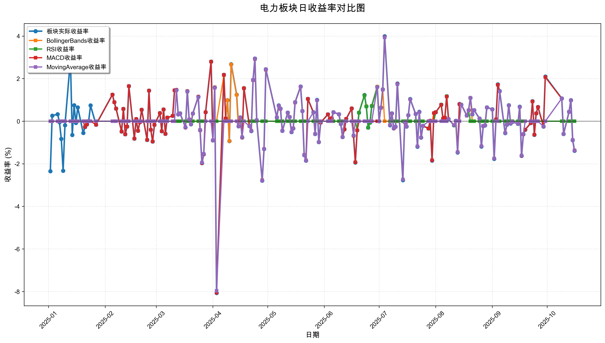
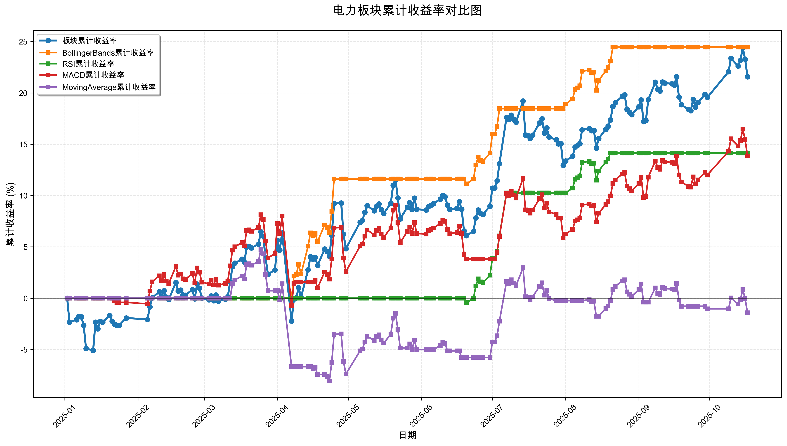

# 策略回测结果报告

**生成时间**: 2025-10-20 00:52:03
**行业板块**: 电力
**回测期间**: 20250101 至 20251017
**策略数量**: 4

## 📈 分析结论

### 策略表现分析
- **最佳策略**: BollingerBands (总收益率: 24.45%)
- **最差策略**: MovingAverage (总收益率: -1.43%)
### 交易活跃度分析
- **活跃策略**: 4 个
- **非活跃策略**: 0 个
- **最活跃策略**: MovingAverage (交易次数: 25)
### 🚨 异动提醒分析
- 未检测到明显异动情况
### 风险分析
- **BollingerBands**: 最大回撤 -1.62%, 夏普比率 3.8549
- **RSI**: 最大回撤 -1.62%, 夏普比率 2.8792
- **MACD**: 最大回撤 -8.18%, 夏普比率 1.0776
- **MovingAverage**: 最大回撤 -12.24%, 夏普比率 -0.0453

## 📊 综合结果表

| 策略名称           | 初始资金     | 最终价值     | 总收益率   | 年化收益率   | 波动率    |    夏普比率 | 最大回撤    | 总交易次数   | 买入次数   | 卖出次数   | 总交易金额      | 平均交易金额   | 交易频率   |   数据点数 |
|:---------------|:---------|:---------|:-------|:--------|:-------|--------:|:--------|:--------|:-------|:-------|:-----------|:---------|:-------|-------:|
| 板块实际表现         | ¥100,000 | ¥121,572 | 21.57% | 29.57%  | 18.96% |  1.4696 | -8.18%  | N/A     | N/A    | N/A    | N/A        | N/A      | N/A    |    190 |
| BollingerBands | ¥100,000 | ¥124,448 | 24.45% | 33.65%  | 7.64%  |  3.8549 | -1.62%  | 6       | 3      | 3      | ¥681,274   | ¥113,546 | 0.03   |    190 |
| RSI            | ¥100,000 | ¥114,144 | 14.14% | 19.18%  | 6.19%  |  2.8792 | -1.62%  | 4       | 2      | 2      | ¥431,684   | ¥107,921 | 0.02   |    190 |
| MACD           | ¥100,000 | ¥113,859 | 13.86% | 18.78%  | 17.50% |  1.0776 | -8.18%  | 7       | 4      | 3      | ¥705,376   | ¥100,768 | 0.04   |    190 |
| MovingAverage  | ¥100,000 | ¥98,570  | -1.43% | -1.89%  | 15.50% | -0.0453 | -12.24% | 25      | 13     | 12     | ¥2,399,762 | ¥95,990  | 0.13   |    190 |

## 📊 每日收益率走势图

*图1: 电力板块每日收益率走势对比*

## 📈 累计收益率走势图

*图2: 电力板块累计收益率走势对比*

## 📅 日收益明细表

| 日期         | 板块实际收益率   | BollingerBands收益率   | RSI收益率   | MACD收益率   | MovingAverage收益率   |
|:-----------|:----------|:--------------------|:---------|:----------|:-------------------|
| 2025-01-02 | -2.35%    | 0.00%               | 0.00%    | 0.00%     | 0.00%              |
| 2025-01-03 | 0.26%     | 0.00%               | 0.00%    | 0.00%     | 0.00%              |
| 2025-01-06 | 0.33%     | 0.00%               | 0.00%    | 0.00%     | 0.00%              |
| 2025-01-07 | -0.05%    | 0.00%               | 0.00%    | 0.00%     | 0.00%              |
| 2025-01-08 | -0.83%    | 0.00%               | 0.00%    | 0.00%     | 0.00%              |
| 2025-01-09 | -2.33%    | 0.00%               | 0.00%    | 0.00%     | 0.00%              |
| 2025-01-10 | -0.19%    | 0.00%               | 0.00%    | 0.00%     | 0.00%              |
| 2025-01-13 | 2.90%     | 0.00%               | 0.00%    | 0.00%     | 0.00%              |
| 2025-01-14 | -0.65%    | 0.00%               | 0.00%    | 0.00%     | 0.00%              |
| 2025-01-15 | 0.75%     | 0.00%               | 0.00%    | 0.00%     | 0.00%              |
| 2025-01-16 | -0.08%    | 0.00%               | 0.00%    | 0.00%     | 0.00%              |
| 2025-01-17 | 0.65%     | 0.00%               | 0.00%    | 0.00%     | 0.00%              |
| 2025-01-20 | -0.55%    | 0.00%               | 0.00%    | 0.00%     | 0.00%              |
| 2025-01-21 | -0.27%    | 0.00%               | 0.00%    | -0.27%    | 0.00%              |
| 2025-01-22 | -0.15%    | 0.00%               | 0.00%    | -0.15%    | 0.00%              |
| 2025-01-23 | 0.01%     | 0.00%               | 0.00%    | 0.01%     | 0.00%              |
| 2025-01-24 | 0.74%     | 0.00%               | 0.00%    | 0.00%     | 0.00%              |
| 2025-01-27 | -0.16%    | 0.00%               | 0.00%    | -0.16%    | 0.00%              |
| 2025-02-05 | 1.25%     | 0.00%               | 0.00%    | 1.25%     | 0.00%              |
| 2025-02-06 | 0.89%     | 0.00%               | 0.00%    | 0.89%     | 0.00%              |
| 2025-02-07 | 0.59%     | 0.00%               | 0.00%    | 0.59%     | 0.00%              |
| 2025-02-10 | -0.48%    | 0.00%               | 0.00%    | -0.48%    | 0.00%              |
| 2025-02-11 | 0.58%     | 0.00%               | 0.00%    | 0.58%     | 0.00%              |
| 2025-02-12 | -0.61%    | 0.00%               | 0.00%    | -0.61%    | 0.00%              |
| 2025-02-13 | -0.25%    | 0.00%               | 0.00%    | -0.25%    | 0.00%              |
| 2025-02-14 | 1.65%     | 0.00%               | 0.00%    | 1.65%     | 0.00%              |
| 2025-02-17 | -0.82%    | 0.00%               | 0.00%    | -0.82%    | 0.00%              |
| 2025-02-18 | 0.10%     | 0.00%               | 0.00%    | 0.10%     | 0.00%              |
| 2025-02-19 | -0.45%    | 0.00%               | 0.00%    | -0.45%    | 0.00%              |
| 2025-02-20 | -0.05%    | 0.00%               | 0.00%    | -0.05%    | 0.00%              |
| 2025-02-21 | 0.54%     | 0.00%               | 0.00%    | 0.54%     | 0.00%              |
| 2025-02-24 | -0.88%    | 0.00%               | 0.00%    | -0.88%    | 0.00%              |
| 2025-02-25 | 1.44%     | 0.00%               | 0.00%    | 1.44%     | 0.00%              |
| 2025-02-26 | -0.40%    | 0.00%               | 0.00%    | -0.40%    | 0.00%              |
| 2025-02-27 | -0.95%    | 0.00%               | 0.00%    | -0.95%    | 0.00%              |
| 2025-02-28 | -0.17%    | 0.00%               | 0.00%    | -0.17%    | 0.00%              |
| 2025-03-03 | 0.38%     | 0.00%               | 0.00%    | 0.38%     | 0.00%              |
| 2025-03-04 | -0.47%    | 0.00%               | 0.00%    | -0.47%    | 0.00%              |
| 2025-03-05 | 0.55%     | 0.00%               | 0.00%    | 0.55%     | 0.00%              |
| 2025-03-06 | -0.59%    | 0.00%               | 0.00%    | -0.59%    | 0.00%              |
| 2025-03-07 | 0.17%     | 0.00%               | 0.00%    | 0.17%     | 0.00%              |
| 2025-03-10 | 0.25%     | 0.00%               | 0.00%    | 0.25%     | 0.00%              |
| 2025-03-11 | 1.45%     | 0.00%               | 0.00%    | 1.45%     | 0.00%              |
| 2025-03-12 | 1.47%     | 0.00%               | 0.00%    | 1.47%     | 1.45%              |
| 2025-03-13 | 0.32%     | 0.00%               | 0.00%    | 0.32%     | 0.32%              |
| 2025-03-14 | 0.37%     | 0.00%               | 0.00%    | 0.37%     | 0.37%              |
| 2025-03-17 | -0.29%    | 0.00%               | 0.00%    | -0.29%    | -0.28%             |
| 2025-03-18 | 1.41%     | 0.00%               | 0.00%    | 1.41%     | 1.39%              |
| 2025-03-19 | 0.08%     | 0.00%               | 0.00%    | 0.08%     | 0.07%              |
| 2025-03-20 | -0.14%    | 0.00%               | 0.00%    | -0.14%    | -0.14%             |
| 2025-03-21 | 0.36%     | 0.00%               | 0.00%    | 0.36%     | 0.36%              |
| 2025-03-24 | 1.15%     | 0.00%               | 0.00%    | 1.15%     | 1.13%              |
| 2025-03-25 | -0.42%    | 0.00%               | 0.00%    | -0.42%    | -0.41%             |
| 2025-03-26 | -1.97%    | 0.00%               | 0.00%    | -1.97%    | -1.94%             |
| 2025-03-27 | -1.55%    | 0.00%               | 0.00%    | -1.55%    | -1.53%             |
| 2025-03-28 | 0.42%     | 0.00%               | 0.00%    | 0.42%     | 0.00%              |
| 2025-03-31 | 2.80%     | 0.00%               | 0.00%    | 2.80%     | 0.00%              |
| 2025-04-01 | -0.90%    | 0.00%               | 0.00%    | -0.90%    | -0.89%             |
| 2025-04-02 | 1.59%     | 0.00%               | 0.00%    | 1.59%     | 1.57%              |
| 2025-04-03 | -8.07%    | 0.00%               | 0.00%    | -8.06%    | -7.97%             |
| 2025-04-07 | 2.18%     | 2.16%               | 0.00%    | 2.18%     | 0.00%              |
| 2025-04-08 | 0.13%     | 0.13%               | 0.00%    | 0.13%     | 0.00%              |
| 2025-04-09 | 0.99%     | 0.99%               | 0.00%    | 0.00%     | 0.00%              |
| 2025-04-10 | -0.93%    | -0.93%              | 0.00%    | 0.00%     | 0.00%              |
| 2025-04-11 | 2.68%     | 2.66%               | 0.00%    | 0.00%     | 0.00%              |
| 2025-04-14 | 1.25%     | 1.24%               | 0.00%    | 0.00%     | 0.00%              |
| 2025-04-15 | -0.24%    | -0.24%              | 0.00%    | 0.00%     | -0.24%             |
| 2025-04-16 | 0.18%     | 0.18%               | 0.00%    | 0.18%     | 0.18%              |
| 2025-04-17 | -0.76%    | -0.76%              | 0.00%    | -0.76%    | -0.75%             |
| 2025-04-18 | 1.56%     | 1.55%               | 0.00%    | 1.54%     | 0.00%              |
| 2025-04-21 | -0.23%    | -0.23%              | 0.00%    | -0.23%    | -0.23%             |
| 2025-04-22 | -0.46%    | -0.45%              | 0.00%    | -0.45%    | -0.46%             |
| 2025-04-23 | 1.94%     | 1.93%               | 0.00%    | 1.93%     | 1.94%              |
| 2025-04-24 | 2.94%     | 2.92%               | 0.00%    | 2.92%     | 2.94%              |
| 2025-04-25 | 0.05%     | 0.00%               | 0.00%    | 0.05%     | 0.05%              |
| 2025-04-28 | -2.79%    | 0.00%               | 0.00%    | -2.77%    | -2.79%             |
| 2025-04-29 | -1.31%    | 0.00%               | 0.00%    | -1.30%    | -1.31%             |
| 2025-04-30 | 2.44%     | 0.00%               | 0.00%    | 2.42%     | 2.44%              |
| 2025-05-06 | 0.18%     | 0.00%               | 0.00%    | 0.18%     | 0.18%              |
| 2025-05-07 | 0.74%     | 0.00%               | 0.00%    | 0.73%     | 0.73%              |
| 2025-05-08 | 0.59%     | 0.00%               | 0.00%    | 0.58%     | 0.59%              |
| 2025-05-09 | -0.45%    | 0.00%               | 0.00%    | -0.45%    | -0.45%             |
| 2025-05-12 | 0.40%     | 0.00%               | 0.00%    | 0.40%     | 0.40%              |
| 2025-05-13 | 0.20%     | 0.00%               | 0.00%    | 0.20%     | 0.20%              |
| 2025-05-14 | -0.51%    | 0.00%               | 0.00%    | -0.51%    | -0.51%             |
| 2025-05-15 | -0.34%    | 0.00%               | 0.00%    | -0.33%    | -0.34%             |
| 2025-05-16 | 0.89%     | 0.00%               | 0.00%    | 0.88%     | 0.89%              |
| 2025-05-19 | 1.63%     | 0.00%               | 0.00%    | 1.62%     | 1.63%              |
| 2025-05-20 | 0.48%     | 0.00%               | 0.00%    | 0.48%     | 0.48%              |
| 2025-05-21 | -1.59%    | 0.00%               | 0.00%    | -1.58%    | -1.59%             |
| 2025-05-22 | -1.85%    | 0.00%               | 0.00%    | -1.84%    | -1.85%             |
| 2025-05-23 | 1.05%     | 0.00%               | 0.00%    | 1.05%     | 0.00%              |
| 2025-05-26 | 0.42%     | 0.00%               | 0.00%    | 0.41%     | 0.41%              |
| 2025-05-27 | -0.60%    | 0.00%               | 0.00%    | -0.60%    | -0.60%             |
| 2025-05-28 | 1.00%     | 0.00%               | 0.00%    | 0.99%     | 0.99%              |
| 2025-05-29 | -0.98%    | 0.00%               | 0.00%    | -0.98%    | -0.98%             |
| 2025-05-30 | -0.06%    | 0.00%               | 0.00%    | -0.06%    | 0.00%              |
| 2025-06-03 | 0.32%     | 0.00%               | 0.00%    | 0.32%     | 0.00%              |
| 2025-06-04 | 0.10%     | 0.00%               | 0.00%    | 0.10%     | 0.00%              |
| 2025-06-05 | 0.14%     | 0.00%               | 0.00%    | 0.14%     | 0.00%              |
| 2025-06-06 | 0.42%     | 0.00%               | 0.00%    | 0.42%     | 0.42%              |
| 2025-06-09 | 0.33%     | 0.00%               | 0.00%    | 0.33%     | 0.33%              |
| 2025-06-10 | -0.13%    | 0.00%               | 0.00%    | -0.13%    | -0.13%             |
| 2025-06-11 | -0.74%    | 0.00%               | 0.00%    | -0.74%    | -0.74%             |
| 2025-06-12 | -0.38%    | 0.00%               | 0.00%    | -0.38%    | 0.00%              |
| 2025-06-13 | 0.11%     | 0.00%               | 0.00%    | 0.11%     | 0.00%              |
| 2025-06-16 | 0.60%     | 0.00%               | 0.00%    | 0.60%     | 0.00%              |
| 2025-06-17 | -0.68%    | 0.00%               | 0.00%    | -0.68%    | -0.67%             |
| 2025-06-18 | -1.94%    | 0.00%               | 0.00%    | -1.93%    | 0.00%              |
| 2025-06-19 | -0.43%    | -0.43%              | -0.43%   | -0.43%    | 0.00%              |
| 2025-06-20 | 0.40%     | 0.40%               | 0.40%    | 0.00%     | 0.00%              |
| 2025-06-23 | 1.23%     | 1.22%               | 1.21%    | 0.00%     | 0.00%              |
| 2025-06-24 | 0.70%     | 0.70%               | 0.69%    | 0.00%     | 0.00%              |
| 2025-06-25 | -0.30%    | -0.30%              | -0.30%   | 0.00%     | 0.00%              |
| 2025-06-26 | -0.07%    | -0.07%              | -0.07%   | 0.00%     | 0.00%              |
| 2025-06-27 | 0.72%     | 0.72%               | 0.71%    | 0.00%     | 0.00%              |
| 2025-06-30 | 1.62%     | 1.62%               | 1.60%    | 0.00%     | 1.60%              |
| 2025-07-01 | 0.00%     | 0.00%               | 0.00%    | 0.00%     | 0.00%              |
| 2025-07-02 | 0.64%     | 0.64%               | 0.63%    | 0.63%     | 0.63%              |
| 2025-07-03 | 1.50%     | 1.49%               | 1.48%    | 1.48%     | 1.48%              |
| 2025-07-04 | 3.99%     | 0.00%               | 3.95%    | 3.95%     | 3.94%              |
| 2025-07-07 | -0.19%    | 0.00%               | 0.00%    | -0.18%    | -0.18%             |
| 2025-07-08 | 0.37%     | 0.00%               | 0.00%    | 0.36%     | 0.36%              |
| 2025-07-09 | -0.33%    | 0.00%               | 0.00%    | -0.33%    | -0.32%             |
| 2025-07-10 | -0.26%    | 0.00%               | 0.00%    | -0.26%    | -0.26%             |
| 2025-07-11 | 1.77%     | 0.00%               | 0.00%    | 1.75%     | 1.74%              |
| 2025-07-14 | -2.77%    | 0.00%               | 0.00%    | -2.74%    | -2.74%             |
| 2025-07-15 | -0.04%    | 0.00%               | 0.00%    | -0.04%    | -0.04%             |
| 2025-07-16 | -0.25%    | 0.00%               | 0.00%    | -0.25%    | -0.25%             |
| 2025-07-17 | 0.28%     | 0.00%               | 0.00%    | 0.28%     | 0.28%              |
| 2025-07-18 | 1.04%     | 0.00%               | 0.00%    | 1.03%     | 1.03%              |
| 2025-07-21 | 0.34%     | 0.00%               | 0.00%    | 0.34%     | 0.34%              |
| 2025-07-22 | -1.20%    | 0.00%               | 0.00%    | -1.18%    | -1.18%             |
| 2025-07-23 | 0.44%     | 0.00%               | 0.00%    | 0.43%     | 0.43%              |
| 2025-07-24 | -0.77%    | 0.00%               | 0.00%    | -0.76%    | -0.76%             |
| 2025-07-25 | -0.22%    | 0.00%               | 0.00%    | -0.22%    | -0.22%             |
| 2025-07-28 | -0.34%    | 0.00%               | 0.00%    | -0.34%    | 0.00%              |
| 2025-07-29 | 0.02%     | 0.00%               | 0.00%    | 0.02%     | 0.00%              |
| 2025-07-30 | -1.85%    | 0.00%               | 0.00%    | -1.83%    | 0.00%              |
| 2025-07-31 | 0.38%     | 0.38%               | 0.00%    | 0.38%     | 0.00%              |
| 2025-08-01 | 0.42%     | 0.42%               | 0.42%    | 0.42%     | 0.00%              |
| 2025-08-04 | 0.78%     | 0.77%               | 0.78%    | 0.77%     | 0.00%              |
| 2025-08-05 | 0.12%     | 0.12%               | 0.12%    | 0.12%     | 0.00%              |
| 2025-08-06 | 0.17%     | 0.17%               | 0.17%    | 0.17%     | 0.00%              |
| 2025-08-07 | 1.17%     | 1.17%               | 1.17%    | 1.16%     | 0.00%              |
| 2025-08-08 | 0.10%     | 0.10%               | 0.10%    | 0.10%     | 0.10%              |
| 2025-08-11 | -0.19%    | -0.18%              | -0.19%   | -0.18%    | -0.18%             |
| 2025-08-12 | 0.02%     | 0.02%               | 0.02%    | 0.02%     | 0.02%              |
| 2025-08-13 | -1.47%    | -1.46%              | -1.46%   | -1.45%    | -1.46%             |
| 2025-08-14 | 0.81%     | 0.80%               | 0.80%    | 0.80%     | 0.00%              |
| 2025-08-15 | 0.78%     | 0.77%               | 0.78%    | 0.77%     | 0.77%              |
| 2025-08-18 | 0.27%     | 0.26%               | 0.27%    | 0.26%     | 0.26%              |
| 2025-08-19 | 0.52%     | 0.51%               | 0.51%    | 0.51%     | 0.51%              |
| 2025-08-20 | 1.10%     | 1.10%               | 0.00%    | 1.09%     | 1.09%              |
| 2025-08-21 | 0.32%     | 0.00%               | 0.00%    | 0.32%     | 0.32%              |
| 2025-08-22 | 0.52%     | 0.00%               | 0.00%    | 0.52%     | 0.52%              |
| 2025-08-25 | 0.12%     | 0.00%               | 0.00%    | 0.12%     | 0.12%              |
| 2025-08-26 | -1.19%    | 0.00%               | 0.00%    | -1.17%    | -1.17%             |
| 2025-08-27 | -0.23%    | 0.00%               | 0.00%    | -0.22%    | -0.22%             |
| 2025-08-28 | -0.20%    | 0.00%               | 0.00%    | -0.20%    | -0.20%             |
| 2025-08-29 | 0.65%     | 0.00%               | 0.00%    | 0.65%     | 0.65%              |
| 2025-09-01 | 0.56%     | 0.00%               | 0.00%    | 0.55%     | 0.55%              |
| 2025-09-02 | -1.77%    | 0.00%               | 0.00%    | -1.75%    | -1.75%             |
| 2025-09-03 | 0.09%     | 0.00%               | 0.00%    | 0.09%     | 0.00%              |
| 2025-09-04 | 1.73%     | 0.00%               | 0.00%    | 1.71%     | 0.00%              |
| 2025-09-05 | 1.42%     | 0.00%               | 0.00%    | 1.40%     | 1.40%              |
| 2025-09-08 | -0.56%    | 0.00%               | 0.00%    | -0.55%    | -0.55%             |
| 2025-09-09 | -0.16%    | 0.00%               | 0.00%    | -0.16%    | -0.16%             |
| 2025-09-10 | 0.75%     | 0.00%               | 0.00%    | 0.74%     | 0.74%              |
| 2025-09-11 | -0.11%    | 0.00%               | 0.00%    | -0.10%    | -0.10%             |
| 2025-09-12 | -0.03%    | 0.00%               | 0.00%    | -0.03%    | -0.03%             |
| 2025-09-15 | -0.12%    | 0.00%               | 0.00%    | -0.12%    | -0.12%             |
| 2025-09-16 | 0.68%     | 0.00%               | 0.00%    | 0.67%     | 0.67%              |
| 2025-09-17 | -1.63%    | 0.00%               | 0.00%    | -1.62%    | -1.61%             |
| 2025-09-18 | -0.61%    | 0.00%               | 0.00%    | -0.61%    | -0.60%             |
| 2025-09-19 | -0.40%    | 0.00%               | 0.00%    | -0.39%    | 0.00%              |
| 2025-09-22 | -0.09%    | 0.00%               | 0.00%    | -0.09%    | 0.00%              |
| 2025-09-23 | 0.94%     | 0.00%               | 0.00%    | 0.93%     | 0.00%              |
| 2025-09-24 | -0.64%    | 0.00%               | 0.00%    | -0.63%    | 0.00%              |
| 2025-09-25 | 0.37%     | 0.00%               | 0.00%    | 0.37%     | 0.00%              |
| 2025-09-26 | 0.67%     | 0.00%               | 0.00%    | 0.66%     | 0.00%              |
| 2025-09-29 | -0.25%    | 0.00%               | 0.00%    | -0.25%    | -0.25%             |
| 2025-09-30 | 2.10%     | 0.00%               | 0.00%    | 2.07%     | 0.00%              |
| 2025-10-09 | 1.07%     | 0.00%               | 0.00%    | 1.06%     | 1.07%              |
| 2025-10-10 | -0.60%    | 0.00%               | 0.00%    | -0.60%    | -0.60%             |
| 2025-10-13 | 0.44%     | 0.00%               | 0.00%    | 0.44%     | 0.44%              |
| 2025-10-14 | 0.99%     | 0.00%               | 0.00%    | 0.98%     | 0.98%              |
| 2025-10-15 | -0.89%    | 0.00%               | 0.00%    | -0.88%    | -0.88%             |
| 2025-10-16 | -1.39%    | 0.00%               | 0.00%    | -1.37%    | -1.38%             |

## 📊 日收益统计摘要

| 指标                | 平均日收益率   | 最大日收益率   | 最小日收益率   | 正收益天数   | 负收益天数   |
|:------------------|:---------|:---------|:---------|:--------|:--------|
| 板块实际收益率           | 0.11%    | 3.99%    | -8.07%   | 104天    | 84天     |
| BollingerBands收益率 | 0.12%    | 2.92%    | -1.46%   | 29天     | 10天     |
| RSI收益率            | 0.07%    | 3.95%    | -1.46%   | 19天     | 5天      |
| MACD收益率           | 0.07%    | 3.95%    | -8.06%   | 90天     | 72天     |
| MovingAverage收益率  | -0.00%   | 3.94%    | -7.97%   | 52天     | 49天     |

## 📈 累计收益明细表

| 日期         | 板块累计收益率   | BollingerBands累计收益率   | RSI累计收益率   | MACD累计收益率   | MovingAverage累计收益率   |
|:-----------|:----------|:----------------------|:-----------|:------------|:---------------------|
| 2025-01-02 | 0.00%     | 0.00%                 | 0.00%      | 0.00%       | 0.00%                |
| 2025-01-03 | -2.35%    | 0.00%                 | 0.00%      | 0.00%       | 0.00%                |
| 2025-01-06 | -2.10%    | 0.00%                 | 0.00%      | 0.00%       | 0.00%                |
| 2025-01-07 | -1.77%    | 0.00%                 | 0.00%      | 0.00%       | 0.00%                |
| 2025-01-08 | -1.83%    | 0.00%                 | 0.00%      | 0.00%       | 0.00%                |
| 2025-01-09 | -2.65%    | 0.00%                 | 0.00%      | 0.00%       | 0.00%                |
| 2025-01-10 | -4.92%    | 0.00%                 | 0.00%      | 0.00%       | 0.00%                |
| 2025-01-13 | -5.09%    | 0.00%                 | 0.00%      | 0.00%       | 0.00%                |
| 2025-01-14 | -2.34%    | 0.00%                 | 0.00%      | 0.00%       | 0.00%                |
| 2025-01-15 | -2.98%    | 0.00%                 | 0.00%      | 0.00%       | 0.00%                |
| 2025-01-16 | -2.26%    | 0.00%                 | 0.00%      | 0.00%       | 0.00%                |
| 2025-01-17 | -2.34%    | 0.00%                 | 0.00%      | 0.00%       | 0.00%                |
| 2025-01-20 | -1.70%    | 0.00%                 | 0.00%      | 0.00%       | 0.00%                |
| 2025-01-21 | -2.25%    | 0.00%                 | 0.00%      | 0.00%       | 0.00%                |
| 2025-01-22 | -2.52%    | 0.00%                 | 0.00%      | -0.27%      | 0.00%                |
| 2025-01-23 | -2.66%    | 0.00%                 | 0.00%      | -0.42%      | 0.00%                |
| 2025-01-24 | -2.65%    | 0.00%                 | 0.00%      | -0.41%      | 0.00%                |
| 2025-01-27 | -1.93%    | 0.00%                 | 0.00%      | -0.41%      | 0.00%                |
| 2025-02-05 | -2.08%    | 0.00%                 | 0.00%      | -0.56%      | 0.00%                |
| 2025-02-06 | -0.86%    | 0.00%                 | 0.00%      | 0.68%       | 0.00%                |
| 2025-02-07 | 0.03%     | 0.00%                 | 0.00%      | 1.58%       | 0.00%                |
| 2025-02-10 | 0.62%     | 0.00%                 | 0.00%      | 2.18%       | 0.00%                |
| 2025-02-11 | 0.14%     | 0.00%                 | 0.00%      | 1.69%       | 0.00%                |
| 2025-02-12 | 0.72%     | 0.00%                 | 0.00%      | 2.28%       | 0.00%                |
| 2025-02-13 | 0.11%     | 0.00%                 | 0.00%      | 1.66%       | 0.00%                |
| 2025-02-14 | -0.14%    | 0.00%                 | 0.00%      | 1.41%       | 0.00%                |
| 2025-02-17 | 1.51%     | 0.00%                 | 0.00%      | 3.09%       | 0.00%                |
| 2025-02-18 | 0.68%     | 0.00%                 | 0.00%      | 2.24%       | 0.00%                |
| 2025-02-19 | 0.78%     | 0.00%                 | 0.00%      | 2.34%       | 0.00%                |
| 2025-02-20 | 0.32%     | 0.00%                 | 0.00%      | 1.88%       | 0.00%                |
| 2025-02-21 | 0.28%     | 0.00%                 | 0.00%      | 1.83%       | 0.00%                |
| 2025-02-24 | 0.82%     | 0.00%                 | 0.00%      | 2.39%       | 0.00%                |
| 2025-02-25 | -0.07%    | 0.00%                 | 0.00%      | 1.48%       | 0.00%                |
| 2025-02-26 | 1.37%     | 0.00%                 | 0.00%      | 2.94%       | 0.00%                |
| 2025-02-27 | 0.97%     | 0.00%                 | 0.00%      | 2.53%       | 0.00%                |
| 2025-02-28 | 0.01%     | 0.00%                 | 0.00%      | 1.56%       | 0.00%                |
| 2025-03-03 | -0.16%    | 0.00%                 | 0.00%      | 1.39%       | 0.00%                |
| 2025-03-04 | 0.22%     | 0.00%                 | 0.00%      | 1.78%       | 0.00%                |
| 2025-03-05 | -0.25%    | 0.00%                 | 0.00%      | 1.30%       | 0.00%                |
| 2025-03-06 | 0.30%     | 0.00%                 | 0.00%      | 1.86%       | 0.00%                |
| 2025-03-07 | -0.29%    | 0.00%                 | 0.00%      | 1.26%       | 0.00%                |
| 2025-03-10 | -0.12%    | 0.00%                 | 0.00%      | 1.43%       | 0.00%                |
| 2025-03-11 | 0.13%     | 0.00%                 | 0.00%      | 1.68%       | 0.00%                |
| 2025-03-12 | 1.58%     | 0.00%                 | 0.00%      | 3.15%       | 0.00%                |
| 2025-03-13 | 3.07%     | 0.00%                 | 0.00%      | 4.67%       | 1.45%                |
| 2025-03-14 | 3.41%     | 0.00%                 | 0.00%      | 5.01%       | 1.77%                |
| 2025-03-17 | 3.79%     | 0.00%                 | 0.00%      | 5.40%       | 2.15%                |
| 2025-03-18 | 3.50%     | 0.00%                 | 0.00%      | 5.10%       | 1.86%                |
| 2025-03-19 | 4.96%     | 0.00%                 | 0.00%      | 6.58%       | 3.28%                |
| 2025-03-20 | 5.04%     | 0.00%                 | 0.00%      | 6.66%       | 3.36%                |
| 2025-03-21 | 4.89%     | 0.00%                 | 0.00%      | 6.51%       | 3.21%                |
| 2025-03-24 | 5.27%     | 0.00%                 | 0.00%      | 6.90%       | 3.58%                |
| 2025-03-25 | 6.47%     | 0.00%                 | 0.00%      | 8.12%       | 4.75%                |
| 2025-03-26 | 6.03%     | 0.00%                 | 0.00%      | 7.67%       | 4.32%                |
| 2025-03-27 | 3.94%     | 0.00%                 | 0.00%      | 5.55%       | 2.29%                |
| 2025-03-28 | 2.33%     | 0.00%                 | 0.00%      | 3.91%       | 0.72%                |
| 2025-03-31 | 2.75%     | 0.00%                 | 0.00%      | 4.35%       | 0.72%                |
| 2025-04-01 | 5.63%     | 0.00%                 | 0.00%      | 7.26%       | 0.72%                |
| 2025-04-02 | 4.68%     | 0.00%                 | 0.00%      | 6.30%       | -0.17%               |
| 2025-04-03 | 6.35%     | 0.00%                 | 0.00%      | 7.99%       | 1.40%                |
| 2025-04-07 | -2.23%    | 0.00%                 | 0.00%      | -0.72%      | -6.68%               |
| 2025-04-08 | -0.10%    | 2.16%                 | 0.00%      | 1.45%       | -6.68%               |
| 2025-04-09 | 0.02%     | 2.29%                 | 0.00%      | 1.57%       | -6.68%               |
| 2025-04-10 | 1.02%     | 3.30%                 | 0.00%      | 1.57%       | -6.68%               |
| 2025-04-11 | 0.07%     | 2.34%                 | 0.00%      | 1.57%       | -6.68%               |
| 2025-04-14 | 2.76%     | 5.06%                 | 0.00%      | 1.57%       | -6.68%               |
| 2025-04-15 | 4.04%     | 6.37%                 | 0.00%      | 1.57%       | -6.68%               |
| 2025-04-16 | 3.79%     | 6.11%                 | 0.00%      | 1.57%       | -6.90%               |
| 2025-04-17 | 3.98%     | 6.31%                 | 0.00%      | 1.76%       | -6.73%               |
| 2025-04-18 | 3.18%     | 5.50%                 | 0.00%      | 0.99%       | -7.43%               |
| 2025-04-21 | 4.79%     | 7.13%                 | 0.00%      | 2.55%       | -7.43%               |
| 2025-04-22 | 4.55%     | 6.88%                 | 0.00%      | 2.31%       | -7.65%               |
| 2025-04-23 | 4.07%     | 6.40%                 | 0.00%      | 1.85%       | -8.07%               |
| 2025-04-24 | 6.09%     | 8.45%                 | 0.00%      | 3.81%       | -6.28%               |
| 2025-04-25 | 9.22%     | 11.62%                | 0.00%      | 6.84%       | -3.53%               |
| 2025-04-28 | 9.27%     | 11.62%                | 0.00%      | 6.89%       | -3.48%               |
| 2025-04-29 | 6.22%     | 11.62%                | 0.00%      | 3.93%       | -6.18%               |
| 2025-04-30 | 4.83%     | 11.62%                | 0.00%      | 2.58%       | -7.40%               |
| 2025-05-06 | 7.39%     | 11.62%                | 0.00%      | 5.07%       | -5.14%               |
| 2025-05-07 | 7.58%     | 11.62%                | 0.00%      | 5.26%       | -4.97%               |
| 2025-05-08 | 8.37%     | 11.62%                | 0.00%      | 6.03%       | -4.27%               |
| 2025-05-09 | 9.01%     | 11.62%                | 0.00%      | 6.64%       | -3.71%               |
| 2025-05-12 | 8.52%     | 11.62%                | 0.00%      | 6.17%       | -4.14%               |
| 2025-05-13 | 8.96%     | 11.62%                | 0.00%      | 6.59%       | -3.76%               |
| 2025-05-14 | 9.17%     | 11.62%                | 0.00%      | 6.80%       | -3.57%               |
| 2025-05-15 | 8.62%     | 11.62%                | 0.00%      | 6.26%       | -4.06%               |
| 2025-05-16 | 8.25%     | 11.62%                | 0.00%      | 5.91%       | -4.38%               |
| 2025-05-19 | 9.22%     | 11.62%                | 0.00%      | 6.85%       | -3.53%               |
| 2025-05-20 | 11.00%    | 11.62%                | 0.00%      | 8.57%       | -1.96%               |
| 2025-05-21 | 11.53%    | 11.62%                | 0.00%      | 9.09%       | -1.48%               |
| 2025-05-22 | 9.76%     | 11.62%                | 0.00%      | 7.37%       | -3.05%               |
| 2025-05-23 | 7.72%     | 11.62%                | 0.00%      | 5.40%       | -4.85%               |
| 2025-05-26 | 8.86%     | 11.62%                | 0.00%      | 6.50%       | -4.85%               |
| 2025-05-27 | 9.31%     | 11.62%                | 0.00%      | 6.94%       | -4.45%               |
| 2025-05-28 | 8.65%     | 11.62%                | 0.00%      | 6.30%       | -5.02%               |
| 2025-05-29 | 9.74%     | 11.62%                | 0.00%      | 7.35%       | -4.08%               |
| 2025-05-30 | 8.66%     | 11.62%                | 0.00%      | 6.30%       | -5.02%               |
| 2025-06-03 | 8.59%     | 11.62%                | 0.00%      | 6.24%       | -5.02%               |
| 2025-06-04 | 8.94%     | 11.62%                | 0.00%      | 6.58%       | -5.02%               |
| 2025-06-05 | 9.05%     | 11.62%                | 0.00%      | 6.68%       | -5.02%               |
| 2025-06-06 | 9.20%     | 11.62%                | 0.00%      | 6.82%       | -5.02%               |
| 2025-06-09 | 9.65%     | 11.62%                | 0.00%      | 7.27%       | -4.62%               |
| 2025-06-10 | 10.02%    | 11.62%                | 0.00%      | 7.62%       | -4.31%               |
| 2025-06-11 | 9.87%     | 11.62%                | 0.00%      | 7.48%       | -4.43%               |
| 2025-06-12 | 9.06%     | 11.62%                | 0.00%      | 6.69%       | -5.14%               |
| 2025-06-13 | 8.64%     | 11.62%                | 0.00%      | 6.28%       | -5.14%               |
| 2025-06-16 | 8.76%     | 11.62%                | 0.00%      | 6.40%       | -5.14%               |
| 2025-06-17 | 9.41%     | 11.62%                | 0.00%      | 7.03%       | -5.14%               |
| 2025-06-18 | 8.66%     | 11.62%                | 0.00%      | 6.31%       | -5.78%               |
| 2025-06-19 | 6.55%     | 11.62%                | 0.00%      | 4.25%       | -5.78%               |
| 2025-06-20 | 6.09%     | 11.14%                | -0.43%     | 3.81%       | -5.78%               |
| 2025-06-23 | 6.52%     | 11.59%                | -0.03%     | 3.81%       | -5.78%               |
| 2025-06-24 | 7.82%     | 12.95%                | 1.18%      | 3.81%       | -5.78%               |
| 2025-06-25 | 8.58%     | 13.74%                | 1.88%      | 3.81%       | -5.78%               |
| 2025-06-26 | 8.25%     | 13.40%                | 1.58%      | 3.81%       | -5.78%               |
| 2025-06-27 | 8.17%     | 13.32%                | 1.51%      | 3.81%       | -5.78%               |
| 2025-06-30 | 8.96%     | 14.14%                | 2.23%      | 3.81%       | -5.78%               |
| 2025-07-01 | 10.72%    | 15.98%                | 3.87%      | 3.81%       | -4.27%               |
| 2025-07-02 | 10.73%    | 15.98%                | 3.87%      | 3.81%       | -4.27%               |
| 2025-07-03 | 11.43%    | 16.72%                | 4.52%      | 4.46%       | -3.67%               |
| 2025-07-04 | 13.10%    | 18.46%                | 6.07%      | 6.01%       | -2.25%               |
| 2025-07-07 | 17.62%    | 18.46%                | 10.26%     | 10.19%      | 1.61%                |
| 2025-07-08 | 17.40%    | 18.46%                | 10.26%     | 9.99%       | 1.42%                |
| 2025-07-09 | 17.83%    | 18.46%                | 10.26%     | 10.39%      | 1.79%                |
| 2025-07-10 | 17.44%    | 18.46%                | 10.26%     | 10.03%      | 1.46%                |
| 2025-07-11 | 17.14%    | 18.46%                | 10.26%     | 9.75%       | 1.20%                |
| 2025-07-14 | 19.20%    | 18.46%                | 10.26%     | 11.66%      | 2.96%                |
| 2025-07-15 | 15.90%    | 18.46%                | 10.26%     | 8.60%       | 0.14%                |
| 2025-07-16 | 15.84%    | 18.46%                | 10.26%     | 8.55%       | 0.10%                |
| 2025-07-17 | 15.55%    | 18.46%                | 10.26%     | 8.28%       | -0.16%               |
| 2025-07-18 | 15.88%    | 18.46%                | 10.26%     | 8.58%       | 0.12%                |
| 2025-07-21 | 17.08%    | 18.46%                | 10.26%     | 9.70%       | 1.15%                |
| 2025-07-22 | 17.48%    | 18.46%                | 10.26%     | 10.07%      | 1.49%                |
| 2025-07-23 | 16.08%    | 18.46%                | 10.26%     | 8.77%       | 0.29%                |
| 2025-07-24 | 16.59%    | 18.46%                | 10.26%     | 9.24%       | 0.73%                |
| 2025-07-25 | 15.69%    | 18.46%                | 10.26%     | 8.41%       | -0.04%               |
| 2025-07-28 | 15.43%    | 18.46%                | 10.26%     | 8.17%       | -0.25%               |
| 2025-07-29 | 15.04%    | 18.46%                | 10.26%     | 7.80%       | -0.25%               |
| 2025-07-30 | 15.06%    | 18.46%                | 10.26%     | 7.82%       | -0.25%               |
| 2025-07-31 | 12.93%    | 18.46%                | 10.26%     | 5.85%       | -0.25%               |
| 2025-08-01 | 13.36%    | 18.91%                | 10.26%     | 6.25%       | -0.25%               |
| 2025-08-04 | 13.84%    | 19.41%                | 10.72%     | 6.69%       | -0.25%               |
| 2025-08-05 | 14.72%    | 20.34%                | 11.58%     | 7.51%       | -0.25%               |
| 2025-08-06 | 14.86%    | 20.48%                | 11.72%     | 7.64%       | -0.25%               |
| 2025-08-07 | 15.06%    | 20.69%                | 11.91%     | 7.82%       | -0.25%               |
| 2025-08-08 | 16.40%    | 22.10%                | 13.21%     | 9.07%       | -0.25%               |
| 2025-08-11 | 16.52%    | 22.22%                | 13.33%     | 9.18%       | -0.15%               |
| 2025-08-12 | 16.31%    | 22.00%                | 13.12%     | 8.98%       | -0.34%               |
| 2025-08-13 | 16.33%    | 22.02%                | 13.15%     | 9.01%       | -0.31%               |
| 2025-08-14 | 14.63%    | 20.24%                | 11.49%     | 7.43%       | -1.77%               |
| 2025-08-15 | 15.55%    | 21.21%                | 12.39%     | 8.28%       | -1.77%               |
| 2025-08-18 | 16.45%    | 22.14%                | 13.26%     | 9.11%       | -1.02%               |
| 2025-08-19 | 16.76%    | 22.47%                | 13.56%     | 9.40%       | -0.76%               |
| 2025-08-20 | 17.36%    | 23.09%                | 14.14%     | 9.96%       | -0.25%               |
| 2025-08-21 | 18.66%    | 24.45%                | 14.14%     | 11.16%      | 0.83%                |
| 2025-08-22 | 19.04%    | 24.45%                | 14.14%     | 11.51%      | 1.15%                |
| 2025-08-25 | 19.66%    | 24.45%                | 14.14%     | 12.09%      | 1.68%                |
| 2025-08-26 | 19.81%    | 24.45%                | 14.14%     | 12.22%      | 1.80%                |
| 2025-08-27 | 18.39%    | 24.45%                | 14.14%     | 10.91%      | 0.61%                |
| 2025-08-28 | 18.12%    | 24.45%                | 14.14%     | 10.66%      | 0.38%                |
| 2025-08-29 | 17.88%    | 24.45%                | 14.14%     | 10.44%      | 0.18%                |
| 2025-09-01 | 18.65%    | 24.45%                | 14.14%     | 11.15%      | 0.83%                |
| 2025-09-02 | 19.32%    | 24.45%                | 14.14%     | 11.77%      | 1.39%                |
| 2025-09-03 | 17.20%    | 24.45%                | 14.14%     | 9.81%       | -0.39%               |
| 2025-09-04 | 17.31%    | 24.45%                | 14.14%     | 9.91%       | -0.39%               |
| 2025-09-05 | 19.34%    | 24.45%                | 14.14%     | 11.79%      | -0.39%               |
| 2025-09-08 | 21.03%    | 24.45%                | 14.14%     | 13.36%      | 1.01%                |
| 2025-09-09 | 20.36%    | 24.45%                | 14.14%     | 12.73%      | 0.45%                |
| 2025-09-10 | 20.17%    | 24.45%                | 14.14%     | 12.56%      | 0.30%                |
| 2025-09-11 | 21.06%    | 24.45%                | 14.14%     | 13.39%      | 1.03%                |
| 2025-09-12 | 20.94%    | 24.45%                | 14.14%     | 13.27%      | 0.93%                |
| 2025-09-15 | 20.90%    | 24.45%                | 14.14%     | 13.23%      | 0.90%                |
| 2025-09-16 | 20.75%    | 24.45%                | 14.14%     | 13.10%      | 0.78%                |
| 2025-09-17 | 21.57%    | 24.45%                | 14.14%     | 13.85%      | 1.45%                |
| 2025-09-18 | 19.58%    | 24.45%                | 14.14%     | 12.01%      | -0.19%               |
| 2025-09-19 | 18.85%    | 24.45%                | 14.14%     | 11.33%      | -0.79%               |
| 2025-09-22 | 18.37%    | 24.45%                | 14.14%     | 10.89%      | -0.79%               |
| 2025-09-23 | 18.27%    | 24.45%                | 14.14%     | 10.80%      | -0.79%               |
| 2025-09-24 | 19.37%    | 24.45%                | 14.14%     | 11.82%      | -0.79%               |
| 2025-09-25 | 18.61%    | 24.45%                | 14.14%     | 11.12%      | -0.79%               |
| 2025-09-26 | 19.05%    | 24.45%                | 14.14%     | 11.53%      | -0.79%               |
| 2025-09-29 | 19.85%    | 24.45%                | 14.14%     | 12.26%      | -0.79%               |
| 2025-09-30 | 19.55%    | 24.45%                | 14.14%     | 11.99%      | -1.04%               |
| 2025-10-09 | 22.06%    | 24.45%                | 14.14%     | 14.31%      | -1.04%               |
| 2025-10-10 | 23.37%    | 24.45%                | 14.14%     | 15.52%      | 0.02%                |
| 2025-10-13 | 22.62%    | 24.45%                | 14.14%     | 14.83%      | -0.58%               |
| 2025-10-14 | 23.17%    | 24.45%                | 14.14%     | 15.34%      | -0.14%               |
| 2025-10-15 | 24.38%    | 24.45%                | 14.14%     | 16.46%      | 0.84%                |
| 2025-10-16 | 23.28%    | 24.45%                | 14.14%     | 15.44%      | -0.05%               |
| 2025-10-17 | 21.57%    | 24.45%                | 14.14%     | 13.86%      | -1.43%               |

## 📊 累计收益统计摘要

| 指标                  | 最终累计收益率   | 最大累计收益率   | 最小累计收益率   | 累计收益波动   | 收益稳定性   |
|:--------------------|:----------|:----------|:----------|:---------|:--------|
| 板块累计收益率             | 21.57%    | 24.38%    | -5.09%    | 29.47%   | 波动      |
| BollingerBands累计收益率 | 24.45%    | 24.45%    | 0.00%     | 24.45%   | 波动      |
| RSI累计收益率            | 14.14%    | 14.14%    | -0.43%    | 14.57%   | 稳定      |
| MACD累计收益率           | 13.86%    | 16.46%    | -0.72%    | 17.18%   | 稳定      |
| MovingAverage累计收益率  | -1.43%    | 4.75%     | -8.07%    | 12.82%   | 稳定      |

