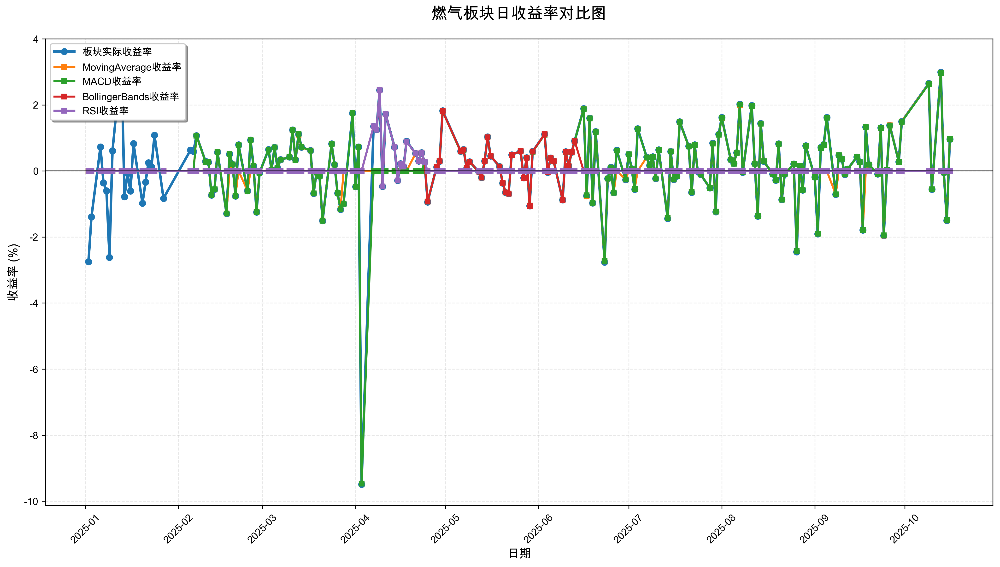
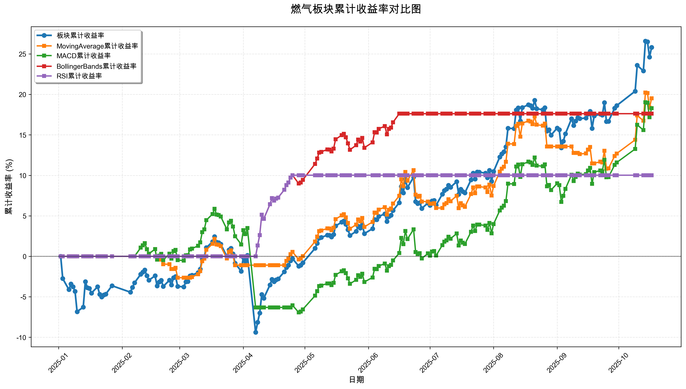

# 策略回测结果报告

**生成时间**: 2025-10-20 00:51:54
**行业板块**: 燃气
**回测期间**: 20250101 至 20251017
**策略数量**: 4

## 📈 分析结论

### 策略表现分析
- **最佳策略**: MovingAverage (总收益率: 19.51%)
- **最差策略**: RSI (总收益率: 10.02%)
### 交易活跃度分析
- **活跃策略**: 4 个
- **非活跃策略**: 0 个
- **最活跃策略**: MovingAverage (交易次数: 23)
### 🚨 异动提醒分析
- 未检测到明显异动情况
### 风险分析
- **MovingAverage**: 最大回撤 -5.50%, 夏普比率 2.0010
- **MACD**: 最大回撤 -12.09%, 夏普比率 1.3911
- **BollingerBands**: 最大回撤 -1.71%, 夏普比率 3.6330
- **RSI**: 最大回撤 -0.47%, 夏普比率 2.9316

## 📊 综合结果表

| 策略名称           | 初始资金     | 最终价值     | 总收益率   | 年化收益率   | 波动率    |   夏普比率 | 最大回撤    | 总交易次数   | 买入次数   | 卖出次数   | 总交易金额      | 平均交易金额   | 交易频率   |   数据点数 |
|:---------------|:---------|:---------|:-------|:--------|:-------|-------:|:--------|:--------|:-------|:-------|:-----------|:---------|:-------|-------:|
| 板块实际表现         | ¥100,000 | ¥125,808 | 25.81% | 35.60%  | 19.06% | 1.7043 | -11.53% | N/A     | N/A    | N/A    | N/A        | N/A      | N/A    |    190 |
| MovingAverage  | ¥100,000 | ¥119,506 | 19.51% | 26.66%  | 12.25% | 2.001  | -5.50%  | 23      | 12     | 11     | ¥2,384,715 | ¥103,683 | 0.12   |    190 |
| MACD           | ¥100,000 | ¥118,303 | 18.30% | 24.97%  | 17.20% | 1.3911 | -12.09% | 3       | 2      | 1      | ¥286,076   | ¥95,359  | 0.02   |    190 |
| BollingerBands | ¥100,000 | ¥117,622 | 17.62% | 24.02%  | 6.01%  | 3.633  | -1.71%  | 2       | 1      | 1      | ¥217,162   | ¥108,581 | 0.01   |    190 |
| RSI            | ¥100,000 | ¥110,018 | 10.02% | 13.50%  | 4.38%  | 2.9316 | -0.47%  | 2       | 1      | 1      | ¥209,558   | ¥104,779 | 0.01   |    190 |

## 📊 每日收益率走势图

*图1: 燃气板块每日收益率走势对比*

## 📈 累计收益率走势图

*图2: 燃气板块累计收益率走势对比*

## 📅 日收益明细表

| 日期         | 板块实际收益率   | MovingAverage收益率   | MACD收益率   | BollingerBands收益率   | RSI收益率   |
|:-----------|:----------|:-------------------|:----------|:--------------------|:---------|
| 2025-01-02 | -2.75%    | 0.00%              | 0.00%     | 0.00%               | 0.00%    |
| 2025-01-03 | -1.39%    | 0.00%              | 0.00%     | 0.00%               | 0.00%    |
| 2025-01-06 | 0.73%     | 0.00%              | 0.00%     | 0.00%               | 0.00%    |
| 2025-01-07 | -0.36%    | 0.00%              | 0.00%     | 0.00%               | 0.00%    |
| 2025-01-08 | -0.60%    | 0.00%              | 0.00%     | 0.00%               | 0.00%    |
| 2025-01-09 | -2.62%    | 0.00%              | 0.00%     | 0.00%               | 0.00%    |
| 2025-01-10 | 0.61%     | 0.00%              | 0.00%     | 0.00%               | 0.00%    |
| 2025-01-13 | 3.36%     | 0.00%              | 0.00%     | 0.00%               | 0.00%    |
| 2025-01-14 | -0.78%    | 0.00%              | 0.00%     | 0.00%               | 0.00%    |
| 2025-01-15 | -0.08%    | 0.00%              | 0.00%     | 0.00%               | 0.00%    |
| 2025-01-16 | -0.61%    | 0.00%              | 0.00%     | 0.00%               | 0.00%    |
| 2025-01-17 | 0.83%     | 0.00%              | 0.00%     | 0.00%               | 0.00%    |
| 2025-01-20 | -0.98%    | 0.00%              | 0.00%     | 0.00%               | 0.00%    |
| 2025-01-21 | -0.34%    | 0.00%              | 0.00%     | 0.00%               | 0.00%    |
| 2025-01-22 | 0.25%     | 0.00%              | 0.00%     | 0.00%               | 0.00%    |
| 2025-01-23 | 0.12%     | 0.00%              | 0.00%     | 0.00%               | 0.00%    |
| 2025-01-24 | 1.08%     | 0.00%              | 0.00%     | 0.00%               | 0.00%    |
| 2025-01-27 | -0.83%    | 0.00%              | 0.00%     | 0.00%               | 0.00%    |
| 2025-02-05 | 0.63%     | 0.00%              | 0.00%     | 0.00%               | 0.00%    |
| 2025-02-06 | 0.59%     | 0.00%              | 0.00%     | 0.00%               | 0.00%    |
| 2025-02-07 | 1.07%     | 1.07%              | 1.07%     | 0.00%               | 0.00%    |
| 2025-02-10 | 0.29%     | 0.28%              | 0.28%     | 0.00%               | 0.00%    |
| 2025-02-11 | 0.26%     | 0.26%              | 0.26%     | 0.00%               | 0.00%    |
| 2025-02-12 | -0.73%    | -0.73%             | -0.73%    | 0.00%               | 0.00%    |
| 2025-02-13 | -0.56%    | -0.56%             | -0.56%    | 0.00%               | 0.00%    |
| 2025-02-14 | 0.57%     | 0.57%              | 0.57%     | 0.00%               | 0.00%    |
| 2025-02-17 | -1.29%    | -1.29%             | -1.29%    | 0.00%               | 0.00%    |
| 2025-02-18 | 0.51%     | 0.00%              | 0.51%     | 0.00%               | 0.00%    |
| 2025-02-19 | 0.20%     | 0.20%              | 0.20%     | 0.00%               | 0.00%    |
| 2025-02-20 | -0.76%    | -0.75%             | -0.76%    | 0.00%               | 0.00%    |
| 2025-02-21 | 0.79%     | 0.00%              | 0.79%     | 0.00%               | 0.00%    |
| 2025-02-24 | -0.60%    | -0.60%             | -0.60%    | 0.00%               | 0.00%    |
| 2025-02-25 | 0.94%     | 0.00%              | 0.93%     | 0.00%               | 0.00%    |
| 2025-02-26 | 0.15%     | 0.15%              | 0.15%     | 0.00%               | 0.00%    |
| 2025-02-27 | -1.25%    | -1.24%             | -1.25%    | 0.00%               | 0.00%    |
| 2025-02-28 | -0.06%    | 0.00%              | -0.06%    | 0.00%               | 0.00%    |
| 2025-03-03 | 0.65%     | 0.00%              | 0.65%     | 0.00%               | 0.00%    |
| 2025-03-04 | 0.03%     | 0.00%              | 0.03%     | 0.00%               | 0.00%    |
| 2025-03-05 | 0.71%     | 0.00%              | 0.71%     | 0.00%               | 0.00%    |
| 2025-03-06 | 0.09%     | 0.09%              | 0.09%     | 0.00%               | 0.00%    |
| 2025-03-07 | 0.34%     | 0.34%              | 0.34%     | 0.00%               | 0.00%    |
| 2025-03-10 | 0.42%     | 0.42%              | 0.42%     | 0.00%               | 0.00%    |
| 2025-03-11 | 1.24%     | 1.23%              | 1.24%     | 0.00%               | 0.00%    |
| 2025-03-12 | 0.34%     | 0.33%              | 0.33%     | 0.00%               | 0.00%    |
| 2025-03-13 | 1.11%     | 1.10%              | 1.11%     | 0.00%               | 0.00%    |
| 2025-03-14 | 0.72%     | 0.71%              | 0.72%     | 0.00%               | 0.00%    |
| 2025-03-17 | 0.62%     | 0.62%              | 0.62%     | 0.00%               | 0.00%    |
| 2025-03-18 | -0.68%    | -0.68%             | -0.68%    | 0.00%               | 0.00%    |
| 2025-03-19 | -0.05%    | -0.05%             | -0.05%    | 0.00%               | 0.00%    |
| 2025-03-20 | -0.16%    | -0.16%             | -0.16%    | 0.00%               | 0.00%    |
| 2025-03-21 | -1.51%    | -1.50%             | -1.51%    | 0.00%               | 0.00%    |
| 2025-03-24 | 0.82%     | 0.82%              | 0.82%     | 0.00%               | 0.00%    |
| 2025-03-25 | 0.19%     | 0.19%              | 0.19%     | 0.00%               | 0.00%    |
| 2025-03-26 | -0.67%    | -0.67%             | -0.67%    | 0.00%               | 0.00%    |
| 2025-03-27 | -1.17%    | -1.16%             | -1.17%    | 0.00%               | 0.00%    |
| 2025-03-28 | -0.99%    | 0.00%              | -0.99%    | 0.00%               | 0.00%    |
| 2025-03-31 | 1.75%     | 0.00%              | 1.75%     | 0.00%               | 0.00%    |
| 2025-04-01 | -0.48%    | 0.00%              | -0.48%    | 0.00%               | 0.00%    |
| 2025-04-02 | 0.73%     | 0.00%              | 0.73%     | 0.00%               | 0.00%    |
| 2025-04-03 | -9.49%    | 0.00%              | -9.47%    | 0.00%               | 0.00%    |
| 2025-04-07 | 1.35%     | 0.00%              | 0.00%     | 1.35%               | 1.35%    |
| 2025-04-08 | 1.25%     | 0.00%              | 0.00%     | 1.25%               | 1.25%    |
| 2025-04-09 | 2.45%     | 0.00%              | 0.00%     | 2.45%               | 2.45%    |
| 2025-04-10 | -0.47%    | 0.00%              | 0.00%     | -0.47%              | -0.47%   |
| 2025-04-11 | 1.72%     | 0.00%              | 0.00%     | 1.72%               | 1.72%    |
| 2025-04-14 | 0.72%     | 0.00%              | 0.00%     | 0.72%               | 0.72%    |
| 2025-04-15 | -0.29%    | 0.00%              | 0.00%     | -0.29%              | -0.29%   |
| 2025-04-16 | 0.22%     | 0.00%              | 0.00%     | 0.22%               | 0.22%    |
| 2025-04-17 | 0.13%     | 0.00%              | 0.00%     | 0.13%               | 0.13%    |
| 2025-04-18 | 0.90%     | 0.00%              | 0.00%     | 0.89%               | 0.89%    |
| 2025-04-21 | 0.53%     | 0.53%              | 0.00%     | 0.53%               | 0.53%    |
| 2025-04-22 | 0.30%     | 0.29%              | 0.00%     | 0.29%               | 0.29%    |
| 2025-04-23 | 0.55%     | 0.55%              | 0.00%     | 0.55%               | 0.55%    |
| 2025-04-24 | 0.27%     | 0.27%              | 0.27%     | 0.27%               | 0.27%    |
| 2025-04-25 | -0.94%    | -0.93%             | -0.93%    | -0.93%              | 0.00%    |
| 2025-04-28 | 0.12%     | 0.12%              | 0.12%     | 0.12%               | 0.00%    |
| 2025-04-29 | 0.29%     | 0.29%              | 0.29%     | 0.29%               | 0.00%    |
| 2025-04-30 | 1.82%     | 1.81%              | 1.80%     | 1.81%               | 0.00%    |
| 2025-05-06 | 0.60%     | 0.59%              | 0.59%     | 0.60%               | 0.00%    |
| 2025-05-07 | 0.65%     | 0.65%              | 0.64%     | 0.65%               | 0.00%    |
| 2025-05-08 | 0.08%     | 0.08%              | 0.08%     | 0.08%               | 0.00%    |
| 2025-05-09 | 0.28%     | 0.28%              | 0.27%     | 0.28%               | 0.00%    |
| 2025-05-12 | -0.02%    | -0.02%             | -0.02%    | -0.02%              | 0.00%    |
| 2025-05-13 | -0.20%    | -0.20%             | -0.20%    | -0.20%              | 0.00%    |
| 2025-05-14 | 0.30%     | 0.30%              | 0.30%     | 0.30%               | 0.00%    |
| 2025-05-15 | 1.03%     | 1.02%              | 1.02%     | 1.02%               | 0.00%    |
| 2025-05-16 | 0.45%     | 0.45%              | 0.45%     | 0.45%               | 0.00%    |
| 2025-05-19 | 0.13%     | 0.13%              | 0.13%     | 0.13%               | 0.00%    |
| 2025-05-20 | -0.37%    | -0.37%             | -0.37%    | -0.37%              | 0.00%    |
| 2025-05-21 | -0.65%    | -0.65%             | -0.65%    | -0.65%              | 0.00%    |
| 2025-05-22 | -0.69%    | -0.69%             | -0.69%    | -0.69%              | 0.00%    |
| 2025-05-23 | 0.49%     | 0.49%              | 0.49%     | 0.49%               | 0.00%    |
| 2025-05-26 | 0.60%     | 0.60%              | 0.60%     | 0.60%               | 0.00%    |
| 2025-05-27 | -0.21%    | -0.21%             | -0.21%    | -0.21%              | 0.00%    |
| 2025-05-28 | 0.40%     | 0.40%              | 0.40%     | 0.40%               | 0.00%    |
| 2025-05-29 | -1.06%    | -1.05%             | -1.05%    | -1.06%              | 0.00%    |
| 2025-05-30 | 0.59%     | 0.58%              | 0.58%     | 0.59%               | 0.00%    |
| 2025-06-03 | 1.11%     | 1.11%              | 1.10%     | 1.11%               | 0.00%    |
| 2025-06-04 | -0.04%    | -0.04%             | -0.04%    | -0.04%              | 0.00%    |
| 2025-06-05 | 0.39%     | 0.39%              | 0.39%     | 0.39%               | 0.00%    |
| 2025-06-06 | 0.30%     | 0.29%              | 0.29%     | 0.29%               | 0.00%    |
| 2025-06-09 | -0.88%    | -0.88%             | -0.87%    | -0.88%              | 0.00%    |
| 2025-06-10 | 0.58%     | 0.57%              | 0.57%     | 0.58%               | 0.00%    |
| 2025-06-11 | 0.15%     | 0.15%              | 0.15%     | 0.15%               | 0.00%    |
| 2025-06-12 | 0.57%     | 0.56%              | 0.56%     | 0.57%               | 0.00%    |
| 2025-06-13 | 0.91%     | 0.91%              | 0.91%     | 0.91%               | 0.00%    |
| 2025-06-16 | 1.89%     | 1.88%              | 1.87%     | 0.00%               | 0.00%    |
| 2025-06-17 | -0.75%    | -0.75%             | -0.74%    | 0.00%               | 0.00%    |
| 2025-06-18 | 1.60%     | 1.59%              | 1.59%     | 0.00%               | 0.00%    |
| 2025-06-19 | -0.97%    | -0.96%             | -0.96%    | 0.00%               | 0.00%    |
| 2025-06-20 | 1.19%     | 1.19%              | 1.18%     | 0.00%               | 0.00%    |
| 2025-06-23 | -2.76%    | -2.74%             | -2.73%    | 0.00%               | 0.00%    |
| 2025-06-24 | -0.23%    | -0.23%             | -0.23%    | 0.00%               | 0.00%    |
| 2025-06-25 | 0.11%     | 0.10%              | 0.10%     | 0.00%               | 0.00%    |
| 2025-06-26 | -0.66%    | -0.66%             | -0.66%    | 0.00%               | 0.00%    |
| 2025-06-27 | 0.63%     | 0.00%              | 0.62%     | 0.00%               | 0.00%    |
| 2025-06-30 | -0.27%    | -0.26%             | -0.26%    | 0.00%               | 0.00%    |
| 2025-07-01 | 0.50%     | 0.00%              | 0.50%     | 0.00%               | 0.00%    |
| 2025-07-02 | 0.07%     | 0.07%              | 0.07%     | 0.00%               | 0.00%    |
| 2025-07-03 | -0.56%    | -0.55%             | -0.55%    | 0.00%               | 0.00%    |
| 2025-07-04 | 1.28%     | 0.00%              | 1.27%     | 0.00%               | 0.00%    |
| 2025-07-07 | 0.42%     | 0.41%              | 0.41%     | 0.00%               | 0.00%    |
| 2025-07-08 | 0.17%     | 0.17%              | 0.17%     | 0.00%               | 0.00%    |
| 2025-07-09 | 0.43%     | 0.43%              | 0.43%     | 0.00%               | 0.00%    |
| 2025-07-10 | -0.23%    | -0.23%             | -0.23%    | 0.00%               | 0.00%    |
| 2025-07-11 | 0.64%     | 0.63%              | 0.63%     | 0.00%               | 0.00%    |
| 2025-07-14 | -1.44%    | -1.43%             | -1.43%    | 0.00%               | 0.00%    |
| 2025-07-15 | 0.59%     | 0.59%              | 0.59%     | 0.00%               | 0.00%    |
| 2025-07-16 | -0.26%    | -0.26%             | -0.26%    | 0.00%               | 0.00%    |
| 2025-07-17 | -0.16%    | -0.16%             | -0.16%    | 0.00%               | 0.00%    |
| 2025-07-18 | 1.49%     | 1.48%              | 1.48%     | 0.00%               | 0.00%    |
| 2025-07-21 | 0.75%     | 0.74%              | 0.74%     | 0.00%               | 0.00%    |
| 2025-07-22 | -0.65%    | -0.64%             | -0.64%    | 0.00%               | 0.00%    |
| 2025-07-23 | 0.79%     | 0.78%              | 0.78%     | 0.00%               | 0.00%    |
| 2025-07-24 | -0.01%    | -0.01%             | -0.01%    | 0.00%               | 0.00%    |
| 2025-07-25 | -0.11%    | -0.11%             | -0.11%    | 0.00%               | 0.00%    |
| 2025-07-28 | -0.51%    | -0.51%             | -0.51%    | 0.00%               | 0.00%    |
| 2025-07-29 | 0.84%     | 0.83%              | 0.83%     | 0.00%               | 0.00%    |
| 2025-07-30 | -1.24%    | -1.23%             | -1.23%    | 0.00%               | 0.00%    |
| 2025-07-31 | 1.11%     | 1.10%              | 1.10%     | 0.00%               | 0.00%    |
| 2025-08-01 | 1.62%     | 1.60%              | 1.61%     | 0.00%               | 0.00%    |
| 2025-08-04 | 0.34%     | 0.34%              | 0.34%     | 0.00%               | 0.00%    |
| 2025-08-05 | 0.23%     | 0.22%              | 0.22%     | 0.00%               | 0.00%    |
| 2025-08-06 | 0.55%     | 0.54%              | 0.54%     | 0.00%               | 0.00%    |
| 2025-08-07 | 2.02%     | 2.00%              | 2.01%     | 0.00%               | 0.00%    |
| 2025-08-08 | -0.04%    | -0.04%             | -0.04%    | 0.00%               | 0.00%    |
| 2025-08-11 | 1.98%     | 1.97%              | 1.97%     | 0.00%               | 0.00%    |
| 2025-08-12 | 0.22%     | 0.22%              | 0.22%     | 0.00%               | 0.00%    |
| 2025-08-13 | -1.37%    | -1.36%             | -1.36%    | 0.00%               | 0.00%    |
| 2025-08-14 | 1.44%     | 1.43%              | 1.43%     | 0.00%               | 0.00%    |
| 2025-08-15 | 0.29%     | 0.29%              | 0.29%     | 0.00%               | 0.00%    |
| 2025-08-18 | -0.09%    | -0.09%             | -0.09%    | 0.00%               | 0.00%    |
| 2025-08-19 | -0.28%    | -0.28%             | -0.28%    | 0.00%               | 0.00%    |
| 2025-08-20 | 0.82%     | 0.82%              | 0.82%     | 0.00%               | 0.00%    |
| 2025-08-21 | -0.87%    | -0.87%             | -0.87%    | 0.00%               | 0.00%    |
| 2025-08-22 | -0.10%    | -0.10%             | -0.10%    | 0.00%               | 0.00%    |
| 2025-08-25 | 0.21%     | 0.21%              | 0.21%     | 0.00%               | 0.00%    |
| 2025-08-26 | -2.45%    | -2.43%             | -2.43%    | 0.00%               | 0.00%    |
| 2025-08-27 | 0.15%     | 0.00%              | 0.15%     | 0.00%               | 0.00%    |
| 2025-08-28 | -0.58%    | 0.00%              | -0.57%    | 0.00%               | 0.00%    |
| 2025-08-29 | 0.76%     | 0.00%              | 0.76%     | 0.00%               | 0.00%    |
| 2025-09-01 | -0.19%    | 0.00%              | -0.19%    | 0.00%               | 0.00%    |
| 2025-09-02 | -1.91%    | 0.00%              | -1.90%    | 0.00%               | 0.00%    |
| 2025-09-03 | 0.71%     | 0.00%              | 0.70%     | 0.00%               | 0.00%    |
| 2025-09-04 | 0.80%     | 0.00%              | 0.79%     | 0.00%               | 0.00%    |
| 2025-09-05 | 1.62%     | 0.00%              | 1.61%     | 0.00%               | 0.00%    |
| 2025-09-08 | -0.71%    | -0.71%             | -0.71%    | 0.00%               | 0.00%    |
| 2025-09-09 | 0.47%     | 0.00%              | 0.47%     | 0.00%               | 0.00%    |
| 2025-09-10 | 0.36%     | 0.00%              | 0.36%     | 0.00%               | 0.00%    |
| 2025-09-11 | -0.11%    | -0.11%             | -0.11%    | 0.00%               | 0.00%    |
| 2025-09-12 | 0.06%     | 0.06%              | 0.06%     | 0.00%               | 0.00%    |
| 2025-09-15 | 0.42%     | 0.42%              | 0.42%     | 0.00%               | 0.00%    |
| 2025-09-16 | 0.28%     | 0.28%              | 0.28%     | 0.00%               | 0.00%    |
| 2025-09-17 | -1.79%    | -1.79%             | -1.78%    | 0.00%               | 0.00%    |
| 2025-09-18 | 1.33%     | 0.00%              | 1.32%     | 0.00%               | 0.00%    |
| 2025-09-19 | 0.19%     | 0.19%              | 0.19%     | 0.00%               | 0.00%    |
| 2025-09-22 | -0.09%    | -0.09%             | -0.09%    | 0.00%               | 0.00%    |
| 2025-09-23 | 1.31%     | 1.30%              | 1.30%     | 0.00%               | 0.00%    |
| 2025-09-24 | -1.96%    | -1.96%             | -1.95%    | 0.00%               | 0.00%    |
| 2025-09-25 | 0.03%     | 0.03%              | 0.03%     | 0.00%               | 0.00%    |
| 2025-09-26 | 1.38%     | 1.38%              | 1.37%     | 0.00%               | 0.00%    |
| 2025-09-29 | 0.28%     | 0.27%              | 0.27%     | 0.00%               | 0.00%    |
| 2025-09-30 | 1.50%     | 1.50%              | 1.49%     | 0.00%               | 0.00%    |
| 2025-10-09 | 2.65%     | 2.64%              | 2.63%     | 0.00%               | 0.00%    |
| 2025-10-10 | -0.56%    | -0.56%             | -0.56%    | 0.00%               | 0.00%    |
| 2025-10-13 | 2.99%     | 2.98%              | 2.97%     | 0.00%               | 0.00%    |
| 2025-10-14 | -0.05%    | -0.05%             | -0.05%    | 0.00%               | 0.00%    |
| 2025-10-15 | -1.50%    | -1.50%             | -1.49%    | 0.00%               | 0.00%    |
| 2025-10-16 | 0.96%     | 0.96%              | 0.96%     | 0.00%               | 0.00%    |

## 📊 日收益统计摘要

| 指标                | 平均日收益率   | 最大日收益率   | 最小日收益率   | 正收益天数   | 负收益天数   |
|:------------------|:---------|:---------|:---------|:--------|:--------|
| 板块实际收益率           | 0.13%    | 3.36%    | -9.49%   | 116天    | 73天     |
| MovingAverage收益率  | 0.10%    | 2.98%    | -2.74%   | 80天     | 53天     |
| MACD收益率           | 0.09%    | 2.97%    | -9.47%   | 96天     | 60天     |
| BollingerBands收益率 | 0.09%    | 2.45%    | -1.06%   | 34天     | 12天     |
| RSI收益率            | 0.05%    | 2.45%    | -0.47%   | 12天     | 2天      |

## 📈 累计收益明细表

| 日期         | 板块累计收益率   | MovingAverage累计收益率   | MACD累计收益率   | BollingerBands累计收益率   | RSI累计收益率   |
|:-----------|:----------|:---------------------|:------------|:----------------------|:-----------|
| 2025-01-02 | 0.00%     | 0.00%                | 0.00%       | 0.00%                 | 0.00%      |
| 2025-01-03 | -2.75%    | 0.00%                | 0.00%       | 0.00%                 | 0.00%      |
| 2025-01-06 | -4.11%    | 0.00%                | 0.00%       | 0.00%                 | 0.00%      |
| 2025-01-07 | -3.41%    | 0.00%                | 0.00%       | 0.00%                 | 0.00%      |
| 2025-01-08 | -3.75%    | 0.00%                | 0.00%       | 0.00%                 | 0.00%      |
| 2025-01-09 | -4.33%    | 0.00%                | 0.00%       | 0.00%                 | 0.00%      |
| 2025-01-10 | -6.84%    | 0.00%                | 0.00%       | 0.00%                 | 0.00%      |
| 2025-01-13 | -6.27%    | 0.00%                | 0.00%       | 0.00%                 | 0.00%      |
| 2025-01-14 | -3.12%    | 0.00%                | 0.00%       | 0.00%                 | 0.00%      |
| 2025-01-15 | -3.87%    | 0.00%                | 0.00%       | 0.00%                 | 0.00%      |
| 2025-01-16 | -3.95%    | 0.00%                | 0.00%       | 0.00%                 | 0.00%      |
| 2025-01-17 | -4.54%    | 0.00%                | 0.00%       | 0.00%                 | 0.00%      |
| 2025-01-20 | -3.75%    | 0.00%                | 0.00%       | 0.00%                 | 0.00%      |
| 2025-01-21 | -4.69%    | 0.00%                | 0.00%       | 0.00%                 | 0.00%      |
| 2025-01-22 | -5.02%    | 0.00%                | 0.00%       | 0.00%                 | 0.00%      |
| 2025-01-23 | -4.78%    | 0.00%                | 0.00%       | 0.00%                 | 0.00%      |
| 2025-01-24 | -4.66%    | 0.00%                | 0.00%       | 0.00%                 | 0.00%      |
| 2025-01-27 | -3.63%    | 0.00%                | 0.00%       | 0.00%                 | 0.00%      |
| 2025-02-05 | -4.43%    | 0.00%                | 0.00%       | 0.00%                 | 0.00%      |
| 2025-02-06 | -3.83%    | 0.00%                | 0.00%       | 0.00%                 | 0.00%      |
| 2025-02-07 | -3.26%    | 0.00%                | 0.00%       | 0.00%                 | 0.00%      |
| 2025-02-10 | -2.22%    | 1.07%                | 1.07%       | 0.00%                 | 0.00%      |
| 2025-02-11 | -1.94%    | 1.36%                | 1.36%       | 0.00%                 | 0.00%      |
| 2025-02-12 | -1.69%    | 1.62%                | 1.62%       | 0.00%                 | 0.00%      |
| 2025-02-13 | -2.40%    | 0.88%                | 0.88%       | 0.00%                 | 0.00%      |
| 2025-02-14 | -2.95%    | 0.32%                | 0.32%       | 0.00%                 | 0.00%      |
| 2025-02-17 | -2.40%    | 0.89%                | 0.89%       | 0.00%                 | 0.00%      |
| 2025-02-18 | -3.66%    | -0.41%               | -0.41%      | 0.00%                 | 0.00%      |
| 2025-02-19 | -3.17%    | -0.41%               | 0.09%       | 0.00%                 | 0.00%      |
| 2025-02-20 | -2.97%    | -0.21%               | 0.30%       | 0.00%                 | 0.00%      |
| 2025-02-21 | -3.71%    | -0.97%               | -0.47%      | 0.00%                 | 0.00%      |
| 2025-02-24 | -2.95%    | -0.97%               | 0.32%       | 0.00%                 | 0.00%      |
| 2025-02-25 | -3.54%    | -1.56%               | -0.29%      | 0.00%                 | 0.00%      |
| 2025-02-26 | -2.63%    | -1.56%               | 0.65%       | 0.00%                 | 0.00%      |
| 2025-02-27 | -2.49%    | -1.42%               | 0.79%       | 0.00%                 | 0.00%      |
| 2025-02-28 | -3.71%    | -2.64%               | -0.46%      | 0.00%                 | 0.00%      |
| 2025-03-03 | -3.77%    | -2.64%               | -0.53%      | 0.00%                 | 0.00%      |
| 2025-03-04 | -3.14%    | -2.64%               | 0.12%       | 0.00%                 | 0.00%      |
| 2025-03-05 | -3.11%    | -2.64%               | 0.15%       | 0.00%                 | 0.00%      |
| 2025-03-06 | -2.42%    | -2.64%               | 0.86%       | 0.00%                 | 0.00%      |
| 2025-03-07 | -2.33%    | -2.55%               | 0.96%       | 0.00%                 | 0.00%      |
| 2025-03-10 | -2.00%    | -2.22%               | 1.30%       | 0.00%                 | 0.00%      |
| 2025-03-11 | -1.59%    | -1.82%               | 1.72%       | 0.00%                 | 0.00%      |
| 2025-03-12 | -0.37%    | -0.61%               | 2.98%       | 0.00%                 | 0.00%      |
| 2025-03-13 | -0.04%    | -0.28%               | 3.33%       | 0.00%                 | 0.00%      |
| 2025-03-14 | 1.07%     | 0.82%                | 4.47%       | 0.00%                 | 0.00%      |
| 2025-03-17 | 1.80%     | 1.54%                | 5.22%       | 0.00%                 | 0.00%      |
| 2025-03-18 | 2.43%     | 2.16%                | 5.87%       | 0.00%                 | 0.00%      |
| 2025-03-19 | 1.74%     | 1.47%                | 5.15%       | 0.00%                 | 0.00%      |
| 2025-03-20 | 1.68%     | 1.42%                | 5.09%       | 0.00%                 | 0.00%      |
| 2025-03-21 | 1.51%     | 1.25%                | 4.92%       | 0.00%                 | 0.00%      |
| 2025-03-24 | -0.02%    | -0.26%               | 3.34%       | 0.00%                 | 0.00%      |
| 2025-03-25 | 0.80%     | 0.55%                | 4.19%       | 0.00%                 | 0.00%      |
| 2025-03-26 | 0.99%     | 0.74%                | 4.38%       | 0.00%                 | 0.00%      |
| 2025-03-27 | 0.31%     | 0.07%                | 3.68%       | 0.00%                 | 0.00%      |
| 2025-03-28 | -0.86%    | -1.09%               | 2.48%       | 0.00%                 | 0.00%      |
| 2025-03-31 | -1.84%    | -1.09%               | 1.47%       | 0.00%                 | 0.00%      |
| 2025-04-01 | -0.12%    | -1.09%               | 3.24%       | 0.00%                 | 0.00%      |
| 2025-04-02 | -0.60%    | -1.09%               | 2.74%       | 0.00%                 | 0.00%      |
| 2025-04-03 | 0.13%     | -1.09%               | 3.49%       | 0.00%                 | 0.00%      |
| 2025-04-07 | -9.38%    | -1.09%               | -6.31%      | 0.00%                 | 0.00%      |
| 2025-04-08 | -8.15%    | -1.09%               | -6.31%      | 1.35%                 | 1.35%      |
| 2025-04-09 | -7.00%    | -1.09%               | -6.31%      | 2.62%                 | 2.62%      |
| 2025-04-10 | -4.72%    | -1.09%               | -6.31%      | 5.13%                 | 5.13%      |
| 2025-04-11 | -5.17%    | -1.09%               | -6.31%      | 4.63%                 | 4.63%      |
| 2025-04-14 | -3.53%    | -1.09%               | -6.31%      | 6.43%                 | 6.43%      |
| 2025-04-15 | -2.84%    | -1.09%               | -6.31%      | 7.19%                 | 7.19%      |
| 2025-04-16 | -3.12%    | -1.09%               | -6.31%      | 6.88%                 | 6.88%      |
| 2025-04-17 | -2.91%    | -1.09%               | -6.31%      | 7.12%                 | 7.12%      |
| 2025-04-18 | -2.78%    | -1.09%               | -6.31%      | 7.26%                 | 7.26%      |
| 2025-04-21 | -1.91%    | -1.09%               | -6.31%      | 8.22%                 | 8.22%      |
| 2025-04-22 | -1.39%    | -0.57%               | -6.31%      | 8.79%                 | 8.79%      |
| 2025-04-23 | -1.10%    | -0.28%               | -6.31%      | 9.11%                 | 9.11%      |
| 2025-04-24 | -0.55%    | 0.27%                | -6.31%      | 9.72%                 | 9.72%      |
| 2025-04-25 | -0.28%    | 0.55%                | -6.05%      | 10.02%                | 10.02%     |
| 2025-04-28 | -1.21%    | -0.39%               | -6.93%      | 8.99%                 | 10.02%     |
| 2025-04-29 | -1.09%    | -0.27%               | -6.82%      | 9.12%                 | 10.02%     |
| 2025-04-30 | -0.80%    | 0.02%                | -6.55%      | 9.44%                 | 10.02%     |
| 2025-05-06 | 1.00%     | 1.83%                | -4.86%      | 11.42%                | 10.02%     |
| 2025-05-07 | 1.60%     | 2.43%                | -4.30%      | 12.09%                | 10.02%     |
| 2025-05-08 | 2.26%     | 3.10%                | -3.68%      | 12.81%                | 10.02%     |
| 2025-05-09 | 2.34%     | 3.18%                | -3.61%      | 12.90%                | 10.02%     |
| 2025-05-12 | 2.62%     | 3.46%                | -3.34%      | 13.21%                | 10.02%     |
| 2025-05-13 | 2.61%     | 3.44%                | -3.36%      | 13.19%                | 10.02%     |
| 2025-05-14 | 2.40%     | 3.23%                | -3.56%      | 12.96%                | 10.02%     |
| 2025-05-15 | 2.70%     | 3.54%                | -3.27%      | 13.30%                | 10.02%     |
| 2025-05-16 | 3.76%     | 4.60%                | -2.29%      | 14.46%                | 10.02%     |
| 2025-05-19 | 4.22%     | 5.06%                | -1.85%      | 14.97%                | 10.02%     |
| 2025-05-20 | 4.36%     | 5.20%                | -1.72%      | 15.13%                | 10.02%     |
| 2025-05-21 | 3.97%     | 4.81%                | -2.08%      | 14.70%                | 10.02%     |
| 2025-05-22 | 3.30%     | 4.13%                | -2.72%      | 13.95%                | 10.02%     |
| 2025-05-23 | 2.58%     | 3.41%                | -3.39%      | 13.16%                | 10.02%     |
| 2025-05-26 | 3.09%     | 3.92%                | -2.91%      | 13.72%                | 10.02%     |
| 2025-05-27 | 3.71%     | 4.55%                | -2.33%      | 14.41%                | 10.02%     |
| 2025-05-28 | 3.49%     | 4.33%                | -2.53%      | 14.17%                | 10.02%     |
| 2025-05-29 | 3.91%     | 4.74%                | -2.15%      | 14.62%                | 10.02%     |
| 2025-05-30 | 2.81%     | 3.64%                | -3.17%      | 13.41%                | 10.02%     |
| 2025-06-03 | 3.41%     | 4.25%                | -2.61%      | 14.08%                | 10.02%     |
| 2025-06-04 | 4.56%     | 5.40%                | -1.54%      | 15.34%                | 10.02%     |
| 2025-06-05 | 4.52%     | 5.36%                | -1.58%      | 15.30%                | 10.02%     |
| 2025-06-06 | 4.93%     | 5.77%                | -1.19%      | 15.75%                | 10.02%     |
| 2025-06-09 | 5.24%     | 6.08%                | -0.90%      | 16.09%                | 10.02%     |
| 2025-06-10 | 4.31%     | 5.15%                | -1.77%      | 15.07%                | 10.02%     |
| 2025-06-11 | 4.91%     | 5.75%                | -1.21%      | 15.73%                | 10.02%     |
| 2025-06-12 | 5.07%     | 5.91%                | -1.06%      | 15.90%                | 10.02%     |
| 2025-06-13 | 5.66%     | 6.51%                | -0.51%      | 16.56%                | 10.02%     |
| 2025-06-16 | 6.63%     | 7.48%                | 0.40%       | 17.62%                | 10.02%     |
| 2025-06-17 | 8.64%     | 9.50%                | 2.27%       | 17.62%                | 10.02%     |
| 2025-06-18 | 7.83%     | 8.68%                | 1.51%       | 17.62%                | 10.02%     |
| 2025-06-19 | 9.55%     | 10.41%               | 3.12%       | 17.62%                | 10.02%     |
| 2025-06-20 | 8.49%     | 9.35%                | 2.13%       | 17.62%                | 10.02%     |
| 2025-06-23 | 9.78%     | 10.64%               | 3.34%       | 17.62%                | 10.02%     |
| 2025-06-24 | 6.76%     | 7.61%                | 0.52%       | 17.62%                | 10.02%     |
| 2025-06-25 | 6.51%     | 7.36%                | 0.29%       | 17.62%                | 10.02%     |
| 2025-06-26 | 6.63%     | 7.47%                | 0.39%       | 17.62%                | 10.02%     |
| 2025-06-27 | 5.92%     | 6.77%                | -0.27%      | 17.62%                | 10.02%     |
| 2025-06-30 | 6.59%     | 6.77%                | 0.36%       | 17.62%                | 10.02%     |
| 2025-07-01 | 6.30%     | 6.49%                | 0.09%       | 17.62%                | 10.02%     |
| 2025-07-02 | 6.84%     | 6.49%                | 0.59%       | 17.62%                | 10.02%     |
| 2025-07-03 | 6.91%     | 6.56%                | 0.66%       | 17.62%                | 10.02%     |
| 2025-07-04 | 6.32%     | 5.97%                | 0.10%       | 17.62%                | 10.02%     |
| 2025-07-07 | 7.68%     | 5.97%                | 1.38%       | 17.62%                | 10.02%     |
| 2025-07-08 | 8.13%     | 6.41%                | 1.80%       | 17.62%                | 10.02%     |
| 2025-07-09 | 8.31%     | 6.59%                | 1.97%       | 17.62%                | 10.02%     |
| 2025-07-10 | 8.78%     | 7.05%                | 2.41%       | 17.62%                | 10.02%     |
| 2025-07-11 | 8.53%     | 6.81%                | 2.17%       | 17.62%                | 10.02%     |
| 2025-07-14 | 9.23%     | 7.48%                | 2.82%       | 17.62%                | 10.02%     |
| 2025-07-15 | 7.65%     | 5.95%                | 1.35%       | 17.62%                | 10.02%     |
| 2025-07-16 | 8.29%     | 6.57%                | 1.95%       | 17.62%                | 10.02%     |
| 2025-07-17 | 8.01%     | 6.29%                | 1.68%       | 17.62%                | 10.02%     |
| 2025-07-18 | 7.84%     | 6.12%                | 1.52%       | 17.62%                | 10.02%     |
| 2025-07-21 | 9.45%     | 7.69%                | 3.03%       | 17.62%                | 10.02%     |
| 2025-07-22 | 10.27%    | 8.50%                | 3.79%       | 17.62%                | 10.02%     |
| 2025-07-23 | 9.55%     | 7.80%                | 3.12%       | 17.62%                | 10.02%     |
| 2025-07-24 | 10.41%    | 8.64%                | 3.93%       | 17.62%                | 10.02%     |
| 2025-07-25 | 10.40%    | 8.63%                | 3.92%       | 17.62%                | 10.02%     |
| 2025-07-28 | 10.28%    | 8.50%                | 3.80%       | 17.62%                | 10.02%     |
| 2025-07-29 | 9.71%     | 7.95%                | 3.27%       | 17.62%                | 10.02%     |
| 2025-07-30 | 10.63%    | 8.85%                | 4.13%       | 17.62%                | 10.02%     |
| 2025-07-31 | 9.26%     | 7.52%                | 2.85%       | 17.62%                | 10.02%     |
| 2025-08-01 | 10.48%    | 8.70%                | 3.99%       | 17.62%                | 10.02%     |
| 2025-08-04 | 12.27%    | 10.45%               | 5.66%       | 17.62%                | 10.02%     |
| 2025-08-05 | 12.65%    | 10.82%               | 6.02%       | 17.62%                | 10.02%     |
| 2025-08-06 | 12.91%    | 11.07%               | 6.26%       | 17.62%                | 10.02%     |
| 2025-08-07 | 13.52%    | 11.67%               | 6.83%       | 17.62%                | 10.02%     |
| 2025-08-08 | 15.82%    | 13.91%               | 8.97%       | 17.62%                | 10.02%     |
| 2025-08-11 | 15.78%    | 13.87%               | 8.94%       | 17.62%                | 10.02%     |
| 2025-08-12 | 18.07%    | 16.11%               | 11.08%      | 17.62%                | 10.02%     |
| 2025-08-13 | 18.34%    | 16.37%               | 11.33%      | 17.62%                | 10.02%     |
| 2025-08-14 | 16.71%    | 14.78%               | 9.81%       | 17.62%                | 10.02%     |
| 2025-08-15 | 18.39%    | 16.42%               | 11.37%      | 17.62%                | 10.02%     |
| 2025-08-18 | 18.73%    | 16.75%               | 11.69%      | 17.62%                | 10.02%     |
| 2025-08-19 | 18.63%    | 16.65%               | 11.60%      | 17.62%                | 10.02%     |
| 2025-08-20 | 18.29%    | 16.33%               | 11.29%      | 17.62%                | 10.02%     |
| 2025-08-21 | 19.27%    | 17.28%               | 12.20%      | 17.62%                | 10.02%     |
| 2025-08-22 | 18.23%    | 16.26%               | 11.22%      | 17.62%                | 10.02%     |
| 2025-08-25 | 18.11%    | 16.15%               | 11.12%      | 17.62%                | 10.02%     |
| 2025-08-26 | 18.36%    | 16.39%               | 11.35%      | 17.62%                | 10.02%     |
| 2025-08-27 | 15.47%    | 13.57%               | 8.65%       | 17.62%                | 10.02%     |
| 2025-08-28 | 15.64%    | 13.57%               | 8.81%       | 17.62%                | 10.02%     |
| 2025-08-29 | 14.97%    | 13.57%               | 8.19%       | 17.62%                | 10.02%     |
| 2025-09-01 | 15.85%    | 13.57%               | 9.01%       | 17.62%                | 10.02%     |
| 2025-09-02 | 15.63%    | 13.57%               | 8.80%       | 17.62%                | 10.02%     |
| 2025-09-03 | 13.41%    | 13.57%               | 6.73%       | 17.62%                | 10.02%     |
| 2025-09-04 | 14.22%    | 13.57%               | 7.48%       | 17.62%                | 10.02%     |
| 2025-09-05 | 15.13%    | 13.57%               | 8.33%       | 17.62%                | 10.02%     |
| 2025-09-08 | 17.00%    | 13.57%               | 10.08%      | 17.62%                | 10.02%     |
| 2025-09-09 | 16.17%    | 12.77%               | 9.30%       | 17.62%                | 10.02%     |
| 2025-09-10 | 16.72%    | 12.77%               | 9.81%       | 17.62%                | 10.02%     |
| 2025-09-11 | 17.14%    | 12.77%               | 10.21%      | 17.62%                | 10.02%     |
| 2025-09-12 | 17.01%    | 12.64%               | 10.09%      | 17.62%                | 10.02%     |
| 2025-09-15 | 17.08%    | 12.71%               | 10.16%      | 17.62%                | 10.02%     |
| 2025-09-16 | 17.57%    | 13.19%               | 10.61%      | 17.62%                | 10.02%     |
| 2025-09-17 | 17.91%    | 13.50%               | 10.92%      | 17.62%                | 10.02%     |
| 2025-09-18 | 15.80%    | 11.48%               | 8.95%       | 17.62%                | 10.02%     |
| 2025-09-19 | 17.34%    | 11.48%               | 10.39%      | 17.62%                | 10.02%     |
| 2025-09-22 | 17.56%    | 11.69%               | 10.60%      | 17.62%                | 10.02%     |
| 2025-09-23 | 17.45%    | 11.59%               | 10.50%      | 17.62%                | 10.02%     |
| 2025-09-24 | 18.99%    | 13.04%               | 11.93%      | 17.62%                | 10.02%     |
| 2025-09-25 | 16.65%    | 10.83%               | 9.76%       | 17.62%                | 10.02%     |
| 2025-09-26 | 16.68%    | 10.86%               | 9.78%       | 17.62%                | 10.02%     |
| 2025-09-29 | 18.30%    | 12.39%               | 11.29%      | 17.62%                | 10.02%     |
| 2025-09-30 | 18.62%    | 12.70%               | 11.59%      | 17.62%                | 10.02%     |
| 2025-10-09 | 20.40%    | 14.39%               | 13.26%      | 17.62%                | 10.02%     |
| 2025-10-10 | 23.60%    | 17.41%               | 16.24%      | 17.62%                | 10.02%     |
| 2025-10-13 | 22.90%    | 16.75%               | 15.59%      | 17.62%                | 10.02%     |
| 2025-10-14 | 26.58%    | 20.23%               | 19.02%      | 17.62%                | 10.02%     |
| 2025-10-15 | 26.51%    | 20.17%               | 18.96%      | 17.62%                | 10.02%     |
| 2025-10-16 | 24.61%    | 18.37%               | 17.18%      | 17.62%                | 10.02%     |
| 2025-10-17 | 25.81%    | 19.51%               | 18.30%      | 17.62%                | 10.02%     |

## 📊 累计收益统计摘要

| 指标                  | 最终累计收益率   | 最大累计收益率   | 最小累计收益率   | 累计收益波动   | 收益稳定性   |
|:--------------------|:----------|:----------|:----------|:---------|:--------|
| 板块累计收益率             | 25.81%    | 26.58%    | -9.38%    | 35.96%   | 波动      |
| MovingAverage累计收益率  | 19.51%    | 20.23%    | -2.64%    | 22.87%   | 波动      |
| MACD累计收益率           | 18.30%    | 19.02%    | -6.93%    | 25.95%   | 波动      |
| BollingerBands累计收益率 | 17.62%    | 17.62%    | 0.00%     | 17.62%   | 稳定      |
| RSI累计收益率            | 10.02%    | 10.02%    | 0.00%     | 10.02%   | 稳定      |

