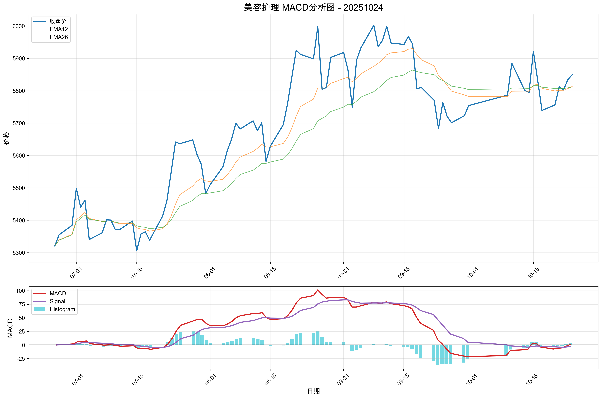

# 市场复盘报告 - 20251024

**生成时间**: 2025-10-26 12:37:27

## 📋 目录

- [📊 市场总结](#-市场总结)
  - [📈 市场情绪综合分析图](#-市场情绪综合分析图)
  - [情绪维度分析](#情绪维度分析)
  - [关键市场指标](#关键市场指标)
    - [市场活跃度](#市场活跃度)
    - [个股赚钱效应](#个股赚钱效应)
    - [风险偏好](#风险偏好)
    - [市场参与意愿](#市场参与意愿)
- [🏢 板块分析](#-板块分析)
- [🎯 个股分析](#-个股分析)
- [⚠️ 风险提示](#️-风险提示)

## 📊 市场总结

**综合情绪指数**: 4.70
**情绪等级**: 中性

### 📈 市场情绪综合分析图

*图表说明：上图展示了20251024的市场情绪综合分析，包括雷达图和趋势分析。*

### 情绪维度分析

| 维度 | 分析结果 |
|------|----------|
| 市场活跃度 | 3.20 |
| 个股赚钱效应 | 5.50 |
| 风险偏好 | 5.00 |
| 市场参与意愿 | 5.00 |

### 关键市场指标

#### 市场活跃度
- **涨停股数量**: 72
- **上涨比例**: 55.63%
- **下跌比例**: 41.91%
- **平盘比例**: 2.33%

#### 个股赚钱效应
- **市场总成交金额**: 19,753 亿元
- **平均流通换手率**: 0.03%
- **各板块成交金额**:
  - 上证主板A: 6,252 亿元
  - 科创板: 2,337 亿元
  - 深证主板A: 5,864 亿元
  - 创业版: 5,300 亿元

#### 风险偏好
- **融资余额**: 24,339 亿元
- **融券余额**: 171 亿元
- **两融余额**: 24,510 亿元
- **平均维持担保比例**: 277.50%
- **两融余额占流通市值占比**: 2.54%

#### 市场参与意愿
- **大单净流入占比**: -0.37%
- **中单净流入占比**: -0.82%
- **小单净流入占比**: 0.02%
- **上证收盘价**: 3950.31
- **上证涨跌幅**: 0.71%

## 🏢 板块分析

**分析板块数量**: 90个

### 📈 买入信号板块

**信号数量**: 4个

| 排名 | 板块名称 | 信号强度 | MACD值 | 柱状图 |
|------|----------|----------|--------|--------|
| 1 | 中药 | 14.6517 | 1.0711 | 13.5806 |
| 2 | 通用设备 | 13.8377 | 10.1445 | -3.6932 |
| 3 | 白色家电 | 12.3587 | 6.0588 | -6.2999 |
| 4 | 美容护理 | 5.2113 | 1.2343 | 3.9771 |

### 📉 卖出信号板块

**信号数量**: 0个

✅ 暂无卖出信号板块

### ➡️ 中性信号板块（信号强度TOP10）

**总数量**: 86个

| 排名 | 板块名称 | 信号强度 | MACD值 | 柱状图 |
|------|----------|----------|--------|--------|
| 1 | 其他电子 | 169.8316 | 314.6855 | 24.9776 |
| 2 | 煤炭开采加工 | 60.8198 | 96.5891 | 25.0504 |
| 3 | 能源金属 | 55.4036 | 444.0032 | -110.0325 |
| 4 | 电子化学品 | 49.4242 | 184.8389 | -309.4027 |
| 5 | 建筑装饰 | 40.3498 | 64.8650 | 15.8347 |
| 6 | 建筑材料 | 32.4799 | 52.6854 | 12.2744 |
| 7 | 电池 | 29.6873 | 155.1127 | -141.7605 |
| 8 | 专用设备 | 29.2344 | 50.5965 | 7.8723 |
| 9 | 保险 | 28.9825 | 34.7794 | 23.1856 |
| 10 | 环境治理 | 28.0240 | 47.2234 | 8.8245 |

### 📊 买入信号板块MACD图表

#### 中药

**技术指标**: 信号强度=14.6517, MACD=1.0711, 柱状图=13.5806

#### 通用设备

**技术指标**: 信号强度=13.8377, MACD=10.1445, 柱状图=-3.6932

#### 白色家电

**技术指标**: 信号强度=12.3587, MACD=6.0588, 柱状图=-6.2999

#### 美容护理

**技术指标**: 信号强度=5.2113, MACD=1.2343, 柱状图=3.9771

### 📊 中性信号板块（信号强度TOP10）MACD图表

#### 其他电子

**技术指标**: 信号强度=169.8316, MACD=314.6855, 柱状图=24.9776

#### 煤炭开采加工

**技术指标**: 信号强度=60.8198, MACD=96.5891, 柱状图=25.0504

#### 能源金属

**技术指标**: 信号强度=55.4036, MACD=444.0032, 柱状图=-110.0325

#### 电子化学品

**技术指标**: 信号强度=49.4242, MACD=184.8389, 柱状图=-309.4027

#### 建筑装饰

**技术指标**: 信号强度=40.3498, MACD=64.8650, 柱状图=15.8347

#### 建筑材料

**技术指标**: 信号强度=32.4799, MACD=52.6854, 柱状图=12.2744

## 🎯 个股分析

🚧 个股分析功能正在开发中...

## ⚠️ 风险提示

本报告仅供学习和研究使用，不构成投资建议。投资有风险，入市需谨慎。
