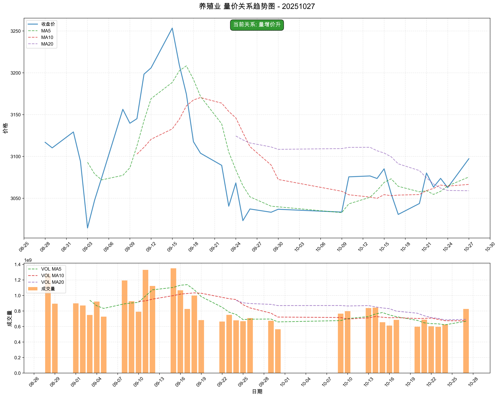

# 市场复盘报告 - 20251027

**生成时间**: 2025-10-27 23:56:09

## 📋 目录

- [📊 市场总结](#-市场总结)
  - [📈 市场情绪综合分析图](#-市场情绪综合分析图)
  - [情绪维度分析](#情绪维度分析)
  - [关键市场指标](#关键市场指标)
    - [市场活跃度](#市场活跃度)
    - [个股赚钱效应](#个股赚钱效应)
    - [风险偏好](#风险偏好)
    - [市场参与意愿](#市场参与意愿)
- [🏢 板块分析](#-板块分析)
- [🎯 个股分析](#-个股分析)
- [⚠️ 风险提示](#️-风险提示)

## 📊 市场总结

**综合情绪指数**: 5.10
**情绪等级**: 中性

### 📈 市场情绪综合分析图

*图表说明：上图展示了20251027的市场情绪综合分析，包括雷达图和趋势分析。*

### 情绪维度分析

| 维度 | 分析结果 |
|------|----------|
| 市场活跃度 | 3.70 |
| 个股赚钱效应 | 6.20 |
| 风险偏好 | 5.00 |
| 市场参与意愿 | 5.40 |

### 关键市场指标

#### 市场活跃度
- **涨停股数量**: 64
- **上涨比例**: 62.80%
- **下跌比例**: 33.11%
- **平盘比例**: 3.93%

#### 个股赚钱效应
- **市场总成交金额**: 23,414 亿元
- **平均流通换手率**: 0.03%
- **各板块成交金额**:
  - 上证主板A: 7,754 亿元
  - 科创板: 2,687 亿元
  - 深证主板A: 6,817 亿元
  - 创业版: 6,156 亿元

#### 风险偏好
- **融资余额**: 24,398 亿元
- **融券余额**: 174 亿元
- **两融余额**: 24,571 亿元
- **平均维持担保比例**: 280.73%
- **两融余额占流通市值占比**: 2.51%

#### 市场参与意愿
- **大单净流入占比**: -0.44%
- **中单净流入占比**: -0.22%
- **小单净流入占比**: 0.39%
- **上证收盘价**: 3996.94
- **上证涨跌幅**: 1.18%

## 🏢 板块分析

### 📊 量价分析

#### 📈 买入信号板块

**信号数量**: 21个

| 排名 | 板块名称 | 量价关系 | 成交量 | 价格 |
|------|----------|----------|--------|------|
| 1 | 小金属 | 量增价升 | 62.11% | 3.05% |
| 2 | 证券 | 量增价升 | 53.58% | 1.16% |
| 3 | 电子化学品 | 量增价升 | 52.20% | 2.50% |
| 4 | 互联网电商 | 量增价升 | 47.47% | 1.15% |
| 5 | 养殖业 | 量增价升 | 32.16% | 1.13% |
| 6 | 其他电源设备 | 量增价升 | 31.56% | 1.47% |
| 7 | 钢铁 | 量增价升 | 29.06% | 2.02% |
| 8 | 橡胶制品 | 量增价升 | 29.73% | 1.07% |
| 9 | 汽车服务及其他 | 量增价升 | 22.98% | 1.34% |
| 10 | 综合 | 量增价升 | 19.60% | 1.05% |
| 11 | 白色家电 | 量增价升 | 18.84% | 1.15% |
| 12 | 元件 | 量增价升 | 17.66% | 2.30% |
| 13 | 消费电子 | 量增价升 | 18.27% | 1.56% |
| 14 | 电池 | 量增价升 | 17.20% | 2.12% |
| 15 | 半导体 | 量增价升 | 16.77% | 2.07% |
| 16 | 专用设备 | 量增价升 | 17.76% | 1.08% |
| 17 | 电机 | 量增价升 | 14.67% | 1.61% |
| 18 | 金属新材料 | 量增价升 | 14.01% | 1.83% |
| 19 | 军工电子 | 量增价升 | 12.96% | 1.75% |
| 20 | 通信设备 | 量增价升 | 12.30% | 1.51% |
| 21 | 农化制品 | 量增价升 | 11.04% | 1.14% |

#### 📉 卖出信号板块

**信号数量**: 1个

| 排名 | 板块名称 | 量价关系 | 成交量 | 价格 |
|------|----------|----------|--------|------|
| 1 | 油气开采及服务 | 量减价跌 | -76.81% | -1.10% |

#### ➡️ 中性信号板块（TOP10）

**总数量**: 20个

| 排名 | 板块名称 | 量价关系 | 成交量 | 价格 |
|------|----------|----------|--------|------|
| 1 | 黑色家电 | 量增价平 | 62.99% | 0.09% |
| 2 | 工程机械 | 量增价平 | 60.47% | 0.40% |
| 3 | 家居用品 | 量增价平 | 47.95% | 0.74% |
| 4 | 保险 | 量增价平 | 45.59% | 0.82% |
| 5 | 电网设备 | 量增价平 | 33.76% | 0.85% |
| 6 | 教育 | 量增价平 | 24.63% | 0.39% |
| 7 | 其他社会服务 | 量增价平 | 20.93% | 0.35% |
| 8 | 塑料制品 | 量增价平 | 19.73% | 0.89% |
| 9 | 化学制品 | 量增价平 | 19.30% | 0.89% |
| 10 | 厨卫电器 | 量增价平 | 18.99% | 0.70% |

### 📊 买入信号板块量价关系趋势图

#### 小金属

#### 证券

#### 电子化学品

#### 互联网电商

#### 养殖业

#### 其他电源设备

### 📊 中性信号板块（TOP10）量价关系趋势图

#### 黑色家电

#### 工程机械

#### 家居用品

#### 保险

#### 电网设备

#### 教育

### 📈 MACD分析

#### 📈 买入信号板块

**信号数量**: 8个

| 排名 | 板块名称 | MACD值 | 柱状图 | 信号强度 |
|------|----------|--------|--------|----------|
| 1 | 光学光电子 | 0.1905 | 0.8205 | 1.0110 |
| 2 | 橡胶制品 | 27.4289 | 44.3392 | 71.7681 |
| 3 | 汽车零部件 | 0.5826 | -11.1789 | 11.7615 |
| 4 | 汽车服务及其他 | 2.0855 | 2.7638 | 4.8492 |
| 5 | 塑料制品 | 1.6405 | -0.8529 | 2.4935 |
| 6 | 计算机设备 | 8.3584 | 9.6190 | 17.9774 |
| 7 | 元件 | 18.5134 | 44.9061 | 63.4195 |
| 8 | 化学制品 | 7.8134 | 5.9773 | 13.7907 |

#### 📉 卖出信号板块

**信号数量**: 0个

✅ 暂无卖出信号板块

#### ➡️ 中性信号板块（TOP10）

**总数量**: 82个

| 排名 | 板块名称 | MACD值 | 柱状图 | 信号强度 |
|------|----------|--------|--------|----------|
| 1 | 油气开采及服务 | 25.2152 | 7.4623 | 16.3388 |
| 2 | 工程机械 | 25.7424 | 9.4067 | 17.5745 |
| 3 | 风电设备 | 95.1232 | -13.7390 | 10.8862 |
| 4 | 房地产 | 32.7649 | 4.7651 | 18.7650 |
| 5 | 石油加工贸易 | 18.9627 | 13.3190 | 16.1409 |
| 6 | 银行 | 7.4957 | 7.5378 | 7.5168 |
| 7 | 医药商业 | -13.8170 | 22.8258 | 3.6643 |
| 8 | 教育 | -28.7314 | 15.4916 | 4.4223 |
| 9 | 专用设备 | 63.1906 | 16.8009 | 39.9958 |
| 10 | 小家电 | -34.4083 | 15.3478 | 4.9756 |

### 📊 买入信号板块MACD图表

#### 光学光电子

#### 橡胶制品

#### 汽车零部件

#### 汽车服务及其他

#### 塑料制品

#### 计算机设备

### 📊 中性信号板块（TOP10）MACD图表

#### 油气开采及服务

#### 工程机械

#### 风电设备

#### 房地产

#### 石油加工贸易

#### 银行

## 🎯 个股分析

**分析股票数量**: 663只
**分析板块数量**: 6个

**目标板块**: 橡胶制品, 元件, 电子化学品, 专用设备, 半导体, 证券

### 📈 买入信号强度TOP10股票

| 排名 | 股票名称 | 信号类型 | 趋势状态 | 信号强度 | 最新价 | 趋势强度 |
| --- | --- | --- | --- | --- | --- | --- |
| 1 | 青岛双星 | HOLD | SIDEWAYS | 45.0 | 6.96 | 1.00 |
| 2 | 风华高科 | HOLD | SIDEWAYS | 45.0 | 17.23 | 1.00 |
| 3 | 顺络电子 | HOLD | SIDEWAYS | 45.0 | 42.00 | 1.00 |
| 4 | 高华科技 | HOLD | SIDEWAYS | 45.0 | 40.22 | 1.00 |
| 5 | 科瑞技术 | HOLD | SIDEWAYS | 45.0 | 23.05 | 1.00 |
| 6 | 神开股份 | HOLD | SIDEWAYS | 45.0 | 15.88 | 1.00 |
| 7 | 华菱精工 | HOLD | SIDEWAYS | 45.0 | 15.59 | 1.00 |
| 8 | 海得控制 | HOLD | SIDEWAYS | 45.0 | 17.15 | 1.00 |
| 9 | 安达智能 | HOLD | SIDEWAYS | 45.0 | 63.45 | 1.00 |
| 10 | 骄成超声 | HOLD | SIDEWAYS | 45.0 | 120.61 | 1.00 |

### 📊 详细分析

#### 1. 青岛双星

- **信号类型**: HOLD
- **趋势状态**: SIDEWAYS
- **MACD状态**: BULLISH
- **信号强度**: 45.0
- **最新收盘价**: 6.96
- **趋势强度**: 1.00
- **均线多头排列**: 否
- **MACD多头市场**: 是

#### 2. 风华高科

- **信号类型**: HOLD
- **趋势状态**: SIDEWAYS
- **MACD状态**: BULLISH
- **信号强度**: 45.0
- **最新收盘价**: 17.23
- **趋势强度**: 1.00
- **均线多头排列**: 否
- **MACD多头市场**: 是

#### 3. 顺络电子

- **信号类型**: HOLD
- **趋势状态**: SIDEWAYS
- **MACD状态**: BULLISH
- **信号强度**: 45.0
- **最新收盘价**: 42.00
- **趋势强度**: 1.00
- **均线多头排列**: 否
- **MACD多头市场**: 是

#### 4. 高华科技

- **信号类型**: HOLD
- **趋势状态**: SIDEWAYS
- **MACD状态**: BULLISH
- **信号强度**: 45.0
- **最新收盘价**: 40.22
- **趋势强度**: 1.00
- **均线多头排列**: 否
- **MACD多头市场**: 是

#### 5. 科瑞技术

- **信号类型**: HOLD
- **趋势状态**: SIDEWAYS
- **MACD状态**: BULLISH
- **信号强度**: 45.0
- **最新收盘价**: 23.05
- **趋势强度**: 1.00
- **均线多头排列**: 否
- **MACD多头市场**: 是

## ⚠️ 风险提示

本报告仅供学习和研究使用，不构成投资建议。投资有风险，入市需谨慎。
