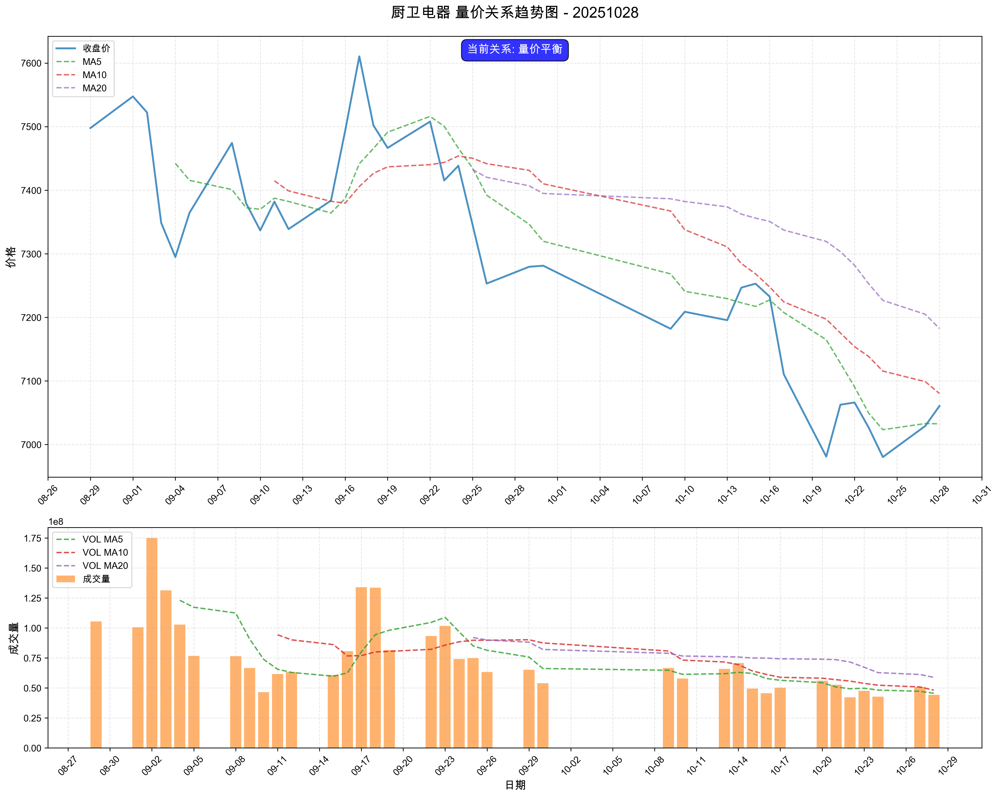

# 市场复盘报告 - 20251028

**生成时间**: 2025-10-29 00:38:12

## 📋 目录

- [📊 市场总结](#-市场总结)
  - [📈 市场情绪综合分析图](#-市场情绪综合分析图)
  - [情绪维度分析](#情绪维度分析)
  - [关键市场指标](#关键市场指标)
    - [市场活跃度](#市场活跃度)
    - [个股赚钱效应](#个股赚钱效应)
    - [风险偏好](#风险偏好)
    - [市场参与意愿](#市场参与意愿)
- [🏢 板块分析](#-板块分析)
- [🎯 个股分析](#-个股分析)
- [⚠️ 风险提示](#️-风险提示)

## 📊 市场总结

**综合情绪指数**: 5.30
**情绪等级**: 中性

### 📈 市场情绪综合分析图

*图表说明：上图展示了20251028的市场情绪综合分析，包括雷达图和趋势分析。*

### 情绪维度分析

| 维度 | 分析结果 |
|------|----------|
| 市场活跃度 | 3.40 |
| 个股赚钱效应 | 5.40 |
| 风险偏好 | 5.10 |
| 市场参与意愿 | 7.30 |

### 关键市场指标

#### 市场活跃度
- **涨停股数量**: 71
- **上涨比例**: 44.17%
- **下跌比例**: 52.56%
- **平盘比例**: 3.06%

#### 个股赚钱效应
- **市场总成交金额**: 21,498 亿元
- **平均流通换手率**: 0.03%
- **各板块成交金额**:
  - 上证主板A: 7,066 亿元
  - 科创板: 2,345 亿元
  - 深证主板A: 6,345 亿元
  - 创业版: 5,741 亿元

#### 风险偏好
- **融资余额**: 24,643 亿元
- **融券余额**: 177 亿元
- **两融余额**: 24,820 亿元
- **平均维持担保比例**: 283.29%
- **两融余额占流通市值占比**: 2.54%

#### 市场参与意愿
- **大单净流入占比**: -1.23%
- **中单净流入占比**: 0.47%
- **小单净流入占比**: 2.28%
- **上证收盘价**: 3988.22
- **上证涨跌幅**: -0.22%

## 🏢 板块分析

### 📊 量价分析

#### 📈 买入信号板块

**信号数量**: 1个

| 排名 | 板块名称 | 量价关系 | 成交量 | 价格 |
|------|----------|----------|--------|------|
| 1 | 机场航运 | 量增价升 | 12.84% | 1.08% |

#### 📉 卖出信号板块

**信号数量**: 3个

| 排名 | 板块名称 | 量价关系 | 成交量 | 价格 |
|------|----------|----------|--------|------|
| 1 | 钢铁 | 量减价跌 | -13.22% | -1.21% |
| 2 | 油气开采及服务 | 量减价跌 | -38.56% | -1.11% |
| 3 | 煤炭开采加工 | 量减价跌 | -51.72% | -1.50% |

#### ➡️ 中性信号板块（TOP10）

**总数量**: 3个

| 排名 | 板块名称 | 量价关系 | 成交量 | 价格 |
|------|----------|----------|--------|------|
| 1 | 厨卫电器 | 量增价平 | 73.33% | 0.38% |
| 2 | 医药商业 | 量增价平 | 15.58% | -0.01% |
| 3 | 生物制品 | 量增价平 | 10.19% | 0.24% |

### 📊 买入信号板块量价关系趋势图

#### 机场航运

### 📊 中性信号板块（TOP10）量价关系趋势图

#### 厨卫电器

#### 医药商业

#### 生物制品

### 📈 MACD分析

#### 📈 买入信号板块

**信号数量**: 4个

| 排名 | 板块名称 | MACD值 | 柱状图 | 信号强度 |
|------|----------|--------|--------|----------|
| 1 | 零售 | 0.0623 | 3.5475 | 3.6098 |
| 2 | 农产品加工 | 0.4141 | 6.7095 | 7.1236 |
| 3 | 消费电子 | 9.2089 | 11.8076 | 21.0164 |
| 4 | 军工装备 | 5.9837 | 10.7920 | 16.7756 |

#### 📉 卖出信号板块

**信号数量**: 0个

✅ 暂无卖出信号板块

#### ➡️ 中性信号板块（TOP10）

**总数量**: 86个

| 排名 | 板块名称 | MACD值 | 柱状图 | 信号强度 |
|------|----------|--------|--------|----------|
| 1 | 油气开采及服务 | 24.1116 | 4.9010 | 14.5063 |
| 2 | 工程机械 | 26.7242 | 8.3108 | 17.5175 |
| 3 | 风电设备 | 83.8124 | -19.8642 | 10.3677 |
| 4 | 房地产 | 32.2627 | 3.4104 | 17.8366 |
| 5 | 石油加工贸易 | 22.6047 | 13.5688 | 18.0868 |
| 6 | 银行 | 8.8463 | 6.9777 | 7.9120 |
| 7 | 医药商业 | -7.7118 | 23.1449 | 3.0857 |
| 8 | 教育 | -25.5205 | 14.9621 | 4.0483 |
| 9 | 专用设备 | 71.8295 | 20.3519 | 46.0907 |
| 10 | 小家电 | -24.4292 | 20.1640 | 4.4593 |

### 📊 买入信号板块MACD图表

#### 零售

#### 农产品加工

#### 消费电子

#### 军工装备

### 📊 中性信号板块（TOP10）MACD图表

#### 油气开采及服务

#### 工程机械

#### 风电设备

#### 房地产

#### 石油加工贸易

#### 银行

## 🎯 个股分析

**趋势追踪策略分析**: 481只股票
**超跌反弹策略分析**: 481只股票
**分析板块数量**: 5个

**目标板块**: 军工装备, 机场航运, 零售, 消费电子, 农产品加工

## 📈 趋势追踪策略 - TOP10股票

| 排名 | 股票名称 | 信号类型 | 趋势状态 | 信号强度 | 最新价 | 趋势强度 |
| --- | --- | --- | --- | --- | --- | --- |
| 1 | 厦门空港 | STRONG_BUY | BULLISH | 100.0 | 17.60 | 1.00 |
| 2 | 中电港 | STRONG_BUY | BULLISH | 100.0 | 27.15 | 1.00 |
| 3 | 厦门国贸 | STRONG_BUY | BULLISH | 100.0 | 6.81 | 1.00 |
| 4 | 华绿生物 | STRONG_BUY | BULLISH | 100.0 | 17.25 | 1.00 |
| 5 | 众兴菌业 | STRONG_BUY | BULLISH | 100.0 | 12.80 | 1.00 |
| 6 | 平潭发展 | STRONG_BUY | BULLISH | 100.0 | 5.49 | 1.00 |
| 7 | 福建金森 | STRONG_BUY | BULLISH | 98.9 | 12.31 | 0.95 |
| 8 | 嘉华股份 | STRONG_BUY | BULLISH | 98.7 | 15.22 | 0.94 |
| 9 | 秦港股份 | STRONG_BUY | BULLISH | 96.1 | 3.95 | 0.80 |
| 10 | 厦门港务 | STRONG_BUY | BULLISH | 95.8 | 11.44 | 0.79 |

### 详细分析

#### 1. 厦门空港

- **信号类型**: STRONG_BUY
- **趋势状态**: BULLISH
- **信号强度**: 100.0
- **最新收盘价**: 17.60

#### 2. 中电港

- **信号类型**: STRONG_BUY
- **趋势状态**: BULLISH
- **信号强度**: 100.0
- **最新收盘价**: 27.15

#### 3. 厦门国贸

- **信号类型**: STRONG_BUY
- **趋势状态**: BULLISH
- **信号强度**: 100.0
- **最新收盘价**: 6.81

## 📉 超跌反弹策略 - TOP10股票

| 排名 | 股票名称 | 信号类型 | 超跌类型 | 信号强度 | 最新价 | 超跌强度 |
| --- | --- | --- | --- | --- | --- | --- |
| 1 | 新诺威 | STRONG_BUY | STRONG_OVERSOLD | 94.6 | 34.45 | 0.73 |
| 2 | 乖宝宠物 | STRONG_BUY | STRONG_OVERSOLD | 91.2 | 72.62 | 0.56 |
| 3 | ST景谷 | STRONG_BUY | STRONG_OVERSOLD | 88.9 | 20.19 | 0.44 |
| 4 | 天马科技 | STRONG_BUY | STRONG_OVERSOLD | 85.6 | 13.78 | 0.28 |
| 5 | 中航沈飞 | STRONG_BUY | KDJ_REBOUND | 68.5 | 64.88 | 0.18 |
| 6 | 传音控股 | BUY | NORMAL_OVERSOLD | 54.4 | 75.78 | 0.47 |
| 7 | 泰嘉股份 | BUY | NORMAL_OVERSOLD | 50.6 | 20.43 | 0.28 |
| 8 | 光峰科技 | BUY | NORMAL_OVERSOLD | 49.3 | 18.09 | 0.21 |
| 9 | 格林精密 | BUY | NORMAL_OVERSOLD | 48.9 | 13.81 | 0.19 |
| 10 | 海大集团 | HOLD | NONE | 45.3 | 56.69 | 0.27 |

### 详细分析

#### 1. 新诺威

- **信号类型**: STRONG_BUY
- **超跌类型**: STRONG_OVERSOLD
- **信号强度**: 94.6
- **KDJ状态**: OVERSOLD
- **RSI状态**: OVERSOLD

#### 2. 乖宝宠物

- **信号类型**: STRONG_BUY
- **超跌类型**: STRONG_OVERSOLD
- **信号强度**: 91.2
- **KDJ状态**: OVERSOLD
- **RSI状态**: OVERSOLD

#### 3. ST景谷

- **信号类型**: STRONG_BUY
- **超跌类型**: STRONG_OVERSOLD
- **信号强度**: 88.9
- **KDJ状态**: OVERSOLD
- **RSI状态**: OVERSOLD

## ⚠️ 风险提示

本报告仅供学习和研究使用，不构成投资建议。投资有风险，入市需谨慎。
