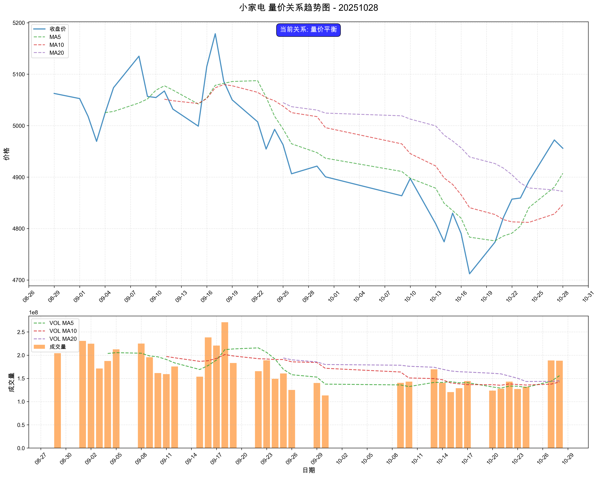

# 市场复盘报告 - 20251028

**生成时间**: 2025-10-28 21:38:20

## 📋 目录

- [📊 市场总结](#-市场总结)
  - [📈 市场情绪综合分析图](#-市场情绪综合分析图)
  - [情绪维度分析](#情绪维度分析)
  - [关键市场指标](#关键市场指标)
    - [市场活跃度](#市场活跃度)
    - [个股赚钱效应](#个股赚钱效应)
    - [风险偏好](#风险偏好)
    - [市场参与意愿](#市场参与意愿)
- [🏢 板块分析](#-板块分析)
- [🎯 个股分析](#-个股分析)
- [⚠️ 风险提示](#️-风险提示)

## 📊 市场总结

**综合情绪指数**: 5.30
**情绪等级**: 中性

### 📈 市场情绪综合分析图

*图表说明：上图展示了20251028的市场情绪综合分析，包括雷达图和趋势分析。*

### 情绪维度分析

| 维度 | 分析结果 |
|------|----------|
| 市场活跃度 | 3.40 |
| 个股赚钱效应 | 5.40 |
| 风险偏好 | 5.10 |
| 市场参与意愿 | 7.30 |

### 关键市场指标

#### 市场活跃度
- **涨停股数量**: 71
- **上涨比例**: 44.17%
- **下跌比例**: 52.56%
- **平盘比例**: 3.06%

#### 个股赚钱效应
- **市场总成交金额**: 21,498 亿元
- **平均流通换手率**: 0.03%
- **各板块成交金额**:
  - 上证主板A: 7,066 亿元
  - 科创板: 2,345 亿元
  - 深证主板A: 6,345 亿元
  - 创业版: 5,741 亿元

#### 风险偏好
- **融资余额**: 24,643 亿元
- **融券余额**: 177 亿元
- **两融余额**: 24,820 亿元
- **平均维持担保比例**: 283.29%
- **两融余额占流通市值占比**: 2.54%

#### 市场参与意愿
- **大单净流入占比**: -1.23%
- **中单净流入占比**: 0.47%
- **小单净流入占比**: 2.28%
- **上证收盘价**: 3988.22
- **上证涨跌幅**: -0.22%

## 🏢 板块分析

### 📊 量价分析

#### 📈 买入信号板块

**信号数量**: 3个

| 排名 | 板块名称 | 量价关系 | 成交量 | 价格 |
|------|----------|----------|--------|------|
| 1 | 小家电 | 量增价升 | 43.02% | 1.64% |
| 2 | 半导体 | 量增价升 | 16.77% | 2.07% |
| 3 | 机场航运 | 量增价升 | 12.84% | 1.08% |

#### 📉 卖出信号板块

**信号数量**: 2个

| 排名 | 板块名称 | 量价关系 | 成交量 | 价格 |
|------|----------|----------|--------|------|
| 1 | 贵金属 | 量减价跌 | -12.60% | -2.52% |
| 2 | 油气开采及服务 | 量减价跌 | -28.71% | -1.19% |

#### ➡️ 中性信号板块（TOP10）

**总数量**: 3个

| 排名 | 板块名称 | 量价关系 | 成交量 | 价格 |
|------|----------|----------|--------|------|
| 1 | 物流 | 量增价平 | 16.83% | 0.04% |
| 2 | 医药商业 | 量增价平 | 15.58% | -0.01% |
| 3 | 生物制品 | 量增价平 | 10.19% | 0.24% |

### 📊 买入信号板块量价关系趋势图

#### 小家电

#### 半导体

#### 机场航运

### 📊 中性信号板块（TOP10）量价关系趋势图

#### 物流

#### 医药商业

#### 生物制品

### 📈 MACD分析

#### 📈 买入信号板块

**信号数量**: 5个

| 排名 | 板块名称 | MACD值 | 柱状图 | 信号强度 |
|------|----------|--------|--------|----------|
| 1 | 零售 | 0.0623 | 3.5475 | 3.6098 |
| 2 | 农产品加工 | 0.4771 | 6.7599 | 7.2371 |
| 3 | 医疗器械 | 3.6180 | 32.3449 | 35.9629 |
| 4 | 消费电子 | 9.2089 | 11.8076 | 21.0164 |
| 5 | 军工装备 | 5.9837 | 10.7920 | 16.7756 |

#### 📉 卖出信号板块

**信号数量**: 0个

✅ 暂无卖出信号板块

#### ➡️ 中性信号板块（TOP10）

**总数量**: 85个

| 排名 | 板块名称 | MACD值 | 柱状图 | 信号强度 |
|------|----------|--------|--------|----------|
| 1 | 油气开采及服务 | 24.1116 | 4.9010 | 14.5063 |
| 2 | 工程机械 | 26.7242 | 8.3108 | 17.5175 |
| 3 | 风电设备 | 83.8629 | -19.8238 | 10.3687 |
| 4 | 房地产 | 32.2863 | 3.4292 | 17.8578 |
| 5 | 石油加工贸易 | 22.4281 | 13.4275 | 17.9278 |
| 6 | 银行 | 8.7538 | 6.9037 | 7.8287 |
| 7 | 医药商业 | -6.3052 | 24.2701 | 3.0575 |
| 8 | 教育 | -25.8646 | 14.6868 | 4.0551 |
| 9 | 专用设备 | 71.8295 | 20.3519 | 46.0907 |
| 10 | 小家电 | -24.4292 | 20.1640 | 4.4593 |

### 📊 买入信号板块MACD图表

#### 零售

#### 农产品加工

#### 医疗器械

#### 消费电子

#### 军工装备

### 📊 中性信号板块（TOP10）MACD图表

#### 油气开采及服务

#### 工程机械

#### 风电设备

#### 房地产

#### 石油加工贸易

#### 银行

## 🎯 个股分析

**趋势追踪策略分析**: 585只股票
**超跌反弹策略分析**: 585只股票
**分析板块数量**: 6个

**目标板块**: 军工装备, 半导体, 机场航运, 医疗器械, 小家电, 零售

## 📈 趋势追踪策略 - TOP10股票

| 排名 | 股票名称 | 信号类型 | 趋势状态 | 信号强度 | 最新价 | 趋势强度 |
| --- | --- | --- | --- | --- | --- | --- |
| 1 | 航新科技 | HOLD | SIDEWAYS | 45.0 | 20.17 | 1.00 |
| 2 | 中天火箭 | HOLD | SIDEWAYS | 45.0 | 54.44 | 1.00 |
| 3 | 航天环宇 | HOLD | SIDEWAYS | 45.0 | 25.64 | 1.00 |
| 4 | 朗科科技 | HOLD | SIDEWAYS | 45.0 | 34.57 | 1.00 |
| 5 | 江波龙 | HOLD | SIDEWAYS | 45.0 | 257.29 | 1.00 |
| 6 | 佰维存储 | HOLD | SIDEWAYS | 45.0 | 124.46 | 1.00 |
| 7 | 普冉股份 | HOLD | SIDEWAYS | 45.0 | 145.98 | 1.00 |
| 8 | 大为股份 | HOLD | SIDEWAYS | 45.0 | 28.14 | 1.00 |
| 9 | 厦门空港 | HOLD | SIDEWAYS | 45.0 | 17.60 | 1.00 |
| 10 | 东富龙 | HOLD | SIDEWAYS | 45.0 | 16.18 | 1.00 |

### 详细分析

#### 1. 航新科技

- **信号类型**: HOLD
- **趋势状态**: SIDEWAYS
- **信号强度**: 45.0
- **最新收盘价**: 20.17

#### 2. 中天火箭

- **信号类型**: HOLD
- **趋势状态**: SIDEWAYS
- **信号强度**: 45.0
- **最新收盘价**: 54.44

#### 3. 航天环宇

- **信号类型**: HOLD
- **趋势状态**: SIDEWAYS
- **信号强度**: 45.0
- **最新收盘价**: 25.64

## 📉 超跌反弹策略 - TOP10股票

| 排名 | 股票名称 | 信号类型 | 超跌类型 | 信号强度 | 最新价 | 超跌强度 |
| --- | --- | --- | --- | --- | --- | --- |
| 1 | 亿田智能 | STRONG_BUY | STRONG_OVERSOLD | 91.4 | 38.70 | 0.57 |
| 2 | 南微医学 | STRONG_BUY | STRONG_OVERSOLD | 89.3 | 81.52 | 0.47 |
| 3 | 奥精医疗 | STRONG_BUY | STRONG_OVERSOLD | 88.3 | 22.89 | 0.42 |
| 4 | 安杰思 | STRONG_BUY | STRONG_OVERSOLD | 86.6 | 63.41 | 0.33 |
| 5 | 芯导科技 | STRONG_BUY | STRONG_OVERSOLD | 85.4 | 70.50 | 0.27 |
| 6 | 中航沈飞 | STRONG_BUY | KDJ_REBOUND | 68.5 | 64.88 | 0.18 |
| 7 | 玉马科技 | BUY | NORMAL_OVERSOLD | 53.1 | 16.18 | 0.40 |
| 8 | 峰岹科技 | BUY | NORMAL_OVERSOLD | 52.7 | 196.00 | 0.38 |
| 9 | 泰林生物 | BUY | NORMAL_OVERSOLD | 52.4 | 29.33 | 0.37 |
| 10 | 乐鑫科技 | BUY | NORMAL_OVERSOLD | 51.5 | 173.90 | 0.32 |

### 详细分析

#### 1. 亿田智能

- **信号类型**: STRONG_BUY
- **超跌类型**: STRONG_OVERSOLD
- **信号强度**: 91.4
- **KDJ状态**: OVERSOLD
- **RSI状态**: OVERSOLD

#### 2. 南微医学

- **信号类型**: STRONG_BUY
- **超跌类型**: STRONG_OVERSOLD
- **信号强度**: 89.3
- **KDJ状态**: OVERSOLD
- **RSI状态**: OVERSOLD

#### 3. 奥精医疗

- **信号类型**: STRONG_BUY
- **超跌类型**: STRONG_OVERSOLD
- **信号强度**: 88.3
- **KDJ状态**: OVERSOLD
- **RSI状态**: OVERSOLD

## ⚠️ 风险提示

本报告仅供学习和研究使用，不构成投资建议。投资有风险，入市需谨慎。
