# 市场复盘报告 - 20251029

**生成时间**: 2025-10-29 22:47:18

## 📋 目录

- [📊 市场总结](#-市场总结)
  - [📈 市场情绪综合分析图](#-市场情绪综合分析图)
  - [情绪维度分析](#情绪维度分析)
  - [关键市场指标](#关键市场指标)
    - [市场活跃度](#市场活跃度)
    - [个股赚钱效应](#个股赚钱效应)
    - [风险偏好](#风险偏好)
    - [市场参与意愿](#市场参与意愿)
- [🏢 板块分析](#-板块分析)
- [🎯 个股分析](#-个股分析)
- [⚠️ 风险提示](#️-风险提示)

## 📊 市场总结

**综合情绪指数**: 4.80
**情绪等级**: 中性

### 📈 市场情绪综合分析图

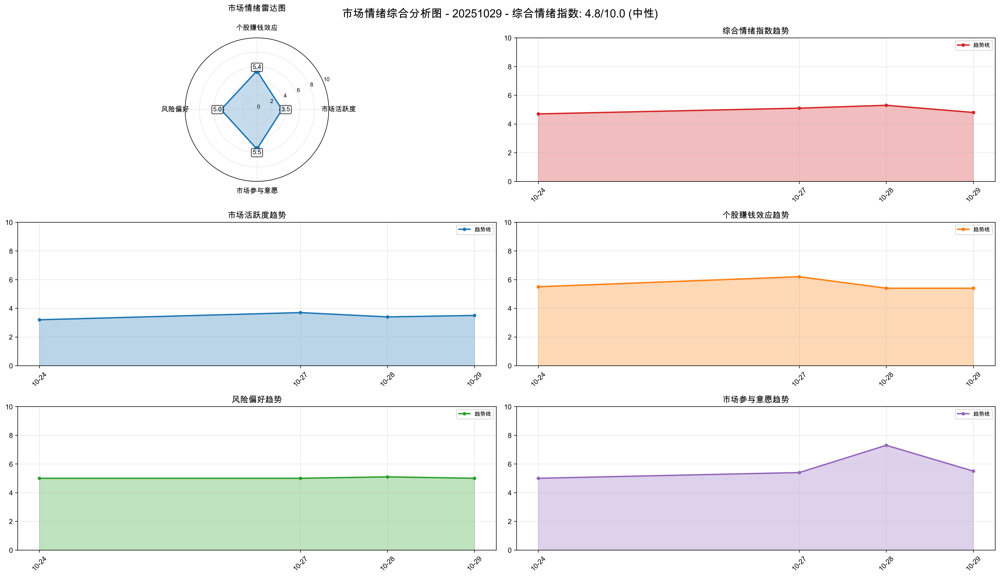

*图表说明：上图展示了20251029的市场情绪综合分析，包括雷达图和趋势分析。*

### 情绪维度分析

| 维度 | 分析结果 |
|------|----------|
| 市场活跃度 | 3.50 |
| 个股赚钱效应 | 5.40 |
| 风险偏好 | 5.00 |
| 市场参与意愿 | 5.50 |

### 关键市场指标

#### 市场活跃度
- **涨停股数量**: 62
- **上涨比例**: 46.40%
- **下跌比例**: 50.70%
- **平盘比例**: 2.69%

#### 个股赚钱效应
- **市场总成交金额**: 22,572 亿元
- **平均流通换手率**: 0.03%
- **各板块成交金额**:
  - 上证主板A: 7,358 亿元
  - 科创板: 2,330 亿元
  - 深证主板A: 6,674 亿元
  - 创业版: 6,211 亿元

#### 风险偏好
- **融资余额**: 24,770 亿元
- **融券余额**: 178 亿元
- **两融余额**: 24,947 亿元
- **平均维持担保比例**: 281.95%
- **两融余额占流通市值占比**: 2.53%

#### 市场参与意愿
- **大单净流入占比**: -0.28%
- **中单净流入占比**: -0.56%
- **小单净流入占比**: 0.52%
- **上证收盘价**: 4016.33
- **上证涨跌幅**: 0.70%

## 🏢 板块分析

### 📊 量价分析

#### 📈 买入信号板块

**信号数量**: 1个

| 排名 | 板块名称 | 量价关系 | 成交量 | 价格 |
|------|----------|----------|--------|------|
| 1 | 军工装备 | 量增价升 | 33.49% | 2.39% |

#### 📉 卖出信号板块

**信号数量**: 13个

| 排名 | 板块名称 | 量价关系 | 成交量 | 价格 |
|------|----------|----------|--------|------|
| 1 | 影视院线 | 量减价跌 | -17.32% | -1.15% |
| 2 | 厨卫电器 | 量减价跌 | -69.81% | -1.40% |
| 3 | 医疗器械 | 量减价跌 | -71.39% | -1.02% |
| 4 | 服装家纺 | 量减价跌 | -72.23% | -1.21% |
| 5 | 互联网电商 | 量减价跌 | -73.61% | -1.03% |
| 6 | 美容护理 | 量减价跌 | -74.61% | -1.23% |
| 7 | 纺织制造 | 量减价跌 | -75.61% | -1.59% |
| 8 | 物流 | 量减价跌 | -76.01% | -1.74% |
| 9 | 文化传媒 | 量减价跌 | -77.90% | -1.10% |
| 10 | 造纸 | 量减价跌 | -78.14% | -1.13% |
| 11 | 包装印刷 | 量减价跌 | -79.42% | -1.24% |
| 12 | 其他社会服务 | 量减价跌 | -79.61% | -1.15% |
| 13 | 橡胶制品 | 量减价跌 | -83.38% | -1.24% |

#### ➡️ 中性信号板块（TOP10）

**总数量**: 2个

| 排名 | 板块名称 | 量价关系 | 成交量 | 价格 |
|------|----------|----------|--------|------|
| 1 | 旅游及酒店 | 量增价平 | 12.78% | -0.12% |
| 2 | 生物制品 | 量增价平 | 10.19% | 0.24% |

### 📊 买入信号板块量价关系趋势图

#### 军工装备

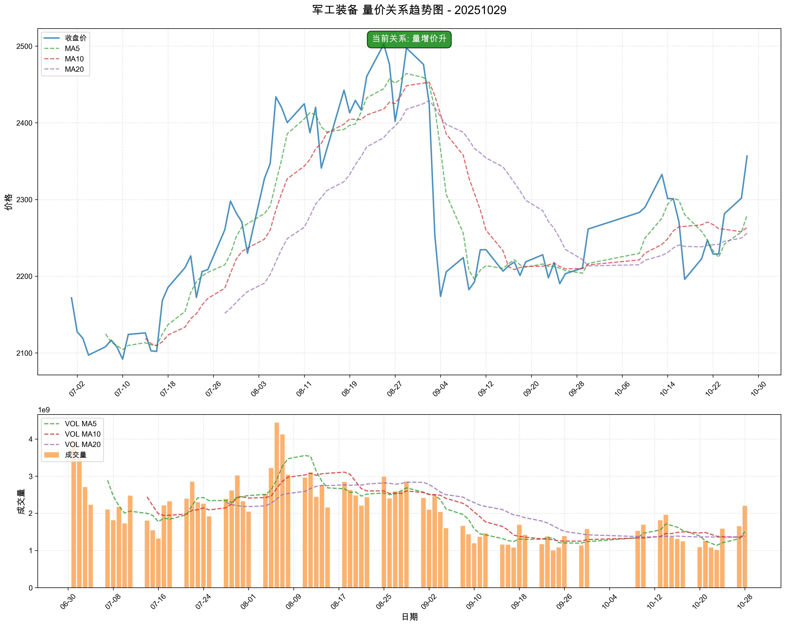

### 📊 中性信号板块（TOP10）量价关系趋势图

#### 旅游及酒店

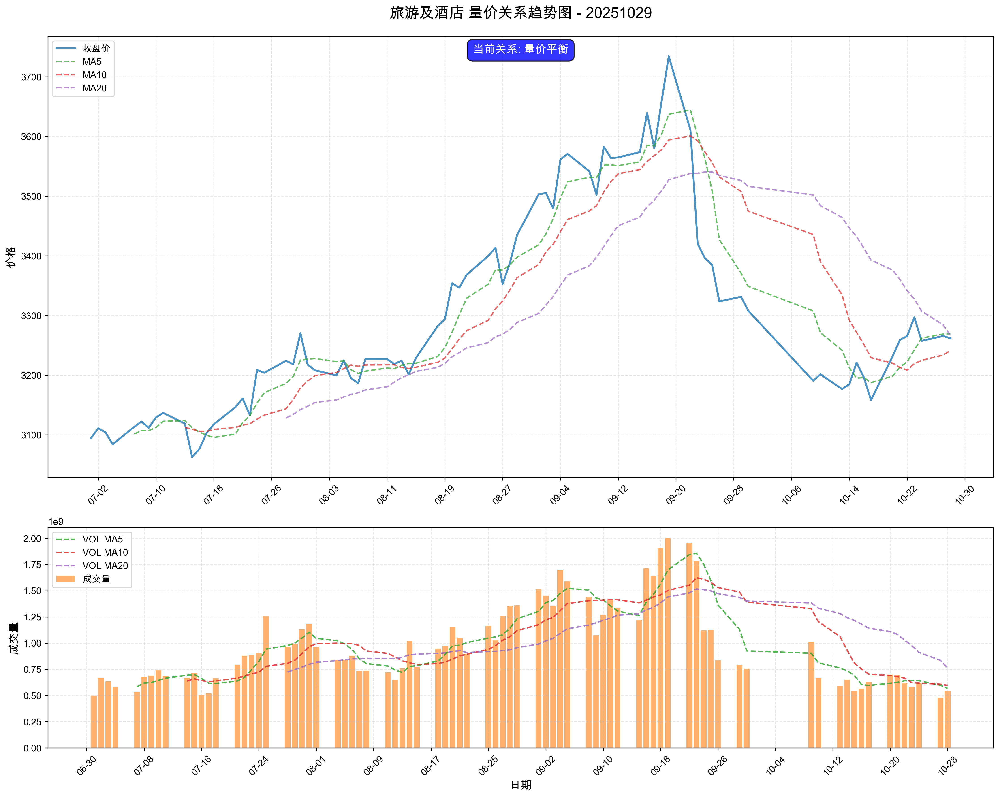

#### 生物制品

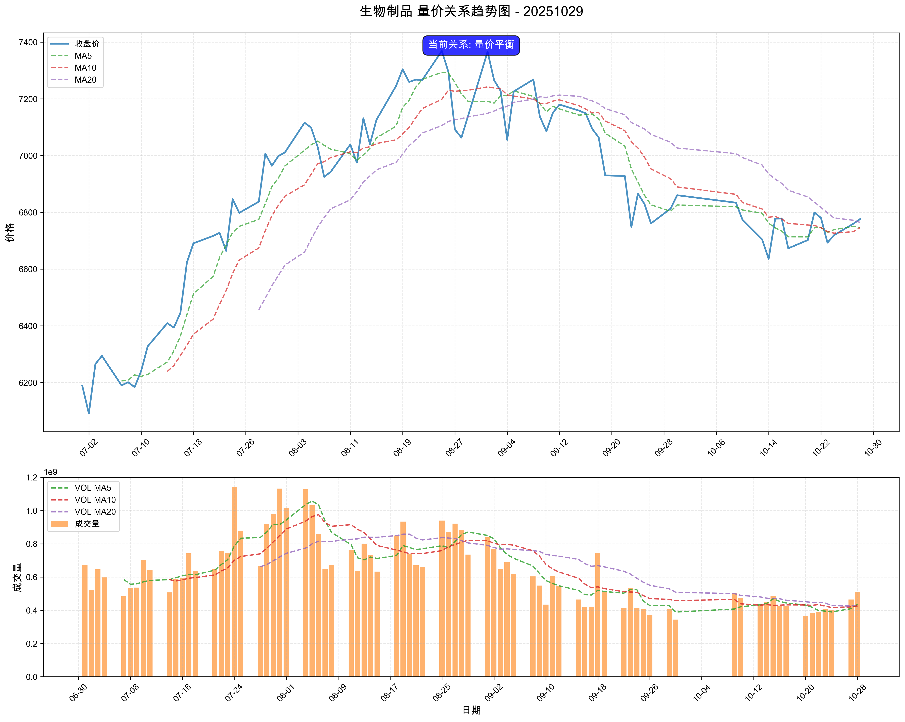

### 📈 MACD分析

#### 📈 买入信号板块

**信号数量**: 4个

| 排名 | 板块名称 | MACD值 | 柱状图 | 信号强度 |
|------|----------|--------|--------|----------|
| 1 | 电机 | 2.4722 | 3.2394 | 5.7116 |
| 2 | 通信设备 | 12.4915 | 25.8400 | 38.3315 |
| 3 | 非金属材料 | 8.4804 | 45.3666 | 53.8470 |
| 4 | 军工装备 | 6.2336 | 11.0104 | 17.2440 |

#### 📉 卖出信号板块

**信号数量**: 2个

| 排名 | 板块名称 | MACD值 | 柱状图 | 信号强度 |
|------|----------|--------|--------|----------|
| 1 | 中药 | -2.0529 | 4.5951 | -6.6480 |
| 2 | 美容护理 | -3.7536 | -2.8864 | -6.6400 |

#### ➡️ 中性信号板块（TOP10）

**总数量**: 84个

| 排名 | 板块名称 | MACD值 | 柱状图 | 信号强度 |
|------|----------|--------|--------|----------|
| 1 | 油气开采及服务 | 22.7742 | 2.8730 | 12.8236 |
| 2 | 工程机械 | 26.0069 | 6.1954 | 16.1012 |
| 3 | 风电设备 | 72.3888 | -24.8728 | 9.7262 |
| 4 | 房地产 | 32.2392 | 3.4447 | 17.8419 |
| 5 | 石油加工贸易 | 25.3921 | 13.1205 | 19.2563 |
| 6 | 银行 | 7.0677 | 4.1635 | 5.6156 |
| 7 | 医药商业 | -3.6439 | 21.8052 | 2.5449 |
| 8 | 教育 | -23.5839 | 13.5700 | 3.7154 |
| 9 | 专用设备 | 77.3703 | 20.9029 | 49.1366 |
| 10 | 小家电 | -18.6275 | 20.8525 | 3.9480 |

### 📊 买入信号板块MACD图表

#### 电机

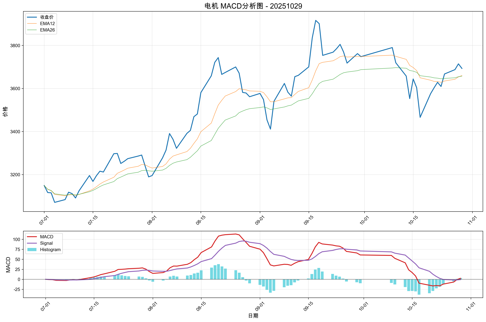

#### 通信设备

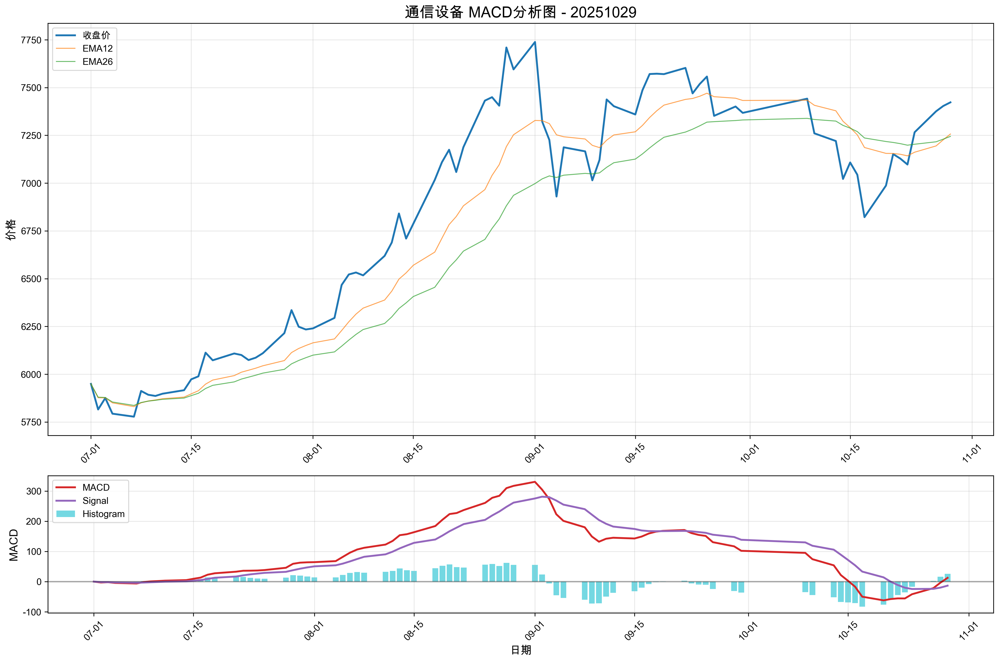

#### 非金属材料

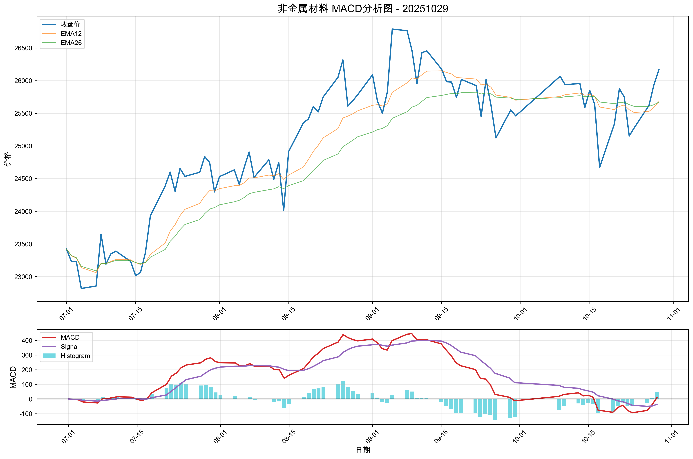

#### 军工装备

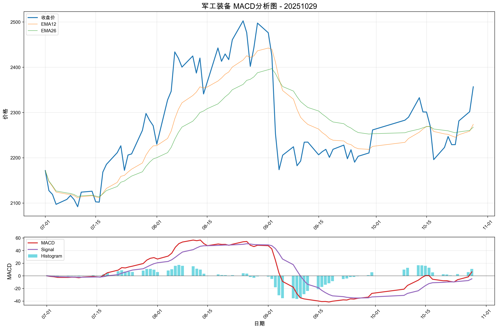

### 📊 中性信号板块（TOP10）MACD图表

#### 油气开采及服务

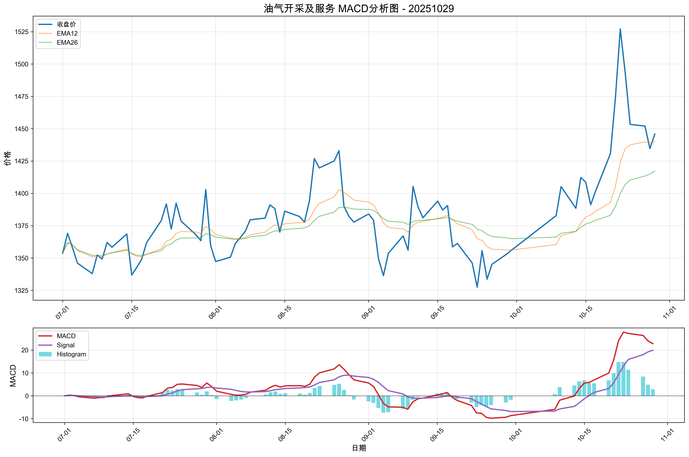

#### 工程机械

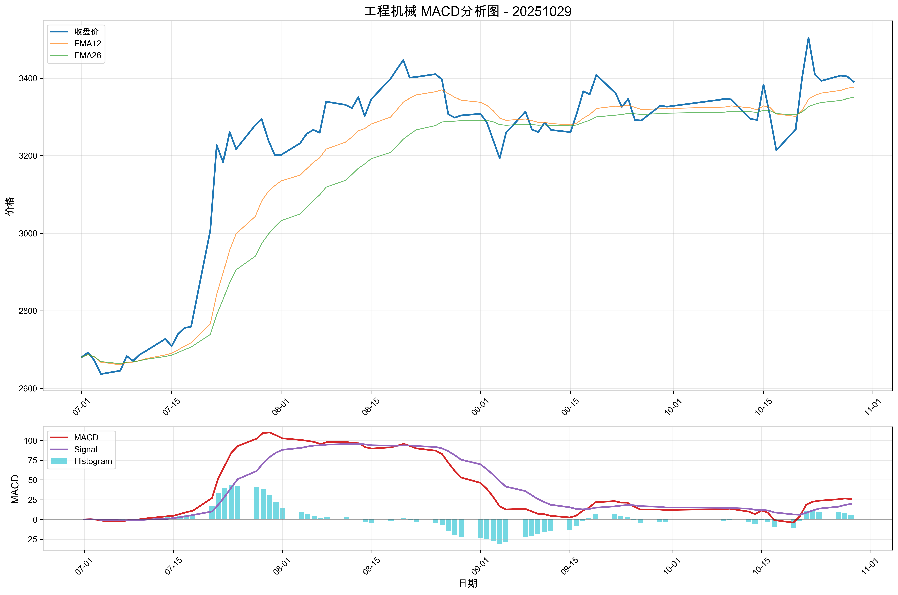

#### 风电设备

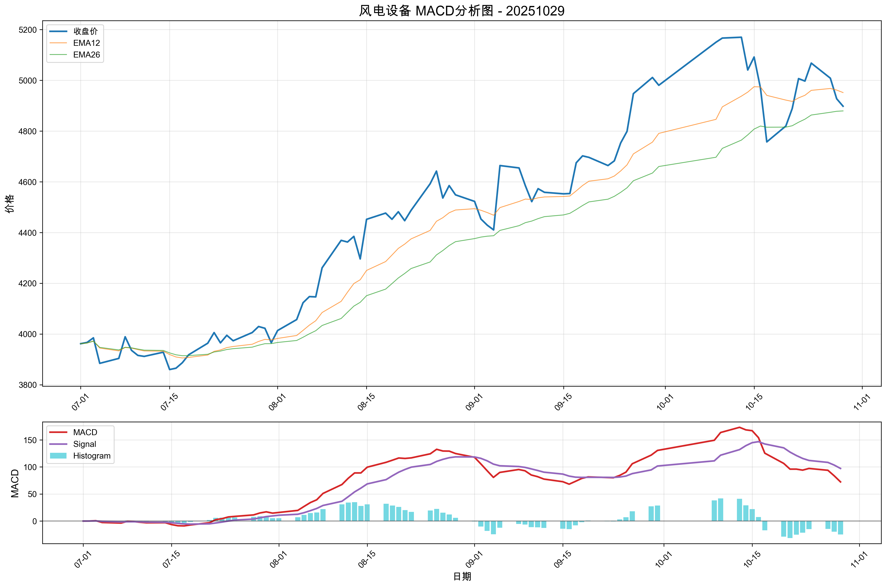

#### 房地产

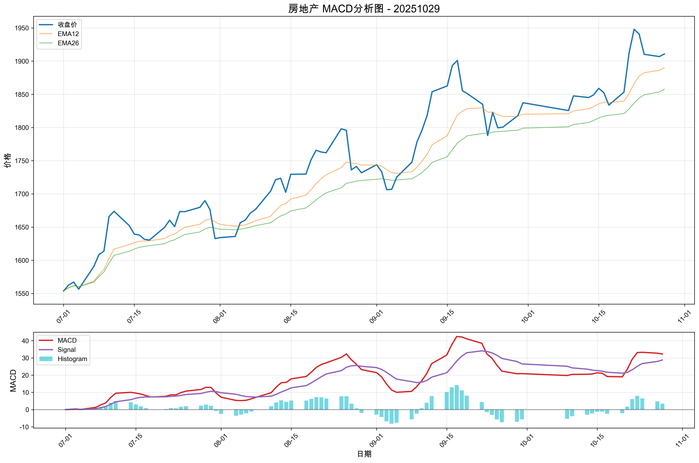

#### 石油加工贸易

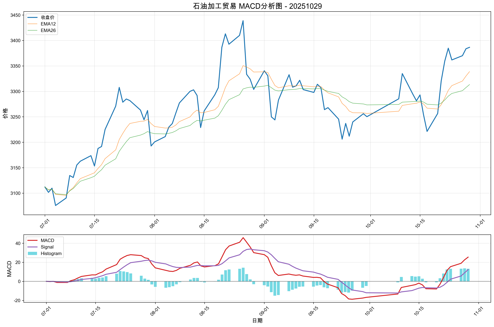

#### 银行

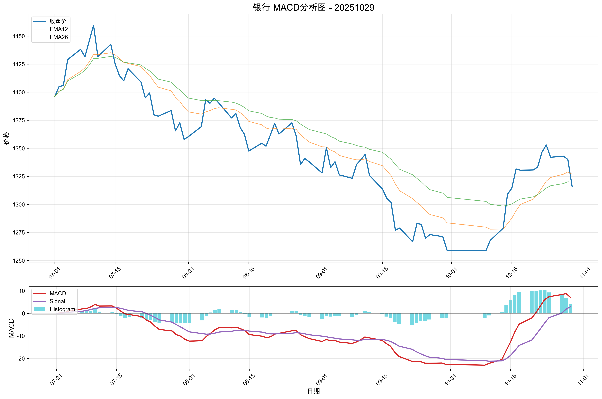

## 🎯 个股分析

**趋势追踪策略分析**: 204只股票
**超跌反弹策略分析**: 204只股票
**分析板块数量**: 4个

**目标板块**: 军工装备, 非金属材料, 通信设备, 电机

## 📈 趋势追踪策略 - TOP10股票

| 排名 | 股票名称 | 信号类型 | 趋势状态 | 信号强度 | 最新价 | 趋势强度 |
| --- | --- | --- | --- | --- | --- | --- |
| 1 | 星网宇达 | STRONG_BUY | BULLISH | 100.0 | 27.94 | 1.00 |
| 2 | 国盾量子 | STRONG_BUY | BULLISH | 100.0 | 511.00 | 1.00 |
| 3 | 佳电股份 | STRONG_BUY | BULLISH | 100.0 | 13.51 | 1.00 |
| 4 | 方大炭素 | STRONG_BUY | BULLISH | 97.7 | 6.25 | 0.89 |
| 5 | 奥尼电子 | STRONG_BUY | BULLISH | 96.5 | 36.52 | 0.83 |
| 6 | 中科电气 | STRONG_BUY | BULLISH | 94.7 | 26.76 | 0.74 |
| 7 | 航宇科技 | STRONG_BUY | BULLISH | 92.0 | 51.03 | 0.60 |
| 8 | 中国卫星 | STRONG_BUY | BULLISH | 91.7 | 42.50 | 0.59 |
| 9 | ST路通 | STRONG_BUY | BULLISH | 91.7 | 12.43 | 0.58 |
| 10 | 海特高新 | STRONG_BUY | BULLISH | 91.6 | 12.89 | 0.58 |

### 详细分析

#### 1. 星网宇达

- **信号类型**: STRONG_BUY
- **趋势状态**: BULLISH
- **信号强度**: 100.0
- **最新收盘价**: 27.94

#### 2. 国盾量子

- **信号类型**: STRONG_BUY
- **趋势状态**: BULLISH
- **信号强度**: 100.0
- **最新收盘价**: 511.00

#### 3. 佳电股份

- **信号类型**: STRONG_BUY
- **趋势状态**: BULLISH
- **信号强度**: 100.0
- **最新收盘价**: 13.51

## 📉 超跌反弹策略 - TOP10股票

| 排名 | 股票名称 | 信号类型 | 超跌类型 | 信号强度 | 最新价 | 超跌强度 |
| --- | --- | --- | --- | --- | --- | --- |
| 1 | 国睿科技 | BUY | NORMAL_OVERSOLD | 52.5 | 29.43 | 0.37 |
| 2 | 广和通 | BUY | NORMAL_OVERSOLD | 49.9 | 27.42 | 0.24 |
| 3 | 神宇股份 | BUY | NORMAL_OVERSOLD | 49.8 | 38.20 | 0.24 |
| 4 | 锐捷网络 | BUY | NORMAL_OVERSOLD | 49.4 | 78.84 | 0.22 |
| 5 | 兆威机电 | BUY | NORMAL_OVERSOLD | 48.6 | 119.47 | 0.18 |
| 6 | 有方科技 | BUY | RSI_REBOUND | 33.5 | 61.02 | 0.18 |
| 7 | 中电电机 | HOLD | NONE | 30.9 | 27.08 | 0.30 |
| 8 | 中航沈飞 | HOLD | NONE | 28.8 | 64.13 | 0.19 |
| 9 | 慧翰股份 | HOLD | NONE | 28.4 | 122.66 | 0.17 |
| 10 | 康平科技 | HOLD | NONE | 28.3 | 32.35 | 0.17 |

### 详细分析

#### 1. 国睿科技

- **信号类型**: BUY
- **超跌类型**: NORMAL_OVERSOLD
- **信号强度**: 52.5
- **KDJ状态**: OVERSOLD
- **RSI状态**: OVERSOLD

#### 2. 广和通

- **信号类型**: BUY
- **超跌类型**: NORMAL_OVERSOLD
- **信号强度**: 49.9
- **KDJ状态**: OVERSOLD
- **RSI状态**: OVERSOLD

#### 3. 神宇股份

- **信号类型**: BUY
- **超跌类型**: NORMAL_OVERSOLD
- **信号强度**: 49.8
- **KDJ状态**: OVERSOLD
- **RSI状态**: OVERSOLD

## ⚠️ 风险提示

本报告仅供学习和研究使用，不构成投资建议。投资有风险，入市需谨慎。
