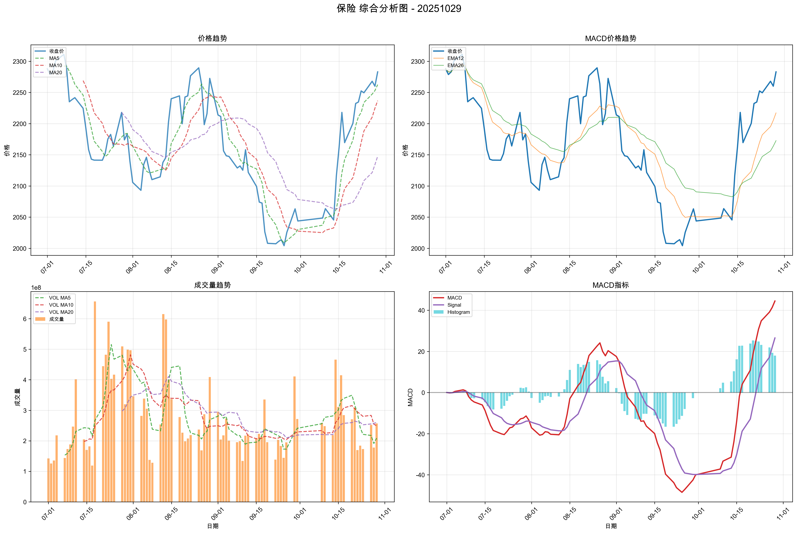

# 市场复盘报告 - 20251029

**生成时间**: 2025-10-30 00:03:30

## 📋 目录

- [📊 市场总结](#-市场总结)
  - [📈 市场情绪综合分析图](#-市场情绪综合分析图)
  - [情绪维度分析](#情绪维度分析)
  - [关键市场指标](#关键市场指标)
    - [市场活跃度](#市场活跃度)
    - [个股赚钱效应](#个股赚钱效应)
    - [风险偏好](#风险偏好)
    - [市场参与意愿](#市场参与意愿)
- [🏢 板块分析](#-板块分析)
- [🎯 个股分析](#-个股分析)
- [⚠️ 风险提示](#️-风险提示)

## 📊 市场总结

**综合情绪指数**: 4.80
**情绪等级**: 中性

### 📈 市场情绪综合分析图

*图表说明：上图展示了20251029的市场情绪综合分析，包括雷达图和趋势分析。*

### 情绪维度分析

| 维度 | 分析结果 |
|------|----------|
| 市场活跃度 | 3.50 |
| 个股赚钱效应 | 5.40 |
| 风险偏好 | 5.00 |
| 市场参与意愿 | 5.50 |

### 关键市场指标

#### 市场活跃度
- **涨停股数量**: 62
- **上涨比例**: 46.40%
- **下跌比例**: 50.70%
- **平盘比例**: 2.69%

#### 个股赚钱效应
- **市场总成交金额**: 22,572 亿元
- **平均流通换手率**: 0.03%
- **各板块成交金额**:
  - 上证主板A: 7,358 亿元
  - 科创板: 2,330 亿元
  - 深证主板A: 6,674 亿元
  - 创业版: 6,211 亿元

#### 风险偏好
- **融资余额**: 24,770 亿元
- **融券余额**: 178 亿元
- **两融余额**: 24,947 亿元
- **平均维持担保比例**: 281.95%
- **两融余额占流通市值占比**: 2.53%

#### 市场参与意愿
- **大单净流入占比**: -0.28%
- **中单净流入占比**: -0.56%
- **小单净流入占比**: 0.52%
- **上证收盘价**: 4016.33
- **上证涨跌幅**: 0.70%

## 🏢 板块分析

### 📊 量价分析

#### 📈 买入信号板块

**信号数量**: 9个

| 排名 | 板块名称 | 量价关系 | 成交量 | 价格 |
|------|----------|----------|--------|------|
| 1 | 光伏设备 | 量增价升 | 98.74% | 4.26% |
| 2 | 机场航运 | 量增价升 | 72.32% | 1.04% |
| 3 | 证券 | 量增价升 | 68.45% | 2.22% |
| 4 | 保险 | 量增价升 | 44.50% | 1.02% |
| 5 | 非金属材料 | 量增价升 | 32.32% | 3.24% |
| 6 | 游戏 | 量增价升 | 28.36% | 1.72% |
| 7 | 金属新材料 | 量增价升 | 26.82% | 1.85% |
| 8 | 能源金属 | 量增价升 | 16.67% | 4.44% |
| 9 | 煤炭开采加工 | 量增价升 | 14.16% | 1.77% |

#### 📉 卖出信号板块

**信号数量**: 7个

| 排名 | 板块名称 | 量价关系 | 成交量 | 价格 |
|------|----------|----------|--------|------|
| 1 | 影视院线 | 量减价跌 | -17.32% | -1.15% |
| 2 | 厨卫电器 | 量减价跌 | -69.81% | -1.40% |
| 3 | 美容护理 | 量减价跌 | -74.61% | -1.23% |
| 4 | 纺织制造 | 量减价跌 | -75.61% | -1.59% |
| 5 | 物流 | 量减价跌 | -76.01% | -1.74% |
| 6 | 包装印刷 | 量减价跌 | -79.42% | -1.24% |
| 7 | 橡胶制品 | 量减价跌 | -83.38% | -1.24% |

#### ➡️ 中性信号板块（TOP10）

**总数量**: 9个

| 排名 | 板块名称 | 量价关系 | 成交量 | 价格 |
|------|----------|----------|--------|------|
| 1 | 互联网电商 | 量增价平 | 43.74% | 0.58% |
| 2 | 种植业与林业 | 量增价平 | 37.64% | 0.13% |
| 3 | 房地产 | 量增价平 | 27.99% | 0.23% |
| 4 | 综合 | 量增价平 | 24.34% | -0.54% |
| 5 | 服装家纺 | 量增价平 | 18.86% | -0.17% |
| 6 | 计算机设备 | 量增价平 | 15.11% | 0.22% |
| 7 | 医疗器械 | 量增价平 | 15.73% | -0.48% |
| 8 | 港口航运 | 量增价平 | 13.49% | 0.11% |
| 9 | 养殖业 | 量增价平 | 10.06% | 0.12% |

### 📈 MACD分析

#### 📈 买入信号板块

**信号数量**: 6个

| 排名 | 板块名称 | MACD值 | 柱状图 | 信号强度 |
|------|----------|--------|--------|----------|
| 1 | 电机 | 3.9023 | 4.3834 | 8.2857 |
| 2 | 自动化设备 | 9.1299 | 64.7908 | 73.9207 |
| 3 | 其他社会服务 | 16.1378 | 80.9824 | 97.1202 |
| 4 | 医疗器械 | 2.9060 | 26.3659 | 29.2719 |
| 5 | 通信设备 | 14.9774 | 27.8288 | 42.8062 |
| 6 | 非金属材料 | 57.1798 | 84.3261 | 141.5060 |

#### 📉 卖出信号板块

**信号数量**: 2个

| 排名 | 板块名称 | MACD值 | 柱状图 | 信号强度 |
|------|----------|--------|--------|----------|
| 1 | 中药 | -1.2243 | 5.2579 | -6.4822 |
| 2 | 美容护理 | -3.7536 | -2.8864 | -6.6400 |

#### ➡️ 中性信号板块（TOP10）

**总数量**: 82个

| 排名 | 板块名称 | MACD值 | 柱状图 | 信号强度 |
|------|----------|--------|--------|----------|
| 1 | 油气开采及服务 | 22.0660 | 2.3065 | 12.1862 |
| 2 | 工程机械 | 29.6493 | 9.1093 | 19.3793 |
| 3 | 风电设备 | 79.0016 | -19.5826 | 9.8584 |
| 4 | 房地产 | 31.8438 | 2.4395 | 17.1417 |
| 5 | 石油加工贸易 | 26.0058 | 13.6114 | 19.8086 |
| 6 | 银行 | 7.0677 | 4.1635 | 5.6156 |
| 7 | 医药商业 | -2.9040 | 22.3972 | 2.5301 |
| 8 | 教育 | -20.0631 | 16.3867 | 3.6450 |
| 9 | 专用设备 | 80.3932 | 23.3212 | 51.8572 |
| 10 | 小家电 | -14.3581 | 24.2680 | 3.8626 |

### 📸 有买入信号板块综合分析图

**买入信号板块数量**: 14个（量价分析和MACD分析的并集）

#### 保险

**量价信号**: BUY, **MACD信号**: HOLD, **综合信号强度**: 52.2014

#### 光伏设备

**量价信号**: BUY, **MACD信号**: HOLD, **综合信号强度**: 42.8836

#### 其他社会服务

**量价信号**: UNKNOWN, **MACD信号**: BUY, **综合信号强度**: 83.0754

#### 医疗器械

**量价信号**: NEUTRAL, **MACD信号**: BUY, **综合信号强度**: 39.5777

#### 机场航运

**量价信号**: BUY, **MACD信号**: HOLD, **综合信号强度**: 48.0105

#### 游戏

**量价信号**: BUY, **MACD信号**: HOLD, **综合信号强度**: 11.8882

#### 煤炭开采加工

**量价信号**: BUY, **MACD信号**: HOLD, **综合信号强度**: 63.6063

#### 电机

**量价信号**: UNKNOWN, **MACD信号**: BUY, **综合信号强度**: 33.0941

#### 能源金属

**量价信号**: BUY, **MACD信号**: HOLD, **综合信号强度**: 201.9999

#### 自动化设备

**量价信号**: UNKNOWN, **MACD信号**: BUY, **综合信号强度**: 55.5824

#### 证券

**量价信号**: BUY, **MACD信号**: HOLD, **综合信号强度**: 46.2746

#### 通信设备

**量价信号**: UNKNOWN, **MACD信号**: BUY, **综合信号强度**: 44.7282

#### 金属新材料

**量价信号**: BUY, **MACD信号**: HOLD, **综合信号强度**: 71.4146

#### 非金属材料

**量价信号**: BUY, **MACD信号**: BUY, **综合信号强度**: 104.4883

## 🎯 个股分析

**趋势追踪策略分析**: 827只股票
**超跌反弹策略分析**: 827只股票
**分析板块数量**: 14个

**目标板块**: 能源金属, 非金属材料, 其他社会服务, 金属新材料, 煤炭开采加工, 自动化设备, 保险, 机场航运...

## 📈 趋势追踪策略 - TOP10股票

| 排名 | 股票名称 | 信号类型 | 趋势状态 | 信号强度 | 最新价 | 趋势强度 |
| --- | --- | --- | --- | --- | --- | --- |
| 1 | 斯瑞新材 | STRONG_BUY | BULLISH | 100.0 | 20.28 | 1.00 |
| 2 | 大中矿业 | STRONG_BUY | BULLISH | 100.0 | 16.12 | 1.00 |
| 3 | 上海能源 | STRONG_BUY | BULLISH | 100.0 | 14.42 | 1.00 |
| 4 | 仁智股份 | STRONG_BUY | BULLISH | 100.0 | 9.63 | 1.00 |
| 5 | 天罡股份 | STRONG_BUY | BULLISH | 100.0 | 54.40 | 1.00 |
| 6 | 星网宇达 | STRONG_BUY | BULLISH | 100.0 | 27.94 | 1.00 |
| 7 | 国盾量子 | STRONG_BUY | BULLISH | 100.0 | 511.00 | 1.00 |
| 8 | 东富龙 | STRONG_BUY | BULLISH | 100.0 | 17.15 | 1.00 |
| 9 | 天益医疗 | STRONG_BUY | BULLISH | 100.0 | 57.96 | 1.00 |
| 10 | 楚天科技 | STRONG_BUY | BULLISH | 100.0 | 11.69 | 1.00 |

### 详细分析

#### 1. 斯瑞新材

- **信号类型**: STRONG_BUY
- **趋势状态**: BULLISH
- **信号强度**: 100.0
- **最新收盘价**: 20.28

#### 2. 大中矿业

- **信号类型**: STRONG_BUY
- **趋势状态**: BULLISH
- **信号强度**: 100.0
- **最新收盘价**: 16.12

#### 3. 上海能源

- **信号类型**: STRONG_BUY
- **趋势状态**: BULLISH
- **信号强度**: 100.0
- **最新收盘价**: 14.42

## 📉 超跌反弹策略 - TOP10股票

| 排名 | 股票名称 | 信号类型 | 超跌类型 | 信号强度 | 最新价 | 超跌强度 |
| --- | --- | --- | --- | --- | --- | --- |
| 1 | 实朴检测 | STRONG_BUY | STRONG_OVERSOLD | 93.4 | 23.35 | 0.67 |
| 2 | 安杰思 | STRONG_BUY | STRONG_OVERSOLD | 88.6 | 62.25 | 0.43 |
| 3 | 禾川科技 | STRONG_BUY | STRONG_OVERSOLD | 87.0 | 39.71 | 0.35 |
| 4 | 南微医学 | STRONG_BUY | STRONG_OVERSOLD | 86.8 | 83.00 | 0.34 |
| 5 | 华菱钢铁 | STRONG_BUY | KDJ_REBOUND | 83.4 | 5.74 | 0.17 |
| 6 | 奥精医疗 | STRONG_BUY | KDJ_REBOUND | 70.7 | 23.45 | 0.29 |
| 7 | 博威合金 | STRONG_BUY | KDJ_REBOUND | 69.7 | 22.51 | 0.23 |
| 8 | 兴业银锡 | STRONG_BUY | KDJ_REBOUND | 69.0 | 31.18 | 0.20 |
| 9 | 鱼跃医疗 | STRONG_BUY | KDJ_REBOUND | 68.6 | 35.93 | 0.18 |
| 10 | 利源股份 | STRONG_BUY | KDJ_REBOUND | 68.1 | 2.36 | 0.16 |

### 详细分析

#### 1. 实朴检测

- **信号类型**: STRONG_BUY
- **超跌类型**: STRONG_OVERSOLD
- **信号强度**: 93.4
- **KDJ状态**: OVERSOLD
- **RSI状态**: OVERSOLD

#### 2. 安杰思

- **信号类型**: STRONG_BUY
- **超跌类型**: STRONG_OVERSOLD
- **信号强度**: 88.6
- **KDJ状态**: OVERSOLD
- **RSI状态**: OVERSOLD

#### 3. 禾川科技

- **信号类型**: STRONG_BUY
- **超跌类型**: STRONG_OVERSOLD
- **信号强度**: 87.0
- **KDJ状态**: OVERSOLD
- **RSI状态**: OVERSOLD

## ⚠️ 风险提示

本报告仅供学习和研究使用，不构成投资建议。投资有风险，入市需谨慎。
