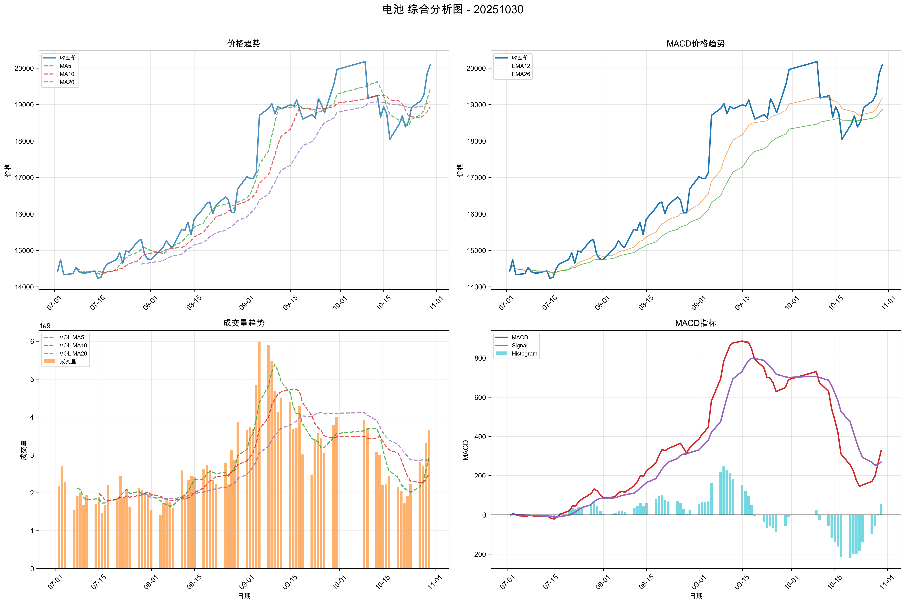

# 市场复盘报告 - 20251030

**生成时间**: 2025-10-30 20:52:38

## 📋 目录

- [📊 市场总结](#-市场总结)
  - [📈 市场情绪综合分析图](#-市场情绪综合分析图)
  - [情绪维度分析](#情绪维度分析)
  - [关键市场指标](#关键市场指标)
    - [市场活跃度](#市场活跃度)
    - [个股赚钱效应](#个股赚钱效应)
    - [风险偏好](#风险偏好)
    - [市场参与意愿](#市场参与意愿)
- [🏢 板块分析](#-板块分析)
- [🎯 个股分析](#-个股分析)
- [⚠️ 风险提示](#️-风险提示)

## 📊 市场总结

**综合情绪指数**: 4.00
**情绪等级**: 悲观

### 📈 市场情绪综合分析图

*图表说明：上图展示了20251030的市场情绪综合分析，包括雷达图和趋势分析。*

### 情绪维度分析

| 维度 | 分析结果 |
|------|----------|
| 市场活跃度 | 3.80 |
| 个股赚钱效应 | 3.80 |
| 风险偏好 | 5.10 |
| 市场参与意愿 | 3.20 |

### 关键市场指标

#### 市场活跃度
- **涨停股数量**: 62
- **上涨比例**: 22.79%
- **下跌比例**: 75.29%
- **平盘比例**: 1.68%

#### 个股赚钱效应
- **市场总成交金额**: 24,226 亿元
- **平均流通换手率**: 0.03%
- **各板块成交金额**:
  - 上证主板A: 8,090 亿元
  - 科创板: 2,613 亿元
  - 深证主板A: 7,067 亿元
  - 创业版: 6,455 亿元

#### 风险偏好
- **融资余额**: 24,885 亿元
- **融券余额**: 181 亿元
- **两融余额**: 25,066 亿元
- **平均维持担保比例**: 284.41%
- **两融余额占流通市值占比**: 2.57%

#### 市场参与意愿
- **大单净流入占比**: -1.83%
- **中单净流入占比**: 1.23%
- **小单净流入占比**: 3.33%
- **上证收盘价**: 3986.90
- **上证涨跌幅**: -0.73%

## 🏢 板块分析

### 📊 量价分析

#### 📈 买入信号板块

**信号数量**: 4个

| 排名 | 板块名称 | 量价关系 | 成交量 | 价格 |
|------|----------|----------|--------|------|
| 1 | 光伏设备 | 量增价升 | 98.74% | 4.26% |
| 2 | 能源金属 | 量增价升 | 71.99% | 3.46% |
| 3 | 钢铁 | 量增价升 | 55.28% | 1.45% |
| 4 | 电池 | 量增价升 | 10.58% | 1.23% |

#### 📉 卖出信号板块

**信号数量**: 11个

| 排名 | 板块名称 | 量价关系 | 成交量 | 价格 |
|------|----------|----------|--------|------|
| 1 | 塑料制品 | 量减价跌 | -10.80% | -1.64% |
| 2 | 电网设备 | 量减价跌 | -11.04% | -1.99% |
| 3 | 农化制品 | 量减价跌 | -13.80% | -1.16% |
| 4 | 元件 | 量减价跌 | -13.93% | -2.61% |
| 5 | 游戏 | 量减价跌 | -20.67% | -1.04% |
| 6 | 影视院线 | 量减价跌 | -24.31% | -1.16% |
| 7 | 互联网电商 | 量减价跌 | -24.67% | -1.87% |
| 8 | 综合 | 量减价跌 | -27.88% | -1.25% |
| 9 | 军工电子 | 量减价跌 | -39.74% | -1.13% |
| 10 | 煤炭开采加工 | 量减价跌 | -39.68% | -1.43% |
| 11 | 电子化学品 | 量减价跌 | -51.66% | -1.21% |

#### ➡️ 中性信号板块（TOP10）

**总数量**: 12个

| 排名 | 板块名称 | 量价关系 | 成交量 | 价格 |
|------|----------|----------|--------|------|
| 1 | 种植业与林业 | 量增价平 | 71.61% | -0.34% |
| 2 | 港口航运 | 量增价平 | 42.61% | 0.26% |
| 3 | 医药商业 | 量增价平 | 38.24% | 0.07% |
| 4 | 小金属 | 量增价平 | 35.20% | -0.06% |
| 5 | 金属新材料 | 量增价平 | 33.16% | -0.07% |
| 6 | 通信服务 | 量增价平 | 26.00% | -0.76% |
| 7 | 饮料制造 | 量增价平 | 17.73% | -0.55% |
| 8 | 电力 | 量增价平 | 14.65% | 0.65% |
| 9 | 电机 | 量增价平 | 12.85% | 0.00% |
| 10 | 环保设备 | 量增价平 | 12.86% | -0.68% |

### 📈 MACD分析

#### 📈 买入信号板块

**信号数量**: 3个

| 排名 | 板块名称 | MACD值 | 柱状图 | 信号强度 |
|------|----------|--------|--------|----------|
| 1 | 医药商业 | 1.1710 | 21.2042 | 22.3753 |
| 2 | 军工电子 | 1.9811 | 46.6827 | 48.6638 |
| 3 | 多元金融 | 1.3650 | 5.3607 | 6.7257 |

#### 📉 卖出信号板块

**信号数量**: 0个

✅ 暂无卖出信号板块

#### ➡️ 中性信号板块（TOP10）

**总数量**: 87个

| 排名 | 板块名称 | MACD值 | 柱状图 | 信号强度 |
|------|----------|--------|--------|----------|
| 1 | 油气开采及服务 | 20.1782 | 0.2297 | 10.2040 |
| 2 | 工程机械 | 29.5335 | 7.3146 | 18.4241 |
| 3 | 风电设备 | 79.9228 | -14.9222 | 9.4845 |
| 4 | 房地产 | 30.5720 | 0.9858 | 15.7789 |
| 5 | 石油加工贸易 | 25.7684 | 10.7325 | 18.2505 |
| 6 | 银行 | 5.7998 | 2.3014 | 4.0506 |
| 7 | 教育 | -22.3296 | 11.3341 | 3.3664 |
| 8 | 专用设备 | 77.0400 | 16.1599 | 46.5999 |
| 9 | 小家电 | -10.3822 | 22.6699 | 3.3052 |
| 10 | 电机 | 7.4120 | 6.4080 | 6.9100 |

### 📸 有买入信号板块综合分析图

**买入信号板块数量**: 7个（量价分析和MACD分析的并集）

#### 光伏设备

**量价信号**: BUY, **MACD信号**: HOLD, **综合信号强度**: 42.8681

#### 军工电子

**量价信号**: SELL, **MACD信号**: BUY, **综合信号强度**: 35.3896

#### 医药商业

**量价信号**: NEUTRAL, **MACD信号**: BUY, **综合信号强度**: 52.0473

#### 多元金融

**量价信号**: PANIC, **MACD信号**: BUY, **综合信号强度**: 22.6898

#### 电池

**量价信号**: BUY, **MACD信号**: HOLD, **综合信号强度**: 132.2856

#### 能源金属

**量价信号**: BUY, **MACD信号**: HOLD, **综合信号强度**: 259.0550

#### 钢铁

**量价信号**: BUY, **MACD信号**: HOLD, **综合信号强度**: 45.6380

## 🎯 个股分析

**趋势追踪策略分析**: 374只股票
**超跌反弹策略分析**: 374只股票
**分析板块数量**: 7个

**目标板块**: 能源金属, 电池, 医药商业, 钢铁, 光伏设备, 军工电子, 多元金融

## 📈 趋势追踪策略 - TOP10股票

| 排名 | 股票名称 | 信号类型 | 趋势状态 | 信号强度 | 最新价 | 趋势强度 |
| --- | --- | --- | --- | --- | --- | --- |
| 1 | 融捷股份 | STRONG_BUY | BULLISH | 100.0 | 48.20 | 1.00 |
| 2 | 大中矿业 | STRONG_BUY | BULLISH | 100.0 | 17.73 | 1.00 |
| 3 | 中国铝业 | STRONG_BUY | BULLISH | 100.0 | 10.31 | 1.00 |
| 4 | 常铝股份 | STRONG_BUY | BULLISH | 100.0 | 6.25 | 1.00 |
| 5 | 南山铝业 | STRONG_BUY | BULLISH | 100.0 | 4.75 | 1.00 |
| 6 | 浙江东方 | STRONG_BUY | BULLISH | 100.0 | 7.12 | 1.00 |
| 7 | 福达合金 | STRONG_BUY | BULLISH | 99.3 | 22.77 | 0.97 |
| 8 | 斯瑞新材 | STRONG_BUY | BULLISH | 99.2 | 20.02 | 0.96 |
| 9 | 芳源股份 | STRONG_BUY | BULLISH | 98.7 | 8.92 | 0.93 |
| 10 | 永兴材料 | STRONG_BUY | BULLISH | 98.0 | 45.82 | 0.90 |

### 详细分析

#### 1. 融捷股份

- **信号类型**: STRONG_BUY
- **趋势状态**: BULLISH
- **信号强度**: 100.0
- **最新收盘价**: 48.20

#### 2. 大中矿业

- **信号类型**: STRONG_BUY
- **趋势状态**: BULLISH
- **信号强度**: 100.0
- **最新收盘价**: 17.73

#### 3. 中国铝业

- **信号类型**: STRONG_BUY
- **趋势状态**: BULLISH
- **信号强度**: 100.0
- **最新收盘价**: 10.31

## 📉 超跌反弹策略 - TOP10股票

| 排名 | 股票名称 | 信号类型 | 超跌类型 | 信号强度 | 最新价 | 超跌强度 |
| --- | --- | --- | --- | --- | --- | --- |
| 1 | 精艺股份 | BUY | NORMAL_OVERSOLD | 52.6 | 12.42 | 0.38 |
| 2 | 豫光金铅 | BUY | NORMAL_OVERSOLD | 51.4 | 11.88 | 0.32 |
| 3 | 博威合金 | BUY | NORMAL_OVERSOLD | 49.9 | 21.94 | 0.25 |
| 4 | 兴业银锡 | BUY | NORMAL_OVERSOLD | 49.8 | 30.55 | 0.24 |
| 5 | 奥特维 | BUY | NORMAL_OVERSOLD | 49.7 | 42.42 | 0.24 |
| 6 | 容百科技 | BUY | NORMAL_OVERSOLD | 48.8 | 26.60 | 0.19 |
| 7 | 金博股份 | BUY | NORMAL_OVERSOLD | 48.7 | 30.89 | 0.18 |
| 8 | 永臻股份 | HOLD | NONE | 46.0 | 21.18 | 0.30 |
| 9 | 金杨股份 | BUY | RSI_REBOUND | 34.3 | 42.29 | 0.21 |
| 10 | 锦浪科技 | BUY | RSI_REBOUND | 34.1 | 80.00 | 0.20 |

### 详细分析

#### 1. 精艺股份

- **信号类型**: BUY
- **超跌类型**: NORMAL_OVERSOLD
- **信号强度**: 52.6
- **KDJ状态**: OVERSOLD
- **RSI状态**: OVERSOLD

#### 2. 豫光金铅

- **信号类型**: BUY
- **超跌类型**: NORMAL_OVERSOLD
- **信号强度**: 51.4
- **KDJ状态**: OVERSOLD
- **RSI状态**: OVERSOLD

#### 3. 博威合金

- **信号类型**: BUY
- **超跌类型**: NORMAL_OVERSOLD
- **信号强度**: 49.9
- **KDJ状态**: OVERSOLD
- **RSI状态**: OVERSOLD

## 📊 有买入信号股票分析图

以下展示了 106 只有买入信号股票的综合分析图（包含量价趋势图和MACD趋势图）：

### 德赛电池 (000049)

### 兴业银锡 (000426)

### 焦作万方 (000612)

### 金岭矿业 (000655)

### 国城矿业 (000688)

### 中信特钢 (000708)

### 西藏矿业 (000762)

### 新兴铸管 (000778)

### 云铝股份 (000807)

### 太钢不锈 (000825)

### 神火股份 (000933)

### 大中矿业 (001203)

### 海特高新 (002023)

### 横店东磁 (002056)

### 国轩高科 (002074)

### 罗平锌电 (002114)

### TCL中环 (002129)

### 通润装备 (002150)

### 常铝股份 (002160)

### 楚江新材 (002171)

### 融捷股份 (002192)

### 精艺股份 (002295)

### 宏创控股 (002379)

### 晶澳科技 (002459)

### 赣锋锂业 (002460)

### 天齐锂业 (002466)

### 常宝股份 (002478)

### 天山铝业 (002532)

### 亚太科技 (002540)

### 闽发铝业 (002578)

### 雄韬股份 (002733)

### 中矿资源 (002738)

### 永兴材料 (002756)

### 天际股份 (002759)

### 丰元股份 (002805)

### 顺博合金 (002996)

### 新宙邦 (300037)

### 欣旺达 (300207)

### 阳光电源 (300274)

### 天华新能 (300390)

### 鹏辉能源 (300438)

### 金银河 (300619)

### 迈为股份 (300751)

### 锦浪科技 (300763)

### 德方纳米 (300769)

### 翔丰华 (300890)

### 中一科技 (301150)

### 天力锂能 (301152)

### 通灵股份 (301168)

### 金杨股份 (301210)

### 宇邦新材 (301266)

### 湖南裕能 (301358)

### 中国卫星 (600118)

### 浙江东方 (600120)

### 南山铝业 (600219)

### 鄂尔多斯 (600295)

### 西藏珠峰 (600338)

### 江西铜业 (600362)

### 通威股份 (600438)

### 双良节能 (600481)

### 国网英大 (600517)

### 豫光金铅 (600531)

### 安阳钢铁 (600569)

### 中孚实业 (600595)

### 盛屯矿业 (600711)

### 宁波富邦 (600768)

### 万里股份 (600847)

### 江苏金租 (600901)

### 隆基绿能 (601012)

### 华钰矿业 (601020)

### 宝地矿业 (601121)

### 博威合金 (601137)

### 西部矿业 (601168)

### 怡球资源 (601388)

### 中国铝业 (601600)

### 明泰铝业 (601677)

### 友发集团 (601686)

### 海南矿业 (601969)

### 德新科技 (603032)

### 福达合金 (603045)

### 弘元绿能 (603185)

### 大参林 (603233)

### 天洋新材 (603330)

### 众源新材 (603527)

### 国晟科技 (603778)

### 鼎胜新材 (603876)

### 丽岛新材 (603937)

### 深圳新星 (603978)

### 容百科技 (688005)

### 天宜新材 (688033)

### 斯瑞新材 (688102)

### 西部超导 (688122)

### 芳源股份 (688148)

### 超卓航科 (688237)

### 航宇科技 (688239)

### 新锐股份 (688257)

### 万润新能 (688275)

### 嘉元科技 (688388)

### 阿特斯 (688472)

### 奥特维 (688516)

### 金博股份 (688598)

### 天合光能 (688599)

### 迈信林 (688685)

### 珠海冠宇 (688772)

### 厦钨新能 (688778)

### 贝特瑞 (920185)

## ⚠️ 风险提示

本报告仅供学习和研究使用，不构成投资建议。投资有风险，入市需谨慎。
